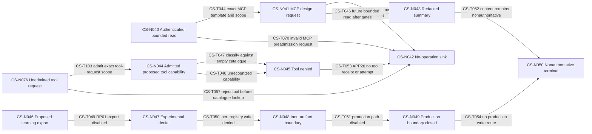

# A11 R59 candidate — Continuity v3 core semantic ADR set

Status: candidate architecture artifact; not accepted, activated, implemented, deployed, or operational

Task: A11 only

Owner role: Sol architecture authority

Normative profile: synthetic, primary-only, no-effects `HG3-RP01` with the accepted HG-1, HG-3, and HG-4 scopes

Private-system boundary: no private Zintus source, history, contract, data, configuration, or authority was used

### Failed R1/R2/R3/R4/R5/R6/R7/R8/R9/R10/R11/R12/R13/R14/R15/R16/R17/R18/R19/R20/R21/R22/R23/R24/R25/R26/R27/R28/R29/R30/R31/R32/R33/R34/R35/R36/R37/R38/R39/R40/R41/R42/R43/R44/R45/R46/R47/R48/R49/R50/R51/R52/R53/R54/R55/R56/R57/R58 history and R59 correction boundary

Exact failed R1 was `{path:
docs/architecture/core-semantic-adr-set-v3.md, size_bytes: 60233, lines: 701
including terminal LF, sha256:
2aa8bfce281e7fcf3fcd7a8306f12171191e87410ee60363012c5fa869d8f4c9,
mode: 0644}`. R1 completed Worker review and then stopped at Terra with HIGH
`A11-R1-TERRA-01` because R1 lacked a closed, scope-aware precedence contract
for resolving overlapping normative inputs, and MEDIUM
`A11-R1-TERRA-02` because `CS-BIND03` had ten data cells under a nine-column
header, shifting relationship, transition, invariant, source, test, and owner
bindings into the wrong columns. Security, Lean, final Chief, governance
acceptance, A11 completion, A12 selection, and every later stage were not
reached. R1 is ineffective; no R1 Worker result, review position, text,
topology, finding closure, hash, authority, task effect, or work carries into
R3.

Exact failed R2 was `{path:
docs/architecture/core-semantic-adr-set-v3.md, size_bytes: 67507, lines: 776
including terminal LF, sha256:
38b425d4fdd0705351daa9659938f05c4d4b663dbb7c12a0ac80d577f0c33f3e,
mode: 0644}`. R2 completed Worker review and then stopped at Terra with MEDIUM
`A11-R2-TERRA-01` because its failed-R1 history swapped the two exact finding
meanings: it assigned the `CS-BIND03` defect to HIGH
`A11-R1-TERRA-01` and the missing-precedence defect to MEDIUM
`A11-R1-TERRA-02`, contrary to the actual R1 review. Security, Lean, final
Chief, governance acceptance, A11 completion, A12 selection, and every later
stage were not reached. R2 is ineffective; no R2 Worker result, review
position, text, topology, finding closure, hash, authority, task effect, or
work carries into R3.

R3 is a provenance-only correction with these explicit closure mappings:

1. HIGH `A11-R1-TERRA-01` maps to the missing-precedence defect and is
   substantively closed by the already-existing, unchanged scope-aware
   governing prose, `CS-PREC01` through `CS-PREC08`, `CS-D17`,
   `CS-BIND17`, `CS-AT40`, `CS-TH30`, and `CS-XREF14`.
2. MEDIUM `A11-R1-TERRA-02` maps to the malformed-binding defect and is
   substantively closed by the already-existing, unchanged exact nine-cell
   `CS-BIND03` row plus the required programmatic nine-cell check of the
   header, separator, and every `CS-BIND01` through `CS-BIND17` row.
3. MEDIUM `A11-R2-TERRA-01` is closed only by preserving those two original
   IDs and meanings exactly in this history; it creates no alias, renumbering,
   carried review position, or substantive change.

R3 left everything substantive after its history byte-identical to R2.
Nevertheless, exact failed R3 was `{path:
docs/architecture/core-semantic-adr-set-v3.md, size_bytes: 68966, lines: 803
including terminal LF, sha256:
55ea61fed8294f035b495e3bd777426a28c0fe80c3e97c8e0e269917ef70fa49,
mode: 0644}`. R3 completed Worker review, received Terra PASS with zero
findings, received Security PASS with zero findings, and then stopped at Lean
with three HIGH findings:

- `A11-R3-LEAN-01`: the claimed precedence closure was partly nonnormative
  because the complete scope-binding, overlap, tier, and same-tier algorithm
  lived in prose that this artifact declared explanatory;
- `A11-R3-LEAN-02`: `CS-D12` required a receipt for every denial and prohibited
  reasons without distinguishing closed limitation codes, contradicting
  accepted A10's uniform unauthorized/cross-scope no-receipt rule and its
  permitted closed decision/outcome/limitation-code semantics; and
- `A11-R3-LEAN-03`: the conditional A00 semantic/temporal P0 proposal was
  converted into normative downstream truth without the required separate
  accepted delivery-scope transaction.

Final Chief, governance acceptance, A11 completion, A12 selection, and every
later stage were not reached. R3 is ineffective. No R3 Worker/Terra/Security
role, PASS, review position, finding closure, text, hash, semantic acceptance,
authority, task effect, or work carries into R4.

R4 closes only those findings in fresh candidate bytes: `A11-R3-LEAN-01`
through normative `CS-PREC00` and its bound oracle; `A11-R3-LEAN-02` through
the A10-governed exhaustive receipt-admission partition; and
`A11-R3-LEAN-03` through six-view scope-neutral semantics with delivery decided
only by a separate accepted scope transaction. No earlier PASS substitutes
for any R4 review role.

Exact failed R4 was `{path:
docs/architecture/core-semantic-adr-set-v3.md, size_bytes: 80848, lines: 846
including terminal LF, sha256:
a659eea2854795a4c74fb7a7ba579ab67c05ff1ac65c658bf00b9267fd27ebb6,
mode: 0644}`. R4 completed Worker review, received Terra PASS with zero
findings, received Security PASS with zero findings, and then stopped at Lean
with HIGH `A11-R4-LEAN-01` because its claimed exhaustive receipt partition
was terminal-only, narrowed accepted A10 successor-receipt lifecycle, and
misrouted a post-dispatch foreign result to a global no-receipt sink; and
MEDIUM `A11-R4-LEAN-02` because the complete mandatory A12/privacy handoff
lived in nonnumbered prose while numbered `CS-XREF13` carried only partial
scope. Final Chief, governance acceptance, A11 completion, A12 selection, and
every later stage were not reached.

R4 is ineffective. No R4 Worker/Terra/Security role, PASS, review position,
finding closure, text, hash, semantic acceptance, authority, task effect, or
work carries into R5. R5 closes `A11-R4-LEAN-01` by restoring A10 as exhaustive
owner of the complete receipt state/transition/applicability and successor
lifecycle while retaining only compatibility guardrails/examples here. R5
closes `A11-R4-LEAN-02` through numbered normative `CS-TH00`, full
`CS-XREF13`, `CS-BIND17`, and `CS-AT43`. No earlier PASS substitutes for any
R5 review role.

Exact failed R5 was `{path:
docs/architecture/core-semantic-adr-set-v3.md, size_bytes: 92898, lines: 894
including terminal LF, sha256:
31d053ab4b5ede06671f576aabed785d9714cc93879eaa4a63d1814ec2d5eb78,
mode: 0644}`. R5 completed Worker review, received Terra PASS with zero
findings, and then stopped at Security with five findings:

- HIGH `A11-R5-SEC-01`: the global failed-precondition fallback routed
  admitted-scope failures to `CS-ST30`/FL06 no-receipt behavior;
- MEDIUM `A11-R5-SEC-02`: the AS0 local pre-attempt receipt was unreachable
  and incorrectly reused already-allocated `CS-N013`;
- HIGH `A11-R5-SEC-03`: `CS-T053` issued a forbidden empty-catalogue
  A10-APP26 tool receipt;
- HIGH `A11-R5-SEC-04`: terminal redelivery shared the new-claim mutating path
  and underbound exact equality; and
- MEDIUM `A11-R5-SEC-05`: possible-send timeout, partial-stream, and
  lost-acknowledgement vectors in `CS-AT17` permitted false `failed` instead
  of mandatory `unknown` plus `possible_effect` and reconciliation.

Lean, final Chief, governance acceptance, A11 completion, A12 selection, and
every later stage were not reached. R5 is ineffective. No R5 Worker/Terra
role, PASS, review position, finding closure, text, hash, semantic acceptance,
authority, task effect, or work carries into R6.

R6 closes `A11-R5-SEC-01` with the closed disjoint `CS-FAIL` classifier,
preadmission-only `CS-ST30`, and explicit admitted-scope/later-use receipt
routes. It closes `A11-R5-SEC-02` with a reachable AS0 decision and receipt
terminal before attempt allocation. It closes `A11-R5-SEC-03` by making
A10-APP26 empty-catalogue tool classification forbid both receipt and attempt.
It closes `A11-R5-SEC-04` with disjoint fresh-claim, exact-terminal-redelivery,
and mismatch-conflict paths. It closes `A11-R5-SEC-05` by routing every
possible-send ambiguity to `unknown` plus `possible_effect` and mandatory
reconciliation while reserving `failed`/`cancelled` for positive evidence.
No earlier PASS substitutes for any R6 review role.

Exact failed R6 was `{path:
docs/architecture/core-semantic-adr-set-v3.md, size_bytes: 117656, lines: 990
including terminal LF, sha256:
9d8aebd676cd70026551342d03c3fde4f9b624cc675b291a2d1b3f6ac22880c4,
mode: 0644}`. R6 completed Worker review and then stopped at Terra with two
HIGH findings:

- `A11-R6-TERRA-01`: failure routes were source-unreachable—T016/N014
  positive-no-send was mapped to T015/T055 from N013, T001/N001 had no edge
  to ST30, and FAIL13 named no owning path; and
- `A11-R6-TERRA-02`: the classifier retained an invalid fallback/default and
  gaps for admitted claim-read ambiguity, MCP preadmission invalidity, and
  non-provider possible-send ambiguity.

Security, Lean, final Chief, governance acceptance, A11 completion, A12
selection, and every later stage were not reached. R6 is ineffective. No R6
Worker role, PASS, review position, finding closure, check, text, hash,
semantic acceptance, authority, task effect, or work carries into R7.

R7 closes both findings only through fresh bytes: explicit source-node routes
for every fallible case, a per-edge `CS-FEDGE001` through `CS-FEDGE065` audit,
closed exact `CS-FAIL` classes with no fallback/default/catch-all, and named
routes for N001 preadmission rejection, N014 positive-no-send, admitted
claim-read ambiguity, MCP preadmission invalidity, and non-provider
possible-effect reconciliation. No earlier PASS substitutes for R7 review.

Exact failed R7 was `{path:
docs/architecture/core-semantic-adr-set-v3.md, size_bytes: 133247, lines: 1112
including terminal LF, sha256:
650fa4498e2ce1076e33569ac2b0fa8eafe653264dc93ca9784e5945c9f4d04a,
mode: 0644}`. R7 completed Worker review, received Terra PASS with zero
findings, and then stopped at Security with four HIGH findings and one MEDIUM:

- HIGH `A11-R7-SEC-01`: fallible canonical mutations and receipt issuance were
  laundered as NF, leaving lost-ack commits outside `CS-FAIL00`, including
  T002, T021, T024, T037, T038, T039, and T043;
- HIGH `A11-R7-SEC-02`: wrong-scope canonical claim/idempotency commands had no
  source-valid preadmission route and could force lookup/oracle behavior;
- HIGH `A11-R7-SEC-03`: displayed preadmission tool route T057 was
  source-unreachable because N045 was reachable only after admitted
  T047/T048/FAIL12;
- HIGH `A11-R7-SEC-04`: T058 had no attempt-allocation uncertainty class, so
  ambiguous AS1 allocation could be laundered into AS0/no-attempt; and
- MEDIUM `A11-R7-SEC-05`: FAIL03 mapped one N013 predicate to both T015 and
  T055 without a disjoint selector or exactly-one receipt route.

Lean, final Chief, governance acceptance, A11 completion, A12 selection, and
all later stages were not reached. R7 is ineffective. No R7 Worker/Terra
role, PASS, verdict, finding position, check, closure, text, hash, semantic
acceptance, authority, task effect, or work carries into R8.

R8 closed those findings only through fresh initiated/confirmed/reconciling
canonical-act state machines, scope-first command/tool admission, allocation
intent reconciliation with exact cardinality, a deterministic FAIL03 route,
and a complete re-audit of every former NF row. No earlier PASS substitutes
for any R8 review role.

Exact failed R8 was `{path:
docs/architecture/core-semantic-adr-set-v3.md, size_bytes: 160848, lines: 1287
including terminal LF, sha256:
6ced74d728c2afcc8125db5b6379eda2853102c1b7453fc853af578e8a20bc30,
mode: 0644}`. R8 completed Worker review and then stopped at Terra with HIGH
`A11-R8-TERRA-01`: its seven repaired canonical acts did not close the durable
operation inventory. Durable publication T023, aggregate derivative purge
T041, and multiple A10 receipt append/sign/sequence operations—including
T015, T018, T055, T059, T060, T061, T065, and T067—still lacked complete
stable-intent, attempt, positive-confirmation, acknowledgement-ambiguity,
authoritative-reconciliation, and no-resend semantics. The R8 `NF` audit
therefore still permitted a missing acknowledgement to masquerade as
nonoccurrence or completion.

Security, Lean, final Chief, governance acceptance, A11 completion, A12
selection, and every later stage were not reached. R8 is ineffective. No R8
Worker role, PASS, verdict, review position, finding closure, check, text,
hash, semantic acceptance, authority, task effect, or work carries into R9.

R9 closes only this finding through a closed every-transition operation
inventory, explicit destination-acknowledged publication, independently
settled derivative classes, and one generic exact A10 receipt state machine
covering sequence allocation, canonical bytes, signing, append,
confirmation, ambiguity, and authoritative reconciliation. No earlier PASS
substitutes for any R9 review role.

Exact failed R9 was `{path:
docs/architecture/core-semantic-adr-set-v3.md, size_bytes: 216788, lines: 1631
including terminal LF, sha256:
7c6b0183d04733aa18c053317ed317ba70ab84655823647be8f368d0235dccf2,
mode: 0644}`. R9 completed Worker review, received Terra PASS with zero
findings, and then stopped at Security with HIGH `A11-R9-SEC-01`: the generic
receipt machine was first-receipt capable but not recursively
successor-capable. Applicable lifecycle/terminal states lacked a closed route
back through immutable predecessor/head binding and exact A10-T01 through
A10-T24 current×transition×successor legality. Later correction, deletion,
body-unavailability, reconciliation, supersession, and chains longer than two
could therefore bypass the exact sequence/bytes/sign/append protocol or had no
source-valid route.

Lean, final Chief, governance acceptance, A11 completion, A12 selection, and
every later stage were not reached. R9 is ineffective. No R9 Worker/Terra
role, PASS, verdict, review position, finding closure, check, text, hash,
semantic acceptance, authority, task effect, or work carries into R10.

R10 closes only this finding through a closed A10-T01 through A10-T24
legality relation, recursively reachable successor binding from every
applicable receipt-bearing state, immutable predecessor/head/fork guards, and
reuse of the exact generic receipt protocol for every successor. No earlier
PASS substitutes for any R10 review role.

Exact failed R10 was `{path:
docs/architecture/core-semantic-adr-set-v3.md, size_bytes: 234446, lines: 1764
including terminal LF, sha256:
263b82c9d6936300a907232be20b83d357806492495035f1a1445c6d7bead704,
mode: 0644}`. R10 completed Worker review and then stopped at Terra with HIGH
`A11-R10-TERRA-01`: T061 remained a legacy direct N054→N072 first-origin
receipt route. N054 already represented a confirmed `unknown` receipt after
T127/T128, so later reconciliation could bypass predecessor/head binding and
the exact A10-T22 successor gate. More generally, initial-receipt origins did
not first classify proven-no-prior-receipt, confirmed-receipt-bearing, and
ambiguous-receipt-existence cases.

Security, Lean, final Chief, governance acceptance, A11 completion, A12
selection, and later stages were not reached. R10 is ineffective. No R10
Worker role, PASS, verdict, review position, finding closure, check, text,
hash, semantic acceptance, authority, task effect, or work carries into R11.

R11 closes only this finding by making proven no-prior-receipt the sole
initial-origin route, confirmed receipt-bearing state successor-only, and
ambiguous existence reconciliation-only; N054 can propose only exact A10-T22
`unknown`→`superseded`. No earlier PASS substitutes for R11 review.

Exact failed R11 was `{path:
docs/architecture/core-semantic-adr-set-v3.md, size_bytes: 249611, lines: 1861
including terminal LF, sha256:
5947a8e77af9ca88d66fb0b72d690a07f236c1c5fecb6e52b4f511149c57953b,
mode: 0644}`. R11 completed Worker review and then stopped at Terra with HIGH
`A11-R11-TERRA-01`: its proven-no-prior T061 initial route entered N072
without first passing the exact A10 current×transition×successor legality
gate. A start receipt could therefore allocate identity/sequence, freeze
bytes, sign, or append before proving exactly one of A10-T01 through A10-T04;
T109 byte freezing was not a legality check.

Security, Lean, final Chief, governance acceptance, A11 completion, A12
selection, and later stages were not reached. R11 is ineffective. No R11
Worker role, PASS, verdict, review position, finding closure, check, text,
hash, semantic acceptance, authority, task effect, or work carries into R12.

R12 closes only this finding by routing proven-no-prior initial and every
confirmed receipt-bearing successor through the same exact closed A10
legality gate before N072 or any receipt identity, sequence, bytes, signing,
append, reconciliation, or confirmation operation. Start admits only exact
CS-A10T01-CS-A10T04; receipt-bearing successors admit only exact
CS-A10T05-CS-A10T24. No earlier PASS substitutes for R12 review.

Exact failed R12 was `{path:
docs/architecture/core-semantic-adr-set-v3.md, size_bytes: 259487, lines: 1885
including terminal LF, sha256:
6460c0e5a62c731eb6959e034025d53ddbb374dd65dcf84b6e423ca24fed0511,
mode: 0644}`. R12 completed Worker review and then stopped at Terra with HIGH
`A11-R12-TERRA-01`: T098 durably allocated a receipt sequence before T116
appended the receipt and advanced the canonical head. A crash, signing
failure, or abandoned append could therefore consume a sequence without a
receipt, violating contiguous append-only receipt sequencing. T157 also
modeled retry of that separate allocation instead of safe atomic-CAS
reconciliation.

Security, Lean, final Chief, governance acceptance, A11 completion, A12
selection, and later stages were not reached. R12 is ineffective. No R12
Worker role, PASS, verdict, review position, finding closure, check, text,
hash, semantic acceptance, authority, task effect, or work carries into R13.

R13 closes only this finding by making sequence `head+1` a nonauthoritative
candidate and making T116 one CockroachDB serializable CAS transaction that
revalidates head/predecessor/state/A10 legality and atomically allocates the
sequence, appends exact bytes/signature, and advances the head all-or-none.
Ambiguous outcomes reconcile by exact canonical lookup; unchanged positive
noncommit may retry exact bytes, while changed head discards the candidate and
rebinds the same logical intent only after positive proof. No earlier PASS
substitutes for R13 review.

Exact failed R13 was `{path:
docs/architecture/core-semantic-adr-set-v3.md, size_bytes: 264181, lines: 1913
including terminal LF, sha256:
446b5dc6d755c92a0f9afedd2f6c4e0b49de4613c3ee2c7f6d029347cd9bf477,
mode: 0644}`. R13 completed Worker review and then stopped at Terra with HIGH
`A11-R13-TERRA-01`: its exact-head read and `head+1` candidate model had no
typed authoritative empty-chain result. The first receipt therefore lacked a
source-valid genesis path, exact sequence-one semantics, and an atomic
create-head CAS; absence could be inferred or represented with synthetic
predecessor/head material.

Security, Lean, final Chief, governance acceptance, A11 completion, A12
selection, and later stages were not reached. R13 is ineffective. No R13
Worker role, PASS, verdict, review position, finding closure, check, text,
hash, semantic acceptance, authority, task effect, or work carries into R14.

R14 closes only this finding with a typed authoritative `EMPTY_HEAD` result
bound to the exact scope/chain key/version token and base-zero semantics.
Genesis binds sequence one, typed `NONE` predecessor, `current=start`, and
exact CS-A10T01-CS-A10T04. T116 atomically inserts that receipt and creates the
head only if the chain remains empty; concurrent genesis has one winner and
all losers reconcile without a second genesis. No earlier PASS substitutes
for R14 review.

Exact failed R14 was `{path:
docs/architecture/core-semantic-adr-set-v3.md, size_bytes: 263312, lines: 1955
including terminal LF, sha256:
f495c62010d84cb39962d83119d21d85602fb97ec7cc3ad1f1d7b9ea015d9c74,
mode: 0644}`. R14 completed Worker review and then stopped at Terra with HIGH
`A11-R14-TERRA-01`: T157 routed a positive-zero concurrent-genesis loser with
a changed head directly to N079/T098 candidate construction. That path did
not first classify the winning receipt as confirmed-bearing, evaluate whether
the retained logical intent was already satisfied, or pass any newly proposed
T05-T24 successor through N098/T154. It could therefore rewrite a failed
genesis proposal as though its original start/T01-T04/NONE bindings remained
current.

Security, Lean, final Chief, governance acceptance, A11 completion, A12
selection, and later stages were not reached. R14 is ineffective. No R14
Worker role, PASS, verdict, review position, finding closure, check, text,
hash, semantic acceptance, authority, task effect, or work carries into R15.

R15 closes only this finding by binding the winning receipt/head as a distinct
confirmed-bearing fact and classifying the retained logical intent into
exactly one outcome: already satisfied with no receipt, one uniquely mapped
T05-T24 successor proposal through N098/T154, conflict/manual, ambiguous, or
prohibited. The failed genesis tuple remains historical and immutable. No
earlier PASS substitutes for R15 review.

Exact failed R15 was `{path:
docs/architecture/core-semantic-adr-set-v3.md, size_bytes: 265140, lines: 2012
including terminal LF, sha256:
e71f7a86763827caaf9309daf80c950f6c81ab98d2215d6ff2e2cca234f958f2,
mode: 0644}`. R15 completed Worker review and then stopped at Terra with HIGH
`A11-R15-TERRA-01`: N108's five outgoing outcomes lacked disjoint normative
selectors. Prohibition, incomplete evidence, already-satisfied equivalence,
zero mappings, and multiple mappings could overlap; multiple legal mappings
had no distinct source-valid edge. Prose order could therefore behave like
unstated precedence or a default.

Security, Lean, final Chief, governance acceptance, A11 completion, A12
selection, and later stages were not reached. R15 is ineffective. No R15
Worker role, PASS, verdict, review position, finding closure, check, text,
hash, semantic acceptance, authority, task effect, or work carries into R16.

R16 closes only this finding with a simultaneous typed fact-vector partition,
explicit exclusions, no order/precedence/default, and a distinct multiple-
mapping manual outcome unless uniqueness is mechanically proven. Only the
unique legal mapping route may reach N098/T154. No earlier PASS substitutes
for R16 review.

Exact failed R16 was `{path:
docs/architecture/core-semantic-adr-set-v3.md, size_bytes: 274252, lines: 2055
including terminal LF, sha256:
56a803fb50b6e921a47cb7145aaf2d6d310a8985b753f9fbd89ff38dfe34b0ab,
mode: 0644}`. R16 completed Worker review and then stopped at Terra with HIGH
`A11-R16-TERRA-01`: CS-CHV selectors used `NA` without declaring that token in
their field domains or defining exact field applicability. The prose
normalization could therefore confuse not-applicable with
unknown/unavailable/conflicting or treat an undeclared synonym as a wildcard.
It did not mechanically enumerate the Cartesian product into valid reachable,
invalid-applicability, and impossible-invariant vectors.

Security, Lean, final Chief, governance acceptance, A11 completion, A12
selection, and later stages were not reached. R16 is ineffective. No R16
Worker role, PASS, verdict, review position, finding closure, check, text,
hash, semantic acceptance, authority, task effect, or work carries into R17.

R17 closes only this finding by declaring exact `NOT_APPLICABLE` tokens,
stage-specific applicability and short-circuit constraints, and a mechanical
Cartesian-product oracle. `NOT_APPLICABLE` is never uncertainty, absence,
conflict, or a wildcard. Every valid reachable vector selects exactly one
disposition; invalid-applicability and impossible-invariant vectors select
zero. No earlier PASS substitutes for R17 review.

Exact failed R17 was `{path:
docs/architecture/core-semantic-adr-set-v3.md, size_bytes: 279806, lines: 2080
including terminal LF, sha256:
df5eb62b89af4a979d4b7b8bcbc694ff7ebcd1617bb9c8dc16bf24b405fbd38c,
mode: 0644}`. R17 completed Worker review and Terra verification with zero
findings, then Security stopped with HIGH `A11-R17-SEC-01`: CHV03/T174 used
an `already-satisfied` value without a closed authoritative field-complete
equivalence contract. A coarse, cross-snapshot, stale, partial, normalized, or
attacker-controlled comparison could therefore suppress a required successor
receipt.

Lean, final Chief, governance acceptance, A11 completion, A12 selection, and
later stages were not reached. R17 is ineffective. No R17 Worker/Terra role,
PASS, verdict, review position, finding closure, check, text, hash, semantic
acceptance, authority, task effect, or work carries into R18.

R18 closes only this finding with a closed authoritative changed-head
equivalence register, one authenticated same-scope canonical snapshot query,
three-valued exact comparison, and source-valid failure routing. TRUE requires
every applicable field present and exactly equal; FALSE identifies at least
one authoritative positive mismatch; missing, stale, conflicting, malformed,
nonqueryable, or cross-snapshot input is UNRESOLVED. No earlier PASS
substitutes for R18 review.

Exact failed R18 was `{path:
docs/architecture/core-semantic-adr-set-v3.md, size_bytes: 290758, lines: 2157
including terminal LF, sha256:
ae789b45fffc16b409cfb37b4679ee8dc58756b575df23c604e4aaffaafc4cfe,
mode: 0644}`. R18 completed Worker review and then stopped at Terra with HIGH
`A11-R18-TERRA-01`: CS-EQV10 declared `predecessor_receipt_id` as a UUID,
contradicting authoritative A10-BIND31's 192-bit canonical ID. A low-128-bit,
truncated, overlength, or typed-null-confused comparison could therefore
produce false equality.

Security, Lean, final Chief, governance acceptance, A11 completion, A12
selection, and later stages were not reached. R18 is ineffective. No R18
Worker role, PASS, verdict, review position, finding closure, check, text,
hash, semantic acceptance, authority, task effect, or work carries into R19.

R19 closes only this finding by binding every EQV field to its authoritative
source row/clause, canonical type, width, encoding/order, applicability,
versions, owner, snapshot, fence, and exact equality. Receipt, chain, head,
predecessor, request, idempotency, body, and supersession receipt references
use exact 192-bit/24-byte source types where A10 defines them. No earlier PASS
substitutes for R19 review.

Exact failed R19 was `{path:
docs/architecture/core-semantic-adr-set-v3.md, size_bytes: 295316, lines: 2181
including terminal LF, sha256:
fe247149b010412329899641a3ce5682bc04351f3dc651e223da77fa3d92aedd,
mode: 0644}`. R19 completed Worker review and then stopped at Terra with HIGH
`A11-R19-TERRA-01`: CS-EQV06 cited nonexistent `A10-BIND52`, conflating
canonical key 52 with register row `A10-BIND62`, whose actual field is the
tool-only `tool_intent_binding`. The retained-intent identity therefore lacked
a valid normative source and could accidentally make a tool binding universal.

Security, Lean, final Chief, governance acceptance, A11 completion, A12
selection, and later stages were not reached. R19 is ineffective. No R19
Worker role, PASS, verdict, review position, finding closure, check, text,
hash, semantic acceptance, authority, task effect, or work carries into R20.

R20 closes only this finding with a deterministic typed retained-intent
composite and an exact citation grammar/resolver. Every citation must resolve
one existing normative artifact/register/row/key/field tuple and reproduce its
schema; ranges, numbering-gap inference, key/row conflation, and unsupported
self-authority are invalid. No earlier PASS substitutes for R20 review.

Exact failed R20 was `{path:
docs/architecture/core-semantic-adr-set-v3.md, size_bytes: 302830, lines: 2235
including terminal LF, sha256:
df8ef3fc3bdd958b66eb3ace91fe693a4dd10e9d3ab24434a33dcdd7588b776b,
mode: 0644}`. R20 completed Worker review and then stopped at Terra with HIGH
`A11-R20-TERRA-01`: CS-RIC14 was an open catchall for current, transition,
successor, continuation, and unspecified T161 inputs. It lacked an atomic
source/type/encoding/applicability contract and allowed undeclared inputs,
overlap, or implementation-dependent framing.

Security, Lean, final Chief, governance acceptance, A11 completion, A12
selection, and later stages were not reached. R20 is ineffective. No R20
Worker role, PASS, verdict, review position, finding closure, check, text,
hash, semantic acceptance, authority, task effect, or work carries into R21.

R21 closes only this finding with versioned `retained_intent/2`, atomic
components, and a closed T161 input manifest/coverage matrix. Every input maps
to one authoritative source, one RIC row, and one position; no catchall,
overlap, omission, wildcard, alias, or self-authority exists. No earlier PASS
substitutes for R21 review.

Exact failed R21 was `{path:
docs/architecture/core-semantic-adr-set-v3.md, size_bytes: 308734, lines: 2307
including terminal LF, sha256:
4303aed55e3ad47a9abc05577a7b08639e6dda126c33ff8488f56c7f7ba52afd,
mode: 0644}`. R21 completed Worker review and then stopped at Terra with HIGH
`A11-R21-TERRA-01`: TIM18/RIC18 treated CS-RLC01-RLC14 as continuation
selection authority even though those rows only constrain receipt lifecycle
semantics after a continuation is selected. No closed continuation vocabulary
or exhaustive origin/transition/stage/applicability selector existed.

Security, Lean, final Chief, governance acceptance, A11 completion, A12
selection, and later stages were not reached. R21 is ineffective. No R21
Worker role, PASS, verdict, review position, finding closure, check, text,
hash, semantic acceptance, authority, task effect, or work carries into R22.

R22 closes only this finding with a fixed-width versioned continuation-code
vocabulary and a disjoint exhaustive manifest. RLC01-RLC14 are post-selection
constraints only and never selectors. No earlier PASS substitutes for R22
review.

Exact failed R22 was `{path:
docs/architecture/core-semantic-adr-set-v3.md, size_bytes: 316623, lines: 2391
including terminal LF, sha256:
8b2aa98447cc579e6ff8bffc89217fb296b3bf74b6afa562eaedef8f0ecae347,
mode: 0644}`. R22 completed Worker review and then stopped at Terra with HIGH
`A11-R22-TERRA-01`: changed-head prohibition CCM19 also matched generic
prohibition CCM22. Because both emitted CCV18, an implementation could hide
the multiple selector match by deduplicating equal outputs, violating exact
row provenance and the no-priority rule.

Security, Lean, final Chief, governance acceptance, A11 completion, A12
selection, and later stages were not reached. R22 is ineffective. No R22
Worker role, PASS, verdict, review position, finding closure, check, text,
hash, semantic acceptance, authority, task effect, or work carries into R23.

R23 closes only this finding with explicit residual universes, exact selector
row identity plus output identity, a complete pairwise-intersection proof, and
total Cartesian coverage. Equal outputs never collapse multiple rows. No
earlier PASS substitutes for R23 review.

Exact failed R23 was `{path:
docs/architecture/core-semantic-adr-set-v3.md, size_bytes: 324272, lines: 2424
including terminal LF, sha256:
a3da1329e91a90427b90c3e54c0413204eddc4626d8dbe1232847a55fc6f5f3c,
mode: 0644}`. R23 completed Worker review and then stopped at Terra with HIGH
`A11-R23-TERRA-01`: CCM21 encoded authoritative lookup/provenance failure as
a selector predicate even though CCM00 declared the selector product to
contain only origin, transition, stage, applicability, and selector-schema
version. The claimed pairwise proof and Cartesian coverage therefore mixed an
undeclared precondition into the selector universe and could not establish
closed, reproducible disjointness.

Security, Lean, final Chief, governance acceptance, A11 completion, A12
selection, and later stages were not reached. R23 is ineffective. No R23
Worker role, PASS, verdict, review position, finding closure, check, text,
hash, semantic acceptance, authority, task effect, or work carries into R24.

R24 closes only this finding by classifying a closed, exact-one provenance
envelope before selector evaluation. Only
`VALID_CURRENT_SAME_SNAPSHOT` enters the five-field CCM product. Every other
envelope status takes the explicit T155/FEDGE155/OP155/FAIL22 unresolved-
provenance route and creates no selector match, CCM row ID, continuation code,
RIC18 value, T161 input, receipt identity, or candidate. CCM21 is retired and
has no current predicate. No earlier PASS substitutes for R24 review.

Exact failed R24 was `{path:
docs/architecture/core-semantic-adr-set-v3.md, size_bytes: 335139, lines: 2472
including terminal LF, sha256:
7a051b7ff93edf34364f403b4b9b58ec9be54319b7ebd1742fc9982245e03c98,
mode: 0644}`. R24 completed Worker review and then stopped at Terra with HIGH
`A11-R24-TERRA-01`: CSE01-CSE08 named statuses but did not define one closed
typed fact vector with exact domains and applicability for every selector.
In particular, MALFORMED, STALE, MIXED_SNAPSHOT, and dual-defect observations
could not be mechanically proven disjoint or exhaustive without implicit
wildcards, evaluation priority, or unstated normalization.

Security, Lean, final Chief, governance acceptance, A11 completion, A12
selection, and later stages were not reached. R24 is ineffective. No R24
Worker role, PASS, verdict, review position, finding closure, check, text,
hash, semantic acceptance, authority, task effect, or work carries into R25.

R25 closes only this finding with the closed 19-field CS-CSEF vector, exact
field domains and applicability, field-complete CSE selectors, a counted
Cartesian classification, all 28 status-selector intersections, and explicit
single/dual-defect adversarial rules. Only the unique all-valid CSE01 vector
may enter CCM. No earlier PASS substitutes for R25 review.

Exact failed R25 was `{path:
docs/architecture/core-semantic-adr-set-v3.md, size_bytes: 343914, lines: 2526
including terminal LF, sha256:
9e4635548c0a74da4c2b2efcc26528b9c499ba40e433f68306a766da1a9b7f74,
mode: 0644}`. R25 completed Worker review, received Terra PASS with zero
findings, and then stopped at Security with HIGH `A11-R25-SEC-01`: T154 and
RIC18 treated every reachable CCM row as receipt-bearing even though CCM18-20
and CCM22-24 explicitly represented already-satisfied/no-new-receipt,
prohibited, unresolved, or not-applicable outcomes. A selected nonreceipt row
could therefore enter N100/T161 and receipt machinery without an explicit
disposition gate.

Lean, final Chief, governance acceptance, A11 completion, A12 selection, and
later stages were not reached. R25 is ineffective. No R25 Worker/Terra role,
PASS, verdict, review position, finding closure, check, text, hash, semantic
acceptance, authority, task effect, or work carries into R26.

R26 closed only this finding with a closed continuation-disposition vocabulary,
an exact disposition on every current CCM row, a post-selection state that
owns row/token/disposition, one receipt-required T154 edge, and four explicit
nonreceipt routes with zero receipt cardinality and closed retry/manual rules.
It sealed as `{path:
docs/architecture/core-semantic-adr-set-v3.md, size_bytes: 344594,
lines: 2587,
sha256: e03bbf78da824f30f95ee8422d6297d6aeec4923397a3a31aa376c55bc9f9fb9,
mode: 0644}`. R26 completed Worker review and then stopped at Terra with HIGH
`A11-R26-TERRA-01`: CCM17 used post-selection T154 as a selector predicate,
creating a temporal cycle in which CCM selection required a consequence that
could exist only after CCM selection and CCD01 disposition.

Lean, Security, final Chief, governance acceptance, A11 completion, A12
selection, and later stages were not reached. R26 is ineffective. No R26
Worker role, PASS, verdict, review position, finding closure, check, text,
hash, semantic acceptance, authority, task effect, or work carries into R27.

R27 closed only this finding. Every CCM predicate was restricted to facts
available before T182; CCM17 uses only the source-valid T175 proposal, EQV
FALSE, CHV04, exact proposed A10T05-24 relation, current/successor facts, CSE01
envelope, scope, version, stage, and applicability. A closed temporal-phase
register names every producer, first-availability point, and consumer from CSE
through N072, proves CCM→CCD one-way, and rejects cycles or future-fact
selectors. It sealed as `{path:
docs/architecture/core-semantic-adr-set-v3.md, size_bytes: 357988,
lines: 2648,
sha256: 16caadc09e7a2806a1c3419f08cc8d3ac8d29266670d8a6d29b63c28cad2077d,
mode: 0644}`. R27 completed Worker review, received Terra PASS with zero
findings and Security PASS with zero findings, and then stopped at Lean with
HIGH `A11-R27-LEAN-01` and MEDIUM `A11-R27-LEAN-02`. CSE01 still said T154
could decode the five CCM fields, contradicting the temporal DAG and allowing
a post-selection gate to influence pre-T182 normalization. AT51 still asserted
the obsolete current count 181 instead of exact T001-T186 and did not require
generated key-set, contiguity, or endpoint parity including T182-T186.

Final Chief, governance acceptance, A11 completion, A12 selection, and later
stages were not reached. R27 is ineffective. No R27 Worker/Terra/Security role,
PASS, verdict, review position, finding closure, check, text, hash, semantic
acceptance, authority, task effect, or work carries into R28.

R28 closed only these findings. CSE01 authorizes construction of one normalized
five-field CCM vector at N098 on the source side of T182; T182 selects from
that vector and reaches N114; one-way CCD then classifies the selected row; and
only CCD01 permits the later T154 consequence. T154 cannot decode, normalize,
construct, select, influence, validate CCM, or feed T182. Generated current
key-set, contiguity, endpoint/source parity, stale-count, and temporal-phase
tests close the audit. It sealed as `{path:
docs/architecture/core-semantic-adr-set-v3.md, size_bytes: 367000,
lines: 2689,
sha256: 1efb1a33aaf95d4d5f088a371a9581f582b4c230e9af961fb12e8741dade004c,
mode: 0644}`. R28 completed Worker review and then stopped at Terra with HIGH
`A11-R28-TERRA-01`: post-T182 CCD mapping at N114 was fallible, but its
zero/multiple/unknown/mismatch outcomes still pointed backward to preselection
T155/FAIL22 and had no source-valid N114 failure edge or terminal state.

Security, Lean, final Chief, governance acceptance, A11 completion, A12
selection, and later stages were not reached. R28 is ineffective. No R28
Worker role, PASS, verdict, review position, finding closure, check, text,
hash, semantic acceptance, authority, task effect, or work carries into R29.

R29 closed only this finding. T187 routes postselection CCD mapping failure
from N114 to a dedicated manual terminal N115 while retaining the selected
row/token/version/CNV identity/provenance and exactly one closed failure class.
T155/FAIL22 are preselection-only. Valid CCD01→T154 and CCD02-05→T183-T186
remain disjoint from T187. Generated transition/edge/operation parity expands
to T001-T187, and every post-T182 fallible source is re-audited. It sealed as
`{path: docs/architecture/core-semantic-adr-set-v3.md, size_bytes: 374986,
lines: 2743,
sha256: 9a489413c8b37d7ede3d52cbcb6df5c5cf35faecb33709e1d2292570dbba2d7a,
mode: 0644}`. R29 completed Worker review and then stopped at Terra with HIGH
`A11-R29-TERRA-01`: CDF01-CDF04 named outcomes but did not define a closed
typed query/response fact vector, field domains/applicability, field-complete
selectors, or Cartesian/intersection proof. ZERO, MULTIPLE, UNKNOWN, and
MISMATCH could therefore overlap or be inferred from invalid evidence.

Security, Lean, final Chief, governance acceptance, A11 completion, A12
selection, and later stages were not reached. R29 is ineffective. No R29
Worker role, PASS, verdict, review position, finding closure, check, text,
hash, semantic acceptance, authority, task effect, or work carries into R30.

R30 closed only this finding. CDFV00-CDFV19 define the complete typed mapping
evidence vector and applicability rules. CDF selectors are simultaneous and
field-complete: authoritative valid empty is ZERO; fully valid MANY is
MULTIPLE; invalid/unresolved prerequisite is UNKNOWN; exactly one fully valid
current authenticated same-snapshot response with positive binding inequality
is MISMATCH; and exactly one fully equal response is the normal CCD path.
CDFC proves exact Cartesian/status/intersection counts and dual-defect
behavior. It sealed as `{path:
docs/architecture/core-semantic-adr-set-v3.md, size_bytes: 383189,
lines: 2803,
sha256: 68eee78641b99c289e5f5c35c69e0c9f67f612ece55718ccaa90386ac6da5b50,
mode: 0644}`. R30 completed Worker review and then stopped at Terra with HIGH
`A11-R30-TERRA-01`: the normal exact-one-equal outcome existed only in CDF00
classifier metadata, not as a numbered field-complete selector. UNKNOWN was
defined before MISMATCH and by excluding an unnamed normal vector, so
selector-row provenance, ordered residual construction, witnesses, and route
coverage were not closed.

Security, Lean, final Chief, governance acceptance, A11 completion, A12
selection, and later stages were not reached. R30 is ineffective. No R30
Worker role, PASS, verdict, review position, finding closure, check, text,
hash, semantic acceptance, authority, task effect, or work carries into R31.

R31 closed only this finding. CDF00 is classifier metadata only. CDF01 ZERO,
CDF02 MULTIPLE, CDF03 MISMATCH, and CDF04 NORMAL are named field-complete
selectors; CDF05 UNKNOWN is the exact residual after those four named
selectors. The normal row binds its selector-row provenance to the mapped CCD
route. MISMATCH remains one mapping response with a nonempty aggregate mismatch
set, not cardinality MANY. Counts, pairs, intersections, gaps, witnesses, and
routes are recomputed over the five numbered selectors. It sealed as `{path:
docs/architecture/core-semantic-adr-set-v3.md, size_bytes: 389039,
lines: 2830, sha256:
9922849a3804c15e8d6c7767835f05b79ebcbc97af5bcbbfd8de588d15d8a260,
mode: 0644}`. R31 completed Worker and Terra review and then stopped at
Security with HIGH `A11-R31-SEC-01`: malformed, omitted, duplicate, extra, or
unregistered raw mapping-envelope fields were outside the typed CDFV universe,
but no separate source-valid raw-envelope failure selector and N114 failure
edge closed that pre-typing path.

Final Chief, governance acceptance, A11 completion, A12 selection, and later
stages were not reached. R31 is ineffective. No R31 Worker/Terra/Security role,
PASS, verdict, review position, finding closure, check, text, hash, semantic
acceptance, authority, task effect, or work carries into R32.

R32 closed only this finding. A separate canonical raw-envelope validator runs
at N114 before CDFV construction. An exact 19-field raw schema and closed defect
vocabulary produce either one valid raw pass token or one nonempty ordered
multi-defect `RFS01` selector outside CDF. Raw failure takes T188/FAIL30 to
N115 without requiring or permitting a typed vector; raw success alone may
construct CDFV and reach the unchanged typed CDF partition. T187 typed failure
and T188 raw failure are tagged, disjoint, exhaustive over their respective
stages, and share no receipt or effect path. No earlier PASS substitutes for
R32 review. It sealed as `{path:
docs/architecture/core-semantic-adr-set-v3.md, size_bytes: 408604,
lines: 2921, sha256:
dbc56693bec96a698095554466983134c57d7817c76d0f7be9e9b813ec9139a5,
mode: 0644}`. R32 completed Worker and Terra review and then stopped at
Security with HIGH `A11-R32-SEC-01`: RDEF14/RDEF15 external binding defects
shared ordinal 0, null offset, rank, type, and commitment fields but lacked an
atomic binding-component identity. Equal invalid bytes for owner, scope,
snapshot, or another binding could therefore collapse during deduplication and
erase distinct security-relevant defects.

Final Chief, governance acceptance, A11 completion, A12 selection, and later
stages were not reached. R32 is ineffective. No R32 Worker/Terra/Security role,
PASS, verdict, review position, finding closure, check, text, hash, semantic
acceptance, authority, task effect, or work carries into R33.

R33 closes only this finding. RDEF schema v2 adds a closed atomic
`binding_component_id` to the canonical six-key observation, defines exact
component/ordinal/offset applicability, domain-separates commitments by
component, and sorts/deduplicates only complete v2 tuples. Distinct external
components and distinct ranks are retained even when observed bytes match.
Unknown components, old/mixed schema tuples, incompatible component/rank/
ordinal/offset combinations, and noncanonical encodings reject the whole raw
result. Cross-validator fixtures pin exact frames, commitments, sorted tuple
bytes, and set digest. T001-T188 and every R32 route and typed count remain
unchanged. No earlier PASS substitutes for R33 review.

Exact failed R33 was `{path:
docs/architecture/core-semantic-adr-set-v3.md, size_bytes: 426973,
lines: 3002, sha256:
82851dab5affe22bdc7f948ffd99a82c8c926cff6fcbf4a5cc04c54d2d338674,
mode: 0644}`. R33 completed Worker review and then stopped at Terra with HIGH
`A11-R33-TERRA-01`: old, mixed, unknown, incompatible, or otherwise invalid
pre-RFS validator output was correctly denied RFS00/RFS01 but had no
source-valid N114 terminal edge or bounded retained result. The architecture
therefore left a fallible postselection rejection without complete failure
handling.

Final Chief, governance acceptance, A11 completion, A12 selection, and later
stages were not reached. R33 is ineffective. No R33 Worker/Terra role, PASS,
verdict, review position, finding closure, check, text, hash, semantic
acceptance, authority, task effect, or work carries into R34.

R34 closes only this finding. A trusted validator wrapper, outside RDEF and
RFS, classifies every invalid pre-RFS result with a closed wrapper-owned code
set and bounded trusted provenance. It never accepts attacker-provided enums,
canonicalizes rejected material, constructs an RDEF/RFS result, or chooses
arbitrarily among conflicting forms. T189/FAIL31 terminates that result at
N115 with zero typed vector, receipt, retry, or effect. N114 now has an
exact-one partition among valid-v2 RFS01/T188, wrapper rejection/T189, and
raw-pass typed classification. T001-T188, every R33 cryptographic fixture,
and the typed partition remain unchanged. No earlier PASS substitutes for R34
review.

Exact failed R34 was `{path:
docs/architecture/core-semantic-adr-set-v3.md, size_bytes: 442099,
lines: 3066, sha256:
2c2b008ff6a23e03a9b551872c628969d000289a432f4bbe769bfb6875a417d7,
mode: 0644}`. R34 completed Worker and Terra review and then stopped at
Security with HIGH `A11-R34-SEC-01`: RWR01 referred to exact trusted registry
values and bounded trusted sources without defining a closed literal
CURRENT_ALLOWED wrapper/validator tuple, authoritative registry source,
canonical source frames, or complete raw/decoded/canonical bounds. A
deployment could therefore configure or substitute a different runtime,
digest, compatibility relation, or limit while still claiming the trusted
path.

Final Chief, governance acceptance, A11 completion, A12 selection, and later
stages were not reached. R34 is ineffective. No R34 Worker/Terra/Security
role, PASS, verdict, review position, finding closure, check, text, hash,
semantic acceptance, authority, task effect, or work carries into R35.

R35 closes only this finding. A closed versioned trusted-runtime registry pins
one literal CURRENT_ALLOWED wrapper/validator/config/profile/status tuple and
its manifest bytes/digest. Five trusted commitment sources now have exact
canonical frames, literal raw/decoded/canonical bounds, byte-equality,
overflow, trailing-byte, minimal-encoding, and no-decompression rules.
RWR schema v2 binds all commitments and the aggregate trust decision to that
registry manifest. Old, future, unknown, mismatched, revoked, substituted, or
nonliteral tuples, every source/frame/bound failure, and every other pre-RFS
rejection include RWR18 and take T189 without downgrade, substitution, or
configurable limits. Golden fixtures pin exact
frames, lengths, commitments, and aggregate decision. T001-T189 and every
unrelated R34 semantic route remain unchanged. No earlier PASS substitutes
for R35 review.

Exact failed R35 was `{path:
docs/architecture/core-semantic-adr-set-v3.md, size_bytes: 464584,
lines: 3132, sha256:
fae03ea62e0c21c64bdd70214a2fdf19cc5eda8c5ed02aeb8645d3e7541d0c9d,
mode: 0644}`. R35 completed Worker review and then stopped at Terra with HIGH
`A11-R35-TERRA-01`: RWR01 made `trust_decision_digest` present when all five
sources were valid but did not also require the literal registry, registry
metadata, status, profile, configuration, and complete RTR04 result to be
valid. A registry-only failure could therefore retain a non-null aggregate
digest, and the contract did not pin a noncircular temporal order or exact
present/null representations for the aggregate and five distinct source
commitments.

Security, final Chief, governance acceptance, A11 completion, A12 selection,
and later stages were not reached. R35 is ineffective. No R35 Worker/Terra
role, PASS, verdict, review position, finding closure, check, text, hash,
semantic acceptance, authority, task effect, or work carries into R36.

R36 closes only this finding. Registry validation completes before immutable
metadata binding; metadata completes before five independently represented
source commitments; RTR04 evaluates only those prior facts; and RGX07 runs
only after the complete trust precondition passes. The externally visible
`TRUSTED_CURRENT_VALID` token and present aggregate digest are emitted
atomically after deterministic RGX07 reproduction. The aggregate is present
if and only if that complete token exists; every other class uses exact
typed-null plus RWR18/T189. Registry-only failures cannot evaluate or retain
source commitments, source fields never alias one another or the aggregate,
and neither the aggregate nor RWR output is an RTR04 input. Valid RGX07 golden
bytes, T001-T189, and every unrelated R35 semantic route remain unchanged. No
earlier PASS substitutes for R36 review.

Exact failed R36 was `{path:
docs/architecture/core-semantic-adr-set-v3.md, size_bytes: 481570,
lines: 3179, sha256:
e54ce5b346960cdb4a404e855ed550a3854b99fae043a744ccb244c7da37d143,
mode: 0644}`. R36 completed Worker review and then stopped at Terra with HIGH
`A11-R36-TERRA-01`: rejection rows required mandatory RWR18 plus an
“applicable bit” or “result bit” in the singular, without a closed
simultaneous predicate vector, bit allocation, compatibility oracle, or
canonical complete-set derivation. A result with multiple independently true
defects could therefore retain one selected reason and suppress the others;
pass, zero-mask, reserved-bit, truncated-mask, and incomplete-mask
representations were also not completely disjoint.

Security, final Chief, governance acceptance, A11 completion, A12 selection,
and later stages were not reached. R36 is ineffective. No R36 Worker/Terra
role, PASS, verdict, review position, finding closure, check, text, hash,
semantic acceptance, authority, task effect, or work carries into R37.

R37 closes only this finding. Every rejection now derives one canonical
nonempty set containing mandatory RWR18 and every simultaneously true,
applicable RWR02-RWR17/RWR19/RWR20 predicate. Fixed bit positions, a four-byte
big-endian encoding, reserved-zero rules, predicate applicability, pair and
higher-order compatibility, deterministic no-suppression derivation,
pass/rejection separation, fail-safe reconstruction, and single/double/multi
golden masks remove primary-reason selection. RWR04+RWR05 co-occur for
conflicting multiple forms, together with every other true bounded defect.
R36 digest applicability, valid RGX07 bytes, T001-T189, and every unrelated
R36 semantic route remain unchanged. No earlier PASS substitutes for R37
review.

Exact failed R37 was `{path:
docs/architecture/core-semantic-adr-set-v3.md, size_bytes: 495713,
lines: 3228, sha256:
5df816e572373e01a741755e1b010e9b9bb9c0b2a2d7864a382be5a9611101d9,
mode: 0644}`. R37 completed Worker and Terra review and then stopped at
Security with MEDIUM `A11-R37-SEC-01`: RWB allowed `FALSE` or `NA` in several
stage-dependent positions without a closed evaluation-stage/result-form
product that selected exactly one token for every P02-P20 position. In
particular early trust failure, unavailable execution, and later
zero/one/multiple forms did not have exhaustive exact vectors or named
impossible stage/form pairs. The vector also lacked one canonical fixed-width
encoding and commitment bound to stage, form, mask, registry, and request, so
a valid R37 mask could be paired with a swapped or stage-inconsistent vector.

Terra acceptance, final Chief, governance acceptance, A11 completion, A12
selection, and later stages were not reached. R37 is ineffective. No R37
Worker/Terra role, PASS, verdict, review position, finding closure, check,
text, hash, semantic acceptance, authority, task effect, or work carries into
R38.

R38 closes only this finding. It defines closed evaluation-stage and
result-form registers, an exhaustive reachable product with named impossible
pairs, and exact ordered P02-P20 tokens for every rejection class. Early trust
failures use `NOT_EVALUATED`; unavailable execution makes P19 exactly TRUE;
zero, one, multiple, and pass forms have disjoint guards. A mask bit exists if
and only if its predicate token is TRUE. One fixed 19-byte vector encoding and
SHA-256 commitment bind stage, form, mask, the literal registry tuple and
manifest, and an immutable request-binding digest. Exact goldens and negative
tests close token, stage/form, encoding, commitment, and binding substitution.
All R37 masks, R36 digest applicability, valid R33/R35 cryptography,
T001-T189, zero receipt/effect reachability, and every unrelated R37 semantic
route remain unchanged. No earlier PASS substitutes for R38 review.

Exact failed R38 was `{path:
docs/architecture/core-semantic-adr-set-v3.md, size_bytes: 509140,
lines: 3319, sha256:
36f6f84399ad511be222ee1283df10c340464924f129211bc0e6d0da045f5b67,
mode: 0644}`. R38 completed Worker review and then stopped at Terra with HIGH
`A11-R38-TERRA-01`: the stage/form matrix had no distinct result for a
positively completed invocation that returned material whose canonical form
count could not be established. RWM08 forced completed material into ZERO
after claiming enough framing to establish zero, while RWM07 UNAVAILABLE
required no positive completion. An implementation could therefore
misclassify indeterminate-count material as unavailable, zero, a later
post-count framing defect, or an arbitrary ONE/MULTIPLE branch. No exact
typed-null count reason or golden observation commitment closed that gap.

Security, Lean, final Chief, governance acceptance, A11 completion, A12
selection, and later stages were not reached. R38 is ineffective. No R38
Worker/Terra role, PASS, verdict, review position, finding closure, check,
text, hash, semantic acceptance, authority, task effect, or work carries into
R39.

R39 closes only this finding. A distinct completed-result/count-indeterminate
stage and form require positive completion, at least one returned material
byte, failure to establish a canonical finite form count, exact P02/P18 TRUE,
P03-P17 NA, P19 FALSE, and a typed-null `COUNT_INDETERMINATE` count. It is
disjoint from pre-result, unavailable execution, established ZERO/ONE/
MULTIPLE, accepted results, and malformed content after a count was already
established. RWM08 ZERO and RWM09/RWM10 ONE/MULTIPLE remain exact and
disjoint. Canonical masks, T189 routing, bounded material observation
commitment, RVE goldens, the complete stage×form product, and gap/intersection
tests are regenerated. All R38 and R37 masks outside the new class, R36
digest applicability, R33/R35 cryptography, T001-T189, zero receipt/effect
reachability, and unrelated R38 semantics remain unchanged. No earlier PASS
substitutes for R39 review.

Exact failed R39 was `{path:
docs/architecture/core-semantic-adr-set-v3.md, size_bytes: 519626,
lines: 3362, sha256:
5dba431008477ce2b8cce5672c87026b808ab9aea203b33d8d45dacb18933b6e,
mode: 0644}`. R39 completed Worker review and then stopped at Terra with HIGH
`A11-R39-TERRA-01`: its material-bearing count-indeterminate class required
one or more returned bytes, but the schema had no closed material-observation
state and no distinct class for a positively completed execution whose
result channel was observed PRESENT_EMPTY while canonical count remained
indeterminate. An implementation could collapse that case into unavailable,
ZERO without authoritative count, the R39 PRESENT_NONEMPTY class, or an
arbitrary later form. The empty observation also lacked a canonical
commitment binding channel, execution, completion, completion token, zero
length, empty bytes, and request context.

Security, Lean, final Chief, governance acceptance, A11 completion, A12
selection, and later stages were not reached. R39 is ineffective. No R39
Worker/Terra role, PASS, verdict, review position, finding closure, check,
text, hash, semantic acceptance, authority, task effect, or work carries into
R40.

R40 closes only this finding. A closed material-observation register separates
NOT_OBSERVED, UNAVAILABLE, PRESENT_EMPTY, and PRESENT_NONEMPTY. A distinct
completed/PRESENT_EMPTY/count-indeterminate stage and form require positive
completion, authoritative observation of the empty result channel, no
material bytes, inability to establish count, exact P02/P18 TRUE, P03-P17
NA, P19 FALSE, and typed-null `INDETERMINATE_NO_MATERIAL`. Its canonical
observation commitment binds the channel, execution state, completion state,
exact completion token, zero length, empty bytes, and immutable request
context. ZERO remains possible only after authoritative count zero; R39
PRESENT_NONEMPTY remains length at least one. Products, goldens, dependencies,
and tests are regenerated without changing T001-T189 or any receipt/effect
reachability. No earlier PASS substitutes for R40 review.

Exact failed R40 was `{path:
docs/architecture/core-semantic-adr-set-v3.md, size_bytes: 534045,
lines: 3413, sha256:
5052f274e567457e1148a349a9835f4e86602096ddec31d857244ab70145c0e4,
mode: 0644}`. R40 completed Worker review and then stopped at Terra with HIGH
`A11-R40-TERRA-01`: its canonical material-observation commitment was
mandatory for the new RWM14 PRESENT_EMPTY/count-indeterminate row and the R39
RWM13 PRESENT_NONEMPTY row, but the schema did not make the same evidence
total for rejecting authoritative ZERO/ONE/MULTIPLE rows RWM08-RWM10.
Nonpresent rejection rows also used informal absence instead of one exact
typed-absent representation. A present-material rejection could therefore
omit or null its commitment, reuse a digest without its row/count/form/vector
lineage, or make material evidence incomparable across reachable rows.

Security, Lean, final Chief, governance acceptance, A11 completion, A12
selection, and later stages were not reached. R40 is ineffective. No R40
Worker/Terra role, PASS, verdict, review position, finding closure, check,
text, hash, semantic acceptance, authority, task effect, or work carries into
R41.

R41 closes only this finding. Every wrapper rejection with PRESENT_EMPTY or
PRESENT_NONEMPTY now requires a non-null canonical material-observation
commitment; every rejection with NOT_OBSERVED or UNAVAILABLE carries the sole
typed-absent value. A closed row×material matrix names all reachable and
impossible combinations. ZERO, ONE, MULTIPLE, both count-indeterminate
classes, early trust rejection, and unavailable execution receive exact
goldens. The observation commitment proves material only; exact
row/stage/form/count/vector lineage remains mandatory and determines
cardinality. RWM13/RWM14 observation and vector bytes remain unchanged.
T001-T189 and zero receipt/effect reachability remain unchanged. No earlier
PASS substitutes for R41 review.

Exact failed R41 was `{path:
docs/architecture/core-semantic-adr-set-v3.md, size_bytes: 535060,
lines: 3460 including terminal LF, sha256:
a0abbeeceafea2772b890620ea735feaf6d9e682b809e2f29ec8610b5069817c,
mode: 0644}`. R41 completed Worker and Terra review and then stopped at
Security with sole MEDIUM `A11-R41-SEC-01`: R41 committed individual
rejection components, but had no single authenticated outer commitment over
every meaning-bearing rejection field. Consequently a valid field,
commitment, vector, mask, identity, scope, lineage item, or row discriminator
could be transplanted between otherwise valid rejection records without one
trusted wrapper-authenticated object proving their joint membership.

Lean, final Chief, governance acceptance, A11 completion, A12 selection, and
later stages were not reached. R41 is ineffective. No R41 Worker/Terra role,
PASS, verdict, review position, finding closure, check, text, hash, semantic
acceptance, authority, task effect, or work carries into R42.

R42 closes only `A11-R41-SEC-01`. It adds the versioned `RWR01-v7` result and
one canonical, fixed-digest, trusted-wrapper-authenticated outer aggregate
whose exact-once coverage includes every semantically carried rejection
field. The aggregate binds registry, wrapper, validator, request, scope,
query, response, selection, snapshot, fence, epoch, lineage, raw evidence,
stage, form, RMO, RMC, RWM, count/material unions, rejected-frame evidence,
RVE vector/commitment/mask, and their exact applicability. T189 independently
recomputes the aggregate and verifies its authentication before admitting the
rejection. v6 and every unknown version fail closed. RVE02 remains the narrow
inner vector commitment and is not misrepresented as full-record integrity.
All R41 inner bytes, T001-T189 topology, and zero receipt/effect reachability
remain unchanged. No earlier PASS substitutes for R42 review.

Exact failed R42 was `{path:
docs/architecture/core-semantic-adr-set-v3.md, size_bytes: 544268,
lines: 3510 including terminal LF, sha256:
7698e2f4dd987dd990d1fb92a0370449a0fed8ef6abd43d3cdc59879eab4984c,
mode: 0644}`. R42 completed Worker review and then stopped at Terra with sole
HIGH `A11-R42-TERRA-01`: RAC10 published frame lengths, digests, and tags
without a field-by-field exact construction proof or complete frame/auth
bytes, and its six displayed digest/tag pairs were stale. A consumer could
not reproduce the alleged goldens solely from the numbered contract, so the
vectors did not prove the new authenticated aggregate.

Security, Lean, final Chief, governance acceptance, A11 completion, A12
selection, and later stages were not reached. R42 is ineffective. No R42
Worker role, PASS, verdict, review position, finding closure, check, text,
hash, semantic acceptance, authority, task effect, or work carries into R43.

R43 closes only `A11-R42-TERRA-01` without changing RWR01-v7 or RAC schema
semantics. Two independent implementations—Node.js using `Buffer`/`crypto`
and Python using `struct`/`hashlib`/`hmac`—reconstruct all six fixtures from
literal semantic fields with no shared serialized intermediate and agree
byte-for-byte. RAC10 now carries the corrected digests/tags. The following
mechanical construction ledger publishes every field's ordinal, source,
type, applicability tag, length, complete value hex, entry/value offsets,
exclusive end/cumulative length, plus complete frame and authentication
bytes. Mutation and reproduction assertions consume these bytes. T001-T189,
all R42 semantics, and zero receipt/effect reachability remain unchanged.
No earlier PASS substitutes for R43 review.

Exact failed R43 was `{path:
docs/architecture/core-semantic-adr-set-v3.md, size_bytes: 597437,
lines: 3808 including terminal LF, sha256:
ad16f7955770ebbd2e99d381bb56d7fbfa73ff8062d6006f8e5d234510e6c6eb,
mode: 0644}`. R43 completed Worker review and then stopped at Terra with sole
HIGH `A11-R43-TERRA-01`: `CS-FEDGE189` still required obsolete RWR01 v6 and
omitted RAC-v1 recomputation/equality, trusted-wrapper authentication, and
current binding checks. The fallible-edge register therefore contradicted
RAC08, T189, OP189, and every current consumer, leaving endpoint eligibility
version-incoherent despite correct R43 fixture bytes.

Security, Lean, final Chief, governance acceptance, A11 completion, A12
selection, and later stages were not reached. R43 is ineffective. No R43
Worker role, PASS, verdict, review position, finding closure, check, text,
hash, semantic acceptance, authority, task effect, or work carries into R44.

R44 closes only `A11-R43-TERRA-01`. RAC08 now emits one exact current
eligibility predicate consumed identically by FEDGE189, T189, OP189, and
current route consumers: RWR01-v7 plus RAC-v1, independently reconstructed
frame/length/digest equality, trusted-wrapper authentication, and current
request/registry/key/snapshot/fence/epoch/lineage bindings. v6, mixed,
missing-RAC, stale, unknown, and future combinations are ineligible.
Mechanical endpoint parity and exhaustive version-product tests are added.
RWR01-v7/RAC-v1 schemas, T/FEDGE/OP topology 001-189, all 246 ledger rows,
all six complete fixture/auth byte strings, and zero receipt/effect
reachability remain unchanged. No earlier PASS substitutes for R44 review.

Exact failed R44 was `{path:
docs/architecture/core-semantic-adr-set-v3.md, size_bytes: 599424,
lines: 3838 including terminal LF, sha256:
b1b49cba7ca106d310d854fe967e8457841b588a4c6a0d180c65c8ad9711432b,
mode: 0644}`. R44 completed Worker review and then stopped at Terra with sole
HIGH `A11-R44-TERRA-01`: RAC08 named six purportedly disjoint ineligible
classes but did not define closed predicates, strict stage reachability,
first-failure priority, later-stage NOT_EVALUATED semantics, or an exact
classification record/commitment. Multi-defect records could therefore match
several residuals, making endpoint eligibility and audit evidence ambiguous.

Security, Lean, final Chief, governance acceptance, A11 completion, A12
selection, and later stages were not reached. R44 is ineffective. No R44
Worker role, PASS, verdict, review position, finding closure, check, text,
hash, semantic acceptance, authority, task effect, or work carries into R45.

R45 closes only `A11-R44-TERRA-01`. RAC08 is a closed six-stage,
first-failure pipeline. Each stage has one exact residual predicate; later
stages are NOT_EVALUATED after the first failure; the all-pass complement
alone emits the unchanged eligibility token. One canonical classification
record and commitment bind the input-state codes, six stage outcomes,
first-failure code, eligibility outcome, and current-record binding.
Mechanical product, pairwise-disjointness, exhaustiveness, impossible-state,
multi-defect, and order-independence tests are added. RWR01-v7/RAC-v1
schemas, eligibility meaning, T/FEDGE/OP001-189 topology, all 246 ledger rows,
all six complete fixture/auth bytes, and zero receipt/effect reachability
remain unchanged. No earlier PASS substitutes for R45 review.

Exact failed R45 was `{path:
docs/architecture/core-semantic-adr-set-v3.md, size_bytes: 604217,
lines: 3869 including terminal LF, sha256:
7817c3c037820ac82fdd0949bba2bf0a2f0947149ba2d814e22bb811c7ded106,
mode: 0644}`. R45 completed Worker and Terra review and then stopped at
Security with sole HIGH `A11-R45-SEC-01`: the six canonical RAC08 residual
classifications were barred from T189/N115 but had no closed terminal edge.
An implementation could drop them, retry, repair, reclassify, or retain
unbounded attacker material rather than producing one bounded auditable
failure outcome.

Lean, final Chief, governance acceptance, A11 completion, A12 selection, and
later stages were not reached. R45 is ineffective. No R45 Worker/Terra role,
PASS, verdict, review position, finding closure, check, text, hash, semantic
acceptance, authority, task effect, or work carries into R46.

R46 closes only `A11-R45-SEC-01`. N116 is the sole RAC eligibility-failure
terminal. T190/FEDGE190/OP190/FAIL32 carry exactly one canonical bounded
eligibility-failure record for the six RAC08 first-failure residuals. T189
remains the all-PASS complement only; T190 is the exact residual complement;
N114 therefore has exactly one applicable exit for RAC classification.
N116 has no outgoing, retry, repair, receipt, provider/tool/MCP, or effect
edge. RWR01-v7/RAC-v1, the R45 classifier, all 246 ledger rows, all six
complete fixture/auth bytes, and all prior semantics remain unchanged.
No earlier PASS substitutes for R46 review.

Exact failed R46 was `{path:
docs/architecture/core-semantic-adr-set-v3.md, size_bytes: 610508,
lines: 3905 including terminal LF, sha256:
d2bc8c1602c4a91297509e4e07e385293939d34d4fd712fdc91b58cd4a324b61,
mode: 0644}`. R46 completed Worker and Terra review and then stopped at
Security with sole MEDIUM `A11-R46-SEC-01`: the RAC08 all-PASS and six
residual classification records did not all carry one mandatory non-null
commitment to the exact bounded candidate that was classified. Early
residuals could therefore be replayed or substituted across invocations, and
conflicting all-PASS and residual records could be presented without a
canonical candidate identity binding both records to one trusted observation.

Lean, final Chief, governance acceptance, A11 completion, A12 selection, and
later stages were not reached. R46 is ineffective. No R46 Worker/Terra role,
PASS, verdict, review position, finding closure, check, text, hash, semantic
acceptance, authority, task effect, or work carries into R47.

R47 closes only `A11-R46-SEC-01`. Every one of the seven RAC08 outcomes binds
one mandatory non-null `candidate_subject_commitment` over a canonical trusted
candidate frame. That frame contains only fixed-width closed codes and bounded
commitments for invocation and lineage context plus RWR/RAC observation
metadata; it retains no raw candidate bytes. T189 and T190 independently
reconstruct the same frame and commitment. Replay, candidate mismatch, or
conflicting all-PASS and residual records traverses neither edge. Complete
seven-case candidate/classification goldens and negative tests are added.
T001-T190 topology, all 246 ledger rows, all six complete RAC fixture/auth
bytes, and zero receipt/effect reachability remain unchanged. No earlier PASS
substitutes for R47 review.

Exact failed R47 was `{path:
docs/architecture/core-semantic-adr-set-v3.md, size_bytes: 642044,
lines: 3949 including terminal LF, sha256:
9223e0d21ced86f71df62b84760f7fb771133ed2881c690160e2e5240f80d602,
mode: 0644}`. R47 completed Worker review and then stopped at Terra with sole
HIGH `A11-R47-TERRA-01`: RAC12 conflated observed, included, and saturated
occurrence counts; lacked an authoritative-count-complete bit; and did not
define exact iff causes for occurrence/content truncation or total observed
length. Its FULL/MALFORMED/OVERSIZE compatibility admitted contradictory
cardinality/count/truncation combinations, including boundary cases, so two
conforming implementations could commit different candidate frames for the
same observation.

Security, Lean, final Chief, governance acceptance, A11 completion, A12
selection, and later stages were not reached. R47 is ineffective. No R47
Worker role, PASS, verdict, review position, finding closure, check, text,
hash, semantic acceptance, authority, task effect, or work carries into R48.

R48 closes only `A11-R47-TERRA-01`. RAC12 separately binds observed saturated
count, authoritative count completeness, included count, exact ordered
occurrence indexes, total observed saturated length, and iff truncation bits.
Cardinality and the five modes are derived by one closed compatibility
algorithm that validates before either observation or candidate hashing.
Boundary fixtures cover 0, 1, 2, 8, 9, 65,535, 65,536, UINT64_MAX, and
UINT64_MAX+1. Candidate/classification goldens are regenerated from the same
valid public fixture semantics. T001-T190 topology, all 246 ledger rows, all
six complete RAC aggregate fixture/auth bytes, and zero receipt/effect
reachability remain unchanged. No earlier PASS substitutes for R48 review.

Exact failed R48 was `{path:
docs/architecture/core-semantic-adr-set-v3.md, size_bytes: 651547,
lines: 3983 including terminal LF, sha256:
db67dd2098d40d7bd3bb790aeb9cfe5f6cb400327785475bf856e49611574042,
mode: 0644}`. R48 completed Worker and Terra review, then stopped at Security
with sole MEDIUM `A11-R48-SEC-01`: its candidate identity committed only the
first eight bounded occurrence prefixes, saturated occurrence count, and
saturated total length. Distinct ninth-or-later occurrence content, distinct
content after byte 4,096, order/duplicate changes outside the diagnostic
window, and counts above 65,535 could therefore share the same candidate
commitment. The saturated fields were diagnostics but were incorrectly used
as complete identity.

Lean, final Chief, governance acceptance, A11 completion, A12 selection, and
later stages were not reached. R48 is ineffective. No R48 Worker/Terra role,
PASS, verdict, review position, finding closure, check, text, hash, semantic
acceptance, authority, task effect, or work carries into R49.

R49 closes only `A11-R48-SEC-01`. RAC12 adds a domain-separated streaming
accumulator that binds every occurrence in exact source order, its exact
index and boundary, exact length union, streamed full-content commitment, and
the prior accumulator, then finalizes with an exact count union and source
completeness. Saturated count/length and the first-eight prefixes remain
diagnostics only. Authoritative ABSENT and source UNAVAILABLE finalize under
distinct states. Candidate, classifier-context, classification, and FAIL32
versions reject every prefix-only predecessor. Public goldens cover one,
eight, nine, changed-ninth, reorder, duplicate, 65,535, 65,536, absent,
unavailable, and every mode with two independent implementations. T001-T190
topology, all 246 ledger rows, all six complete RAC aggregate fixture/auth
bytes, and zero receipt/effect reachability remain unchanged. No earlier PASS
substitutes for R49 review.

Exact failed R49 was `{path:
docs/architecture/core-semantic-adr-set-v3.md, size_bytes: 661798,
lines: 4024 including terminal LF, sha256:
9a5d695adab1cadbb2a35a4a599df6419833eb965a09b7ed6c368bd2482295f3,
mode: 0644}`. R49 completed Worker review and then stopped at Terra with sole
HIGH `A11-R49-TERRA-01`: although full-content identity was streamed, its
final object-observation construction still appended the raw first-eight
prefix bytes. A conforming implementation therefore had to retain, reread,
seek, or spool up to eight prefixes after the forward content pass, directly
contradicting the claimed immediate-discard and raw-free contract.

Security, Lean, final Chief, governance acceptance, A11 completion, A12
selection, and later stages were not reached. R49 is ineffective. No R49
Worker role, PASS, verdict, review position, finding closure, check, text,
hash, semantic acceptance, authority, task effect, or work carries into R50.

R50 closes only `A11-R49-TERRA-01`. During the same sole forward pass, each
eligible diagnostic prefix is fed into a dedicated hash state concurrently
with the unchanged full-content hash. Final diagnostic entries contain only
fixed-width scalars and a domain-separated prefix commitment that binds exact
prefix and suffix-length/truncation metadata—never raw bytes. Literal chunk
and live-state maxima, nonseekable input, no reread/seek/spool, immediate
chunk/view erasure, and abort-with-no-output are mandatory. Object, candidate,
classifier-context, classification, and FAIL32 versions reject every v3
prefix-bearing predecessor. Current goldens are regenerated in Node.js and
Python, while the R49 full-stream accumulators remain unchanged for identical
semantic inputs. T001-T190 topology, all 246 ledger rows, all six complete
RAC aggregate fixture/auth bytes, and zero receipt/effect reachability remain
unchanged. No earlier PASS substitutes for R50 review.

Exact failed R50 was `{path:
docs/architecture/core-semantic-adr-set-v3.md, size_bytes: 670659,
lines: 4061 including terminal LF, sha256:
3dfa6de4fbb6583723350ce65b7f022568fdc5591c486be8d9bdf6e2ac925b8e,
mode: 0644}`. R50 completed Worker review and then stopped at Terra with sole
MEDIUM `A11-R50-TERRA-01`: RAC21-RAC22 published exact object-layer stream,
diagnostic-prefix, and object commitments but did not bind those cases into
exact RAC13 shared context/RWR descriptors, candidate-subject v4,
classification v5, and FAIL32 v5 outputs. AT207 nevertheless required those
downstream bytes. The missing semantic inputs and commitments made that
assertion irreproducible and allowed implementations to choose different
schema/version normalization or downstream residuals.

Security, Lean, final Chief, governance acceptance, A11 completion, A12
selection, and later stages were not reached. R50 is ineffective. No R50
Worker role, PASS, verdict, review position, finding closure, check, text,
hash, semantic acceptance, authority, task effect, or work carries into R51.

R51 closes only `A11-R50-TERRA-01`. RAC23 fixes the exact RAC13
classifier-context and shared current RWR FULL/ONE `rwr-v7` descriptor, then
defines compact candidate/classification/FAIL32 templates. RAC24 assigns every
RAC21-RAC22 case one exact RAC schema/version/mode/completeness/truncation
normalization and publishes every resulting length and commitment. ABSENT and
UNAVAILABLE deterministically take residual 03/T190; every PRESENT diagnostic
case deterministically takes residual 04/T190. Node.js and Python independently
reproduce the complete chain from semantic literals under chunk schedules
1/2/4096. Every R50 stream, prefix, and object commitment remains byte-exact;
no schema, transition, aggregate, receipt, or effect authority changes. No
earlier PASS substitutes for R51 review.

Exact failed R51 was `{path:
docs/architecture/core-semantic-adr-set-v3.md, size_bytes: 682993,
lines: 4097 including terminal LF, sha256:
ddb59b68176f11434c915f3757331733d60905dc7c91db2eaabad88bb0af24ca,
mode: 0644}`. R51 completed Worker, Terra, Security, and Lean review and then
stopped at Chief with sole MEDIUM `A11-R51-SEC-01`: the candidate,
descriptors, classifier context, and downstream attestations were not enclosed
in one immutable authenticated observation produced by the sole observer.
RAC08, T189, and T190 could therefore be implemented with independent
readers, clones, retries, or substituted intermediate records despite their
individual commitments.

Governance acceptance, A11 completion, A12 selection, and later stages were
not reached. R51 is ineffective. No R51 role, PASS, verdict, review position,
finding closure, check, text, hash, semantic acceptance, authority, task
effect, or work carries into R52.

R52 closes only `A11-R51-SEC-01`. RAC25 creates one fixed, versioned,
immutable, authenticated, raw-free observation enclosure and permits atomic
publication only after complete streams, erasure, compatibility validation,
candidate construction, and sealing. RAC26 gives that enclosure one linear
owner, `OBSERVER → CLASSIFIER → ONE_ENDPOINT → DESTROYED`; cloning, retry,
logging, persistence, and reuse are forbidden. RAC27 binds the independently
reserialized candidate, classification, and FAIL32 decision to the same
enclosure and makes RAC08/T189/T190 non-reading consumers. RAC28-RAC29 publish
the exact current enclosure/authentication/binding goldens. Candidate,
classification-v5, FAIL32-v5, object, aggregate, topology, and effect bytes
remain unchanged. No earlier PASS substitutes for R52 review.

Exact failed R52 was `{path:
docs/architecture/core-semantic-adr-set-v3.md, size_bytes: 704225,
lines: 4137 including terminal LF, sha256:
91249095ad66b04bc9f07fc6d8939f8a091c067976af706a95d1845791c95665,
mode: 0644}`. R52 completed Worker review and then stopped at Terra with sole
HIGH `A11-R52-TERRA-01`: RAC25 used an observer registry tuple containing
`observer_registry_manifest_digest`, while RAC28 defined that manifest digest
from “the exact tuple fields.” That construction was circular and therefore
could not produce one independently reproducible tuple, manifest, enclosure,
authentication input, or downstream binding.

Security, Lean, final Chief, governance acceptance, A11 completion, A12
selection, and later stages were not reached. R52 is ineffective. No R52
Worker role, PASS, verdict, review position, finding closure, check, text,
hash, semantic acceptance, authority, task effect, or work carries into R53.

R53 closes only `A11-R52-TERRA-01`. RAC30 defines one exact observer tuple
that contains no manifest digest or other derived value. RAC31 derives one
manifest frame and digest from the complete tuple bytes, fixes closed
suite/status/purpose registries and authoritative key resolution, and gives
the acyclic dependency order. RAC32-RAC33 regenerate all 23 manifest-dependent
enclosure, authentication, classification-binding, and failure-binding
goldens. RAC25 is interpreted only through this tuple/manifest separation.
All object, descriptor, candidate, classifier-context, inner-classification,
inner-FAIL32, topology, aggregate, receipt, and effect bytes remain unchanged.
No earlier PASS substitutes for R53 review.

Exact failed R53 was `{path:
docs/architecture/core-semantic-adr-set-v3.md, size_bytes: 721877,
lines: 4175 including terminal LF, sha256:
b34be3a3e59a182850b84e9d54cdbafe05802ed9234d439a2775bb9c1b519df5,
mode: 0644}`. R53 completed Worker, Terra, and Lean review and then stopped at
Security with sole HIGH `A11-R53-SEC-01`: the sealed enclosure carried the
candidate and fixed descriptors but no bounded canonical aggregate evidence
from which RAC08 or an endpoint could independently prove RAC01 structure,
RAC06 digest, candidate-binding equality, RAC07 authentication input, key
resolution, and HMAC verification. A malicious observer could therefore
assert S4-S6 PASS without enclosing their evidence.

Final Chief, governance acceptance, A11 completion, A12 selection, and later
stages were not reached. R53 is ineffective. No R53 role, PASS, verdict,
review position, finding closure, check, text, hash, semantic acceptance,
authority, task effect, or work carries into R54.

R54 closes only `A11-R53-SEC-01`. During the sole observation pass the trusted
observer parses and validates any structurally current RAC01 aggregate,
reconstructs its digest, bindings, authentication input, key resolution, and
HMAC result, then seals a closed normalized S1-S6 evidence witness. Only the
bounded exact bytes of a structurally valid RAC01 aggregate may cross the
raw-free boundary as a narrow canonical exception; missing, malformed, stale,
or label material retains commitments only. Enclosure, classification,
FAIL32, and endpoint contracts are versioned and RAC08 plus the selected
endpoint independently recompute every applicable predicate from sealed
evidence rather than trusting PASS tokens. RAC18-RAC20 use actual preserved
RAC10 aggregate bytes; former label bytes become explicit S4 residual
negatives. T001-T190, RAC10 bytes, the R53 manifest, unrelated evidence,
receipt reachability, and zero-effect authority remain unchanged. No earlier
PASS substitutes for R54 review.

Exact failed R54 was `{path:
docs/architecture/core-semantic-adr-set-v3.md, size_bytes: 756672,
lines: 4225 including terminal LF, sha256:
f93c06f8135b95b4e16f77c0dee7d4e8660cacacf188acb48f7ab353c21c6269,
mode: 0644}`. R54 completed Worker review and then stopped at Terra with sole
`A11-R54-TERRA-01`: RAC34 serialized `rac_observation_commitment32`, but no
exact domain-separated construction connected it to the RAC12
`bounded_observation_commitment32`, the three representation forms, canonical
observer facts, or retained exact-current evidence. An observer could
therefore substitute an unrelated 32-byte value while preserving every
downstream label and vector.

Security, Lean, final Chief, governance acceptance, A11 completion, A12
selection, and later stages were not reached. R54 is ineffective. No R54
Worker role, PASS, verdict, review position, finding closure, check, text,
hash, semantic acceptance, authority, task effect, or work carries into R55.

R55 closes only `A11-R54-TERRA-01`. It defines one injective, domain-separated,
non-self-referential SHA-256 observation construction over an exact descriptor
projection, canonical authenticated observer facts, a closed representation
discriminant, and the representation body. The sole observer computes it once
and places the identical value in RAC12 and the sealed evidence; RAC08 and the
selected endpoint independently reconstruct it and require both equalities
before any stage or route. Missing, commitment-only, and exact-current
encodings are pairwise disjoint; empty, cross-form, descriptor, fact, field,
length, digest, evidence, or body substitution fails closed. The affected
candidate, evidence, enclosure, classification, FAIL32, endpoint,
authentication, ownership, and binding formats are versioned and all vectors
regenerated. RAC10 bytes, T001-T190, unrelated semantics, receipt reachability,
and zero-effect authority remain unchanged. No earlier PASS substitutes for
R55 review.

Exact failed R55 was `{path:
docs/architecture/core-semantic-adr-set-v3.md, size_bytes: 790434,
lines: 4269 including terminal LF, sha256:
dbc16e14861460ef3fc0352325cd738bc6f24cac726b83e97fb93ce91af2fb8d,
mode: 0644}`. R55 completed Worker review and then stopped at Terra with sole
`A11-R55-TERRA-01`: RAC12 still required the current descriptor
`bounded_observation_commitment32` slot to equal the legacy
`continuity.rac.object-observation.v4` digest, while RAC42 required the same
slot to contain `continuity.rac.observation-commitment.v2`. Independent
reconstruction proved the formulas unequal for ABSENT: legacy
`34b5dc7779aa8a6153317435f7d06dde36dca0a6dd9bc470b4ee5e2adc7ca182`
versus current
`29bdecf638943b9745bede656cc328a9f6fcf21213354ffaed83cc991cf0345e`.

Security, Lean, final Chief, governance acceptance, A11 completion, A12
selection, and later stages were not reached. R55 is ineffective. No R55
Worker role, PASS, verdict, review position, finding closure, check, text,
hash, semantic acceptance, authority, task effect, or work carries into R56.

R56 closes only `A11-R55-TERRA-01`. For current RAC v6 the descriptor has one
observation slot and RAC42 `continuity.rac.observation-commitment.v2` is its
sole formula. The earlier RAC12 `continuity.rac.object-observation.v4` result
is renamed as a distinct optional history-only diagnostic and is inapplicable
to construction, authentication, comparison, classification, failure, or
endpoint routing. RAC12 descriptor, RAC34 evidence, and independent consumer
recomputation must contain the same RAC42 value. Current R55 vectors,
including ABSENT `29bdec…345e`, remain byte-identical; the legacy
`34b5dc…a182` value is rejected in the slot. RAC10 bytes, T001-T190,
unrelated semantics, receipt reachability, and zero-effect authority remain
unchanged. No earlier PASS substitutes for R56 review.

Exact failed R56 was `{path:
docs/architecture/core-semantic-adr-set-v3.md, size_bytes: 810225,
lines: 4310 including terminal LF, sha256:
ba8c27d3a79f276116b75c1389245c1530c58fbbc81c19535750a38438df2cfc,
mode: 0644}`. R56 completed Worker review and then stopped at Terra with sole
`A11-R56-TERRA-01`: its RAC-slot repair demoted
`continuity.rac.object-observation.v4` without limiting that demotion to the
RAC descriptor. The same domain-separated formula remains the required
current observation-slot authority for the distinct RWR descriptor
`object_id=01`; R56 therefore made the preserved current RWR slot value
`9f84f4fa691f9ff0c1215d70049e15fd2195c7453a0f5d6892c41359d8a49674`
appear forbidden.

Security, Lean, final Chief, governance acceptance, A11 completion, A12
selection, and later stages were not reached. R56 is ineffective. No R56
Worker role, PASS, verdict, review position, finding closure, check, text,
hash, semantic acceptance, authority, task effect, or work carries into R57.

R57 closes only `A11-R56-TERRA-01`. It defines two disjoint typed observation
authorities. The current RWR descriptor `object_id=01` retains the exact
`continuity.rac.object-observation.v4` preimage and its existing slot bytes.
The current RAC descriptor `object_id=02` alone uses RAC42
`continuity.rac.observation-commitment.v2` and the descriptor/evidence/
recomputation equality. R56 legacy demotion and `34b5dc…a182` rejection are
narrowed strictly to using the object-id-02 v4 result as the RAC slot.
Cross-type, object-ID, facts, formula, or slot substitution fails closed.
RAC10 bytes, all R55 current vectors, T001-T190, unrelated semantics, receipt
reachability, and zero-effect authority remain unchanged. No earlier PASS
substitutes for R57 review.

Exact failed R57 was `{path:
docs/architecture/core-semantic-adr-set-v3.md, size_bytes: 824323,
lines: 4347 including terminal LF, sha256:
cb09f32e386c0013c5df91202aefc6a46bfd8b63fd1dca01a9abeb38e0fdfec8,
mode: 0644}`. R57 passed Worker and Terra review and then stopped at Security
with sole `A11-R57-SEC-01`: active `CS-FAIL32` assigned the current v7 domain
to the obsolete variable 181/212-byte predecessor field set. RAC40 and RAC43
instead require one fixed 171-byte evidence-bound v7 sequence. The mismatch
allowed current producers and consumers to disagree about the authenticated
failure identity, evidence binding, offsets, and accepted trailing bytes.

Lean, final Chief, governance acceptance, A11 completion, A12 selection, and
later stages were not reached. R57 is ineffective. No R57 Worker/Terra role,
PASS, verdict, review position, finding closure, check, text, hash, semantic
acceptance, authority, task effect, or work carries into R58.

R58 closes only `A11-R57-SEC-01`. The sole current FAIL32 v7 identity is the
fixed 171-byte sequence `domain || NUL || version || residual ||
trusted_context || evidence || candidate || classification || 00 ||
residual`. Every width, offset, residual copy, evidence binding, and equality
is exact; the parser consumes exactly 171 bytes with no trailing data. The
181/212-byte identities remain distinct failed-history predecessors only and
are rejected even when relabeled with the v7 domain. RAC40/RAC43/RAC44
current 171-byte vectors and all unrelated bytes remain unchanged. RAC10
bytes, typed RWR/RAC observation authority, T001-T190, receipt reachability,
and zero-effect authority remain unchanged. No earlier PASS substitutes for
R58 review.

Exact failed R58 was `{path:
docs/architecture/core-semantic-adr-set-v3.md, size_bytes: 836868,
lines: 4382 including terminal LF, sha256:
77f84f3a369b9737642991f6082c9191759b615f81557081d04c5304203cf449,
mode: 0644}`. R58 passed Worker, Terra, and Security review and then stopped at
Lean with sole `A11-R58-LEAN-01`: current `CS-AT51` generated only
T/FEDGE/OP keys 001..189 and asserted cardinality 189 even though the current
graph, transition register, FEDGE register, OP register, and neighboring
current inventory tests contain the distinct T190/FEDGE190/OP190 route. That
stale generator could omit the current residual route while other tests still
claimed complete 190-edge parity.

Final Chief, governance acceptance, A11 completion, A12 selection, and later
stages were not reached. R58 is ineffective. No R58 Worker/Terra/Security
role, PASS, verdict, review position, finding closure, check, text, hash,
semantic acceptance, authority, task effect, or work carries into R59.

R59 closes only `A11-R58-LEAN-01`. The sole current generated transition,
fallibility, and operation key sets are respectively T001..T190,
FEDGE001..FEDGE190, and OP001..OP190, each with cardinality 190; OP00 remains
the separate algorithm row. Generation, contiguity, uniqueness, numeric order,
completeness, source parity, endpoint parity, and exact T190 routing are
checked together. Omission or duplication of key 190, any out-of-range key,
or any T/FEDGE/OP key or endpoint mismatch fails. Every 189-edge statement is
either exact failed-revision history with no current authority or rejected as
a current-set claim. T190 semantics, FAIL32/RAC vectors, all other routes, and
all unrelated bytes remain unchanged. No earlier PASS substitutes for R59
review.

## 1. Authority, reading rules, and nonclaims

The keywords **MUST**, **MUST NOT**, **SHALL**, **SHALL NOT**, **SHOULD**, and
**MAY** are normative only inside a numbered `CS-*` register row. Explanatory
text and Mermaid layout are navigation aids. A semantic or authority edge
exists only when its exact `CS-T###` row occurs in both one of the six
normative Mermaid diagrams and the transition register. Prose, proximity,
subgraph membership, arrows in other artifacts, retrieved text, model output,
MCP output, provider output, experimental output, and logs create no edge,
permission, fact, trust, activation, approval, or effect authority.

This candidate artifact proposes semantic contracts for later implementation tasks. It
does not complete A11, mutate governance state, approve a gate, freeze
Architecture v3, authorize artifact acceptance, select A12, or authorize code,
schema, migration, provider, embedding, tool, MCP, credential, network, cloud,
runtime, production, deployment, release, or submission activity. Exact model,
region, endpoint, account, IAM, budget, keys, cursor cryptography, operational
identity, and production controls remain denied until their named downstream
tasks and gates resolve them.

## 2. Protected source register — CS-SR

These 28 exact pre-R1 files were rehashed immediately before authorship. The
register binds source identity; it does not claim that mutable governance
proposals are effective or that a source grants runtime authority.

| ID | Protected source | Bytes | SHA-256 | Use |
| --- | --- | ---: | --- | --- |
| `CS-SR01` | [.env.example](../../.env.example) | 256 | `61cc23b8499d7212323162692765591116c8cb6b473a72ad2a72a88de10d1995` | public configuration boundary |
| `CS-SR02` | [.gitignore](../../.gitignore) | 138 | `db006300dd5dcbdb25f854ec0e2090d76304f3fea3da90022f31be4d8d02c1fd` | repository hygiene |
| `CS-SR03` | [AGENTS.md](../../AGENTS.md) | 1613 | `b63f5852b6ffa3f3ed6286de27d3258ebc22b73e65276d9f6683a5d1562f0063` | permanent architecture invariants |
| `CS-SR04` | [CONTRIBUTING.md](../../CONTRIBUTING.md) | 1115 | `71ffe0dbac55d3169d31841ffee55adad41a84dfd7d2abaac0fb0a2ab0985eb9` | contribution boundary |
| `CS-SR05` | [LICENSE](../../LICENSE) | 11360 | `bea5bf29332706dd85d3718418c14fbc70615fd434c2ada4614b31d588d183aa` | Apache-2.0 terms |
| `CS-SR06` | [NOTICE](../../NOTICE) | 256 | `9496caab701b44a4a7ea01d8d17421e6609196633c825b8ecdbd39c9c8f780b3` | notice boundary |
| `CS-SR07` | [README.md](../../README.md) | 1226 | `3aa3592e526c9197aecffa5e91d731e11685d4a7fa86d4444f5cf3a347ea2f9e` | public project scope |
| `CS-SR08` | [SECURITY.md](../../SECURITY.md) | 1418 | `618b2479ff8b859eb27485d3a3a2f150a94fb10c0b92b64df1586cfd2af36ed7` | security reporting and nonclaims |
| `CS-SR09` | [data deletion lifecycle](data-deletion-lifecycle-v3.md) | 124673 | `a2a65f9132f1683242943732d483eb1cd0e80c57a8e68db6090b3d953e9ad3d8` | lifecycle, correction, deletion |
| `CS-SR10` | [erasable payload ADR](erasable-payload-adr-v3.md) | 77499 | `d1e5f2a4b5e49b604273ebab7cd70520040b33ba55ebb87e5472a77e2903c0c1` | payload/key erasability |
| `CS-SR11` | [experimental learning](experimental-learning-promotion-v3.md) | 67436 | `e64c03ecaa7a4d875e021e8711fc4ed2397eb5a50e22e8405c5be7c1e50718d8` | isolated inert learning |
| `CS-SR12` | [governed decision path](governed-decision-path-v3.md) | 198593 | `a013ba4886c77f401afc028f4ff2c99f19ec181541de58d65bd94fee798877af` | ordered decision path |
| `CS-SR13` | [independent-system boundary](independent-system-boundary-v3.md) | 21071 | `d0c90e13d59324b706db00376c8661a89d5dd4aed053dff3a8d80691b7fe8d4a` | public/private separation |
| `CS-SR14` | [policy-order ADR](policy-order-and-tool-authorization-adr-v3.md) | 93445 | `479efdd7668aa78db0397b1b8778232fe39e1564b8c0aaf4de6dbd9fe157c4ae` | policy, provider, tool, MCP |
| `CS-SR15` | [requirements traceability](requirements-traceability-v3.md) | 75699 | `6f2672bdaabe8dd3fa07cbdc7f6d26e6cfcd12f9c7040927db83ede8d2cc1c6d` | requirements and lanes |
| `CS-SR16` | [system trust boundaries](system-trust-boundaries-v3.md) | 194041 | `9ac203dd631bd070605e33ae904ad5441ce0d7962524cfbda9abfc384c3805fc` | zones and crossings |
| `CS-SR17` | [tenant-isolation ADR](tenant-isolation-adr-v3.md) | 64492 | `5e79d1ff11774c18d9e3b5175e76c72add2c473bbde035ded41c785aed3ce8ce` | tenant isolation |
| `CS-SR18` | [versioning and receipt ADR](versioning-and-receipt-adr-v3.md) | 126862 | `9b777af8ac3a1b03ca69110233204dab78218eca8ff0588d85e4552b31da0718` | versions and receipts |
| `CS-SR19` | [HG-1 packet](../governance/hg1-human-decision-packet.md) | 52932 | `0f7d48b0fa265f5442a615213ea7eb6271334040fe4f8a2004c24c445084ed71` | accepted HG-1 scope |
| `CS-SR20` | [HG-2 packet](../governance/hg2-human-decision-packet.md) | 37174 | `2b2d92363d66dd264e0b5beba08d7710e3b52550b75c6e28b37b54048c58da14` | privacy/deletion constraints |
| `CS-SR21` | [HG-3 packet](../governance/hg3-human-decision-packet.md) | 35893 | `efb28005a11cb3244e2014db23a49d97d7675de22d6f427010dbd41e4ff54c13` | accepted `HG3-RP01` ceiling |
| `CS-SR22` | [HG-4 packet](../governance/hg4-human-decision-packet.md) | 58507 | `20c05b92db9e8a6c91b03e539d41f0c7d3c6b715e6e5ea47ebdd4b487c39b8df` | accepted `HG4-RP01` constraints |
| `CS-SR23` | [ownership and provenance](../governance/ownership-and-provenance.md) | 16584 | `329f7265cda4bfb351b2c9f0b9986e972fc9ee2f1cbee3b614b0f1f365d14156` | provenance ownership |
| `CS-SR24` | [preexisting-code disclosure](../hackathon/preexisting-code-disclosure.md) | 5765 | `d50b6b8f0b541d835ae934ef2e9df97c191a8912589e33741a65011576926458` | clean-room disclosure |
| `CS-SR25` | [evidence ledger](../implementation/evidence-ledger.md) | 488456 | `cbb47e98addcfd9c4aad5fefa45af75a5c42ab908157c8893b3b14d17f02e13d` | current governance history |
| `CS-SR26` | [goal](../implementation/goal.md) | 23646 | `4d7056f7c35b5ef9c0930486109b700f54aaf9d65e741f990f54960c7593a685` | total goal and handoffs |
| `CS-SR27` | [status](../implementation/status.md) | 62743 | `da083fd8a56c14956ea5800fd259c451f4e596abac005344ec28557855c733c7` | conditional current status |
| `CS-SR28` | [task manifest](../implementation/task-manifest.yaml) | 15848 | `46d7f55073b6fb99bc3cdf4bac0c82f0bde46d8cdd3415bdd78ef021e765bcc6` | task dependency proposal |

Relative links in this document resolve from `docs/architecture/`. Source
paths are repository-public references, never private-system references.

## 3. Seventeen normative decisions

| ID | Normative decision |
| --- | --- |
| `CS-D01` | An immutable event is content-free evidence metadata, never a belief. Sensitive event content MUST live only in an erasable payload. Candidate extraction cannot activate memory. |
| `CS-D02` | The closed semantic object vocabulary is `CS-OBJ01` through `CS-OBJ24`. Unknown or conflicting types MUST be rejected or represented as an explicit unknown; they MUST NOT be coerced into a known fact. |
| `CS-D03` | Every factual, belief, graph, prediction, procedure, and outcome revision MUST bind tenant, purpose, source lineage, valid time, system time, revision, lifecycle fence, and supersession/retraction state. |
| `CS-D04` | Memory activation MUST be an independent, policy-authorized verification transition. Active memory MUST retain exact source revision lineage, uncertainty, authority class, contradiction state, and deletion fence. |
| `CS-D05` | The semantic vocabulary defines exactly six scope-neutral retrieval views: semantic, temporal, entity, causal, episodic, and procedural. A view is eligible only when a separate exact accepted delivery-scope transaction marks it then-current `accepted_and_delivered`; every other view is `outside_accepted_delivery_scope` with no expansion, approximation, substitution, or fallback. The A00 two-view semantic/temporal proposal is conditional and ineffective until such a separate transaction; A11 claims no currently accepted, delivered, implemented, or runtime-enabled view. |
| `CS-D06` | Embeddings MUST belong to one exact versioned embedding space binding adapter/provider/model revision, dimensions, preprocessing, chunking, normalization, metric, language/safety policy, epoch, tenant, source revision, and lifecycle fence. Cross-space comparison is invalid. |
| `CS-D07` | Fusion and context compilation MUST be deterministic, bounded, tenant/purpose scoped, lineage-aware, conflict-aware, uncertainty-preserving, injection-delimited, and abstention-capable. Retrieved or compiled content has data authority only, never instruction or policy authority. |
| `CS-D08` | Causal edges MUST carry one of the closed validity levels in `CS-CAU`. Prediction and counterfactual output MUST preserve assumptions, interventions, horizon, uncertainty, invalidity conditions, and evidence limits; it never becomes observed fact. |
| `CS-D09` | A provider-neutral adapter contract MUST expose typed requests, capabilities, streaming/cancellation, usage, safety, closed errors, idempotency, and exact attempt outcomes without granting routing authority. RP01 permits only abstract Amazon Bedrock generation and embedding classes for public synthetic data, and even those remain operationally denied pending HG-5 and implementation. Second-provider execution, retry, racing, hedging, silent fallback, and failover are disabled. The preserved `CS-BIND09` `ST30` reference applies only before exact provider-operation scope admission and grants no admitted-scope failure route. |
| `CS-D10` | Every T001-T190 edge has endpoint-identical FEDGE/OP. At N114, exact RAC12-candidate-bound RAC08 v7 all-PASS takes T189/N115 and its six candidate-bound first-failure residual complement takes T190/N116 with one bounded FAIL32 v7 record. Both independently reconstruct one mandatory non-null candidate commitment. Replay, mismatch, or conflicting outcomes takes neither. The valid classes are disjoint/exhaustive; neither failure terminal has receipt/effect authority. Current FAIL32 v7 means only the CS-FAIL32 exact 171-byte evidence-bound fixed-offset identity; every producer and consumer independently requires its domain/version/order/length, both residual copies, evidence/candidate/classification/trusted-context equalities, and no trailing byte, while same-domain 181/212-byte or predecessor forms reject. |
| `CS-D11` | CockroachDB is canonical. Domain mutation, content-free event metadata, idempotency, and outbox intent MUST commit atomically under serializable semantics. No transaction spans SQS, Lambda execution, or an external crossing. Queue messages carry opaque identifiers and versions only; restartable workers reauthorize and use leases/fences. An absent fresh claim alone may enter the mutating commit path; exact terminal redelivery is nonmutating and requires complete A10-V18A19 equality, while every partial, nonterminal, or mismatched present claim is conflict/reconciliation and cannot return success. |
| `CS-D12` | A10 owns receipt semantics. Only CSE01 authorizes CNV before T182; CCM emits one row/token/identity; T182 reaches N114. RTA00-RTA07, every R41 inner rejection byte, and RAC00-RAC11 remain unchanged. RAC12 adds one-pass stream-bound identity; RAC13-RAC24 preserve historical inner goldens; RAC25-RAC33 preserve the noncircular authenticated ownership foundation; RAC34-RAC40 preserve the failed-R54 evidence chain; RAC41-RAC47 provide the sole current observation-bound chain, the typed descriptor-slot union in which RWR object 01 retains its v4 formula while RAC object 02 alone uses RAC42 v2, RAC-only legacy-diagnostic demotion, and exact byte-preserved vectors. Each structurally current RAC01 aggregate is enclosed exactly and independently reparsed through all 41 fields, typed RWR stream facts and exact v4 slot plus RAC observation facts/body and the triple-equal RAC12 RAC-descriptor slot, RAC43 evidence-v2 field, and independent RAC42 commitment recomputation, digest, binding, key-resolution, and HMAC predicates; missing or malformed source facts remain authenticated observer-authority commitments with the explicit RAC35 residual limitation. Exact all-PASS alone is admitted by T189/FAIL31 under current classification v7; each first-failure residual is admitted only by T190/FAIL32 v7. Prefix-bearing predecessor, free, substituted, RAC-object legacy `object-observation.v4`, RWR/RAC cross-type cast, or non-triple-equal RAC observation commitment, old/mixed version, replay, mismatch, retention/abort breach, unproved PASS, ownership conflict, clone, retry, or reuse admits neither. RAC creates no receipt/signing/provider/tool/MCP authority; RFS01 remains T188/FAIL30 and no failure reaches receipts. Current FAIL32 v7 means only the CS-FAIL32 exact 171-byte evidence-bound fixed-offset identity; every producer and consumer independently requires its domain/version/order/length, both residual copies, evidence/candidate/classification/trusted-context equalities, and no trailing byte, while same-domain 181/212-byte or predecessor forms reject. |
| `CS-D13` | Correction and deletion MUST monotonically fence new reads/work, invalidate every derivative, erase payload/key material as applicable, propagate through outbox-driven work, verify each class, survive restore, and record only content-free evidence. |
| `CS-D14` | Experimental export, learning, evaluation, promotion, import, canary, and rollback are disabled and inert in RP01. Experimental identities and stores have no production write path; an artifact or evaluation cannot self-promote. |
| `CS-D15` | Managed MCP is a read-only, currently nonoperational design seam restricted to exactly three templates and authenticated same-synthetic-tenant purpose-bound users. Arbitrary query, raw content, count/existence oracle, and cursor ambiguity MUST deny uniformly. |
| `CS-D16` | The RP01 effectful tool catalogue is exactly empty. T1 and T2 are disabled, T3 is prohibited, and unrecognized capabilities are T3-denied. Provider, model, retrieved procedure, MCP output, user input, or prior approval cannot register or authorize an effect. |
| `CS-D17` | Server-owned authorities remain separated as registered in `CS-OWN`, and every normative-input set MUST be evaluated only by the numbered twelve-step `CS-PREC00` sole precedence algorithm using the closed `CS-PREC01` through `CS-PREC08` input classes and the `CS-AT40` matrix oracle. No explanatory prose supplies an algorithm step. Missing, stale, ambiguous, conflicting, outside-scope, deleted, expired, or unavailable inputs fail closed. A12 owns adversarial threat/privacy elaboration and tests, but cannot weaken this ADR. |

### 3.1 Closed scope-aware precedence register — CS-PREC

This paragraph is a nonnormative pointer only. `CS-PREC00` is the sole
algorithm. `CS-PREC01` through `CS-PREC08` are closed input classes, and
`CS-AT40` is the expected-result oracle. No sentence outside those numbered
rows supplies, supplements, reorders, or overrides an algorithm step.

| ID | Normative algorithm | Exact numbered steps |
| --- | --- | --- |
| `CS-PREC00` | sole scope-aware precedence algorithm | (1) Collect the complete exact versioned normative-input set for one decision point; missing required input proceeds to step 12 deny. (2) For every input, bind exact subject, operation, semantic dimension, tenant, purpose, data class, plane, environment, lifecycle epoch, valid time, system time, version, decision point, gate/profile, and owning register; incomplete or malformed binding proceeds to step 12 deny. (3) Admit only current effective inputs: candidate, failed, superseded, stale, expired, deleted, revoked, unavailable, or unauthenticated inputs proceed to step 12 deny when required and otherwise contribute no authority. (4) Classify every admitted input into exactly one `CS-PREC01`-`CS-PREC08` class; zero, multiple, or unknown classes proceed to step 12 deny. (5) Partition inputs by exact semantic dimension and owning register; owner mismatch or ambiguous ownership proceeds to step 12 deny. (6) Partition each owner/dimension group into disjoint, partially overlapping, and identical scope regions; disjoint regions are evaluated independently and transfer no authority. (7) For every overlapping or identical region, intersect all applicable restrictions conjunctively; an explicit deny is terminal for that region. (8) Compare class priority only inside the same owner, semantic dimension, and overlapping/identical region; lower numeric class controls contradiction, while a lower-priority input may narrow but never broaden, waive, replace, or reinterpret a higher-priority constraint. (9) Resolve each ordered class pair using the exact `CS-AT40` oracle: `H`, `L`, and `S` retain the step-8 no-broadening and conjunctive rules; `D` proceeds to step 12 deny; `N` is valid only for step-6 disjoint regions. (10) Same-class incompatibility, scope incomparability, owner conflict, unknown matrix value, or any result requiring inference proceeds to step 12 deny and requires a new exact owner-scoped reviewed decision. (11) Verify that the candidate result creates no capability, view delivery, authority edge, provider/tool/MCP/experimental crossing, exception, retry, successor, or work authority absent from every controlling higher class; violation proceeds to step 12 deny. (12) Emit exactly one bounded result: `allow` only when steps 1-11 are complete and conjunctively permit, otherwise `deny`; apply `CS-D12` and `CS-FAIL00` before any receipt so a preadmission unauthorized/cross-scope request emits none, while every admitted-scope A10-applicable decision, attempt, lifecycle state, transition, or successor follows its exact receipt route and A10-APP26 follows its exact receipt/attempt prohibition. |

| ID | Class priority | Exact class constraint |
| --- | ---: | --- |
| `CS-PREC01` | 1 | Permanent repository/public-private/safety boundaries and exact accepted human gate/profile decisions govern only their recorded scopes. They are non-inheritable, cannot be inferred from silence or elapsed time, and no lower tier can broaden them. If two applicable tier-1 inputs conflict, deny and return to the human gate owner. |
| `CS-PREC02` | 2 | Exact accepted upstream owner ADR decisions A02 through A10 govern their owned dimensions—trust boundaries, lifecycle, learning, independent-system, payload, tenancy, policy/tool/MCP, and version/receipt semantics. A11 composes with them and MUST defer on their dimensions; contradiction denies pending a new owner-scoped reviewed revision. |
| `CS-PREC03` | 3 | Only an accepted exact A11 revision governs the core semantic dimensions assigned to A11. Candidate or failed revisions have no tier-3 effect. A11 cannot approve a gate, alter an upstream owner decision, activate a task, or authorize implementation/runtime. |
| `CS-PREC04` | 4 | Exact accepted A12 threat/privacy controls and A13 reconciliation/freeze records may add restrictions and resolve only their assigned downstream dimensions. They cannot silently rewrite A02-A11 or a human gate; a necessary semantic change requires a new exact revision and applicable gate review. |
| `CS-PREC05` | 5 | Current versioned runtime policy, configuration, tenant/purpose decision, lifecycle fence, kill switch, and revocation may select or narrow behavior within classes 1-4. Missing/stale/conflicting policy denies; runtime configuration cannot mark a view accepted/delivered, or create a provider, tool, MCP template, experimental crossing, or other architectural capability without its required separate accepted scope/architecture transaction. |
| `CS-PREC06` | 6 | Exact bounded task contracts, public schemas, implementation code, migrations, deployment manifests, and operator procedures must conform to tiers 1-5. They may implement or further restrict an authorized seam only; tests, code, configuration, or operational state cannot prove or manufacture architecture/gate authority. |
| `CS-PREC07` | 7 | Events, assertions, observations, retrieved memory, compiled context, provider/model/MCP/tool output, experimental artifacts, user content, logs, telemetry, and generated material are data/evidence only. They have no instruction, policy, approval, registration, dispatch, truth, precedence, or effect authority. |
| `CS-PREC08` | 8 | Terminal default deny governs any missing, unknown, outside-scope, stale, deleted, expired, ambiguous, malformed, unrecognized, scope-incomparable, same-class-conflicting, owner-conflicting, or otherwise unresolved input. It returns only a bounded content-free denial response and creates no fallback, retry, exception, successor, or work authority; receipt eligibility and route are decided only by `CS-D12` and `CS-FAIL00`. Preadmission unauthorized/cross-scope requests emit no receipt; admitted-scope denials do not inherit that silence. |

## 4. Closed semantic registers

### 4.1 Object register — CS-OBJ

| ID | Object | Authority and required binding |
| --- | --- | --- |
| `CS-OBJ01` | event metadata | immutable, content-free evidence anchor |
| `CS-OBJ02` | erasable payload | encrypted content behind opaque reference |
| `CS-OBJ03` | assertion | sourced statement, not accepted truth |
| `CS-OBJ04` | observation | recorded occurrence with source and uncertainty |
| `CS-OBJ05` | candidate memory | untrusted proposed memory revision |
| `CS-OBJ06` | active belief | verified, versioned memory with lifecycle fence |
| `CS-OBJ07` | contradiction | explicit incompatibility set; never silently resolved |
| `CS-OBJ08` | unknown | typed missingness or unresolved claim |
| `CS-OBJ09` | entity reference | opaque tenant-scoped identity, not a global identifier |
| `CS-OBJ10` | temporal fact | valid/system-time-qualified observation or belief |
| `CS-OBJ11` | causal hypothesis | directed claim with `CS-CAU` validity |
| `CS-OBJ12` | episode | bounded sourced sequence; retrieval semantics exist but delivery requires separate accepted scope |
| `CS-OBJ13` | procedure | declarative guidance; retrieval semantics exist but delivery requires separate accepted scope and never supplies executable authority |
| `CS-OBJ14` | embedding | derived vector in one exact embedding space |
| `CS-OBJ15` | retrieval candidate set | authorized bounded references, not truth |
| `CS-OBJ16` | compiled context | deterministic untrusted data envelope |
| `CS-OBJ17` | world state | versioned observations, beliefs, conflicts, unknowns, assumptions, and goals |
| `CS-OBJ18` | prediction branch | counterfactual output with uncertainty and invalidity conditions |
| `CS-OBJ19` | provider attempt | exact immutable attempt intent and crossing state |
| `CS-OBJ20` | provider result candidate | untrusted external bytes pending admission |
| `CS-OBJ21` | durable task | canonical lease/fence/idempotency state |
| `CS-OBJ22` | receipt | A10-governed content-free versioned record for every authorized admitted-scope applicable decision, local pre-attempt, attempt, nonterminal or terminal lifecycle state, transition, and immutable successor |
| `CS-OBJ23` | deletion case | monotonic tombstone, class work, and verification state |
| `CS-OBJ24` | experimental artifact | inert, isolated, nonproduction candidate |

### 4.2 State register — CS-ST

| ID | State | Exact meaning |
| --- | --- | --- |
| `CS-ST01` | `payload_uncommitted` | no durable source authority |
| `CS-ST02` | `evidence_committed` | atomic event/payload/idempotency/outbox commit succeeded |
| `CS-ST03` | `candidate_unverified` | extracted proposal has no memory authority |
| `CS-ST04` | `belief_active` | verified current revision is retrievable within policy |
| `CS-ST05` | `belief_conflicted` | incompatible evidence is explicit |
| `CS-ST06` | `belief_superseded` | newer accepted revision controls |
| `CS-ST07` | `belief_retracted` | no active factual use |
| `CS-ST08` | `search_unresolved` | no search scope exists |
| `CS-ST09` | `search_authorized` | exact current AP-21 scope exists |
| `CS-ST10` | `retrieval_bounded` | only then-current `accepted_and_delivered` views/resources were expanded |
| `CS-ST11` | `context_compiled` | deterministic envelope exists but is untrusted |
| `CS-ST12` | `attempt_frozen` | exact candidate, destination class, and versions are fixed |
| `CS-ST13` | `transmission_denied` | no outbound bytes may cross |
| `CS-ST14` | `transmission_permitted_once` | immediate one-attempt permit exists |
| `CS-ST15` | `result_untrusted` | provider bytes exist without admission authority |
| `CS-ST16` | `result_admitted` | exact result passed current lifecycle/policy admission |
| `CS-ST17` | `work_unclaimed` | durable intent exists without executor lease |
| `CS-ST18` | `work_claimed` | one live fenced lease owns an attempt |
| `CS-ST19` | `work_ambiguous` | completion/effect is `unknown` with `possible_effect` when any external send/effect may have occurred, pending reconciliation |
| `CS-ST20` | `work_terminal` | exact content-free terminal outcome is canonical |
| `CS-ST21` | `causal_hypothesized` | association is not intervention evidence |
| `CS-ST22` | `causal_observational` | observational support only |
| `CS-ST23` | `causal_intervention_supported` | bounded intervention evidence exists |
| `CS-ST24` | `causal_validated` | named validation policy accepted exact scope |
| `CS-ST25` | `deletion_fenced` | new access/work is monotonically denied |
| `CS-ST26` | `derivatives_purging` | class-specific purge/reconciliation is incomplete |
| `CS-ST27` | `deletion_verified_limited` | scoped checks complete; no universal erasure claim |
| `CS-ST28` | `experimental_disabled` | no export, learning, evaluation, or crossing may run |
| `CS-ST29` | `mcp_design_only` | catalog contract exists with no runtime |
| `CS-ST30` | `preadmission_uniform_denial_no_receipt` | before exact scope admission only, unauthorized/cross-scope denial reveals no existence difference and emits no receipt |
| `CS-ST31` | `admitted_in_scope_receipt_lifecycle` | authorized in-scope decision/attempt/lifecycle receipt may occupy any applicable A10 state and append only A10-valid successors |
| `CS-ST32` | `as0_local_preattempt_receipt_terminal` | admitted local decision before allocation uses exact AS0 null/zero/idempotency applicability and creates no attempt |
| `CS-ST33` | `possible_effect_unknown_reconciling` | any possible-send ambiguity appends `unknown` plus `possible_effect` limitation and requires canonical reconciliation |
| `CS-ST34` | `app26_tool_receipt_attempt_forbidden` | empty-catalogue absent/mismatched/unknown/disabled tool tuple creates neither tool receipt nor tool attempt |
| `CS-ST35` | `terminal_redelivery_exact_nonmutating` | exact committed terminal receipt may be returned only on complete A10-V18A19 equality with zero new mutation/work/egress/effect |
| `CS-ST36` | `claim_conflict_nonmutating` | present partial, nonterminal, or mismatched claim returns conflict/unknown with no success or mutating claim path |
| `CS-ST37` | `design_only_runtime_absent` | unresolved MCP runtime performs no execution and is not a preadmission scope rejection |
| `CS-ST38` | `claim_read_ambiguous_reconciling` | admitted canonical claim read is unavailable/timeout/stale/ambiguous; no absence, fresh claim, success, or mutation is inferred |
| `CS-ST39` | `canonical_mutation_intent_initiated` | stable identity/lineage intent exists but mutation outcome is not yet confirmed |
| `CS-ST40` | `canonical_mutation_outcome_unknown` | acknowledgement is missing/ambiguous; only canonical read/evidence may prove committed or not committed |
| `CS-ST41` | `receipt_append_intent_initiated` | stable receipt identity/sequence/predecessor/version tuple exists but append is unconfirmed |
| `CS-ST42` | `receipt_atomic_cas_outcome_unknown` | atomic allocate+append+head-advance CAS acknowledgement is ambiguous; no retry/rebuild/resign/resequence/replacement until exact canonical proof |
| `CS-ST43` | `as1_allocation_intent_initiated` | exactly one stable AS1 attempt intent exists but allocation is not confirmed |
| `CS-ST44` | `as1_allocation_outcome_unknown` | allocation acknowledgement is ambiguous; canonical intent read only, AS0 and second allocation prohibited |
| `CS-ST45` | `receipt_logical_intent_bound` | immutable logical intent ID and schema/version/scope/idempotency/attempt/outcome/code/evidence/predecessor/key-version/continuation inputs are bound; no candidate receipt/CAS ID, sequence, bytes, or signature exists |
| `CS-ST46` | `receipt_head_snapshot_bound` | one exact authoritative canonical head/version/predecessor/state snapshot is read without mutation, reservation, counter increment, or placeholder |
| `CS-ST47` | `receipt_head_read_unknown` | head-read result is ambiguous; authoritative same-query lookup only and no sequence candidate, bytes, signature, or CAS attempt |
| `CS-ST48` | `receipt_bytes_frozen` | one exact canonical receipt byte string is immutable |
| `CS-ST49` | `receipt_signing_operation_ready` | one immutable exact-byte/key-version signing operation is prepared but unconfirmed |
| `CS-ST50` | `receipt_signing_unknown` | signer acknowledgement is ambiguous; authoritative lookup only and no resigning |
| `CS-ST51` | `receipt_atomic_cas_ready` | immutable CAS binds either exact existing head+`head+1` or exact EMPTY_HEAD+seq1/NONE/start/A10T01-04, plus IDs/bytes/signature/scope; nothing allocated/appended |
| `CS-ST52` | `receipt_atomic_cas_unknown` | CAS commit outcome is ambiguous; exact canonical lookup only and no retry/rebuild/resign/resequence/replacement |
| `CS-ST53` | `receipt_atomic_cas_confirmed_exact_once` | exact receipt ID/contiguous sequence/predecessor/bytes/signature/key append and head advance are positively confirmed as one atomic transaction |
| `CS-ST54` | `receipt_manual_no_resend` | nonqueryable/conflicting sequence, signing, or append remains unknown plus possible-effect with manual handling and no resend/replacement |
| `CS-ST55` | `publication_operation_ready` | immutable destination/publication ID/dedupe/message operation is prepared but unconfirmed |
| `CS-ST56` | `publication_unknown_manual_no_resend` | destination acknowledgement is ambiguous or nonqueryable; unknown plus possible-effect and no republish/replacement |
| `CS-ST57` | `derivative_class_settling` | exactly one of seven named immutable class operations is ready, confirmed, or class-specifically reconciling |
| `CS-ST58` | `derivative_aggregate_exact_seven` | aggregate exists only after one positive exact settlement for every named class; any unresolved class blocks it |
| `CS-ST59` | `durable_operation_unknown_manual_no_resend` | an inventoried durable call outside a specialized state machine may have taken effect; source authority does not advance, status is unknown plus possible-effect, and manual same-ID lookup is allowed without resend |
| `CS-ST60` | `authoritative_query_unavailable` | an inventoried authoritative query has no exact positive result; source remains unchanged, no absence/success is inferred, and only the same immutable query ID may reread |
| `CS-ST61` | `receipt_successor_candidate_bound` | exact predecessor/head/A10 tuple/scope/evidence/linkage candidate is bound but not yet legal/current and contains no receipt, sequence, or CAS identity |
| `CS-ST62` | `receipt_legality_rejected_manual` | zero/multiple/illegal/ambiguous/mismatched initial start tuple or stale/forked/duplicate/self/illegal/premature/weakened/incompletely evidenced successor is rejected before any receipt operation identity |
| `CS-ST63` | `receipt_successor_exact_confirmed` | T118 alone positively confirms the exact appended successor, predecessor/head relation, bytes/signature, and A10 transition; later legal successors may recurse |
| `CS-ST64` | `receipt_positive_no_commit_recovery` | authoritative positive CAS noncommit with unchanged head plus exact permission may retry the identical CAS bytes; positively changed head discards the candidate and rebinds the same logical intent; ambiguity never retries/rebuilds/resigns/resequences |
| `CS-ST65` | `receipt_existence_unclassified` | receipt candidate exists but no initial/successor authority until exact canonical existence classification |
| `CS-ST66` | `receipt_no_prior_proven_initial` | exact canonical proof of no prior receipt permits the sole T061 initial-origin route |
| `CS-ST67` | `receipt_confirmed_successor_only` | confirmed receipt and predecessor/head force the successor class of the unified legality gate; initial origin is forbidden |
| `CS-ST68` | `receipt_existence_ambiguous_reconciling` | existence is unresolved; stable-ID authoritative reconciliation only, with neither initial nor successor construction |
| `CS-ST69` | `receipt_empty_head_authoritative` | authoritative positive absence binds exact scope/chain key/version token and base sequence zero with no head and no receipt; it is not a synthetic receipt, predecessor, head, signature, or authority |
| `CS-ST70` | `changed_head_confirmed_bearing_evaluation` | winning receipt/head and retained logical intent are distinct immutable facts; failed proposal remains historical; all six CS-CHV fields are explicitly bound before exact applicability/selector evaluation |
| `CS-ST71` | `changed_head_already_satisfied` | exact normative equivalence proves the retained intent is satisfied by the winning receipt; create no receipt |
| `CS-ST72` | `continuation_unresolved_manual` | CCD04 unresolved disposition; zero receipt/retry; manual review required before a new proposal |
| `CS-ST73` | `continuation_prohibited_manual` | CCD03 prohibited disposition; zero receipt/retry; receipt machinery prohibited |
| `CS-ST74` | `continuation_not_applicable` | CCD05 typed not applicable; zero receipt/retry; no manual requirement; receipt fields typed none |
| `CS-ST75` | `changed_head_equivalence_bound` | one authenticated same-scope canonical snapshot binds CS-EQV01-EQV30 and exact TRUE/FALSE/UNRESOLVED; cross-snapshot or query failure is UNRESOLVED |
| `CS-ST76` | `continuation_selection_materialized` | N114 first owns immutable source-valid CCM row ID, CCV token/version, CNV selector identity, and provenance; successful one-way CCD adds exactly one CCD01-CCD05 before a valid exit; no TIM18/RIC18 or receipt identity |
| `CS-ST77` | `continuation_postselection_mapping_rejected` | N115 is the tagged disjoint union of `TYPED_MAPPING_FAILURE` from T187, RBC25 `RAW_ENVELOPE_FAILURE` from T188, and `TRUSTED_VALIDATOR_WRAPPER_FAILURE` from T189. Typed failure retains complete CDFV01-19 plus one CDF01-CDF03/CDF05 selector; raw failure retains exact valid-v2 RFS01 evidence; wrapper failure retains only RWR01 with exact RMO/RMC/RWS/RWF/RWM material/commitment/stage/form/count, canonical RVE vector/observation representation, RWB set/mask, and bounded trusted provenance under ST78. Exactly one tag is present; no CDF04 NORMAL, valid CCD, retry, receipt pipeline, automatic exit, effect, digest-to-cardinality inference, empty-to-zero inference, count laundering, primary reason, or suppressed true predicate; manual review only. |
| `CS-ST78` | `continuation_validator_wrapper_rejected` | T189 alone binds `TRUSTED_VALIDATOR_WRAPPER_FAILURE` after validating RAC12 compatibility, independently reconstructing the exact candidate-subject v6 frame/non-null commitment, and consuming the canonical RAC08 classification v7 all-PASS record/commitment/outcome/token for exact RWR01-v7/RAC-v1 evidence. It retains only candidate/classification commitments and unchanged bounded evidence. Every first-failure record, candidate mismatch, replay, or conflicting residual is forbidden. No reclassification, receipt, retry, automatic exit, or effect exists. Under the R57 RAC43/RAC47 typed precedence, every current RAC-object-02 construction and consumer MUST use RAC42 `rac_observation_commitment_v2_32` and establish RAC-descriptor/evidence/independent-recomputation equality; only the object-id-02 v4 result is a non-authoritative `legacy_rac_object_observation_v4_diagnostic_commitment`. Separately, every current RWR-object-01 construction and consumer MUST preserve and verify the RAC12 `rwr_object_observation_v4_commitment32`; neither type may satisfy, alter, or substitute for the other. |

### 4.3 Relationship register — CS-REL

| ID | Relationship | Constraint |
| --- | --- | --- |
| `CS-REL01` | `evidences` | source revision supports but does not prove target |
| `CS-REL02` | `derived_from` | complete ordered lineage and lifecycle propagation |
| `CS-REL03` | `asserts` | principal/source makes a claim without truth authority |
| `CS-REL04` | `contradicts` | symmetric explicit conflict set |
| `CS-REL05` | `supersedes` | acyclic newer accepted revision |
| `CS-REL06` | `retracts` | disables active use; history remains content-free |
| `CS-REL07` | `valid_during` | half-open valid-time interval |
| `CS-REL08` | `recorded_during` | system-time interval controlled by canonical storage |
| `CS-REL09` | `member_of_space` | exact embedding-space identity |
| `CS-REL10` | `authorized_by` | exact non-inheritable decision reference |
| `CS-REL11` | `attempts` | one exact allocated intent, ordinal, idempotency and fence; AS0 explicitly creates none |
| `CS-REL12` | `predicts` | future/alternative claim, never observation |
| `CS-REL13` | `causes_hypothetically` | validity level and assumptions mandatory |
| `CS-REL14` | `invalidated_by` | correction/deletion/lifecycle change propagates |
| `CS-REL15` | `receipted_by` | admitted scope may link canonical decisions/attempts/lifecycle states and successors to A10-conformant receipts; FL06 pre-admission scope rejection and exact A10-APP26 tool prohibition link none |

### 4.4 Event semantic register — CS-EV

| ID | Event class | Semantic rule |
| --- | --- | --- |
| `CS-EV01` | `source_observed` | append content-free metadata and erasable payload reference atomically |
| `CS-EV02` | `assertion_received` | records authorship; never creates belief |
| `CS-EV03` | `candidate_extracted` | untrusted transformation with exact source revisions |
| `CS-EV04` | `belief_activated` | only verifier/policy transition may emit |
| `CS-EV05` | `belief_superseded` | old revision becomes inactive without rewriting history |
| `CS-EV06` | `belief_retracted` | factual use stops and dependants invalidate |
| `CS-EV07` | `correction_appended` | new evidence revision links to corrected anchor |
| `CS-EV08` | `deletion_requested` | creates monotonic fence and deletion case |
| `CS-EV09` | `provider_attempted` | exact crossing may have occurred; every possible-send ambiguity is `unknown` plus `possible_effect` until reconciliation |
| `CS-EV10` | `result_admitted` | exact current checks admitted one candidate result |
| `CS-EV11` | `effect_observed` | records observation, not inferred intent success |
| `CS-EV12` | `receipt_issued` | after scope admission, any A10-applicable local pre-attempt, attempt, state, transition, or successor may append content-free version-bound evidence with closed codes |

### 4.5 A10 receipt compatibility guardrails and examples — CS-RCP

This prose is a nonnormative pointer. The numbered rows are compatibility
guardrails/examples, not a replacement partition or lifecycle. A10 remains
exhaustive; an omitted example follows A10 rather than falling into an A11
default.

| ID | Guardrail/example | Exact A10-compatible result |
| --- | --- | --- |
| `CS-RCP01` | FL06 before scope admission | Unknown, cross-tenant, wrong-purpose, wrong-environment, wrong-profile, wrong-chain, deleted/expired/stale scope, malformed scope reference, or otherwise unauthorized request returns uniform `scope_rejected` with `receipt: none`, `object: none`, `count: none`, and `detail: none`; perform no object/receipt lookup or existence oracle. |
| `CS-RCP02` | canonical decision and attempt | After scope/existence classification, proposals pass N098/T182 selection; only N114 raw pass followed by CDF04/CCD01 may pass T154 into receipt sequencing. Raw or typed mapping failure terminates first. Sequencing is never preallocated: read exact head, derive nonauthoritative `head+1`, bind deterministic bytes/signature, and use one serializable CockroachDB CAS to revalidate and atomically allocate+append+advance head. Proven-none start admits only A10-T01-T04; receipt-bearing successors A10-T05-T24. CCD02-05 allocate nothing. AS0 remains before attempt allocation with null attempt ID, ordinal zero, exact applicability, and no attempt. |
| `CS-RCP03` | post-dispatch foreign result | Hide and do not receipt the foreign/cross-scope result object. Preserve the already-authorized canonical attempt receipt/chain, and append the authorized attempt's in-scope admission-denial, `unknown`, or `limited` successor receipt with closed codes and possible-egress limitation as A10 requires. |
| `CS-RCP04` | ambiguity and possible effect | After connect/send may have occurred, timeout, lost acknowledgement, partial stream, cancellation ambiguity, rate-limit/denial uncertainty, adapter exception, or any incomplete transport evidence MUST preserve the attempt, append `unknown` with closed `possible_effect`, and enter reconciliation. It cannot become `failed`, `cancelled`, no-effect, retry, or final settlement; only positive no-send/terminal-failure/cancellation evidence permits the corresponding state, and later exact reconciliation appends another successor. |
| `CS-RCP05` | correction, deletion, and body loss | Correction, supersession, deletion/tombstone, and body/key/reference unavailability append A10 successors such as `superseded`, `deleted_tombstoned`, or `body_unavailable`; they never mutate or erase prior receipt metadata. |
| `CS-RCP06` | permitted and forbidden fields | A10-complete version/applicability bindings, opaque authorized references, and closed policy-schema `decision_code`, `outcome_code`, and sorted unique `limitation_codes` are permitted. Raw/free-form reasons, prompts, content, payload/body digest or fingerprint, secret, credential, query/filter, result body, DLP match, provider/tool/MCP body, sensitive locator, equality token, existence/count detail, or reconstructive metadata is invalid. |

### 4.6 A10 receipt lifecycle compatibility register — CS-RLC

| ID | A10-owned surface | Required A11 compatibility |
| --- | --- | --- |
| `CS-RLC01` | closed states | Preserve all fourteen A10 states exactly: `accepted`, `supported`, `limited`, `unknown`, `invalid`, `authorized`, `transmitting`, `provisional_streaming`, `completed`, `cancelled`, `failed`, `superseded`, `deleted_tombstoned`, and `body_unavailable`; A11 adds no receipt state. |
| `CS-RLC02` | start transitions | Preserve A10-T01 through A10-T04: start may append `accepted`, `invalid`, `unknown`, or `limited` as exact evidence permits. |
| `CS-RLC03` | evidence support | Preserve A10-T05 and A10-T06: `accepted` may append `supported` or `limited`; receipt admission is not evidentiary support. |
| `CS-RLC04` | authorization | Preserve A10-T07: `supported` may append `authorized` only after exact current scope/policy/approval/fence checks; a receipt is not authority. |
| `CS-RLC05` | authorized pre-dispatch outcomes | Preserve A10-T08 through A10-T10: `authorized` may append `transmitting`, positively settled `cancelled`, or positively evidenced pre-dispatch `failed`; ambiguity is not failure. |
| `CS-RLC06` | transmitting outcomes | Preserve A10-T11 through A10-T14: `transmitting` may append `provisional_streaming`, admitted `completed`, positively evidenced `failed`, or positively settled `cancelled`; ambiguity remains `unknown`/`limited`. |
| `CS-RLC07` | provisional-streaming outcomes | Preserve A10-T15 through A10-T17: provisional streaming may append `completed`, `failed`, or `cancelled` only under the exact guards; provisional bytes remain erasable and nonauthoritative. |
| `CS-RLC08` | completed successors | Preserve A10-T18 through A10-T20: `completed` may append `superseded`, `deleted_tombstoned`, or `body_unavailable`; prior receipt bytes remain immutable. |
| `CS-RLC09` | limited/unknown/failed/cancelled successors | Preserve A10-T21 through A10-T24: each named state may append `superseded` when later admitted evidence or a separately authorized later operation resolves/changes it. |
| `CS-RLC10` | complete applicability | Preserve A10-APP01 through A10-APP53 and the only applicability tokens `REQUIRED`, `EXPLICIT_EMPTY`, `TYPED_NONE`, and `FORBIDDEN`; A11 supplies no default, omission repair, or fifth token. |
| `CS-RLC11` | local pre-attempt | Preserve A10-APP08, APP45-APP47, VER18/VER29 `AS0_LOCAL_PREATTEMPT_NO_CLAIM`, null attempt ID, ordinal zero, exact idempotency applicability, and a reachable admitted local pre-attempt decision receipt before any N013 allocation; AS0 cannot share an allocated-attempt node or carry attempt/fence authority. |
| `CS-RLC12` | attempt/preallocation | Preserve A10-APP07, APP52-APP53, APP30-APP33, VER18/VER29 AS1-AS4, and typed equality across receipt, authorization, and dispatch copies; presence grants no dispatch/retry. |
| `CS-RLC13` | post-dispatch foreign/ambiguous result | The foreign result object remains hidden and gets no object/result receipt, but this post-dispatch case is not routed to the FL06 preadmission sink: the admitted authorized attempt chain remains visible in its own scope and appends the exact admission-denial, `unknown`, `limited`, possible-effect, or later reconciliation successor required by A10. |
| `CS-RLC14` | exhaustive ownership | A10 owns receipt semantics. CS-ROR00-20 closes origin/head/changed-head routing. Changed-head mapping is normative only when unique; otherwise fail closed. |

### 4.7 Closed A10 initial-and-successor legality relation — CS-A10T

Each row is an exact compatibility relation, not new A10 authority. `body`
means the A10-owned body/applicability projection for that transition;
`projection` means append-only chain projection with all earlier receipts
immutable and visible only within their authorized scope.

| ID | Current → successor | Exact legality/evidence guard | Body and projection |
| --- | --- | --- | --- |
| `CS-A10T01` | start → accepted | exact admitted start evidence and A10-T01 | A10-T01 body; append first receipt |
| `CS-A10T02` | start → invalid | exact invalid-start evidence and A10-T02 | A10-T02 body; append first receipt |
| `CS-A10T03` | start → unknown | exact unresolved-start evidence and A10-T03 | A10-T03 body; append first receipt |
| `CS-A10T04` | start → limited | exact bounded-start evidence and A10-T04 | A10-T04 body; append first receipt |
| `CS-A10T05` | accepted → supported | exact admitted support evidence and A10-T05 | A10-T05 body; append successor |
| `CS-A10T06` | accepted → limited | exact admitted limitation evidence and A10-T06 | A10-T06 body; append successor |
| `CS-A10T07` | supported → authorized | fresh exact scope/policy/approval/fence evidence and A10-T07 | A10-T07 body; append successor; receipt grants no authority |
| `CS-A10T08` | authorized → transmitting | exact dispatch/fence evidence and A10-T08 | A10-T08 body; append successor |
| `CS-A10T09` | authorized → cancelled | positive settled pre-dispatch cancellation and A10-T09 | A10-T09 body; append successor |
| `CS-A10T10` | authorized → failed | positive pre-dispatch failure/no-effect evidence and A10-T10 | A10-T10 body; append successor |
| `CS-A10T11` | transmitting → provisional_streaming | exact admitted provisional-stream evidence and A10-T11 | A10-T11 body; append successor; body remains erasable |
| `CS-A10T12` | transmitting → completed | exact admitted completion evidence and A10-T12 | A10-T12 body; append successor |
| `CS-A10T13` | transmitting → failed | positive terminal failure/no-effect evidence and A10-T13 | A10-T13 body; append successor |
| `CS-A10T14` | transmitting → cancelled | positive settled cancellation evidence and A10-T14 | A10-T14 body; append successor |
| `CS-A10T15` | provisional_streaming → completed | exact admitted completion evidence and A10-T15 | A10-T15 body; append successor |
| `CS-A10T16` | provisional_streaming → failed | positive terminal failure evidence and A10-T16 | A10-T16 body; append successor |
| `CS-A10T17` | provisional_streaming → cancelled | positive settled cancellation evidence and A10-T17 | A10-T17 body; append successor |
| `CS-A10T18` | completed → superseded | exact admitted later correction/supersession evidence and A10-T18 | A10-T18 body; predecessor immutable; link correction |
| `CS-A10T19` | completed → deleted_tombstoned | exact authorized deletion/tombstone evidence and A10-T19 | A10-T19 body; predecessor immutable; link deletion |
| `CS-A10T20` | completed → body_unavailable | exact body/key/reference unavailability evidence and A10-T20 | A10-T20 body; metadata predecessor immutable |
| `CS-A10T21` | limited → superseded | exact later admitted evidence/operation and A10-T21 | A10-T21 body; link limitation resolution |
| `CS-A10T22` | unknown → superseded | exact reconciliation evidence and A10-T22 | A10-T22 body; link reconciliation |
| `CS-A10T23` | failed → superseded | exact later admitted correction/operation and A10-T23 | A10-T23 body; link failure correction |
| `CS-A10T24` | cancelled → superseded | exact later admitted correction/operation and A10-T24 | A10-T24 body; link cancellation correction |

### 4.8 Closed receipt-origin routing audit — CS-ROR

| ID | Audited state/source set | Exact-one route class and prohibition |
| --- | --- | --- |
| `CS-ROR00` | sole classifier | Every receipt/head/changed-head state matches exactly one ROR01-ROR20 row. Changed-head successor preparation reaches N098 only through T175 and never direct candidate construction. |
| `CS-ROR01` | N102 | `reconcile`: exactly T162 proven none, T163 confirmed receipt, or T164 ambiguous; no direct N072/N098 |
| `CS-ROR02` | N103 | `initial`: T061→N098 is the sole initial proposal, requires positive no-prior proof plus exact `current=start`, transition, successor, full scope/evidence/lineage, creates no receipt identity, and cannot reach N072 except through T182→N114, raw pass, exact CDF04/CCD01 T154, then T161 |
| `CS-ROR03` | N104 | `successor`: T165→N098 only; T061/N072 initial is forbidden |
| `CS-ROR04` | N105,N106 | `reconcile`: T166 then exact T167 none, T168 confirmed, or T169 unresolved; neither receipt construction path |
| `CS-ROR05` | N051 | `successor`: T147→N098 only |
| `CS-ROR06` | N053 | `successor`: T148→N098 only |
| `CS-ROR07` | N023 | `successor`: T149→N098 only |
| `CS-ROR08` | N039 | `successor`: T150→N098 only and closed CS-A10T normally rejects deleted-terminal outgoing proposals |
| `CS-ROR09` | N057 | `successor`: T151→N098 only |
| `CS-ROR10` | N059 | `successor`: T152→N098 only; claim-read reconciliation remains separate |
| `CS-ROR11` | N050 | `successor` when A10-applicable: T153→N098 only; otherwise prohibited |
| `CS-ROR12` | N054 | `successor`: T170→N098 only and proposed tuple MUST be exact A10-T22/CS-A10T22 `unknown`→`superseded`; T061 and every initial-origin edge are impossible |
| `CS-ROR13` | N101 | `successor`: T160→N098 only |
| `CS-ROR14` | N087 | `continuation`: exactly one bound T120-T134 or T159; it cannot directly start another receipt |
| `CS-ROR15` | N072,N073,N079-N086,N098,N100,N109-N116 | `pipeline`: N098/T182 selection, N114 RTA00 ordered trust evaluation with atomic `TRUSTED_CURRENT_VALID`+present decision, exact current-v2 raw pass, and typed CDF04/CCD01/T154 dominate logical intent. Trust complement constructs RWR18 plus the complete exact nonempty RWB06 subset/canonical RWB07 mask and RAC08; exact all-PASS terminates through T189/N115, while one of six first-failure residuals terminates through T190/FAIL32/N116. Canonical component-complete RFS01 terminates through T188; typed CDF failure terminates through T187; CCD02-05 terminate through T183-186. No eager aggregate, circularity, downgrade, substitution, primary reason, or true-predicate suppression exists. All have zero receipts except the CCD01 path. T097 exact head read precedes candidate/bytes/signature; T116 alone atomically allocates+appends+advances head; T118 confirms. |
| `CS-ROR16` | N088,N099 | `prohibited`: manual terminal; no N072/N098/retry except no exception |
| `CS-ROR17` | N017,N042 and ST30/APP26 surfaces | `prohibited`: no receipt, existence lookup, initial origin, successor, or projection |
| `CS-ROR18` | candidate sources N013,N014,N015,N016,N018,N022,N024,N038,N052,N056 through T015,T018,T019,T025,T027,T043,T055,T056,T059,T060,T062,T065,T067,T068 | `reconcile`: every candidate reaches N102 first; none reaches N072 or N098 directly |
| `CS-ROR19` | N072,N081,N107 | `head-class`: positive nonempty uses T097/T100; positive exact typed EMPTY_HEAD uses T171/T173 then T172 genesis; ambiguous/partial/false absence uses T099/T108. Exactly one class applies; genesis never synthesizes receipt/head/predecessor/signature. |
| `CS-ROR20` | N108-N116,N088 | `changed-head-class`: T180/T181 bind EQV at N113. CHV03→T174 proposes CCM18; CHV01/05→T178/T176 propose CCM19; CHV02/06→T177/T179 propose CCM20; CHV04→T175 proposes CCM17. Each reaches N098/T182, then N114 RTA00 registry→metadata→sources→RTR04→RGX07-if-pass before current-v2 raw validation. Canonical RFS01 uses T188; every trust complement constructs RWR18 plus the complete exact nonempty RWB06 subset/canonical RWB07 mask and RAC08, then exact all-PASS uses T189/N115 while one first-failure residual uses T190/FAIL32/N116, with no circularity, downgrade, substitution, primary reason, or true-predicate suppression. Exact raw pass permits typed mapping, where only CCM17 CDF04/CCD01 may T154, CCM18-20 use T183-185, and typed failure uses T187. Invalid/impossible tuples match zero; no precedence/default. |

### 4.9 Changed-head typed fact-vector partition — CS-CHV

| ID | Exact simultaneous fact vector and exclusions | Sole disposition |
| --- | --- | --- |
| `CS-CHV00` | The simultaneous product has six exact closed domains: prohibition=`PROHIBITED|NOT_PROHIBITED|UNRESOLVED|NOT_APPLICABLE`; evidence=`COMPLETE_CURRENT_VALID|INCOMPLETE|UNAVAILABLE|STALE|MALFORMED|CONFLICTING|NOT_APPLICABLE`; satisfied=`TRUE|FALSE|UNRESOLVED|NOT_APPLICABLE`; legal-mapping cardinality=`ZERO|ONE|MANY|UNRESOLVED|NOT_APPLICABLE`; semantic-conflict=`PROVEN|NOT_PROVEN|UNRESOLVED|NOT_APPLICABLE`; multiple-mapping-impossibility-proof=`PROVEN|NOT_PROVEN|UNRESOLVED|NOT_APPLICABLE`. Only exact `NOT_APPLICABLE` means a field is not evaluated because an earlier applicable stage short-circuited. It is distinct from uncertainty/error, never means unknown, unavailable, stale, malformed, conflicting, absent, empty, false, or wildcard, and has no aliases including `NA`, `N/A`, `NONE`, `NULL`, omitted, blank, or `*`. Prohibition is always applicable. All six values are bound before selector evaluation; no field is omitted. |
| `CS-CHV01` | prohibition=`PROHIBITED`; every later field=`NOT_APPLICABLE`. Prohibition positively short-circuits every later field. Any later applicable value is invalid applicability. | T178 authoritative prohibition exclusively |
| `CS-CHV02` | Exactly one earliest applicable uncertain/invalid stage: (a) prohibition=`UNRESOLVED` and all later fields=`NOT_APPLICABLE`; (b) prohibition=`NOT_PROHIBITED`, evidence one of `INCOMPLETE|UNAVAILABLE|STALE|MALFORMED|CONFLICTING`, and all later fields=`NOT_APPLICABLE`; (c) prior facts complete, CS-EQV00/satisfied=`UNRESOLVED`, and all later fields=`NOT_APPLICABLE`; (d) prior facts complete with CS-EQV00/satisfied=`FALSE`, cardinality=`UNRESOLVED`, and conflict/proof=`NOT_APPLICABLE`; (e) the same prior facts with cardinality `ZERO|ONE|MANY`, conflict=`UNRESOLVED`, and proof=`NOT_APPLICABLE`; or (f) the same prior facts with cardinality=`MANY`, conflict=`NOT_PROVEN`, and proof=`UNRESOLVED`. Uncertainty is valid only at its applicable stage and short-circuits only later fields; earlier applicable fields retain exact values. | T177 evidence/decision uncertainty manual |
| `CS-CHV03` | prohibition=`NOT_PROHIBITED`; evidence=`COMPLETE_CURRENT_VALID`; CS-EQV00/satisfied=`TRUE`; cardinality/conflict/proof=`NOT_APPLICABLE`. TRUE is permitted only by the complete authoritative CS-EQV register and positively short-circuits mapping evaluation. | T174 already satisfied; no receipt |
| `CS-CHV04` | prohibition=`NOT_PROHIBITED`; evidence=`COMPLETE_CURRENT_VALID`; CS-EQV00/satisfied=`FALSE`; cardinality=`ONE`; semantic-conflict=`NOT_PROVEN`; impossibility-proof=`NOT_APPLICABLE`. | T175 sole legal successor proposal to N098 |
| `CS-CHV05` | prohibition=`NOT_PROHIBITED`; evidence=`COMPLETE_CURRENT_VALID`; CS-EQV00/satisfied=`FALSE`; cardinality=`ZERO`; semantic-conflict=`PROVEN`; impossibility-proof=`NOT_APPLICABLE`. | T176 proven semantic-conflict manual |
| `CS-CHV06` | prohibition=`NOT_PROHIBITED`; evidence=`COMPLETE_CURRENT_VALID`; CS-EQV00/satisfied=`FALSE`; cardinality=`MANY`; semantic-conflict=`NOT_PROVEN`; impossibility-proof=`NOT_PROVEN`. | T179 multiple-mapping manual |
| `CS-CHV07` | The impossibility-proof field is applicable only after exact MANY and semantic-conflict NOT_PROVEN. PROVEN requires an exact versioned total-function proof over complete CS-A10T05-24, identical scope/version/winning-head/current-state/retained-intent, unique-output constraint, and reproduced zero-counterexample test; with supplied MANY this is IMPOSSIBLE_INVARIANT and grants no route. NOT_PROVEN selects CHV06. UNRESOLVED selects CHV02. Missing, stale, partial, conflicting, aliased, or differently scoped proof is UNRESOLVED, never NOT_PROVEN. Every other earlier disposition requires proof=`NOT_APPLICABLE`. | typed proof constraint only; grants no route or authority |
| `CS-CHV08` | Mechanically enumerate all `4×7×4×5×4×4=8,960` Cartesian tuples without normalization, coercion, aliasing, omission, or evaluation order. Classify exactly: `VALID_REACHABLE` iff exactly one CHV01-CHV06 selector matches; `INVALID_APPLICABILITY` iff NOT_APPLICABLE occurs in an applicable field, an applicable value occurs after short-circuit, or uncertainty occurs where its stage is inapplicable; `IMPOSSIBLE_INVARIANT` iff applicability is valid but ZERO pairs with NOT_PROVEN, ONE/MANY pairs with PROVEN, or MANY pairs with proof PROVEN. The checksum is exactly 17 VALID_REACHABLE (T177 has 12; each other T174-T176/T178/T179 has one), 8,939 INVALID_APPLICABILITY, and 4 IMPOSSIBLE_INVARIANT. Valid tuples match exactly one disposition; invalid/impossible tuples match zero. Reject undeclared tokens/aliases before membership. Any count mismatch, overlap, valid zero-match, or invalid nonzero-match fails. No precedence, order, priority, fallback, normalization, coercion, or default may resolve a tuple. | exhaustive product oracle only; grants no route or authority |

### 4.10 Authoritative changed-head equivalence register — CS-EQV

Every row is compared inside one authenticated, same-tenant, same-purpose,
same-environment, same-profile CockroachDB serializable read snapshot bound to
the exact winning head and receipt. Explanatory prose grants no comparison.

| ID | Exact field and closed type | Canonical owner and same-snapshot query source | Applicability and exact equality |
| --- | --- | --- | --- |
| `CS-EQV00` | result=`TRUE/FALSE/UNRESOLVED`; schema parity over EQV01-EQV30 | receipt-chain owner over one T180 query and each cited authoritative A10/A11 row | Before comparison, mechanically require parity for field name, source row/clause, logical type, bit/byte width, canonical encoding/order, source-defined normalization only, optionality/applicability/typed-none rule, version, owner, snapshot, and fence. TRUE iff every applicable field passes parity and is present authoritative same-snapshot exact; FALSE iff parity is valid and a named authoritative positive mismatch exists; UNRESOLVED for missing/stale/conflicting/malformed/nonqueryable/wrong-snapshot input. Reject coercion, truncation, extension, aliases, UUID16 substitution, high-byte loss, all-zero inference, or defaults. |
| `CS-EQV01` | A10-BIND03/A10-BIND44 `receipt_id: ID192` | receipt-chain owner; canonical winning receipt plus detached envelope | REQUIRED; exactly 24 base bytes, byte-equal across both sources; reject UUID16, truncation, extension, all-zero substitution, and normalization |
| `CS-EQV02` | A10-BIND05/A10-BIND06 `profile_id,environment_id: source-defined opaque/closed encodings` | profile/scope owners; canonical winning receipt | REQUIRED; exact canonical encoded values and source revisions; no case/Unicode/text normalization unless the cited source defines it |
| `CS-EQV03` | A10-BIND08/A10-BIND11 `tenant_id,purpose_id: server-resolved opaque encodings` | authenticated scope owners; canonical winning receipt | REQUIRED; exact canonical bytes, same authenticated scope and snapshot |
| `CS-EQV04` | A10-BIND07 `chain_id: ID192` | receipt-chain owner; winning receipt and canonical head | REQUIRED; exactly 24 base bytes and byte equality |
| `CS-EQV05` | A10-BIND12/A10-BIND13 `operation_id,operation_type: opaque ID/closed versioned type` | operation owner; canonical winning receipt | REQUIRED; source-defined canonical encoding and exact equality |
| `CS-EQV06` | CS-RIC00 `retained_intent_composite: framed canonical bytes` | logical-intent owner; immutable T157-retained intent built only from the RIC closed component list | REQUIRED; exact schema/version, component count/order/applicability tags/lengths/bytes; tool binding uses A10-BIND62 only when its actual tool applicability holds and is typed-none otherwise |
| `CS-EQV07` | A10-BIND19/A10-BIND20/A10-BIND21/A10-BIND22 `semantic_class,decision_code,outcome_code,receipt_state` | A10 semantic owner; canonical winning receipt | source applicability including typed null for outcome only; exact closed tokens, no similarity/coercion |
| `CS-EQV08` | A10-BIND23 `limitation_codes: canonical sorted unique closed-token array` | A10 owner; canonical winning receipt | REQUIRED; identical length/order/bytes; empty array differs from null/omission |
| `CS-EQV09` | CS-CIT03 plus A10-BIND22 `current,transition,successor` | A10 transition owner; winning receipt and retained-intent proposal | successor-applicable; exact separately resolved relation and closed states, no range/adjacent/coarse inference |
| `CS-EQV10` | A10-BIND31/A10-APP50/A10-APP51 `predecessor_receipt_id: ID192 or canonical CBOR null` | receipt-chain owner; canonical winning receipt | sequence 1 requires exact typed null; sequence greater than 1 requires exactly 24 canonical base bytes; reject UUID16, 23/25-byte, omitted, zero-filled, truncated, extended, or aliased values |
| `CS-EQV11` | A10-BIND30 `sequence: canonical unsigned uint64 greater than zero` | receipt-chain owner; winning receipt/head | REQUIRED; exact integer and canonical encoding; successor predecessor sequence relationship remains exact |
| `CS-EQV12` | A10-BIND32/A10-APP50/A10-APP51 `predecessor_signature_commitment: bytes32 or canonical CBOR null` | receipt-chain/signature owner; winning receipt | typed null only sequence 1; otherwise exactly 32 SHA-256 bytes |
| `CS-EQV13` | A10-BIND34/A10-BIND35/A10-BIND45/A10-BIND46/A10-BIND48 `signature suite,key ID/version,signature` | signing owner; receipt plus detached envelope/key registry | REQUIRED; source-suite fixed width/canonical encoding and byte equality; no suite fallback |
| `CS-EQV14` | A10-BIND03/A10-BIND07/A10-BIND30 plus CS-T097/CS-T100/CS-T118 `head receipt ID192,chain ID192,sequence,version` | receipt-chain owner; one canonical head/receipt snapshot | REQUIRED; both IDs exactly 24 bytes and all tuple members exact; no low-128-bit comparison |
| `CS-EQV15` | CS-CIT04 `applicability: REQUIRED/EXPLICIT_EMPTY/TYPED_NONE/FORBIDDEN` | A10 applicability owner; exact operation/schema state | REQUIRED classification; exact separately resolved predicate, no range/default |
| `CS-EQV16` | A10-BIND18/A10-APP45/A10-APP46/A10-APP47/A10-APP52/A10-APP53 `idempotency_id: ID192 or canonical typed null` | idempotency owner; canonical winning receipt | exact applicability; when present exactly 24 bytes, otherwise exact typed null; empty/zero/omitted are not aliases |
| `CS-EQV17` | A10-BIND16/A10-BIND17 `attempt_id,attempt_ordinal: source-defined opaque ID or typed null,canonical uint64` | attempt owner; canonical receipt/attempt row | exact applicability and tuple; null only before attempt, ordinal zero only before attempt |
| `CS-EQV18` | A10-BIND67/A10-BIND68 `authorized/dispatched external tuple` | authorization/dispatch owners; canonical receipt | exact typed null/presence by stage; when both present byte-equal canonical maps with source-defined order |
| `CS-EQV19` | A10-BIND27/A10-BIND28 `source_refs,evidence_refs: canonical sorted unique typed revision refs` | evidence/lineage owners; canonical receipt and source rows | REQUIRED/explicit empty per A10; identical member types, widths, encodings, order, versions, and fences |
| `CS-EQV20` | A10-BIND61 `active_memory_revisions: canonical sorted complete array` | memory/lineage owner; canonical receipt and memory rows | REQUIRED; exact array/member order, IDs, revisions, source revisions, deletion epoch, lifecycle fence; exact empty array when none |
| `CS-EQV21` | A10-BIND38 `lifecycle_binding: canonical typed map` | lifecycle owner; canonical receipt/lifecycle rows | REQUIRED; exact deletion/revision epochs, lifecycle fence, hold/disposition revision, body-availability enum |
| `CS-EQV22` | A10-BIND41 `erasable_body_ref: ID192 plus revision/class or canonical typed null` | erasable-body owner; receipt/body metadata | exact applicability; present reference exactly 24 bytes; typed null differs from missing/all-zero |
| `CS-EQV23` | A10-BIND60 `request_commitment: bytes32 plus suite/version/key generation or typed null` | request/body owner; canonical receipt | exact A10 applicability; 32 bytes and exact metadata when present, canonical typed null only when source predicate holds |
| `CS-EQV24` | A10-BIND40 `projection_hint: closed status class plus projection-rule revision` | projection owner; canonical receipt | REQUIRED; exact source-defined canonical tuple; nonauthoritative hint never substitutes for canonical status |
| `CS-EQV25` | A10-BIND39 `supersedes_receipt_ids: canonical sorted unique array<ID192>` | receipt-linkage owner; canonical winning receipt | REQUIRED array; every ID exactly 24 bytes, exact order/length; empty differs from null/omitted |
| `CS-EQV26` | A10-BIND59 `request_id: ID192` plus CS-RLC continuation binding | request/receipt-linkage owner; canonical winning receipt and retained continuation | request ID REQUIRED exactly 24 bytes; continuation exact source-defined token/binding, no ID derivation or alias |
| `CS-EQV27` | A10-BIND29/CS-CIT05 `version_tuple: complete canonical map` | version owners; canonical winning receipt | every separately resolved applicable version exact; REQUIRED/EXPLICIT_EMPTY/TYPED_NONE only per A10; no range/missing/extra/default version |
| `CS-EQV28` | A10-BIND42/A10-BIND62/A10-BIND63 `scope commitments,tool intent,approval binding` | policy/tool/approval owners; canonical winning receipt | exact canonical arrays/maps and applicability; typed null only where cited source permits |
| `CS-EQV29` | A10-BIND64/A10-BIND65/A10-BIND66 `signing owner,key lifecycle,issuance key view` | key/signing owners; canonical receipt/key registry | REQUIRED; exact opaque owner ID, canonical lifecycle map, view ID/revision and issuance snapshot |
| `CS-EQV30` | CS-T180/CS-OP180 `query identity,snapshot,read timestamp,head/receipt/evidence/body/projection/fence versions` | receipt-chain query owner; one CockroachDB serializable transaction | REQUIRED; source-defined immutable query identity and one snapshot bind EQV01-EQV29; mixed/cross-snapshot or wrong-version is UNRESOLVED, never FALSE |

### 4.11 Retained-intent composite — CS-RIC

| ID | Normative retained-intent component |
| --- | --- |
| `CS-RIC00` | `retained_intent/2` is exactly `ASCII("ZINTUS-CONTINUITY\0RETAINED-INTENT\0V2") || U16BE(28) ||` RIC01 through RIC28 in numeric order. Each atomic field is `U16BE(position) || U8(applicability_tag) || U64BE(byte_length) || canonical_bytes`; tags are REQUIRED=1, EXPLICIT_EMPTY=2, TYPED_NONE=3, FORBIDDEN=4. REQUIRED uses exact source bytes; EXPLICIT_EMPTY uses the source canonical empty value; TYPED_NONE uses canonical CBOR null; FORBIDDEN invalidates construction. The composite digest is SHA-256 over all framed bytes and schema ID. Equality requires schema, version, count, order, tags, lengths, bytes, and digest exact. Any component/schema change requires a new retained-intent version. |
| `CS-RIC01` | position 1 `tenant_id`; A10-BIND08; server-resolved opaque canonical bytes; REQUIRED; byte equality; A10-BIND29 version context |
| `CS-RIC02` | position 2 `purpose_id`; A10-BIND11; server-resolved opaque canonical bytes; REQUIRED; byte equality; A10-BIND29 version context |
| `CS-RIC03` | position 3 `environment_id`; A10-BIND06; source-defined canonical environment token; REQUIRED; exact token bytes; A10-BIND29 version context |
| `CS-RIC04` | position 4 `profile_id`; A10-BIND05; source-defined canonical profile ID; REQUIRED; byte equality; A10-BIND29 version context |
| `CS-RIC05` | position 5 `operation_id`; A10-BIND12; opaque canonical ID; REQUIRED; byte equality; A10-BIND29 version context |
| `CS-RIC06` | position 6 `operation_type`; A10-BIND13/A10-VER17; closed versioned canonical token; REQUIRED; exact token bytes |
| `CS-RIC07` | position 7 `semantic_class`; A10-BIND19; closed A10-OBJ token; REQUIRED; exact token bytes and schema version |
| `CS-RIC08` | position 8 `original_current_state`; A10-BIND22 from the immutable winning/predecessor receipt bound by T157; closed state token; REQUIRED; exact token bytes |
| `CS-RIC09` | position 9 `original_transition_code`; exactly one relation resolved by CS-CIT03; closed CS-A10T token; REQUIRED; exact token bytes |
| `CS-RIC10` | position 10 `original_successor_state`; same exact CS-CIT03 relation as RIC09; closed state token; REQUIRED; exact token bytes |
| `CS-RIC11` | position 11 `idempotency_id`; A10-BIND18 and CIT04 applicability; ID192 or canonical CBOR null; REQUIRED/TYPED_NONE exactly; exact 24 bytes or exact null |
| `CS-RIC12` | position 12 `attempt_id`; A10-BIND16; source-defined opaque ID or canonical CBOR null; REQUIRED/TYPED_NONE by source; exact bytes |
| `CS-RIC13` | position 13 `attempt_ordinal`; A10-BIND17; canonical unsigned integer; REQUIRED; exact integer/encoding, zero only pre-attempt |
| `CS-RIC14` | position 14 `source_refs`; A10-BIND27; canonical sorted unique typed array; REQUIRED/EXPLICIT_EMPTY by source; exact order/length/member bytes |
| `CS-RIC15` | position 15 `evidence_refs`; A10-BIND28; canonical sorted unique typed array; REQUIRED/EXPLICIT_EMPTY by source; exact order/length/member bytes |
| `CS-RIC16` | position 16 `version_tuple`; A10-BIND29 plus CIT05; complete canonical map; REQUIRED; exact keys/order/versions/bytes |
| `CS-RIC17` | position 17 `lifecycle_binding`; A10-BIND38; canonical typed map; REQUIRED; exact epochs/fences/availability and bytes |
| `CS-RIC18` | position 18 `continuation_code`; REQUIRED only after exact CSE01, T182-selected CCM01-CCM17, mapped CCV01-CCV16, and CCD01. Bind fixed-width CCV bytes/version, unique selector row ID, selector schema version, canonical five-field identity, and CCD01. CCM18-20/CCM22-24 are outside this domain: CCD02/CCD05 use canonical typed none for all receipt machinery; CCD03/CCD04 prohibit construction. Any non-CCD01 row, CCM25/21, zero/multiple row, or row/token/disposition mismatch invalidates construction. |
| `CS-RIC19` | position 19 `signing_key_owner_id`; A10-BIND64; source-defined opaque canonical ID; REQUIRED; byte equality |
| `CS-RIC20` | position 20 `signing_key_id`; A10-BIND35; source-defined opaque ID plus immutable version; REQUIRED; exact tuple bytes |
| `CS-RIC21` | position 21 `request_id`; A10-BIND59; ID192; REQUIRED; exactly 24 canonical bytes |
| `CS-RIC22` | position 22 `active_memory_revisions`; A10-BIND61; canonical complete sorted array; REQUIRED/EXPLICIT_EMPTY; exact array bytes |
| `CS-RIC23` | position 23 `tool_intent_binding`; A10-BIND62; canonical typed map only for the actual tool predicate, otherwise TYPED_NONE; exact map/null bytes; HG3-RP01 cannot make a forbidden effectful tool applicable |
| `CS-RIC24` | position 24 `approval_binding`; A10-BIND63; exact canonical variant map; REQUIRED; exact variant/tag/field bytes |
| `CS-RIC25` | position 25 `authorized_external_tuple`; A10-BIND67; canonical map or typed null by source stage; REQUIRED/TYPED_NONE; exact bytes |
| `CS-RIC26` | position 26 `dispatched_external_tuple`; A10-BIND68; canonical map or typed null by source stage; REQUIRED/TYPED_NONE; when present byte-equal to RIC25 |
| `CS-RIC27` | position 27 `erasable_body_ref`; A10-BIND41; ID192 plus revision/class or typed null; REQUIRED/TYPED_NONE; exact bytes |
| `CS-RIC28` | position 28 `projection_hint`; A10-BIND40; closed status class plus rule revision; REQUIRED; exact canonical tuple bytes |

### 4.11.1 T161 retained-intent input manifest and coverage — CS-TIM

| ID | Position | Exact T161 input | Authoritative source | Sole RIC row |
| --- | ---: | --- | --- | --- |
| `CS-TIM00` | 0 | coverage algorithm | T161 may consume exactly TIM01-TIM28 and no other retained-intent input. Each input, source, and position maps bijectively to one RIC row. Omission, overlap, duplicate, alias, wildcard, catchall, extra input, or authority-creating self-source fails construction. | RIC00 framing |
| `CS-TIM01` | 1 | tenant_id | A10-BIND08 | RIC01 |
| `CS-TIM02` | 2 | purpose_id | A10-BIND11 | RIC02 |
| `CS-TIM03` | 3 | environment_id | A10-BIND06 | RIC03 |
| `CS-TIM04` | 4 | profile_id | A10-BIND05 | RIC04 |
| `CS-TIM05` | 5 | operation_id | A10-BIND12 | RIC05 |
| `CS-TIM06` | 6 | operation_type | A10-BIND13/A10-VER17 | RIC06 |
| `CS-TIM07` | 7 | semantic_class | A10-BIND19 | RIC07 |
| `CS-TIM08` | 8 | original_current_state | A10-BIND22 via T157 winning receipt | RIC08 |
| `CS-TIM09` | 9 | original_transition_code | CS-CIT03 exact relation | RIC09 |
| `CS-TIM10` | 10 | original_successor_state | CS-CIT03 same exact relation | RIC10 |
| `CS-TIM11` | 11 | idempotency_id | A10-BIND18/CIT04 | RIC11 |
| `CS-TIM12` | 12 | attempt_id | A10-BIND16 | RIC12 |
| `CS-TIM13` | 13 | attempt_ordinal | A10-BIND17 | RIC13 |
| `CS-TIM14` | 14 | source_refs | A10-BIND27 | RIC14 |
| `CS-TIM15` | 15 | evidence_refs | A10-BIND28 | RIC15 |
| `CS-TIM16` | 16 | version_tuple | A10-BIND29/CIT05 | RIC16 |
| `CS-TIM17` | 17 | lifecycle_binding | A10-BIND38 | RIC17 |
| `CS-TIM18` | 18 | continuation_code | REQUIRED only for N114 exact CCM01-17+CCV01-16+CCD01; bind row/token/version/five-field identity/disposition. CCD02/CCD05 are canonical typed none and never enter T161; CCD03/CCD04 prohibit TIM18. Any other vector or mismatch creates no valid input. | RIC18 |
| `CS-TIM19` | 19 | signing_key_owner_id | A10-BIND64 | RIC19 |
| `CS-TIM20` | 20 | signing_key_id | A10-BIND35 | RIC20 |
| `CS-TIM21` | 21 | request_id | A10-BIND59 | RIC21 |
| `CS-TIM22` | 22 | active_memory_revisions | A10-BIND61 | RIC22 |
| `CS-TIM23` | 23 | tool_intent_binding | A10-BIND62 actual predicate | RIC23 |
| `CS-TIM24` | 24 | approval_binding | A10-BIND63 | RIC24 |
| `CS-TIM25` | 25 | authorized_external_tuple | A10-BIND67 | RIC25 |
| `CS-TIM26` | 26 | dispatched_external_tuple | A10-BIND68 | RIC26 |
| `CS-TIM27` | 27 | erasable_body_ref | A10-BIND41 | RIC27 |
| `CS-TIM28` | 28 | projection_hint | A10-BIND40 | RIC28 |

### 4.11.2 Continuation-code vocabulary — CS-CCV

Every code has logical type `continuation_code/1`, canonical encoding exactly
two unsigned big-endian bytes, fixed width 16 bits, owner
`receipt-continuation-owner`, and equality by both version and two bytes.

| ID | Bytes | Exact token |
| --- | --- | --- |
| `CS-CCV00` | n/a | vocabulary algorithm: only CCV01-CCV19 exist; under/overlength, unknown, alias, case variant, integer coercion, or a code from another version is invalid |
| `CS-CCV01` | `0x0001` | `T015_PRETRANSMISSION_DENIAL` |
| `CS-CCV02` | `0x0002` | `T018_HIDDEN_RESULT_SUCCESSOR` |
| `CS-CCV03` | `0x0003` | `T019_ADMITTED_RESULT_LIFECYCLE` |
| `CS-CCV04` | `0x0004` | `T055_ALLOCATED_CHECKPOINT` |
| `CS-CCV05` | `0x0005` | `T060_LATER_USE_DENIAL` |
| `CS-CCV06` | `0x0006` | `T061_PROVEN_NO_PRIOR_INITIAL` |
| `CS-CCV07` | `0x0007` | `T067_POSITIVE_NO_SEND` |
| `CS-CCV08` | `0x0008` | `T056_POSSIBLE_RESULT` |
| `CS-CCV09` | `0x0009` | `T062_POSSIBLE_SEND` |
| `CS-CCV10` | `0x000a` | `T059_AS0_LOCAL_DENIAL` |
| `CS-CCV11` | `0x000b` | `T025_TASK_SETTLEMENT` |
| `CS-CCV12` | `0x000c` | `T027_RECONCILED_TASK` |
| `CS-CCV13` | `0x000d` | `T043_DELETION_RECEIPT` |
| `CS-CCV14` | `0x000e` | `T065_CLAIM_CONFLICT` |
| `CS-CCV15` | `0x000f` | `T068_CLAIM_READ_UNKNOWN` |
| `CS-CCV16` | `0x0010` | `A10_RECURSIVE_SUCCESSOR` |
| `CS-CCV17` | `0xfffd` | `TYPED_NOT_APPLICABLE` |
| `CS-CCV18` | `0xfffe` | `PROHIBITED` |
| `CS-CCV19` | `0xffff` | `UNRESOLVED` |

### 4.11.3 Pre-selector provenance envelope — CS-CSE

The envelope classifier runs before any CCM predicate. The canonical vector is
the ordered CS-CSEF01-CSEF19 tuple. Short tokens below are exact typed values,
not abbreviations open to implementation interpretation. `NA` is the sole
typed not-applicable value. Omission, null, blank, wildcard, alias, unknown,
extra value, or source-language default is outside the domain.

| ID | Position and exact fact | Closed domain | Exact applicability and `NA` rule |
| --- | --- | --- | --- |
| `CS-CSEF00` | vector algorithm | exactly CSEF01-CSEF19 in numeric order | Read one admitted-scope observation, preserve raw evidence, then assign each field once under these rows. No field may be omitted, duplicated, inferred, normalized across tokens, or supplied by CCM. |
| `CS-CSEF01` | 1 `presence` | `PRESENT`, `POSITIVE_ABSENT`, `NO_RESULT` | REQUIRED for every vector; never `NA`. |
| `CS-CSEF02` | 2 `cardinality` | `ZERO`, `ONE`, `MANY`, `NA` | `PRESENT` requires ZERO/ONE/MANY; `POSITIVE_ABSENT` requires ZERO; `NO_RESULT` requires `NA`. |
| `CS-CSEF03` | 3 `framing` | `VALID`, `INVALID`, `NA` | Required for PRESENT, POSITIVE_ABSENT, and authenticated NONQUERYABLE status responses; `NA` only for UNAVAILABLE. |
| `CS-CSEF04` | 4 `schema` | `VALID`, `INVALID`, `NA` | Same applicability as CSEF03; `VALID` includes exact current envelope-schema identity, while selector-schema validity remains CCM. |
| `CS-CSEF05` | 5 `encoding` | `VALID`, `INVALID`, `NA` | Same applicability as CSEF03; exact canonical envelope encoding only. |
| `CS-CSEF06` | 6 `signature` | `VALID`, `INVALID`, `NA` | Same applicability as CSEF03; verification is over exact envelope/status bytes. |
| `CS-CSEF07` | 7 `key` | `VALID`, `INVALID`, `NA` | Same applicability as CSEF03; exact trusted key identity/version/validity interval. |
| `CS-CSEF08` | 8 `owner` | `EXACT`, `MISMATCH`, `NA` | Same applicability as CSEF03; owner is exactly `receipt-continuation-owner`. |
| `CS-CSEF09` | 9 `scope` | `EXACT`, `MISMATCH`, `NA` | Same applicability as CSEF03; binds authenticated tenant, purpose, decision point, and admitted request scope. |
| `CS-CSEF10` | 10 `queryability` | `QUERYABLE`, `NONQUERYABLE`, `NA` | REQUIRED for every vector; `NA` is declared but unreachable in the current schema and therefore invalid applicability. |
| `CS-CSEF11` | 11 `availability` | `AVAILABLE`, `UNAVAILABLE`, `NA` | REQUIRED for every vector; `NA` is declared but unreachable in the current schema and therefore invalid applicability. |
| `CS-CSEF12` | 12 `snapshot` | `SINGLE`, `MULTIPLE`, `NA` | Required after structurally valid PRESENT/POSITIVE_ABSENT/NONQUERYABLE response; `NA` for UNAVAILABLE and after PRESENT structural/authentication failure. |
| `CS-CSEF13` | 13 `consistency` | `CONSISTENT`, `INCONSISTENT`, `NA` | Same applicability as CSEF12; concerns records inside one snapshot, never cross-snapshot selection. |
| `CS-CSEF14` | 14 `conflict` | `NONE`, `PRESENT`, `NA` | Same applicability as CSEF12; positive canonical-binding conflict evidence only. |
| `CS-CSEF15` | 15 `version` | `CURRENT`, `STALE`, `NA` | Same applicability as CSEF12; exact envelope/provenance versions, not selector schema. |
| `CS-CSEF16` | 16 `freshness` | `CURRENT`, `STALE`, `NA` | Same applicability as CSEF12; exact authenticated read timestamp and freshness window. |
| `CS-CSEF17` | 17 `fence` | `CURRENT`, `STALE`, `NA` | Same applicability as CSEF12; exact owner fence/token. |
| `CS-CSEF18` | 18 `epoch` | `CURRENT`, `STALE`, `NA` | Same applicability as CSEF12; exact lifecycle/revocation epoch. |
| `CS-CSEF19` | 19 `linkages` | `VALID`, `INVALID`, `NA` | Same applicability as CSEF03; validates query ID, response ID, owner/scope bindings, snapshot/fence references, and internal provenance links. |

| ID | Exact mutually exclusive envelope predicate | Owner, binding, and sole route |
| --- | --- | --- |
| `CS-CSE00` | Evaluate CSE01-CSE08 simultaneously over the complete ordered CSEF01-CSEF19 vector. Every selector below constrains all 19 positions through exact singleton values or explicitly enumerated finite sets; none contains an omitted field, ellipsis, wildcard, priority, or default. Exactly one reachable status results; invalid-applicability and impossible vectors result in no status. | `receipt-continuation-owner`; bind the vector plus authenticated tenant, purpose, decision point, query/response IDs, requested selector schema, and raw evidence. CSE01 alone may evaluate CCM through T182. Every other outcome takes T155/FEDGE155/OP155/FAIL22 as `UNRESOLVED_PROVENANCE`. |
| `CS-CSE01` | `VALID_CURRENT_SAME_SNAPSHOT`, exactly 1 vector: `(PRESENT,ONE,VALID,VALID,VALID,VALID,VALID,EXACT,EXACT,QUERYABLE,AVAILABLE,SINGLE,CONSISTENT,NONE,CURRENT,CURRENT,CURRENT,CURRENT,VALID)`. | Authorizes only CS-CNV construction of one normalized five-field CCM vector at N098 on the source side of T182. It does not select a CCM row or CCD, and grants T154 no decode, normalization, construction, selection, influence, validation, or feedback role. |
| `CS-CSE02` | `MISSING`, exactly 1 vector: `(POSITIVE_ABSENT,ZERO,VALID,VALID,VALID,VALID,VALID,EXACT,EXACT,QUERYABLE,AVAILABLE,SINGLE,CONSISTENT,NONE,CURRENT,CURRENT,CURRENT,CURRENT,VALID)`. | T155/FAIL22; positive authenticated absence only, never inferred absence. |
| `CS-CSE03` | `STALE`, exactly 15 vectors: positions 1-14 and 19 equal CSE01; each of positions 15-18 is explicitly in `{CURRENT,STALE}` and at least one is `STALE`. Thus structural/schema/encoding/signature/key/owner/scope/snapshot/consistency/conflict/linkage facts are all valid and stale currentness is the sole class defect. | T155/FAIL22; bind every stale field/version; no CCM evaluation or code. |
| `CS-CSE04` | `CONFLICTING`, exactly 7 vectors: `(PRESENT,{ONE,MANY},VALID,VALID,VALID,VALID,VALID,EXACT,EXACT,QUERYABLE,AVAILABLE,SINGLE,{CONSISTENT,INCONSISTENT},{NONE,PRESENT},CURRENT,CURRENT,CURRENT,CURRENT,VALID)` with at least one exact conflict condition `cardinality=MANY`, `consistency=INCONSISTENT`, or `conflict=PRESENT`. All structural/authentication/currentness/linkage facts are valid and conflict is the sole class defect. | T155/FAIL22; bind conflict witnesses; no precedence, merge, selection, or code. |
| `CS-CSE05` | `MALFORMED`, exactly 766 normalized vectors: `(PRESENT,{ZERO,ONE,MANY},{VALID,INVALID},{VALID,INVALID},{VALID,INVALID},{VALID,INVALID},{VALID,INVALID},{EXACT,MISMATCH},{EXACT,MISMATCH},QUERYABLE,AVAILABLE,NA,NA,NA,NA,NA,NA,NA,{VALID,INVALID})`, with `cardinality=ZERO` or at least one of positions 3-9/19 at its invalid/mismatch value. The count is `(3 × 2^8) − 2 = 766`; the two excluded all-valid vectors are cardinality ONE (CSE01) and MANY (CSE04). Present-zero/cardinality or structural/authentication/linkage defects are the sole evaluated class; downstream class facts are obligatorily `NA`. | T155/FAIL22; content-free structural/authentication failure provenance only. Selector bytes are never interpreted; CCM25 is unavailable. |
| `CS-CSE06` | `UNAVAILABLE`, exactly 1 vector: `(NO_RESULT,NA,NA,NA,NA,NA,NA,NA,NA,QUERYABLE,UNAVAILABLE,NA,NA,NA,NA,NA,NA,NA,NA)`. | T155/FAIL22; bind bounded transport failure; never infer MISSING, retry, or code. |
| `CS-CSE07` | `NONQUERYABLE`, exactly 1 vector: `(NO_RESULT,NA,VALID,VALID,VALID,VALID,VALID,EXACT,EXACT,NONQUERYABLE,AVAILABLE,SINGLE,CONSISTENT,NONE,CURRENT,CURRENT,CURRENT,CURRENT,VALID)`. | T155/FAIL22; conclusive authenticated admitted-scope lifecycle/capability response; no fallback or code. |
| `CS-CSE08` | `MIXED_SNAPSHOT`, exactly 1 vector: `(PRESENT,ONE,VALID,VALID,VALID,VALID,VALID,EXACT,EXACT,QUERYABLE,AVAILABLE,MULTIPLE,CONSISTENT,NONE,CURRENT,CURRENT,CURRENT,CURRENT,VALID)`. Structural/schema/encoding/signature/key/owner/scope/linkage facts are valid and multiple snapshot identity is the sole class defect. | T155/FAIL22; no snapshot choice, merge, CCM evaluation, or code. |

| ID | Exact CSE Cartesian, applicability, and intersection proof |
| --- | --- |
| `CS-CSEC00` | The raw typed Cartesian universe is exactly `3 × 4 × 3^17 = 1,549,681,956` complete vectors from CSEF01-CSEF19. Classification is simultaneous, not ordered: REACHABLE iff exactly one CSE01-CSE08 predicate matches; IMPOSSIBLE_INVARIANT iff `queryability=NONQUERYABLE` and `availability=UNAVAILABLE`; otherwise INVALID_APPLICABILITY. These three classes are disjoint and exhaustive. |
| `CS-CSEC01` | Exact current counts are 793 REACHABLE, 172,186,884 IMPOSSIBLE_INVARIANT, and 1,377,494,279 INVALID_APPLICABILITY. Reachable status counts are CSE01=1, CSE02=1, CSE03=15, CSE04=7, CSE05=766, CSE06=1, CSE07=1, CSE08=1; their sum is 793. |
| `CS-CSEC02` | Compute all `C(8,2)=28` pairwise intersections among CSE01-CSE08 over all 19 positions. Every intersection is EMPTY. Emit one diagonal witness per status and a smallest canonical witness for any unexpected intersection. Equal downstream route never deduplicates two status matches. |
| `CS-CSEC03` | Applicability normalization is evidence-preserving and staged: a PRESENT structural/authentication/linkage defect yields CSE05 only when positions 12-18 are exact `NA`; retaining any stale, mixed, consistency, or conflict claim beside that defect is INVALID_APPLICABILITY, never a second status. CSE03 and CSE08 require every structural/authentication/linkage fact valid and respectively stale currentness or multiple snapshot as the sole class defect. Any stale+mixed, stale+conflict, mixed+conflict, missing+unavailable, missing+nonqueryable, unavailable+nonqueryable, structural+stale, structural+mixed, structural+conflict, or other cross-class dual-defect vector is INVALID_APPLICABILITY or the exact CSEC00 impossible case, never priority-resolved. |
| `CS-CSEC04` | Future fact, domain, applicability, status, or selector change requires a new CSE schema version and recomputation of raw product cardinality, each class/status count, all old×old/old×new/new×new intersections, diagonal witnesses, and every dual-defect fixture. Old decoders reject the new vector/version. |

### 4.11.4 Normalized five-field CCM vector — CS-CNV

| ID | Normalized field / algorithm | Exact pre-T182 source and rule |
| --- | --- | --- |
| `CS-CNV00` | vector-construction algorithm | Unique CSE01 is necessary but not sufficient. At N098, on the source side of T182, consume CSE01 plus exactly one source-valid CTP04 proposal and construct exactly one ordered vector `(origin,transition,stage,applicability,selector_schema_version)`. Construction is complete before CCM evaluation and before T182 traversal. Zero/multiple vectors, missing/extra fields, alias, wildcard, default, inference, stale/mixed source, or any input first available at T182 or later routes T155/FAIL22. |
| `CS-CNV01` | `origin` | Copy the exact registered proposal-origin identity from T061, T147-T153, T160, T165, T170, or T174-T179. No transition consequence, CCM row, CCV, CCD, or receipt fact may supply origin. |
| `CS-CNV02` | `transition` | Copy the exact proposed A10 current→successor relation or the exact declared typed terminal transition from the source-valid proposal. For CCM17 this is one proposed A10T05-24 relation bound by T175 after EQV FALSE/CHV04. No selected/postselected transition is accepted. |
| `CS-CNV03` | `stage` | Copy the exact current proposal stage under its declared domain, including CHANGED_HEAD only from T174-T179. Stage is current before T182 and cannot be inferred from a later receipt or continuation. |
| `CS-CNV04` | `applicability` | Copy the exact current applicability token bound by the proposal and CSE01 scope: REQUIRED, PROHIBITED, UNRESOLVED, or TYPED_NOT_APPLICABLE. No CCD disposition or T154 result may supply applicability. |
| `CS-CNV05` | `selector_schema_version` | Copy the exact current selector-schema version bound by CSE01 and the proposal; envelope version, A10 version, and selector version remain distinct and exact. No current-version default or range inference exists. |
| `CS-CNV06` | canonical vector identity | Canonically frame the five CNV01-CNV05 fields in numeric order with exact field tags, lengths, and bytes; bind source proposal ID, CSE01 envelope/snapshot/scope identity, normalizer version, and digest. Equality requires all bindings and bytes. This identity is first available before CCM and is the sole selector input. |
| `CS-CNV07` | T154 exclusion and one-way flow | The only permitted flow is CSE01+proposal→CNV→CCM→T182→N114→trusted RWR plus RENV/RDEF, then RFS01→T188, invalid pre-RFS result→RAC08 with all-PASS→T189 or one first-failure residual→T190, or raw pass→CDFV/CDF/CCD, followed by typed failure→T187, CCD01→T154, or CCD02-05→T183-T186. T154 is not a raw/CNV producer or consumer and cannot decode, normalize, construct, select, influence, validate, repair, default, reinterpret, or feed RENV/CNV/CCM/T182. A reverse or hidden dependency fails closed and produces no valid selection. |

### 4.11.5 Continuation disposition vocabulary — CS-CCD

| ID | Exact disposition | Receipt/lifecycle semantics |
| --- | --- | --- |
| `CS-CCD00` | disposition algorithm | Exactly CCD01-CCD05 exist. After T182 materializes the selected tuple at N114, trusted RWR and exact current-v2 RENV/RBC/RDEF/RDC validation MUST finish before any CDFV construction. Exact raw pass alone constructs one complete CDFV01-CDFV19 mapping-evidence vector and applies CDF00 metadata plus simultaneous numbered CDF01-CDF05 classification. Component-complete RFS01 raw failure takes only T188/FAIL30; an invalid pre-RFS result is classified by RAC08 and takes T189/FAIL31 only on exact all-PASS or T190/FAIL32 only on one of six first-failure residuals. None constructs a typed vector or evaluates CDF/CCD. Only CDF04 NORMAL, with its exact 19-field tuple and bound selector/query/response/selected-tuple/CNV/mapped-CCD provenance, may emit its mapped CCD01-CCD05 and valid edge T154/T183-T186. CDF01 ZERO, CDF02 MULTIPLE, CDF03 MISMATCH, and residual CDF05 UNKNOWN take T187/FAIL29. CCD never supplies or alters CNV/CCM/T182 facts, never takes T155/FAIL22, and never defaults/deduplicates/reverse-infers. |
| `CS-CCD01` | `RECEIPT_REQUIRED` | Exactly CCM01-CCM17. Sole route T154→N100→T161; receipt cardinality exactly one logical intent and eventual generic pipeline outcome, subject to existing ambiguity rules. |
| `CS-CCD02` | `NO_RECEIPT` | Exactly CCM18. Route T183→N109. Winning receipt already satisfies intent; zero new receipts; lifecycle unchanged; retry prohibited; manual not required; receipt/TIM18/RIC18 typed none. |
| `CS-CCD03` | `PROHIBITED` | Exactly CCM19/22. Route T184→N111. Zero receipts; closed prohibited lifecycle; retry and receipt machinery prohibited; manual may establish new future facts/policy only. |
| `CS-CCD04` | `UNRESOLVED` | Exactly CCM20/24. Route T185→N110. Zero receipts; unresolved lifecycle; retry prohibited; manual required; receipt machinery prohibited until a new N098 proposal. |
| `CS-CCD05` | `NOT_APPLICABLE` | Exactly CCM23. Route T186→N112. Zero receipts; typed-not-applicable lifecycle; retry prohibited; manual not required; receipt/TIM18/RIC18 typed none. |

### 4.11.6 Raw postselection mapping-envelope validation — CS-RENV/CS-RDEF/CS-RFS

The raw validator consumes the exact response-body bytes before typed CDFV
construction. Transport/query lineage is bound beside the body and is not an
extra body field. A structurally canonical body may contain any exact token in
the declared field domain, including a token representing invalid, stale,
mismatched, unknown, or not-applicable evidence; semantic applicability remains
owned by CDFV/CDF and is never promoted into raw validation.

| ID | Canonical raw envelope field | Exact raw encoding and closed token domain |
| --- | --- | --- |
| `CS-RENV00` | envelope algorithm | Schema is exactly `continuity.cdf.mapping-envelope` version 1, validator `renv-cbor-v1`, and maximum body length 4,096 bytes inclusive. Body is one deterministic canonical-CBOR map with exactly 19 entries. Keys are canonical unsigned integers 1 through 19, encoded once and in ascending order. Each value is one definite-length, shortest-form, NFC UTF-8 text string equal byte-for-byte to a token registered by RENV01-RENV19. Indefinite lengths, tags, floats, aliases, coercion, duplicate keys, missing/extra entries, unknown keys/tokens, trailing bytes, or implementation defaults are raw defects. Expected schema ID/version, query ID, response ID, authenticated transport identity, selected-tuple/CNV identity, owner/scope/snapshot/fence/epoch, validator version/config digest, and size bound are immutable validation inputs outside the 19-entry body. |
| `CS-RENV01` | key 1 `query` | exactly `BOUND` or `INVALID`; maps one-to-one to CDFV01 |
| `CS-RENV02` | key 2 `response` | exactly `PRESENT`, `AUTHORITATIVE_EMPTY`, or `NO_RESULT`; maps one-to-one to CDFV02 |
| `CS-RENV03` | key 3 `cardinality` | exactly `ZERO`, `ONE`, `MANY`, or `NA`; maps one-to-one to CDFV03 |
| `CS-RENV04` | key 4 `framing` | exactly `VALID`, `INVALID`, or `NA`; maps one-to-one to CDFV04 |
| `CS-RENV05` | key 5 `schema` | exactly `VALID`, `INVALID`, or `NA`; maps one-to-one to CDFV05 |
| `CS-RENV06` | key 6 `current` | exactly `CURRENT`, `STALE`, or `NA`; maps one-to-one to CDFV06 |
| `CS-RENV07` | key 7 `authentication` | exactly `VALID`, `INVALID`, or `NA`; maps one-to-one to CDFV07 |
| `CS-RENV08` | key 8 `owner` | exactly `EXACT`, `MISMATCH`, or `NA`; maps one-to-one to CDFV08 |
| `CS-RENV09` | key 9 `scope` | exactly `EXACT`, `MISMATCH`, or `NA`; maps one-to-one to CDFV09 |
| `CS-RENV10` | key 10 `snapshot` | exactly `SINGLE`, `MULTIPLE`, or `NA`; maps one-to-one to CDFV10 |
| `CS-RENV11` | key 11 `fence` | exactly `CURRENT`, `STALE`, or `NA`; maps one-to-one to CDFV11 |
| `CS-RENV12` | key 12 `epoch` | exactly `CURRENT`, `STALE`, or `NA`; maps one-to-one to CDFV12 |
| `CS-RENV13` | key 13 `provenance` | exactly `VALID`, `INVALID`, or `NA`; maps one-to-one to CDFV13 |
| `CS-RENV14` | key 14 `row_binding` | exactly `EXACT`, `MISMATCH`, or `NA`; maps one-to-one to CDFV14 |
| `CS-RENV15` | key 15 `token_binding` | exactly `EXACT`, `MISMATCH`, or `NA`; maps one-to-one to CDFV15 |
| `CS-RENV16` | key 16 `version_binding` | exactly `EXACT`, `MISMATCH`, or `NA`; maps one-to-one to CDFV16 |
| `CS-RENV17` | key 17 `applicability` | exactly `VALID`, `INVALID`, or `NA`; maps one-to-one to CDFV17 |
| `CS-RENV18` | key 18 `disposition` | exactly `KNOWN`, `UNKNOWN`, or `NA`; maps one-to-one to CDFV18 |
| `CS-RENV19` | key 19 `equality` | exactly `EQUAL`, `UNEQUAL`, or `NA`; maps one-to-one to CDFV19 |

| ID | Atomic raw binding component | Exact defect applicability and T188 role |
| --- | --- | --- |
| `CS-RBC00` | component registry algorithm | The closed component IDs are RBC01-RBC25 and encode as their numeric suffix in canonical unsigned big-endian uint16. Unknown, zero, duplicate-name, alias, wildcard, version-inferred, or out-of-range IDs reject the RDEF set. RBC01-RBC24 are atomic validation/evidence components; RBC25 is a retention-only output tag and is forbidden in an RDEF observation. Component, field ordinal, rank, and offset MUST satisfy the exact row below; no coercion or default exists. |
| `CS-RBC01` | `RAW_BODY` | RDEF01-RDEF04 or RDEF13 only; field ordinal exactly 0; RDEF01/RDEF02 require a canonical uint64 offset when known and typed null otherwise, RDEF03 uses offset 0, RDEF04/RDEF13 use typed null. |
| `CS-RBC02` | `RAW_FIELD` | RDEF01/RDEF02/RDEF05-RDEF13 only. RDEF07 uses reserved field ordinal 0 for an extra or unregistered entry; every other applicable rank uses the exact registered field ordinal 1-19. RDEF05 requires typed-null offset; every other applicable rank requires the canonical uint64 start offset of the offending field or extra entry. No other ordinal/offset combination is valid. |
| `CS-RBC03` | `EXPECTED_FRAMING` | RDEF14 only; ordinal 0; offset typed null; retained by T188 |
| `CS-RBC04` | `OBSERVED_FRAMING` | RDEF14 only; ordinal 0; offset typed null; retained by T188 |
| `CS-RBC05` | `EXPECTED_SCHEMA_ID` | RDEF14 only; ordinal 0; offset typed null; retained by T188 |
| `CS-RBC06` | `OBSERVED_SCHEMA_ID` | RDEF14 only; ordinal 0; offset typed null; retained by T188 |
| `CS-RBC07` | `EXPECTED_SCHEMA_VERSION` | RDEF14 only; ordinal 0; offset typed null; retained by T188 |
| `CS-RBC08` | `OBSERVED_SCHEMA_VERSION` | RDEF14 only; ordinal 0; offset typed null; retained by T188 |
| `CS-RBC09` | `QUERY_ID` | RDEF15 only; ordinal 0; offset typed null; retained by T188 |
| `CS-RBC10` | `RESPONSE_ID` | RDEF15 only; ordinal 0; offset typed null; retained by T188 |
| `CS-RBC11` | `T182_SELECTION` | RDEF15 only; ordinal 0; offset typed null; exact immutable selected-tuple binding retained by T188 |
| `CS-RBC12` | `CNV_PROVENANCE` | RDEF15 only; ordinal 0; offset typed null; exact CNV identity/provenance retained by T188 |
| `CS-RBC13` | `TRANSPORT_IDENTITY` | RDEF15 only; ordinal 0; offset typed null; authenticated transport binding retained by T188 |
| `CS-RBC14` | `OWNER` | RDEF15 only; ordinal 0; offset typed null; expected/observed owner atom retained by T188 |
| `CS-RBC15` | `SCOPE` | RDEF15 only; ordinal 0; offset typed null; expected/observed tenant/purpose/decision-point atom retained by T188 |
| `CS-RBC16` | `SNAPSHOT` | RDEF15 only; ordinal 0; offset typed null; expected/observed snapshot atom retained by T188 |
| `CS-RBC17` | `FENCE` | RDEF15 only; ordinal 0; offset typed null; expected/observed fence atom retained by T188 |
| `CS-RBC18` | `EPOCH` | RDEF15 only; ordinal 0; offset typed null; expected/observed lifecycle/revocation epoch atom retained by T188 |
| `CS-RBC19` | `RAW_BYTE_LENGTH` | RDEF13 only; ordinal 0; offset typed null; canonical uint64 length retained by T188 |
| `CS-RBC20` | `RAW_BYTE_DIGEST` | RDEF15 only; ordinal 0; offset typed null; exact 32-byte SHA-256 body digest retained by T188 |
| `CS-RBC21` | `VALIDATOR_IDENTITY` | RDEF14 only; ordinal 0; offset typed null; retained by T188 |
| `CS-RBC22` | `VALIDATOR_VERSION` | RDEF14 only; ordinal 0; offset typed null; retained by T188 |
| `CS-RBC23` | `VALIDATOR_CONFIG_DIGEST` | RDEF14 only; ordinal 0; offset typed null; exact 32-byte digest retained by T188 |
| `CS-RBC24` | `SIZE_BOUND` | RDEF14 only; ordinal 0; offset typed null; exact 4,096-byte bound identity retained by T188 |
| `CS-RBC25` | `FAILURE_TAG` | retention-only exact `RAW_ENVELOPE_FAILURE` output component at N115; never a validator input, RDEF component, rank, ordinal, offset, or commitment domain |

| ID | Registered raw defect code and rank | Exact detection boundary |
| --- | --- | --- |
| `CS-RDEF00` | defect-set algorithm and schema v2 | Scan bounded raw bytes and immutable validation bindings once without repair. The set header is exactly `(schema_id="continuity.rdef.set",schema_version=2,validator="renv-cbor-v1")`. Each observation is the canonical six-key tuple `(binding_component_id,field_ordinal,defect_rank,byte_offset,observed_type,observed_commitment)`. Component is exact RBC01-RBC24; ordinal/rank/offset obey RBC; observed type is exactly `NO_ITEM=00`, `UINT=01`, `NINT=02`, `BSTR=03`, `TSTR=04`, `ARRAY=05`, `MAP=06`, `TAG=07`, `SIMPLE=08`, `FLOAT=09`, or `INVALID=0a`; commitment is exactly 32 bytes. Sort lexicographically by uint16 component ID, uint8 ordinal, uint8 rank, null-last offset, observed-type code, then commitment bytes. Deduplicate only byte-identical complete six-key tuples. Distinct components, ordinals, ranks, offsets, types, or commitments always remain distinct. Unknown components, old v1 five-key tuples, mixed versions, a v2 header with a non-v2 tuple, a future tuple under v2, incompatible RBC component/ordinal/rank/offset combinations, noncanonical type codes, or wrong commitment width reject the whole set; no partial import, upgrade, inference, or RFS result exists. RWR00 converts only the trusted rejection class—not these bytes or fields—into bounded RWR01/RAC08 handling; all-PASS uses T189 and a first-failure residual uses T190/FAIL32. |
| `CS-RDEF01` | rank 1 `MALFORMED_CBOR` | Decoder cannot consume one complete CBOR item or trailing bytes remain; envelope-level ordinal 0 unless a definite field offset is known. |
| `CS-RDEF02` | rank 2 `NONCANONICAL_CBOR` | A decodable item violates deterministic canonical CBOR shortest-form, definite-length, map-order, or no-tag requirements. |
| `CS-RDEF03` | rank 3 `WRONG_TOP_LEVEL_TYPE` | Complete top-level item is not a map. |
| `CS-RDEF04` | rank 4 `WRONG_FIELD_COUNT` | Decodable top-level map entry count is not exactly 19. |
| `CS-RDEF05` | rank 5 `MISSING_FIELD` | A required integer key 1-19 is absent; offset is typed null and ordinal is the missing field. |
| `CS-RDEF06` | rank 6 `DUPLICATE_FIELD` | A required key occurs more than once; record each duplicate occurrence offset after the first. |
| `CS-RDEF07` | rank 7 `EXTRA_FIELD` | A key outside integers 1-19 or an additional nonregistered entry is present. |
| `CS-RDEF08` | rank 8 `OUT_OF_ORDER_FIELD` | A registered key is not in strict ascending numeric order. |
| `CS-RDEF09` | rank 9 `NONCANONICAL_KEY` | A key is not the shortest-form canonical unsigned-integer encoding of its ordinal. |
| `CS-RDEF10` | rank 10 `WRONG_VALUE_TYPE` | A registered field value is not definite-length UTF-8 text. |
| `CS-RDEF11` | rank 11 `NONCANONICAL_TEXT` | Text is invalid UTF-8, not NFC, not shortest-form definite-length CBOR, or contains a non-token byte form. |
| `CS-RDEF12` | rank 12 `UNREGISTERED_TOKEN` | Canonical text is not byte-equal to one token in that RENV field's closed domain. |
| `CS-RDEF13` | rank 13 `LIMIT_EXCEEDED` | Body length or any declared item length exceeds 4,096 bytes before allocation or full decoding. |
| `CS-RDEF14` | rank 14 `SCHEMA_BINDING_INVALID` | Emit one separate observation for each invalid atomic RBC03-RBC08 or RBC21-RBC24 component. Missing, extra, stale, ambiguous, or nonexact framing/schema ID/version, validator identity/version/config digest, or size bound never collapses across components. Ordinal 0 and typed-null offset are mandatory. |
| `CS-RDEF15` | rank 15 `LINEAGE_BINDING_INVALID` | Emit one separate observation for each invalid atomic RBC09-RBC18 or RBC20 component. Missing, duplicated, stale, ambiguous, cross-operation, cross-snapshot, or mismatched query/response, selection/CNV, transport, owner, scope, snapshot, fence, epoch, or raw-digest binding never collapses across components. Ordinal 0 and typed-null offset are mandatory. |

| ID | RDEF v2 canonical framing | Exact bytes and prohibition |
| --- | --- | --- |
| `CS-RDC00` | framing algorithm | Integer encodings are unsigned big-endian fixed width; concatenation is exact; ASCII domain labels have no length prefix and are followed by one `00` separator. An absent observed slice uses `NO_ITEM`, length zero, and no data bytes. Hash is SHA-256 with no key, salt, truncation, Unicode normalization, hex-text hashing, or alternate suite. Any byte/order/domain/version change requires a new RDEF schema version. |
| `CS-RDC01` | observation commitment frame | `ASCII("continuity.rdef.observation.v2") || 00 || component_uint16 || ordinal_uint8 || rank_uint8 || offset_tag_uint8 || [offset_uint64 iff tag=01] || observed_type_uint8 || observed_slice_length_uint64 || exact_observed_slice`; offset tag is exactly `00` null or `01` present. `observed_commitment` is SHA-256 of these exact bytes. Component identity therefore domain-separates equal observed bytes. |
| `CS-RDC02` | sorted tuple bytes | `component_uint16 || ordinal_uint8 || rank_uint8 || offset_tag_uint8 || [offset_uint64 iff tag=01] || observed_type_uint8 || observed_commitment_bytes32`. This is the byte representation used for equality, exact duplicate removal, sorting tie-break reproduction, and set digest; schema/header bytes are not repeated per tuple. |
| `CS-RDC03` | set frame and digest | After RDEF00 sort and exact-tuple deduplication, `ASCII("continuity.rdef.set.v2") || 00 || tuple_count_uint32 || RDC02(tuple_1) || ... || RDC02(tuple_n)`. `rdef_set_digest` is SHA-256 of these exact bytes. Count is post-dedup and must equal the number of encoded tuples. Empty sets use count zero; RFS01 requires count greater than zero. |

| ID | Exact RDEF v2 conformance fixture | Required result |
| --- | --- | --- |
| `CS-RFX00` | fixture algorithm | Decode fixture hex to bytes, never hash display text. Two independent validators must reproduce every frame, commitment, tuple, sorted order, count, set frame, and digest exactly. Random input observation order MUST yield identical canonical output. A differing byte, case, width, endianness, domain label, separator, type code, offset tag, count, commitment, or digest fails conformance. |
| `CS-RFX01` | RBC14 OWNER, ordinal 0, RDEF15, null offset, TSTR, observed byte `78` | RDC01 frame hex `636f6e74696e756974792e726465662e6f62736572766174696f6e2e763200000e000f0004000000000000000178`; commitment `5aacb61a8f98a3e4c27467a38c3cd8cd45be31d7c5da6943d468a8d7744ca56d`; RDC02 tuple `000e000f00045aacb61a8f98a3e4c27467a38c3cd8cd45be31d7c5da6943d468a8d7744ca56d`. |
| `CS-RFX02` | RBC15 SCOPE, same ordinal/rank/offset/type and identical observed byte `78` | frame `636f6e74696e756974792e726465662e6f62736572766174696f6e2e763200000f000f0004000000000000000178`; commitment `e37bfecdb2729c6e59e67068cd4b7093119b43776069ef09305637dd6af889a9`; tuple `000f000f0004e37bfecdb2729c6e59e67068cd4b7093119b43776069ef09305637dd6af889a9`. It remains distinct from RFX01. |
| `CS-RFX03` | RBC16 SNAPSHOT, same ordinal/rank/offset/type and identical observed byte `78` | frame `636f6e74696e756974792e726465662e6f62736572766174696f6e2e7632000010000f0004000000000000000178`; commitment `7876b00c469c32e537d89f8568395269f096bc39d8469d9515bcb35afc429dc9`; tuple `0010000f00047876b00c469c32e537d89f8568395269f096bc39d8469d9515bcb35afc429dc9`. It remains distinct from RFX01/RFX02. |
| `CS-RFX04` | input observations RFX03,RFX01,RFX02 in that randomized order | Canonical order is RBC14,RBC15,RBC16. Set frame hex is `636f6e74696e756974792e726465662e7365742e76320000000003000e000f00045aacb61a8f98a3e4c27467a38c3cd8cd45be31d7c5da6943d468a8d7744ca56d000f000f0004e37bfecdb2729c6e59e67068cd4b7093119b43776069ef09305637dd6af889a90010000f00047876b00c469c32e537d89f8568395269f096bc39d8469d9515bcb35afc429dc9`; digest `d20353eec51c5b9090e2f81602c5be5f334d0112069227cdede5df9092c46595`. |
| `CS-RFX05` | RFX01 OWNER supplied twice byte-identically | Exact six-key dedup yields one RFX01 tuple and count 1. Changing any one of component, ordinal, rank, offset, type, or commitment retains both. |
| `CS-RFX06` | RBC02 RAW_FIELD ordinal 1, offset 0, TSTR, byte `78` independently produces compatible RDEF02 and RDEF11 observations | Rank-2 frame `636f6e74696e756974792e726465662e6f62736572766174696f6e2e7632000002010201000000000000000004000000000000000178` commits to `3488ada7be4bf097d1fbe157adff791ae2850a8f9d60cf28d122a7b5c908ccd0`; rank-11 frame `636f6e74696e756974792e726465662e6f62736572766174696f6e2e7632000002010b01000000000000000004000000000000000178` commits to `3a45ede1407a0288fcd3087296a4c9228fe5c14d227fa2532c47f5455fc8a15e`. Both tuples remain; no rank deduplication or first-error suppression exists. |
| `CS-RFX07` | unknown component 26 or 0; RBC25 in an observation; RBC14 with rank 14; RBC15 with ordinal 15; RBC02/RDEF05 with nonnull offset; RBC03/RDEF14 with nonnull offset | Reject the entire set; emit no partial canonical set, digest, RFS01, T188 evidence, or upgrade. Simultaneously evaluate all bounded loci and emit exactly one RWR01 carrying RWR18 plus the complete RWB06 subset, including RWR11 and/or RWR12 and every other true compatible predicate, then T189. |
| `CS-RFX08` | v1 five-key observation, v2 header plus v1 tuple, v1 header plus v2 tuple, mixed v1/v2 tuples, or future tuple/header under v2 | Reject the entire set. Reinterpretation, padding a missing component, version inference, current-version default, and mixed-version normalization are forbidden. Simultaneously evaluate every version locus and emit exactly one RWR01 with RWR18 plus the complete RWB06 subset, including every true RWR07-RWR10 predicate, then T189; rejected tuple/header bytes never become RDEF/RFS evidence. |
| `CS-RFX09` | all permutations of RFX01-RFX03 plus exact RFX01 duplicates | Every permutation yields the RFX04 three-tuple bytes/digest after exact duplicate removal. Owner, scope, and snapshot all survive; only the repeated OWNER tuple deduplicates. |
| `CS-RFX10` | cross-validator golden corpus | RFX01-RFX09 exact input bytes and expected hex/commitments/digest are mandatory for each supported implementation language. A validator may not be registered as `renv-cbor-v1`/RDEF v2 unless every golden fixture matches byte-for-byte. |

| ID | Exact raw result outside CDF | Sole route and retained evidence |
| --- | --- | --- |
| `CS-RFS00` | raw-result metadata only; not a selector | An exact current RDEF v2 header, valid RBC/RDC encoding, post-dedup count zero, RDC03 empty-set digest, and exact RENV00-RENV19 conformance emit one `RAW_ENVELOPE_VALID` pass token, not a CDF status or selector, and alone permit CDFV construction. An exact current v2 nonempty set matches RFS01. Invalid/old/mixed/incompatible RDEF encoding matches neither RFS form and is handled only as RWR01/T189, never upgraded. Empty and nonempty valid-v2 sets are disjoint and exhaustive within the RFS universe; RWR is outside it. No priority, first-error, repair, fallback, or inferred token exists. |
| `CS-RFS01` | `RAW_ENVELOPE_REJECTED`: exactly one bounded raw response whose canonical current-v2 ordered RDEF set is nonempty | Sole route T188/FAIL30→N115. Bind RBC25 failure tag `RAW_ENVELOPE_FAILURE`, immutable T182 selection and CNV provenance, query/response IDs, expected and observed framing/schema ID/version, authenticated transport/owner/scope/snapshot/fence/epoch lineage, raw byte length and SHA-256 digest, validator identity/version/config digest, exact RDEF schema/header, tuple count, complete ordered six-key observations, RDC02 tuple bytes, and RDC03 set digest. No RWR01/T189, CDFV, CDF, CCD, T187, typed-vector digest, receipt, retry, or effect is required or permitted. Multiple raw defects remain one RFS01 result and one T188 response; distinct components/ranks survive, and only an exact duplicate six-key tuple is removed. |

| ID | Closed trusted-runtime registry | Literal current contract |
| --- | --- | --- |
| `CS-RTR00` | registry algorithm | Registry schema is exactly `continuity.rtr.manifest` version 1. The complete registry contains exactly RTR01 and no other tuple, alias, wildcard, range, compatibility fallback, configurable status, or implementation-supplied entry. A trust decision is valid only for byte-identical RTR01 with status `CURRENT_ALLOWED`; every complement condition uses RWR18 plus the complete exact nonempty RWB06 subset/canonical RWB07 mask and T189. |
| `CS-RTR01` | registry tuple 1 | Exactly `(registry_tuple_id=1,wrapper_identity="continuity-rwr-supervisor",wrapper_version=2,wrapper_config_digest=5d0a25fb5862510c561b4473e19cd6d4dd8a4f0f6efea94ec419350b17474692,validator_identity="renv-cbor-v1",validator_version=1,validator_config_digest=ab45066a41f6d2ce1c1bc80e3aafe43aa7f3d20e4621fc6fd2fe95dd4e4ccaf8,compatibility_profile="rwr2-renv1-rdef2-rp01",status=CURRENT_ALLOWED/01)`. Equality is byte-for-byte across every field; semantic-version ranges, case folding, aliases, prefix/suffix matches, digest substitution, profile inheritance, and status coercion are forbidden. |
| `CS-RTR02` | literal config and manifest bytes | Wrapper config source is exact 85-byte ASCII `continuity-rwr-supervisor-config-v2|frame=rts-v1|bounds=32,512,32,32,1024|reject-only` with SHA-256 `5d0a25fb5862510c561b4473e19cd6d4dd8a4f0f6efea94ec419350b17474692`; validator config source is exact 63-byte ASCII `renv-cbor-v1|rdef=v2|max-body=4096|canonical-cbor=deterministic` with SHA-256 `ab45066a41f6d2ce1c1bc80e3aafe43aa7f3d20e4621fc6fd2fe95dd4e4ccaf8`. Tuple encoding is `tuple_id_uint16 || wrapper_id_length_uint16 || wrapper_id || wrapper_version_uint16 || wrapper_config_digest32 || validator_id_length_uint16 || validator_id || validator_version_uint16 || validator_config_digest32 || profile_length_uint16 || profile || status_uint8`. Manifest encoding is `ASCII("continuity.rtr.manifest.v1") || 00 || tuple_count_uint16 || tuple_bytes`; count is exactly 1. Exact manifest length is 164 bytes and SHA-256 is `b02000cd703696d8bb333ef0d539969f5d30bec83116cdc543c7a0033ea4e676`. |
| `CS-RTR03` | sole authoritative sources | The only authorities are the reviewed literal RTR01/RTR02 bytes compiled read-only into the trusted supervisor image and an exact startup self-check against the literal manifest digest. Environment variables, command flags, database rows, network/service discovery, package metadata, model/tool output, request fields, tenant data, caches, fallback manifests, dynamic configuration, and observed wrapper/validator claims are nonauthoritative. They may only cause RWR18 plus the complete exact nonempty RWB06 subset/canonical RWB07 mask and T189; they can never create or modify an allowed tuple. |
| `CS-RTR04` | exact pre-RFS trust gate | Execute only through RTA00-RTA07. Complete trust requires `REGISTRY_CURRENT_VALID`, then `METADATA_VALID`, then five distinct present and verified RTS01-RTS05 commitments. These prior facts alone make RTA04 `TRUST_PRECONDITIONS_VALID`; they never include or read an aggregate. Only then may deterministic RGX07 run, and only its successful exact reproduction atomically emits `TRUSTED_CURRENT_VALID` plus a present decision digest. RGX02-RGX07 fixture payloads/digests are conformance oracles, not runtime source values. `OLD`, `FUTURE`, `UNKNOWN`, `MISMATCHED`, `REVOKED`, missing, duplicated, or multiple tuple/status/profile/config results; registry or metadata failure; any source failure; registry self-check failure; nonliteral limit; or RGX07 reproduction failure is the closed trust complement and uses exact typed-null decision plus RWR18, the complete exact nonempty RWB06 subset/canonical RWB07 mask, and T189. No downgrade, nearest-version choice, substitution, retry under another tuple, configurable limit, partial match, circular inference, primary reason, true-predicate suppression, or raw/RFS pass exists. |

| ID | Trusted commitment source frame | Literal raw / decoded / canonical contract |
| --- | --- | --- |
| `CS-RTS00` | source algorithm and commitment | Sources are exactly RTS01-RTS05. Each source frame is `ASCII("continuity.rwr.source.v1") || 00 || source_id_uint8 || raw_length_uint32 || decoded_length_uint32 || canonical_length_uint32 || canonical_payload`. All three lengths MUST be equal and within the literal row bound; raw bytes are already the canonical payload, so decoding is identity and compression/decompression is forbidden. Frame parsing consumes exactly the declared bytes with no trailing byte. Unsigned integers are fixed-width big-endian; varints, CBOR integers, shorter/longer integers, nonminimal alternate encodings, signed forms, overflow, wrap, truncation, concatenation ambiguity, normalization, and re-encoding are forbidden. Total-length arithmetic uses checked uint64 before allocation. Commitment is `SHA-256(ASCII("continuity.rwr.commitment.v2") || 00 || registry_tuple_id_uint16 || RTR02_manifest_digest32 || exact_source_frame)`. |
| `CS-RTS01` | source 01 `wrapper_invocation` | Raw length exactly 32; decoded exactly 32; canonical exactly 32; exact opaque supervisor-generated invocation bytes. Compare by constant-time byte equality to the invocation bound to this one call. No text, UUID, hex, base64, case, or alternate representation. |
| `CS-RTS02` | source 02 `selection` | Raw length 1-512 inclusive; decoded 1-512; canonical 1-512; exact immutable CTP07 selected-row/CNV provenance bytes from N114's authoritative producer. Compare complete length and bytes; no field omission, order change, normalization, padding, or digest-only equality. |
| `CS-RTS03` | source 03 `query` | Raw length exactly 32; decoded exactly 32; canonical exactly 32; exact opaque query identity bytes bound before invocation. Compare by constant-time complete byte equality; no textual or encoded form. |
| `CS-RTS04` | source 04 `response` | Raw length exactly 32; decoded exactly 32; canonical exactly 32; exact opaque response identity bytes bound to the one validator result. Compare by constant-time complete byte equality; no textual or encoded form. |
| `CS-RTS05` | source 05 `transport_scope` | Raw length 1-1,024 inclusive; decoded 1-1,024; canonical 1-1,024; exact authenticated transport+tenant+purpose+snapshot+fence+epoch scope bytes from the authoritative pre-invocation context. Compare complete length and bytes; no subset, reordered fields, normalization, wildcard, inherited scope, digest-only equality, or cross-snapshot substitution. |

| ID | Trusted-runtime golden fixture | Exact required bytes/result |
| --- | --- | --- |
| `CS-RGX00` | golden algorithm | Decode displayed hex to bytes. Independently reproduce RTR config digests, tuple/manifest frame, RTS source frames, v2 commitments, and aggregate trust decision. Display text is never hashed. Apply RTA00-RTA07: the five fixture source commitments are distinct present fields before RTA04, and the displayed aggregate is computed only after the full registry+metadata+source precondition passes. Any byte, length, field order, integer width/endian, label, separator, tuple/status, bound, digest, applicability tag, temporal order, or attempted aggregate-before-trust difference fails to exact typed-null decision plus RWR18, the complete exact nonempty RWB06 subset/canonical RWB07 mask, and T189. |
| `CS-RGX01` | RTR01 tuple and manifest | Tuple length 135 and hex `00010019636f6e74696e756974792d7277722d73757065727669736f7200025d0a25fb5862510c561b4473e19cd6d4dd8a4f0f6efea94ec419350b17474692000c72656e762d63626f722d76310001ab45066a41f6d2ce1c1bc80e3aafe43aa7f3d20e4621fc6fd2fe95dd4e4ccaf80015727772322d72656e76312d72646566322d7270303101`. Manifest length 164 and hex `636f6e74696e756974792e7274722e6d616e69666573742e763100000100010019636f6e74696e756974792d7277722d73757065727669736f7200025d0a25fb5862510c561b4473e19cd6d4dd8a4f0f6efea94ec419350b17474692000c72656e762d63626f722d76310001ab45066a41f6d2ce1c1bc80e3aafe43aa7f3d20e4621fc6fd2fe95dd4e4ccaf80015727772322d72656e76312d72646566322d7270303101`; digest `b02000cd703696d8bb333ef0d539969f5d30bec83116cdc543c7a0033ea4e676`. |
| `CS-RGX02` | RTS01 payload bytes `00` through `1f` | Source frame length 70; hex `636f6e74696e756974792e7277722e736f757263652e76310001000000200000002000000020000102030405060708090a0b0c0d0e0f101112131415161718191a1b1c1d1e1f`; commitment `dc85b4312f5d841b10c294bb39eb859a819585a3fefeaf10294720f01c2469ea`. |
| `CS-RGX03` | RTS02 ASCII payload `selection-v1` | Payload length 12; frame length 50; hex `636f6e74696e756974792e7277722e736f757263652e763100020000000c0000000c0000000c73656c656374696f6e2d7631`; commitment `502725863ff7bfa420b33ffe72fb88cb1df6ce271a3081cd4150d4b44540586d`. |
| `CS-RGX04` | RTS03 payload bytes `20` through `3f` | Frame length 70; hex `636f6e74696e756974792e7277722e736f757263652e76310003000000200000002000000020202122232425262728292a2b2c2d2e2f303132333435363738393a3b3c3d3e3f`; commitment `50149c7f6fc67f39ab5f472c12622faabcfcd87f6c034d56f667e36cec0ebc86`. |
| `CS-RGX05` | RTS04 payload bytes `40` through `5f` | Frame length 70; hex `636f6e74696e756974792e7277722e736f757263652e76310004000000200000002000000020404142434445464748494a4b4c4d4e4f505152535455565758595a5b5c5d5e5f`; commitment `e0e5ea54c20a3187f806b3614613c1204d1943fb9f4866887df0b93cc4ed68c9`. |
| `CS-RGX06` | RTS05 ASCII payload `tenant-a\|purpose-hg3` | Payload length 20; frame length 58; hex `636f6e74696e756974792e7277722e736f757263652e7631000500000014000000140000001474656e616e742d617c707572706f73652d686733`; commitment `1cc7a5fffbaf5e1782b0c1ad4a80acff7ec065cea3aa07bcfa40748a1acc7ec1`. |
| `CS-RGX07` | aggregate CURRENT_ALLOWED golden decision | After and only after RTA04 `TRUST_PRECONDITIONS_VALID`, frame algorithm is `ASCII("continuity.rwr.trust-decision.v1") || 00 || registry_tuple_id_uint16 || manifest_digest32 || commitment01 || ... || commitment05` in source-ID order, consuming the five untagged verified digest32 values. For the RGX02-RGX06 golden sources, exact length is 227; hex `636f6e74696e756974792e7277722e74727573742d6465636973696f6e2e7631000001b02000cd703696d8bb333ef0d539969f5d30bec83116cdc543c7a0033ea4e676dc85b4312f5d841b10c294bb39eb859a819585a3fefeaf10294720f01c2469ea502725863ff7bfa420b33ffe72fb88cb1df6ce271a3081cd4150d4b44540586d50149c7f6fc67f39ab5f472c12622faabcfcd87f6c034d56f667e36cec0ebc86e0e5ea54c20a3187f806b3614613c1204d1943fb9f4866887df0b93cc4ed68c91cc7a5fffbaf5e1782b0c1ad4a80acff7ec065cea3aa07bcfa40748a1acc7ec1`; digest `c533d36fabcf7bf28b90df88d91e964b3ca297b5418024a3cd5ba6c7e0f86067`. Only this exact digest passes the golden fixture and atomically emits its `TRUSTED_CURRENT_VALID` token; the R35 bytes are unchanged. Runtime source payloads remain invocation-specific within RTS01-RTS05; their aggregate decision must use the same exact frame algorithm and byte-exact recomputed commitments. If the precondition is false RGX07 is not evaluated and decision is exact typed-null; post-precondition computation/reproduction failure makes P20 TRUE and emits RWR18 plus the complete RWB06 subset/T189. |

| ID | Trusted-result applicability and temporal order | Exact representation and prohibition |
| --- | --- | --- |
| `CS-RTA00` | sole temporal algorithm | Execute exactly: (1) RTA01 registry validation; (2) RTA02 immutable metadata binding only if step 1 passes; (3) RTA03 evaluation of all five distinct sources only if step 2 passes; (4) RTA04 complete trust-precondition evaluation; (5) deterministic RGX07 computation only if step 4 passes; (6) atomic RTA05 result publication. A failed earlier step prevents every later step. No concurrency, reordering, eager hashing, speculative source commitment, partial publication, retry under changed inputs, or backedge exists. |
| `CS-RTA01` | registry stage | Validate only the compiled read-only RTR01/RTR02 tuple/manifest, startup self-check, exact CURRENT_ALLOWED status, and literal versions/config/profile/bounds. If the gate-entry precondition itself is unavailable use RWS01/RWM01. Otherwise the sole pass is `REGISTRY_CURRENT_VALID`; every complement freezes RWS02/RWF01/RWM02 with exact early vector, `00050000`, and T189. No RTA02/source/RTR04/RGX/result predicate is evaluated, and RWR01 retains only expected literal registry fields. |
| `CS-RTA02` | immutable metadata stage | After and only after `REGISTRY_CURRENT_VALID`, bind exactly one immutable invocation-local metadata tuple: `(registry_tuple_id=1,registry_manifest_digest,source_count=5,ordered_source_ids=(1,2,3,4,5),frame_schema="continuity.rwr.source.v1",commitment_schema="continuity.rwr.commitment.v2",decision_schema="continuity.rwr.trust-decision.v1",raw_decoded_canonical_bounds=(32,32,32;1..512,1..512,1..512;32,32,32;32,32,32;1..1024,1..1024,1..1024),wrapper_invocation_binding,selection_binding,query_binding,response_binding,authenticated_transport_scope_binding)`. Exact complete equality yields `METADATA_VALID`; every complement freezes RWS03/RWF01/RWM03 with exact early vector, `00050000`, T189, and no RTS/RGX/result evaluation. |
| `CS-RTA03` | five-source stage and distinct fields | After and only after `METADATA_VALID`, evaluate RTS01-RTS05 independently against the same immutable RTA02 tuple. Each source field is exactly the tagged union `PRESENT/01 || digest32` (33 bytes) when that source alone passes RTS00 and its row, or `TYPED_NULL/00 || reason_uint8` (2 bytes), where reason is exactly `SOURCE_INVALID/02`, when that source fails. All five sources are evaluated once without first-failure suppression. Field position and source ID are inseparable; a field cannot be copied, aliased, merged, deduplicated, filled from another source, or derived from the aggregate. Equal digest bytes, if they occur, remain five distinct position-bound facts. If RTA01 or RTA02 did not pass, each source field is instead exactly `TYPED_NULL/00 || PREREQUISITE_NOT_REACHED/01`, and no source hash was computed. |
| `CS-RTA04` | complete trust precondition | `TRUST_PRECONDITIONS_VALID` is true exactly when RTA01=`REGISTRY_CURRENT_VALID`, RTA02=`METADATA_VALID`, and every RTA03 source field is `PRESENT/01` with a verified digest over its own frame. False from any source complement freezes RWS04/RWF01/RWM04 with exact early vector/`00050000`; no result predicate is evaluated. Evaluate only prior facts; aggregate, RWR/RWB/RWS/RWF/RWM/RVE, RFS/CDF/CCD, provider/model output, and later state are forbidden inputs. True authorizes exactly one RGX07 computation. |
| `CS-RTA05` | final token and aggregate field | After RTA04 true, RGX07 is deterministic. Exact reproduction atomically publishes `(TRUSTED_CURRENT_VALID,trust_decision_digest=PRESENT/01 || digest32)` and advances RWS06; no pre-token/digest-only state exists. RGX07 computation/reproduction/publication complement freezes RWS05/RWF01/RWM05 with exact early vector/`00050000`, five valid source fields, typed-null decision, and T189. `trust_decision_digest` is non-null iff the token exists. |
| `CS-RTA06` | representation invariants and no circularity | `PRESENT/01` and `TYPED_NULL/00` are disjoint one-byte tags; digest width is exactly 32 and reason width exactly 1; no absent field, language null, zero digest, empty digest, all-zero digest, sentinel digest, wrong tag/width, or unknown reason is valid. Source tagged fields are never RGX07 inputs: RGX07 consumes only the five verified untagged digest32 values after RTA04 true. RTR04/RTA04 cannot read or infer the aggregate; RTA05 cannot retroactively validate a registry, metadata item, source, or RFS result. RWR18 may coexist with a present aggregate only when complete trust succeeded and a later pre-RFS result-form rejection occurred; it never by itself determines aggregate applicability. |
| `CS-RTA07` | closed outcome matrix | All R41 row/material/count/vector outcomes remain byte-identical. Every rejecting outcome additionally constructs the exact RAC04 applicability vector and authenticated RAC01 aggregate; accepted/nonterminal RWM06/RWM11/RWM12 have neither RWR nor RAC. Only RAC08-verified RWR01-v7 reaches T189. No other RMC/stage/form/count/material/commitment/vector/mask/aggregate/route exists. |

| ID | Trusted validator-wrapper rejection outside RDEF/RFS | Exact bounded contract |
| --- | --- | --- |
| `CS-RWR00` | wrapper algorithm | A trusted local supervisor wraps exactly one bounded `renv-cbor-v1` invocation after T182 and before RFS evaluation. Execute RTA00 in exact order. Only atomic `TRUSTED_CURRENT_VALID` plus present decision may admit current-v2 RFS00/RFS01. Every rejection constructs exactly one unchanged RWR01 schema v7 and RAC00-RAC11 aggregate. It then streams every observed RWR/RAC occurrence through RAC12 with bounded chunks and immediate discard, constructs one full-content-bound candidate-subject v6/non-null commitment, and submits that immutable identity to RAC08 v7. Exact current/equal/authenticated all-PASS alone uses T189; ineligible candidates use exactly one T190/FAIL32 v7 residual. Prefix-only predecessor, partial stream, replay, candidate mismatch, or conflict uses neither. Every existing RWR/RMC/RWM applicability, count, digest, vector, mask, and typed-absence rule remains unchanged. No full/raw/chunk retention, diagnostic-as-identity, first-match suppression, aggregate transplant, downgrade, repair, canonicalization, retry, receipt, or effect exists. Current FAIL32 v7 means only the CS-FAIL32 exact 171-byte evidence-bound fixed-offset identity; every producer and consumer independently requires its domain/version/order/length, both residual copies, evidence/candidate/classification/trusted-context equalities, and no trailing byte, while same-domain 181/212-byte or predecessor forms reject. |
| `CS-RWR01` | `TRUSTED_VALIDATOR_WRAPPER_REJECTED` result schema v7 | Exactly `(schema_id="continuity.rwr.result",schema_version=7,registry_tuple_id=1,registry_manifest_digest,wrapper_identity,wrapper_version,wrapper_config_digest,validator_identity,validator_version,validator_config_digest,compatibility_profile,registry_status,source01_commitment,source02_commitment,source03_commitment,source04_commitment,source05_commitment,trust_decision_digest,selection_binding,query_binding,response_binding,authenticated_transport_scope_binding,snapshot_id,lifecycle_fence,epoch,lineage_digest,raw_byte_length,raw_byte_digest,evaluation_stage,result_form,material_observation_state,material_observation_commitment,canonical_form_count,rejected_frame_length_class,rejected_frame_commitment,request_binding_digest,predicate_vector_encoding,predicate_vector_commitment,rejection_code_bitset,RMC_row_id,RWM_row_id,aggregate_schema_id="continuity.rwr.aggregate.v1",aggregate_schema_version=1,aggregate_frame_length,aggregate_digest,aggregate_auth_suite="HMAC-SHA256",aggregate_auth_key_id,aggregate_auth_key_epoch,aggregate_auth_tag)`. The exact inner unions and their R41 bytes are unchanged. `canonical_form_count` is exactly `PRESENT/01 || count_uint32` for authoritative ZERO=0, ONE=1, or MULTIPLE=2..UINT32_MAX, or `TYPED_NULL/00 || reason_uint8` where `NOT_EVALUATED=01`, `EXECUTION_UNAVAILABLE=02`, `COUNT_INDETERMINATE=03`, and `INDETERMINATE_NO_MATERIAL=04`. `material_observation_commitment` is exact two-byte `0001` for rejecting NOT_OBSERVED/UNAVAILABLE, or exact untagged nonzero digest32 for rejecting PRESENT_EMPTY/PRESENT_NONEMPTY. RMC is sole applicability authority. RAC00-RAC11 are the sole unchanged aggregate framing, digest, authentication, verification, and applicability authority; RAC12 supplies mandatory stream-bound candidate identity; RAC13-RAC24 preserve inner public goldens; RAC25-RAC33 supply the authenticated enclosure, binding, and noncircular registry foundation; RAC34-RAC40 preserve predecessor normalized evidence history; and RAC41-RAC47 alone supply the current typed observation-slot union: RWR object 01 uses the preserved `object-observation.v4` construction and RAC object 02 alone uses RAC42 `observation_commitment32` with descriptor/evidence/recomputation equality and RAC-only legacy-diagnostic demotion, versioned evidence chain, and exact goldens without changing RWR01-v7 or aggregate bytes. The RWR descriptor `observation_commitment32` is separately the current RAC12 object-id-01 v4 commitment. The inner RWR01 `material_observation_commitment` is a third distinct RWR field and MUST NOT be conflated with, substituted for, or treated as authority for the RAC v6 `observation_commitment32` slot. No aggregate field may authenticate itself: the authentication input is RAC07 and the aggregate frame contains only fields RAC04 identifies. |
| `CS-RWR02` | `RESULT_FRAMING_INVALID` | Trusted transport cannot establish the registered wrapper-result envelope, exact fields/types, or definite bounded frame. When positive completion observed PRESENT_NONEMPTY but this defect prevents canonical count establishment, use RWS10/RWF08/RWM13. When positive completion observed PRESENT_EMPTY but canonical count remains unestablished, use RWS11/RWF09/RWM14; empty bytes alone never establish ZERO. When count was authoritatively established, use RWM08/RWM09/RWM10 and evaluate their later predicates. |
| `CS-RWR03` | `RESULT_FORM_ZERO` | A completed trusted invocation yielded zero forms. Record only RWS08/RWF02/RWM08; never infer raw pass, UNAVAILABLE, ONE, or MULTIPLE. |
| `CS-RWR04` | `RESULT_FORM_MULTIPLE` | More than one form was observed. Record RWS08/RWF04/RWM10; none is selected, merged, sorted, or preferred. Retain RWR04 with RWR05 when cross-form conflict exists and every additional TRUE predicate. |
| `CS-RWR05` | `RESULT_FORMS_CONFLICT` | Bounded forms assert incompatible pass/nonempty/error/header/tuple facts. RWR04+RWR05 are both mandatory for conflicting multiple forms. For one internally conflicting form, RWR05 occurs with every true structural RWR02/RWR06-RWR17/RWR20 bit and without RWR04. No fact wins and no other true bit is suppressed. |
| `CS-RWR06` | `SCHEMA_ID_UNKNOWN` | Proposed result schema ID is absent, unknown, duplicated, malformed, or not byte-equal to the registered current ID. |
| `CS-RWR07` | `SCHEMA_VERSION_OLD` | A positively parsed result/header/tuple version is lower than the registered current version. |
| `CS-RWR08` | `SCHEMA_VERSION_FUTURE` | A positively parsed result/header/tuple version is higher than the registered current version. |
| `CS-RWR09` | `HEADER_TUPLE_VERSION_MISMATCH` | Exactly one header version and one tuple version are positively parsed but unequal. |
| `CS-RWR10` | `MIXED_TUPLE_VERSIONS` | More than one positively parsed tuple version occurs in one proposed result. |
| `CS-RWR11` | `COMPONENT_UNKNOWN_OR_FORBIDDEN` | A component ID is zero, outside RBC01-RBC24, or retention-only RBC25. The numeric attacker value is not retained. |
| `CS-RWR12` | `COMPONENT_APPLICABILITY_INVALID` | A known component has an incompatible rank, ordinal, offset tag, or offset value under RBC. Rejected values are not retained. |
| `CS-RWR13` | `OBSERVED_TYPE_INVALID` | Observed-type code is outside RDEF00 or has a noncanonical representation. The attacker code is not retained. |
| `CS-RWR14` | `COMMITMENT_INVALID` | Commitment width is not 32 bytes or trusted recomputation over available bounded source bytes does not equal RDC01. No attacker digest becomes trusted evidence. |
| `CS-RWR15` | `TUPLE_ENCODING_NONCANONICAL` | Tuple width, integer width, byte order, offset tag, field order, or RDC02 encoding is noncanonical. |
| `CS-RWR16` | `TUPLE_ORDER_OR_DUPLICATE_INVALID` | Proposed final tuples are not in RDEF00 order or retain an exact duplicate. The wrapper does not reorder or deduplicate them. |
| `CS-RWR17` | `COUNT_OR_SET_DIGEST_INVALID` | Proposed post-dedup count, RDC03 framing, or set digest is absent, malformed, or unequal under trusted recomputation. |
| `CS-RWR18` | `TRUSTED_PROVENANCE_OR_BOUND_INVALID` and mandatory rejection bit | RTR manifest self-check or literal tuple/status/profile/config match fails; wrapper/validator tuple is old, future, unknown, mismatched, revoked, missing, duplicated, multiple, substituted, or non-CURRENT_ALLOWED; RTA02 metadata fails; RTS01-RTS05 identity/frame/raw/decoded/canonical length/equality/minimality/overflow/trailing/decompression rule or commitment fails; RTA04 is false; RGX07 is attempted without the exact precondition or fails reproduction; a nonliteral/configurable limit is observed; raw/result-frame provenance is absent, stale, ambiguous, mismatched, or exceeded; or any proposed result fails exact pre-RFS admissibility under RWR02-RWR20. Every rejection contains RWR18 plus the complete exact nonempty RWB06 subset of true applicable RWR02-RWR17/RWR19/RWR20 predicates. Mandatory-only RWR18 is invalid. RWR18 does not decide digest applicability: RTA05 alone does, so later result-form rejection after complete trust has RWR18 with a present decision. RAC08 all-PASS routes only T189; any first-failure residual routes only T190/FAIL32. Observed alternate values are not retained and no primary reason/eager aggregate/downgrade/substitution/retry/pass exists. |
| `CS-RWR19` | `VALIDATOR_EXECUTION_UNAVAILABLE` | Trusted invocation times out, aborts, throws, or lacks positive completion. P19 is TRUE; emit RWR18+RWR19 plus every other true RWB-compatible predicate, including RWR02 for independently established partial framing invalidity and RWR20 for an independent invariant failure. Never convert it to zero defects, RFS00, or RFS01. |
| `CS-RWR20` | `WRAPPER_INVARIANT_OR_RESIDUAL_TRUST_FAILURE` | True when the minimal trusted supervisor cannot establish exactly one of pass, valid-v2 RFS01, or a well-formed RWR01; violates RTA/RWB temporal, applicability, compatibility, completeness, tag, mask, width, or reserved-bit invariants; cannot reproduce RGX07 after true preconditions; or a rejection has no other true applicable RWR02-RWR17/RWR19 predicate. It is the closed residual that makes the additional-reason subset nonempty, never a selected replacement for another true predicate. RWB06 includes it together with every other true applicable predicate. |

| ID | Closed rejection-bitset derivation | Exact predicate, compatibility, and encoding contract |
| --- | --- | --- |
| `CS-RWB00` | sole algorithm | From one immutable bounded supervisor observation, select exactly one RMO state and one RWS stage and RWF form, require exactly one reachable RWM row, one RMC row-observation variant, and its exact canonical-form-count tag, construct its ordered RWB02 tokens simultaneously, validate RWB04/RWB05, derive the complete set through RWB06, encode its mask through RWB07, and encode/commit the vector and material observation through RVE00-RVE09. No priority, primary reason, first match, stage/form/material/count/commitment inference, digest-to-cardinality inference, FALSE/NA interchange, exception dominance, mutually convenient subset, deduplication by outcome, code suppression, vector/mask substitution, or attacker-supplied field exists. |
| `CS-RWB01` | fixed bit allocation | Logical bit index is exactly `code_number - 2`: RWR02→0, RWR03→1, RWR04→2, RWR05→3, RWR06→4, RWR07→5, RWR08→6, RWR09→7, RWR10→8, RWR11→9, RWR12→10, RWR13→11, RWR14→12, RWR15→13, RWR16→14, RWR17→15, RWR18→16, RWR19→17, RWR20→18. Indices 19-31 are reserved and MUST be zero. No alias, shifted numbering, implementation enum ordinal, variable width, sign bit, or future-bit inference is permitted. |
| `CS-RWB02` | complete failure vector | Vector is exactly `(P02,P03,P04,P05,P06,P07,P08,P09,P10,P11,P12,P13,P14,P15,P16,P17,P18,P19,P20)` in code order. Each position contains exactly one closed token: `TRUE` means its exact predicate was positively established, `FALSE` means its exact predicate was positively evaluated and disproved, and `NA` means its exact RWM prerequisite forbids evaluation. FALSE and NA are never interchangeable. P02-P17/P19 mean the correspondingly numbered RWR predicate; P18 is TRUE for every rejection; P20 means RWR20. Every TRUE requires a bounded trusted witness class/commitment, every FALSE positive applicability evidence, and every NA the selected RWM row. Missing, extra, unknown, null, attacker-derived, inferred, or stage/form-inconsistent tokens invalidate the vector. Pass and nonterminal rows have no vector rather than nineteen NA tokens. |
| `CS-RWB03` | sole applicability guard | RMO00-RMO04, RMC00-RMC05, RWS00-RWS11, RWF00-RWF09, and RWM00-RWM15 are the complete applicability authority. Exactly one reachable RWM/RMC row determines every P02-P20 token, material state/commitment representation, and canonical-form-count tag. Early trust rejection makes result predicates NA and material NOT_OBSERVED/typed-absent; unavailable makes P19 TRUE and material UNAVAILABLE/typed-absent; RWM13/RWM14 use present commitments; authoritatively established zero/one/multiple RWM08-RWM10 also use present commitments. Material state or digest alone never establishes count. Accepted/nonterminal rows forbid RWR rejection evidence. No branch, error priority, absent field, digest equality, or later fact can choose FALSE versus NA, material state/commitment, or typed-null versus present count. |
| `CS-RWB04` | closed pair-compatibility oracle | Pair class is exactly `I` impossible, `C` conditional, or `A` allowed. `I`: P03 paired with any of P02/P04-P17/P19; P19 paired with any of P03-P17. `C`: P04+P05 requires a cross-form-conflict witness; P07+P08 requires distinct positively parsed version loci; P11+P12 requires distinct component loci. Every other distinct pair among P02-P20 is `A`, including P18 or P20 with any code. Diagonals require one positive witness for that predicate. No unspecified pair exists. |
| `CS-RWB05` | higher-order compatibility and witnesses | A three-or-more predicate intersection is valid if and only if every pair is not `I`, every `C` pair has its exact witness, RWB03 guards hold, P05 has its cross-form or internal-conflict witness, each TRUE content predicate P06-P17 has a distinct or shared bounded locus on which it is independently true, and every unavailable/zero-form prohibition is respected. Same-locus P07+P08 and same-locus P11+P12 are impossible; distinct loci permit them. Pairwise compatibility never waives a global guard. RWR04+RWR05 is mandatory for conflicting multiple forms, and every additional true P02/P06-P17/P20 remains in the same set. |
| `CS-RWB06` | deterministic complete-set derivation and mask equivalence | For a rejection, canonical code set is exactly `{RWRi | Pi=TRUE,i∈02..20}` after its sole RWM row and RWB04/RWB05 validation. P18 is always TRUE and at least one of P02-P17/P19/P20 is TRUE; if an evaluated rejection would otherwise lack an additional TRUE predicate, its RWM row makes P20 TRUE. For every i, RWRi is in the set and bit `i-2` is one if and only if Pi is TRUE; FALSE and NA both encode bit zero but remain distinct in RVE. No TRUE may lack a bit and no FALSE/NA may have one. Pass/nonterminal rows have no vector, code set, mask, commitment, RWR01, or T189. |
| `CS-RWB07` | canonical four-byte mask and preserved goldens | Compute `mask = Σ 2^(i-2)` exactly for TRUE P02-P20 as fixed uint32 big-endian; reserved bits zero. All R37/R38/R39 goldens remain byte-identical. R40 PRESENT_EMPTY/count-indeterminate uses the same semantically correct predicate sets as the R39 nonempty class: `{RWR02,RWR18}`=`00010001` and plus invariant `{RWR02,RWR18,RWR20}`=`00050001`; distinct stage/form/material/count and commitments prevent aliasing. Decode/re-encode MUST reproduce identical bytes/tokens through RVE/RWM. |
| `CS-RWB08` | invalid pass/rejection representations | Every R41 invalid inner representation remains invalid. Additionally, missing/duplicate/unknown/stale RAC schema, a non-01..41 field set, wrong applicability/type/order/length, aggregate or row transplant, digest/tag/key/version failure, or inner-only validation is invalid and cannot be reconstructed or repaired into a different authenticated rejection. Attacker bytes never become authority or retained data. |
| `CS-RWB09` | bounded evidence, binding, and no suppression | Every wrapper rejection retains all unchanged R41 inner evidence and exact RMO/RMC/RWS/RWF/RWM identities. RAC04 binds those identities and every other semantic field together exactly once. The material digest and RVE02 retain their narrow meanings; only the RAC06 digest plus trusted RAC07 authentication supplies full-record joint integrity/authenticity. RWM06/RWM11/RWM12 have no RWR/RAC. Two implementations over identical evidence MUST emit byte-identical inner results, RAC frames, digests, authentication inputs, and fixture tags. |

| ID | Closed material-observation register | Exact code and authority |
| --- | --- | --- |
| `CS-RMO00` | sole material-state algorithm | Select exactly one fixed uint8 state from immutable trusted channel/execution/completion observations before stage/form/count classification. Material state describes observation, never canonical form count. No missing, null, unknown, inferred, merged, attacker-provided, or implementation-default state exists. |
| `CS-RMO01` | `NOT_OBSERVED=00` | No result-channel material observation was applicable: early trust rejection or trusted pre-execution. It has no material-observation commitment and cannot assert execution unavailability, completion, empty bytes, nonempty bytes, or count. |
| `CS-RMO02` | `UNAVAILABLE=01` | Execution/result channel was unavailable and positive completion was not established. It has no material-observation commitment, requires RWM07/P19 TRUE when rejecting, and cannot assert PRESENT_EMPTY/PRESENT_NONEMPTY or any count. |
| `CS-RMO03` | `PRESENT_EMPTY=02` | Trusted result channel positively completed and was authoritatively observed with exact material length zero and empty bytes. When this state supports wrapper rejection its exact observation commitment is mandatory; count-indeterminate uses only RWM14/RVE08/reason `04`. This state alone never proves canonical ZERO, which additionally requires independent authoritative count. |
| `CS-RMO04` | `PRESENT_NONEMPTY=03` | Trusted result channel positively completed and was authoritatively observed with material length 1..UINT64_MAX. When this state supports wrapper rejection its exact bounded observation commitment is mandatory; RWM13 uses reason `03`. Authoritative ZERO is impossible for this state. |

| ID | Closed reachable row×material-observation register | Exact representation and impossible combinations |
| --- | --- | --- |
| `CS-RMC00` | sole row-observation algorithm | Cross every reachable RWM01-RWM14 row with exactly one RMO01-RMO04 state. Exactly the 14 mappings in RMC01-RMC04 are reachable; all other 42 row×state pairs are RMC05 impossible. For wrapper rejection, NOT_OBSERVED/UNAVAILABLE encode only typed-absent `0001`, while PRESENT_EMPTY/PRESENT_NONEMPTY encode only exact untagged canonical digest32. Material commitment proves observation, not cardinality; exact row/stage/form/count/vector lineage remains mandatory. |
| `CS-RMC01` | nonpresent reachable variants | RWM01-RWM06 map only NOT_OBSERVED; RWM07 maps only UNAVAILABLE. Rejecting RWM01-RWM05/RWM07 carry typed-absent `0001`. Nonterminal RWM06 has no RWR field. No digest, null, alternate absent reason, or cross-state representation is reachable. |
| `CS-RMC02` | PRESENT_EMPTY reachable variants | RWM08 authoritative ZERO, RWM11 accepted empty, and RWM14 INDETERMINATE_NO_MATERIAL map only PRESENT_EMPTY. Rejecting RWM08/RWM14 require the exact untagged canonical R40 empty-observation digest32; RWM11 has no RWR field. The shared digest cannot select ZERO versus count-indeterminate; row/count/form/vector lineage does. |
| `CS-RMC03` | PRESENT_NONEMPTY reachable variants | RWM09 ONE, RWM10 MULTIPLE, RWM12 accepted nonempty, and RWM13 COUNT_INDETERMINATE map only PRESENT_NONEMPTY. Rejecting RWM09/RWM10/RWM13 require exact untagged canonical bounded nonempty digest32; RWM12 has no RWR field. Digest equality or difference cannot select ONE, MULTIPLE, or count-indeterminate; row/count/form/vector lineage does. |
| `CS-RMC04` | complete rejection variants | Exactly eleven rejecting variants exist: RWM01-RWM05×NOT_OBSERVED typed-absent, RWM07×UNAVAILABLE typed-absent, RWM08×PRESENT_EMPTY present digest, RWM09/RWM10×PRESENT_NONEMPTY present digest, RWM13×PRESENT_NONEMPTY present digest, and RWM14×PRESENT_EMPTY present digest. Exactly three reachable nonrejection variants RWM06/RWM11/RWM12 have no RWR material-observation field. |
| `CS-RMC05` | named impossible complement | RWM01-RWM06 paired with any state except NOT_OBSERVED; RWM07 except UNAVAILABLE; RWM08/RWM11/RWM14 except PRESENT_EMPTY; RWM09/RWM10/RWM12/RWM13 except PRESENT_NONEMPTY. Also impossible: present state with typed-absent/null/zero/wrong digest; nonpresent state with present/null/wrong absent reason; and any digest treated as count or form authority. An impossible pair/representation cannot emit RWR01/T189 or select a convenient row. |

| ID | Closed evaluation-stage register | Exact code and authority |
| --- | --- | --- |
| `CS-RWS00` | stage algorithm | Exactly one stage code is bound from immutable RTA/supervisor facts before any RWB token. Codes are fixed uint8 and cannot be inferred from form, vector, mask, error order, or attacker data. A stage advances only after positive completion of its predecessor; rejection freezes its exact stage. |
| `CS-RWS01` | `TRUST_GATE_NOT_REACHED=00` | N114 exists, but the exact RTA01 trust-gate entry precondition cannot be positively established. No registry, metadata, source, aggregate, invocation, or result predicate is evaluated. |
| `CS-RWS02` | `REGISTRY_REJECTED=01` | RTA01 executed and rejected before RTA02. |
| `CS-RWS03` | `METADATA_REJECTED=02` | RTA01 passed; RTA02 executed and rejected before RTA03. |
| `CS-RWS04` | `SOURCES_REJECTED=03` | RTA01/RTA02 passed; RTA03 evaluated all five sources and at least one rejected before RTA04/RGX07 completion. |
| `CS-RWS05` | `TRUST_DECISION_REJECTED=04` | RTA01-RTA04 passed, but RGX07 computation/reproduction or atomic RTA05 publication rejected; no invocation began. |
| `CS-RWS06` | `TRUST_COMPLETE_PRE_EXECUTION=05` | Atomic `TRUSTED_CURRENT_VALID` plus present decision exists; invocation has not yet produced an unavailable, completed, or pass result. This is nonterminal and emits no RWB/RWR. |
| `CS-RWS07` | `TRUST_COMPLETE_EXECUTION_UNAVAILABLE=06` | Complete trust exists and the invocation timed out, aborted, threw, or lacked positive completion. |
| `CS-RWS08` | `TRUST_COMPLETE_RESULT_EVALUATED=07` | Complete trust and positive invocation completion exist; bounded result-form evaluation produced ZERO, ONE, or MULTIPLE. |
| `CS-RWS09` | `RESULT_ACCEPTED=08` | Complete trust and wrapper evaluation accepted exact current-v2 valid empty or valid nonempty result for RFS handling. No RWB rejection evidence exists; the nonempty result still follows distinct RFS01/T188 semantics. |
| `CS-RWS10` | `TRUST_COMPLETE_RESULT_COUNT_INDETERMINATE=09` | Complete trust and positive invocation completion exist; at least one material byte was returned and bounded/committed, but trusted canonical parsing cannot establish one finite uint32 form count. It occurs before any ZERO/ONE/MULTIPLE or content evaluation and is not UNAVAILABLE. |
| `CS-RWS11` | `TRUST_COMPLETE_EMPTY_RESULT_COUNT_INDETERMINATE=0a` | Complete trust and positive invocation completion exist; the result channel was authoritatively PRESENT_EMPTY, but trusted canonical parsing cannot establish one finite uint32 form count. Empty observation alone does not establish ZERO and is not UNAVAILABLE. |

| ID | Closed result-form register | Exact code and applicability |
| --- | --- | --- |
| `CS-RWF00` | form algorithm | Exactly one fixed uint8 form code is selected by the exact RWS stage. Form is not a count inferred from raw bytes; it is a trusted supervisor result. |
| `CS-RWF01` | `NOT_EVALUATED=00` | Required for RWS01-RWS06. No result-form predicate may be evaluated. |
| `CS-RWF02` | `ZERO=01` | Required only for RWS08 after positive completed evaluation of zero forms. |
| `CS-RWF03` | `ONE=02` | Required only for RWS08 after positive completed evaluation of exactly one bounded form. |
| `CS-RWF04` | `MULTIPLE=03` | Required only for RWS08 after positive completed evaluation of two or more bounded forms. |
| `CS-RWF05` | `UNAVAILABLE=04` | Required only for RWS07. It is not ZERO and makes P19 TRUE. |
| `CS-RWF06` | `VALID_EMPTY=05` | Required only for RWS09 with exact current-v2 valid empty RFS00 raw pass. |
| `CS-RWF07` | `VALID_NONEMPTY=06` | Required only for RWS09 with exact current-v2 valid nonempty RFS01 outcome before its distinct T188 raw-failure disposition. |
| `CS-RWF08` | `COUNT_INDETERMINATE=07` | Required only for RWS10 after positive completion and returned material when canonical finite count cannot be established. Canonical form count is typed-null reason `03`; it is not NOT_EVALUATED, UNAVAILABLE, ZERO, ONE, MULTIPLE, or accepted. |
| `CS-RWF09` | `COUNT_INDETERMINATE_NO_MATERIAL=08` | Required only for RWS11 after positive completion and PRESENT_EMPTY observation when canonical finite count cannot be established. Canonical form count is typed-null reason `04`; empty bytes do not imply authoritative ZERO. |

| ID | Exhaustive reachable stage×form product | Exact ordered P02-P20 vector, mask, and prohibition |
| --- | --- | --- |
| `CS-RWM00` | sole matrix algorithm | Rows RWM01-RWM14 are the complete reachable product and RWM15 is the complete impossible complement. In parameterized rows, `Bii` is TRUE when its bounded predicate is established and FALSE when evaluated/disproved; `I20` is an independent invariant, except RWM09 residual. Each tuple is ordered P02-P20. Canonical-form-count is part of every row: typed-null `0001` for NOT_EVALUATED, `0002` for UNAVAILABLE, `0003` for COUNT_INDETERMINATE with PRESENT_NONEMPTY, `0004` for INDETERMINATE_NO_MATERIAL with PRESENT_EMPTY; present `01||uint32` for authoritative ZERO/ONE/MULTIPLE; absent for nonterminal/accepted rows. Each row also binds exactly one RMO state. |
| `CS-RWM01` | RWS01 `TRUST_GATE_NOT_REACHED` × RWF01 `NOT_EVALUATED` | Exactly `(NA,NA,NA,NA,NA,NA,NA,NA,NA,NA,NA,NA,NA,NA,NA,NA,TRUE,NA,TRUE)`; material NOT_OBSERVED with commitment typed-absent `0001`; count `0001`; mask `00050000`; no result/execution witness. |
| `CS-RWM02` | RWS02 `REGISTRY_REJECTED` × RWF01 `NOT_EVALUATED` | Same exact material NOT_OBSERVED/vector/count/mask as RWM01 with RTA01 witness only. |
| `CS-RWM03` | RWS03 `METADATA_REJECTED` × RWF01 `NOT_EVALUATED` | Same exact material NOT_OBSERVED/vector/count/mask as RWM01 with RTA01 pass/RTA02 rejection. |
| `CS-RWM04` | RWS04 `SOURCES_REJECTED` × RWF01 `NOT_EVALUATED` | Same exact material NOT_OBSERVED/vector/count/mask as RWM01; source tagged fields retained, no result predicate evaluated. |
| `CS-RWM05` | RWS05 `TRUST_DECISION_REJECTED` × RWF01 `NOT_EVALUATED` | Same exact material NOT_OBSERVED/vector/count/mask as RWM01 with RTA/RGX witness only. |
| `CS-RWM06` | RWS06 `TRUST_COMPLETE_PRE_EXECUTION` × RWF01 `NOT_EVALUATED` | Nonterminal: material NOT_OBSERVED; vector, mask, commitment, RWR01, and T189 are absent. Nineteen FALSE or NA tokens are forbidden because no rejection exists. |
| `CS-RWM07` | RWS07 `TRUST_COMPLETE_EXECUTION_UNAVAILABLE` × RWF05 `UNAVAILABLE` | Exactly `(B02,NA,NA,NA,NA,NA,NA,NA,NA,NA,NA,NA,NA,NA,NA,NA,TRUE,TRUE,I20)`; material UNAVAILABLE with commitment typed-absent `0001`; count `0002`. No positive completion exists. Base mask `00030000`; partial framing/invariant add their bits. |
| `CS-RWM08` | RWS08 `TRUST_COMPLETE_RESULT_EVALUATED` × RWF02 `ZERO` | Exactly `(FALSE,TRUE,NA,NA,NA,NA,NA,NA,NA,NA,NA,NA,NA,NA,NA,NA,TRUE,FALSE,I20)`; material PRESENT_EMPTY with mandatory untagged canonical digest32; authoritative count `01 00000000`. Positive completion and independently authoritative canonical count zero are required; empty observation or digest alone is insufficient. |
| `CS-RWM09` | RWS08 `TRUST_COMPLETE_RESULT_EVALUATED` × RWF03 `ONE` | Exactly `(B02,FALSE,FALSE,B05,B06,B07,B08,B09,B10,B11,B12,B13,B14,B15,B16,B17,TRUE,FALSE,I20)`; material PRESENT_NONEMPTY with mandatory untagged canonical digest32; count `01 00000001`. Observation digest alone has no count authority. |
| `CS-RWM10` | RWS08 `TRUST_COMPLETE_RESULT_EVALUATED` × RWF04 `MULTIPLE` | Exactly `(B02,FALSE,TRUE,B05,B06,B07,B08,B09,B10,B11,B12,B13,B14,B15,B16,B17,TRUE,FALSE,I20)`; material PRESENT_NONEMPTY with mandatory untagged canonical digest32; count `01 || uint32` in 2..UINT32_MAX. Observation digest alone has no count authority. |
| `CS-RWM11` | RWS09 `RESULT_ACCEPTED` × RWF06 `VALID_EMPTY` | Raw pass: material PRESENT_EMPTY and exact current-v2 RFS00 exist; vector, mask, commitment, RWR01, and T189 are absent. Any predicate token or zero mask is invalid. |
| `CS-RWM12` | RWS09 `RESULT_ACCEPTED` × RWF07 `VALID_NONEMPTY` | RFS handoff: material PRESENT_NONEMPTY and exact current-v2 component-complete RFS01 exist; vector, mask, commitment, RWR01, and T189 are absent; T188 retains its distinct raw-failure semantics. Any RWB rejection field is invalid. |
| `CS-RWM13` | RWS10 `TRUST_COMPLETE_RESULT_COUNT_INDETERMINATE` × RWF08 `COUNT_INDETERMINATE` | Entry requires complete trust, positive completion, material PRESENT_NONEMPTY length 1..UINT64_MAX with mandatory untagged nonzero digest32, and failure to establish count. Exactly `(TRUE,NA,NA,NA,NA,NA,NA,NA,NA,NA,NA,NA,NA,NA,NA,NA,TRUE,FALSE,I20)`; count `0003`; masks `00010001`/`00050001`; present trust decision remains; P03-P17 NA/P19 FALSE; T189 only. R40 observation/vector bytes remain unchanged. |
| `CS-RWM14` | RWS11 `TRUST_COMPLETE_EMPTY_RESULT_COUNT_INDETERMINATE` × RWF09 `COUNT_INDETERMINATE_NO_MATERIAL` | Entry requires complete trust, positive completion, PRESENT_EMPTY length zero/empty bytes with mandatory untagged nonzero RVE08 digest32, and failure to establish count. Exactly `(TRUE,NA,NA,NA,NA,NA,NA,NA,NA,NA,NA,NA,NA,NA,NA,NA,TRUE,FALSE,I20)`; count `0004`; masks `00010001`/`00050001`; present trust decision remains; P03-P17 NA/P19 FALSE; T189 only. R40 observation/vector bytes remain unchanged. |
| `CS-RWM15` | named impossible stage×form pairs | RWS01-RWS06 pair only RWF01; RWS07 only RWF05; RWS08 only RWF02/RWF03/RWF04; RWS09 only RWF06/RWF07; RWS10 only RWF08; RWS11 only RWF09. Every other pair is impossible. Either count-indeterminate form cannot pair with early/pre-execution/unavailable/evaluated/accepted stages; RWS10 requires PRESENT_NONEMPTY/reason `03`, and RWS11 requires PRESENT_EMPTY/reason `04`. An impossible stage/form/material/count combination fails RWB08 and cannot select a convenient vector or count. |

| ID | Canonical predicate-vector encoding and binding | Exact bytes, goldens, and negatives |
| --- | --- | --- |
| `CS-RVE00` | encoding algorithm | Encode P02-P20 in exact order as one fixed 19-byte string using `FALSE=00`, `TRUE=01`, `NA=02`. No tag, length prefix, padding, bit packing, text, CBOR, varint, alternate token code, omission, or reordering exists. Decode MUST consume exactly 19 bytes and reproduce the sole RWM tuple. |
| `CS-RVE01` | request binding | `exact_request_binding = t182_selection_binding_digest32 || query_id32 || authenticated_request_scope_digest32`, exactly 96 bytes fixed before RTA01. The three positions are distinct: selection digest binds CCM row/CCV/CNV/provenance; query ID is the opaque authoritative request identity; scope digest binds authenticated tenant/purpose/snapshot/fence/epoch canonical bytes under its owner. `request_binding_digest = SHA-256(ASCII("continuity.rwb.request.v1") || 00 || request_binding_length_uint32=96 || exact_request_binding96)`. Integer is fixed big-endian. No variable field, response/invocation applicability, subset, absence, alias, normalization, cross-request reuse, or attacker bytes exist. |
| `CS-RVE02` | narrow inner commitment frame | `predicate_vector_commitment = SHA-256(ASCII("continuity.rwb.vector.v1") || 00 || evaluation_stage_uint8 || result_form_uint8 || vector_length_uint8=19 || predicate_vector_encoding19 || rejection_code_bitset_uint32_be || registry_tuple_id_uint16 || registry_manifest_digest32 || request_binding_digest32)`. Exact frame length is 117 bytes and all R41 goldens remain unchanged. Its scope is only the listed stage/form/vector/mask/registry/request bytes; it does not bind RMO/RMC/RWM, count/material/rejected-frame evidence, identities, source fields, query/response/selection/scope/snapshot/fence/epoch/lineage, applicability, or authentication. RAC09 supplies the outer closure. |
| `CS-RVE03` | mask equivalence and absence | For every rejection, each vector byte `01` has its exact mask bit one and each `00`/`02` has it zero; P18 byte is `01`; the vector has at least one other `01`; and RVE02 binds both representations. For RWM06/RWM11/RWM12, vector, mask, request/vector commitment, RWR01, T189, and T190 are all absent. No all-NA or all-FALSE encoding represents pass. |
| `CS-RVE04` | golden request | Golden exact request binding is bytes `00` through `5f`: first 32 selection digest, next 32 query ID, final 32 scope digest. Exact binding length is 96; request frame length is 126; digest is `436deb2b6f0269a2aea8c0ed0d9513df11b5e4c87f8cb75d5127bb5f0e3bec25`. Goldens use registry tuple 1 and unchanged manifest digest `b02000cd703696d8bb333ef0d539969f5d30bec83116cdc543c7a0033ea4e676`. |
| `CS-RVE05` | early/unavailable/zero goldens | Early vector `02020202020202020202020202020202010201`/mask `00050000` commitments are RWS01 `fe3d26f5fbae2e3a6ccf1b2f2304997a9b3995bb1188f08f28c5f39c8760a169`, RWS02 `e2c3e3dc50eba2c4d66d69fc1e1b64f478d70da9fb94b93fe44e0e8f9a06af2b`, RWS03 `3d1dc3df1d7bc42f898ec4acb7988efab45068271e1a9459933b4290e80b78a3`, RWS04 `0af048d4d5a235cc359b786df1c094303398e537aa3fa1f1e32e7c4f3197a86d`, RWS05 `ce54a6e09f13b23c53369d4c25aa9cf41b62df22aaf92efdc24e1e9f4dbe2ce7`. Unavailable base `00020202020202020202020202020202010100`/`00030000` commits `24a1ae3825c0b9ecd60ce379eb42bfb94ea66308198cd7b5555c099b042ef908`; partial `01020202020202020202020202020202010100`/`00030001` commits `eed9cfc3f1e2a5c034b59538e171c408b241572cb57f9eff77be1fc241dc6c6e`; invariant `00020202020202020202020202020202010101`/`00070000` commits `92ecb7676e1e62812280dfb4d19eaf3d76618921b27ecb4919ce9082bd796fce`; both `01020202020202020202020202020202010101`/`00070001` commits `b6d322cf6685aef8ba415503a615328ad0b1b9f827130bb90e9924fe9c98a88a`. Zero base `00010202020202020202020202020202010000`/`00010002` commits `86d6a031258dc2f510ea44937e542b5756f6b11b15bed2085e10091ae8a1ee4c`; invariant `00010202020202020202020202020202010001`/`00050002` commits `0c176cdde85b151e2985052fd575b3e7446bd039471941ebaf77068c7fd32a8f`. |
| `CS-RVE06` | one/multiple/pass goldens and negative closure | One RWR06 `00000000010000000000000000000000010000`/`00010010` commits `a8ddb7a3ca9123bc90cb31b6d799ae7d56c82fad486cf42b1a619c32c2f4a219`; residual `00000000000000000000000000000000010001`/`00050000` commits `56e7772a5cd7ad5e6db02cce7d8954c9f144d04638ca8b41728b42f894959759`. Compatible multiple `00000100000000000000000000000000010000`/`00010004` commits `da4f794c69e10357d05c3a8e8763fcfdeb0294b939f2d844ee7a091771ac6b79`; invariant `00000100000000000000000000000000010001`/`00050004` commits `6b2ba69255197f169e4a093f87197fda616b7c088c386cd8e313ddb321af1f83`. Conflict `00000101000000000000000000000000010000`/`0001000c` commits `ea6129cf2374f0312966249bdbcc037d7e64ace114c4607f01e4799b260efd16`. Multi-locus `00000101000100010100000000000000010000`/`000101ac` commits `6848343fa80409a9ac3d5f3175646b451dc1d9864155c07099765755ee9e4174`. RWM06/RWM11/RWM12 golden is exact absence. Any changed stage, form, token, order/code, width, mask, registry, request, domain, separator, or integer encoding MUST change commitment and fail; cross-case recomputation is invalid. |
| `CS-RVE07` | completed count-indeterminate observation and vector goldens | Golden returned material is ASCII `forms=?`, source length 7, prefix length 7, hex `666f726d733d3f`. Its rejected-frame frame is exactly 52 bytes, hex `636f6e74696e756974792e7277722e72656a65637465642d6672616d652e763100000000000000000700000007666f726d733d3f`, and commitment `72b5c731ee51abe478c42d8a99e6d39eb26c4adef0e01ff6b825db2d69674c7b`. RWM13 base vector `01020202020202020202020202020202010000`/mask `00010001` commits `e677d7fc32bf836868fdf500d4d192ce795b308535a954e2a94f43e7c5376efa`; invariant vector `01020202020202020202020202020202010001`/mask `00050001` commits `22d9ab7954b1842bc37ccca8953b0a66c585cfd1f5fef61b4ddd07cfb49c1893`. The observation commitment MUST equal RWR01 `rejected_frame_commitment`; absent material, zero length, wrong source/prefix length, wrong domain/frame, or a commitment over different bytes is invalid. Count remains typed-null reason `03`; neither the observation nor its length infers ZERO, ONE, MULTIPLE, or a post-count form. |
| `CS-RVE08` | completed PRESENT_EMPTY/count-indeterminate observation and vector goldens | Empty-observation frame is exactly `ASCII("continuity.rwr.empty-observation.v1") || 00 || channel_uint8=01 || execution_uint8=01 || completion_uint8=01 || completion_token_length_uint16=9 || ASCII("completed") || material_length_uint64=0 || exact_material_bytes(empty) || request_binding_digest32`. Codes mean registered validator-result channel, EXECUTED, and COMPLETED; the literal completion token is case-sensitive. With the RVE04 request context, exact frame length is 90, hex `636f6e74696e756974792e7277722e656d7074792d6f62736572766174696f6e2e7631000101010009636f6d706c657465640000000000000000436deb2b6f0269a2aea8c0ed0d9513df11b5e4c87f8cb75d5127bb5f0e3bec25`, and commitment `4166c4fdfaa782a3b2d64b677cf59e074a3116c570c8eb6170f76910456b879d`. RWM14 base vector `01020202020202020202020202020202010000`/mask `00010001` at stage `0a`/form `08` commits `9cc37939bd35254eca7baee31872aa73481c18d3b0bf43877633d8111d47c212`; invariant vector `01020202020202020202020202020202010001`/mask `00050001` commits `0c262f26f8fb80cd5e11bb51253ac7d02e918f1e3b07217443442c06087078b3`. The observation commitment MUST equal RWR01 `material_observation_commitment`, state MUST be PRESENT_EMPTY, material length MUST be zero, and no material byte exists. Missing/wrong channel, execution, completion, token, length, empty-byte position, or context is invalid. Count remains typed-null reason `04`; empty observation never infers ZERO. |
| `CS-RVE09` | total row-observation representation goldens | Nonpresent rejecting RWM01-RWM05/RWM07 commitment is typed-absent hex `0001`. PRESENT_EMPTY ZERO uses exact untagged digest `4166c4fdfaa782a3b2d64b677cf59e074a3116c570c8eb6170f76910456b879d`; RWM08 vectors remain `86d6a031258dc2f510ea44937e542b5756f6b11b15bed2085e10091ae8a1ee4c`/`0c176cdde85b151e2985052fd575b3e7446bd039471941ebaf77068c7fd32a8f`. ONE material `form=a`, length 6, frame length 51/hex `636f6e74696e756974792e7277722e72656a65637465642d6672616d652e763100000000000000000600000006666f726d3d61`, untagged digest `f89d7d33ce85f59e299d0d07d779bec5ff68b04766056df950e6f437cfbe335c`; vector remains `a8ddb7a3ca9123bc90cb31b6d799ae7d56c82fad486cf42b1a619c32c2f4a219`. MULTIPLE material `form=a|form=b`, length 13, frame length 58/hex `636f6e74696e756974792e7277722e72656a65637465642d6672616d652e763100000000000000000d0000000d666f726d3d617c666f726d3d62`, untagged digest `e4f789f86b891d534cbc0bb36e80fb0671343b258b1221285dad689bff3755c3`; vector remains `da4f794c69e10357d05c3a8e8763fcfdeb0294b939f2d844ee7a091771ac6b79`. RWM13 retains untagged `72b5c731ee51abe478c42d8a99e6d39eb26c4adef0e01ff6b825db2d69674c7b`; RWM14 retains untagged `4166c4fdfaa782a3b2d64b677cf59e074a3116c570c8eb6170f76910456b879d`; all R40 vector bytes remain unchanged. Shared digest never implies shared count; exact lineage is mandatory. |

The `current R50` wording retained inside RAC13-RAC20 identifies their
byte-preserved fixture origin. RAC13-RAC29 are the preserved R52 fixture
inputs; RAC30-RAC33 are the current R53 registry and derived-vector closure.
The origin label grants no failed-R50 authority.

| ID | Canonical authenticated rejection aggregate | Exact contract |
| --- | --- | --- |
| `CS-RAC00` | sole aggregate algorithm | For every RWR01-v7 rejection, after all inner fields are final and before T189, construct exactly one RAC01 frame from the immutable record, require RAC02-RAC05, compute RAC06, construct and authenticate RAC07 with the trusted wrapper, then publish the digest and authentication metadata atomically with the record. T189 independently reconstructs the frame from received semantic fields, checks exact length and digest, authenticates RAC07, and only then evaluates the already-existing RWR/RWB/RMO/RMC/RWS/RWF/RWM/RVE invariants. No field is normalized, defaulted, inferred, omitted because another commitment overlaps it, or copied from an unauthenticated envelope. |
| `CS-RAC01` | exact framing | Frame is exactly `ASCII("continuity.rwr.aggregate.v1") || 00 || aggregate_version_uint16_be=1 || field_count_uint16_be=41 || entry01 || ... || entry41`. Each entry is exactly `field_id_uint16_be || applicability_uint8 || value_length_uint32_be || value`. Applicability is `PRESENT=01` or `ABSENT=00`; no other code exists. Entries are strictly increasing by field ID, occur exactly once, and no padding, alignment, terminator, duplicate, extension, unknown field, trailing byte, Unicode normalization, or alternate encoding exists. |
| `CS-RAC02` | exact types | ASCII identifiers/profile are exact case-sensitive registered octets with no NUL. Schema/wrapper/validator versions and registry tuple are uint16 big-endian; lifecycle fence, epoch, and raw-byte length are uint64 big-endian; registry status, stage, form, RMO, RMC, and RWM are exact registered uint8 codes. Rejected-frame length class is uint8 exactly `NO_FRAME=00`, `EXACT_EMPTY=01`, `EXACT_NONEMPTY=02`, `BOUNDED_PREFIX=03`, or `UNAVAILABLE=04`; the selected RWM/RMC facts determine it. Fields 13-17 are the unchanged RTA03 tagged unions (33-byte `01||digest32` or two-byte `00||reason`); field 18 is the unchanged RTA05 union, either 33-byte `01||digest32` after trust completion or exact two-byte typed-null `00||reason` before it. Every untagged digest/commitment/binding/selection/query/response/snapshot/lineage value is exactly 32 bytes. Material/count unions, vector19, and mask4 are the exact unchanged R41 bytes. A value's bytes include no implicit type or length beyond RAC01. Overflow, signed or variable-width integer, text integer, hex text in place of bytes, alternate endian, tag stripping, or tag insertion fails. |
| `CS-RAC03` | exact absence | `ABSENT` requires length zero and no value byte. `PRESENT` requires the exact registered length, including zero only where the underlying value is explicitly an empty byte string. Language null, omitted entry, sentinel, empty digest, all-zero digest, zero-length text, typed-null substituted for RAC absence, and present/absent interchange fail. Applicability is derived only from RMC/RWM and the immutable temporal facts, never from received length or digest. |
| `CS-RAC04` | exact-once commitment-coverage matrix | The 41 entries are exactly: `01 schema_id`; `02 schema_version`; `03 registry_tuple_id`; `04 registry_manifest_digest`; `05 wrapper_identity`; `06 wrapper_version`; `07 wrapper_config_digest`; `08 validator_identity`; `09 validator_version`; `10 validator_config_digest`; `11 compatibility_profile`; `12 registry_status`; `13 source01_commitment`; `14 source02_commitment`; `15 source03_commitment`; `16 source04_commitment`; `17 source05_commitment`; `18 trust_decision_digest`; `19 selection_binding`; `20 query_binding`; `21 response_binding`; `22 authenticated_transport_scope_binding`; `23 snapshot_id`; `24 lifecycle_fence`; `25 epoch`; `26 lineage_digest`; `27 raw_byte_length`; `28 raw_byte_digest`; `29 evaluation_stage`; `30 result_form`; `31 material_observation_state`; `32 material_observation_commitment`; `33 canonical_form_count`; `34 rejected_frame_length_class`; `35 rejected_frame_commitment`; `36 request_binding_digest`; `37 predicate_vector_encoding`; `38 predicate_vector_commitment`; `39 rejection_code_bitset`; `40 RMC_row_id`; `41 RWM_row_id`. Registry/wrapper/validator identity and configuration, all five sources, request/scope/query/response/selection/snapshot/fence/epoch/lineage, every row discriminator, every exact union, the rejected frame, vector, RVE02 commitment, and mask are therefore jointly bound. No meaning-bearing RWR01-v7 rejection field exists outside this matrix; adding or changing one requires a new aggregate schema/version, matrix, goldens, and exact-hash review. |
| `CS-RAC05` | applicability matrix | Fields 01-20, 22-26, and 29-41 are PRESENT for every rejection. Field 18 carries the exact typed-null RTA05 union before trust completion and the exact present RTA05 union afterward; RAC absence is forbidden for it. Field 21 is PRESENT exactly when a response exists and otherwise ABSENT. Fields 27-28 are PRESENT exactly when result-channel raw bytes were observed and otherwise ABSENT. Field 35 is PRESENT exactly when rejected material bytes have a canonical RVE rejected-frame commitment and otherwise ABSENT; field 34 remains PRESENT as the exact registered length class even when field 35 is ABSENT. Early RWM01-RWM05 have absent 21, 27, 28, and 35; RWM07 may have response/raw fields only when positively observed; RWM08/RWM14 have PRESENT raw length/digest but ABSENT rejected-frame commitment for canonical empty material; RWM09/RWM10/RWM13 have PRESENT response/raw/rejected-frame commitment. Every other applicability combination fails. |
| `CS-RAC06` | aggregate digest | `aggregate_frame_length` is exact uint64 length of the complete RAC01 frame. `aggregate_digest = SHA-256(exact RAC01 frame bytes)`. The digest is fixed at 32 bytes and is never a cardinality, authorization, identity, or authentication proof by itself. Any frame, semantic field, applicability, order, type, width, length, version, or byte change requires recomputation and changes the accepted digest. |
| `CS-RAC07` | trusted-wrapper authentication | Authentication input is exactly `ASCII("continuity.rwr.aggregate-auth.v1") || 00 || aggregate_digest32 || key_id_length_uint16_be || exact_key_id || key_epoch_uint64_be`. `aggregate_auth_suite` is exactly `HMAC-SHA256`; `aggregate_auth_tag` is exactly HMAC-SHA256 of that input under the server-held trusted-wrapper key selected by the authenticated `(key_id,key_epoch)`. The tag is fixed 32 bytes and compared in constant time. Key identity/epoch are authenticated inputs, never attacker-selected authority. Unknown, unavailable, retired, wrong-purpose, wrong-epoch, reused-across-purpose, or untrusted keys fail closed. Runtime key material, custody, rotation, operational identity, credentials, cloud, and deployment remain unresolved and denied. The public RAC10 fixture key is test data only and MUST NOT be accepted as a runtime credential. |
| `CS-RAC08` | base six-stage eligibility semantics and historical v5 encoding; current v7 governed by RAC43 | First construct exactly one RAC12 canonical trusted candidate frame and mandatory non-null `candidate_subject_commitment`; then normalize that same complete bounded candidate once, without first-defect short-circuit, and execute stages S1-S6 in numeric order over the immutable fact set. Stage token is exactly `FAIL=00`, `PASS=01`, or `NOT_EVALUATED=02`. S1 `STALE_RWR`: FAIL exactly when there is one exact schema ID `continuity.rwr.result` with recognized version 1..6; otherwise PASS. S2 `NONCURRENT_RWR`: evaluated only after S1 PASS; FAIL exactly when the RWR tuple is not one single exact schema ID/version 7, including missing, duplicate, malformed, wrong ID, unknown, or future; otherwise PASS. S3 `MISSING_RAC`: evaluated only after S1-S2 PASS; FAIL exactly when no RAC object is present; otherwise PASS. S4 `NONCURRENT_RAC`: evaluated only after S1-S3 PASS and therefore only with current RWR plus present RAC; FAIL exactly when RAC is not one structurally current object with exact schema ID `continuity.rwr.aggregate.v1`, version 1, closed 41-field set, RAC01 framing, RAC02 types, RAC03 absence, RAC04 coverage, and RAC05 applicability, including duplicate, malformed, v0, unknown, or future; otherwise PASS. S5 `MIXED_BINDING`: evaluated only after S1-S4 PASS; FAIL exactly when independent frame/length/digest reconstruction differs, any request/registry/wrapper/validator/source/scope/query/response/selection/snapshot/fence/epoch/lineage binding differs from the same immutable record, or any unchanged inner invariant differs; otherwise PASS. S6 `AUTHENTICATION`: evaluated only after S1-S5 PASS and therefore only after equal current bindings; FAIL exactly when the trusted current purpose-bound wrapper key ID/epoch does not resolve or RAC07 authentication fails; otherwise PASS. After the first FAIL every later stage is `02` and MUST NOT execute; every earlier stage is `01`. The first-failure codes are exactly `01..06` for S1..S6. The sole eligible complement is vector `010101010101`, first-failure `00`, and outcome `ELIGIBLE=01`, which emits exactly one `CURRENT_RWR_RAC_AUTHENTICATED`; every first-failure vector has outcome `INELIGIBLE=00` and emits none. The historical predecessor classification-v5 record was exactly `ASCII("continuity.rac.classification.v5") || 00 || schema_version_uint16_be=5 || classifier_id_length_uint16_be=18 || ASCII("rac08-six-stage-v4") || classifier_version_uint16_be=4 || classifier_context_commitment32 || candidate_subject_commitment32 || rwr_state_uint8 || rac_state_uint8 || binding_state_uint8 || auth_state_uint8 || stage_vector_length_uint8=6 || stage_vector6 || first_failure_uint8 || eligibility_uint8 || subject_tag_uint8 || [subject_digest32 iff subject_tag=01]`. Closed normalized states are RWR `STALE=01,CURRENT=02,NONCURRENT=03`; RAC `NOT_APPLICABLE=00,MISSING=01,CURRENT=02,NONCURRENT=03`; binding `NOT_APPLICABLE=00,EQUAL=01,MIXED=02`; authentication `NOT_APPLICABLE=00,VALID=01,INVALID=02`. `classifier_context_commitment` is the exact RAC12 classifier-context commitment. `candidate_subject_commitment` is always present, is never zero/null/typed-absent, and is identical for every record claiming to classify the same candidate. `subject_tag=01` exactly when S5 PASS, and its subject digest is the independently reconstructed RAC06 aggregate digest; otherwise tag is `00` with no bytes. `classification_commitment = SHA-256(exact v5 classification record)`, thereby binding candidate, outcome, stages, classifier identity/version, and classifier context. Unknown state/token/code/tag, impossible applicability, noncanonical record, candidate/context/commitment mismatch, replay under another trusted frame, or conflicting all-PASS and residual records fails closed with neither T189 nor T190 and no classification substitution. Under RAC43/RAC47, the current consumers FEDGE189-FEDGE190, T189-T190, OP189-OP190, FAIL31-FAIL32, ST78, N115-N116, CTP08, CIT06, and PFA01 use classification v7 and independently reconstruct and consume the byte-identical candidate frame/commitment and classification record/commitment plus outcome; none may reclassify it. Every ineligible class emits exactly its canonical candidate-bound classification record/commitment for FAIL32/T190/N116 and no replacement RWR, alternate route, receipt, retry, provider/tool/MCP call, or effect. |
| `CS-RAC09` | RVE02 scope clarification | RVE02 is intentionally an inner commitment over its registered domain: registry tuple/manifest, request binding, evaluation stage, result form, vector19, and mask4. It does not bind RMO, RMC, RWM, count union, material union, rejected-frame evidence, wrapper/validator identities, source commitments, query/response/selection/scope/snapshot/fence/epoch/lineage, or any outer applicability. RAC01-RAC08 provide the full-record joint binding and trusted authentication. RVE02 bytes and every R41 inner golden remain unchanged. |
| `CS-RAC10` | public cross-implementation goldens | Use the exact literal fixture semantics and field construction ledger below. Node.js Buffer/crypto and Python struct/hashlib/hmac independently serialize all 41 entries without a shared serialized intermediate and MUST agree on complete frame bytes, SHA-256 digest, RAC07 authentication bytes, and HMAC-SHA256 tag. Exact `(frame_length,aggregate_digest,auth_input_length,auth_tag)` are: RWM01 `(788,7c4cb3dfb27630906bc2e2b795a12d6e704b5fa2d57a74bd72c56ebed6b166ea,89,2fbed355ba4766d9f47789796991f62d227104dff96e2f28edc827a402492dcc)`; RWM08 `(1079,241ab6cdd716ceb12cfb0872b4a4735410838cabe2988b318dff5406f3dfed32,89,958998b9c55fc888946fe6eca95a09bd8c1e939990253cf3e55d523b5d5b0419)`; RWM09 `(1111,35796b4f8a5c7839d38dee5e4b25e7040b802872147d639f3ea08422bb49e52f,89,a55f97b4e80e1777d3ce7e6744f974ec97a06ed65ce73ba46a65d81ba35a1bad)`; RWM10 `(1111,07b2b2f6822cbaf01776b762e6543a45e6d598d09cf01c07f7f1b599e8b84d5c,89,d3288bce0b804fc47769e7d082d322b39935e731c4ef1e7dccef85a3da891259)`; RWM13 `(1108,6a2de5aaada3d226f91b00d91c1460d5adf8e07f4f34798a3036523639efa1b2,89,39f5d3cf9fc3b7f671235bd8f4d5937604148b7d26bd21df7da88ad6b944a5e1)`; RWM14 `(1076,2236c3921b2c189b9338ad0d2dbb83aae097e340b7f43af0a3dabba0f4de8f89,89,18902ae0f6a6dcf14dff3c1564d204da1a3908974cdb7a279d7af0c3081ce49d)`. The public key is bytes `00..1f`, key ID ASCII `fixture-key-01`, epoch 1, and is never a runtime credential. |

#### R43 RAC10 de novo field-construction ledger

The domain prefix occupies offsets `0..31` (exclusive end 32): hex `636f6e74696e756974792e7277722e6167677265676174652e76310000010029`. Every offset is zero-based; `end` is exclusive and also the cumulative frame length after that entry. `tag=01` is PRESENT and `tag=00` is ABSENT. The entry header is always `ordinal_uint16_be || tag_uint8 || length_uint32_be`; concatenating the prefix and rows 01..41 is mechanically identical to the complete frame hex below.

| Fixture | Ord | Name | Exact source/value | Type | Tag | Len | Full value hex | Entry offset | Value offset | End/cumulative |
| --- | ---: | --- | --- | --- | ---: | ---: | --- | ---: | ---: | ---: |
| RWM01 | 01 | `schema_id` | RWR01 literal continuity.rwr.result | ASCII | 01 | 21 | `636f6e74696e756974792e7277722e726573756c74` | 32 | 39 | 60 |
| RWM01 | 02 | `schema_version` | RWR01 literal v7 | uint16-be | 01 | 2 | `0007` | 60 | 67 | 69 |
| RWM01 | 03 | `registry_tuple_id` | RTR01 tuple1 | uint16-be | 01 | 2 | `0001` | 69 | 76 | 78 |
| RWM01 | 04 | `registry_manifest_digest` | RTR02/RGX01 manifest digest | digest32 | 01 | 32 | `b02000cd703696d8bb333ef0d539969f5d30bec83116cdc543c7a0033ea4e676` | 78 | 85 | 117 |
| RWM01 | 05 | `wrapper_identity` | RTR01 literal | ASCII | 01 | 25 | `636f6e74696e756974792d7277722d73757065727669736f72` | 117 | 124 | 149 |
| RWM01 | 06 | `wrapper_version` | RTR01 v2 | uint16-be | 01 | 2 | `0002` | 149 | 156 | 158 |
| RWM01 | 07 | `wrapper_config_digest` | RTR01/RTR02 digest | digest32 | 01 | 32 | `5d0a25fb5862510c561b4473e19cd6d4dd8a4f0f6efea94ec419350b17474692` | 158 | 165 | 197 |
| RWM01 | 08 | `validator_identity` | RTR01 literal | ASCII | 01 | 12 | `72656e762d63626f722d7631` | 197 | 204 | 216 |
| RWM01 | 09 | `validator_version` | RTR01 v1 | uint16-be | 01 | 2 | `0001` | 216 | 223 | 225 |
| RWM01 | 10 | `validator_config_digest` | RTR01/RTR02 digest | digest32 | 01 | 32 | `ab45066a41f6d2ce1c1bc80e3aafe43aa7f3d20e4621fc6fd2fe95dd4e4ccaf8` | 225 | 232 | 264 |
| RWM01 | 11 | `compatibility_profile` | RTR01 literal | ASCII | 01 | 21 | `727772322d72656e76312d72646566322d72703031` | 264 | 271 | 292 |
| RWM01 | 12 | `registry_status` | RTR01 CURRENT_ALLOWED/01 | uint8 | 01 | 1 | `01` | 292 | 299 | 300 |
| RWM01 | 13 | `source01_commitment` | RTA03/RGX02 | RTA03-union | 01 | 2 | `0001` | 300 | 307 | 309 |
| RWM01 | 14 | `source02_commitment` | RTA03/RGX03 | RTA03-union | 01 | 2 | `0001` | 309 | 316 | 318 |
| RWM01 | 15 | `source03_commitment` | RTA03/RGX04 | RTA03-union | 01 | 2 | `0001` | 318 | 325 | 327 |
| RWM01 | 16 | `source04_commitment` | RTA03/RGX05 | RTA03-union | 01 | 2 | `0001` | 327 | 334 | 336 |
| RWM01 | 17 | `source05_commitment` | RTA03/RGX06 | RTA03-union | 01 | 2 | `0001` | 336 | 343 | 345 |
| RWM01 | 18 | `trust_decision_digest` | RTA05/RGX07 | RTA05-union | 01 | 2 | `0001` | 345 | 352 | 354 |
| RWM01 | 19 | `selection_binding` | RVE04 bytes00..1f | bytes32 | 01 | 32 | `000102030405060708090a0b0c0d0e0f101112131415161718191a1b1c1d1e1f` | 354 | 361 | 393 |
| RWM01 | 20 | `query_binding` | RVE04 bytes20..3f | bytes32 | 01 | 32 | `202122232425262728292a2b2c2d2e2f303132333435363738393a3b3c3d3e3f` | 393 | 400 | 432 |
| RWM01 | 21 | `response_binding` | ABSENT | bytes32-or-absent | 00 | 0 | `` | 432 | 439 | 439 |
| RWM01 | 22 | `authenticated_transport_scope_binding` | RVE04 bytes40..5f | bytes32 | 01 | 32 | `404142434445464748494a4b4c4d4e4f505152535455565758595a5b5c5d5e5f` | 439 | 446 | 478 |
| RWM01 | 23 | `snapshot_id` | RAC10 bytes60..7f | bytes32 | 01 | 32 | `606162636465666768696a6b6c6d6e6f707172737475767778797a7b7c7d7e7f` | 478 | 485 | 517 |
| RWM01 | 24 | `lifecycle_fence` | RAC10 literal7 | uint64-be | 01 | 8 | `0000000000000007` | 517 | 524 | 532 |
| RWM01 | 25 | `epoch` | RAC10 literal11 | uint64-be | 01 | 8 | `000000000000000b` | 532 | 539 | 547 |
| RWM01 | 26 | `lineage_digest` | RAC10 bytes80..9f | bytes32 | 01 | 32 | `808182838485868788898a8b8c8d8e8f909192939495969798999a9b9c9d9e9f` | 547 | 554 | 586 |
| RWM01 | 27 | `raw_byte_length` | ABSENT | uint64-be-or-absent | 00 | 0 | `` | 586 | 593 | 593 |
| RWM01 | 28 | `raw_byte_digest` | ABSENT | digest32-or-absent | 00 | 0 | `` | 593 | 600 | 600 |
| RWM01 | 29 | `evaluation_stage` | RWS/RWM row | uint8 | 01 | 1 | `00` | 600 | 607 | 608 |
| RWM01 | 30 | `result_form` | RWF/RWM row | uint8 | 01 | 1 | `00` | 608 | 615 | 616 |
| RWM01 | 31 | `material_observation_state` | RMO/RMC row | uint8 | 01 | 1 | `00` | 616 | 623 | 624 |
| RWM01 | 32 | `material_observation_commitment` | RVE07-09/RMC | RMC-union | 01 | 2 | `0001` | 624 | 631 | 633 |
| RWM01 | 33 | `canonical_form_count` | RWM row | RWM-count-union | 01 | 2 | `0001` | 633 | 640 | 642 |
| RWM01 | 34 | `rejected_frame_length_class` | RAC02/RWM row | uint8 | 01 | 1 | `00` | 642 | 649 | 650 |
| RWM01 | 35 | `rejected_frame_commitment` | ABSENT | digest32-or-absent | 00 | 0 | `` | 650 | 657 | 657 |
| RWM01 | 36 | `request_binding_digest` | RVE04 | digest32 | 01 | 32 | `436deb2b6f0269a2aea8c0ed0d9513df11b5e4c87f8cb75d5127bb5f0e3bec25` | 657 | 664 | 696 |
| RWM01 | 37 | `predicate_vector_encoding` | RWM/RVE row | bytes19 | 01 | 19 | `02020202020202020202020202020202010201` | 696 | 703 | 722 |
| RWM01 | 38 | `predicate_vector_commitment` | RVE02/RVE05-09 | digest32 | 01 | 32 | `fe3d26f5fbae2e3a6ccf1b2f2304997a9b3995bb1188f08f28c5f39c8760a169` | 722 | 729 | 761 |
| RWM01 | 39 | `rejection_code_bitset` | RWB07/RWM row | uint32-be | 01 | 4 | `00050000` | 761 | 768 | 772 |
| RWM01 | 40 | `RMC_row_id` | RMC row | uint8 | 01 | 1 | `01` | 772 | 779 | 780 |
| RWM01 | 41 | `RWM_row_id` | RWM row | uint8 | 01 | 1 | `01` | 780 | 787 | 788 |
| RWM08 | 01 | `schema_id` | RWR01 literal continuity.rwr.result | ASCII | 01 | 21 | `636f6e74696e756974792e7277722e726573756c74` | 32 | 39 | 60 |
| RWM08 | 02 | `schema_version` | RWR01 literal v7 | uint16-be | 01 | 2 | `0007` | 60 | 67 | 69 |
| RWM08 | 03 | `registry_tuple_id` | RTR01 tuple1 | uint16-be | 01 | 2 | `0001` | 69 | 76 | 78 |
| RWM08 | 04 | `registry_manifest_digest` | RTR02/RGX01 manifest digest | digest32 | 01 | 32 | `b02000cd703696d8bb333ef0d539969f5d30bec83116cdc543c7a0033ea4e676` | 78 | 85 | 117 |
| RWM08 | 05 | `wrapper_identity` | RTR01 literal | ASCII | 01 | 25 | `636f6e74696e756974792d7277722d73757065727669736f72` | 117 | 124 | 149 |
| RWM08 | 06 | `wrapper_version` | RTR01 v2 | uint16-be | 01 | 2 | `0002` | 149 | 156 | 158 |
| RWM08 | 07 | `wrapper_config_digest` | RTR01/RTR02 digest | digest32 | 01 | 32 | `5d0a25fb5862510c561b4473e19cd6d4dd8a4f0f6efea94ec419350b17474692` | 158 | 165 | 197 |
| RWM08 | 08 | `validator_identity` | RTR01 literal | ASCII | 01 | 12 | `72656e762d63626f722d7631` | 197 | 204 | 216 |
| RWM08 | 09 | `validator_version` | RTR01 v1 | uint16-be | 01 | 2 | `0001` | 216 | 223 | 225 |
| RWM08 | 10 | `validator_config_digest` | RTR01/RTR02 digest | digest32 | 01 | 32 | `ab45066a41f6d2ce1c1bc80e3aafe43aa7f3d20e4621fc6fd2fe95dd4e4ccaf8` | 225 | 232 | 264 |
| RWM08 | 11 | `compatibility_profile` | RTR01 literal | ASCII | 01 | 21 | `727772322d72656e76312d72646566322d72703031` | 264 | 271 | 292 |
| RWM08 | 12 | `registry_status` | RTR01 CURRENT_ALLOWED/01 | uint8 | 01 | 1 | `01` | 292 | 299 | 300 |
| RWM08 | 13 | `source01_commitment` | RTA03/RGX02 | RTA03-union | 01 | 33 | `01dc85b4312f5d841b10c294bb39eb859a819585a3fefeaf10294720f01c2469ea` | 300 | 307 | 340 |
| RWM08 | 14 | `source02_commitment` | RTA03/RGX03 | RTA03-union | 01 | 33 | `01502725863ff7bfa420b33ffe72fb88cb1df6ce271a3081cd4150d4b44540586d` | 340 | 347 | 380 |
| RWM08 | 15 | `source03_commitment` | RTA03/RGX04 | RTA03-union | 01 | 33 | `0150149c7f6fc67f39ab5f472c12622faabcfcd87f6c034d56f667e36cec0ebc86` | 380 | 387 | 420 |
| RWM08 | 16 | `source04_commitment` | RTA03/RGX05 | RTA03-union | 01 | 33 | `01e0e5ea54c20a3187f806b3614613c1204d1943fb9f4866887df0b93cc4ed68c9` | 420 | 427 | 460 |
| RWM08 | 17 | `source05_commitment` | RTA03/RGX06 | RTA03-union | 01 | 33 | `011cc7a5fffbaf5e1782b0c1ad4a80acff7ec065cea3aa07bcfa40748a1acc7ec1` | 460 | 467 | 500 |
| RWM08 | 18 | `trust_decision_digest` | RTA05/RGX07 | RTA05-union | 01 | 33 | `01c533d36fabcf7bf28b90df88d91e964b3ca297b5418024a3cd5ba6c7e0f86067` | 500 | 507 | 540 |
| RWM08 | 19 | `selection_binding` | RVE04 bytes00..1f | bytes32 | 01 | 32 | `000102030405060708090a0b0c0d0e0f101112131415161718191a1b1c1d1e1f` | 540 | 547 | 579 |
| RWM08 | 20 | `query_binding` | RVE04 bytes20..3f | bytes32 | 01 | 32 | `202122232425262728292a2b2c2d2e2f303132333435363738393a3b3c3d3e3f` | 579 | 586 | 618 |
| RWM08 | 21 | `response_binding` | RAC10 bytes40..5f or absent | bytes32-or-absent | 01 | 32 | `404142434445464748494a4b4c4d4e4f505152535455565758595a5b5c5d5e5f` | 618 | 625 | 657 |
| RWM08 | 22 | `authenticated_transport_scope_binding` | RVE04 bytes40..5f | bytes32 | 01 | 32 | `404142434445464748494a4b4c4d4e4f505152535455565758595a5b5c5d5e5f` | 657 | 664 | 696 |
| RWM08 | 23 | `snapshot_id` | RAC10 bytes60..7f | bytes32 | 01 | 32 | `606162636465666768696a6b6c6d6e6f707172737475767778797a7b7c7d7e7f` | 696 | 703 | 735 |
| RWM08 | 24 | `lifecycle_fence` | RAC10 literal7 | uint64-be | 01 | 8 | `0000000000000007` | 735 | 742 | 750 |
| RWM08 | 25 | `epoch` | RAC10 literal11 | uint64-be | 01 | 8 | `000000000000000b` | 750 | 757 | 765 |
| RWM08 | 26 | `lineage_digest` | RAC10 bytes80..9f | bytes32 | 01 | 32 | `808182838485868788898a8b8c8d8e8f909192939495969798999a9b9c9d9e9f` | 765 | 772 | 804 |
| RWM08 | 27 | `raw_byte_length` | RAC10 row raw bytes | uint64-be-or-absent | 01 | 8 | `0000000000000000` | 804 | 811 | 819 |
| RWM08 | 28 | `raw_byte_digest` | SHA-256 row raw bytes | digest32-or-absent | 01 | 32 | `e3b0c44298fc1c149afbf4c8996fb92427ae41e4649b934ca495991b7852b855` | 819 | 826 | 858 |
| RWM08 | 29 | `evaluation_stage` | RWS/RWM row | uint8 | 01 | 1 | `07` | 858 | 865 | 866 |
| RWM08 | 30 | `result_form` | RWF/RWM row | uint8 | 01 | 1 | `01` | 866 | 873 | 874 |
| RWM08 | 31 | `material_observation_state` | RMO/RMC row | uint8 | 01 | 1 | `02` | 874 | 881 | 882 |
| RWM08 | 32 | `material_observation_commitment` | RVE07-09/RMC | RMC-union | 01 | 32 | `4166c4fdfaa782a3b2d64b677cf59e074a3116c570c8eb6170f76910456b879d` | 882 | 889 | 921 |
| RWM08 | 33 | `canonical_form_count` | RWM row | RWM-count-union | 01 | 5 | `0100000000` | 921 | 928 | 933 |
| RWM08 | 34 | `rejected_frame_length_class` | RAC02/RWM row | uint8 | 01 | 1 | `01` | 933 | 940 | 941 |
| RWM08 | 35 | `rejected_frame_commitment` | ABSENT | digest32-or-absent | 00 | 0 | `` | 941 | 948 | 948 |
| RWM08 | 36 | `request_binding_digest` | RVE04 | digest32 | 01 | 32 | `436deb2b6f0269a2aea8c0ed0d9513df11b5e4c87f8cb75d5127bb5f0e3bec25` | 948 | 955 | 987 |
| RWM08 | 37 | `predicate_vector_encoding` | RWM/RVE row | bytes19 | 01 | 19 | `00010202020202020202020202020202010000` | 987 | 994 | 1013 |
| RWM08 | 38 | `predicate_vector_commitment` | RVE02/RVE05-09 | digest32 | 01 | 32 | `86d6a031258dc2f510ea44937e542b5756f6b11b15bed2085e10091ae8a1ee4c` | 1013 | 1020 | 1052 |
| RWM08 | 39 | `rejection_code_bitset` | RWB07/RWM row | uint32-be | 01 | 4 | `00010002` | 1052 | 1059 | 1063 |
| RWM08 | 40 | `RMC_row_id` | RMC row | uint8 | 01 | 1 | `02` | 1063 | 1070 | 1071 |
| RWM08 | 41 | `RWM_row_id` | RWM row | uint8 | 01 | 1 | `08` | 1071 | 1078 | 1079 |
| RWM09 | 01 | `schema_id` | RWR01 literal continuity.rwr.result | ASCII | 01 | 21 | `636f6e74696e756974792e7277722e726573756c74` | 32 | 39 | 60 |
| RWM09 | 02 | `schema_version` | RWR01 literal v7 | uint16-be | 01 | 2 | `0007` | 60 | 67 | 69 |
| RWM09 | 03 | `registry_tuple_id` | RTR01 tuple1 | uint16-be | 01 | 2 | `0001` | 69 | 76 | 78 |
| RWM09 | 04 | `registry_manifest_digest` | RTR02/RGX01 manifest digest | digest32 | 01 | 32 | `b02000cd703696d8bb333ef0d539969f5d30bec83116cdc543c7a0033ea4e676` | 78 | 85 | 117 |
| RWM09 | 05 | `wrapper_identity` | RTR01 literal | ASCII | 01 | 25 | `636f6e74696e756974792d7277722d73757065727669736f72` | 117 | 124 | 149 |
| RWM09 | 06 | `wrapper_version` | RTR01 v2 | uint16-be | 01 | 2 | `0002` | 149 | 156 | 158 |
| RWM09 | 07 | `wrapper_config_digest` | RTR01/RTR02 digest | digest32 | 01 | 32 | `5d0a25fb5862510c561b4473e19cd6d4dd8a4f0f6efea94ec419350b17474692` | 158 | 165 | 197 |
| RWM09 | 08 | `validator_identity` | RTR01 literal | ASCII | 01 | 12 | `72656e762d63626f722d7631` | 197 | 204 | 216 |
| RWM09 | 09 | `validator_version` | RTR01 v1 | uint16-be | 01 | 2 | `0001` | 216 | 223 | 225 |
| RWM09 | 10 | `validator_config_digest` | RTR01/RTR02 digest | digest32 | 01 | 32 | `ab45066a41f6d2ce1c1bc80e3aafe43aa7f3d20e4621fc6fd2fe95dd4e4ccaf8` | 225 | 232 | 264 |
| RWM09 | 11 | `compatibility_profile` | RTR01 literal | ASCII | 01 | 21 | `727772322d72656e76312d72646566322d72703031` | 264 | 271 | 292 |
| RWM09 | 12 | `registry_status` | RTR01 CURRENT_ALLOWED/01 | uint8 | 01 | 1 | `01` | 292 | 299 | 300 |
| RWM09 | 13 | `source01_commitment` | RTA03/RGX02 | RTA03-union | 01 | 33 | `01dc85b4312f5d841b10c294bb39eb859a819585a3fefeaf10294720f01c2469ea` | 300 | 307 | 340 |
| RWM09 | 14 | `source02_commitment` | RTA03/RGX03 | RTA03-union | 01 | 33 | `01502725863ff7bfa420b33ffe72fb88cb1df6ce271a3081cd4150d4b44540586d` | 340 | 347 | 380 |
| RWM09 | 15 | `source03_commitment` | RTA03/RGX04 | RTA03-union | 01 | 33 | `0150149c7f6fc67f39ab5f472c12622faabcfcd87f6c034d56f667e36cec0ebc86` | 380 | 387 | 420 |
| RWM09 | 16 | `source04_commitment` | RTA03/RGX05 | RTA03-union | 01 | 33 | `01e0e5ea54c20a3187f806b3614613c1204d1943fb9f4866887df0b93cc4ed68c9` | 420 | 427 | 460 |
| RWM09 | 17 | `source05_commitment` | RTA03/RGX06 | RTA03-union | 01 | 33 | `011cc7a5fffbaf5e1782b0c1ad4a80acff7ec065cea3aa07bcfa40748a1acc7ec1` | 460 | 467 | 500 |
| RWM09 | 18 | `trust_decision_digest` | RTA05/RGX07 | RTA05-union | 01 | 33 | `01c533d36fabcf7bf28b90df88d91e964b3ca297b5418024a3cd5ba6c7e0f86067` | 500 | 507 | 540 |
| RWM09 | 19 | `selection_binding` | RVE04 bytes00..1f | bytes32 | 01 | 32 | `000102030405060708090a0b0c0d0e0f101112131415161718191a1b1c1d1e1f` | 540 | 547 | 579 |
| RWM09 | 20 | `query_binding` | RVE04 bytes20..3f | bytes32 | 01 | 32 | `202122232425262728292a2b2c2d2e2f303132333435363738393a3b3c3d3e3f` | 579 | 586 | 618 |
| RWM09 | 21 | `response_binding` | RAC10 bytes40..5f or absent | bytes32-or-absent | 01 | 32 | `404142434445464748494a4b4c4d4e4f505152535455565758595a5b5c5d5e5f` | 618 | 625 | 657 |
| RWM09 | 22 | `authenticated_transport_scope_binding` | RVE04 bytes40..5f | bytes32 | 01 | 32 | `404142434445464748494a4b4c4d4e4f505152535455565758595a5b5c5d5e5f` | 657 | 664 | 696 |
| RWM09 | 23 | `snapshot_id` | RAC10 bytes60..7f | bytes32 | 01 | 32 | `606162636465666768696a6b6c6d6e6f707172737475767778797a7b7c7d7e7f` | 696 | 703 | 735 |
| RWM09 | 24 | `lifecycle_fence` | RAC10 literal7 | uint64-be | 01 | 8 | `0000000000000007` | 735 | 742 | 750 |
| RWM09 | 25 | `epoch` | RAC10 literal11 | uint64-be | 01 | 8 | `000000000000000b` | 750 | 757 | 765 |
| RWM09 | 26 | `lineage_digest` | RAC10 bytes80..9f | bytes32 | 01 | 32 | `808182838485868788898a8b8c8d8e8f909192939495969798999a9b9c9d9e9f` | 765 | 772 | 804 |
| RWM09 | 27 | `raw_byte_length` | RAC10 row raw bytes | uint64-be-or-absent | 01 | 8 | `0000000000000006` | 804 | 811 | 819 |
| RWM09 | 28 | `raw_byte_digest` | SHA-256 row raw bytes | digest32-or-absent | 01 | 32 | `079b79ceb6698d5fbc10631b5aa6912f4426db89a01882e7edc61b9b185245e4` | 819 | 826 | 858 |
| RWM09 | 29 | `evaluation_stage` | RWS/RWM row | uint8 | 01 | 1 | `07` | 858 | 865 | 866 |
| RWM09 | 30 | `result_form` | RWF/RWM row | uint8 | 01 | 1 | `02` | 866 | 873 | 874 |
| RWM09 | 31 | `material_observation_state` | RMO/RMC row | uint8 | 01 | 1 | `03` | 874 | 881 | 882 |
| RWM09 | 32 | `material_observation_commitment` | RVE07-09/RMC | RMC-union | 01 | 32 | `f89d7d33ce85f59e299d0d07d779bec5ff68b04766056df950e6f437cfbe335c` | 882 | 889 | 921 |
| RWM09 | 33 | `canonical_form_count` | RWM row | RWM-count-union | 01 | 5 | `0100000001` | 921 | 928 | 933 |
| RWM09 | 34 | `rejected_frame_length_class` | RAC02/RWM row | uint8 | 01 | 1 | `02` | 933 | 940 | 941 |
| RWM09 | 35 | `rejected_frame_commitment` | RVE07-09 applicability | digest32-or-absent | 01 | 32 | `f89d7d33ce85f59e299d0d07d779bec5ff68b04766056df950e6f437cfbe335c` | 941 | 948 | 980 |
| RWM09 | 36 | `request_binding_digest` | RVE04 | digest32 | 01 | 32 | `436deb2b6f0269a2aea8c0ed0d9513df11b5e4c87f8cb75d5127bb5f0e3bec25` | 980 | 987 | 1019 |
| RWM09 | 37 | `predicate_vector_encoding` | RWM/RVE row | bytes19 | 01 | 19 | `00000000010000000000000000000000010000` | 1019 | 1026 | 1045 |
| RWM09 | 38 | `predicate_vector_commitment` | RVE02/RVE05-09 | digest32 | 01 | 32 | `a8ddb7a3ca9123bc90cb31b6d799ae7d56c82fad486cf42b1a619c32c2f4a219` | 1045 | 1052 | 1084 |
| RWM09 | 39 | `rejection_code_bitset` | RWB07/RWM row | uint32-be | 01 | 4 | `00010010` | 1084 | 1091 | 1095 |
| RWM09 | 40 | `RMC_row_id` | RMC row | uint8 | 01 | 1 | `03` | 1095 | 1102 | 1103 |
| RWM09 | 41 | `RWM_row_id` | RWM row | uint8 | 01 | 1 | `09` | 1103 | 1110 | 1111 |
| RWM10 | 01 | `schema_id` | RWR01 literal continuity.rwr.result | ASCII | 01 | 21 | `636f6e74696e756974792e7277722e726573756c74` | 32 | 39 | 60 |
| RWM10 | 02 | `schema_version` | RWR01 literal v7 | uint16-be | 01 | 2 | `0007` | 60 | 67 | 69 |
| RWM10 | 03 | `registry_tuple_id` | RTR01 tuple1 | uint16-be | 01 | 2 | `0001` | 69 | 76 | 78 |
| RWM10 | 04 | `registry_manifest_digest` | RTR02/RGX01 manifest digest | digest32 | 01 | 32 | `b02000cd703696d8bb333ef0d539969f5d30bec83116cdc543c7a0033ea4e676` | 78 | 85 | 117 |
| RWM10 | 05 | `wrapper_identity` | RTR01 literal | ASCII | 01 | 25 | `636f6e74696e756974792d7277722d73757065727669736f72` | 117 | 124 | 149 |
| RWM10 | 06 | `wrapper_version` | RTR01 v2 | uint16-be | 01 | 2 | `0002` | 149 | 156 | 158 |
| RWM10 | 07 | `wrapper_config_digest` | RTR01/RTR02 digest | digest32 | 01 | 32 | `5d0a25fb5862510c561b4473e19cd6d4dd8a4f0f6efea94ec419350b17474692` | 158 | 165 | 197 |
| RWM10 | 08 | `validator_identity` | RTR01 literal | ASCII | 01 | 12 | `72656e762d63626f722d7631` | 197 | 204 | 216 |
| RWM10 | 09 | `validator_version` | RTR01 v1 | uint16-be | 01 | 2 | `0001` | 216 | 223 | 225 |
| RWM10 | 10 | `validator_config_digest` | RTR01/RTR02 digest | digest32 | 01 | 32 | `ab45066a41f6d2ce1c1bc80e3aafe43aa7f3d20e4621fc6fd2fe95dd4e4ccaf8` | 225 | 232 | 264 |
| RWM10 | 11 | `compatibility_profile` | RTR01 literal | ASCII | 01 | 21 | `727772322d72656e76312d72646566322d72703031` | 264 | 271 | 292 |
| RWM10 | 12 | `registry_status` | RTR01 CURRENT_ALLOWED/01 | uint8 | 01 | 1 | `01` | 292 | 299 | 300 |
| RWM10 | 13 | `source01_commitment` | RTA03/RGX02 | RTA03-union | 01 | 33 | `01dc85b4312f5d841b10c294bb39eb859a819585a3fefeaf10294720f01c2469ea` | 300 | 307 | 340 |
| RWM10 | 14 | `source02_commitment` | RTA03/RGX03 | RTA03-union | 01 | 33 | `01502725863ff7bfa420b33ffe72fb88cb1df6ce271a3081cd4150d4b44540586d` | 340 | 347 | 380 |
| RWM10 | 15 | `source03_commitment` | RTA03/RGX04 | RTA03-union | 01 | 33 | `0150149c7f6fc67f39ab5f472c12622faabcfcd87f6c034d56f667e36cec0ebc86` | 380 | 387 | 420 |
| RWM10 | 16 | `source04_commitment` | RTA03/RGX05 | RTA03-union | 01 | 33 | `01e0e5ea54c20a3187f806b3614613c1204d1943fb9f4866887df0b93cc4ed68c9` | 420 | 427 | 460 |
| RWM10 | 17 | `source05_commitment` | RTA03/RGX06 | RTA03-union | 01 | 33 | `011cc7a5fffbaf5e1782b0c1ad4a80acff7ec065cea3aa07bcfa40748a1acc7ec1` | 460 | 467 | 500 |
| RWM10 | 18 | `trust_decision_digest` | RTA05/RGX07 | RTA05-union | 01 | 33 | `01c533d36fabcf7bf28b90df88d91e964b3ca297b5418024a3cd5ba6c7e0f86067` | 500 | 507 | 540 |
| RWM10 | 19 | `selection_binding` | RVE04 bytes00..1f | bytes32 | 01 | 32 | `000102030405060708090a0b0c0d0e0f101112131415161718191a1b1c1d1e1f` | 540 | 547 | 579 |
| RWM10 | 20 | `query_binding` | RVE04 bytes20..3f | bytes32 | 01 | 32 | `202122232425262728292a2b2c2d2e2f303132333435363738393a3b3c3d3e3f` | 579 | 586 | 618 |
| RWM10 | 21 | `response_binding` | RAC10 bytes40..5f or absent | bytes32-or-absent | 01 | 32 | `404142434445464748494a4b4c4d4e4f505152535455565758595a5b5c5d5e5f` | 618 | 625 | 657 |
| RWM10 | 22 | `authenticated_transport_scope_binding` | RVE04 bytes40..5f | bytes32 | 01 | 32 | `404142434445464748494a4b4c4d4e4f505152535455565758595a5b5c5d5e5f` | 657 | 664 | 696 |
| RWM10 | 23 | `snapshot_id` | RAC10 bytes60..7f | bytes32 | 01 | 32 | `606162636465666768696a6b6c6d6e6f707172737475767778797a7b7c7d7e7f` | 696 | 703 | 735 |
| RWM10 | 24 | `lifecycle_fence` | RAC10 literal7 | uint64-be | 01 | 8 | `0000000000000007` | 735 | 742 | 750 |
| RWM10 | 25 | `epoch` | RAC10 literal11 | uint64-be | 01 | 8 | `000000000000000b` | 750 | 757 | 765 |
| RWM10 | 26 | `lineage_digest` | RAC10 bytes80..9f | bytes32 | 01 | 32 | `808182838485868788898a8b8c8d8e8f909192939495969798999a9b9c9d9e9f` | 765 | 772 | 804 |
| RWM10 | 27 | `raw_byte_length` | RAC10 row raw bytes | uint64-be-or-absent | 01 | 8 | `000000000000000d` | 804 | 811 | 819 |
| RWM10 | 28 | `raw_byte_digest` | SHA-256 row raw bytes | digest32-or-absent | 01 | 32 | `ba99310015c2c7538bb2e4bfafee322d01fdf9b87d2dae8ee530c9360b3c7263` | 819 | 826 | 858 |
| RWM10 | 29 | `evaluation_stage` | RWS/RWM row | uint8 | 01 | 1 | `07` | 858 | 865 | 866 |
| RWM10 | 30 | `result_form` | RWF/RWM row | uint8 | 01 | 1 | `03` | 866 | 873 | 874 |
| RWM10 | 31 | `material_observation_state` | RMO/RMC row | uint8 | 01 | 1 | `03` | 874 | 881 | 882 |
| RWM10 | 32 | `material_observation_commitment` | RVE07-09/RMC | RMC-union | 01 | 32 | `e4f789f86b891d534cbc0bb36e80fb0671343b258b1221285dad689bff3755c3` | 882 | 889 | 921 |
| RWM10 | 33 | `canonical_form_count` | RWM row | RWM-count-union | 01 | 5 | `0100000002` | 921 | 928 | 933 |
| RWM10 | 34 | `rejected_frame_length_class` | RAC02/RWM row | uint8 | 01 | 1 | `02` | 933 | 940 | 941 |
| RWM10 | 35 | `rejected_frame_commitment` | RVE07-09 applicability | digest32-or-absent | 01 | 32 | `e4f789f86b891d534cbc0bb36e80fb0671343b258b1221285dad689bff3755c3` | 941 | 948 | 980 |
| RWM10 | 36 | `request_binding_digest` | RVE04 | digest32 | 01 | 32 | `436deb2b6f0269a2aea8c0ed0d9513df11b5e4c87f8cb75d5127bb5f0e3bec25` | 980 | 987 | 1019 |
| RWM10 | 37 | `predicate_vector_encoding` | RWM/RVE row | bytes19 | 01 | 19 | `00000100000000000000000000000000010000` | 1019 | 1026 | 1045 |
| RWM10 | 38 | `predicate_vector_commitment` | RVE02/RVE05-09 | digest32 | 01 | 32 | `da4f794c69e10357d05c3a8e8763fcfdeb0294b939f2d844ee7a091771ac6b79` | 1045 | 1052 | 1084 |
| RWM10 | 39 | `rejection_code_bitset` | RWB07/RWM row | uint32-be | 01 | 4 | `00010004` | 1084 | 1091 | 1095 |
| RWM10 | 40 | `RMC_row_id` | RMC row | uint8 | 01 | 1 | `03` | 1095 | 1102 | 1103 |
| RWM10 | 41 | `RWM_row_id` | RWM row | uint8 | 01 | 1 | `0a` | 1103 | 1110 | 1111 |
| RWM13 | 01 | `schema_id` | RWR01 literal continuity.rwr.result | ASCII | 01 | 21 | `636f6e74696e756974792e7277722e726573756c74` | 32 | 39 | 60 |
| RWM13 | 02 | `schema_version` | RWR01 literal v7 | uint16-be | 01 | 2 | `0007` | 60 | 67 | 69 |
| RWM13 | 03 | `registry_tuple_id` | RTR01 tuple1 | uint16-be | 01 | 2 | `0001` | 69 | 76 | 78 |
| RWM13 | 04 | `registry_manifest_digest` | RTR02/RGX01 manifest digest | digest32 | 01 | 32 | `b02000cd703696d8bb333ef0d539969f5d30bec83116cdc543c7a0033ea4e676` | 78 | 85 | 117 |
| RWM13 | 05 | `wrapper_identity` | RTR01 literal | ASCII | 01 | 25 | `636f6e74696e756974792d7277722d73757065727669736f72` | 117 | 124 | 149 |
| RWM13 | 06 | `wrapper_version` | RTR01 v2 | uint16-be | 01 | 2 | `0002` | 149 | 156 | 158 |
| RWM13 | 07 | `wrapper_config_digest` | RTR01/RTR02 digest | digest32 | 01 | 32 | `5d0a25fb5862510c561b4473e19cd6d4dd8a4f0f6efea94ec419350b17474692` | 158 | 165 | 197 |
| RWM13 | 08 | `validator_identity` | RTR01 literal | ASCII | 01 | 12 | `72656e762d63626f722d7631` | 197 | 204 | 216 |
| RWM13 | 09 | `validator_version` | RTR01 v1 | uint16-be | 01 | 2 | `0001` | 216 | 223 | 225 |
| RWM13 | 10 | `validator_config_digest` | RTR01/RTR02 digest | digest32 | 01 | 32 | `ab45066a41f6d2ce1c1bc80e3aafe43aa7f3d20e4621fc6fd2fe95dd4e4ccaf8` | 225 | 232 | 264 |
| RWM13 | 11 | `compatibility_profile` | RTR01 literal | ASCII | 01 | 21 | `727772322d72656e76312d72646566322d72703031` | 264 | 271 | 292 |
| RWM13 | 12 | `registry_status` | RTR01 CURRENT_ALLOWED/01 | uint8 | 01 | 1 | `01` | 292 | 299 | 300 |
| RWM13 | 13 | `source01_commitment` | RTA03/RGX02 | RTA03-union | 01 | 33 | `01dc85b4312f5d841b10c294bb39eb859a819585a3fefeaf10294720f01c2469ea` | 300 | 307 | 340 |
| RWM13 | 14 | `source02_commitment` | RTA03/RGX03 | RTA03-union | 01 | 33 | `01502725863ff7bfa420b33ffe72fb88cb1df6ce271a3081cd4150d4b44540586d` | 340 | 347 | 380 |
| RWM13 | 15 | `source03_commitment` | RTA03/RGX04 | RTA03-union | 01 | 33 | `0150149c7f6fc67f39ab5f472c12622faabcfcd87f6c034d56f667e36cec0ebc86` | 380 | 387 | 420 |
| RWM13 | 16 | `source04_commitment` | RTA03/RGX05 | RTA03-union | 01 | 33 | `01e0e5ea54c20a3187f806b3614613c1204d1943fb9f4866887df0b93cc4ed68c9` | 420 | 427 | 460 |
| RWM13 | 17 | `source05_commitment` | RTA03/RGX06 | RTA03-union | 01 | 33 | `011cc7a5fffbaf5e1782b0c1ad4a80acff7ec065cea3aa07bcfa40748a1acc7ec1` | 460 | 467 | 500 |
| RWM13 | 18 | `trust_decision_digest` | RTA05/RGX07 | RTA05-union | 01 | 33 | `01c533d36fabcf7bf28b90df88d91e964b3ca297b5418024a3cd5ba6c7e0f86067` | 500 | 507 | 540 |
| RWM13 | 19 | `selection_binding` | RVE04 bytes00..1f | bytes32 | 01 | 32 | `000102030405060708090a0b0c0d0e0f101112131415161718191a1b1c1d1e1f` | 540 | 547 | 579 |
| RWM13 | 20 | `query_binding` | RVE04 bytes20..3f | bytes32 | 01 | 32 | `202122232425262728292a2b2c2d2e2f303132333435363738393a3b3c3d3e3f` | 579 | 586 | 618 |
| RWM13 | 21 | `response_binding` | RAC10 bytes40..5f or absent | bytes32-or-absent | 01 | 32 | `404142434445464748494a4b4c4d4e4f505152535455565758595a5b5c5d5e5f` | 618 | 625 | 657 |
| RWM13 | 22 | `authenticated_transport_scope_binding` | RVE04 bytes40..5f | bytes32 | 01 | 32 | `404142434445464748494a4b4c4d4e4f505152535455565758595a5b5c5d5e5f` | 657 | 664 | 696 |
| RWM13 | 23 | `snapshot_id` | RAC10 bytes60..7f | bytes32 | 01 | 32 | `606162636465666768696a6b6c6d6e6f707172737475767778797a7b7c7d7e7f` | 696 | 703 | 735 |
| RWM13 | 24 | `lifecycle_fence` | RAC10 literal7 | uint64-be | 01 | 8 | `0000000000000007` | 735 | 742 | 750 |
| RWM13 | 25 | `epoch` | RAC10 literal11 | uint64-be | 01 | 8 | `000000000000000b` | 750 | 757 | 765 |
| RWM13 | 26 | `lineage_digest` | RAC10 bytes80..9f | bytes32 | 01 | 32 | `808182838485868788898a8b8c8d8e8f909192939495969798999a9b9c9d9e9f` | 765 | 772 | 804 |
| RWM13 | 27 | `raw_byte_length` | RAC10 row raw bytes | uint64-be-or-absent | 01 | 8 | `0000000000000007` | 804 | 811 | 819 |
| RWM13 | 28 | `raw_byte_digest` | SHA-256 row raw bytes | digest32-or-absent | 01 | 32 | `6a2eddc5719cf4cc416378a934f5e311e473ba65e4a14033358397ead7a88129` | 819 | 826 | 858 |
| RWM13 | 29 | `evaluation_stage` | RWS/RWM row | uint8 | 01 | 1 | `09` | 858 | 865 | 866 |
| RWM13 | 30 | `result_form` | RWF/RWM row | uint8 | 01 | 1 | `07` | 866 | 873 | 874 |
| RWM13 | 31 | `material_observation_state` | RMO/RMC row | uint8 | 01 | 1 | `03` | 874 | 881 | 882 |
| RWM13 | 32 | `material_observation_commitment` | RVE07-09/RMC | RMC-union | 01 | 32 | `72b5c731ee51abe478c42d8a99e6d39eb26c4adef0e01ff6b825db2d69674c7b` | 882 | 889 | 921 |
| RWM13 | 33 | `canonical_form_count` | RWM row | RWM-count-union | 01 | 2 | `0003` | 921 | 928 | 930 |
| RWM13 | 34 | `rejected_frame_length_class` | RAC02/RWM row | uint8 | 01 | 1 | `03` | 930 | 937 | 938 |
| RWM13 | 35 | `rejected_frame_commitment` | RVE07-09 applicability | digest32-or-absent | 01 | 32 | `72b5c731ee51abe478c42d8a99e6d39eb26c4adef0e01ff6b825db2d69674c7b` | 938 | 945 | 977 |
| RWM13 | 36 | `request_binding_digest` | RVE04 | digest32 | 01 | 32 | `436deb2b6f0269a2aea8c0ed0d9513df11b5e4c87f8cb75d5127bb5f0e3bec25` | 977 | 984 | 1016 |
| RWM13 | 37 | `predicate_vector_encoding` | RWM/RVE row | bytes19 | 01 | 19 | `01020202020202020202020202020202010000` | 1016 | 1023 | 1042 |
| RWM13 | 38 | `predicate_vector_commitment` | RVE02/RVE05-09 | digest32 | 01 | 32 | `e677d7fc32bf836868fdf500d4d192ce795b308535a954e2a94f43e7c5376efa` | 1042 | 1049 | 1081 |
| RWM13 | 39 | `rejection_code_bitset` | RWB07/RWM row | uint32-be | 01 | 4 | `00010001` | 1081 | 1088 | 1092 |
| RWM13 | 40 | `RMC_row_id` | RMC row | uint8 | 01 | 1 | `03` | 1092 | 1099 | 1100 |
| RWM13 | 41 | `RWM_row_id` | RWM row | uint8 | 01 | 1 | `0d` | 1100 | 1107 | 1108 |
| RWM14 | 01 | `schema_id` | RWR01 literal continuity.rwr.result | ASCII | 01 | 21 | `636f6e74696e756974792e7277722e726573756c74` | 32 | 39 | 60 |
| RWM14 | 02 | `schema_version` | RWR01 literal v7 | uint16-be | 01 | 2 | `0007` | 60 | 67 | 69 |
| RWM14 | 03 | `registry_tuple_id` | RTR01 tuple1 | uint16-be | 01 | 2 | `0001` | 69 | 76 | 78 |
| RWM14 | 04 | `registry_manifest_digest` | RTR02/RGX01 manifest digest | digest32 | 01 | 32 | `b02000cd703696d8bb333ef0d539969f5d30bec83116cdc543c7a0033ea4e676` | 78 | 85 | 117 |
| RWM14 | 05 | `wrapper_identity` | RTR01 literal | ASCII | 01 | 25 | `636f6e74696e756974792d7277722d73757065727669736f72` | 117 | 124 | 149 |
| RWM14 | 06 | `wrapper_version` | RTR01 v2 | uint16-be | 01 | 2 | `0002` | 149 | 156 | 158 |
| RWM14 | 07 | `wrapper_config_digest` | RTR01/RTR02 digest | digest32 | 01 | 32 | `5d0a25fb5862510c561b4473e19cd6d4dd8a4f0f6efea94ec419350b17474692` | 158 | 165 | 197 |
| RWM14 | 08 | `validator_identity` | RTR01 literal | ASCII | 01 | 12 | `72656e762d63626f722d7631` | 197 | 204 | 216 |
| RWM14 | 09 | `validator_version` | RTR01 v1 | uint16-be | 01 | 2 | `0001` | 216 | 223 | 225 |
| RWM14 | 10 | `validator_config_digest` | RTR01/RTR02 digest | digest32 | 01 | 32 | `ab45066a41f6d2ce1c1bc80e3aafe43aa7f3d20e4621fc6fd2fe95dd4e4ccaf8` | 225 | 232 | 264 |
| RWM14 | 11 | `compatibility_profile` | RTR01 literal | ASCII | 01 | 21 | `727772322d72656e76312d72646566322d72703031` | 264 | 271 | 292 |
| RWM14 | 12 | `registry_status` | RTR01 CURRENT_ALLOWED/01 | uint8 | 01 | 1 | `01` | 292 | 299 | 300 |
| RWM14 | 13 | `source01_commitment` | RTA03/RGX02 | RTA03-union | 01 | 33 | `01dc85b4312f5d841b10c294bb39eb859a819585a3fefeaf10294720f01c2469ea` | 300 | 307 | 340 |
| RWM14 | 14 | `source02_commitment` | RTA03/RGX03 | RTA03-union | 01 | 33 | `01502725863ff7bfa420b33ffe72fb88cb1df6ce271a3081cd4150d4b44540586d` | 340 | 347 | 380 |
| RWM14 | 15 | `source03_commitment` | RTA03/RGX04 | RTA03-union | 01 | 33 | `0150149c7f6fc67f39ab5f472c12622faabcfcd87f6c034d56f667e36cec0ebc86` | 380 | 387 | 420 |
| RWM14 | 16 | `source04_commitment` | RTA03/RGX05 | RTA03-union | 01 | 33 | `01e0e5ea54c20a3187f806b3614613c1204d1943fb9f4866887df0b93cc4ed68c9` | 420 | 427 | 460 |
| RWM14 | 17 | `source05_commitment` | RTA03/RGX06 | RTA03-union | 01 | 33 | `011cc7a5fffbaf5e1782b0c1ad4a80acff7ec065cea3aa07bcfa40748a1acc7ec1` | 460 | 467 | 500 |
| RWM14 | 18 | `trust_decision_digest` | RTA05/RGX07 | RTA05-union | 01 | 33 | `01c533d36fabcf7bf28b90df88d91e964b3ca297b5418024a3cd5ba6c7e0f86067` | 500 | 507 | 540 |
| RWM14 | 19 | `selection_binding` | RVE04 bytes00..1f | bytes32 | 01 | 32 | `000102030405060708090a0b0c0d0e0f101112131415161718191a1b1c1d1e1f` | 540 | 547 | 579 |
| RWM14 | 20 | `query_binding` | RVE04 bytes20..3f | bytes32 | 01 | 32 | `202122232425262728292a2b2c2d2e2f303132333435363738393a3b3c3d3e3f` | 579 | 586 | 618 |
| RWM14 | 21 | `response_binding` | RAC10 bytes40..5f or absent | bytes32-or-absent | 01 | 32 | `404142434445464748494a4b4c4d4e4f505152535455565758595a5b5c5d5e5f` | 618 | 625 | 657 |
| RWM14 | 22 | `authenticated_transport_scope_binding` | RVE04 bytes40..5f | bytes32 | 01 | 32 | `404142434445464748494a4b4c4d4e4f505152535455565758595a5b5c5d5e5f` | 657 | 664 | 696 |
| RWM14 | 23 | `snapshot_id` | RAC10 bytes60..7f | bytes32 | 01 | 32 | `606162636465666768696a6b6c6d6e6f707172737475767778797a7b7c7d7e7f` | 696 | 703 | 735 |
| RWM14 | 24 | `lifecycle_fence` | RAC10 literal7 | uint64-be | 01 | 8 | `0000000000000007` | 735 | 742 | 750 |
| RWM14 | 25 | `epoch` | RAC10 literal11 | uint64-be | 01 | 8 | `000000000000000b` | 750 | 757 | 765 |
| RWM14 | 26 | `lineage_digest` | RAC10 bytes80..9f | bytes32 | 01 | 32 | `808182838485868788898a8b8c8d8e8f909192939495969798999a9b9c9d9e9f` | 765 | 772 | 804 |
| RWM14 | 27 | `raw_byte_length` | RAC10 row raw bytes | uint64-be-or-absent | 01 | 8 | `0000000000000000` | 804 | 811 | 819 |
| RWM14 | 28 | `raw_byte_digest` | SHA-256 row raw bytes | digest32-or-absent | 01 | 32 | `e3b0c44298fc1c149afbf4c8996fb92427ae41e4649b934ca495991b7852b855` | 819 | 826 | 858 |
| RWM14 | 29 | `evaluation_stage` | RWS/RWM row | uint8 | 01 | 1 | `0a` | 858 | 865 | 866 |
| RWM14 | 30 | `result_form` | RWF/RWM row | uint8 | 01 | 1 | `08` | 866 | 873 | 874 |
| RWM14 | 31 | `material_observation_state` | RMO/RMC row | uint8 | 01 | 1 | `02` | 874 | 881 | 882 |
| RWM14 | 32 | `material_observation_commitment` | RVE07-09/RMC | RMC-union | 01 | 32 | `4166c4fdfaa782a3b2d64b677cf59e074a3116c570c8eb6170f76910456b879d` | 882 | 889 | 921 |
| RWM14 | 33 | `canonical_form_count` | RWM row | RWM-count-union | 01 | 2 | `0004` | 921 | 928 | 930 |
| RWM14 | 34 | `rejected_frame_length_class` | RAC02/RWM row | uint8 | 01 | 1 | `01` | 930 | 937 | 938 |
| RWM14 | 35 | `rejected_frame_commitment` | ABSENT | digest32-or-absent | 00 | 0 | `` | 938 | 945 | 945 |
| RWM14 | 36 | `request_binding_digest` | RVE04 | digest32 | 01 | 32 | `436deb2b6f0269a2aea8c0ed0d9513df11b5e4c87f8cb75d5127bb5f0e3bec25` | 945 | 952 | 984 |
| RWM14 | 37 | `predicate_vector_encoding` | RWM/RVE row | bytes19 | 01 | 19 | `01020202020202020202020202020202010000` | 984 | 991 | 1010 |
| RWM14 | 38 | `predicate_vector_commitment` | RVE02/RVE05-09 | digest32 | 01 | 32 | `9cc37939bd35254eca7baee31872aa73481c18d3b0bf43877633d8111d47c212` | 1010 | 1017 | 1049 |
| RWM14 | 39 | `rejection_code_bitset` | RWB07/RWM row | uint32-be | 01 | 4 | `00010001` | 1049 | 1056 | 1060 |
| RWM14 | 40 | `RMC_row_id` | RMC row | uint8 | 01 | 1 | `02` | 1060 | 1067 | 1068 |
| RWM14 | 41 | `RWM_row_id` | RWM row | uint8 | 01 | 1 | `0e` | 1068 | 1075 | 1076 |

Complete serialized bytes and authentication evidence:

| Fixture | Complete RAC01 frame hex | Frame length | SHA-256 | Complete RAC07 auth-input hex | Auth length | Key hex | Key ID hex | Epoch hex | HMAC-SHA256 tag |
| --- | --- | ---: | --- | --- | ---: | --- | --- | --- | --- |
| RWM01 | `636f6e74696e756974792e7277722e6167677265676174652e7631000001002900010100000015636f6e74696e756974792e7277722e726573756c7400020100000002000700030100000002000100040100000020b02000cd703696d8bb333ef0d539969f5d30bec83116cdc543c7a0033ea4e67600050100000019636f6e74696e756974792d7277722d73757065727669736f72000601000000020002000701000000205d0a25fb5862510c561b4473e19cd6d4dd8a4f0f6efea94ec419350b174746920008010000000c72656e762d63626f722d7631000901000000020001000a0100000020ab45066a41f6d2ce1c1bc80e3aafe43aa7f3d20e4621fc6fd2fe95dd4e4ccaf8000b0100000015727772322d72656e76312d72646566322d72703031000c010000000101000d01000000020001000e01000000020001000f0100000002000100100100000002000100110100000002000100120100000002000100130100000020000102030405060708090a0b0c0d0e0f101112131415161718191a1b1c1d1e1f00140100000020202122232425262728292a2b2c2d2e2f303132333435363738393a3b3c3d3e3f0015000000000000160100000020404142434445464748494a4b4c4d4e4f505152535455565758595a5b5c5d5e5f00170100000020606162636465666768696a6b6c6d6e6f707172737475767778797a7b7c7d7e7f00180100000008000000000000000700190100000008000000000000000b001a0100000020808182838485868788898a8b8c8d8e8f909192939495969798999a9b9c9d9e9f001b0000000000001c0000000000001d010000000100001e010000000100001f01000000010000200100000002000100210100000002000100220100000001000023000000000000240100000020436deb2b6f0269a2aea8c0ed0d9513df11b5e4c87f8cb75d5127bb5f0e3bec25002501000000130202020202020202020202020202020201020100260100000020fe3d26f5fbae2e3a6ccf1b2f2304997a9b3995bb1188f08f28c5f39c8760a169002701000000040005000000280100000001010029010000000101` | 788 | `7c4cb3dfb27630906bc2e2b795a12d6e704b5fa2d57a74bd72c56ebed6b166ea` | `636f6e74696e756974792e7277722e6167677265676174652d617574682e7631007c4cb3dfb27630906bc2e2b795a12d6e704b5fa2d57a74bd72c56ebed6b166ea000e666978747572652d6b65792d30310000000000000001` | 89 | `000102030405060708090a0b0c0d0e0f101112131415161718191a1b1c1d1e1f` | `666978747572652d6b65792d3031` | `0000000000000001` | `2fbed355ba4766d9f47789796991f62d227104dff96e2f28edc827a402492dcc` |
| RWM08 | `636f6e74696e756974792e7277722e6167677265676174652e7631000001002900010100000015636f6e74696e756974792e7277722e726573756c7400020100000002000700030100000002000100040100000020b02000cd703696d8bb333ef0d539969f5d30bec83116cdc543c7a0033ea4e67600050100000019636f6e74696e756974792d7277722d73757065727669736f72000601000000020002000701000000205d0a25fb5862510c561b4473e19cd6d4dd8a4f0f6efea94ec419350b174746920008010000000c72656e762d63626f722d7631000901000000020001000a0100000020ab45066a41f6d2ce1c1bc80e3aafe43aa7f3d20e4621fc6fd2fe95dd4e4ccaf8000b0100000015727772322d72656e76312d72646566322d72703031000c010000000101000d010000002101dc85b4312f5d841b10c294bb39eb859a819585a3fefeaf10294720f01c2469ea000e010000002101502725863ff7bfa420b33ffe72fb88cb1df6ce271a3081cd4150d4b44540586d000f01000000210150149c7f6fc67f39ab5f472c12622faabcfcd87f6c034d56f667e36cec0ebc860010010000002101e0e5ea54c20a3187f806b3614613c1204d1943fb9f4866887df0b93cc4ed68c900110100000021011cc7a5fffbaf5e1782b0c1ad4a80acff7ec065cea3aa07bcfa40748a1acc7ec10012010000002101c533d36fabcf7bf28b90df88d91e964b3ca297b5418024a3cd5ba6c7e0f8606700130100000020000102030405060708090a0b0c0d0e0f101112131415161718191a1b1c1d1e1f00140100000020202122232425262728292a2b2c2d2e2f303132333435363738393a3b3c3d3e3f00150100000020404142434445464748494a4b4c4d4e4f505152535455565758595a5b5c5d5e5f00160100000020404142434445464748494a4b4c4d4e4f505152535455565758595a5b5c5d5e5f00170100000020606162636465666768696a6b6c6d6e6f707172737475767778797a7b7c7d7e7f00180100000008000000000000000700190100000008000000000000000b001a0100000020808182838485868788898a8b8c8d8e8f909192939495969798999a9b9c9d9e9f001b01000000080000000000000000001c0100000020e3b0c44298fc1c149afbf4c8996fb92427ae41e4649b934ca495991b7852b855001d010000000107001e010000000101001f010000000102002001000000204166c4fdfaa782a3b2d64b677cf59e074a3116c570c8eb6170f76910456b879d00210100000005010000000000220100000001010023000000000000240100000020436deb2b6f0269a2aea8c0ed0d9513df11b5e4c87f8cb75d5127bb5f0e3bec2500250100000013000102020202020202020202020202020100000026010000002086d6a031258dc2f510ea44937e542b5756f6b11b15bed2085e10091ae8a1ee4c002701000000040001000200280100000001020029010000000108` | 1079 | `241ab6cdd716ceb12cfb0872b4a4735410838cabe2988b318dff5406f3dfed32` | `636f6e74696e756974792e7277722e6167677265676174652d617574682e763100241ab6cdd716ceb12cfb0872b4a4735410838cabe2988b318dff5406f3dfed32000e666978747572652d6b65792d30310000000000000001` | 89 | `000102030405060708090a0b0c0d0e0f101112131415161718191a1b1c1d1e1f` | `666978747572652d6b65792d3031` | `0000000000000001` | `958998b9c55fc888946fe6eca95a09bd8c1e939990253cf3e55d523b5d5b0419` |
| RWM09 | `636f6e74696e756974792e7277722e6167677265676174652e7631000001002900010100000015636f6e74696e756974792e7277722e726573756c7400020100000002000700030100000002000100040100000020b02000cd703696d8bb333ef0d539969f5d30bec83116cdc543c7a0033ea4e67600050100000019636f6e74696e756974792d7277722d73757065727669736f72000601000000020002000701000000205d0a25fb5862510c561b4473e19cd6d4dd8a4f0f6efea94ec419350b174746920008010000000c72656e762d63626f722d7631000901000000020001000a0100000020ab45066a41f6d2ce1c1bc80e3aafe43aa7f3d20e4621fc6fd2fe95dd4e4ccaf8000b0100000015727772322d72656e76312d72646566322d72703031000c010000000101000d010000002101dc85b4312f5d841b10c294bb39eb859a819585a3fefeaf10294720f01c2469ea000e010000002101502725863ff7bfa420b33ffe72fb88cb1df6ce271a3081cd4150d4b44540586d000f01000000210150149c7f6fc67f39ab5f472c12622faabcfcd87f6c034d56f667e36cec0ebc860010010000002101e0e5ea54c20a3187f806b3614613c1204d1943fb9f4866887df0b93cc4ed68c900110100000021011cc7a5fffbaf5e1782b0c1ad4a80acff7ec065cea3aa07bcfa40748a1acc7ec10012010000002101c533d36fabcf7bf28b90df88d91e964b3ca297b5418024a3cd5ba6c7e0f8606700130100000020000102030405060708090a0b0c0d0e0f101112131415161718191a1b1c1d1e1f00140100000020202122232425262728292a2b2c2d2e2f303132333435363738393a3b3c3d3e3f00150100000020404142434445464748494a4b4c4d4e4f505152535455565758595a5b5c5d5e5f00160100000020404142434445464748494a4b4c4d4e4f505152535455565758595a5b5c5d5e5f00170100000020606162636465666768696a6b6c6d6e6f707172737475767778797a7b7c7d7e7f00180100000008000000000000000700190100000008000000000000000b001a0100000020808182838485868788898a8b8c8d8e8f909192939495969798999a9b9c9d9e9f001b01000000080000000000000006001c0100000020079b79ceb6698d5fbc10631b5aa6912f4426db89a01882e7edc61b9b185245e4001d010000000107001e010000000102001f01000000010300200100000020f89d7d33ce85f59e299d0d07d779bec5ff68b04766056df950e6f437cfbe335c002101000000050100000001002201000000010200230100000020f89d7d33ce85f59e299d0d07d779bec5ff68b04766056df950e6f437cfbe335c00240100000020436deb2b6f0269a2aea8c0ed0d9513df11b5e4c87f8cb75d5127bb5f0e3bec25002501000000130000000001000000000000000000000001000000260100000020a8ddb7a3ca9123bc90cb31b6d799ae7d56c82fad486cf42b1a619c32c2f4a219002701000000040001001000280100000001030029010000000109` | 1111 | `35796b4f8a5c7839d38dee5e4b25e7040b802872147d639f3ea08422bb49e52f` | `636f6e74696e756974792e7277722e6167677265676174652d617574682e76310035796b4f8a5c7839d38dee5e4b25e7040b802872147d639f3ea08422bb49e52f000e666978747572652d6b65792d30310000000000000001` | 89 | `000102030405060708090a0b0c0d0e0f101112131415161718191a1b1c1d1e1f` | `666978747572652d6b65792d3031` | `0000000000000001` | `a55f97b4e80e1777d3ce7e6744f974ec97a06ed65ce73ba46a65d81ba35a1bad` |
| RWM10 | `636f6e74696e756974792e7277722e6167677265676174652e7631000001002900010100000015636f6e74696e756974792e7277722e726573756c7400020100000002000700030100000002000100040100000020b02000cd703696d8bb333ef0d539969f5d30bec83116cdc543c7a0033ea4e67600050100000019636f6e74696e756974792d7277722d73757065727669736f72000601000000020002000701000000205d0a25fb5862510c561b4473e19cd6d4dd8a4f0f6efea94ec419350b174746920008010000000c72656e762d63626f722d7631000901000000020001000a0100000020ab45066a41f6d2ce1c1bc80e3aafe43aa7f3d20e4621fc6fd2fe95dd4e4ccaf8000b0100000015727772322d72656e76312d72646566322d72703031000c010000000101000d010000002101dc85b4312f5d841b10c294bb39eb859a819585a3fefeaf10294720f01c2469ea000e010000002101502725863ff7bfa420b33ffe72fb88cb1df6ce271a3081cd4150d4b44540586d000f01000000210150149c7f6fc67f39ab5f472c12622faabcfcd87f6c034d56f667e36cec0ebc860010010000002101e0e5ea54c20a3187f806b3614613c1204d1943fb9f4866887df0b93cc4ed68c900110100000021011cc7a5fffbaf5e1782b0c1ad4a80acff7ec065cea3aa07bcfa40748a1acc7ec10012010000002101c533d36fabcf7bf28b90df88d91e964b3ca297b5418024a3cd5ba6c7e0f8606700130100000020000102030405060708090a0b0c0d0e0f101112131415161718191a1b1c1d1e1f00140100000020202122232425262728292a2b2c2d2e2f303132333435363738393a3b3c3d3e3f00150100000020404142434445464748494a4b4c4d4e4f505152535455565758595a5b5c5d5e5f00160100000020404142434445464748494a4b4c4d4e4f505152535455565758595a5b5c5d5e5f00170100000020606162636465666768696a6b6c6d6e6f707172737475767778797a7b7c7d7e7f00180100000008000000000000000700190100000008000000000000000b001a0100000020808182838485868788898a8b8c8d8e8f909192939495969798999a9b9c9d9e9f001b0100000008000000000000000d001c0100000020ba99310015c2c7538bb2e4bfafee322d01fdf9b87d2dae8ee530c9360b3c7263001d010000000107001e010000000103001f01000000010300200100000020e4f789f86b891d534cbc0bb36e80fb0671343b258b1221285dad689bff3755c3002101000000050100000002002201000000010200230100000020e4f789f86b891d534cbc0bb36e80fb0671343b258b1221285dad689bff3755c300240100000020436deb2b6f0269a2aea8c0ed0d9513df11b5e4c87f8cb75d5127bb5f0e3bec25002501000000130000010000000000000000000000000001000000260100000020da4f794c69e10357d05c3a8e8763fcfdeb0294b939f2d844ee7a091771ac6b7900270100000004000100040028010000000103002901000000010a` | 1111 | `07b2b2f6822cbaf01776b762e6543a45e6d598d09cf01c07f7f1b599e8b84d5c` | `636f6e74696e756974792e7277722e6167677265676174652d617574682e76310007b2b2f6822cbaf01776b762e6543a45e6d598d09cf01c07f7f1b599e8b84d5c000e666978747572652d6b65792d30310000000000000001` | 89 | `000102030405060708090a0b0c0d0e0f101112131415161718191a1b1c1d1e1f` | `666978747572652d6b65792d3031` | `0000000000000001` | `d3288bce0b804fc47769e7d082d322b39935e731c4ef1e7dccef85a3da891259` |
| RWM13 | `636f6e74696e756974792e7277722e6167677265676174652e7631000001002900010100000015636f6e74696e756974792e7277722e726573756c7400020100000002000700030100000002000100040100000020b02000cd703696d8bb333ef0d539969f5d30bec83116cdc543c7a0033ea4e67600050100000019636f6e74696e756974792d7277722d73757065727669736f72000601000000020002000701000000205d0a25fb5862510c561b4473e19cd6d4dd8a4f0f6efea94ec419350b174746920008010000000c72656e762d63626f722d7631000901000000020001000a0100000020ab45066a41f6d2ce1c1bc80e3aafe43aa7f3d20e4621fc6fd2fe95dd4e4ccaf8000b0100000015727772322d72656e76312d72646566322d72703031000c010000000101000d010000002101dc85b4312f5d841b10c294bb39eb859a819585a3fefeaf10294720f01c2469ea000e010000002101502725863ff7bfa420b33ffe72fb88cb1df6ce271a3081cd4150d4b44540586d000f01000000210150149c7f6fc67f39ab5f472c12622faabcfcd87f6c034d56f667e36cec0ebc860010010000002101e0e5ea54c20a3187f806b3614613c1204d1943fb9f4866887df0b93cc4ed68c900110100000021011cc7a5fffbaf5e1782b0c1ad4a80acff7ec065cea3aa07bcfa40748a1acc7ec10012010000002101c533d36fabcf7bf28b90df88d91e964b3ca297b5418024a3cd5ba6c7e0f8606700130100000020000102030405060708090a0b0c0d0e0f101112131415161718191a1b1c1d1e1f00140100000020202122232425262728292a2b2c2d2e2f303132333435363738393a3b3c3d3e3f00150100000020404142434445464748494a4b4c4d4e4f505152535455565758595a5b5c5d5e5f00160100000020404142434445464748494a4b4c4d4e4f505152535455565758595a5b5c5d5e5f00170100000020606162636465666768696a6b6c6d6e6f707172737475767778797a7b7c7d7e7f00180100000008000000000000000700190100000008000000000000000b001a0100000020808182838485868788898a8b8c8d8e8f909192939495969798999a9b9c9d9e9f001b01000000080000000000000007001c01000000206a2eddc5719cf4cc416378a934f5e311e473ba65e4a14033358397ead7a88129001d010000000109001e010000000107001f0100000001030020010000002072b5c731ee51abe478c42d8a99e6d39eb26c4adef0e01ff6b825db2d69674c7b00210100000002000300220100000001030023010000002072b5c731ee51abe478c42d8a99e6d39eb26c4adef0e01ff6b825db2d69674c7b00240100000020436deb2b6f0269a2aea8c0ed0d9513df11b5e4c87f8cb75d5127bb5f0e3bec25002501000000130102020202020202020202020202020201000000260100000020e677d7fc32bf836868fdf500d4d192ce795b308535a954e2a94f43e7c5376efa00270100000004000100010028010000000103002901000000010d` | 1108 | `6a2de5aaada3d226f91b00d91c1460d5adf8e07f4f34798a3036523639efa1b2` | `636f6e74696e756974792e7277722e6167677265676174652d617574682e7631006a2de5aaada3d226f91b00d91c1460d5adf8e07f4f34798a3036523639efa1b2000e666978747572652d6b65792d30310000000000000001` | 89 | `000102030405060708090a0b0c0d0e0f101112131415161718191a1b1c1d1e1f` | `666978747572652d6b65792d3031` | `0000000000000001` | `39f5d3cf9fc3b7f671235bd8f4d5937604148b7d26bd21df7da88ad6b944a5e1` |
| RWM14 | `636f6e74696e756974792e7277722e6167677265676174652e7631000001002900010100000015636f6e74696e756974792e7277722e726573756c7400020100000002000700030100000002000100040100000020b02000cd703696d8bb333ef0d539969f5d30bec83116cdc543c7a0033ea4e67600050100000019636f6e74696e756974792d7277722d73757065727669736f72000601000000020002000701000000205d0a25fb5862510c561b4473e19cd6d4dd8a4f0f6efea94ec419350b174746920008010000000c72656e762d63626f722d7631000901000000020001000a0100000020ab45066a41f6d2ce1c1bc80e3aafe43aa7f3d20e4621fc6fd2fe95dd4e4ccaf8000b0100000015727772322d72656e76312d72646566322d72703031000c010000000101000d010000002101dc85b4312f5d841b10c294bb39eb859a819585a3fefeaf10294720f01c2469ea000e010000002101502725863ff7bfa420b33ffe72fb88cb1df6ce271a3081cd4150d4b44540586d000f01000000210150149c7f6fc67f39ab5f472c12622faabcfcd87f6c034d56f667e36cec0ebc860010010000002101e0e5ea54c20a3187f806b3614613c1204d1943fb9f4866887df0b93cc4ed68c900110100000021011cc7a5fffbaf5e1782b0c1ad4a80acff7ec065cea3aa07bcfa40748a1acc7ec10012010000002101c533d36fabcf7bf28b90df88d91e964b3ca297b5418024a3cd5ba6c7e0f8606700130100000020000102030405060708090a0b0c0d0e0f101112131415161718191a1b1c1d1e1f00140100000020202122232425262728292a2b2c2d2e2f303132333435363738393a3b3c3d3e3f00150100000020404142434445464748494a4b4c4d4e4f505152535455565758595a5b5c5d5e5f00160100000020404142434445464748494a4b4c4d4e4f505152535455565758595a5b5c5d5e5f00170100000020606162636465666768696a6b6c6d6e6f707172737475767778797a7b7c7d7e7f00180100000008000000000000000700190100000008000000000000000b001a0100000020808182838485868788898a8b8c8d8e8f909192939495969798999a9b9c9d9e9f001b01000000080000000000000000001c0100000020e3b0c44298fc1c149afbf4c8996fb92427ae41e4649b934ca495991b7852b855001d01000000010a001e010000000108001f010000000102002001000000204166c4fdfaa782a3b2d64b677cf59e074a3116c570c8eb6170f76910456b879d00210100000002000400220100000001010023000000000000240100000020436deb2b6f0269a2aea8c0ed0d9513df11b5e4c87f8cb75d5127bb5f0e3bec250025010000001301020202020202020202020202020202010000002601000000209cc37939bd35254eca7baee31872aa73481c18d3b0bf43877633d8111d47c21200270100000004000100010028010000000102002901000000010e` | 1076 | `2236c3921b2c189b9338ad0d2dbb83aae097e340b7f43af0a3dabba0f4de8f89` | `636f6e74696e756974792e7277722e6167677265676174652d617574682e7631002236c3921b2c189b9338ad0d2dbb83aae097e340b7f43af0a3dabba0f4de8f89000e666978747572652d6b65792d30310000000000000001` | 89 | `000102030405060708090a0b0c0d0e0f101112131415161718191a1b1c1d1e1f` | `666978747572652d6b65792d3031` | `0000000000000001` | `18902ae0f6a6dcf14dff3c1564d204da1a3908974cdb7a279d7af0c3081ce49d` |

The two implementations agreed on every complete frame byte, all six lengths/digests, every complete 89-byte authentication input, and every tag. No digest, tag, or displayed hex was an input to frame construction.

| `CS-RAC11` | mandatory negative corpus | For every corrected RAC10 golden and its complete R43 construction ledger, mutate each frame/auth byte and every semantic field independently; swap applicability; omit, duplicate, reorder, truncate, extend, or retag each entry; transplant any inner commitment, field, row ID, vector, mask, aggregate digest, tag, key ID, or epoch between rows/requests/tenants/snapshots; replay under another wrapper/validator/registry/profile/version; use v6 or an unknown aggregate version; use an unauthenticated, wrong-purpose, retired, or fixture key at runtime; and alter verification order. Every stale R42 digest/tag and every recomputation from a displayed digest rather than semantic literals fails. Every case fails before T189 admission. Two independent implementations must agree on all positive and negative vectors. No mutation may be repaired, normalized, downgraded, re-signed by an untrusted component, or converted to another rejection. |
| `CS-RAC12` | mandatory one-pass streaming candidate subject, typed dual observation slots, and RAC-only legacy diagnostic | Before any schema, object, candidate, or classification hash, one trusted local observer validates and derives one descriptor for RWR and RAC from immutable source facts. `observed_count`, `authoritative_count_complete`, presence/cardinality, exact-count union, stream accumulator, mode compatibility, and all truncation iff rules remain as defined here; no predecessor supplies authority. Diagnostic scalars are `occurrence_count_saturated=min(observed_count,65535)`, `included_count=min(observed_count,8)`, `occurrence_truncated=01` iff included count is below observed count or authoritative completeness is false, `observed_total_length_saturated=min(the arbitrary-precision sum of exact occurrence lengths,UINT64_MAX)`, and `content_truncated=01` iff that sum exceeds UINT64_MAX or an included diagnostic prefix is shorter than its occurrence. Saturated scalars and diagnostics never identify the full candidate. Exact nonnegative integer union remains `00 || uint64_be` at most UINT64_MAX, otherwise `01 || SHA-256(ASCII("continuity.rac.integer-overflow.v1") || 00 || integer_kind_uint8 || canonical_minimal_unsigned_big_endian_bytes)`, where kinds are occurrence index=`01`, occurrence length=`02`, final count=`03`, and diagnostic suffix length=`04`; zero is one byte `00`, nonzero is minimal with no leading zero. For each occurrence, exact zero-based `index_union` and trusted fully observed `length_union` are never attacker-declared, estimated, saturated, or inferred from a digest. Input is forward-only and may be nonseekable. Literal resource constants are `MAX_STREAM_CHUNK_BYTES=4096`, `MAX_DIAGNOSTIC_PREFIX_BYTES=4096`, `MAX_LIVE_RAW_BYTES_PER_OBSERVER=4096`, and `MAX_LIVE_SHA256_CONTEXTS_PER_OCCURRENCE=2`; no other raw-bearing buffer or state exists. Before reading content, initialize `payload_hash` with `ASCII("continuity.rac.occurrence-bytes.v1") || 00 || object_id || index_union`; only when the index is below eight also initialize `diagnostic_prefix_hash` with `ASCII("continuity.rac.diagnostic-prefix-bytes.v1") || 00 || object_id || index_union`. Each read returns 1..4096 bytes exactly once. Feed the complete chunk to `payload_hash`; while the cumulative occurrence offset is below 4096, feed exactly the intersecting leading bytes of that same chunk to `diagnostic_prefix_hash`. No seek, reread, replay, spool, temporary file, memory-mapped copy, raw prefix buffer, or retained slice/view is permitted. After both updates, every mutable chunk byte is overwritten where the environment permits and otherwise the chunk and all aliases/views are synchronously invalidated and released before the next read; chunks, aliases, offsets tied to raw storage, and raw bytes are forbidden from logs, traces, metrics, exceptions, crash artifacts, terminals, or later frames. At occurrence end, finalize and erase `payload_hash`; `payload_digest` plus exact length yields `full_content_commitment = SHA-256(ASCII("continuity.rac.occurrence-content.v1") || 00 || object_id || index_union || length_union || payload_digest)`. For each included diagnostic occurrence, finalize and erase `diagnostic_prefix_hash`; let `diagnostic_prefix_length=min(exact_occurrence_length,4096)`, `diagnostic_suffix_length=exact_occurrence_length-diagnostic_prefix_length`, and `diagnostic_prefix_truncated=01` iff suffix length is positive. Then `diagnostic_prefix_commitment = SHA-256(ASCII("continuity.rac.diagnostic-prefix-commitment.v1") || 00 || object_id || index_union || length_union || diagnostic_prefix_length_uint16_be || diagnostic_suffix_length_union || diagnostic_prefix_truncated_bool || diagnostic_prefix_bytes_digest32)`. The prefix digest is erased after this step. No raw prefix is retained or reconstructed. Full identity remains sequential and domain-separated: `A0 = SHA-256(ASCII("continuity.rac.stream-accumulator.v1") || 00 || object_id || 00)`; `A(i+1) = SHA-256(ASCII("continuity.rac.stream-accumulator.v1") || 00 || object_id || 01 || A(i) || 02 || index_union_i || 03 || length_union_i || 04 || full_content_commitment_i)`. Final state is observed-set=`01` for positive observed count, authoritative-absent=`02` for complete zero, or source-unavailable=`03` for incomplete zero; `stream_accumulator_commitment = SHA-256(ASCII("continuity.rac.stream-accumulator.v1") || 00 || object_id || 05 || A(observed_count) || final_state || authoritative_count_complete_bool || exact_count_union)`. ABSENT and UNAVAILABLE remain distinct. Complete zero/one/many map exactly to ABSENT/ZERO, PRESENT/ONE, PRESENT/MULTIPLE; incomplete zero/positive map to UNAVAILABLE/INDETERMINATE, PRESENT/INDETERMINATE. Mode compatibility is exact before hashing: ABSENT iff complete zero/final state 02/both states NOT_OBSERVED/empty diagnostics/all count-length scalars zero/no truncation; UNAVAILABLE iff incomplete zero/final state 03/both states UNAVAILABLE/empty diagnostics/zero scalars/occurrence truncation one/content truncation zero; positive OVERSIZE iff content truncation one and both states 01-04, MALFORMED iff content truncation zero/both states 01-04/at least one NOT_DECODABLE, and FULL iff content truncation zero/both states 01-03. Any contradiction emits nothing. The predecessor candidate-v4 field layout was exactly `ASCII("continuity.rac.candidate-subject.v4") || 00 || schema_version_uint16_be=4 || invocation_binding32 || query_binding32 || response_binding32 || selection_binding32 || authenticated_scope_binding32 || registry_tuple_id_uint16_be || registry_manifest_digest32 || wrapper_identity_commitment32 || wrapper_version_uint16_be || wrapper_config_digest32 || validator_identity_commitment32 || validator_version_uint16_be || validator_config_digest32 || snapshot_id32 || lifecycle_fence_uint64_be || epoch_uint64_be || lineage_digest32 || RWR_descriptor || RAC_descriptor`. Authenticated binding commitments remain immutable, nonzero, and domain-separated for trusted absence. Each descriptor remains `object_id || presence || cardinality || schema_state || schema_observation_commitment32 || version_state || version_uint16 || observation_mode || observation_commitment32 || occurrence_count_saturated_uint16 || authoritative_count_complete_bool || included_count_uint8 || occurrence_truncated_bool || observed_total_length_saturated_uint64 || content_truncated_bool || exact_count_union || stream_accumulator_commitment32`, exactly 127 bytes with uint64 count or 151 with overflow commitment. Object/presence/cardinality/state/mode/boolean codes are RWR=`01`, RAC=`02`; ABSENT/PRESENT/UNAVAILABLE=`00/01/02`; ZERO/ONE/MULTIPLE/INDETERMINATE=`00/01/02/03`; EXACT_EXPECTED/RECOGNIZED_STALE/OTHER_BOUNDED/NOT_DECODABLE/NOT_OBSERVED/UNAVAILABLE=`01..06`; FULL/MALFORMED/OVERSIZE/ABSENT/UNAVAILABLE=`01..05`; bool=`00|01`; version is meaningful only for states 01-03. Schema observation remains `SHA-256(ASCII("continuity.rac.schema-observation.v3") || 00 || object_id || schema_state || bounded_schema_prefix_length_uint16 || at_most_128_schema_prefix_bytes)` and schema bytes are erased immediately. After all stream and diagnostic commitments exist, exact `object_id` selects one of two typed, disjoint authorities. Define the exact bounded preimage `object_observation_v4_preimage(object_id) = ASCII("continuity.rac.object-observation.v4") || 00 || object_id || observation_mode || occurrence_count_saturated_uint16 || authoritative_count_complete_bool || included_count_uint8 || occurrence_truncated_bool || observed_total_length_saturated_uint64 || content_truncated_bool || exact_count_union || stream_accumulator_commitment32 || for each included occurrence in exact index order: occurrence_index_uint16 || occurrence_length_saturated_uint64 || diagnostic_prefix_length_uint16 || diagnostic_suffix_length_saturated_uint64 || diagnostic_prefix_truncated_bool || diagnostic_prefix_commitment32`. For the current RWR descriptor only, `object_id=01` and `rwr_object_observation_v4_commitment32 = SHA-256(object_observation_v4_preimage(01))` is the sole current RWR observation-slot authority. The trusted observer constructs it in the same one-pass operation from exact RWR stream facts and diagnostic commitments, places it in the RWR descriptor `observation_commitment32` slot, compares the completed descriptor with the same immutable RWR facts before candidate hashing, and then authenticates that exact descriptor through the candidate and moved enclosure; downstream verifiers MUST validate the RWR object ID, descriptor type, candidate/enclosure binding, and slot bytes and MUST NOT reinterpret RAC facts as an RWR preimage. The preserved public `rwr-v7` FULL/ONE fixture has exact 147-byte preimage hex `636f6e74696e756974792e7261632e6f626a6563742d6f62736572766174696f6e2e76340001010001010100000000000000000600000000000000000001559e5a6419baea80898f97f89831f5c7084209019873aaea9af9d5f8fdfff4b8000000000000000000060006000000000000000000bd89ca3ef54f3a02d4a5e7a13e9222e400afc316d692fa885e488c06b042d435` and exact slot digest `9f84f4fa691f9ff0c1215d70049e15fd2195c7453a0f5d6892c41359d8a49674`. For the current RAC descriptor only, `object_id=02`; the v4 result is renamed `legacy_rac_object_observation_v4_diagnostic_commitment = SHA-256(object_observation_v4_preimage(02))`, is an optional history-only non-slot diagnostic, and MAY be omitted. It MUST NOT be serialized into, compared with, authenticated as, classified as, routed as, or substituted for the current RAC descriptor slot. The RAC descriptor remains incomplete until the sole observer computes RAC42 `continuity.rac.observation-commitment.v2` from exact RAC core, RAC facts, and representation body, places that nonzero result in its `observation_commitment32` slot, and places the byte-identical result in the current RAC43 evidence-v2 field; RAC08 and each endpoint independently recompute that RAC-only formula and require descriptor/evidence/recomputation equality. An RWR v4 value in a RAC slot, a RAC42 value in an RWR slot, object-ID/facts/domain/preimage substitution, mixed typed authority, unknown object ID, or a simultaneous competing slot claim emits nothing. `candidate_subject_commitment=SHA-256(exact candidate frame)` is mandatory. The predecessor classifier-context-v4 layout was exactly `ASCII("continuity.rac.classifier-context.v4") || 00 || schema_version_uint16_be=4 || classifier_id_length_uint16_be=18 || ASCII("rac08-six-stage-v4") || classifier_version_uint16_be=4 || candidate_schema_id_length_uint16_be=35 || ASCII("continuity.rac.candidate-subject.v4") || candidate_schema_version_uint16_be=4 || stage_count_uint8=6 || stage_ids=010203040506 || rwr_state_count_uint8=3 || rwr_states=010203 || rac_state_count_uint8=4 || rac_states=00010203 || binding_state_count_uint8=3 || binding_states=000102 || authentication_state_count_uint8=3 || authentication_states=000102 || stage_token_count_uint8=3 || stage_tokens=000102`; RAC13 gives the independently reproduced bytes. On any read error, abort, cancellation, partial occurrence, counter/union failure, hash failure, erasure/invalidation failure, or unexpected retained alias, destroy all hash/counter/commitment state and emit no descriptor, object commitment, candidate, classification, FAIL32, log payload, retry token, or edge. Any v1-v3 object, v1-v3 candidate/context, prefix-bearing object frame, mixed version, source/stream/diagnostic mismatch, seek/reread/spool, chunk above 4096, or retention breach fails before classification and permits neither T189 nor T190. |

| `CS-RAC13` | historical non-current R50 one-pass candidate/classification golden construction | Shared classifier-context v4 frame is exact 128-byte hex `636f6e74696e756974792e7261632e636c61737369666965722d636f6e746578742e7634000004001272616330382d7369782d73746167652d763400040023636f6e74696e756974792e7261632e63616e6469646174652d7375626a6563742e7634000406010203040506030102030400010203030001020300010203000102` with SHA-256 `1fb23e6c49fa85892b25b4f5eaaa4f268bbf104ef5d6093de32b86b98d64ef1f`. Fixed public bindings are exactly invocation/query/response/selection/scope `00..1f`/`20..3f`/`40..5f`/`60..7f`/`80..9f`; registry ID 1/manifest `a0..bf`; wrapper identity `c0..df` version 2/config `e0..ff`; validator identity `00..1f` version 1/config `20..3f`; snapshot `40..5f`; fence 7; epoch 11; lineage `60..7f`. Exact independently constructible fixture literals are: RAC14 RWR schema ASCII `continuity.rwr.result`, state RECOGNIZED_STALE/version 6, content ASCII `rwr-v6`, with RAC authoritative ABSENT; RAC15 RWR schema/content bytes `ff00`, states NOT_DECODABLE, content `ff00`, with RAC authoritative ABSENT; RAC16-RAC20 RWR schema ASCII `continuity.rwr.result`, state EXACT_EXPECTED/version 7, content ASCII `rwr-v7`; RAC16 RAC authoritative ABSENT; RAC17 RAC schema/content byte `fe`, states NOT_DECODABLE, content `fe`; RAC18-RAC20 RAC schema ASCII `continuity.rwr.aggregate.v1`, state EXACT_EXPECTED/version 1, and contents respectively ASCII `rac-current-mixed`, `rac-current-invalid-auth`, and `rac-current-valid`. Every positive fixture is consumed in one forward pass and final object frames contain only scalars and diagnostic-prefix commitments. ABSENT uses its distinct empty-stream state. These current values supersede the historical v3 object/candidate/context and v4 classification/FAIL32 values recorded only in failed history/AT206; no predecessor byte is accepted. Node.js Buffer/crypto and Python struct/hashlib independently construct all outputs from these semantic literals using chunk schedules 1, 2, and 4096; displayed bytes/digests are outputs only. |
| `CS-RAC14` | historical non-current R50 S1 stale RWR residual golden | Candidate v4 is exact 698-byte hex `636f6e74696e756974792e7261632e63616e6469646174652d7375626a6563742e7634000004000102030405060708090a0b0c0d0e0f101112131415161718191a1b1c1d1e1f202122232425262728292a2b2c2d2e2f303132333435363738393a3b3c3d3e3f404142434445464748494a4b4c4d4e4f505152535455565758595a5b5c5d5e5f606162636465666768696a6b6c6d6e6f707172737475767778797a7b7c7d7e7f808182838485868788898a8b8c8d8e8f909192939495969798999a9b9c9d9e9f0001a0a1a2a3a4a5a6a7a8a9aaabacadaeafb0b1b2b3b4b5b6b7b8b9babbbcbdbebfc0c1c2c3c4c5c6c7c8c9cacbcccdcecfd0d1d2d3d4d5d6d7d8d9dadbdcdddedf0002e0e1e2e3e4e5e6e7e8e9eaebecedeeeff0f1f2f3f4f5f6f7f8f9fafbfcfdfeff000102030405060708090a0b0c0d0e0f101112131415161718191a1b1c1d1e1f0001202122232425262728292a2b2c2d2e2f303132333435363738393a3b3c3d3e3f404142434445464748494a4b4c4d4e4f505152535455565758595a5b5c5d5e5f0000000000000007000000000000000b606162636465666768696a6b6c6d6e6f707172737475767778797a7b7c7d7e7f010101023845afac270611784629c112b30eba4536c136eccd193ba393ef820452afbb5402000601cdafbbc83de705f9241d05a7327107e14f56cbbde14bbfde024c4f0c1c4d9211000101010000000000000000060000000000000000000182ac704f92de8fbc42c27a6740c6a9bc63041de609c8499f0ad6621c1697712d020000051d05edde61634e575d37b2f5ebbad415ae85f20b39d23bc2bd0ca4ce59ee61bd0500000434b5dc7779aa8a6153317435f7d06dde36dca0a6dd9bc470b4ee5e2adc7ca18200000100000000000000000000000000000000000000000521f36498ed1f90565b7f9bfd45abc461a55ed06ee00628f24e6c997ec40d9a`; candidate commitment `6fce8c7bd6a6e1d83ca1e9fc2386afd497760bc1b7eca07bba75e4fe0e7fa065`. Classification v5 is exact 135-byte hex `636f6e74696e756974792e7261632e636c617373696669636174696f6e2e7635000005001272616330382d7369782d73746167652d763400041fb23e6c49fa85892b25b4f5eaaa4f268bbf104ef5d6093de32b86b98d64ef1f6fce8c7bd6a6e1d83ca1e9fc2386afd497760bc1b7eca07bba75e4fe0e7fa0650100000006000202020202010000`; classification commitment `f87a632e3683a02aeb1752a712612c4bb6fb5d96e8645f56acd195b60e8cfcda`. Any byte, version, stream identity, diagnostic-prefix commitment/scalar, chunk-dependent result, retained raw prefix, seek/reread/spool, abort output, outcome, or subject difference fails and traverses neither edge. |
| `CS-RAC15` | historical non-current R50 S2 noncurrent RWR residual golden | Candidate v4 is exact 698-byte hex `636f6e74696e756974792e7261632e63616e6469646174652d7375626a6563742e7634000004000102030405060708090a0b0c0d0e0f101112131415161718191a1b1c1d1e1f202122232425262728292a2b2c2d2e2f303132333435363738393a3b3c3d3e3f404142434445464748494a4b4c4d4e4f505152535455565758595a5b5c5d5e5f606162636465666768696a6b6c6d6e6f707172737475767778797a7b7c7d7e7f808182838485868788898a8b8c8d8e8f909192939495969798999a9b9c9d9e9f0001a0a1a2a3a4a5a6a7a8a9aaabacadaeafb0b1b2b3b4b5b6b7b8b9babbbcbdbebfc0c1c2c3c4c5c6c7c8c9cacbcccdcecfd0d1d2d3d4d5d6d7d8d9dadbdcdddedf0002e0e1e2e3e4e5e6e7e8e9eaebecedeeeff0f1f2f3f4f5f6f7f8f9fafbfcfdfeff000102030405060708090a0b0c0d0e0f101112131415161718191a1b1c1d1e1f0001202122232425262728292a2b2c2d2e2f303132333435363738393a3b3c3d3e3f404142434445464748494a4b4c4d4e4f505152535455565758595a5b5c5d5e5f0000000000000007000000000000000b606162636465666768696a6b6c6d6e6f707172737475767778797a7b7c7d7e7f01010104fa850c0ba9cc619e9392beaf697eca8bd9ddebf5d2a98b67310fb1814e946a3a040000024e6559f285f1df1d7d985fae25d0b4cb3b394f7a2799c19c02eac36c15bee7f80001010100000000000000000200000000000000000001acb93649fc3e95004f4bf5a447eddccbfffd119eb952e58a724b2d952559e206020000051d05edde61634e575d37b2f5ebbad415ae85f20b39d23bc2bd0ca4ce59ee61bd0500000434b5dc7779aa8a6153317435f7d06dde36dca0a6dd9bc470b4ee5e2adc7ca18200000100000000000000000000000000000000000000000521f36498ed1f90565b7f9bfd45abc461a55ed06ee00628f24e6c997ec40d9a`; candidate commitment `c937a47b2becbd7201b3114ddea5fa99d6d3c7dd2670e185caa2e2c29e3d015f`. Classification v5 is exact 135-byte hex `636f6e74696e756974792e7261632e636c617373696669636174696f6e2e7635000005001272616330382d7369782d73746167652d763400041fb23e6c49fa85892b25b4f5eaaa4f268bbf104ef5d6093de32b86b98d64ef1fc937a47b2becbd7201b3114ddea5fa99d6d3c7dd2670e185caa2e2c29e3d015f0300000006010002020202020000`; classification commitment `13f027697a5225c079e4ae6b6273614d176801e0e3bf0a331584607c7ece5b30`. Any byte, version, stream identity, diagnostic-prefix commitment/scalar, chunk-dependent result, retained raw prefix, seek/reread/spool, abort output, outcome, or subject difference fails and traverses neither edge. |
| `CS-RAC16` | historical non-current R50 S3 missing RAC residual golden | Candidate v4 is exact 698-byte hex `636f6e74696e756974792e7261632e63616e6469646174652d7375626a6563742e7634000004000102030405060708090a0b0c0d0e0f101112131415161718191a1b1c1d1e1f202122232425262728292a2b2c2d2e2f303132333435363738393a3b3c3d3e3f404142434445464748494a4b4c4d4e4f505152535455565758595a5b5c5d5e5f606162636465666768696a6b6c6d6e6f707172737475767778797a7b7c7d7e7f808182838485868788898a8b8c8d8e8f909192939495969798999a9b9c9d9e9f0001a0a1a2a3a4a5a6a7a8a9aaabacadaeafb0b1b2b3b4b5b6b7b8b9babbbcbdbebfc0c1c2c3c4c5c6c7c8c9cacbcccdcecfd0d1d2d3d4d5d6d7d8d9dadbdcdddedf0002e0e1e2e3e4e5e6e7e8e9eaebecedeeeff0f1f2f3f4f5f6f7f8f9fafbfcfdfeff000102030405060708090a0b0c0d0e0f101112131415161718191a1b1c1d1e1f0001202122232425262728292a2b2c2d2e2f303132333435363738393a3b3c3d3e3f404142434445464748494a4b4c4d4e4f505152535455565758595a5b5c5d5e5f0000000000000007000000000000000b606162636465666768696a6b6c6d6e6f707172737475767778797a7b7c7d7e7f01010101512e076699cb5496c3ea8c0cc4d8ce987b7de5744fd016268f8421662e0ad134010007019f84f4fa691f9ff0c1215d70049e15fd2195c7453a0f5d6892c41359d8a496740001010100000000000000000600000000000000000001559e5a6419baea80898f97f89831f5c7084209019873aaea9af9d5f8fdfff4b8020000051d05edde61634e575d37b2f5ebbad415ae85f20b39d23bc2bd0ca4ce59ee61bd0500000434b5dc7779aa8a6153317435f7d06dde36dca0a6dd9bc470b4ee5e2adc7ca18200000100000000000000000000000000000000000000000521f36498ed1f90565b7f9bfd45abc461a55ed06ee00628f24e6c997ec40d9a`; candidate commitment `04d26e9b5974ada4b401680d6c12ccdc197b7b9a11cce1bd6ee712eb0c6d8d59`. Classification v5 is exact 135-byte hex `636f6e74696e756974792e7261632e636c617373696669636174696f6e2e7635000005001272616330382d7369782d73746167652d763400041fb23e6c49fa85892b25b4f5eaaa4f268bbf104ef5d6093de32b86b98d64ef1f04d26e9b5974ada4b401680d6c12ccdc197b7b9a11cce1bd6ee712eb0c6d8d590201000006010100020202030000`; classification commitment `27a874eba5851a2691100be0bef352e48c7924b389a6b2b0c9152a4df5dfac79`. Any byte, version, stream identity, diagnostic-prefix commitment/scalar, chunk-dependent result, retained raw prefix, seek/reread/spool, abort output, outcome, or subject difference fails and traverses neither edge. |
| `CS-RAC17` | historical non-current R50 S4 noncurrent RAC residual golden | Candidate v4 is exact 698-byte hex `636f6e74696e756974792e7261632e63616e6469646174652d7375626a6563742e7634000004000102030405060708090a0b0c0d0e0f101112131415161718191a1b1c1d1e1f202122232425262728292a2b2c2d2e2f303132333435363738393a3b3c3d3e3f404142434445464748494a4b4c4d4e4f505152535455565758595a5b5c5d5e5f606162636465666768696a6b6c6d6e6f707172737475767778797a7b7c7d7e7f808182838485868788898a8b8c8d8e8f909192939495969798999a9b9c9d9e9f0001a0a1a2a3a4a5a6a7a8a9aaabacadaeafb0b1b2b3b4b5b6b7b8b9babbbcbdbebfc0c1c2c3c4c5c6c7c8c9cacbcccdcecfd0d1d2d3d4d5d6d7d8d9dadbdcdddedf0002e0e1e2e3e4e5e6e7e8e9eaebecedeeeff0f1f2f3f4f5f6f7f8f9fafbfcfdfeff000102030405060708090a0b0c0d0e0f101112131415161718191a1b1c1d1e1f0001202122232425262728292a2b2c2d2e2f303132333435363738393a3b3c3d3e3f404142434445464748494a4b4c4d4e4f505152535455565758595a5b5c5d5e5f0000000000000007000000000000000b606162636465666768696a6b6c6d6e6f707172737475767778797a7b7c7d7e7f01010101512e076699cb5496c3ea8c0cc4d8ce987b7de5744fd016268f8421662e0ad134010007019f84f4fa691f9ff0c1215d70049e15fd2195c7453a0f5d6892c41359d8a496740001010100000000000000000600000000000000000001559e5a6419baea80898f97f89831f5c7084209019873aaea9af9d5f8fdfff4b802010104f2db75fed3089373891315cbcde3ca248831fa83e4c72f5997cb87e3c3ab07a0040000026b55a6eccfabc667f444e43021a7e5e999c7537d07d1adadace3ac1ef957d1710001010100000000000000000100000000000000000001e874ab852fafa1aed03ea54b05e74c7fba35bc0d913dc4699852ff3908285444`; candidate commitment `4162fa2e25738461b24909d523e6d2b8de2baa2ecae52c8a782155aab3cf6b10`. Classification v5 is exact 135-byte hex `636f6e74696e756974792e7261632e636c617373696669636174696f6e2e7635000005001272616330382d7369782d73746167652d763400041fb23e6c49fa85892b25b4f5eaaa4f268bbf104ef5d6093de32b86b98d64ef1f4162fa2e25738461b24909d523e6d2b8de2baa2ecae52c8a782155aab3cf6b100203000006010101000202040000`; classification commitment `02b9e936440fd392bb6a02078f473f88d97027dc7afc50ce4d95c6f1e0d55bd4`. Any byte, version, stream identity, diagnostic-prefix commitment/scalar, chunk-dependent result, retained raw prefix, seek/reread/spool, abort output, outcome, or subject difference fails and traverses neither edge. |
| `CS-RAC18` | historical non-current R50 S5 mixed-binding residual golden | Candidate v4 is exact 698-byte hex `636f6e74696e756974792e7261632e63616e6469646174652d7375626a6563742e7634000004000102030405060708090a0b0c0d0e0f101112131415161718191a1b1c1d1e1f202122232425262728292a2b2c2d2e2f303132333435363738393a3b3c3d3e3f404142434445464748494a4b4c4d4e4f505152535455565758595a5b5c5d5e5f606162636465666768696a6b6c6d6e6f707172737475767778797a7b7c7d7e7f808182838485868788898a8b8c8d8e8f909192939495969798999a9b9c9d9e9f0001a0a1a2a3a4a5a6a7a8a9aaabacadaeafb0b1b2b3b4b5b6b7b8b9babbbcbdbebfc0c1c2c3c4c5c6c7c8c9cacbcccdcecfd0d1d2d3d4d5d6d7d8d9dadbdcdddedf0002e0e1e2e3e4e5e6e7e8e9eaebecedeeeff0f1f2f3f4f5f6f7f8f9fafbfcfdfeff000102030405060708090a0b0c0d0e0f101112131415161718191a1b1c1d1e1f0001202122232425262728292a2b2c2d2e2f303132333435363738393a3b3c3d3e3f404142434445464748494a4b4c4d4e4f505152535455565758595a5b5c5d5e5f0000000000000007000000000000000b606162636465666768696a6b6c6d6e6f707172737475767778797a7b7c7d7e7f01010101512e076699cb5496c3ea8c0cc4d8ce987b7de5744fd016268f8421662e0ad134010007019f84f4fa691f9ff0c1215d70049e15fd2195c7453a0f5d6892c41359d8a496740001010100000000000000000600000000000000000001559e5a6419baea80898f97f89831f5c7084209019873aaea9af9d5f8fdfff4b80201010134f5695a3e1a7899271aca077472f6359ae412ff5c0803eacc10ed6af61bade8010001016c9daa9affe38d51324a6047862b9e94552d6b30fae1a67416287df2c929dca80001010100000000000000001100000000000000000001de4a1831123913d5d77092c858bbeef08dc55d536587ff920fd16dce6be7ad99`; candidate commitment `225d304bc732f5aaa883e4110a3972d6262fe58b7fe2cf0c3861be15702bbd59`. Classification v5 is exact 135-byte hex `636f6e74696e756974792e7261632e636c617373696669636174696f6e2e7635000005001272616330382d7369782d73746167652d763400041fb23e6c49fa85892b25b4f5eaaa4f268bbf104ef5d6093de32b86b98d64ef1f225d304bc732f5aaa883e4110a3972d6262fe58b7fe2cf0c3861be15702bbd590202020006010101010002050000`; classification commitment `46c8d115c3fe3950345ff4483a498b2ac11111a5d8b90ac7a7864d0b88cd11ef`. Any byte, version, stream identity, diagnostic-prefix commitment/scalar, chunk-dependent result, retained raw prefix, seek/reread/spool, abort output, outcome, or subject difference fails and traverses neither edge. |
| `CS-RAC19` | historical non-current R50 S6 authentication residual golden | Candidate v4 is exact 698-byte hex `636f6e74696e756974792e7261632e63616e6469646174652d7375626a6563742e7634000004000102030405060708090a0b0c0d0e0f101112131415161718191a1b1c1d1e1f202122232425262728292a2b2c2d2e2f303132333435363738393a3b3c3d3e3f404142434445464748494a4b4c4d4e4f505152535455565758595a5b5c5d5e5f606162636465666768696a6b6c6d6e6f707172737475767778797a7b7c7d7e7f808182838485868788898a8b8c8d8e8f909192939495969798999a9b9c9d9e9f0001a0a1a2a3a4a5a6a7a8a9aaabacadaeafb0b1b2b3b4b5b6b7b8b9babbbcbdbebfc0c1c2c3c4c5c6c7c8c9cacbcccdcecfd0d1d2d3d4d5d6d7d8d9dadbdcdddedf0002e0e1e2e3e4e5e6e7e8e9eaebecedeeeff0f1f2f3f4f5f6f7f8f9fafbfcfdfeff000102030405060708090a0b0c0d0e0f101112131415161718191a1b1c1d1e1f0001202122232425262728292a2b2c2d2e2f303132333435363738393a3b3c3d3e3f404142434445464748494a4b4c4d4e4f505152535455565758595a5b5c5d5e5f0000000000000007000000000000000b606162636465666768696a6b6c6d6e6f707172737475767778797a7b7c7d7e7f01010101512e076699cb5496c3ea8c0cc4d8ce987b7de5744fd016268f8421662e0ad134010007019f84f4fa691f9ff0c1215d70049e15fd2195c7453a0f5d6892c41359d8a496740001010100000000000000000600000000000000000001559e5a6419baea80898f97f89831f5c7084209019873aaea9af9d5f8fdfff4b80201010134f5695a3e1a7899271aca077472f6359ae412ff5c0803eacc10ed6af61bade801000101f8c352fddffb2343cf033a9b2528ae8e4641807630f9193f1c167b3901af4eba000101010000000000000000180000000000000000000155f7b9616daae08f426be5ed5d245d1f70261c87f7879c8f57f9025ce59bd6be`; candidate commitment `fdbadff2e02918187a150ea70b398bb7e7fcd948299013187f43309ef97882fa`. Classification v5 is exact 167-byte hex `636f6e74696e756974792e7261632e636c617373696669636174696f6e2e7635000005001272616330382d7369782d73746167652d763400041fb23e6c49fa85892b25b4f5eaaa4f268bbf104ef5d6093de32b86b98d64ef1ffdbadff2e02918187a150ea70b398bb7e7fcd948299013187f43309ef97882fa02020102060101010101000600018a9f517a9f1bc5661dda430300101da9690af82c089423330ff26cd7b67d6778`; classification commitment `bf527b348cdce6167484cdc0818671aa53a378c0665a88f6128b4211c1a5c9cd`. Any byte, version, stream identity, diagnostic-prefix commitment/scalar, chunk-dependent result, retained raw prefix, seek/reread/spool, abort output, outcome, or subject difference fails and traverses neither edge. |
| `CS-RAC20` | historical non-current R50 all-PASS eligible complement golden | Candidate v4 is exact 698-byte hex `636f6e74696e756974792e7261632e63616e6469646174652d7375626a6563742e7634000004000102030405060708090a0b0c0d0e0f101112131415161718191a1b1c1d1e1f202122232425262728292a2b2c2d2e2f303132333435363738393a3b3c3d3e3f404142434445464748494a4b4c4d4e4f505152535455565758595a5b5c5d5e5f606162636465666768696a6b6c6d6e6f707172737475767778797a7b7c7d7e7f808182838485868788898a8b8c8d8e8f909192939495969798999a9b9c9d9e9f0001a0a1a2a3a4a5a6a7a8a9aaabacadaeafb0b1b2b3b4b5b6b7b8b9babbbcbdbebfc0c1c2c3c4c5c6c7c8c9cacbcccdcecfd0d1d2d3d4d5d6d7d8d9dadbdcdddedf0002e0e1e2e3e4e5e6e7e8e9eaebecedeeeff0f1f2f3f4f5f6f7f8f9fafbfcfdfeff000102030405060708090a0b0c0d0e0f101112131415161718191a1b1c1d1e1f0001202122232425262728292a2b2c2d2e2f303132333435363738393a3b3c3d3e3f404142434445464748494a4b4c4d4e4f505152535455565758595a5b5c5d5e5f0000000000000007000000000000000b606162636465666768696a6b6c6d6e6f707172737475767778797a7b7c7d7e7f01010101512e076699cb5496c3ea8c0cc4d8ce987b7de5744fd016268f8421662e0ad134010007019f84f4fa691f9ff0c1215d70049e15fd2195c7453a0f5d6892c41359d8a496740001010100000000000000000600000000000000000001559e5a6419baea80898f97f89831f5c7084209019873aaea9af9d5f8fdfff4b80201010134f5695a3e1a7899271aca077472f6359ae412ff5c0803eacc10ed6af61bade8010001010ef8cbfc36a1c747ee82b8e97c9221cead939a78067e85d0aab85ccfc77e475f000101010000000000000000110000000000000000000188655c0023d2c155ce5f10f00c0c0068dea0ddcd781b7b891ce56b438008f0e4`; candidate commitment `3469407f081b2f96abef730210e3ea90fc7a9b1397bd219e2bc0790b4540e9e2`. Classification v5 is exact 167-byte hex `636f6e74696e756974792e7261632e636c617373696669636174696f6e2e7635000005001272616330382d7369782d73746167652d763400041fb23e6c49fa85892b25b4f5eaaa4f268bbf104ef5d6093de32b86b98d64ef1f3469407f081b2f96abef730210e3ea90fc7a9b1397bd219e2bc0790b4540e9e20202010106010101010101000101fd98e786936b92e9e319fbea447d5da9b6f5461f49bb1a4c40c2783be9063262`; classification commitment `1d84cc4b2c4ea9c5f7871341ddb65d3afe1194e69ff8e8d5dacb286eb678c0c5`. Any byte, version, stream identity, diagnostic-prefix commitment/scalar, chunk-dependent result, retained raw prefix, seek/reread/spool, abort output, outcome, or subject difference fails and traverses neither edge. |
| `CS-RAC21` | R51 one-pass diagnostic semantic literals | Object ID RAC=`02`. Current literals are exactly: ONE occurrence bytes `[00]`; EIGHT occurrences `[00]..[07]`; NINE `[00]..[08]`; DIFF9 `[00]..[07],[09]`; REORDER `[00]..[07],[09],[08]`; DUPLICATE `[00]..[07],[07]`; COUNT65535 and COUNT65536 each contain that many occurrences whose content is the occurrence index encoded uint32-be; ABSENT is authoritative-complete zero; UNAVAILABLE is authoritative-incomplete zero; MODE_FULL is one occurrence ASCII `mode-full`; MODE_MALFORMED is one byte `ff`; MODE_OVERSIZE is 4,097 bytes `61`. LONG_BASE is 5,000 bytes `61`; INSIDE4096 changes only zero-based byte 4,095 to `62`; AFTER4096 changes only zero-based byte 4,096 to `62`. Each occurrence is delivered by a forward-only nonseekable reader under chunk schedules 1, 2, and 4,096 with identical outputs and no retained raw prefix. RAC23-RAC24 alone supply the exact downstream candidate/classification/FAIL32 closure for these literals. |
| `CS-RAC22` | R51 historical non-current one-pass stream/prefix/object diagnostic goldens | `ONE` count `000000000000000001`, stream `f1acde2ea5986f569ae382674060751211d1f721cf66e2a71f74a258c1dec7b7`, object `7529adfd6fada50077a2686411d2e8301fff2947791c1ff3ff30a8f4b59db620`, prefix0 `71eaea4356aecf0ab6017e287831d8667bfdc0872107933a3d6a1dfd90c86e3a`; `EIGHT` count `000000000000000008`, stream `a1cb4126b29f6fe82850008ba8293a52f3bd53d4fc86fea1e821bff81e018ecc`, object `492af18898b514b07bec8a50a6a792c8cda3432327e9d85fb938f33d53c00824`, prefix0 `71eaea4356aecf0ab6017e287831d8667bfdc0872107933a3d6a1dfd90c86e3a`; `NINE` count `000000000000000009`, stream `c7e82fc534be0a372b05341a13b7e03dc6c7bd1374d47fe53da13b00e42e7e23`, object `efea93c8ed057767e338fe5eeed4299244ef6c13ea82eff25a2064d3cf22a0ae`, prefix0 `71eaea4356aecf0ab6017e287831d8667bfdc0872107933a3d6a1dfd90c86e3a`; `DIFF9` count `000000000000000009`, stream `8d20b5b41f5f67a6a3a39ef4889dd44ad4152a2f0dfc3cd7b5efc89b898c5d2d`, object `dcd272137216fe83d70aef2114b7316cca9382068af3567cdb40437232498336`, prefix0 `71eaea4356aecf0ab6017e287831d8667bfdc0872107933a3d6a1dfd90c86e3a`; `REORDER` count `00000000000000000a`, stream `70f75c8eb0cfc7eb4d78786650167ee970e359488df2f3e36b3a27ad77df3221`, object `2ddea3cc7492594461ac83528e2c69b8ce67f68f440b7b311843c4763eded18f`, prefix0 `71eaea4356aecf0ab6017e287831d8667bfdc0872107933a3d6a1dfd90c86e3a`; `DUPLICATE` count `000000000000000009`, stream `8c9166b3d3ada516421a8f4615f294b4597ce57975fb6d572ba2c462a8f27433`, object `728eff5e4311baace9e36433edbb97f7667f176f8afbc59810c0ffba9e802e43`, prefix0 `71eaea4356aecf0ab6017e287831d8667bfdc0872107933a3d6a1dfd90c86e3a`; `COUNT65535` count `00000000000000ffff`, stream `0ee8eb0451c64387a9bbec8cff643e198293a1a2a1b209bee004eea05ca7201a`, object `25299975811cd301fcf1b69679bd84a60d1f79a60c1e757c095dd8d9c17aacc9`, prefix0 `bbf285d1fc0dd12edb0c33cbb2cf7bc4114264f7ee76f7f6e8f3af429e429eb2`; `COUNT65536` count `000000000000010000`, stream `2dba243126fe7128accdcd18e95cba5ed9ed166eb97d2ab5949c76bd203a46a2`, object `7e5b9a0f9d8d872e0a50bc3bbc47601c2e681037a420316c9f4693bf576e27c7`, prefix0 `bbf285d1fc0dd12edb0c33cbb2cf7bc4114264f7ee76f7f6e8f3af429e429eb2`; `ABSENT` count `000000000000000000`, stream `0521f36498ed1f90565b7f9bfd45abc461a55ed06ee00628f24e6c997ec40d9a`, object `34b5dc7779aa8a6153317435f7d06dde36dca0a6dd9bc470b4ee5e2adc7ca182`; `UNAVAILABLE` count `000000000000000000`, stream `7369b19253cdcd1abdc7fceac6ba2c2270c94cdbd11b9697bf45b7f4b60f3f07`, object `cc1a05c082cb0dc75a726972a7be45c6c908200a97eae6f46c310b05af26239e`; `MODE_FULL` count `000000000000000001`, stream `393e2699240161c14c63f19ef6e5502cdb0cc7c380aa2cbb8374494ade9932d0`, object `61802ff87ef0753283a7e6b3fc581f81e2f0c3e2b496d07093713a135092bcdd`, prefix0 `f83da6ac9fd15a60f36fcb63df5e8ea011fa826433ce9cb2b6aae2e5bc770841`; `MODE_MALFORMED` count `000000000000000001`, stream `113d163f3660fc67ae6dfd7ccec8705b3fe369e77bff3d20a278effc12f67a88`, object `4be81e4d6e560cf799665e9256208fdfbe5b0bd505642ab4076e11c7147ed3ef`, prefix0 `ea9093054ec200420c20139d5f0a209334f9ba36046416e318b102aa9d8f2bd6`; `MODE_OVERSIZE` count `000000000000000001`, stream `5a3a7c6054757e641fdd93b40517429be20583deca45ecccf6ab94852a2d7451`, object `5b670b7a4ba6da58253a192e3fd0c444e48fcb9fc359219d39ce665f0c2800ec`, prefix0 `e569daeb5faa188444ea282bb287d738d7734612e02b8d19119a8bea0a58b93a`; `LONG_BASE` count `000000000000000001`, stream `65ec094d24eb0806e07b9b9b73b5195c12307d0c4cc5a1c222f69c93e19bba87`, object `38eb0f58fddf6749d851e1014e145bc6f8ec79e68b179f5ff74ba066e5743102`, prefix0 `4cdbb9254b56885811a261a4f5c74839c45ae2eadab2fa43ebe91d9b735c0411`; `INSIDE4096` count `000000000000000001`, stream `0d68488af946d89fe71bee016f71ddf0c211c65643e21b7e05a149a129b96ee4`, object `b43c10af04a1d07411ff3364d1b3fbe7d6df747736285b707a7462776550e862`, prefix0 `e0255ff885e23731673df807eb6edfaba9cbfd59d822a95163a0c2b157e55698`; `AFTER4096` count `000000000000000001`, stream `da343b02287b03d5d92f7f5c2e6bad999e9415bb25eeb1e53977d75b05bdd69a`, object `38ccd0358563039a15f6589ad2a2055885383223b1de07c994e3470ae8d4c85f`, prefix0 `4cdbb9254b56885811a261a4f5c74839c45ae2eadab2fa43ebe91d9b735c0411`. Displayed R50 object-layer values are preserved outputs, not construction inputs. LONG_BASE and AFTER4096 have identical prefix0 commitments and diagnostic scalars but distinct stream/object commitments; INSIDE4096 changes prefix0, stream, and object. Ninth/reorder/duplicate/count distinctions remain stream-bound. ABSENT/UNAVAILABLE remain distinct without a prefix commitment. |
| `CS-RAC23` | historical non-current R51 downstream fixture template | Every RAC21-RAC22 case uses the exact RAC13 128-byte classifier-context v4 frame and commitment `1fb23e6c49fa85892b25b4f5eaaa4f268bbf104ef5d6093de32b86b98d64ef1f`, the exact RAC13 fixed bindings, and one shared RWR FULL/ONE descriptor constructed only from schema ASCII `continuity.rwr.result`, schema/version state `01/01`, version `0007`, observation mode `01`, authoritative completeness `01`, one content occurrence ASCII `rwr-v7`, and RAC12. That shared descriptor is exact 127-byte hex `01010101512e076699cb5496c3ea8c0cc4d8ce987b7de5744fd016268f8421662e0ad134010007019f84f4fa691f9ff0c1215d70049e15fd2195c7453a0f5d6892c41359d8a496740001010100000000000000000600000000000000000001559e5a6419baea80898f97f89831f5c7084209019873aaea9af9d5f8fdfff4b8` with SHA-256 `549faef236fffc8da1055467e9e87887686da13e37c83ade17b13278d55637fc`. For each case, construct its exact 127-byte RAC descriptor from RAC12/RAC21/RAC22 and RAC24, then `candidate = exact RAC12/RAC13 fixed candidate prefix || shared_RWR_descriptor || case_RAC_descriptor`, `candidate_commitment=SHA-256(candidate)`. ABSENT and UNAVAILABLE use states `02010000`, vector `010100020202`, residual `03`; every PRESENT case is a deliberately noncurrent diagnostic observation rather than a structurally current RAC01 41-field aggregate and uses states `02030000`, vector `010101000202`, residual `04`. Construct classification exactly as RAC08 v5 with the shared context commitment, case candidate commitment, chosen states/vector/residual, outcome `00`, subject tag `00`; construct FAIL32 v5 with that classification, the unchanged trusted-context commitment `7827373e0dfea96c31bb4e79dad0114cdbc3ef3dfbca648f19ee2c9c54021028`, and typed-unavailable subject `00 || residual`. Every case routes T190→N116 only. No case is all-PASS, authenticated, repairable, receipt-authorizing, or effect-authorizing. |
| `CS-RAC24` | historical non-current R51 per-case normalization and downstream commitments | Codes are `S/V=schema_state/version_state/version_uint16`, `M/C/OT/CT=observation_mode/authoritative_count_complete/occurrence_truncated/content_truncated`, and `state/vector/residual=rwr/rac/binding/auth states;stage_vector;first_failure`. Schema-observation bytes are exact ASCII `continuity.rwr.aggregate.v1` for S/V `01/01/0001`, one byte `ff` for `04/04/0000`, and empty for `05/05/0000` or `06/06/0000`; RAC21 supplies exact content bytes independently. Values are exact: `ONE` S/V `01/01/0001`, M/C/OT/CT `01/01/00/00`, state/vector/residual `02/03/00/00;010101000202;04`, RACD `127/2e8726d97351b4c1bc0eea8085991045e8b2fdf56c4b905ccacb19e15ed3dda0`, CAND `698/9273275774c61cd09b579c1a94ea14ef55689a1a49aa85ad4c3f0e9bcaea75c5`, CLASS `135/5d2b6e9e1802cba6f7f63f9ae77e9a7e5283ead99f8e58dd0b23d8ce4b027647`, FAIL `181/06ed48743fda98873ef5be01b83e19fcde531847e662c877161d1fc27e6087e6`; `EIGHT` S/V `01/01/0001`, M/C/OT/CT `01/01/00/00`, state/vector/residual `02/03/00/00;010101000202;04`, RACD `127/eafb89d0831a83234a460c6e3f7d326b570d31eac3d665ed591b9b63cb84d86e`, CAND `698/7cff54d6af32eef5d433a9fbf9cc8fbea770e4f8bab921d42d5956136ad00b12`, CLASS `135/d3210d6efbd207b2b9c360e9de137bb9fa17e70b08853fb3995826719c733912`, FAIL `181/7d9710a75b728f246de8c7cc94e2d511a623162a1458b95cb3753045ab9844c9`; `NINE` S/V `01/01/0001`, M/C/OT/CT `01/01/01/00`, state/vector/residual `02/03/00/00;010101000202;04`, RACD `127/5e74b179ef253813a724e5847e0b474f7b86d1ee97492b76dc5ddbb8f74180bc`, CAND `698/93cb1aa671e32054bec190df26fbfe035af46f649c131ff040fa6c0f021f4d3d`, CLASS `135/a9912b583b4da564a993b38c420edf018cf0f249a2ca152aa448a885f899e07a`, FAIL `181/6bdea9d71d10254db5a7f3d1978a2cc0c78c1debb35cb538154ea789536570c4`; `DIFF9` S/V `01/01/0001`, M/C/OT/CT `01/01/01/00`, state/vector/residual `02/03/00/00;010101000202;04`, RACD `127/15999492ac546530b6cbd0e4550901fd263f83c6aa65974d4ce82388505e31f0`, CAND `698/d5c6014c3fa8fbb45a4ed7add4f7252771441e7d0e2e739ee9d0d7d967407fc6`, CLASS `135/997de622d16ddf6adc56a562bec6c3567fc642b7b5724861e0f38b3bede00cea`, FAIL `181/b90b921f6b047bcc638236259327e409d1e8a775fdde7ee7f11e26f0353970fe`; `REORDER` S/V `01/01/0001`, M/C/OT/CT `01/01/01/00`, state/vector/residual `02/03/00/00;010101000202;04`, RACD `127/d72cae3c36734e6c8c9c67c5f28e145eb0af8a6e407f50ea5bc8fc3d927ae37c`, CAND `698/55cb2abf74018d33e3c0b6e4e6a35c2765edf24cb9b2720ec043c62df49d3355`, CLASS `135/dedce878c4731e95c9c6509194d8fe31bd68030df92f5efad2a72ac2241ad6f5`, FAIL `181/141cc471ddc7b46fb983c8c5d2c85ac5ba8dd5b149ec45ddbd63d8be43df059a`; `DUPLICATE` S/V `01/01/0001`, M/C/OT/CT `01/01/01/00`, state/vector/residual `02/03/00/00;010101000202;04`, RACD `127/1cc5c23ac055622725bee2179f0da4d5a88756da61ac3dba37a0eeff766a67cd`, CAND `698/b5f71006769398ef31e4ced11e44d7bafd8509e0aafebcebe597893fee544d7b`, CLASS `135/d6608f75b44831160469af5278705200d901112beb9061d4897eddaaa7374c49`, FAIL `181/f9759aa594a45e0557afee3706817d3278aa21b981eab9009ae35f8bb0cbbde8`; `COUNT65535` S/V `01/01/0001`, M/C/OT/CT `01/01/01/00`, state/vector/residual `02/03/00/00;010101000202;04`, RACD `127/d042025d285246de4f206f1b5e0ce303043b04f416c78f3ee0e9a0bd9f02a44b`, CAND `698/3ef76225000758bce5075fa5f675a8da85990e20b39be8196239f92693979e4f`, CLASS `135/718b4d1d8f09334469b857b3f19e8988ec33b1ab9d1d9fdfe990825fb5ad5c3d`, FAIL `181/8c6365f48d9512a3f3c62df10c07458bd01297da445df5dc427c454e03b49054`; `COUNT65536` S/V `01/01/0001`, M/C/OT/CT `01/01/01/00`, state/vector/residual `02/03/00/00;010101000202;04`, RACD `127/7d8cb976840992bba235d228c49e165316d5a4c70755e3a52faf823b02b07058`, CAND `698/6ca7d50184de346ea1bc45f1acd857158b5ea804f5fbc5722f7a53192bd25bdd`, CLASS `135/00469bf299b6dcec2b080fc3252ce81494d5af94a39caa3a75396d21db0a2f45`, FAIL `181/9652ae671d24735c2dfb551e916ecd9d9c7f381e651fe2b5b64f998b66f44e8c`; `ABSENT` S/V `05/05/0000`, M/C/OT/CT `04/01/00/00`, state/vector/residual `02/01/00/00;010100020202;03`, RACD `127/36cabd08c74e7efe91ad05d5a36cf788cb0f27b3e19ed8e273bbd962201c4112`, CAND `698/04d26e9b5974ada4b401680d6c12ccdc197b7b9a11cce1bd6ee712eb0c6d8d59`, CLASS `135/27a874eba5851a2691100be0bef352e48c7924b389a6b2b0c9152a4df5dfac79`, FAIL `181/d3668b1fd70ee5b0a5764e547f8640ba0e492e920136ddd3685bb679356a62da`; `UNAVAILABLE` S/V `06/06/0000`, M/C/OT/CT `05/00/01/00`, state/vector/residual `02/01/00/00;010100020202;03`, RACD `127/a768e1c6b616095cf52048cb42ed48224f6f36783833c4c925ec17e163976f41`, CAND `698/6ac441d8dbf804b6a074343219d5b87558c49238018c16c05164ae22ffb83bf3`, CLASS `135/e2fdfd9a1e3cb9f42291736f556185fa0344cfc783ac33f432a11a9a5ca6d898`, FAIL `181/03c2f5e24a953b0a65d8981f159ad0656da30618031462ace85a6289833e2374`; `MODE_FULL` S/V `01/01/0001`, M/C/OT/CT `01/01/00/00`, state/vector/residual `02/03/00/00;010101000202;04`, RACD `127/600fee108964573392187f8d3085557e627bfa9f921d2d73649703103cc70a1d`, CAND `698/9572d52900177792b4ad3d2dc72822103f04ba73c0049715441a46b54877d0a9`, CLASS `135/7c1403056b51710bb38c37e54bbc3571c07602ea38a92db9cb383981857fb1d6`, FAIL `181/075ca34a17e6cb9382e64cb5378e672a22af749e85a701790d426ee4197a4559`; `MODE_MALFORMED` S/V `04/04/0000`, M/C/OT/CT `02/01/00/00`, state/vector/residual `02/03/00/00;010101000202;04`, RACD `127/7c85205ee4b4d66bfa00088fff3d426aaa893b36856e36b36c4582f019a66dd2`, CAND `698/1c508346598eb5cfdfa83c35ae0fa60efaef0a8fda6e11f43d116a1e88931889`, CLASS `135/e571b59d9d093c982cec7c385a322d66b6597dd70f5a779e38b777bf9b5686b6`, FAIL `181/462bf659aeb6c5f687d3d07d427c9c18a03cac58c45329f0c3601ad1bb1850e9`; `MODE_OVERSIZE` S/V `01/01/0001`, M/C/OT/CT `03/01/00/01`, state/vector/residual `02/03/00/00;010101000202;04`, RACD `127/75aabe06c1579311eba595c9484a29e051b514a241fb6e6dbbea8a2c9c499831`, CAND `698/4e459484d856f731bf8b8c529d2437427f74c0ca37511f10a375a0bd66e8a9e2`, CLASS `135/f7462570062602eb4fd4eb07d409b0c16d6f1f60b0479ea907d9df2ecbc2fe60`, FAIL `181/0e1f0ebd32cb4296d4b673f6770977d4886dae89887a2df00fcdf95f18bd74cf`; `LONG_BASE` S/V `01/01/0001`, M/C/OT/CT `03/01/00/01`, state/vector/residual `02/03/00/00;010101000202;04`, RACD `127/bcf9fa7da20fc1fea8d8c867bca110840a63a099c8ab6878662506308d650955`, CAND `698/0abb811235b9e79e5966f7a45c986b727b38265dc27b8d31931047670fdace37`, CLASS `135/70aeaaec94511e75a7e05be4a72e422a16ed818cf137e5c112c697c6852c8661`, FAIL `181/9da757e0e8a1ba53d37c7fab6edc37edbcf394072ac1fc6b7420236cf81406d3`; `INSIDE4096` S/V `01/01/0001`, M/C/OT/CT `03/01/00/01`, state/vector/residual `02/03/00/00;010101000202;04`, RACD `127/9d5d81756f0a8bc1ffd132e4180ea0668e2119ae1b411fa260eda6198f764066`, CAND `698/efe8c2467d2c54da5d1a4a86266cf8bdd1c914aae55e9163fd3ca171f9d882b5`, CLASS `135/e6050547ad25440dbc035ba54925a93d42a16841ada816089c0839039926006c`, FAIL `181/bf1012b5629aa9350d03f4a9132b3fd4a24d0c4faa050f6eab5fa74ddd365fb5`; `AFTER4096` S/V `01/01/0001`, M/C/OT/CT `03/01/00/01`, state/vector/residual `02/03/00/00;010101000202;04`, RACD `127/9fee8f46b4da2bff5425fa435bd17e90089d8647283b687f44d3fd0d57f460d1`, CAND `698/e93f4309b16437073956e898199b6e8b11b8abd4aa48a190212d3a48429c5e66`, CLASS `135/2c5ae079eaaa91e41c1217f5a0f8cec80f73b3bc916ebc6b9c74ee4b5a75f728`, FAIL `181/29c3dec77e705972b724c265c66cbc8e7b977be3dbbc91d172d11f7666c34167`. Node.js Buffer/crypto and Python struct/hashlib independently derive every byte from RAC13/RAC21 semantic literals; displayed commitments are outputs only. Any normalization, shared-context/RWR, length, commitment, residual, route, or object-layer mismatch fails before T190. |

| `CS-RAC25` | closed authenticated observation enclosure | The sole RAC12 observer MUST construct exactly one immutable `continuity.rac.observation-enclosure.v1` only after both source streams are complete, every raw byte/alias/hash context has been erased or synchronously invalidated, RAC12 mode compatibility is valid, the exact candidate is complete, and all four attestations are true. Its canonical frame is exactly `ASCII("continuity.rac.observation-enclosure.v1") || 00 || schema_version_uint16_be=1 || observer_registry_tuple_id_uint16_be || observer_registry_manifest_digest32 || observer_identity_commitment32 || observer_version_uint16_be || observer_config_digest32 || observer_auth_key_id_length_uint16_be || observer_auth_key_id || observer_auth_key_epoch_uint64_be || candidate_length_uint32_be || exact_candidate_frame || rwr_descriptor_length_uint16_be || exact_RWR_descriptor || rac_descriptor_length_uint16_be || exact_RAC_descriptor || classifier_context_length_uint16_be || exact_classifier_context_frame || classifier_context_commitment32 || candidate_subject_commitment32 || attestation_count_uint8=4 || 0101020103010401`, where attestations `01..04` are respectively `STREAMS_COMPLETE`, `RAW_ERASED`, `COMPATIBILITY_VALID`, and `CANDIDATE_SEALED`, and bool `01` is mandatory. The frame contains only closed scalars, fixed descriptors, commitments, context, candidate, and attestations; it contains no raw source, schema, content, prefix, free text, error, reader, pointer, handle, callback, or mutable reference. `enclosure_digest=SHA-256(exact frame)`. Authentication input is exactly `ASCII("continuity.rac.observation-enclosure-auth.v1") || 00 || enclosure_digest || observer_registry_tuple_id_uint16_be || observer_registry_manifest_digest32 || observer_identity_commitment32 || observer_version_uint16_be || observer_config_digest32 || observer_auth_key_id_length_uint16_be || observer_auth_key_id || observer_auth_key_epoch_uint64_be`; `enclosure_auth_tag=HMAC-SHA-256(resolved current observer key, exact authentication input)`; `enclosure_auth_commitment=SHA-256(ASCII("continuity.rac.observation-enclosure-auth-commitment.v1") || 00 || authentication_input || enclosure_auth_tag)`. The registry tuple, manifest, identity, version, config, key ID, epoch, HMAC suite, and key status MUST resolve as one current purpose-bound tuple before publication. Publication is one atomic release of `(frame,digest,auth_tag,auth_commitment,ownership_token)`; incomplete, unauthenticated, unsealed, partially published, reordered, duplicated, unknown, stale, or mixed tuples emit nothing. |
| `CS-RAC26` | destructive single-owner lifecycle | The enclosure and its ownership token have exactly one live owner and move linearly through states `OBSERVER=01 → CLASSIFIER=02 → ONE_ENDPOINT=03 → DESTROYED=04`, with generation `0,1,2,3`. The token commitment is `SHA-256(ASCII("continuity.rac.observation-enclosure-owner.v1") || 00 || enclosure_digest || enclosure_auth_commitment || state_uint8 || generation_uint64_be)`. Transfer is atomic move, never copy: the old owner and token become unusable before the new owner becomes live. The observer may publish once and transfers the same sole allocation to RAC08 as `CLASSIFIER`; after RAC08 produces one enclosure-bound outcome, it transfers exactly once to T189 iff eligible or T190 iff ineligible. A conflict, zero outcome, multiple outcomes, duplicate transfer, stale generation, clone, retry, replay, second open, second reader, retained alias, logging, tracing, metrics, exception capture, crash capture, serialization to another store, persistence, cache, queue, spool, fork, or concurrent access destroys the enclosure and permits neither endpoint. T189 and T190 receive no source reader, stream, raw byte, observer callback, mutable candidate, or clone. The selected endpoint independently reserializes the candidate only from the fixed fields of the same sealed enclosure, compares its length, bytes, and commitment in constant-time where applicable, validates the enclosure digest/authentication/ownership and bound decision, then destroys frame, tag, token, and all derived state after its terminal decision. Destroy failure is terminal denial with zero output/effect; a destroyed enclosure cannot be reused. |
| `CS-RAC27` | historical predecessor enclosure-bound v5 classification and FAIL32 interpretation | Every predecessor R52/R53 reference in this artifact to a RAC08 v5 classification artifact means the closed tuple `(exact inner v5 classification record, inner classification_commitment, enclosure_digest, enclosure_auth_commitment, classification_binding_commitment, live ownership_token)`, never the inner record alone. `classification_binding_commitment=SHA-256(ASCII("continuity.rac.enclosure-bound-classification.v1") || 00 || enclosure_digest || enclosure_auth_commitment || candidate_subject_commitment || inner_classification_commitment)`. Every predecessor R52/R53 reference to a FAIL32 v5 artifact means the closed tuple `(exact inner v5 FAIL32 record, inner failure_commitment, enclosure_digest, enclosure_auth_commitment, classification_binding_commitment, failure_binding_commitment, live ownership_token)`, where `failure_binding_commitment=SHA-256(ASCII("continuity.rac.enclosure-bound-eligibility-failure.v1") || 00 || enclosure_digest || enclosure_auth_commitment || candidate_subject_commitment || classification_binding_commitment || inner_failure_commitment)`. RAC08 receives no reader and MUST independently reserialize the candidate from its sole authenticated enclosure before classifying. T189/T190 receive no reader and MUST independently reserialize the same candidate from the moved enclosure before admitting the corresponding bound artifact. RAC14-RAC24 inner candidate/classification/FAIL32 bytes and commitments remain exact and are construction inputs only after enclosure authentication; the new commitments bind rather than replace them. Any enclosure, registry, auth, candidate, context, attestation, inner-record, binding, state, generation, or endpoint substitution; missing binding; unequal reserialization; or simultaneous eligible/ineligible presentation destroys the enclosure, admits neither endpoint, and produces no retry, log, persistence, receipt, provider/tool/MCP call, or effect. RAC25-RAC27 take precedence over any earlier wording that could imply an independent read, clone, retry, persistence, or acceptance of an unbound inner record. |
| `CS-RAC28` | R52 primary enclosure/authentication/binding goldens | Fixture observer registry values are identity `0a46bf67b0c79afc3dd2fcd22def0f832237ab918ebaa4a340bde1013ce238eb`, config `c5e706ad87a2771a15da469bf0246e0a68f8bed76cee7da8bb847bcd15905da9`, manifest `9eb6acddc3569d5f4e881dfafdeea81b7d7d206b2e3ee5a13a26b782698734f0`, tuple/version/epoch `1/1/1`, key ID ASCII `fixture-observer-key-01`, and fixture-only key bytes `a0..bf`; fixture keys are forbidden outside conformance tests. The identity is SHA-256 of `continuity.rac.observer-identity.v1 || 00 || continuity-rac-observer`; config is SHA-256 of `continuity.rac.observer-config.v1 || 00 || uint16(4096) || uint16(4096) || uint16(4096) || uint8(2) || ASCII("forward-only-nonseekable")`; manifest is SHA-256 of `continuity.rac.observer-registry-manifest.v1 || 00 ||` the exact tuple fields. For each entry `E/T/A/C/F` means enclosure length/digest, auth tag, auth commitment, classification binding, and failure binding; all enclosures are 1338 bytes. Exact values are: `RAC14` `1338/c9eb99e2bc48539af46cd78885805b91a745129393d5d1bf811fe934a7f12209/f79b266bab4cc15eddefff6369eafef14838a8d40b1da46a134c0850ca403c75/279dc0fa95bf52f4f062688fa1ec5985aa2738fcae2933a7affe462c406ad9f3/6efe439879517357702f68f832c3369068f5a067434c82a2602bcbb09a96d25e/9522b73081674752f513814ce7dfdf6802c1aba2080e62049060d5c781512960`; `RAC15` `1338/b0457159fe4fd8dea3ac056383bb5981c06460dd859a96bbab5cf9089417c60d/72c47a1331a9560a2ea7ee51f20f7fb6b961556d4a3eec768ffccb0f7decaaa6/62eb79195d2d968b5b0093f7c865f863560f898dd1094ab1ce5cd2b3ff956095/d9b5c7a7a422daa2f177edc78b7c55803c2b7ebc2fb6d9dfbe15c2a6a93bd8c2/55b2d6d733204f983518dca60f36aaff203a709f8a568cda939a4d8638ff2226`; `RAC16` `1338/7b7ecc52e502552c48593d92cd45bce93ec13900cabef3a6d8a98ce42a3cdf7a/3158fcd5d6b40d7403b55483c7fad552733c4c6066bd5d8122740c5915d0d641/6a0dc727b83ce8e129b2a0992928054c2f529f906476adc1db11758d132ad534/2ed307799d4b03b8ac8b1606e0bd720b59648f39b7ef5d31a299bc2f8163e067/ae2b61b5b945a7586c576685351580ded1fcaaebea6b17cd9cbb15047de460be`; `RAC17` `1338/9c7877fe96c25ef6998987cdf7dffed75a9533ba83da96119357b95fcb6bc1a4/9d2d3be5e26865fdacbc913778dedbdafc5eff177cc315d393a8984277c08ad8/b9cbd8561b757026a68fca2dd08ea3587cb98eb106341d0f55550ea17fa4df02/625d061f062f896dc12b575289749a4bd918f4a9842a1fb3f90776380988b099/b0e591ebe425d3a7b38ac3499aa2ccfb8c776aa225ebf63f65dce77a9c6a8964`; `RAC18` `1338/9b31a0fee17a276e98e01baeb7dbbf6b2d1139a60273b31af7bc94379d5545c1/c9ace7893fbbd70529f6a3d59bce51b8e1aec00ca3ea3fae33773c3d1be1cf09/dfa4a2d4706e05dd6627b5a820db13dabca0e11ade3cc8ac9e7dc2234c7f6530/3ad6f5fd7b67f9cb5c9fa77f4b6864e7823aa9a19e6a0f057dc27d1d03521a05/20b6a46fd28cc7fd4c0340c5932a2010d3f6566230c776772bdce9bdd6520b48`; `RAC19` `1338/f5aa124a42fd34406207b8e53512761dc2ed3dddc55936c745e2256a7c43f560/58e5eaaac6b70ff848498df8e964ab55691599f76e40dd740b2bb58bb79e478d/0e4ed496f171c847d7f96deb07767c45cb65640c8edf18792358444f38bb534e/4e50144627bf92dae4212cea3ba52576e9590f752eeed4558eadee69c7b52b7a/a04cbf6e9fa6f7ddb37a22fe113d8d3b26aa60bb01b146b1c1520683f02c1bbd`; `RAC20` `1338/3b1f32b401cf713161e93182ab5c8948f0008922a41472f188696e389b9e3aa0/63ee636b69a69fc5ce7f8f24f28c145fa7f6ee640087fad85a28f6227346cddf/ed5c01253ed615c4bf746e23018f1737c08e605b47f3c66d1416fe3a5a72992b/7bbcb503f15b5cb64d54bfd3fcbef10c98e468c8130debc497dee72521dc37f0/ABSENT`. |
| `CS-RAC29` | R52 RAC21-case enclosure/authentication/binding goldens | Using RAC25-RAC28 and the exact preserved RAC21-RAC24 semantic fixtures, all enclosures are 1338 bytes and `E/T/A/C/F` values are exact: `ONE` `4fd6720ffab98d696ada0c13464211fd3ad19a96fab5f2379899e4ca5fc232b8/f2823a2486e5576ecc54af650d0a0fc75f63d8643f59e96b43e95391480d7313/3809abb922423262a640490fe61213d6295a1e9d0996382064e3682f2004edbf/cae4ceed20a6c1ea65b2f8451eea60072aa31b276f65bc12beec991c9dedee38/429966f8e75b2413b7f4265dc97d063d4dde3e76095911dc91230ba80fd7269d`; `EIGHT` `ca9ea100687052cea39f9f0e4a6ac3ce2e4c2c8c2aec7fac81f6e81b975b60df/732c7192ade2d860253a5d2b7d8dce74e32fcb55b6c29c8075653a42acc4c7db/aa7959bbfb852450049e4d649f61c3281d8be8a574c20eb136278ef610a6b797/0dd25fe10ff26a83b91f7d3e54d3bfdda5156f6380b7de06e1cd48e4f47e3f73/ef5742d3e754955cd60918caabbcb95163527873ca27e45da3eb752bdbcfea5b`; `NINE` `073172acde23b2ee7d8f238f2029ddb5e65746d8294d73652c47ad5bbe52dc13/4b35424919643579b576e750198aaeee1c64404821dd72b314ef4c770b803225/51d86b4d95000b46de2877757636f8280bbff9f53b39f4e60586e07881a258bb/11d8557fdd1e663e738c70d9a5f42c81e80eb3b4ee91840b7bedf28809824950/305e18157a1f9d4818245dd7bbb147aab49aea2acffeda3c7ec0d6350840a01b`; `DIFF9` `e729cd72b9fde63aa514e4cb5acc4f10048e782016bee79aeee8034df84e0c8c/913b57855c24667d3d8eea69d11df8f65b3b08ec9d43d99928c3493d14c80d6f/9393c3f045782115af87452c2ce5a3228eef866b4709fa95fbb1321d646a4c17/4d0ca5f3d373c33c3b0d606956b3ed49654057b911f079a949ba4355c4b12a65/26bfd49b1a62384c9805e80defa27d727eb0fa32134a9b871e3416306afe6efa`; `REORDER` `d2c7a4b38ff69e82cd508228673d618aaf89c1eff6d9d20349d8f8649b3ecb9c/479c180ec95697862fe0646fd59a3b1c0165497695eb749f3161dce9d4c4bf3d/948f83526eda07ea7c06b14200bcea9b39e447d1df098f286a25394e679d6622/2115a7ff2b22046bba973779cbce654618a6bc670d36a6d50dd0cbfe9b106576/34165139b3bd6b24420940285d88db5b462eb1c5746a17e0cae8df5a50ef0073`; `DUPLICATE` `231084dca73e04dde77ed102834930705be0283ddffd75a76381e7338abc4fd8/60c734d5cad3c9ca3d24789c85b72a2114c3e86722f70be8101389c87d87cdb7/6e5f206a6cfe8d1cb38247f8781045898a4ef19162a178195160f8d6d040c9a2/4b91d5afb9e198062cd7c39cca75248c5a4605ffb35f7232839cb3f030138dfe/803f53b195d96c44b84cc780aa487ee07176ffdcaeb5bdeee0b95fc26f17f96c`; `COUNT65535` `98a981023cfe1ed06e78600a06671c3123dc21efeb0c34e034c3aa8a832fced7/4a6eeebb641488d32f8115f13014cc7b66105162efd9e7ff38925cde5a76e831/a7a2eba00c0084f9faa4e3770468d633dd43aef894e2f158889485ebd9e89164/5dbc4a1e9b53f42550d5c222ff9f8a72d9d26903f7a17524f8bce501ed2303e3/0436c40db969f2f5a35e8e050fc38a8e25e048c0f18898b4928c94a5e74b25cf`; `COUNT65536` `b6084bfe22f5ccf80fb2cab94862b84def4b369ebc5bab3ac164c487ef197ed0/41ad43d54745020dc2b6f872495e612f0372b8b368384f6282bc48e6310ff96a/21d610bb00dbe1f1ef1570786da885d44d5b678c79c812a4e130d5e3f07a5837/71a5a5f8f98dd4995054ae515963516d6828d762c4e7b162875ce8965390f460/4be5bccf1fd61ced236ee92a07411f895c2fed053a8298e92e900a992b15507f`; `ABSENT` `7b7ecc52e502552c48593d92cd45bce93ec13900cabef3a6d8a98ce42a3cdf7a/3158fcd5d6b40d7403b55483c7fad552733c4c6066bd5d8122740c5915d0d641/6a0dc727b83ce8e129b2a0992928054c2f529f906476adc1db11758d132ad534/2ed307799d4b03b8ac8b1606e0bd720b59648f39b7ef5d31a299bc2f8163e067/ae2b61b5b945a7586c576685351580ded1fcaaebea6b17cd9cbb15047de460be`; `UNAVAILABLE` `2acae185545e4fc8a88fa6513d0c0696d01707f4a5f585ef2c295e56de74431d/650eff325821ae4100c289538d86b8d9a9126e51d58bdecf45af48155d208ce7/afcad015226960f4b7dd9b357d064280eae028a97f3040fd36ae86fdf7a7b9c3/23cf63bdf83ff2b816de2d2746e0208b4051f4579082af15e758321ea928a1a2/176086589de036174342cbce8198cc3af004e6f3f5a31878a4ca06f31b5cbca9`; `MODE_FULL` `d1048eea55e58e96107c924e992cbb7e87d9d6cf14579064c5a892069d7f5fb6/9be2016aa1e119b8531552278adcc4292872d576762c45d088d77c34f0b6dc57/97fc9520042abce0654c55fba3ec1cb2a9a56e5e5fd349a78866b0eb363ba154/1c22e11fcbc104529f90dcf7ab385e505562679125da85f4a28bfe36091b0e6c/86c4a4fdab7d60656beed8784bd7187154e27c343bc67941fead6bcf7dc2867f`; `MODE_MALFORMED` `f870de62a13ce313cf16a4a490a6939868828a473265ce327c9870e8f2410759/e92ffd5f2ced8fd26d9444ee3e9b7564dbf113b4980a3bc6a53d526b33db49c1/3713658a8227a691005f6df004a2fe3a43b224f4b1cb92e0d88465bd4f492ac3/7debe729d7706b4f780d887be8b60dac7dd13500a12dbae7832049a84895e9f8/3c2fa85578bb9b8023db11693e99a29e5c310bd03a9afba97abb77ea4410b6ac`; `MODE_OVERSIZE` `f530ab61d3b6a23adba7c4ba5944b21616990d6f4d70d23a6950c1bb4fb2bb44/153fe2ea84fb62444205233f1f25dd07772fab26307fe5c3de55dfb7a9048fd8/20dba954355d66e2b36ab4dd35ba4fc43faa2bfd94d2a47ae61e56555244f93c/cd33d3ea61f2c125deba7bfde94e2aa2c00acd033978de0e9626ef79d462459c/059f0877db236a62f824204faf7f036c26d48b75096795e0b4b3e10e161f6a32`; `LONG_BASE` `95da18768b0c8cfa5c3103909786e81c099230a4dc93707758030fec9353e11b/270bd30ddea82274082d2ba48e1a37af08bc6c5b0893be885906d3cf80516f40/942c4ab0d947faff39d644ac17ec973668f3120e712867ce52740fd54ef25d5f/cd367ff3408907f554bcc993e0b79d79c3937c596817519a00a95f781df3c914/bc8fa68745d4e6493dd6fc84c893921cc028cccb654b4b468637f8716d05aa45`; `INSIDE4096` `ce1936297a97961c26dfe2a5cf46ea1828e49ca061e883b9a91a284af91fc51f/f95ce06d547d8003164e8f6b0844391adb44e354ea3039f554623de3467adc85/6a7f8f3a100fb1116a1eda8886c3c4f252e63c0e6b725b6c15ed90694bf6abef/0e6c6c655c833c9221d908398330f803a089bf43a162cb7a139292fc0a57f107/624d6104bc29a316f92e4eace6309edf53b40d202892504e4eff8cf661b9848b`; `AFTER4096` `76a301a9908db23660c3d5195bb15823c71ee39522ef232c4c24923aa7ea8821/f514d2a085266865302ba1a7287f14d7a25ad16921b17262453bd677b98648f7/f30798497906f6eac60486eac71f722c17e48727fa9f3de3695e71b031882669/c3bcab330b388a29bc4848ccfc5ac80063ef05217cba2d71cebfa04565a118ad/64afb3be4e51d86aed8747ebc1eaafd19783590af3df6b2b1964f768e2f1e32e`. Node.js Buffer/crypto and Python struct/hashlib independently construct the exact frames from semantic literals; no displayed digest/tag is a construction input. |

| `CS-RAC30` | exact non-self-referential observer registry tuple | The sole current tuple schema is `continuity.rac.observer-registry-tuple.v1`. Its frame is exactly `schema_id ASCII || 00 || schema_version_uint16_be=1 || tuple_id_uint16_be=1 || observer_id_length_uint16_be || observer_id ASCII || observer_version_uint16_be=1 || observer_identity_commitment32 || observer_config_version_uint16_be=1 || observer_config_digest32 || auth_suite_code_uint8 || key_id_length_uint16_be || key_id ASCII || key_epoch_uint64_be || key_status_code_uint8 || purpose_code_uint8 || purpose_length_uint16_be || purpose ASCII`. Closed registries are auth suite `HMAC-SHA-256=01`, key status `CURRENT=01, RETIRED=02, REVOKED=03`, and purpose `RAC_OBSERVATION_ENCLOSURE_AUTH=01`; no zero, unknown, alias, case folding, default, extension, or alternate encoding is accepted. Exact literals are observer ID `continuity-rac-observer`, key ID `fixture-observer-key-01`, and purpose bytes `RAC_OBSERVATION_ENCLOSURE_AUTH`. Identity and config commitments remain the independently derived RAC28 values. The exact 207-byte current tuple is hex `636f6e74696e756974792e7261632e6f627365727665722d72656769737472792d7475706c652e763100000100010017636f6e74696e756974792d7261632d6f6273657276657200010a46bf67b0c79afc3dd2fcd22def0f832237ab918ebaa4a340bde1013ce238eb0001c5e706ad87a2771a15da469bf0246e0a68f8bed76cee7da8bb847bcd15905da9010017666978747572652d6f627365727665722d6b65792d303100000000000000010101001e5241435f4f42534552564154494f4e5f454e434c4f535552455f41555448`. It contains no manifest frame, manifest digest, enclosure digest, authentication tag, or other value derived from itself or a downstream artifact. |
| `CS-RAC31` | exact derived manifest, key resolution, and dependency DAG | The manifest frame is exactly `ASCII("continuity.rac.observer-registry-manifest.v1") || 00 || schema_version_uint16_be=1 || tuple_count_uint16_be=1 || tuple_length_uint32_be=207 || exact_RAC30_tuple_bytes`, length 260, hex `636f6e74696e756974792e7261632e6f627365727665722d72656769737472792d6d616e69666573742e76310000010001000000cf636f6e74696e756974792e7261632e6f627365727665722d72656769737472792d7475706c652e763100000100010017636f6e74696e756974792d7261632d6f6273657276657200010a46bf67b0c79afc3dd2fcd22def0f832237ab918ebaa4a340bde1013ce238eb0001c5e706ad87a2771a15da469bf0246e0a68f8bed76cee7da8bb847bcd15905da9010017666978747572652d6f627365727665722d6b65792d303100000000000000010101001e5241435f4f42534552564154494f4e5f454e434c4f535552455f41555448`, with `observer_registry_manifest_digest=SHA-256(exact manifest frame)=b1786ffc1c4fec0d86713ae8245f8e63961e76599a7098afd93c8044c1807b5e`. Tuple parsing and canonical reserialization MUST complete before manifest construction; the digest is never a tuple field. Authoritative runtime key resolution uses the exact authenticated current tuple `(tuple_id=1,suite=01,key_id,key_epoch=1,status=01,purpose=01)` and returns exactly one purpose-bound key or fails closed; retired/revoked, zero/multiple, wrong-suite, wrong-purpose, wrong-epoch, unknown, fixture-at-runtime, or resolver disagreement emits no enclosure. The conformance-only key is exact bytes `a0a1a2a3a4a5a6a7a8a9aaabacadaeafb0b1b2b3b4b5b6b7b8b9babbbcbdbebf` and MUST NOT resolve outside isolated fixtures. The sole dependency DAG is `literal registries/IDs/versions → identity+config commitments → tuple frame → manifest frame → manifest digest → RAC25 enclosure frame → enclosure digest → authentication input → HMAC tag → auth commitment → classification binding → failure binding`; no reverse edge, self edge, digest placeholder, fixed point, iteration, or downstream-to-upstream input exists. In RAC25, “observer registry tuple” means the exact parsed RAC30 tuple; RAC25 frame projections `(tuple_id,manifest_digest,identity,observer_version,config,key_id,epoch)` MUST equal that tuple and its separately derived RAC31 manifest, while suite/status/purpose are validated before construction and are not silently inferred from the manifest digest. RAC30-RAC31 supersede only R52’s circular RAC25/RAC28 registry construction. |
| `CS-RAC32` | R53 primary enclosure/authentication/binding goldens | The independently serialized RAC30 tuple is 207 bytes with `SHA-256(tuple)=875e2149bd03edb63e2405f2391d72a1afae3964d9f5de8e3c9ea7599ef3f289`; the RAC31 manifest is 260 bytes with digest `b1786ffc1c4fec0d86713ae8245f8e63961e76599a7098afd93c8044c1807b5e`. For `E/D/T/A/C/F` = enclosure length, enclosure digest, authentication tag, authentication commitment, classification binding, and failure binding, exact R53 values are: `RAC14` `1338/aad4b90261a653e1226f9d0a8253b94bcf5cf8b458d214be274d5ea6797a6eaf/65f7d99907d280b7ade8b3dff7eaed9828d979ecf7ad54bcb52e241812cc4726/1ea5eb6b1fdfd7a225083389c33499a8a23912eb38b3fe3c977b297aadf4a825/21efc9f38af16fbd8bad2228f26f2832c8f40d1757db8c15afb489965a9f5306/84494f748c91b3744bf7a819e49d212ab188bc6e2fa76270c9b4d497e6b11837`; `RAC15` `1338/494f38a375564641806fb06a0e2e6662196c5e3a6f51b54967da3afa2f8431f3/891bf26f7af6b910fa3d3785d09f5b3c073fd0f66df04f01c104952376069068/5169b54dbe8b62247a95bb9ba0fee814f66492aea4d56bb4a6a2ce4a2012c865/3cdbd53effad4e45f32870bc2dfbf49990087f0268c1d0f54d567aeef0c422a4/4eeeee46805fa8492002d0f9b72dda95ac770c9760ce9c0cc4223ff211e5f82c`; `RAC16` `1338/930ee27bed98b2815cf091c5cc1a16a9eb3c2f4565bbd4602927676ed2f5fea8/f8e2b6cc0322b97615226173622ed3d04bffcb55058f0de3107208ddb35cef85/9b1370bceef89781b8c2fb086fc6710c0ec628d5417d1e5798819237c9727609/5afb587de6e1974dede24547319c439921f26e40fc89c12a063e7710cc3a4eca/2ca2a073cf1e7d3c979f18dc095f6f68f8644cededb3797dfd6a12e0146670cf`; `RAC17` `1338/5559c323561a0b91784ef2463ff1d86e70197298e446af98eb1981c6fb066dd1/c1373f3c4cb1e7a76473b8d7511235e1401d3f3839a50527e4b8939d14cea389/c37f473a55d952e03d2f2616388d456ee115944d58143534f8b55828d81f3a8d/97dbd25bcfe3bf4d72580f0b348845b9aeda803f5cabfd8532380909c172134c/10b824a6467c168ee879b90e905671473e070b58e800a96057e5bf2495ce2564`; `RAC18` `1338/ce648316d01ae5404dd8d91c8d54c8f2504ca03da11a2049ed93c38cda4f98f1/a854720a3048819d668c7bcacac0d0a7d1d4251e5c518d8268ca8a554691a6b8/ef544bb6b343ff78fecfa8ff8bdd69c24490e1f125d9ec5c89919bc76bd96d7e/95615a4c82d7ad6cc7f6c1a132415835917d7f0fab307ac4e07304fc75ab4c7e/cda483613879d2685b0131c39bea4765fc648062c14ec17738e2b891fcc43bc0`; `RAC19` `1338/d62277696c90a61ec7e194a693d8bdeff046200e2389b1de234aea05a104492e/f12901cdcd2e3055c53392e95fb525ee29dcf18cbe3d4a9e8b0eef9027021c9d/1d3ef639ac6ed09151891f08f4393e680cba489155ebce5550d1d16887b4fe4b/b992dfe2969e70f59c4599bd435c5d04132a4d1bd49865c05ecb08063fba6c14/9da52f763b7d104181c86a017ca630b6a395dfa75cc94d31ba74c97ed98c16dd`; `RAC20` `1338/a4e16f9991d6e761bf111b63fd4fad951d9c8faf891ffa2662f00a4c94d02538/3dc806b4d748fc7ec6cdac435121a9e5aff0b973e9264d2e8e162b39230246f4/604a8d37c11a13906b3eb21ddc3665993145ddda3a9042e2efd85bf487cc882d/06f14d302aea550c89d0f03a858273dd63f3353e4d5796567afa0b9a9e1afa3e/ABSENT`. Relative to R52, the only direct enclosure-frame byte change is the 32-byte `observer_registry_manifest_digest` projection, from the superseded R52 digest to RAC31; the same projection changes in the authentication input. Tuple ID, identity, observer version, config, key ID, epoch, candidate, descriptors, context, attestations, every inner candidate/classification/FAIL32 byte, and the 1338-byte enclosure length are unchanged. All changed `D/T/A/C/F` values are downstream consequences of those exact manifest-projection bytes. |
| `CS-RAC33` | R53 RAC21-case enclosure/authentication/binding goldens | Using RAC25-RAC27 and RAC30-RAC32, all enclosures remain 1338 bytes; exact `D/T/A/C/F` values are: `ONE` `8c63d70c712fb550f794a31ba5b155c3b9083af85aab9fb163011bf33da56a38/cd040cd938707d8f92711c521197eef9974ad98dda6fc74efc0c04552b966794/25cc6b5b080d56385231f628c1d0b3a3ecbf96799cb43a98ba6ce32cb1d98946/8f3caa3bd8034a05753bccab8524a029a562db9ab4c9da2eefbd789cd5bac5a5/57894d6956bc7eb7f58313a979acc11f6f4ea346351048a75d8ced2da69ec251`; `EIGHT` `5a40584726da563ea6be85902b11cd8d4636a606d5b325b629eeb003f6954259/4907e151481660ad088a49862e92f31f007547a6865b48a7e885cdef7c572774/45675685a49d366c450eb716d6d59743b7abbe5c0a9fed440891b706125ccd94/22dcd7b0a1fe573af1b878299f90123a42d9950ae3acbde736c8041d90d1f95c/13ce9fd6244ecea982c5ec2256829e859cbe098fdfab30112839a7ef084e17a7`; `NINE` `71ac473dbe0f8965f8b968dac4550ca8ae0a71aed71eb23058ffcf4063f291a1/17c4b136158af31879f641c37d8aa684677f6e2eeb4d7cb7944982f1bfc6dc72/c59151fc10ea10467c6d30333f28194bc6a5c372642ea31097fba039741c2288/6399e7db0313bc5b347c64fbb4ad3ed6bc2532d84ae33ef7605992a2b569455f/81230cd9047558eb4b2cba9ad6e3e6e8bbd567c94037bd372101175edfcb469c`; `DIFF9` `da7683bb289b83d7ed4a1caac5ae85128dc9b1f87e1d72d257c34fa3bd16012e/f86b77273f547a2b4cc661d145cd1f0b503424dc794a2c423f6f54037df8657c/a9e0bd44a14e08978806a9f1acbfad301771564d80e07e747b3394f094fd1e30/5fedd6bb1ae5ada7fb90f51948a7615b8748a8f8343ca2896e768ade7309fac6/c11598c432f7858676abb7348da144108a18c505eb28eb9a9e918b0dd3841684`; `REORDER` `20576cba026cf443ce3c51c5d6c11d7206c59a31d88844f711f441cdc96a51c2/8e92aed969ea6c80066cf7a6c5403759ba2f361b271c67330316d18c49ea42ac/dd03307c23d0fa948126ffa144b40883d1a959ee7bf2e223b7975b9e7c21d14e/2ed4b65bfda3daf32086ac796d4273c8d99edecc89d0b1827358d2f8da0b90cf/cee7e719b58dd753d25d6cf9a08e2124ca22a4539b36f57e01d655dc5f9d0c4c`; `DUPLICATE` `6e5a71fb36cfb597441416eb2c6571703539907461068f9de4ca558c85def348/8646b76d5f813e3a6011e04404d99a70bebbc67df18d122980f6c10fc5b6fc43/2d9daf9312c929cf15cc442ae828cf1f00a5d80f3acd2ee32f965a9bf7e257a6/3abb6835e2a3f931e3322a69c94d314e0ce32d8e54a1bf7ef76ae2ff6bb83e88/52cbbc46ae10f27dd609ce982d4913723db47fb0bd868da735289636c551218d`; `COUNT65535` `b143b607be07658717543c4fc808f134a64cbe4185eea184a7eb6a9af9003cc4/a41822fe8f2ba6aa532605316588789d81e745f0850ea9653b7509a353e365cd/b4432865b04f61f062852c6901541a0af807e3f5d0b88c96ef673d7da4d8e745/1c7085120cb56bc089a9cdcae8d0bad8d332ee9c4afb74592942a87493dd982a/b4dcd027504ee0d225625d37d0f2e5f044df19b2a1fd33794b3ae7969f1c65ec`; `COUNT65536` `5d42939df6f6b1ec5fb9a5cee9fc11f3dcfccc0af115db0876402efe6cb38799/485733688cdfc9263700b8db9dbd1d3bedeb45a5e35f407aaf857b14cd6657a8/2591882941eb3c1afaa18fc4f1d2f2b22f334d96c46d1b33ccde27b43f6ea551/014dd8ede9efc2310a82c4f6f306ddec8143b6aee57492f28a963b2203993726/a48e3679aa7428122b4a9bec530bfde584604379893553116fd253523dae2b81`; `ABSENT` is byte-identical to the R53 `RAC16` vector in RAC32; `UNAVAILABLE` `ae5ff4d191ff1adc2773b72b4e0bbf22e8e8db212c8b1c2deb68a22fbc807f9a/7d8db7f0a2d14c8b350ec8528aabab0233dc7e61e32abff70ea20befaae0080c/f68eee75629fdb6f2eca6ab897da56185446de9ef5d185393a2ab885ce34efb5/f77ad601d1a31a6f9230392f0da42e4e5c0ca2259c53d9b2aa63360ffe7e5f65/18b03d0e80ca6b1166fd010850c3d1b13439bcb766af1c79293a2649b0203a0d`; `MODE_FULL` `56452dd576ec085cc4a550fc246132d2ac789bc7adba41b4451770bbe3b884a3/e19afe8b7c0d02c8afa220f0d1ca75130b86763a460588593255326f231a0e34/2e2d0cde7a9fb1b3439684649f7ab8f9d791cfe03c5fbcd98c800042fe4f7b71/a0ced4fc73c2c782cbf60bb1af9381f6bd650062af2ac3f623d66b379e665845/8f3384f5928b9348d9d0c7fc21c8182945d0ef6744590ec527107b7a95fcaf86`; `MODE_MALFORMED` `4be5fefaec8b692cddb30b056763343e1b694fb32c1aebe0e939c4a653231cfb/39beea5b5e06951c30bcdbdb6100051943c24300170cad7ce6f9e00295e65adf/c805d8ff09a5436abbbf183b7e9ba8c22e72182c18e3b031244bd23c6653a910/e87ad8b94ddfea51ac3954a3ff8ea4e48295af3447217f3ac9c716c4b1e5deff/c0e7e16ed0b10bdd1d9837807ea3e4b38191acc34cab5d55e5590ec853777707`; `MODE_OVERSIZE` `83854c887a6719b44e7863d3d414bbf5c1bce68c6250ca9439aa4b8345c5f961/2fac3abf4100657ca9e27a7191adb5840fdb732bf739ac11e61dbf2a65d26472/6d42bd9e9c370f2392c6b6fd86f65b68c0e26fee106f21982486afbee8a6ecbb/81ee69c21132d299de322e381ac2084a269ce4430c31c2a3c3eefac4022f97fe/3f21d78e9c136d3c285682021f39339d95dcea390805448dbc18a3a08b8cb6a1`; `LONG_BASE` `e5d5b5e99d6bbcfc87cd607fd7145b5c7d14d7eb51db1d7469185bea35d2781b/34a2ee0db76a847543abe098b8c1841bda4e2505c19007c125658bfde4239343/cd42d0abfdf51a40f3e3cff87ee5dad3416dfcf68d3c0277f63ea44bca6436d3/18da039d641a751aaceebd463967a4ff62b23c880c2d640da31ed3b9626f7cb2/5f550a53d80251bc59e8f5629e07e3004357a2fa7e10347e7112e73fd7791394`; `INSIDE4096` `5c88c454f03c62b79d728dde6cb6d5233eb2417d2d97fa5f36ec401556888c8e/7cca904bdf395b6809882b29f5caef87f901bd8ce93519f8ee5da42b7b311b74/c176b7c6c2eca2cfa43cd9c1afa2c9ccc31768539390df17f83f2caffd8ccc44/79a3307610a87dc301a4e6e0b0b2603de21ec93a18fba63aba9f012b51c9a5cc/8960770499bb592a7d3cc5b8120321799d68bb3df8865606f1b2bb6793869784`; `AFTER4096` `9e39d259c9eacc6a79cc67d6cf31180bba48647dc988346efc59240c034b791d/596b2899993baf2ffddd210aae217d26f3d5958c9fa20baf335cef0ac583229a/f201bfcc72150df78b99fe6fd273f738097e788d9854ae384a2f329efd9b704f/a365639016b19bf5e07d9baed9c059f33b4188a6f91d5d6c0764f90346c34b76/83cc21f3d080ab66e9756e641043842382eccf665e32e750cb07fce94c9b1b53`. These values were independently derived from semantic literals and mechanically checked against every preserved RAC21 descriptor, candidate, classification, and FAIL32 commitment before applying the RAC31 manifest. |

| `CS-RAC46` | R57 typed descriptor-slot union, construction, and equality | The physical 32-byte `observation_commitment32` position is a closed semantic union selected solely by the preceding descriptor `object_id`. `object_id=01` means type `rwr_object_observation_v4_commitment32` and MUST equal SHA-256 of the exact RAC12 `object_observation_v4_preimage(01)`; it is constructed and checked from immutable RWR stream facts before candidate hashing, then its exact descriptor bytes are authenticated by the candidate and moved enclosure. `object_id=02` means type `rac_observation_commitment_v2_32` and MUST equal the exact RAC42 result with `RAC12 RAC descriptor slot == RAC43 RAC evidence-v2 field == independent RAC42 recomputation`. No other object ID or slot type exists. The types are disjoint even though both are 32 bytes. Cast, alias, inference by width, object-ID mutation, preimage/facts/domain swap, RWR-v4 in RAC, RAC-v2 in RWR, free digest, zero, missing, duplicate, unequal, or competing slot claims reject before candidate publication, authentication, classification, binding, failure, or either endpoint. |
| `CS-RAC47` | R57 RAC-only legacy demotion, exact preserved bytes, and scoped stale-reference rule | Legacy demotion applies strictly to the `object_id=02` RAC use of `continuity.rac.object-observation.v4`. Its result may exist only as separately typed optional `legacy_rac_object_observation_v4_diagnostic_commitment`; it may be omitted and has zero RAC slot, evidence, authentication, classifier, binding, failure, transition, or endpoint authority. The ABSENT RAC slot accepts only RAC42 value `29bdecf638943b9745bede656cc328a9f6fcf21213354ffaed83cc991cf0345e` and rejects object-id-02 v4 value `34b5dc7779aa8a6153317435f7d06dde36dca0a6dd9bc470b4ee5e2adc7ca182`. This demotion MUST NOT apply to current RWR `object_id=01`: its v4 slot is authoritative, and the preserved `rwr-v7` fixture value is exactly `9f84f4fa691f9ff0c1215d70049e15fd2195c7453a0f5d6892c41359d8a49674`. Every current normative occurrence of “RAC observation commitment” or RAC bounded-observation slot means only RAC42; every current occurrence of “RWR observation commitment” means only RAC12 v4 with object ID 01. Stale scans MUST distinguish object type, domain, facts, construction, verification, and slot role; global v4 demotion, cross-type substitution, or ambiguous generic authority fails R57 review. |

### 4.11.7 Postselection typed CCD mapping-failure partition — CS-CDF

The classifier consumes the complete ordered CDFV01-CDFV19 vector. Tokens are
exact typed values. `NA` is a value with the applicability rules below, never
omission, null, blank, wildcard, unknown, or implementation default.

| ID | Position and exact fact | Closed domain and applicability |
| --- | --- | --- |
| `CS-CDFV00` | vector algorithm | Exactly CDFV01-CDFV19 in numeric order. Construction requires the exact current-v2 RFS00 `RAW_ENVELOPE_VALID` pass token and maps each exact RENV01-RENV19 token once from the same mapping operation/query and response lineage. Missing, duplicate, extra, malformed, noncanonical, or unregistered raw material produces component-complete RFS01/T188 and cannot construct a typed vector; unknown, incompatible, old, mixed, zero, multiple, conflicting, unavailable, or otherwise invalid pre-RFS result produces RWR01/RAC08 and no pass or typed vector, using T189 only for all-PASS and T190/FAIL32 only for a first-failure residual. Known typed tokens carrying invalid, stale, mismatched, unknown, NA, cross-operation, or cross-snapshot evidence remain in the typed universe and are resolved only by CDF applicability/selectors. |
| `CS-CDFV01` | 1 `query` | `BOUND`, `INVALID`. REQUIRED, never NA. BOUND means exact stable query ID, selected-tuple digest, expected mapping schema/version, owner/scope, and request lineage were fixed before the call. |
| `CS-CDFV02` | 2 `response` | `PRESENT`, `AUTHORITATIVE_EMPTY`, `NO_RESULT`. REQUIRED, never NA. Empty requires an authenticated authoritative positive-empty response; timeout/unavailable is NO_RESULT. |
| `CS-CDFV03` | 3 `cardinality` | `ZERO`, `ONE`, `MANY`, `NA`. PRESENT requires ONE or MANY; AUTHORITATIVE_EMPTY requires ZERO; NO_RESULT requires NA. Cardinality is distinct from validity: MANY is not malformed, and ZERO is valid only with authoritative empty. |
| `CS-CDFV04` | 4 `framing` | `VALID`, `INVALID`, `NA`. PRESENT and AUTHORITATIVE_EMPTY require VALID/INVALID; NO_RESULT requires NA. |
| `CS-CDFV05` | 5 `schema` | `VALID`, `INVALID`, `NA`. Same applicability as CDFV04; VALID binds the exact current mapping-response schema. |
| `CS-CDFV06` | 6 `current` | `CURRENT`, `STALE`, `NA`. PRESENT/EMPTY structurally valid responses require CURRENT/STALE; NO_RESULT or earlier structural/auth failure requires NA. |
| `CS-CDFV07` | 7 `authentication` | `VALID`, `INVALID`, `NA`. PRESENT and AUTHORITATIVE_EMPTY require VALID/INVALID; NO_RESULT requires NA. |
| `CS-CDFV08` | 8 `owner` | `EXACT`, `MISMATCH`, `NA`. Structurally valid authenticated PRESENT/EMPTY requires EXACT/MISMATCH; otherwise NA. |
| `CS-CDFV09` | 9 `scope` | `EXACT`, `MISMATCH`, `NA`. Same applicability as CDFV08; binds tenant, purpose, decision point, and selected-row scope. |
| `CS-CDFV10` | 10 `snapshot` | `SINGLE`, `MULTIPLE`, `NA`. Structurally valid authenticated owner/scope-exact PRESENT/EMPTY requires SINGLE/MULTIPLE; otherwise NA. |
| `CS-CDFV11` | 11 `fence` | `CURRENT`, `STALE`, `NA`. Same prerequisite as CDFV10; CURRENT binds the selected-row owner fence. |
| `CS-CDFV12` | 12 `epoch` | `CURRENT`, `STALE`, `NA`. Same prerequisite as CDFV10; CURRENT binds lifecycle/revocation epoch. |
| `CS-CDFV13` | 13 `provenance` | `VALID`, `INVALID`, `NA`. Same prerequisite as CDFV10; validates query/response/selection/snapshot/fence lineage. |
| `CS-CDFV14` | 14 `row_binding` | `EXACT`, `MISMATCH`, `NA`. PRESENT+ONE with every CDFV01-CDFV13 prerequisite valid/current/exact/single requires EXACT/MISMATCH. PRESENT+MANY, EMPTY, NO_RESULT, or invalid prerequisite requires NA. |
| `CS-CDFV15` | 15 `token_binding` | `EXACT`, `MISMATCH`, `NA`. Same applicability as CDFV14; compares CCV bytes and token identity. |
| `CS-CDFV16` | 16 `version_binding` | `EXACT`, `MISMATCH`, `NA`. Same applicability as CDFV14; compares CCV, selector, mapping, and normalizer versions. |
| `CS-CDFV17` | 17 `applicability` | `VALID`, `INVALID`, `NA`. PRESENT+ONE with valid prerequisites requires VALID/INVALID; PRESENT+MANY, EMPTY, NO_RESULT, or invalid prerequisite requires NA. |
| `CS-CDFV18` | 18 `disposition` | `KNOWN`, `UNKNOWN`, `NA`. PRESENT+ONE with valid prerequisites and VALID applicability requires KNOWN/UNKNOWN; every other case requires NA. |
| `CS-CDFV19` | 19 `equality` | `EQUAL`, `UNEQUAL`, `NA`. PRESENT+ONE with valid prerequisites, VALID applicability, and KNOWN disposition requires EQUAL/UNEQUAL; every other case requires NA. EQUAL requires row/token/version all EXACT; UNEQUAL requires at least one positive MISMATCH. |

| ID | Exact simultaneous field-complete selector | Retained evidence and sole route |
| --- | --- | --- |
| `CS-CDF00` | classifier metadata only; not a selector | Over one complete CDFV01-CDFV19 vector, evaluate numbered selectors CDF01-CDF05 simultaneously. CDF00 has no predicate, witness, status, route, or count and cannot classify a vector. Exactly one numbered selector must result. No order, priority, default, output deduplication, inferred absence, or coercion exists. CDF01-CDF03 and CDF05 take only T187/FAIL29. CDF04 alone may emit the exact mapped CCD01-CCD05. |
| `CS-CDF01` | `ZERO_MAPPING`: exactly `(BOUND,AUTHORITATIVE_EMPTY,ZERO,VALID,VALID,CURRENT,VALID,EXACT,EXACT,SINGLE,CURRENT,CURRENT,VALID,NA,NA,NA,NA,NA,NA)` | Valid authoritative positive empty, never timeout/inferred absence. Retain selected tuple, query/response IDs, schema/version, owner/scope/snapshot/fence/epoch/provenance, and zero proof; T187 only. |
| `CS-CDF02` | `MULTIPLE_MAPPING`: exactly `(BOUND,PRESENT,MANY,VALID,VALID,CURRENT,VALID,EXACT,EXACT,SINGLE,CURRENT,CURRENT,VALID,NA,NA,NA,NA,NA,NA)` | Fully valid/current/authenticated same-snapshot cardinality MANY, distinct from validity and including equal-output duplicates. Retain bounded mapping IDs plus exact cardinality proof; T187 only. |
| `CS-CDF03` | `MAPPING_MISMATCH`: exactly `(BOUND,PRESENT,ONE,VALID,VALID,CURRENT,VALID,EXACT,EXACT,SINGLE,CURRENT,CURRENT,VALID,{EXACT\|MISMATCH},{EXACT\|MISMATCH},{EXACT\|MISMATCH},VALID,KNOWN,UNEQUAL)` and aggregate nonempty mismatch set `M = {field ∈ {row_binding, token_binding, version_binding} : field = MISMATCH}`, with `1 ≤ |M| ≤ 3` | Exactly seven fully valid/current/authenticated same-snapshot positive-binding-inequality vectors, one for each nonempty `M`. A multi-field mismatch is still one selector result and one T187 response, never one response per field. Retain expected and observed row/token/version/CNV/mapping identities, the exact aggregate `M`, and all unequal fields; T187 only. |
| `CS-CDF04` | `NORMAL_MAPPING`: exactly `(BOUND,PRESENT,ONE,VALID,VALID,CURRENT,VALID,EXACT,EXACT,SINGLE,CURRENT,CURRENT,VALID,EXACT,EXACT,EXACT,VALID,KNOWN,EQUAL)` | Sole valid mapping selector. Bind `CDF_selector_row_id=CDF04`, selector schema/version, vector digest, query/response IDs, selected tuple/CNV provenance, and exact mapped CCD row/token/disposition provenance. Emit exactly the mapped CCD01-CCD05 and then exactly its T154/T183-T186 route. T187/FAIL29 is forbidden. |
| `CS-CDF05` | `UNKNOWN_MAPPING`: every typed CDFV vector remaining after exact named selectors CDF01 ZERO, CDF02 MULTIPLE, seven CDF03 MISMATCH vectors, and CDF04 NORMAL are excluded | Final exact residual, evaluated as a set complement rather than by priority: invalid query; NO_RESULT; response/cardinality applicability defect; invalid framing/schema/auth/provenance/applicability; stale current/fence/epoch; owner/scope mismatch; multiple snapshot; unknown disposition; illegal NA placement; or other prerequisite defect. It never absorbs a named selector. Retain the complete normalized vector and bounded provenance; T187 only. |

| ID | Cartesian, applicability, and intersection proof |
| --- | --- |
| `CS-CDFC00` | Raw typed Cartesian universe is exactly `2 × 3 × 4 × 3^16 = 1,033,121,304` complete CDFV vectors. Classification is simultaneous into exactly five numbered selectors CDF01-CDF05. CDF00 is metadata only and is excluded from selector, count, intersection, witness, and route sets. |
| `CS-CDFC01` | Exact counts: CDF01 ZERO = 1; CDF02 MULTIPLE = 1; CDF03 MISMATCH = 7; CDF04 NORMAL = 1; CDF05 UNKNOWN residual = 1,033,121,294. Sum is 1,033,121,304. Applicable conclusive vectors are the ten non-UNKNOWN vectors; every other typed vector has an invalid/unresolved prerequisite and is CDF05. |
| `CS-CDFC02` | Compute all `C(5,2)=10` pairwise intersections among numbered selectors CDF01-CDF05. Every intersection is EMPTY and the union has zero gaps. Cardinality ZERO/ONE/MANY remain distinct from framing/schema/auth/currentness validity and cannot be priority-resolved. |
| `CS-CDFC03` | Emit one canonical diagonal witness and exact sole route for each numbered selector CDF01-CDF05; emit all seven nonempty CDF03 aggregate mismatch masks and prove each still yields exactly one response. Enumerate every unordered pair of CDFV01-CDFV19 field mutations and require field applicability before classification. Any dual defect outside named CDF01-CDF04 is CDF05, never priority-resolved; CDF04 alone emits mapped CCD/T154/T183-T186, while CDF01-CDF03 and CDF05 emit only T187. CDF00 emits no witness or route. |
| `CS-CDFC04` | Any field/domain/applicability/selector/version change requires a new CDFV schema version and recomputation of raw product, every status count, all old×old/old×new/new×new intersections, diagonal witnesses, seven mismatch masks, and dual-defect fixtures. Old decoders reject the new vector/version. |

### 4.11.8 Continuation selection manifest — CS-CCM

| ID | Exact simultaneous origin × transition × stage × applicability predicate | Sole pre-disposition selection result | Closed post-T182 CCD mapping |
| --- | --- | --- | --- |
| `CS-CCM00` | CSE01 is a mandatory authorization precondition but is not itself a selector field. Consume exactly one already-normalized CNV00-07 vector `(origin,transition,stage,applicability,selector_schema_version)` and evaluate all predicates simultaneously before T182. CCM never decodes or normalizes the envelope. Exactly one unique current row ID and output code/version must result. Equal outputs never collapse multiple row matches. Reachable tuples match exactly one of CCM01-CCM20 or CCM22-CCM24; malformed/impossible selector tuples match CCM25 with zero code. No CCM predicate may consume T182 completion, N114, CCD, T154, TIM, RIC, T161, N072, receipt identity, confirmation, or any other future consequence. Zero/multiple vectors/selectors, row/token mismatch, gap, undeclared value, future-fact reference, or default is invalid. CCM21 is retired. | selector algorithm after CNV and before T182; row/token/version/identity only | CCD00 runs one-way at N114 only after T182 selection |
| `CS-CCM01` | origin=T015, exact legal relation, stage=ALLOCATED or NONTERMINAL, applicability=REQUIRED | CCV01 plus row ID CCM01; selected fact only | CCD01 RECEIPT_REQUIRED |
| `CS-CCM02` | origin=T018, exact legal relation, stage=ALLOCATED or NONTERMINAL, applicability=REQUIRED | CCV02 plus row ID CCM02; selected fact only | CCD01 RECEIPT_REQUIRED |
| `CS-CCM03` | origin=T019, exact legal relation, stage=ALLOCATED or NONTERMINAL, applicability=REQUIRED | CCV03 plus row ID CCM03; selected fact only | CCD01 RECEIPT_REQUIRED |
| `CS-CCM04` | origin=T055, exact legal relation, stage=ALLOCATED, applicability=REQUIRED | CCV04 plus row ID CCM04; selected fact only | CCD01 RECEIPT_REQUIRED |
| `CS-CCM05` | origin=T060, exact legal relation, stage=ALLOCATED/NONTERMINAL/TERMINAL, applicability=REQUIRED | CCV05 plus row ID CCM05; selected fact only | CCD01 RECEIPT_REQUIRED |
| `CS-CCM06` | origin=T061 with proven-no-prior genesis and A10T01/02/03/04, stage=NONTERMINAL or TERMINAL, applicability=REQUIRED | CCV06 plus row ID CCM06; selected fact only | CCD01 RECEIPT_REQUIRED |
| `CS-CCM07` | origin=T067, exact legal relation, stage=ALLOCATED, applicability=REQUIRED | CCV07 plus row ID CCM07; selected fact only | CCD01 RECEIPT_REQUIRED |
| `CS-CCM08` | origin=T056, transition to unknown plus possible_effect, stage=RECONCILING, applicability=REQUIRED | CCV08 plus row ID CCM08; selected fact only | CCD01 RECEIPT_REQUIRED |
| `CS-CCM09` | origin=T062, transition to unknown plus possible_effect, stage=RECONCILING, applicability=REQUIRED | CCV09 plus row ID CCM09; selected fact only | CCD01 RECEIPT_REQUIRED |
| `CS-CCM10` | origin=T059, exact initial A10T01/02/03/04, stage=AS0, applicability=REQUIRED | CCV10 plus row ID CCM10; selected fact only | CCD01 RECEIPT_REQUIRED |
| `CS-CCM11` | origin=T025, exact terminal task relation, stage=TERMINAL, applicability=REQUIRED | CCV11 plus row ID CCM11; selected fact only | CCD01 RECEIPT_REQUIRED |
| `CS-CCM12` | origin=T027, exact reconciled task relation, stage=TERMINAL/RECONCILING, applicability=REQUIRED | CCV12 plus row ID CCM12; selected fact only | CCD01 RECEIPT_REQUIRED |
| `CS-CCM13` | origin=T043, exact deletion relation including A10T19, stage=TERMINAL, applicability=REQUIRED | CCV13 plus row ID CCM13; selected fact only | CCD01 RECEIPT_REQUIRED |
| `CS-CCM14` | origin=T065, exact conflict/unknown relation, stage=TERMINAL/RECONCILING, applicability=REQUIRED | CCV14 plus row ID CCM14; selected fact only | CCD01 RECEIPT_REQUIRED |
| `CS-CCM15` | origin=T068, exact unknown relation, stage=RECONCILING, applicability=REQUIRED | CCV15 plus row ID CCM15; selected fact only | CCD01 RECEIPT_REQUIRED |
| `CS-CCM16` | origin=RECURSIVE_SUCCESSOR, one exact proposed current→successor A10T05-24 relation, current admitted scope/envelope/version, stage=NONTERMINAL/TERMINAL, applicability=REQUIRED. This explicitly includes support/limit/authorize/transmit/provisional/complete/cancel/fail plus correction, deletion, body-unavailable, reconcile, supersede, limitation, and invalidation successors. | CCV16 plus row ID CCM16; selected fact only | CCD01 RECEIPT_REQUIRED |
| `CS-CCM17` | origin=changed-head T175 proposal; EQV is exactly FALSE; CHV is exactly CHV04; transition is one exact proposed current→successor A10T05-24 relation; current and successor facts, CSE01 envelope, authenticated scope, selector/envelope/A10 versions, stage=CHANGED_HEAD, and applicability=REQUIRED are all current, exact, source-bound, and first available before T182 | CCV16 plus row ID CCM17; selected fact only | CCD01 RECEIPT_REQUIRED |
| `CS-CCM18` | origin=changed-head T174 already-satisfied, transition=TYPED_NOT_APPLICABLE, stage=CHANGED_HEAD, applicability=TYPED_NOT_APPLICABLE | CCV17; selected fact only, never receipt continuation | CCD02 NO_RECEIPT |
| `CS-CCM19` | origin=changed-head T176 or T178, transition=TYPED_NOT_APPLICABLE, stage=CHANGED_HEAD, applicability=PROHIBITED | CCV18; selected fact only, never receipt continuation | CCD03 PROHIBITED |
| `CS-CCM20` | origin=changed-head T177 or T179, transition=TYPED_NOT_APPLICABLE, stage=CHANGED_HEAD, applicability=UNRESOLVED | CCV19; selected fact only, never receipt continuation | CCD04 UNRESOLVED |
| `CS-CCM22` | explicit PROHIBITED residual universe after CSE01: applicability=PROHIBITED and the exact five-field tuple is well-typed but matches none of CCM01-CCM20, explicitly excluding changed-head T176/T178 CCM19 and every specialized origin domain | CCV18 plus row ID CCM22; selected fact only | CCD03 PROHIBITED |
| `CS-CCM23` | explicit TYPED_NOT_APPLICABLE residual universe after CSE01: applicability=TYPED_NOT_APPLICABLE and the exact five-field tuple matches none of CCM01-CCM20 or CCM22, explicitly excluding changed-head already-satisfied CCM18 | CCV17 plus row ID CCM23; selected fact only | CCD05 NOT_APPLICABLE |
| `CS-CCM24` | explicit UNRESOLVED residual universe after CSE01: applicability=UNRESOLVED and the exact well-typed five-field tuple matches none of CCM01-CCM20 or CCM22-CCM23, explicitly excluding changed-head CCM20 | CCV19 plus row ID CCM24; selected fact only | CCD04 UNRESOLVED |
| `CS-CCM25` | after CSE01, the decoded five-field selector tuple is outside a declared field domain or violates a selector invariant such as genesis/existing conflict, AS0/allocated conflict, terminal-only code at nonterminal stage, illegal current/transition/successor, or selector-schema/version mismatch; this is selector-tuple malformed/impossible, never envelope MALFORMED CSE05, and it matches no CCM01-CCM20 or CCM22-CCM24 selector | row ID CCM25, zero code, validation failure | no disposition; T155/FAIL22 |

### 4.11.9 Continuation intersection and coverage proof — CS-CCP

| ID | Mechanical proof obligation |
| --- | --- |
| `CS-CCP00` | After CSE01, normalize 24 current predicates into the same five-field product. Compute all 276 intersections without token or disposition deduplication. Every intersection MUST be EMPTY; equal CCV or CCD outputs never hide row overlap. |
| `CS-CCP01` | Produce one canonical diagonal witness for each of the 24 current predicate rows. The original CCM19 witness `(changed-head,T176,CHANGED_HEAD,PROHIBITED,v1)` must match CCM19 only, never residual CCM22. Generic residual witnesses must separately exercise CCM22 PROHIBITED, CCM23 TYPED_NOT_APPLICABLE, and CCM24 UNRESOLVED. CCM25 has one named malformed/impossible selector witness after CSE01 and zero code. No witness exists for retired CCM21. |
| `CS-CCP02` | Enumerate the CNV-normalized five-field universe using only facts first available before T182. Every reachable tuple matches exactly one of 23 current rows and yields `(row_id,CCV_token,CCV_version,selector_identity)`; CCM25 yields zero code. No output equality collapses rows. Non-CSE01 envelopes authorize no CNV and produce no selector tuple. After T182 reaches N114, literal RTR04 trust validation precedes trusted wrapper/raw validation. Only the exact trusted class may yield RFS01/T188 or raw pass; its complement requires RWR18 plus the complete exact nonempty RWB06 subset/canonical RWB07 mask and T189 without downgrade, substitution, or predicate suppression. Raw pass alone permits CCD00 to map the selected row one-way to exactly one typed result. No trust/raw/wrapper result or disposition is a CNV/CCM input or selector output. |
| `CS-CCP03` | Future-overlap assertion: after CSE01, adding or changing any origin, transition, stage, applicability, code, residual predicate, or selector schema requires a new manifest schema version and recomputation of all current×current, current×new, and new×new intersections plus total five-field coverage using the actual current predicate-row count. Any new overlap/gap, including same-output overlap, fails; old-version decoders reject the expansion. Changing the provenance envelope changes CS-CSE instead and cannot silently add a sixth selector field. |
| `CS-CCP04` | Current-schema checksum: 24 current predicates, 23 reachable/output predicates, 1 impossible CCM25, 1 retired CCM21, 276 pairs, 24 witnesses, 0 overlaps/gaps. After T182 reaches N114, RTA00 orders literal registry, metadata, five distinct sources, RTR04, and RGX07 only on pass before current-v2 RENV/RBC/RDEF/RDC validation and typing. Atomic `TRUSTED_CURRENT_VALID` plus present decision alone may reach RFS00/RFS01; every rejection takes RWR18 plus the complete exact nonempty RWB06 subset/canonical RWB07 mask before RAC08. Exact all-PASS takes T189/FAIL31; one first-failure residual takes T190/FAIL32. Component-complete RFS01 takes T188/FAIL30; all failure routes have zero typed vector. Raw pass permits the unchanged valid one-way disposition counts of 17 CCD01, 1 CCD02, 2 CCD03, 2 CCD04, and 1 CCD05. CCM25 has zero disposition. Preselection CNV/count/temporal/row-token defects take T155/FAIL22; typed postselection CCD zero/multiple/unknown/mismatch takes T187/FAIL29; valid-v2 raw postselection defects take T188/FAIL30; trust/wrapper rejection takes RAC08 all-PASS→T189/FAIL31 or residual→T190/FAIL32. No circularity, eager aggregate, primary reason, true-predicate suppression, or failure reaches T154/T161. |

### 4.11.10 Continuation temporal phase and fact-availability DAG — CS-CTP

The phase graph is a dependency graph, not a new authority or semantic
transition graph. Its arrows state strict producer-before-consumer order.
Conditional changed-head phases are skipped only where the named row permits;
skipping never permits a later fact to flow backward into CCM.

| ID | Phase / fact | Sole producer and first-availability point | Permitted next consumer and temporal prohibition |
| --- | --- | --- | --- |
| `CS-CTP00` | temporal algorithm | The unique topological order is CTP01 CSE → optional CTP02 EQV → optional CTP03 CHV → CTP04 proposal → CTP05 CNV normalization → CTP06 CCM selection → CTP07 T182 traversal/N114 selection → CTP08 RTA01 registry → RTA02 metadata → RTA03 five sources → RTA04 trust precondition → RGX07 only if pass → RWR and RENV/RBC/RDEF/RDC raw validation → CTP09 CDFV/CDF/CCD → CTP10 T154 → CTP11 TIM → CTP12 RIC → CTP13 T161 → CTP14 N072. At CTP08, atomic `TRUSTED_CURRENT_VALID` plus present decision is required before current-v2 RFS00/RFS01; every rejection branches only through RWR18 plus the complete exact nonempty RWB06 subset/canonical RWB07 mask and RAC08, then all-PASS→T189/N115 or one first-failure residual→T190/FAIL32/N116. Component-complete current-v2 RFS01 branches only to T188/N115; no failure creates a typed vector. Raw pass alone reaches CTP09, where CDF04 NORMAL binds the valid mapped CCD; CCD02-CCD05 branch to T183-T186 and typed failure selectors CDF01-CDF03/CDF05 branch only to T187/N115. Every consumer requires its producer at a strictly lower phase number. Preselection defects route T155/FAIL22; typed mapping defects T187/FAIL29; valid-v2 raw defects T188/FAIL30; trust/wrapper defects use all-PASS T189/FAIL31 or residual T190/FAIL32. None establishes circularity, eager hashing, downgrade, substitution, predicate suppression, a failure-side disposition, or receipt pipeline. |
| `CS-CTP01` | current CSE01 envelope, authenticated scope, envelope/selector/A10 versions, stage, applicability, current/source linkage | The provenance-envelope owner produces CSEF01-CSEF19 and unique CSE01 from one current authenticated same-snapshot source before any selector evaluation; for changed-head evaluation these facts are bound with the retained-intent scope before T180. First available before CTP02/CTP04 and revalidated at N098. | CTP02 EQV, CTP04 proposal, and CTP05 CNV may consume. CSE01 authorizes CNV only; it does not decode fields or select CCM/CCD. No later CCM, T182, N114, CCD, T154, TIM, RIC, receipt, or confirmation fact may modify CSE. |
| `CS-CTP02` | EQV TRUE/FALSE/UNRESOLVED and EQV01-EQV30 bindings | T180/T181 consume CTP01 plus N108 retained-intent/winning-head facts and first bind one EQV result at N113. Required only for changed-head paths. | CTP03 CHV consumes. EQV cannot consume CHV, proposal, CCM, T182, CCD, or receipt consequences. |
| `CS-CTP03` | exactly one CHV01-CHV06 result | CHV00 consumes CTP02 EQV and the complete current changed-head vector at N113; the result is first available before exactly one T174-T179 edge. Required only for changed-head paths. | CTP04 changed-head proposal consumes. CHV cannot consume proposal, CCM, T182, CCD, or receipt consequences. |
| `CS-CTP04` | immutable source-valid proposal | Exactly one registered proposal producer—T061, T147-T153, T160, T165, T170, or changed-head T174-T179—binds origin, exact proposed current→successor A10 relation where applicable, stage, applicability, source lineage, scope, and versions. First available at N098; changed-head T175 additionally binds EQV FALSE and CHV04. | CTP05 CNV consumes alongside CTP01. A proposal contains no normalized vector, selected CCM row, CCD, T154, TIM, RIC, logical-intent, receipt, or confirmation fact. |
| `CS-CTP05` | normalized CNV01-CNV05 vector and CNV06 identity | CNV00 consumes only CTP01 and CTP04, plus already-bound CTP02/CTP03 facts for changed-head proposals, and constructs the ordered vector at N098 on the source side of T182. First available before CCM evaluation. | CTP06 CCM alone consumes. CNV cannot consume T182, N114, CCD, T154, TIM, RIC, T161, N072, receipt, or confirmation facts; T154 has no CNV role. |
| `CS-CTP06` | unique CCM row/token/version/selector identity | CCM00/CCP00-CCP04 consume only the CTP05 normalized vector and evaluate all current rows simultaneously. The selection result is first available on the source side of T182. | CTP07 T182 alone consumes. CCM cannot decode/normalize CSE or consume/infer/validate itself from T182 completion, N114, CCD, T154, TIM, RIC, T161, N072, receipt identity, or confirmation. |
| `CS-CTP07` | T182 traversal and selected row at N114 | T182 consumes the exact CTP06 result and materializes immutable `(CCM_row_id,CCV_token,CCV_version,selector_identity)` at N114. First available on successful arrival at N114. | CTP08 raw validation alone consumes the mapping response. T182 cannot consume raw-validation, CDFV, CCD, T154, or later facts, and T154 cannot feed or influence T182. |
| `CS-CTP08` | canonical trusted raw mapping-envelope result | Execute unchanged RTA00 and raw classification over one exact RAC12 candidate-subject v6 frame after validating every descriptor compatibility rule. RAC08 classification v7 all-PASS permits T189 only; each candidate-bound first-failure residual constructs FAIL32 v7 and permits T190 only. | Both edges independently reconstruct one identical mandatory candidate commitment. Raw pass alone permits CTP09; RFS01 only T188; all-PASS only T189; residual complement only T190. Replay, mismatch, conflict, downgrade, repair, receipt, or effect permits neither. Under the R57 RAC43/RAC47 typed precedence, every current RAC-object-02 construction and consumer MUST use RAC42 `rac_observation_commitment_v2_32` and establish RAC-descriptor/evidence/independent-recomputation equality; only the object-id-02 v4 result is a non-authoritative `legacy_rac_object_observation_v4_diagnostic_commitment`. Separately, every current RWR-object-01 construction and consumer MUST preserve and verify the RAC12 `rwr_object_observation_v4_commitment32`; neither type may satisfy, alter, or substitute for the other. Current FAIL32 v7 means only the CS-FAIL32 exact 171-byte evidence-bound fixed-offset identity; every producer and consumer independently requires its domain/version/order/length, both residual copies, evidence/candidate/classification/trusted-context equalities, and no trailing byte, while same-domain 181/212-byte or predecessor forms reject. |
| `CS-CTP09` | CDF04 NORMAL mapped CCD or closed typed CDF failure | CCD00 constructs the complete CDFV vector only from CTP08 raw pass, then applies field-complete numbered CDF/CDFC classification. Exact CDF04 NORMAL binds its selector row and mapping provenance and yields CCD01-05; CDF01 ZERO, CDF02 MULTIPLE, CDF03 aggregate MISMATCH, and residual CDF05 UNKNOWN yield no disposition. | CCD01 permits CTP10; CCD02-05 permit T183-T186; CDF01-CDF03/CDF05 permit only T187→N115. No result feeds backward, alters selection, infers absence, or creates receipt facts. |
| `CS-CTP10` | receipt-required legality consequence | T154 consumes only the selected N114 tuple plus exact CCD01 and first establishes receipt-path legality at N100. | CTP11 TIM may consume. T154 is strictly postselection and cannot decode, normalize, construct, select, influence, validate, repair, or feed CNV/CCM/T182. |
| `CS-CTP11` | exact TIM01-TIM28 input vector | N100 plus T154 legality produces all required, explicit-empty, typed-none, and forbidden applicability decisions; first available before retained-intent framing. | CTP12 RIC consumes. No TIM field may be used to normalize CNV or select CCM/CCD. |
| `CS-CTP12` | exact RIC00 retained-intent frame and digest | RIC00-RIC28 consume CTP11 in numeric order and first produce canonical retained-intent bytes/digest before logical-intent creation. | CTP13 T161 consumes. RIC cannot flow backward into T154, CCD, T182, CCM, or CNV. |
| `CS-CTP13` | immutable legal receipt-operation preparation | T161 consumes CTP10-CTP12 and creates the one logical receipt-operation identity with no durable effect; first available on entry to N072. | CTP14 N072 receives. T161 cannot retroactively justify any raw validator, normalizer, selector, or disposition. |
| `CS-CTP14` | receipt pipeline admitted at N072 | N072 is first available only after successful T161 and contains the immutable logical intent required by later head/candidate/sign/CAS stages. | Only existing downstream receipt-pipeline edges may consume. No later receipt, CAS, confirmation, or continuation result may flow backward into CTP01-CTP13. |

`CS-RLC01` through `CS-RLC14` are evaluated only after N114 binds raw pass,
CDF04 NORMAL, CCM01-CCM17, CCV01-CCV16, and CCD01. They may reject but never select,
replace, default, prioritize, or change a code/disposition. CCD02-CCD05 never
enter RLC or receipt machinery.

### 4.12 Citation grammar and resolver — CS-CIT

| ID | Normative citation rule |
| --- | --- |
| `CS-CIT00` | A source citation resolves to the five-part tuple `artifact_namespace::register_namespace::exact_row_id::key_namespace::exact_field_name`. Artifact is exactly `A10` (CS-SR18) or dependency-safe `A11` (this artifact); register and row IDs are case-sensitive; key is `canonical-map:<uint>`, `detached-envelope:<name>`, or `NONE`; field is the exact source field name. Display shorthand such as `A10-BIND31` is nonauthoritative until the resolver produces this tuple. |
| `CS-CIT01` | For every shorthand in EQV00-EQV30, RIC00-RIC28, and TIM00-TIM28, mechanically locate exactly one row in the named artifact/register, read its actual key and field columns, and compare exact name, logical type, width, canonical encoding/order, normalization rule, optionality/applicability/typed-none, versions, and semantic support. Zero/multiple rows, mismatched key/field, nonexistent row, register/key-number conflation, duplicate row, or nonnormative prose fails resolution. Numbering gaps and ranges grant no existence. |
| `CS-CIT02` | A11 self-citation is permitted only for an acyclic dependency on an already defined normative semantic contract whose authority comes from protected A10/governance inputs; it may bind local framing or routing but cannot prove its own existence, acceptance, implementation, or runtime authority. Cycles, forward authority creation, and prose self-support fail. |
| `CS-CIT03` | The closed successor-relation manifest is exactly CS-A10T05,06,07,08,09,10,11,12,13,14,15,16,17,18,19,20,21,22,23,24; the resolver checks each separately. The notation `CS-A10T05-24` is display-only and never implies intervening rows. |
| `CS-CIT04` | The applicability manifest used here is exactly A10-APP45, A10-APP46, A10-APP47, A10-APP48, A10-APP49, A10-APP50, A10-APP51, A10-APP52, and A10-APP53. Each row is resolved separately; no `APP01-53` range authority exists. |
| `CS-CIT05` | The version manifest is exactly A10-VER01,02,03,04,05,06,07,08,09,10,11,12,13,14,15,16,17,18,19,20,21,22,23,24,25,26,27,28,29. Each exact row must exist uniquely and participate according to its own applicability; no numbering-gap inference exists. |
| `CS-CIT06` | Pre-selector, trusted-runtime, raw, and typed authorities remain unchanged. FEDGE/T/OP189 consume candidate-bound RAC08 classification v7 all-PASS; FEDGE/T/OP190 consume one candidate-bound first-failure plus FAIL32 v7. Every consumer validates descriptor compatibility before independently reconstructing the same RAC12 candidate-subject v6 frame and mandatory non-null candidate commitment. Candidate/classification records and commitments are byte-identical across consumers; replay, mismatch, conflicting all-PASS/residual, weakening, reorder, drop, or reclassification permits neither edge. Under the R57 RAC43/RAC47 typed precedence, every current RAC-object-02 construction and consumer MUST use RAC42 `rac_observation_commitment_v2_32` and establish RAC-descriptor/evidence/independent-recomputation equality; only the object-id-02 v4 result is a non-authoritative `legacy_rac_object_observation_v4_diagnostic_commitment`. Separately, every current RWR-object-01 construction and consumer MUST preserve and verify the RAC12 `rwr_object_observation_v4_commitment32`; neither type may satisfy, alter, or substitute for the other. Current FAIL32 v7 means only the CS-FAIL32 exact 171-byte evidence-bound fixed-offset identity; every producer and consumer independently requires its domain/version/order/length, both residual copies, evidence/candidate/classification/trusted-context equalities, and no trailing byte, while same-domain 181/212-byte or predecessor forms reject. |

### 4.7 Memory register — CS-MEM

| ID | Memory rule | Required semantics |
| --- | --- | --- |
| `CS-MEM01` | separation | events, payloads, candidates, and active beliefs are distinct objects |
| `CS-MEM02` | provenance | active revision binds all source and derivation revisions |
| `CS-MEM03` | bitemporality | valid time and system time are mandatory and distinct |
| `CS-MEM04` | uncertainty | confidence/calibration method and missingness are explicit |
| `CS-MEM05` | authority | source authority and verifier policy are separate |
| `CS-MEM06` | conflict | contradiction is preserved; no last-write-wins truth |
| `CS-MEM07` | activation | only current policy may activate/supersede/retract |
| `CS-MEM08` | lifecycle | correction, deletion, expiry, and source change fence reuse |
| `CS-MEM09` | embedding | vectors are derived and space/version bound |
| `CS-MEM10` | retrieval | six view semantics are scope-neutral; pre-search and separate accepted delivery scope precede every candidate expansion |
| `CS-MEM11` | context | data is delimited, typed, bounded, and never instructions |
| `CS-MEM12` | abstention | insufficient/conflicting/unsupported evidence returns limitation or unknown |

### 4.8 Causal register — CS-CAU

| ID | Validity | Admission and use |
| --- | --- | --- |
| `CS-CAU01` | `hypothesized` | mechanism proposal only; no intervention claim |
| `CS-CAU02` | `observational` | association with confounding and selection limits |
| `CS-CAU03` | `intervention_supported` | named intervention, comparator, horizon, and evidence |
| `CS-CAU04` | `validated` | exact evaluation policy and bounded domain accepted |
| `CS-CAU05` | `invalidated` | contradicted, retracted, deleted, stale, or out of scope |
| `CS-CAU06` | `unknown` | insufficient or conflicting evidence; abstain |

Prediction MUST NOT upgrade `CS-CAU01` or `CS-CAU02`. Only a later F02
implementation under HG-4 may evaluate advancement, and advancement remains
scope-bounded and reversible by correction or deletion.

### 4.9 Provider register — CS-PRO

| ID | Provider rule | RP01 result |
| --- | --- | --- |
| `CS-PRO01` | abstract Bedrock generation class | design-permitted for public synthetic minimized context; operationally denied |
| `CS-PRO02` | abstract Bedrock embedding class | design-permitted for public synthetic input; operationally denied |
| `CS-PRO03` | second-provider adapter seam | contract placeholder only; execution disabled |
| `CS-PRO04` | failover/retry/race/hedge | disabled; every primary possible-send ambiguity is `unknown` with `possible_effect` and mandatory reconciliation |
| `CS-PRO05` | reranking/moderation/classification external | denied |
| `CS-PRO06` | real, personal, sensitive, high-risk, mixed, or unknown data | denied to every external class |
| `CS-PRO07` | attempt authority | exact attempt-bound approval fact, DLP, destination, versions, and live fences |
| `CS-PRO08` | output authority | untrusted candidate; separate admission and later-use checks mandatory |
| `CS-PRO09` | provider-neutral request | exact operation/attempt, tenant/purpose, data class, capability, model class, parameters, safety, deadline, cancellation and idempotency bindings; no credentials or routing choice in content |
| `CS-PRO10` | closed attempt outcome | `not_sent`, `denied`, `sent_result_untrusted`, `admitted`, `failed`, `cancelled`, or `unknown`; `failed` requires positive terminal-failure/no-effect evidence, `cancelled` requires positive settled-cancellation evidence, and adapter text cannot invent or infer a state |
| `CS-PRO11` | streaming/cancellation | every chunk remains untrusted; partial stream or cancellation after possible send is unknown until reconciliation |
| `CS-PRO12` | usage/capabilities | content-free usage is provider-reported and limited; capabilities are server-registered/versioned, never client/model/provider-authoritative |

### 4.10 Transaction register — CS-TXN

| ID | Transaction rule | Fail-closed result |
| --- | --- | --- |
| `CS-TXN01` | atomic ingest | one stable evidence intent binds payload reference, event metadata, idempotency, outbox identity, and lineage; commit is claimed only after positive acknowledgement or canonical proof, while ambiguity enters T074 with no duplicate |
| `CS-TXN02` | canonical owner | CockroachDB owns durable domain, task, receipt, outbox/inbox, and deletion state |
| `CS-TXN03` | queue privacy | message contains opaque tenant/work/task/object/version/fence IDs only |
| `CS-TXN04` | claim | one stable compare-and-set intent binds attempt, lease generation, claim fence, and effect fence; lease/work authority exists only after T081/T083 exact-one proof, and ambiguity permits no second claimant |
| `CS-TXN05` | worker authority | message possession grants none; re-resolve tenant/purpose/policy/lifecycle |
| `CS-TXN06` | idempotency | exact scope admission precedes canonical lookup; exact absent claim alone may initiate one stable mutation intent; exact terminal redelivery is a separate nonmutating full A10-V18A19 equality path; every present nonexact/partial/nonterminal claim is conflict; unknown mutation outcome must reconcile before any retry |
| `CS-TXN07` | ambiguity | any possible-send partial/concurrent/timeout/lost acknowledgement becomes `unknown` with `possible_effect` and mandatory reconciliation; no blind retry, false `failed`, or false `cancelled` |
| `CS-TXN08` | effect settlement | one live effect fence and independent authorization are mandatory |
| `CS-TXN09` | outbox | one stable outbox intent is confirmed or canonically reconciled before publication; publication retries are derivative of positively committed intent and cannot alter domain truth or create a second intent |
| `CS-TXN10` | receipt | changed-head positive zero binds winning receipt/head and retained intent at N108; T180/T181 bind EQV at N113. Only EQV FALSE plus T175→N098→T182→N114→raw pass→CDF04/CCD01→T154 can start receipt machinery; RFS01/T188, RWR01/T189, and typed CDF/T187 terminate, while CCD02-05 use zero-receipt T183-186. EQV TRUE creates no receipt and UNRESOLVED only T177. |
| `CS-TXN11` | serverless boundary | database transaction ends before queue publish, Lambda work, provider/MCP/tool crossing, or wait; restart resumes from canonical state and fences |

### 4.11 Experimental register — CS-EXP

| ID | Experimental rule | RP01 result |
| --- | --- | --- |
| `CS-EXP01` | learning export | disabled |
| `CS-EXP02` | reflection/candidate lessons | disabled |
| `CS-EXP03` | causal/lesson/skill/model registries | design-only inert; no active semantics |
| `CS-EXP04` | evaluation | disabled pending implementation and gates |
| `CS-EXP05` | promotion/import | disabled; no push route into production |
| `CS-EXP06` | canary/rollback | disabled; cannot imply deployment |
| `CS-EXP07` | identities/stores/keys/network/queues | must be physically distinct before any future operation |
| `CS-EXP08` | correction/deletion | future exports and derivatives must carry lineage and X10 barrier |

### 4.12 Managed MCP register — CS-MCP

| ID | Template/control | Exact RP01 ceiling |
| --- | --- | --- |
| `CS-MCP01` | `task_status_summary.v1` | bounded redacted task-state summary |
| `CS-MCP02` | `receipt_summary.v1` | bounded content-free receipt summary |
| `CS-MCP03` | `evidence_lineage_summary.v1` | bounded opaque lineage summary |
| `CS-MCP04` | audience | authenticated same-synthetic-tenant purpose-bound user only |
| `CS-MCP05` | query surface | exact templates only; no SQL/DSL/DDL/DML/catalog/free text/arbitrary field or sort |
| `CS-MCP06` | bounds | page 25, chain 100, scan 500, execution 2 seconds, concurrency 2/session, cursor expiry 5 minutes |
| `CS-MCP07` | cursor | must bind tenant, principal/workload, purpose, session, AP-21, template/schema, filters/order, policy/config, snapshot, lifecycle/revision fences, bounds, issue/expiry, and position |
| `CS-MCP08` | denial | cursor mismatch/tamper/replay/expiry/ambiguity or unavailable binding denies uniformly |
| `CS-MCP09` | result | redacted content-free fields; no raw payload, count/existence/timing oracle, bulk export, or datastore error |
| `CS-MCP10` | operational status | design-only; cursor crypto, wire format, keys, identity, final owner, and runtime unresolved, therefore no execution |

| `CS-RAC34` | predecessor v1 evidence layout and current v2 observation-slot equality | The predecessor evidence schema `continuity.rac.six-stage-evidence.v1` is retained only to define rejected history; it is not current for RAC v6. Its frame is exactly `schema_id ASCII || 00 || schema_version_uint16_be=1 || parser_id_length_uint16_be || ASCII("rac01-evidence-parser") || parser_version_uint16_be=1 || parser_config_digest32 || observer_fact_authority_uint8=01 || source_complete_bool || observer_registry_tuple_id_uint16_be=1 || observer_registry_manifest_digest32 || supervisor_observation_instance_id32 || request_attempt_binding32 || lifecycle_fence_uint64_be || replay_identity32 || single_use_capability_commitment32 || candidate_subject_commitment32 || rwr_descriptor_length_uint16_be=127 || exact_RWR_descriptor || rac_descriptor_length_uint16_be=127 || exact_RAC_descriptor || rac_representation_uint8 || observation_commitment32 || representation_body || resolver_snapshot_version_uint16_be=1 || resolver_snapshot_commitment32 || stage_count_uint8=6 || stage_entries || witness_commitment32`. `rac_representation` is exactly `MISSING=00`, `COMMITMENT_ONLY=01`, or `EXACT_CURRENT=02`. MISSING and COMMITMENT_ONLY have no aggregate/authentication byte. EXACT_CURRENT alone has `aggregate_length_uint16_be || exact_RAC01_frame || aggregate_digest32 || auth_suite_uint8=01 || key_id_length_uint16_be || exact_key_id || key_epoch_uint64_be || supplied_auth_tag32`; its aggregate length MUST be 1..2048, fit uint16 without wrap, equal the available bytes, parse as exactly one RAC01 current frame, and have no trailing byte. Authentication input is deterministically reconstructed under RAC07 and is not duplicated. `stage_entries` are six ordered `stage_id_uint8 || subcheck_count_uint8 || subcheck_results`; S1/S2/S3/S5 have one result, S4 has exactly `(PARSE,COVERAGE,APPLICABILITY)`, and S6 has exactly `(KEY_RESOLUTION,HMAC)`. Each result is `FAIL=00`, `PASS=01`, or `NOT_EVALUATED=02`. `witness_commitment=SHA-256(ASCII("continuity.rac.six-stage-witness.v1") || 00 || every exact evidence-frame byte preceding witness_commitment, including stage_count and stage_entries, exactly once)`. Parser config is `SHA-256(ASCII("continuity.rac.evidence-parser-config.v1") || 00 || uint16(2048) || uint16(41) || uint16(1111) || 01)=85822dd3ffaeb74f90c6ec51a0cf7c73ac75efb4d24c47871e9e399fe846a44d`. Unknown codes, nonminimal or overflowing lengths, wrong order/count, result inconsistent with first-failure applicability, malformed exact block, aggregate transplant, or any byte after the frame rejects before classification. For current RAC object `object_id=02`, RAC43 evidence v2 replaces this predecessor frame and its canonical `observation_commitment32` field MUST equal both the completed RAC12 descriptor slot and an independent recomputation of the sole RAC42 `continuity.rac.observation-commitment.v2` formula. The RAC-object v4 legacy diagnostic and every free, alternate, or predecessor digest are forbidden in this field and have no RAC evidence, authentication, classifier, failure, or endpoint authority. The separate RWR descriptor `object_id=01` remains governed by the current RAC12 v4 formula and remains inside `exact_RWR_descriptor` and is never copied into the separate RAC-only evidence `observation_commitment32` field. |
| `CS-RAC35` | evidence authority, replay, and residual trust boundary | The sole RAC12 observer is the trusted fact authority for source missingness, malformed/label observations, source completeness, and bounded commitments; downstream consumers authenticate its enclosure and recompute canonical facts and stage results from those facts, not from unavailable raw truth. This creates an explicit residual common-mode limitation: a compromised observer plus its observation key can lie consistently about commitment-only evidence. It is not claimed away; A12 MUST preserve it as a threat and implementation remains unauthorized. For structurally current evidence, RAC08 and the endpoint independently parse the enclosed aggregate, recompute RAC01 coverage/applicability and RAC06, derive registered wrapper/validator identity commitments, compare every candidate trust binding, reconstruct RAC07, resolve one immutable wrapper-key snapshot, and verify HMAC in constant time. Wrapper aggregate key `fixture-key-01` and observer enclosure key `fixture-observer-key-01` are distinct purposes and keys; neither substitutes for the other. Resolver snapshot is exact version 1 with commitment `9f35a3b63d61656c8302514430ab1521692919fb21385bf1334319f0314596ec`; zero/multiple/disagreeing, stale, changed, wrong-purpose, or wrapper/observer-crossed resolution rejects. Resolver commitment is exactly `SHA-256(ASCII("continuity.rac.wrapper-key-resolver-snapshot.v1") || 00 || uint16_be(1) || 01 || key_id_length_uint16_be || ASCII("fixture-key-01") || uint64_be(1) || 01)`. `observation_instance=SHA-256(ASCII("continuity.rac.supervisor-observation-instance.v1") || 00 || candidate_commitment32 || uint16_be(1))`; `request_attempt=SHA-256(ASCII("continuity.rac.request-attempt-binding.v1") || 00 || exact zero-based half-open candidate-frame slice [40,72) || exact slice [72,104) || uint64_be(1))`; `replay_identity=SHA-256(ASCII("continuity.rac.replay-identity.v1") || 00 || observation_instance || request_attempt || uint64_be(7))`; `single_use_capability=SHA-256(ASCII("continuity.rac.single-use-capability.v1") || 00 || observation_instance || replay_identity || 01)`. `source_complete_bool` is 00 only for UNAVAILABLE and 01 for every other fixture. Registered identity commitments are `SHA-256("continuity.rac.registered-identity.v1" || 00 || role_uint8 || identity_length_uint16_be || identity ASCII)`, wrapper role 01=`1c28a75f95f8ebbf2fae03ea814cc9e75ad835a52c2a9f7e94446c13220e2b29`, validator role 02=`764a53bec52a1986f9912e2767b0a957c689a0dbd5c66e3f8bc060549a4b64e1`. Observation instance, request-attempt binding, lifecycle fence, replay identity, and live single-use capability are mandatory, immutable, enclosure-authenticated, and consumed exactly once under RAC26; mismatch, replay, stale fence, duplicate capability, or reuse destroys the enclosure and takes neither endpoint. |
| `CS-RAC36` | R54 current version chain and atomic privacy lifecycle | This row takes closed-scope precedence over every earlier current wording in RAC08, RAC12-RAC33, T189-T190, FEDGE189-FEDGE190, OP189-OP190, FAIL31-FAIL32, N114-N116, ST78, CTP08, CIT06, PFA01, INV17, diagrams, bindings, tests, and cross-references that names a v4 candidate/context, v5 classification/FAIL32, v1 enclosure/auth/owner/binding, an unproved PASS token, or an enclosure without normalized evidence. Current records are only candidate-subject v5, classifier-context v5, six-stage-evidence v1, observation-enclosure v2, classification v6, eligibility-failure v6, enclosure auth/auth-commitment v2, owner v2, classification-binding v2, and failure-binding v2. Every predecessor or mixed-version tuple rejects; no upgrade parser exists. Candidate v5 retains the RAC12 field order but uses its v5 domain/version. Context v5 names `rac08-six-stage-v5`, candidate v5, and evidence v1; its exact length/commitment are `168/341df8ef4ebcb543693fd1a14e66fd65f3649bdabc0e201fd2a9de367248be97`. Classification v6 retains the six-stage state/vector/outcome relation and additionally binds `evidence_commitment32` after candidate commitment. FAIL32 v6 additionally binds evidence commitment and the current classification commitment. Enclosure v2 retains the acyclic RAC30-RAC31 observer projection, embeds `evidence_length_uint16_be || exact evidence frame || evidence_commitment32` before its four attestations, and uses v2 authentication, authentication-commitment, owner, and downstream-binding domains. Evidence is exactly 679 bytes for missing/commitment-only fixtures and 1881 bytes for exact RWM09 fixtures; enclosure is respectively 2091 or 3293 bytes. RAC18 encloses the exact valid RAC10 RWM09 frame/tag but differs in exactly the candidate `selection_binding` final bit, so S1-S4 PASS/S5 FAIL/S6 NOT_EVALUATED. RAC19 matches every candidate binding and flips only bit 0 of supplied tag byte 0 (`a5→a4`), so S1-S5 PASS/S6 HMAC FAIL. RAC20 matches and carries exact tag `a55f97b4e80e1777d3ce7e6744f974ec97a06ed65ce73ba46a65d81ba35a1bad`, so all PASS. The former three ASCII labels remain separate COMMITMENT_ONLY S4 residual-04 negatives and can never stand in for aggregate evidence. Publication remains atomic only after complete parse, raw erasure, evidence construction, sealing, authentication, and capability allocation. The raw-field inventory is empty: no source/schema/content/prefix bytes, aggregate fixture key, mutable reader, pointer, callback, alias, parser buffer, raw diagnostic, or exception text may enter a log, metric, trace, queue, cache, receipt, terminal, or persisted artifact. The sole bounded exception is the exact structurally valid RAC01 aggregate frame, whose fields are commitments/scalars and whose fixture bytes remain unchanged; it lives only in the single-owner enclosure and is destroyed at terminal completion or denial. |
| `CS-RAC37` | R54 primary exact vectors | Let `C/E/K/F/D/T/A/B/G` mean candidate commitment, evidence commitment, classification commitment, failure commitment, enclosure digest, enclosure authentication tag, enclosure authentication commitment, classification binding, and failure binding. Candidate length is 698; classification length is 167 except RAC20 199; failure length is 171 and is absent for RAC20. Exact values are: `RAC14` `d5c0dbbbb20513b0ad2f38ead5ec7d8376c01fc3e6cd64c17a53c4b5a219be8d/f4e391dc754128d8654831dbaf045354535cfbe2252e4648cdbf4c5ebe173054/b3e08eecaf7376170b4437a6ac26c65ecc62b2553d962a58170f989f6405f503/6ab2e3256d2d275210667e988a98665f247e3c2218299b22f52a0d64363f5d08/ecf7b911efc1ea70e9f36064fc82d21e664db261255c28a8677193a0f0d15c29/61474917449255d619e7d0eab186f46351c56c22d5cfdd405e22de3ab6486929/ab6989e73aed1bb582410ff64b7cc05f185df03d38c83910872ac584b40b3831/b8a288366a66106bef2a1a7c810708eb8a89af11150e6792706f6f98fbff0c00/c720925735861f3b9877dd265fa800ff8d57e66b7c17bc8192f024d249f55ee0`; `RAC15` `ef992297580c9e986a85135ca89f0ab98777b205cdbccb2343198c991ab00fbb/495486298af9679a188ba6f0474fdc7708dea4cfc58d94f638d33e4b2be66222/57b740141c3e85c1448913c3b9471c58530ef7451a65813440bee7d85b323c4b/0569620e07f9677398d4e44a095a8efd8bdfe5538d527d49278289fb7600d1b7/8158fa0078551b9f676d2176e50e54423082cddf7cdfe0c11cdd93e6ff858697/4c24b21d152e252c33f8b41d35c10bd13513c1ad76983e577832105147ff81c0/947f422e83be3b0eab9a6b09e87eee67b6a34e743ded926c88da38a8d1510606/0cd15d0ca8eae9ed1d4d6ae2bacf3154719247546e341aee03f0a3d5a53e93e7/c4f93f1ab39548e1b887c71e4ac4a15724d592bbda4c12119dab64185798d4fc`; `RAC16` `4b1b1a5337f83927144f9a1a2adc4b166d10294785f21024d81478bb00b5a8a0/a62d3b9e3275c4240919187fa77dd7e7c47a949e38bf0a189a67e3496aa1dbaf/52262b6fa6a248bcd1a48811608a8a64151bb001d017fe4695e48c685880f452/34f37c4fd41342c65f7956d43f8e3283fc08f091ce0e6a4acaff36e996df183c/3c0fb4c9411c29c28a5a3708f726ac34f8c7e3ec9589d945b4109106009a68ce/0212c8671f575f20e1da75e21f8c300a4401d52d11bec96568c6a3b04d3e5a0a/69631a79846e0ced0fbbbe7dbfb7ee7c5397b468ae273811f9132f1a413ac2c7/2be63e7e5520c69de2cb622e0a60ced2274301643a753bab27e6037e1ed8a1d3/3a24eb36c29e1c52fc66e776bf9e19df9cdd9727d7b96ffae6122a0c21fff63f`; `RAC17` `07b7d7627e759edaaa2dd78f07f80a4ed28e908c66a9e94089be3df269404b53/f0ebd2016bd44ebed3e2893f13af1abe76281976eb425fe877d08d7c971348de/51bda3563f165617b98affe6b5d5d9e4467ff36ae139a4b03429a03d623bb676/727f1a724d248697d699487eae9adc36b3154f8e167c179437ac21ce04bbaf52/d7f71c25f68bf3233fe7fc1e6600e3cd411c12e1fd73c866dcaffbc6e0e04a28/d9f2aa54969f205536c8f21a55fe70d01098b436c0085d8144b5bc487b855f7f/016d82b41f21565e86bb38ac6bf6f5a20edfeea5be3bad428d5156f0b05a2524/d1a7c833d0c5249c6324ca3eb352e9118c54514dfff8cd873de01d6c969fd345/cd04ba259180441bf8e41a4824b6e18d97e180ccc4706cfa88ac15354a6b01a1`; `RAC18` `c5312b59395995e5602616531bad4e505c364faaea895c16ba602cba1e8a7d7e/7d42cea29dfdaf44da4bcb9c1b05cfb72fecc571a321c9326de81a8fa8511adb/eff06441fc9830b891e97d373eb05ad3b40ea5c0314ff95eea56f67db6320358/f7a726e3f9bf6de2e285d36c015c96f17f63b282a5baae31b97ff531b0fbb500/fee26bb03900702097df93d7d29e125c4580b4c305d45a01cd149d0683e15615/2a3f803579e069be8126cc73e813312dcc8e76e80799406e6889e4a3fd87e9ed/7ffdb8c5b4b1a02a2499a435e0897d7e19041811bcedde17f7bceb16cac00b79/c46125bdae7316fb33b218af176d118886236a63f3bda6fab570758d54a8ed7b/a2c3cb4aba8ec4c1591f7c8a52802472afb5e46dc09c230192209fc4ca72d504`; `RAC19` `af9301a847d0b290a39720863d2e2a3c4f1f241340d965c7d7af8147e127ea0d/7c57a1bc4c7749475677c27d376f631c3963ee9af5aeb84bc410189de3223f8a/326ffe3338097070c95dc5a43019be6c98deeff8fdc8c4cf703db3662ef0d7a5/466d7bb92a7d1e074c6a84d110c2a74875481adb71243fe5101633708ea6706c/86e0d84e3186feaf522fb6f19c97f859264ddf7c4c0740fbfa2c38dd81ce5e9d/c0bf76561d92673eb096bdabe6bdbc71710ccab0b069c530e450db3373c058e0/fc67b82471d1a4d5315c316173cd2ba669b8fcb84bbfd236d254a63656e83155/182e8f21755faac05572335765a87b21d67e9a3146fc58b078a13770f3be20de/8ad279ee218b1c87b145850378831aeb31313cd8a0dde1ff090688587f6a7523`; `RAC20` `af9301a847d0b290a39720863d2e2a3c4f1f241340d965c7d7af8147e127ea0d/332bfb5ca25444f8eadc4cc88c53f76661863444f28450fb4ee339865ae346bd/9f61edb6491723296ed66cf3c6bf3c96bf97fb34ab2c5f4da9d1c9813858c284/ABSENT/fee2435acb7d270ce1ae803a9b2b91c497de269747e8f94091d2a92b01d2fbef/3dc80f1c3741ab42190dac2d1d9393fbcd026074849c57609a529b2e5809d2fe/871fe1759581d23d5a620b8128e337b0a0320c424b61c4bb45fe12cc0f371a9e/79cad54fa1b5f88afcb0a4bbe8e8779ad39345f725cd1d266b3fe7a3c9a21f9a/ABSENT`. |

| `CS-RAC38` | R54 label-negative exact vectors | The former RAC18-RAC20 label bytes are retained only as three separate COMMITMENT_ONLY S4 residual-04 negatives. Using the RAC37 `C/E/K/F/D/T/A/B/G` order, exact vectors are: `LABEL_MIXED` `24187896ccb810e305980ea8930088961e9f7d708af10df7dba2adb142578eac/c1f5db68e4ef0096c27988f010767b7b0473fc574490c9691f533cd49e00a1b0/42f8447e4357e818c4a89e3b5383372397c12354db51f8a31f7d702673ff9528/51db1e23057cac0c5c9a98f968d5892092e9c0a54298cfe441ee8266c0b4ddd0/ece68d2ba504f43dd0329079a8d4fc251b7421b1ac44c678376adca925dae829/f4b13740ad8b2d13e0a3062eb631d2d035b965b470b2f92f6c1b98dea24cc3c4/5f963466fd5be0edde59e8d349a9931107b3f8c822eeaea98df2f32e30f9bac2/585131e1707b636c15b2a4886eb0cac84efd81d481ced9c18a93dd3ff000a4f2/a96682a05910063f37c1feb37a232b8293f9244df78b3cb09be4978fdfe19316`; `LABEL_AUTHFAIL` `a3901249575054349f7226662c6109d03ee6659556f376896fcd2f3c8698d6af/b96ae7d5cdf857b630a9c17e7218d97e35d7c3c82e4c10f6b36bec7b1ff36663/d3cb29b44819321d68e72b43a20c8a63adebf56988072e41c3a1eff953d48422/77ddf936a09928aeabf1ea86a5c1e50a4a79fc618d7ec12badb3d81c3386dad0/65f1d55fba5e42a49b8f92bf97a821d81d7f810e17a92047fa3016779211d561/a3c42c7315a1a9c63cb795937e7155e31f697beee1ec8810a8b52c6ddcbaeb14/3cf8a3fc0835ef2acc6a4fe12294e7852c396c30a322deb028b87867874f34b0/9db25d57a1837e6a026a318794bc3e2132ebf3bc6fc41f0b7bb45a13c2c66148/c57f156cea497abeb2e22f030db79c084aef763da58b9de893769b467233a280`; `LABEL_VALID` `cba27187a9498ff2f41e10dc760e4ba75d4265698c61d673affac547171cd1c6/23808a2528f1cc3d128b651653978860af43524484a1e9dfe3d31d8d5586a4ef/f85b9315ba048644a6aa407e62741165516913d998a558b698fc3558ad2d5230/d15c2c89d1d6dfb4176dcca1001dc972d6b2f71ae03b7491b1cb6f3a0eaa4438/a1c6b92f4e7a5cf8da053981458d0bd6fd54e3ac5d8b7e3fe1dc97ed5e3cfe24/6d0fcf4f8e850c5c9a0207daa555b0181c7dd83e3db87a902536d9925066b150/f8724457cb5d5ae6c899031a717c95d31b087c5cafe1455c3734639aae1d4748/c10c4d3b33de0c89671c09a86220ab79cd832d2ca3dc5993e1421f1b73b10098/cc1be5a664c8b8b6bc8c8c1b72687a87578311f30d39669aabcd71fa0adcf6ab`. |

| `CS-RAC39` | R54 RAC21 exact vectors | Using RAC37 `C/E/K/F/D/T/A/B/G`, candidate/classification/failure lengths `698/167/171`, evidence/enclosure lengths `679/2091`, exact vectors are: `ONE` `3cedea8c5702f82ff67f7f312eee3e70e1dcddfafd77fda6bf2f2c86b22796b3/92081612f500b6d101f0ff785ccb9422209a66f83b12d26e241f4519904f6d9b/d45d2d9215e2ee82dc545175564bc1df216a7e2cf29eed66d72ce8136f37edee/95663bf6bae1e8016388a0e06442e8814fd288b50648eabb99e25c108190cd7c/0328123c9ae0ff97e802aa33a2e3f03d89198ca07f6ec0bcdd3fd0d0289ef152/d5a02fa9bb3e6710555838540582d550e9a5a07bdfa4fde2cbf526d7fc4b2203/d0e066450a7db3cfff49a86733d312932b42c1220226f5e4c32f2122e4a04bb0/0f170f355683d53686bb5e9750e30ee37b1c760d23c759692641e6179d6a7c43/5b8fbfa8f9f2b1640d64e1021b37d5d6bfe56cae6ccedda2a7ba62914c1cac42`; `EIGHT` `524db03e4bcf4f28c81d111fc6ebaca2153161acb73754a52c40804503cf0158/703831494790198ba05a8a988e906dd9dbe35ee276567acb8c897daa396b8c6b/250e311bb4f72d4bd32fb45ed2bb5c60a3c0fc75e360afa3c17a28a5d3d0b309/c8497ee5b9c5d69311a64ee64359786ce09822e7070ca01dd4e0c501dc240f7e/44ab78ed1f88fe717458b19bfd1f95297415f292cbf0f3db8a92064de79abd7c/744e2acd1b784ad53e258f8af93c26d6fba3eb3fa0d522b8b2c213ee069f5e1c/85ec70df95c8a8247b9e66a35e8780b1f4bc86a36f922c2a216b25ff7b9cef3c/f90c1432a70a6c4777b4a312c3115005e3dcf40665069624950a0a9dd26ec317/145747aa42d615eb2bdd826d032eb4fc47bc29818241b36c7981d46877a7939c`; `NINE` `2bc7816ee31b84a3a1efae1a2605966e39f2ff44fba61505f2b2b75129708e3b/004f90021d566e7ef94cf9cb7e4991ebc6d5a3472760516814b8ce251826af12/35b604125c48bc82ed56548999ac2b5436cac3041e8319c97bf188eb7b173fca/6137dd40320606345bf4c95de7cf47bf5d7387f07b257887fdb55db5b95fbbdd/37112e2c73954485751713be37c3dfc60307f08513d019e100cb6e31f3bc7a4b/1af95e0ab23944df340835bfc16bc26bea05314b36d4ce5d3687a95e944cc2ff/5b970ec7d7bbf41b5a526ca718722812ff5bee77459bf4e738c83b4e93f5833c/4f18bae4d760d350f572aa58348a876cfc4a8b0b7018a2af59c24c2b353b9ef1/9c6e88e2cac81632bf397d00cf2c8d59a03097b3aecaf44f62467b271f220372`; `DIFF9` `01c22044815fc4a45f5cf6fd22ff83c8fbd29db5f5ef853a855999ae4d20e6a9/409f6d9a4e143467db8fac055e0f2a5405bb8bc5907e7b58498f899da77de72f/dd54ad013fb2318f28dbe823f32d1e3109a4b4fe69bc6db66c9c206e757e8f30/566cd093699ed946c809b2c2d72bae8452c4c876142a5222a86f2f7c60d4cd06/b03f44093004346b39792d3548e905670f2cae41cfd747d90ef74b051a3a0237/436a2c05d37a36150a36d29436498c2d8a96d661eb44d365d52d3d1b1bd83442/cec58335df17add20d6889d4b0e5565445a978250924b8eb81298d20d80209d0/a022d8fe7002b3c55bdeec71bf90da151d8b6b52c7b6e1b5587d3bd1008eb80a/3a3c563f9b0bee3f42d4de253173445367170878344e1a0421dcbfbbe5253a7d`; `REORDER` `c2f8170ab2c384f9e738df675fc04d942895c4d41557be622f8a15e107918604/24c9ba36cade16b2dfc5cf49168434063c7db50d1615a632142b4fd579bc9e35/8badd66bd17b3b4dc5904a3eab38784ac8912d0bd4b13f05e7ac3935a469413a/d12da28b6d629fbf36e4114973d8c55f88ea81431e17cb9316ef4604e26e4dc0/903e3f201b52ec8b90b38ad123e33ee4b59892fd06b8fd4b8fb232eeb048e7c7/a82e1786107a938b8722e95223ecda013e2765f4524724ca62df0b9fa10b3279/eb037eacd35fece456db6c0eb3c2b7361f9d4f7767c72e7b2ef804450b1b9698/ed5723c8d655f9c1d3a63ff0c8a19fd2b3e6680493a282a3f6154c3e29531ac1/ebe1b259c45765fc211713876d720cb7bf9c281c01bea068b52d89d9c1bf99b6`; `DUPLICATE` `3dfed850f5dbefa132a8c736761f375f8fe09aa58b4315bfdc85c26f08477e1d/956fd7415c1ee7816f9e29e46c6ccad46f4eb0fdc905bacb7632bbb5dd27106c/c02901a1f8cb2244a47a9dfd2cf0bcc02bb5a609037e098b607b4d16daaf2ca2/970efc1aae4367feee11356e164c402977d01fa1b1db298a26919711c4213cf3/6e677452a9e0d0884836a1e9ecc4ce8aa173a71119cd96ba541814593bf84a4d/4d04939b7744ae0775b54d7e134c4dce24787cb4abc23f1c98216daaebe2c4c5/bc6e3c27f9a25ca13f631ac3cd06c5c2376b99ce7678f6841fdec88a8d4f2193/416fefbd9ed1d04979de429100992806e0c7c4593f8071953653bc2029d675b4/363847bb0033f382450f51a2e735033c0d78ae5de38a2cabfc21e23714249610`; `COUNT65535` `1b4b570c366d31b62ced1c15c01a1d28963cb7fc57d87b3196d31ed0df2cd589/1c1998aaf90de3c2a120166257f66783df1df62672296f70bbf0e214abc33fe2/b32498a8bc5de1fc4ad740627c08c0f8a5aacd1d4029f218e4ea1c77920fe610/8b0b8bdf507b463be90dd8ccf95e6b3ee05af00e75a6042de0eda93cbc26ae6b/145a3e335915b2729051957332d0d005f87fd45e9dec8db22fe4d072c0049ca6/e8c89c5a0d5bf9f4936fc832cb034600ff4575cb198a0af5646f21a4d8c86139/6424599d58fe37713e09325ecc7b6a7570c1f1ff282a1062f6e155ed8c86943d/33e60d699051f3e82f07438f641ada5e70982f00d33be437af99b7663b38bcd6/ab950ca498e193a7bf762ce3ad6a9a9df8428d5018fb6798f6677da09f377279`; `COUNT65536` `2b53b67c7185e444fcb837d751ece07f297f0e82bed1373a36f2d1a2df9c0b3f/3deb7d1df5b7cf464df4f01554bc08ecb98de38b0c08d6a395cc8ade24472981/4092ab70aaa8cf8c0e431c206a75d99edd96b8e992c8b5da8a5b07a6c349c72e/38c43e8ac0b9a2f68da9c238300f7388b3b4c0a67b4261ae55b866611b92adad/f4c64bdf03ab94cb2295205dd006083fd2d4a2528bae0cb91fa144a707a2dcd3/a9babdc384b3dc3b1de4642cf6d4a5f946aa40d94667d58a3ae6e60af5e62e27/7bc74baa88f41cca762991095f3e57503eb75b39a2d0e4d27d53e32777f3639d/eb16c103ca85f5712feb962fd1d09187c43e5c590000b911f2d65a362a483fa4/a33253fa27145fa758d07f24358ff411e34268708515d6135a4d2d53cd7d3144`; `ABSENT` `4b1b1a5337f83927144f9a1a2adc4b166d10294785f21024d81478bb00b5a8a0/a62d3b9e3275c4240919187fa77dd7e7c47a949e38bf0a189a67e3496aa1dbaf/52262b6fa6a248bcd1a48811608a8a64151bb001d017fe4695e48c685880f452/34f37c4fd41342c65f7956d43f8e3283fc08f091ce0e6a4acaff36e996df183c/3c0fb4c9411c29c28a5a3708f726ac34f8c7e3ec9589d945b4109106009a68ce/0212c8671f575f20e1da75e21f8c300a4401d52d11bec96568c6a3b04d3e5a0a/69631a79846e0ced0fbbbe7dbfb7ee7c5397b468ae273811f9132f1a413ac2c7/2be63e7e5520c69de2cb622e0a60ced2274301643a753bab27e6037e1ed8a1d3/3a24eb36c29e1c52fc66e776bf9e19df9cdd9727d7b96ffae6122a0c21fff63f`; `UNAVAILABLE` `376b8bd77809c2b44bed2bd628f7709c4fb7c488e5952d82d7f97f4eca64abd0/106f473c532ed00603b5c77016350a6bfbbeb43a7c91f4fb5eb6c48863ba748b/8e58cfb550054fe925c374187ca82c38f1e3e9539f0732250546e75bd173982d/119a78aeddbf271365853d3982751d27add170aecf16842b5ecb6f02526f51ec/505bf907a08fcb7232bc7cbcccde8f2e188d312fce87003f170a093df8114c42/1cbbe44a1e7304c84bca34cd30df72e237c1e77e8799fc7e3ec3dc92d97191aa/af3943f9c184c7220c5a39a27810484bcdfc40cbc0dc5a7c21280160728e611f/93d71e74b6f62060e2024eed91cc2e1b834b9aa5c7bf39cb3273bbda00e00e5f/51304f02e84e872c438c428bd3e2f8f6df7404a02dea7769bc366ddfd7d8e946`; `MODE_FULL` `441ef5cb955d6961cec930f880118c002f7c1de27b605deb56fccacdce37132e/d8e0b7e0b161d857eef76f0ea911a49f74f86e3a3937af18f0a0f45dc6d4bed6/8ec3870490a96db067244ffd934aef57620e9adfe7d44377f249b69ab0eeab54/8b220837c647896cf1c282607282c9f2eeab8a461e848a90a1714898ecf1c0b9/d55eec450efae4bb305525439d9ce4772dff3c788267a5584cfab991bb208582/b5171a2b3414dfc8e4f24cc481671b248f6dbbc6dadf6442e2dc431a0cc65f32/ba4b9815791b296239c97c8187245bb11fb3156563272b66582b758461e7bfd2/d5a1002d851ab4a2039da28ce8f71f6488471b2605327aab98a11c8212fb96c7/bcfc79c2d4fd07f28a4645727f6563100a7b20c15bdf3a3f6b37b21c0dd89299`; `MODE_MALFORMED` `3bcd5b6260d8deaf99907f812730eca923cb8489c1cfdfe06cf6b56ff2978018/449a4c65f067e465827f7522b86c5cf11fb8e60291f25e0b55a4aa14dcebe1d3/add3dcda860000a986b8e2a1ff7b1f6bb884138ef3e83ad13c78253750c11891/a8d3e897a1310eafba11d1facb72ae4784bf68b265f36b45c5b5cdfdb10f8b24/d0ff1723f84c1ce572aeed234ca5d56ebb8f9ae18447a262e9718d74647d7765/e098168744e2a20b28985e4f17c1aa8bce9578853fd5697ea730fa9f6f6d60d3/20d3fa9c145452c48587635a88f53752d515daacdaa4ef7d23c75788f9cee5f6/c1a2343573e368c4da60090b59bc5fe0e1569a73d4e605bd7615b5aaf11b3ee5/dfbe74606024abf8e3cde9658d2e78a1e363bc7ec684d6b22bc96e9126ad6022`; `MODE_OVERSIZE` `c3a27f87656fb5cb2535449699907cb0d021c1381675cfbbd176889950808106/0a5190dc4582d1557b2bac8321eacdc7ea61152996a365d49a063f25c75789ee/c20958e2d92b7dadbb59be6f9e001ca7c736c8494116856025cd60ed7f287655/7951c28fe855e958f6a8f1c6fa29fabf3579574318c8458182a417df7c1c6788/d0c4110c9993b90a275e947e572f837e7b708cfe50299e2afdf574b84d99efa0/f1374aa468b5e41532445128ab47ed70c20c9fab27f1ef3d335e5fc1dfef19cc/e0b5a540f8e90b8c2e68076837c44233f2b1fc91e94425d47cb7e42c0d1eaef8/031241266464cc0058b739d3ce3464a46491dba4cbe487e999a003567a9ee52a/de96b704b81321ebc3ac073402c5296c327cae49d77e8589ed9c801757997ef3`; `LONG_BASE` `48efeb2cade81a231d60282baf995c08527af8cf507a429218ffa2e7e83cc41a/0963069005784132f6dbf66524f459045df051c03065829d0028f576318ba97e/49495f124a4e253fb33f879b58bc5f5c77abd6741f9b64c413f15317d25508d7/f738ba2c357c145c6eeff68230321391c42ef77bc7dac38343c6ef6cd2f1d191/41d0a34c53c60ffb638cf14491fd7ef85db4586db24a91ed2809043afc58a332/3a837295c6398dc9b8a6d5514603e586d1d049930651ddd3c37e4ee1883a3280/613f36e06b90a2707f41fefd6a76f37cf9e307fecc4681c48e59d401c9e8285d/48d6fa66cbcb7d52a4f61ec6d6daf99ed70b71c868f4cd290ed1df3b6f4a4de4/247abfb092efa0cf06e7c249e0547dae2ec6367190e05463e5a72457aa48fd6d`; `INSIDE4096` `e63b5d1051a049c78432b84c0e665c96c8aa5e1a2c6c4a590575849ee73fee41/f1cf281ca6a3fff64c565f3ff691eb00cd9eef1cf743eebfc2cc11b82ec17d5a/22cb8fb6a3cb2e8b737ed6a11674e9af57df552c750b041957381f174c86ac70/27d5698daa18da0d8b137deb24c6347e70ba9edfc253a798220e8fd13c633115/66b09cb2fea93e710df55375a87ff6424e82a316dbb36fa136f65c4accd9966d/e2d2cfffe7b7fafffe6deee747f7e2b29cbf5eb9ad97b757f969405ac97b6f4f/8b4ed51986d8ea74ace672dee0a96ee968cf7be7c5f00a485b9c06625d782f0b/fbdb6c328d69a1b2bf2a2da542dddbdcc2599fd7efae4ed8401291ab3109165e/a2465df1c359e8416fb8132c895ba5c73f341d987d61a0e5cce45eedc3bc6789`; `AFTER4096` `60f835c165959f011a3f1adcdaf6b6f404bd3baf69f93da63c71001a6c23caa8/b9f3bc6c9fb033471b5fbe07387bfbbe19c1895cc7f4ecac1ae59eae6072ca7f/a9277e243ac5047f86fed2a21a3f1cbea0a4f42e0ceb71fd813ac86dcbc8845f/6c6d2e814ef2348d7352ee0a26ff99ccfe252eea159a8f7892c89b185d015eb0/662e3cbfb014094b35fea5206fbf199d99d5441ed66ffe83aaf6d5a65a286ffe/d1b30c003a045ddddb850a516dd94d3cd5ef3b84b58534eb1beeb7b5a294c208/42f12ccd5f9e61a8b169c64c19ef95c290098f54da4be3404cc9a5026dcfc4f4/d80b5e534d9b79a48f32802611198c407fc92a12cdc989afc87fdcb6265dbeaf/57ab7a2cc3d23031c2e083af8118a9c2071a0bf194abb592ae21d17a23442256`. |

| `CS-RAC40` | exact current v5/v6/v2 byte schemas | Candidate v5 is exactly `ASCII("continuity.rac.candidate-subject.v5") || 00 || uint16_be(5) || invocation_binding32 || query_binding32 || response_binding32 || selection_binding32 || authenticated_scope_binding32 || registry_tuple_id_uint16_be || registry_manifest_digest32 || wrapper_identity_commitment32 || wrapper_version_uint16_be || wrapper_config_digest32 || validator_identity_commitment32 || validator_version_uint16_be || validator_config_digest32 || snapshot_id32 || lifecycle_fence_uint64_be || epoch_uint64_be || lineage_digest32 || exact_RWR_descriptor127 || exact_RAC_descriptor127`, length 698. Context v5 is exactly `ASCII("continuity.rac.classifier-context.v5") || 00 || uint16_be(5) || uint16_be(18) || ASCII("rac08-six-stage-v5") || uint16_be(5) || uint16_be(35) || ASCII("continuity.rac.candidate-subject.v5") || uint16_be(5) || uint16_be(36) || ASCII("continuity.rac.six-stage-evidence.v1") || uint16_be(1) || 06 || 010203040506 || 03 || 010203 || 04 || 00010203 || 03 || 000102 || 03 || 000102 || 03 || 000102`, length 168. Classification v6 is exactly `ASCII("continuity.rac.classification.v6") || 00 || uint16_be(6) || uint16_be(18) || ASCII("rac08-six-stage-v5") || uint16_be(5) || context_commitment32 || candidate_commitment32 || evidence_commitment32 || rwr_state || rac_state || binding_state || auth_state || 06 || stage_vector6 || first_failure || eligibility || subject_union`; subject is `00` for ineligible or `01 || SHA-256(ASCII("continuity.rac.eligibility-subject.v2") || 00 || evidence_commitment32 || candidate_commitment32)` for eligible, giving lengths 167/199. FAIL32 v6 is exactly `ASCII("continuity.rac.eligibility-failure.v6") || 00 || uint16_be(6) || residual_code || trusted_context_commitment32 || evidence_commitment32 || candidate_commitment32 || classification_commitment32 || 00 || residual_code`, where `trusted_context_commitment=SHA-256(ASCII("continuity.rac.trusted-context.v6") || 00 || context_commitment32 || observer_registry_manifest_digest32)`. Its exact fixed length is 171: 37-byte domain plus NUL, 2-byte version, 1-byte residual, four 32-byte commitments, and 2-byte typed-unavailable subject. Enclosure v2 is exactly the RAC25 v1 field order with v2 domain/version through `classifier_context_commitment32 || candidate_commitment32`, followed by `evidence_length_uint16_be || exact_evidence || evidence_commitment32 || 04 || 0101020103010401`; both descriptor lengths are exactly uint16-be 127. Enclosure authentication input, authentication commitment, owner commitment, classification binding, and failure binding use their corresponding `.v2` ASCII domain plus NUL and retain v1 field order, except classification binding is `domain || 00 || enclosure_digest || auth_commitment || evidence_commitment || candidate_commitment || classification_commitment`, and failure binding is `domain || 00 || enclosure_digest || auth_commitment || evidence_commitment || candidate_commitment || classification_binding || failure_commitment`. Owner v2 is `domain || 00 || enclosure_digest || auth_commitment || state_uint8 || generation_uint64_be`. Observation-instance, request-attempt, replay, capability, resolver, stage, and witness formulas are RAC34-RAC35. Any different domain, field order, width, length, tag, omission, old field set, or mixed version rejects. |

| `CS-RAC41` | exact RAC-object-02 descriptor-core projection and canonical RAC observer facts | This row applies only to the RAC descriptor with exact `object_id_uint8=02`; it does not define or replace RWR object-01 facts or its v4 commitment. Representation codes are exactly `MISSING=00`, `COMMITMENT_ONLY=01`, and `EXACT_CURRENT=02`. Source-availability codes are exactly `AUTHORITATIVE_ABSENT=00`, `SOURCE_UNAVAILABLE=01`, `OBSERVED_COMMITMENT_ONLY=02`, and `OBSERVED_EXACT_CURRENT=03`; bool is exactly `00|01`. The descriptor core is constructed field-by-field, never by an implementation-defined memory slice: `object_id_uint8 || presence_uint8 || cardinality_uint8 || schema_state_uint8 || schema_observation_commitment32 || version_state_uint8 || version_uint16_be || observation_mode_uint8 || occurrence_count_saturated_uint16_be || authoritative_count_complete_bool || included_count_uint8 || occurrence_truncated_bool || observed_total_length_saturated_uint64_be || content_truncated_bool || exact_count_union || stream_accumulator_commitment32`. It is exactly 95 bytes for a nine-byte uint64 count union or 119 bytes for a 33-byte overflow union. For this RAC core, the omitted field is solely the descriptor's 32-byte canonical `observation_commitment32` slot between observation mode and occurrence count. Facts frame is exactly `ASCII("continuity.rac.observation-facts.v1") || 00 || schema_version_uint16_be=1 || representation_uint8 || source_availability_uint8 || source_complete_bool || source_observation_id32 || observer_registry_tuple_id_uint16_be || observer_registry_manifest_digest32 || observer_identity_commitment32 || observer_version_uint16_be || observer_config_digest32 || parser_id_length_uint16_be=21 || ASCII("rac01-evidence-parser") || parser_version_uint16_be=2 || parser_config_digest32 || exact descriptor-core source fields in the field order above || diagnostic_count_uint8 || diagnostic_entries`. `diagnostic_count` MUST equal `included_count` and is 0..8. Each entry is exactly `occurrence_index_uint16_be || occurrence_length_saturated_uint64_be || diagnostic_prefix_length_uint16_be || diagnostic_suffix_length_saturated_uint64_be || diagnostic_prefix_truncated_bool || diagnostic_prefix_commitment32`, 53 bytes, in strict zero-based occurrence-index order. Every duplicated facts/core field MUST compare byte-for-byte before commitment construction. Facts contain no final `observation_commitment32` or predecessor bounded-observation/legacy diagnostic commitment, candidate, classifier context, stage token, witness, evidence/enclosure digest, decision, owner, binding, or downstream value. Unknown/duplicate/reordered fields, count/list disagreement, nonminimal or wrong-tag union, 127/151 descriptor confusion, cross-object diagnostic, or trailing byte rejects. |
| `CS-RAC42` | sole current RAC object-id-02 observation-slot formula over one injective canonical preimage | `source_observation_id = SHA-256(ASCII("continuity.rac.source-observation-id.v1") || 00 || invocation_binding32 || query_binding32 || response_binding32 || selection_binding32 || authenticated_scope_binding32 || registry_tuple_id_uint16_be || snapshot_id32 || lifecycle_fence_uint64_be || epoch_uint64_be || lineage_digest32 || object_id_uint8=02)`. This formula applies only to the RAC descriptor `object_id_uint8=02` and never governs or replaces the RWR descriptor object-id-01 v4 slot. Every request-context input MUST be immutable, authenticated, and available before source observation; none may be derived from the descriptor, candidate, facts frame, evidence, enclosure, stage result, or commitment being constructed. Body applicability is closed. `MISSING/00` permits only availability `AUTHORITATIVE_ABSENT/00` with source-complete true and exact RAC12 ABSENT facts, or `SOURCE_UNAVAILABLE/01` with source-complete false and exact RAC12 UNAVAILABLE facts; body length is exactly zero, but the two facts encodings remain distinct. `COMMITMENT_ONLY/01` permits only availability `02`, a positively observed non-exact-current source, and exact nonzero 32-byte body `SHA-256(ASCII("continuity.rac.commitment-only-body.v1") || 00 || descriptor_core_length_uint16_be || exact_core || facts_length_uint16_be || exact_facts)`. `EXACT_CURRENT/02` permits only availability `03`, positive structurally current facts, and exact body `aggregate_length_uint16_be || exact_RAC01_frame || aggregate_digest32 || auth_suite_uint8=01 || key_id_length_uint16_be || key_id || key_epoch_uint64_be || supplied_auth_tag32`; aggregate length is 1..2048 and every RAC01/RAC06/RAC07 field is independently reparsed. The injective canonical preimage is exactly `ASCII("continuity.rac.observation-commitment.v2") || 00 || schema_version_uint16_be=2 || representation_uint8 || descriptor_core_length_uint16_be || exact_core || facts_length_uint16_be || exact_facts || body_length_uint16_be || exact_body`; its collision-resistant commitment is SHA-256 of those bytes. This is not a claim that SHA-256 is mathematically injective. The sole observer computes this 32-byte value exactly once before descriptor completion; no later component may mint, repair, replace, or choose an alternative observation commitment. The resulting value is the canonical `observation_commitment32`; it MUST be nonzero and byte-identical in exactly two places: the completed RAC12 descriptor slot and the current RAC43 evidence-v2 field, whose predecessor field lineage is documented by RAC34. RAC12, RAC34 as superseded by RAC43, RAC08, and each selected endpoint require `descriptor.observation_commitment32 == evidence.observation_commitment32 == SHA-256(exact RAC42 preimage)`. Each consumer reconstructs the preimage from exact core/facts/body and requires equality; it never trusts a supplied digest. The acyclic order is `authenticated request/source facts → core+diagnostics+body → observation commitment → completed descriptor → candidate → evidence witness → enclosure → classification/bindings/failure`. Empty/zero COMMITMENT_ONLY, nonempty MISSING, exact block under the wrong tag, unavailable-as-absent, self-slot inclusion, candidate/stage/witness inclusion, facts substitution, or any reverse dependency emits nothing. |
| `CS-RAC43` | R57 exhaustive current v6/v2/v3/v7 precedence and typed dual-slot chain | RAC41-RAC47 take closed-scope precedence over every predecessor formula, field table, construction, equality, verification, authentication, classifier, failure, binding, transition, endpoint, test, cross-reference, or narrative that permits candidate v5, evidence v1, enclosure v2, classification/FAIL32 v6, old bindings, a free observation commitment, digest-only facts, or any `object-observation.v4` result in the current RAC v6 observation slot. The current RWR descriptor object 01 is an explicit disjoint exception: RAC12 `object-observation.v4` remains its sole slot formula and is not superseded by RAC42. This RAC-slot supersession expressly covers RAC12; historical RAC13-RAC24 vectors; RAC25-RAC40 including RAC34-RAC36 and RAC40; D12; RWR00-RWR01; RAC08; ST78; CTP08; CIT06; N114-N116; T189-T190; FAIL31-FAIL32; FEDGE189-FEDGE190; OP189-OP190; PFA01; INV17; TH00, TH17, and TH30; BIND12 and BIND17; AT70, AT103, AT104, AT108, and AT231-AT236; XREF13-XREF14; every descriptor/enclosure field table; and all six diagrams. For the current RAC descriptor object 02, RAC42 alone governs canonical `observation_commitment32`; every conflicting RAC-slot predecessor rule is inapplicable and has zero construction, comparison, authentication, classification, failure, transition, or endpoint authority. Candidate v6 retains RAC40 candidate field order with domain `continuity.rac.candidate-subject.v6` and version 6. Context v6 retains RAC40 context order with domain/version v6, classifier `rac08-six-stage-v6`/version 6, candidate ID/version v6, evidence ID `continuity.rac.six-stage-evidence.v2`/version 2, and the same closed registries; literal ID lengths are 18/35/36. Evidence v2 retains the RAC34 order through candidate commitment and both descriptors, then contains exactly `representation || observation_commitment32 || facts_length_uint16_be || exact_facts || body_length_uint16_be || exact_body || resolver_snapshot_version_uint16_be=1 || resolver_snapshot_commitment32 || stage_count=06 || stage_entries || witness_commitment32`. Its parser is `rac01-evidence-parser` version 2 with config `SHA-256(ASCII("continuity.rac.evidence-parser-config.v2") || 00 || uint16_be(4096) || uint16_be(41) || uint16_be(1111) || 01)=ba588d6bbad0107cf1baa31ccd870eba23757f056a5911bf8c485564a98c5650`; total evidence length MUST be 1..4096. Witness is `SHA-256(ASCII("continuity.rac.six-stage-witness.v2") || 00 || every evidence byte preceding the witness exactly once)`. Classification v7 retains RAC40 order under domain/version v7 and classifier v6; eligible subject uses `continuity.rac.eligibility-subject.v3`. FAIL32 v7 retains only the RAC40 fixed order under domain/version v7 and trusted-context domain v7, producing the exact 171-byte CS-FAIL32 sequence with mandatory evidence commitment and two equal residual copies; no 181/212-byte identity is current. Enclosure, enclosure authentication, authentication commitment, destructive owner, classification binding, and failure binding use v3 domains and otherwise retain RAC40 order; classification/failure bindings insert the recomputed observation commitment immediately after evidence commitment, while their evidence field MUST equal the FAIL32 evidence commitment and the enclosed current evidence-v2 commitment. Instance/request/replay/capability v1 formulas remain acyclic and consume only the completed v6 candidate. The selected endpoint receives exact facts and body inside the sole moved enclosure, independently reconstructs the same observation commitment, candidate, stage result, and endpoint decision, then destroys all state. Old or mixed version, digest without facts/body, unequal duplicate, or unproved stage token takes neither endpoint. The current RAC-object equality is always `RAC12 descriptor slot == current RAC43 evidence-v2 field == independent RAC42 recomputation`; no RAC-object legacy diagnostic, including the object-id-02 `object-observation.v4` result, may occupy, alias, override, or compete for any member of that equality. |

| `CS-RAC44` | R55 primary and label exact vectors | Let `C/O/E/K/F/D/T/A/B/G` mean candidate commitment, observation commitment, evidence commitment, classification commitment, failure commitment, enclosure digest, enclosure authentication tag, enclosure authentication commitment, classification binding, and failure binding. Candidate length is 698; missing facts/body/evidence/enclosure lengths are 326/0/1009/2421; one-diagnostic commitment-only lengths are 379/32/1094/2506; exact-current lengths are 379/1202/2264/3676; classification is 167 except RAC20 199; failure is 171 and absent only for RAC20. Exact vectors are: `RAC14` `44ee620515720d4f1c52f4ee129fe6e09a4d7aec463aabdba1600dd4d31fa33a/29bdecf638943b9745bede656cc328a9f6fcf21213354ffaed83cc991cf0345e/bee99b9c0845150056890951c0afe3293c979aab30e07bc131a52c34cb4a0a2e/4fb824140267da0b0896ca6d1718628822c71324e09a6fe113cc682e95fd558c/16223df2f3555a69d18f53f32d4188c44d569804f928ce519773359fe1243f8a/312b511bcd90dd3aa680cd0d013f49d896d6b3174c5811adb901e45d46060bc9/0298ff7bd4b6073c3ae1367fa75c5da4c68204808738a60f141fd3811f39949f/28a6a613f670f7f9ac32001fa36c38807a1d9222bb22240202f49d116744d3b0/b3e66fec9237648939d5676fef70ff544a39d8221657225520678bd3da9ada46/2f2446b473daa828b9481b795b634d1d93c447d8625eaddc8f779f8a84082b7d`; `RAC15` `5bf35973be62bd2ca26abc02206bbf2d46fd0799787645c2a93f76901ca8c914/29bdecf638943b9745bede656cc328a9f6fcf21213354ffaed83cc991cf0345e/8431cadea613e33b8e76f7a800b2bbd4ae32a7862879d8e3bd2553d1febe2740/8fb62c9a1ec86730ce4aa859b651a9fe3abbb8681e237b44366ae7260daeeb00/02efd4b4fdd6251a76125e1c5c3f4f36a3a9e3d97c71c0fd2c9eb8b547189d1e/abda45967d2bd37c8deb94d63b23b26344681659264c8c5a776c80721441d543/5cf3698ea0688ad34d667c98d5555418dc2c6e4db2fe7671517cf3820c5a2cff/5bb148c51a42abe9efe0e3862ea3e00702024f78892d48debfdba5863d28681a/9ce7adf07bb4e77b94637ae82d95e3b868c319ce78ffb44239c7c09446af2fe3/9b8e438feb6f06f92a68c5f1012de7ca0e5ceb9f64f3e55e9372946da36e033b`; `RAC16` `4bf0dc6341432d1170c650358a60278f654c45064df93981a3d1c820b8c829eb/29bdecf638943b9745bede656cc328a9f6fcf21213354ffaed83cc991cf0345e/424494722b4d0f4747df668238db783e990099bb4abcfec6c061fee98d1289bd/d1b39b028613e09a9767d44ae144d4355bd0885de5eec8237541970a15bcb759/703786f859fa757ab43439121558731697330ad6967b18fd0621f9ffea2243a3/d4dce42256e3ce3daf70aa4c9a35bbb17308db965246ed40954af8387ee6f8f1/e11751a022ec23c2a0bd1bb19f989653298ec1ec668b2bf0c464d5c74a3dcea6/33745f3a4360bcdea716ffa071a18a1590e81128f7a3755426d8d1b279cbd0a0/bcae6cc1ab670caa9892b4fd1a653be6085ee8bc5fb6331273e2e0a174878ee3/f41f256f4beab986191566e20a4364aa2a7b583e429d95264eeed5382cb57ade`; `RAC17` `9e4fac62e64358be44c0fc54e92c26f5b4951d0546deee6dd27d378b989db0a5/1194e7584f421096c10918740a03ffebd8287724eab5279f2fe268bdd9c4288e/6987db654b23deef2f6e697b6cfe4beb3ead9c1e6a4de450d95a0d546a74d029/ce51019335f87c228f2ec4b52b98e08a8bfb410e63a400788906ba87b3ea8efa/e588daa2a7177ebe683d70f0fa7c52cddeefb8328216aa592c575c878247145b/9ece5822f1cd4742f31e1791d53a190313f41b08e5dc7a14202e979fb1ed3172/d0aa02014fef4b76431929ab2f82fda38c5c5a6f2def14f21de9baad132f0deb/7ba6e05d697777540b16cf84c0ddc4c7eab09aa2f9a272452f49622499b260cb/d442e94dbc145c2de8b0e65292b4f1faeaa4f6da87747e8318daed136a0a062c/26732933f6d9025fd4b77529bdb856d2f05c31c21bcad351363b4644a05f4771`; `RAC18` `1663a25aab7bd3783397609dddd1b229db62e9f56b09254b0454f61cd2a5c80c/a4d6a194b2f11d7349caff4b86884f33f010feff2cbe861516f7e11f8d958cea/264123e41841429d6556d65c98c138a54509a7f91828de9f97c40fb31bd0b099/6162700aad8c31d5a9df793608fd5ca4155fdf2cc56062db3bdad2d8ab0c9a38/7c0afb1acc9a3b7d67900f7487e4bd779f9bc811fac0f4807a36a9964a2a8081/86a84e35e9e79891d4d67029646477383df88f9fb462020bd3df8c42f2ad6922/8fa6a1a9efa509b42fa0dd8405007afe322eb33d021e383b489313aba4ad87be/1cf7c3e5ffc8222a07b7c9b6566588c4dbd298277354bf9ae2d1a92f181d017c/260a7c142811eb5e26fb9533262a24f7865e48db04d418de364526c7bc7bd33a/7f64b1c6d96a21bf160b3a0698b3d97299f87dfd2ed114866d04ac019fe3bcde`; `RAC19` `f06af29afdbfdc995812c72299ffbef7843500582f0b39a6ab148095f25dae55/8f8a3ec749ba1d1cf5cc7a652771fcac8f598d32f6850d3d2d596d5e69bd8271/b9bec97fe200b0061474a109e2675ef15be8fe7c8823d8f1eb49c7c5a2993f2e/0484c9584985644926194733b6f11befe4bb8bee21a64ae23ad874af0457adec/6f02502d453e27c20db38dd4ee5864ed8aa7d5577c3af686722886b4de2bc9c5/259828fde3c2ca162803d250d96439e1b1148fa520d66730c4496a5bb11149d5/4e19ed4d7e1f28c9b53a4f28579a8b9cbb7446a2b5b3e2981e1fe2797a0ea8e3/778dde14a5325f533ad1fa367d0d6984d6c9da48bbef344f70b0c9e8e0c6def0/4f4a4e22de169a2d9b8deada35f6846c437115ddc4dbd97413070f4dd1eb0029/2f9b5e2603acd9f73ac143556cd8e9bd320c5df22dc49a748626e84b71eec890`; `RAC20` `8864935a5c3352c3ee9eb4fd4477e1aa8ed0fcc7e3a8c049284a6b79f3cd155b/204f5148f5c53ac2d65823c0a521639a4bac2e863311a91ba1893cba61764679/8aa7cfea98420b52e7dc3b9ca9021672591e809210b8bb61c2e9acff39c1d955/82abc083ed85d495a566ffcb995f6f255cb34df0e7f73f84d70ee1d992a293d1/ABSENT/d0b6917d8c4115b71b1421c3c8c9fa616bdf694b132dea36bcc46614ccc7b957/2cc89e6fe8ae007569de88b3712ce5ccf05bba22b98eb5c81dc92ffb6b19a1ff/4d4cec3123fa3f7b6db07d02b0513bebd4400898291ca53671660697c15d4445/8d478ebcc4ce1ba1b4e1f4611e3c35e4f99e84a3cfbea1a3402a9e3cb9011170/ABSENT`; `LABEL_MIXED` `767df3fb5f376b2b21c93b0b5f1ace039da00721f4beb2ba71df64383274fcef/d6f05037444750c92c7a440fa0501e9b8c4b0c71b68c18868096c94caad848fe/fff7eb935cac7d9f8c471ce0096e2a1dc0af5774bc6a309b8449474269fd203a/cd41d69632a44565b9c1927f0d646706a5dc997ed60df7a1e9e3cdc7fcbfd53e/8ea95112fb0ab2bf094fc24e83be5f40ee2fb2df69b9aca9937607be06bb57d3/f743dcd93f18f026964e325daf61b5ecc6f88f104af0257d4ff0c674e91de69c/53c16a9e7fad23bd5ae985b534cefe8e9509a1498606ce9c6423464a5860c2c4/b88baa25c83f6cd9ffb3f19cb93c87a7c8321a4100d8a1957ae7af15ae71bfea/0973afc37449ed99b7b25fa11f62a2abd915af17a9fa9f615ee20bb8495ca4c1/5f6af787e91bdf746ebbebc9f9d4751c8aa61ea4ee35db1d1171b3a51b756b8e`; `LABEL_AUTHFAIL` `b95e7eb8654020ae5e67457b9a764fef68027b450121db10a9657c48c6113e05/d3018e4c9dc8092bf296579261f7d70420c5e56a4a2a716d97225cf49a4d30dc/e5942196f3f9518481771f54b88fc31847e979f51cb66f418c9f2e66e622fffd/014b1dbf83b8df2dfc20d70a5928a06afb5e302885db4683caddd2c8a886f310/25a4e7a4b8987feeeeb04e7c35e316a2accd0bc07bac9de92508b61ab45f9d69/8bab94d186b8a0b870c22de3223aedd974c806caa15043f35a5d945cfc117672/06fad92f98dbf90571a2f1428104694f2df9313a21ac7bc068a0b758425c85d4/9beb44b6e9baa05c28fde8994caeea6ad1e8c33817454b3eb0e55c8ef48c1ef9/014917c54ae64a7f97b60aa519aee128e5789e285c7f807500ee880132f14d67/da47287f0dba3ed30c687a7a5c917257bb44db04317d4fb8eeb5a3c86ddf26eb`; `LABEL_VALID` `da4ac26322f0331044414cc0a98879bc34371d68958f9000fc9714e4b500dc59/442b290b349a2271c4c27deb5a74e4f181cf143e67dec9f0db4d7618898b50c4/b64e6623cd5dca5d2cca409eedd6f0706af62b59e5e67364c574b06d8423537c/3effa3d87af8d281f1975bf02a8bb43850599aa118304b72ae6572442f7c75bf/44c44e7945b6556bcd2cb56f7451377131ed22edeb8fe659a36421a493796962/47743a1bee013a53f24a1a7260bc4fac94cca7ae6344849c620f254fa2c7b812/7ec5658d8c58920c068e5853614d4b95de719cf50896adf33bcf74eba7ea723e/88ea09856a5a794f9fefb6e90e15268c5ba91b0f4c008a8d7a20edc5ceb8c72d/0aa26081c45c2d7f953c3726dc573575fd83bde6be23971b47cf4cd68b7337c0/81e2038401fb10de8db7a9dc0b80e276b0a03f0ad027da9545edb44b77c05bd3`. |
| `CS-RAC45` | R55 RAC21 exact vectors | Using the RAC44 order, eight-diagnostic fixtures EIGHT, NINE, DIFF9, REORDER, DUPLICATE, COUNT65535, and COUNT65536 have facts/evidence/enclosure lengths 750/1465/2877; every other fixture uses its applicable RAC44 representation lengths. Exact vectors are: `ONE` `e43e3070455f19374d480867478b82ee80914b60b0a1d87d5435437b54c7bf82/14ea04dd90007cbdf83f59d68d9c01e578935db3e0f543fb6d1cc7f8c8d97f00/4f71c1e089bcfac756525ed03773a64641e21b752eeb52be28d4a79b78adc50e/912610eb59d457097fe069a0e5deae48e7fb51e0fc5ebd94dfa4bcbd9fc9ea33/1fb0fd3ca022a91edef60ec870f22cc3b94793320823424242fd90ec5fc588ed/19d120c710311b4c52bf97b40de4a7c903ef86f764126bec9254ea97ec7719e6/54e2a85d6d6b9e644cf4ae4bb276e96acb49b455d1ed1e9046bd45238a0703bf/949e7532c6ab6240ec330584d385ea9bb4443e4bb0637574cda2e179f233919b/bb0853c0e24d471ca3d7b29745718752266f53247211c0c5fcc4b9bc1f89439b/fa8d921b1ddfefc67c2b89bc18ee548360e8688b4d1f777caac6423223a39ac3`; `EIGHT` `53399f14858afd74bac2a6c868a117b0ae40916a1e25718f09e5968216403836/83f43fd66b524be238d9a6feb8a9d938d8fdae37ba42f6c11bafd12452f114c2/900ea8a8d84e4fb93d4835b28a89884a881416463df1e3044df1970557938ae1/1e8538bcf6a475cd2f4b3d65b84ef184f742d41c396692f080627854913bd0c8/f4a792753d0a0b02b6185b504060fb5b57a954a3e82e10265922cf0c56ff9950/a6f51ce3abe9cc3f8ca4ea5fafa77c549149d2fee2e01a7b33674950915e32f3/34413df63af2a5690ce4e63a6735b4dc95de1055fbb53fa163acce60dfaeec47/4a79cdab846f025dc583e11556ecd29d4ecde93d71ffadb350f6260c1db9d33e/8dc6456f98ddef79869e340cbfc53f4d2c0c41b0c614ff6541bc59707a05a8e8/ea6fe8e5aef5e48b2cf1e46b85619c462379b4a7cd1e4bcbced08fd8ea5792fb`; `NINE` `651874a1093879b0fa4ef93595e44bd4c85ef96274b5b2eaa59a2a9452c91ba6/5af153731f3ca7b81694edea9d20d2185b1f4bc76bc4673586efd7fadd38f799/8be43fee5573ab7fb1e22742a5cd33bf7fbcbf5785d7c2815457c39e70949c3d/22bcb2be2e28256fd022539fe15d3e4b4414e93bf292026f9c7a43199673991f/c79ad3454b6c491785e0c09866234c68060bac8fba2f1f69c873874d991406b9/52a58c915e7ea77d13d03da78c8949d045c04210b1e558c1fddc40f7c1c302fd/23796550b5b7a9cca2734377c8614de01d2e63be2f328ffc2cdccb6a2bc4264b/e48ee9cfa950c4e4eac5b6317cdf512ebbe26b5a9bfe7f85d9b34ce907bdff99/70fcf525444bd4191c07ad63c0f4d61c078bc3015a598e525149f0a498f95046/205558cd0929df4e92f5b144d016cdd489517189e01e77ef7b98726c2880e4aa`; `DIFF9` `9634bea30d8be1d69fcfe9330b6e9db418f57c1c5756cb3b1d9516a731bf7f6f/39026ae11e4ad9059068378212e22ae7163681017ec1baac0ea5a24dd1fd2580/688c6eecdfc8a97f1431919e4c91d541f1144f1b1fcded6d7f85e3e6e204fcaf/a018a131c50d7b660395366a99d68c7959f6169707dbea20e8866bcf49ba6cd5/3384e605b6f4028e060888639abe6f8376034cb17a4ed49efd6658c7e0ef971b/16feda30cdfa4b1eea4c06e0b9df765e92e561f6a8c8ef418e8574ed170d3503/c08c91c7a0f6ea4075fc29b77866a418c001cca8c94b80c862332b4d1e9b2e0a/83e881170dd85ed58204d7d72cc1c7790dc93f64fae20134860719cf7531a027/6a43e1a50890f9e70bdd6e0a42e29cbb8bd58821890e11b3f3f15dc0105ef3d0/ca501b20f2df6e08fb75d1054fdbbb89598bfc46aa6429bfcda27c35f6a2f611`; `REORDER` `eed16c6696ce6f84e916b9a3f171d5e35e4048aa25fac92dbd166881e19ae04b/a59529bbc6e6ee872480c849b711015467965d7079c1725cae66f8bd3460d5f3/345cd6af7a4f90fc2424c2c4c55428092c8f2da3053fb4f4d30e10eec0163c9f/ba7b81856dd57d003c0469e52b61f51dece32aa8a413d98df64d33051c5d67f0/a54e330134d34866f502c43fa7b9776cb3e31ac19c9df9b60fb6de6d359f203f/5c4db909f6abe496e61e961b2bfb5b91e20c1f60dbd7fa6146375ad3a0170265/5cecd7ef5da4ca83813e54a388c8475637a553f8aa520c66fe1e13b7a88a4816/5744ed35618b5f7457afc48db29c9bb3d0c718208c3152d4dbd62955b8aa8c3f/c43480fcb2197c816137167d46a7a3dbdf893072540c9f82b93816e347e61e28/a54f6468942e8c085546034adb333ad843844f2db88aba9c7a60416b09314586`; `DUPLICATE` `18f6c19a2bd305d0a0bd3901c756da402ce514d95ee444a2df6eded703caed1d/381cbed7537e0493a2356161bd71306d4b54c125a0b6ba223cddc47ba44fff35/7a856be17678964a55bf7b0d24efc0664375bf20c02ea197839b61cb28e150a0/1b201eb232bc45ca074573c16ba678b5d9dfe48998a439874e333aba72be0b35/8c48fc7f2341863a9a605aa0e50eeed798416a32730ecd7c32cad145f9d40a39/7cfd57794ac9d5b2c32a52174588f2bbb74c88cc576900f55e95768b1f7d764e/ac9f60ac2b40f23bf9618b2b8b1f3ebc484b68c2a2d7b7643e2bfc46d78d61e4/160fcfdb52b7cbe69dda509d469fcf57aef0a795a289509e359e15877da370ce/1b104a876443270665037bed4d20ff4f1bcc8be38ee989c5afe6a49c8346c513/464c356ea00af73e10ed692211037cfe56a6ef79a0a3e3a9f973c0f1c1f909ff`; `COUNT65535` `933d388d7f238e9a922e354cb52b9c9135d45933f935363d3be345aee8ad9d6a/38c3086ada1319da4e0ccd58f214280654cf51f2ed1317b789e0070b5a2cfcc7/e93cfcb0ffa6b401e59925aef6e613a0105ffe2519319f71e3f9bfbcebdaf002/95611877c89ffe68eec97a1ac396522f79e25e84b2a382d2e2e797eb2b405e2b/3574247a9fb8ebedc57ae4768554d318aaf162bd09b61033f8e73136228c2d00/e622f8271b059dd5a7cd6ab3d2d18ee25f71f6542199761ba8674d0433d7c67b/427c346dee830844c32716294f730d8ff1b23ca02513afe2760146e13f43cd93/d51775ed44414c854435ce559a0790e6ff2d08a34e4554daf6ac85302d536a65/ce6487b3050a814f8ec93cd735df8f50ad41bdb14318effacf0f73798a69eeb8/a7219836b47d7611afc7a6db32a7d2e678932300ee9ac12dbde08d83063dcfb1`; `COUNT65536` `8aef09b8d4d6dd94707173556f3f3d247762991f0a9fbefa476787696e16e61c/a906929049c6082f0bf3daa83e06f5be4ad25329bb99d44767a3be33bf00bad8/e82b69bb39a6387a492319119728fc161a597e5a81d5abec18040745f82ebb72/4293a2f974f0a34f79596af3e02cd484b19c482363662dc50e67ac7e4c8ef5cb/75a0b27ef724e054229ca7f875eccd27a3710c03999340680ab946fc9eb23655/4b8eccecd5e01973a15b6595bab35b15d9e4bf35311872daa5acc735c1e37289/89cd9c34dd96e5c84811a91931c22a79b89b982512cd241a6b1fb19946558837/a80859bca605fb80c5fe1f6788ae965750530f3d9a8a868bc0721a029f50e7b7/f7282afc014436560e1ea3fcb7a0da135a54c8809a3c796b08099c605e264469/b0c5ed7efac36c539b0b9c76c3ce44554053c778c72d7d9eabd6f0ba05a7330c`; `ABSENT` `4bf0dc6341432d1170c650358a60278f654c45064df93981a3d1c820b8c829eb/29bdecf638943b9745bede656cc328a9f6fcf21213354ffaed83cc991cf0345e/424494722b4d0f4747df668238db783e990099bb4abcfec6c061fee98d1289bd/d1b39b028613e09a9767d44ae144d4355bd0885de5eec8237541970a15bcb759/703786f859fa757ab43439121558731697330ad6967b18fd0621f9ffea2243a3/d4dce42256e3ce3daf70aa4c9a35bbb17308db965246ed40954af8387ee6f8f1/e11751a022ec23c2a0bd1bb19f989653298ec1ec668b2bf0c464d5c74a3dcea6/33745f3a4360bcdea716ffa071a18a1590e81128f7a3755426d8d1b279cbd0a0/bcae6cc1ab670caa9892b4fd1a653be6085ee8bc5fb6331273e2e0a174878ee3/f41f256f4beab986191566e20a4364aa2a7b583e429d95264eeed5382cb57ade`; `UNAVAILABLE` `018fe61279c5b4599e10e8c21dae0c78d455733f18e19da9190c2dd252c0a2a0/b21638d426e5c8d472fe6788aa3bd7ca94417b35ad094271a41ca33e1876076c/f928f88417f4efe59a3274a2a18779f2eabccdd138a5a95183dd0b0e83605993/bafcc1e3529d0d0e939bf085733a974601d85e6a282227c4574b8fa9dfde37b2/faf96f771c05d1a3041084decaf5f3d637159c70959c576539c5093b1dabbc3b/6f2e70b9470e3a5f5a1188024ab3ef66d1433bf500d9affd015d5956d12b5a82/d3c4d331fd0015d2247fe19ef70f71c95afe05bed5633558dac0cb336d6c6ab1/d86785f4a2379efdf6bfedfa41fd05004052e55f2912b7fc60292bf619671d22/685311fbd16c1f001121d7ecbd0be5e5d1b0c520a6529449c760f20acc4b7bdf/bcf3f216eee4205850ca927c91e3ff54bf4ba9b707a8011ce91322b396533346`; `MODE_FULL` `9d8f2cfb491d869f671042e17a49248ed18f4978672663656e2feaae249f6bbb/3ea69c94169f35641627b07fa611db1b8fd856ff32bb98ca7abed03ce8cb3c64/3c8aea9b200385182d410db59df2d6880f42c1c7c5e034ea3eb01a32c2fbdf37/f18d87ec007bd0dc03a282c15e475a4db3bd4be37271422821a7ee8b0d3407f7/4772c2681990c8d60ff86ded74968b8e6216af8bfb232c11e3ab907ed703641f/7d0fa39a92cb622117d6b97e267ec4daacf83715f7dfd8e81d65a40019a6ed4f/a31e35e9f08d7efffe046c8b4c61468ff373ef63108369f0cdf24f56f0bc8886/10df364cbe592abfe3c6c0401291dbf7c238031d4c3a7865d456f7f8cec0c2f7/6e8bce38929b9e833acbe45e4765b793b457480c4374c7b402f21874328ff834/3ef476df1fd0eb9b88ea03579fb2cb0167b100761b784e1cb45df1cfd5fdf236`; `MODE_MALFORMED` `6b82ee7461a630ea47ffca5090158e8c20cbda40e4a57d1e6c7f82b319001f6e/4796fffc97096a48f6cdaec4bd1f9dacebfb07b2002481ff124478a24e8b52e3/3fa72d26c7a361e9eed4126dbd5fdd966f7846fac005d78e6671ebe5057c9554/16ac539ab336c0c8be56fc91f6bb8e14bef413a151696b9552ac4f0a64c7eedd/a1cdea88a6b674a4bc9781f39ee2b9a82bcbb3c4348a14dd6ef2bc55ffd46eee/330823ded3a5670accccce068b7850c63032b837bb4462896dc0bc89d1d3d0d8/1890786b9b5a3f850601d866febc76086697ea1e5f2a79a97e4058d76ba79f0c/4489ce7b80815aa6037748f52bf635a2a195540c5cd83e27c0254b5ece08d926/67f0e2c77a147c4afafdc31b5df4017c3e9069c62943f7597e3d8bc727a7b225/55131abad5d84983e6f9cc31730281b2a89ef9bda33215a3452147b8e37d7dc5`; `MODE_OVERSIZE` `6efb826c8778516580c91ee7acede735be46d958db6d2973b9aec27c4b16639f/f95412470d42a094d6a7c2c129ad4069fd169df84dcba2e090eb9f0de307ffec/929535f9452e782f057905f3054498e69317bea97068c3b7aff389a78d405341/a962316704e7f4242ce88cb44938e435f99f7823500ce00be99fc52246a57434/8d99a473df6e1e6cb63be73c0ccae8357b73722d907b563ccd39508b92874216/668d0473673a2a54f426a3b110efa8611c1b7f0ff56162cae29851a8319eba5b/6c0704ed994d2cef07e221d1704abafadce8ea836d8dff97e4e7177a3634ac4a/26bae7a8f99570fdd1daf1616a05eea687e834ac323f78d7b6bec1b20c1fea37/c0fedccc5949e876d75881c0dba2d5fb7a02a761572a00c454c29a2aaadafc0e/ad753a536f005c46147ed65a3605ef0a930300ad1d5bc687243151bc291e795f`; `LONG_BASE` `9638f04c0de8c44a3bf2f58a0c124bd7a3af49753e22676896af5cd59dc85dd2/3262c152d8687eab2eb000aa47c662e341a933c450a5b5090318fd31fcade303/84872b71eea46ff63bd3bc36dcdd51a7f5f7284cc56d6f689ead7d089a8502be/d39d7d0701a9876f34d03765563b96d404e0fae2b695e8cca840f88fd8aff076/57baebbb5595d4d4124c62408afa6c152c969680852beed79128e3f106391e9a/bb4adf21c4a846797cd66ccd38184ad3b0604099b486c829eb410da1b1993344/176e81eb0af0ef134327ca525a0774781cba314f2ed5d24c33731ae6839911b5/bc40e24c434bcb9a42bed9cc9a4064d42808901bab8b2cde60559ff1242721ad/8a8b62d4efd24b5c5707c5018631cab468d5cacdf7745940468b96f6c01d2268/6c9e39ed8e3319543e6213fe261804a099f1562ff709c6eb2cf51cf0aad47803`; `INSIDE4096` `7e3b3166c9c6f28f922ce5ed14c8011246faabbf360c70d1485bf85bdfd137ce/f4d9f5d8ddc6f41309c2243bf8e0ba409ca4ff866eebcb933cad2f0afe8c44a0/c33878d983833234a2690c541e2cbb12383c9eaffc285cf1fe7e230d0b2c3287/8ae112a3aceb0ca7e16881b4d72228c63165724dc3dc6ffbbf3bc6a6be19b33d/751b1dec7da98e891309300484fd754c11640c30ad84ce0b20ca62e97a6b533a/bd260a3ee30636d967dc51dac5119da65d01740f119d5b0463da8c8c673c894a/eb2b1311ced9f3de1884116b7fbb59abd0baf390fecf4b323ebb35b88b4c5e59/a87799f6b57457bdb89a9a9bc8e5e711a0d18811cbc480648adc029e59480491/4607fcfca2afd973ab23b3edaa1352a10873934e020cf1047f23b30122640315/5725ae9802891d4c317beb4c86d55ddb2ed52083e8c322b1c12bc6e8cf3191c7`; `AFTER4096` `ab934391ec6eb6e816af46a675583cc254af8e1b74b72f6b03dcc4672a6fb6f0/4bdf31ba60727b6025f32c7e66afa5e0eac5199ab0012a046b43e567ad81777c/a19215df502529210c49277c57ed1fd4a8e0b2945d477eb78ddf4da85d974a16/c9e5f21e78d980e649f3330833f8e40ee782d81b83e02295c3b72b9ee44f103d/6995da20f3e1557dc74e44a11037b5979b345afd1266e40e6a2a26b2871fb4c6/db9cda1ddbbc07351f8c3fb96cac5b2fe58c820a703d5fd7f4435d7e6fddd210/9d78df91f2439ed4ef4e417982bca263e0dee5aed27daca03f5b9c5515d2bad9/93b4bf4493ef31c5ccb96eececa49360f3b13df24a52a0a4ee41dbda5a0230f0/8a2e5860dfd0bb577f030815a06bba0c2a5bb0738c0c8e3760f5bc89ee1c4d33/b639e45821568adaa9a96ac77bd1d75be0667a7b23d8f56f5db4a38f6a77ca85`. The canonical cross-language set frame is the ASCII-sorted fixture name encoded as `name_length_uint16_be || name ||` ten ordered `presence_uint8 || [digest32 iff presence=01]` fields for C/O/E/K/F/D/T/A/B/G, with no outer prefix; it is exactly 8773 bytes and has SHA-256 `b056c3c627f6c3fd753c434a6f25b1dd58b9398ef4e7a2e96d7dd4d17fb0e565`. |
## 5. Exactly six normative diagrams

### CS-G01 — Evidence, candidate, and memory authority

```mermaid
flowchart LR
    N001["CS-N001 Source input"] -->|"CS-T001 validate envelope"| N002["CS-N002 Validated ingest"]
    N001 -->|"CS-T066 invalid preadmission envelope"| N058["CS-N058 Preadmission ingest rejection"]
    N002 -->|"CS-T002 initiate atomic evidence commit"| N060["CS-N060 Evidence commit intent"]
    N060 -->|"CS-T073 confirm committed evidence"| N003["CS-N003 Evidence committed"]
    N060 -->|"CS-T074 commit acknowledgement ambiguous"| N061["CS-N061 Evidence commit reconciliation"]
    N061 -->|"CS-T075 canonical read proves committed"| N003
    N061 -->|"CS-T076 canonical read proves no commit"| N002
    N003 -->|"CS-T003 extract untrusted candidate"| N004["CS-N004 Candidate memory"]
    N004 -->|"CS-T004 verify current policy and lineage"| N005["CS-N005 Active belief"]
    N004 -->|"CS-T005 conflict or insufficiency"| N006["CS-N006 Conflict or unknown"]
    N005 -->|"CS-T006 correction or supersession"| N006
    N005 -->|"CS-T007 lifecycle invalidation"| N007["CS-N007 Retracted or fenced"]
```

### CS-G02 — Scope-authorized retrieval and primary provider

```mermaid
flowchart LR
    N008["CS-N008 Authenticated request"] -->|"CS-T008 resolve tenant and purpose"| N009["CS-N009 Server context"]
    N008 -->|"CS-T071 identity preadmission rejection"| N017
    N009 -->|"CS-T009 authorize AP-21 scope"| N010["CS-N010 Search scope"]
    N009 -->|"CS-T072 scope preadmission rejection"| N017
    N010 -->|"CS-T010 then-current accepted_and_delivered view"| N011["CS-N011 Bounded six-view candidates"]
    N010 -->|"CS-T011 outside_accepted_delivery_scope"| N017["CS-N017 Scope rejected no receipt"]
    N011 -->|"CS-T012 deterministic fusion and compile"| N012["CS-N012 Untrusted context"]
    N012 -->|"CS-T013 enter admitted AS0 preallocation decision"| N052["CS-N052 AS0 preallocation decision"]
    N052 -->|"CS-T058 initiate exact AS1 allocation intent"| N077["CS-N077 Allocation intent initiated"]
    N077 -->|"CS-T104 confirm one AS1 allocation"| N013["CS-N013 Frozen Bedrock attempt"]
    N077 -->|"CS-T105 allocation acknowledgement ambiguous"| N078["CS-N078 Allocation reconciliation"]
    N078 -->|"CS-T106 canonical intent proves one AS1"| N013
    N078 -->|"CS-T107 canonical intent proves zero allocation"| N052
    N052 -->|"CS-T059 propose local AS0 denial receipt"| N102
    N013 -->|"CS-T014 approval fact and immediate DLP"| N014["CS-N014 One-attempt permit"]
    N013 -->|"CS-T015 propose pretransmission denial receipt"| N102
    N013 -->|"CS-T055 propose allocated lifecycle checkpoint receipt"| N102
    N014 -->|"CS-T016 adapter recheck and transmit"| N015["CS-N015 Untrusted provider result"]
    N014 -->|"CS-T067 propose positive no-send receipt"| N102
    N014 -->|"CS-T062 propose possible-send unknown receipt"| N102
    N015 -->|"CS-T017 admit current exact result"| N016["CS-N016 Admitted result"]
    N015 -->|"CS-T018 propose hidden-result receipt"| N102
    N015 -->|"CS-T056 propose possible-result receipt"| N102
    N016 -->|"CS-T019 propose admitted-result lifecycle receipt"| N102
    N016 -->|"CS-T060 propose later-use denial receipt"| N102
    N103["CS-N103 Proven no-prior-receipt candidate"] -->|"CS-T061 propose exact start tuple to unified legality gate"| N098
    N072["CS-N072 Stable A10 logical receipt intent"] -->|"CS-T097 read exact canonical head snapshot"| N079["CS-N079 Receipt head snapshot bound"]
    N072 -->|"CS-T171 authoritative typed empty head"| N107["CS-N107 Authoritative EMPTY_HEAD"]
    N072 -->|"CS-T099 head read ambiguous"| N081["CS-N081 Receipt head-read reconciliation"]
    N079 -->|"CS-T098 compute nonauthoritative head plus one candidate"| N080["CS-N080 Nonauthoritative sequence candidate"]
    N107 -->|"CS-T172 bind genesis sequence one candidate"| N080
    N081 -->|"CS-T100 canonical head lookup proves exact snapshot"| N080
    N081 -->|"CS-T173 canonical lookup proves typed empty head"| N107
    N081 -->|"CS-T108 head nonqueryable or conflict"| N088["CS-N088 Receipt manual no-resend terminal"]
    N080 -->|"CS-T109 freeze head-bound canonical receipt bytes"| N082["CS-N082 Exact receipt bytes frozen"]
    N082 -->|"CS-T110 prepare exact-byte signing operation"| N083["CS-N083 Receipt signing operation ready"]
    N083 -->|"CS-T111 signature positively confirmed"| N084["CS-N084 Exact receipt signature confirmed"]
    N083 -->|"CS-T112 signing acknowledgement ambiguous"| N085["CS-N085 Receipt signing reconciliation"]
    N085 -->|"CS-T113 authoritative signature lookup exact match"| N084
    N085 -->|"CS-T114 signature nonqueryable or conflict"| N088
    N084 -->|"CS-T115 prepare atomic receipt head CAS"| N086["CS-N086 Receipt atomic CAS ready"]
    N086 -->|"CS-T116 execute atomic append sequence head CAS"| N073
    N086 -->|"CS-T117 receipt CAS acknowledgement ambiguous"| N073["CS-N073 Receipt atomic CAS reconciliation"]
    N073 -->|"CS-T118 canonical receipt and head lookup exact match"| N087
    N073 -->|"CS-T119 CAS nonqueryable fork or conflict"| N088
    N073 -->|"CS-T156 unchanged-head positive noncommit retry exact CAS"| N086
    N073 -->|"CS-T157 bind winning head and evaluate retained intent"| N108["CS-N108 Changed-head retained-intent evaluation"]
    N085 -->|"CS-T158 positive no-signature same-ID retry allowed"| N083
    N087 -->|"CS-T120 continue T015 denial lifecycle"| N051["CS-N051 A10 receipt lifecycle and successors"]
    N087 -->|"CS-T121 continue T018 hidden-result successor"| N051
    N087 -->|"CS-T122 continue T019 admitted-result lifecycle"| N051
    N087 -->|"CS-T123 continue T055 checkpoint lifecycle"| N051
    N087 -->|"CS-T124 continue T060 later-use denial"| N051
    N087 -->|"CS-T125 continue T061 proven-no-prior initial lifecycle"| N051
    N087 -->|"CS-T126 continue T067 positive no-send"| N051
    N087 -->|"CS-T127 continue T056 possible-result"| N054["CS-N054 Possible-effect reconciliation"]
    N087 -->|"CS-T128 continue T062 possible-send"| N054
    N087 -->|"CS-T129 continue T059 AS0 terminal"| N053["CS-N053 AS0 receipt terminal"]
    N087 -->|"CS-T130 continue T025 task settlement"| N023
    N087 -->|"CS-T131 continue T027 reconciled task"| N023
    N087 -->|"CS-T132 continue T043 deletion receipt"| N039
    N087 -->|"CS-T133 continue T065 claim conflict"| N057
    N087 -->|"CS-T134 continue T068 claim-read unknown"| N059
    N051 -->|"CS-T147 propose exact A10 successor"| N098["CS-N098 Unified initial and successor A10 legality gate"]
    N053 -->|"CS-T148 propose exact A10 successor"| N098
    N023 -->|"CS-T149 propose exact A10 successor"| N098
    N039 -->|"CS-T150 propose exact A10 successor"| N098
    N057 -->|"CS-T151 propose exact A10 successor"| N098
    N059 -->|"CS-T152 propose exact A10 successor"| N098
    N050 -->|"CS-T153 propose exact A10 successor"| N098
    N098 -->|"CS-T182 select normalized CCM vector"| N114["CS-N114 Immutable CCM selection and ordered trust gate"]
    N098 -->|"CS-T155 A10 CSEF CSEC or selector rejection unresolved provenance"| N099["CS-N099 Receipt legality rejected manual"]
    N114 -->|"CS-T154 CCD01 receipt required only"| N100["CS-N100 Exact receipt legality confirmed"]
    N114 -->|"CS-T183 CCD02 no receipt already satisfied"| N109["CS-N109 Already satisfied no new receipt"]
    N114 -->|"CS-T184 CCD03 prohibited"| N111["CS-N111 Continuation prohibited manual"]
    N114 -->|"CS-T185 CCD04 unresolved manual"| N110["CS-N110 Continuation unresolved manual"]
    N114 -->|"CS-T186 CCD05 not applicable"| N112["CS-N112 Continuation not applicable"]
    N114 -->|"CS-T187 typed CCD mapping failure"| N115["CS-N115 Tagged postselection mapping rejection"]
    N114 -->|"CS-T188 raw mapping-envelope failure"| N115
    N114 -->|"CS-T189 trusted validator-wrapper failure"| N115
    N114 -->|"CS-T190 RAC eligibility failure"| N116["CS-N116 RAC eligibility failure terminal"]
    N100 -->|"CS-T161 prepare immutable legal receipt operation"| N072
    N087 -->|"CS-T159 continue exact recursive successor"| N101["CS-N101 Exact A10 successor receipt state"]
    N101 -->|"CS-T160 propose later exact successor"| N098
    N102["CS-N102 Receipt-existence classification"] -->|"CS-T162 authoritative proof no prior receipt"| N103
    N102 -->|"CS-T163 authoritative proof confirmed receipt-bearing"| N104["CS-N104 Confirmed receipt-bearing candidate"]
    N102 -->|"CS-T164 receipt existence ambiguous"| N105["CS-N105 Receipt-existence ambiguous"]
    N104 -->|"CS-T165 bind confirmed successor tuple for unified legality"| N098
    N105 -->|"CS-T166 prepare authoritative existence reconciliation"| N106["CS-N106 Receipt-existence reconciliation"]
    N106 -->|"CS-T167 authoritative lookup proves no prior receipt"| N103
    N106 -->|"CS-T168 authoritative lookup proves confirmed receipt"| N104
    N106 -->|"CS-T169 existence lookup remains unresolved"| N105
    N054 -->|"CS-T170 exact A10-T22 unknown successor only"| N098
    N108 -->|"CS-T180 authoritative equivalence query"| N113["CS-N113 Changed-head equivalence bound"]
    N108 -->|"CS-T181 equivalence query unresolved"| N113
    N113 -->|"CS-T174 exact equivalence TRUE proposes CCM18"| N098
    N113 -->|"CS-T175 unique legal T05-T24 successor proposal"| N098
    N113 -->|"CS-T176 zero mapping conflict proposes CCM19"| N098
    N113 -->|"CS-T177 unresolved proposes CCM20"| N098
    N113 -->|"CS-T178 prohibition proposes CCM19"| N098
    N113 -->|"CS-T179 multiple mapping proposes CCM20"| N098
    subgraph CTP_DAG["CS-CTP strict fact-availability DAG (dependency only)"]
        P01["CTP01 CSE"] --> P02["CTP02 EQV"]
        P02 --> P03["CTP03 CHV"]
        P03 --> P04["CTP04 proposal"]
        P01 --> P04
        P04 --> P05["CTP05 CNV normalization"]
        P05 --> P06["CTP06 CCM"]
        P06 --> P07["CTP07 T182 to N114"]
        P07 --> P08["CTP08 trusted RWR + raw RENV/RDEF v2 + RBC/RDC"]
        P08 --> PRF["component-complete RFS01 T188/N115"]
        P08 --> PWF["trusted wrapper RWR01 T189/N115"]
        P08 --> P09["CTP09 typed CDFV/CDF/CCD"]
        P09 --> P10["CTP10 T154"]
        P10 --> P11["CTP11 TIM"]
        P11 --> P12["CTP12 RIC"]
        P12 --> P13["CTP13 T161"]
        P13 --> P14["CTP14 N072"]
        P09 --> PNR["CCD02-05 T183-T186"]
        P09 --> PF["CDF01-03/CDF05 T187/N115"]
    end
```

### CS-G03 — Canonical transaction and durable work

```mermaid
flowchart LR
    N074["CS-N074 Unadmitted versioned command"] -->|"CS-T101 admit exact command scope"| N018["CS-N018 Admitted versioned command"]
    N074 -->|"CS-T102 reject command before canonical lookup"| N075["CS-N075 Command scope rejected"]
    N018 -->|"CS-T020 absent fresh claim only"| N019["CS-N019 Fresh claimed transaction"]
    N018 -->|"CS-T063 exact terminal redelivery full equality"| N055["CS-N055 Exact terminal redelivery"]
    N018 -->|"CS-T022 present nonexact claim conflict"| N056["CS-N056 Claim mismatch conflict"]
    N018 -->|"CS-T068 propose claim-read unknown receipt"| N102
    N059["CS-N059 Claim-read reconciliation"] -->|"CS-T069 fresh canonical reread"| N018
    N019 -->|"CS-T021 initiate domain and outbox commit"| N062["CS-N062 Domain commit intent"]
    N062 -->|"CS-T077 confirm canonical domain commit"| N020["CS-N020 Canonical commit"]
    N062 -->|"CS-T078 domain commit acknowledgement ambiguous"| N063["CS-N063 Domain commit reconciliation"]
    N063 -->|"CS-T079 canonical read proves committed"| N020
    N063 -->|"CS-T080 canonical read proves no commit"| N019
    N020 -->|"CS-T023 prepare stable ID-only publication operation"| N089["CS-N089 Publication operation ready"]
    N089 -->|"CS-T135 destination acknowledgement and dedupe"| N021["CS-N021 Queue delivery"]
    N089 -->|"CS-T136 publication acknowledgement ambiguous"| N090["CS-N090 Publication reconciliation"]
    N090 -->|"CS-T137 destination dedupe lookup proves delivery"| N021
    N090 -->|"CS-T138 destination nonqueryable manual no-resend"| N091["CS-N091 Publication manual no-resend"]
    N021 -->|"CS-T024 initiate reauthorized fenced claim"| N064["CS-N064 Worker claim intent"]
    N064 -->|"CS-T081 confirm one fenced worker claim"| N022["CS-N022 Leased worker attempt"]
    N064 -->|"CS-T082 claim acknowledgement ambiguous"| N065["CS-N065 Worker claim reconciliation"]
    N065 -->|"CS-T083 canonical read proves claimed"| N022
    N065 -->|"CS-T084 canonical read proves no claim"| N021
    N022 -->|"CS-T025 propose canonical settlement receipt"| N102
    N022 -->|"CS-T026 lost acknowledgement or fence loss"| N024
    N024 -->|"CS-T027 propose reconciled settlement receipt"| N102
    N055 -->|"CS-T064 return exact committed tuple no mutation"| N023
    N056 -->|"CS-T065 propose bounded conflict receipt"| N102
```

### CS-G04 — Causal validity, world state, and prediction

```mermaid
flowchart LR
    N025["CS-N025 Admitted evidence"] -->|"CS-T028 compile versioned world state"| N026["CS-N026 World state"]
    N026 -->|"CS-T029 propose causal hypothesis"| N027["CS-N027 Hypothesized edge"]
    N027 -->|"CS-T030 observational evaluation"| N028["CS-N028 Observational edge"]
    N028 -->|"CS-T031 intervention evidence"| N029["CS-N029 Intervention-supported edge"]
    N029 -->|"CS-T032 scoped validation policy"| N030["CS-N030 Validated causal edge"]
    N027 -->|"CS-T033 missing conflict or invalidation"| N032["CS-N032 Unknown or invalidated"]
    N028 -->|"CS-T034 correction deletion or failed test"| N032
    N030 -->|"CS-T035 counterfactual simulation"| N031["CS-N031 Prediction branch"]
    N031 -->|"CS-T036 observed outcome comparison"| N032
```

### CS-G05 — Correction and deletion propagation

```mermaid
flowchart LR
    N033["CS-N033 Correction or deletion request"] -->|"CS-T037 initiate tombstone and fence commit"| N066["CS-N066 Tombstone commit intent"]
    N066 -->|"CS-T085 confirm tombstone committed"| N034["CS-N034 Access and work fenced"]
    N066 -->|"CS-T086 tombstone acknowledgement ambiguous"| N067["CS-N067 Tombstone reconciliation"]
    N067 -->|"CS-T087 canonical read proves tombstone"| N034
    N067 -->|"CS-T088 canonical read proves no tombstone"| N033
    N034 -->|"CS-T038 initiate payload or key erasure"| N068["CS-N068 Erasure intent"]
    N068 -->|"CS-T089 confirm canonical erasure"| N035["CS-N035 Canonical erasure step"]
    N068 -->|"CS-T090 erasure acknowledgement ambiguous"| N069["CS-N069 Erasure reconciliation"]
    N069 -->|"CS-T091 canonical evidence proves erasure"| N035
    N069 -->|"CS-T092 canonical evidence proves no erasure"| N034
    N034 -->|"CS-T039 initiate derivative invalidation outbox"| N070["CS-N070 Invalidation outbox intent"]
    N070 -->|"CS-T093 confirm invalidation work committed"| N036["CS-N036 Derivative purge work"]
    N070 -->|"CS-T094 outbox acknowledgement ambiguous"| N071["CS-N071 Invalidation outbox reconciliation"]
    N071 -->|"CS-T095 canonical read proves outbox intent"| N036
    N071 -->|"CS-T096 canonical read proves no outbox intent"| N034
    N035 -->|"CS-T040 verify canonical class"| N037["CS-N037 Class verification"]
    N036 -->|"CS-T041 enumerate seven derivative classes"| N092["CS-N092 Derivative settlement coordinator"]
    N092 -->|"CS-T139 prepare one class operation"| N093["CS-N093 Derivative class operation ready"]
    N093 -->|"CS-T140 class destination positively confirms"| N094["CS-N094 Derivative class confirmed"]
    N093 -->|"CS-T141 class acknowledgement ambiguous"| N095["CS-N095 Derivative class reconciliation"]
    N095 -->|"CS-T142 authoritative class lookup confirms"| N094
    N095 -->|"CS-T143 class nonqueryable manual no-resend"| N097["CS-N097 Derivative manual no-resend"]
    N094 -->|"CS-T144 next unsettled derivative class"| N092
    N094 -->|"CS-T145 all seven classes confirmed"| N096["CS-N096 Derivative aggregate confirmed"]
    N096 -->|"CS-T146 aggregate positive verification"| N037
    N037 -->|"CS-T042 replay tombstone after restore"| N038["CS-N038 Restore-safe fence"]
    N038 -->|"CS-T043 propose exact deletion receipt"| N102
```

### CS-G06 — MCP, tools, and experimental default deny

## 6. Diagram node and transition registers

### 6.1 Node register — CS-N

| ID | Graph | Registered semantic |
| --- | --- | --- |
| `CS-N001` | `CS-G01` | untrusted source input |
| `CS-N002` | `CS-G01` | schema/classification/minimization validated ingest |
| `CS-N003` | `CS-G01` | atomic content-free evidence anchor committed |
| `CS-N004` | `CS-G01` | sourced candidate without memory authority |
| `CS-N005` | `CS-G01` | current verified active belief |
| `CS-N006` | `CS-G01` | explicit conflict or unknown |
| `CS-N007` | `CS-G01` | inactive retracted/deleted/fenced revision |
| `CS-N008` | `CS-G02` | authenticated but not yet tenant-authorized request |
| `CS-N009` | `CS-G02` | server-resolved tenant/principal/purpose context |
| `CS-N010` | `CS-G02` | current exact AP-21 search scope |
| `CS-N011` | `CS-G02` | bounded references from any of six views in then-current `accepted_and_delivered` scope |
| `CS-N012` | `CS-G02` | deterministic compiled untrusted context |
| `CS-N013` | `CS-G02` | exact primary Bedrock candidate attempt |
| `CS-N014` | `CS-G02` | immediate single-attempt transmission permit |
| `CS-N015` | `CS-G02` | untrusted provider bytes |
| `CS-N016` | `CS-G02` | admitted exact provider result candidate |
| `CS-N017` | `CS-G02` | FL06 preadmission or outside-delivery-scope uniform rejection with no lookup, object, detail, count, oracle, or receipt |
| `CS-N018` | `CS-G03` | exact tenant/purpose/environment/profile/operation/authorization-admitted versioned command; canonical claim lookup is now permitted |
| `CS-N019` | `CS-G03` | exact absent operation/capsule claimed fresh; the sole node allowed to reach mutation |
| `CS-N020` | `CS-G03` | canonical serializable domain/outbox commit |
| `CS-N021` | `CS-G03` | identifier-only queue delivery |
| `CS-N022` | `CS-G03` | reauthorized leased/fenced worker attempt |
| `CS-N023` | `CS-G03` | authorized admitted in-scope canonical terminal task and applicable A10 receipt |
| `CS-N024` | `CS-G03` | ambiguous/conflicting work requiring reconciliation or denial |
| `CS-N025` | `CS-G04` | admitted sourced evidence |
| `CS-N026` | `CS-G04` | versioned bounded world state |
| `CS-N027` | `CS-G04` | causal hypothesis |
| `CS-N028` | `CS-G04` | observationally supported causal claim |
| `CS-N029` | `CS-G04` | intervention-supported causal claim |
| `CS-N030` | `CS-G04` | exact-scope validated causal claim |
| `CS-N031` | `CS-G04` | counterfactual prediction branch |
| `CS-N032` | `CS-G04` | unknown, invalidated, or comparison outcome |
| `CS-N033` | `CS-G05` | authorized correction/deletion request |
| `CS-N034` | `CS-G05` | monotonic access/work fence |
| `CS-N035` | `CS-G05` | canonical payload/key erasure work |
| `CS-N036` | `CS-G05` | derivative purge/invalidation work |
| `CS-N037` | `CS-G05` | scoped class verification |
| `CS-N038` | `CS-G05` | restored system with replayed fence |
| `CS-N039` | `CS-G05` | admitted in-scope limited deletion receipt with closed A10 codes and no raw reason |
| `CS-N040` | `CS-G06` | authenticated bounded read intent |
| `CS-N041` | `CS-G06` | exact MCP design request |
| `CS-N042` | `CS-G06` | content-free no-operation sink: T057 is preadmission ST30, T053 is admitted A10-APP26 receipt/attempt prohibition, and T045 is design-only runtime absence; these states never alias |
| `CS-N043` | `CS-G06` | future bounded redacted summary; no present runtime |
| `CS-N044` | `CS-G06` | exact request-scope-admitted untrusted proposed tool capability; catalogue classification may now occur |
| `CS-N045` | `CS-G06` | tool execution denied |
| `CS-N046` | `CS-G06` | proposed learning/export crossing |
| `CS-N047` | `CS-G06` | experimental operation denied |
| `CS-N048` | `CS-G06` | inert artifact boundary |
| `CS-N049` | `CS-G06` | closed production-import boundary |
| `CS-N050` | `CS-G06` | authorized admitted in-scope terminal evidence; any receipt uses only A10-permitted closed codes and has no policy, truth, instruction, or effect authority |
| `CS-N051` | `CS-G02` | admitted-scope A10 decision/attempt receipt lifecycle, including nonterminal states and immutable successors with closed codes |
| `CS-N052` | `CS-G02` | admitted AS0 pre-allocation decision with no attempt ID, allocation, fence, dispatch, or effect authority |
| `CS-N053` | `CS-G02` | terminal A10 AS0 local decision receipt using exact null attempt ID, ordinal zero, and idempotency applicability; creates no attempt |
| `CS-N054` | `CS-G02` | attempt-bound `unknown` plus `possible_effect` successor awaiting mandatory canonical reconciliation |
| `CS-N055` | `CS-G03` | exact committed terminal redelivery proven by complete A10-V18A19 equality; nonmutating |
| `CS-N056` | `CS-G03` | present partial, nonterminal, or mismatched claim conflict; no success or mutating path |
| `CS-N057` | `CS-G03` | content-free admitted-scope conflict/unknown receipt terminal that returns neither old nor new success |
| `CS-N058` | `CS-G01` | preadmission invalid ingest rejection with no canonical lookup, object, count, detail, oracle, or receipt |
| `CS-N059` | `CS-G03` | admitted claim-read `unknown` reconciliation state; no claim exists by inference and only a fresh canonical reread may return to classification |
| `CS-N060` | `CS-G01` | stable-identity evidence commit intent initiated; committed outcome not yet confirmed |
| `CS-N061` | `CS-G01` | evidence commit acknowledgement unknown; canonical read reconciliation only |
| `CS-N062` | `CS-G03` | stable-identity domain/outbox commit intent initiated; canonical commit not yet confirmed |
| `CS-N063` | `CS-G03` | domain/outbox commit acknowledgement unknown; canonical read reconciliation only |
| `CS-N064` | `CS-G03` | exact reauthorized worker-claim CAS intent initiated; lease not yet confirmed |
| `CS-N065` | `CS-G03` | worker-claim acknowledgement unknown; canonical claim/fence reconciliation only |
| `CS-N066` | `CS-G05` | stable deletion-epoch tombstone/fence commit intent initiated |
| `CS-N067` | `CS-G05` | tombstone/fence commit acknowledgement unknown; canonical read reconciliation only |
| `CS-N068` | `CS-G05` | exact payload/key erasure intent initiated with deletion epoch and class lineage |
| `CS-N069` | `CS-G05` | erasure outcome unknown; canonical class evidence reconciliation only |
| `CS-N070` | `CS-G05` | stable derivative-invalidation outbox intent initiated |
| `CS-N071` | `CS-G05` | invalidation-outbox commit acknowledgement unknown; canonical read reconciliation only |
| `CS-N072` | `CS-G02` | generic stable A10 logical receipt intent reached only through T154→N100→T161, binding logical intent ID, schema/versions/full scope/idempotency/attempt/outcome/code/evidence, typed absent initial predecessor or exact successor predecessor identity, exact A10 current/transition/successor, linkage, signing key version, and continuation; no candidate receipt/CAS ID, sequence, bytes, signature, reservation, or CAS attempt exists |
| `CS-N073` | `CS-G02` | atomic receipt-CAS outcome requires authoritative canonical lookup whether acknowledgement was committed, stale/noncommitted, missing, or ambiguous; exact found confirms, positive no-commit with unchanged head may retry identical bytes, positive changed head may discard/rebind, unavailable remains unknown, and fork/conflict is manual |
| `CS-N074` | `CS-G03` | unadmitted command envelope; no canonical claim/idempotency lookup is permitted |
| `CS-N075` | `CS-G03` | uniform command-scope ST30 rejection with no lookup/object/count/detail/oracle/receipt |
| `CS-N076` | `CS-G06` | unadmitted tool request; no catalogue or capability lookup is permitted |
| `CS-N077` | `CS-G02` | one stable AS1 allocation intent initiated; allocation is not yet confirmed and AS0 cannot be inferred |
| `CS-N078` | `CS-G02` | allocation acknowledgement unknown; canonical intent read reconciliation only, with no second intent |
| `CS-N079` | `CS-G02` | exact authoritative canonical head/version/predecessor/state snapshot bound read-only; no placeholder, reservation, counter mutation, head mutation, or sequence allocation exists |
| `CS-N080` | `CS-G02` | one stable candidate receipt ID and CAS intent ID are deterministically bound to the logical intent and exact head snapshot, and its nonauthoritative sequence equals `head.sequence+1`; it is neither allocated nor consumed and must be revalidated by T116 |
| `CS-N081` | `CS-G02` | canonical head-read acknowledgement/result unknown; authoritative same-query lookup only, with no candidate or downstream preparation |
| `CS-N082` | `CS-G02` | exact canonical receipt bytes frozen once from the nonauthoritative candidate and complete head/predecessor/A10/scope/key bindings |
| `CS-N083` | `CS-G02` | exact-byte receipt signing operation ready using the bound key version and immutable signing operation ID; no signer effect is yet claimed |
| `CS-N084` | `CS-G02` | exact receipt signature positively confirmed over the frozen bytes |
| `CS-N085` | `CS-G02` | signing acknowledgement unknown; authoritative signature lookup only |
| `CS-N086` | `CS-G02` | immutable CockroachDB CAS ready in exactly one mode: existing-head `head+1`, or genesis typed EMPTY_HEAD/seq1/NONE/start/A10T01-04; exact IDs/bytes/signature/scope bound and no durable effect yet |
| `CS-N087` | `CS-G02` | canonical lookup positively confirms the exact receipt append, contiguous sequence allocation, and head advance committed exactly once in the same CockroachDB atomic boundary; only its bound continuation may advance |
| `CS-N088` | `CS-G02` | receipt head/sign/CAS outcome unresolved, nonqueryable, forked, or conflicting manual terminal with `unknown` and `possible_effect` where applicable; no retry/rebuild/resign/resequence/replacement identity |
| `CS-N089` | `CS-G03` | one stable destination-bound ID-only publication operation ready with immutable publication ID and dedupe key; no destination acceptance is yet claimed |
| `CS-N090` | `CS-G03` | publication acknowledgement unknown; authoritative destination dedupe lookup only |
| `CS-N091` | `CS-G03` | publication nonqueryable/conflicting manual terminal with `unknown` and `possible_effect`; no resend or replacement publication ID |
| `CS-N092` | `CS-G05` | exact seven-class derivative settlement coordinator for cache, vector, context, world-state, prediction, work, and external-derivative classes |
| `CS-N093` | `CS-G05` | one class-bound derivative deletion/purge operation ready with immutable operation ID, owner, destination, lineage, and deletion epoch; no class effect is yet claimed |
| `CS-N094` | `CS-G05` | one exact derivative class positively settled by destination acknowledgement or authoritative lookup |
| `CS-N095` | `CS-G05` | one derivative class acknowledgement unknown; authoritative class-specific lookup only |
| `CS-N096` | `CS-G05` | aggregate proof that all seven named derivative classes each settled positively exactly once |
| `CS-N097` | `CS-G05` | derivative class nonqueryable/conflicting manual terminal with `unknown` and `possible_effect`; no resend or replacement operation ID |
| `CS-N098` | `CS-G02` | unified source-valid normalization and selection gate. Receipt-required initial/successor proposals bind exact A10 relation and guards. Changed-head T174-T179 and generic residual proposals bind their exact closed source facts. The gate revalidates CTP01 CSE01, constructs exactly one CNV00-07 normalized five-field vector, then evaluates CCM from that vector before T182. T154 has no decode/normalization/selection role. No CCD, receipt, TIM18/RIC18, or candidate identity exists. |
| `CS-N099` | `CS-G02` | preselection-only A10/CSE/CNV/CCM rejection for zero/multiple/illegal/retired/impossible vector or row, future-fact reference, temporal cycle, or pre-T182 row/token/identity mismatch. No N114 selection, disposition, TIM18/RIC18, T161, or receipt/candidate identity exists. No post-T182 CCD/CDF outcome enters N099. |
| `CS-N100` | `CS-G02` | exact N114 tuple is one of CCM01-17 with mapped CCV01-16 and CCD01 RECEIPT_REQUIRED, confirmed only by T154. No CCD02-05 row may exist here; no receipt operation identity exists until T161. |
| `CS-N101` | `CS-G02` | exact recursively appended A10 successor receipt state; predecessor and complete chain remain immutable and this node may propose another legal successor |
| `CS-N102` | `CS-G02` | receipt candidate plus continuation awaiting authoritative exact classification into proven-no-prior, confirmed-receipt-bearing, or ambiguous-existence; no sequence/sign/append path yet |
| `CS-N103` | `CS-G02` | authoritative canonical lookup positively proves no prior receipt for the exact scope/idempotency/attempt/lifecycle/lineage tuple; sole node permitted to propose an initial `current=start` tuple to the unified legality gate, never directly to a receipt operation |
| `CS-N104` | `CS-G02` | authoritative canonical lookup positively proves an existing confirmed receipt and exact predecessor/head identity; successor class of the unified legality gate only, never initial origin |
| `CS-N105` | `CS-G02` | receipt existence is timeout/unavailable/stale/ambiguous/nonqueryable; neither absence nor confirmed receipt is inferred and neither initial nor successor construction is permitted |
| `CS-N106` | `CS-G02` | stable-ID authoritative receipt-existence reconciliation query; exact positive none/confirmed results alone may leave, while unresolved returns to N105 |
| `CS-N107` | `CS-G02` | typed authoritative `EMPTY_HEAD` for the exact scope/chain key/version token: no head row and no receipt exist, base sequence is zero, predecessor is typed `NONE`, and no synthetic receipt/head/signature material exists |
| `CS-N108` | `CS-G02` | authoritative positive-zero changed-head result binds winning receipt/head, retained logical intent, immutable failed proposal, and CTP01 current authenticated same-snapshot CSE envelope/scope/version facts distinctly; only T180/T181 equivalence acquisition may follow |
| `CS-N109` | `CS-G02` | exact normative equivalence proves winning receipt already satisfies retained logical intent; terminal no-new-receipt outcome |
| `CS-N110` | `CS-G02` | CCD04 UNRESOLVED terminal: zero new receipts/retries; manual review required; later work is a new N098 proposal |
| `CS-N111` | `CS-G02` | CCD03 PROHIBITED terminal: zero receipts/retries; receipt machinery prohibited; manual action may establish new future facts only |
| `CS-N112` | `CS-G02` | CCD05 NOT_APPLICABLE terminal: zero receipts/retries; no manual requirement; receipt fields typed none |
| `CS-N113` | `CS-G02` | exact CS-EQV01-EQV30 fields and one TRUE/FALSE/UNRESOLVED result are bound from one authenticated same-scope canonical snapshot; only then may CS-CHV evaluate |
| `CS-N114` | `CS-G02` | sole post-selection source state. T182 materializes immutable `(CCM row ID, CCV token/version, CNV selector identity, selection provenance)` on arrival. RTA00 then executes exact registry→metadata→five distinct sources→RTR04 precondition→RGX07-if-pass and atomically publishes `TRUSTED_CURRENT_VALID` plus present decision or no token plus typed-null decision before RENV and current RDEF-v2/RBC/RDC validation. Only the complete trusted class may reach RFS00/RFS01; every rejection requires RWR18 plus the complete exact nonempty RWB06 subset/canonical RWB07 mask, pre-hash RAC12 compatibility validation, one canonical candidate-subject v6 frame/non-null commitment, and exactly one RAC08 classification v7. Exact candidate-bound all-PASS permits only T189; exactly one candidate-bound first-failure residual plus matching FAIL32 v7 permits only T190. Replay, candidate/context mismatch, or conflicting all-PASS/residual claims permits neither. Exactly one valid component-complete RFS01 permits only T188; exact current-v2 empty-set raw pass alone permits CDFV/CDF/CCD. After raw pass, exactly CDF04 NORMAL permits one valid CCD route T154/T183-T186, while exactly one typed failure selector CDF01-CDF03/CDF05 permits only T187. The trust/raw/typed classes and the candidate-bound RAC all-PASS/residual partition are pairwise disjoint and exhaustive at their stages. Zero/multiple/conflicting forms never select arbitrarily; no eager aggregate, backedge, circularity, downgrade, substitution, configurable limit, primary reason, or true-predicate suppression exists. T154 is absent until CCD01 and never feeds trust/wrapper/raw validation, normalization, CCM, or T182. Under the R57 RAC43/RAC47 typed precedence, every current RAC-object-02 construction and consumer MUST use RAC42 `rac_observation_commitment_v2_32` and establish RAC-descriptor/evidence/independent-recomputation equality; only the object-id-02 v4 result is a non-authoritative `legacy_rac_object_observation_v4_diagnostic_commitment`. Separately, every current RWR-object-01 construction and consumer MUST preserve and verify the RAC12 `rwr_object_observation_v4_commitment32`; neither type may satisfy, alter, or substitute for the other. Current FAIL32 v7 means only the CS-FAIL32 exact 171-byte evidence-bound fixed-offset identity; every producer and consumer independently requires its domain/version/order/length, both residual copies, evidence/candidate/classification/trusted-context equalities, and no trailing byte, while same-domain 181/212-byte or predecessor forms reject. |
| `CS-N115` | `CS-G02` | terminal tagged postselection rejection and three-way disjoint union. `TRUSTED_VALIDATOR_WRAPPER_FAILURE` arrives only by T189 with one independently reconstructed RAC12 candidate-subject v6 commitment, the canonical RAC08 classification v7 all-PASS record/commitment/outcome/token, and exact bounded RWR01-v7/RAC-v1 evidence. Every first-failure record, replay, candidate mismatch, and conflicting outcome is barred from N115. Typed/raw alternatives remain T187/T188 only; no raw candidate bytes, downgrade, substitution, receipt, retry, exit, or effect. Under the R57 RAC43/RAC47 typed precedence, every current RAC-object-02 construction and consumer MUST use RAC42 `rac_observation_commitment_v2_32` and establish RAC-descriptor/evidence/independent-recomputation equality; only the object-id-02 v4 result is a non-authoritative `legacy_rac_object_observation_v4_diagnostic_commitment`. Separately, every current RWR-object-01 construction and consumer MUST preserve and verify the RAC12 `rwr_object_observation_v4_commitment32`; neither type may satisfy, alter, or substitute for the other. |
| `CS-N116` | `CS-G02` | sole terminal `RAC_ELIGIBILITY_FAILURE` reached only by T190 with one valid candidate-bound FAIL32 v7 record for exactly one RAC08 classification v7 first-failure code 01..06. It retains only the exact parsed 171-byte FAIL32 v7 record and its failure commitment plus the already-bound evidence, candidate, classification, trusted-context, enclosure, authentication, ownership, and failure-binding commitments; it retains no alternate state/vector/subject identity. T190 validates compatibility and independently reconstructs the candidate-subject v6 frame before entry. Replay, mismatch, or conflicting all-PASS/residual evidence permits no entry. Raw candidate/attacker/schema/prefix bytes, free text, dynamic maps, unbounded values, secrets, payload content, provider/model/tool/MCP output, and alternate evidence are forbidden. N116 has no outgoing edge, automatic/manual retry, repair, downgrade, reclassification, receipt, provider/tool/MCP call, CAS, append, confirmation, or effect. Under the R57 RAC43/RAC47 typed precedence, every current RAC-object-02 construction and consumer MUST use RAC42 `rac_observation_commitment_v2_32` and establish RAC-descriptor/evidence/independent-recomputation equality; only the object-id-02 v4 result is a non-authoritative `legacy_rac_object_observation_v4_diagnostic_commitment`. Separately, every current RWR-object-01 construction and consumer MUST preserve and verify the RAC12 `rwr_object_observation_v4_commitment32`; neither type may satisfy, alter, or substitute for the other. Current FAIL32 v7 means only the CS-FAIL32 exact 171-byte evidence-bound fixed-offset identity; every producer and consumer independently requires its domain/version/order/length, both residual copies, evidence/candidate/classification/trusted-context equalities, and no trailing byte, while same-domain 181/212-byte or predecessor forms reject. |

### 6.2 Transition register — CS-T

Each row is the sole normative meaning of its corresponding diagram edge.
Preconditions are conjunctive. Every failed precondition MUST be classified
by sole algorithm `CS-FAIL00` and follow exactly one registered route;
`CS-ST30` is legal only before exact scope admission. There is no global
failure fallback and no failure may skip forward.

| ID | From → to | Normative precondition and effect |
| --- | --- | --- |
| `CS-T001` | N001 → N002 | exact schema, class, size, tenant/purpose and minimization validate |
| `CS-T002` | N002 → N060 | initiate exactly one stable evidence-commit intent binding tenant/purpose/event/payload-ref/idempotency/outbox identity and lineage; this is not committed evidence |
| `CS-T003` | N003 → N004 | curator binds exact source revisions; candidate remains untrusted |
| `CS-T004` | N004 → N005 | verifier admits current lineage, authority, freshness, conflict and lifecycle |
| `CS-T005` | N004 → N006 | insufficiency/conflict becomes explicit unknown/conflict |
| `CS-T006` | N005 → N006 | correction/supersession prevents silent overwrite |
| `CS-T007` | N005 → N007 | retraction/deletion/expiry/source fence disables reuse |
| `CS-T008` | N008 → N009 | verify identity then resolve tenant/purpose server-side |
| `CS-T009` | N009 → N010 | current policy emits complete bounded AP-21 scope |
| `CS-T010` | N010 → N011 | execute only a then-current separately `accepted_and_delivered` semantic, temporal, entity, causal, episodic, or procedural view inside exact scope |
| `CS-T011` | N010 → N017 | any view labeled `outside_accepted_delivery_scope` returns uniform `scope_rejected`, expands no candidate, performs no fallback/substitution, and emits no receipt |
| `CS-T012` | N011 → N012 | deterministic fusion/compiler preserves lineage, conflicts, uncertainty and bounds |
| `CS-T013` | N012 → N052 | enter an admitted AS0 pre-allocation decision before generating or preallocating any attempt ID, ordinal, fence, permit, dispatch, or effect authority |
| `CS-T014` | N013 → N014 | exact `approval_not_required`, immediate DLP and live fences all permit |
| `CS-T015` | N013 → N102 | after exact scope admission, bind an immediate pretransmission-denial receipt candidate and continuation for authoritative existence classification; no dispatch, initial origin, or successor is yet selected |
| `CS-T016` | N014 → N015 | adapter rechecks exact bindings and uses permit once; HG-5 still denies runtime |
| `CS-T017` | N015 → N016 | current attempt/result/lifecycle/policy bindings admit candidate |
| `CS-T018` | N015 → N102 | hide foreign result, preserve attempt chain, and bind its in-scope successor receipt candidate for authoritative existence classification |
| `CS-T019` | N016 → N102 | admit the exact result and bind its applicable lifecycle receipt candidate for authoritative existence classification; no receipt path selected |
| `CS-T020` | N018 → N019 | only an exact authoritative canonical read proving an absent claim may classify the tuple fresh; this edge itself creates no claim, and no present, nonqueryable, or ambiguous record can traverse it |
| `CS-T021` | N019 → N062 | initiate exactly one stable domain/idempotency/outbox commit intent; no canonical-commit claim exists yet |
| `CS-T022` | N018 → N056 | every present partial, nonterminal, stale, similar, conflicting, concurrent, or tuple-mismatched claim enters conflict without claim creation, mutation, old/new success, work, egress, or effect |
| `CS-T023` | N020 → N089 | deterministically prepare exactly one immutable destination-bound ID-only publication operation using the committed outbox ID, destination, dedupe key, tenant/purpose/version/fence bindings, and publication operation ID; no external call or delivery is yet claimed |
| `CS-T024` | N021 → N064 | after reauthorization, initiate exactly one stable claim/lease/fence CAS intent; no worker lease authority exists until confirmation |
| `CS-T025` | N022 → N102 | after positive canonical settlement, bind the terminal receipt candidate for authoritative existence classification; no initial/successor path selected |
| `CS-T026` | N022 → N024 | fence loss, timeout, partial result, concurrent settlement, or lost acknowledgement yields `unknown`; if send/effect may have occurred it also records `possible_effect` and requires reconciliation |
| `CS-T027` | N024 → N102 | authoritative reconciliation proves settlement and binds its receipt candidate for existence classification; unresolved evidence remains N024 |
| `CS-T028` | N025 → N026 | compile exact world-state version with evidence coverage and unknowns |
| `CS-T029` | N026 → N027 | create hypothesis with mechanism, scope, assumptions and provenance |
| `CS-T030` | N027 → N028 | observational evaluation records confounding/selection limits |
| `CS-T031` | N028 → N029 | named intervention/comparator/horizon evidence meets current policy |
| `CS-T032` | N029 → N030 | exact causal validation suite accepts bounded domain |
| `CS-T033` | N027 → N032 | missing/conflicting/deleted/invalid evidence becomes unknown/invalid |
| `CS-T034` | N028 → N032 | correction, deletion, failed test, or scope breach invalidates |
| `CS-T035` | N030 → N031 | simulator binds intervention, horizon, assumptions, uncertainty and invalidity |
| `CS-T036` | N031 → N032 | observation comparison records error/missingness without retroactive truth |
| `CS-T037` | N033 → N066 | initiate exactly one stable tombstone/deletion-epoch/fence commit intent before destructive work; fence is not claimed committed |
| `CS-T038` | N034 → N068 | initiate exact class-scoped payload/key erasure intent with deletion epoch, hold result, identity, and lineage; erasure is not yet claimed |
| `CS-T039` | N034 → N070 | initiate exactly one stable derivative-invalidation outbox intent; scheduled work is not yet claimed |
| `CS-T040` | N035 → N037 | scoped verification checks canonical erasure class |
| `CS-T041` | N036 → N092 | deterministically enumerate exactly seven independent derivative classes—cache, vector, context, world-state, prediction, work, and external derivative—with immutable class operation IDs, owners, destinations, lineage, deletion epoch, authoritative lookup contracts, and no aggregate success |
| `CS-T042` | N037 → N038 | isolated restore replays tombstone before any access or work |
| `CS-T043` | N038 → N102 | bind the exact deletion-receipt candidate and continuation for authoritative existence classification; no initial/successor path is selected |
| `CS-T044` | N040 → N041 | exact audience, tenant, purpose, template, filters and bounds validate before any receipt/object existence lookup |
| `CS-T045` | N041 → N042 | after exact request-scope/template admission, unresolved runtime/cursor/identity/keys yields `CS-ST37` design-only nonoperation with no execution or object lookup; it is not FL06 or `CS-ST30` |
| `CS-T046` | N041 → N043 | future runtime only after tasks/gates; exact bounded redacted result |
| `CS-T047` | N044 → N045 | empty RP01 effectful catalogue denies every T1/T2 registration/execution |
| `CS-T048` | N044 → N045 | unrecognized capability is T3-denied |
| `CS-T049` | N046 → N047 | HG2/HG4 RP01 disables learning/export |
| `CS-T050` | N047 → N048 | no experimental registry write occurs; conceptual artifact remains inert |
| `CS-T051` | N048 → N049 | promotion/import/canary path has no active crossing |
| `CS-T052` | N043 → N050 | MCP data never becomes policy/instruction/effect authority |
| `CS-T053` | N045 → N042 | A10-APP26 absent/mismatched/unknown/stale/disabled/unapproved empty-catalogue tool tuple forbids the tool receipt, authorization, attempt, dispatch, and effect; emit no tool receipt and create no tool attempt |
| `CS-T054` | N049 → N050 | experimental identity/artifact has no production write route |
| `CS-T055` | N013 → N102 | bind a non-denial allocated checkpoint receipt candidate for authoritative existence classification; it is never AS0 |
| `CS-T056` | N015 → N102 | bind an `unknown` plus `possible_effect` possible-result receipt candidate for authoritative existence classification; it cannot become failed/cancelled |
| `CS-T057` | N076 → N042 | before catalogue/capability lookup, unauthorized/cross-scope tool request returns uniform ST30 no-object/no-detail/no-count/no-oracle/no-receipt denial |
| `CS-T058` | N052 → N077 | initiate exactly one stable AS1 allocation intent with attempt ID, positive ordinal, idempotency applicability, VER18/VER29, destination, versions, and bytes; neither AS1 confirmation nor AS0 may be inferred |
| `CS-T059` | N052 → N102 | bind the admitted AS0 local-decision receipt candidate with null attempt ID, ordinal zero, exact applicability, and no attempt/effect for existence classification |
| `CS-T060` | N016 → N102 | quarantine later-use denial and bind its receipt candidate for authoritative existence classification; prior chain remains immutable |
| `CS-T061` | N103 → N098 | sole initial-origin proposal: authoritative exact proof of no prior receipt plus bound `current=start`, exact proposed A10-T01 through A10-T04 transition/successor, full scope/idempotency/attempt/evidence/lineage, and typed absent predecessor/head enters N098 for CSE01-authorized CNV construction and CCM selection; it creates no receipt, sequence, signing, or append identity and requires later T182→N114→raw pass→CDF04/CCD01→T154 before T161/N072 |
| `CS-T062` | N014 → N102 | bind `unknown` plus `possible_effect` possible-send receipt candidate for authoritative existence classification with no retry/failover |
| `CS-T063` | N018 → N055 | terminal redelivery is admitted only when tenant, purpose, environment, profile, operation, attempt, idempotency ID, canonical receipt bytes, signature, sequence, predecessor, outcome, all six VER18 values, VER29, top-level keys 16-18, and every applicable authorized/dispatched key57/key58 value equal the committed terminal receipt exactly |
| `CS-T064` | N055 → N023 | return only the already-committed exact terminal receipt/metadata with zero claim creation, domain/outbox mutation, new receipt, work, egress, effect, authority, or success inference |
| `CS-T065` | N056 → N102 | bind bounded conflict/unknown receipt candidate for authoritative existence classification; never return terminal success or enter T021 |
| `CS-T066` | N001 → N058 | malformed, unknown, unauthenticated, cross-scope, or otherwise invalid preadmission envelope returns exact ST30 no-lookup/no-object/no-count/no-detail/no-oracle/no-receipt rejection |
| `CS-T067` | N014 → N102 | positive no-send evidence binds applicable failed/cancelled receipt candidate for authoritative existence classification; ambiguity takes T062 |
| `CS-T068` | N018 → N102 | claim-read ambiguity binds its `unknown` receipt candidate for authoritative existence classification without inferring claim absence/success |
| `CS-T069` | N059 → N018 | only a fresh canonical serializable reread with current scope/version/fence bindings returns to the disjoint T020/T063/T022 classification; unresolved reads remain N059 and grant no retry/mutation |
| `CS-T070` | N040 → N042 | invalid template/audience/tenant/purpose/filter/bound/cursor or otherwise unadmitted MCP request takes preadmission ST30 with no template execution, object lookup, count, detail, oracle, or receipt; admitted runtime absence remains distinct T045/ST37 |
| `CS-T071` | N008 → N017 | failed authentication or unresolvable tenant/principal/purpose is preadmission ST30 with uniform no-lookup/no-object/no-count/no-detail/no-oracle/no-receipt rejection |
| `CS-T072` | N009 → N017 | missing/stale/replayed/broadened/mismatched AP-21 operation scope is preadmission ST30 with no candidate expansion or receipt |
| `CS-T073` | N060 → N003 | perform the single canonical evidence commit call and require positive acknowledgement confirming the exact evidence tuple once; only now is evidence committed |
| `CS-T074` | N060 → N061 | evidence commit timeout/lost acknowledgement/serialization uncertainty makes outcome unknown; preserve identity/lineage and prohibit retry/reissue/duplicate |
| `CS-T075` | N061 → N003 | canonical read positively proves the same evidence intent committed exactly once |
| `CS-T076` | N061 → N002 | canonical read positively proves no evidence commit; only then may the same governed identity be reconsidered without reconstruction |
| `CS-T077` | N062 → N020 | perform the single canonical domain/idempotency/outbox commit call and require positive acknowledgement confirming the exact tuple once |
| `CS-T078` | N062 → N063 | domain commit timeout/lost acknowledgement/serialization uncertainty enters unknown reconciliation with stable identity/lineage and no retry/reissue/duplicate |
| `CS-T079` | N063 → N020 | canonical read positively proves the same domain/outbox intent committed exactly once |
| `CS-T080` | N063 → N019 | canonical read positively proves no domain/outbox commit; only then may the same governed identity be reconsidered |
| `CS-T081` | N064 → N022 | perform the single canonical CAS call and require positive evidence confirming exactly one live claim/lease/fence tuple |
| `CS-T082` | N064 → N065 | CAS timeout/lost acknowledgement makes claim outcome unknown; no second claim, takeover, work, or fence inference |
| `CS-T083` | N065 → N022 | canonical read positively proves the same claim/fence tuple won exactly once |
| `CS-T084` | N065 → N021 | canonical read positively proves no claim; only then may the same governed claim identity be reconsidered |
| `CS-T085` | N066 → N034 | perform the single canonical tombstone/fence commit and require positive evidence confirming the exact deletion epoch once |
| `CS-T086` | N066 → N067 | tombstone commit acknowledgement ambiguity enters reconciliation; no erase/work/receipt proceeds |
| `CS-T087` | N067 → N034 | canonical read positively proves the same tombstone/fence committed |
| `CS-T088` | N067 → N033 | canonical read positively proves no tombstone/fence commit; no deletion effect is inferred |
| `CS-T089` | N068 → N035 | perform the single class-scoped erasure operation and require positive canonical class evidence under the same deletion epoch/lineage |
| `CS-T090` | N068 → N069 | erase timeout/partial/lost acknowledgement makes outcome unknown; no retry, duplicate erase, or verification claim |
| `CS-T091` | N069 → N035 | canonical class evidence positively proves erasure |
| `CS-T092` | N069 → N034 | canonical class evidence positively proves no erasure; only then may governed work resume with same lineage |
| `CS-T093` | N070 → N036 | perform the single invalidation-outbox commit and require positive canonical evidence confirming the exact intent once |
| `CS-T094` | N070 → N071 | outbox commit acknowledgement ambiguity enters reconciliation; no duplicate schedule or reconstructed identity |
| `CS-T095` | N071 → N036 | canonical read positively proves the same invalidation intent committed |
| `CS-T096` | N071 → N034 | canonical read positively proves no invalidation intent; only then may same-identity scheduling be reconsidered |
| `CS-T097` | N072 → N079 | authoritative read-only CockroachDB lookup positively returns one nonempty canonical head receipt ID/sequence/version/current state and predecessor relation for the exact scope/chain key/version token; empty uses T171 and ambiguity T099; no mutation occurs |
| `CS-T098` | N079 → N080 | for a positively nonempty head, deterministically bind stable candidate receipt/CAS IDs and nonauthoritative sequence=`head+1` to the logical intent and exact head snapshot; T116 must revalidate every binding and no durable allocation exists |
| `CS-T099` | N072 → N081 | head-read timeout, partial response, lost acknowledgement, unavailable snapshot, or serialization ambiguity enters authoritative same-query reconciliation without a sequence candidate, bytes, signature, CAS attempt, reservation, or mutation |
| `CS-T100` | N081 → N080 | authoritative reconciliation positively proves one nonempty exact head/version/predecessor/state snapshot for the same scope/chain key/version token, then deterministically binds head-specific candidate IDs and `head+1`; typed empty uses T173 and unresolved T108 |
| `CS-T101` | N074 → N018 | before any canonical claim/idempotency lookup, authenticate and admit exact tenant, purpose, environment, profile, operation, authorization, lifecycle, and version scope |
| `CS-T102` | N074 → N075 | any missing/wrong/stale/ambiguous command-scope member returns identical ST30 no-lookup/no-object/no-count/no-detail/no-oracle/no-receipt rejection for absent and existing claims |
| `CS-T103` | N076 → N044 | before catalogue lookup, authenticate and admit exact tenant, purpose, environment, profile, operation, authorization, lifecycle, and version scope |
| `CS-T104` | N077 → N013 | perform the single AS1 allocation call and require positive atomic acknowledgement confirming exactly one allocation and freezing that same attempt tuple |
| `CS-T105` | N077 → N078 | allocation timeout/lost acknowledgement/serialization ambiguity enters allocation reconciliation; AS0, second intent, dispatch, and retry are prohibited |
| `CS-T106` | N078 → N013 | canonical intent read positively proves exactly one matching AS1 allocation; cardinality above one is conflict and grants no attempt |
| `CS-T107` | N078 → N052 | canonical intent read positively proves zero allocation for the stable intent; only then may AS0/T059 be selected, with no replacement identity |
| `CS-T108` | N081 → N088 | nonqueryable, conflicting, multiple, malformed, or unverifiable head evidence remains `unknown` for manual handling with no candidate, sequence allocation, receipt bytes, signature, CAS, reservation, mutation, or retry |
| `CS-T109` | N080 → N082 | after N114 raw pass plus CDF04/CCD01/T154 and T161 logical-intent preparation, deterministically freeze one canonical receipt byte string from exact stable inputs; freezing never establishes legality or allocates/consumes the candidate |
| `CS-T110` | N082 → N083 | deterministically prepare one exact-byte signing operation using the immutable signing operation ID, exact head/predecessor/A10/scope-bound bytes, and bound key version; no signer call or signature is yet claimed |
| `CS-T111` | N083 → N084 | perform the single deterministic signing call and require positive signer acknowledgement confirming the exact signature over the frozen head/predecessor/A10/scope-bound bytes once |
| `CS-T112` | N083 → N085 | signing timeout, partial response, lost acknowledgement, or signer uncertainty enters authoritative signature reconciliation with the same operation ID, bytes, and key version |
| `CS-T113` | N085 → N084 | authoritative signer lookup positively returns the exact signature for the same operation ID, bytes hash, and key version |
| `CS-T114` | N085 → N088 | nonqueryable, conflicting, or mismatched signing evidence remains `unknown` plus `possible_effect` for manual handling; no resign, key substitution, byte reconstruction, or replacement identity |
| `CS-T115` | N084 → N086 | deterministically prepare one immutable CAS intent in exactly one mode: existing head binds expected head/version/state/predecessor and `head+1`; genesis binds exact EMPTY_HEAD scope/chain/version/base0, seq1, predecessor NONE, start/A10T01-04. Both bind exact IDs/bytes/hash/signature/key/scope and perform no durable act. |
| `CS-T116` | N086 → N073 | perform exactly one CockroachDB serializable CAS transaction in one atomic database boundary. Existing-head mode revalidates unchanged head ID/sequence/version/current state, predecessor, scope, and A10 legality, then atomically assigns `head+1`, appends exact receipt, and advances head. Genesis mode requires typed `EMPTY_HEAD`, exact scope/chain key/version token, base zero, typed `NONE` predecessor, `current=start`, exactly CS-A10T01-04, no head row, no receipt/conflict, and atomically inserts exact sequence-one receipt plus creates head. Both are all-or-none; no synthetic predecessor/head/signature, placeholder, reservation, counter, separate head write, or partial commit exists. Every acknowledgement requires T118. |
| `CS-T117` | N086 → N073 | CAS timeout, serialization result uncertainty, partial client response, or lost acknowledgement enters authoritative reconciliation with logical/receipt/CAS IDs, expected head, candidate, bytes/hash/signature/key, scope, and A10 tuple unchanged; no retry/rebuild/resign/resequence/replacement occurs |
| `CS-T118` | N073 → N087 | sole positive confirmation: authoritative canonical lookup by logical intent ID, receipt ID, CAS intent ID, exact candidate sequence, predecessor/head-before and head-after identities/versions, current state/A10 transition/successor, full scope/idempotency/attempt/outcome/code/evidence/linkage, exact bytes/hash/signature/key proves the receipt append, contiguous sequence allocation, and head advance committed exactly once in the same CockroachDB transaction |
| `CS-T119` | N073 → N088 | unavailable/nonqueryable lookup remains `unknown` plus `possible_effect` with no retry/rebuild/resign/resequence/replacement; conflicting/multiple receipt evidence, forked head, mismatched bytes/signature/key/scope/A10 tuple, or a positively changed head whose rebound tuple is illegal enters manual conflict. Inferred absence never traverses. |
| `CS-T120` | N087 → N051 | only continuation `T015_PRETRANSMISSION_DENIAL` advances the positively confirmed receipt to its exact A10 lifecycle destination |
| `CS-T121` | N087 → N051 | only continuation `T018_HIDDEN_RESULT_SUCCESSOR` advances the positively confirmed receipt |
| `CS-T122` | N087 → N051 | only continuation `T019_ADMITTED_RESULT_LIFECYCLE` advances the positively confirmed receipt |
| `CS-T123` | N087 → N051 | only continuation `T055_ALLOCATED_CHECKPOINT` advances the positively confirmed non-denial receipt |
| `CS-T124` | N087 → N051 | only continuation `T060_LATER_USE_DENIAL` advances the positively confirmed receipt |
| `CS-T125` | N087 → N051 | only continuation `T061_PROVEN_NO_PRIOR_INITIAL` advances the positively confirmed initial receipt |
| `CS-T126` | N087 → N051 | only continuation `T067_POSITIVE_NO_SEND` advances the positively confirmed receipt |
| `CS-T127` | N087 → N054 | only continuation `T056_POSSIBLE_RESULT` advances the positively confirmed `unknown` plus `possible_effect` receipt into result reconciliation |
| `CS-T128` | N087 → N054 | only continuation `T062_POSSIBLE_SEND` advances the positively confirmed `unknown` plus `possible_effect` receipt into send reconciliation |
| `CS-T129` | N087 → N053 | only continuation `T059_AS0_LOCAL_DENIAL` advances the positively confirmed null-attempt/ordinal-zero receipt |
| `CS-T130` | N087 → N023 | only continuation `T025_TASK_SETTLEMENT` advances the positively confirmed terminal task receipt |
| `CS-T131` | N087 → N023 | only continuation `T027_RECONCILED_TASK` advances the positively confirmed reconciled task receipt |
| `CS-T132` | N087 → N039 | only continuation `T043_DELETION_RECEIPT` advances the positively confirmed deletion receipt |
| `CS-T133` | N087 → N057 | only continuation `T065_CLAIM_CONFLICT` advances the positively confirmed bounded conflict/unknown receipt |
| `CS-T134` | N087 → N059 | only continuation `T068_CLAIM_READ_UNKNOWN` advances the positively confirmed unknown receipt into fresh-read reconciliation |
| `CS-T135` | N089 → N021 | perform the single publication call and require positive destination acknowledgement plus exact dedupe-key equality to confirm the immutable ID-only publication delivered once |
| `CS-T136` | N089 → N090 | publish timeout, partial response, destination error after possible acceptance, or lost acknowledgement enters publication reconciliation with `unknown` plus `possible_effect` and no resend |
| `CS-T137` | N090 → N021 | authoritative destination dedupe lookup positively proves the exact publication operation ID and opaque message accepted once |
| `CS-T138` | N090 → N091 | nonqueryable, absent, conflicting, or mismatched destination evidence remains `unknown` plus `possible_effect` for manual handling; no resend, new dedupe key, reconstructed message, or replacement publication ID |
| `CS-T139` | N092 → N093 | for exactly one unsettled class among cache, vector, context, world-state, prediction, work, and external derivative, deterministically prepare one class-owner/destination-bound purge or deletion operation using its immutable operation ID and deletion lineage; no call/effect is yet claimed |
| `CS-T140` | N093 → N094 | perform the single class operation and require positive class-destination acknowledgement to confirm that exact derivative class settled once |
| `CS-T141` | N093 → N095 | class timeout, partial result, lost acknowledgement, or possible external acceptance enters class-specific reconciliation with `unknown` plus `possible_effect` and no resend |
| `CS-T142` | N095 → N094 | authoritative class-specific owner/destination lookup positively proves the same immutable class operation settled |
| `CS-T143` | N095 → N097 | nonqueryable, absent, conflicting, or mismatched class evidence remains `unknown` plus `possible_effect` for manual handling; no resend, replacement operation ID, or aggregate success |
| `CS-T144` | N094 → N092 | when at least one of the seven exact classes remains unsettled, select the next class without repeating any confirmed or attempted immutable operation |
| `CS-T145` | N094 → N096 | only a canonical seven-member settlement set with one positive exact confirmation per named class and no conflict/nonqueryable member establishes aggregate confirmation |
| `CS-T146` | N096 → N037 | verify the exact seven-class aggregate and advance to class verification; no count subset, inferred absence, or best-effort purge may traverse |
| `CS-T147` | N051 → N098 | propose a later exact A10 successor from an applicable admitted lifecycle receipt without mutating the current receipt |
| `CS-T148` | N053 → N098 | propose a later exact A10 successor from an applicable AS0 terminal receipt without mutating it |
| `CS-T149` | N023 → N098 | propose a later exact A10 successor from an applicable terminal task receipt without mutating it |
| `CS-T150` | N039 → N098 | propose a later exact A10 successor from an applicable deletion receipt only when CS-A10T permits; deletion monotonicity cannot be weakened |
| `CS-T151` | N057 → N098 | propose a later exact A10 successor from an applicable conflict/unknown receipt without manufacturing success |
| `CS-T152` | N059 → N098 | propose a later exact A10 successor from the exact confirmed claim-read-unknown receipt while claim reconciliation authority remains separate |
| `CS-T153` | N050 → N098 | propose a later exact A10 successor from an applicable admitted terminal evidence receipt; nonauthority is preserved |
| `CS-T154` | N114 → N100 | sole postselection disposition consequence for CCD01 RECEIPT_REQUIRED: require immutable N114 selection whose row is exactly CCM01-CCM17, token is CCV01-CCV16 as mapped, CNV selector identity is already fixed, and later one-way disposition is CCD01. T154 may verify tuple immutability only; it never decodes CSE, constructs/normalizes CNV, selects or influences CCM, supplies a selector fact, validates selection, changes CCD, or feeds T182. Any row/token/disposition mismatch cannot traverse. Only this edge admits TIM/RIC/T161 and receipt machinery. |
| `CS-T155` | N098 → N099 | preselection-only rejection: illegal A10/CSEF/CSE/CSEC; CNV zero/multiple/missing/extra/stale/mixed/unknown or postselection-sourced field; CCM zero/multiple/unknown/CCM21/CCM25; same/later-phase CCM fact; temporal cycle; ambiguous producer; or pre-T182 row/token/version/selector mismatch. Bind bounded rejection provenance and establish no N114 selection, TIM18/RIC18, T161 traversal, receipt/candidate identity, sequence, bytes, signing, append, reconciliation, or confirmation. No post-T182 CCD mapping outcome may use T155. |
| `CS-T156` | N073 → N086 | only authoritative positive proof that the exact CAS committed zero times, the expected head ID/sequence/version/state remains unchanged, and exact retry permission exists may retry once with the identical logical/receipt/CAS IDs, candidate sequence, predecessor/head, A10 tuple, bytes/hash/signature/key, scope, and transaction inputs; ambiguity never traverses |
| `CS-T157` | N073 → N108 | authoritative positive zero-commit plus changed head discards the old candidate/bytes/signature and binds retained logical intent, historical failed proposal, winning receipt/head, and CTP01 current authenticated same-snapshot CSE envelope/scope/version facts distinctly. It creates no candidate and permits only T180/T181 authoritative equivalence acquisition before N113/CHV; failed start/T01-04/NONE/old bytes/sequence/signature/head are never rewritten |
| `CS-T158` | N085 → N083 | only authoritative positive proof that the exact signing operation produced no signature plus an exact retry-allowed fact may retry once with the same signing ID, bytes, and key version; ambiguity never resigns |
| `CS-T159` | N087 → N101 | only continuation `A10_RECURSIVE_SUCCESSOR` advances the T118-confirmed exact successor; no other continuation may enter the recursive state |
| `CS-T160` | N101 → N098 | propose another later exact successor using N101 as immutable predecessor and current canonical head; this route supports chains longer than two without bypassing legality or receipt stages |
| `CS-T161` | N100 → N072 | after pre-T182 CSE01→CNV→CCM selection, T182→N114, exact raw pass, typed CDF04/CCD01, and postselection T154, bind the already-fixed exact CCV code/version, selector row ID, selector schema version, and canonical CNV five-field identity into TIM18/RIC18. T154 proves no CSE, raw, or selector fact. Apply RLC only as a rejecting post-check, then prove TIM↔RIC bijection and construct retained_intent/2. Every RFS01 path takes T188, every RWR01 path T189, and every nonvalid typed mapping T187 before T161; every invalid preselection takes T155/FAIL22. No output deduplication, default, retired CCM21 inference, candidate identity, durable act, or undeclared input exists. |
| `CS-T162` | N102 → N103 | authoritative canonical existence lookup positively proves no prior receipt for the exact scope/idempotency/attempt/lifecycle/lineage tuple |
| `CS-T163` | N102 → N104 | authoritative canonical existence lookup positively proves a confirmed receipt and exact predecessor/head identity |
| `CS-T164` | N102 → N105 | timeout, unavailable, stale, serialization ambiguity, or nonqueryable receipt existence proves neither none nor confirmed |
| `CS-T165` | N104 → N098 | confirmed receipt-bearing candidate binds its exact current/transition/successor, predecessor/head/full-scope/evidence/lineage tuple and enters only the successor class of the unified legality gate; it creates no receipt-operation identity and can never reach T061 |
| `CS-T166` | N105 → N106 | prepare one stable-ID authoritative receipt-existence reconciliation query without constructing receipt identities |
| `CS-T167` | N106 → N103 | authoritative reconciliation positively proves no prior receipt |
| `CS-T168` | N106 → N104 | authoritative reconciliation positively proves one confirmed receipt and exact predecessor/head |
| `CS-T169` | N106 → N105 | unavailable/nonqueryable/ambiguous reconciliation remains existence-ambiguous and permits neither initial nor successor construction |
| `CS-T170` | N054 → N098 | confirmed `unknown` receipt from T127/T128 may propose only exact CS-A10T22/A10-T22 `unknown`→`superseded`, binding its predecessor/head/full scope/lineage; any other successor takes T155 |
| `CS-T171` | N072 → N107 | authoritative CockroachDB lookup positively proves typed `EMPTY_HEAD` for the exact scope/chain key/version token: head row absent, receipt set empty, base sequence zero; partial head/receipt, stale token, wrong scope/key/version, timeout, or inferred absence cannot traverse |
| `CS-T172` | N107 → N080 | deterministically bind stable genesis receipt/CAS IDs, candidate sequence exactly one, typed `NONE` predecessor, `current=start`, exact CS-A10T01-04 transition/successor, full scope/chain/version/evidence/key bindings, and no synthetic head/receipt/signature; no durable act occurs |
| `CS-T173` | N081 → N107 | authoritative same-query reconciliation positively proves the exact typed `EMPTY_HEAD` tuple; nonempty instead uses T100 and any partial/unavailable/ambiguous result uses T108 |
| `CS-T174` | N113 → N098 | only CHV03 with CS-EQV00=TRUE prepares a source-valid CCM18 already-satisfied selection proposal; no receipt or candidate exists before T182/N114/T183 |
| `CS-T175` | N113 → N098 | only CS-EQV00=FALSE followed by CHV04: complete current valid evidence, NOT_PROHIBITED, satisfied FALSE, exactly ONE legal T05-T24 mapping, conflict NOT_PROVEN; prepare proposal for N098/T182 selection only |
| `CS-T176` | N113 → N098 | only EQV FALSE+CHV05 ZERO/proven conflict prepares a source-valid CCM19 prohibited proposal; T182/N114/T184 own the terminal disposition |
| `CS-T177` | N113 → N098 | only CHV02 including EQV UNRESOLVED prepares a source-valid CCM20 unresolved proposal; T182/N114/T185 own manual terminal semantics |
| `CS-T178` | N113 → N098 | only CHV01 authoritative prohibition prepares a source-valid CCM19 prohibited proposal; T182/N114/T184 own terminal semantics |
| `CS-T179` | N113 → N098 | only EQV FALSE+CHV06 MANY prepares a source-valid CCM20 unresolved proposal; T182/N114/T185 own manual terminal semantics |
| `CS-T180` | N108 → N113 | one authenticated same-tenant/purpose/environment/profile CockroachDB serializable read query positively binds the exact winning head/receipt and every applicable CS-EQV01-EQV30 field from one snapshot, then computes only CS-EQV00 TRUE or FALSE with named positive mismatches |
| `CS-T181` | N108 → N113 | timeout/unavailable/nonqueryable or any missing, stale, conflicting, malformed, wrong type/width/encoding/order/optionality/applicability/typed-none/version/owner/scope/snapshot/fence EQV field binds UNRESOLVED; no equality/mismatch inference, only T177 |
| `CS-T182` | N098 → N114 | after exact source-valid proposal classification and unique revalidated CSE01, require one CNV00-07 normalized five-field vector already constructed at N098 and consume the unique CCM result derived from it. Materialize the current CCM01-20/22-24 row, exact CCV token/version, and CNV selector identity at N114; CCD runs only afterward at N114. Receipt-required rows require exact proposed A10 legality; CCM17 requires only pre-T182 T175/EQV FALSE/CHV04/current→successor/envelope/scope/version/stage/applicability facts; changed-head CCM18-20 require exact T174/T176-T179 proposal facts; residuals require their exact pre-T182 predicates. CCM25/21, CNV defect, future-fact dependency, cycle, zero/multiple result, or row/token mismatch uses T155 and cannot establish a valid N114 selection. T182 neither consumes nor is influenced by CCD, T154, TIM/RIC, receipt, or confirmation facts. |
| `CS-T183` | N114 → N109 | exact CCM18+CCV17+CCD02 NO_RECEIPT only: winning receipt already satisfies intent; new-receipt cardinality zero, lifecycle unchanged, retry prohibited, manual not required, receipt/TIM18/RIC18 typed none |
| `CS-T184` | N114 → N111 | exact CCM19 or CCM22+CCV18+CCD03 PROHIBITED only: zero receipts/retries; receipt machinery prohibited; manual may establish new future facts but cannot override selection |
| `CS-T185` | N114 → N110 | exact CCM20 or CCM24+CCV19+CCD04 UNRESOLVED only: zero receipts/retries; manual review required; later work is a new N098 proposal |
| `CS-T186` | N114 → N112 | exact CCM23+CCV17+CCD05 NOT_APPLICABLE only: zero receipts/retries; manual not required; receipt/TIM18/RIC18 typed none |
| `CS-T187` | N114 → N115 | sole typed postselection CCD mapping-failure edge: require immutable T182 selection, exact RFS00 `RAW_ENVELOPE_VALID` pass, zero RFS01 and RWR01, one complete CDFV01-CDFV19 vector, exactly one field-complete failure selector CDF01 ZERO, CDF02 MULTIPLE, CDF03 aggregate MISMATCH, or residual CDF05 UNKNOWN under CDFC counts/intersections, and zero CDF04 NORMAL or valid CCD result. Retain tag `TYPED_MAPPING_FAILURE`, selected tuple, complete normalized vector, query/response lineage, selector row ID, and bounded failure evidence; manual/reject terminal; zero retry, T154/N100/TIM/RIC/T161/N072, receipt/candidate identity, CAS, append, confirmation, or effect. |
| `CS-T188` | N114 → N115 | sole raw mapping-envelope failure edge before CDFV construction: require immutable T182 selection and exactly one RFS01 with current RDEF schema v2, known compatible RBC01-RBC24 components, post-dedup count greater than zero, canonical ordered six-key observations, exact RDC02 bytes, and verified RDC03 set digest. Retain RBC25 `RAW_ENVELOPE_FAILURE`, selected tuple/CNV provenance, query/response IDs, expected/observed framing/schema ID/version, authenticated transport/owner/scope/snapshot/fence/epoch lineage, raw byte length/digest, validator identity/version/config digest, RDEF header/count/tuples/bytes/digest, and every distinct component/rank defect. Require zero RWR01/T189, old/mixed/unknown/incompatible tuple, raw-pass token, CDFV/CDF/CCD, T187, typed-vector digest, valid disposition, retry, T154/N100/TIM/RIC/T161/N072, receipt/candidate identity, CAS, append, confirmation, or effect. |
| `CS-T189` | N114 → N115 | sole trusted validator-wrapper rejection edge before RFS evaluation: require immutable T182 selection and atomically moved `ONE_ENDPOINT` ownership of the sole RAC43 authenticated enclosure v3; receive no reader, stream, callback, raw byte, mutable candidate, or clone. Independently reserialize the exact candidate-subject v6 only from that enclosure; require exact bytes/length/commitment, RAC43 classification binding v3, vector `010101010101`, first-failure `00`, outcome `01`, reconstructed RAC06 subject, exact classifier context, and sole `CURRENT_RWR_RAC_AUTHENTICATED` token. Mismatch, replay, unbound record, stale ownership, any first-failure, or simultaneous residual claim destroys the enclosure and forbids both edges. After the terminal decision destroy enclosure/auth/token/derived state. No repair, downgrade, retry, log, persistence, receipt, CAS, append, provider/tool/MCP activity, or effect. Under the R57 RAC43/RAC47 typed precedence, every current RAC-object-02 construction and consumer MUST use RAC42 `rac_observation_commitment_v2_32` and establish RAC-descriptor/evidence/independent-recomputation equality; only the object-id-02 v4 result is a non-authoritative `legacy_rac_object_observation_v4_diagnostic_commitment`. Separately, every current RWR-object-01 construction and consumer MUST preserve and verify the RAC12 `rwr_object_observation_v4_commitment32`; neither type may satisfy, alter, or substitute for the other. |
| `CS-T190` | N114 → N116 | sole RAC eligibility-failure edge: require immutable T182 selection and atomically moved `ONE_ENDPOINT` ownership of the sole RAC43 authenticated enclosure v3; receive no reader, stream, callback, raw byte, mutable candidate, or clone. Independently reserialize the exact candidate-subject v6 only from that enclosure; require exact bytes/length/commitment, exactly one RAC43-v3-bound canonical RAC08 v7 first-failure/outcome `00`, no eligibility token, and exactly one RAC43-v3-bound candidate-consistent exact 171-byte evidence-bound FAIL32 v7 record. The six first-failure classes are the exhaustive complement of T189 all-PASS. Zero/multiple/mismatch, replay, unbound record, stale ownership, all-PASS, or simultaneous claims destroys the enclosure and forbids both edges. After the terminal decision destroy enclosure/auth/token/derived state. No repair, retry, reclassification, log, persistence, receipt, provider/tool/MCP activity, or effect. Under the R57 RAC43/RAC47 typed precedence, every current RAC-object-02 construction and consumer MUST use RAC42 `rac_observation_commitment_v2_32` and establish RAC-descriptor/evidence/independent-recomputation equality; only the object-id-02 v4 result is a non-authoritative `legacy_rac_object_observation_v4_diagnostic_commitment`. Separately, every current RWR-object-01 construction and consumer MUST preserve and verify the RAC12 `rwr_object_observation_v4_commitment32`; neither type may satisfy, alter, or substitute for the other. Current FAIL32 v7 means only the CS-FAIL32 exact 171-byte evidence-bound fixed-offset identity; every producer and consumer independently requires its domain/version/order/length, both residual copies, evidence/candidate/classification/trusted-context equalities, and no trailing byte, while same-domain 181/212-byte or predecessor forms reject. |

### 6.3 Closed disjoint failed-precondition route register — CS-FAIL

This prose is a nonnormative pointer only. `CS-FAIL00` is the sole
failed-precondition classifier. `CS-FAIL01` through `CS-FAIL32` are its closed,
mutually exclusive route tags. No prose, default exception, unregistered
edge, error handler, log, timeout, retry, or caller/provider/model text adds a
route.

| ID | Exact route tag and disjoint predicate | Mandatory route and prohibition |
| --- | --- | --- |
| `CS-FAIL00` | sole classifier for every failed precondition audited by CS-FEDGE001 through CS-FEDGE190 | Match exactly one FAIL01-FAIL32. FAIL31/T189 is exact RAC08 all-PASS only; the six canonical first-failure residuals match FAIL32/T190 only. No failure can match both, disappear, retry, repair, downgrade, or create an effect. |
| `CS-FAIL01` | `PREADMISSION_SCOPE_REJECTED`: exact operation-scope admission is absent and the source is N001, N008, N009, N010, N040, N074, or N076 | Route only through source-valid T066, T071, T072, T011, T070, T102, or T057 to N058/N075/N042 and `CS-ST30`. Command and tool scope admission occurs before canonical-claim, idempotency, catalogue, cache, object, or receipt lookup. No admitted receipt, attempt, claim, lookup, object, count, detail, timing distinction, or oracle occurs. N040 MCP validation invalidity is preadmission T070; admitted MCP runtime absence is never this class. |
| `CS-FAIL02` | `ADMITTED_AS0_LOCAL_DENIAL`: scope is admitted, operation class is provider, stage is AS0, attempt allocation has not occurred, send is impossible, and A10 permits a local decision receipt | Route N052 through T059→N102; only proven-none T162→N103→T061 may use initial origin, while confirmed uses T163/T165 successor and ambiguous T164 reconciliation. Then the generic machine and exact continuation T129 apply. |
| `CS-FAIL03` | `ALLOCATED_POSITIVE_NO_SEND_DENIAL`: scope is admitted, an attempt allocated, and positive evidence proves no send/effect | T015 or T067 reaches N102 and exact-one initial/successor/reconcile classification before the generic machine; only T120/T126 continuation reaches N051. T055 is disjoint. |
| `CS-FAIL04` | `POSSIBLE_SEND_AMBIGUITY`: provider send/effect may have occurred | T056/T062 reaches N102 and exact-one receipt-existence classification before generic `unknown`+`possible_effect`; only T127/T128 reaches confirmed receipt-bearing N054. N054 cannot use T061 and may later use only T170 exact A10-T22 successor. |
| `CS-FAIL05` | `POSTDISPATCH_FOREIGN_RESULT`: exact foreign result after authorized attempt | T018→N102, hide result, then exact-one existence classification and generic machine; T121 only. |
| `CS-FAIL06` | `ADMITTED_LATER_USE_DENIAL`: fresh later-use check denies/expires/mismatches | T060→N102, quarantine, then exact-one existence classification and generic machine; T124 only. |
| `CS-FAIL07` | `CLAIM_ABSENT_FRESH`: scope is admitted, operation class is canonical claim lookup, and canonical read positively proves absence for the exact current tuple | Route only through T020 to N019. This is the sole route that may reach T021 mutation; absence is never inferred from timeout, error, stale read, or missing acknowledgement. |
| `CS-FAIL08` | `TERMINAL_REDELIVERY_EXACT`: scope is admitted, operation class is canonical claim lookup, a canonical terminal receipt exists, and complete A10-V18A19 plus tenant/purpose/environment/profile/operation/attempt/idempotency/canonical-bytes/signature/sequence/predecessor/outcome equality succeeds | Route only through T063 then T064 and `CS-ST35`; return the already committed exact tuple nonmutating. Do not create a claim, receipt, work, egress, effect, or new success. |
| `CS-FAIL09` | `CLAIM_PRESENT_NONEXACT`: admitted claim is present nonexact | T022→N056 then T065→N102, exact-one existence classification, generic machine, and T133 only. |
| `CS-FAIL10` | `CLAIM_READ_AMBIGUOUS`: claim read proves neither absence nor presence | T068→N102, exact-one existence classification, generic machine, T134→N059; T069 reread only. |
| `CS-FAIL11` | `NONPROVIDER_WORK_POSSIBLE_EFFECT`: scope is admitted, operation class is already-claimed durable worker/effect, and fence loss, timeout, partial result, concurrent settlement, or lost acknowledgement leaves send/effect possible | Route only T026→N024/`CS-ST19` and T027 exact reconciliation; retain `unknown` plus `possible_effect`. RP01 tools cannot send because APP26 forbids attempts, MCP is read-only/nonoperational, learning/export is disabled, and internal semantic/deletion edges have no external-send capability; those bounded proofs exclude them from this class. |
| `CS-FAIL12` | `TOOL_APP26_FORBIDDEN`: scope is admitted, operation class is tool, and the exact approved tuple is absent/mismatched/unknown/stale/disabled/unapproved | Route only T047/T048 then T053→N042/`CS-ST34`. A10-APP26 forbids receipt, authorization, attempt, dispatch, effect, and alternative classification. |
| `CS-FAIL13` | `MCP_DESIGN_RUNTIME_ABSENT`: scope is admitted, operation class is MCP, exact template admission succeeds, but cursor crypto, identity, keys, final owner, or runtime is unresolved | Route only T045→N042/`CS-ST37`; no execution/object lookup. It is distinct from N040 preadmission invalidity T070. |
| `CS-FAIL14` | `INTERNAL_SEMANTIC_NEGATIVE`: scope is admitted, normalized class is internal evidence/memory/retrieval/causal/deletion/experimental classification, and the exact source has an enumerated negative edge in CS-FEDGE | Use only that CS-FEDGE-named source-valid negative edge (including T005-T007, T033-T034, T036, T049-T051, or T054). These classes have no provider/tool/MCP/external-send capability in RP01; no possible-effect inference, generic owning path, or unnamed disposition exists. |
| `CS-FAIL15` | `CANONICAL_MUTATION_OUTCOME_UNKNOWN`: scope is admitted, one stable canonical non-receipt mutation intent has been initiated, and timeout, serialization uncertainty, partial response, or lost acknowledgement means commit status is not positively known | Route only through source-valid T074, T078, T082, T086, T090, or T094 to N061/N063/N065/N067/N069/N071. Preserve identity, idempotency, lineage, fences, and bytes. Do not retry, reconstruct, duplicate, advance, or claim success until authoritative reconciliation positively proves the outcome. |
| `CS-FAIL16` | `ATTEMPT_ALLOCATION_OUTCOME_UNKNOWN`: scope is admitted, provider stage is AS0, one stable allocation operation is ready at N077, and timeout, serialization uncertainty, partial response, or lost acknowledgement leaves allocation cardinality unknown | Route only T105 from N077 to N078. Preserve the same allocation-intent identity and tuple. T106 may advance only after a canonical read proves exactly one matching AS1 allocation; T107 may return to N052 only after a canonical read proves zero. Unavailable, conflicting, or cardinality-greater-than-one evidence remains N078 and permits no AS0 decision, second intent, retry, dispatch, receipt, or attempt inference. |
| `CS-FAIL17` | `RECEIPT_HEAD_SIGN_OR_ATOMIC_CAS_UNKNOWN`: canonical head read, deterministic signing, or atomic allocate+append+head-advance CAS result is ambiguous | Use only T099→N081, T112→N085, or T117→N073. Head ambiguity preserves only logical intent/query and creates no candidate. Signing ambiguity preserves candidate IDs/head/bytes/key. CAS ambiguity preserves logical/receipt/CAS IDs, expected head/predecessor/state/A10/scope, nonauthoritative `head+1`, bytes/hash/signature/key, and transaction inputs. T118 alone confirms the atomic append/sequence/head result. T108/T114/T119 handle nonqueryable/conflict manual no-retry. T156 requires positive zero CAS commit, unchanged head, exact permission, and identical transaction inputs; T157 requires positive zero CAS commit plus changed legal head and discards the old candidate; T158 requires positive no-signature plus permission and exact same inputs. Ambiguity never retries/rebuilds/resigns/resequences/replaces. |
| `CS-FAIL18` | `PUBLICATION_OUTCOME_UNKNOWN`: one immutable destination-bound ID-only publication attempt exists and acknowledgement is ambiguous | Route only T136 from N089 to N090. T137 may confirm only from authoritative destination dedupe evidence. Nonqueryable/absent/conflicting/mismatched evidence takes T138 to N091 `unknown` plus `possible_effect` manual no-resend. Never republish, replace the publication ID/dedupe key, reconstruct bytes, or infer absence. |
| `CS-FAIL19` | `DERIVATIVE_CLASS_OUTCOME_UNKNOWN`: one immutable class-bound cache/vector/context/world-state/prediction/work/external-derivative operation exists and acknowledgement is ambiguous | Route only T141 from N093 to N095. T142 may confirm only from the named owner/destination authoritative lookup. Nonqueryable/absent/conflicting/mismatched evidence takes T143 to N097 `unknown` plus `possible_effect` manual no-resend. Never resend, replace the class operation ID, infer absence, or aggregate through T145/T146. |
| `CS-FAIL20` | `INVENTORIED_DURABLE_OUTCOME_UNKNOWN`: the audited CS-OP row is D, is not governed by specialized FAIL04, FAIL11, or FAIL15-FAIL19, and its one owner call has timeout/partial/lost acknowledgement or nonqueryable outcome | Retain the audited source and attach only `CS-ST59` with immutable operation ID, owner/destination, `unknown`, `possible_effect`, and manual same-ID lookup. Never traverse the success edge, resend, retry, reissue, reconstruct, duplicate, or replace identity. This exact predicate is limited to T006,T007,T028-T036,T042,T064. |
| `CS-FAIL21` | `AUTHORITATIVE_QUERY_UNAVAILABLE`: the audited CS-OP row is Q, no specialized failure edge applies, and the named authoritative lookup is timeout/unavailable/nonqueryable/ambiguous | Retain the audited source and attach only `CS-ST60`; no absence, success, destination fact, mutation, or effect is inferred. Only the same immutable query ID and bindings may reread. This predicate applies only to the Q rows explicitly inventoried by CS-OP and excludes T020,T063,T100,T113,T118,T137,T142 when their named specialized edges apply. |
| `CS-FAIL22` | `PRESELECTION_VECTOR_OR_SELECTOR_REJECTED`: before T182, A10/CSEF/CSE/CSEC fails; CNV is zero/multiple/incomplete/extra/stale/mixed/malformed or uses later input; CCM is zero/multiple/unknown/illegal/equal-output-overlapping/CCM21/CCM25; a CCM predicate references a same/later-phase fact; the preselection producer graph is cyclic/ambiguous; or pre-T182 row, CCV token/version, and CNV identity mismatch | Route only T155 from N098 before N114. Bind bounded unresolved-provenance/rejection metadata. FAIL22 never classifies raw, wrapper, or typed postselection mapping, never originates at N114, and never substitutes for T187/FAIL29, T188/FAIL30, or T189/FAIL31. No disposition, T154, TIM/RIC, candidate, or receipt identity occurs. |
| `CS-FAIL23` | `RECEIPT_POSITIVE_NO_EFFECT_RECOVERY_GUARD`: signing no-effect or CAS zero-commit is positively proven | T156 unchanged identical retry; T158 identical signing retry; changed head T157 only to N108 exact outcome classification, never direct rebind/candidate. |
| `CS-FAIL24` | `RECEIPT_EXISTENCE_AMBIGUOUS`: an origin candidate exists but authoritative lookup cannot prove no prior receipt or one confirmed receipt | Route N102 only through T164→N105, or unresolved N106 only through T169→N105. T166 prepares same-ID reconciliation. Never reach T061, N072, N098, sequence allocation, signing, append, receipt, or successor. |
| `CS-FAIL25` | `CONFIRMED_UNKNOWN_RECEIPT_SUCCESSOR_RESTRICTED`: N054 contains the T127/T128-confirmed `unknown` receipt | Only T170→N098 may propose exact CS-A10T22/A10-T22 `unknown`→`superseded`. At N098 every other transition/state, stale predecessor/head, or missing scope/lineage takes T155/FAIL22. N054 cannot traverse T061 or any initial-origin route. |
| `CS-FAIL26` | `EMPTY_HEAD_FALSE_OR_PARTIAL_ABSENCE`: head/receipt lookup is absent, partial, stale, wrong-scope, wrong-chain-key, wrong-version-token, non-base-zero, inconsistent, timeout, unavailable, or otherwise fails to positively prove both no head and no receipt | Never create N107/genesis. From N072 use T099→N081; from N081 use T108→N088. A head-without-receipt, receipt-without-head, multiple/foreign head, tombstoned/partial row, or inferred absence is conflict/manual, never EMPTY_HEAD. No sequence-one candidate, synthetic predecessor/head/signature, retry, or CAS occurs. |
| `CS-FAIL27` | `CHANGED_HEAD_CLOSED_FACT_VECTOR_NONISSUANCE`: after positive zero commit and winning receipt/head, CHV selects a source disposition proposal | CHV03→T174 proposes CCM18/CCD02; CHV01/05→T178/T176 propose CCM19/CCD03; CHV02/06→T177/T179 propose CCM20/CCD04; CHV04→T175 proposes CCM17/CCD01. All pass N098/T182/N114; only CCD01 may T154, others T183-185 with zero receipts. Invalid/impossible selects no route; no rewrite/priority/default. |
| `CS-FAIL28` | `CHANGED_HEAD_EQUIVALENCE_UNRESOLVED`: CIT resolution, TIM↔RIC atomic coverage/framing, EQV schema parity, or query completeness fails | Route only T181→N113→T177. Catchall, omitted/extra/duplicate/overlapping/wrong-position input, relation/continuation ambiguity, old version, framing/tag/count/digest mismatch, unsafe self-citation, tool-applicability defect, or schema/query defect can never become TRUE/FALSE. |
| `CS-FAIL29` | `POSTSELECTION_CCD_MAPPING_REJECTED`: after T182 reaches N114, exact raw pass and complete CDFV classification yield exactly CDF01 authoritative valid empty, CDF02 fully valid MANY, CDF03 exact-one fully valid aggregate positive binding inequality, or CDF05 invalid/unresolved-prerequisite residual; RFS01, RWR01, and CDF04 NORMAL are excluded | Route only T187→N115 with tag `TYPED_MAPPING_FAILURE`. Retain selected tuple, all 19 typed fields, selector row ID, schema/version, query/response lineage, aggregate mismatch set when applicable, and bounded evidence. CDFC proves counts, disjointness, and zero gaps. No valid CCD, T154, N100, TIM/RIC, T161, N072, receipt pipeline, retry, default, fallback, or effect occurs. T155/FAIL22, T188/FAIL30, and T189/FAIL31 are forbidden. |
| `CS-FAIL30` | `POSTSELECTION_RAW_ENVELOPE_REJECTED`: after T182 reaches N114 and before CDFV construction, RENV plus current RDEF-v2/RBC/RDC validation emits exactly one component-complete RFS01 with nonempty ordered six-key observations | Route only T188→N115 with RBC25 `RAW_ENVELOPE_FAILURE`. Retain exact RFS01 selection, query/response, schema/framing, authenticated transport/scope/snapshot/fence/epoch, raw length/digest, validator identity/version/config digest, RDEF header/count, every distinct component observation, tuple bytes, and set digest. Require no RWR01, old/mixed/incompatible observation, raw-pass token, or typed vector. FAIL30 is disjoint from FAIL29/FAIL31. No valid CCD, T154, N100, TIM/RIC, T161, N072, receipt pipeline, retry, repair, default, fallback, or effect occurs. |
| `CS-FAIL31` | `POSTSELECTION_VALIDATOR_WRAPPER_REJECTED`: after T182 reaches N114 and before RFS evaluation, exact current rejection evidence has one RAC12 candidate-bound RAC08 v7 all-PASS classification | Route only T189→N115 after independent candidate-frame/commitment reconstruction and exact equality. Every first-failure record, replay, mismatch, and conflicting outcome is excluded here and permits neither route; a valid sole residual must match FAIL32/T190. No fallback, raw candidate retention, receipt, retry, provider/tool/MCP activity, or effect. Under the R57 RAC43/RAC47 typed precedence, every current RAC-object-02 construction and consumer MUST use RAC42 `rac_observation_commitment_v2_32` and establish RAC-descriptor/evidence/independent-recomputation equality; only the object-id-02 v4 result is a non-authoritative `legacy_rac_object_observation_v4_diagnostic_commitment`. Separately, every current RWR-object-01 construction and consumer MUST preserve and verify the RAC12 `rwr_object_observation_v4_commitment32`; neither type may satisfy, alter, or substitute for the other. |
| `CS-FAIL32` | `RAC_ELIGIBILITY_REJECTED`: sole current exact 171-byte evidence-bound FAIL32 v7 identity for one RAC08 v7 residual 01..06 | Construct exactly `ASCII("continuity.rac.eligibility-failure.v7") || 00 || uint16_be(7) || residual_code_uint8 || trusted_context_commitment32 || evidence_commitment32 || candidate_subject_commitment32 || classification_commitment32 || 00 || residual_code_uint8`. The ASCII domain is exactly 37 bytes at offsets `[0,37)`, NUL is offset 37, version bytes `0007` are `[38,40)`, the first residual is offset 40, trusted context is `[41,73)`, evidence is `[73,105)`, candidate is `[105,137)`, classification is `[137,169)`, typed-unavailable tag `00` is offset 169, and the second residual is offset 170; total length is exactly 171. `trusted_context_commitment = SHA-256(ASCII("continuity.rac.trusted-context.v7") || 00 || classifier_context_commitment32 || observer_registry_manifest_digest32)`, whose preimage is exactly 98 bytes. Both residual copies MUST be byte-identical, in `01..06`, and equal the exact RAC08 v7 classification first-failure; that classification MUST have outcome `00`, the corresponding canonical first-failure stage vector/state tuple, and the same candidate and evidence commitments. `evidence_commitment32` MUST be nonzero and equal the current RAC43 evidence-v2 commitment independently reconstructed from the moved authenticated enclosure, the classification evidence commitment, the classification/failure binding evidence field, and every producer/consumer comparison. Candidate, classification, trusted-context, evidence, enclosure, authentication, ownership, and binding commitments MUST each equal their independently reconstructed current value; none may be omitted, zeroed, inferred, relocated, substituted, or copied from another attempt. Parsing is fixed-offset and all-or-nothing: require exact domain/version/order/width/length, consume exactly 171 bytes, and reject truncation, extension, trailing bytes, alternate separator/tag, unknown residual, unequal residual copies, same-domain 181/212-byte forms, predecessor state/vector/subject layouts, old/future/mixed versions, evidence omission/zero/relocation/substitution, candidate/classification/context mismatch, replay, or any repair/canonicalization. `eligibility_failure_commitment = SHA-256(exact 171 bytes)`. Route only the one RAC43-v3-bound artifact through T190 to N116; every rejected parse or mismatch takes neither T189 nor T190 and creates no retry, receipt, provider/tool/MCP call, or effect. Under the R57 RAC43/RAC47 typed observation precedence, the enclosed RWR object-01 v4 and RAC object-02 v2 slots remain separately verified and cannot substitute for any FAIL32 field. |

### 6.4 Complete edge failure audit — CS-FEDGE

Each row freshly audits exactly one current edge; no prior review status carries. `NF` means
the edge is a declarative relation whose predicate already includes the
destination fact, or a named total content-free classification. It performs
no fallible act, and inability to establish that fact leaves the source
unchanged with zero authority. Every mutation, receipt, allocation, publish,
erase, CAS, or delivery edge was re-audited rather than presumed `NF`.

| ID | Audited edge/source | Status | Exact proof or source-valid failure route |
| --- | --- | --- | --- |
| `CS-FEDGE001` | T001 / N001 | fallible | Invalid preadmission envelope takes T066→N058 under FAIL01; no lookup or receipt. |
| `CS-FEDGE002` | T002 / N002 | NF | Pure deterministic preparation of one immutable evidence-commit operation at N060; no storage call or commit claim. T073 owns the call and T074 its ambiguity. |
| `CS-FEDGE003` | T003 / N003 | NF | Destination predicate is an already-materialized candidate with exact source bindings; extraction error establishes no edge or candidate. |
| `CS-FEDGE004` | T004 / N004 | fallible | Insufficient/conflicting verification takes source-valid T005→N006 under FAIL14. |
| `CS-FEDGE005` | T005 / N004 | NF | Total closed insufficiency/conflict classification is the destination fact and performs no external or mutating act. |
| `CS-FEDGE006` | T006 / N005 | fallible | OP006 durable mutation ambiguity retains N005 plus ST59/FAIL20; no resend. |
| `CS-FEDGE007` | T007 / N005 | fallible | OP007 durable mutation ambiguity retains N005 plus ST59/FAIL20; no resend. |
| `CS-FEDGE008` | T008 / N008 | fallible | Authentication/context failure takes T071→N017 under FAIL01. |
| `CS-FEDGE009` | T009 / N009 | fallible | AP-21 admission failure takes T072→N017 under FAIL01. |
| `CS-FEDGE010` | T010 / N010 | fallible | View outside accepted delivery scope takes T011→N017 under FAIL01. |
| `CS-FEDGE011` | T011 / N010 | NF | Total preadmission rejection classification; no lookup, receipt, mutation, or external effect. |
| `CS-FEDGE012` | T012 / N011 | NF | Destination predicate is an already-complete deterministic context; compile error establishes no context, edge, or authority. |
| `CS-FEDGE013` | T013 / N012 | NF | Pure stage classification to AS0 allocates nothing and has no operational side effect. |
| `CS-FEDGE014` | T014 / N013 | fallible | Failed approval/DLP/live-fence check takes source-valid T015→N102 under FAIL03; exact-one receipt-existence classification precedes any generic receipt preparation and T120. |
| `CS-FEDGE015` | T015 / N013 | NF | Pure receipt-candidate binding at N102; no initial/successor authority before exact existence classification. |
| `CS-FEDGE016` | T016 / N014 | fallible | Positive no-send takes source-valid T067→N102/FAIL03; any possible send takes T062→N102/FAIL04. Exact-one receipt-existence classification precedes generic receipt preparation, whose confirmation alone reaches T126/T128. |
| `CS-FEDGE017` | T017 / N015 | fallible | Exact foreign result takes T018/FAIL05; incomplete or ambiguous result takes T056/FAIL04. |
| `CS-FEDGE018` | T018 / N015 | NF | Pure foreign-result receipt-candidate binding at N102; object remains hidden. |
| `CS-FEDGE019` | T019 / N016 | fallible | Fresh later-use denial takes T060→N102; positive path also binds N102 candidate, never direct N072. |
| `CS-FEDGE020` | T020 / N018 | fallible | Present nonexact takes T022/FAIL09, exact terminal takes T063/FAIL08, ambiguous read takes T068/FAIL10; only proven absence takes T020. |
| `CS-FEDGE021` | T021 / N019 | NF | Pure deterministic preparation of one immutable domain/outbox commit operation at N062; no storage call or commit claim. |
| `CS-FEDGE022` | T022 / N018 | NF | Total present-nonexact claim classification with no mutation or success. |
| `CS-FEDGE023` | T023 / N020 | NF | Pure deterministic preparation of immutable publication ID/destination/dedupe/message bindings at N089; the actual single publish call is T135 with source-valid T136 ambiguity/FAIL18. |
| `CS-FEDGE024` | T024 / N021 | NF | Pure deterministic preparation of one immutable claim/CAS operation at N064; no CAS call, lease, fence, or work authority. |
| `CS-FEDGE025` | T025 / N022 | fallible | Fence loss, settlement ambiguity, or possible effect takes T026→N024 under FAIL11. |
| `CS-FEDGE026` | T026 / N022 | NF | Total work-ambiguity classification preserving `unknown`/`possible_effect`; no retry or settlement. |
| `CS-FEDGE027` | T027 / N024 | fallible | OP027 query unavailability retains N024 plus ST60/FAIL21; no receipt operation starts. |
| `CS-FEDGE028` | T028 / N025 | fallible | OP028 durable world-state ambiguity retains N025 plus ST59/FAIL20. |
| `CS-FEDGE029` | T029 / N026 | fallible | OP029 durable hypothesis ambiguity retains N026 plus ST59/FAIL20. |
| `CS-FEDGE030` | T030 / N027 | fallible | Missing/conflicting/invalid evidence takes T033→N032 under FAIL14. |
| `CS-FEDGE031` | T031 / N028 | fallible | Failed intervention evidence takes T034→N032 under FAIL14. |
| `CS-FEDGE032` | T032 / N029 | fallible | OP032 durable validation-state ambiguity retains N029 plus ST59/FAIL20. |
| `CS-FEDGE033` | T033 / N027 | fallible | OP033 durable invalid-state ambiguity retains N027 plus ST59/FAIL20. |
| `CS-FEDGE034` | T034 / N028 | fallible | OP034 durable correction-state ambiguity retains N028 plus ST59/FAIL20. |
| `CS-FEDGE035` | T035 / N030 | fallible | OP035 durable prediction ambiguity retains N030 plus ST59/FAIL20. |
| `CS-FEDGE036` | T036 / N031 | fallible | OP036 durable comparison-state ambiguity retains N031 plus ST59/FAIL20. |
| `CS-FEDGE037` | T037 / N033 | NF | Pure deterministic preparation of one immutable tombstone/fence operation at N066; no commit/fence claim. |
| `CS-FEDGE038` | T038 / N034 | NF | Pure deterministic preparation of one immutable class-scoped erasure operation at N068; no erase claim. |
| `CS-FEDGE039` | T039 / N034 | NF | Pure deterministic preparation of one immutable invalidation-outbox operation at N070; no enqueue/commit claim. |
| `CS-FEDGE040` | T040 / N035 | fallible | OP040 query unavailability retains N035 plus ST60/FAIL21; no verification claim. |
| `CS-FEDGE041` | T041 / N036 | NF | Pure deterministic enumeration binds exactly seven immutable class operations at N092; actual class effects occur only at T140 with T141/T142/T143 reconciliation, and T145/T146 require all-seven positive proof. |
| `CS-FEDGE042` | T042 / N037 | fallible | OP042 restore-replay ambiguity retains N037 plus ST59/FAIL20 and grants no access. |
| `CS-FEDGE043` | T043 / N038 | NF | Pure deletion-receipt candidate binding at N102; no initial/successor authority. |
| `CS-FEDGE044` | T044 / N040 | fallible | Invalid MCP audience/scope/template/filter/bound/cursor takes T070→N042 under FAIL01. |
| `CS-FEDGE045` | T045 / N041 | NF | Total admitted design-only runtime-absence classification under FAIL13; no execution or lookup. |
| `CS-FEDGE046` | T046 / N041 | fallible | If future gates ever make OP046 reachable, query unavailability retains N041 plus ST60/FAIL21; RP01 performs no present MCP call. |
| `CS-FEDGE047` | T047 / N044 | NF | Total empty-catalogue classification under FAIL12; no tool receipt/attempt. |
| `CS-FEDGE048` | T048 / N044 | NF | Total unrecognized-capability classification under FAIL12; no tool receipt/attempt. |
| `CS-FEDGE049` | T049 / N046 | NF | Total disabled-export classification under FAIL14; no crossing exists. |
| `CS-FEDGE050` | T050 / N047 | NF | Total inert-registry classification under FAIL14; no write occurs. |
| `CS-FEDGE051` | T051 / N048 | NF | Total closed-promotion classification under FAIL14; no production route exists. |
| `CS-FEDGE052` | T052 / N043 | NF | Pure nonauthority classification over an already-bounded summary. |
| `CS-FEDGE053` | T053 / N045 | NF | Total A10-APP26 disposition under FAIL12; receipt and attempt are forbidden. |
| `CS-FEDGE054` | T054 / N049 | NF | Total no-production-route classification under FAIL14. |
| `CS-FEDGE055` | T055 / N013 | NF | Pure non-denial checkpoint candidate binding at N102; disjoint from T015. |
| `CS-FEDGE056` | T056 / N015 | NF | Pure possible-send classification binds an immutable `unknown` plus `possible_effect` receipt operation; actual receipt effects use only the generic pipeline and T127. |
| `CS-FEDGE057` | T057 / N076 | NF | Total preadmission tool-scope rejection under FAIL01 occurs before N044 and before catalogue/capability lookup; no tool receipt or attempt exists. |
| `CS-FEDGE058` | T058 / N052 | NF | Pure deterministic preparation of one immutable AS1 allocation operation at N077; no allocation call or attempt claim. T104 owns the call and T105 its ambiguity. |
| `CS-FEDGE059` | T059 / N052 | NF | Pure AS0 receipt-candidate binding at N102; no allocation/send/effect. |
| `CS-FEDGE060` | T060 / N016 | NF | Pure later-use-denial receipt-candidate binding at N102 preserving prior chain. |
| `CS-FEDGE061` | T061 / N103 | NF | Sole initial proposal preparation after authoritative positive no-prior proof; it binds one start tuple for N098 but creates no receipt identity or operation, and receipt-bearing/ambiguous states cannot source it. |
| `CS-FEDGE062` | T062 / N014 | NF | Pure possible-send `unknown` plus `possible_effect` continuation classification; it cannot settle failed/cancelled and generic pipeline owns receipt effects. |
| `CS-FEDGE063` | T063 / N018 | fallible | Any positive mismatch takes T022/FAIL09; unavailable/ambiguous read takes T068/FAIL10. |
| `CS-FEDGE064` | T064 / N055 | fallible | OP064 external delivery ambiguity retains N055 plus ST59/FAIL20; canonical state is unchanged and resend is forbidden. |
| `CS-FEDGE065` | T065 / N056 | NF | Pure bounded conflict/unknown receipt-candidate binding at N102; no append/sign/sequence act. |
| `CS-FEDGE066` | T066 / N001 | NF | Total content-free preadmission envelope rejection under FAIL01; no lookup or receipt. |
| `CS-FEDGE067` | T067 / N014 | NF | Pure positive-no-send continuation classification under FAIL03; ambiguity takes T062 and generic pipeline owns receipt effects. |
| `CS-FEDGE068` | T068 / N018 | NF | Pure claim-read-unknown continuation classification under FAIL10; no absence/mutation inference and generic pipeline owns receipt effects before T134. |
| `CS-FEDGE069` | T069 / N059 | fallible | OP069 query unavailability retains N059 plus ST60/FAIL21. |
| `CS-FEDGE070` | T070 / N040 | NF | Total MCP preadmission rejection under FAIL01 before template execution or object lookup. |
| `CS-FEDGE071` | T071 / N008 | NF | Total authentication/context preadmission rejection under FAIL01. |
| `CS-FEDGE072` | T072 / N009 | NF | Total operation-scope preadmission rejection under FAIL01. |
| `CS-FEDGE073` | T073 / N060 | fallible | T073 performs the single evidence commit; timeout/lost acknowledgement/serialization ambiguity takes source-valid T074→N061 under FAIL15. |
| `CS-FEDGE074` | T074 / N060 | NF | Total evidence-commit ambiguity classification under FAIL15; no second intent or success. |
| `CS-FEDGE075` | T075 / N061 | fallible | OP075 query unavailability retains N061 plus ST60/FAIL21. |
| `CS-FEDGE076` | T076 / N061 | fallible | OP076 exact-zero query unavailability retains N061 plus ST60/FAIL21 and never implies absence. |
| `CS-FEDGE077` | T077 / N062 | fallible | T077 performs the single domain/outbox commit; ambiguity takes source-valid T078→N063 under FAIL15. |
| `CS-FEDGE078` | T078 / N062 | NF | Total domain-commit ambiguity classification under FAIL15; no retry or duplicate. |
| `CS-FEDGE079` | T079 / N063 | fallible | OP079 query unavailability retains N063 plus ST60/FAIL21. |
| `CS-FEDGE080` | T080 / N063 | fallible | OP080 exact-zero query unavailability retains N063 plus ST60/FAIL21 and never implies absence. |
| `CS-FEDGE081` | T081 / N064 | fallible | T081 performs the single CAS call; ambiguity takes source-valid T082→N065 under FAIL15. |
| `CS-FEDGE082` | T082 / N064 | NF | Total claim acknowledgement ambiguity classification under FAIL15; no takeover, work, or second claim. |
| `CS-FEDGE083` | T083 / N065 | fallible | OP083 query unavailability retains N065 plus ST60/FAIL21. |
| `CS-FEDGE084` | T084 / N065 | fallible | OP084 exact-zero query unavailability retains N065 plus ST60/FAIL21 and never implies absence. |
| `CS-FEDGE085` | T085 / N066 | fallible | T085 performs the single tombstone/fence commit; ambiguity takes source-valid T086→N067 under FAIL15. |
| `CS-FEDGE086` | T086 / N066 | NF | Total tombstone acknowledgement ambiguity classification under FAIL15. |
| `CS-FEDGE087` | T087 / N067 | fallible | OP087 query unavailability retains N067 plus ST60/FAIL21. |
| `CS-FEDGE088` | T088 / N067 | fallible | OP088 exact-zero query unavailability retains N067 plus ST60/FAIL21 and never implies absence. |
| `CS-FEDGE089` | T089 / N068 | fallible | T089 performs the single class-scoped erasure operation; ambiguity takes source-valid T090→N069 under FAIL15. |
| `CS-FEDGE090` | T090 / N068 | NF | Total erasure acknowledgement ambiguity classification under FAIL15; no verification claim or duplicate erase. |
| `CS-FEDGE091` | T091 / N069 | fallible | OP091 query unavailability retains N069 plus ST60/FAIL21. |
| `CS-FEDGE092` | T092 / N069 | fallible | OP092 exact-no-erasure query unavailability retains N069 plus ST60/FAIL21 and never implies absence. |
| `CS-FEDGE093` | T093 / N070 | fallible | T093 performs the single invalidation-outbox commit; ambiguity takes source-valid T094→N071 under FAIL15. |
| `CS-FEDGE094` | T094 / N070 | NF | Total invalidation-outbox acknowledgement ambiguity classification under FAIL15. |
| `CS-FEDGE095` | T095 / N071 | fallible | OP095 query unavailability retains N071 plus ST60/FAIL21. |
| `CS-FEDGE096` | T096 / N071 | fallible | OP096 exact-zero query unavailability retains N071 plus ST60/FAIL21 and never implies absence. |
| `CS-FEDGE097` | T097 / N072 | fallible | Authoritative lookup positively returns exact nonempty head; typed empty takes T171, and ambiguous/partial/mismatched evidence T099/FAIL17 without mutation. |
| `CS-FEDGE098` | T098 / N079 | NF | Pure deterministic nonempty-head candidate binding at `head+1`; no durable act. |
| `CS-FEDGE099` | T099 / N072 | NF | Total head-read ambiguity classification preserving only the logical intent; no candidate, bytes, signature, or CAS attempt. |
| `CS-FEDGE100` | T100 / N081 | fallible | Authoritative reconciliation positively proves exact nonempty head; typed empty takes T173 and unresolved/partial evidence T108. |
| `CS-FEDGE101` | T101 / N074 | fallible | Any missing/wrong/stale/ambiguous command-scope member takes source-valid T102→N075 under FAIL01 before canonical claim/idempotency lookup. |
| `CS-FEDGE102` | T102 / N074 | NF | Total content-free command preadmission rejection under FAIL01; absent and existing canonical claims are indistinguishable. |
| `CS-FEDGE103` | T103 / N076 | fallible | Any missing/wrong/stale/ambiguous tool-scope member takes source-valid T057→N042 under FAIL01 before catalogue/capability lookup. |
| `CS-FEDGE104` | T104 / N077 | fallible | T104 performs the single AS1 allocation call; ambiguity takes source-valid T105→N078 under FAIL16. |
| `CS-FEDGE105` | T105 / N077 | NF | Total allocation-acknowledgement ambiguity classification under FAIL16; no AS0 or second intent. |
| `CS-FEDGE106` | T106 / N078 | fallible | OP106 query unavailability retains N078 plus ST60/FAIL21; greater cardinality conflicts. |
| `CS-FEDGE107` | T107 / N078 | fallible | OP107 exact-zero query unavailability retains N078 plus ST60/FAIL21 and never implies zero. |
| `CS-FEDGE108` | T108 / N081 | NF | Total nonqueryable/conflict head-read disposition to unknown manual no-retry; no candidate or durable act. |
| `CS-FEDGE109` | T109 / N080 | NF | Pure deterministic in-memory canonical-byte construction from T154-legal logical inputs, exact head snapshot, and nonauthoritative candidate; byte equality is exact and immutable, but freezing neither allocates sequence nor proves legality. |
| `CS-FEDGE110` | T110 / N082 | NF | Pure deterministic preparation of one immutable signing operation; no signer call or signature claim. |
| `CS-FEDGE111` | T111 / N083 | fallible | T111 performs the single signing call; timeout/partial/lost acknowledgement takes source-valid T112→N085 under FAIL17. |
| `CS-FEDGE112` | T112 / N083 | NF | Total signing-acknowledgement ambiguity classification preserving exact bytes/key/operation ID. |
| `CS-FEDGE113` | T113 / N085 | fallible | Only authoritative exact signature lookup confirms; nonqueryable/conflicting/mismatched evidence takes source-valid T114→N088 under FAIL17. |
| `CS-FEDGE114` | T114 / N085 | NF | Total nonqueryable/conflict signing disposition to unknown/possible-effect manual no-resend. |
| `CS-FEDGE115` | T115 / N084 | NF | Pure deterministic preparation of one immutable atomic receipt/head CAS; no storage call, allocation, append, or head advance. |
| `CS-FEDGE116` | T116 / N086 | fallible | One serializable all-or-none CAS supports existing-head append or typed-empty genesis sequence-one/head creation; every acknowledgement reaches N073 and T118 alone confirms. |
| `CS-FEDGE117` | T117 / N086 | NF | Total CAS-acknowledgement ambiguity classification preserving exact logical/candidate identities, head, bytes, signature, and inputs without retry/rebuild. |
| `CS-FEDGE118` | T118 / N073 | fallible | Sole confirmation requires authoritative exact receipt+CAS+predecessor+head-before/head-after+A10+scope+bytes/signature lookup; unchanged-head positive noncommit may take T156, changed-head positive noncommit/legal rebind may take T157, and unavailable/fork/conflict/mismatch takes T119. |
| `CS-FEDGE119` | T119 / N073 | NF | Total unresolved/unavailable/fork/conflict CAS disposition to unknown/manual no-retry; ambiguity or inferred absence grants no retry/rebuild/resequence/replacement. |
| `CS-FEDGE120` | T120 / N087 | NF | Pure exact continuation dispatch for already-confirmed T015 receipt. |
| `CS-FEDGE121` | T121 / N087 | NF | Pure exact continuation dispatch for already-confirmed T018 receipt. |
| `CS-FEDGE122` | T122 / N087 | NF | Pure exact continuation dispatch for already-confirmed T019 receipt. |
| `CS-FEDGE123` | T123 / N087 | NF | Pure exact continuation dispatch for already-confirmed T055 receipt. |
| `CS-FEDGE124` | T124 / N087 | NF | Pure exact continuation dispatch for already-confirmed T060 receipt. |
| `CS-FEDGE125` | T125 / N087 | NF | Pure exact continuation dispatch for already-confirmed T061 receipt. |
| `CS-FEDGE126` | T126 / N087 | NF | Pure exact continuation dispatch for already-confirmed T067 receipt. |
| `CS-FEDGE127` | T127 / N087 | NF | Pure exact continuation dispatch for already-confirmed T056 possible-result receipt. |
| `CS-FEDGE128` | T128 / N087 | NF | Pure exact continuation dispatch for already-confirmed T062 possible-send receipt. |
| `CS-FEDGE129` | T129 / N087 | NF | Pure exact continuation dispatch for already-confirmed T059 AS0 receipt. |
| `CS-FEDGE130` | T130 / N087 | NF | Pure exact continuation dispatch for already-confirmed T025 settlement receipt. |
| `CS-FEDGE131` | T131 / N087 | NF | Pure exact continuation dispatch for already-confirmed T027 reconciled receipt. |
| `CS-FEDGE132` | T132 / N087 | NF | Pure exact continuation dispatch for already-confirmed T043 deletion receipt. |
| `CS-FEDGE133` | T133 / N087 | NF | Pure exact continuation dispatch for already-confirmed T065 conflict receipt. |
| `CS-FEDGE134` | T134 / N087 | NF | Pure exact continuation dispatch for already-confirmed T068 claim-read-unknown receipt. |
| `CS-FEDGE135` | T135 / N089 | fallible | T135 performs the single destination publication; timeout/partial/possible acceptance/lost acknowledgement takes source-valid T136→N090 under FAIL18. |
| `CS-FEDGE136` | T136 / N089 | NF | Total publication-acknowledgement ambiguity classification preserving immutable publication ID/dedupe/message. |
| `CS-FEDGE137` | T137 / N090 | fallible | Only authoritative destination dedupe lookup confirms; nonqueryable/absent/conflicting/mismatched evidence takes source-valid T138→N091 under FAIL18. |
| `CS-FEDGE138` | T138 / N090 | NF | Total publication unresolved disposition to unknown/possible-effect manual no-resend. |
| `CS-FEDGE139` | T139 / N092 | NF | Pure deterministic preparation of one immutable unsettled derivative-class operation; no class call/effect. |
| `CS-FEDGE140` | T140 / N093 | fallible | T140 performs the single class operation; timeout/partial/possible acceptance/lost acknowledgement takes source-valid T141→N095 under FAIL19. |
| `CS-FEDGE141` | T141 / N093 | NF | Total class-acknowledgement ambiguity classification preserving class/owner/destination/operation ID. |
| `CS-FEDGE142` | T142 / N095 | fallible | Only the named authoritative class lookup confirms; nonqueryable/absent/conflicting/mismatched evidence takes source-valid T143→N097 under FAIL19. |
| `CS-FEDGE143` | T143 / N095 | NF | Total class unresolved disposition to unknown/possible-effect manual no-resend. |
| `CS-FEDGE144` | T144 / N094 | NF | Pure deterministic selection of the next unsettled class from already-confirmed settlement facts; no repeat operation. |
| `CS-FEDGE145` | T145 / N094 | NF | Pure deterministic exact-seven positive-set membership proof; any missing/conflicting/nonqueryable class blocks aggregation. |
| `CS-FEDGE146` | T146 / N096 | NF | Pure deterministic verification of the already-confirmed exact-seven aggregate; no purge/delete/storage act. |
| `CS-FEDGE147` | T147 / N051 | NF | Pure immutable successor proposal binding from an applicable receipt lifecycle state; no owner call. |
| `CS-FEDGE148` | T148 / N053 | NF | Pure immutable successor proposal binding from an applicable AS0 receipt; no owner call. |
| `CS-FEDGE149` | T149 / N023 | NF | Pure immutable successor proposal binding from an applicable terminal task receipt; no owner call. |
| `CS-FEDGE150` | T150 / N039 | NF | Pure immutable successor proposal binding from deletion receipt; no monotonicity weakening or owner call. |
| `CS-FEDGE151` | T151 / N057 | NF | Pure immutable successor proposal binding from conflict/unknown receipt; no success inference. |
| `CS-FEDGE152` | T152 / N059 | NF | Pure immutable successor proposal binding from confirmed claim-read-unknown receipt. |
| `CS-FEDGE153` | T153 / N050 | NF | Pure immutable successor proposal binding from applicable nonauthoritative terminal evidence. |
| `CS-FEDGE154` | T154 / N114 | NF | Total postselection CCD01-only disposition consequence. Exact T182-selected CCM01-17/CCV01-16 plus later CCD01 reaches N100; T154 has zero decode/normalization/selection/T182-feedback behavior, and every other row/token/disposition cannot use it. |
| `CS-FEDGE155` | T155 / N098 | NF | Total preselection A10/envelope/CNV/selector/temporal-order rejection before N114. It creates no selected tuple, disposition, TIM18/RIC18, receipt identity, sequence, bytes, signing, append, reconciliation, confirmation, or candidate. No postselection CCD outcome uses this edge. |
| `CS-FEDGE156` | T156 / N073 | NF | Total positive-zero-commit, unchanged-head, retry-allowed classification under FAIL23; every logical/candidate identity, byte, signature, head, and CAS input is unchanged. |
| `CS-FEDGE157` | T157 / N073 | NF | Positive-zero changed-head classification binds distinct intent/failed-proposal/winning-receipt/winning-head and CTP01 envelope/scope/version facts at N108; no direct candidate or rewriting. |
| `CS-FEDGE158` | T158 / N085 | NF | Total positive-no-signature plus retry-allowed classification under FAIL23; no resigning identity/key/bytes change. |
| `CS-FEDGE159` | T159 / N087 | NF | Pure exact `A10_RECURSIVE_SUCCESSOR` continuation from a T118-confirmed receipt only. |
| `CS-FEDGE160` | T160 / N101 | NF | Pure later-successor proposal from the immutable confirmed recursive state; no owner call. |
| `CS-FEDGE161` | T161 / N100 | NF | Sole immutable logical-receipt-intent preparation after pre-T182 CSE→CNV→CCM, T182→N114, raw pass, CDF04/CCD01, and postselection T154; it creates no candidate receipt/CAS ID, sequence, bytes, signature, reservation, allocation, or append. |
| `CS-FEDGE162` | T162 / N102 | fallible | Authoritative receipt-existence lookup positively proves that no prior receipt exists for the exact full-scope origin identity; confirmed existence instead takes T163 and any absent, stale, conflicting, nonqueryable, or incomplete proof takes T164/FAIL24. |
| `CS-FEDGE163` | T163 / N102 | fallible | The same authoritative receipt-existence lookup positively confirms an exact prior receipt and its canonical predecessor/head/full-scope/lineage bindings; proven none instead takes T162 and ambiguity takes T164/FAIL24. |
| `CS-FEDGE164` | T164 / N102 | NF | Total ambiguous-existence classification from bound lookup failure facts; it can neither prepare an initial receipt nor infer a successor. |
| `CS-FEDGE165` | T165 / N104 | NF | Pure immutable successor proposal from a positively confirmed prior receipt, preserving exact predecessor/head/full-scope/lineage; no owner call. |
| `CS-FEDGE166` | T166 / N105 | NF | Pure immutable reconciliation-query preparation for an ambiguous receipt-existence result; no owner call and no receipt preparation. |
| `CS-FEDGE167` | T167 / N106 | fallible | Authoritative reconciliation lookup positively proves exact no-prior-receipt existence; confirmed receipt takes T168 and unresolved evidence takes T169/FAIL24. |
| `CS-FEDGE168` | T168 / N106 | fallible | Authoritative reconciliation lookup positively confirms the exact prior receipt and canonical predecessor/head/full-scope/lineage; proven none takes T167 and unresolved evidence takes T169/FAIL24. |
| `CS-FEDGE169` | T169 / N106 | NF | Total still-ambiguous classification; remain in reconciliation with no initial or successor preparation and no inferred absence. |
| `CS-FEDGE170` | T170 / N054 | NF | Pure immutable successor proposal for only exact CS-A10T22 `unknown`→`superseded` reconciliation, preserving the T127/T128-confirmed predecessor/head/full-scope/lineage and stable successor identities; no owner call. |
| `CS-FEDGE171` | T171 / N072 | fallible | Only authoritative positive exact typed `EMPTY_HEAD` may traverse; false/partial/stale/wrong-scope absence takes T099/FAIL26. |
| `CS-FEDGE172` | T172 / N107 | NF | Pure deterministic genesis candidate binding: sequence one, predecessor `NONE`, start/A10T01-04, no synthetic material or durable act. |
| `CS-FEDGE173` | T173 / N081 | fallible | Authoritative reconciliation positively proves exact typed empty; nonempty uses T100 and unresolved/partial uses T108/FAIL26. |
| `CS-FEDGE174` | T174 / N113 | NF | Exact EQV TRUE+CHV03 prepares only CCM18 selection proposal to N098; T182/T183 dominate no-new-receipt terminal. |
| `CS-FEDGE175` | T175 / N113 | NF | Exact CS-EQV00 FALSE plus CHV04 ONE mapping prepares only a proposal to N098/T182; no candidate or selected disposition. |
| `CS-FEDGE176` | T176 / N113 | NF | EQV FALSE+CHV05 prepares only CCM19 proposal to N098; no receipt/candidate. |
| `CS-FEDGE177` | T177 / N113 | NF | CHV02 prepares only CCM20 proposal to N098; no receipt/candidate. |
| `CS-FEDGE178` | T178 / N113 | NF | CHV01 prepares only CCM19 proposal to N098; no receipt/candidate. |
| `CS-FEDGE179` | T179 / N113 | NF | EQV FALSE+CHV06 prepares only CCM20 proposal to N098; no receipt/candidate. |
| `CS-FEDGE180` | T180 / N108 | fallible | Exact authenticated same-scope canonical serializable snapshot query; any missing/stale/conflicting/malformed/nonqueryable/wrong-snapshot result uses T181/FAIL28. |
| `CS-FEDGE181` | T181 / N108 | NF | Total source-valid unresolved query classification binds EQV UNRESOLVED only; no retry or candidate. |
| `CS-FEDGE182` | T182 / N098 | fallible | Single authoritative pre-T182 source-proposal+CSE→CNV→CCM evaluation selects one row/token/identity and reaches N114; only afterward does RTA00 ordered trust evaluation precede trusted wrapper/raw validation and one-way typed CCD classification. Invalid preselection outcomes take T155 with no N114; valid-v2 raw defects take T188, while every rejection requires RWR18 plus the complete exact nonempty RWB06 subset/canonical RWB07 mask and RAC08 after N114: all-PASS takes T189 and a first-failure residual takes T190/FAIL32. No eager aggregate, circularity, downgrade, substitution, primary reason, or true-predicate suppression exists. T154 has no role and no receipt machinery exists. |
| `CS-FEDGE183` | T183 / N114 | NF | Total exact CCD02 route with zero new receipts, typed-none receipt fields, unchanged winning-receipt lifecycle, no retry, and no manual requirement. |
| `CS-FEDGE184` | T184 / N114 | NF | Total exact CCD03 route with zero receipts/retries and prohibited receipt machinery; manual action cannot override the selected result. |
| `CS-FEDGE185` | T185 / N114 | NF | Total exact CCD04 unresolved route with zero receipts/retries and mandatory manual review before any new proposal. |
| `CS-FEDGE186` | T186 / N114 | NF | Total exact CCD05 route with zero receipts, typed-none receipt fields, no retry, and no manual requirement. |
| `CS-FEDGE187` | T187 / N114 | NF | Total typed failure classification after exact raw pass: zero RFS01/RWR01, one complete CDFV, exactly CDF01-CDF03/CDF05, and no CDF04 NORMAL. Retains `TYPED_MAPPING_FAILURE`, selection, selector row, 19-field vector, lineage, aggregate mismatch set when applicable, and evidence at N115; creates no valid disposition, retry, T154/N100/TIM/RIC/T161/N072, receipt, or effect. |
| `CS-FEDGE188` | T188 / N114 | NF | Total raw-envelope failure classification before typing: exactly one current-v2 RFS01 with known compatible RBC components, canonical ordered six-key observations, verified RDC tuple bytes/set digest, no raw-pass token, and no CDFV/CDF/CCD requirement. Retains RBC25, all distinct component/rank defects, and exact bounded lineage at N115; creates no typed vector, valid disposition, retry, T154/N100/TIM/RIC/T161/N072, receipt, or effect. |
| `CS-FEDGE189` | T189 / N114 | NF | Eligible iff one authenticated RAC43 enclosure v3 arrives with sole valid `ONE_ENDPOINT` ownership, no reader, and independent candidate reserialization from its fixed fields yields exact RAC12 bytes/commitment plus one RAC43-v3-bound RAC08 v7 all-PASS classification and token. Candidate, enclosure, auth, binding, ownership, endpoint, and evidence are byte-identical to T189/OP189. Every predecessor, first-failure, replay, substitution, clone, retry, reuse, mismatch, or conflict is ineligible and destroys state. No raw bytes, log, persistence, receipt, provider/tool/MCP call, or effect. Under the R57 RAC43/RAC47 typed precedence, every current RAC-object-02 construction and consumer MUST use RAC42 `rac_observation_commitment_v2_32` and establish RAC-descriptor/evidence/independent-recomputation equality; only the object-id-02 v4 result is a non-authoritative `legacy_rac_object_observation_v4_diagnostic_commitment`. Separately, every current RWR-object-01 construction and consumer MUST preserve and verify the RAC12 `rwr_object_observation_v4_commitment32`; neither type may satisfy, alter, or substitute for the other. |
| `CS-FEDGE190` | T190 / N114 | NF | Eligible iff one authenticated RAC43 enclosure v3 arrives with sole valid `ONE_ENDPOINT` ownership, no reader, and independent candidate reserialization from its fixed fields yields exact RAC12 bytes/commitment plus exactly one RAC43-v3-bound RAC08 v7 residual and bound exact 171-byte evidence-bound FAIL32 v7 artifact. Enclosure, auth, ownership, residual, context, candidate, classification, failure-binding, evidence, trusted-context, fixed tag `00`, and duplicated residual semantics match T190/OP190. Every predecessor, all-PASS, replay, substitution, clone, retry, reuse, mismatch, or conflict is ineligible and destroys state. No raw bytes, log, persistence, receipt, provider/tool/MCP call, or effect. Under the R57 RAC43/RAC47 typed precedence, every current RAC-object-02 construction and consumer MUST use RAC42 `rac_observation_commitment_v2_32` and establish RAC-descriptor/evidence/independent-recomputation equality; only the object-id-02 v4 result is a non-authoritative `legacy_rac_object_observation_v4_diagnostic_commitment`. Separately, every current RWR-object-01 construction and consumer MUST preserve and verify the RAC12 `rwr_object_observation_v4_commitment32`; neither type may satisfy, alter, or substitute for the other. Current FAIL32 v7 means only the CS-FAIL32 exact 171-byte evidence-bound fixed-offset identity; every producer and consumer independently requires its domain/version/order/length, both residual copies, evidence/candidate/classification/trusted-context equalities, and no trailing byte, while same-domain 181/212-byte or predecessor forms reject. |

### 6.4.1 Post-T182 fallible-source audit — CS-PFA

| ID | Reachable post-T182 source class | Closed audit result |
| --- | --- | --- |
| `CS-PFA00` | audit algorithm | Starting at T182 destination N114, mechanically enumerate every reachable edge/source until a terminal. Join each edge through T190 to its exact FEDGE and OP row. Every Q/D or otherwise fallible source must name a source-valid negative/ambiguous route; every NF edge must prove total pure classification/preparation. Missing, duplicate, unreachable, source-mismatched, or catchall failure routing is invalid. |
| `CS-PFA01` | N114 trust/wrapper/raw validation and typed CCD mapping | Unchanged trust/inner evidence first streams every occurrence through RAC12, constructs one candidate-subject v6 frame/non-null commitment, and then one RAC08 v7 classification. All-PASS uses FAIL31/T189; every first-failure uses FAIL32 v7/T190. Both independently reconstruct the same stream-bound candidate. Prefix-only predecessor, replay, mismatch, or conflict uses neither. RFS01 takes T188; raw pass alone constructs CDFV. No raw retention, drop, overlap, repair, retry, or reclassification. Under the R57 RAC43/RAC47 typed precedence, every current RAC-object-02 construction and consumer MUST use RAC42 `rac_observation_commitment_v2_32` and establish RAC-descriptor/evidence/independent-recomputation equality; only the object-id-02 v4 result is a non-authoritative `legacy_rac_object_observation_v4_diagnostic_commitment`. Separately, every current RWR-object-01 construction and consumer MUST preserve and verify the RAC12 `rwr_object_observation_v4_commitment32`; neither type may satisfy, alter, or substitute for the other. Current FAIL32 v7 means only the CS-FAIL32 exact 171-byte evidence-bound fixed-offset identity; every producer and consumer independently requires its domain/version/order/length, both residual copies, evidence/candidate/classification/trusted-context equalities, and no trailing byte, while same-domain 181/212-byte or predecessor forms reject. |
| `CS-PFA02` | N100 TIM/RIC/T161 preparation | T154 admits only an already-selected CCD01 tuple after raw pass and typed CDF04 NORMAL. T161 is NF immutable preparation over exact TIM/RIC inputs and creates no durable effect. Any architecture/input inconsistency prevents the edge; it cannot fall back to T155, T187, T188, T189, or a receipt act. |
| `CS-PFA03` | N072/N079-N082 receipt-head and candidate preparation | T097-T110 retain their existing exact FEDGE/OP classifications: head queries and reconciliation are fallible only through T099/T100/T108 and named FAIL routes; candidate/bytes preparation is NF and allocates nothing. No CCD failure branch reaches these sources. |
| `CS-PFA04` | N083-N085 signing | T111-T114/T158 retain exact positive, ambiguous, nonqueryable/conflict, and positive-no-signature same-ID retry partitions. Possible effect never becomes success/failure by inference. T187/T188/T189/T190/N115/N116 has no signing edge. |
| `CS-PFA05` | N086/N073 atomic receipt CAS | T115-T119/T156-T157 retain exact prepare, atomic call, ambiguous acknowledgement, canonical lookup, unchanged-head same-CAS retry, and changed-head re-evaluation partitions. T116 remains sole durable allocation+append+head act. T187/T188/T189/T190/N115/N116 has no CAS edge. |
| `CS-PFA06` | N087 confirmed continuation | T120-T134/T159 are NF only after T118 exact confirmation and may route solely to their registered lifecycle states. No mapping failure can manufacture confirmation or a continuation. |
| `CS-PFA07` | postselection terminals | T183-T186 retain closed zero-receipt semantics; T187/T188 are typed/raw terminals, T189 is the all-PASS wrapper-failure terminal, and T190 is the six-residual eligibility-failure terminal. N115 retains one of its three tags; N116 retains only bounded FAIL32 fields. RWR01-v7 retains unchanged inner evidence plus the exact authenticated RAC aggregate. N109-N112/N115/N116 have no stale-version, transplant, authentication, impossible-row, count-laundering, retry, receipt, or effect escape. |

### 6.5 Closed every-transition operation inventory — CS-OP

| ID | Sole operation-inventory algorithm |
| --- | --- |
| `CS-OP00` | Every T001-T190 occurs once with endpoint-identical FEDGE/OP. Existing routes remain unchanged. At N114, T189/FAIL31 is RAC08 all-PASS only; T190/FAIL32 is exactly the six-residual complement only. N115 and N116 are terminal and neither route reaches receipt/effect machinery. |

| ID | Edge | Class and durable verb | Owner / destination | Immutable operation identity | Authoritative lookup / positive confirmation | Ambiguity, reconciliation, retry rule | NF/fallible proof |
| --- | --- | --- | --- | --- | --- | --- | --- |
| `CS-OP001` | T001 N001→N002 | P envelope validation | memory / N002 | none | bound bytes / exact predicate | false→source; no retry | NF pure |
| `CS-OP002` | T002 N002→N060 | I evidence-commit preparation | CockroachDB / evidence+outbox | `evidence_op_id` | none; T073 owns call | no act; no retry | NF immutable preparation |
| `CS-OP003` | T003 N003→N004 | P candidate extraction | memory / N004 | none | confirmed evidence / exact predicate | false→source | NF pure |
| `CS-OP004` | T004 N004→N005 | P verification classification | memory / N005 | none | bound lineage / exact predicate | T005 negative | NF pure |
| `CS-OP005` | T005 N004→N006 | P conflict classification | memory / N006 | none | bound facts / exact predicate | no retry | NF pure |
| `CS-OP006` | T006 N005→N006 | D correction/supersession state mutation | CockroachDB / memory revision | `memory_revision_op_id` | canonical revision lookup / exact commit | unknown+possible_effect; manual same-ID reconcile; no resend | fallible D |
| `CS-OP007` | T007 N005→N007 | D lifecycle/fence state mutation | CockroachDB / memory revision | `memory_lifecycle_op_id` | canonical lifecycle lookup / exact commit | unknown+possible_effect; manual same-ID reconcile; no resend | fallible D |
| `CS-OP008` | T008 N008→N009 | P identity-context classification | memory / N009 | none | authenticated facts / exact predicate | T071 negative | NF pure |
| `CS-OP009` | T009 N009→N010 | P AP-21 classification | memory / N010 | none | current policy / exact predicate | T072 negative | NF pure |
| `CS-OP010` | T010 N010→N011 | Q retrieval/index query | CockroachDB vector/index / N011 | `retrieval_query_id` | exact snapshot/index read / bounded candidates | unavailable→source unknown; same-ID reread only | fallible Q |
| `CS-OP011` | T011 N010→N017 | P outside-scope classification | memory / N017 | none | scope facts / exact predicate | no retry | NF pure; denies retrieval |
| `CS-OP012` | T012 N011→N012 | P context compilation | memory / N012 | none | confirmed candidates / deterministic bytes | false→source | NF pure in-memory context |
| `CS-OP013` | T013 N012→N052 | I AS0 decision preparation | policy owner / N052 | `decision_op_id` | none; no allocation | no act | NF immutable preparation |
| `CS-OP014` | T014 N013→N014 | P permit classification | memory / N014 | none | approval/DLP/fence facts / exact | T015 negative | NF pure |
| `CS-OP015` | T015 N013→N102 | I T015 receipt-candidate preparation | receipt route classifier / N102 | `receipt_candidate_id:T015` | existence lookup T162-T164 | no owner write | NF immutable preparation |
| `CS-OP016` | T016 N014→N015 | D provider transmission | Bedrock destination / N015 | `attempt_id+dispatch_op_id` | provider response/fence / exact attempt | T062→receipt→N054; no resend/failover | fallible D |
| `CS-OP017` | T017 N015→N016 | P result-admission classification | memory / N016 | none | bound result facts / exact | T018/T056 negative | NF pure |
| `CS-OP018` | T018 N015→N102 | I T018 receipt-candidate preparation | receipt route classifier / N102 | `receipt_candidate_id:T018` | existence lookup T162-T164 | no owner write | NF immutable preparation |
| `CS-OP019` | T019 N016→N102 | I T019 receipt-candidate preparation | receipt route classifier / N102 | `receipt_candidate_id:T019` | existence lookup T162-T164 | T060 negative | NF immutable preparation |
| `CS-OP020` | T020 N018→N019 | Q canonical claim lookup | CockroachDB claims / N019 | `claim_query_id` | exact serializable read / absent | T022/T063/T068; same-ID reread | fallible Q |
| `CS-OP021` | T021 N019→N062 | I domain/outbox commit preparation | CockroachDB / domain+outbox | `domain_commit_op_id` | none; T077 owns call | no act | NF immutable preparation |
| `CS-OP022` | T022 N018→N056 | P present-nonexact classification | memory / N056 | none | confirmed claim read / exact | no mutation | NF pure |
| `CS-OP023` | T023 N020→N089 | I publication preparation | SQS destination / N089 | `publication_op_id+dedupe_key` | none; T135 owns call | no act | NF immutable preparation |
| `CS-OP024` | T024 N021→N064 | I claim/CAS preparation | CockroachDB claims / N064 | `claim_cas_op_id` | none; T081 owns call | no act | NF immutable preparation |
| `CS-OP025` | T025 N022→N102 | I T025 receipt-candidate preparation | receipt route classifier / N102 | `receipt_candidate_id:T025` | settlement positive; existence lookup next | no owner write | NF immutable preparation |
| `CS-OP026` | T026 N022→N024 | P possible-effect classification | memory / N024 | none | bound failure facts / exact | reconciliation required | NF pure |
| `CS-OP027` | T027 N024→N102 | Q settlement lookup then I receipt-candidate preparation | CockroachDB tasks / N102 | `settlement_query_id+receipt_candidate_id:T027` | exact task read / positive settlement | unavailable remains N024 | fallible Q |
| `CS-OP028` | T028 N025→N026 | D world-state record | CockroachDB world-state owner / N026 | `world_state_op_id` | canonical lookup / exact version | unknown+possible_effect; manual no-resend | fallible D |
| `CS-OP029` | T029 N026→N027 | D hypothesis record | CockroachDB causal owner / N027 | `hypothesis_op_id` | canonical lookup / exact bytes | unknown+possible_effect; manual no-resend | fallible D |
| `CS-OP030` | T030 N027→N028 | D observational-state record | CockroachDB causal owner / N028 | `observation_op_id` | canonical lookup / exact bytes | unknown+possible_effect; manual no-resend | fallible D |
| `CS-OP031` | T031 N028→N029 | D intervention-state record | CockroachDB causal owner / N029 | `intervention_op_id` | canonical lookup / exact bytes | unknown+possible_effect; manual no-resend | fallible D |
| `CS-OP032` | T032 N029→N030 | D causal-validation state record | CockroachDB causal owner / N030 | `validation_op_id` | canonical lookup / exact bytes | unknown+possible_effect; manual no-resend | fallible D |
| `CS-OP033` | T033 N027→N032 | D causal-invalid state record | CockroachDB causal owner / N032 | `causal_invalid_op_id` | canonical lookup / exact bytes | unknown+possible_effect; manual no-resend | fallible D |
| `CS-OP034` | T034 N028→N032 | D causal-correction state record | CockroachDB causal owner / N032 | `causal_correction_op_id` | canonical lookup / exact bytes | unknown+possible_effect; manual no-resend | fallible D |
| `CS-OP035` | T035 N030→N031 | D prediction record | CockroachDB prediction owner / N031 | `prediction_op_id` | canonical lookup / exact bytes | unknown+possible_effect; manual no-resend | fallible D |
| `CS-OP036` | T036 N031→N032 | D prediction-comparison state record | CockroachDB prediction owner / N032 | `comparison_op_id` | canonical lookup / exact bytes | unknown+possible_effect; manual no-resend | fallible D |
| `CS-OP037` | T037 N033→N066 | I tombstone/fence preparation | CockroachDB deletion owner / N066 | `tombstone_op_id` | none; T085 owns call | no act | NF immutable preparation |
| `CS-OP038` | T038 N034→N068 | I payload/key erasure preparation | payload/key owner / N068 | `erasure_op_id` | none; T089 owns call | no act | NF immutable preparation |
| `CS-OP039` | T039 N034→N070 | I invalidation-outbox preparation | CockroachDB outbox / N070 | `invalidation_op_id` | none; T093 owns call | no act | NF immutable preparation |
| `CS-OP040` | T040 N035→N037 | Q canonical erasure verification | payload/key owner / N037 | `erasure_verify_query_id` | exact class lookup / erased | unavailable remains N035; same-ID reread | fallible Q |
| `CS-OP041` | T041 N036→N092 | I seven-class operation enumeration | seven named owners / N092 | seven immutable `derivative_op_id` values | none; T140 owns calls | no act; no aggregate | NF immutable preparation |
| `CS-OP042` | T042 N037→N038 | D restore tombstone/fence replay | CockroachDB restore owner / N038 | `restore_replay_op_id` | canonical lookup / exact replay | unknown+possible_effect; manual no-resend | fallible D |
| `CS-OP043` | T043 N038→N102 | I T043 receipt-candidate preparation | receipt route classifier / N102 | `receipt_candidate_id:T043` | existence lookup T162-T164 | no owner write | NF immutable preparation |
| `CS-OP044` | T044 N040→N041 | P MCP scope/template classification | memory / N041 | none | bound request / exact | T070 negative | NF pure; no MCP call |
| `CS-OP045` | T045 N041→N042 | P MCP runtime-absent classification | memory / N042 | none | unresolved facts / exact | no execution | NF pure denial |
| `CS-OP046` | T046 N041→N043 | Q future MCP query, presently unreachable | managed MCP owner / N043 | `mcp_query_id` | exact bounded response | unavailable→source; same-ID reread | fallible Q; no RP01 runtime |
| `CS-OP047` | T047 N044→N045 | P empty-tool-catalogue denial | memory / N045 | none | admitted tuple / exact | no tool act | NF pure denial |
| `CS-OP048` | T048 N044→N045 | P unrecognized-tool denial | memory / N045 | none | admitted tuple / exact | no tool act | NF pure denial |
| `CS-OP049` | T049 N046→N047 | P export-disabled classification | memory / N047 | none | profile fact / exact | no export | NF pure denial |
| `CS-OP050` | T050 N047→N048 | P no-registry-write classification | memory / N048 | none | denial fact / exact | no write | NF pure denial |
| `CS-OP051` | T051 N048→N049 | P promotion-disabled classification | memory / N049 | none | profile fact / exact | no promotion | NF pure denial |
| `CS-OP052` | T052 N043→N050 | P MCP nonauthority classification | memory / N050 | none | confirmed bounded result / exact | no effect | NF pure |
| `CS-OP053` | T053 N045→N042 | P APP26 no-receipt/no-attempt classification | memory / N042 | none | admitted denied tuple / exact | no tool/receipt | NF pure denial |
| `CS-OP054` | T054 N049→N050 | P production-write-denied classification | memory / N050 | none | closed boundary / exact | no write | NF pure denial |
| `CS-OP055` | T055 N013→N102 | I T055 receipt-candidate preparation | receipt route classifier / N102 | `receipt_candidate_id:T055` | existence lookup T162-T164 | no owner write | NF immutable preparation |
| `CS-OP056` | T056 N015→N102 | I T056 receipt-candidate preparation | receipt route classifier / N102 | `receipt_candidate_id:T056` | existence lookup T162-T164 | no owner write | NF immutable preparation |
| `CS-OP057` | T057 N076→N042 | P tool preadmission denial | memory / N042 | none | scope facts / exact | no lookup/act | NF pure denial |
| `CS-OP058` | T058 N052→N077 | I AS1 allocation preparation | CockroachDB attempts / N077 | `allocation_op_id` | none; T104 owns call | no act | NF immutable preparation |
| `CS-OP059` | T059 N052→N102 | I T059 AS0 receipt-candidate preparation | receipt route classifier / N102 | `receipt_candidate_id:T059` | existence lookup T162-T164 | no owner write | NF immutable preparation |
| `CS-OP060` | T060 N016→N102 | I T060 receipt-candidate preparation | receipt route classifier / N102 | `receipt_candidate_id:T060` | existence lookup T162-T164 | no owner write | NF immutable preparation |
| `CS-OP061` | T061 N103→N098 | I proven-none start-tuple proposal preparation | unified selection gate / N098 | none; candidate identity only | positive no-prior plus bound `current=start`, proposed A10-T01-04 transition/successor, full scope/evidence/lineage; T182 must select | T155 on invalidity; no receipt ID/sequence/bytes/sign/append | NF immutable preparation |
| `CS-OP062` | T062 N014→N102 | I T062 receipt-candidate preparation | receipt route classifier / N102 | `receipt_candidate_id:T062` | existence lookup T162-T164 | no owner write | NF immutable preparation |
| `CS-OP063` | T063 N018→N055 | Q terminal receipt/claim lookup | CockroachDB receipt+claims / N055 | `terminal_query_id` | full exact tuple / positive | unavailable→T068; same-ID reread | fallible Q |
| `CS-OP064` | T064 N055→N023 | D exact committed tuple delivery | authenticated client destination / N023 | `delivery_op_id` | client acknowledgement if available / exact bytes | nonqueryable→unknown+possible_effect manual no-resend | fallible D |
| `CS-OP065` | T065 N056→N102 | I T065 receipt-candidate preparation | receipt route classifier / N102 | `receipt_candidate_id:T065` | existence lookup T162-T164 | no owner write | NF immutable preparation |
| `CS-OP066` | T066 N001→N058 | P ingest preadmission denial | memory / N058 | none | envelope facts / exact | no lookup/act | NF pure |
| `CS-OP067` | T067 N014→N102 | I T067 receipt-candidate preparation | receipt route classifier / N102 | `receipt_candidate_id:T067` | positive no-send; existence lookup next | no owner write | NF immutable preparation |
| `CS-OP068` | T068 N018→N102 | I T068 receipt-candidate preparation | receipt route classifier / N102 | `receipt_candidate_id:T068` | claim ambiguity; existence lookup next | no owner write | NF immutable preparation |
| `CS-OP069` | T069 N059→N018 | Q canonical claim reread | CockroachDB claims / N018 | `claim_query_id` | exact serializable result | unavailable remains N059; same-ID reread | fallible Q |
| `CS-OP070` | T070 N040→N042 | P MCP preadmission denial | memory / N042 | none | request facts / exact | no lookup/act | NF pure |
| `CS-OP071` | T071 N008→N017 | P identity preadmission denial | memory / N017 | none | auth facts / exact | no lookup/act | NF pure |
| `CS-OP072` | T072 N009→N017 | P AP-21 preadmission denial | memory / N017 | none | scope facts / exact | no lookup/act | NF pure |
| `CS-OP073` | T073 N060→N003 | D evidence+outbox commit | CockroachDB / N003 | `evidence_op_id` | canonical lookup / exact tuple | T074→T075/T076; no resend | fallible D |
| `CS-OP074` | T074 N060→N061 | P evidence-commit ambiguity classification | memory / N061 | none | bound failure facts / exact | T075/T076 only | NF pure |
| `CS-OP075` | T075 N061→N003 | Q evidence commit lookup | CockroachDB / N003 | `evidence_query_id` | exact tuple / committed once | unavailable remains N061; same-ID reread | fallible Q |
| `CS-OP076` | T076 N061→N002 | Q evidence commit lookup | CockroachDB / N002 | `evidence_query_id` | exact tuple / positively zero | unavailable remains N061; same-ID reread; no inferred absence | fallible Q |
| `CS-OP077` | T077 N062→N020 | D domain+outbox commit | CockroachDB / N020 | `domain_commit_op_id` | canonical lookup / exact tuple | T078→T079/T080; no resend | fallible D |
| `CS-OP078` | T078 N062→N063 | P domain-commit ambiguity classification | memory / N063 | none | bound failure facts / exact | T079/T080 only | NF pure |
| `CS-OP079` | T079 N063→N020 | Q domain/outbox lookup | CockroachDB / N020 | `domain_query_id` | exact tuple / committed once | unavailable remains N063; same-ID reread | fallible Q |
| `CS-OP080` | T080 N063→N019 | Q domain/outbox lookup | CockroachDB / N019 | `domain_query_id` | exact tuple / positively zero | unavailable remains N063; no inferred absence | fallible Q |
| `CS-OP081` | T081 N064→N022 | D claim/lease/fence CAS | CockroachDB claims / N022 | `claim_cas_op_id` | canonical lookup / exact winner | T082→T083/T084; no second claim | fallible D |
| `CS-OP082` | T082 N064→N065 | P CAS ambiguity classification | memory / N065 | none | bound failure facts / exact | T083/T084 only | NF pure |
| `CS-OP083` | T083 N065→N022 | Q claim/fence lookup | CockroachDB claims / N022 | `claim_query_id` | exact tuple / won once | unavailable remains N065; same-ID reread | fallible Q |
| `CS-OP084` | T084 N065→N021 | Q claim/fence lookup | CockroachDB claims / N021 | `claim_query_id` | exact tuple / positively zero | unavailable remains N065; no inferred absence | fallible Q |
| `CS-OP085` | T085 N066→N034 | D tombstone/fence commit | CockroachDB deletion owner / N034 | `tombstone_op_id` | canonical lookup / exact commit | T086→T087/T088; no resend | fallible D |
| `CS-OP086` | T086 N066→N067 | P tombstone ambiguity classification | memory / N067 | none | bound failure facts / exact | T087/T088 only | NF pure |
| `CS-OP087` | T087 N067→N034 | Q tombstone/fence lookup | CockroachDB / N034 | `tombstone_query_id` | exact tuple / committed | unavailable remains N067; same-ID reread | fallible Q |
| `CS-OP088` | T088 N067→N033 | Q tombstone/fence lookup | CockroachDB / N033 | `tombstone_query_id` | exact tuple / positively zero | unavailable remains N067; no inferred absence | fallible Q |
| `CS-OP089` | T089 N068→N035 | D payload/key erasure | class payload/key owner / N035 | `erasure_op_id` | class lookup / exact deletion epoch settled | T090→T091/T092; no resend | fallible D |
| `CS-OP090` | T090 N068→N069 | P erasure ambiguity classification | memory / N069 | none | bound failure facts / exact | T091/T092 only | NF pure |
| `CS-OP091` | T091 N069→N035 | Q erasure class lookup | payload/key owner / N035 | `erasure_query_id` | exact class/epoch / erased | unavailable remains N069; same-ID reread | fallible Q |
| `CS-OP092` | T092 N069→N034 | Q erasure class lookup | payload/key owner / N034 | `erasure_query_id` | exact class/epoch / positively not erased | unavailable remains N069; no inferred absence | fallible Q |
| `CS-OP093` | T093 N070→N036 | D invalidation-outbox commit | CockroachDB outbox / N036 | `invalidation_op_id` | canonical lookup / exact commit | T094→T095/T096; no resend | fallible D |
| `CS-OP094` | T094 N070→N071 | P outbox ambiguity classification | memory / N071 | none | bound failure facts / exact | T095/T096 only | NF pure |
| `CS-OP095` | T095 N071→N036 | Q invalidation-outbox lookup | CockroachDB / N036 | `invalidation_query_id` | exact tuple / committed | unavailable remains N071; same-ID reread | fallible Q |
| `CS-OP096` | T096 N071→N034 | Q invalidation-outbox lookup | CockroachDB / N034 | `invalidation_query_id` | exact tuple / positively zero | unavailable remains N071; no inferred absence | fallible Q |
| `CS-OP097` | T097 N072→N079 | Q nonempty canonical head read | CockroachDB receipt/head tables / N079 | stable `receipt_head_query_id` bound to scope/chain key/version | exact nonempty head snapshot / one result | T171 typed empty; T099 ambiguous | fallible Q |
| `CS-OP098` | T098 N079→N080 | P nonempty-head candidate derivation | memory / N080 | deterministic candidate IDs bound logical intent+head | candidate=`head+1` | T116 revalidates; T157 discards | NF pure |
| `CS-OP099` | T099 N072→N081 | P head-read ambiguity classification | memory / N081 | none beyond unchanged logical intent/query ID | bound failure facts / exact | T100/T108 only; no candidate | NF pure |
| `CS-OP100` | T100 N081→N080 | Q nonempty head reconciliation plus candidate derivation | CockroachDB receipt/head tables / N080 | unchanged query ID | exact nonempty snapshot / one result | T173 typed empty; T108 unresolved | fallible Q |
| `CS-OP101` | T101 N074→N018 | P command scope admission | memory / N018 | none | bound scope facts / exact | T102 negative | NF pure |
| `CS-OP102` | T102 N074→N075 | P command preadmission denial | memory / N075 | none | scope facts / exact | no lookup/act | NF pure |
| `CS-OP103` | T103 N076→N044 | P tool scope admission | memory / N044 | none | scope facts / exact | T057 negative | NF pure |
| `CS-OP104` | T104 N077→N013 | D AS1 allocation | CockroachDB attempts / N013 | `allocation_op_id` | canonical lookup / exact-one attempt | T105→T106/T107; no second intent | fallible D |
| `CS-OP105` | T105 N077→N078 | P allocation ambiguity classification | memory / N078 | none | bound failure facts / exact | T106/T107 only | NF pure |
| `CS-OP106` | T106 N078→N013 | Q allocation lookup | CockroachDB attempts / N013 | `allocation_query_id` | exact intent / exact-one | unavailable remains N078; same-ID reread | fallible Q |
| `CS-OP107` | T107 N078→N052 | Q allocation lookup | CockroachDB attempts / N052 | `allocation_query_id` | exact intent / positively zero | unavailable remains N078; no inferred absence | fallible Q |
| `CS-OP108` | T108 N081→N088 | P head-read unresolved/manual classification | memory / N088 | none | confirmed lookup disposition / exact | no retry/candidate/mutation | NF pure |
| `CS-OP109` | T109 N080→N082 | P exact head-bound receipt-byte compilation | memory / N082 | none | prior CCD01/T154, exact head, deterministic IDs and `head+1` | missing binding cannot reach source; no allocation | NF pure |
| `CS-OP110` | T110 N082→N083 | I signing preparation | signer/key owner / N083 | `signing_op_id` | none; T111 owns call | no act | NF immutable preparation |
| `CS-OP111` | T111 N083→N084 | D exact-byte signing | signer/key owner / N084 | `signing_op_id` | signature lookup / exact bytes+key version | T112→T113/T114; no resign | fallible D |
| `CS-OP112` | T112 N083→N085 | P signing ambiguity classification | memory / N085 | none | bound failure facts / exact | T113/T114 only | NF pure |
| `CS-OP113` | T113 N085→N084 | Q signature lookup | signer/key owner / N084 | `signature_query_id` | exact op/bytes/key / signature | T114 on nonqueryable/conflict | fallible Q |
| `CS-OP114` | T114 N085→N088 | P signature unresolved/manual classification | memory / N088 | none | confirmed lookup disposition / exact | no resign/retry | NF pure |
| `CS-OP115` | T115 N084→N086 | I atomic receipt/head CAS preparation | CockroachDB receipt/head tables / N086 | stable candidate CAS intent ID | none; T116 owns the sole call | no allocation/append/head act | NF immutable preparation |
| `CS-OP116` | T116 N086→N073 | D serializable atomic existing-or-genesis receipt CAS | CockroachDB same transaction over receipt/head tables / N073 | stable logical/receipt/CAS IDs and exact candidate inputs | existing validates head then `head+1`; genesis validates exact EMPTY_HEAD then inserts seq1+creates head; T118 confirms | T117-T119/T156/T157; one genesis winner; no split/partial | fallible D |
| `CS-OP117` | T117 N086→N073 | P atomic-CAS ambiguity classification | memory / N073 | unchanged logical/candidate/CAS identities and bytes | bound failure facts / exact | T118/T119/T156/T157 only; no retry/rebuild | NF pure |
| `CS-OP118` | T118 N073→N087 | Q canonical atomic receipt/head lookup | CockroachDB receipt/head tables / N087 | stable `receipt_cas_query_id` bound to every CAS input | exact logical/receipt/CAS IDs, candidate sequence, predecessor/head-before/head-after, state/A10/scope, bytes/hash/signature/key / committed once | T156 unchanged-head positive zero; T157 changed-head positive zero; T119 unavailable/fork/conflict | fallible Q |
| `CS-OP119` | T119 N073→N088 | P CAS unresolved/fork/conflict manual classification | memory / N088 | none | confirmed unavailable/conflict/fork/mismatch disposition / exact | no retry/rebuild/resign/resequence/replacement | NF pure |
| `CS-OP120` | T120 N087→N051 | P T015 confirmed continuation | memory / N051 | none | confirmed receipt+continuation / exact | mismatch stays N087 | NF pure |
| `CS-OP121` | T121 N087→N051 | P T018 confirmed continuation | memory / N051 | none | confirmed receipt+continuation / exact | mismatch stays N087 | NF pure |
| `CS-OP122` | T122 N087→N051 | P T019 confirmed continuation | memory / N051 | none | confirmed receipt+continuation / exact | mismatch stays N087 | NF pure |
| `CS-OP123` | T123 N087→N051 | P T055 confirmed continuation | memory / N051 | none | confirmed receipt+continuation / exact | mismatch stays N087 | NF pure |
| `CS-OP124` | T124 N087→N051 | P T060 confirmed continuation | memory / N051 | none | confirmed receipt+continuation / exact | mismatch stays N087 | NF pure |
| `CS-OP125` | T125 N087→N051 | P T061 proven-no-prior initial continuation | memory / N051 | none | confirmed initial receipt+continuation / exact | mismatch stays N087 | NF pure |
| `CS-OP126` | T126 N087→N051 | P T067 confirmed continuation | memory / N051 | none | confirmed receipt+continuation / exact | mismatch stays N087 | NF pure |
| `CS-OP127` | T127 N087→N054 | P T056 confirmed continuation | memory / N054 | none | confirmed receipt+continuation / exact | mismatch stays N087 | NF pure |
| `CS-OP128` | T128 N087→N054 | P T062 confirmed continuation | memory / N054 | none | confirmed receipt+continuation / exact | mismatch stays N087 | NF pure |
| `CS-OP129` | T129 N087→N053 | P T059 confirmed continuation | memory / N053 | none | confirmed receipt+continuation / exact | mismatch stays N087 | NF pure |
| `CS-OP130` | T130 N087→N023 | P T025 confirmed continuation | memory / N023 | none | confirmed receipt+continuation / exact | mismatch stays N087 | NF pure |
| `CS-OP131` | T131 N087→N023 | P T027 confirmed continuation | memory / N023 | none | confirmed receipt+continuation / exact | mismatch stays N087 | NF pure |
| `CS-OP132` | T132 N087→N039 | P T043 confirmed continuation | memory / N039 | none | confirmed receipt+continuation / exact | mismatch stays N087 | NF pure |
| `CS-OP133` | T133 N087→N057 | P T065 confirmed continuation | memory / N057 | none | confirmed receipt+continuation / exact | mismatch stays N087 | NF pure |
| `CS-OP134` | T134 N087→N059 | P T068 confirmed continuation | memory / N059 | none | confirmed receipt+continuation / exact | mismatch stays N087 | NF pure |
| `CS-OP135` | T135 N089→N021 | D ID-only publication | SQS destination / N021 | `publication_op_id+dedupe_key` | destination dedupe lookup / exact accepted once | T136→T137/T138; no republish | fallible D |
| `CS-OP136` | T136 N089→N090 | P publication ambiguity classification | memory / N090 | none | bound failure facts / exact | T137/T138 only | NF pure |
| `CS-OP137` | T137 N090→N021 | Q destination dedupe lookup | SQS destination / N021 | `publication_query_id` | exact op+dedupe+message / accepted once | T138 on nonqueryable/absent/conflict | fallible Q |
| `CS-OP138` | T138 N090→N091 | P publication manual no-resend classification | memory / N091 | none | confirmed lookup disposition / exact | no resend/new ID | NF pure |
| `CS-OP139` | T139 N092→N093 | I one derivative-class operation preparation | named class owner / N093 | `derivative_op_id[class]` | none; T140 owns call | no act | NF immutable preparation |
| `CS-OP140` | T140 N093→N094 | D one cache/vector/context/world-state/prediction/work/external-derivative delete or purge | named class owner/destination / N094 | `derivative_op_id[class]` | class lookup / exact settled | T141→T142/T143; no resend | fallible D |
| `CS-OP141` | T141 N093→N095 | P derivative ambiguity classification | memory / N095 | none | bound failure facts / exact | T142/T143 only | NF pure |
| `CS-OP142` | T142 N095→N094 | Q class-specific settlement lookup | named class owner/destination / N094 | `derivative_query_id[class]` | exact operation / settled | T143 on nonqueryable/absent/conflict | fallible Q |
| `CS-OP143` | T143 N095→N097 | P derivative manual no-resend classification | memory / N097 | none | confirmed lookup disposition / exact | no resend/new ID/aggregate | NF pure |
| `CS-OP144` | T144 N094→N092 | P next-unsettled-class selection | memory / N092 | none | confirmed settlement set / exact | no repeated class | NF pure |
| `CS-OP145` | T145 N094→N096 | P exact-seven aggregate classification | memory / N096 | none | seven positive class facts / exact | any missing/conflict blocks | NF pure |
| `CS-OP146` | T146 N096→N037 | P aggregate verification | memory / N037 | none | confirmed exact-seven set / exact | false→source | NF pure |
| `CS-OP147` | T147 N051→N098 | I lifecycle successor-tuple preparation | unified selection gate / N098 | none; exact proposal only | no owner call | T182/T155 | NF immutable preparation |
| `CS-OP148` | T148 N053→N098 | I AS0 successor-tuple preparation | unified selection gate / N098 | none; exact proposal only | no owner call | T182/T155 | NF immutable preparation |
| `CS-OP149` | T149 N023→N098 | I terminal-task successor-tuple preparation | unified selection gate / N098 | none; exact proposal only | no owner call | T182/T155 | NF immutable preparation |
| `CS-OP150` | T150 N039→N098 | I deletion successor-tuple preparation | unified selection gate / N098 | none; exact proposal only | no owner call | T182/T155; monotonic deletion | NF immutable preparation |
| `CS-OP151` | T151 N057→N098 | I conflict/unknown successor-tuple preparation | unified selection gate / N098 | none; exact proposal only | no owner call | T182/T155 | NF immutable preparation |
| `CS-OP152` | T152 N059→N098 | I claim-read-unknown successor-tuple preparation | unified selection gate / N098 | none; exact proposal only | no owner call | T182/T155 | NF immutable preparation |
| `CS-OP153` | T153 N050→N098 | I terminal-evidence successor-tuple preparation | unified selection gate / N098 | none; exact proposal only | no owner call | T182/T155 | NF immutable preparation |
| `CS-OP154` | T154 N114→N100 | P postselection receipt-required consequence only | memory / N100 | none | immutable T182-selected CCM01-17+mapped CCV01-16+CNV identity, then CCD01 | any mismatch cannot traverse; zero decode/normalize/select/influence/validate/T182 feedback; T183-186 own nonreceipt | NF pure |
| `CS-OP155` | T155 N098→N099 | P preselection A10/envelope/CNV/selector/temporal rejection | memory / N099 | none | bound invalidity, cycle/future-reference, vector, or pre-T182 row/token/identity mismatch | no N114/disposition/TIM18/RIC18/receipt/candidate act; no postselection CCD/CDF outcome | NF pure |
| `CS-OP156` | T156 N073→N086 | P unchanged-head positive-zero CAS retry classification | memory / N086 | unchanged logical/receipt/CAS IDs and exact transaction inputs | authoritative positive zero commit+unchanged head+retry allowed / exact | one identical CAS attempt; ambiguity forbidden | NF pure confirmed facts |
| `CS-OP157` | T157 N073→N108 | P changed-head positive-zero evaluation preparation | memory / N108 | logical intent retained; failed proposal/winning receipt/head and CTP01 envelope/scope/version distinct; old candidate discarded | exact zero commit+authoritative winning receipt/head+current authenticated same-snapshot envelope / exact | T180/T181 only; no CHV/candidate before EQV | NF pure |
| `CS-OP158` | T158 N085→N083 | P positive-no-signature retry-allowed classification | memory / N083 | unchanged `signing_op_id` | positive no-effect+allowed / exact | one same-ID attempt; ambiguity forbidden | NF pure confirmed facts |
| `CS-OP159` | T159 N087→N101 | P recursive-successor continuation | memory / N101 | none | T118-confirmed receipt+continuation / exact | mismatch stays N087 | NF pure |
| `CS-OP160` | T160 N101→N098 | I later successor-tuple preparation | unified selection gate / N098 | none; exact proposal only | no owner call | T182/T155 | NF immutable preparation |
| `CS-OP161` | T161 N100→N072 | I sole legal logical-receipt-intent preparation | A10 receipt owner / N072 | stable logical intent ID only | exact pre-T182 CSE→CNV→CCM, T182-selected N114 CCM01-17+CCV01-16, later CCD01/T154 | generic T097-T119 then T120-T134/T159 | NF immutable preparation |
| `CS-OP162` | T162 N102→N103 | Q authoritative receipt-existence lookup: proven none | CockroachDB receipt chain / N103 | stable `receipt_existence_query_id` | exact origin identity plus tenant/purpose/environment/profile/operation/idempotency/attempt/evidence/lineage / positive zero | T163 confirmed; T164/FAIL24 ambiguous; same-ID reread only | fallible Q |
| `CS-OP163` | T163 N102→N104 | Q authoritative receipt-existence lookup: confirmed prior receipt | CockroachDB receipt chain / N104 | stable `receipt_existence_query_id` | exact canonical receipt, predecessor/head/version, full scope and lineage / positive exact one | T162 proven none; T164/FAIL24 ambiguous; same-ID reread only | fallible Q |
| `CS-OP164` | T164 N102→N105 | P ambiguous receipt-existence classification | memory / N105 | none | bound missing/stale/conflicting/nonqueryable/incomplete evidence / exact | T166 reconciliation only; no receipt preparation | NF pure |
| `CS-OP165` | T165 N104→N098 | I confirmed-prior successor-tuple preparation | unified selection gate / N098 | none; exact proposal only | exact predecessor/head/full-scope/lineage and proposed tuple bound | T182/T155; never T061 | NF immutable preparation |
| `CS-OP166` | T166 N105→N106 | I receipt-existence reconciliation preparation | CockroachDB receipt chain / N106 | unchanged `receipt_existence_query_id` and stable reconciliation ID | no owner call; immutable exact origin/full-scope inputs | T167/T168/T169 only | NF immutable preparation |
| `CS-OP167` | T167 N106→N103 | Q authoritative receipt-existence reconciliation: proven none | CockroachDB receipt chain / N103 | unchanged `receipt_existence_query_id` plus reconciliation ID | exact origin/full-scope lookup / positive zero | T168 confirmed; T169/FAIL24 unresolved; same-ID reread only | fallible Q |
| `CS-OP168` | T168 N106→N104 | Q authoritative receipt-existence reconciliation: confirmed prior receipt | CockroachDB receipt chain / N104 | unchanged `receipt_existence_query_id` plus reconciliation ID | exact canonical receipt, predecessor/head/version, full scope and lineage / positive exact one | T167 proven none; T169/FAIL24 unresolved; same-ID reread only | fallible Q |
| `CS-OP169` | T169 N106→N105 | P unresolved receipt-existence classification | memory / N105 | none | bound unresolved reconciliation facts / exact | remain reconciliation; no receipt preparation, retry, or inferred absence | NF pure |
| `CS-OP170` | T170 N054→N098 | I exact A10-T22 unknown→superseded successor-tuple preparation | unified selection gate / N098 | none; exact proposal only | confirmed predecessor/head/full-scope/lineage and A10-T22 bound | T182/T155; never T061 or direct N072 | NF immutable preparation |
| `CS-OP171` | T171 N072→N107 | Q authoritative typed EMPTY_HEAD lookup | CockroachDB receipt/head tables / N107 | stable `receipt_head_query_id` bound scope/chain key/version | head absent+receipt set empty+base0 / exact positive | T097 nonempty; T099/FAIL26 partial or ambiguous | fallible Q |
| `CS-OP172` | T172 N107→N080 | P genesis candidate derivation | memory / N080 | deterministic genesis receipt/CAS IDs | seq1, predecessor NONE, start+A10T01-04, exact bindings | T116 revalidates still-empty; no durable act | NF pure |
| `CS-OP173` | T173 N081→N107 | Q reconciled typed EMPTY_HEAD lookup | CockroachDB receipt/head tables / N107 | unchanged query ID | exact typed empty / positive | T100 nonempty; T108/FAIL26 unresolved | fallible Q |
| `CS-OP174` | T174 N113→N098 | I CCM18 selection-proposal preparation | selection gate / N098 | none | EQV TRUE+CHV03 exact | T182/T155; no receipt | NF pure |
| `CS-OP175` | T175 N113→N098 | I unique successor-tuple preparation | unified selection gate / N098 | none; exact proposal only | CS-EQV00 FALSE plus one CS-A10T05-24 mapping / exact | T182/T155; no selected disposition before gate | NF immutable preparation |
| `CS-OP176` | T176 N113→N098 | I CCM19 selection-proposal preparation | selection gate / N098 | none | EQV FALSE+CHV05 exact | T182/T155; no receipt | NF pure |
| `CS-OP177` | T177 N113→N098 | I CCM20 selection-proposal preparation | selection gate / N098 | none | CHV02 exact | T182/T155; no receipt | NF pure |
| `CS-OP178` | T178 N113→N098 | I CCM19 selection-proposal preparation | selection gate / N098 | none | CHV01 exact | T182/T155; no receipt | NF pure |
| `CS-OP179` | T179 N113→N098 | I CCM20 selection-proposal preparation | selection gate / N098 | none | EQV FALSE+CHV06 exact | T182/T155; no receipt | NF pure |
| `CS-OP180` | T180 N108→N113 | Q authoritative changed-head equivalence query | resolved TIM/RIC/EQV owners / N113 | stable query ID + expected versions | CIT resolution+TIM/RIC bijection+retained_intent/2 reproduction+schema parity then exact TRUE/FALSE | T181/FAIL28 for any coverage/framing/schema/query defect | fallible Q |
| `CS-OP181` | T181 N108→N113 | P unresolved equivalence-query classification | memory / N113 | same query/snapshot bindings | bound failure facts / exact UNRESOLVED | only T177; no equality, mismatch, mapping, candidate, or retry | NF pure |
| `CS-OP182` | T182 N098→N114 | Q pre-T182 CSE-authorized CNV+CCM selection | continuation owners + CockroachDB snapshot / N114 | stable query ID over proposal/CSE/CNV/selector | exact class-specific proposal, CSE01, normalized five-field vector, unique row/token/identity | T155 on vector/selector invalidity, future dependency, or cycle; T154/CCD are not inputs; no receipt identity | fallible Q with immutable selected-row materialization |
| `CS-OP183` | T183 N114→N109 | P CCD02 no-new-receipt classification | memory / N109 | none | exact CCM18+CCV17+CCD02 | zero receipt, lifecycle unchanged, no retry/manual, typed none | NF pure |
| `CS-OP184` | T184 N114→N111 | P CCD03 prohibited classification | memory / N111 | none | exact CCM19/22+CCV18+CCD03 | zero receipt/retry, conditional future-facts manual, machinery prohibited | NF pure |
| `CS-OP185` | T185 N114→N110 | P CCD04 unresolved classification | memory / N110 | none | exact CCM20/24+CCV19+CCD04 | zero receipt/retry, manual required, new proposal only | NF pure |
| `CS-OP186` | T186 N114→N112 | P CCD05 not-applicable classification | memory / N112 | none | exact CCM23+CCV17+CCD05 | zero receipt/retry/manual, typed none | NF pure |
| `CS-OP187` | T187 N114→N115 | P typed CDF mapping-failure classification | memory / N115 | retain `TYPED_MAPPING_FAILURE`+selection+CDFV schema/vector/query/response lineage | exact raw pass, zero RFS01/RWR01, exact one CDF01-CDF03/CDF05 under CDFC, zero CDF04 NORMAL/mapped CCD | manual reject; zero retry/T154/N100/TIM/RIC/T161/N072/receipt/effect | NF pure closed classification |
| `CS-OP188` | T188 N114→N115 | P raw-envelope failure classification | memory / N115 | retain RBC25+selection+raw/schema/validator/query/response/transport lineage+RDEF-v2 header/count/six-key tuples/bytes/digest | exact component-compatible current-v2 RFS01 and all distinct defects; zero RWR01, old/mixed tuple, raw pass, or CDFV/CDF/CCD | tagged manual reject; zero retry/T154/N100/TIM/RIC/T161/N072/receipt/effect | NF pure closed pre-typing classification |
| `CS-OP189` | T189 N114→N115 | P trusted-runtime/wrapper failure classification | sole moved RAC43 enclosure v3 / N115 | with no reader, independently reserialize RAC12 candidate from the authenticated enclosure and consume its RAC43-v3-bound all-PASS classification; destroy enclosure/auth/token/derived state after the terminal decision | enclosure/auth/ownership/candidate/context/stages/subject are byte-identical to FEDGE189/T189; predecessor/replay/substitution/clone/retry/reuse/mismatch/conflict permits neither edge | tagged manual reject; no raw retention/log/persistence/reclassification/retry/receipt/provider/tool/MCP/effect | NF pure closed pre-RFS classification Under the R57 RAC43/RAC47 typed precedence, every current RAC-object-02 construction and consumer MUST use RAC42 `rac_observation_commitment_v2_32` and establish RAC-descriptor/evidence/independent-recomputation equality; only the object-id-02 v4 result is a non-authoritative `legacy_rac_object_observation_v4_diagnostic_commitment`. Separately, every current RWR-object-01 construction and consumer MUST preserve and verify the RAC12 `rwr_object_observation_v4_commitment32`; neither type may satisfy, alter, or substitute for the other. |
| `CS-OP190` | T190 N114→N116 | P RAC eligibility-failure classification | sole moved RAC43 enclosure v3 / N116 | with no reader, independently reserialize RAC12 candidate from the authenticated enclosure and consume exactly one RAC43-v3-bound residual plus bound exact 171-byte evidence-bound FAIL32 v7; destroy enclosure/auth/token/derived state after the terminal decision | six residuals only; fixed enclosure/auth/ownership/evidence/candidate/classifier-context/trusted-context/classification/failure-binding/failure commitments plus tag `00` and duplicated residual semantics; byte-identical to FEDGE190/T190; predecessor/replay/substitution/clone/retry/reuse/mismatch/conflict permits neither edge | terminal reject; no outgoing/log/persistence/reclassification/retry/repair/receipt/provider/tool/MCP/effect | NF pure closed classification Under the R57 RAC43/RAC47 typed precedence, every current RAC-object-02 construction and consumer MUST use RAC42 `rac_observation_commitment_v2_32` and establish RAC-descriptor/evidence/independent-recomputation equality; only the object-id-02 v4 result is a non-authoritative `legacy_rac_object_observation_v4_diagnostic_commitment`. Separately, every current RWR-object-01 construction and consumer MUST preserve and verify the RAC12 `rwr_object_observation_v4_commitment32`; neither type may satisfy, alter, or substitute for the other. Current FAIL32 v7 means only the CS-FAIL32 exact 171-byte evidence-bound fixed-offset identity; every producer and consumer independently requires its domain/version/order/length, both residual copies, evidence/candidate/classification/trusted-context equalities, and no trailing byte, while same-domain 181/212-byte or predecessor forms reject. |

## 7. Universal decision binding matrix — CS-BIND

Every decision is bound to semantic objects, states/relationships, registered
edges, invariants, sources, verification, owner, and A12 handoff. Empty cells
are forbidden; this is the universal cross-layer binding for A11.

| ID | Decision | Objects | States/relations | Graph transitions | Invariants | Sources | Tests | Owner / A12 handoff |
| --- | --- | --- | --- | --- | --- | --- | --- | --- |
| `CS-BIND01` | D01 | OBJ01-06 | ST01-07,ST30; REL01-06 | T001-T007,T066 | INV01-03 | SR09,SR10,SR12 | AT01-03,AT45 | OWN01 / TH01,TH02 |
| `CS-BIND02` | D02 | OBJ01-24 | ST01-78; REL01-15 | T001-T190 | INV01,INV15 | SR15,SR19 | AT04,AT52-AT218 | OWN01 / TH03 |
| `CS-BIND03` | D03 | OBJ03-18 | ST03-07,ST21-24; REL05,REL07,REL08,REL14 | T004,T006,T028-T036 | INV03,INV04 | SR09,SR18 | AT05,AT06 | OWN02 / TH04 |
| `CS-BIND04` | D04 | OBJ05-07,OBJ14-16 | ST03-07 | T003-T007,T010-T012 | INV02-05 | SR09,SR12,SR14 | AT07,AT08 | OWN03 / TH05,TH06 |
| `CS-BIND05` | D05 | OBJ09-16 | ST08-11,ST30 | T009-T012,T071,T072 | INV05,INV06 | SR15,SR28 | AT09,AT10,AT42,AT45 | OWN04 / TH07 |
| `CS-BIND06` | D06 | OBJ14-16 | ST10-11; REL09 | T010,T012 | INV07 | SR18,SR21 | AT11 | OWN05 / TH08 |
| `CS-BIND07` | D07 | OBJ15-17 | ST10-11; REL02,REL10 | T012-T015 | INV06,INV08 | SR12,SR14 | AT12,AT13 | OWN06 / TH09,TH10 |
| `CS-BIND08` | D08 | OBJ11,OBJ17,OBJ18 | ST21-24; REL12,REL13 | T028-T036 | INV09 | SR11,SR12,SR22 | AT14,AT15 | OWN07 / TH11 |
| `CS-BIND09` | D09 | OBJ14,OBJ19,OBJ20 | ST12-16,ST30 | T013-T019 | INV10 | SR14,SR21 | AT16,AT17,AT37,AT38 | OWN08 / TH12,TH13 |
| `CS-BIND10` | D10 / FAIL00-32 / FEDGE001-190 / OP001-190 / PFA00-07 | OBJ15,OBJ16,OBJ19,OBJ20,OBJ22 | ST08-16,ST30-78 | T008-T019,T055-T190 | INV05,INV08,INV10,INV17 | SR12,SR14,SR21 | AT18,AT19,AT45,AT46,AT49-AT218 | OWN09 / TH13,TH14,TH27 |
| `CS-BIND11` | D11 / FAIL07-11,FAIL15,FAIL18 | OBJ01,OBJ02,OBJ21,OBJ22 | ST17-20,ST35,ST36,ST38-ST42,ST55-ST56 | T020-T027,T063-T096,T101,T102,T135-T138 | INV11 | SR09,SR12,SR16,SR18 | AT20,AT21,AT39,AT48,AT51,AT52,AT55,AT60 | OWN10 / TH15,TH16 |
| `CS-BIND12` | D12 / RCP01-06 / RLC01-14 / A10T01-24 / ROR00-20 / CHV00-08 / EQV00-30 / RIC00-28 / TIM00-28 / CSEF00-19 / CSE00-08 / CSEC00-04 / CNV00-07 / CCV00-19 / CCD00-05 / RENV00-19 / RBC00-25 / RDEF00-15 / RDC00-03 / RFX00-10 / RFS00-01 / RTR00-04 / RTS00-05 / RGX00-07 / RTA00-07 / RWB00-09 / RMO00-04 / RMC00-05 / RWS00-11 / RWF00-09 / RWM00-15 / RVE00-09 / RWR00-20 / RAC00-47 / CDFV00-19 / CDF00-05 / CDFC00-04 / CCM00,CCM01-20,CCM22-25 / CCP00-04 / CTP00-14 / CIT00-06 / FAIL01-06,FAIL09-12,FAIL17,FAIL22-32 | OBJ22 | ST02,ST16,ST20,ST27,ST30-54,ST61-78; REL15 | T015,T018,T019,T025,T027,T043,T055,T056,T059-T062,T065,T067,T068,T097-T134,T147-T190 | INV12 | SR10,SR14,SR18 | AT22,AT23,AT33,AT41,AT44-AT254 | OWN11 / TH17,TH23,TH27 |
| `CS-BIND13` | D13 / FAIL15,FAIL19 | OBJ01,OBJ02,OBJ06,OBJ14-18,OBJ21-24 | ST25-27,ST39-ST42,ST57-ST58; REL14 | T037-T043,T085-T096,T139-T146 | INV13 | SR09,SR10,SR17,SR20 | AT24,AT25,AT55,AT61 | OWN12 / TH18,TH19 |
| `CS-BIND14` | D14 | OBJ24 | ST28 | T049-T052,T054 | INV14 | SR11,SR20,SR22 | AT26 | OWN13 / TH20 |
| `CS-BIND15` | D15 / FAIL01,FAIL13 | OBJ21-23 | ST29,ST30,ST37 | T044-T046,T052,T070 | INV15 | SR14,SR21 | AT27,AT28,AT45,AT51 | OWN14 / TH21,TH22 |
| `CS-BIND16` | D16 / FAIL01,FAIL12 | OBJ13 | ST30,ST34 | T047,T048,T053,T057,T103 | INV16 | SR12,SR14,SR21 | AT29,AT30,AT47,AT53 | OWN15 / TH23,TH24 |
| `CS-BIND17` | D17 / PREC00-08 / FAIL00-32 / FEDGE001-190 / OP00-190 / PFA00-07 / CHV00-08 / EQV00-30 / RIC00-28 / TIM00-28 / CSEF00-19 / CSE00-08 / CSEC00-04 / CNV00-07 / CCV00-19 / CCD00-05 / RENV00-19 / RBC00-25 / RDEF00-15 / RDC00-03 / RFX00-10 / RFS00-01 / RTR00-04 / RTS00-05 / RGX00-07 / RTA00-07 / RWB00-09 / RMO00-04 / RMC00-05 / RWS00-11 / RWF00-09 / RWM00-15 / RVE00-09 / RWR00-20 / RAC00-47 / CDFV00-19 / CDF00-05 / CDFC00-04 / CCM00,CCM01-20,CCM22-25 / CCP00-04 / CTP00-14 / CIT00-06 | OBJ01-24 | ST01-78; REL01-15 | T001-T190 | INV01-17 | SR03,SR13,SR16,SR19-SR28 | AT31-36,AT40,AT43,AT45-AT254 | OWN01-17 / TH00-TH30 |

Ranges such as `OBJ01-06` are inclusive exact register ranges, not wildcard
authority. A missing referenced row makes the binding invalid.

## 8. Invariant register — CS-INV

| ID | Invariant |
| --- | --- |
| `CS-INV01` | A recorded event is not a belief, instruction, approval, or effect. |
| `CS-INV02` | Candidate generation and memory activation are separate principals, policies, transitions, and receipts. |
| `CS-INV03` | Sensitive content never enters immutable metadata; opaque references contain no digest, fingerprint, locator, or existence oracle. |
| `CS-INV04` | Valid time, system time, revision, provenance, uncertainty, and lifecycle fence accompany every active semantic claim. |
| `CS-INV05` | Current complete pre-search authorization precedes cache, vector, canonical, MCP, query-embedding, or other candidate expansion. |
| `CS-INV06` | Semantic, temporal, entity, causal, episodic, and procedural retrieval semantics are scope-neutral. Only a separate exact accepted delivery-scope transaction may label any view then-current `accepted_and_delivered`; all others are `outside_accepted_delivery_scope`, with no expansion, approximation, substitution, fallback, or A11 runtime claim. The A00 two-view proposal is conditionally ineffective until that transaction. |
| `CS-INV07` | Embedding-space mismatch, missing version, stale fence, or cross-tenant scope is invalid, never approximately compatible. |
| `CS-INV08` | Retrieved, compiled, provider, model, MCP, tool, and experimental content is untrusted data and cannot alter policy or instructions. |
| `CS-INV09` | Prediction and causal inference remain uncertainty-bounded claims and never overwrite observations. |
| `CS-INV10` | RP01 has one abstract primary class, no concrete invocation authority, no second-provider execution, and no failover/retry inheritance. Every possible-send ambiguity remains `unknown` with `possible_effect` until canonical reconciliation; `failed` and `cancelled` require positive evidence. |
| `CS-INV11` | Every authorized admitted in-scope durable external effect is idempotent, fenced, reconciled, canonical in CockroachDB, and receipted under A10; queue possession is not authority. Only an absent fresh claim can initiate mutation, exact terminal redelivery is full-tuple-equal and nonmutating, and every mismatch is conflict. Every canonical mutation uses one stable intent and may claim committed/none only from positive canonical evidence; ambiguity permits no retry, duplicate, takeover, work, or success. |
| `CS-INV12` | Changed-head paths never reach T098/T172 directly. T157 binds distinct facts; T180/T181 bind EQV; only EQV FALSE plus T175→N098→T182→N114→raw pass and exact CDF04/CCD01→T154 may enter receipt machinery. RFS01/T188, RWR01/T189, and typed CDF/T187 terminate; CCD02-05 route T183-186 with zero receipts. TRUE creates no receipt; UNRESOLVED only T177. |
| `CS-INV13` | Deletion denial is monotonic across work, caches, vectors, restore, retry, re-ingestion, and all derivative admissions. |
| `CS-INV14` | Experimental identities, artifacts, evaluation, and promotion have no production write route and are inert in RP01. |
| `CS-INV15` | Managed MCP is exact-template, same-tenant, purpose-bound, read-only, uniformly bounded, content-free, and nonoperational until resolved. |
| `CS-INV16` | The effectful tool catalogue is empty; unknown tools are prohibited, A10-APP26 forbids both tool receipt and attempt, and no content can self-register or self-authorize. |
| `CS-INV17` | Exact T/FEDGE/OP001-190 parity and acyclic order hold. One candidate-subject v6 and normalized evidence v2 bind every full-content occurrence stream, typed RWR-v4 stream commitment plus canonical RAC facts/body/RAC42 commitment, and RAC08 classification v7 outcome inside one authenticated enclosure v3 with destructive single-owner lifecycle. For every RAC representation RAC08 and the endpoint independently reconstruct the exact RAC41-RAC42 observation preimage and require RAC descriptor/evidence equality; the RWR object-01 descriptor retains and verifies the exact RAC12 v4 slot through its typed candidate/enclosure binding; for exact-current evidence they also independently reparse RAC01, recompute RAC06, compare every candidate binding, resolve the immutable wrapper-key snapshot, and verify RAC07. Observer PASS tokens and supplied observation digests are never authority. All-PASS reaches only T189/N115; one of six residuals reaches only T190/N116 with FAIL32 v7. Prefix-only predecessor, free/substituted observation commitment, old/mixed version, replay, mismatch, unbound or unproved record, clone, retry, ownership conflict, or reuse reaches neither. Routes are disjoint/exhaustive; N115/N116 are terminal with zero effect and destroyed enclosure state. RAC41-RAC47 and all 26 current vectors reproduce exactly; all 246 ledger rows, six aggregate fixtures, RAC21 source/object goldens, and unrelated cryptography remain exact. Under the R57 RAC43/RAC47 typed precedence, every current RAC-object-02 construction and consumer MUST use RAC42 `rac_observation_commitment_v2_32` and establish RAC-descriptor/evidence/independent-recomputation equality; only the object-id-02 v4 result is a non-authoritative `legacy_rac_object_observation_v4_diagnostic_commitment`. Separately, every current RWR-object-01 construction and consumer MUST preserve and verify the RAC12 `rwr_object_observation_v4_commitment32`; neither type may satisfy, alter, or substitute for the other. Current FAIL32 v7 means only the CS-FAIL32 exact 171-byte evidence-bound fixed-offset identity; every producer and consumer independently requires its domain/version/order/length, both residual copies, evidence/candidate/classification/trusted-context equalities, and no trailing byte, while same-domain 181/212-byte or predecessor forms reject. |

## 9. Ownership and unresolved-decision register — CS-OWN

| ID | Owned concern | Owner boundary |
| --- | --- | --- |
| `CS-OWN01` | semantic vocabulary and ADR consistency | A11/A13 architecture; no runtime mutation |
| `CS-OWN02` | canonical bitemporal schema | future C03/D01/D02 |
| `CS-OWN03` | memory verification/activation | future D03/D04 under policy |
| `CS-OWN04` | retrieval views and authorization | future D08/E02 |
| `CS-OWN05` | embedding-space contract/index | future D05-D07 |
| `CS-OWN06` | fusion/context compiler | future D09/D10 |
| `CS-OWN07` | causal validation/simulation | future F01-F04 under HG-4 |
| `CS-OWN08` | provider adapter concrete model/region/endpoint/IAM | future E03-E07 plus HG-5 |
| `CS-OWN09` | policy stage schemas | future E01/E02/E07/E10 |
| `CS-OWN10` | transactions/tasks/outbox | future C03/C07-C09 |
| `CS-OWN11` | receipt schema/crypto/verification | A10 decisions; future E08 implementation |
| `CS-OWN12` | correction/deletion/restore | future R01-R03/C10 under HG-2/HG-5 |
| `CS-OWN13` | experimental isolation/evaluation/promotion | future X01-X10 under HG-2/HG-4/HG-5 |
| `CS-OWN14` | MCP cursor crypto/wire/identity/runtime/final ownership | unresolved; future reconciliation cannot infer assignment |
| `CS-OWN15` | tool registry/authorization/execution | future F05/F06; catalogue remains empty |
| `CS-OWN16` | threat/privacy/abuse model | A12, constrained by this ADR and HG-1/HG-2/HG-3/HG-4 |
| `CS-OWN17` | accounts, regions, networks, keys, budgets, SLOs, deployment | HG-5 and downstream operations; currently denied |

## 10. A12 threat, privacy, and abuse handoff — CS-TH

This prose is a nonnormative pointer only. Numbered row `CS-TH00` is the sole
complete mandatory A12 threat, abuse, and privacy handoff; `CS-TH01` through
`CS-TH30` are its required threat cases. No prose outside those numbered rows
adds, removes, or weakens a handoff obligation.

| ID | Threat/abuse case | Required A12 treatment | Bound invariant/test |
| --- | --- | --- | --- |
| `CS-TH00` | complete mandatory A12 threat, abuse, and privacy handoff | Cover prefix/saturation collision, ninth-or-later or post-4,096-byte substitution, order/duplicate/boundary/count ambiguity, partial-stream reuse, raw-chunk retention, integer-union transplant, observation/facts/body substitution or self-reference, residual reclassification, enclosure/auth/binding substitution, replay/conflict, ownership clone/retry/reuse, FAIL32/context substitution, T189/T190 overlap, terminal escape, receipt escalation, and retry/repair bypass. | INV01-17; AT01-254 |
| `CS-TH01` | forged or replayed event | identity, idempotency, source/revision verification | INV01; AT01 |
| `CS-TH02` | candidate self-activation | principal separation and negative activation tests | INV02; AT02 |
| `CS-TH03` | type confusion/unknown coercion | closed schemas and uniform rejection | INV17; AT04 |
| `CS-TH04` | temporal rollback/stale revision | bitemporal/fence monotonicity tests | INV04; AT05 |
| `CS-TH05` | source poisoning | authority, lineage, conflict and corroboration analysis | INV02,INV04; AT07 |
| `CS-TH06` | memory poisoning/instruction injection | data/instruction separation and delimiter attacks | INV08; AT08 |
| `CS-TH07` | outside-delivery-scope view probing or fallback | uniform no-receipt `scope_rejected`, no expansion/timing oracle/substitution; all six semantics remain scope-neutral | INV06; AT09,AT42 |
| `CS-TH08` | embedding cross-space/cross-tenant collision | exact space identity and negative isolation tests | INV07; AT11 |
| `CS-TH09` | retrieval policy bypass | AP-21 before all candidate expansion | INV05; AT12 |
| `CS-TH10` | context truncation hides conflict | deterministic budgets, conflict/uncertainty preservation | INV08; AT13 |
| `CS-TH11` | causal laundering/planning overclaim | validity-level, confounding and calibration tests | INV09; AT14 |
| `CS-TH12` | provider prompt/data exfiltration | exact byte DLP, destination, class exclusions | INV10; AT16 |
| `CS-TH13` | timeout, partial stream, cancellation race, rate-limit/denial ambiguity, adapter exception, or lost acknowledgement hides a possible send and causes false failure/retry | every possible-send vector appends `unknown` plus `possible_effect`, enters reconciliation, and cannot become `failed`/`cancelled` without positive evidence | INV10; AT17,AT49 |
| `CS-TH14` | TOCTOU between policy stages or later-use denial routed to preadmission silence | current recheck, attempt-bound one-use permits, and explicit admitted-scope T060 denial receipt | INV17; AT18,AT50 |
| `CS-TH15` | forged queue message, confused deputy, exact-redelivery underbinding, or changed tuple replay | ID-only queue, canonical reauthorization, complete A10-V18A19 equality, nonmutating redelivery, and mismatch conflict | INV11; AT20,AT48 |
| `CS-TH16` | lease/effect-fence race, ambiguous claim read inferred absent, existing claim reaches fresh mutating commit, or claim-CAS lost acknowledgement creates a second claimant | scope-first T101/T102, absent-only T020, T068/T069 claim-read reconciliation, stable-intent T024/T081-T084, exact mismatch conflict, and canonical reconciliation | INV11; AT21,AT48,AT51,AT52,AT55 |
| `CS-TH17` | receipt oracle, RAC residual loss, descriptor/facts/body/observation/enclosure/evidence/FAIL32/context/subject transplant, false observer PASS, wrapper/observer key crossing, raw/free-text/unbounded leakage, ownership clone/reuse, terminal escape, retry/repair, or fork | RAC12/RAC41-RAC47 typed RWR-v4 and RAC-v2 observation/evidence/version/authentication/ownership/bindings, independent all-representation observation reconstruction and exact-current recomputation, T189/T190 exact-one partition, N115/N116 terminality | INV12; AT22,AT41,AT44,AT46,AT59,AT63-AT73,AT96-AT254 |
| `CS-TH18` | deletion race, in-flight result resurrection, or lost acknowledgement duplicates tombstone/erase/invalidation work | monotonic admission fences, stable identities, and T085-T096 canonical reconciliation | INV13; AT24,AT55 |
| `CS-TH19` | backup restore, re-ingestion resurrection, or ambiguous deletion receipt sequence/sign/append corrupts lineage | restore-before-access tombstone replay and generic T097-T134 exact receipt lifecycle with no reissue | INV12,INV13; AT25,AT59 |
| `CS-TH20` | experimental escape/data poisoning | physical isolation, no production push, inert artifacts | INV14; AT26 |
| `CS-TH21` | MCP tenant inference/count oracle or invalid request misclassified as admitted runtime absence | source-valid preadmission T070, distinct admitted T045, uniform bounds/errors, and redacted templates | INV15; AT27,AT51 |
| `CS-TH22` | cursor replay/tamper/scope drift | full cursor binding, expiry, revocation; runtime denied until resolved | INV15; AT28 |
| `CS-TH23` | SSRF/credential exfiltration, preadmission tool catalogue oracle, or receipt/attempt creation via forbidden tool | N076 scope-first T103/T057, empty admitted catalogue, A10-APP26 receipt/attempt prohibition, destination and credential isolation | INV16; AT29,AT47,AT53 |
| `CS-TH24` | model/tool self-authorization | server-owned registry, policy, approval, dispatch | INV16; AT30 |
| `CS-TH25` | cross-tenant identifier substitution | server tenant context at every resource boundary | INV17; AT31 |
| `CS-TH26` | insider/break-glass broadening | dual control may restrict only; no RP01 exception | INV17; AT32 |
| `CS-TH27` | differentiated denial/receipt/timing oracle or admitted failure laundered into ST30 | bounded uniform no-receipt preadmission response, admitted-scope receipt routing, CS-FAIL class checks, and latency-class analysis | INV12,INV15,INV17; AT33,AT41,AT45,AT50 |
| `CS-TH28` | supply-chain/generated-content injection | provenance, SBOM/future CI, generated material untrusted | INV08; AT34 |
| `CS-TH29` | private-system contamination | clean-room scanning and public-contract-only boundary | INV17; AT35 |
| `CS-TH30` | governance confusion, observer common-mode false fact, free/self-referential observation commitment, residual overlap/gap/drop, invalid or unbound FAIL32, descriptor/facts/body/enclosure/evidence substitution, ownership conflict/reuse, unbounded retention, missing T190, N116 backedge, feedback, temporal bypass, fork | exact 190-edge parity, RAC41-RAC47 proofs, explicit RAC35 residual trust, one-way observation DAG, N114 exact-one partition, N115/N116 terminality, destroyed enclosure and preserved aggregate bytes | INV17; AT36,AT40,AT45,AT51-AT254 Under the R57 RAC43/RAC47 typed precedence, every current RAC-object-02 construction and consumer MUST use RAC42 `rac_observation_commitment_v2_32` and establish RAC-descriptor/evidence/independent-recomputation equality; only the object-id-02 v4 result is a non-authoritative `legacy_rac_object_observation_v4_diagnostic_commitment`. Separately, every current RWR-object-01 construction and consumer MUST preserve and verify the RAC12 `rwr_object_observation_v4_commitment32`; neither type may satisfy, alter, or substitute for the other. |

The privacy dimensions are normative only where enumerated in `CS-TH00`; this
sentence is a nonnormative pointer and supplies no additional obligation.

## 11. Acceptance-test register — CS-AT

These are exact prospective acceptance obligations, not evidence that an
implementation exists.

| ID | Exact future assertion |
| --- | --- |
| `CS-AT01` | An event commit is all-or-none across payload reference, content-free metadata, idempotency, and outbox; injected failures leave none partially authoritative. |
| `CS-AT02` | Candidate extraction cannot write an active belief or bypass verifier/policy; distinct identities and repositories deny it. |
| `CS-AT03` | Immutable event/receipt scans contain none of raw payload, digest, fingerprint, sensitive locator, prompt, raw/free-form reason, secret, or stable equality token; exact registered closed decision/outcome/limitation codes remain allowed. |
| `CS-AT04` | Every unknown, duplicated, conflicting, or malformed semantic type fails closed and never coerces to observation/belief/procedure. |
| `CS-AT05` | Valid-time and system-time queries select exact revisions; stale/future/superseded/retracted revisions cannot reactivate. |
| `CS-AT06` | Contradictions remain explicit through fusion and context; last-write-wins cannot erase conflict. |
| `CS-AT07` | Activation requires exact source revisions, authority, freshness, conflict disposition, tenant/purpose, and lifecycle fence. |
| `CS-AT08` | Adversarial source, memory, provider, and MCP text cannot become system/developer instruction or policy input. |
| `CS-AT09` | For each of the six view semantics, a synthetic scope fixture marked by a separate accepted transaction as then-current `accepted_and_delivered` may expand only inside AP-21; the same view labeled `outside_accepted_delivery_scope` returns uniform `scope_rejected`, no receipt, and no expansion/fallback. This test does not claim any transaction or delivered view currently exists. |
| `CS-AT10` | Search scope rejection performs no canonical/vector/cache/MCP/query-embedding/reranking candidate expansion, emits no receipt, and exposes no existence distinction. |
| `CS-AT11` | Cross-tenant, cross-space, wrong-dimension, stale-epoch, wrong-metric, or source-fenced vectors are rejected, deleted, or rebuilt without approximate reuse. |
| `CS-AT12` | Context compilation is deterministic for an exact version tuple, bounded, typed, lineage-complete, uncertainty/conflict preserving, and abstains when required. |
| `CS-AT13` | Truncation cannot remove required conflict, sensitivity, uncertainty, provenance, or untrusted-data markers; otherwise compilation denies. |
| `CS-AT14` | Causal levels advance only by exact evidence/policy transitions; observational claims cannot be labeled intervention-supported or validated. |
| `CS-AT15` | Predictions preserve intervention, horizon, assumptions, uncertainty, invalidity, world-state version, and never become observations without outcome capture. |
| `CS-AT16` | Only public synthetic minimized generation/embedding can reach a candidate Bedrock attempt; all other data/classes and all concrete invocation remain denied. |
| `CS-AT17` | Exhaustively vary connect/send evidence for timeout, rate limit, denial, adapter exception, partial write/stream, cancellation race, malformed result, deadline, and lost acknowledgement. If any send may have occurred or no-send is not positively proven, the only result is `unknown` plus `possible_effect` and mandatory reconciliation with no retry/race/hedge/alternate/failover. `failed` requires positive terminal-failure/no-effect evidence; `cancelled` requires positive settled-cancellation evidence. |
| `CS-AT18` | Mutation of tenant, purpose, source, lifecycle, policy, destination, approval, or serialized bytes between stages invalidates the one-use permit. |
| `CS-AT19` | Provider result cannot persist or influence later use unless exact attempt/result admission and fresh later-use policy both pass; every admitted-result later-use denial follows T060, appends its A10 lifecycle receipt, and never uses ST30 or erases the attempt chain. |
| `CS-AT20` | Forged/replayed/cross-tenant queue messages carry no content authority and fail canonical tenant/purpose/policy/lifecycle reauthorization; terminal redelivery returns existing success only on complete A10-V18A19 equality and performs no mutation. |
| `CS-AT21` | Lease expiry, duplicate workers, stale claim/effect fences, cancellation, deadline, and lost acknowledgement yield one canonical settlement or explicit reconciliation; only positive absence enters fresh T020/T021 mutation, and no present/ambiguous claim can reach T021. |
| `CS-AT22` | Every authorized admitted-scope A10-applicable decision, local pre-attempt, attempt, lifecycle state, transition, and successor validates complete A10 version/applicability bindings and the `CS-RCP06` closed-field allowlist; any `CS-RCP06` forbidden body, identifier, fingerprint, or raw/free-form reason causes rejection. |
| `CS-AT23` | Receipt reconstruction reports only admitted in-scope control stages, closed decision/outcome/limitation codes, opaque authorized refs, and version identities; deletion prevents content reconstruction, and preadmission cross-scope probing returns no receipt while admitted attempt/successor history remains governed by A10. |
| `CS-AT24` | A deletion fence wins against retrieval, embedding, cache, candidate, context, provider-result admission, simulation, tool, and pending-task races. |
| `CS-AT25` | Isolated restore replays tombstones before access/work; deleted payloads and derivatives do not revive, and limited evidence records residual backup scope. |
| `CS-AT26` | RP01 denies learning export, registry activation, evaluation execution, promotion/import, canary, and production writes from experimental identities. |
| `CS-AT27` | MCP admits only the exact three templates, audience, scope, normalized filters/order, and hard bounds; arbitrary queries and oracles deny uniformly. |
| `CS-AT28` | Missing cursor crypto/identity/runtime denies now; future cursor mismatch, replay, tamper, expiry, revocation, scope or lifecycle drift denies uniformly. |
| `CS-AT29` | Effectful tool catalog is empty; T1/T2, SSRF destinations, external reads/effects, credentials, and T3 all deny. Every absent/mismatched/unknown/stale/disabled/unapproved tuple takes A10-APP26 and creates no tool receipt, authorization, attempt, dispatch, or effect. |
| `CS-AT30` | Prompt, model plan, procedure, provider/MCP result, plugin metadata, user header, or prior approval cannot register, classify, approve, dispatch, or settle a tool. |
| `CS-AT31` | Tenant substitution before exact operation-scope admission at database, vector, cache, queue, provider, receipt, deletion, MCP, and experimental boundaries uniformly returns cross-scope `scope_rejected` with no receipt/object/count/detail/oracle. After an authorized attempt exists, a foreign provider result object remains hidden while its in-scope attempt and admission-denial/`unknown`/`limited` successor receipts remain; no cross-scope object is disclosed. |
| `CS-AT32` | Kill/revocation/break-glass can only narrow or stop RP01; no exception broadens provider, tool, MCP, learning, or data-class scope. |
| `CS-AT33` | Preadmission unauthorized/cross-scope denials disclose no receipt, row/object existence, total/minimum count, raw error, raw/free-form policy reason, DLP match, deletion state, or distinguishable cursor/resource timing. Admitted-scope failures follow `CS-FAIL00` and cannot be laundered into this no-receipt response. |
| `CS-AT34` | Generated/retrieved dependencies remain untrusted; provenance, license, vulnerability, secret, SAST, and dependency controls are required before build admission. |
| `CS-AT35` | Clean-room scan rejects private paths, package names, remotes, history, artifacts, data, undocumented contracts, and copied/generated contamination. |
| `CS-AT36` | A11 acceptance, A12 selection, Architecture freeze, implementation, HG-5, deployment, release, and production are separate exact governance transitions with no automatic carry. |
| `CS-AT37` | Provider-neutral contract tests verify typed request, capability, safety, deadline, cancellation, idempotency, usage and closed-outcome equality for the Bedrock adapter and disabled alternate seam without external calls. |
| `CS-AT38` | Partial stream, cancellation race, malformed usage, unknown capability, adapter exception, timeout, and provider-specific error map only to registered outcomes and cannot trigger retry/failover; any possible-send or unproven-no-send vector maps only to `unknown` plus `possible_effect` and reconciliation, never `failed` or `cancelled`. |
| `CS-AT39` | No database transaction remains open across SQS publication, Lambda invocation/restart, provider/MCP/tool crossing, or wait; crash injection resumes only from canonical task/outbox/fence state. |
| `CS-AT40` | Execute `CS-PREC00` steps 1-12 in order for every ordered pair in the exact 8×8 precedence matrix below under `same`, `overlapping`, and `disjoint` scopes—192 pair/scope vectors—and additionally inject missing/stale/ambiguous owner and scope bindings. Exact oracle: `D` if either class is `CS-PREC08`; for same owner/dimension and overlapping scope, `S` if row equals column below class 8, `H` if row class number is lower, and `L` if row class number is higher; `N` only for disjoint scope. `H`, `L`, and `S` apply conjunctive intersection and no-broadening; incompatible `S`, ownership/scope ambiguity, missing step, unknown value, or inferred result becomes `D`. The evaluator must prove that no algorithm step exists only in prose. |
| `CS-AT41` | Exhaustively partition synthetic requests across authenticated/unauthenticated, same/cross tenant, same/wrong purpose/environment/profile/chain, current/stale/deleted scope, admitted/not admitted, and every A10 decision/attempt/lifecycle class. Every FL06 preadmission unauthorized/cross-scope vector must return exact `scope_rejected` with no receipt/object/count/detail/oracle or lookup. Every authorized admitted-scope applicable vector must preserve its A10 receipt chain, including local pre-attempt and nonterminal states; a post-dispatch foreign result is hidden without erasing the authorized attempt or its admission-denial/`unknown`/`limited` successor. Injecting any raw/free-form reason or `CS-RCP06` forbidden field must prevent issuance/admission. |
| `CS-AT42` | Evaluate all six retrieval-view names against every subset of a synthetic then-current accepted-delivery-scope fixture. Membership follows that separate fixture exactly; nonmembership performs no candidate expansion, approximation, substitution, or fallback and returns no-receipt `scope_rejected`. With no accepted scope transaction, all six are outside scope. The conditional A00 two-view proposal alone changes no result. |
| `CS-AT43` | Verify that numbered `CS-TH00` is present and maps every `CS-TH01` through `CS-TH30` case to assets, actors, entry points, trust boundaries, preconditions, attack/abuse paths, preventive and detective controls, negative tests, detection, response/recovery, residual risk, owner, and exact evidence. Verify explicit synthetic-only coverage of injection, poisoning, replay, SSRF, confused deputy, tenant inference, deletion/resurrection, insiders/break-glass, supply chain, governance confusion, purpose limitation, minimization, lawful/consent basis, retention, residency/transfer, external processing, legal holds, correction, deletion/backups/restore, learning/export, receipts/telemetry, identity/admin/break-glass, data-subject access requests, and incidents; omission or prose-only coverage fails. |
| `CS-AT44` | Exhaustively scan A10 compatibility using all fourteen states (`accepted`, `supported`, `limited`, `unknown`, `invalid`, `authorized`, `transmitting`, `provisional_streaming`, `completed`, `cancelled`, `failed`, `superseded`, `deleted_tombstoned`, `body_unavailable`), A10-T01 through A10-T24, A10-APP01 through A10-APP53, all four applicability tokens (`REQUIRED`, `EXPLICIT_EMPTY`, `TYPED_NONE`, `FORBIDDEN`), `AS0_LOCAL_PREATTEMPT_NO_CLAIM`, canonical decision and attempt, post-dispatch foreign result, ambiguous/possible effect, correction, deletion, and body-unavailable successors. Verify FL06 preadmission produces no lookup/object/receipt; authorized attempt and admission-denial/`unknown`/`limited` successor receipts survive hidden foreign results; closed codes pass; injected raw/free-form reasons or reconstructive fields fail. |
| `CS-AT45` | Generate the ordered complete set CS-T001 through CS-T190 with cardinality 190. For every generated edge, including T190 exactly once, inject each applicable failed precondition and verify key-identical/source-identical CS-FEDGE plus key-identical/source-and-destination-identical OP and the exact closed FAIL route. Omission, duplication, out-of-order or out-of-range key, zero/multiple/source-mismatched/destination-mismatched/missing result, or changed T190 route fails architecture validation. |
| `CS-AT46` | Prove N012→T013→N052 allocated no attempt. AS0 rejection takes T059→N102 and exact ROR classification: proven none T162→N103→T061→N098; confirmed prior T163→N104→T165→N098; ambiguity neither. Proposals require T182→N114→raw pass→CDF04/CCD01→T154 before T161 creates receipt identities; RFS01, typed failure, and CCD02-05 create none. The generic pipeline completes and only T129 reaches N053 with null attempt/ordinal zero. Inject null/zero swaps, raw defects, illegal starts, stale schema, omitted idempotency, ambiguity, prior receipt, and second intent; fail closed. |
| `CS-AT47` | Exhaustively classify canonical non-tool, exact profile-approved tool tuple, and every other tool tuple after N076 scope admission. Under RP01's empty effectful catalogue, every admitted tool tuple takes T103→N044 then A10-APP26 T047/T048→T053 to `CS-ST34`: no tool receipt, receipt fields, authorization, attempt/preallocation, dispatch, effect, fallback classification, or N050 receipt path. T057 from N076 remains the distinct preadmission cross-scope no-receipt route before catalogue lookup. |
| `CS-AT48` | Exhaustively inject absent, exact terminal, partial, nonterminal, stale, concurrent, similar, and every one-field terminal-redelivery mismatch. Only positively absent claims traverse T020→T021. Exact terminal redelivery must match tenant, purpose, environment, profile, operation, attempt, idempotency ID, canonical receipt bytes, signature, sequence, predecessor, outcome, all six VER18 values, VER29, keys 16-18, and applicable key57/key58 values, then traverse T063→T064 with zero mutation/new receipt/work/egress/effect. Every other present case traverses T022 conflict, returns neither old nor new success, and cannot reach T021. |
| `CS-AT49` | Inject provider pre-connect positive no-send, connect timeout, partial write/stream, cancellation before/after possible send, rate-limit/denial before/after possible send, adapter exception, deadline, malformed result, fence loss, and lost acknowledgement. Every provider possible-send vector takes T056/T062→N102 and the exact-one origin classifier. Proven no-prior alone may take T162→N103→T061 to N098, where exact CS-A10T03 `start`→`unknown` must pass T154 before T161/N072; confirmed existence uses the successor class and ambiguous existence cannot propose. The pipeline completes an `unknown` plus `possible_effect` receipt, and only T127/T128 reaches receipt-bearing N054. N054 can never take T061; only exact A10-T22 `unknown`→`superseded` reconciliation may take T170→N098. Non-provider work uses T026/T027 with the same discipline. No possible-send vector emits `failed`, `cancelled`, no-effect, retry, failover, or settlement without positive evidence. |
| `CS-AT50` | Inject later-use policy denial, expiry, deletion, tenant/purpose/profile/environment mismatch, source/lifecycle/fence change, configuration unavailability, and ambiguity after result admission. Every vector traverses T060, quarantines persistence/influence, preserves prior attempt/result-admission receipts, and appends the exact admitted-scope A10 successor. None may reach `CS-ST30`, FL06, no-receipt silence, or successful finalization. |
| `CS-AT51` | Generate, do not hand-count, the exact current ordered key sets `T={001..190}`, `FEDGE={001..190}`, and `OP={001..190}` plus the separate OP00 algorithm row. Require exactly 190 contiguous, unique, numerically ordered keys in each concrete transition set; exact T/FEDGE key and source parity; exact T/OP key, source, and destination parity; and complete routing through T/FEDGE/OP190. T190, FEDGE190, and OP190 MUST each occur exactly once and preserve the N114→N116 residual route. Omit or duplicate key 190, insert key 000 or 191 or any other out-of-range key, reorder a key, change the T190 route, or create any key/source/destination disagreement and the generated inventory fails. Any current normative claim of 181, 186, 187, 188, or 189 concrete edges fails; a 189-edge statement is permitted only when explicitly identified as failed-revision history with no current set, count, parity, or routing authority. |
| `CS-AT52` | For command preadmission at N074, vary tenant, purpose, environment, profile, operation, authentication/authorization, lifecycle, and version independently. Every exact match takes T101 before N018; every missing/wrong/stale/ambiguous member takes T102/FAIL01 before canonical claim, idempotency, cache, object, or receipt lookup. Run each rejected vector twice against synthetic fixtures differing only in an absent versus existing canonical claim and require identical status, body, headers, receipt count zero, lookup count zero, and the same bounded latency class. |
| `CS-AT53` | For tool preadmission at N076, vary the same eight scope dimensions independently. Exact admission alone may take T103→N044; every rejected vector takes source-valid T057/FAIL01 before catalogue/capability lookup. Only admitted N044 may take T047/T048→N045→T053 under APP26, and every path produces zero tool receipt, attempt, dispatch, effect, object lookup, count, or capability oracle. |
| `CS-AT54` | Exercise six allocation cases from ready operation N077: (1) T104 positive exact-one; (2) T105→T106 lost-ack exact-one; (3) T105→T107 positive exact-zero and only then N052 may select AS0; (4) nonqueryable remains N078; (5) conflict/greater-than-one remains N078; (6) replay retains the same allocation ID and never calls again. Assert exact cardinality zero/one, no inferred absence, no second intent, and no unresolved AS0/dispatch/receipt/retry. |
| `CS-AT55` | For each prepared canonical operation T002/T073, T021/T077, T024/T081, T037/T085, T038/T089, and T039/T093, inject positive acknowledgement, committed-once lost acknowledgement, authoritative positive-zero, nonqueryable, conflicting/multiple, and replay vectors. Require same-source ambiguity T074/T078/T082/T086/T090/T094, immutable identities, and no resend/duplicate/replacement. T043 is tested only through the generic receipt lifecycle in AT59. |
| `CS-AT56` | Mechanically prove six diagrams; the ordered contiguous unique T001-T190 set with cardinality 190; N001-N116; exactly 190 key/source-identical FEDGE001-FEDGE190 rows; exactly 190 key/source/destination-identical OP001-OP190 transition rows plus separate OP00; FAIL01-32; all current registers; and exact terminal routes. Require T190/FEDGE190/OP190 exactly once and unchanged as N114→N116; omission, duplication, out-of-range key, incompleteness, or parity failure rejects. |
| `CS-AT57` | Parse OP001-190 in numeric order and biject its exact 190 transition keys, sources, and destinations with the complete ordered T001-T190 diagram set and the exact 190 FEDGE001-FEDGE190 keys/sources. OP00 is outside that transition bijection. Require T190/FEDGE190/OP190 exactly once with N114→N116 parity; omission, duplication, out-of-range key, order drift, incomplete coverage, or endpoint drift rejects. |
| `CS-AT58` | Run a case-insensitive semantic and keyword audit over transition, FEDGE, and OP rows for mutation, receipt, sequence, sign, publish, enqueue, external, provider, MCP, storage, deletion, purge, cache, vector, context, world-state, prediction, work, derivative, CAS, claim, lease, fence, state, outbox, inbox, and index. Every actual act must be Q/D with stable identity, owner/destination, authoritative lookup, positive confirmation, unknown reconciliation, and no-resend; every P exception must mechanically prove denial/prohibition or confirmed-fact-only semantics. |
| `CS-AT59` | Preserve full receipt pipeline. Changed-head T157 cannot derive a candidate; T180/T181→N113 is mandatory and only EQV FALSE plus T175→N098→T182→N114→raw pass with CDF04/CCD01→T154 may reach T161/head/candidate. |
| `CS-AT60` | For publication, prove T023 prepares one immutable destination/publication ID/dedupe/message, T135 alone performs the call, T136 captures every possible-acceptance ambiguity, T137 confirms only exact destination dedupe evidence, and T138 handles nonqueryable/absent/conflict as unknown+possible_effect/manual no-resend. Replayed requests never publish again or replace identity. |
| `CS-AT61` | For deletion derivatives, require exactly seven classes: cache, vector, context, world-state, prediction, work, external derivative. Each has one immutable class operation ID, owner/destination, T139 preparation, T140 single call, T141 ambiguity, T142 authoritative exact confirmation, and T143 nonqueryable manual no-resend. T145/T146 are reachable only with exactly one positive settlement per all seven classes; subsets, duplicates, conflicts, inferred absence, or nonqueryable classes block aggregate. |
| `CS-AT62` | For every Q/D CS-OP row, inject timeout, partial response, lost acknowledgement, unavailable lookup, false absence, conflict, replay, and replacement-ID attempt. Require named reconciliation/manual state and no ambiguity retry/rebuild/resign/resequence/replacement. T097/T100/T171/T173 are read-only, T111 signing-only, and T116 the sole receipt database mutation. Any unmodeled durable act or route fails R14. |
| `CS-AT63` | Enumerate the closed 24-row CS-A10T relation across existence/current/transition/successor. At N098/T182, proven-none start may match only A10T01-04 and confirmed receipt-bearing successor only A10T05-24 with exact guards. Exactly named relations may select N114; only those whose CCM disposition is CCD01 take T154. Zero/multiple/unknown/cross-class relations take T155. Inject illegal starts/successors, predecessor/head/scope/evidence/lineage mismatches; all reject. T109 cannot validate a tuple. |
| `CS-AT64` | Build synthetic chains covering later correction, deletion, body-unavailable, reconciliation, supersession, limitation/invalidation, cancellation, failure, unknown→superseded reconciliation, and legal chain length greater than two. Also propose multiple corrections, correction→deletion, body-unavailable→later, deleted→later, superseded→later, reconciliation→terminal not named by A10-T22, and every other absent relation: the current closed CS-A10T table has no outgoing row from superseded/deleted_tombstoned/body_unavailable, so those proposals MUST take T155 unless a future separately accepted A10 relation changes the exact table. Every legal link uses T154,T161,T097-T119,T159 and recurses only from N101; earlier receipts remain byte/signature/head immutable. |
| `CS-AT65` | Inject changed-head winner/intent mismatches and verify each authoritative positive mismatch names its EQV field and yields FALSE before CHV mapping; unresolved evidence only T177. Then verify exact CHV classification without alias, precedence, fallback, or default; no direct candidate or historical rewrite. |
| `CS-AT66` | Mechanically preserve R10-R12 origin/legality/recursive-successor/publication/derivative closures while R13 deliberately changes T097-T100/T108-T119/T156-T158 receipt persistence semantics and T099/T157 endpoints. Prove all other endpoints/semantics remain closed, every Q/D fallible, and the durable-keyword audit finds no separate sequence allocation/counter/reservation/head write. |
| `CS-AT67` | Enumerate ROR00-20 including changed-head closed Cartesian-product applicability/invariant and exact-one valid outcome classification. |
| `CS-AT68` | Exercise N054 existence claims. Because T127/T128 confirm `unknown`, exact A10T22 `unknown`→`superseded` may take T170→N098; T182 must select N114, then literal RTR04 trust admission, raw pass, and CDF04/CCD01/T154 must precede T161 identities. Valid-v2 raw defects take T188; every rejection includes RWR18 plus the complete exact nonempty RWB06 subset/canonical RWB07 mask before RAC08, with all-PASS→T189 or one residual→T190/FAIL32 and no downgrade/substitution/predicate suppression; wrong/missing/stale/forked/mismatched/ambiguous preselection tuples take T155; none take T061/direct N072. |
| `CS-AT69` | Across existence, legality, head read, signing, CAS, and canonical lookup, inject stale/forked head, scope/A10 mismatch, timeout, conflict, and lost acknowledgement. Never infer absence/success or consume a sequence outside committed T116. Ambiguity remains unknown without retry/rebuild. Verify T156/T157/T158 exact positive-proof partitions and that T157 retains logical intent while discarding every old head-bound candidate artifact. |
| `CS-AT70` | Parse six diagrams; exact 190 T/FEDGE/OP; 116 N-nodes; 78 states; FAIL00-32; AT01-254; RAC00-47; all current registers. Preserve prior cryptography, inner fixtures, and 28 non-target files byte-for-byte. |
| `CS-AT71` | Dominance audit every receipt path: existence→N098/CSE01+proposal→CNV→CCM→T182→N114→RENV/RDEF→raw pass→CDF04/CCD01→T154→TIM→RIC→T161→head→candidate→bytes→signature→CAS→T118. Prove raw pass and typed normal mapping dominate T154, T154 dominates all receipt entrances without feeding selection/raw validation, T116 dominates allocation/append/head advance, and T118 confirmation. Any raw/typed failure, helper/reservation/counter/separate head/sequence edge, or CCD02-05 bypass fails. |
| `CS-AT72` | Exhaustively test T116 transaction outcomes using synthetic concurrent writers: success; serialization retry surfaced before possible commit; stale head positive zero; committed-once lost acknowledgement; unavailable lookup; duplicate logical/receipt/CAS ID; candidate gap/duplicate; predecessor/state/A10/scope/key/bytes/signature mismatch; fork; and replay. Assert same CockroachDB serializable transaction and atomic boundary for receipt row plus head row: either exact contiguous `head+1` receipt and head advance both exist once, or neither exists and sequence is unconsumed. |
| `CS-AT73` | Exhaustively test reconciliation: exact lookup by all T118 bindings found→confirm; positive zero with unchanged head→T156 identical CAS bytes once; positive zero with changed legal head→T157 retain logical intent/discard candidate/revalidate/new candidate; changed illegal/conflicting/forked head→T119 manual; unavailable/nonqueryable→unknown with zero retry/rebuild/resign/resequence/replacement. Mechanically prove committed sequences are contiguous with no gaps and CockroachDB can enforce the receipt/head CAS in one serializable transaction without a separate allocator, reservation, counter, placeholder, or head mutation. |
| `CS-AT74` | Exhaustively classify head lookup: exact nonempty→T097/T100; exact typed EMPTY_HEAD→T171/T173; timeout/unavailable/inferred absence→T099/T108. Inject head-without-receipt, receipt-without-head, partial/tombstoned rows, stale/wrong scope/chain key/version token, nonzero base, synthetic predecessor/head/signature, multiple heads, and cross-tenant evidence; none may reach N107/T172. |
| `CS-AT75` | Genesis concurrency: one winner. Loser positive changed head must T157→N108→T180/T181→N113; only then may valid CHV outcomes use T174-T179. Invalid/impossible vectors take no edge, never direct genesis/candidate. |
| `CS-AT76` | For every changed-head path, preserve separate immutable logical intent, failed proposal, winning receipt, winning head, and any new successor proposal/candidate. Inject attempts to rewrite start/T01-04/NONE/old bytes/seq/signature/head; all fail. |
| `CS-AT77` | Exhaustively test N113 after T180/T181 using exact CHV facts: CS-EQV TRUE only CHV03→T174; CS-EQV UNRESOLVED only CHV02→T177; CS-EQV FALSE alone may enter CHV04/05/06 mapping outcomes. Verify exact NOT_APPLICABLE placement, earlier bound facts, and no query bypass. |
| `CS-AT78` | Enumerate all 8,960 CHV tuples and require checksum 17 VALID_REACHABLE, 8,939 INVALID_APPLICABILITY, 4 IMPOSSIBLE_INVARIANT with exact selectors and no aliases/defaults. Prove every source-valid CHV01-CHV06 result takes its registered T174-T179 proposal edge to N098→CNV→CCM→T182→N114→literal RTR04 trust gate→wrapper/raw validation. RFS01 ends T188; every rejection uses RWR18 plus the complete exact nonempty RWB06 subset/canonical RWB07 mask before RAC08, then all-PASS→T189 or one residual→T190/FAIL32; after raw pass only CHV04/T175 may map CDF04/CCD01 and reach T154. All other selected dispositions create no receipt. |
| `CS-AT79` | Test legal-mapping cardinality MANY. Valid CHV06/T179 must propose CCM20, then T182→N114→raw pass→CDF04/CCD04→T185 unresolved/manual with zero receipt/retry/candidate/history rewrite. Valid-v2 raw defects instead take T188; invalid pre-RFS wrapper forms take T189. Invalid impossibility claims cannot suppress or reassign any result. |
| `CS-AT80` | For each EQV01-EQV29 field independently, keep every other applicable field present/current/authoritative/same-snapshot/exact and inject one positive type-correct mismatch; require CS-EQV00=FALSE with that exact field ID, then mapping/conflict analysis and never direct T174. Separately inject missing, stale, conflicting, malformed, nonqueryable, unauthorized, wrong-scope, and wrong-snapshot values for each field; require UNRESOLVED→T177 only. Cross-snapshot values that are individually equal remain UNRESOLVED. |
| `CS-AT81` | Compare every changed-head identity/semantic/scope/version/head/receipt/snapshot input required by T182 selection against EQV01-EQV30 with exact bidirectional coverage. Missing/duplicate/coarse/mixed/unauthorized inputs fail. Prove T174 only from TRUE and reaches only CCM18/CCD02/T183; FALSE and UNRESOLVED route through their exact CHV→CCM disposition without direct receipt machinery. |
| `CS-AT82` | For both canonical winning/head receipt ID and predecessor receipt ID, test exact ID192 equality with: identical low 128 bits but different high 64 bits; one changed final byte; exact 24 bytes; 16, 23, and 25 bytes; malformed canonical encoding; missing; canonical typed none; and all-zero 24 bytes. Require only exact 24-byte byte equality for receipt-bearing IDs. Reject UUID16, truncation, extension, high-byte drop, all-zero inference, aliases, or normalization. Genesis sequence one accepts predecessor only as exact canonical CBOR null under A10-APP50; receipt-bearing sequence greater than one requires ID192 under A10-APP51. Winning/head receipt ID is always required ID192 and never typed none. |
| `CS-AT83` | For every EQV01-EQV30 field, mutate type/width/encoding/order/applicability/version/owner/snapshot/fence. Positive mismatch may produce FALSE; schema/query defects produce UNRESOLVED→T177. Require bidirectional parity with A10 and T182 changed-head selection; undeclared coercion fails. |
| `CS-AT84` | Resolve every citation in EQV00-EQV30, RIC00-RIC28, and TIM00-TIM28 through CIT00-CIT06. Require one exact protected artifact/register/row/key/field and reproduced schema/semantic support. Positively verify every citation and exact RIC/TIM source-position parity. |
| `CS-AT85` | Inject nonexistent A10-BIND52, key/register conflation, wrong artifact/register/key/field/case, duplicate, zero/multiple resolution, gap, range-only citation, prose, stale hash, semantic misuse, cyclic/authority-creating self-citation. Each fails resolution and forces UNRESOLVED→T177. |
| `CS-AT86` | For each TIM01-TIM28 input independently, omit it, duplicate it, map it to a second RIC row, swap order/position, alter count/type/width/encoding/applicability/tag/length/version, insert an extra input, use wildcard/alias/self-citation, or supply an old retained_intent/1 composite. Also remove original current, transition, successor, or continuation; supply different relation rows; make continuation zero/multiple; use tool binding outside actual applicability. Every case fails before equality and routes UNRESOLVED→T177. |
| `CS-AT87` | Cross-implementation reproducibility: two independent encoders receive the exact same TIM01-TIM28 canonical fixtures and must emit byte-identical retained_intent/2 frames and SHA-256 digest; vary each input and require the expected single frame/digest change. Mechanically prove the TIM input set, RIC row set, positions 1-28, source set, applicability tags, and frame count are bijective, with no undeclared input, catchall, overlap, omission, ambiguous concatenation, implementation order, or normalization. Any schema/component change under version 2 fails and requires a new version. |
| `CS-AT88` | With CSE01 fixed, mechanically enumerate the closed five-field CCM fixture product and evaluate all 24 current predicates CCM01-20/CCM22-25 simultaneously. Compute all C(24,2)=276 intersections and require EMPTY; a nonempty result emits a canonical witness and fails even for equal outputs. Require 24 diagonal witnesses, including CCM18/19/20 changed-head and CCM22/23/24 residual witnesses plus CCM25 malformed/impossible after a valid envelope; require no CCM21 witness. Exercise same-output/different-output synthetic overlap and zero/one/multiple matches. Delete, duplicate, or broaden each current row; permute source order. Require the exact CCP04 checksum and reject priority, first-match, output deduplication, default, RLC selection, retired-row inference, or any changed count. |
| `CS-AT89` | Exhaustively cover T120-T134/T159 receipt continuations. Require CSE01+proposal→CNV→CCM01-17→T182→N114→raw pass→CDF04/CCD01, then T154 and exact REQUIRED RIC18 parity. Separately prove RFS01 ends T188, RWR01 T189, typed failure T187, and CCM18-20/22-24 use T183-186 after raw pass/mapped CCD without entering RIC18/TIM18/T161. Verify RLC cannot change wrapper/raw/typed results. |
| `CS-AT90` | Add one synthetic future selector row under the current schema and require CCP03 to reject every overlap with the current set CCM01-20/CCM22-25, including identical, strict-subset, broad-superset, same-output, and different-output overlap. Add a genuinely disjoint predicate and require coverage/checksum failure until the selector schema and fixture universe are explicitly version-expanded. Under schema version 2 require new row IDs, identities, actual row/pair/residual/impossible counts, intersections, diagonal witnesses, zero/one/multiple checks, and version-specific coverage; no version inherits a retired row, gap, output, count, or proof by range/default/order. |
| `CS-AT91` | After independent CSE01, enumerate the full declared five-field selector Cartesian universe for each supported schema version. Require every reachable tuple to match exactly one of CCM01-20/CCM22-24 and one output; malformed/impossible selector tuples match CCM25 with zero output. Record reproducible identity, row ID, output, code version, and witness. Inject missing/duplicate row, residual omission/leak, changed-head leak, version gap, equal/different-output overlap, retired CCM21, and default/catchall; require zero/multiple or retired-reference failure and T155/FAIL22 before T161. |
| `CS-AT92` | Symbolically enumerate all `3×4×3^17` complete CSEF vectors without materializing authority-bearing data. Independently apply field domains/applicability, CSEC impossible predicate, and all field-complete CSE selectors simultaneously. Require exact counts: total 1,549,681,956; reachable 793 partitioned 1/1/15/7/766/1/1/1 across CSE01-CSE08; impossible 172,186,884; invalid applicability 1,377,494,279. Compute all 28 status intersections EMPTY, eight diagonal witnesses, and zero uncovered vectors after the three-class partition. Any count drift, status overlap, output deduplication, priority, wildcard, omitted field, alias, default, inferred absence, or coercion fails. |
| `CS-AT93` | Prove envelope/selector separation. Only the exact 19-position CSE01 singleton plus a valid five-field tuple may call CCM. For CSE02-CSE08, INVALID_APPLICABILITY, IMPOSSIBLE_INVARIANT, incomplete/out-of-domain vectors, and zero/multiple status results, instrument CCM and require zero calls, fixtures, row IDs including CCM21, CCV codes, TIM18/RIC18 inputs, T161 traversal, receipt/candidate identities, and only T155/FEDGE155/OP155/FAIL22 unresolved-provenance routing. Hold CSE01 and corrupt only selector domain/invariant to require CCM25; corrupt only envelope framing to require normalized CSE05 with downstream CSEF12-18 `NA` and no CCM25. |
| `CS-AT94` | Single-field coverage: for each CSEF01-CSEF19 position, substitute every other declared token, `NA`, omitted, duplicate, unknown, blank, null, wildcard, and an extra token while holding a canonical diagonal fixture. Require the exact alternate reachable status only where a numbered field-complete predicate permits it; otherwise require exact INVALID_APPLICABILITY or the CSEC00 IMPOSSIBLE_INVARIANT. Specifically test present-zero plus all eight structural/authentication/linkage defect positions and all 766 CSE05 vectors; all 15 stale currentness vectors; all seven conflict vectors; and the singleton valid, missing, unavailable, nonqueryable, and mixed vectors. |
| `CS-AT95` | Dual-defect coverage: mutate every unordered pair of the 19 fact positions and every unordered pair of the eight semantic status classes. Explicitly include structural+stale, structural+mixed, structural+conflict, stale+mixed, stale+conflict, mixed+conflict, missing+unavailable, missing+nonqueryable, unavailable+nonqueryable, signature+key, owner+scope, snapshot+fence, version+epoch, framing+signature, schema+encoding, and consistency+conflict. A structural/authentication/linkage defect may yield CSE05 only after positions 12-18 are exactly `NA`; retaining the second downstream defect is INVALID_APPLICABILITY. Stale and mixed require every structural/schema/encoding/signature/key/owner/scope/linkage fact valid and their named defect sole. No dual vector may match two statuses or be resolved by order/priority; the exact nonqueryable+unavailable pair is IMPOSSIBLE_INVARIANT. |
| `CS-AT96` | Enumerate every current CCM row in ordered phases. Pre-T182 mismatch requires T155/FAIL22 without N114. After T182 reaches N114, require raw pass before exact one-way CCD yields 17/1/2/2/1; inject raw structural defects and require RFS01/T188/FAIL30, inject invalid wrapper forms and require RWR01 followed by RAC08 all-PASS→T189/FAIL31 or one first-failure residual→T190/FAIL32, or inject typed mapping defects and require CDF/T187/FAIL29. None may use T155. CCM25 remains impossible/zero code and CCM21 retired. |
| `CS-AT97` | Per-row reachability: every row begins CSE01+proposal→CNV→CCM→T182→N114→literal RTR04 trust gate→wrapper/raw validation. RFS01 ends T188 and every rejection uses RWR18 plus the complete exact nonempty RWB06 subset/canonical RWB07 mask before RAC08; all-PASS alone ends T189/N115 and each first-failure residual alone ends T190/FAIL32/N116. After raw pass, CCM01-17 require CDF04/CCD01→T154→N100→T161; changed-head CCM18/19/20 use mapped CCD02/03/04→T183/184/185; generic CCM22/24/23 use mapped CCD03/04/05→T184/185/186. Typed mapping failure ends T187. Each nonreceipt/failure row has zero receipts; CCM25/21 use T155 before N114. |
| `CS-AT98` | Receipt-entrance dominance audit: enumerate every graph path reaching N100, T161, N072, head/candidate/bytes/sign/CAS/confirmation, N087, or T120-T134/T159. Require N098/CSE01+proposal→CNV→CCM→T182→N114→RENV/RDEF→raw pass→CDF04/CCD01 with exact CCM01-17+CCV01-16, then T154, to dominate every path. Remove or bypass any dominator, inject direct N098→N100, allow T154 from RFS01/CDF failure/CCD02-05, feed T154 backward, or bind TIM18/RIC18 early; validation fails. |
| `CS-AT99` | Exhaust all N114 exits and cardinalities. Literal RTR04 CURRENT_ALLOWED trust admission is necessary before exactly one valid-v2 RFS01 selects T188 or raw pass permits exactly one typed result. Every rejection includes RWR18 plus the complete exact nonempty RWB06 subset/canonical RWB07 mask and then exactly one RAC08 result: all-PASS selects T189/N115; one first-failure residual plus FAIL32 selects T190/N116. CDF04/mapped CCD selects T154/T183-T186 while CDF01-CDF03/CDF05 selects T187. Raw, trust/wrapper-all-PASS, eligibility-residual, typed, and valid exits are pairwise disjoint and exhaustive. Test three tagged N115 evidence/manual/no-retry semantics and bounded N116 terminal semantics. Zero/multiple exits, incomplete/extraneous masks, downgrade/substitution, tag/route swaps, T155 fallback, typed-vector creation on T188/T189/T190, or any N115/N116 receipt exit fails. |
| `CS-AT100` | Build a fact ledger for every predicate term in CCM01-CCM20/CCM22-CCM25. Require an exact CTP producer, first-availability phase strictly less than CTP06, and permitted CCM consumer. For CCM17 require exactly T175 proposal, EQV FALSE, CHV04, one proposed current→successor A10T05-24 relation, current/successor facts, CSE01 envelope, authenticated scope, versions, CHANGED_HEAD stage, and REQUIRED applicability. Inject T182 completion, N114, CCD01, T154, TIM, RIC, T161, N072, receipt identity, append, confirmation, T159, or any undeclared/future fact into any CCM predicate and require T155/FAIL22 with no N114. |
| `CS-AT101` | Mechanically construct CTP00-CTP14 and require the unique acyclic order CSE→optional EQV→optional CHV→proposal→CNV→CCM→T182→N114→literal RTR/RTS/RGX trust gate→trusted wrapper/RENV/RDEF→raw pass→CDFV/CDF/CCD→T154→TIM→RIC→T161→N072, with RFS01/T188 and RWR18+RWR01→RAC08→T189-all-PASS-or-T190-residual branching only at CTP08 and CCD02-05 only after typed CCD. Add any reverse/same-phase/self-loop, dynamic trust source, downgrade/substitution, wrapper/raw-validator→CNV/CCM, CDFV-before-pass, T154 backedge, later-phase selection input, undeclared or ambiguous producer; validation fails. |
| `CS-AT102` | Exercise valid phase-complete paths. Generic and changed-head receipt paths require T182→N114→literal RTR04 trust admission→wrapper/raw pass→CDF04/CCD01→T154→TIM→RIC→T161→N072. Changed-head/residual nonreceipt requires trust admission and raw pass before mapped CCD/T183-186. Every RFS01 path ends T188/N115 and every rejection path includes RWR18 plus the complete exact nonempty RWB06 subset/canonical RWB07 mask before RAC08; all-PASS ends T189/N115 and one first-failure residual ends T190/FAIL32/N116 before CDFV. At every phase, assert the next fact is absent before its producer and immutable afterward; no path may skip, downgrade, substitute, reorder, backfeed, suppress a true predicate, or create receipt machinery from any failure/CCD02-05. |
| `CS-AT103` | Generate exact ordered definition-key sets: T001-T190 cardinality 190, FEDGE001-FEDGE190 cardinality 190, OP001-OP190 transition cardinality 190 plus separate OP00, N001-116, ST01-78, FAIL00-32, AT01-254, RTR/RTS/RGX/RTA/RWB, RAC00-47, RMO00-04, RMC00-05, RWS00-11, RWF00-09, RWM00-15, RVE00-09, raw/typed registers, CTP/CNV/PFA. Assert contiguity, numeric order, uniqueness, exact cardinality, T/FEDGE key+source parity, T/OP key+source+destination parity, exact terminals, and exactly one T190/FEDGE190/OP190 N114→N116 route. Omission or duplication of key 190, insertion of key 000, 191, or any key outside 001..190, or any key/source/destination parity or T190 endpoint drift rejects. |
| `CS-AT104` | Scan every current normative row, generator, range, cardinality statement, table, and example. Wherever the complete current transition set is claimed, require exactly 190 ordered unique keys and T001-T190/FEDGE001-FEDGE190/OP001-OP190, with T190 included exactly once and key/source/destination parity preserved; also require N001-116, FAIL00-32, AT01-254, and RAC00-47 for their complete current sets. Reject a current 189-edge claim, omission or duplication of 190, key 000/191 or other out-of-range key, incomplete range, order drift, parity mismatch, or altered T190 N114→N116 route. The 189-edge preservation/checkpoint statements inside AT138, AT143, AT149, AT156, AT161, AT166, AT171, AT176, AT179, AT182, and AT185 are explicitly historical failed-revision evidence only and have no current set, count, parity, or routing authority; earlier failed-revision narrative is likewise preserved only as explicitly ineffective history. No other current normative 189-edge statement is excluded from rejection. |
| `CS-AT105` | Reprove the phase graph and T154 exclusion. Valid order is CSE01+proposal→CNV→CCM→T182→N114→literal RTR/RTS/RGX trust gate→trusted wrapper/RENV/RDEF→raw pass→CDFV/CDF/CCD, then CCD01→T154→TIM→RIC→T161→N072 or CCD02-05→T183-T186; RFS01→T188, trust-complement RWR18+RWR01→RAC08 with all-PASS→T189 or one residual→T190, and typed CDF failure→T187 terminate separately. Search every earlier producer for T154 influence; require zero matches. Inject T154 into any earlier phase and fail closed. |
| `CS-AT106` | After raw pass, exhaust the unchanged CDF00 classifier: authoritative EMPTY/ZERO→CDF01, fully valid PRESENT/MANY→CDF02, exact-one valid aggregate inequality→CDF03, exact normal→CDF04, and residual→CDF05. CDF01-CDF03/CDF05 take T187/N115 with retained 19 fields and zero receipt. RFS01 is outside typed CDF and takes T188; RWR01 is outside both RFS and typed CDF and takes T189. Cardinality alone never establishes validity. |
| `CS-AT107` | Prove N114 route disjointness. Every rejection uses RWR01-v7/RAC with exact inner evidence; exact authenticated all-PASS takes T189, while exactly one of six first-failure residuals takes T190/FAIL32. T187 requires raw pass and T188 valid RFS01. Mutate any inner or aggregate field, applicability, digest, tag, key/version, route, or N115/N116 terminality; require the exact residual route or representation rejection, never T189 substitution. |
| `CS-AT108` | Execute PFA00 after T182. Observation- and enclosure-bound all-PASS uses T189; observation- and enclosure-bound first-failure residual uses T190/FAIL32 v7. Both authenticate the same current v3 enclosure, validate destructive ownership, validate the exact RAC12 RWR-object-01 v4 descriptor, independently reconstruct RAC41-RAC42 for RAC object 02 from evidence facts/body, and reserialize candidate-subject v6 without source readers; replay/mismatch/conflict/unbound/reuse uses neither. Regenerate all current inventories through AT254 and endpoint parity. Current FAIL32 v7 means only the CS-FAIL32 exact 171-byte evidence-bound fixed-offset identity; every producer and consumer independently requires its domain/version/order/length, both residual copies, evidence/candidate/classification/trusted-context equalities, and no trailing byte, while same-domain 181/212-byte or predecessor forms reject. |
| `CS-AT109` | Generate every CDFV field domain and applicability rule only after raw pass. For each field substitute every other registered domain token and require the exact typed selector where applicability permits, otherwise CDF05 UNKNOWN. Separately substitute raw omission, duplicate, extra, malformed, noncanonical, wrong-type, unknown, blank, null, wildcard, or unregistered token and require RFS01/T188 with no typed vector, never a CDF selector by priority. Known cross-operation/snapshot evidence remains typed and cannot be diverted to raw failure. |
| `CS-AT110` | Symbolically enumerate the `2×3×4×3^16` CDFV Cartesian universe. Require total 1,033,121,304 and exact numbered partition counts: CDF01 ZERO 1, CDF02 MULTIPLE 1, CDF03 MISMATCH 7, CDF04 NORMAL 1, CDF05 UNKNOWN 1,033,121,294. Compute all ten pairwise selector intersections EMPTY, five diagonal witnesses, all seven nonempty aggregate mismatch masks, and no uncovered vector. CDF00 is metadata only and is excluded from every count. Any drift, overlap, output deduplication, default, inferred absence, or cardinality-as-validity fails. |
| `CS-AT111` | Dual-defect coverage: mutate every unordered pair of CDFV01-CDFV19 fields and representative token pairs, including response+cardinality, framing+schema, current+auth, owner+scope, snapshot+fence, epoch+provenance, row+token, token+version, applicability+disposition, and disposition+equality. Any vector outside named CDF01-CDF04 is residual CDF05 UNKNOWN; fully valid MANY remains only CDF02; authoritative valid EMPTY/ZERO remains only CDF01; CDF03 requires exact ONE plus fully valid prerequisites and a nonempty aggregate mismatch set. No order or precedence resolves two statuses. |
| `CS-AT112` | Two independent supervisors must emit byte-identical RWR01-v7 inner evidence, RAC01 frames, RAC06 digests, RAC07 authentication inputs, and fixture tags. Every rejection uses RAC08; exact all-PASS takes T189 and each first-failure residual takes T190/FAIL32. Raw T188 and typed T187 remain disjoint; no failure reaches receipt/effect. |
| `CS-AT113` | After raw pass, audit every field-complete numbered selector row CDF01-CDF05. Parse exactly 19 ordered tokens per exact tuple or generated residual member, bind one canonical diagonal witness and one sole route per selector, and prove CDF00 is metadata only with no selector predicate, witness, status, route, or count. Require CDF01-CDF03/CDF05→T187 and CDF04→mapped CCD/T154/T183-T186; raw defects instead require RFS01/T188 before parsing. Any missing typed field, unnamed selector, duplicate witness, alternate route, overlap, or gap fails. |
| `CS-AT114` | After exact raw pass, assert CDF04 NORMAL is exactly `(BOUND,PRESENT,ONE,VALID,VALID,CURRENT,VALID,EXACT,EXACT,SINGLE,CURRENT,CURRENT,VALID,EXACT,EXACT,EXACT,VALID,KNOWN,EQUAL)`. Bind `CDF_selector_row_id=CDF04`, selector schema/version, vector digest, query/response IDs, selected tuple/CNV provenance, and exact mapped CCD row/token/disposition provenance. Mutate each field to another registered token and require loss of CDF04 with exactly one typed result. Mutate raw structure/encoding and require T188 before typing; mutate validator-result form and require RAC08 all-PASS→T189 or one residual→T190 before RFS. The unmutated vector emits one mapped route and never T187/T188/T189/T190. |
| `CS-AT115` | Recompute classifier closure from domains without using declared totals: five numbered selectors, ten unordered selector pairs, zero nonempty intersections, zero uncovered typed vectors, five canonical selector witnesses, and all seven nonempty CDF03 aggregate mismatch masks. For each one-, two-, and three-field mismatch mask require one CDF03 result and exactly one T187 response carrying the aggregate set, never multiple responses. Require CDF05 to be the exact final residual after CDF01-CDF04 exclusion and CDF00 to remain outside the selector universe. |
| `CS-AT116` | Generate the exact RENV00-RENV19 schema independently. Encode one canonical-CBOR map with exactly keys 1-19 once in ascending order and each registered token domain. Require raw pass and an exact one-to-one RENV→CDFV mapping. For every field, exercise every registered token without changing raw validity; semantic invalid/stale/mismatch/NA tokens must reach typed CDF rather than RFS01. Any schema-field/domain/order/count drift fails. |
| `CS-AT117` | Exhaust RDEF01-RDEF15 detection with canonical fixtures for malformed CBOR, noncanonical encoding, wrong top level/count, missing/duplicate/extra/out-of-order/noncanonical keys, wrong value type, noncanonical text, unregistered token, limit excess, schema-binding defect, and lineage-binding defect. Combine every unordered defect pair and representative triples. Require one valid, ordered, reproducible current-v2 six-key RDEF set and exactly one RFS01/T188 response with zero RWR01/T189. Every distinct component/ordinal/rank/offset/type/commitment observation survives; only a byte-identical complete six-key duplicate is removed. Never permit first-error suppression, cross-component collapse, repair, token inference, or CDFV construction. |
| `CS-AT118` | Prove T187/T188/T189/T190 non-overlap. T189 requires valid authenticated RWR01-v7/RAC, exact RAC08 all-PASS, unchanged reachable inner evidence, and zero RFS/CDFV. T190 requires exactly one RAC08 first-failure residual plus matching FAIL32 and no eligibility token. All intersections are empty; N115/N116 have no receipt/effect path. |
| `CS-AT119` | Lineage reproducibility: two independent bounded raw validators consume identical bytes plus T182 selection/query/response/schema/transport/owner/scope/snapshot/fence/epoch inputs and emit byte-identical raw digest, validator/config identity, pass or valid current-v2 component-aware defect set, failure tag, and route. Mutate each lineage component independently and require the exact RBC component, domain-separated commitment, tuple bytes, and set digest change with zero wrapper route. Mutate validator/wrapper provenance separately and require bounded RWR01/T189. Raw bytes are never retained; only registered RFS observations or bounded RWR commitments survive. |
| `CS-AT120` | Recompute the complete post-T182 phase/reachability and exact-one exit proof. Require CTP00-CTP14 acyclic order, 190 endpoint-identical T/FEDGE/OP rows, N114 exits exactly `{T154,T183,T184,T185,T186,T187,T188,T189,T190}`, literal RTR04 trust dominance over RFS00/RFS01, RWR18 plus the complete exact nonempty RWB06 subset/canonical RWB07 mask dominance over RAC08 for every rejection, exact all-PASS dominance over T189, one first-failure residual plus FAIL32 dominance over T190, valid-v2 RFS01 dominance over T188, raw-pass dominance over every CDFV/CDF/CCD route, all terminal classes disjoint, N115/N116 terminality, unchanged typed CDF partition `1/1/7/1/1,033,121,294`, and zero receipt/effect reachability from every failure. |
| `CS-AT121` | Generate the closed atomic binding-component registry independently. Require exactly RBC00-RBC25, unique uint16 IDs, RBC01-RBC24 as the complete RDEF-observable component set, and RBC25 as retention-only. Map every RDEF14/RDEF15 and T188 external evidence component exactly once with its closed defect-rank, field-ordinal, and byte-offset applicability; reject every gap, duplicate, alias, unknown ID, unregistered external component, or use of RBC25 in an observation. |
| `CS-AT122` | Parse RDEF schema v2 and every candidate observation. Require exactly `(binding_component_id,field_ordinal,defect_rank,byte_offset,observed_type,observed_commitment)`, the exact type-code registry, RBC-compatible ordinal/rank/offset, 32-byte commitment, component-first lexicographic order, RDC02 encoding, and RDC03 count/digest agreement. Reject unknown components and every incompatible component/ordinal/rank/offset/type/width combination as a whole with one bounded RWR01/T189 result and no partial set, RFS result, T188 evidence, attacker enum retention, inference, canonicalization, or upgrade. |
| `CS-AT123` | Reproduce RFX01-RFX04 byte-for-byte in two independent validators. Feed identical invalid byte `78` to OWNER/RBC14, SCOPE/RBC15, and SNAPSHOT/RBC16; require the three exact domain-separated observation-frame hex strings, three distinct commitments and tuple encodings, canonical OWNER→SCOPE→SNAPSHOT order under randomized input, exact set-frame bytes, and set digest `d20353eec51c5b9090e2f81602c5be5f334d0112069227cdede5df9092c46595`. |
| `CS-AT124` | Exercise RFX05/RFX06 deduplication. Two byte-identical complete OWNER/RBC14 observations reduce to one tuple. The same invalid bytes in OWNER, SCOPE, and SNAPSHOT remain three tuples. For RBC02 field ordinal 1 offset 0, distinct RDEF02 and RDEF11 ranks remain two tuples with exact commitments `3488ada7be4bf097d1fbe157adff791ae2850a8f9d60cf28d122a7b5c908ccd0` and `3a45ede1407a0288fcd3087296a4c9228fe5c14d227fa2532c47f5455fc8a15e`. Any component-blind, bytes-only, prefix, or partial-key deduplication fails. |
| `CS-AT125` | Exercise RFX07/RFX08 rejection and every combination of their bounded defects. Require whole-set rejection, exactly one RWR01/T189 with RWR18 plus every true compatible RWR07-RWR12 predicate and any other true RWB predicate, canonical mask, and zero suppressed code, pass token, canonical RDEF set, T188 evidence, CDFV, default, conversion, attacker enum retention, or partial canonicalization. |
| `CS-AT126` | Execute RFX09/RFX10 as a cross-validator golden corpus. Enumerate every permutation of OWNER/SCOPE/SNAPSHOT and representative repeated exact tuples; require the same post-dedup count, sorted tuple bytes, commitments, set-frame hex, and RDC03 digest as RFX04. Run independently implemented encoders over every RBC-compatible component/ordinal/rank/offset combination plus unknown/incompatible negatives; exact bytes and hex must agree, while any ordering, framing, version, endianness, type-code, commitment, count, or digest drift fails. |
| `CS-AT127` | Generate RWR00-RWR20 and RWB00-RWB09 independently. Prove complete closed coverage of every pre-RFS predicate, exact applicability, all 19 fixed bit positions, reserved-zero space, deterministic complete subset, four-byte encoding, residual P20 rule, and pass/rejection separation. Delete, alias, shift, broaden, suppress, or add a code/predicate/bit and validation fails. |
| `CS-AT128` | Regression-proof wrapper transparency for accepted forms. Execute RTA00 in order and require five present source fields, true RTR04 precondition, unchanged RGX07 bytes, and atomic present decision/token before feeding every RFX01-RFX06/RFX09-RFX10 valid current-v2 nonempty fixture and the exact valid empty fixture through RWR00. Require byte-identical RFS01 or RFS00 output, unchanged commitments/tuple bytes/RFX04 digest, zero RWR01/T189, and unchanged typed CDF partition after pass. Mutating any trust input requires RWR18 plus the complete exact nonempty RWB06 subset/canonical RWB07 mask and T189. The wrapper cannot compute RGX early, infer trust from the digest, downgrade, substitute, rewrite, sort, deduplicate, upgrade, or rehash an accepted result. |
| `CS-AT129` | Exercise RFX07/RFX08 through the trusted wrapper. Require exactly one RWR01 and T189/FAIL31, with RWR18 plus the complete exact nonempty RWB06 subset, including every simultaneously true RWR07-RWR12 bit, and canonical RWB07 mask. Assert zero selected primary code, omitted true code, attacker enum/value/text, RDEF/RFS authority, or canonicalized result. R33 golden constants remain byte-identical. |
| `CS-AT130` | Exhaust wrapper form cardinality and conflict handling. Zero forms yields canonical `{RWR03,RWR18}` mask `00010002`. Multiple compatible forms include RWR04 and all other true bits. Every conflicting multiple-form case includes RWR04+RWR05 and every additional true P02/P06-P17/P20 bit; the minimal mask is `0001000c`. One internally conflicting form includes RWR05 without RWR04 plus every true structural bit. Unavailable/partial framing includes every true RWR02/RWR19/RWR20 bit. Permute, duplicate, reorder, or flood forms; require byte-identical complete masks and no selected/preferred/merged form or suppressed code. |
| `CS-AT131` | Mutate every RWR01-v7 inner/RAC representation independently: present/absent/null, reason, digest, row, lineage, stage/form/count/vector/mask/request/registry/scope/query/response/selection/snapshot/fence/epoch, applicability, aggregate version/digest/tag/key binding. Every mismatch forbids T189; a valid RAC08 first-failure classification requires T190/FAIL32/N116, while an impossible representation is rejected before routing. No mutation becomes RFS/CDFV/receipt/effect. |
| `CS-AT132` | Recompute N114 exact-one partition/exits. Every RWR01-v7 rejection requires reachable inner evidence and exactly one RAC08 classification: exact authenticated all-PASS uses T189/N115; each of six residuals uses T190/FAIL32/N116. Unavailable, ZERO, ONE, MULTIPLE, both indeterminate classes, raw/typed paths remain disjoint; N115/N116 are terminal with zero receipt/effect. |
| `CS-AT133` | Rebuild RTR01/RTR02 from literals only. Recompute both config-source lengths/digests, exact tuple length 135/hex, manifest count 1, manifest length 164/hex, and digest `b02000cd703696d8bb333ef0d539969f5d30bec83116cdc543c7a0033ea4e676`. Require exactly one CURRENT_ALLOWED tuple and zero alias/range/fallback/dynamic entries. Mutate any byte, length, order, digest, profile, or status and require registry-only RTA07 plus residual P20 because no other additional predicate applies: exact mask `00050000`, zero later-stage calls, five `00 01` source fields, decision `00 01`, and T189. |
| `CS-AT134` | Independently reproduce RGX02-RGX07 after valid registry+metadata and five present source fields. Require exact five source payload/frame lengths and hex, source-ID order, v2 commitment frames and commitments, aggregate frame length 227, and unchanged decision digest `c533d36fabcf7bf28b90df88d91e964b3ca297b5418024a3cd5ba6c7e0f86067`. Swap any source, registry ID, manifest digest, label, separator, integer width/endian, or commitment and require no `TRUSTED_CURRENT_VALID`, exact typed-null decision, RWR18 plus the complete exact nonempty RWB06 subset/canonical RWB07 mask, and T189; forbid RGX execution when the mutation makes an RTA04 input invalid. |
| `CS-AT135` | Exhaust literal source bounds. RTS01/03/04 accept only 32/32/32. RTS02 accepts 1 and 512 but rejects 0 and 513. RTS05 accepts 1 and 1,024 but rejects 0 and 1,025. For every source independently vary raw/decoded/canonical lengths, declared/actual length, frame total, and payload equality. Reject mismatch, underflow, overflow, checked-add overflow, truncation, trailing byte, duplicate frame, concatenated frame, shorter/longer/signed/varint/CBOR/nonminimal integer, padding, normalization, compression marker, decompression attempt, or digest-only equality through RWR18 plus the complete exact nonempty RWB06 subset/canonical RWB07 mask and T189. |
| `CS-AT136` | Exhaust registry downgrade/substitution. Every case is registry-only RTA07 with five prerequisite-null sources, typed-null decision, RWR18+residual RWR20 canonical mask `00050000`, and zero metadata/source/RTR04/RGX calls; no closest version, compatible profile, old decoder, alternate tuple, configurable limit, retry, or RFS pass exists. |
| `CS-AT137` | Prove trust order. Every trust complement produces RWR01-v7 with unchanged early inner bytes and one authenticated RAC aggregate before T189. No present digest, circularity, substitution, stale version, or inner-only acceptance. |
| `CS-AT138` | Recompute all R35 inventories and nonregression: T/FEDGE/OP001-189 parity, N115 terminality, ST01-78, FAIL00-31, AT01-138, RTR00-04, RTS00-05, RGX00-07, RWR00-20, six diagrams, exact N114 exits, and zero receipt/effect reachability from T187/T188/T189. Reproduce every R33 RFX cryptographic constant and R34 wrapper rejection route unchanged except the intentional RWR schema-v2 trusted-runtime binding. Preserve the typed partition `1/1/7/1/1,033,121,294` and all 28 non-target R34 files byte-for-byte. |
| `CS-AT139` | Exhaust the RTA07 applicability matrix together with RWB. Every rejection requires RWR18 plus complete nonempty additional subset and canonical mask. Registry/metadata/source-only failures with no P02-P17/P19 use residual RWR20/`00050000`; RGX failure includes P20 and all other true compatible predicates. Complete trust has no RWR vector/mask. Later result-form rejection retains present decision and includes every true result predicate, never one selected result code. Reject every other RTA/RWB combination. |
| `CS-AT140` | Exhaust registry-only failures independently of source bytes: missing manifest, self-check failure, zero/two tuples, every old/future/unknown/mismatched/revoked status, ID/version/config/profile/bound mutation, dynamic authority injection, and observed alternate tuple. Instrument metadata binding, all five source hash functions, RTR04 predicate, and RGX07; require zero calls after registry failure. RWR01 retains only literal expected registry fields, five `00 01` source fields, decision `00 01`, complete vector with P18/P20 TRUE and no other TRUE predicate, canonical set `{RWR18,RWR20}`, mask `00050000`, T189, and no observed alternate value. Any source/aggregate digest, present tag, source-invalid reason `02`, omitted residual bit, additional false bit, or later-stage side effect fails. |
| `CS-AT141` | Prove five source commitment fields and RWM04 are distinct/order-independent. After valid registry+metadata, mutate each source and every nonempty subset. Require exact valid/invalid tagged source positions, aggregate `00 01`, RWS04/RWF01, exact early vector with P02-P17/P19 NA and P18/P20 TRUE, `00050000`, and stage-bound RVE commitment. Field alias/merge/dedup/fill, FALSE for an unevaluated result predicate, primary selection, or first-failure suppression fails. Before metadata success require RWM02/RWM03 as applicable and zero source hashes. |
| `CS-AT142` | Instrument exact RTA order and forbid aggregate/later/RWB inputs to prior stages. Inject adjacent swaps, concurrency/partial publication, eager RGX, circular edges, changed-input retry, malformed token/digest, or invalid stage/form/vector/commitment/mask. Every mutation freezes its exact RWS/RWF/RWM stage and reconstructs through RWB08 with P20; irreproducible post-N114 evidence yields exact RWM01 vector, `00050000`, and RVE05 commitment, never RFS. |
| `CS-AT143` | Recompute all R36 inventories and nonregression: T/FEDGE/OP001-189 parity, N115 terminality, ST01-78, FAIL00-31, AT01-143, RTR00-04, RTS00-05, RGX00-07, RTA00-07, RWR00-20, six diagrams, exact N114 exits, and zero receipt/effect reachability from T187/T188/T189. Reproduce unchanged R33 RFX constants and exact R35 RTR/RGX golden bytes including the 227-byte frame and digest `c533d36fabcf7bf28b90df88d91e964b3ca297b5418024a3cd5ba6c7e0f86067`. Preserve the typed partition `1/1/7/1/1,033,121,294`, T001-T189, and all 28 non-target R35 baseline files byte-for-byte. |
| `CS-AT144` | Build the complete failure corpus from every RTA/RWS/RWF/RWM class and RWR witness. Independently select stage/form, derive exact ordered P02-P20 tokens, encode/commit RVE, then derive mask. Every rejection has P18 TRUE plus another TRUE, mask iff TRUE, and stage/form/request/registry-bound commitment. RWM06/RWM11/RWM12 have exact absence. Missing class, unproved FALSE/NA, impossible pair, or mandatory-only result fails. |
| `CS-AT145` | Independently regenerate RWB01 bit allocation and RWB07 encoding for every single additional code, every legal two-code set, and every legal complete multi-code corpus result. Require fixed uint32 big-endian, indices `code_number-2`, reserved bits 19-31 zero, and decode/re-encode identity. Reproduce exact goldens `00010002`, `0001000c`, `000101ac`, and `00050000`; verify their decoded sets and reject shifted numbering, implementation-enum numbering, signed, little-endian, varint, short, long, or nonminimal alternatives. |
| `CS-AT146` | Exhaust accepted/nonterminal versus rejection representations. RWM06/RWM11/RWM12 are valid only with no RWB/RWR evidence. Reject impossible/missing stage/form, malformed/swapped vector token, commitment or request/registry mismatch, and every invalid mask form. Reconstruct from immutable evidence with exact row and P20; irreproducible post-N114 evidence requires RWM01 early vector, `{RWR18,RWR20}`, `00050000`, exact RVE05 commitment, T189, and zero receipt/effect. |
| `CS-AT147` | Generate every bounded conflicting-multiple fixture across permutations. Require RWS08/RWF04/RWM10, P04/P05/P18 TRUE, every additional TRUE predicate, exact RVE vector/commitment, and minimum `0001000c`. Inject compatible predicates alone/in combinations; any chosen form, stage/form swap, FALSE/NA swap, primary reason, merge, omitted TRUE code, or order-dependent vector/mask/commitment fails. |
| `CS-AT148` | Mechanically enumerate all distinct P02-P20 pairs against RWB04 and representative three-or-more intersections against RWB05. Require every `I` pair to be unreachable, each `C` pair only with its named cross-form or distinct-locus witness, every `A` pair to retain both true codes when its RWB03 guards hold, and every diagonal to have a positive predicate witness. Exhaust zero-form and unavailable global prohibitions; same-locus P07+P08 and P11+P12 fail, distinct-locus fixtures pass. For higher intersections require all pair constraints plus global guards and all bounded locus witnesses; pairwise compatibility alone cannot waive a global rule. |
| `CS-AT149` | Recompute all R37 inventories and nonregression: T/FEDGE/OP001-189 parity; N001-115 and N115 terminality; ST01-78; FAIL00-31; AT01-149; RTR00-04; RTS00-05; RGX00-07; RTA00-07; RWB00-09; RWR00-20; six diagrams; exact N114 exits; canonical bit allocation/goldens; complete-set/no-suppression corpus; and zero receipt/effect reachability from T187/T188/T189. Reproduce unchanged R33 RFX constants and exact R35 RTR/RGX golden bytes including the 227-byte frame and digest `c533d36fabcf7bf28b90df88d91e964b3ca297b5418024a3cd5ba6c7e0f86067`. Preserve the typed partition `1/1/7/1/1,033,121,294`, T001-T189, R36 digest-applicability semantics, and all 28 non-target R35 baseline files byte-for-byte. |
| `CS-AT150` | Enumerate the complete 11×9 RWS01-RWS11 by RWF01-RWF09 product. Require exactly RWM01-RWM14 reachable and all 85 other pairs to match RWM15 impossible. Verify stages advance only by positive predecessor evidence; inject every material/stage/form/count substitution, skipped stage, later fact backfill, inferred material/form/count, unknown code, and duplicate/absent pair. Require zero reachable-row intersections and zero product gaps. No impossible combination may emit a convenient vector, mask, pass, RFS, or T189 result. |
| `CS-AT151` | Exercise RWM01-RWM05 independently. Require the exact ordered vector `(NA×16,TRUE,NA,TRUE)`, encoding `02020202020202020202020202020202010201`, mask `00050000`, and the five distinct stage-bound RVE05 commitments. Instrument every later trust/result operation and require zero calls after the selected early rejection. Replacing any NA by FALSE/TRUE, P18/P20, stage, form, request, registry, vector byte, mask bit, or commitment fails. |
| `CS-AT152` | Exercise RWM07 unavailable and RWM08 authoritative zero. Unavailable has material UNAVAILABLE, no positive completion, typed-null count reason `02`, P19 TRUE, P03-P17 NA, P02 exactly TRUE only with independently authenticated partial framing and otherwise FALSE, and P20 independently TRUE/FALSE; reproduce `00030000`/`00030001` vectors and commitments. ZERO has positive completion, material PRESENT_EMPTY, independently authoritative present count zero `01 00000000`, P02 FALSE, P03 TRUE, P04-P17 NA, P18 TRUE, P19 FALSE, and exact I20; reproduce base `00010002` vector/commitment. Empty observation without count must select RWM14, never RWM08. ZERO↔UNAVAILABLE, either→RWM13/RWM14 without exact guards, FALSE↔NA, partial-frame inference, P19 omission, or later-form predicate injection fails. |
| `CS-AT153` | Exhaust RWM09 ONE and RWM10 MULTIPLE over the complete bounded RWB04/RWB05 corpus. Both require material PRESENT_NONEMPTY. ONE requires established present count `01 00000001`, P03/P04/P19 FALSE, evaluates P02/P05-P17, and requires P20 residual when no other additional predicate is TRUE. MULTIPLE requires established present count `01 || uint32` in 2..UINT32_MAX, P03/P19 FALSE, P04 TRUE, evaluates P02/P05-P17/I20, and requires P05 exactly for cross-form conflict. Both exclude RWM13/RWM14 and retain post-count framing/structural defects within RWM09/RWM10. Reproduce one-schema `00010010`, compatible-multiple `00010004`, conflict `0001000c`, and multi-locus `000101ac` vectors/commitments. Every TRUE has a bit, every FALSE/NA lacks one, and all permutations are byte-identical. |
| `CS-AT154` | Independently reproduce RVE00-RVE09: all prior vectors, RVE07/RVE08 frames, typed-absent `0001`, ZERO/ONE/MULTIPLE material goldens, both indeterminate goldens, and exact RWR-field absence for RWM06/RWM11/RWM12. Recompute RMO/RMC/RWM/count/mask; two implementations must match. |
| `CS-AT155` | Negative RVE/RWM corpus: mutate each domain byte, separator, material/stage/form code, canonical-form-count tag/value/reason, observation channel/execution/completion/token/source/prefix/material length/context or byte, vector token/order/length, FALSE/NA token, P18, mask bit/width/endian/reserved region, registry tuple/manifest, request byte/length/digest, frame length, or commitment byte. Also pair every valid vector/mask/commitment with every wrong material state, stage, form, count, observation, registry, and request. Require exact rejection/reconstruction under RWB08, zero attacker-byte retention, zero RFS/CDF/receipt/effect, and no acceptance of a recomputed commitment from another case. |
| `CS-AT156` | Recompute all R38 inventories and nonregression: T/FEDGE/OP001-189 parity; N001-115/N115 terminality; ST01-78; FAIL00-31; AT01-156; RTR00-04; RTS00-05; RGX00-07; RTA00-07; RWB00-09; RWS00-09; RWF00-07; RWM00-13; RVE00-06; RWR00-20; six diagrams; exact N114 exits; exhaustive stage×form product; vector/mask iff-TRUE proof; all RVE goldens; and zero receipt/effect reachability from T187/T188/T189. Preserve all R37 masks, R36 digest applicability, R33/R35 cryptography, typed partition `1/1/7/1/1,033,121,294`, T001-T189, and all 28 non-target baseline files byte-for-byte. |
| `CS-AT157` | Exact RWM13 entry/exclusion corpus: require complete trust and present trust decision, positive execution completion, returned material length 1..UINT64_MAX, a nonempty bounded prefix commitment, and inability to establish a canonical finite uint32 form count. Independently remove or mutate each fact and require exact classification as pre-result/unavailable, ZERO, ONE, MULTIPLE, post-count malformed, or invalid representation as applicable—never arbitrary selection. Prove RWM13 has zero intersection with RWM07-RWM12 and zero uncovered positively completed/material-returned/count-indeterminate case. |
| `CS-AT158` | Reproduce RWM13 exactly: vector `(TRUE,NA×15,TRUE,FALSE,I20)`, base hex `01020202020202020202020202020202010000`, invariant hex ending `01`, typed-null count `0003`, base mask `00010001`, invariant mask `00050001`, P02/P18 TRUE, P03-P17 NA, P19 FALSE, present trust decision, T189 only, and zero receipt/effect. Any P03-P17 evaluation, P19 TRUE, absent trust decision, count other than reason `03`, or route other than T189 fails. |
| `CS-AT159` | Independently reproduce RVE07 from bytes, not displayed digests: ASCII `forms=?`, source/prefix length 7, exact 52-byte rejected-frame observation frame and commitment `72b5c731ee51abe478c42d8a99e6d39eb26c4adef0e01ff6b825db2d69674c7b`; base vector commitment `e677d7fc32bf836868fdf500d4d192ce795b308535a954e2a94f43e7c5376efa`; invariant commitment `22d9ab7954b1842bc37ccca8953b0a66c585cfd1f5fef61b4ddd07cfb49c1893`. Mutate material, either length, prefix, domain/separator, count tag, stage, form, vector, mask, request, registry, or any commitment byte and require rejection with no cross-case acceptance. |
| `CS-AT160` | Mechanically enumerate all 99 RWS01-RWS11 × RWF01-RWF09 pairs. Require exactly 14 reachable rows RWM01-RWM14, exactly 85 RWM15 impossible pairs, zero intersections, and zero gaps. Preserve exact RWM08 ZERO, RWM09 ONE, RWM10 MULTIPLE, and RWM13 PRESENT_NONEMPTY vectors/counts/routes; require RWS10↔RWF08 and RWS11↔RWF09 exclusively and forbid either count-indeterminate form with early, unavailable, evaluated, or accepted stages. |
| `CS-AT161` | Recompute all R39 inventories and nonregression: T/FEDGE/OP001-189 parity; N001-115/N115 terminality; ST01-78; FAIL00-31; AT01-161; RTR00-04; RTS00-05; RGX00-07; RTA00-07; RWB00-09; RWS00-10; RWF00-08; RWM00-14; RVE00-07; RWR00-20; six diagrams; exact N114 exits; exhaustive 10×8 product with 13 reachable/67 impossible; vector/mask iff-TRUE proof; count-tag partition; every RVE golden including observation commitment; and zero receipt/effect reachability from T187/T188/T189. Preserve all R37/R38 masks and goldens, R36 digest applicability, R33/R35 cryptography, typed partition `1/1/7/1/1,033,121,294`, T001-T189, and all 28 non-target baseline files byte-for-byte. |
| `CS-AT162` | Exhaust RMO00-RMO04. Require exactly one of NOT_OBSERVED, UNAVAILABLE, PRESENT_EMPTY, PRESENT_NONEMPTY from immutable channel/execution/completion/material facts. Exercise every pair and unknown/missing/duplicate/null state; require rejection. NOT_OBSERVED cannot claim execution/result facts, UNAVAILABLE cannot claim positive completion, PRESENT_EMPTY requires exact zero length/empty bytes, and PRESENT_NONEMPTY requires length at least one. Material state never supplies canonical count. |
| `CS-AT163` | Exact RWM14 entry/exclusion corpus: require complete trust and present decision, positive execution and completion, registered result channel, PRESENT_EMPTY, exact length zero/empty bytes, exact completion token/context commitment, and inability to establish canonical finite uint32 count. Independently remove or mutate each fact and require pre-result/unavailable, RWM13 PRESENT_NONEMPTY, authoritative ZERO/ONE/MULTIPLE, post-count malformed, or invalid representation as applicable—never arbitrary selection. Prove RWM14 has zero intersection with every RWM01-RWM13 row and no uncovered completed/PRESENT_EMPTY/count-indeterminate case. |
| `CS-AT164` | Reproduce RWM14 exactly: material PRESENT_EMPTY, vector `(TRUE,NA×15,TRUE,FALSE,I20)`, base hex `01020202020202020202020202020202010000`, invariant hex ending `01`, typed-null count `0004`, masks `00010001`/`00050001`, P02/P18 TRUE, P03-P17 NA, P19 FALSE, present trust decision, T189 only, and zero receipt/effect. Empty bytes without authoritative count must never select RWM08 ZERO. |
| `CS-AT165` | Independently reproduce RVE08 from bytes, not displayed digests: domain and separator; channel/execution/completion codes; token length 9 and ASCII `completed`; uint64 zero material length and empty bytes; RVE04 request context; exact 90-byte frame; observation commitment `4166c4fdfaa782a3b2d64b677cf59e074a3116c570c8eb6170f76910456b879d`; base vector commitment `9cc37939bd35254eca7baee31872aa73481c18d3b0bf43877633d8111d47c212`; invariant commitment `0c262f26f8fb80cd5e11bb51253ac7d02e918f1e3b07217443442c06087078b3`. Mutate every field/width/order/byte and require rejection with no cross-case acceptance. |
| `CS-AT166` | Recompute all R40 inventories and nonregression: T/FEDGE/OP001-189 parity; N001-115/N115 terminality; ST01-78; FAIL00-31; AT01-166; RTR00-04; RTS00-05; RGX00-07; RTA00-07; RWB00-09; RMO00-04; RWS00-11; RWF00-09; RWM00-15; RVE00-08; RWR00-20; six diagrams; exact N114 exits; exhaustive 11×9 product with 14 reachable/85 impossible; vector/mask iff-TRUE proof; closed material/count partitions; every RVE golden including both observation commitments; and zero receipt/effect reachability from T187/T188/T189. Preserve RWM08 authoritative ZERO, RWM13 length-at-least-one semantics, all R37/R38/R39 masks and goldens, R36 digest applicability, R33/R35 cryptography, typed partition `1/1/7/1/1,033,121,294`, T001-T189, and all 28 non-target baseline files byte-for-byte. |
| `CS-AT167` | Enumerate the complete 14 reachable RWM01-RWM14 rows × four RMO01-RMO04 states. Require exactly 14 RMC01-RMC04 mappings and exactly 42 RMC05 impossible pairs, with zero intersections/gaps. For each rejecting mapping require exact present digest or typed-absent `0001`; nonrejecting RWM06/RWM11/RWM12 have no RWR field. |
| `CS-AT168` | Exhaust material representation totality. For RWM01-RWM05/RWM07 accept only bytes `0001`; reject null, language absence, `0000`, other reason, digest, wrong width, or trailing bytes. For RWM08-RWM10/RWM13/RWM14 accept only exact untagged canonical digest32; reject null, typed-absent, added present tag, zero/wrong digest, wrong width, or missing/trailing bytes. |
| `CS-AT169` | Independently reproduce RVE09: typed-absent `0001`; ZERO empty digest and both existing vectors; ONE `form=a` 51-byte frame/digest plus existing vector; MULTIPLE `form=a|form=b` 58-byte frame/digest plus existing vector; RWM13/RWM14 present representations and unchanged R40 vectors. Mutate every domain/length/byte/tag/digest and require rejection. |
| `CS-AT170` | Cardinality non-inference and substitution corpus: pair the shared PRESENT_EMPTY digest with RWM08 and RWM14, and every nonempty digest with RWM09/RWM10/RWM13. Accept only when exact row/stage/form/count/vector/mask/request/registry lineage independently matches. Swap any lineage component, use digest equality/difference as count authority, remove count authority from ZERO/ONE/MULTIPLE, or attach a valid digest to an impossible row; fail closed through RWB08/T189 with zero receipt/effect. |
| `CS-AT171` | Recompute all R41 inventories and nonregression: T/FEDGE/OP001-189; N001-115; ST01-78; FAIL00-31; AT01-171; RTR/RTS/RGX/RTA/RWB; RMO00-04; RMC00-05; RWS00-11; RWF00-09; RWM00-15; RVE00-09; RWR00-20; six diagrams; exact N114 exits; 11×9=99 with 14/85; row×material 14×4=56 with 14/42; all vector/mask/material goldens; present-or-typed-absent totality; and zero receipt/effect reachability. Preserve RWM13/RWM14 R40 bytes, authoritative ZERO, all prior masks/cryptography/typed partitions, T001-T189, and all 28 non-target files byte-for-byte. |
| `CS-AT172` | Parse RAC04 mechanically. Require field IDs exactly 01..41, strictly increasing, each once, zero duplicates/gaps/unknowns, and a bijection to every meaning-bearing RWR01-v7 rejection field. Add one hypothetical semantic field and require schema-version/matrix/golden review rather than silent omission. |
| `CS-AT173` | Independently serialize the six RAC10 RWM01/RWM08/RWM09/RWM10/RWM13/RWM14 golden frames from semantic fixture values. Require exact frame lengths, SHA-256 digests, 89-byte authentication inputs, and HMAC-SHA256 tags. Two implementations using different libraries must agree byte-for-byte; neither may consume displayed digest/tag text as an input. |
| `CS-AT174` | Exhaust RAC11 mutation/transplant/version/authentication negatives. Mutate every frame byte and semantic field; swap every applicable/absent state; transplant each inner commitment, row, vector, mask, request/scope/query/response/selection/snapshot/fence/epoch/lineage, digest, tag, key ID, or epoch between all golden pairs and tenant/request fixtures. Reject v6, unknown/future versions, wrong/retired/untrusted/fixture runtime keys, invalid tags, wrong verification order, and inner-only acceptance before T189. |
| `CS-AT175` | Verification-order and cross-implementation proof: independently reconstruct RAC01 only from the immutable received semantic record; validate closed schema/field set/types/absence/applicability; recompute length/digest; resolve trusted purpose-bound key; authenticate RAC07; then validate unchanged inner invariants. Instrument every step and prove no later step or N115 admission occurs after a failed predecessor and no failure reaches receipt/provider/tool/MCP/effect activity. |
| `CS-AT176` | Recompute all R42 inventories and nonregression: T/FEDGE/OP001-189; N001-115; ST01-78; FAIL00-31; AT01-176; RTR/RTS/RGX/RTA/RWB; RMO00-04; RMC00-05; RWS00-11; RWF00-09; RWM00-15; RVE00-09; RWR00-20; RAC00-11; six diagrams; exact N114 exits; 11×9=99 with 14/85; row×material 14×4=56 with 14/42; exact RAC04 coverage; all prior vector/mask/material/cryptographic goldens; all RAC10/RAC11 vectors; and zero receipt/effect reachability. Preserve every R41 inner byte, RWM13/RWM14 R40 bytes, authoritative ZERO, typed partitions, T001-T189, and all 28 non-target files byte-for-byte. |
| `CS-AT177` | Parse the R43 field ledger independently. For each fixture require exactly 41 increasing ordinals, exact name/source/type/tag/length/value hex, entry offset, value offset, exclusive end/cumulative length, and final length. Concatenate the 32-byte prefix plus every independently encoded seven-byte header and value; require byte equality with the complete frame hex and corrected RAC10 digest. Any offset, cumulative, hex, applicability, source, or display mismatch fails. |
| `CS-AT178` | De novo dual-implementation reproduction: one implementation uses Node.js Buffer/crypto and one uses Python struct/hashlib/hmac; neither may read the other's serialized bytes or any displayed frame/digest/tag as construction input. Starting only from literal semantic fields, require exact agreement for all six complete frames, SHA-256 digests, complete 89-byte RAC07 inputs, and HMAC-SHA256 tags, including anchored RWM01 digest `7c4cb3dfb27630906bc2e2b795a12d6e704b5fa2d57a74bd72c56ebed6b166ea` and tag `2fbed355ba4766d9f47789796991f62d227104dff96e2f28edc827a402492dcc`. |
| `CS-AT179` | Apply RAC11 to the corrected complete frames and auth inputs. Mutate every byte/field/tag/length/offset/version/key ID/epoch and transplant every field between all six rows; require recomputed digest mismatch or authentication failure before T189. Explicitly reject stale R42 pairs: RWM01 `300f78e560380b7e3fc171f8450cf8c66c47d0521203478c83e87e7c0c55d986`/`ca711393736ec1bec612a8fc5b4f8fbfd094f9a66632ae94bc1d5316a25daec0`; RWM08 `28dfd55248b65df4626d54af5342c01427e5d1173ee55c4fd2191804f5a6495c`/`df6268273eb898b487c77c5b35383499ec7761816be352bfdf023795a00b2337`; RWM09 `2455876cb9909250a75a2fabebd12dedb7f0914a3f8b82bce3e8b9bcd67dbc73`/`36b30c42c73cf9f7f71d80967da047cebcdecb37dc43d96dadfb69651561f023`; RWM10 `9eb64718ef5bf3162e15e9bb330d9d54a0a9033380676b00817577d04073bc91`/`2c89721c8111be523245d4b782b4d169aa668a250d0c6631816e1f775bb3a5c2`; RWM13 `961c29cbfc43582e05c466299df9378cb8233e1750cdc51d7215329ad6250d09`/`3491317f8d294a7eaf25e694ac6e529dcea2b73e283703ce9a3299975a47495f`; RWM14 `d5337a2c245d608b6c680ab36847e947791a0669e8a1343bf132946b17f2222c`/`9aaa9c1f011508537308eca83f913a4559f8354ad488a3effc6ee25897927630`. Prove no stale vector, displayed output, partial reconstruction, repair, downgrade, receipt, provider/tool/MCP call, or effect is reachable. Recompute all R43 inventories through AT179 while preserving RAC schema v1, RWR01-v7, all R42 semantics, T001-T189, and every non-target byte. |
| `CS-AT180` | Historical R45 T189 endpoint-parity checkpoint: parse T189, FEDGE189, and OP189 and require identical transition ID, N114→N115 endpoints, phase, independently reconstructed RAC12 frame/non-null candidate commitment, RAC08 v5 all-PASS vector, first-failure/outcome/subject semantics, classifier context, classification record/commitment, `CURRENT_RWR_RAC_AUTHENTICATED` token, RWR01-v7/RAC-v1 binding, retained evidence, replay/conflict prohibition, and zero-effect prohibitions. Compare ST78/FAIL31/CTP08/CIT06/PFA01/N115 consumers and require byte-identical consumption without weakening, stage reordering, or reclassification. |
| `CS-AT181` | Enumerate the exact 3×4×3×3=108 RAC08 normalized product: RWR `{STALE,CURRENT,NONCURRENT}`; RAC `{NA,MISSING,CURRENT,NONCURRENT}`; binding `{NA,EQUAL,MIXED}`; authentication `{NA,VALID,INVALID}`. Exactly seven tuples are applicable: `(STALE,NA,NA,NA)`, `(NONCURRENT,NA,NA,NA)`, `(CURRENT,MISSING,NA,NA)`, `(CURRENT,NONCURRENT,NA,NA)`, `(CURRENT,CURRENT,MIXED,NA)`, `(CURRENT,CURRENT,EQUAL,INVALID)`, and `(CURRENT,CURRENT,EQUAL,VALID)`; name and reject the other 101 as impossible applicability before classification. Require the seven exact vectors respectively `000202020202`, `010002020202`, `010100020202`, `010101000202`, `010101010002`, `010101010100`, and `010101010101`, with first-failure `01..06/00`, outcome `00×6/01`, subject tag `00×5/01×2`, one mandatory non-null RAC12 candidate commitment, exact classifier context, canonical RAC08 v5 record bytes, and reproducible commitment. Expand each state to its complete raw-version/malformed/duplicate/unknown/future witnesses. |
| `CS-AT182` | Reproduce all six R43 complete frame/auth bytes through both independent implementations and require byte identity with the preserved 246 ledger rows and complete-byte table. Recompute all R44 inventories through AT182, exact T/FEDGE/OP001-189 parity, six diagrams, N115 terminality, and zero receipt/effect reachability. Preserve RWR01-v7, RAC-v1, every R43 fixture byte/digest/tag/offset, T001-T189, and all non-target files byte-for-byte. |
| `CS-AT183` | Mechanical disjointness/exhaustiveness proof: encode each residual as its stage prerequisite conjunction plus its sole FAIL predicate over one exact RAC12 candidate commitment. Compute all 15 pairwise intersections and require EMPTY because any earlier FAIL forces every later stage `02`; compute the complement and require exactly `010101010101/00/01`. Enumerate the complete applicable normalized product from AT181 and require every tuple maps to exactly one candidate-bound residual or eligible complement with zero gaps/overlaps. Every named impossible tuple must fail representation before classification and cannot be assigned a convenient residual. |
| `CS-AT184` | Historical R45 multi-defect and order-independence corpus: combine every earlier-stage defect with every subset of later defects. The earliest failing stage alone determines the residual, later stage tokens are `02`, and instrumentation proves later predicates were not executed. Shuffle field arrival, source enumeration, validation-worker scheduling, and defect discovery order while holding the immutable RAC12 candidate frame constant; candidate commitment, RAC08 v5 classification record, and classification commitment MUST remain byte-identical. Mutating a later unevaluated fact cannot change the first-failure classification; mutating an earlier prerequisite or any candidate field must change it exactly at the earliest affected stage or reject before classification. |
| `CS-AT185` | Recompute all R45 inventories through AT185, all RAC08 record/commitment vectors, T/FEDGE/OP189 and consumer parity, six diagrams, N115 terminality, and zero receipt/effect reachability. Reproduce all six R43 complete frame/auth bytes with both independent implementations and require all 246 ledger rows, offsets, digests, tags, schemas, and eligibility meaning byte-identical. Preserve T001-T189 and every non-target file byte-for-byte. |
| `CS-AT186` | Historical R45 checkpoint: construct all six FAIL32 v5 records from the RAC12-bound RAC08 v5 first-failure vectors. Independently recompute candidate, classifier-context, classification, trusted-context, and eligibility-failure commitments; require exact residual/state/vector consistency, typed-unavailable subject `00||code` for 01..05, typed-present subject for 06, exact 181/212-byte lengths, and byte-identical output from two implementations. Mutate every code/state/vector/commitment/tag/context/candidate byte and require rejection before T190. |
| `CS-AT187` | Exact-one N114 RAC partition: enumerate the seven applicable RAC08 tuples over one exact RAC12 candidate frame. The candidate-bound all-PASS tuple matches T189/FEDGE189/OP189/FAIL31 only; each of six candidate-bound residual tuples matches T190/FEDGE190/OP190/FAIL32 only. Require pairwise-empty intersections, union equal to all seven, independent same-candidate reconstruction, zero/multiple exits impossible, replay/mismatch/conflict rejection, and no residual disappearance, repair, retry, or alternative terminal. |
| `CS-AT188` | N116 privacy/terminal proof: enumerate all graph/register/operation consumers and require zero outgoing T/FEDGE/OP edge. Inject raw candidate/schema/prefix bytes, attacker enums/text, dynamic keys, oversized values, payload content, secrets, provider/model/tool/MCP output, alternate subject tags, null/zero candidate commitment, replayed candidate, conflicting outcome, or uncommitted context; reject before N116. Prove no receipt, retry, repair, reclassification, CAS, append, provider/tool/MCP call, or effect is reachable. |
| `CS-AT189` | Recompute all R46 inventories: T/FEDGE001-190; OP00-190; N001-116; ST01-78; FAIL00-32; AT01-189; six diagrams with every T exactly once; exact N114 exits; N115/N116 terminality; and zero receipt/effect reachability. Preserve R45 RAC08, RWR01-v7/RAC-v1 schemas, all 246 ledger rows, all six complete frame/auth bytes, all prior cryptography, and every non-target file byte-for-byte. |
| `CS-AT190` | Construct RAC12 descriptors independently over the complete closed product. Derive every current diagnostic exactly, but prove saturated count/length and the first eight diagnostic-prefix commitments are never identity. For every occurrence require canonical exact index/length unions, streamed full-content digest/commitment, exact boundary tags, and prior-accumulator chaining; for included occurrences require same-pass diagnostic-prefix hashing, exact prefix/suffix scalars, and fixed commitment output with no raw prefix. Finalize with source state, completeness, and exact count union. Require exact cardinality and FULL/MALFORMED/OVERSIZE/ABSENT/UNAVAILABLE compatibility before hashing, descriptor width 127 for uint64 count or 151 for overflow commitment, domain-separated v3 schema/v4 object commitments, and distinct ABSENT/UNAVAILABLE accumulators. Every incompatible code/combination, false completeness, nonminimal integer, declared/estimated length, prefix-only identity, missing content byte, omission, insertion, reorder, duplicate, renumber, boundary/prior substitution, overflow wrap, raw prefix field, or extra field fails before RAC08 and traverses neither edge. |
| `CS-AT191` | Starting only from RAC13 public semantic literals, independently implement candidate-subject v4, classifier-context v4, and RAC08 classification v5 in Node.js Buffer/crypto and Python struct/hashlib. Require byte identity for the exact 128-byte context, seven exact 698-byte candidate frames and commitments, five 135-byte and two 167-byte classification frames and commitments in RAC14-RAC20. Neither implementation may consume displayed bytes/digests. Mutate every candidate, stream, integer union, content byte, field, length, order, or version and require rejection. |
| `CS-AT192` | Exhaust replay, substitution, and conflict handling across all ordered pairs of the seven RAC14-RAC20 fixtures and distinct invocation/query/response/selection/scope/registry/wrapper/validator/snapshot/fence/epoch/lineage contexts. Swap candidate frames, candidate commitments, classifier contexts, classification records, outcomes, subjects, FAIL32 records, or eligibility tokens independently. Present all-PASS and any residual simultaneously, duplicate either class, or bind equal classification bytes to unequal candidate frames. T189 and T190 MUST each independently reconstruct RAC12; every mismatch, replay, zero/multiple record, or conflicting all-PASS/residual traverses neither edge and reaches neither terminal. |
| `CS-AT193` | Privacy, source-authority, and one-pass streaming proof: instrument enumeration, trusted length measurement, nonseekable bounded chunk reads, concurrent payload/prefix hash updates, immediate overwrite-or-invalidate/release, hash erasure, full-content and diagnostic-prefix commitments, accumulator step/finalization, candidate/classification/failure creation, logging, and terminals. Exercise every mode; counts `0,1,2,8,9,65,535,65,536`; completeness true/false; schema prefixes 0/128/129; occurrence content 0/4,096/4,097; and lengths `0,1,UINT64_MAX,UINT64_MAX+1`. Require exact cardinality, diagnostic fields, canonical integer unions, every full byte in the streamed commitment, and both truncation iff rules. Prove no seek, reread, spool, raw prefix buffer/view, full content, raw chunk, candidate/schema/prefix bytes, payload/prefix digest outside its commitment step, or attacker text survives into state, records, terminals, logs, receipts, provider/tool/MCP inputs, temporary storage, or effects. |
| `CS-AT194` | Recompute all R47 inventories and nonregression: T/FEDGE/OP001-190 plus OP00; N001-116; ST01-78; FAIL00-32; AT01-194; RAC00-20; six diagrams with every T exactly once; endpoint parity; exact N114 exits; N115/N116 terminality; candidate-bound T189/T190 disjointness; and zero receipt/effect reachability. Reproduce RAC13-RAC20 with two independent implementations. Preserve all 246 R43 ledger rows, all six complete RAC10 frame/auth bytes/digests/tags, RWR01-v7/RAC-v1, T001-T190 topology, prior cryptography, and every non-target file byte-for-byte. |
| `CS-AT195` | Exhaustively derive the legal descriptor/mode product before hashing. Assert exactly one presence/cardinality/mode/final-stream-state for every complete/incomplete count/content class. FULL, MALFORMED, OVERSIZE, ABSENT, and UNAVAILABLE retain the exact R48 invariants, while each legal row additionally requires the exact stream and count union. Reject every contradictory state, count, length, stream state, included index, diagnostic, and truncation combination. |
| `CS-AT196` | Boundary oracle over counts `0,1,2,8,9,65,535,65,536` and lengths `0,1,UINT64_MAX,UINT64_MAX+1` under both completeness values. Require unchanged included/saturated diagnostics and cardinality plus canonical uint64/overflow unions, exact occurrence indexes/lengths, no wrap, stream finalization with exact count, and distinct absent/unavailable results. Mutate completeness, integer kind/tag/minimality, count, index, measured length, content, prior accumulator, boundary, final state, prefix, or truncation and require rejection. |
| `CS-AT197` | Historical R50 checkpoint: independently regenerate all six FAIL32 v5 records from historical non-current RAC14-RAC19/RAC08 v5. Require trusted-context commitment `7827373e0dfea96c31bb4e79dad0114cdbc3ef3dfbca648f19ee2c9c54021028`, lengths `181,181,181,181,181,212`, and commitments `66bf4c2691885c10226d6009bb25a5ea867f012f08d7eee70a95997468b08bfb`, `acd8738c6e1da2da6e526b89b02734176c67ee2b2b1d5281c7624a7c98b696b3`, `d3668b1fd70ee5b0a5764e547f8640ba0e492e920136ddd3685bb679356a62da`, `d8ce9966a661f5cc0a645295d924664d32903b430becdb564a9d11fc0e1da4b3`, `dc54f4021d4a4e57aa99aa3d6bf89e0a9e26b4bf80167f54b59041fa30cbc9ab`, and `20871fc4fe021cdfba8bb5c415da4d60f7dc9f052a62439994fd52ef61e5cac7`. Node.js/Python outputs must be byte-identical; displayed values are outputs only. |
| `CS-AT198` | Historical R50 current-at-that-revision parity: T189/FEDGE189/OP189/FAIL31 and T190/FEDGE190/OP190/FAIL32, plus ST78/CTP08/CIT06/PFA01/N114-N116, consume object-observation v4, candidate-subject v4, classifier-context v4, RAC08 classification v5, and FAIL32 v5. Each validates RAC12 one-pass streaming compatibility and independently reconstructs the same commitments. Object/candidate/context v1-v3, classification/FAIL32 v1-v4, every raw-prefix-bearing or prefix-only predecessor, replay, mismatch, or conflict takes neither route. |
| `CS-AT199` | Historical failed-R48 inventory only; it supplies no current bytes or authority. R48 had T/FEDGE/OP001-190 plus OP00, N001-116, ST01-78, FAIL00-32, AT01-199, and RAC00-20 while using the now-rejected prefix-only candidate/context v2, classification/FAIL32 v3. Its preserved T001-T190 topology, 246 R43 ledger rows, six aggregate fixture/auth bytes, and zero-effect facts remain regression anchors only. |
| `CS-AT200` | Recompute the historical R51 chain step-by-step for ONE, EIGHT, NINE, DIFF9, REORDER, DUPLICATE, COUNT65535, COUNT65536, ABSENT, UNAVAILABLE, all mode fixtures, LONG_BASE, INSIDE4096, and AFTER4096 in RAC21-RAC24. Node.js and Python must agree on every payload digest, diagnostic-prefix digest/commitment, full-content commitment, prior/next accumulator, exact count/suffix union, final accumulator, preserved v4 fixed-field object commitment, exact normalized RAC descriptor, shared RWR descriptor/context, candidate v4, classification v5, FAIL32 v5, route, and displayed commitment under chunk schedules 1, 2, and 4096. |
| `CS-AT201` | Collision corpus: hold the first eight diagnostic-prefix commitments, saturated count/length, and diagnostic scalars constant while changing only ninth-or-later occurrences, bytes after offset 4,096, an occurrence boundary, order, duplicate placement, or a count above 65,535. LONG_BASE versus AFTER4096 must retain the same prefix commitment but differ in stream/object/candidate/classification/FAIL32 as applicable; INSIDE4096 must change both prefix and full-stream commitments. Every applicable identity equality, prefix-only acceptance, or diagnostic-as-identity behavior is a failure. |
| `CS-AT202` | Exact-integer corpus: independently encode uint64 boundaries and UINT64_MAX+1 or larger index/length/count values. Require tag 00 plus uint64 when bounded, tag 01 plus the kind-separated minimal-big-endian overflow commitment otherwise. Reject leading zero, empty integer, wrong kind, wrong tag/width, truncation, saturation substitution, wrap, decimal/text encoding, or commitment transplant. |
| `CS-AT203` | Streaming privacy/resource corpus: feed identical contents from a deliberately nonseekable source under chunk sizes 1, 2, 4,096, and implementation-selected bounded chunks and require identical payload/prefix/full-content/stream/object commitments. Instrument exact maxima: chunk at most 4,096 raw bytes, diagnostic prefix at most 4,096 streamed bytes but zero retained prefix buffer, at most 4,096 live raw bytes, and at most two live SHA-256 contexts per occurrence. Require overwrite where permitted or synchronous invalidation/release of every chunk and alias before the next read, then erase contexts/digests at their prescribed boundaries. Abort/cancel/read/hash/erasure error, partial stream, count incompleteness, unexpected alias, or measurement failure emits nothing and cannot reuse partial state. |
| `CS-AT204` | Replay/version corpus: present every R49 object/candidate/context/classification/FAIL32 byte, every v1-v3 raw-prefix-bearing or prefix-only object frame, or a current stream under a different invocation/object/context. Require pre-route rejection with neither T189 nor T190. No compatibility parser, silent upgrade, fallback, recomputation from diagnostic prefixes, mixed-version record, seek, reread, or spool exists. |
| `CS-AT205` | Historical R51 endpoint and zero-effect checkpoint: require every T189/T190 dependency to validate and consume the same object-observation v4/candidate-context v4 and classification/FAIL32 v5 commitments. Mutate any full-content byte, diagnostic-prefix commitment/scalar, count/suffix union, stream state, or accumulator and require neither edge. N115/N116 remain terminal; abort and every streaming failure emit no record or edge; and no failure reaches receipt, retry, provider/tool/MCP, CAS, append, cloud, or effect authority. T001-T190 topology and zero effect authority remain unchanged. |
| `CS-AT206` | Recompute all R49 inventories and nonregression: T/FEDGE/OP001-190 plus OP00; N001-116; ST01-78; FAIL00-32; AT01-206; RAC00-22; six diagrams with every T once; endpoint parity; N114 exact exits; N115/N116 terminality; stream-bound T189/T190 disjointness; and zero receipt/effect reachability. Reproduce RAC13-RAC22 and FAIL32 v4 with two independent implementations. Preserve all 246 R43 ledger rows, all six complete RAC10 aggregate frame/auth bytes/digests/tags, RWR01-v7/RAC-v1, T001-T190 topology, prior cryptography, and all 28 non-target files byte-for-byte. |
| `CS-AT207` | One-pass nonseekable harness: expose read-only sequential `read(1..4096)` and fail every seek, tell, rewind, clone, reread, spool, temporary file, memory map, or second-open attempt. Run every RAC21-RAC24 fixture at chunk schedules 1, 2, and 4096; require byte-identical payload/prefix/full-content/stream/object/RAC-descriptor/candidate/classification/FAIL32 outputs and exactly one visit to every input byte. Require the exact shared RAC23 context/RWR descriptor, residual 03 for ABSENT/UNAVAILABLE, residual 04 for every PRESENT case, T190 only, and zero output on abort. |
| `CS-AT208` | Retention/resource harness: at every read/hash/finalize/abort boundary enumerate live raw buffers, aliases, slices/views, hash contexts, logs, traces, metrics, exceptions, crash fields, and temporary stores. Require literal maxima 4,096 chunk bytes, 4,096 live raw bytes, two SHA-256 contexts per included occurrence and one otherwise, zero retained raw-prefix buffers, and zero raw bytes after synchronous overwrite-or-invalidate/release. Final object entries contain only index/length/prefix/suffix/truncation scalars plus one 32-byte diagnostic-prefix commitment. |
| `CS-AT209` | Prefix-boundary corpus: independently regenerate LONG_BASE, INSIDE4096, and AFTER4096. LONG_BASE/AFTER4096 have equal diagnostic-prefix commitment but distinct full stream and v4 object commitments; INSIDE4096 differs in diagnostic-prefix, stream, and object commitments. Exercise exact lengths 0,1,4095,4096,4097,5000 and chunk boundaries that split at 4095/4096/4097. |
| `CS-AT210` | Occurrence-order corpus: independently regenerate ONE/EIGHT/NINE/DIFF9/REORDER/DUPLICATE/COUNT65535/COUNT65536 through RAC24. Ninth-or-later change, insertion, omission, duplicate, reorder, renumber, boundary change, and saturated-count collision must change stream/object/RAC-descriptor/candidate/classification/FAIL32 commitments while diagnostics remain bounded to eight. The normalized PRESENT residual remains exactly 04/T190; equal residual bytes never collapse distinct candidate-bound downstream commitments. |
| `CS-AT211` | Abort/error corpus: inject cancellation, EOF-before-declared-end, read failure before/at/after byte 4096, length/counter/union failure, payload/prefix hash failure, erase/invalidation failure, and unexpected alias. Each destroys all live raw/hash/counter/digest/commitment state, emits no descriptor/object/candidate/classification/FAIL32/log/retry/edge, and leaves no reusable accumulator or partial diagnostic commitment. |
| `CS-AT212` | Current-version rejection corpus: reject exact historical object-observation v1-v3, candidate-subject v1-v3, classifier-context v1-v3, classification v1-v4, and FAIL32 v1-v4 bytes; reject prefix-bearing object entries, mixed versions, unknown fields, and current bytes transplanted across object/invocation/context. Every case takes neither T189 nor T190 and has zero effect. |
| `CS-AT213` | Historical R51 inventory, endpoint, and nonregression checkpoint: require T/FEDGE/OP001-190 plus OP00; N001-116; ST01-78; FAIL00-32; AT01-213; RAC00-24; six diagrams with every T once; endpoint parity; exact N114 exits; N115/N116 terminality; T189/T190 disjointness; one-pass abort silence; and zero receipt/effect reachability. Reproduce RAC13-RAC24 and every current FAIL32 v5 fixture independently in Node.js and Python, including chunk schedules 1/2/4096 and exact RAC23-RAC24 downstream closure. Preserve every R50 RAC21-RAC22 stream/prefix/object byte, all 246 R43 ledger rows, all six complete RAC10 aggregate frame/auth bytes/digests/tags, RWR01-v7/RAC-v1, T001-T190 topology, prior cryptography, and all 28 non-target files byte-for-byte. |
| `CS-AT214` | Destructive-reader enclosure corpus: instrument the sole observer so every physical source byte has exactly one visit under chunk schedules 1, 2, and 4096, every chunk/alias is erased or invalidated before the next read, and no second reader/open/seek/clone/retry exists. Require atomic publication of exactly one 1338-byte RAC25 enclosure only after both streams, erasure, compatibility, candidate, and seal attestations are complete; inject failure at every byte and boundary and require zero enclosure, classifier, endpoint, log, retry, or persisted state. |
| `CS-AT215` | Enclosure authentication/substitution corpus: independently regenerate the registry identity/config/manifest, all RAC28-RAC29 enclosure frames, digests, authentication inputs, HMAC tags, auth commitments, classification bindings, and failure bindings in Node.js and Python from semantic literals only. Mutate, omit, duplicate, reorder, truncate, extend, retag, or transplant every byte/field/attestation/key/epoch/registry/context/descriptor/candidate/inner record/binding between every ordered fixture pair. Every case fails before endpoint ownership; no displayed digest/tag is accepted as construction authority. |
| `CS-AT216` | Linear-ownership model check: exhaust states `OBSERVER→CLASSIFIER→ONE_ENDPOINT→DESTROYED`, generations 0..3, every valid transfer, and every invalid zero/multiple owner, stale token, copy, alias, concurrent access, fork, clone, retry, replay, second open, double transfer, double endpoint, log, trace, metric, exception, crash capture, cache, queue, spool, serialization, persistence, reuse-after-destroy, and destroy-failure case. Require exactly one live owner on valid prefixes; conflict selects neither endpoint; terminal processing destroys all enclosure/auth/token/derived state and has zero effect. |
| `CS-AT217` | Non-reading classifier/endpoint corpus: give RAC08, T189, and T190 only the moved sealed enclosure and ownership token, with reader/callback/raw/mutable-candidate APIs absent. RAC08 and the selected endpoint must each independently reserialize the candidate from the enclosure and match exact bytes/length/commitment. Prove RAC20 takes T189 only; each six residual class and all RAC21 cases take T190 only; mismatch, unbound inner record, all-PASS/residual conflict, duplicate outcome, substitution, ownership conflict, or enclosure reuse takes neither. |
| `CS-AT218` | R52 full inventory, preservation, and security seal: require T/FEDGE/OP001-190 plus OP00; N001-116; ST01-78; FAIL00-32; AT01-218; RAC00-29; six diagrams with every T once; endpoint parity; exact N114 exits; N115/N116 terminality; authenticated single-owner T189/T190 disjointness; abort silence; and zero receipt/effect reachability. Independently reproduce RAC13-RAC29, the all-PASS fixture, all six primary residuals, and every RAC21 case under chunk schedules 1/2/4096. Preserve byte-for-byte every R51 object/candidate/classifier-context/inner-classification/inner-FAIL32 fixture, every R50 stream/prefix/object value, all 246 R43 ledger rows, all six complete RAC10 aggregate frame/auth bytes/digests/tags, RWR01-v7/RAC-v1, T001-T190 topology, prior cryptography, and all 28 non-target files. Reject all substitution/ownership/reuse/abort negatives and prove no raw byte exists in any enclosure, log, persisted state, or terminal artifact. |
| `CS-AT219` | Tuple/manifest framing proof: independently encode RAC30 and RAC31 from literals in Node.js and Python. Require exact lengths 207/260, exact displayed hex, tuple-count one, tuple-length 207, and manifest digest `b1786ffc1c4fec0d86713ae8245f8e63961e76599a7098afd93c8044c1807b5e`. Parse and reserialize byte-identically. Mutate every field, width, length, order, count, code, version, or trailing byte and require rejection rather than normalization. |
| `CS-AT220` | Circularity and dependency proof: construct the RAC31 dependency DAG and mechanically prove it acyclic, with each node depending only on earlier nodes. Search tuple and manifest schemas for manifest self-inclusion, placeholders, reverse edges, digest iteration, or downstream inputs; each is forbidden. Attempt old R52 construction, tuple-with-manifest-digest, manifest-of-manifest, fixed-point, omitted tuple bytes, and digest-only tuple substitution; every case emits no enclosure. |
| `CS-AT221` | Closed registry/key corpus: exhaust suite codes 0..255, status codes 0..255, purpose codes 0..255, key IDs/lengths, epochs, and zero/one/multiple resolver results. Only suite01/status01/purpose01, exact key ID/epoch, exact tuple/manifest, and one purpose-bound key may authenticate. Retired, revoked, unknown, wrong-purpose/suite/epoch, alias, case change, fixture key at runtime, stale manifest, or resolver disagreement fails before RAC25 publication. The `a0..bf` key succeeds only in isolated conformance vectors. |
| `CS-AT222` | R53 regeneration/delta corpus: starting from unchanged RAC13-RAC24 semantic literals, independently regenerate all 23 RAC32-RAC33 enclosure frames/digests, authentication inputs/tags/commitments, classification bindings, and failure bindings in Node.js and Python. Require exact R53 goldens and prove the only enclosure byte delta from R52 is the 32-byte manifest-digest projection; every object, descriptor, candidate, classifier context, candidate commitment, inner classification, inner FAIL32, tuple projection other than manifest, attestation, and enclosure length remains byte-identical. Every R52 manifest-dependent digest/tag/binding is rejected. |
| `CS-AT223` | R53 full inventory and nonregression seal: require T/FEDGE/OP001-190 plus OP00; N001-116; ST01-78; FAIL00-32; AT01-223; RAC00-33; six diagrams with every T once; endpoint parity; authenticated single-owner T189/T190 disjointness; terminal destruction; abort silence; and zero receipt/effect reachability. Reproduce RAC30-RAC33 and all 23 vectors independently; preserve all inner fixture bytes, all 246 ledger rows, all six aggregate frame/auth fixtures, T001-T190 topology, prior unrelated cryptography, and all 28 non-target files byte-for-byte. Reject circular, malformed-code, wrong-key, old-manifest, substitution, ownership, reuse, and abort cases. |
| `CS-AT224` | Independently serialize RAC34 in Node.js Buffer/crypto and Python struct/hashlib. Reconstruct every field from semantic literals, require evidence lengths 679/1881 and the exact parser/resolver commitments, parse with overflow-safe unsigned arithmetic under hard maximum 2048, and reject zero/overflow/wrap/truncation/trailing bytes, unknown codes, wrong stage/subcheck count/order, and every first-failure applicability contradiction. Neither implementation may consume displayed frame/digest outputs. |
| `CS-AT225` | Exact-evidence primary corpus: RAC18 and RAC20 embed the byte-identical 1111-byte RAC10 RWM09 frame, digest, suite, key ID, epoch, and exact tag; RAC19 differs from that supplied tag only by bit 0 of byte 0. Require RAC18 S1-S4 PASS/S5 FAIL/S6 NOT_EVALUATED for exactly one selection-binding bit mismatch; RAC19 S1-S5 PASS/S6 HMAC FAIL; RAC20 all PASS. Mutate every aggregate, candidate binding, parser, resolver, snapshot, key-purpose, observation-instance, request-attempt, fence, replay, capability, result, witness, or tag byte and require neither endpoint. |
| `CS-AT226` | Commitment-only authority and residual-risk corpus: missing/ABSENT/UNAVAILABLE take S3; malformed and all three former labels plus every positive RAC21 diagnostic take S4; none may contain or be interpreted as an exact aggregate. Prove downstream recomputes from authenticated canonical observer facts rather than raw truth, record the compromised-observer-plus-key common-mode limitation, and require zero raw field, reader, callback, alias, parser buffer, diagnostic text, fixture secret, log, trace, metric, queue, cache, or persistence in enclosure and terminal artifacts. |
| `CS-AT227` | Cross-language full-vector corpus: independently regenerate candidate v5, context v5, all 26 evidence frames, classifications v6, FAIL32 v6 records, enclosures v2, enclosure tags/auth commitments, ownership tokens, and classification/failure bindings in Node.js and Python. Require exact RAC37-RAC39 values and chunk-schedule invariance 1/2/4096 for every RAC21 source. Reject every predecessor v1-v5 classification/failure record and every mixed candidate/context/evidence/enclosure/auth/owner/binding version. |
| `CS-AT228` | Atomic destructive lifecycle corpus: publish only the indivisible authenticated `(enclosure,evidence,digest,tag,auth_commitment,capability,owner_token)` after complete streams, raw erasure, compatibility, exact-evidence parse, candidate construction, and sealing. Inject abort/failure at every byte and lifecycle boundary; require no partial frame, accumulator, retry, log, endpoint, receipt, or effect. Exercise clone, replay, stale fence, duplicated capability, resolver change, wrapper/observer key crossing, zero/multiple endpoints, reuse, and destroy failure; each destroys state and admits neither endpoint. |
| `CS-AT229` | R54 pre-RAC40 vector checkpoint only: reproduce RAC34-RAC39 and all 26 vectors independently; prove endpoint parity, exact-current evidence-bound T189/T190 disjointness, terminal destruction, abort silence, and zero effect reachability. Preserve byte-for-byte all 246 ledger rows, all six RAC10 aggregate frames/digests/authentication inputs/tags, RAC21 source and object goldens, T001-T190 topology, prior unrelated cryptography, and all 28 non-target files. This is not a complete-current inventory or final seal; AT230 alone supplies both after RAC40. |
| `CS-AT230` | R54 exact-schema and final seal: independently parse and reserialize RAC40 candidate/context/classification/FAIL32/enclosure/authentication/owner/binding frames; prove the 171-byte FAIL32 decomposition and exact 127-byte descriptor lengths. Then require T/FEDGE/OP001-190 plus OP00; N001-116; ST01-78; FAIL00-32; AT01-230; RAC00-40; all six diagrams; endpoint parity; exact-current evidence-bound T189/T190 disjointness; terminal destruction; abort silence; and zero effect reachability. Node.js and Python MUST each independently reproduce all 26 RAC37-RAC39 vectors without consuming displayed hashes. Preserve all 246 ledger rows, all six complete RAC10 frames/digests/authentication inputs/tags, RAC21 source/object goldens, T001-T190 topology, unrelated cryptography, and all 28 non-target files byte-for-byte. |
| `CS-AT231` | R55 projection and facts injectivity corpus: independently construct and parse the RAC41 descriptor core and facts in Node.js and Python. Require exact core lengths 95/119, exact current descriptor lengths 127/151, byte-identical duplicated core/facts fields, diagnostic count/list equality, strict index order, and no final/predecessor bounded-observation slot or downstream value in either construction input. Reject 127/151 confusion, nonminimal or wrong-tag integer union, unknown/duplicate/reordered field, cross-object diagnostic, trailing byte, self-slot inclusion, and every one-byte mutation. |
| `CS-AT232` | R55 closed representation corpus: exhaust MISSING authoritative-absent versus source-unavailable, COMMITMENT_ONLY, and EXACT_CURRENT applicability. Require the two empty-body MISSING cases to remain distinct through facts; require COMMITMENT_ONLY to carry exactly one nonzero domain-separated 32-byte body; require EXACT_CURRENT to carry exactly one reparsed RAC01/digest/suite/key-ID/epoch/tag block. Empty or zero COMMITMENT_ONLY, nonempty MISSING, cross-tag body, unavailable-as-absent, exact block under another tag, wrong availability/source-complete pair, malformed aggregate, overflow/truncation/trailing byte, or body substitution emits nothing. |
| `CS-AT233` | R55 acyclic one-observation proof: mechanically construct the RAC42 dependency DAG and prove `source context → source_observation_id → core/facts/body → observation commitment → completed descriptor → candidate → evidence witness → enclosure → classification/bindings/failure`. Require the sole observer to compute one nonzero observation commitment exactly once and place the byte-identical value only in the descriptor and evidence. Downstream RAC08 and endpoint code may only recompute and compare. Candidate/stage/witness/enclosure inclusion, placeholder/fixed-point iteration, reverse dependency, second mint, repair, replacement, unequal duplicate, or old observation domain rejects before publication. |
| `CS-AT234` | R55 cross-language full-vector corpus: independently regenerate candidate v6, context v6, all 26 facts/body/observation/evidence v2 frames, classifications v7, FAIL32 v7 records, enclosures v3, authentication tags/commitments, ownership tokens, and classification/failure bindings in Node.js Buffer/crypto and Python struct/hashlib without consuming displayed outputs. Require all 260 `C/O/E/K/F/D/T/A/B/G` fields byte-identical and the canonical sorted-name presence frame exactly 8773 bytes with SHA-256 `b056c3c627f6c3fd753c434a6f25b1dd58b9398ef4e7a2e96d7dd4d17fb0e565`. Reject every predecessor or mixed version and every name, order, presence, field, offset, or source-map substitution. |
| `CS-AT235` | R55 independent recomputation and privacy corpus: RAC08 and each selected endpoint independently parse exact evidence facts/body, reconstruct the descriptor core and observation preimage, require descriptor/evidence observation equality, then recompute the candidate, stage vector, and decision before routing. Mutate every core, fact, diagnostic, body, representation, availability, source-observation, parser, evidence, candidate, selection/scope binding, witness, enclosure, tag, or downstream binding byte and require neither endpoint. Prove facts/body contain no predecessor/final observation slot, candidate, stage, witness, owner, decision, log text, raw malformed/label bytes, fixture secret, or unbounded payload; the sole exact-current exception remains bounded and destructively owned. |
| `CS-AT236` | failed R55 historical exact-schema, vector, inventory, preservation, and security checkpoint: independently parse and reserialize RAC41-RAC45 and reproduce every RAC44-RAC45 vector under Node.js and Python. Require T/FEDGE/OP001-190 plus OP00; N001-116; ST01-78; FAIL00-32; AT01-236; RAC00-45; all six diagrams; endpoint parity; exact-current observation/evidence-bound T189/T190 disjointness; terminal destruction; abort silence; and zero receipt/effect reachability. Preserve all 246 ledger rows, all six complete RAC10 frames/digests/authentication inputs/tags, RAC21 source/object goldens, T001-T190 topology, unrelated cryptography, and all 28 non-target files byte-for-byte. This row is a failed-revision checkpoint, not a complete-current inventory or authority; AT242 alone supplies the R56 current seal. Reject every old/mixed version, free observation, descriptor/facts/body mismatch, source-map/offset substitution, replay, ownership, reuse, and abort case. |

| `CS-AT237` | failed R56 historical RAC all-representation sole-slot positive and cross-copy corpus | For MISSING/AUTHORITATIVE_ABSENT, MISSING/SOURCE_UNAVAILABLE, COMMITMENT_ONLY, and EXACT_CURRENT, independently construct RAC41 core/facts/body and RAC42 `observation_commitment32` in Node.js and Python. Require the completed RAC12 descriptor slot, RAC43 evidence-v2 field, and independent consumer recomputation to be byte-identical and nonzero for every case. Mutate each copy separately, mutate any two copies together, swap values across representations, change empty/nonempty body applicability, or change facts/core/source-observation context; require rejection before candidate publication, authentication, classification, binding, failure, or either endpoint. |
| `CS-AT238` | failed R56 historical RAC-only legacy substitution and predecessor-rule rejection corpus | Require the ABSENT current value exactly `29bdecf638943b9745bede656cc328a9f6fcf21213354ffaed83cc991cf0345e`. Supply legacy `34b5dc7779aa8a6153317435f7d06dde36dca0a6dd9bc470b4ee5e2adc7ca182` in the RAC descriptor only, evidence only, both copies, or as the independent recomputation; require rejection in every case. For MISSING in both availability states, COMMITMENT_ONLY, and EXACT_CURRENT, invoke the object-id-02 predecessor `object-observation.v4` formula, a free digest, a mixed domain/version, or any RAC13-RAC24 historical value as the current RAC slot; require neither T189 nor T190 and no authentication, classifier, failure, binding, endpoint, receipt, provider/tool/MCP call, or effect. |
| `CS-AT239` | failed R56 historical simultaneous RAC-current/legacy diagnostic and mutation corpus | Construct the exact current RAC42 commitment and optionally retain a separately typed `legacy_rac_object_observation_v4_diagnostic_commitment` outside every authority-bearing artifact. RAC diagnostic omission and mutation of each of its 32 bytes MUST leave the current RAC42 commitment, completed descriptor, candidate, evidence, classification, enclosure, bindings, failure, and route byte-identical when all upstream facts are unchanged. Simultaneous presence is accepted only when the RAC42 value solely occupies the descriptor/evidence equality and the RAC legacy value remains separately typed and non-authoritative. Legacy-only input, two slot claims, aliasing, duplicate current slots, diagnostic serialization into evidence/enclosure/classifier/binding/failure/endpoint, or any claim that diagnostic disagreement changes classification rejects. |
| `CS-AT240` | failed R56 historical parity corpus, narrowed by R57 | Mechanically trace D12, RWR00-RWR01, RAC08, RAC12, RAC34, RAC41-RAC47, ST78, CTP08, CIT06, N114-N116, T189-T190, FAIL31-FAIL32, FEDGE189-FEDGE190, OP189-OP190, PFA01, INV17, TH00/TH17/TH30, BIND12/BIND17, XREF13-XREF14, every descriptor/evidence/enclosure field table, and all six diagrams. Each current consumer MUST resolve RWR object 01 to RAC12 v4 and separately resolve RAC object 02 to RAC42 v2 with RAC descriptor/evidence/recomputation equality; only object-id-02 v4 is legacy. Direct predecessor invocation, conflicting simultaneous claims, or an unresolved name/version/formula takes neither endpoint. |
| `CS-AT241` | failed R56 historical stale scan, corrected by R57 | Parse every numbered normative row and all formula/domain literals. Permit current `continuity.rac.object-observation.v4` only for typed RWR object 01; permit object-id-02 v4 and `34b5dc7779aa8a6153317435f7d06dde36dca0a6dd9bc470b4ee5e2adc7ca182`, and predecessor names only in explicitly failed-history, historical-vector, RAC history-only diagnostic, rejection, or negative-test contexts. Require zero current RAC-object construction, field, equality, authentication, classifier, binding, failure, transition, endpoint, cross-reference, or test authority for object-id-02 v4, while retaining current RWR-object-01 v4 authority. Require one wire field name `observation_commitment32`, the RAC46 object-ID-selected semantic union, one RWR-v4 formula, one RAC42 formula, and the RAC-only triple equality, RAC43/RAC47 precedence over every predecessor, RAC00-RAC47 contiguity, and AT01-AT242 contiguity. |
| `CS-AT242` | failed R56 historical exact-schema, vector, inventory, preservation, and security checkpoint | This is not the complete-current seal; AT248 alone supplies R57 current authority. Independently parse and reserialize RAC41-RAC47 and rerun AT237-AT241 in Node.js and Python. Reproduce all 26 RAC44-RAC45 current vectors without changing any `C/O/E/K/F/D/T/A/B/G` byte; require the canonical sorted-name presence frame exactly 8773 bytes with SHA-256 `b056c3c627f6c3fd753c434a6f25b1dd58b9398ef4e7a2e96d7dd4d17fb0e565`, including accepted ABSENT O `29bdecf638943b9745bede656cc328a9f6fcf21213354ffaed83cc991cf0345e`. Require T/FEDGE/OP001-190 plus OP00; N001-116; ST01-78; FAIL00-32; RAC00-47; AT01-242; all six diagrams; endpoint parity; sole-slot observation/evidence-bound T189/T190 disjointness; terminal destruction; abort silence; and zero receipt/effect reachability. Preserve all 246 ledger rows, all six complete RAC10 frames/digests/authentication inputs/tags, RAC21 source/object historical goldens, T001-T190 topology, unrelated cryptography, and all 28 non-target files byte-for-byte. |

| `CS-AT243` | R57 exact current RWR object-01 v4 preimage and slot golden | Independently reconstruct in Node.js and Python the RAC12 FULL/ONE RWR fixture from `object_id=01`, one exact six-byte ASCII `rwr-v7` occurrence, authoritative completeness, exact count one, diagnostic prefix, and stream accumulator. Require payload digest `54bf5150b9ac2f31a0e904ee28c28280c654277174e4972648d06217f7fa4092`, full-content commitment `605a51ece2442c21f8ae1a83cb3934ccd528165dc493cd4071f6d927b8f4dba2`, diagnostic-prefix digest `203f2aa14fe862e2aa974f6d68bf75c5f04c8cd9eb8561937956ac2d481d0204`, diagnostic-prefix commitment `bd89ca3ef54f3a02d4a5e7a13e9222e400afc316d692fa885e488c06b042d435`, accumulator `559e5a6419baea80898f97f89831f5c7084209019873aaea9af9d5f8fdfff4b8`, exact 147-byte preimage displayed by RAC12, and current RWR slot `9f84f4fa691f9ff0c1215d70049e15fd2195c7453a0f5d6892c41359d8a49674`. Require the preserved exact 127-byte RWR descriptor and reject every preimage, object-ID, fact, order, width, length, domain, occurrence, or slot mutation. |
| `CS-AT244` | R57 typed dual-authority positive corpus | For MISSING/AUTHORITATIVE_ABSENT, MISSING/SOURCE_UNAVAILABLE, COMMITMENT_ONLY, and EXACT_CURRENT RAC representations, construct exactly one candidate containing an RWR descriptor `object_id=01` with its RAC12 v4 slot and a RAC descriptor `object_id=02` with its RAC42 v2 slot. Require the RWR v4 construction check before candidate hashing, exact candidate/enclosure authentication of both typed descriptors, and separately require `RAC descriptor slot == RAC43 evidence-v2 field == independent RAC42 recomputation`. Accept only this typed pair; prove the common 32-byte width creates no alias, cast, inferred equivalence, or shared formula. |
| `CS-AT245` | R57 cross-type slot-swap, object-ID, facts, and formula mutation corpus | Swap the exact RWR `9f84…9674` and each RAC42 value; place RAC ABSENT `29bd…345e` in RWR; place RWR `9f84…9674` or RAC-v4 `34b5…a182` in RAC; mutate object ID without recomputing; recompute under the other object's facts/domain/body; exchange stream facts with RAC facts; change one preimage byte; duplicate either slot; or claim one value satisfies both types. Every case MUST reject before authentication, classification, binding, failure, T189, or T190 and emit no receipt, retry, provider/tool/MCP call, or effect. |
| `CS-AT246` | R57 optional RAC-v4 diagnostic and authoritative RWR-v4 mutation distinction | Simultaneously present exact RWR-v4, exact RAC-v2, and an optional separately typed `legacy_rac_object_observation_v4_diagnostic_commitment`. Mutation or omission of only that RAC diagnostic MUST leave current descriptors, candidate, evidence, enclosure, classification, bindings, failure, and route unchanged. In contrast, mutating, omitting, relabeling, or replacing authoritative RWR-v4 MUST fail or change the authenticated candidate and can never be treated as diagnostic-only. Serialization of the RAC diagnostic into either slot or any authority-bearing artifact, or demotion of RWR-v4, rejects. |
| `CS-AT247` | R57 exhaustive object-scoped stale-reference and authority scan | Parse every normative row, field table, construction/equality/authentication/classifier/binding/failure/transition/endpoint rule, test, cross-reference, and all six diagrams. Require every current RWR object-01 v4 occurrence to be explicitly typed, authoritative, and sourced only from RAC12 RWR stream facts; require every current RAC object-02 slot occurrence to resolve only to RAC42 v2 and triple equality. Permit object-id-02 v4 only as failed history, historical vector, optional `legacy_rac_object_observation_v4_diagnostic_commitment`, rejection rule, or negative test. Reject global v4 demotion, generic `legacy_object_observation_v4_diagnostic_commitment`, generic “RAC42 governs every construction,” cross-type aliases, ambiguous `observation_commitment32` authority, or any unscoped predecessor claim. Require RAC00-RAC47 and AT01-AT248 contiguity. |
| `CS-AT248` | failed R57 historical exact-schema, dual-authority, vector, inventory, preservation, and security checkpoint | This is not the complete-current seal; AT254 alone supplies R58 current authority. Independently parse and reserialize RAC12, RAC34, and RAC41-RAC47; rerun AT243-AT247 in Node.js and Python. Prove the preserved RWR slot occupies candidate bytes `[484,516)` as `9f84…9674`, the RAC slot occupies `[611,643)`, and changing only the predecessor candidate domain/version to v6 plus RAC ABSENT slot from `34b5…a182` to RAC42 `29bd…345e` reproduces current ABSENT candidate commitment `4bf0dc6341432d1170c650358a60278f654c45064df93981a3d1c820b8c829eb`. Reproduce every RAC44-RAC45 `C/O/E/K/F/D/T/A/B/G` byte and the canonical 26×10 frame exactly 8773 bytes with SHA-256 `b056c3c627f6c3fd753c434a6f25b1dd58b9398ef4e7a2e96d7dd4d17fb0e565`. Require T/FEDGE/OP001-190 plus OP00; N001-116; ST01-78; FAIL00-32; RAC00-47; AT01-248; six-diagram endpoint parity; typed dual-slot T189/T190 disjointness; terminal destruction; abort silence; and zero receipt/effect reachability. Preserve all 246 ledger rows, all six RAC10 frames/digests/authentication inputs/tags, RAC21 historical goldens, T001-T190 topology, unrelated cryptography, and all 28 non-target files byte-for-byte. |

| `CS-AT249` | R58 exact FAIL32 v7 171-byte construction and fixed-offset parser corpus | Independently construct all six current residual records in Node.js and Python from semantic literals without consuming displayed failure bytes. Require exact sequence `37-byte domain || 00 || 0007 || residual || trusted_context32 || evidence32 || candidate32 || classification32 || 00 || residual`, exact offsets `[0,37)`, `[37,38)`, `[38,40)`, `[40,41)`, `[41,73)`, `[73,105)`, `[105,137)`, `[137,169)`, `[169,170)`, and `[170,171)`, and exact total length 171. Parse by fixed offsets, consume all 171 bytes once, require no trailing byte, and require byte-identical reconstruction and SHA-256 failure commitment. |
| `CS-AT250` | R58 producer/consumer and binding equality corpus | For every residual 01..06 and every current RAC representation, require RWR00, RAC08, CTP08, CIT06, PFA01, N114, FAIL32, T190, FEDGE190, OP190, N116, INV17, and every enclosure/classification/failure binding to consume one byte-identical 171-byte FAIL32 v7 record. Both residual copies equal classification first-failure; classification outcome is `00`; trusted context recomputes from current classifier context and observer registry manifest; evidence, candidate, and classification commitments equal the current moved enclosure, classification, and binding fields. Any unequal copy or producer/consumer disagreement takes neither endpoint. |
| `CS-AT251` | R58 same-domain predecessor-identity differential corpus | Build the obsolete 181-byte typed-unavailable and 212-byte typed-present predecessor field sets, then relabel each with exact current `continuity.rac.eligibility-failure.v7`, NUL, and version `0007`. Also generate v5/v6 domains, mixed domain/version pairs, predecessor state/vector fields, present-subject variants, and same-prefix records. The current parser MUST reject every form by exact length/order/offset before T190; no prefix acceptance, version-only upgrade, field dropping, subject normalization, repair, or hashing as current identity is permitted. Historical AT186/AT197 bytes remain non-current evidence only. |
| `CS-AT252` | R58 structural mutation, truncation, extension, offset, and residual-copy corpus | For each valid 171-byte record mutate every domain/version/separator/tag/residual/commitment byte; truncate at every offset 0..170; append every one-byte value; insert or remove one byte at every boundary; reorder every pair of commitment fields; shift any field by one; duplicate a field; add trailing data; or replace either residual copy independently. Require rejection before failure commitment acceptance, binding, T190, or N116. Residual must be 01..06 and both copies must equal each other and the classification first-failure exactly. |
| `CS-AT253` | R58 evidence-binding omission, zero, relocation, and substitution corpus | Starting from every valid record, omit the evidence field, replace it with 32 zero bytes, move it to any other commitment slot, substitute another fixture/attempt/representation evidence commitment, reuse candidate or classification bytes as evidence, transplant an evidence-bound classification while retaining old FAIL32 evidence, or change enclosure/classification/failure-binding evidence independently. Require every producer and consumer to independently reconstruct current RAC43 evidence v2 and reject all mismatches. No evidence inference from candidate, classification, enclosure length, or adjacent fields exists. |
| `CS-AT254` | R59 exact provenance, FAIL32 schema, generated 190-edge inventory, vector, preservation, and security seal | First require the title revision to be exactly R59 candidate and the sole revision-history heading to enumerate failed R1 through failed R58 inclusively, once each in numeric order, followed by the R59 correction boundary. Require tail adjacency and direction exactly: the exact failed-R58 seal and sole Lean finding, then explicit R58 ineffectiveness/no carry, then R59 closure of only that finding; reject a heading that ends at R57, identifies R58 as the correction, omits/duplicates/reorders a failed predecessor, assigns current applicability to any failed revision, reverses the failure/correction relationship, or introduces any revision greater than the title revision. Independently parse and reserialize CS-FAIL32; rerun AT45, AT51, AT56, AT57, AT103, AT104, and AT249-AT253 in Node.js and Python. Reproduce every current RAC44-RAC45 failure commitment from an exact 171-byte v7 record and preserve every `C/O/E/K/F/D/T/A/B/G` byte; require the canonical 26×10 frame exactly 8773 bytes with SHA-256 `b056c3c627f6c3fd753c434a6f25b1dd58b9398ef4e7a2e96d7dd4d17fb0e565`. Generate T001-T190, FEDGE001-FEDGE190, and OP001-OP190 as three ordered contiguous unique cardinality-190 sets plus separate OP00; require complete key/source/destination parity and exactly one unchanged T190/FEDGE190/OP190 N114→N116 route. Differentially omit or duplicate key 190, insert 000/191 and other out-of-range keys, reorder keys, break T/FEDGE/OP key or endpoint parity, and alter the T190 route; every mutation MUST reject. Also require N001-116; ST01-78; FAIL00-32; RAC00-47; AT01-254; six-diagram parity; exact 171-byte evidence-bound T190/FAIL32/N116 agreement; T189/T190 disjointness; terminal destruction; abort silence; and zero receipt/effect reachability. Preserve RAC40/RAC43 schema order, RAC44-RAC45 current bytes, typed RWR/RAC observation authority, all 246 ledger rows, all six RAC10 frames/digests/authentication inputs/tags, T001-T190 topology, unrelated cryptography, and all 28 non-target files byte-for-byte. |

### CS-AT40 exact precedence matrix

This displayed table is a nonnormative visual expansion of the exact oracle
encoded inside numbered row `CS-AT40`; it supplies no algorithm step or
authority. Rows represent the newly evaluated class and columns the
already-applicable class. If display text and `CS-AT40` ever differ,
`CS-PREC00` must reach step 12 deny until a newly reviewed numbered row fixes
the inconsistency.

| New \ existing | CS-PREC01 | CS-PREC02 | CS-PREC03 | CS-PREC04 | CS-PREC05 | CS-PREC06 | CS-PREC07 | CS-PREC08 |
| --- | --- | --- | --- | --- | --- | --- | --- | --- |
| CS-PREC01 | S | H | H | H | H | H | H | D |
| CS-PREC02 | L | S | H | H | H | H | H | D |
| CS-PREC03 | L | L | S | H | H | H | H | D |
| CS-PREC04 | L | L | L | S | H | H | H | D |
| CS-PREC05 | L | L | L | L | S | H | H | D |
| CS-PREC06 | L | L | L | L | L | S | H | D |
| CS-PREC07 | L | L | L | L | L | L | S | D |
| CS-PREC08 | D | D | D | D | D | D | D | D |

## 12. Cross-reference register — CS-XREF

| ID | This ADR output | Exact downstream consumer and non-usurpation rule |
| --- | --- | --- |
| `CS-XREF01` | OBJ/ST/REL/EV/MEM ontology | D01-D04 and B02 may encode it but cannot weaken provenance, uncertainty, or lifecycle |
| `CS-XREF02` | embedding-space semantics | D05-D07 implement exact identity; A10 remains version/receipt owner |
| `CS-XREF03` | six scope-neutral retrieval semantics | D08 may implement only the then-current view set established by a separate exact accepted delivery-scope transaction; A00's conditional semantic/temporal proposal and A11 create no accepted/delivered/runtime view, and outside-scope views have no fallback |
| `CS-XREF04` | fusion/context nonauthority | D09-D11 implement and test poisoning defenses; A09 retains policy-order ownership |
| `CS-XREF05` | causal validity/prediction | F01-F04 implement under HG-4; no validity promotion is granted here |
| `CS-XREF06` | provider adapter/primary-only | E03-E07 implement and contract-test CS-PRO01-CS-PRO12; HG-3/HG-5 retain external-processing authority |
| `CS-XREF07` | transaction/work semantics | C03/C07-C09 implement CockroachDB/outbox/task mechanics with disjoint absent-fresh claim, full-equality nonmutating terminal redelivery, present-mismatch conflict, and possible-effect reconciliation; only the absent-fresh route may mutate |
| `CS-XREF08` | A10-owned exhaustive receipt lifecycle compatibility | E08 implements A10 lifecycle. A11 requires existence+N098/T182 selection+N114 raw pass+CDF04/CCD01/T154 before receipt logic, then read-only head, candidate, bytes/signature, sole T116 allocate+append+head CAS, T118 confirmation, and recursion. RFS01/T188, RWR01/RAC08 all-PASS/T189, RAC08 residual/FAIL32/T190, typed CDF/T187, and CCD02-05 remain zero-receipt. No crypto/signing authority is added. |
| `CS-XREF09` | correction/deletion propagation | R01-R03/C10 implement under A03/A07/A08/HG-2/HG-5 |
| `CS-XREF10` | experimental inertness | X01-X10 remain disabled until dependencies/gates and cannot infer a crossing |
| `CS-XREF11` | exact MCP catalog | R04 may implement only the three templates; cursor ownership remains unresolved |
| `CS-XREF12` | empty effectful tool catalog | F05/F06 cannot add a tool without new reviewed profile/gates; RP01 A10-APP26 forbids receipt, authorization, attempt, dispatch, and effect for every effectful tool tuple |
| `CS-XREF13` | complete threat/privacy handoff | A12 preserves INV01-17 using AT01-254, candidate v6 full-content identity, canonical RAC41-RAC47 facts/body/observation construction, normalized evidence v2, enclosure v3, destructive ownership, classification/FAIL32 v7, independent all-representation observation reconstruction and exact-current RAC01/RAC06/RAC07 recomputation, explicit observer common-mode residual trust, old/mixed-version and substitution/clone/retry/reuse rejection, T189/T190 exact-one routing, terminality, and zero effect. Under the R57 RAC43/RAC47 typed precedence, every current RAC-object-02 construction and consumer MUST use RAC42 `rac_observation_commitment_v2_32` and establish RAC-descriptor/evidence/independent-recomputation equality; only the object-id-02 v4 result is a non-authoritative `legacy_rac_object_observation_v4_diagnostic_commitment`. Separately, every current RWR-object-01 construction and consumer MUST preserve and verify the RAC12 `rwr_object_observation_v4_commitment32`; neither type may satisfy, alter, or substitute for the other. Current FAIL32 v7 means only the CS-FAIL32 exact 171-byte evidence-bound fixed-offset identity; every producer and consumer independently requires its domain/version/order/length, both residual copies, evidence/candidate/classification/trusted-context equalities, and no trailing byte, while same-domain 181/212-byte or predecessor forms reject. |
| `CS-XREF14` | architecture reconciliation, precedence, and failure routing | A13 executes through T/FEDGE/OP190 and AT254; prove exact 190-edge parity, mandatory stream-bound identity, injectively framed collision-resistant observation commitment, evidence-bound authenticated enclosure and linear ownership, one-pass retention/abort safety, wrapper/observer key separation, replay/substitution rejection, bounded residual terminal, RAC10 preservation, disjoint N114 routes, and zero receipt reachability Under the R57 RAC43/RAC47 typed precedence, every current RAC-object-02 construction and consumer MUST use RAC42 `rac_observation_commitment_v2_32` and establish RAC-descriptor/evidence/independent-recomputation equality; only the object-id-02 v4 result is a non-authoritative `legacy_rac_object_observation_v4_diagnostic_commitment`. Separately, every current RWR-object-01 construction and consumer MUST preserve and verify the RAC12 `rwr_object_observation_v4_commitment32`; neither type may satisfy, alter, or substitute for the other. Current FAIL32 v7 means only the CS-FAIL32 exact 171-byte evidence-bound fixed-offset identity; every producer and consumer independently requires its domain/version/order/length, both residual copies, evidence/candidate/classification/trusted-context equalities, and no trailing byte, while same-domain 181/212-byte or predecessor forms reject. |
| `CS-XREF15` | public/private boundary | V07 may expose public contracts; V08 remains separate future human authorization |

## 13. Consequences and final boundary

The design intentionally favors explicit unknown, conflict, unsupported, and
denial states over inferred availability. All six retrieval semantics are
scope-neutral; this artifact makes no delivery-tier or runtime claim. The A00
semantic/temporal proposal remains conditional and ineffective until a
separate exact accepted delivery-scope transaction. A primary abstract Bedrock
seam, A10-conformant exhaustive receipt-lifecycle compatibility, closed
failure routing, canonical transactions, deletion
propagation, and three bounded MCP templates remain contract semantics only.
Second-provider execution, failover, effectful tools, learning/export,
promotion, and MCP runtime remain disabled without creating placeholder
authority.

This artifact is a candidate. Its existence, diagrams, registers, source
hashes, and prospective tests are not implementation or governance evidence.
Any correction requires a new exact artifact revision and a completely fresh
review chain. No successor selection or work follows automatically.
