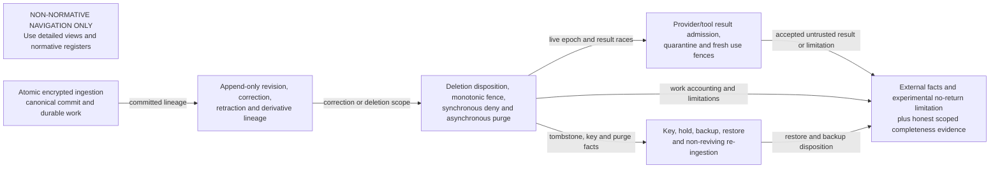
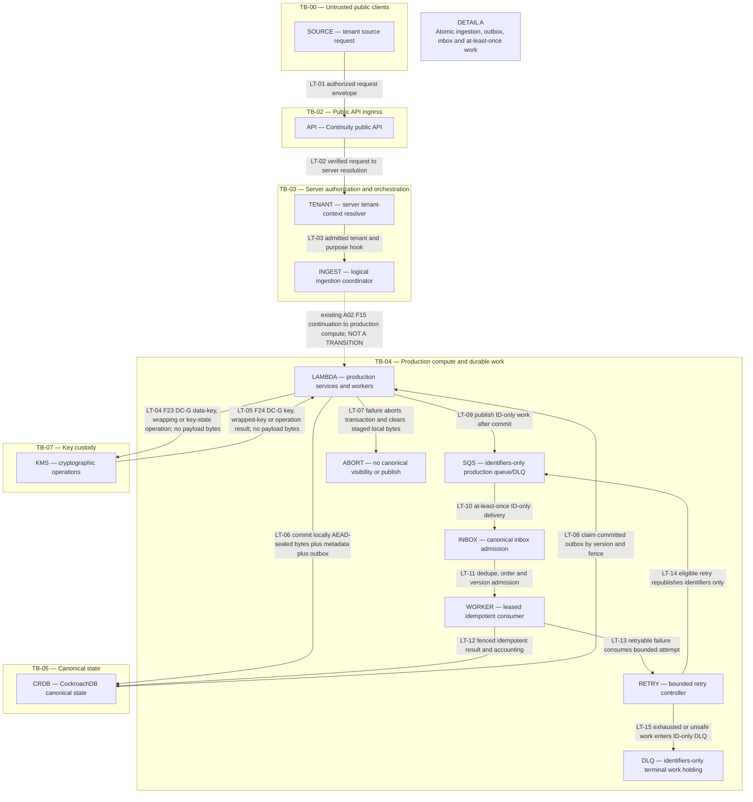
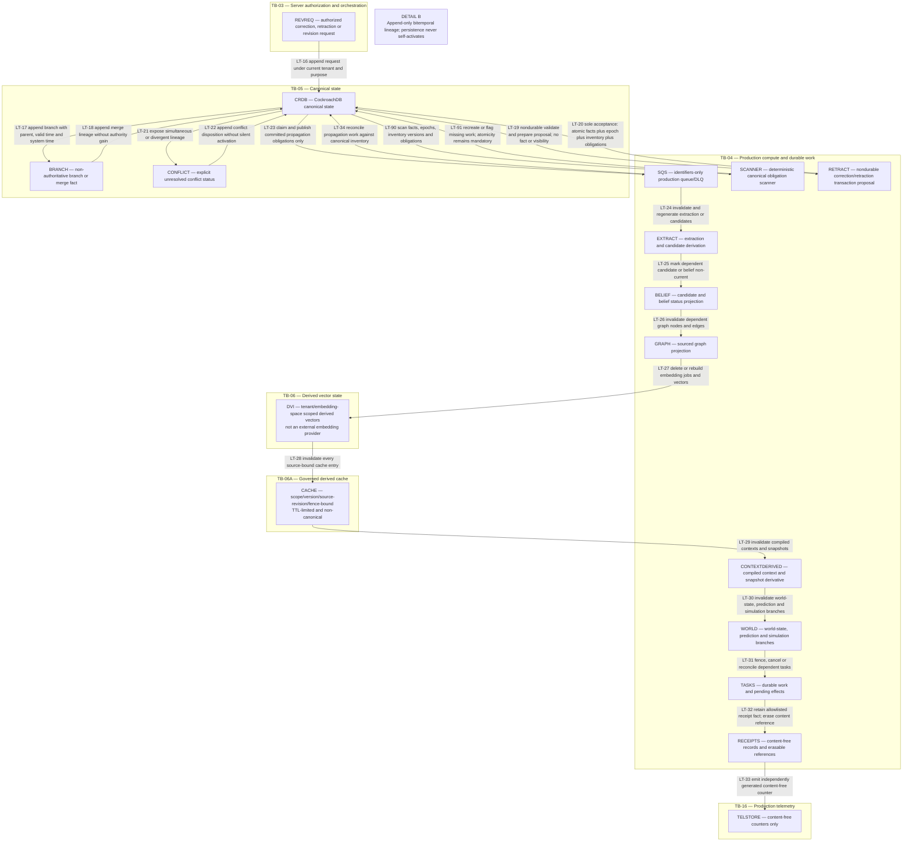
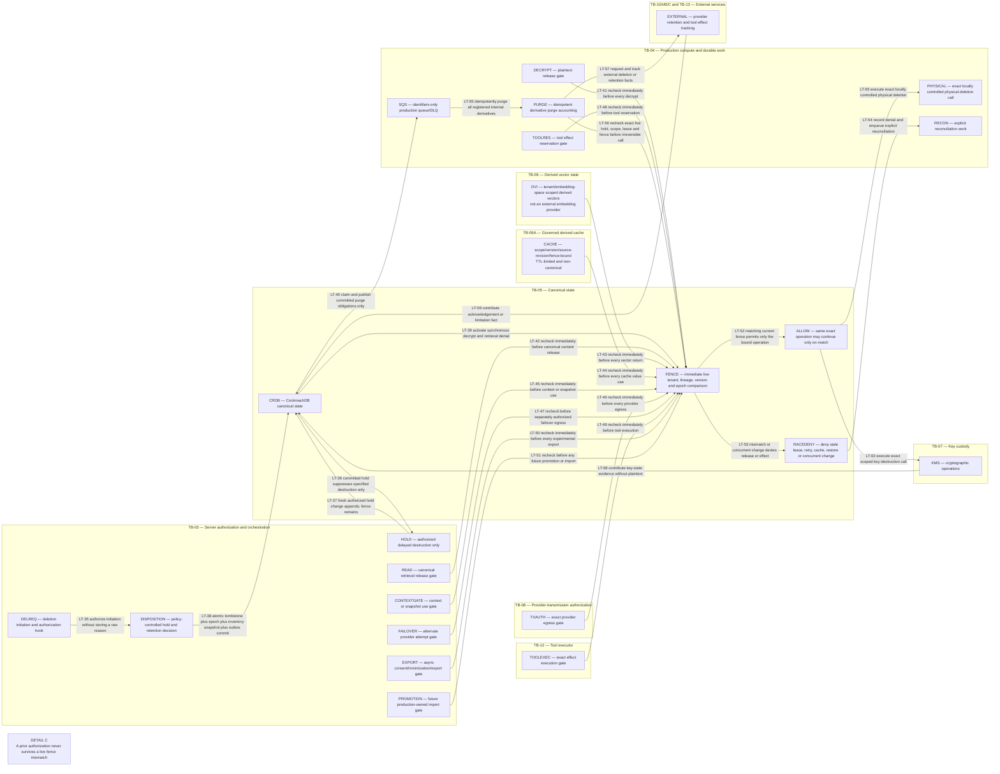
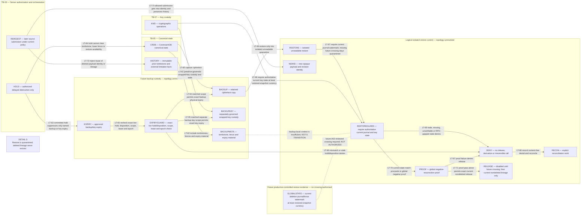
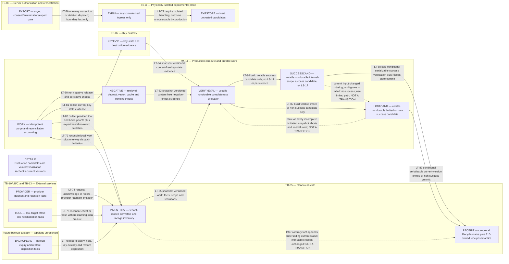

# Continuity v3 data, correction, and deletion lifecycle

**Status:** A03 design evidence; Architecture v3 is not frozen.
**Risk:** critical.
**Scope:** logical lifecycle for the independent public Continuity system.

This document defines the prospective lifecycle contract for tenant-scoped
source data, erasable encrypted payloads, immutable content-free metadata,
revision lineage, durable work, derivatives, deletion, restore, and deletion
evidence. It is a design artifact, not evidence that any control exists or that
any data has been deleted.

## 1. Reading rules and A02 alignment

- The normative lifecycle-state, transition, data/derivative,
  failure/reconciliation, invariant, and threat registers in §§4-9 govern. A
  diagram or prose summary cannot weaken them; conflict is a review failure.
- The lifecycle states are the contiguous range `LS-01` through `LS-21`.
  Normative transitions are `LT-01` through `LT-116`. Data/derivative classes
  are `LD-01` through `LD-32`. Failure/reconciliation outcomes are `LF-01`
  through `LF-16`.
- The overview is navigation-only, non-normative, and contains no lifecycle
  transition IDs. The six detailed views are scoped projections of the
  transition register.
- [A02](system-trust-boundaries-v3.md) remains normative for `TB-*` trust
  zones, `AP-*` authorization points, `DC-*` data classes, and `F*`
  boundary-crossing definitions. This document references those definitions
  and does not redefine them. In particular, `AP-04`/`AP-05` resolve and admit
  tenant/purpose context, `AP-06` constrains canonical writes, `AP-07`
  constrains ID-only work, `AP-08` constrains DVI, `AP-09` constrains
  cryptographic operations, `AP-11`/`AP-12` constrain every provider attempt,
  `AP-13`/`AP-14` constrain tool reservation and execution, `AP-19` constrains
  export, `AP-21`/`AP-22` constrain retrieval, `AP-23` constrains cache use,
  `AP-24` constrains telemetry, and `AP-26` preserves untrusted-data and
  activation boundaries.
- Repeated A02 node IDs retain their A02 meanings: `API`, `TENANT`, `ORCH`,
  `LAMBDA`, `SQS`, `CRDB`, `DVI`, `CACHE`, `KMS`, `TXAUTH`, `TOOLEXEC`,
  `EXPORT`, `EXPIN`, `EXPSTORE`, and `TELSTORE`. Lifecycle-local nodes are
  logical responsibilities, states, stores, or control locations. No node
  implies a service, microservice, table, endpoint, IAM role, queue, network
  appliance, package, schema, or deployment unit.
- Solid detail-view arrows are registered lifecycle transitions. Dashed arrows
  are explicitly labeled ownership/context stubs, add no transition, and grant
  no authority. A lifecycle transition spanning zone boxes is not a new
  network or data crossing: any implementation MUST use the applicable A02
  registered `F*` crossing with its `AP-*`, `DC-*`, direction, and transfer
  shape. Where A02 has no registered crossing, the topology remains unresolved
  and direct transfer is prohibited. There are no unlabeled bidirectional
  edges or color-only meanings.
- All canonical identities, payload references, revisions, work envelopes,
  tombstones/fences, derivative keys, receipts, and verification facts
  structurally carry server-resolved tenant and purpose hooks. Possession of an
  opaque identifier never grants dereference or action authority. This does not
  choose a tenant-isolation mechanism.

The detail views reuse A02 crossings as follows; the table grants no new flow:

| Lifecycle view | Applicable A02 crossing references |
| --- | --- |
| A | `F03`, `F07`-`F11`, `F15`, `F17`-`F20`, `F23`-`F24`, and `F54`-`F57` when a payload dereference is required |
| B | `F17`-`F22`, `F54`-`F59`, and content-free telemetry `F76`-`F83` |
| C | `F17`-`F24`, `F27`-`F40`, `F50`-`F59`, `F61`-`F75`, and `F84`-`F87` as applicable to the exact operation |
| D | `F23`-`F24` for cryptographic operations; backup/restore topology has no A02 crossing and remains prohibited until separately defined |
| E | `F17`-`F18` for conditional canonical verification/receipt-semantic writes; `F27`-`F40`, `F49`-`F53`, `F61`-`F75`, and `F76`-`F83`; provider/tool acknowledgements return only through their registered adapters; A10 still owns receipt identity, serialization, cryptography, format, and verifier decisions |
| F | Generation responses land at `ORCH` through `F31`/`F35`, tool results land at `ORCH` through `F40`, and both continue to `LAMBDA` through `F15`; embedding/rerank/moderation responses land at `LAMBDA` through `F65`/`F70`/`F75`; canonical persistence uses `F17` under `AP-06` and `AP-26`; later context/client release uses the applicable registered A02 read and response crossings |

## 2. Coordinated lifecycle views

### 2.1 Lifecycle overview — NON-NORMATIVE

This view is navigation only. It defines no lifecycle state, transition,
authorization, deletion-completeness, or deployment semantics.

### 2.2 Detail A — atomic ingestion and canonical durable work

### 2.3 Detail B — revisions, corrections, lineage, and derivative propagation

### 2.4 Detail C — deletion, live fences, races, purge, and reconciliation

### 2.5 Detail D — backup, restore, keys, holds, and re-ingestion

### 2.6 Detail E — external and experimental derivatives plus completeness evidence

Under current A02, `F53` is one-way into `TB-X` and there is intentionally no
return crossing. `TB-X` cannot acknowledge, attest, or write purge, deletion,
quarantine, retraining, evaluation, or artifact status into production.
Production may record only its own authorized correction/deletion dispatch,
delivery-at-the-production/experimental boundary, consent, source lineage,
fence, expiry, and the durable limitation that isolated handling is unverified
from production. The internal isolated transition shown above is required
behavior, not an observable acknowledgement or verification input.

The evaluator and both outcome candidates in `TB-04` are volatile,
nondurable, and noncanonical. They expose no verified/failed lifecycle status,
receipt state, or UI claim. The dashed edges are context only: a stale success
candidate falls to the limited/non-success evaluation behavior, a stale
limited candidate is re-evaluated, and later contrary canonical evidence
supersedes current lifecycle status without mutating an immutable receipt.
They add no transition or authority.

### 2.7 Detail F — provider/tool result admission and later use

```mermaid
flowchart LR
    VF_NOTE["DETAIL F<br/>Admission, conditional commit and every later use have distinct live checks"]
    subgraph TB09["TB-09 — Adapter boundary"]
        BEDADAPTER["BEDADAPTER — Bedrock generation adapter"]
        SECONDADAPTER["SECONDADAPTER — second-provider generation adapter"]
        EMBEDADAPTER["EMBEDADAPTER — embedding adapter"]
        RERANKADAPTER["RERANKADAPTER — reranking adapter"]
        MODADAPTER["MODADAPTER — moderation/classification adapter"]
    end
    subgraph TB12["TB-12 — Tool executor"]
        TOOLEXEC["TOOLEXEC — exact effect execution gate"]
    end
    subgraph TB04["TB-04 — Production compute and durable work"]
        LAMBDA["LAMBDA — production services and workers"]
        RESPCHECK["RESPCHECK — exact response/ack admission fence"]
        UNTRUSTED["UNTRUSTED — admitted typed non-authoritative volatile result; unpersisted"]
        QUARANTINE["QUARANTINE — erase/quarantine local bytes; content-free unknown fact only"]
        USECHECK["USECHECK — fresh exact live fence before each later use"]
        RECON["RECON — explicit reconciliation work"]
        EXTERNALTRACK["EXTERNALTRACK — provider retention or tool-effect reconciliation"]
    end
    subgraph TB05["TB-05 — Canonical state"]
        CRDB["CRDB — CockroachDB canonical state"]
        CANDIDATE["CANDIDATE — canonical non-authoritative candidate; no activation"]
    end
    subgraph TB03["TB-03 — Server authorization and orchestration"]
        ORCH["ORCH — production orchestrator"]
        CONTEXTGATE["CONTEXTGATE — context or snapshot use gate"]
        TOOLCHAIN["TOOLCHAIN — new independently authorized tool intent only"]
        RESULTRELEASE["RESULTRELEASE — any other local use or release"]
    end
    subgraph TB02["TB-02 — Public API ingress"]
        API["API — Continuity public API"]
    end
    BEDADAPTER -.->|"existing A02 F31 generation-response landing; NOT A TRANSITION"| ORCH
    SECONDADAPTER -.->|"existing A02 F35 failover-response landing; NOT A TRANSITION"| ORCH
    TOOLEXEC -.->|"existing A02 F40 tool-result landing; NOT A TRANSITION"| ORCH
    ORCH -.->|"existing A02 F15 continuation to production compute; NOT A TRANSITION"| LAMBDA
    EMBEDADAPTER -.->|"existing A02 F65 embedding-response landing; NOT A TRANSITION"| LAMBDA
    RERANKADAPTER -.->|"existing A02 F70 rerank-response landing; NOT A TRANSITION"| LAMBDA
    MODADAPTER -.->|"existing A02 F75 moderation-response landing; NOT A TRANSITION"| LAMBDA
    LAMBDA -->|"LT-99 primary generation admission check after F31 then F15"| RESPCHECK
    LAMBDA -->|"LT-100 failover generation admission check after F35 then F15"| RESPCHECK
    LAMBDA -->|"LT-101 embedding admission check after F65"| RESPCHECK
    LAMBDA -->|"LT-102 reranking admission check after F70"| RESPCHECK
    LAMBDA -->|"LT-103 moderation admission check after F75"| RESPCHECK
    LAMBDA -->|"LT-104 tool result or effect-evidence admission check after F40 then F15"| RESPCHECK
    RESPCHECK -->|"LT-105 late, unknown or fence mismatch denies usable persistence"| QUARANTINE
    QUARANTINE -->|"LT-106 erase/quarantine bytes and record content-free ambiguity"| RECON
    RECON -->|"LT-107 reconcile provider retention or possibly real tool effect"| EXTERNALTRACK
    RESPCHECK -->|"LT-108 exact match admits volatile unpersisted typed result only"| UNTRUSTED
    UNTRUSTED -->|"LT-109 one conditional serializable result plus key plus inventory plus obligations commit"| CRDB
    UNTRUSTED -.->|"commit mismatch or crash exposes nothing; existing denial/quarantine behavior; NOT A TRANSITION"| QUARANTINE
    CRDB -->|"LT-110 every later use obtains a new immediate live-fence check"| USECHECK
    USECHECK -->|"LT-111 immediate operation-bound match permits only context use"| CONTEXTGATE
    USECHECK -->|"LT-112 immediate operation-bound match permits only new tool intent"| TOOLCHAIN
    USECHECK -->|"LT-113 conditional serializable candidate plus inventory plus obligations commit"| CANDIDATE
    USECHECK -->|"LT-114 immediate operation-bound match permits only client release"| API
    USECHECK -->|"LT-115 immediate operation-bound match permits only named use or release"| RESULTRELEASE
    USECHECK -->|"LT-116 mismatch denies later use and quarantines local bytes"| QUARANTINE
```

Generation results first land at `ORCH` through existing A02 `F31` or `F35`;
tool acknowledgements/results first land there through existing `F40`. They
then use existing `F15` to reach production compute before the consolidated
checker. Embedding, rerank, and moderation results already land in production
compute through existing `F65`, `F70`, and `F75`. The dashed edges show only
that existing A02 context; they are not lifecycle transitions and grant no new
authority.

Admission never merges provider and tool authority. A result that passes
admission remains volatile, unpersisted, typed untrusted data and cannot
activate a belief, authorize a tool, or become canonical authority. Only
`LT-109` may persist that admitted result/reference through existing `F17`
under `AP-06` and `AP-26`, and that transition conditionally commits the
result, key/reference state, derivative registration, and obligations as one
serializable unit. The dashed abort edge is context only: it adds no lifecycle
transition and indicates reuse of the registered denial/quarantine behavior
when the commit-time comparison changes or the transaction fails. Tool effect
reality is independent of local result admission: a denied or unknown
acknowledgement can still represent a real or unknown external effect requiring
reconciliation.

### 2.8 Transition-to-view index

The transition register in §5 is normative. This index is exact,
non-overlapping, and mechanically countable.

| Detail view | Transition IDs | Count |
| --- | --- | ---: |
| A | `LT-01`, `LT-02`, `LT-03`, `LT-04`, `LT-05`, `LT-06`, `LT-07`, `LT-08`, `LT-09`, `LT-10`, `LT-11`, `LT-12`, `LT-13`, `LT-14`, `LT-15` | 15 |
| B | `LT-16`, `LT-17`, `LT-18`, `LT-19`, `LT-20`, `LT-21`, `LT-22`, `LT-23`, `LT-24`, `LT-25`, `LT-26`, `LT-27`, `LT-28`, `LT-29`, `LT-30`, `LT-31`, `LT-32`, `LT-33`, `LT-34`, `LT-90`, `LT-91` | 21 |
| C | `LT-35`, `LT-36`, `LT-37`, `LT-38`, `LT-39`, `LT-40`, `LT-41`, `LT-42`, `LT-43`, `LT-44`, `LT-45`, `LT-46`, `LT-47`, `LT-48`, `LT-49`, `LT-50`, `LT-51`, `LT-52`, `LT-53`, `LT-54`, `LT-55`, `LT-56`, `LT-57`, `LT-58`, `LT-59`, `LT-92`, `LT-93` | 27 |
| D | `LT-60`, `LT-61`, `LT-62`, `LT-63`, `LT-64`, `LT-65`, `LT-66`, `LT-67`, `LT-68`, `LT-69`, `LT-70`, `LT-71`, `LT-72`, `LT-73`, `LT-94`, `LT-95`, `LT-96`, `LT-97`, `LT-98` | 19 |
| E | `LT-74`, `LT-75`, `LT-76`, `LT-77`, `LT-78`, `LT-79`, `LT-80`, `LT-81`, `LT-82`, `LT-83`, `LT-84`, `LT-85`, `LT-86`, `LT-87`, `LT-88`, `LT-89` | 16 |
| F | `LT-99`, `LT-100`, `LT-101`, `LT-102`, `LT-103`, `LT-104`, `LT-105`, `LT-106`, `LT-107`, `LT-108`, `LT-109`, `LT-110`, `LT-111`, `LT-112`, `LT-113`, `LT-114`, `LT-115`, `LT-116` | 18 |
| **Total** | **contiguous lifecycle transition range exactly once in the index** | **116** |

## 3. Core lifecycle contracts

### 3.1 Atomic payload, event, and outbox commit

After `TB-03` admits the ingestion operation, the existing A02 `F15` crossing
continues the authorized production command from `INGEST` orchestration to
`LAMBDA` in `TB-04`. Through existing `F23`, production compute sends KMS only
permitted `DC-G` data-key generation, wrapping, key-state, encryption-context,
or other cryptographic-operation material. It sends no application plaintext
or payload bytes. Through existing `F24`, KMS returns only permitted `DC-G`
key, wrapped-key, key-state, or cryptographic-operation result material. It
returns no application plaintext, payload ciphertext, or sealed payload bytes.
The Detail A dashed `F15` edge is context only, creates no lifecycle
transition, and grants no authority beyond A02.

Using the future A07-approved mechanism, `LAMBDA` performs payload AEAD sealing
locally in ephemeral production compute after the required key operation and
before `LT-06`. Only the locally produced encrypted payload bytes and their
wrapped-key state/reference proceed to the canonical transaction. A03 does not
choose the exact DEK generation method, DEK form or granularity, KEK/key
hierarchy, AEAD or wrapping algorithms, key cache, zeroization behavior,
rotation/rewrap/destruction rules, or exact implementation mechanism; all
remain unresolved for A07 and applicable human decisions.

Sensitive source content MUST be envelope-encrypted before canonical
visibility. AEAD additional authenticated data MUST bind the server-resolved
tenant ID, high-entropy opaque payload ID, payload version, and
sensitivity/class. KMS/KEK unavailability, context mismatch, unwrap failure, or
key-state ambiguity fails closed: no plaintext is released, no unsafe key
fallback occurs, and no dependent external egress proceeds.

One serializable canonical CRDB transaction MUST make the following tuple
visible atomically: encrypted payload bytes; wrapped-key state; opaque payload
reference and version; allowlisted content-free immutable event metadata; and
the corresponding outbox entry. Commit failure exposes none of the tuple and
staged local bytes are cleared or quarantined for bounded cleanup. Publication
is allowed only by claiming a committed outbox row. Therefore an event cannot
exist without its committed encrypted bytes/reference/key state, and durable
work cannot be published without the canonical transaction.

A03 prohibits external ciphertext or payload custody. An externally durable
opaque identity is not an acceptable alternative to the canonical encrypted
bytes in the transaction. External custody remains default-denied unless A07
and an A02-reviewed crossing later define and review a crash-safe quarantine or
prewrite, immutable object version, atomic binding, orphan cleanup,
reconciliation, deletion, and deletion-evidence contract. This document does
not design or authorize that protocol. The exact DEK/KEK/key-hierarchy and
algorithm/mechanism decisions listed above, the destruction standard, and
backup-key custody remain unresolved for A07 and human decision.

### 3.2 Immutable event and receipt allowlists

Immutable metadata is deny-by-default. The exact A03 allowlist is:

| Record | Permitted immutable fields |
| --- | --- |
| Event | server tenant ID; opaque event ID; event type code; schema/version IDs; high-entropy opaque payload reference ID and payload version; source and parent revision IDs; branch/merge/retraction/supersession link IDs; valid-time and system-time bounds; sensitivity/class code; monotonic deletion/revision epoch; actor/workload public ID; idempotency ID; content-free outcome/status code |
| Receipt | server tenant ID; opaque receipt and lifecycle-request IDs; receipt type/format/version IDs; purpose/policy/config IDs; relevant source revision IDs; monotonic sequence and predecessor receipt ID; deletion/revision epoch; idempotency, attempt and reconciliation IDs; content-free state/outcome/limitation codes; opaque high-entropy erasable reference ID; algorithm/key/verifier IDs when A10 defines them |

Every permitted field value MUST also satisfy the non-sensitive metadata
policy; the field name alone is not permission to retain sensitive content. An
opaque payload/reference ID is permitted only when it is tenant-scoped,
high entropy, reveals no content, grants no dereference authority, and remains
meaningful after payload erasure. Immutable event/receipt metadata MUST NOT
contain payload, prompt, response, memory text, tool argument/result, provider
request/output, secret, key material, bearer/token material, raw deletion
reason, error echo, or any plaintext/content-derived low-entropy hash,
fingerprint, correlation value, or lookup oracle. A03 chooses no receipt
canonicalization, signature, digest, or verifier protocol; A10 owns those
decisions.

### 3.3 Revision authority and time

Every correction, retraction, supersession, branch, and merge is an append-only
canonical fact with server tenant/purpose, source provenance, revision
identity, parent set, valid time, system time, sensitivity, conflict status,
and deletion/revision epoch. Correction never edits prior immutable history.
Branching and merging record lineage but grant no authority. Candidate
persistence cannot self-activate a belief, and no branch becomes current
silently; the independent future D04/A04 activation and policy ordering remains
authoritative.

Validation and preparation before acceptance are nondurable only. They create
no accepted canonical correction/retraction or supersession fact, status,
visibility, lineage-epoch effect, or durable activation. `LT-20` is the sole
acceptance transition. It MUST use one serializable CRDB transaction to append
the accepted correction/retraction and supersession facts, strictly advance
the affected lineage epoch, bind an exact canonical derivative-inventory
snapshot/version, and append every required ID-only propagation, purge,
cancellation, and reconciliation outbox obligation. Consumers only claim
already committed obligations. A crash cannot expose an accepted fact/epoch
without its complete snapshot-bound obligations.

### 3.4 Canonical and derived ownership

CockroachDB is canonical for events, encrypted payload/reference and revision
state, beliefs/memory, graphs, durable tasks, receipts, outbox/inbox,
registries, derivative/lineage inventory, and deletion state. Vectors, caches,
compiled contexts/snapshots, world states, predictions/simulations, provider
requests/outputs, tool results, telemetry, experimental exports/datasets and
artifact bytes are derived, transient, isolated, or external and cannot become
canonical authority. External provider retention and tool-target effects are
facts to track and reconcile, not objects that local deletion can honestly
claim to erase. For experimental material, production CRDB may store only
production-owned consent, source/fence/expiry, authorized export and
correction/deletion dispatch, delivery-at-boundary, and the content-free
no-return limitation. It MUST NOT store or infer `TB-X` purge, artifact,
retraining, evaluation, or deletion status under current A02.

### 3.5 Durable work and queue privacy

The canonical outbox and inbox provide at-least-once delivery with publisher
claim identity, consumer idempotency, tenant and lineage binding, ordering and
version checks, current epoch/fence checks, leases, stale-worker fencing,
bounded retries, and explicit reconciliation. Queue and DLQ bodies MUST contain
only server tenant/purpose IDs, opaque source/work/task IDs, versions,
idempotency IDs, lease/fence tokens, attempt/deadline data, and bounded
content-free routing codes. They MUST contain no sensitive payload, prompt,
memory, provider/tool body, output, key, credential, secret, raw reason, or
content-derived fingerprint. A DLQ is not completion; it is a durable
reconciliation input.

A deterministic canonical scanner MUST compare accepted correction/retraction
and deletion facts, lineage epochs, bound derivative-inventory versions, and
required outbox/work accounting. It recreates idempotent missing work when
safe or flags terminal reconciliation when not. The scanner is defense in
depth and cannot substitute for, weaken, or make eventually atomic the required
serializable fact-plus-obligations transaction.

### 3.6 Deletion, holds, and monotonic denial

Online deletion begins with authenticated initiation and a separate
authorization hook. A deletion is not accepted until one serializable CRDB
transaction appends its canonical tombstone, strictly raises the affected
lineage epoch/fence, binds the exact canonical derivative-inventory
snapshot/version, appends every required ID-only purge, cancellation, external
request, backup, and reconciliation outbox obligation, and records the
policy-controlled hold/retention disposition. Every accepted deletion performs
that transaction immediately, including when a legal hold applies. The commit
synchronously denies canonical retrieval/decrypt and new derivative release.

A legal hold is an orthogonal, versioned suppression of only the specifically
identified physical-deletion, key-destruction, or backup/key-expiry
obligations. It never delays or bypasses tombstone/fence commit, ordinary
availability denial, inventory binding, or creation of purge/reconciliation
obligations. A hold creation, change, release, or expiry is append-only,
freshly authorized, versioned, receipted, and leaves the denial fence in force.
Retention is distinct from ordinary availability. Neither a hold nor retention
can remove a tombstone, decrease a fence, reuse prior authority, or enable
general retrieval.

Consumers claim and publish only already committed outbox obligations. Purge,
key destruction, external requests, backup expiry, and verification proceed
asynchronously and idempotently. Logical revocation, physical erasure,
cryptographic erasure, external acknowledgement, backup expiry, and verified
completion are separate facts. A deletion receipt states only supported facts.

Completeness evaluation snapshots and success/limited candidates are volatile
and noncanonical. They cannot enter `LS-17`, persist receipt state, or support a
success UI. `LT-88` is the sole success finalization transition. It MUST use one
conditional serializable CRDB transaction that, at commit, freshly binds and
compares the exact server tenant, purpose, lifecycle request, lineage,
deletion epoch/fence, derivative-inventory version, complete
obligation/work-accounting version, negative-check versions, key-state
version, provider/tool/backup/reconciliation fact versions, requested and
verified scope, and the `TB-X` no-return limitation.

If any success-finalization input changed, is missing, ambiguous, failed, or
does not support the requested scope, the transaction commits no success
verification fact or receipt semantic record. It reuses the registered
limited/non-success evaluation and finalization behavior. On an exact current
match, the transaction atomically appends a content-free, evidence-bounded
verification fact, current lifecycle status, A10-governed receipt semantic
record and erasable references, and every explicit surviving limitation,
including the `TB-X` no-return limitation; only that commit enters `LS-17`.
A03 does not define receipt identity, serialization, cryptography, format, or
verifier rules owned by A10.

The limited/non-success `LT-89` finalization MUST also be one conditional
serializable transaction over those exact current input and limitation
versions. A stale or newly incomplete candidate commits no receipt semantic
record and returns to evaluation; it may not omit a newly discovered
limitation. A current match atomically appends only an honest content-free
limited/failed/pending lifecycle status, its A10-governed receipt semantics and
erasable references, and the complete current limitations. It never enters
`LS-17` or upgrades ambiguity to success.

Both finalization paths MUST serialize on the same canonical version rows as
`LT-82`, the `LT-90`/`LT-91` scanner and reconciliation path, and every
inventory, work, negative-evidence, hold, key-state,
provider/tool/backup/reconciliation fact update. If finalization commits first
and a later contrary fact arrives, that later update MUST append an
invalidating or superseding current lifecycle status linked to the prior
receipt semantic record. It MUST NOT mutate the immutable receipt. Every UI,
API, and current-status read MUST use the latest non-superseded lifecycle
status, so it cannot continue presenting the prior success after contrary
evidence becomes canonical.

The live fence MUST be compared immediately before each decrypt, canonical
content release, vector return, cache value use, context/snapshot use, provider
egress, alternate-provider egress, tool effect reservation, tool execution,
experimental export, and any future promotion/import. The comparison binds the
same tenant, purpose, lineage, payload/revision version, operation, lease, and
epoch used by the exact release/effect. A concurrent deletion, correction,
hold change, restored backup, stale lease, retry, cache hit, or epoch mismatch
denies the release/effect and creates reconciliation work. A pre-search,
pre-transmission, approval, or earlier fence result is never reusable for this
check.

Immediately before every irreversible key-destruction, locally controlled
physical-deletion, backup-ciphertext expiry, or backup-key expiry call, the
caller MUST freshly recheck the exact live hold/disposition version,
tombstone/fence, server tenant/purpose, payload and key scope, current lease,
and current epoch. A stale or mismatched value denies the call and enters
reconciliation. A key-destruction or crypto-erasure claim is limited to the
exact evidenced key scope; it MUST NOT include shared, independently wrapped,
replicated, or backup key material without separate authoritative evidence for
each such scope.

Correction/deletion propagation MUST account for extraction and candidates,
beliefs/memory, graph nodes/edges, embedding jobs and DVI vectors, caches,
compiled contexts/snapshots, durable tasks, receipts and their erasable
references, world states, prediction/simulation branches, telemetry-safe
counters, local provider request/output handling and external provider facts,
tool effects/results, experimental exports/datasets/artifacts, and backup
copies. For `TB-X`, “account for” means perform and durably record only the
authorized one-way dispatch/delivery-at-boundary facts and the unverified
no-return limitation; it never means observe or acknowledge isolated handling.
A restored backup applies current correction, retraction, tombstone, fence,
and key state before any use.

### 3.7 Backup, restore, and non-reviving re-ingestion

Backups may retain ciphertext and wrapped keys only until an approved expiry,
subject to explicit hold and key-custody facts. Restore always occurs in
isolation with content unreadable and derivation, queues, egress, and effects
disabled. Every restore MUST obtain an authoritative current production
deletion-journal/fence watermark and current KMS/key state at least as current
as the restored snapshot, then pass a global negative-resurrection proof before
any unwrap, read, queue release, index rebuild, cache fill, context compile, or
external processing. Backup-local tombstones, fences, or key metadata are
necessary context but are insufficient authority.

The required current-state inputs need a future A02-reviewed,
production-controlled crossing and evidence contract. No such crossing exists
here, so restore release is disabled. Missing, unverifiable, stale, or
RPO-gapped journal/fence/key state, or any negative-proof failure, leaves the
restore quarantined and creates reconciliation work. Absence of evidence from
a backup or provider is not evidence of deletion.

A deleted payload ID/version or tombstoned lineage cannot be reused, revived,
or overwritten. If current policy permits a later ingestion of similar source
material, it receives a new opaque payload ID, revision ID, lineage, valid and
system times, and current fence. The prior tombstone, fence, receipt, and
external limitation remain append-only history.

### 3.8 In-flight result admission and reuse

Generation responses MUST first land at `ORCH` through existing A02 `F31` or
`F35`, and tool acknowledgements/results/effect evidence MUST first land there
through existing `F40`; those classes then continue to production compute only
through existing `F15`. Embedding, rerank, and moderation responses reach
production compute through existing `F65`, `F70`, and `F75`. No lifecycle edge
replaces, short-circuits, or grants authority beyond those A02 crossings.

Immediately before admission, production MUST compare the exact
server-resolved tenant/purpose, source revisions, destination, provider
attempt or tool effect identity, current epoch, and deletion/revision fence.
A late, unknown, mismatched, corrected, retracted, or deletion-blocked item is
never persisted as usable content. Local bytes are erased or quarantined under
bounded cleanup, only a content-free ambiguous/unknown fact persists, and
provider retention or the possibly real/unknown tool effect is reconciled.

A matching admitted result enters `LS-20` only as volatile, unpersisted, typed
untrusted, non-authoritative production-compute data. Admission creates no
canonical write, durable reference, belief status, or reusable authority.
`LT-109` is the sole transition that may persist the admitted result/reference,
and it MUST use existing A02 `F17` under `AP-06` and `AP-26` as one
serializable conditional CRDB transaction. At commit, that transaction MUST
freshly compare the exact server-resolved tenant, purpose, source revisions,
destination, provider attempt or tool effect plus idempotency identity, current
epoch, tombstone, correction/retraction status, and deletion/revision fence.
No earlier check or authority is reusable at this commit boundary.

On a commit-time match, the same transaction MUST atomically commit encrypted
payload bytes, wrapped-key state, the opaque erasable reference, explicitly
allowlisted content-free metadata, provenance, source/attempt/effect lineage,
explicit non-authoritative status, the corresponding versioned
derivative-inventory registration, and every required ID-only work, purge, and
reconciliation obligation. Sensitive result bytes MUST exist canonically only
inside that encrypted erasable payload/reference contract. There is no crash
window in which a result, reference, wrapped-key state, inventory registration,
or obligation is visible without all the others.

On any commit-time change or transaction failure, no visible
result/reference/key, metadata/lineage, inventory, or obligation state commits.
Local bytes are erased or boundedly quarantined under the existing `LT-105` and
`LT-106` denial semantics; only allowlisted content-free ambiguity may persist,
and provider retention or a possibly real/unknown tool effect remains honestly
reconciled. The Detail F dashed abort edge is contextual only and does not
register another lifecycle transition.

The `LT-109` transaction serializes on the affected lineage, live fence, and
derivative inventory with the `LT-20` correction/retraction transaction and
the `LT-38` deletion transaction. If either revocation commits first, the
commit-time comparison fails and `LT-109` aborts with no visible tuple. If
`LT-109` commits first, the later revocation's exact transaction-bound
inventory snapshot and complete obligations include the newly registered
result. Revocation therefore wins in either serialization order without an
inventory or purge-obligation gap.

Immediately before every later context use, tool-chain proposal, canonical
non-authoritative candidate persistence, client release, or any other use or
release, production MUST perform a new exact live-fence comparison for that
operation. Admission is not reusable authority. Candidate persistence at
`LT-113` is a distinct `F17` write under `AP-06` and `AP-26`. At that exact
operation/commit boundary it MUST run the same fresh comparison and use one
serializable conditional CRDB transaction to atomically persist any encrypted
erasable candidate payload/reference, wrapped-key state, full provenance,
explicit non-authoritative status, corresponding versioned
derivative-inventory registration, and all required ID-only work, purge, and
reconciliation obligations. It serializes with correction/retraction and
deletion exactly as `LT-109` does; a mismatch or crash exposes no partial
candidate/inventory/obligation tuple and follows the existing
denial/quarantine semantics. Candidate content grants no canonical-write
authority and cannot activate a belief.

The operation-specific exits `LT-111`, `LT-112`, `LT-114`, and `LT-115` each
consume only a fresh match performed immediately at their exact context-use,
tool-intent, client-release, or named-use boundary. They cannot reuse the
admission decision, commit decision, or a prior later-use match. A later
mismatch denies the use and follows the same
quarantine/content-free-unknown/reconciliation path. Provider and tool
authority remain separate, and denial of a local tool result does not erase or
disprove an external effect.

## 4. Normative lifecycle-state register

| State | Meaning and allowed exit condition |
| --- | --- |
| `LS-01` | Unaccepted source: no canonical intent, payload reference, event, or work is visible. |
| `LS-02` | Authorized ingestion: server tenant/purpose and admitted operation are bound; no payload is yet canonical. |
| `LS-03` | Locally sealed pending commit: `LAMBDA` has produced AEAD-encrypted payload bytes locally in ephemeral production compute using the unresolved future A07-approved mechanism; encrypted bytes, wrapped-key state, opaque payload identity/version and bindings are staged only for the canonical CRDB transaction, with no durable external custody or partial visibility. |
| `LS-04` | Canonical committed: encrypted payload bytes, wrapped-key state, payload reference/version, content-free event metadata and outbox are atomically visible in CRDB. |
| `LS-05` | Durable work pending: committed outbox/inbox or task accounting awaits an eligible idempotent consumer. |
| `LS-06` | Durable work leased: one current fenced lease may perform the exact versioned attempt; stale workers cannot commit. |
| `LS-07` | Current and available: a nondeleted lineage may be released only through current A02 authorization and immediate fence checks. |
| `LS-08` | Revision disputed: a correction, retraction, branch, merge, freshness issue, or conflict is pending; no silent authority change is allowed. |
| `LS-09` | Superseded or retracted: append-only lineage marks the revision non-current while preserving immutable history. |
| `LS-10` | Deletion requested: initiation is recorded and disposition authorization is pending. |
| `LS-11` | Tombstoned with destruction held: the accepted deletion already committed `LS-12` denial; a versioned hold suppresses only named physical/key/backup destruction obligations and never availability or purge obligation creation. |
| `LS-12` | Tombstoned and synchronously denied: every accepted deletion atomically committed its strictly raised fence, derivative-inventory version and complete outbox obligations, regardless of hold. |
| `LS-13` | Purge pending: registered internal work or production-side provider/tool/backup reconciliation is incomplete; experimental handling remains unverified after one-way dispatch. |
| `LS-14` | Cryptographically erased: required approved key material is destroyed or irrecoverable only within the exact evidenced key scope; shared, replicated and backup key scopes remain separate until independently evidenced. |
| `LS-15` | Externally limited: provider/tool/backup assurance is partial, unknown, unsupported, or pending, or experimental acknowledgement/evidence is unavailable because A02 has no `TB-X` return crossing. |
| `LS-16` | Verification pending: work accounting or required negative/key/external/backup evidence is incomplete. Volatile evaluator/output candidates create no durable lifecycle or receipt state and cannot be displayed as success. |
| `LS-17` | Verified within precisely stated internal/local scope: entered only by the successful conditional serializable `LT-88` commit after all exact current versions and limitations match. Experimental purge, artifact erasure, retraining, evaluation and deletion remain excluded and the no-return limitation is disclosed. Later contrary evidence appends a superseding/invalidation status, immediately making this status non-current without mutating its immutable receipt semantic record. |
| `LS-18` | Verification failed or invalidated: a current conditional limited/non-success finalization or later superseding status establishes that a required check failed, a derivative remains, work is unaccounted, a limitation prevents the claimed scope, or experimental proof is unavailable. A volatile failed candidate alone does not enter this state. |
| `LS-19` | Result admission pending: provider/tool bytes or effect evidence reached production compute only through the applicable existing A02 landing/continuation path and are not usable until exact attempt/effect identity and the immediate live fence match. |
| `LS-20` | Admitted volatile untrusted result: admission matched, but result bytes/reference remain unpersisted volatile `TB-04` data with no canonical fact/status or durable authority. Its only persistence exit is the fresh conditional serializable `LT-109` commit; mismatch or failure exposes no result/reference/key/inventory/obligation tuple and enters existing denial/quarantine behavior. Every later use still requires a new operation-boundary fence. |
| `LS-21` | Result denied or quarantined: late, unknown or mismatched local bytes are unusable and erased/quarantined; a content-free ambiguous fact and external retention/effect reconciliation remain. |

## 5. Normative lifecycle-transition register

| Transition | Source → target | Normative contract |
| --- | --- | --- |
| `LT-01` | source → API | Accept only a bounded request envelope under A02 ingress controls; remain `LS-01` on rejection. |
| `LT-02` | API → tenant resolver | Pass verified identity/request material without treating a client tenant hint as authority. |
| `LT-03` | tenant resolver → ingestion | Bind server tenant, purpose, operation, idempotency, classification and current fence; enter `LS-02`. |
| `LT-04` | production compute after orchestrator continuation → KMS | After the authorized command reaches `LAMBDA` only through existing `F15`, call KMS through existing `F23` with bound context and only permitted `DC-G` data-key generation, wrapping, key-state or cryptographic-operation material. Send no application plaintext, payload ciphertext or other payload bytes. KMS/context/key ambiguity or unavailability fails closed, and the orchestrator never calls KMS directly. |
| `LT-05` | KMS → production compute | Through existing `F24`, return to `LAMBDA` only permitted `DC-G` key, wrapped-key, key-state or cryptographic-operation result material. Return no application plaintext, payload ciphertext or sealed payload bytes; ambiguity/unavailability fails closed with no durable external custody, unsafe fallback or plaintext release. |
| `LT-06` | production compute → canonical state | Before this transition, `LAMBDA` performs payload AEAD sealing locally in ephemeral production compute using the unresolved future A07-approved mechanism and no unsafe fallback. In one serializable CRDB transaction, commit those locally produced encrypted payload bytes, wrapped-key state, payload reference/version, allowlisted event metadata and outbox; enter `LS-04`. |
| `LT-07` | production compute → abort | On any precommit failure expose no bytes/reference/event, publish no work, and clear or boundedly quarantine staged local bytes; return to `LS-01` with content-free failure evidence. |
| `LT-08` | canonical outbox → publisher | Claim only a committed, current version/fence entry with a bounded lease; enter `LS-05`. |
| `LT-09` | publisher → queue | Publish the ID-only envelope after commit; never publish sensitive content or before canonical visibility. |
| `LT-10` | queue → inbox | Deliver at least once into tenant/version/idempotency-bound inbox accounting. |
| `LT-11` | inbox → worker | Reject duplicate, stale, reordered, wrong-tenant, wrong-version or wrong-fence work; otherwise issue a current lease and enter `LS-06`. |
| `LT-12` | worker → canonical state | Commit an idempotent result and work accounting only under the current lease/fence; eligible lineage may enter `LS-07`. |
| `LT-13` | worker → retry controller | Classify a retryable failure, expire the lease, and consume a bounded retry budget without inferring success. |
| `LT-14` | retry controller → queue | Republish only opaque IDs/current versions with a new attempt under ordering and fence rules. |
| `LT-15` | retry controller → DLQ | After exhaustion, unsafe ordering, or terminal classification, store an ID-only reconciliation item; do not claim completion. |
| `LT-16` | revision request → canonical state | Append an authorized tenant/purpose-bound correction, retraction or revision request; enter `LS-08`. |
| `LT-17` | canonical state → branch fact | Append branch parent set, source provenance, valid time, system time, revision ID and conflict status without authority. |
| `LT-18` | branch/merge fact → canonical state | Append a merge relation and all parents; never rewrite ancestors or silently select a winner. |
| `LT-19` | canonical state → nondurable correction/retraction transaction proposal | Validate and prepare affected lineage IDs and the proposed transaction in volatile execution state only; create no accepted canonical fact or status, no visibility, no lineage-epoch effect and no durable activation. |
| `LT-20` | nondurable correction/retraction transaction proposal → canonical state | As the sole acceptance transition, in one serializable transaction append the accepted correction/retraction and supersession facts, strictly raise lineage epoch, bind exact derivative-inventory snapshot/version, and append all required ID-only propagation/purge/cancellation/reconciliation outbox obligations; only this commit may make the accepted facts visible and enter the affected revision into `LS-09`. |
| `LT-21` | canonical state → conflict status | Represent divergent, overlapping, stale or contradictory revisions explicitly. |
| `LT-22` | conflict status → canonical state | Append disposition under later activation/policy authority; persistence alone cannot activate a belief or branch. |
| `LT-23` | canonical state → propagation queue | Claim and publish only already committed ID-only correction/retraction obligations for the bound inventory version; this transition creates no missing obligation. |
| `LT-24` | propagation work → extraction/candidates | Invalidate or regenerate source-bound extraction and mark candidates non-authoritative. |
| `LT-25` | extraction/candidates → belief projection | Mark dependent candidate/belief state non-current pending independent later activation decisions. |
| `LT-26` | belief projection → graph projection | Invalidate sourced graph nodes/edges and preserve their parent revision lineage. |
| `LT-27` | graph projection → vectors | Cancel/rebuild embedding jobs and delete or replace tenant/space/source-version vectors. |
| `LT-28` | vectors → cache | Invalidate all cache keys carrying affected source revisions, policy/config versions or fences. |
| `LT-29` | cache → contexts | Invalidate compiled contexts and snapshots; a stale hit cannot be released. |
| `LT-30` | contexts → world/simulation | Invalidate dependent world states, predictions, simulations and plan branches with visible uncertainty. |
| `LT-31` | world/simulation → tasks | Fence, cancel, supersede or reconcile dependent pending tasks and effect reservations. |
| `LT-32` | tasks → receipts | Preserve only allowlisted immutable receipt facts and erase or revoke erasable content references. |
| `LT-33` | receipts → telemetry | Emit only independently generated, allowlisted content-free counters/codes; never erased content or its fingerprint. |
| `LT-34` | propagation queue → canonical inventory | Reconcile each locally observable derivative and the production-side one-way experimental dispatch obligation against idempotent accounting; never infer isolated outcome, and missing required work remains `LS-16` or `LS-18`. |
| `LT-35` | deletion request → disposition | Authorize initiation without placing raw reason/content in immutable metadata; enter `LS-10`, but do not accept deletion before the atomic commit. |
| `LT-36` | canonical state → hold | After the accepted-deletion transaction, activate the committed versioned suppression for only named physical/key/backup destruction obligations; tombstone/fence and other obligations remain active, entering `LS-11`. |
| `LT-37` | hold → canonical state | Append a freshly authorized, versioned and receipted hold creation/change/release/expiry; never rewrite history, lower the fence or restore availability. |
| `LT-38` | disposition → canonical state | Accept deletion only by one serializable transaction that appends tombstone, strictly raised lineage epoch/fence, exact derivative-inventory snapshot/version, complete ID-only purge/cancellation/external/backup/reconciliation outbox obligations, and hold disposition; enter `LS-12` regardless of hold. |
| `LT-39` | canonical state → live fence | Make decrypt/retrieval/derivative/effect denial synchronous at tombstone commit. |
| `LT-40` | canonical state → purge queue | Claim and publish only the already committed ID-only internal, provider/tool/backup and one-way experimental dispatch obligations bound by the accepted-deletion transaction; enter `LS-13`. |
| `LT-41` | decrypt gate → live fence | Immediately compare live tenant/purpose/payload/version/class/epoch before each decrypt. |
| `LT-42` | canonical release gate → live fence | Immediately compare live scope, lineage, version and epoch before returning canonical content. |
| `LT-43` | vector return gate → live fence | Immediately compare tenant, embedding space, source revision and epoch before each vector return. |
| `LT-44` | cache use gate → live fence | Immediately compare all structural cache bindings and live epoch before each value use. |
| `LT-45` | context/snapshot gate → live fence | Immediately compare every source revision and live epoch before context compile or use. |
| `LT-46` | provider gate → live fence | Immediately compare the exact source versions, destination, purpose, attempt and epoch before each egress. |
| `LT-47` | failover gate → live fence | After fresh A02 authorization, compare the alternate attempt and live epoch immediately before egress. |
| `LT-48` | tool reservation gate → live fence | Compare exact intent, source lineage, approval binding and epoch immediately before effect reservation. |
| `LT-49` | tool execution gate → live fence | Recompare exact reservation, destination, current lease and epoch immediately before execution. |
| `LT-50` | export gate → live fence | Immediately compare consent, source lineage, expiry, destination and epoch before every experimental export. |
| `LT-51` | future promotion/import gate → live fence | Immediately compare source/deletion lineage and epoch before any future production-owned import; A03 grants no promotion authority. |
| `LT-52` | live fence → exact operation | A complete match permits only that bound operation and does not authorize any later operation. |
| `LT-53` | live fence → race denial | Any mismatch, concurrent correction/deletion/hold change, stale lease/retry/cache, or restored state denies release/effect. |
| `LT-54` | race denial → reconciliation | Persist a content-free denial code and enqueue ID-only reconciliation; never reuse prior authority. |
| `LT-55` | purge queue → internal purge | Idempotently purge or invalidate every registered internal derivative and account for each work item. |
| `LT-56` | internal purge → live irreversible-operation fence | Immediately before each key-destruction or locally controlled physical-deletion call, recheck exact live hold/disposition version, tombstone/fence, tenant/purpose, payload/key scope, lease and epoch; mismatch uses race denial/reconciliation. |
| `LT-57` | internal purge → external tracking | Issue and correlate provider deletion/retention requests and tool-effect reconciliation without claiming local control. |
| `LT-58` | KMS → canonical state | Add content-free exact key-scope version/state, custody and destruction evidence; never key material/plaintext or unsupported shared/backup-key scope. |
| `LT-59` | external tracking → canonical state | Add acknowledgement, pending, unsupported, retention or ambiguity facts; enter `LS-15` when limited. |
| `LT-60` | canonical payload → backup | Copy only ciphertext under approved retention, residency, lineage and expiry; plaintext is forbidden. |
| `LT-61` | KMS state → backup key custody | Preserve separately governed wrapped-key/state evidence under unresolved approved custody rules. |
| `LT-62` | canonical deletion state → backup metadata | Include tombstones, monotonic fences, expiry, hold and work-accounting material needed to prevent resurrection. |
| `LT-63` | hold → expiry controller | Suppress only the exact named physical/key/backup expiry obligation through the current authorized hold version; never imply availability or suppress obligation creation. |
| `LT-64` | hold → canonical state | Preserve tombstone and nondecreasing fence; retention/hold cannot revive general retrieval. |
| `LT-65` | expiry controller → backup expiry guard | Immediately before each backup-ciphertext or backup-key expiry call, recheck exact live hold/disposition version, tombstone/fence, tenant/purpose, payload/key scope, lease and epoch. |
| `LT-66` | backup → isolated restore | Restore only to a quarantined unreadable environment with derivation, queue, egress and effects disabled. |
| `LT-67` | isolated restore → restore guard | Require an authoritative current production deletion-journal/fence watermark at least as current as the restored snapshot through a future A02-reviewed crossing; absent crossing or missing/stale/RPO-gapped evidence stays quarantined. |
| `LT-68` | current KMS state → restore guard | Require authoritative current key rotation/destruction/custody state at least as current as the restored snapshot; ambiguity fails closed. |
| `LT-69` | restore guard → denial | Missing, unverifiable, stale or RPO-gapped journal/fence/key state, tombstone, destroyed key or mismatch denies release and derivation. |
| `LT-70` | restore guard → resurrection proof | Only matched authoritative current state proceeds to global synthetic/redacted negative retrieval/decrypt/vector/cache/context/work-release proof. |
| `LT-71` | resurrection proof → release | Only proof PASS permits exact current nondeleted policy-allowed lineage to leave quarantine; release remains disabled until the future crossing/evidence contract exists. |
| `LT-72` | re-ingestion → prior history | Reject reuse or overwrite of a deleted payload ID/version or tombstoned lineage. |
| `LT-73` | re-ingestion → new identity | If current policy allows, allocate new payload/revision/lineage identities while preserving prior tombstone, fence, receipt and limitations. |
| `LT-74` | provider → inventory | Track request, acknowledgement, retention deadline, unsupported capability or ambiguity as external facts; do not infer deletion. |
| `LT-75` | tool target → inventory | Track external effect/result reconciliation and compensation facts; local content purge does not erase an external effect. |
| `LT-76` | export coordinator → experimental ingress | Dispatch tenant-bound correction/deletion identifiers and current fence one-way through `F53`; production records only authorization, consent/source/fence/expiry and delivery-at-boundary facts plus the no-return limitation. |
| `LT-77` | experimental ingress → experimental derivatives | Require quarantine, retraction, purge or retraining/re-evaluation for dependent exports, datasets and inert artifacts entirely inside `TB-X`; production cannot observe, acknowledge, attest or verify the outcome. |
| `LT-78` | backup custody → inventory | Record ciphertext/key expiry, hold, restore and limitation facts without unsupported erasure claims. |
| `LT-79` | inventory → work accounting | Reconcile every locally observable canonical/derived item and provider/tool/backup fact to idempotent work status; for experiment material reconcile only production-side dispatch/delivery facts and the permanent unverified limitation. |
| `LT-80` | work accounting → negative checks | Test canonical release, decrypt, DVI, cache and context paths with synthetic/redacted identifiers. |
| `LT-81` | work accounting → key evidence | Collect authoritative key-state, rotation/rewrap, destruction and custody evidence. |
| `LT-82` | work accounting → inventory | Refresh versioned provider/tool/backup/reconciliation facts and limitations and preserve the explicit experimental no-return limitation; no experimental acknowledgement or status is collected or inferred. Serialize on completeness-finalization dependencies. If the refresh contradicts a current success/limited status, atomically append an invalidating or superseding current lifecycle status linked to the prior receipt semantic record; never mutate the immutable receipt or leave its old status current. |
| `LT-83` | negative checks → volatile evaluator | Snapshot only content-free pass/fail evidence bound to exact tenant, purpose, lifecycle request, lineage, deletion epoch/fence and negative-check versions; this creates no canonical verification or receipt state. |
| `LT-84` | key evidence → volatile evaluator | Snapshot content-free authoritative key-state evidence and exact key-state version without exposing key, ciphertext-derived oracle or deleted content; this creates no canonical verification or receipt state. |
| `LT-85` | inventory → volatile evaluator | Snapshot exact derivative-inventory, complete obligation/work-accounting, provider/tool/backup/reconciliation fact versions, requested scope, production-known experimental dispatch facts and no-return limitation; never submit a `TB-X` outcome or create canonical verification/receipt state. |
| `LT-86` | volatile evaluator → volatile success candidate | Build only a nondurable, noncanonical candidate for a precisely stated internal/local scope. It does not enter `LS-17`, persist a verified status, support a UI claim or create receipt state, and it never asserts experimental purge, artifact erasure, retraining, evaluation or deletion verification. |
| `LT-87` | volatile evaluator → volatile limited/non-success candidate | On missing, changed, ambiguous or failed input; remaining work; external/backup limitation; or requested experimental proof, build only a nondurable, noncanonical limited/failed/pending candidate. It enters no lifecycle state and creates no receipt; it can never report complete. |
| `LT-88` | volatile success candidate → canonical verification/receipt state | This is the sole success finalization. In one conditional serializable CRDB transaction, freshly bind and compare exact tenant, purpose, lifecycle request, lineage, deletion epoch/fence, derivative-inventory version, complete obligation/work-accounting version, negative-check versions, key-state version, provider/tool/backup/reconciliation fact versions, requested/verified scope and the `TB-X` no-return limitation. Any changed, missing, ambiguous or failed input commits no success verification fact or receipt semantic record and uses registered limited/non-success behavior. A full match atomically appends only a content-free evidence-bounded verification fact, current lifecycle status, A10-governed receipt semantic record and erasable references, and every explicit limitation; only then enter `LS-17`. Serialize with all inventory/work/evidence/hold/key/provider/tool/backup/reconciliation and scanner updates. A later contrary fact must append a superseding/invalidation status so current UI/state cannot retain success; never mutate the immutable receipt or define A10 identity, serialization, cryptography, format or verifier rules. |
| `LT-89` | volatile limited/non-success candidate → canonical limited/receipt state | In one conditional serializable CRDB transaction, freshly compare the exact tenant, purpose, lifecycle request, lineage, deletion epoch/fence, derivative-inventory version, complete obligation/work-accounting version, negative-check versions, key-state version, provider/tool/backup/reconciliation fact versions, requested scope and complete current limitations including `TB-X` no-return. A stale, missing or newly incomplete limitation snapshot commits no lifecycle/receipt state and returns to evaluation. A current match atomically appends only an honest content-free limited/failed/pending current status, A10-governed receipt semantics and erasable references, and all current limitations; never enter `LS-17` or upgrade ambiguity. Serialize with all dependency/scanner updates; later contrary facts append a superseding status without mutating immutable receipt semantics or defining A10 format/cryptography/verifier decisions. |
| `LT-90` | canonical state → deterministic scanner | Scan accepted correction/retraction/deletion facts, lineage epochs, bound derivative-inventory versions, complete required obligation sets, work accounting, verification-finalization input versions and current-status consistency without reading erased content. |
| `LT-91` | deterministic scanner → canonical state | Idempotently recreate safely derivable missing work or record terminal reconciliation failure; never substitute for atomic correction/deletion or verification finalization. Serialize on completeness dependencies, and if discovered work/evidence contradicts a current finalized status, atomically append an invalidating/superseding current lifecycle status linked to the immutable receipt semantic record. |
| `LT-92` | matched irreversible-operation fence → KMS | Execute only the exact key-destruction call bound by the fresh irreversible-operation check; enter `LS-14` only for independently evidenced key scope, excluding shared/replicated/backup keys without separate evidence. |
| `LT-93` | matched irreversible-operation fence → physical deletion | Execute only the exact locally controlled physical-deletion call bound by the fresh irreversible-operation check and record scoped evidence. |
| `LT-94` | matched backup-expiry guard → backup ciphertext | Execute only the exact backup-ciphertext physical-expiry call bound by the fresh expiry check; do not infer deletion without resulting evidence. |
| `LT-95` | matched backup-expiry guard → backup key custody | Execute only the separately scoped backup-key expiry/destruction call bound by the fresh expiry check; live/shared key evidence never proves backup-key destruction. |
| `LT-96` | backup-expiry guard → denial | Any stale/mismatched hold/disposition, tombstone/fence, tenant/purpose, payload/key scope, lease or epoch denies expiry and requires reconciliation. |
| `LT-97` | resurrection proof → denial | Any failed or incomplete global negative-resurrection check denies restore release and preserves quarantine. |
| `LT-98` | restore/expiry denial → reconciliation | Persist only content-free denial/evidence-gap facts and reconcile; do not retry an irreversible call or release using prior authority. |
| `LT-99` | production compute after primary generation landing → response admission fence | After the primary result has first traversed existing `F31` to `ORCH` and existing `F15` to `LAMBDA`, compare exact tenant/purpose/source revisions/destination/primary-attempt identity/current epoch/deletion+revision fence; enter `LS-19` without persistence. |
| `LT-100` | production compute after failover generation landing → response admission fence | After the separately authorized failover result has first traversed existing `F35` to `ORCH` and existing `F15` to `LAMBDA`, apply the same immediate exact comparison; primary admission never authorizes failover admission, and this transition does not persist. |
| `LT-101` | production compute after embedding landing → response admission fence | After existing `F65` lands the embedding response at `LAMBDA`, apply the immediate exact comparison to output and source/space/destination/attempt identity without persistence. |
| `LT-102` | production compute after reranking landing → response admission fence | After existing `F70` lands the reranking response at `LAMBDA`, apply the immediate exact comparison to ranks/scores and complete source/destination/attempt identity without persistence. |
| `LT-103` | production compute after moderation landing → response admission fence | After existing `F75` lands the moderation response at `LAMBDA`, apply the immediate exact comparison to labels/scores and source/destination/attempt identity without persistence. |
| `LT-104` | production compute after tool-result landing → response admission fence | After acknowledgement, result or effect evidence has first traversed existing `F40` to `ORCH` and existing `F15` to `LAMBDA`, compare exact tenant/purpose/source revisions/destination/effect reservation and attempt/current epoch/fence without persistence; the external effect may remain real or unknown. |
| `LT-105` | response admission fence → quarantine | Late, unknown, mismatched, corrected, retracted or deletion-blocked bytes/evidence enter `LS-21` and can never be persisted as usable content. |
| `LT-106` | quarantine → reconciliation | Erase or boundedly quarantine local bytes and persist only an allowlisted content-free ambiguous/unknown fact with no content-derived fingerprint. |
| `LT-107` | reconciliation → external tracking | Reconcile provider retention/deletion or the possibly real/unknown tool effect; local denial does not claim external erasure or no effect. |
| `LT-108` | response admission fence → volatile admitted untrusted result | Exact match admits only the bound result as volatile, unpersisted, typed untrusted and non-authoritative `TB-04` data; enter `LS-20` with no canonical fact/status, durable reference or authority. |
| `LT-109` | volatile admitted untrusted result → canonical state | As the sole admitted-result persistence transition, use existing `F17` under `AP-06` and `AP-26` for one serializable conditional CRDB transaction. At commit freshly compare exact tenant, purpose, source revisions, destination, attempt/effect plus idempotency identity, current epoch, tombstone, correction/retraction status and deletion/revision fence. On mismatch/failure commit no visible result/reference/key, metadata/lineage, inventory or obligation state and reuse the registered erase/quarantine, content-free ambiguity and honest external-effect behavior. On success atomically commit encrypted payload bytes, wrapped-key state, opaque erasable reference, allowlisted content-free metadata, provenance, source/attempt/effect lineage, explicit non-authoritative status, corresponding versioned derivative-inventory registration and every required ID-only work/purge/reconciliation obligation. The transaction serializes with accepted correction/retraction and deletion transactions: earlier revocation aborts this write; an earlier result write is included in the later revocation's exact inventory snapshot and obligations. A crash exposes the complete tuple or none. |
| `LT-110` | canonical accepted result → later-use fence | Immediately before every later use/release, freshly compare exact tenant, purpose, source revisions, destination, attempt/effect plus idempotency identity, current epoch, tombstone, correction/retraction status and deletion/revision fence; admission, persistence and prior-use decisions are not reusable. |
| `LT-111` | later-use fence → context use | At the exact context compile/use boundary, consume only a fresh operation-bound match; permit only the bound context operation, never reusable context authority, and send mismatch to registered denial/quarantine behavior. |
| `LT-112` | later-use fence → tool-chain proposal | At the exact tool-intent boundary, consume only a fresh operation-bound match; permit only creation of a new credential-free intent that must independently traverse A02 tool authorization, never authorize execution or a later intent, and never reuse a prior match or intent authority. |
| `LT-113` | later-use fence → candidate persistence | At the exact candidate commit boundary, use existing `F17` under `AP-06` and `AP-26` for one serializable conditional CRDB transaction that freshly compares the same exact tenant/purpose/source/destination/attempt-or-effect/idempotency, epoch, tombstone, correction/retraction and deletion/revision-fence scope. Mismatch/failure commits no candidate/key/reference/inventory/obligation state and uses registered denial/quarantine behavior. Success atomically commits any encrypted erasable candidate payload/reference and wrapped-key state, full provenance, explicit non-authoritative status, corresponding versioned derivative-inventory registration and every required ID-only work/purge/reconciliation obligation. It serializes with accepted correction/retraction and deletion transactions under the same revocation-wins rule, grants no canonical-write authority to content and performs no belief activation. |
| `LT-114` | later-use fence → client release | At the exact client-release boundary, consume only a fresh operation-bound match and permit only the bounded response through A02 controls; no prior match or release authority is reusable. |
| `LT-115` | later-use fence → other named use/release | At the exact named operation boundary, consume only a fresh operation-bound match; generic, cached, broadened or reusable authority is forbidden. |
| `LT-116` | later-use fence → quarantine | Any later mismatch denies use/release, erases or quarantines local bytes where retained, records only content-free ambiguity, and reconciles external retention/effect. |

## 6. Normative data and derivative inventory

Every row is tenant/purpose and lineage scoped. “Canonical” means CockroachDB
is durable truth; it does not make content immutable or authoritative.

| Data ID | Class and owner | Sensitivity and lineage | Revocation/deletion behavior | Verification signal | Later owner |
| --- | --- | --- | --- | --- | --- |
| `LD-01` | Source request; transient API/compute | Sensitive source content; request and server tenant/purpose lineage | Reject/drop after bounded use; never ordinary logs | no unauthorized durable copy | C02, C05, S03 |
| `LD-02` | Encrypted payload bytes, wrapped-key state and reference/version; canonical CRDB only | Sensitive plaintext reaches ephemeral production compute through `F15`. `F23` carries only permitted `DC-G` data-key/wrapping/key-state/cryptographic-operation material to KMS; `F24` returns only permitted `DC-G` key/wrapped-key/operation-result material—neither crossing carries application plaintext or payload ciphertext/sealed bytes. `LAMBDA` performs payload AEAD sealing locally under the unresolved future A07 mechanism; locally produced encrypted bytes, wrapped-key state, opaque payload/version and tenant/payload/version/class binding commit atomically with event/outbox. External ciphertext custody is prohibited | synchronous dereference/decrypt deny; physical/key stages remain distinct; no direct orchestrator-to-KMS path, KMS payload exposure or unsafe fallback | exact `F15`/`F23`/`F24` data-class/direction checks, local-seal evidence, canonical tuple presence, negative decrypt and exact payload/key state | A07, C05, R02 |
| `LD-03` | Immutable event metadata; canonical CRDB | Explicit content-free allowlist; source/revision and opaque erasable reference only | metadata may persist; content reference loses dereference authority | allowlist/leak scan and lineage presence | C06, A10 |
| `LD-04` | Correction/retraction/supersession facts; canonical CRDB | Content-free or erasable-reference facts with provenance, parents, valid/system time | append only; prior history never rewritten | lineage/conflict and temporal reconciliation | C06, D02, R01 |
| `LD-05` | Tombstone, hold disposition, monotonic fence; canonical CRDB | Content-free tenant/lineage/epoch/control facts; no raw reason | never lowered or erased by ordinary lifecycle; blocks release synchronously | live fence and monotonicity evidence | A07, R02, R03 |
| `LD-06` | Beliefs and memory; canonical CRDB | Potentially sensitive canonical state with source revision/provenance and erasable references | mark non-current, retract and purge content-bearing portions; no self-activation | negative retrieval and current-lineage check | D04, R01, R02 |
| `LD-07` | Graph nodes/edges; canonical CRDB with derived projections | Sensitive sourced temporal relations with every parent revision | retract/invalidate dependent edges and projections | no active edge from blocked lineage | D02, R01 |
| `LD-08` | Durable tasks/effect reservations; canonical CRDB | ID-only control facts plus erasable content refs, lease/fence/idempotency | cancel/fence/reconcile; retained facts remain content-free | no current lease/effect from blocked lineage | C09, F09, R02 |
| `LD-09` | Receipts; canonical CRDB | Immutable allowlisted metadata plus erasable opaque refs | retain facts, revoke/erase referenced content; limitation stays visible | allowlist, reference denial and A10 integrity evidence | A10, E08, R06 |
| `LD-10` | Outbox/inbox; canonical CRDB | Tenant/version/idempotency/fence IDs only | cancel/fence or complete idempotently; no sensitive body | duplicate/order/lease/work accounting | C07 |
| `LD-11` | Versioned derivative/lineage inventory; canonical CRDB | Content-free class, owner, source revision, location, locally observable work, production-side experimental dispatch and limitation IDs; each canonical result/candidate commit atomically adds its versioned registration, each accepted revocation binds the exact snapshot/version, and completeness finalization compares the exact current version | conditional result/candidate registration and obligations are atomic; any inventory change serializes with verification finalization and, if contrary, appends a superseding current lifecycle status; preserve `TB-X` no-return limitation rather than isolated status | transaction-bound write/registration/obligation completeness, finalization-version match and deterministic scanner, with no inferred experimental outcome | C03, R02, S01 |
| `LD-12` | Embedding jobs; canonical task/registry facts | ID-only job control plus erasable source refs, space/version/fence | cancel/fence/requeue only for current lineage | no live job for blocked source | D05, D06, R01 |
| `LD-13` | DVI vectors; derived TB-06 | Sensitive derived vectors with tenant, embedding space and source revision | synchronous return deny; delete/rebuild asynchronously | negative vector return and index accounting | D07, R01, R02 |
| `LD-14` | Caches; derived TB-06A | Sensitive derived values keyed by tenant/purpose/scope/versions/source revisions/fence | invalidate synchronously for use, purge asynchronously; no cross-scope fallback | negative hit/use and key inventory | D08, S01, R02 |
| `LD-15` | Compiled contexts/snapshots; derived compute/cache | Sensitive bounded derived content with complete source revision set | deny use and purge/rebuild from current lineage | negative compile/use and snapshot absence | D10, R01, R02 |
| `LD-16` | Extraction/candidates; canonical non-authoritative facts and derived content | Sensitive untrusted candidates with source/provenance/revision/status; a canonical candidate write uses `F17` under `AP-06` and `AP-26` as an immediate conditional serializable commit | freshly compare full live revocation scope at commit; atomically bind encrypted erasable candidate content/key/reference, inventory registration and required obligations, or expose none; never self-activate or gain canonical-write/belief authority from content | commit/revocation serialization, tuple completeness, candidate/belief status, source checks and no-activation evidence | D03, D04, R01 |
| `LD-17` | World-state versions; derived | Sensitive compiled assumptions, conflicts, unknowns and evidence lineage | invalidate every affected version | no current world state from blocked source | F01, R01 |
| `LD-18` | Predictions/simulation/plan branches; derived | Sensitive outputs with world-state/source lineage and uncertainty | invalidate/cancel; retain only content-free fact if allowed | no selectable branch from blocked source | F03, F04, R01 |
| `LD-19` | Provider request/output handling; transient/local erasable refs plus external processor copies | Sensitive external content with exact source/version/destination/attempt | stop local release, erase local refs, request external deletion where supported; retention may remain | local negative checks plus provider facts/limitations | E03-E07, E10, R02 |
| `LD-20` | Tool effects/results; external target plus canonical content-free effect state | Sensitive/effect-bearing external reality; exact intent/source/idempotency lineage | purge local result refs; reconcile/compensate when supported; never claim external effect erased locally | authoritative target reconciliation or unknown | F05-F07, F09, R02 |
| `LD-21` | Telemetry; non-canonical TB-16 | Allowlisted content-free counters/codes only; no payload or content fingerprint | expire by approved retention; correction/deletion changes counters only through independent values | leakage scan, allowlist and retention evidence | S03, A12 |
| `LD-22` | Experimental exports/datasets; isolated TB-X | Potentially sensitive minimized data with consent, expiry and production source lineage | production sends one-way correction/deletion identifiers; isolated quarantine/purge/retraction is required but unobservable from production | production-owned authorization/consent/source/fence/expiry and dispatch/delivery-at-boundary facts plus explicit unverified no-return limitation only | X02, X10 |
| `LD-23` | Experimental registry/artifact derivatives; isolated TB-X with production-owned CRDB dispatch lineage only | Untrusted inert artifact bytes/status remain isolated; CRDB may hold only content-free production export/dispatch/lineage/limitation facts | isolated quarantine/retract/retrain/re-evaluate is required, but no status returns and experimental identities have no production write authority | no experimental verification signal under A02; production proves only one-way dispatch and absence of a reverse crossing | X03-X10 |
| `LD-24` | Backup copies; unresolved custody | Ciphertext, wrapped keys and content-free backup-local deletion metadata with backup/expiry lineage; local metadata is insufficient restore authority | retain only to approved expiry/hold; every expiry call gets fresh exact hold/fence/scope/lease/epoch check; restore remains quarantined until authoritative current global journal/key state and proof | separately scoped backup/key disposition plus authoritative current-state currency and global negative-resurrection proof | C10, R03 |
| `LD-25` | Key lifecycle state; KMS/canonical evidence | Highly sensitive key material stays in custody; metadata is content-free exact tenant/payload/version/key scope and hold/disposition version | rotate/rewrap/destroy only after fresh irreversible-call check; shared/replicated/backup scopes remain separate; outage/ambiguity fails closed | authoritative per-scope current key state and destruction evidence | A07, C05, C10 |
| `LD-26` | Provider/tool deletion, retention and effect tracking; canonical CRDB | Content-free provider/tool request, acknowledgement, deadline and limitation facts; never experimental acknowledgement/status | append reconciliation; never infer unsupported erasure or a `TB-X` outcome | provider/tool acknowledgement, unknown or retention fact only | E08, R02 |
| `LD-27` | Completeness evidence and lifecycle verification status; canonical inputs/final facts in CRDB, evaluator snapshots/candidates volatile TB-04 | Synthetic/redacted tenant/purpose/lifecycle-request/lineage/fence-bound input versions, counts/outcomes, requested/verified scope, production-side experimental dispatch facts and no-return limitation only; no stable success exists before conditional finalization | final success or limited status commits only against exact current inventory/work/negative/key/provider/tool/backup/reconciliation versions; changed input aborts, and later contrary evidence appends invalidating/superseding current status without altering prior facts | conditional-finalization tuple, both serialization orders, latest-status and no-stale-success evidence; explicit experimental evidence unavailability | R02, S01 |
| `LD-28` | Deletion receipt semantic record and erasable references; canonical CRDB | A10-governed immutable allowlist plus honest exact internal/local scope and limitations; A03 chooses no identity, serialization, cryptography, format or verifier | success semantics persist only in the sole conditional success transaction; non-success semantics also require exact current limitation versions. Later contrary evidence appends a linked invalidating/superseding lifecycle status, never mutates the immutable receipt, and current UI/API cannot treat superseded success as current | atomic verification/receipt-state consistency, limitation completeness, stale-finalization abort, supersession and `TB-X` no-return disclosure | A10, E08, R02 |
| `LD-29` | Queue/DLQ envelope; transient queue plus canonical work identity | Opaque tenant/purpose/source/work IDs, versions, idempotency, lease/fence and routing codes only | expire/retry/DLQ under policy; never sensitive body | fixture scan and work reconciliation | C07, C08, S01 |
| `LD-30` | Provider/external-processing response admission; adapter/`ORCH`/`LAMBDA` transient bytes, then optional canonical erasable result/reference only at `LT-109` | Sensitive untrusted output with exact tenant/purpose/source revisions/destination/attempt plus idempotency/current epoch/tombstone/correction-retraction/fence scope; `LS-20` remains volatile and unpersisted | existing `F31`/`F35`→`F15` or `F65`/`F70`/`F75` landing; commit-time conditional serializable `F17` write under `AP-06`/`AP-26` atomically binds encrypted bytes/key/reference, allowlisted lineage/status, versioned inventory registration and all obligations, or exposes none and denies/quarantines | landing-path, primary/failover/class response-race, transaction fault injection, revocation serialization, tuple completeness and later-use denial evidence | E03-E10, R02, S01 |
| `LD-31` | Tool acknowledgement/result/effect evidence; executor/`ORCH`/`LAMBDA` transient bytes, external effect reality and canonical content-free effect state | Sensitive/effect-bearing untrusted data with exact tenant/purpose/source/destination/reservation/effect/attempt/idempotency/epoch/tombstone/correction-retraction/fence scope; admitted bytes remain volatile until `LT-109` | existing `F40`→`F15` landing; commit-time conditional serializable `F17` write under `AP-06`/`AP-26` is all-or-none with key/reference/inventory/obligations; mismatch never disproves or erases the external effect | exact landing, lost/late-ack, transaction fault injection, revocation serialization, real-or-unknown effect and no-chain/no-release evidence | F05-F09, R02, S01 |
| `LD-32` | Result quarantine/admission/use evidence; local volatile admission/bounded quarantine plus canonical allowlisted facts | Admitted `LS-20` bytes/reference are volatile and unpersisted; quarantined bytes are never usable; durable ambiguity facts contain only opaque attempt/effect IDs, versions and content-free codes unless the conditional result commit atomically persists encrypted erasable content and its full registered tuple | bounded erase/quarantine, no content-derived fingerprint, all-or-none result/candidate tuple, fresh operation-bound check before every use, honest external-effect reconciliation and no partial crash state | byte absence, allowlist scan, volatile-admission, transaction tuple completeness, non-authority and fresh-use-fence evidence | E08, E10, F09, S01 |

## 7. Normative failure and reconciliation outcomes

These outcomes describe lifecycle facts only; they do not freeze the complete
A04 policy or A10 receipt state machines.

| Outcome | Required meaning |
| --- | --- |
| `LF-01` | Denied: authorization, scope, fence, key, hold, version or lifecycle precondition failed before release/effect. |
| `LF-02` | Held: accepted deletion is already tombstoned/fenced; current versioned policy suppresses only named physical/key/backup destruction while availability remains denied and all obligations remain committed. |
| `LF-03` | Retryable: bounded idempotent retry may occur with fresh lease, ordering/version and live-fence checks. |
| `LF-04` | Terminal failure: the local attempt cannot progress; no success is emitted and reconciliation/receipt facts remain. |
| `LF-05` | Partial: some required derivative or evidence work completed, but completeness is not claimable. |
| `LF-06` | Ambiguous/unknown: an external effect/key/backup/persistence outcome is uncertain, or experimental acknowledgement/evidence is unavailable because `TB-X` has no return crossing; no success is inferred. |
| `LF-07` | Tombstoned: monotonic canonical denial is active regardless of asynchronous purge progress. |
| `LF-08` | Purge pending: registered internal derivative work remains, is retrying, or awaits reconciliation. |
| `LF-09` | Externally limited: provider/tool/backup control or evidence is unavailable, unsupported, retained or pending, and all experimental handling is unverified from production under current A02. |
| `LF-10` | Verified: only the sole conditional success finalization transaction matched every exact current dependency version and atomically committed an evidence-bounded verification/current-status/receipt-semantic tuple for a precisely stated internal/local scope. Experimental outcomes remain excluded and the no-return limitation is disclosed; a volatile candidate is never verified. |
| `LF-11` | Verification failed or invalidated: a negative check failed, derivative remains, work is unaccounted, evidence is inconsistent, finalization input changed, or later contrary evidence appended a superseding current lifecycle status. The immutable prior receipt remains historical but cannot support current success. |
| `LF-12` | Race/stale denial: concurrent epoch/hold/revision change, stale lease/retry/cache/restore, or mismatch blocked the operation. |
| `LF-13` | DLQ: retry budget or safe processing ended; ID-only work awaits explicit reconciliation and is not complete. |
| `LF-14` | Reconciliation required: durable work must establish the factual state before retry, release, effect, or completeness claim. A stale success or limited finalization commits no lifecycle/receipt state and must re-evaluate exact current versions. |
| `LF-15` | Result admission/conditional-commit/use denied: a late, unknown, stale, commit-raced or mismatched provider/tool item is never usable; the failed transaction exposes no result/reference/key/inventory/obligation tuple, local bytes are erased/quarantined, and only content-free ambiguity persists. |
| `LF-16` | External effect/retention unresolved: denial of local provider/tool bytes does not prove provider deletion or absence of a tool effect; reconcile as real or unknown. |

No receipt or UI may state success/completeness while required internal
derivatives remain, a required negative/key check has failed, work accounting
is incomplete, an external acknowledgement is ambiguous, or a required
backup/provider limitation is unresolved. It also may not state experimental
completion under current A02. If the requested completeness scope requires
proof from `TB-X`, the result MUST remain externally limited or verification
failed and use the non-success/limited receipt path.

Receipt consistency is latest-status consistency, not mutation of history.
Every UI, API and current-state read MUST consult the latest non-superseded
append-only lifecycle status linked to the immutable A10-owned receipt semantic
record. Any later canonical inventory, work, negative-check, hold, key,
provider/tool/backup, reconciliation or scanner fact that contradicts a
finalization MUST append an invalidating/superseding current status in the same
serialized update. A prior immutable receipt remains historical evidence but
MUST NOT continue to authorize or display current success. A03 defines neither
the A10 receipt state machine nor its identity, serialization, cryptography,
format or verifier.

## 8. Normative lifecycle-invariant register

| Invariant | Normative requirement | Prospective evidence and handoff |
| --- | --- | --- |
| `LI-01` Atomic visibility and local-seal topology | After orchestration, ingestion reaches ephemeral production compute only through `F15`. `F23` and `F24` carry only permitted `DC-G` key/wrapping/key-state/cryptographic-operation material and never application plaintext or payload ciphertext/sealed bytes. `LAMBDA` performs payload AEAD sealing locally before the commit, using the unresolved future A07-approved mechanism. No immutable event exists without those locally encrypted payload bytes, wrapped-key state and reference/version in the same canonical CRDB transaction; no durable publish occurs without the payload/event/outbox commit. | A02 data-class/crossing/direction and KMS-payload-denial checks, local-seal evidence, crash/serialization/outbox-spy and tuple-completeness evidence → A07, C05-C07, S01 |
| `LI-02` Erasable canonical content | Sensitive content is envelope-encrypted in canonical CRDB and erasable independently of content-free immutable metadata; external ciphertext custody is prohibited, and crypto-erasure claims bind only independently evidenced key scope. | plaintext/external-custody denial, crypto-erasure-scope and KMS-outage evidence → A07, C05, R02 |
| `LI-03` Metadata minimization | Immutable events, receipts, telemetry and evidence use explicit allowlists and contain no content or content-derived low-entropy oracle. | schema/leakage/fingerprint scans → A10, E08, S03, A12 |
| `LI-04` Append-only lineage | Corrections, retractions, branches, merges, valid/system time and conflicts append facts; history is never rewritten and authority never changes silently. | bitemporal/branch/conflict evidence → D02-D04, R01 |
| `LI-05` Canonical ownership | CRDB owns canonical lifecycle truth; vectors, caches, contexts, simulations, model outputs, telemetry and experimental artifacts remain derived/external/non-authoritative. | ownership/rebuild/negative-authority evidence → C03, D07-D10, A12 |
| `LI-06` ID-only work | Outbox/inbox/queue/DLQ use tenant-bound opaque IDs, versions, idempotency, leases/fences and bounded routing metadata only. | duplicate/order/stale/DLQ fixture evidence → C07-C09, S01 |
| `LI-07` Monotonic revocation | Every accepted deletion atomically commits a strictly raised tombstone/fence and complete inventory-bound obligations regardless of hold; holds suppress only named irreversible obligations and restores never lower the fence. | atomic crash, hold-branch and restore negative evidence → A07, R02, R03, A12 |
| `LI-08` Immediate recheck | Every listed decrypt/read/vector/cache/context/provider/failover/tool/export/promotion, irreversible destruction/expiry, result-admission and later-result-use gate rechecks exact live state immediately before the operation. | pre-operation epoch/hold/result-race matrix → R01-R03, S01, A12 |
| `LI-09` No resurrection | Restore stays isolated until authoritative current production journal/fence watermark and KMS state at least as current as the snapshot pass a global negative proof; backup-local state is insufficient and old deleted identities cannot be re-ingested. | missing/stale/RPO-gap/global-proof/re-ingestion evidence → C10, R03, S07 |
| `LI-10` Honest external facts | Provider retention/deletion and tool-target effects are tracked as facts/limitations; `TB-X` contributes no acknowledgement or evidence, so production retains only its dispatch/delivery-at-boundary facts and the no-return limitation. None is represented as locally erasable or proved without evidence. | lost-ack/retention/unknown and no-reverse-crossing evidence → E03-E08, F06-F09, R02 |
| `LI-11` Complete lineage and custody accounting | Every class has an owner/source revision and locally knowable revocation/verification treatment; encrypted payload custody is canonical CRDB only, while experimental classes have production-side dispatch lineage and explicit permanently unverified status, not returned work status or verification signal. | inventory reconciliation, external-custody/missing-class denial and no-inferred-TB-X-status checks → C03, R02, S01 |
| `LI-12` Evidence minimization and atomic finalization | Evaluator snapshots and success/limited candidates are volatile and noncanonical. The sole success and limited/non-success finalizations are conditional serializable transactions over exact current tenant/purpose/request/lineage/fence, inventory/work, negative/key/provider/tool/backup/reconciliation, scope and no-return-limitation versions; they atomically commit only content-free evidence/status/A10-owned receipt semantics with complete limitations or commit none. Later contrary facts append superseding current status without mutating immutable receipts, and current UI/API never shows superseded success. Verification contains only synthetic/redacted IDs, versions, counts/outcomes and erasable refs—never deleted material or its fingerprint. | stale-finalization, both serialization orders, fault injection, limitation-omission, later-invalidation/latest-status and evidence/log scans → A10, R02, S01, S03, A12 |
| `LI-13` Atomic revocation obligations | Pre-acceptance correction/retraction preparation is nondurable and invisible; the sole acceptance transaction atomically binds accepted correction/retraction and supersession facts, strictly raised lineage epoch, exact derivative-inventory version and complete ID-only outbox obligations. Accepted deletion transactions provide the same atomic binding, and scanner repair is defense in depth only. | fault injection at every preparation/commit/publication point plus scanner missing-work tests → C06-C09, R01-R02, S01 |
| `LI-14` Irreversible-operation scope | Every key destruction, physical deletion and backup/key expiry call has a fresh exact hold/disposition/fence/scope/lease/epoch check; shared, replicated and backup key scopes require separate evidence. | stale-hold/lease/epoch and cross-key-scope denial tests → A07, C05, C10, R02, A12 |
| `LI-15` Result admission and reuse | Generation/tool results follow `F31`/`F35`/`F40` to `ORCH` then `F15` to `LAMBDA`; embedding/rerank/moderation follow `F65`/`F70`/`F75` to `LAMBDA`. Results are fenced before admission and `LS-20` is volatile/unpersisted. The sole result persistence and distinct candidate persistence each use `F17` under `AP-06`/`AP-26` as an immediate conditional serializable commit: freshly compare exact tenant/purpose/source/destination/attempt-or-effect/idempotency, epoch, tombstone, correction/retraction and fence state; atomically bind encrypted erasable content/key/reference, allowlisted lineage/non-authoritative status, versioned inventory registration and every required obligation, or expose none. They serialize with correction/retraction and deletion so revocation wins without an inventory/work gap. Every context/tool/client/other use consumes a new immediate operation-bound check; no decision is reusable, candidate content cannot activate, denied bytes are unusable, and tool effects remain real or unknown until reconciled. | landing/bypass, pre-admission-write, commit fault injection, both serialization orders, tuple completeness, late-response, no-chain/no-release, candidate-no-activation, quarantine and lost-ack tests → E03-E10, F05-F09, S01, A12 |

## 9. Prospective lifecycle-threat register

This is input for A12 and downstream testing, not threat-model completion.

| Threat | Exposure | Required prospective treatment and handoff |
| --- | --- | --- |
| `LTH-01` partial canonical write or precommit publish | encrypted bytes/wrapped-key/reference/event/outbox ingestion | crash at every boundary; prove complete CRDB tuple or no visibility/work and no external-custody alternative → A07, C05-C07, S01 |
| `LTH-02` AEAD substitution, key misuse, KMS payload exposure or outage fallback | tenant/payload/version/class, local ephemeral sealing and key lifecycle | prove `F23`/`F24` carry only permitted `DC-G` key/operation material and no application plaintext or payload ciphertext/sealed bytes; test local-seal context substitution, KMS/context/key ambiguity, outage fail-closed behavior, no unsafe fallback, rotation/rewrap and destruction while leaving exact A07 mechanism decisions unresolved → A07, C05, A12 |
| `LTH-03` metadata, receipt, telemetry or evidence retains content oracle | allowlists, errors, IDs, correlation and digests | low-entropy/content fingerprint and rejected-input-copy scans → A10, E08, S03, A12 |
| `LTH-04` queue forgery, replay, reorder, stale lease or DLQ leakage | outbox/inbox/queue/task work | duplicate/reorder/crash/stale-worker/bounded-retry/ID-only DLQ tests → C07-C09, S01 |
| `LTH-05` correction/retraction preparation becomes visible or accepted before the sole atomic fact/epoch/inventory/obligation commit, or an accepted correction fails to propagate or self-activates | nondurable proposal, canonical transaction, beliefs, graph, vectors, contexts, tasks | prove preparation has no durable fact/status/visibility/epoch/activation effect; crash atomicity, scanner-defense, lineage completeness, invalidation and no-self-activation tests → C06-C09, D02-D04, R01, A12 |
| `LTH-06` deletion race releases stale content | decrypt/read/vector/cache/context | epoch changes immediately before each release, cache/restore/stale-retry races → R01-R03, S01, A12 |
| `LTH-07` deletion race causes provider or failover egress | provider attempts | exact source/destination/attempt fence race and no silent fallback tests → E03-E07, S01, A12 |
| `LTH-08` deletion race reserves or executes a tool effect | effect reservation/execution | separate pre-reservation and pre-execution race, lost-ack and reconciliation tests → F05-F09, S01, A12 |
| `LTH-09` experimental export bypasses revocation or production invents a returned `TB-X` status | one-way production/experimental boundary | export-race and no-reverse-edge tests; prove production records only dispatch/delivery-at-boundary plus unverified limitation and accepts no experimental acknowledgement → X01-X10, S01, A12 |
| `LTH-10` legal hold bypasses tombstone/obligation commit, revives access or stale hold permits irreversible destruction | disposition and key/physical/backup lifecycle | every hold branch atomically tombstoned, append-only version/receipt, fresh irreversible-call hold/fence/scope/lease/epoch and no-availability tests → A07, C10, R02-R03, A12 |
| `LTH-11` restore trusts backup-local/stale/RPO-gapped state or bypasses global proof; re-ingestion revives lineage | backup/restore/new ingestion | future-crossing-absent denial, authoritative current journal/KMS currency, guard→proof→release ordering, proof-fail quarantine and old-ID denial → C10, R03, S07, A12 |
| `LTH-12` stale completeness snapshot or receipt TOCTOU commits/displays success after inventory/work/evidence/hold/key/provider/tool/backup/reconciliation change, omits a new limitation, or leaves later-invalidated success current | volatile evaluator, conditional success/non-success finalization, immutable receipt semantics and current lifecycle status | race every exact version before commit; prove stale success and stale limited candidates commit nothing, matched commits are atomic/content-free, finalization serializes with scanner and all dependency updates, later contrary facts append superseding status, UI/API reads latest status, immutable receipts are not mutated, `TB-X` no-return remains disclosed and A10 format/cryptography ownership is preserved → A10, E08, R02, S01, A12 |
| `LTH-13` missing derivative class, invented experimental status or unaccounted work | completeness inventory | inventory mutation/missing-owner/work-gap denial, reject inferred `TB-X` outcomes, and reconciliation tests → C03, R02, S01, A12 |
| `LTH-14` deleted content survives through model output, error, receipt or correlation | external/local derived handling | plaintext, output, error, log, receipt and correlation scans across all classes → E03-E10, S01, S03, A12 |
| `LTH-15` deletion fact commits without complete purge/reconciliation obligations | tombstone/epoch/inventory/outbox transaction | fault injection between each logical write; prove fact+strict epoch+inventory version+complete obligations are serializable atomic and scanner is not relied on for correctness → C06-C09, R02, S01, A12 |
| `LTH-16` external ciphertext prewrite or opaque object identity creates orphan, race or unverifiable deletion | payload custody boundary | default-deny external custody and prove no external object/reference path exists until A07 plus A02-reviewed crash-safe contract → A07, C05, S01, A12 |
| `LTH-17` provider/tool result bypasses its A02 landing path; result/candidate write races revocation or partially commits bytes/key/reference without inventory/obligations; a stale decision is reused; candidate gains authority or activates a belief | `F31`/`F35`/`F40`→`F15`, `F65`/`F70`/`F75`, volatile admission, conditional `F17` result/candidate transactions and every later use | landing/bypass and no-pre-result-write tests; inject serialization/crash faults before every tuple element and prove all-or-none visibility, revocation-first abort, write-first inclusion in later exact inventory/obligations, denial/quarantine and honest effect handling; prove encrypted-erasable persistence, `AP-06`/`AP-26`, candidate non-authority/no-activation and fresh non-reusable context/tool/client/other-use checks → E03-E10, F05-F09, S01, A12 |

## 10. Unresolved human inputs

The following remain unresolved and default to deny or incomplete where
relevant:

1. controller/processor roles and responsibility allocation;
2. deletion SLA and the distinction among logical, physical, cryptographic,
   external, backup-expiry, and verified milestones;
3. legal-hold authority, evidence, scope, expiry, review, and release;
4. retention, residency, cross-region replication, and learning consent;
5. CockroachDB transaction, backup and restore choices, retention, RPO and RTO;
6. DEK granularity, KMS/KEK hierarchy, rotation/rewrap/destruction standard,
   and backup-key custody;
7. provider and tool deletion, retention, training, effect-reconciliation, and
   acknowledgement assurances;
8. the authoritative derivative inventory owner and completeness threshold;
9. re-ingestion eligibility and equivalence policy;
10. operator authority, segregation of duties, break-glass, and reconciliation
    ownership; and
11. evidence schema, retention, residency, access, and destruction; and
12. whether a future A02-reviewed, A05-owned, production-controlled
    import/evidence crossing and contract may receive experimental evidence or
    acknowledgement. No such crossing is designed or authorized here; until
    separately reviewed, experimental handling defaults to externally limited
    or ambiguous and is never deletion verification;
13. whether external ciphertext custody is ever permitted. It remains
    prohibited until A07 and an A02-reviewed crossing define a crash-safe
    quarantine/prewrite, immutable object-version, orphan cleanup,
    reconciliation, deletion and deletion-evidence contract;
14. the future A02-reviewed production-controlled crossing, authoritative
    deletion-journal/fence watermark and KMS currency/evidence contract needed
    for any restore release. Until it exists, all restores remain quarantined;
    and
15. bounded local response-quarantine retention/erasure, provider-retention
    reconciliation and tool-effect reconciliation ownership.

These decisions require their applicable human gates. This artifact grants
none.

## 11. Scope limits and exact nonclaims

- This is A03 design evidence only. It is not A07, A08, A10, A12, or A13; it
  does not satisfy HG-1 or any later human gate.
- It is not an implementation, schema, table, migration, DDL, API, IAM,
  infrastructure-as-code, cloud, provider, key, backup, network, deployment,
  or topology choice.
- It is not a test, test result, deployment, demonstration, proof of deletion,
  proof of external/provider/backup erasure, compliance or certification
  evidence, production-readiness evidence, release evidence, or
  private-Zintus integration evidence.
- A07 still owns the erasable-payload ADR decisions; A10 still owns canonical
  receipt identity, serialization, cryptography, and verifier decisions; A12
  still owns threat/privacy completion. References to C/D/E/F/X/R/S tasks are
  handoffs only and do not complete or activate them.
- A03 does not create a return path from `TB-X`, an experimental
  acknowledgement/evidence contract, or an A05 promotion/import design.
  Production cannot claim experimental purge, artifact erasure, retraining,
  evaluation, or deletion verification under current A02.
- A03 does not permit external ciphertext/payload custody, design its future
  prewrite/object protocol, or select an A07 custody decision. It also does not
  create the future current-journal/KMS restore crossing; restore release
  remains disabled.
- The in-flight result lifecycle does not freeze the A04/A09 provider/tool
  ordering, A10 receipt states, provider retention terms, tool effect
  reconciliation contract, or an implementation quarantine mechanism.
- D04/A04 remain the owners of later belief activation and policy ordering.
  This artifact does not freeze those state machines, authorize a branch or
  belief, or grant provider, tool, export, or promotion authority.
- No physical erasure, crypto-erasure, external acknowledgement, backup expiry,
  restore safety, completeness threshold, SLA, provider capability, tool
  compensation, legal-hold disposition, or human decision is claimed as
  selected, implemented, tested, or achieved.

## 12. Public repository references

- [A02 system context and trust boundaries](system-trust-boundaries-v3.md)
  supplies the normative zones, nodes, authorization points, data classes, and
  crossings referenced here.
- [Architecture v3 requirements traceability](requirements-traceability-v3.md)
  supplies the A03 cryptographic deletion, epoch-fence, durable-work, receipt,
  and security evidence requirements.
- [Total goal and task graph](../implementation/goal.md) supplies task
  ownership, permanent boundaries, human gates, and downstream responsibilities.
- [Ownership and provenance](../governance/ownership-and-provenance.md)
  supplies the public-record minimization and independent-system boundary.
- [Security policy](../../SECURITY.md) supplies deletion, logging, and
  release-blocking security invariants.
- [Repository agent instructions](../../AGENTS.md) supplies canonical,
  payload, queue, MCP, and external-effect invariants.
