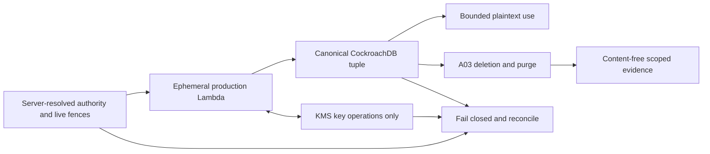
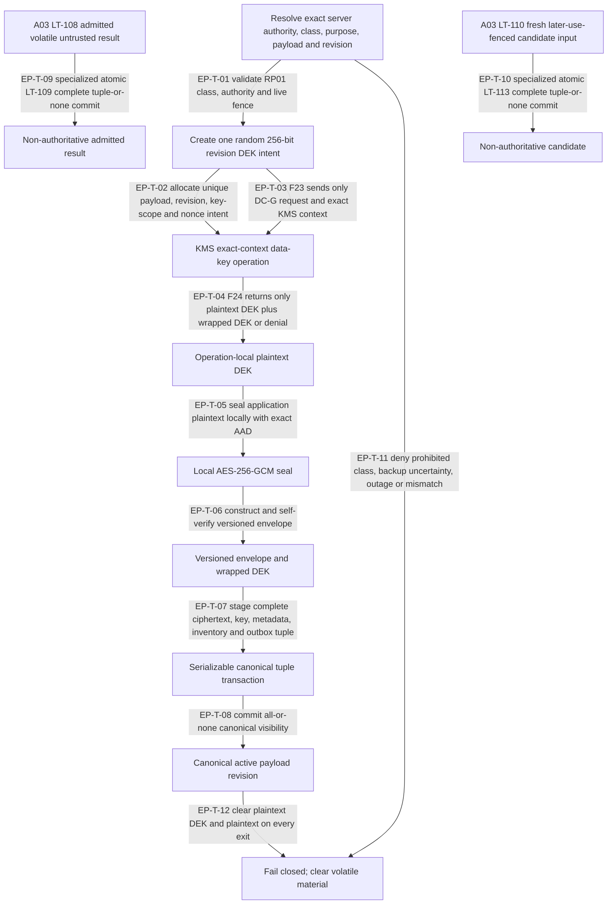
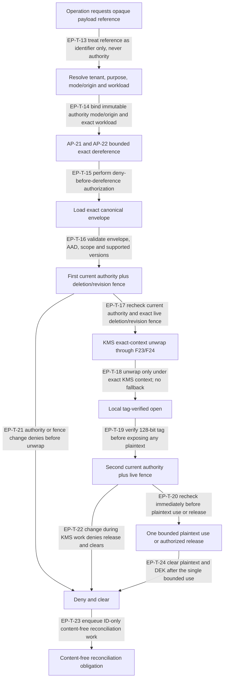
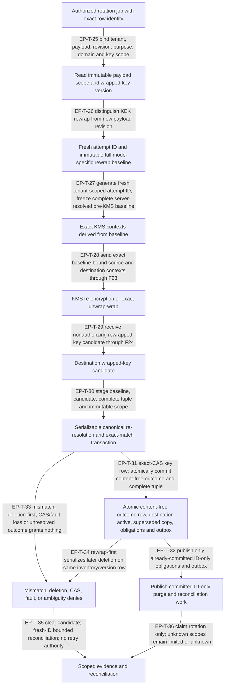
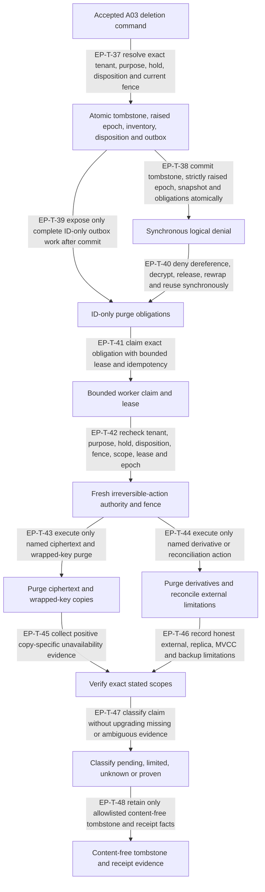
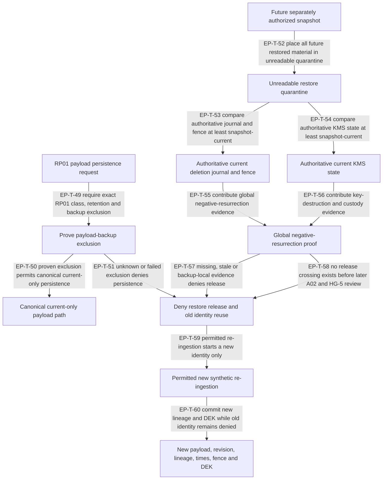

# A07 R8 candidate — erasable-payload ADR v3

Status: candidate design evidence only; not accepted, implemented, tested in a
runtime, deployed, or demonstrated.

This ADR is subordinate to the exact accepted
[A00 requirements](./requirements-traceability-v3.md),
[A02 C4 R5 trust boundaries](./system-trust-boundaries-v3.md),
[A03 deletion lifecycle](./data-deletion-lifecycle-v3.md),
[A04 R17 governed decision path](./governed-decision-path-v3.md),
[A08 R4 tenant isolation](./tenant-isolation-adr-v3.md), and
[HG2-RP01](../governance/hg2-human-decision-packet.md). It creates no new A02
crossing, authorization point, AP29 callable, runtime role, data store, external
custody path, or human gate.

## 1. Decision, scope, and nonclaims

Every payload revision has one independently random 256-bit data-encryption key
(DEK). A DEK is never reused across tenants, payloads, revisions, sensitivity
classes, or purposes. Production `LAMBDA` compute obtains or creates the DEK
inside one operation, seals and opens payload bytes locally with AES-256-GCM,
and clears every plaintext/key buffer on every exit. Only the encrypted
payload envelope and KMS-wrapped DEK are durable.

The authenticated-encryption envelope uses a unique unpredictable 96-bit nonce,
a 128-bit authentication tag, an explicit envelope format version, and a
canonical unambiguous AAD encoding of the server-resolved tenant ID, opaque
payload ID, payload revision, and sensitivity/class. KMS context binds those
fields plus purpose, cryptographic domain/version, and exact key scope. The
system rejects an unsupported version/algorithm, duplicate or unverifiable
nonce, context mismatch, tag failure, ambiguous encoding, or wrong scope. It
never creates a content-derived identifier, deterministic plaintext
fingerprint, equality token, or low-entropy hash.

The current HG2-RP01 scope permits only synthetic payloads retained for at most
24 hours, derived state for at most seven days, and allowlisted content-free
audit/security metadata for at most 30 days. High-risk, real-customer,
personal, unknown-class, and mixed-class payloads are prohibited. Payload
backup/restore, legal hold, learning/export, federation, break-glass, external
transmission, and informal exceptions remain disabled. If payload-backup
exclusion cannot be proven before persistence, persistence fails closed.

This document is design evidence. It grants no schema or migration, code,
cloud/KMS configuration, key custody, backup or restore route, provider/tool
release, compliance claim, production SLA, universal erasure, cryptographic
deletion proof, deployment, or Architecture v3 freeze.

### 1.1 Normative language and authority

`MUST`, `MUST NOT`, `REQUIRED`, and `ONLY` are normative. A durable record or
opaque reference is never authority. All tenant, purpose, immutable authority
mode/origin, workload, membership/role where applicable, policy, revision,
deletion, and hold/disposition inputs are server-resolved under accepted A02,
A03, A04, and A08. Retrieved plaintext, ciphertext, model output, provider/tool
result, queue content, cache content, and candidate content are untrusted data
and cannot create identity, policy, canonical-write, decrypt, release, belief,
tool, or promotion authority.

Canonical writes use ordinary `AP-06` and untrusted-data boundary `AP-26`;
authorized dereference and retrieval use ordinary `AP-21` and `AP-22`. A07
does not create, extend, overload, or bypass AP29 and does not define another
AP29 callable.

## 2. Protected source bindings

| Input | Exact accepted identity | Binding used here |
| --- | --- | --- |
| A00 | 75,699 bytes; `6f2672bdaabe8dd3fa07cbdc7f6d26e6cfcd12f9c7040927db83ede8d2cc1c6d` | Requirements/nonclaim boundary and downstream ownership |
| A02 C4 R5 | 194,041 bytes; `9ac203dd631bd070605e33ae904ad5441ce0d7962524cfbda9abfc384c3805fc` | Existing `LAMBDA`, `CRDB`, `KMS`, `F17`, `F23`, `F24`, ordinary AP boundaries, typed data, and no invented crossing |
| A03 | 124,673 bytes; `a2a65f9132f1683242943732d483eb1cd0e80c57a8e68db6090b3d953e9ad3d8` | Tombstone/epoch/inventory/outbox ordering; restore guard; `LT-109`/`LT-113` non-authoritative persistence |
| A04 R17 | 198,593 bytes; `a013ba4886c77f401afc028f4ff2c99f19ec181541de58d65bd94fee798877af` | Governed decision ordering and possible-effect honesty |
| A08 R4 | 64,492 bytes; `5e79d1ff11774c18d9e3b5175e76c72add2c473bbde035ded41c785aed3ce8ce` | Stable tenant, purpose, immutable authority mode/origin, current mode-specific authority, and workload binding |
| HG2-RP01 | 37,174 bytes; `2b2d92363d66dd264e0b5beba08d7710e3b52550b75c6e28b37b54048c58da14` | Synthetic-only classes, retention caps, disabled routes, evidence honesty, and no new gate |

## 3. Non-normative overview

This orientation diagram contains no normative `EP-T` transition identifiers.
The five detail views in section 6 and the transition register are normative.



## 4. Envelope, metadata, and erasability classification

### 4.1 Versioned envelope-field register

| Field | Classification | Required rule |
| --- | --- | --- |
| `envelope_format_version` | content-free immutable metadata | Exact allowlisted version; unknown/downgrade/ambiguous version denies |
| `aead_algorithm` | content-free immutable metadata | Exactly `AES-256-GCM` for `envelope_format_version=1`; no implicit default or algorithm negotiation |
| `tenant_id` | content-free sensitive identifier | Server-resolved stable tenant; canonical AAD and KMS-context component |
| `payload_id` | opaque content-free identifier | Random server-issued ID; never derived from plaintext and never authority |
| `payload_revision` | content-free revision | Strict server-issued revision; a new revision always receives a new DEK |
| `sensitivity_class` | content-free control metadata | Single exact allowed synthetic class; unknown/mixed/high-risk denies |
| `purpose_id` | content-free control metadata | KMS-context and authorization binding; not omitted or inferred |
| `crypto_domain_version` | content-free control metadata | Prevents cross-domain/version unwrap, rewrap, or replay |
| `key_scope_id` | opaque content-free key-scope identity | Exact per-revision scope; not alias, CMK, tenant-only, or shared-key scope |
| `nonce_96` | erasable cryptographic envelope material | Unique 96-bit nonce under the revision DEK; duplicate/unknown proof denies |
| `ciphertext` | erasable sensitive material | Local AES-256-GCM output only; canonical CRDB custody only |
| `tag_128` | erasable cryptographic envelope material | Exact 128-bit GCM tag; failure reveals no plaintext and denies |
| `wrapped_dek` | erasable highly sensitive key material | KMS-wrapped per-revision DEK; never logged, indexed, or copied informally |
| `wrapped_key_version` | content-free mutable control metadata | Monotonic CAS version for rewrap; exact source/destination context bound |
| `kms_key_ref_version` | content-free sensitive key reference | Versioned approved KEK reference; alias alone is insufficient evidence |
| `created_at` / `expires_at` | content-free lifecycle metadata | Server time; RP01 expiry no later than 24 hours from permitted creation |

The canonical AAD serialization is a versioned length-delimited tuple:

```text
aad_v1(
  tenant_id,
  payload_id,
  payload_revision,
  sensitivity_class
)
```

The KMS encryption context is a versioned length-delimited superset:

```text
kms_context_v1(
  tenant_id,
  payload_id,
  payload_revision,
  sensitivity_class,
  purpose_id,
  crypto_domain_version,
  key_scope_id
)
```

No caller-provided display name, plaintext hash, user-selected tenant, free-form
metadata, transport field, or mutable policy text participates as an
authoritative substitute for these values.

### 4.2 Immutable metadata allowlist

The immutable event/audit plane MAY retain only: random event/operation ID;
server-resolved tenant ID; opaque payload ID and revision reference; event type;
server timestamp; actor/workload opaque references; purpose/version reference;
policy and fence versions; sensitivity-class code; envelope/algorithm/domain
versions; content-free outcome/status code; opaque server-generated
idempotency/attempt reference never derived from content or key material;
opaque key-anchor identity/version, tombstone state and scoped purge-evidence
reference;
source/derivative opaque revision IDs; deletion epoch/tombstone/disposition
references; evidence ID; and receipt correlation ID.

It MUST NOT retain plaintext, ciphertext, tag, nonce, wrapped DEK, plaintext
length beyond a reviewed coarse bounded bucket, prompts, messages, document
names, semantic labels, free-form errors, stack traces containing values,
provider/tool bodies, embeddings, reconstructed content, content-derived IDs,
deterministic fingerprints, durable equality tokens, reversible
representations of cryptographic material, or secret/key bytes. This
prohibition applies equally to attempt-outcome and idempotency rows, receipts,
audit/evidence records, indexes, logs, traces, MVCC history, and backups.

### 4.3 Erasable-field classification

| Material | Canonical owner | Erasure requirement |
| --- | --- | --- |
| Plaintext payload and DEK buffers | operation-local `LAMBDA` | Clear on success, denial, exception, cancellation, timeout, and process reuse boundary; never durable |
| Ciphertext, tag, nonce, wrapped DEK | canonical CRDB payload revision | Tombstone denial first; idempotent physical purge and key-copy evidence later |
| Content-free key-identity/tombstone anchor | Physically separate canonical CRDB anchor table | Retain opaque tenant-scoped identity/version, tombstone/purge state and scoped evidence reference after material purge; never store key bytes, reversible data, digest, fingerprint or equality token |
| Payload-bearing candidate/result | canonical CRDB non-authoritative record | Same per-revision envelope and inventory/purge obligations |
| Derived semantic content | owning derivative plane | Register source revision before visibility; synchronously deny then purge/reconcile |
| Provider/tool local result | operation-local compute or approved canonical envelope | Clear local bytes; canonical bytes are erasable; external copies remain limitations |
| Backup/snapshot payload material | prohibited under RP01 | Persistence fails if exclusion cannot be proven; no current restore route |

## 5. Canonical state register

| State | Meaning and authority |
| --- | --- |
| `EP-S01 scope_resolved` | Exact tenant, purpose, class, payload/revision intent, mode/origin, workload, policy, and live fence are server-resolved; no key or payload exists |
| `EP-S02 dek_ephemeral` | One random 256-bit revision DEK exists only in operation-local protected memory |
| `EP-S03 wrapped_key_ready` | KMS returned exact-context wrapped-key material through `F24`; no payload bytes crossed |
| `EP-S04 sealed_volatile` | Local AES-256-GCM envelope exists but has no durable fact or custody |
| `EP-S05 canonical_active` | Entire canonical tuple committed atomically and is readable only under fresh authority/fence checks |
| `EP-S06 decrypt_checked` | First current authority/deletion/revision fence passed immediately before unwrap |
| `EP-S07 plaintext_volatile` | Tag-verified plaintext exists locally after unwrap and before second release/use check |
| `EP-S08 rewrap_candidate` | One immutable operation-local server-resolved rewrap baseline, its exact source/destination KMS contexts, a destination wrapped-key candidate, superseded-copy record, known storage-scope obligations, and ID-only outbox records are staged; the baseline and KMS candidate grant no authority and no mutation exists |
| `EP-S09 rewrap_committed` | One serializable transaction directly re-resolved and exact-matched the complete current canonical mode-specific authority, epochs/grants/workload, destination KEK state, source bytes/version/inventory, and every fence against the immutable pre-KMS baseline, then exact-CASed and atomically committed destination activation, superseded copy, every known obligation, and ID-only outbox; no subset may exist |
| `EP-S10 tombstoned_denied` | A03 atomic tombstone/raised epoch/inventory/disposition/outbox commit succeeded; logical access is synchronously denied |
| `EP-S11 purge_pending` | Ciphertext/key/derivative/external/backup obligations are asynchronous, bounded, leased, and idempotent |
| `EP-S12 erasure_limited` | Some stated scope is proven unavailable but other recoverable scopes are pending, excluded, unknown, shared, or external |
| `EP-S13 erasure_proven_scoped` | Every recoverable wrapped-DEK copy and material in the explicitly stated scope has positive evidence of unavailability/purge |
| `EP-S14 restore_quarantined` | Future snapshot material, if later authorized, is unreadable and non-releasable pending global negative-resurrection proof |
| `EP-S15 reingested_new_identity` | Permitted new synthetic ingestion has new payload/revision/lineage/time/fence/DEK; old identity remains denied forever |
| `EP-S16 failed_closed` | Ambiguity, mismatch, outage, race loss, unsupported version, or transaction failure created no release/partial tuple/fallback authority |

## 6. Normative transition views

Each `EP-T` identifier occurs in exactly one normative Mermaid view. The views
reuse only accepted A02 nodes and crossings conceptually; node placement does
not add a physical route.

### 6.1 Detail A — seal and atomic commit



`EP-T-09` starts only at A03 `LT-108` admitted volatile untrusted result, and
`EP-T-10` starts only at A03 `LT-110` fresh later-use-fenced candidate input.
They are independent specialized atomic paths: neither traverses
`EP-T-07`/`EP-T-08`, and each independently enforces the same complete
ciphertext/envelope, wrapped-key, opaque reference/version, content-free
metadata, lineage, derivative-inventory, and ID-only obligation tuple-or-none
invariant through A03 `LT-109` or `LT-113`. Their content remains explicitly
untrusted and non-authoritative.

### 6.2 Detail B — authorized decrypt, use, and release



No plaintext use may span requests, retries, queue handoffs, DLQ, cache, or
worker reuse. A KMS success is not a release permit. The second check is
mandatory even when the first check and tag verification succeeded.

### 6.3 Detail C — KEK rotation and wrapped-key rewrap

Before any rewrap `F23` KMS request, production compute MUST directly resolve
one immutable operation-local `rewrap_baseline` from authoritative current
canonical state. It binds the immutable authority mode/origin; tenant, purpose,
operation=`rewrap`, payload, revision, class, cryptographic domain, and key
scope; tenant-authorization epoch; exact purpose-operation grant; workload,
delegation, and capability identities/versions; source wrapped-key bytes,
wrapped-key version, and inventory version; deletion epoch, tombstone,
correction, hold, disposition, and revision fences; and destination KEK
identity plus its authorization, policy, configuration, and key-state versions.

The baseline's mode is explicit and immutable. Principal mode requires the
current server-resolved principal identity, membership/role state and epoch,
purpose-operation grant, workload binding, delegation, and capability. System
mode requires the current server-resolved system workload identity,
purpose-operation grant, system delegation/capability, and their epochs or
versions. Missing principal data never selects or proves system mode; an
explicit canonical mode and its complete required tuple are mandatory.
Missing, ambiguous, stale, duplicate, mixed-mode, or over-bound input fails
closed before KMS.

Before any rewrap KMS call, the server MUST generate a fresh unpredictable
opaque tenant-scoped `rewrap_attempt_id`. It is bound nonauthoritatively to the
immutable baseline identity/version and an explicit rewrap idempotency
schema/version. The attempt ID and binding are correlation inputs only: neither
selects authority or mode, proves completion, authorizes KMS or mutation, or
permits baseline/candidate reuse.

The baseline contains no application plaintext, ciphertext, or payload-derived
metadata beyond the exact allowed wrapped-key material. It is immutable,
operation-local, nonreusable, and not a credential, permit, receipt, proof of
current authority, or KMS authorization. The KMS request and destination
wrapped-key candidate grant no CRDB mutation, retry, release, or reconciliation
authority.



Inside the `EP-T-31` serializable transaction, production compute MUST directly
re-resolve authoritative current canonical state for the complete mode-specific
principal-or-system authority tuple, tenant authorization epoch,
purpose-operation grant, workload/delegation/capability, destination KEK
identity and authorization/policy/configuration/key-state versions, opaque
canonical source key-anchor identity, material wrapped-key version/inventory,
and every deletion, tombstone, correction, hold, disposition, and revision
fence. No request field, baseline assertion, cache, projection, replica, KMS
result, candidate, prior check, or missing principal may supply current truth.
Every resolved identity/version/fence MUST exact-match the immutable pre-KMS
baseline before any logical write; wrapped-key bytes are compared only by the
following exact CAS.

Only inside that transaction, production compute exact-compares the baseline
source wrapped-key bytes against the canonical erasable key row as part of the
exact CAS; no byte, reversible representation, digest, fingerprint, or equality
token enters the outcome/idempotency plane. The successful all-or-none
`EP-T-31` commit atomically activates the destination wrapped-key version,
appends/versions the superseded logical copy, registers every known
replica/MVCC/storage/future-backup-scope obligation, commits ID-only outbox
records, and creates one strictly content-free canonical attempt-outcome row.

That row uses foreign keys and uniqueness constraints to bind only physically
separate, stable, content-free source, destination, and superseded
key-identity/tombstone anchors plus wrapped-key and inventory versions; tenant,
`operation=rewrap`,
payload/revision, baseline identity/version, idempotency schema/version,
`rewrap_attempt_id`, transaction identity, result-tuple identity, superseded
copy identity, obligation-set identity, outbox-set identity, and the
content-free outcome code. It contains no wrapped-key bytes, ciphertext,
reversible key representation, key/content digest, deterministic fingerprint,
or durable equality token. `EP-T-32` publishes only work already committed in
that tuple; it is not a post-commit registration step.

Every erasable source, destination, or superseded wrapped-key-material row has
a tenant-scoped foreign key to its stable anchor; no outcome/idempotency FK
targets a material row. Anchor deletion is `RESTRICT` while an outcome,
material, tombstone, or retained evidence reference exists. Physical deletion
of a material row is a child-row delete and causes no `RESTRICT`, `CASCADE`, or
`SET NULL` action on its anchor, outcome, or idempotency binding. The ordered
state machine is: atomically establish anchor identity before or with material
visibility; tombstone the anchor and commit the exact purge obligation; purge
the named material row; record scoped positive purge evidence on the retained
content-free anchor. Outcome recognition after purge exact-matches anchor and
tuple identities only, reveals no material existence, and grants no authority.

Any revocation, substitution, epoch/grant/workload/capability/KEK/fence change,
mode mismatch, deletion-first serialization, CAS loss, or logical-write fault
commits none of destination activation, superseded copy, obligation, or outbox.
The volatile KMS candidate is cleared. Conflict/reconciliation work uses a
bounded independently generated ID-only identity and grants no retry authority.
A retry MUST resolve a brand-new complete baseline and obtain a brand-new KMS
candidate; neither may be reused.

An ambiguous transaction outcome is resolved only from that canonical attempt
outcome row and transaction identity. An existing attempt reports success only
when tenant, operation, attempt ID, schema/version, baseline binding, and every
field of the complete committed tuple exact-match. Collision, reuse,
cross-tenant lookup, field mismatch, partial or missing state, or conflicting
duplicate fails closed with no success or mutation. Redelivery of a proven
committed exact attempt recognizes that outcome only and MUST NOT rerun KMS.
Only a canonical exact not-committed result permits retry, and that retry MUST
use a fresh attempt ID, fresh complete baseline, and fresh KMS candidate.
Missing, ambiguous, stale, or inconsistent state grants no success, completion,
mutation, candidate reuse, or retry and emits only the independently identified
bounded reconciliation obligation after clearing volatile material.

Deletion and rewrap serialize on the same canonical wrapped-key
inventory/version row. Deletion-first invalidates the exact fence/CAS and
writes no rewrap subset. Rewrap-first makes both active and superseded logical
copies plus all known obligations visible to the later deletion inventory.
Alias rotation, shared CMK disablement, or scheduled shared-key deletion is not
per-revision crypto-erasure. Replica, MVCC-history, old wrapped-key, future
backup, and shared-scope copies remain `limited` or `unknown` absent positive
copy-specific evidence, even when their logical obligations committed.

### 6.4 Detail D — deletion, purge, and scoped evidence



Logical denial is synchronous; physical/key/derivative/external verification is
asynchronous and idempotent. Crypto-erasure is claimable only for an explicit
scope where every recoverable wrapped-DEK copy is positively proven
unavailable. Missing evidence is never success.

### 6.5 Detail E — backup, restore, and re-ingestion



There is no current payload backup or restore route. Backup-local tombstones,
backup-local key state, or a clean snapshot scan are insufficient. A future
design cannot invent a restore release crossing before separate A02 and HG-5
review.

## 7. Normative transition register

| Transition | From → to | Required precondition and exact effect |
| --- | --- | --- |
| EP-T-01 | request → scoped seal | Server resolves allowed synthetic class, tenant, purpose, mode/origin, workload, policy and live revision/deletion fence; prohibited/ambiguous input denies |
| EP-T-02 | scoped seal → key intent | Allocate random opaque payload ID, strict revision, exact per-revision key scope, and nonce-generation intent; no content-derived identity |
| EP-T-03 | key intent → KMS request | Existing `F23` carries only allowed `DC-G` data-key/context material; no application plaintext/ciphertext/sealed bytes |
| EP-T-04 | KMS → ephemeral DEK | Existing `F24` returns only exact plaintext DEK/wrapped DEK or denial to `LAMBDA`; mismatch/outage has no fallback |
| EP-T-05 | ephemeral DEK → local seal | Local AES-256-GCM with unique 96-bit nonce, 128-bit tag, exact AAD, and one revision DEK |
| EP-T-06 | local seal → volatile envelope | Construct versioned envelope; self-verify encoding, algorithm, nonce uniqueness evidence, tag length, scope, and context |
| EP-T-07 | envelope → canonical transaction | Stage ciphertext/envelope, wrapped-key state, opaque ref/version, allowlisted metadata, inventory registrations and ID-only obligations together |
| EP-T-08 | transaction → canonical active | One serializable CRDB commit exposes the entire tuple or none; no external ciphertext prewrite/custody |
| EP-T-09 | A03 `LT-108` admitted volatile untrusted result → canonical result | Independent specialized A03 `LT-109` serializable conditional commit enforces the complete encrypted payload/key/reference/metadata/lineage/inventory/ID-only-obligation tuple-or-none invariant; it does not traverse EP-T-07/EP-T-08 and content remains untrusted/non-authoritative |
| EP-T-10 | A03 `LT-110` fresh later-use-fenced candidate input → canonical candidate | Independent specialized A03 `LT-113` serializable conditional commit enforces the same complete tuple-or-none invariant; it does not traverse EP-T-07/EP-T-08 and grants no belief activation or content authority |
| EP-T-11 | any seal precondition → failed closed | Prohibited class, backup uncertainty, KMS outage, ambiguity, mismatch, unsupported algorithm/version, RNG failure, or transaction fault gives no visible tuple |
| EP-T-12 | operation exit → cleared | Clear plaintext/DEK and volatile seal/open buffers on success, error, cancellation, timeout, retry, and runtime reuse |
| EP-T-13 | opaque reference request → identity resolution | Reference possession grants no decrypt/read authority and no tenant inference |
| EP-T-14 | identity → authority scope | Bind A08 immutable mode/origin and workload plus current mode-specific authority |
| EP-T-15 | scope → envelope read | Existing `AP-21`/`AP-22` authorize before exact dereference; durable jobs also retain ordinary job binding |
| EP-T-16 | envelope read → first fence | Exact version/AAD/context/scope/class validation; no metadata-oracle distinction |
| EP-T-17 | first fence → unwrap | Recheck current tenant/purpose/authority and exact live tombstone/epoch/revision fence immediately before KMS |
| EP-T-18 | unwrap → local open | Exact-context `F23`/`F24`; no alternate key, context relaxation, cached DEK, shared fallback, or external plaintext |
| EP-T-19 | local open → second fence | Authenticate complete ciphertext/tag before any plaintext exposure; tag failure clears and denies |
| EP-T-20 | second fence → bounded use | Recheck current authority/fence immediately before one plaintext use/release |
| EP-T-21 | pre-unwrap change → denied | Authority/fence change before KMS produces no unwrap/release |
| EP-T-22 | concurrent KMS change → denied | Change after first check but before use denies release and clears every plaintext/key buffer |
| EP-T-23 | denial → reconciliation | Create only ID-only content-free reconciliation obligation; never payload/error body or retry permit |
| EP-T-24 | bounded use → cleared | Clear plaintext/DEK after exact use; no cross-request caching, queueing, logging, or reuse |
| EP-T-25 | rotation job → exact row | Bind explicit immutable authority mode/origin plus tenant/purpose/rewrap/payload/revision/class/domain/key-scope identity; reference or job possession grants nothing |
| EP-T-26 | exact row → rewrap candidate | Rewrap changes KEK-wrapped representation only; new content/revision always requires new DEK |
| EP-T-27 | candidate → rotation fence | Before KMS, directly resolve and freeze the complete immutable mode-specific baseline: principal-or-system authority, tenant authorization epoch, purpose-operation grant, workload/delegation/capability, source bytes/version/inventory, all lifecycle fences, and destination KEK identity/authorization/policy/configuration/key-state versions |
| EP-T-28 | fence → KMS rewrap request | Existing `F23` carries only exact source/destination contexts and allowed wrapped-key material derived from the immutable baseline; the baseline and request grant no authority |
| EP-T-29 | KMS → rewrapped candidate | Existing `F24` returns only an exact nonauthorizing rewrapped-key candidate or denial; KMS success is never commit or retry authority |
| EP-T-30 | destination candidate → rewrap transaction | Stage the immutable baseline, fresh KMS candidate, exact current source tuple, destination version, versioned superseded logical copy, every known storage-scope obligation, and ID-only outbox record while preserving immutable scope |
| EP-T-31 | rewrap transaction → complete committed tuple | Inside one serializable transaction re-resolve and exact-match canonical authority/fences, compare source wrapped-key bytes only in the material-row CAS, and all-or-none commit destination activation, superseded material/anchors, obligations, ID-only outbox, and the content-free outcome whose FKs target only physically separate stable source/destination/superseded anchors and tuple/version identities—never erasable material rows |
| EP-T-32 | committed tuple → published work | Publish only obligations/outbox already present in the EP-T-31 commit; perform no post-commit registration or repair write |
| EP-T-33 | deletion-first/CAS/fault loss → no rewrap | Any baseline mismatch, authority/epoch/grant/workload/capability/KEK/fence change, deletion-first serialization, CAS loss, transaction fault, or unresolved outcome grants no mutation or retry; a proven mismatch commits no active destination, superseded-copy row, obligation, or outbox and clears the volatile candidate |
| EP-T-34 | rewrap-first → later deletion inventory | Later accepted deletion serializes on the same inventory/version row and atomically snapshots both active and superseded logical copies plus committed obligations |
| EP-T-35 | conflict → evidence/reconciliation | Clear volatile KMS material and emit only bounded independently generated ID-only reconciliation; ambiguous completion resolves only from canonical transaction/idempotency state, grants no retry authority, and any retry requires a new baseline and new KMS candidate |
| EP-T-36 | committed rotation work → honest claim | Claim rotation only; MVCC, replica, backup, shared and other unproven scopes remain `limited` or `unknown`, never per-revision crypto-erased |
| EP-T-37 | deletion request → accepted command | Resolve current tenant/purpose/hold/disposition/fence and A03 authorization |
| EP-T-38 | command → tombstoned denial | A03 transaction atomically commits tombstone, strictly raised epoch, inventory snapshot, disposition and all ID-only obligations |
| EP-T-39 | commit → outbox work | Only committed complete outbox obligations become visible; transaction failure exposes none |
| EP-T-40 | tombstone → synchronous denial | Deny dereference, unwrap, release, rewrap, derivative use, restore and old-ID reuse immediately |
| EP-T-41 | obligation → worker lease | Exact tenant-scoped idempotent claim/lease; queue message contains IDs, not payload |
| EP-T-42 | lease → irreversible fence | Fresh tenant/purpose/hold/disposition/fence/scope/lease/epoch check before every irreversible action |
| EP-T-43 | fence → payload/key purge | After anchor tombstone and exact obligation commit, physically delete only the named ciphertext/wrapped-key-material child row; retained anchor/outcome bindings receive no RESTRICT/CASCADE/SET NULL effect and failure stays pending |
| EP-T-44 | fence → derivative reconciliation | Execute only named derivative/external/verification action; external limits remain explicit |
| EP-T-45 | key purge → copy evidence | After successful material deletion, retain only opaque anchor identity/version, tombstone state and positive exact-scope purge evidence; no key material/equality artifact or authority |
| EP-T-46 | derivative purge → limitation evidence | Record replica/MVCC/backup/provider/tool limitations without upgrading them |
| EP-T-47 | evidence → classification | Exact rules yield `pending`, `limited`, `unknown`, or `proven_for_stated_scope`; absence is never proof |
| EP-T-48 | classification → immutable evidence | Retain only allowlisted content-free tombstone/receipt/evidence facts |
| EP-T-49 | persistence → backup gate | Require allowed synthetic class, ≤24-hour expiry and positive payload-backup exclusion |
| EP-T-50 | exclusion proven → current path | Permit canonical current-only CRDB tuple; still subject to every ordinary check |
| EP-T-51 | exclusion unknown → denied | Fail persistence closed; no “encrypted backup” exception |
| EP-T-52 | future snapshot → quarantine | If separately authorized later, restore only into unreadable isolated quarantine |
| EP-T-53 | quarantine → journal comparison | Use authoritative current journal/fence at least as current as snapshot, never backup-local state |
| EP-T-54 | quarantine → KMS comparison | Use authoritative current KMS destruction/rotation/custody state at least snapshot-current |
| EP-T-55 | current journal → global proof | Prove no deleted/corrected identity or stale fence can resurrect across stated scope |
| EP-T-56 | current KMS state → global proof | Prove required key state/custody without assuming alias/shared-key deletion |
| EP-T-57 | incomplete proof → denied | Missing/stale/ambiguous/global-scope evidence keeps quarantine unreadable |
| EP-T-58 | proof → no current release | The A07 R8 candidate defines no restore release crossing; later A02/HG-5 review is mandatory |
| EP-T-59 | denied old identity → new ingestion | If otherwise allowed, re-ingest as a wholly new synthetic identity only |
| EP-T-60 | new ingestion → new canonical lineage | New payload/revision/lineage/times/fence/DEK commit; old identity and tombstone remain immutable/denied |

## 8. Transition-to-view index

| View | Exact transition IDs | Count |
| --- | --- | --- |
| Detail A — seal and atomic commit | EP-T-01 through EP-T-12 | 12 |
| Detail B — authorized decrypt/use/release | EP-T-13 through EP-T-24 | 12 |
| Detail C — rotation/rewrap | EP-T-25 through EP-T-36 | 12 |
| Detail D — deletion/purge/evidence | EP-T-37 through EP-T-48 | 12 |
| Detail E — backup/restore/re-ingestion | EP-T-49 through EP-T-60 | 12 |

The normative views contain exactly 60 transition-labeled edges. The register
and this index restate identifiers for traceability; they do not create
additional transitions.

## 9. Key-scope and lifecycle register

| Key scope | Meaning | Permitted operation | Evidence limitation |
| --- | --- | --- | --- |
| `EP-K01 revision_dek` | One random 256-bit DEK for one exact tenant/payload/revision/class/purpose/domain scope | Local seal/open only during one authorized operation | Clearing process memory is necessary but not durable crypto-erasure evidence |
| `EP-K02 wrapped_revision_dek` | Erasable material child row holding one exact-context wrapped copy of EP-K01 and referencing EP-K08 anchor | Canonical persistence, exact unwrap, exact rewrap CAS, physical child-row purge | Outcome/idempotency never references this row; every recoverable material copy/location must be enumerated and evidenced |
| `EP-K03 active_kek_version` | Approved KMS key/version wrapping EP-K02 | Generate/wrap/unwrap/rewrap under exact context | Shared KEK availability/destruction is not per-revision erasure |
| `EP-K04 superseded_wrapped_copy` | Erasable old EP-K02 material child with its own stable EP-K08 anchor after rewrap | Purge obligation and physical child-row deletion only | Rotation incomplete until copy-specific obligation is resolved; its anchor remains content-free |
| `EP-K05 replica_mvcc_scope` | Replicated/MVCC historical encrypted/key material | Later implementation-owned GC/purge evidence | Logical deletion or row absence is not proof |
| `EP-K06 backup_snapshot_scope` | Payload/key material in backup/snapshot | Prohibited in RP01; future quarantine only | Current design makes no backup custody or deletion claim |
| `EP-K07 external_scope` | Provider/tool/external-held payload/result/key material | Disabled now; later separate contract only | Local receipt cannot prove provider deletion |
| `EP-K08 content_free_evidence_scope` | Physically separate stable tenant-scoped key-identity/tombstone anchor: opaque identity/version, material lifecycle state and scoped purge-evidence refs only | Anchor first/beside material; material children FK to anchor; outcomes FK only to anchor; retain ≤30 days under RP01 after material purge | No bytes/reversible data/digest/fingerprint/equality token; anchor possession/existence is no oracle or authority |

KEK rotation is not content revision. A new payload revision always obtains a
new EP-K01. Rewrap preserves the full immutable scope and only changes the
wrapped-key representation/version. Scheduled CMK deletion, alias movement, or
CMK disablement MUST be described by its real shared scope and MUST NOT be
reported as revision-specific crypto-erasure.

### 9.1 Atomicity and authority invariant register

| Invariant | Normative rule |
| --- | --- |
| `EP-I01` | No canonical seal/result/candidate transaction exposes ciphertext, envelope, key state, reference, metadata, inventory, lineage, or obligation subset; the complete specialized tuple commits or none does |
| `EP-I02` | A03 `LT-109` starts only from `LT-108`, and `LT-113` starts only from `LT-110`; neither path traverses EP-T-07/EP-T-08, while both independently enforce the same complete tuple-or-none invariant |
| `EP-I03` | Before rewrap KMS, the server generates one fresh opaque tenant-scoped rewrap attempt ID bound nonauthoritatively to an explicit idempotency schema/version and one immutable operation-local server-resolved baseline identity/version containing explicit mode/origin, the complete current principal-or-system authority tuple, tenant/purpose/operation/payload scope, epochs/grants/workload/capability, source bytes/version/inventory, all lifecycle fences, and destination KEK authorization/policy/configuration/key-state versions; neither binding is reusable or grants authority |
| `EP-I04` | Rewrap uses one serializable transaction with wrapped-key bytes compared only in the material-row CAS; activation cannot exist unless that commit also creates/uses physically separate stable source/destination/superseded anchors, a strictly content-free outcome whose FKs target only those anchors, the superseded material child, obligations, and ID-only outbox |
| `EP-I05` | EP-T-32 publishes only work already committed by EP-T-31; it cannot create, repair, broaden, or backfill an obligation after destination activation |
| `EP-I06` | Authority revocation, mode/principal/workload substitution, epoch/grant/capability change, destination KEK change, or any lifecycle-fence change after baseline construction fails the in-transaction exact match and commits no rewrap subset; deletion-first likewise makes the shared inventory/version CAS fail, while rewrap-first makes active and superseded copies visible to the deletion snapshot |
| `EP-I07` | Transaction fault, CAS loss, process loss, timeout, or ambiguity cannot infer a partial tuple, success, candidate reuse, or retry authority and emits only independently generated fresh-ID bounded reconciliation. Resolution uses the exact canonical attempt outcome row and transaction identity; success requires every tenant/operation/attempt/schema/baseline and committed-tuple binding to exact-match, proven committed redelivery never reruns KMS, and only proven not-committed state permits retry with a fresh attempt ID, complete baseline, and KMS candidate before EP-T-31 |
| `EP-I08` | Tombstone anchor and committed obligation precede physical material purge; successful child-row deletion precedes scoped positive evidence on the retained anchor. An obligation or anchor is not purge proof, and replica/MVCC/backup/shared/external/unscoped copies remain pending, limited or unknown |
| `EP-I09` | Baseline possession, KMS success, destination candidate, ciphertext possession, opaque reference, row visibility, queue/DLQ/recovery ID, worker claim or takeover, principal absence, cached/caller assertion, or prior authority never selects mode or substitutes for current mode-specific authority, a fresh complete operation-local baseline plus fresh KMS candidate, the EP-T-31 canonical re-resolution/exact match, either decrypt/release check, or an irreversible-action fence |
| `EP-I10` | Immutable evidence and tombstones remain content-free and may describe only exact observed scope, version, epoch, time, outcome, and limitation |

## 10. Derivative and evidence matrix

| Class | Canonical owner | Erasable material | Registration point | Synchronous denial | Asynchronous purge/reconciliation | Completion evidence | Honest limitation |
| --- | --- | --- | --- | --- | --- | --- | --- |
| Source payload revisions | CRDB payload revision | Ciphertext, nonce, tag, wrapped DEK | EP-T-08 tuple commit | Tombstone/epoch/ref denial | EP-T-43 exact payload/key obligations | Row/key-copy/inventory evidence | Replica/MVCC/backup scopes require separate proof |
| Memory and extraction candidates | A03 canonical non-authoritative state | Candidate body/envelope and wrapped DEK | A03 `LT-113` / EP-T-10 | Source/fence/belief-use deny | Candidate purge and lineage reconciliation | Exact candidate/source revision evidence | Candidate never gains belief authority |
| Admitted provider/tool local results | A03 result admission owner | Local output bytes and optional canonical envelope | A03 `LT-109` / EP-T-09 | Release/persistence deny on fence | Clear local buffers; purge canonical result | Local-clear plus canonical tuple evidence | External provider/tool copies are unproven and currently disabled |
| Temporal/entity/causal graph state | Future D02/D03 owner | Labels, attributes, derived edges containing sensitive semantics | Atomic source-revision inventory registration | Traversal and fusion deny | Delete/rebuild affected graph revisions | Node/edge/source revision reconciliation | Structural metadata may still be sensitive and erasable |
| Embeddings and DVI | Future D05-D07 owner | Vectors, chunks, index entries | Before vector visibility with embedding-space/source revision | Query/rerank deny | Delete/rebuild index entries | DVI deletion result plus source/fence verification | Provider/index internals require later evidence |
| Governed caches | Future cache owner | Values and sensitive structural keys | Before cache visibility | Tombstone/epoch/source mismatch miss | Key invalidation and bounded sweep | Exact cache key/epoch eviction evidence | TTL expiry alone is not deletion proof |
| Compiled contexts | Future D10 owner | Context bodies and selected excerpts | At compilation/use inventory boundary | Provider/use deny | Clear volatile/durable context and reconcile | Compilation ID/source revisions cleared | Downstream external copies remain separate |
| World state and predictions | Future F01-F03 owner | Sensitive hypothesis/prediction bodies | Before durable visibility | Planning/use deny | Purge/rebuild affected state | Exact lineage/version reconciliation | Probabilistic influence may need later evaluation evidence |
| Durable tasks, queues and DLQs | Future C07/C09 owner | IDs only under this ADR; any accidental body is incident material | Atomic canonical/outbox commit | Claim/use deny by epoch/fence | ID obligation completion and incident purge | Message ID/epoch/receipt evidence | Queue deletion cannot establish payload deletion elsewhere |
| Outcome, idempotency, receipt and evidence references | Future E08 owner | Only opaque FK-bound tuple IDs and physically separate stable key-anchor IDs/versions; never material-row FKs, wrapped-DEK bytes, reversible data, digests, fingerprints or equality tokens | Same transaction as governed action | Raw-content/key-material display/export and anchor-oracle deny | Material child purge leaves anchor/outcome intact; redact non-allowlisted metadata and inventory MVCC/backup incidents | FK/delete-behavior, schema/index/log/receipt/audit/MVCC/backup scans | Immutable metadata cannot retain material or authorize access |
| Telemetry-safe facts | Future S03 owner | Allowlisted IDs/status/timing buckets only | Structured emission after redaction | Query/export deny outside scope | Retention expiry and correction | Field-schema/leakage scan evidence | Absence from sampled logs is not universal proof |
| Experimental dispatch/export | A05/future X owners | None permitted under HG2-RP01 | No registration path exists | Hard-disabled route | Incident reconciliation only | Route/identity/queue absence proof | No learning/export deletion success is claimable |
| Provider/tool external state | Future E/F/HG-3 owner | External request/result bodies if later approved | Separate pre-transmission decision/receipt | Future local use deny | Contract/API deletion request if authorized | Provider-specific positive evidence | Local request success is not external deletion proof |
| Backup and restore state | Future C10/R03/HG-5 owner | Snapshot ciphertext/wrapped keys | No RP01 registration; persistence gate proves exclusion | No restore/read/release route | Future quarantine and global proof only | Current backup-exclusion evidence | Universal negative backup claim is not made |

Every content-bearing derivative MUST be registered against exact source
revision(s), tenant, purpose, embedding/configuration space where applicable,
and current deletion/revision epoch before it becomes visible. Missing,
ambiguous, or unbounded inventory is a failure, not an excuse to declare purge
complete.

## 11. Failure and denial register

| Failure | Required result |
| --- | --- |
| `EP-F01` prohibited/unknown/mixed class or expiry above 24 hours | Deny before DEK generation or payload persistence |
| `EP-F02` RNG failure, nonce collision/duplicate uncertainty, or DEK reuse suspicion | Deny, clear, emit content-free incident evidence; never retry with same material |
| `EP-F03` unsupported/downgraded envelope algorithm or version | Deny uniformly without format oracle or fallback |
| `EP-F04` KMS outage, timeout, ambiguity, wrong context, or unauthorized key | Deny; no local/shared/static fallback, external egress, or partial tuple |
| `EP-F05` unwrap or GCM tag failure | Reveal no plaintext/distinguishing content; clear buffers and reconcile |
| `EP-F06` partial CRDB fault, anchor/material/outcome FK fault, or commit uncertainty | Entire tuple, required anchors, content-free outcome, material children, obligations and outbox are absent or complete together. No outcome FK may target material; forbidden delete action or partial/missing/ambiguous state grants no success, candidate reuse, retry or tuple inference |
| `EP-F07` ciphertext/key prewrite outside canonical transaction | Prohibited; treat observed copy as incident and deletion inventory obligation |
| `EP-F08` stale authority before unwrap | No KMS use or release |
| `EP-F09` authority/fence changes during KMS work | Second check denies release, clears bytes, emits ID-only reconciliation |
| `EP-F10` opaque/cross-tenant reference or key-anchor substitution/probe | Uniform deny before content; anchor existence/retention is no tenant, class, material-existence, purge, or authority oracle |
| `EP-F11` rewrap attempt collision/reuse/cross-tenant lookup, idempotency schema or outcome-field mismatch, mode/principal/workload/scope/context/epoch/grant/capability/KEK/fence substitution, cached/caller forgery, CAS loss, logical-write fault, or ambiguous commit | Fail closed with no success or mutation unless the complete canonical committed attempt tuple exact-matches; clear the candidate and emit only independently generated fresh-ID bounded reconciliation. Proven committed exact redelivery recognizes the outcome without KMS; only proven not-committed state permits retry with a fresh attempt ID, baseline, and candidate |
| `EP-F12` authority/fence revocation or deletion-versus-rewrap race | Revocation or any baseline field change before EP-T-31 serialization fails exact match with zero rewrap writes. Deletion and rewrap serialize on the same wrapped-key inventory/version row: deletion-first blocks every rewrap write; rewrap-first atomically exposes active and superseded copies plus obligations to later deletion |
| `EP-F13` irreversible action with stale mode-specific authority, epoch/grant/workload/capability/KEK/lease/fence/hold/disposition | No action; no missing-principal system inference and no candidate reuse; remain pending only through independently identified bounded canonical reconciliation |
| `EP-F14` missing material row, anchor, tombstone ordering, or wrapped-key-copy evidence | Fail closed; anchor/obligation alone is not purge proof and claim remains pending, limited or unknown until successful named material deletion and scoped evidence |
| `EP-F15` replica/MVCC/backup/external ambiguity | Preserve explicit limitation and outstanding scope |
| `EP-F16` backup exclusion cannot be proven | Deny payload persistence under RP01 |
| `EP-F17` attempted restore release or old-ID reuse | Deny; no crossing exists; permitted re-ingestion uses entirely new identity |
| `EP-F18` plaintext/key appears in log, queue, cache, receipt, error, crash dump, or trace | Security incident; deny claim, purge under exact inventory, preserve content-free incident evidence |
| `EP-F19` privileged/operator direct row/key access | Deny through least privilege; record content-free attempted action; no break-glass route |
| `EP-F20` derivative inventory missing/incomplete/unbounded | Synchronous source denial still applies; completion remains unknown and reconciliation is mandatory |

## 12. Evidence-claim register

| Claim | Minimum positive evidence | Forbidden inference |
| --- | --- | --- |
| `EP-E01 sealed_locally` | Exact algorithm/version, AAD/context schema, KMS call class, local-seal test and no-payload-crossing trace | Does not prove key custody, implementation, or cloud deployment |
| `EP-E02 canonical_tuple_atomic` | Fault-injected serializable transaction shows complete tuple or none and no external prewrite | Row presence does not prove authorization |
| `EP-E03 decrypt_denied` | Both boundary checks and negative KMS/tag/reference tests show no plaintext/release | KMS denial alone does not prove deletion |
| `EP-E04 rewrapped` | Proof that EP-T-31 committed the exact content-free outcome with FKs only to separate stable source/destination/superseded anchors, never material rows, in the same tuple as activation/material/obligations/outbox; FK/delete tests show later material purge leaves recognition intact, and scans show no key/equality artifact | Anchor/outcome presence or retained identity never proves authority, material existence, purge, or any MVCC/replica/backup/shared/unknown copy unavailable |
| `EP-E05 logically_deleted` | A03 tombstone, strictly raised epoch, inventory/disposition/outbox commit and read/decrypt denial | Does not prove physical/key/derivative/external deletion |
| `EP-E06 payload_purged` | Exact canonical ciphertext row/object scope unavailable plus inventory evidence | Does not prove key, replica, MVCC, backup, derivative, or external purge |
| `EP-E07 key_copy_unavailable` | Anchor tombstone and obligation precede successful physical deletion of one exact material child; retained content-free anchor records scoped positive evidence for that identity/version/location | Anchor or row absence alone is not proof and does not generalize to other copies or shared KEK scope |
| `EP-E08 crypto_erased_for_stated_scope` | Every recoverable wrapped-DEK copy in explicitly enumerated scope satisfies EP-E07 and no alternate recoverable DEK custody exists | Never universal, provider-wide, backup-wide, or compliance proof |
| `EP-E09 derivative_reconciled` | Every registered exact source-derived item has purge/rebuild evidence or explicit limitation | Missing inventory cannot be treated as empty |
| `EP-E10 backup_excluded` | Reviewed topology/configuration/evidence shows payload and wrapped-DEK classes cannot enter backup scope | Encryption or retention setting alone is insufficient |
| `EP-E11 restore_safe` | Future authoritative global negative-resurrection proof plus separately reviewed release crossing | Not available under HG2-RP01 or the A07 R8 candidate |
| `EP-E12 external_deleted` | Future provider/tool-specific positive deletion evidence and scope | Local receipt/request/TTL is not proof |

Receipts MUST state claim ID, exact tenant/payload/revision or derivative scope,
observed versions/epochs, evidence references, observation time, and
`pending|limited|unknown|proven_for_stated_scope`. They MUST remain content-free
and MUST NOT collapse several scopes into a stronger claim.

## 13. Threat and control register

| Threat | Mandatory controls and proof target |
| --- | --- |
| `EP-TH01` tenant/payload/revision/class/purpose substitution or replay | Canonical AAD plus KMS context, server-resolved scope, exact row identity, AP-21/AP-22, cross-tenant negative tests |
| `EP-TH02` nonce reuse | Unique 96-bit nonce per random revision DEK, collision/retry instrumentation, fault tests, no deterministic derivation |
| `EP-TH03` DEK reuse or weak generation | One independent random 256-bit DEK per revision, no cache/pool/retry reuse, concurrency and RNG-failure tests |
| `EP-TH04` KMS outage, fallback, or KMS result treated as authority | F23/F24 fail closed, no alternate/shared/static key, no payload egress, and no commit/retry authority from baseline/request/candidate/KMS success; outage/timeout/ambiguity tests |
| `EP-TH05` stale authority, attempt collision/reuse, outcome FK to erasable material, partial anchor/material tuple, or active-new state without obligations | Separate stable anchors; outcome FKs only to anchors; material-child FKs to anchors; explicit RESTRICT-at-anchor-delete and no-action-on-child-delete behavior; one commit with activation/superseded material/obligations/outbox and fault injection |
| `EP-TH06` stale decrypt or release | First check before unwrap and second immediately before use/release; both race serialization orders |
| `EP-TH07` authority/epoch/grant/workload/capability/KEK/fence revocation or deletion versus rewrap | Direct EP-T-31 canonical re-resolution rejects every post-baseline change before writes; the same wrapped-key inventory/version row and exact CAS make deletion-first commit no rewrap subset, while rewrap-first atomically commits active/superseded copies and obligations before later deletion snapshots them |
| `EP-TH08` MVCC/replica/backup recovery | Separate scopes/evidence, backup prohibited, future global negative-resurrection proof, no universal claim |
| `EP-TH09` cross-tenant opaque reference or retained key-anchor oracle | Reference/anchor never authority; tenant-scoped composite FK/uniqueness, uniform deny, and existence/material/purge/timing oracle tests |
| `EP-TH10` metadata oracle | Uniform error classes/timing bounds, coarse allowlisted metadata only, no content length/name/hash |
| `EP-TH11` privileged database/KMS/operator access or destination-KEK substitution | Least-privilege roles, no direct content path, no break-glass under RP01, exact destination KEK identity/authorization/policy/configuration/key-state baseline and transaction match, access-denial evidence |
| `EP-TH12` key/plaintext cache or log leakage | Operation-local buffers, finally/abort clearing, reuse-boundary tests, logs/traces/queues/crash-dump scans |
| `EP-TH13` restore resurrection | No current route, quarantine, current journal/fence and KMS state, global proof, no backup-local authority |
| `EP-TH14` deleted identity reuse | Immutable tombstone and ID non-reuse; re-ingestion creates all-new identity/lineage/fence/DEK |
| `EP-TH15` derivative survival | Visibility-time registration, synchronous source denial, complete inventory and per-class reconciliation |
| `EP-TH16` overclaimed external/cryptographic deletion | Evidence-claim taxonomy, explicit scope/limitations, no upgrade from alias/CMK/request/TTL/missing evidence |
| `EP-TH17` content/key-derived equality leakage through anchors, outcomes, idempotency, receipts, audit, index, log, MVCC, or backup metadata | Random opaque tenant-scoped anchor/tuple IDs and versions only; prohibit material-row references from outcomes, wrapped-DEK copies, reversible data, digests, fingerprints/hashes/tokens, and key/content dedupe |
| `EP-TH18` malicious content, missing principal, or queue redelivery, DLQ re-drive, recovery, takeover, cached/caller forgery, or durable ID carrying baseline/candidate or selecting mode/current authority | AP-26 untrusted-data treatment, ID-only durable work, explicit server-resolved immutable authority mode, fresh complete principal-or-system baseline and fresh KMS candidate per attempt before EP-T-31, no principal-absence inference, and no content-, cache-, caller-, or replay-driven key/policy/tenant/tool decision |

## 14. Synthetic acceptance-test register

All fixtures are synthetic and must satisfy HG2-RP01. Tests produce redacted,
content-free evidence only.

| Test | Required evidence |
| --- | --- |
| `EP-AT01` | Two tenants, payloads, revisions, purposes and classes receive distinct random DEKs/nonces/key scopes; no equality token or deterministic ID |
| `EP-AT02` | AES-256-GCM known-answer and tamper tests verify 96-bit nonce, 128-bit tag, exact AAD and version rejection |
| `EP-AT03` | F23/F24 trace proves only allowed `DC-G` key/context/result material and never plaintext/ciphertext/sealed bytes |
| `EP-AT04` | KMS outage, timeout, ambiguity, wrong key/context, unwrap failure and tag failure all yield no fallback, plaintext, egress or tuple |
| `EP-AT05` | Plaintext/DEK clearing executes on success, exception, timeout, cancellation, retry, runtime reuse and injected crash hooks |
| `EP-AT06` | Fault injection before/after anchor, material, outcome, activation, superseded-copy, obligation and outbox writes exposes all or none. Schema tests prove outcome FKs target anchors only; anchor deletion is RESTRICT while referenced; material-child deletion produces no CASCADE, SET NULL or RESTRICT effect on anchor/outcome |
| `EP-AT07` | Prove no external ciphertext prewrite and no plaintext, wrapped DEK, reversible key representation, digest, fingerprint, or equality token in outcome/idempotency/receipt/audit/index/log/trace/queue/cache/MVCC/backup metadata or crash dumps |
| `EP-AT08` | Diagram/source tests prove EP-T-09 begins only at A03 `LT-108` and independently commits the complete LT-109 tuple-or-none, while EP-T-10 begins only at A03 `LT-110` and independently commits the complete LT-113 tuple-or-none; neither traverses EP-T-07/EP-T-08, and both remain untrusted/non-authoritative |
| `EP-AT09` | Exact opaque cross-tenant/purpose/class/reference/anchor substitution, collision and probing uniformly deny before content without revealing anchor, material, purge or tenant existence |
| `EP-AT10` | Authority/fence revocation before unwrap yields zero KMS unwrap and zero release |
| `EP-AT11` | Unwrap-first/concurrent-revocation race causes second-check denial, buffer clear and content-free reconciliation |
| `EP-AT12` | Valid first/second checks allow exactly one bounded plaintext use, then clear; no retry/replay/cross-request reuse |
| `EP-AT13` | Positive principal/system fixtures prove complete pre-KMS attempt/baseline handling, principal absence never selects system mode, and EP-T-31 exact-matches current mode-specific authority/fences before the material-row CAS. The commit creates/uses physically separate source/destination/superseded anchors, material children, activation, obligations/outbox, and a content-free outcome whose tenant-scoped FKs/uniqueness target only anchors plus tuple/version identities |
| `EP-AT14` | After baseline construction and during KMS, independently revoke or substitute every mode/origin, principal, membership/role, epoch, grant, workload, delegation, capability, source bytes/version/inventory, lifecycle fence, and destination KEK identity/authorization/policy/configuration/key-state; inject cached/caller-forged baseline/candidate fields, faults immediately before and after outcome-row creation and every logical write, CAS/process loss, timeout, duplicate, and ambiguity. Reuse/collide an attempt ID, cross tenants, and alter schema/version, baseline binding, or every outcome field; test partial, missing, and conflicting duplicate results. Every mismatch or nonexact state commits a zero rewrap tuple, reports no success/mutation, clears the candidate, and emits only independently generated fresh-ID bounded reconciliation with no retry authority. Exact committed redelivery recognizes only the complete canonical outcome and never reruns KMS; only exact not-committed state permits retry with a fresh attempt ID, complete mode-specific baseline, and candidate before EP-T-31 |
| `EP-AT15` | Race authority revocation, destination KEK change, deletion, and rewrap through both serialization orders on the same canonical state and inventory/version row: every pre-commit change fails the full baseline match with zero rewrap mutation; deletion-first yields zero rewrap mutation; rewrap-first commits the complete tuple before deletion inventories active and superseded copies; MVCC/replica/backup remain limited or unknown absent positive evidence |
| `EP-AT16` | A03 deletion transaction fault injection proves tombstone/raised epoch/inventory/disposition/outbox all-or-none and immediate denial |
| `EP-AT17` | Every irreversible purge or rewrap rejects stale mode-specific authority, tenant/purpose, epoch/grant/workload/delegation/capability, destination KEK state, hold/disposition/fence/scope/lease; no missing-principal inference, carried candidate, or prior check grants action |
| `EP-AT18` | Evidence classifier never upgrades missing/ambiguous/partial copy evidence beyond pending/limited/unknown |
| `EP-AT19` | With an exact committed outcome retained, independently tombstone then physically purge source, destination and superseded material children. Every purge succeeds without FK side effect; anchors retain only opaque identity/version/state/scoped evidence, exact committed recognition remains valid and content-free, and anchor possession grants no oracle/authority. Cross-tenant/colliding anchor or attempt bindings deny |
| `EP-AT20` | Derivative matrix fixtures register before visibility, deny synchronously, reconcile asynchronously, and expose honest external limits |
| `EP-AT21` | RP01 route tests deny real/personal/high-risk/unknown/mixed data, >24-hour payloads, >7-day derivatives, >30-day metadata, legal hold, learning/export, federation, break-glass, external transmission and informal exception |
| `EP-AT22` | Payload persistence denies when backup exclusion is absent, stale, ambiguous or false |
| `EP-AT23` | No backup/restore/release crossing exists; hypothetical snapshot stays unreadable with backup-local, stale or incomplete evidence |
| `EP-AT24` | Re-ingestion cannot reuse deleted ID/revision/lineage/fence/DEK; allowed new ingestion receives all-new values |
| `EP-AT25` | Metadata-oracle tests compare unknown, cross-tenant, deleted, wrong-context and tag-failure responses for uniform bounded disclosure |
| `EP-AT26` | Least-privilege tests deny direct DB ciphertext/key access, KMS broad decrypt, destination-KEK substitution, alternate principal/system role/session, missing-principal mode inference, owner escape, and operator break-glass |
| `EP-AT27` | Leakage/recovery scans include anchors, outcomes, idempotency, receipts, audit/evidence, indexes, logs/traces/metrics, queues/DLQs, caches, temporary/generated artifacts, MVCC and backup metadata and require no material-row reference, wrapped DEK, reversible data, digest, fingerprint or equality token. ID-only redelivery/re-drive/recovery carries no baseline/candidate; exact recognition uses content-free anchors/outcome and never reruns KMS, while proven not-committed work uses a fresh attempt/baseline/candidate before EP-T-31. Forgery/mismatch preserves zero tuple, candidate clear, fresh-ID bounded reconciliation and no retry authority |
| `EP-AT28` | ID/register/link/count tests prove six Mermaid blocks, five normative views, EP-T-01..60 contiguous, one view occurrence each, and exact index coverage |

No test in this register is claimed as executed by this A07 R8 candidate merely because it is
specified.

## 15. Direct and semantic handoffs

### 15.1 Exact direct handoffs

| Owner | Exact handoff |
| --- | --- |
| A12 | Consume every `EP-TH` threat and `EP-AT` negative/race/leakage case in the unified threat/privacy/abuse model; A07 does not mark A12 complete |
| A13 | Freeze only after A07 and all other architecture dependencies/gates complete their separate reviews; this candidate is not freeze evidence |
| C03 | Materialize canonical payload/envelope/wrapped-key/inventory/outbox schema and serializable constraints without weakening the atomic tuple or allowlist |
| C05 | Implement local AES-256-GCM, exact F23/F24 KMS adapter use, operation-local DEKs, authorized decrypt, rewrap CAS, and purge mechanics under this contract |

### 15.2 Semantic handoffs without decision usurpation

| Owner | Deferred decision or implementation |
| --- | --- |
| A09 | Exact policy ordering and tool/provider authorization; must retain both decrypt/release checks and disabled RP01 egress |
| A10 | Receipt/version vocabulary, compiler/config/embedding version bindings, and claim serialization |
| C10 | Concrete backup exclusion, KMS custody, restore quarantine, key destruction, RPO/RTO, and global proof mechanics under HG-5 |
| R02 | Deletion coordinator, tombstone/outbox worker mechanics, retry/reconciliation, and derivative fan-out |
| R03 | Restore-safe deletion and negative-resurrection verification; no release route inferred |
| S01 | Security invariant/adversarial harness implementing all acceptance and privilege/race tests |
| S03 | Telemetry schemas, retention enforcement, leak scans, SLOs and content-free operational evidence |
| HG-5 | Accounts, regions, KMS keys/policies/custody/rotation, backup/restore, operations, alerts, drills and deployment approval |

## 16. Alternatives, consequences, and final boundary

Rejected alternatives are: one tenant-wide or payload-wide DEK; deterministic
encryption or content hashes for dedupe; application plaintext sent to KMS;
external object-store ciphertext prewrite; KMS success as release authority;
one pre-unwrap check only; alias rotation as erasure; logical row deletion as
physical/cryptographic deletion; backup-local tombstones as restore authority;
and reuse of a deleted payload identity. Each weakens isolation, atomicity,
race safety, or evidence honesty.

The cost of the decision is one key operation per seal/open and additional
current-authority/fence checks, per-revision wrapped-key state, exact derivative
inventory, purge work, and scoped evidence. Those costs are intentional. Future
implementations may optimize batching of content-free work or bounded
read-only metadata, but may not pool/reuse DEKs, skip either decrypt boundary,
weaken the atomic tuple, or broaden an evidence claim.

Revision provenance is exact and noncarrying:

- R1 exact `{size_bytes: 52829, sha256:
  540d9e7b150c6801fdf524401cdf79ef1f235ebefe16182b73050cca46303ed7}`
  completed Worker PASS → Terra PASS, then stopped at Security HIGH
  `A07-R1-SEC-01` plus MEDIUM `A07-R1-SEC-02`; Lean and Chief were not
  reached.
- R2 exact `{size_bytes: 59811, sha256:
  037c3b941130ad8bee306f0f4f93727056222dac0f25f2c10ef8c108ad4e7de2}`
  completed Worker PASS, then stopped at Terra MEDIUM
  `A07-R2-TERRA-01`; Security, Lean, and Chief were not reached.
- R3 exact `{size_bytes: 59898, sha256:
  2288f6de2ea6369be8df3d3142b78806d800dd9db941d57b777f073f01edc2e8}`
  completed its prior fresh Worker → Terra → Security → Lean → Chief
  artifact chain. The later E-0038 governance tuple passed Worker and Terra,
  then failed Security HIGH `E0038-SEC-01`; Lean and Chief were not reached.
  R3 and all of its prior PASS positions are therefore failed historical
  evidence only.
- R4 exact `{size_bytes: 68999, sha256:
  65c77d70c3a549305b9a95bfcc4afd5650972d651925cdaf696ed3869b13ab84}`
  completed Worker PASS, then stopped at Terra MEDIUM
  `A07-R4-TERRA-01`; Security, Lean, and Chief were not reached.
- R5 exact `{size_bytes: 70521, sha256:
  5ebdc2b0ef7d2cb962b78fd93bd8c7d7952388700562828cb9887841afff02b5}`
  completed Worker PASS → Terra PASS, then stopped at Security MEDIUM
  `A07-R5-SEC-01`; Lean and Chief were not reached.
- R6 exact `{size_bytes: 73629, sha256:
  7f6ed4ac1e1ac94f5bdc19d3c61c6784d9e2699fbbb89cbc6bb76857894ac357}`
  completed Worker PASS → Terra PASS, then stopped at Security HIGH
  `A07-R6-SEC-01` plus MEDIUM `A07-R6-SEC-02`; Lean and Chief were not
  reached.
- R7 exact `{size_bytes: 75318, sha256:
  312b71812293af15ca73b4cad1059dbd824ea65e32c832434dbdadab52dd9e65}`
  completed Worker PASS → Terra PASS, then stopped at Security MEDIUM
  `A07-R7-SEC-01`; Lean and Chief were not reached.
- R8 carries no R1, R2, R3, R4, R5, R6, or R7 revision, PASS, finding
  closure, text, hash, authority, or review role. Its physically separate
  content-free anchor correction requires a fresh review chain at one exact
  unchanged R8 size/hash.

This file remains an **A07 R8 candidate**. A completely fresh
Worker → Terra → Security → Lean → Chief review must bind one exact sealed
size/hash. Any byte change restarts that chain. A separate reviewed governance
transaction is required to mark A07 complete or select another task.
