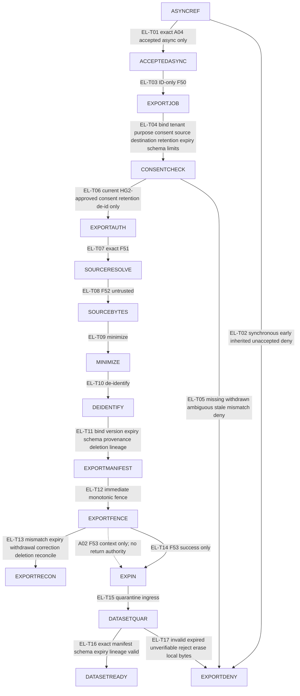
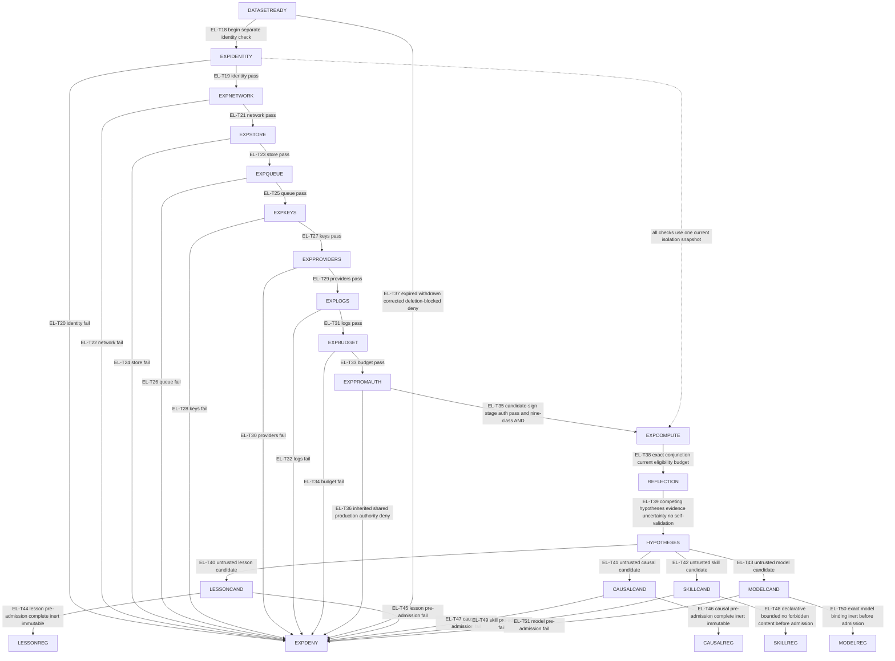
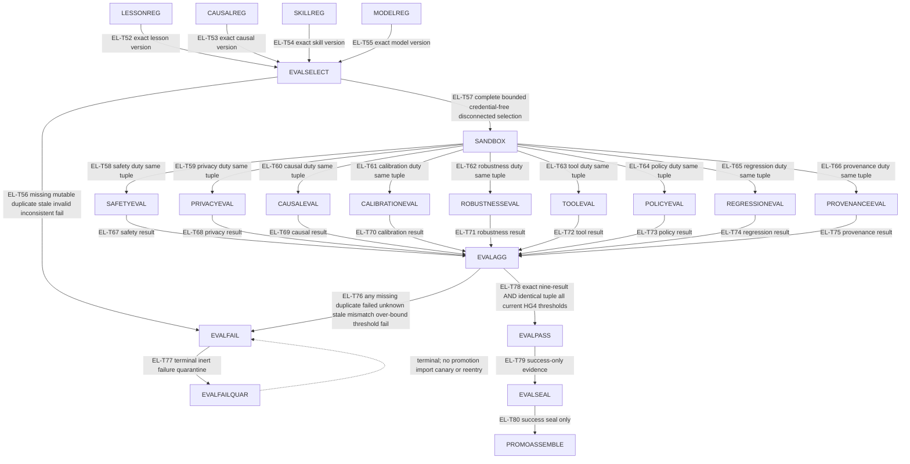
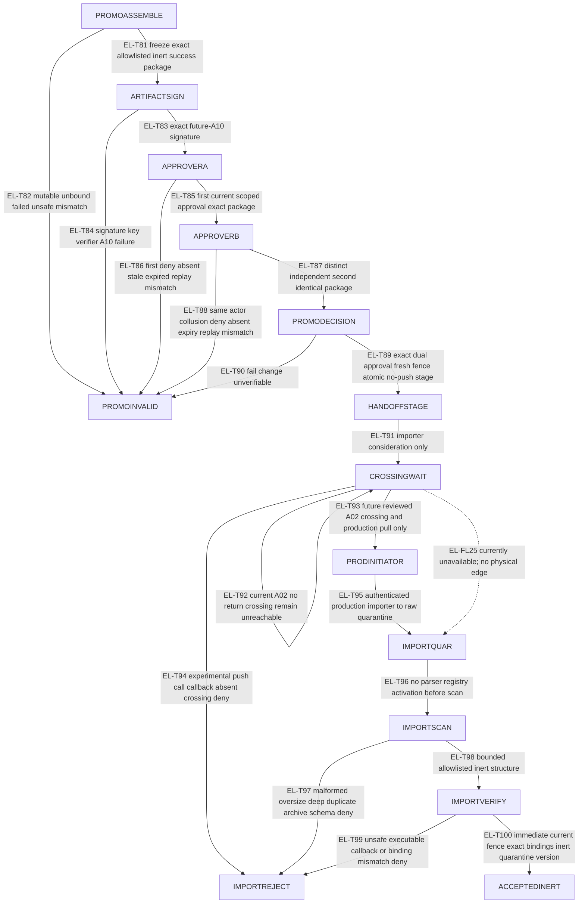
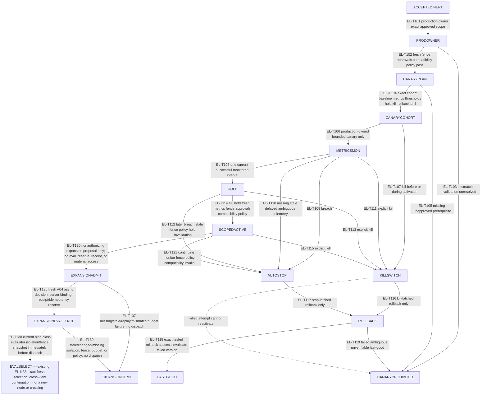
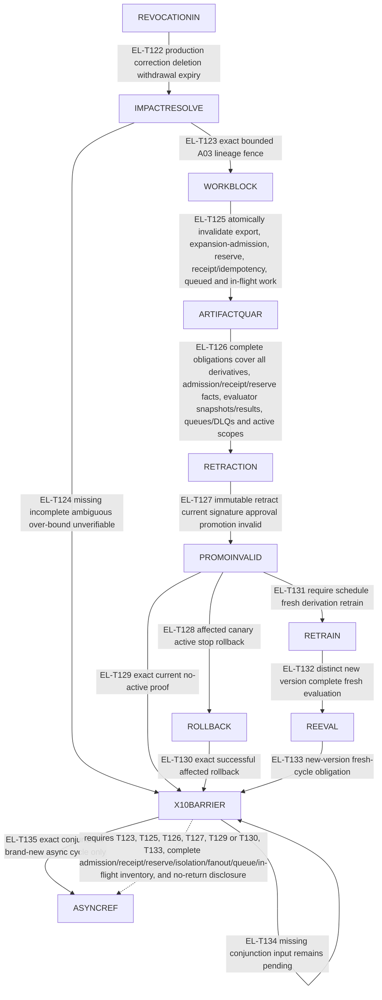

# Continuity v3 experimental learning and promotion path

**Status:** A05 R7 prospective ordering/design evidence only; Architecture v3
is not frozen. **Risk:** critical. **Scope:** a fail-closed logical learning,
evaluation, promotion, import, canary, rollback, and reentry contract.

## 1. Reading rules, ownership, availability, and nonclaims

- The normative registers in §§4-11 govern. IDs are contiguous:
  `EL-N01`-`EL-N89`, `EL-T01`-`EL-T139`, `EL-FL01`-`EL-FL34`,
  `EL-S01`-`EL-S45`, `EL-IN01`-`EL-IN34`, `EL-IV01`-`EL-IV30`,
  `EL-TH01`-`EL-TH28`, `EL-CUT01`-`EL-CUT27`, and
  `EL-AT01`-`EL-AT39`.
- The overview is nonnormative and contains no normative ID. Each solid edge
  in Details A-F has exactly one transition ID. Dotted edges are context only
  and grant no authority. Solid edges are logical order, never an A02 physical
  crossing.
- [A02](system-trust-boundaries-v3.md) exclusively owns `TB-*`, `AP-*`, data
  classes, and `F01`-`F90`. A05 creates no physical boundary or flow.
  `F50`-`F53` retain exact asynchronous, ID-only job, exact source dereference,
  untrusted return, and one-way consented/minimized/de-identified/versioned/
  expiring export semantics. Current A02 has no TB-X return crossing.
- [A03](data-deletion-lifecycle-v3.md) exclusively owns correction, deletion,
  real/unknown outcomes, fences, and no-return. Production records only export
  or boundary-delivery facts; they never infer TB-X purge, retraining,
  evaluation, deletion, or acknowledgement completion.
- [A04](governed-decision-path-v3.md) exclusively owns governed decisions and
  noninheritance. Experimental material never gains identity, tenant, policy,
  credential, tool, canonical-write, activation, promotion, or receipt
  authority. A10 exclusively owns receipt/version/signature/digest algorithms,
  keys, and verifiers; A05 binds future semantic inputs only.
- `HG-2` unresolved means no export success: `EL-T06`, `EL-T14`, and
  `EL-FL04`-`EL-FL08` are unavailable. `HG-4` unresolved means no evaluation
  pass, approval, promotion, import, or canary success. `HG-5` unresolved means
  no physical-isolation, crossing, deployment, or operations claim. Missing,
  ambiguous, stale, duplicate, conflicting, over-bound, or unverifiable input
  fails closed.
- `EL-S25 waiting_for_reviewed_crossing` is the furthest currently reachable
  import state. Future import is production-initiated exact pull into a
  production-owned quarantine importer after a separately reviewed current
  A02 crossing. Experimental identities cannot push, call, callback, select a
  production destination, possess production credentials, or write production.
- Nodes are logical responsibilities and do not select a service, account,
  provider, table, schema, implementation, deployment, or IaC resource.

## 2. Coordinated views

### 2.1 Overview — NONNORMATIVE

```mermaid
flowchart LR
    A["Accepted async"] --> B["Consented export"]
    B --> C["Nine-class isolation"]
    C --> D["Four inert registries"]
    D --> E["Nine-way evaluation AND"]
    E --> F["Strict signed dual approval"]
    F --> G["Unavailable crossing"]
    G --> H["Production quarantine"]
    H --> I["Measured canary and rollback"]
    I --> J["X10 barrier and new cycle"]
```

### 2.2 Detail A — referral and one-way export

### 2.3 Detail B — nine-class isolation and four inert registries

### 2.4 Detail C — complete nine-way evaluation AND

### 2.5 Detail D — strict promotion and future production pull

### 2.6 Detail E — canary, monitored hold, stop, kill, and rollback

### 2.7 Detail F — X10 conjunctive barrier and new-cycle-only reentry

### 2.8 Transition-to-view index

| View | Exact transitions |
| --- | --- |
| Detail A | `EL-T01`, `EL-T02`, `EL-T03`, `EL-T04`, `EL-T05`, `EL-T06`, `EL-T07`, `EL-T08`, `EL-T09`, `EL-T10`, `EL-T11`, `EL-T12`, `EL-T13`, `EL-T14`, `EL-T15`, `EL-T16`, `EL-T17` |
| Detail B | `EL-T18`, `EL-T19`, `EL-T20`, `EL-T21`, `EL-T22`, `EL-T23`, `EL-T24`, `EL-T25`, `EL-T26`, `EL-T27`, `EL-T28`, `EL-T29`, `EL-T30`, `EL-T31`, `EL-T32`, `EL-T33`, `EL-T34`, `EL-T35`, `EL-T36`, `EL-T37`, `EL-T38`, `EL-T39`, `EL-T40`, `EL-T41`, `EL-T42`, `EL-T43`, `EL-T44`, `EL-T45`, `EL-T46`, `EL-T47`, `EL-T48`, `EL-T49`, `EL-T50`, `EL-T51` |
| Detail C | `EL-T52`, `EL-T53`, `EL-T54`, `EL-T55`, `EL-T56`, `EL-T57`, `EL-T58`, `EL-T59`, `EL-T60`, `EL-T61`, `EL-T62`, `EL-T63`, `EL-T64`, `EL-T65`, `EL-T66`, `EL-T67`, `EL-T68`, `EL-T69`, `EL-T70`, `EL-T71`, `EL-T72`, `EL-T73`, `EL-T74`, `EL-T75`, `EL-T76`, `EL-T77`, `EL-T78`, `EL-T79`, `EL-T80` |
| Detail D | `EL-T81`, `EL-T82`, `EL-T83`, `EL-T84`, `EL-T85`, `EL-T86`, `EL-T87`, `EL-T88`, `EL-T89`, `EL-T90`, `EL-T91`, `EL-T92`, `EL-T93`, `EL-T94`, `EL-T95`, `EL-T96`, `EL-T97`, `EL-T98`, `EL-T99`, `EL-T100` |
| Detail E | `EL-T101`, `EL-T102`, `EL-T103`, `EL-T104`, `EL-T105`, `EL-T106`, `EL-T107`, `EL-T108`, `EL-T109`, `EL-T110`, `EL-T111`, `EL-T112`, `EL-T113`, `EL-T114`, `EL-T115`, `EL-T116`, `EL-T117`, `EL-T118`, `EL-T119`, `EL-T120`, `EL-T121`, `EL-T136`, `EL-T137`, `EL-T138`, `EL-T139` |
| Detail F | `EL-T122`, `EL-T123`, `EL-T124`, `EL-T125`, `EL-T126`, `EL-T127`, `EL-T128`, `EL-T129`, `EL-T130`, `EL-T131`, `EL-T132`, `EL-T133`, `EL-T134`, `EL-T135` |

## 3. Normative ordering contracts

### 3.1 Isolation and candidate admission

Reflection is unreachable until one current snapshot proves all nine separate
isolation classes: identity, network, store, queue, keys, providers, logs,
budget, and experimental candidate-sign/stage authority. Every check has an
explicit denial exit. Each of the four candidate types has its own
pre-admission validation; forbidden skill content and incomplete or executable
world models are rejected before any registry admission. Registries are inert,
immutable append/supersede structures.

### 3.2 Evaluation AND and success-only seal

A promotion set may contain one or more candidate types, but every selected
immutable version enters the same evaluation identity. `EL-EVALAGG` accepts
exactly one current result for each of safety, privacy, causal, calibration,
robustness, tool, policy, regression, and provenance, all over the identical
artifact set/evaluation/suite/corpus/configuration/threshold/fence tuple.
Missing, duplicate, failed, stale, unknown, mismatched, or over-bound input has
only the terminal `EVALFAILQUAR` exit. `EVALSEAL` is success-only; a future
historical failure seal must be a different construct and cannot reach
promotion assembly.

### 3.3 Promotion, import, and canary conjunctions

Promotion is one strict chain: exact success package binding, future-A10
signature, first current scoped approval, independent second approval of the
same package, fresh correction/deletion/consent/expiry fence, then atomic
immutable no-push/no-callback staging. No sibling fact or single approval
substitutes. Current topology stops at `CROSSINGWAIT`. A future production pull
must land raw bytes in quarantine, scan before parsing, verify allowlisted
nonexecutable inert structure and every binding, then accept a quarantine
version with no activation authority.

Canary denial, canary active, monitored successful hold, automatic stop, kill,
rollback required, last-good, and scoped active are distinct. Only a current
successful monitored hold can activate. Stop or kill latches into rollback; a
killed or stopped attempt cannot reactivate, and rollback failure is prohibited.
A new attempt begins from a separately accepted inert version.

### A05 receipt and bounded-work contract

Every durable or external A05 stage—expansion admission, evaluation fanout and
aggregation, approval, handoff, import, canary, rollback, and X10 reentry—binds
an A10-owned semantic receipt identity. A05 specifies semantic bindings only;
A10 owns serialization, algorithms, keys, and verifiers. Immutable metadata and
ordinary logs remain content-free and contain only approved identifiers,
versions, bounded status/enums/counts, ownership, lineage, and erasable
references. Raw payloads, prompts, model/provider/evaluation outputs,
credentials, secrets, rejected bytes, unsafe material, low-entropy fingerprints,
and content-derived metadata are excluded.

Every evaluation fanout creates a new evaluation and idempotency identity with
dimension-bound deduplication. Queues and DLQs carry identifiers and bounded
metadata only. Duplicate, reordered, replayed, stale, retried, or lost-ack
work cannot create a second evaluation or reserve. Principal/tenant/project
reserves precede dispatch and bound concurrency, retries, cost, and circuit
behavior; settled observed work releases unused reserve. Circuit-open,
retry-exhausted, budget-exhausted, or reconciliation-ambiguous work stops
without an authorization bypass. Importer, canary, rollback, and reentry use
the same bounded reserve/settle/release and content-free receipt semantics.

Scope expansion is never `SCOPEDACTIVE → CANARYPLAN` or `SCOPEDACTIVE → EVALSELECT`.
`EL-T120` emits only a nonauthorizing proposal to `EXPANSIONADMIT`. A fresh
production-owned A04 accepted-async decision, new receipt/idempotency identity,
server tenant/principal/purpose/consent/policy/fence binding, bounded reserve,
and current evaluator-isolation snapshot must pass through `EL-T136` and
`EL-T138` before `EVALSELECT`. Only then may the attempt follow the complete
nine-way evaluation, success seal, package binding, signature, independent
approvals, fresh fence, immutable stage, future import quarantine/verification,
separate `ACCEPTEDINERT`, and `PRODOWNER` path. Failure, current no-return, or
any pending human gate leaves the expansion unavailable while the current scope
remains independently monitored.

### 3.4 X10 conjunctive barrier

No branch independently reenables learning. `X10BARRIER` requires the ordered
work block, complete lineage obligations and quarantine/retraction, current
promotion invalidation, exact no-active proof or successful affected rollback,
fresh-version disposition, and explicit TB-X no-return limitation. Incomplete
or unverifiable input remains pending. Success returns only to `ASYNCREF` as a
brand-new asynchronous cycle; an old artifact never reenters.

### 3.5 Documented terminal sinks

Within this bounded A05 graph, `EXPORTDENY`, `EXPORTRECON`, `EXPDENY`,
`EXPANSIONDENY`, `EVALFAILQUAR`, `IMPORTREJECT`, `CANARYPROHIBITED`, and `LASTGOOD` are
documented solid-edge sinks for their applicable attempt. `PROMOINVALID` is a
sink for a rejected pre-import promotion attempt; its Detail F exits apply only
when a later production-owned correction/deletion/withdrawal/expiry impact must
be resolved. No sink has a success, promotion, import, activation, or old-
artifact-reentry edge. Cross-view continuation nodes are not sinks.

## 4. Normative node register

| ID | Logical responsibility |
| --- | --- |
| `EL-N01` | `ASYNCREF` — A04-published asynchronous referral. |
| `EL-N02` | `ACCEPTEDASYNC` — accepted asynchronous work. |
| `EL-N03` | `EXPORTJOB` — ID-only export job. |
| `EL-N04` | `EXPORTAUTH` — current export authorization. |
| `EL-N05` | `CONSENTCHECK` — scoped consent decision. |
| `EL-N06` | `SOURCERESOLVE` — exact authorized source resolver. |
| `EL-N07` | `SOURCEBYTES` — untrusted source candidate bytes. |
| `EL-N08` | `MINIMIZE` — minimization. |
| `EL-N09` | `DEIDENTIFY` — de-identification. |
| `EL-N10` | `EXPORTMANIFEST` — versioned bound manifest. |
| `EL-N11` | `EXPORTFENCE` — immediate monotonic pre-export fence. |
| `EL-N12` | `EXPORTDENY` — export denial and local erase. |
| `EL-N13` | `EXPORTRECON` — export reconciliation. |
| `EL-N14` | `EXPIN` — one-way experimental ingress. |
| `EL-N15` | `DATASETQUAR` — dataset quarantine. |
| `EL-N16` | `DATASETREADY` — eligible isolated dataset. |
| `EL-N17` | `EXPIDENTITY` — separate experimental identity check. |
| `EL-N18` | `EXPNETWORK` — separate experimental network check. |
| `EL-N19` | `EXPCOMPUTE` — isolated compute admission barrier reachable only after exact nine-class success. |
| `EL-N20` | `EXPSTORE` — separate experimental store check. |
| `EL-N21` | `EXPQUEUE` — separate experimental queue check. |
| `EL-N22` | `EXPKEYS` — separate experimental key check. |
| `EL-N23` | `EXPPROVIDERS` — separate experimental provider check. |
| `EL-N24` | `EXPLOGS` — separate experimental log check. |
| `EL-N25` | `EXPBUDGET` — separate experimental budget check. |
| `EL-N26` | `EXPPROMAUTH` — separate experimental candidate-sign/stage authority check. |
| `EL-N27` | `EXPDENY` — terminal isolation/budget/circuit/expiry/candidate/forbidden-content denial. |
| `EL-N28` | `REFLECTION` — bounded isolated reflection. |
| `EL-N29` | `HYPOTHESES` — explicit competing hypotheses. |
| `EL-N30` | `LESSONCAND` — untrusted lesson candidate. |
| `EL-N31` | `CAUSALCAND` — untrusted causal candidate. |
| `EL-N32` | `SKILLCAND` — untrusted declarative-skill candidate. |
| `EL-N33` | `MODELCAND` — untrusted world-model candidate. |
| `EL-N34` | `LESSONREG` — inert lesson registry. |
| `EL-N35` | `CAUSALREG` — inert causal registry. |
| `EL-N36` | `SKILLREG` — inert skill registry. |
| `EL-N37` | `MODELREG` — inert model registry. |
| `EL-N38` | `EVALSELECT` — exact fresh immutable artifact-set/evaluation/scope selection; prior active/evaluation/approval/import/canary state grants no authority. |
| `EL-N39` | `SANDBOX` — production-disconnected bounded sandbox. |
| `EL-N40` | `SAFETYEVAL` — safety evaluation. |
| `EL-N41` | `PRIVACYEVAL` — privacy evaluation. |
| `EL-N42` | `CAUSALEVAL` — causal evaluation. |
| `EL-N43` | `CALIBRATIONEVAL` — calibration evaluation. |
| `EL-N44` | `ROBUSTNESSEVAL` — robustness evaluation. |
| `EL-N45` | `TOOLEVAL` — tool evaluation. |
| `EL-N46` | `POLICYEVAL` — policy evaluation. |
| `EL-N47` | `REGRESSIONEVAL` — regression evaluation. |
| `EL-N48` | `PROVENANCEEVAL` — provenance evaluation. |
| `EL-N49` | `EVALAGG` — exact nine-result AND aggregator. |
| `EL-N50` | `EVALFAIL` — failed/missing/unknown decision with no promotion exit. |
| `EL-N51` | `EVALPASS` — nonauthorizing exact pass candidate. |
| `EL-N52` | `EVALSEAL` — success-only sealed nine-way evidence. |
| `EL-N53` | `PROMOASSEMBLE` — success-package assembler. |
| `EL-N54` | `ARTIFACTSIGN` — future-A10 semantic signer. |
| `EL-N55` | `APPROVERA` — first scoped approver. |
| `EL-N56` | `APPROVERB` — independent second approver. |
| `EL-N57` | `PROMODECISION` — exact same-bundle independent dual approval only. |
| `EL-N58` | `HANDOFFSTAGE` — immutable isolated no-push stage. |
| `EL-N59` | `CROSSINGWAIT` — current no-return crossing wait. |
| `EL-N60` | `PRODINITIATOR` — future production importer initiator. |
| `EL-N61` | `IMPORTQUAR` — production-owned raw import quarantine. |
| `EL-N62` | `IMPORTSCAN` — streaming bounded scanner. |
| `EL-N63` | `IMPORTVERIFY` — inert artifact verifier. |
| `EL-N64` | `IMPORTREJECT` — import rejection. |
| `EL-N65` | `ACCEPTEDINERT` — accepted inert quarantine version. |
| `EL-N66` | `PRODOWNER` — production activation owner. |
| `EL-N67` | `CANARYPLAN` — bounded canary plan. |
| `EL-N68` | `CANARYCOHORT` — bounded cohort. |
| `EL-N69` | `METRICSMON` — current metrics monitor. |
| `EL-N70` | `HOLD` — monitored successful hold only. |
| `EL-N71` | `AUTOSTOP` — stop-latched state. |
| `EL-N72` | `KILLSWITCH` — kill-latched state. |
| `EL-N73` | `ROLLBACK` — rollback-required executor. |
| `EL-N74` | `LASTGOOD` — tested last-good evidence. |
| `EL-N75` | `SCOPEDACTIVE` — active approved scope; expansion is a separate proposal through `EL-T120 → EXPANSIONADMIT → EL-T136 → EXPANSIONEVALFENCE → EL-T138 → EVALSELECT`, with no inherited authority. |
| `EL-N76` | `REVOCATIONIN` — production correction/deletion/withdrawal/expiry input. |
| `EL-N77` | `IMPACTRESOLVE` — A03 lineage-impact resolver. |
| `EL-N78` | `WORKBLOCK` — affected-work blocker. |
| `EL-N79` | `ARTIFACTQUAR` — affected-artifact quarantine. |
| `EL-N80` | `RETRACTION` — immutable retraction. |
| `EL-N81` | `PROMOINVALID` — current promotion invalidation. |
| `EL-N82` | `RETRAIN` — required/scheduled fresh derivation; not TB-X completion proof. |
| `EL-N83` | `REEVAL` — new-version reevaluation only. |
| `EL-N84` | `EVALFAILQUAR` — terminal inert failure quarantine with no promotion/import/canary/reentry. |
| `EL-N85` | `CANARYPROHIBITED` — terminal canary prerequisite denial. |
| `EL-N86` | `X10BARRIER` — conjunctive work-block, lineage, invalidation, rollback/no-active, fresh-version, and no-return barrier. |
| `EL-N87` | `EXPANSIONADMIT` — production-owned fresh A04 asynchronous expansion-admission fact; no inherited authority. |
| `EL-N88` | `EXPANSIONDENY` — terminal no-dispatch denial for missing, stale, replayed, mismatched, over-budget, or unsafe expansion admission. |
| `EL-N89` | `EXPANSIONEVALFENCE` — current dedicated evaluator-isolation, budget, and fence snapshot immediately before dispatch. |

## 5. Normative transition register

The register endpoints and semantics are exactly those on the same-ID solid
edges in Details A-F. This table provides an independent once-only register.

| IDs | Normative semantics |
| --- | --- |
| `EL-T01` | `ASYNCREF → ACCEPTEDASYNC`: exact A04 accepted asynchronous referral only. |
| `EL-T02` | `ASYNCREF → EXPORTDENY`: deny synchronous, early, inherited, or unaccepted referral. |
| `EL-T03` | `ACCEPTEDASYNC → EXPORTJOB`: ID-only `F50` job. |
| `EL-T04` | `EXPORTJOB → CONSENTCHECK`: bind tenant, purpose, consent scope/version, source lineage, destination, retention, expiry, schema, limits. |
| `EL-T05` | `CONSENTCHECK → EXPORTDENY`: deny missing, withdrawn, ambiguous, stale, or mismatched consent. |
| `EL-T06` | `CONSENTCHECK → EXPORTAUTH`: current HG2-approved consent, retention, and de-identification only. |
| `EL-T07` | `EXPORTAUTH → SOURCERESOLVE`: exact `F51`. |
| `EL-T08` | `SOURCERESOLVE → SOURCEBYTES`: untrusted `F52`. |
| `EL-T09` | `SOURCEBYTES → MINIMIZE`: minimize. |
| `EL-T10` | `MINIMIZE → DEIDENTIFY`: de-identify. |
| `EL-T11` | `DEIDENTIFY → EXPORTMANIFEST`: bind version, expiry, schema, provenance, deletion lineage. |
| `EL-T12` | `EXPORTMANIFEST → EXPORTFENCE`: immediate monotonic fence. |
| `EL-T13` | `EXPORTFENCE → EXPORTRECON`: mismatch, expiry, withdrawal, concurrent correction/deletion denies and reconciles. |
| `EL-T14` | `EXPORTFENCE → EXPIN`: `F53` success only. |
| `EL-T15` | `EXPIN → DATASETQUAR`: quarantine ingress. |
| `EL-T16` | `DATASETQUAR → DATASETREADY`: exact manifest/schema/expiry/lineage validation. |
| `EL-T17` | `DATASETQUAR → EXPORTDENY`: invalid, expired, or unverifiable ingress rejects and erases locally controlled bytes. |
| `EL-T18` | `DATASETREADY → EXPIDENTITY`: begin separate identity check. |
| `EL-T19` | `EXPIDENTITY → EXPNETWORK`: identity pass. |
| `EL-T20` | `EXPIDENTITY → EXPDENY`: identity fail. |
| `EL-T21` | `EXPNETWORK → EXPSTORE`: network pass. |
| `EL-T22` | `EXPNETWORK → EXPDENY`: network fail. |
| `EL-T23` | `EXPSTORE → EXPQUEUE`: store pass. |
| `EL-T24` | `EXPSTORE → EXPDENY`: store fail. |
| `EL-T25` | `EXPQUEUE → EXPKEYS`: queue pass. |
| `EL-T26` | `EXPQUEUE → EXPDENY`: queue fail. |
| `EL-T27` | `EXPKEYS → EXPPROVIDERS`: keys pass. |
| `EL-T28` | `EXPKEYS → EXPDENY`: keys fail. |
| `EL-T29` | `EXPPROVIDERS → EXPLOGS`: providers pass. |
| `EL-T30` | `EXPPROVIDERS → EXPDENY`: providers fail. |
| `EL-T31` | `EXPLOGS → EXPBUDGET`: logs pass. |
| `EL-T32` | `EXPLOGS → EXPDENY`: logs fail. |
| `EL-T33` | `EXPBUDGET → EXPPROMAUTH`: budget pass. |
| `EL-T34` | `EXPBUDGET → EXPDENY`: budget fail. |
| `EL-T35` | `EXPPROMAUTH → EXPCOMPUTE`: candidate-sign/stage authority passes and accumulated nine-class conjunction holds. |
| `EL-T36` | `EXPPROMAUTH → EXPDENY`: inherited/shared production promotion/import authority or credential denies. |
| `EL-T37` | `DATASETREADY → EXPDENY`: expired, withdrawn, corrected, or deletion-blocked before isolation completes. |
| `EL-T38` | `EXPCOMPUTE → REFLECTION`: exact conjunction, current eligibility, and budget only. |
| `EL-T39` | `REFLECTION → HYPOTHESES`: untrusted competing hypotheses, evidence, uncertainty, no self-validation. |
| `EL-T40` | `HYPOTHESES → LESSONCAND`: untrusted lesson candidate. |
| `EL-T41` | `HYPOTHESES → CAUSALCAND`: untrusted causal candidate. |
| `EL-T42` | `HYPOTHESES → SKILLCAND`: untrusted skill candidate. |
| `EL-T43` | `HYPOTHESES → MODELCAND`: untrusted model candidate. |
| `EL-T44` | `LESSONCAND → LESSONREG`: complete pre-admission scope/assumptions/contradictions/evidence/uncertainty/ownership/bounds/lineage; inert immutable. |
| `EL-T45` | `LESSONCAND → EXPDENY`: lesson pre-admission failure. |
| `EL-T46` | `CAUSALCAND → CAUSALREG`: complete pre-admission class/evidence/assumptions/contradictions/scope/lineage. |
| `EL-T47` | `CAUSALCAND → EXPDENY`: causal pre-admission failure. |
| `EL-T48` | `SKILLCAND → SKILLREG`: declarative schema/bounds and forbidden-content validation pass before admission. |
| `EL-T49` | `SKILLCAND → EXPDENY`: skill pre-admission failure. |
| `EL-T50` | `MODELCAND → MODELREG`: exact lineage/interface/calibration/limitations/compatibility/class/inertness before admission. |
| `EL-T51` | `MODELCAND → EXPDENY`: model pre-admission failure. |
| `EL-T52` | `LESSONREG → EVALSELECT`: exact lesson version. |
| `EL-T53` | `CAUSALREG → EVALSELECT`: exact causal version. |
| `EL-T54` | `SKILLREG → EVALSELECT`: exact skill version. |
| `EL-T55` | `MODELREG → EVALSELECT`: exact model version. |
| `EL-T56` | `EVALSELECT → EVALFAIL`: missing, mutable, duplicate, stale, invalid, or inconsistent selection fails. |
| `EL-T57` | `EVALSELECT → SANDBOX`: complete exact credential-free production-disconnected bounded selection. |
| `EL-T58` | `SANDBOX → SAFETYEVAL`: safety duty over exact tuple. |
| `EL-T59` | `SANDBOX → PRIVACYEVAL`: privacy duty over exact tuple. |
| `EL-T60` | `SANDBOX → CAUSALEVAL`: causal duty over exact tuple. |
| `EL-T61` | `SANDBOX → CALIBRATIONEVAL`: calibration duty over exact tuple. |
| `EL-T62` | `SANDBOX → ROBUSTNESSEVAL`: robustness duty over exact tuple. |
| `EL-T63` | `SANDBOX → TOOLEVAL`: tool duty over exact tuple. |
| `EL-T64` | `SANDBOX → POLICYEVAL`: policy duty over exact tuple. |
| `EL-T65` | `SANDBOX → REGRESSIONEVAL`: regression duty over exact tuple. |
| `EL-T66` | `SANDBOX → PROVENANCEEVAL`: provenance duty over exact tuple. |
| `EL-T67` | `SAFETYEVAL → EVALAGG`: safety result. |
| `EL-T68` | `PRIVACYEVAL → EVALAGG`: privacy result. |
| `EL-T69` | `CAUSALEVAL → EVALAGG`: causal result. |
| `EL-T70` | `CALIBRATIONEVAL → EVALAGG`: calibration result. |
| `EL-T71` | `ROBUSTNESSEVAL → EVALAGG`: robustness result. |
| `EL-T72` | `TOOLEVAL → EVALAGG`: tool result. |
| `EL-T73` | `POLICYEVAL → EVALAGG`: policy result. |
| `EL-T74` | `REGRESSIONEVAL → EVALAGG`: regression result. |
| `EL-T75` | `PROVENANCEEVAL → EVALAGG`: provenance result. |
| `EL-T76` | `EVALAGG → EVALFAIL`: any missing/duplicate/failed/unknown/stale/mismatched/over-bound result or absent/unapproved HG4 threshold fails. |
| `EL-T77` | `EVALFAIL → EVALFAILQUAR`: terminal inert failure quarantine. |
| `EL-T78` | `EVALAGG → EVALPASS`: exact nine-result AND on identical tuple meets all current HG4 thresholds. |
| `EL-T79` | `EVALPASS → EVALSEAL`: success-only evidence. |
| `EL-T80` | `EVALSEAL → PROMOASSEMBLE`: success seal only. |
| `EL-T81` | `PROMOASSEMBLE → ARTIFACTSIGN`: freeze exact allowlisted inert package binding artifact/version/digest, success-only evaluation digest, provenance, compatibility, target scope, expiry, and deletion lineage. |
| `EL-T82` | `PROMOASSEMBLE → PROMOINVALID`: mutable, unbound, failed-eval, missing, unsafe, or mismatched package. |
| `EL-T83` | `ARTIFACTSIGN → APPROVERA`: exact package signed under future A10. |
| `EL-T84` | `ARTIFACTSIGN → PROMOINVALID`: missing/invalid/ambiguous signature, key, verifier, or A10 input. |
| `EL-T85` | `APPROVERA → APPROVERB`: first current scoped approval of exact package. |
| `EL-T86` | `APPROVERA → PROMOINVALID`: deny, absent, stale, expired, replayed, or mismatched first approval. |
| `EL-T87` | `APPROVERB → PROMODECISION`: distinct independent second approver accepts identical package. |
| `EL-T88` | `APPROVERB → PROMOINVALID`: same actor, collusion-policy, deny, absence, expiry, replay, or mismatch. |
| `EL-T89` | `PROMODECISION → HANDOFFSTAGE`: exact dual approval plus immediate current correction/deletion/consent/expiry fence then atomic immutable no-push/no-callback staging. |
| `EL-T90` | `PROMODECISION → PROMOINVALID`: failure, change, or unverifiable promotion decision. |
| `EL-T91` | `HANDOFFSTAGE → CROSSINGWAIT`: importer consideration only. |
| `EL-T92` | `CROSSINGWAIT → CROSSINGWAIT`: current A02 has no return crossing; remain unreachable with no TB-X status. |
| `EL-T93` | `CROSSINGWAIT → PRODINITIATOR`: future-only separately reviewed current A02 crossing plus production exact pull; unavailable. |
| `EL-T94` | `CROSSINGWAIT → IMPORTREJECT`: experimental push/call/callback, absent crossing, caller destination, or non-production initiation denies. |
| `EL-T95` | `PRODINITIATOR → IMPORTQUAR`: authenticated production importer places raw bytes in production quarantine. |
| `EL-T96` | `IMPORTQUAR → IMPORTSCAN`: no parser, registry, or activation before scan. |
| `EL-T97` | `IMPORTSCAN → IMPORTREJECT`: malformed, oversize, depth/count/recursion, duplicate-field, archive/container, unknown, or schema-invalid input. |
| `EL-T98` | `IMPORTSCAN → IMPORTVERIFY`: bounded allowlisted inert structure. |
| `EL-T99` | `IMPORTVERIFY → IMPORTREJECT`: unsafe deserialization, pickle, scripts, dynamic imports, executable hooks, credentials, callbacks, or signature/digest/provenance/evaluation/approval/scope/compatibility/fence mismatch. |
| `EL-T100` | `IMPORTVERIFY → ACCEPTEDINERT`: immediate current fence plus exact bindings accepts nonexecutable inert quarantine version only. |
| `EL-T101` | `ACCEPTEDINERT → PRODOWNER`: exact production owner and approved scope. |
| `EL-T102` | `PRODOWNER → CANARYPLAN`: fresh fence, approvals, compatibility, and current policy pass. |
| `EL-T103` | `PRODOWNER → CANARYPROHIBITED`: mismatch, invalidation, or unresolved prerequisite. |
| `EL-T104` | `CANARYPLAN → CANARYCOHORT`: exact bounded cohort/baseline/metrics/thresholds/hold/kill/rollback target and drill evidence. |
| `EL-T105` | `CANARYPLAN → CANARYPROHIBITED`: missing or unapproved owner/threshold/topology/metric/hold/rollback/drill. |
| `EL-T106` | `CANARYCOHORT → METRICSMON`: production-owned bounded canary activation only. |
| `EL-T107` | `CANARYCOHORT → KILLSWITCH`: kill before or during activation. |
| `EL-T108` | `METRICSMON → HOLD`: one current successful monitored interval. |
| `EL-T109` | `METRICSMON → AUTOSTOP`: breach. |
| `EL-T110` | `METRICSMON → AUTOSTOP`: missing, stale, delayed, or ambiguous telemetry. |
| `EL-T111` | `METRICSMON → KILLSWITCH`: explicit kill. |
| `EL-T112` | `HOLD → AUTOSTOP`: later breach/stale/missing/fence/policy incompatibility or hold invalidation. |
| `EL-T113` | `HOLD → KILLSWITCH`: explicit kill. |
| `EL-T114` | `HOLD → SCOPEDACTIVE`: full hold plus fresh metrics/fence/approvals/compatibility/policy permits approved scope. |
| `EL-T115` | `SCOPEDACTIVE → KILLSWITCH`: explicit kill. |
| `EL-T116` | `KILLSWITCH → ROLLBACK`: kill-latched with no return to hold/active. |
| `EL-T117` | `AUTOSTOP → ROLLBACK`: stop-latched rollback. |
| `EL-T118` | `ROLLBACK → LASTGOOD`: exact tested rollback success and failed-version invalidation. |
| `EL-T119` | `ROLLBACK → CANARYPROHIBITED`: failed, ambiguous, or unverifiable last-good. |
| `EL-T120` | `SCOPEDACTIVE → EXPANSIONADMIT`: emits only a nonauthorizing proposal containing the exact immutable artifact/digest and proposed scope; it creates no accepted async work, reserve, receipt success, evaluator access, material access, or inherited authority. Only `EL-T136` creates fresh admission/reserve and only `EL-T138` reaches `EVALSELECT`. |
| `EL-T121` | `SCOPEDACTIVE → AUTOSTOP`: continuing monitoring/fence/policy/compatibility invalidation. |
| `EL-T122` | `REVOCATIONIN → IMPACTRESOLVE`: production-owned correction, deletion, consent withdrawal, or expiry. |
| `EL-T123` | `IMPACTRESOLVE → WORKBLOCK`: exact bounded A03 lineage/fence resolution. |
| `EL-T124` | `IMPACTRESOLVE → X10BARRIER`: missing, incomplete, ambiguous, over-bound, or unverifiable input blocks reentry. |
| `EL-T125` | `WORKBLOCK → ARTIFACTQUAR`: atomically invalidate export, expansion-admission, reserve, receipt/idempotency, queued and in-flight work. |
| `EL-T126` | `ARTIFACTQUAR → RETRACTION`: complete obligations cover all derivatives, admission/receipt/reserve facts, evaluator snapshots/results, queues/DLQs, and active scopes. |
| `EL-T127` | `RETRACTION → PROMOINVALID`: immutable retraction plus current signature/approval/promotion invalidation. |
| `EL-T128` | `PROMOINVALID → ROLLBACK`: affected canary or active state must stop/rollback. |
| `EL-T129` | `PROMOINVALID → X10BARRIER`: exact current no-active proof only. |
| `EL-T130` | `ROLLBACK → X10BARRIER`: exact successful affected rollback; failure remains pending. |
| `EL-T131` | `PROMOINVALID → RETRAIN`: require/schedule fresh derivation/retrain, not completion. |
| `EL-T132` | `RETRAIN → REEVAL`: distinct new version and complete fresh evaluation; TB-X remains unknown/no-return. |
| `EL-T133` | `REEVAL → X10BARRIER`: new-version/fresh-cycle obligation only. |
| `EL-T134` | `X10BARRIER → X10BARRIER`: any missing work block, lineage quarantine/retraction, promotion invalidation, rollback/no-active, fresh version, expansion admission, receipt/idempotency, reserve settlement/release, evaluator fence, fanout/result, queue/DLQ, in-flight accounting, or no-return disclosure remains pending. |
| `EL-T135` | `X10BARRIER → ASYNCREF`: exact conjunction begins brand-new asynchronous cycle only; never old-artifact reentry. |
| `EL-T136` | `EXPANSIONADMIT → EXPANSIONEVALFENCE`: only a fresh production-owned authenticated A04 asynchronous expansion decision consistent with `GD-T-154`/`GD-T-15`/`GD-T-17`; bind server-resolved tenant, principal, purpose, current consent/policy, deletion/revision fence, exact immutable artifact version/digest, proposed scope, new decision/receipt/idempotency identity, and atomically reserved bounded principal/tenant/project retry/concurrency/cost budget. Missing, stale, duplicate, replayed, mismatched, expired, over-budget, circuit-open, or unverifiable input takes `EL-T137` with no dispatch. |
| `EL-T137` | `EXPANSIONADMIT → EXPANSIONDENY`: terminal no-dispatch for absent/invalid A04 admission, binding, receipt/idempotency, reserve/retry/circuit, or duplicate. |
| `EL-T138` | `EXPANSIONEVALFENCE → EVALSELECT`: immediately pre-dispatch requires a fresh dedicated nine-class evaluator-isolation snapshot—identity, network, store, queue, keys, providers, logs, budget, candidate-sign/stage authority—exact-matching the new A04 decision, artifact/digest, scope, receipt/idempotency, deletion fence, and unspent reserve; only the conjunction reaches `EVALSELECT`, with no inherited authority. |
| `EL-T139` | `EXPANSIONEVALFENCE → EXPANSIONDENY`: terminal no-dispatch for missing, stale, changed, replayed, mismatched, or unverifiable isolation, budget, fence, policy, artifact, scope, receipt, or idempotency. |

## 6. Normative flow register

| ID | Source → destination | Authority, guard, and current availability |
| --- | --- | --- |
| `EL-FL01` | referral → accepted async | A04 exact referral only; available. |
| `EL-FL02` | accepted → ID-only export job | `F50`; available. |
| `EL-FL03` | export job → consent decision | Denial-only while HG2 pending. |
| `EL-FL04` | consent success → source request | `F51`; unavailable pending HG2. |
| `EL-FL05` | source return → minimize | `F52`; unavailable without prior source-request success. |
| `EL-FL06` | minimized → de-identify | Unavailable without prior source-request success. |
| `EL-FL07` | manifest/fence → release | Success unavailable pending HG2. |
| `EL-FL08` | release → `F53` ingress | Success unavailable pending HG2; no HG5 physical-isolation claim. |
| `EL-FL09` | ingress → dataset quarantine | No operational availability is claimed. |
| `EL-FL10` | dataset → nine-class conjunction | Success unavailable pending HG5. |
| `EL-FL11` | conjunction → reflection | Unavailable pending HG5. |
| `EL-FL12` | reflection → hypotheses | Untrusted only. |
| `EL-FL13` | hypotheses → four candidate types | Untrusted; no self-promotion. |
| `EL-FL14` | four prevalidated candidates → four inert registries | Each type validates before admission. |
| `EL-FL15` | ordinary registry selection, or `EL-T120` scope-only request referencing exact unchanged immutable registry version/digest → fresh exact evaluation selection | Ordinary selection follows candidate/registry admission; expansion reaches fresh evaluation only through `EL-T120`, `EL-T136`, and `EL-T138`; no prior active/evaluation/approval/import/canary authority is inherited; every selected version takes the complete nine-way path. |
| `EL-FL16` | selection → production-disconnected sandbox | Credential-free bounded copy. |
| `EL-FL17` | sandbox → nine evaluation duties | Same exact tuple. |
| `EL-FL18` | nine outputs → AND aggregator | Exactly one current result per dimension. |
| `EL-FL19` | failure → terminal inert quarantine | Fail-closed logical path only. |
| `EL-FL20` | success → success-only seal/assembly | Unavailable pending HG4. |
| `EL-FL21` | bound package → signature → A → independent B | Unavailable pending HG4 and A10. |
| `EL-FL22` | dual approval/fresh fence → immutable stage | Unavailable pending HG4. |
| `EL-FL23` | handoff → crossing wait | No-return; no TB-X acknowledgement. |
| `EL-FL24` | production initiator → future crossing guard | Unavailable pending separate A02 review and HG5. |
| `EL-FL25` | future crossing → production quarantine | **CURRENTLY UNAVAILABLE**; never a solid physical edge. |
| `EL-FL26` | quarantine → scan/verify → accept/reject | Unavailable pending HG4/HG5. |
| `EL-FL27` | newly and separately accepted inert version for exact proposed scope → new production-owner/canary decision | Required for every scope expansion even with unchanged bytes; unavailable pending HG4/HG5. |
| `EL-FL28` | canary → metrics/hold | Unavailable pending HG4/HG5. |
| `EL-FL29` | stop/kill → rollback/last-good | Prospective production safety path. |
| `EL-FL30` | correction/deletion → complete impact and X10 | A03 remains authoritative. |
| `EL-FL31` | satisfied barrier → new async only | Never old-artifact reentry. |
| `EL-FL32` | scoped-active proposal → fresh A04 expansion admission fact | `EL-T120` proposal only; no authority, evaluation, reserve, or material access. |
| `EL-FL33` | accepted expansion admission → new receipt/idempotency, atomic reserve, evaluator-isolation/fence snapshot | Unavailable without fresh admission; bounded and content-free. |
| `EL-FL34` | current evaluator isolation/fence → exact `EVALSELECT` | No dispatch on mismatch or staleness; unavailable without the fresh conjunction. |

## 7. Normative state register

| ID | State |
| --- | --- |
| `EL-S01` | `not_referred` |
| `EL-S02` | `async_accepted` |
| `EL-S03` | `export_queued` |
| `EL-S04` | `export_denied` |
| `EL-S05` | `export_preparing` |
| `EL-S06` | `export_delivered_at_boundary` |
| `EL-S07` | `dataset_quarantined` |
| `EL-S08` | `dataset_eligible` |
| `EL-S09` | `dataset_expired_or_revoked` |
| `EL-S10` | `isolation_checking` |
| `EL-S11` | `isolation_denied` |
| `EL-S12` | `reflection_running` |
| `EL-S13` | `competing_hypotheses_retained` |
| `EL-S14` | `untrusted_candidates` |
| `EL-S15` | `inert_registered` |
| `EL-S16` | `evaluation_running` |
| `EL-S17` | `evaluation_failed_terminal`; no activation exit. |
| `EL-S18` | `evaluation_pass_candidate` |
| `EL-S19` | `success_evaluation_sealed` |
| `EL-S20` | `package_bound` |
| `EL-S21` | `package_signed` |
| `EL-S22` | `first_approval_current` |
| `EL-S23` | `dual_approved_for_import_consideration` |
| `EL-S24` | `handoff_staged` |
| `EL-S25` | `waiting_for_reviewed_crossing`; furthest current import state. |
| `EL-S26` | `import_quarantined` |
| `EL-S27` | `import_rejected` |
| `EL-S28` | `import_accepted_inert` |
| `EL-S29` | `canary_planned` |
| `EL-S30` | `canary_active` |
| `EL-S31` | `monitored_hold` |
| `EL-S32` | `scoped_active`; expansion is not a state loop or canary-plan reentry. The current scope remains separately monitored while expansion proceeds only through `EL-T120 → EXPANSIONADMIT → EL-T136 → EXPANSIONEVALFENCE → EL-T138 → EVALSELECT`, then must obtain distinct `import_accepted_inert` before a new canary plan. |
| `EL-S33` | `canary_prohibited`; no activation exit. |
| `EL-S34` | `automatic_stop_latched`; no activation exit. |
| `EL-S35` | `kill_latched`; no activation exit. |
| `EL-S36` | `rollback_required`; failure has no activation exit. |
| `EL-S37` | `rolled_back_last_good` |
| `EL-S38` | `correction_or_deletion_pending` |
| `EL-S39` | `affected_work_blocked` |
| `EL-S40` | `retracted_or_quarantined` |
| `EL-S41` | `x10_barrier_pending` |
| `EL-S42` | `superseded_fresh_cycle_only` |
| `EL-S43` | `expansion_request_pending` — proposal only; no accepted work, reserve, or evaluation. |
| `EL-S44` | `expansion_denied_no_dispatch` — terminal; no evaluation. |
| `EL-S45` | `expansion_isolation_fenced` — fresh admission, reserve, isolation, and fence immediately before `EVALSELECT`. |

## 8. Normative input and invariant registers

| ID | Material input |
| --- | --- |
| `EL-IN01` | A00 requirements traceability. |
| `EL-IN02` | A02 frozen boundaries and controls. |
| `EL-IN03` | A03 deletion and no-return lifecycle. |
| `EL-IN04` | A04 async and noninheritance ordering. |
| `EL-IN05` | Project goal. |
| `EL-IN06` | AGENTS and SECURITY requirements. |
| `EL-IN07` | Future A10 receipt/version/signature contract. |
| `EL-IN08` | Future reviewed A02 import crossing. |
| `EL-IN09` | Tenant, purpose, and referral. |
| `EL-IN10` | Consent decision, version, and scope. |
| `EL-IN11` | Source lineage and revisions. |
| `EL-IN12` | Minimization policy. |
| `EL-IN13` | De-identification policy and assurance. |
| `EL-IN14` | Retention, expiry, and residency. |
| `EL-IN15` | Correction/deletion epoch and fence. |
| `EL-IN16` | Export destination and dataset schema. |
| `EL-IN17` | Nine-class isolation proof. |
| `EL-IN18` | Registry types, schemas, versions, and bounds. |
| `EL-IN19` | Evidence, uncertainty, and competing hypotheses. |
| `EL-IN20` | Skill allowlist and bounds. |
| `EL-IN21` | World-model interfaces, calibration, limits, compatibility. |
| `EL-IN22` | Sandbox/no-production profile. |
| `EL-IN23` | Evaluation suite, corpus, and attack versions. |
| `EL-IN24` | Evaluation dimensions, thresholds, and abstention. |
| `EL-IN25` | Inert-format allowlist, size, structure, and schema. |
| `EL-IN26` | Future A10 sign/digest/verifier semantics. |
| `EL-IN27` | Approver roles, independence, scope, nonce, and expiry. |
| `EL-IN28` | Importer identity, initiation, and quarantine. |
| `EL-IN29` | Target policy, configuration, compatibility, and scope. |
| `EL-IN30` | Canary cohort, baseline, metrics, and stop thresholds. |
| `EL-IN31` | Hold, kill, rollback, and drill. |
| `EL-IN32` | Correction, deletion, withdrawal, and retraining standard. |
| `EL-IN33` | Principal/tenant/project reserve, settle, release, retry, concurrency, circuit, and bounded-cost policy. |
| `EL-IN34` | Future-A10-owned content-free receipt, immutable-metadata, and log allowlist with erasable-reference semantics. |

| ID | Invariant |
| --- | --- |
| `EL-IV01` | Learning is asynchronous only. |
| `EL-IV02` | No experimental production read/write credential or route exists. |
| `EL-IV03` | All nine isolation classes use one current snapshot before reflection. |
| `EL-IV04` | No production secret, queue, key, provider identity, telemetry, or budget is shared. |
| `EL-IV05` | `F50`-`F53` retain exact one-way semantics. |
| `EL-IV06` | Export binds consent, minimization, de-identification, version, expiry, and deletion lineage. |
| `EL-IV07` | Fresh export fence runs immediately before `F53`. |
| `EL-IV08` | Experimental material remains untrusted. |
| `EL-IV09` | Competing hypotheses remain; no self-validation or self-promotion. |
| `EL-IV10` | All four registries are inert immutable append/supersede structures and selected versions are evaluated. |
| `EL-IV11` | Forbidden skill content is rejected before registry admission. |
| `EL-IV12` | Model lineage/interface/calibration/limitations/compatibility validate before admission. |
| `EL-IV13` | Success requires exact nine-result AND; failure/missing/unknown is terminal inert. |
| `EL-IV14` | Evaluation pass creates no authority. |
| `EL-IV15` | Package bind, sign, A, independent B, fresh fence, and stage are strictly ordered and conjunctive. |
| `EL-IV16` | Neither approval alone nor rejection/stale fence grants consideration. |
| `EL-IV17` | No import occurs without a reviewed A02 crossing. |
| `EL-IV18` | Only production importer initiates. |
| `EL-IV19` | Import lands in production quarantine only. |
| `EL-IV20` | Only bounded nonexecutable inert material is acceptable. |
| `EL-IV21` | Import uses immediate fence and compatibility validation. |
| `EL-IV22` | Activation is separately governed by current policy. |
| `EL-IV23` | Prohibited, hold, auto-stop, kill, rollback-required, and active states are nonconflatable; kill requires rollback and cannot stale-reactivate. Scoped activation grants no expansion authority: every expansion starts at fresh `EVALSELECT`, and `CANARYPLAN` is reachable only after a distinct complete evaluation/promotion/import/`ACCEPTEDINERT`/`PRODOWNER` cycle. |
| `EL-IV24` | X10 is a complete conjunctive barrier including datasets, four candidate/registry classes, expansion admission, A10 receipt/idempotency, reserve settlement/release, evaluator snapshots/fences, nine fanout identities/results, ID-only queues/DLQs, packages, handoff, imports, in-flight expansion/evaluation/import/canary/rollback/reentry, and active scopes; it permits a new cycle only. |
| `EL-IV25` | TB-X handling remains unknown/no-return. |
| `EL-IV26` | A10 ownership, nonclaims, and HG2/HG4/HG5 pending-success unavailability are preserved. |
| `EL-IV27` | Every durable or consequential evaluation, import, canary, rollback, and reentry stage uses an A10-owned semantic receipt identity; immutable metadata and logs are content-free, and raw content, credentials, unsafe/rejected material, and content-derived metadata never enter them. |
| `EL-IV28` | Expansion and evaluation fanout reserve before dispatch, use idempotency and bounded retries/concurrency, carry ID-only queues/DLQs, settle or release work, and stop on circuit-open or denial-of-wallet conditions. |
| `EL-IV29` | `EL-T120` is proposal-only; fresh A04 accepted async, server tenant/principal/purpose/consent/policy/fence, artifact/scope, receipt/idempotency, and reserve precede evaluation. |
| `EL-IV30` | A current dedicated nine-class evaluator-isolation snapshot and exact fence/budget are required immediately before dispatch. |

## 9. Threat and cut registers

| ID | Threat |
| --- | --- |
| `EL-TH01` | Synchronous learning. |
| `EL-TH02` | Shared production credential or route. |
| `EL-TH03` | Cross-tenant/forged consent or direct `EXPORTAUTH` bypass. |
| `EL-TH04` | Over-export or reidentification. |
| `EL-TH05` | Stale fence. |
| `EL-TH06` | `F53` replay, partial delivery, or invented acknowledgement. |
| `EL-TH07` | Poisoning gains authority. |
| `EL-TH08` | Hypothesis suppression or self-validation. |
| `EL-TH09` | Wrong type enters registry or orphan version evades evaluation. |
| `EL-TH10` | Skill forbidden-content validation happens after admission. |
| `EL-TH11` | Model binding happens after admission or executable model enters. |
| `EL-TH12` | Sandbox escape. |
| `EL-TH13` | Partial/first/OR/duplicate/cross-artifact/stale aggregation or failure-to-promotion path. |
| `EL-TH14` | Failure/rejection substitutes into success seal. |
| `EL-TH15` | Bind/sign/approval/fence/stage reorder or sibling bypass. |
| `EL-TH16` | Hidden return push or callback. |
| `EL-TH17` | Archive/parser/decompression bomb. |
| `EL-TH18` | Unsafe deserialization, script, dynamic import, or callback. |
| `EL-TH19` | Confused deputy or wrong target. |
| `EL-TH20` | Scan-accept-activation TOCTOU. |
| `EL-TH21` | Denial treated as hold, killed treated as hold, or stale reactivation. |
| `EL-TH22` | Kill without rollback, rollback failure as last-good, or expansion reusing any prior evaluation/seal/package/signature/approval/fence/handoff/import/owner/canary plan, including a direct active-to-canary cycle. |
| `EL-TH23` | X10 branch race, incomplete set, or single branch reenables. |
| `EL-TH24` | Scheduled retrain or one-way dispatch shown as TB-X completion. |
| `EL-TH25` | Receipt, immutable metadata, experimental-log, or rejected-material leakage of raw content, credentials, unsafe bytes, low-entropy fingerprints, or unbounded correlation. |
| `EL-TH26` | Nine-way fanout/retry storms, duplicate expansion admissions, reserve/settle mismatch, unbounded importer/canary work, circuit bypass, or denial-of-wallet. |
| `EL-TH27` | Forged, replayed, stale, duplicate, or under-bound expansion admission, reserve, or evaluator-isolation snapshot. |
| `EL-TH28` | Receipt/idempotency mismatch or metadata/log fallback causing duplicate work, content leakage, or unbounded retry. |

Every cut requires before/after/concurrent, crash, duplicate, retry, reorder,
stale-worker, and lost-ack cases as applicable, and fails closed.

| ID | Cut |
| --- | --- |
| `EL-CUT01` | Before/after asynchronous acceptance. |
| `EL-CUT02` | Accepted state versus referral publication. |
| `EL-CUT03` | Consent decision versus authorization/source read. |
| `EL-CUT04` | Source bytes versus minimization. |
| `EL-CUT05` | Minimize/de-identify versus expiry. |
| `EL-CUT06` | Fence immediately before `F53`. |
| `EL-CUT07` | Partial/retry/reorder `F53`. |
| `EL-CUT08` | Ingress crash before manifest admission. |
| `EL-CUT09` | Expiry during isolation/reflection. |
| `EL-CUT10` | Correction during reflection. |
| `EL-CUT11` | Each four-type pre-admission commit versus forbidden rejection. |
| `EL-CUT12` | Every selected immutable registry version versus evaluation selection. |
| `EL-CUT13` | Sandbox escape. |
| `EL-CUT14` | All nine dispatch/result combinations, missing/duplicate/late, and aggregator crash. |
| `EL-CUT15` | Failure versus success seal/promotion; prove no serialization connects them. |
| `EL-CUT16` | Package bind/sign/first-approval changes. |
| `EL-CUT17` | Second-approver independence, replay, expiry, and same-bundle match. |
| `EL-CUT18` | Correction/deletion between dual approval, fresh fence, and stage. |
| `EL-CUT19` | Experimental push versus production pull. |
| `EL-CUT20` | Partial/oversize/ambiguous/parser import. |
| `EL-CUT21` | Scan, verify, fence, and accept ordering. |
| `EL-CUT22` | Invalidation between acceptance and canary. |
| `EL-CUT23` | Prohibited/active/hold/stop/kill/rollback/last-good races plus expansion concurrent with monitoring/correction/policy; prove the sole expansion path is `EL-T120 → EXPANSIONADMIT → EL-T136 → EXPANSIONEVALFENCE → EL-T138 → EVALSELECT`, and no `CANARYPLAN` exists without new nine-way success/seal/bind/sign/independent dual approval/fence-stage/import quarantine-verify/`ACCEPTEDINERT`/`PRODOWNER`. |
| `EL-CUT24` | Every X10 input including the listed admission, receipt/idempotency, reserve, evaluator snapshot, fanout, queue/DLQ, and in-flight classes; rollback/no-active, fresh version, crash/retry, and stale-old reentry. |
| `EL-CUT25` | Receipt creation, immutable metadata/log admission, and rejected material across expansion, evaluation, approval, handoff, import, canary, rollback, and reentry; prove content-free A10 semantics and erasable references. |
| `EL-CUT26` | Reserve → dispatch → fanout → dedup → settle/release, retry/backoff, DLQ, concurrency, and circuit races across expansion, evaluation, import, and canary. |
| `EL-CUT27` | `EL-T120` proposal replay/forgery, fresh A04 race, tenant/purpose/consent/fence changes, reserve exhaustion, duplicate idempotency, correction, kill, and stale isolation; prove no evaluation duty without `EL-T136` and `EL-T138`. |

## 10. Acceptance-test register and mapping

| ID | Required proof |
| --- | --- |
| `EL-AT01` | Seven renders, exact ranges/indexes, all nonterminals connected, and only documented terminal sinks with no success outgoing. |
| `EL-AT02` | No new A02 flow and exact `F50`-`F53` semantics. |
| `EL-AT03` | No synchronous learning path. |
| `EL-AT04` | Graph proves nine isolation pass/fail branches and compute unreachable unless all pass. |
| `EL-AT05` | Cross-plane denial proves no experimental production authority. |
| `EL-AT06` | Consent deny/pass matrix. |
| `EL-AT07` | Minimize/de-identify/version/expiry/schema bindings. |
| `EL-AT08` | Fresh pre-`F53` fence. |
| `EL-AT09` | One-way deletion with no inferred acknowledgement. |
| `EL-AT10` | Four untrusted candidates arise from competing hypotheses with no self-promotion. |
| `EL-AT11` | Four registries accept only typed prevalidated input, are immutable/superseding, and reach evaluation. |
| `EL-AT12` | Skill forbidden content denies before registry admission. |
| `EL-AT13` | Model binding denies before admission and every registry type takes full evaluation. |
| `EL-AT14` | Sandbox has no production access. |
| `EL-AT15` | Nine duties/results form complete unique same-tuple AND; omitting each prevents pass. |
| `EL-AT16` | Missing HG4 threshold or failed/unknown/stale/duplicate/mismatched result reaches only terminal failure quarantine. |
| `EL-AT17` | Poisoned self-report grants no authority. |
| `EL-AT18` | Mutation at bind/sign/A/B/fence/stage invalidates downstream. |
| `EL-AT19` | Only strict ordered dual-approval reachability stages; single/stale/reject/missing cannot. |
| `EL-AT20` | Current topology reaches `CROSSINGWAIT` only. |
| `EL-AT21` | Production initiates only after future reviewed crossing. |
| `EL-AT22` | Raw bytes enter production quarantine only. |
| `EL-AT23` | Malformed/oversize/deep/duplicate/schema-invalid input denies. |
| `EL-AT24` | Pickle/archive/script/dynamic import/unsafe parse denies. |
| `EL-AT25` | Credentials and callbacks deny. |
| `EL-AT26` | Importer verifies success eval, exact dual approval, current fence, provenance, scope, and compatibility. |
| `EL-AT27` | Inert artifact cannot self-activate. |
| `EL-AT28` | Pre-import and pre-activation fences verify. |
| `EL-AT29` | Denial cannot become hold/active and only successful current monitored hold activates. Expansion has the sole path `EL-T120 → EXPANSIONADMIT → EL-T136/EL-T138 → EVALSELECT`; omit/fail each evaluation, sealing, package, signature, approval, fence, stage, crossing, import, inert acceptance, or owner prerequisite and new `CANARYPLAN` remains unreachable. |
| `EL-AT30` | Breach, missing telemetry, or kill at preactivation/monitor/hold/active latches stop. |
| `EL-AT31` | Every kill/stop rolls back; failure prohibits; no killed/stopped/rollback reactivation, and no active attempt reuses prior canary, evaluation, promotion, or import authority for expansion. |
| `EL-AT32` | X10 lineage and work accounting cover datasets, four candidate/registries, expansion admission, A10 receipt/idempotency, reserves settlement/release, evaluator snapshots/fences, nine fanout identities/results, ID-only queues/DLQs, packages, handoff, imports, in-flight expansion/evaluation/import/canary/rollback/reentry, and active scopes. |
| `EL-AT33` | Active stop/rollback evidence or exact no-active proof is required. |
| `EL-AT34` | Omitting any barrier input prevents `EL-T135`; it returns to `ASYNCREF`, never an old artifact. |
| `EL-AT35` | `EL-FL08`/`EL-FL20` success unavailable pending HG2/HG4; expansion is unavailable at `CROSSINGWAIT` under current A02 and prior import acceptance is not acceptance for expanded scope; A02/A03/A04/A10 ownership and nonclaims hold. |
| `EL-AT36` | Exact Worker→Terra→Security→Lean→Chief same-hash chain; mapped to `RQ-A05`. |
| `EL-AT37` | Every durable or consequential stage has an A10-bound semantic receipt identity; immutable metadata/logs are content-free, raw/rejected material and credentials are absent, and only approved erasable references occur. |
| `EL-AT38` | Reserve precedes dispatch; nine-way fanout is idempotent with bounded retries/backoff/concurrency, ID-only DLQs, settle/release, and circuit-open/denial-of-wallet behavior across expansion, evaluation, import, and canary. |
| `EL-AT39` | `EL-T120` alone cannot evaluate. Replay/forgery/stale/mismatch of tenant, principal, purpose, consent, policy, fence, artifact, scope, receipt, idempotency, or reserve takes `EL-T137`; a race after admission before dispatch takes `EL-T139`; no duty runs without the current nine-class snapshot; only full `EL-T57`, all results, `EL-T78`-`EL-T80`, `EL-T81`-`EL-T100`, `EL-T101`, and `EL-T102` produce a new canary. |

| Requirement/task | Acceptance tests |
| --- | --- |
| `RQ-A05` | `EL-AT01`, `EL-AT02`, `EL-AT18`-`EL-AT31`, `EL-AT35`-`EL-AT39` |
| `X01` | `EL-AT03`-`EL-AT05` |
| `X02` | `EL-AT06`-`EL-AT09` |
| `X03` | `EL-AT10` |
| `X04` | `EL-AT11` |
| `X05` | `EL-AT12` |
| `X06` | `EL-AT13` |
| `X07` | `EL-AT14`-`EL-AT17` |
| `X08` | `EL-AT18`-`EL-AT28` |
| `X09` | `EL-AT29`-`EL-AT31` |
| `X10` | `EL-AT32`-`EL-AT34` |

## 11. Review and nonclaim boundary

R1 SHA-256 `712c20fa2324dc91da2d67796a0e7da13d032d9acaeef33f173294715ae2e08d`
failed Terra review. R2 SHA-256
`0a226735ea48616431514c093f9ee9e2565ec0b31e5f2350fc3365080399a168`
failed Terra finding `A05-R2-TERRA-01`. R3 SHA-256
`e6156262c88a390bda246aba01c6edd84d0894c771277eb0fbc65478e1cf3cfe`
failed Terra finding `A05-R3-TERRA-01` because its header retained the stale R2
revision identity. R1, R2, and R3 received no downstream acceptance or PASS.
Any R4 byte change restarts Worker → Terra → Security → Lean → Chief at one
exact hash. Worker completion is not reviewer acceptance.

R4 SHA-256 `7068690765294ca6017326e638afbc4a7396e671e0dd16bbf76cf53e98dd7cef`
failed Security findings `A05-R4-SEC-01` and `A05-R4-SEC-02`. R1, R2, R3 and R4
received no downstream acceptance or PASS. Any R5 byte change restarts Worker →
Terra → Security → Lean → Chief at one exact hash.

R5 SHA-256 `8fbd1132e8380aa5aaccab123a6f1cfa942e7ec36ce2daa03c0d4798b33aefcd`
failed Security findings `A05-R5-SEC-01` and `A05-R5-SEC-02`. R1 through R5
received no downstream acceptance or PASS. Any R6 byte change restarts Worker →
Terra → Security → Lean → Chief at one exact hash.

R6 SHA-256 `4858153e4e09b8191af65d1c5ab1d59fdafec32ed34851e5260873ce1fdad65d`
failed Terra finding `A05-R6-TERRA-01` because the header retained the stale R5
revision identity. R6 received no downstream Security, Lean or Chief acceptance
or PASS. Any R7 byte change restarts Worker → Terra → Security → Lean → Chief at
one exact hash.

This artifact grants no A02 crossing, TB-X acknowledgement, human gate,
Architecture v3 freeze, A10 decision, implementation, schema, IaC, test result,
deployment, production readiness, release, or reviewer authority.
