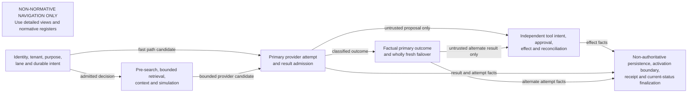
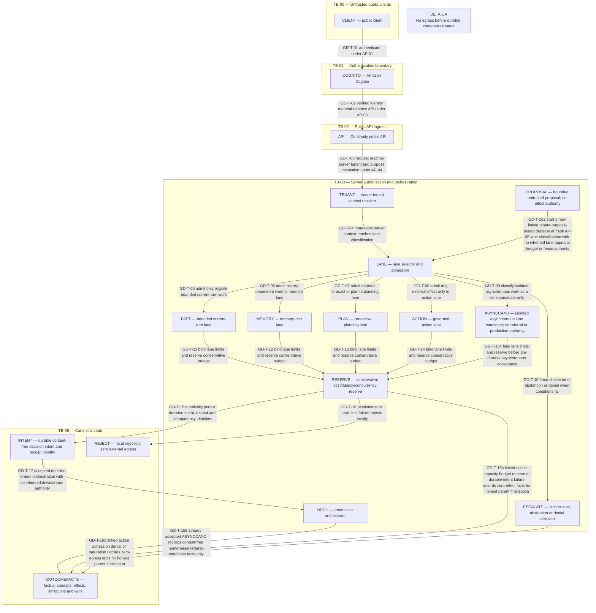
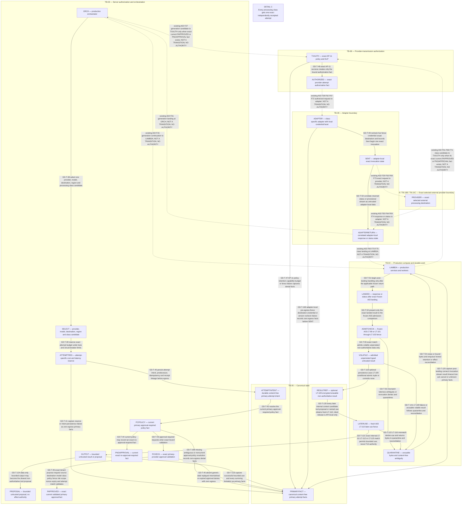
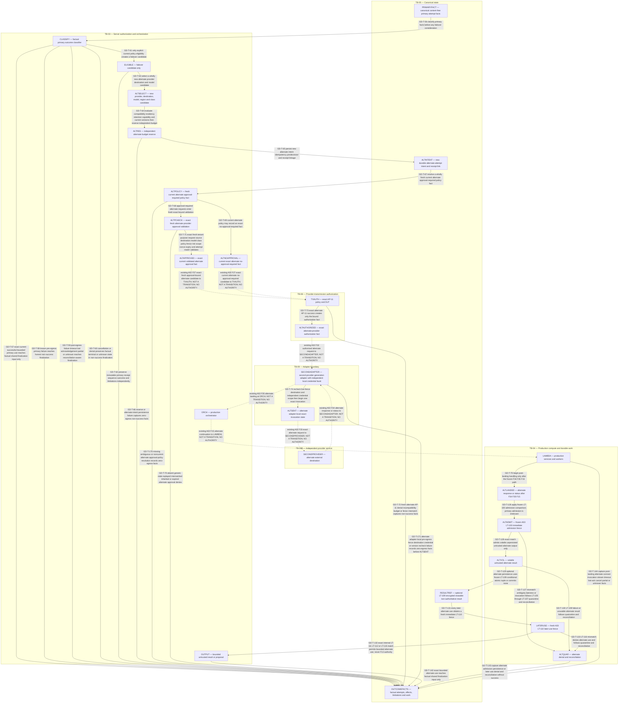
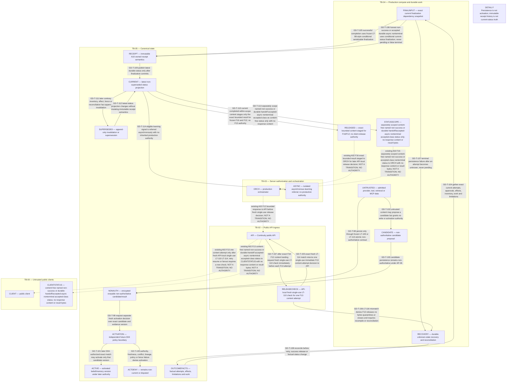

# Continuity v3 governed decision path

**Status:** A04 ordering/design evidence; Architecture v3 is not frozen.
**Risk:** critical.
**Scope:** logical governed-decision ordering for the independent public
Continuity system.

This document freezes the prospective order and non-inheritance boundaries for
request admission, retrieval, provider attempts, failover, tools, activation,
outcomes, and receipt/current-status finalization. It does not select policy
values, vendors, credentials, schemas, cryptography, thresholds, deployment
topology, or human-gate decisions.

## 1. Reading rules and frozen-source alignment

- The normative governed-decision state, transition, input/version,
  failure/outcome, invariant, and prospective-threat registers in §§4-9 govern.
  Diagrams and prose cannot weaken them.
- New IDs are collision-free and contiguous: `GD-S-01` through `GD-S-33`,
  `GD-T-01` through `GD-T-171`, `GD-IN-01` through `GD-IN-40`, `GD-F-01`
  through `GD-F-16`, `GD-IV-01` through `GD-IV-20`, and `GD-TH-01` through
  `GD-TH-20`.
- The overview is explicitly non-normative and contains no `GD-T-*` ID. The
  six detailed views are bounded projections of the normative transition
  register. Every solid detailed-view edge has exactly one `GD-T-*` ID.
  Dotted edges are labelled context-only, grant no authority, and are not
  transitions.
- [A02](system-trust-boundaries-v3.md) remains normative for `TB-*` zones,
  `AP-01` through `AP-29`, `DC-A` through `DC-O`, and `F01` through `F90`.
  Repeated A02 node and zone IDs retain their frozen meanings. A04 orders and
  references those controls and crossings; it creates no crossing or topology.
- [A03](data-deletion-lifecycle-v3.md) remains normative for lifecycle fences,
  response landing, volatile result admission, conditional persistence,
  later-use checks, deletion-status finalization, and supersession. In
  particular, this document preserves `LT-88`/`LT-89` and `LT-99` through
  `LT-116`; it does not replace them.
- A04 nodes are logical responsibilities, stages, states, facts, or controls.
  They do not imply a service, microservice, API, table, queue, IAM role,
  deployable, network hop, or physical boundary. Only frozen A02 zones have
  topological meaning.
- Dotted A02 context edges are the only depicted boundary movement and grant
  no decision authority. Solid `GD-T-*` edges order logical control or
  post-commit state changes; they are never an alternate data crossing. Every
  implementation of a spanning logical transition must use the applicable
  frozen A02 crossing shown in context or remain prohibited.
- Authentication, server-resolved tenant/purpose authorization, lane
  admission, pre-search scope, per-attempt transmission, tool authorization,
  approval, activation, and receipt/current-status finalization are distinct,
  non-inheritable decisions.
- Retrieved content, vectors, cache entries, MCP rows, provider output, tool
  results, acknowledgements, and experimental artifacts remain typed untrusted
  data under `AP-26`. They cannot create identity, tenant, purpose, policy,
  credentials, execution, activation, promotion, or receipt-success authority.
- Immutable decision, receipt, and status metadata is content-free. Prompts,
  responses, memory, tool arguments/results, secrets, keys, raw approvals,
  raw errors, deleted material, and low-entropy content hashes or fingerprints
  remain in erasable payloads or transient handling, never immutable metadata
  or ordinary telemetry.
- Tool argument binding uses only A02's opaque, high-entropy,
  non-content-derived immutable reference to the exact encrypted argument
  object/version. Deterministic or unkeyed argument digests and content
  fingerprints are prohibited. A10 may later choose a keyed,
  domain-separated commitment only after dedicated review; A04 selects no
  algorithm, key, or format. The opaque argument reference, deterministic or
  unkeyed argument digest, fingerprint, and any commitment value may not enter
  latch acknowledgement, `F88`, terminal gate evidence, receipt/status, log,
  or telemetry.

### 1.1 A02 C4 R5 compatibility contract

A04 orders the accepted A02 C4 R5 authority model without redefining it.
Exactly one immutable origin-authority mode is resolved at `AP-04` and retained
through `AP-05`, `AP-07`, `AP-13`, and every `AP-29` gate operation:

- `principal_delegated` binds the immutable initiating principal, current
  canonical membership/role/tenant-authorization epoch and purpose-operation
  authority, immutable delegation provenance, and exact allowed executing-
  workload identity/capability. Principal **and** workload conjuncts are both
  required at every A02 live authority fence; neither is an alternative,
  fallback, or substitute for the other.
- `system_originated` has no principal and instead binds an immutable,
  canonically created system-origin record/classification with creator
  evidence, tenant, purpose, exact allowlisted operation, creation
  epoch/expiry, and exact executing-workload identity/capability. Principal
  absence never implies system origin. Queue, model, provider, tool, content,
  claim owner, caller, request, or local state cannot create or select it.

Mode, origin, delegation or system classification, and workload binding never
change across enqueue, retry, DLQ, recovery, claim, takeover, dedupe, or
dispatch. Erasing/replacing an initiating principal, switching modes,
substituting principal and workload, or changing workload/capability requires
a fresh canonical authorization chain and cannot reuse a gate, claim, lease,
fence, or dedupe record. A claim owner/instance is only an operational lease
identity and never replaces the bound origin or executing workload.

The gate-control adapter may invoke exactly six operation-tagged,
parameterized, fixed/bounded DB-enforced callable
serializable transaction surfaces: `REGISTER_ALLOW_GATE`, `ACQUIRE_CLAIM`,
`TAKEOVER_CLAIM`, `ABORT_CAS`, `DISPATCH_CAS`, and
`READ_OR_DEDUPE_EXACT`. Exactly four authority-creating surfaces—
`REGISTER_ALLOW_GATE`, `ACQUIRE_CLAIM`, `TAKEOVER_CLAIM`, and
`DISPATCH_CAS`—require the C4-R2-advanced operation version; every pre-C4-R2
version of those four, including R8, R9, R10, and C4-R1, conflicts without
fallback. `ABORT_CAS` retains its existing exact tuple/phase version, and
`READ_OR_DEDUPE_EXACT` retains its existing diagnostic version. There is no
seventh operation. The adapter has no base-table or general
INSERT/UPDATE/DELETE, arbitrary or dynamic SQL, caller-selected
table/column/predicate/key/range/mutation, alternate repository/session role,
capability retagging, inherited privilege, or security-definer/owner escape.
Each callable fixes its permitted reads, tenant-qualified canonical
keys/predicates, row/column write allowlist, and atomic transaction; physical
co-location grants no unlisted-column access.

All six surfaces are read-only over tenant membership/role/authority/purpose
state; origin/delegation/system classification/allowlist; workload
identity/capability; the A03 applicability relation/version and `LT-37`
watermarks; and stored r1/effect lineage. None may initialize, repair,
backfill, or mutate those domains. Their complete success footprints are:

| AP29 callable | Only permitted conditional mutation |
| --- | --- |
| `REGISTER_ALLOW_GATE` | Consume the exact registration nonce; advance only the exact r1 authorization-dispatch/latch to r2; create one open gate/version; store its complete immutable provenance/authority baseline and A03 resolver snapshot; and create/update only the exact same-request dedupe result. |
| `ACQUIRE_CLAIM` | Mutate only the named gate claim/owner, monotonic fence, server-bounded lease/version, gate version/revision, and exact request-dedupe result. |
| `TAKEOVER_CLAIM` | Mutate only the named gate claim/owner/instance, higher fence, server-bounded lease/version, gate version/revision, and exact request-dedupe result; mode/origin/workload/capability/baseline remain immutable. |
| `ABORT_CAS` | Mutate only the named gate abort/terminal phase/version, tombstone, one immutable content-free evidence/delivery ID, and exact dedupe result. It remains revocation-safe and requires no current principal/workload authority; it stops only and recreates none. |
| `DISPATCH_CAS` | May read fixed stored effect lineage but writes only the named gate `dispatch_possible` phase/version, tombstone, one immutable content-free evidence/delivery ID, and exact request-dedupe tuple/record. It cannot write lineage, authority, resolver, claim/lease, baseline, or other state. |
| `READ_OR_DEDUPE_EXACT` | Zero write: exact prior projection or not-found only; no evidence/ID/dedupe creation, repair, refresh, recovery, mutation, authority, or permit. |

`REGISTER_ALLOW_GATE`, `ACQUIRE_CLAIM`, `TAKEOVER_CLAIM`, and
`DISPATCH_CAS` each live-revalidate the stored immutable mode/origin, current
mode-specific conjuncts, and canonical tenant-authority binding/source epoch
in the same transaction as its permitted mutation. Registration proves gate
absence, validates all existing approval, cancellation, policy, deletion,
lineage, and resolver conditions, and atomically creates the gate and stores
its complete immutable authority/provenance and resolver baselines before
nonce consumption/r1→r2. Only `ACQUIRE_CLAIM`, `TAKEOVER_CLAIM`, and
`DISPATCH_CAS` exact-match that already stored immutable gate baseline.
Acquire validates before creating its claim/fence/lease. Takeover additionally
requires canonical expiry and a higher fence; only owner/instance changes
under the same bound workload.
Dispatch is the sole canonical execution fence and revalidates every existing
approval/cancellation/policy/deletion/claim/resolver/effect-lineage fence
immediately before its exact mutation. Abort remains a stop/reconciliation
path without current-authority prerequisite; read/dedupe remains diagnostic.
Only a fresh exact newly `applied` named `F90` advances local ordering.

Principal or workload revocation, role/tenant-epoch/purpose-operation change,
missing/forged/expired system origin, mode/origin/principal/workload
substitution, or retry/DLQ/recovery/takeover/dedupe replay that serializes
first yields no applied success-footprint mutation or effect authority. If
dispatch serializes first, permanent possible effect prohibits later abort,
known no-effect, retry, permit recovery/reissue, or second effect. T88–T90,
`F89`/`F90`, request fields, claim ownership, diagnostic reads, dedupe, caches,
projection state, and elapsed time never supply current authority.
Conflict/unresolved/denial performs none of the named success footprint.

## 2. Coordinated governed-decision views

### 2.1 Governed path overview — NON-NORMATIVE

This navigation view defines no transition, state, authority, data
classification, receipt state, or success condition.



### 2.2 Detail A — identity, tenant, lane, admission, and durable intent



### 2.3 Detail B — pre-search, retrieval, context, and simulation

```mermaid
flowchart TB
    VBNOTE["DETAIL B<br/>Scope is issued before expansion; every result remains untrusted"]
    subgraph TB03["TB-03 — Server authorization and orchestration"]
        ORCH["ORCH — production orchestrator"]
        QEMBED["QEMBED — query-embedding attempt candidate only"]
        SELECT["SELECT — provider, model, destination, region and class candidate"]
        OUTPUT["OUTPUT — bounded untrusted result or proposal"]
        FUSION["FUSION — evidence fusion with lineage, conflict and missingness"]
        CONTEXTFENCE["CONTEXTFENCE — fresh operation-bound LT-110 context-use check"]
        CONTEXT["CONTEXT — exact bounded context compiled only after single-use LT-111"]
        NONPLANSELECT["NONPLANSELECT — already-fenced nonplanning provider-candidate staging"]
        WORLD["WORLD — versioned world-state compiler"]
        CAUSAL["CAUSAL — causal-support and invalidity check"]
        SIM["SIM — baseline, adverse and at most one alternative"]
        ABSTAIN["ABSTAIN — qualified abstention or denial"]
        DURABLE["DURABLE — timeout-to-durable-task handoff"]
        PROPOSAL["PROPOSAL — bounded untrusted proposal; no effect authority"]
    end
    subgraph TB03A["TB-03A — Pre-search authorization"]
        SEARCHAUTH["SEARCHAUTH — AP-21 exact expiring scope"]
        SCOPEDENY["SCOPEDENY — missing, stale, replayed or broadened scope"]
    end
    subgraph TB04["TB-04 — Production compute and durable work"]
        LAMBDA["LAMBDA — production services and workers"]
        RETSET["RETSET — typed untrusted bounded retrieval set"]
    end
    subgraph TB05["TB-05 — Canonical state"]
        CRDB["CRDB — CockroachDB canonical state"]
        OUTCOMEFACTS["OUTCOMEFACTS — factual attempts, effects, limitations and work"]
    end
    subgraph TB06["TB-06 — Derived vector state"]
        DVI["DVI — tenant and embedding-space scoped vectors"]
    end
    subgraph TB06A["TB-06A — Governed derived cache"]
        CACHE["CACHE — scope, version, revision and fence-bound"]
    end
    subgraph TB14["TB-14 — Steward and Managed MCP"]
        STEWARD["STEWARD — bounded redacting read facade"]
        MCP["MCP — curated SELECT-only Managed MCP"]
    end
    ORCH -->|"GD-T-18 request exact AP-21 pre-search scope before expansion"| SEARCHAUTH
    SEARCHAUTH -->|"GD-T-19 deny missing, stale, replayed, mismatched or broadened scope"| SCOPEDENY
    SEARCHAUTH -->|"GD-T-20 issue DC-M scope bound to tenant, purpose, versions, limits and fence"| LAMBDA
    SEARCHAUTH -->|"GD-T-21 permit a query-embedding candidate only inside issued scope"| QEMBED
    LAMBDA -->|"GD-T-22 exact or opaque-ID content read uses AP-22 and existing F56"| CRDB
    LAMBDA -->|"GD-T-23 same-space vector query uses AP-08, live AP-21 and existing F21"| DVI
    LAMBDA -->|"GD-T-24 cache use uses AP-23, live AP-21 and existing F58"| CACHE
    SEARCHAUTH -->|"GD-T-25 curated read enters Steward only through AP-15 and existing F60"| STEWARD
    QEMBED -->|"GD-T-148 register query embedding as a common durable processing-class attempt candidate"| SELECT
    RETSET -->|"GD-T-149 register reranking as a common durable processing-class attempt candidate"| SELECT
    CONTEXT -->|"GD-T-150 route already-fenced compiled nonplanning context to provider-candidate staging; no direct SELECT bypass"| NONPLANSELECT
    OUTPUT -->|"GD-T-151 query-embedding or reranking output re-enters only its same live AP-21 scope"| SEARCHAUTH
    SEARCHAUTH -->|"GD-T-152 same-scope admitted class output may return to production retrieval handling"| LAMBDA
    LAMBDA -->|"GD-T-153 same-scope admitted reranking output becomes typed retrieval data before fusion"| RETSET
    CRDB -.->|"existing A02 F57 return to LAMBDA; NOT A TRANSITION; NO AUTHORITY"| LAMBDA
    DVI -.->|"existing A02 F22 return to LAMBDA; NOT A TRANSITION; NO AUTHORITY"| LAMBDA
    CACHE -.->|"existing A02 F59 return to LAMBDA; NOT A TRANSITION; NO AUTHORITY"| LAMBDA
    STEWARD -.->|"existing A02 F42 curated request to MCP; NOT A TRANSITION; NO AUTHORITY"| MCP
    MCP -.->|"existing A02 F43 curated SELECT request to CRDB; NOT A TRANSITION; NO AUTHORITY"| CRDB
    CRDB -.->|"existing A02 F44 bounded rows to MCP; NOT A TRANSITION; NO AUTHORITY"| MCP
    MCP -.->|"existing A02 F45 bounded result to STEWARD; NOT A TRANSITION; NO AUTHORITY"| STEWARD
    STEWARD -.->|"existing A02 F46 redacted result to ORCH; NOT A TRANSITION; NO AUTHORITY"| ORCH
    ORCH -.->|"existing A02 F15 continuation to LAMBDA; NOT A TRANSITION; NO AUTHORITY"| LAMBDA
    LAMBDA -.->|"existing A02 F17 content-free outcome write to CRDB; NOT A TRANSITION; NO AUTHORITY"| CRDB
    LAMBDA -->|"GD-T-26 handle post-F57 scoped canonical landing as typed untrusted retrieval data"| RETSET
    LAMBDA -->|"GD-T-27 handle post-F22 scoped vector landing as typed untrusted retrieval data"| RETSET
    LAMBDA -->|"GD-T-28 handle post-F59 current cache landing as typed untrusted retrieval data"| RETSET
    LAMBDA -->|"GD-T-29 handle post-F44 F45 F46 F15 MCP landing as typed untrusted retrieval data"| RETSET
    RETSET -->|"GD-T-30 fuse evidence without suppressing lineage, conflict or missingness"| FUSION
    FUSION -->|"GD-T-31 request fresh LT-110 context-use check before any exact compilation or use"| CONTEXTFENCE
    CONTEXTFENCE -->|"GD-T-159 exact single-use LT-111 match permits compilation of only the bound current evidence"| CONTEXT
    CONTEXTFENCE -->|"GD-T-160 LT-116 mismatch denies and quarantines stale inputs then records content-free honest outcome"| OUTCOMEFACTS
    NONPLANSELECT -->|"GD-T-161 already-fenced same-operation nonplanning candidate joins common durable attempt path"| SELECT
    CONTEXT -->|"GD-T-32 compile planning world state only from exact already-fenced context"| WORLD
    WORLD -->|"GD-T-33 planning lane checks causal support and invalidity"| CAUSAL
    CAUSAL -->|"GD-T-34 sufficient basis permits bounded versioned simulation"| SIM
    CAUSAL -->|"GD-T-35 inadequate basis, stale evidence or budget breach abstains"| ABSTAIN
    SIM -->|"GD-T-36 timeout beyond synchronous limit persists durable work without bypass"| DURABLE
    SIM -->|"GD-T-37 bounded result becomes proposal only, never effect authority"| PROPOSAL
    SCOPEDENY -->|"GD-T-115 capture content-free denial for shared non-success finalization"| OUTCOMEFACTS
    ABSTAIN -->|"GD-T-116 capture content-free abstention and limitations for shared finalization"| OUTCOMEFACTS
    DURABLE -->|"GD-T-117 capture durable-task handoff as current nonterminal status"| OUTCOMEFACTS
    PROPOSAL -->|"GD-T-118 capture bounded proposal outcome without effect authority"| OUTCOMEFACTS
```



### 2.4 Detail C — primary provider selection, transmission, and result admission



### 2.5 Detail D — primary classification and wholly fresh failover



### 2.6 Detail E — independent tool, approval, effect, outcome, and reconciliation

```mermaid
flowchart TB
    subgraph TB03["TB-03 — Server authorization and orchestration"]
        ORCH["ORCH — production orchestrator"]
        USEFENCE["USEFENCE — fresh A03 LT-112 operation-bound check"]
        TOOLINTENT["TOOLINTENT — exact linked-action typed credential-free intent"]
        LATCHACK["LATCHACK — exact second-cycle proof of auth_dispatch_registered at r1 plus canonical authorization-dispatch ID/version and durable same-ID F36 obligation; no gate or F36 before proof"]
        APPROVAL["APPROVAL — TB-03 policy resolution of exactly one current required or explicit no-required route before any latch"]
        APPROVALCHECK["APPROVALCHECK — common validated pre-F36 approval or no-required prerequisite with no future AP-13 decision ID"]
        RECON["RECON — durable reconciliation and compensation"]
    end
    subgraph TB11["TB-11 — Tool authorization"]
        TOOLAUTH["TOOLAUTH — exact AP-13 decision"]
    end
    subgraph TB05["TB-05 — Canonical state"]
        RESERVATION["RESERVATION — canonical latch machine absent to armed_unattempted r0 to settled_unattempted r1 or auth_dispatch_registered r1 then settled_terminal_nonallow r2 or gate_registered r2"]
        DISPATCHGATE["DISPATCHGATE — canonical TB-05 server gate phase, revision, claim, lease-fence, terminal tombstone and immutable evidence identity; never reset or executor-repaired"]
        DISPATCHCOMMIT["DISPATCHCOMMIT — permanent canonical TB-05 dispatch_possible possible-effect tombstone after sole C4-R2-advanced live fence revalidates immutable mode/origin plus both mode-specific conjuncts; only qualifying fresh applied F90 permits one ephemeral consume-or-burn sequence"]
        EFFECTFACT["EFFECTFACT — F17-settled content-free effect state; any bytes/reference persist only through Detail F"]
        OUTCOMEFACTS["OUTCOMEFACTS — factual attempts, effects, limitations and work"]
    end
    subgraph TB07["TB-07 — Secret custody"]
        SECRETS["SECRETS — governed secret store"]
    end
    subgraph TB12["TB-12 — Local-only tool executor; no canonical read, store, truth or durable authority"]
        PRECONNECT["PRECONNECT — local preflight only after fresh newly applied ACQUIRE_CLAIM or TAKEOVER_CLAIM F90"]
        TOOLEXEC["TOOLEXEC — local AP-14 admission, AP-28 client and controlled runtime; no database, canonical read or durable gate authority"]
        CREDSELECT["CREDSELECT — local server-owned selector and scope preflight only; no secret retrieval"]
        FINALCHECK["FINALCHECK — TB-12-local defense-in-depth snapshot and preflight only; no canonical truth or dispatch authority"]
    end
    subgraph TB04["TB-04 — Production compute and durable work"]
        LAMBDA["LAMBDA — production services and workers"]
        TOOLLANDED["TOOLLANDED — typed target response or executor-local evidence after applicable F40 F15"]
        TOOLADMIT["TOOLADMIT — frozen A03 LT-104 exact tool-result admission"]
        TOOLQUAR["TOOLQUAR — LT-105 through LT-107 quarantine and reconciliation"]
        TOOLVOL["TOOLVOL — exact matched volatile admitted tool result or evidence"]
        ACKCLASS["ACKCLASS — factual acknowledgement/effect classifier"]
    end
    subgraph TB13["TB-13 — Tool targets"]
        TOOLS["TOOLS — governed target; acknowledgement remains untrusted"]
    end
    ORCH -->|"GD-T-76 only an exact newly accepted linked governed-action decision requests fresh LT-110 LT-112 proposal-use fencing"| USEFENCE
    USEFENCE -->|"GD-T-77 exact match permits one linked-action credential-free intent with no inherited authority"| TOOLINTENT
    USEFENCE -->|"GD-T-165 before any latch or F15 LT-116 mismatch denies or quarantines proposal use and records zero-effect honest outcome facts; all post-latch finalization uses T147"| OUTCOMEFACTS
    RESERVATION -->|"GD-T-85 second F17 serializably fresh rereads the exact prerequisite and current fences; only success CASes r0 to registered r1 with canonical authorization-dispatch pair and same-ID F36 obligation; mismatch takes T86"| LATCHACK
    APPROVALCHECK -->|"GD-T-86 either latch-cycle fault or ambiguity reconciles by exact read replay; only PG-NC or PG-UA while unregistered; registration winner must deliver or dedupe same F36 or remain unresolved awaiting exact F88"| RECON
    LATCHACK -->|"GD-T-78 logical order only after physical F36 carrying registered r1 authorization-dispatch pair and no gate lands TB-11; AP-13 commits capsule-bearing F37 XOR unchanged F88"| TOOLAUTH
    TOOLAUTH -->|"GD-T-79 only after exact terminal F88 named non-allow projection with both attempt IDs is AP-27-admitted by ORCH may ORCH-local reconciliation begin; any F88 defect stays unresolved; no F37 or settlement authority"| RECON
    TOOLINTENT -->|"GD-T-80 TB-03 resolves exactly one current policy route required or explicit no-required; missing conflicting or stale resolves none"| APPROVAL
    APPROVAL -->|"GD-T-81 required route validates exact human decision over the planned spine and preallocated authorization-attempt ID with no future AP-13 decision ID"| APPROVALCHECK
    APPROVAL -->|"GD-T-82 missing conflicting denied expired or stale prerequisite before any latch enters reconciliation and only PG-NC may settle"| RECON
    APPROVAL -->|"GD-T-83 no-required route validates one exact current no-required fact over the same planned spine"| APPROVALCHECK
    APPROVALCHECK -->|"GD-T-84 common validated prerequisite logically orders the first exact F15 F17 F18 F16 cycle creating armed_unattempted r0; no crossing shortcut"| RESERVATION
    TOOLEXEC -->|"GD-T-87 after AP-14 pre-gate admission send C4-R2-advanced REGISTER_ALLOW_GATE F89; AP-29 same-transaction mode/origin and principal+workload or system-origin+workload validation precedes exact gate/baseline mutation; only fresh applied F90 advances"| DISPATCHGATE
    DISPATCHGATE -->|"GD-T-91 C4-R2-advanced ACQUIRE_CLAIM or TAKEOVER_CLAIM revalidates the same immutable mode/origin and both conjuncts; takeover changes owner only under the same workload; only fresh applied F90 permits local preconnect"| PRECONNECT
    PRECONNECT -->|"GD-T-88 TB-12-local network destination redirect process-signal and snapshot preflight only; no canonical read truth gate mutation secret retrieval or effect"| TOOLEXEC
    TOOLEXEC -->|"GD-T-89 bind only server-owned tenant purpose capability destination secret-class selector and scope as local preflight; no F84 F85"| CREDSELECT
    CREDSELECT -->|"GD-T-90 TB-12-local defense-in-depth snapshot and selector network process preflight only; proves no canonical fact and grants no dispatch authority"| FINALCHECK
    FINALCHECK -->|"GD-T-166 sole C4-R2-advanced AP-29 DISPATCH_CAS F17 live fence revalidates immutable mode/origin principal+workload or system-origin+workload and all canonical controls; only exact fresh applied F90 permits one bounded ephemeral F84 F85 F38 consume-or-burn sequence"| DISPATCHCOMMIT
    TOOLAUTH -.->|"existing A02 F37 complete allow projection with mandatory registration capsule to TOOLEXEC for AP-14 record-only pre-gate admission; no gate credential or dispatch authority; NOT A TRANSITION; NO AUTHORITY"| TOOLEXEC
    TOOLEXEC -.->|"existing A02 F89 one authenticated strict AP-29 gate-control request with distinct AP-28 transport freshness; no asserted current fact or hold metadata; NOT A TRANSITION; NO AUTHORITY"| LAMBDA
    LAMBDA -.->|"existing A02 F90 exact correlated content-free named result with no current fact or hold metadata; only fresh newly applied qualifying result may support its named GD ordering; NOT A TRANSITION; NO AUTHORITY"| TOOLEXEC
    TOOLEXEC -.->|"existing A02 F38 one immediate exact effect request only after qualifying fresh newly applied DISPATCH_CAS F90 and immediate F84 F85; never replay; NOT A TRANSITION; NO AUTHORITY"| TOOLS
    TOOLEXEC -.->|"existing A02 F40 unchanged validated target result or receipt-linked outcome only to ORCH; never gate control evidence or F89 F90 substitute; NOT A TRANSITION; NO AUTHORITY"| ORCH
    LAMBDA -->|"GD-T-92 begin typed handling only after applicable F40 F15 landing; target F39 and canonical stored-ID abort_before_dispatch or dispatch_possible evidence remain distinct; F89 and F90 are excluded and dispatch evidence is not target acknowledgement"| TOOLLANDED
    TOOLLANDED -->|"GD-T-93 apply exact frozen LT-104 tenant purpose source destination reservation effect attempt idempotency evidence kind and ID epoch fence and versions comparison"| TOOLADMIT
    TOOLADMIT -->|"GD-T-94 late replay wrong-effect mismatch correction retraction or deletion block follows LT-105"| TOOLQUAR
    TOOLQUAR -->|"GD-T-95 LT-106 erases or quarantines bytes and records content-free ambiguity before LT-107 reconciliation"| RECON
    TOOLADMIT -->|"GD-T-96 exact match admits volatile unpersisted tool result or effect evidence only"| TOOLVOL
    TOOLVOL -->|"GD-T-97 only exact LT-104-admitted volatile target response or canonical stored-ID abort_before_dispatch or dispatch_possible observation may feed classification; F89 and F90 are excluded and dispatch evidence invents no target acknowledgement"| ACKCLASS
    ACKCLASS -->|"GD-T-134 classify completed confirmed effect for exact F17 settlement without inferring client observation"| EFFECTFACT
    ACKCLASS -->|"GD-T-135 only exact admitted abort_before_dispatch observation classifies known no-effect before dispatch for exact F17 settlement"| EFFECTFACT
    ACKCLASS -->|"GD-T-136 classify cancellation for exact F17 settlement while retaining escaped-attempt ambiguity"| EFFECTFACT
    ACKCLASS -->|"GD-T-137 classify partial lost or unknown acknowledgement and require canonical latch settlement or reconciliation without effect retry"| RECON
    RECON -->|"GD-T-138 selects exactly one strict PG-NC PG-UA or PG-F88 tagged F17 validator with no nullable union; resolved gate evidence uses a separate strict validator; only exact CAS fact-plus-settlement may proceed"| EFFECTFACT
    PRECONNECT -->|"GD-T-139 exact-claim ABORT_CAS F89 after preconnect failure; only fresh newly applied F90 stores canonical abort tombstone and same immutable evidence ID"| DISPATCHGATE
    TOOLEXEC -->|"GD-T-140 exact-claim ABORT_CAS F89 after network destination or runtime preflight failure; only fresh newly applied F90 stores the same canonical abort evidence"| DISPATCHGATE
    CREDSELECT -->|"GD-T-145 selector or scope preflight failure before secret retrieval uses exact-claim ABORT_CAS F89; only fresh newly applied F90 stores canonical abort evidence"| DISPATCHGATE
    FINALCHECK -->|"GD-T-146 local snapshot or preflight mismatch may request exact-claim ABORT_CAS F89; only fresh applied F90 proves canonical abort and every other result takes T157"| DISPATCHGATE
    DISPATCHGATE -->|"GD-T-157 every pre-C4-R2 creator version including R8 R9 R10 C4-R1 non-applied adapter auth schema state resolver store or F90 fault plus diagnostic result enters reconciliation; ABORT and READ retain existing versions; no authority"| RECON
    EFFECTFACT -->|"GD-T-147 only after proven F17 settlement commit plus exact F18 acknowledgement and F16 proof when applicable feed the fact to shared finalization; only T147 reaches OUTCOMEFACTS"| OUTCOMEFACTS
```



Detail E caption: every TB-12 check is local defense in depth, never canonical
truth. The sole C4-R2-advanced AP29 `DISPATCH_CAS` `F17` transaction revalidates
the immutable mode/origin and both mode-specific current conjuncts as the live
execution fence; only its exact fresh applied `F90` permits one bounded ephemeral
`F84` → `F85` → `F38` consume-or-burn sequence. No current fact or hold
metadata crosses F89/F90, and no post-F90 canonical read exists.

### 2.7 Detail F — non-authority, activation, receipt, and current status



### 2.8 Transition-to-view index

The transition register in §5 is normative. This index is a complete,
non-overlapping bijection with the six detailed-view transition sets.

| Detail view | Transition IDs | Count |
| --- | --- | ---: |
| A | `GD-T-01`, `GD-T-02`, `GD-T-03`, `GD-T-04`, `GD-T-05`, `GD-T-06`, `GD-T-07`, `GD-T-08`, `GD-T-09`, `GD-T-10`, `GD-T-11`, `GD-T-12`, `GD-T-13`, `GD-T-14`, `GD-T-15`, `GD-T-16`, `GD-T-17`, `GD-T-154`, `GD-T-158`, `GD-T-162`, `GD-T-163`, `GD-T-164` | 22 |
| B | `GD-T-18`, `GD-T-19`, `GD-T-20`, `GD-T-21`, `GD-T-22`, `GD-T-23`, `GD-T-24`, `GD-T-25`, `GD-T-26`, `GD-T-27`, `GD-T-28`, `GD-T-29`, `GD-T-30`, `GD-T-31`, `GD-T-32`, `GD-T-33`, `GD-T-34`, `GD-T-35`, `GD-T-36`, `GD-T-37`, `GD-T-115`, `GD-T-116`, `GD-T-117`, `GD-T-118`, `GD-T-148`, `GD-T-149`, `GD-T-150`, `GD-T-151`, `GD-T-152`, `GD-T-153`, `GD-T-159`, `GD-T-160`, `GD-T-161` | 33 |
| C | `GD-T-38`, `GD-T-39`, `GD-T-40`, `GD-T-41`, `GD-T-42`, `GD-T-43`, `GD-T-44`, `GD-T-45`, `GD-T-46`, `GD-T-47`, `GD-T-48`, `GD-T-49`, `GD-T-50`, `GD-T-51`, `GD-T-52`, `GD-T-53`, `GD-T-54`, `GD-T-55`, `GD-T-119`, `GD-T-120`, `GD-T-121`, `GD-T-122`, `GD-T-123`, `GD-T-124`, `GD-T-125`, `GD-T-141`, `GD-T-168`, `GD-T-169` | 28 |
| D | `GD-T-56`, `GD-T-57`, `GD-T-58`, `GD-T-59`, `GD-T-60`, `GD-T-61`, `GD-T-62`, `GD-T-63`, `GD-T-64`, `GD-T-65`, `GD-T-66`, `GD-T-67`, `GD-T-68`, `GD-T-69`, `GD-T-70`, `GD-T-71`, `GD-T-72`, `GD-T-73`, `GD-T-74`, `GD-T-75`, `GD-T-126`, `GD-T-127`, `GD-T-128`, `GD-T-129`, `GD-T-130`, `GD-T-131`, `GD-T-132`, `GD-T-133`, `GD-T-142`, `GD-T-143`, `GD-T-144`, `GD-T-170`, `GD-T-171` | 33 |
| E | `GD-T-76`, `GD-T-77`, `GD-T-78`, `GD-T-79`, `GD-T-80`, `GD-T-81`, `GD-T-82`, `GD-T-83`, `GD-T-84`, `GD-T-85`, `GD-T-86`, `GD-T-87`, `GD-T-88`, `GD-T-89`, `GD-T-90`, `GD-T-91`, `GD-T-92`, `GD-T-93`, `GD-T-94`, `GD-T-95`, `GD-T-96`, `GD-T-97`, `GD-T-134`, `GD-T-135`, `GD-T-136`, `GD-T-137`, `GD-T-138`, `GD-T-139`, `GD-T-140`, `GD-T-145`, `GD-T-146`, `GD-T-147`, `GD-T-157`, `GD-T-165`, `GD-T-166` | 35 |
| F | `GD-T-98`, `GD-T-99`, `GD-T-100`, `GD-T-101`, `GD-T-102`, `GD-T-103`, `GD-T-104`, `GD-T-105`, `GD-T-106`, `GD-T-107`, `GD-T-108`, `GD-T-109`, `GD-T-110`, `GD-T-111`, `GD-T-112`, `GD-T-113`, `GD-T-114`, `GD-T-155`, `GD-T-156`, `GD-T-167` | 20 |
| **Total** | **declared contiguous transition range exactly once** | **171** |

## 3. Governed ordering contracts

### 3.1 Lane admission and deterministic escalation

Exactly one lane is selected before provider work. Lane SLOs are measured
targets, not vendor guarantees or bypass authority.

| Lane | Entry and allowed work | A00 p50 target | A00 p95 target | Mandatory exit |
| --- | --- | --- | --- | --- |
| Fast conversation | Bounded current-turn material only; no tenant-memory search, simulation, causal/predictive claim, tool, export, or external effect. | TTFT ≤1.5s; complete ≤5s | TTFT ≤4s; complete ≤15s | Escalate, deny, or abstain when any entry condition fails. |
| Memory-rich answer | An issued `AP-21` scope; default maximum two delivered authorized views; fusion and bounded context when needed. | TTFT ≤2.5s; complete ≤8s | TTFT ≤7s; complete ≤25s | Abstain or escalate on insufficient, stale, conflicting, corrected, retracted, deletion-pending, unsupported-view, or over-budget evidence. |
| Predictive planning | Memory controls plus versioned world state, causal-support check, baseline, adverse case, and at most one alternative. | preview ≤6s; final ≤15s | preview ≤20s; final ≤45s | Proposal or abstention only; maximum 60s synchronous, then persist durable work without skipping controls. |
| Governed action | A new tenant/purpose-linked `AP-05` decision, fresh action capacity/budget reserve, durable linked intent, exact credential-free tool intent, independent tool authorization, bound approval when required, effect reservation, idempotency, execution, outcome, and reconciliation. | proposal ≤8s; post-approval dispatch ≤0.8s | proposal ≤30s; post-approval dispatch ≤3s | No effect outside this lane; data-only proposals inherit no conversational/memory/planning authority, and tools expected to exceed 30s become durable while human/tool waits remain separately measured. |
| Isolated asynchronous learning | Lane candidate only; `GD-T-154` reserve, durable `GD-T-15`/`GD-T-17` acceptance, content-free `GD-T-158` nonterminal facts, `GD-T-106` accepted-class finalization, and `GD-T-109` publication precede any `GD-T-114` referral. | not a synchronous target | not a synchronous target | No provider/retrieval work, early referral, synchronous result, or production authority follows from candidacy. |

Forced-slower conditions include ambiguous tenant, membership, purpose, or
scope; any sensitive external processing; stale/conflicting/corrected/
retracted/deletion-pending evidence; causal or predictive claims; failover;
material downside or low reversibility; tool, approval, export, or effect;
quota/circuit-breaker pressure; or a material version change. A timeout,
disconnect, cancellation, circuit breaker, or escalation changes handling, not
the required authorization, fence, receipt, or reconciliation order.

Admission reserves conservatively at principal, tenant, and project scope,
then settles observed use and releases unused reserve. Versioned caps cover
input/output/total tokens; retrieval count, views, candidates, context bytes
and embedding requests; simulations, branches and horizon; provider attempts,
failovers, tools, exports and reconciliation; concurrent streams, queue
backlog, durable tasks and long-running actions; and daily/monthly spend.
Hard limits deny, retries remain bounded, action capacity is reserved, and
circuit breakers prevent unbounded spend. Concrete monetary values and
allocations remain unresolved.

A provider or simulation `PROPOSAL` is data only. Before it can approach
`GD-T-76`, `GD-T-162` creates a new linked tenant/purpose-bound decision that
must freshly pass `AP-05` into `ACTION`, reserve action capacity and budget at
`GD-T-14`, and durably commit linked intent at `GD-T-15`. Missing, ambiguous,
denied or saturated action admission takes `GD-T-163`; reserve or durable
intent failure takes `GD-T-164`. Both are zero-egress/zero-effect closures for
the already accepted parent. No conversational, memory or planning lane,
approval, budget, fence, receipt or proposal content grants action authority.

### 3.2 Receipt and attempt ordering

The semantic decision-receipt order is:

```text
accepted → authorized → transmitting → [streaming] → completed | cancelled | failed | unknown
```

`pending` is not a receipt state. `accepted` requires durable content-free
decision intent, receipt identity, idempotency identity, lane, material
versions, and authorization references before any provider, embedding,
reranking, moderation, tool, export, stream, or other egress. Persistence
failure before acceptance or transmission produces local rejection with zero
egress.

`authorized` means the distinct controls applicable to the exact operation
passed; it does not merge them. `transmitting` identifies one exact
destination and attempt. Optional `streaming` is provisional and untrusted.
Terminal success is withheld until durable current-version finalization. A
terminal-persistence failure after an external attempt becomes `unknown` and
requires durable reconciliation; it never reverts to `pending` or permits an
unsafe non-idempotent retry.

Every alternate provider attempt has a new intent, predecessor link,
idempotency/attempt identity, reserve, exact `AP-11` decision, live fence, and
applicable fresh approval. A primary approval is never reusable for an
alternate. Primary facts remain preserved. Provider racing, silent
fallback, shared authorization, shared credentials, and unrecorded alternate
egress are prohibited.

### 3.3 Retrieval, context, simulation, and non-authority

`AP-21` is issued before canonical, vector, cache, MCP, query-embedding,
reranking, or other retrieval/embedding expansion. It binds server tenant,
principal or job identity, purpose, resources, entities, time, views,
sensitivity, limits, policy/config versions, request/trace, scope digest, and
deletion/revision fence. `AP-22`, `AP-08`, `AP-23`, `AP-15`, and `AP-16`
enforce but do not create scope. Exact or opaque ID possession is not
authorization.

Query embedding and reranking are not side exits. Their candidates join the
same stable `SELECT` node as every processing class, then traverse durable
attempt intent, the applicable approval fact, `AP-11`, adapter landing,
admission, `LT-109` persistence, and fresh `LT-110` later-use ordering.
Their stable `OUTPUT` may re-enter retrieval only under the same still-live
`AP-21` scope: query embedding proceeds to the same-space vector query, while
reranking becomes typed retrieval data before fusion. Neither path can mint,
refresh, substitute, or broaden scope. A memory-rich nonplanning context
cannot take a direct `CONTEXT` → `SELECT` bypass: only `NONPLANSELECT` may
carry the same operation’s already-fenced compiled context into the common
attempt path. Planning alone continues from that already-fenced `CONTEXT`
into `WORLD`, causal support, and simulation.

Cache keys bind tenant, authorization scope, policy version, retrieval
configuration, compiler version, embedding space, source revisions, and
deletion epoch. Correction, deletion, policy revocation, authorization change,
or any relevant version change invalidates reuse.

Every context compilation or recompile first takes a new `LT-110` check at
`CONTEXTFENCE`; only its exact single-use `LT-111` exit permits deterministic
compilation over the bound admitted revisions, evidence state, retrieval
configuration, compiler version, embedding-space identity, lane, policy, and
live fence. `LT-116` mismatch takes `GD-T-160` before compilation,
quarantines/erases stale inputs and records an honest content-free outcome.
Stale evidence cannot compile. A compiled context cannot broaden scope, turn
data into instructions, suppress conflict/missingness, or confer provider,
tool, activation, or receipt authority.

Planning binds world-state, causal classification, simulation configuration,
intervention, horizon, assumptions, uncertainty, invalidity, predicted cost,
and lane budget. Inadequate causal support or evidence yields abstention.
A proposal is never an effect authorization.

### 3.4 Provider, result, tool, activation, and finalization separation

Before every external processing attempt, a candidate provider/model/
destination/region/class is selected and its budget reserved. Selection grants
no transmission or credential authority. Exact `AP-11` then evaluates the
bounded request, source revisions, purpose, processing class, destination,
retention capability, policy/config versions, reserve, attempt, and live
fence. Only the corresponding `AP-12` adapter may transmit, and any secret or
workload identity remains adapter-local under `AP-10`.

Each primary and alternate attempt first resolves a current policy fact that
selects exactly one of two routes: approval required, or an explicit current
attempt-bound no-approval-required fact. Approval-required work requests and
validates a separate decision binding approver, tenant, purpose, request,
sources, destination/provider/model/class, policy, fence, risk, scope, nonce,
expiry, attempt identity, and current versions. Missing, ambiguous,
conflicting or noncurrent approval-policy resolution takes `GD-T-168` or
`GD-T-170` with zero egress. Missing, generic, stale, replayed, mismatched,
expired, or inherited approval denies. Only an exact
validated approval fact or exact current no-required fact may reach the
applicable frozen candidate crossing and `AP-11`. The alternate route repeats
the entire decision freshly; primary approval and no-required facts are never
reusable. After the authorized-request crossing, adapter-local fence,
destination, credential-scope, cancellation, bounds and version recheck must
pass before `SENT`/`ALTSENT`; `GD-T-169` or `GD-T-171` closes a failure with
zero provider egress.

Provider responses land only through frozen A02 crossings. Frozen A03
admission is immediate and precedes persistence or use. A matched primary or
alternate response is volatile, unpersisted, untrusted, and
non-authoritative. Both use only `LT-109` for conditional all-or-none
persistence and then a fresh `LT-110` through `LT-116` fence before bounded
use. Admission alone cannot finalize, release, or create a tool proposal.
Only stable `OUTPUT` after persistence and fresh exact later-use fencing may
take a success exit or the registered data-only route to stable `PROPOSAL`.

A tool path starts only after the proposal has created and durably passed the
new linked governed-action decision above. `GD-T-76` then requests a fresh
`LT-110`/single-use `LT-112` proposal-use check; `GD-T-165` mismatch denies or
quarantines it with zero effect before `TOOLINTENT` or `F36`. Only the exact
match creates a new linked-action credential-free intent and preallocates a
fresh authorization-attempt ID; preallocation is planning identity, not proof
that an `AP-13` attempt exists.

Approval is wholly before `F36`. `GD-T-80` resolves in TB-03 exactly one
current policy route: approval required or an explicit approval-not-required
route. Missing, conflicting, ambiguous, or stale policy resolution selects
neither. On the required route, `GD-T-81` validates an exact human decision
bound to tenant/purpose, governed action/intent, A02's opaque high-entropy
non-content-derived immutable encrypted-argument-object/version reference,
capability/destination, reservation/effect, effect/operation attempt and
preallocated authorization-attempt IDs, policy/configuration/deletion fence,
scope/risk, nonce, expiry, and all versions. It cannot name or predict a future
`AP-13` authorization-decision ID/revision/epoch. On the no-required route,
`GD-T-83` validates one exact current no-required fact over the same binding.
Both success edges meet at `APPROVALCHECK`, the common validated prerequisite.
`GD-T-82` sends missing/conflicting policy, denial, expiry, stale approval, or
other prerequisite failure from `APPROVAL` to reconciliation before any latch;
only the strict `PG-NC` validator below may settle that branch.

`GD-T-84` logically orders the first complete existing frozen physical cycle:
TB-03 → `F15` → `LAMBDA`/TB-04 → `F17` → `RESERVATION`/TB-05 → `F18` →
`LAMBDA` → `F16` → TB-03. Its exact `F17` transaction creates the full
content-free latch at `armed_unattempted@r0`. Only after proof of that first
commit does the second complete `F15`/`F17`/`F18`/`F16` cycle run. The second
`F17` transaction performs one serializable fresh re-read of the current exact
approval or no-required fact and validity, policy/configuration, cancellation,
deletion/tombstone/revision fence, prerequisite nonce and expiry, both attempt
IDs, effect, reservation, and the entire planned spine. These prerequisite
nonce/expiry fields are neither the future `AP-13` registration nonce/expiry
nor the distinct `AP-28` transport nonce/expiry. Only exact success CASes
`armed_unattempted@r0` to `auth_dispatch_registered@r1` and atomically creates
the canonical authorization-dispatch ID/version plus the durable same-ID `F36`
delivery obligation. A mismatch leaves r0 unchanged and takes only
`GD-T-86`, with no `F36`. `GD-T-85` from `RESERVATION` to `LATCHACK` is
permitted only after `F18` acknowledgement and `F16` proof of that second
commit. No `F36` may exist before this proof, and no solid edge substitutes
for or hides a frozen crossing.

The immutable latch binding contains the common planned spine: schema/version;
tenant/purpose; governed action/intent; expected latch key/ID;
capability/destination; reservation/effect/effect-operation attempt;
preallocated authorization-attempt ID; idempotency/correlation IDs;
policy/configuration/deletion fence; approval-requirement ID/version and
exactly one approval-decision ID/version or no-required-fact ID/version; and a
bounded cause code. The canonical latch may internally compare the opaque
argument-object/version reference, but appended facts, acknowledgements,
status, evidence, receipts, logs, and telemetry never copy it. Raw arguments,
results, credentials, raw errors, deterministic/unkeyed digests, content
fingerprints, and commitment values are excluded. A10 may later choose a
keyed, domain-separated commitment after dedicated review; A04 selects no
algorithm, key, or format.

`GD-T-86` owns either latch-cycle rejection, timeout, lost acknowledgement, or
ambiguity. Exact read/deduplication and idempotent `F17` replay establish the
stored phase/revision; absence is never inferred. While authorization dispatch
is unregistered, reconciliation may use only strict `PG-NC` or `PG-UA`. If the
registration CAS won, exact read/replay returns the same canonical
authorization-dispatch ID/version and same-ID `F36` obligation. No local abort
is allowed: that obligation is delivered or deduplicated, or the latch remains
unresolved awaiting exact terminal `F88`. Registration acknowledgement loss
cannot reopen `PG-UA`.

The latch state machine is exact and single-CAS serialized:

`absent` → `armed_unattempted@r0` →
`settled_unattempted@r1` **or** `auth_dispatch_registered@r1`; then
`auth_dispatch_registered@r1` →
`settled_terminal_nonallow@r2` **or** `gate_registered@r2`.

Every writer serializes on the same latch key and exact expected-state CAS:
the authoritative absent sentinel before creation/PG-NC, and the same stored
phase/revision thereafter. `never_created` is an outcome schema, never a latch
phase. A settled phase cannot return to a registered or gate-bearing phase.

`GD-T-138` selects one strict tagged pre-gate `F17` validator, never a nullable
union. Each validator rejects omitted fields, extra fields, and fields from
another variant:

- `PG-NC / never_created`: the expected latch key is serializably absent; no
  stored latch phase/revision exists; the authoritative TB-05
  authorization-dispatch registration/attempt-existence marker, `F36`
  dispatch, `F37`, `F88`, gate, and evidence are all absent. This proof uses
  the TB-05 marker and does not claim a read of a TB-11 `AP-13` record. The
  atomic transaction appends the no-latch fact and closes the exact
  intent/idempotency record; it supersedes no latch. A preallocated
  authorization-attempt ID does not make the attempt-existence marker present.
- `PG-UA / unattempted`: the full common planned spine exact-matches
  `armed_unattempted@r0`; authorization-dispatch registration, `F36` marker,
  either projection, gate, and evidence are absent. Its CAS commits
  `settled_unattempted@r1`, appends the fact, and supersedes the latch. Absent
  `F37` alone is never sufficient.
- `PG-F88 / terminal_nonallow`: the complete AP-27-admitted `F88` projection,
  canonical authorization-dispatch ID/version, and authoritative
  attempt-existence marker exact-match `auth_dispatch_registered@r1`. It
  admits only the A02 `F88` disposition enum
  `denied|cancelled|expired|invalid|policy_error_fail_closed`, has no gate
  fields, and contains no opaque argument reference, risk, raw/content, result,
  evidence, receipt/status, log, or telemetry field. Its CAS commits
  `settled_terminal_nonallow@r2`, appends the fact, and supersedes the latch.

Resolved post-gate target/abort/dispatch evidence uses the separate strict
gate-evidence `F17` validator already described below; it is never encoded as a
fourth nullable pre-gate variant. Only exact committed settlement plus its
`F18` acknowledgement/`F16` proof when applicable may take `GD-T-147`.
Result/candidate bytes or references still use Detail F `LT-109`, never a
Detail E shortcut. Same reservation/key reuse remains prohibited after
settlement; a later effect is a new governed action.

After second-cycle proof, the registered same-ID A02 `F36` physically lands in
TB-11 before `GD-T-78` logically orders `TOOLAUTH`. `F36` carries the canonical
authorization-dispatch ID/version at r1 and no gate. `AP-13` validates the
already-bound exact approval or no-required prerequisite, opaque argument
reference, both attempt IDs, authorization-dispatch pair, latch
`auth_dispatch_registered@r1`, and all other A02 controls, then commits exactly
one named projection: `F37` allow XOR `F88` terminal non-allow. Every `F37`
contains its mandatory nested registration capsule, including a high-entropy
one-use `AP-13` registration nonce and absolute registration expiry; those
fields are distinct from the earlier prerequisite nonce/expiry and from
`AP-28` transport freshness. `AP-14` only exact-matches `F37` and its capsule
to the committed `AP-13` record before the gate. It performs no TB-05 read,
creates no live or canonical fact, and grants no gate, credential, `F89`,
`F38`, or dispatch authority. No approval edge or approval decision exists
after `F36`.

`GD-T-79` is ORCH-local logical ordering only after physical
`TOOLAUTH`/TB-11 → A02 `F88` → `ORCH`/TB-03 and exact `AP-27` admission.
Missing, timed-out, transport-ambiguous, suppressed, stale/out-of-order,
mismatched, malformed, unknown-source, or dual `F37`/`F88` remains unresolved;
AP-13 suppression never authorizes a local unattempted settlement. `F88`
grants no settlement, finalization, write, retry, result, or execution
authority, and its disposition remains only the A02 enum above.

After `AP-14` record-only admission, `GD-T-87` starts at local `TOOLEXEC` and
sends one strict C4-R2-advanced `REGISTER_ALLOW_GATE` `F89`, authenticated by
`AP-28` with a distinct per-request transport nonce/expiry. Only the `AP-29`
Lambda adapter may use `F17`/`F18` to live-read and mutate TB-05. It revalidates
the current unsuperseded `auth_dispatch_registered@r1`, canonical
authorization-dispatch pair, capsule lineage, current policy/configuration,
approval, cancellation, deletion, supersession and gate absence. In that same
transaction it exact-matches the stored immutable mode/origin and current
canonical tenant-authority binding/source epoch: `principal_delegated` requires
current initiating-principal authority **and** the exact workload capability/
delegation; `system_originated` requires the canonical system-origin
classification/allowlisted operation **and** the exact workload capability.
From stored
r1/effect lineage it also invokes the fixed bounded canonical LT-37
applicability resolver, validates completeness under the future-approved
schema/bound, and atomically stores the complete internal server-owned
resolver snapshot with the canonical server gate before consuming the one-use
AP13 registration nonce and advancing r1 to `gate_registered@r2`. No resolver
or hold metadata crosses F89/F90, and A04 selects no schema, bound, or HG-2
subject-scope result. Only the exact correlated `F90` for a fresh newly
`applied` C4-R2-advanced operation completes T87. Every pre-C4-R2 version,
including R8, R9, R10, and C4-R1, conflicts without fallback. A deduped/read result,
conflict, unresolved, not-found, stale, malformed, authentication/schema/
nonce/state/store fault, response loss, or any ambiguity takes `GD-T-157`;
diagnostic read/deduplication creates no authority. `PG-F88` and AP29
registration compete on the same `auth_dispatch_registered@r1` CAS. A dual
projection is invalid, and neither projection wins merely by arriving first.

`GD-T-91` sends strict `ACQUIRE_CLAIM` or `TAKEOVER_CLAIM` `F89` through the
same AP28/AP29 boundary. Only an exact correlated fresh newly `applied` `F90`
permits local `PRECONNECT`; deduped/read or ambiguous results never do. The
same C4-R2-advanced serializable transaction first exact-matches the stored
immutable mode/origin, current tenant-authority binding/source epoch, immutable
gate baseline, and both mode-specific current conjuncts. The canonical AP29
mutation then binds a newly generated high-entropy claim ID, one
authenticated owner identity, monotonically increasing claim epoch/fence,
lease version and expiry, latch/gate versions, and the complete authorization
tuple:
tenant/purpose, governed action, intent, capability/destination,
authorization-decision ID/revision/source epoch and authorization-attempt ID,
approval binding, reservation/effect, separate effect/operation attempt ID,
idempotency/correlation IDs, deletion/revision fence, policy/config/schema/
source versions, latch version and gate version, and opaque encrypted-argument-
object/version reference. The AP29 claim mutation exact-matches the owner,
claim ID, claim epoch/fence, lease version/expiry, gate phase/version and latch
version. `ACQUIRE_CLAIM` mutates only the named claim/owner, monotonic fence,
server-bounded lease/version, gate version/revision and exact request-dedupe
result. `TAKEOVER_CLAIM` additionally requires canonical expiry and a higher
fence and mutates only those fields plus owner/instance; immutable mode,
origin, workload/capability and baseline remain unchanged.
An exact retry may diagnose the same stored claim but does not recreate fresh
execution authority. Only the fresh applied response lets that exact owner
reach local preflight or submit a later named AP29 CAS. A contender, stale
owner, duplicate with a different claim identity, response loss, or
acknowledgement ambiguity takes `GD-T-157` unresolved, never known no-effect.

Takeover is never elapsed-time inference: it requires authoritative proven
lease expiry, exact reconciliation, and one atomic claim-fence increment that
installs the higher-fence owner/claim/lease tuple. The prior owner and every
lower claim epoch/fence then fail permanently. A claim owner/instance is only
an operational lease identity and cannot substitute for the bound executing
workload. A different workload/capability requires a fresh canonical
authorization chain and cannot take over. Claim acquisition, exact reads,
deduplication, expiry reconciliation, and takeover attempts are bounded and
backed off; no busy loop or contender fanout may create a resource storm.
Delayed, replayed, mismatched, `abort_before_dispatch`, `dispatch_possible`,
or unclaimed gates cannot reach preconnect. Canonical gate, claim, lease,
terminal phase, tombstone, and immutable evidence identity remain in TB-05;
TB-12 is local-only and stores no durable authority.

Untrusted input cannot choose a host, credential identity/reference,
authorization header, raw transport, tenant, purpose, scope, or approval.
Redirects are disabled by default; any permitted hop repeats complete
allowlist, DNS/IP/private/link-local/metadata, rebinding, proxy, and credential
scope authorization. `GD-T-88`, `GD-T-89`, and `GD-T-90` perform only
TB-12-local defense-in-depth network/destination, selector/scope, process-
signal, and snapshot preflight. TB-12 has no canonical read. In particular,
T90 cannot establish, prove, or refresh current approval-required or explicit
no-required state or validity, cancellation/supersession, policy/configuration,
deletion/tombstone/revision fence, legal-hold applicability or snapshot, gate
phase, canonical claim/lease/fence, or any other canonical truth. It performs
no actual `F84`/`F85` retrieval and grants no secret, effect, no-effect,
dispatch, mutation, retry, or finalization authority. Local success grants no
authority; it only completes local ordering before T166 may submit a request,
and never authorizes that request or its outcome.

`GD-T-145` is specifically selector/scope preflight before any secret
retrieval. A local mismatch at T88, T89, T90, or final preflight may submit the
applicable `GD-T-139`, `GD-T-140`, `GD-T-145`, or `GD-T-146` strict
`ABORT_CAS` `F89`. T146 cannot establish canonical current truth or known no
effect. Only a fresh newly `applied` exact correlated ABORT_CAS `F90` proves
the canonical TB-05 `abort_before_dispatch` terminal phase and its immutable
evidence-delivery ID. Abort is revocation-safe: current principal/workload
authority is not a prerequisite, but its exact closed footprint may only write
the named terminal phase/version, tombstone, one content-free evidence/
delivery ID and exact dedupe result; it recreates no authority. Even then,
known no effect requires the separate frozen
`F40`/`F15`/`LT-104` admission and gate-evidence `F17` settlement below. Every
other result or ambiguity takes T157 and cannot invent, repair, or emit abort
evidence.

`GD-T-166` sends the C4-R2-advanced strict `DISPATCH_CAS` `F89` for the claimed
gate. The one exact-key serializable AP29 `F17` transaction—not T90, `F89`,
`F90`, or any executor observation—is the sole authoritative live execution
fence and the sole A02 physical realization and linearization of A03
`LT-49`/`LT-53` for dispatch. Immediately before mutation, that transaction
freshly re-reads and exact-matches the authoritative current approval-required
or explicit no-required fact and validity, cancellation/supersession,
policy/configuration against the registered binding,
deletion/tombstone/revision fence, authorization-dispatch and
capsule/common-spine lineage, open gate phase/revision, current
claim/owner/fence/lease and unexpired lease, and the complete
tenant/purpose/action/intent/capability/destination/reservation/effect/both-
attempt/idempotency/correlation tuple.

From stored canonical lineage that same transaction exact-matches the immutable
mode/origin and gate baseline plus the current tenant-authority binding/source
epoch. `principal_delegated` requires both current initiating-principal
authority and exact workload capability/delegation; `system_originated`
requires both current canonical system-origin classification/operation
allowlist and exact workload capability. Missing, forged, expired, revoked,
changed, substituted, or mode-switched provenance denies before mutation.

From stored r1/effect lineage, the same C4-R2-advanced transaction re-resolves the
complete bounded canonical ordered affected lineages, invokes the LT-37-owned
authoritative applicability relation, and directly re-reads its
applicability/scope version and every applicable LT-37 subject-watermark row.
It validates the future-approved resolver schema and bound, completeness,
canonical order, uniqueness, membership, lineage, tombstone, fence,
disposition, and strictly monotonic subject version, then exact-matches the
stored gate's complete server-owned snapshot: applicability/scope version,
ordered affected lineages, and the ordered unique
subject/disposition/version set or explicit versioned
`no_applicable_hold_subjects` sentinel. Cardinality one uses the same resolver.
A04 does not select the resolver schema, bound, subject scope, or unresolved
HG-2 purpose treatment. Absent or unknown approved schema/bound, overflow,
missing or ambiguous completeness, noncanonical/duplicate/incoherent state,
missing or corrupt baseline, empty-as-complete result, pre-R10 singular or
effect-partitioned gate state, or repair/fallback attempt is `unresolved`; a
coherent authoritative fact or snapshot change is `conflict`.

Only exact success of that sole C4-R2-advanced transaction writes the named
gate `dispatch_possible` phase/version, its permanent phase-preserving
tombstone, one newly generated immutable content-free evidence/delivery ID,
and the exact request-dedupe tuple/record. It may read fixed stored effect
lineage but cannot write lineage, authority, resolver, claim/lease, baseline,
or any other row/column. An invalidation,
hold/applicability change, or effect-lineage creation that serializes first
prevents applied success. If dispatch serializes first, canonical
`dispatch_possible`/possible-effect is permanent: every later approval,
cancellation, policy/configuration, deletion/fence, hold
create/change/release/expiry, applicability, lineage, local-preflight, or
acknowledgement change or failure remains possible-effect reconciliation and
can never abort, prove no effect, retry, restore, or reissue a permit.

Neither `F89` nor `F90` carries authoritative current facts, hold subjects,
applicability relation/version, affected lineages, subject membership/order,
dispositions/versions, sentinel, resolver snapshot, or baseline. A04 receives
none of that metadata and performs no post-F90 canonical read, hold check, or
second validation. Every pre-C4-R2 operation version—including R8, R9, R10,
and C4-R1—conflicts without fallback; current-version pre-R10 gate state is
unresolved. Every
conflict/unresolved/missing/ambiguous/stale/deduped/read/not-found,
authentication/schema/nonce/correlation/store fault, pre-R10/old-version, or
other operation/result takes T157 with no F84/F85/F38, mutation, permit,
effect, known no-effect, retry, or finalization authority.

Only the exact correlated fresh newly `applied` C4-R2-advanced `DISPATCH_CAS`
`F90` reports
the already committed ordering and permits one bounded, immediate, ephemeral,
non-persistable `F84` → `F85` → `F38` consume-or-burn sequence. Post-F90 local
checks are limited to response correlation, process identity, server-owned
selector/scope, destination/network/SSRF, and local signals; they cannot prove
or refresh canonical approval, policy, cancellation, deletion, hold,
applicability, lease, fence, or phase. Local decline, delay, crash,
uncertainty, secret/transport failure, lost acknowledgement, or partial
consumption burns the permit. No later sequence, abort, no-effect, retry,
read/dedupe recovery, permit reissue, or finalization authority exists, and
canonical state remains `dispatch_possible`/possible-effect for
reconciliation.

A confirmed immutable `abort_before_dispatch` tombstone emits one content-free
abort-before-dispatch observation with the same immutable evidence ID stored
by the winning AP29 mutation through the existing typed local-outcome `F40` →
`ORCH` → `F15` → `LAMBDA` path. `F89`/`F90` never enter that frozen A03
evidence path, and `F40` never carries gate-control commands or responses.
That observation carries no execution authority. A04 checks its evidence
kind/ID alongside, and without redefining, frozen `LT-104`; exact admission
alone may take `GD-T-135` to a known-no-effect candidate. Mismatch takes
`LT-105`-`LT-107`, never classifies no effect, and never unlocks retry.
`F40`/`F15` failure permits bounded same-abort-evidence-ID redelivery only.

Dispatch evidence remains separate. The canonical `DISPATCHCOMMIT` observation
means only possible effect, never target acknowledgement or target truth.
Frozen `F39` target evidence is unchanged and typed apart from that
same-correlation-ID canonical `dispatch_possible` observation;
both use their applicable `F40`, shared `F15`, and exact `LT-104`.
`F89`/`F90` are canonical gate-control request/response crossings, not target
result evidence, and neither substitutes for `F39`, `F40`, or `LT-104`.
`F40`/`F15` failure permits bounded evidence redelivery/reconciliation only,
never another effect. After exact classification, frozen `F17` conditionally
exact-matches the canonical latch and gate version/phase, evidence kind and
immutable ID, reservation/effect/attempt/idempotency, tenant/purpose, epoch,
fence, and versions; it atomically appends the content-free fact and
supersedes the latch. For confirmed abort, phase must be
`abort_before_dispatch`; for dispatch evidence it must be
`dispatch_possible`. `F17` failure leaves the latch
unresolved and prohibits success/no-effect/retry. The `F17` commit—not
`F18`—settles; `F18` only acknowledges it, and lost `F18` uses exact
idempotent `F17` replay.

Only `EFFECTFACT` with proven `F17` settlement commit and exact `F18`
acknowledgement/`F16` proof when applicable may take `GD-T-147` to
`OUTCOMEFACTS`, after which Detail F alone finalizes. Exact idempotent
acknowledgement recovery may repeat; mismatch or ambiguity remains unresolved.
No other post-latch path finalizes, and ambiguity or settlement failure cannot
produce success or known no-effect. If real `F39`
arrives before first settlement it may be that settlement's typed evidence.
If it arrives after settlement, it appends a distinct reconciliation fact
that may supersede current status only through `GD-T-111`/`GD-T-112`; it
never mutates an immutable receipt, overwrites prior evidence, reopens the
gate, or authorizes another effect. No settlement message is sent to TB-12.
TB-12 retains no canonical gate/commit copy. Bounded retention may compact
TB-05 gate/dispatch journals only to content-free phase-preserving tombstones
that cannot recreate `open` or effect authority.

The exact nineteen R13 pre-`F36`, authorization-projection, and AP29 gate-
registration race/crash cuts are:

| Cut or failure | Required closure |
| --- | --- |
| 1. Policy-route resolution missing, conflicting, ambiguous, or stale | T80 selects neither route; T82 reaches reconciliation before any latch, and only exact PG-NC may settle. |
| 2. Required approval missing, denied, expired, invalid, or mismatched | No latch or F36 is created; exact PG-NC proves canonical absence and closes the planned intent/idempotency only. |
| 3. First-cycle crash before `F17` commit | Exact read proves absent; replay the same first command or use PG-NC. Never create a partial r0 or infer commit. |
| 4. First-cycle `F17` committed but `F18`/`F16` acknowledgement/proof is lost | Exact replay returns the same `armed_unattempted@r0`; never create a second latch or begin registration without proof. |
| 5. Second-cycle crash before registration `F17` commit | Exact r0 remains; the second F17 must freshly re-read the complete current prerequisite and may be replayed only as the same command, while PG-UA may still compete on r0. No authorization-dispatch pair or F36 obligation exists. |
| 6. Registration `F17` committed but `F18`/`F16` acknowledgement/proof is lost | Exact replay/read returns `auth_dispatch_registered@r1`, the same canonical authorization-dispatch ID/version, and same-ID F36 obligation. PG-UA/local abort is permanently unavailable. |
| 7. PG-UA settlement races authorization registration | Both exact-CAS `armed_unattempted@r0`; one wins. PG-UA yields `settled_unattempted@r1`, registration yields `auth_dispatch_registered@r1`; the loser cannot reinterpret or repair state. |
| 8. Registered `F36` delivery is lost, duplicated, or its acknowledgement is ambiguous | Deliver or deduplicate only the durable same-ID obligation with the same canonical authorization-dispatch ID/version and no gate. Never create a new attempt, regress to PG-UA, or infer terminal non-allow. |
| 9. AP-13 execution or `F37`/`F88` projection is suppressed, missing, timed out, or ambiguous | Registered r1 stays unresolved; no local abort, no absent-projection inference, no gate, settlement, finalization, or retry authority. |
| 10. Approval/policy becomes stale before T85 fresh re-read and registration commit | The exact second-F17 mismatch leaves r0 unchanged and takes T86 only; it creates no authorization-dispatch pair or F36. |
| 11. Approval/policy becomes stale after registration wins | It cannot reopen local approval/PG-UA or locally abort. Deliver/dedupe the same authorization-dispatch pair and F36 obligation, then require the AP13 outcome or remain unresolved. |
| 12. Exact AP27 F88 settlement races AP29 REGISTER_ALLOW_GATE | PG-F88 and AP29 REGISTER exact-CAS the same `auth_dispatch_registered@r1`; only a valid non-dual AP29 fresh newly applied F90 completes T87, and the losing branch remains rejected by phase/revision. |
| 13. Dual, conflicting, substituted, or order-ambiguous F37/F88 | Neither is “first wins.” Fail closed unresolved before either r1 CAS; do not settle, create a gate, or infer the AP-13 record. |
| 14. PG-F88 settlement `F17` commit or `F18`/`F16` acknowledgement/proof fault | Before commit remain r1 unresolved; after commit exact replay returns `settled_terminal_nonallow@r2`. Never create a gate or treat F88/F18 alone as settlement. |
| 15. C4-R2-advanced AP29 REGISTER_ALLOW_GATE is applied but its F90 is lost or ambiguous | Canonical r2/gate and complete provenance/authority/resolver baselines may exist, but T87 did not complete locally. T157 reconciles; read/dedupe is zero-write diagnostic only and creates no authority. |
| 16. Delayed/stale F37 reaches AP29 after PG-F88 settlement | AP29 rejects the settled r2 state and returns no fresh newly applied F90; no gate or local authority is created. |
| 17. Adapter/canonical orphan, half-state, wrong pair/revision, missing/corrupt resolver baseline, or mismatched duplicate | AP29 returns conflict/unresolved and T157 quarantines/reconciles. Neither executor nor diagnostic read may infer, backfill, grandfather pre-R10 state, or repair canonical state. |
| 18. Delayed approval or policy input after registration or settlement | It is stale. Any later decision requires a fresh governed action, new latch, new canonical authorization-dispatch pair, new effect/operation-attempt ID, new authorization-attempt ID, and new AP13 registration capsule. |
| 19. Any attempted finalization from uncommitted or nonsettled state | Only exact settled PG-NC/PG-UA/PG-F88 or separately settled gate evidence with proven F17 commit and required acknowledgement/proof may take T147. |

All downstream R12 claim, dispatch, evidence, and late-result cuts remain
required:

| Downstream cut or failure | Required closure |
| --- | --- |
| T91 claimant race or F90 ambiguity | Only a fresh newly applied `ACQUIRE_CLAIM` F90 permits local preconnect for its canonical high-entropy claim; every contender, deduped/read result, or ambiguity takes T157 with no preconnect/abort/dispatch. |
| Claim takeover | Require AP29's live proof of expiry and atomic monotonic fence increment; only fresh newly applied `TAKEOVER_CLAIM` F90 permits the higher-fence owner to proceed, while stale/lower-epoch owners fail permanently and bounded retries prevent storms. |
| Abort-versus-dispatch/invalidation/hold serialization | AP29 serializes revocation-safe `ABORT_CAS` and the sole C4-R2-advanced `DISPATCH_CAS` live fence. If invalidation/authority/hold change serializes first, dispatch has no mutation; if dispatch serializes first, permanent possible effect prohibits later abort/no-effect/retry. |
| CAS identity or resolver write/read fault | Each callable may write only its closed footprint. DISPATCH reads fixed lineage but writes only phase/tombstone/evidence/dedupe; READ writes nothing. Missing/corrupt/pre-R10 resolver state is conflict/unresolved; no executor, F89/F90 or diagnostic read may stitch or repair it. |
| Confirmed abort CAS win | Only fresh newly applied ABORT_CAS F90 proves phase=`abort_before_dispatch` and permits same-ID evidence handling. T90/T146 local mismatch is not canonical or known no effect; exact F40/F15/LT104 admission and gate-evidence F17 settlement remain required. |
| Confirmed dispatch CAS win | Only the sole C4-R2-advanced AP29 transaction revalidates immutable provenance, both current mode-specific conjuncts and all existing fences, stores its exact permanent `dispatch_possible` footprint, and yields fresh applied F90 for one consume-or-burn sequence. |
| Any event after applied C4-R2-advanced DISPATCH_CAS F90 | Later authority/invalidation/hold/applicability/lineage change or local/transport failure preserves permanent possible effect; never abort, classify no effect, recover/reissue a permit, retry F84/F85, or replay F38. |
| F40 or F15 failure | Redeliver only the exact stored typed evidence ID within bounds; never retry effect or change phase. |
| LT104 mismatch | Take LT105-LT107; no classification, settlement, finalization, no-effect claim, or effect retry. |
| F17 settlement failure or lost F18/F16 proof | Failure leaves latch unresolved; exact committed F17 replay recovers acknowledgement/proof without new authority. |
| Late real F39 | Settle initially if first; otherwise append through reconciliation and possible T111/T112 supersession without receipt mutation or gate reopen. |

Candidate/result persistence never activates belief or memory. A fresh
activation decision is independently required over source authority,
freshness, conflicts, lineage, evidence, exact candidate version, policy, and
fence. D04 owns the policy and thresholds.

Finalization compares exact current tenant/purpose/request, source/lineage/
fence, inventory/work, provider/tool/approval/effect/reconciliation,
limitations, policy/config, scope, and attempt versions. Later contrary facts
append a superseding current status without mutating immutable receipt
semantics. `GD-T-106` records durable handoff and accepted asynchronous
candidacy as honest nonterminal accepted-class current status, never
`pending`, terminal success, or terminal non-success; only `GD-T-114` may
later refer eligible work. A latest non-superseded successful status may only
stage exact bounded content through frozen `F16` then `F12`; neither crossing
grants client-release authority. After that content lands in `API`/TB-02,
`GD-T-167` obtains a new single-use `LT-110` check and `GD-T-155` consumes the
exact `LT-114` decision immediately before one `F13` attempt. Retry, resume,
fanout and every additional client attempt repeat that API-local pair.
`LT-116` takes `GD-T-156`, releases no bytes, quarantines/erases and requires
exact recompile or reconciliation. No TB-04 check is reusable for `F13`.
Named non-success and durable-handoff/accepted-async nonterminal
accepted-class status use the separate content-free `GD-T-113` projection and
cannot carry response content or result bytes, invent `pending` or success,
grant provider/tool authority, or refer work.

### 3.5 Outcome capture and branch closure

Every branch after decision acceptance has an explicit route to canonical
factual capture and the single shared current-version finalizer. Repeated
`OUTCOMEFACTS` declarations in Details A, B, D, E, and F denote the same stable
TB-05 node, not replicated stores or separate finalizers. Physical canonical
writes and reads remain the frozen A02 crossings shown as dotted context;
solid `GD-T-*` edges express governed state ordering only.

| Origin | Exhaustive branch closure | Shared finalization |
| --- | --- | --- |
| Detail A | The asynchronous lane still requires `GD-T-154`/`15`/`17` before `GD-T-158`. Separately, every effect-capable data-only `PROPOSAL` takes `GD-T-162` into a new tenant/purpose-bound `AP-05` decision; only `GD-T-08` action admission, `GD-T-14` capacity/budget reserve, `GD-T-15` durable linked intent and `GD-T-17` may reach the action orchestrator. | `GD-T-163` closes missing/ambiguous/denied/saturated linked action admission and `GD-T-164` closes reserve/durable-intent failure with zero egress/effect. Async accepted-class finalization and later `GD-T-114` referral remain separate; no proposal or earlier lane inherits action authority. |
| Detail B | Pre-search denial, abstention, durable-task handoff and bounded proposal close through `GD-T-115`-`118`. Every context compilation/recompile first takes `GD-T-31`, then exact single-use `GD-T-159`; `GD-T-160` closes `LT-116` mismatch before stale evidence compiles. Nonplanning uses `GD-T-150` then `GD-T-161`, with no direct `CONTEXT` → `SELECT` bypass; planning uses `GD-T-32`. | All pass and mismatch routes reach `OUTCOMEFACTS`/`GD-T-104`; query embedding/reranking still use `GD-T-148`-`153`, and no lifecycle mismatch silently drops or compiles stale inputs. |
| Detail C into D | Reserve/intent failure, missing/ambiguous approval-policy resolution (`GD-T-168`), approval denial, `AP-11` denial, adapter-local pre-egress recheck failure (`GD-T-169`), connect/invocation/stream/result failure, timeout, lost acknowledgement, cancellation, admission/later-use denial, persistence failure and exact bounded output converge on stable `PRIMARYFACT`. | Detail D `GD-T-57` remains the sole successful-primary exit; `GD-T-58`-`60` preserve honest non-success and `GD-T-62` preserves primary facts during failover. Every fallible pre-egress primary step has zero-egress factual closure. |
| Detail D alternate | Fresh reserve/intent, approval and `AP-11`; missing/ambiguous approval-policy resolution (`GD-T-170`); alternate adapter-local pre-egress failure (`GD-T-171`); post-landing timeout/cancellation/lost-ack; admission, `LT-109` or `LT-116` denial; and exact persisted/fenced output converge through registered outcome exits. | Admission alone never finalizes; only `OUTPUT` after `RESULTREF`/`LATERUSE` may succeed, while every fallible alternate branch reaches honest current finalization with no inherited primary authority. |
| Detail E | Only a newly accepted linked action retaining immutable mode/origin/workload provenance may take T76. T80-T85 establish the pre-F36 prerequisite and same-ID obligation; AP13 exact-matches provenance and commits F37 XOR F88. C4-R2-advanced REGISTER alone creates the gate and complete authority/resolver baselines. | REGISTER/ACQUIRE/TAKEOVER/DISPATCH revalidate both mode-specific conjuncts in their mutation transaction; ABORT is revocation-safe and READ zero-write. T88-T90 remain local non-authority. Sole DISPATCH stores only its exact permanent footprint; fresh applied F90 alone permits one F84→F85→F38 consume-or-burn sequence. Dispatch-first is permanent possible effect; evidence settlement remains separate. |
| Detail F | `GD-T-104`-`109` finalize current truth. `GD-T-110` only stages exact content for frozen `F16`/`F12`; after API landing, every client attempt takes fresh `GD-T-167` (`LT-110`) then single-use `GD-T-155` (`LT-114`) immediately before `F13`. | `GD-T-156` closes mismatch with no bytes and quarantine/recompile/reconciliation; retry/resume/fanout repeats the API check. `GD-T-113` content-free status bypasses content release entirely, and actual async referral remains only `GD-T-114`. |

## 4. Normative governed-decision state register

| State | Meaning |
| --- | --- |
| `GD-S-01` | Unaccepted request: no durable intent, receipt state, egress, retrieval expansion, or effect exists. |
| `GD-S-02` | Authenticated identity material: principal evidence passed `AP-01`/`AP-03`; no tenant or operation authority exists. |
| `GD-S-03` | Server context resolved: `AP-04` binds immutable tenant/purpose/trace plus exactly one immutable origin-authority mode and provenance. `principal_delegated` binds initiating principal and delegation; `system_originated` binds a pre-existing canonical system-origin classification/allowlisted operation and has no principal. Both bind the exact executing-workload identity/capability; principal absence never selects system origin. |
| `GD-S-04` | Lane classified: one candidate lane and forced-slower facts are recorded; no admission exists. |
| `GD-S-05` | Lane admitted: exact operation, limits, reserve inputs, escalation and timeout behavior passed `AP-05`. |
| `GD-S-06` | Local rejection: acceptance or prerequisite persistence failed before egress; no external attempt exists. |
| `GD-S-07` | Decision accepted: content-free intent, receipt/idempotency identity and material versions are durable. |
| `GD-S-08` | Pre-search scope issued: live `AP-21` scope exists for one request/job and exact bounded expansion. |
| `GD-S-09` | Retrieval denied or abstained: scope, evidence, space, revision, fence, view, causal basis, or budget failed. |
| `GD-S-10` | Retrieval in progress: only scope-bound canonical/vector/cache/MCP work may execute. |
| `GD-S-11` | Context compiled: bounded typed context exists only after the immediately preceding fresh `LT-110`/single-use `LT-111` match over exact admitted revisions and remains untrusted data. |
| `GD-S-12` | Plan proposed: bounded world-state/simulation output exists with uncertainty and no effect authority. |
| `GD-S-13` | Provider candidate selected: destination/model/region/class is a proposal only. |
| `GD-S-14` | Provider attempt accepted: independent attempt intent, reserve, idempotency and receipt linkage are durable. |
| `GD-S-15` | Provider attempt authorized: exact current approval/no-required prerequisite and `AP-11` passed for this attempt; adapter/connect fence remains required. |
| `GD-S-16` | Transmitting: one exact adapter has begun one exact external attempt. |
| `GD-S-17` | Streaming provisional output: bytes/tokens may be visible as untrusted, never terminal success. |
| `GD-S-18` | Result admission pending: frozen A03 exact result fence has not yet admitted use or persistence. |
| `GD-S-19` | Admitted volatile result: exact provider or tool admission matched; bytes remain unpersisted and non-authoritative, and admission is not success/use/release. |
| `GD-S-20` | Result denied/quarantined: bytes are unusable; only content-free ambiguity and reconciliation persist. |
| `GD-S-21` | Primary outcome classified: exact bounded success, known failure, denial, cancellation, partial, unknown, or eligible failover fact is durable. |
| `GD-S-22` | Alternate attempt accepted: wholly fresh intent/reserve/idempotency/receipt linkage is durable. |
| `GD-S-23` | Tool intent proposed: a new linked tenant/purpose action decision passed fresh `AP-05` under the same immutable `principal_delegated` or `system_originated` provenance and exact workload binding, action reserve/durable intent and proposal-use fencing, creating one typed credential-free intent and preallocated authorization-attempt ID. Preallocation is not AP13 attempt existence; no latch or `F36` authority exists. |
| `GD-S-24` | Pre-F36 prerequisite and registration proved: T80 selected exactly one current required/no-required route; T81 or T83 validated its exact planned binding; the first physical cycle proved `armed_unattempted@r0`; and only the second F17's serializable fresh current-prerequisite re-read plus proved CAS to `auth_dispatch_registered@r1` atomically creates the canonical authorization-dispatch ID/version and same-ID F36 obligation. A mismatch remains r0/T86 with no F36; lost acknowledgement exact-replays the same pair/obligation and cannot reopen PG-UA. |
| `GD-S-25` | Tool authorization terminal: only registered same-ID F36 carrying the canonical r1 authorization-dispatch pair and no gate, followed by T78, may let AP13 validate the already-bound approval/no-required prerequisite and both attempts. AP13 commits mandatory registration-capsule-bearing `F37` allow XOR content-free `F88` terminal non-allow. AP14 is record-only pre-gate admission with no TB05 read or canonical fact; approval never occurs here and neither projection itself mutates latch/gate state. |
| `GD-S-26` | Canonical latch machine: `absent→armed_unattempted@r0→settled_unattempted@r1|auth_dispatch_registered@r1→settled_terminal_nonallow@r2|gate_registered@r2`. Every writer uses the same latch key and exact expected-state CAS—authoritative absent sentinel or stored phase/revision—plus the full planned spine. `never_created` is an outcome schema, not a phase. PG-NC/PG-UA/PG-F88 are disjoint; registration winner prohibits local abort. |
| `GD-S-27` | Dispatch gate durable: only the C4-R2-advanced AP29 `REGISTER_ALLOW_GATE` transaction live-validates registered r1, immutable mode/origin, both mode-specific current conjuncts and tenant-authority binding/source epoch; resolves the complete bounded canonical `LT-37` applicability result; stores the complete immutable provenance/authority and resolver baselines with one open gate before nonce consumption; and advances only the exact latch to r2 with same-request dedupe. Future-approved `C03` resolver schema/bound and `HG-2` subject scope remain unresolved. No resolver/hold metadata crosses F89/F90. Only fresh applied named F90 completes T87 locally; every pre-C4-R2 version conflicts, TB12 has no canonical read/truth, and terminal state never resets. |
| `GD-S-28` | Outcome factual: one strict PG-NC, PG-UA, PG-F88, or separate gate-evidence `F17` validator atomically committed its exact fact and required closure/supersession. Nullable/cross-variant fields are rejected; only proven settlement commit plus F18 acknowledgement/F16 proof when applicable may take T147. |
| `GD-S-29` | Candidate persisted non-authoritatively: encrypted erasable data and lineage exist but activation does not. |
| `GD-S-30` | Activation decided: independent later D04 authority either activated one exact version or denied it. |
| `GD-S-31` | Receipt/status finalized: an exact current conditional durable commit records success, honest non-success, or durable-handoff/accepted-async nonterminal accepted-class status; every `F13` content attempt still requires a fresh API-local single-use `LT-110`/`LT-114` decision. |
| `GD-S-32` | Superseded or reconciliation pending: later facts invalidate current success or ambiguity prevents terminal truth. |
| `GD-S-33` | Dispatch committed: the sole C4-R2-advanced AP29 `DISPATCH_CAS` serializable F17 live fence exact-matched immutable mode/origin, both mode-specific current conjuncts, tenant-authority binding/source epoch and gate baseline plus every approval/cancellation/policy/deletion/claim/resolver/effect-lineage fence. It may read fixed stored lineage but writes only the named gate `dispatch_possible` phase/version, tombstone, one immutable content-free evidence/delivery ID and exact dedupe record. Only exact fresh applied named F90 permits one bounded immediate ephemeral F84→F85→F38 consume-or-burn sequence; no post-F90 canonical read exists. Every later invalidation, hold change, local failure or acknowledgement loss remains possible-effect reconciliation with no abort/no-effect/retry/reissue; TB12 retains no durable permit. |

## 5. Normative governed-decision transition register

| Transition | Source → target | Normative contract |
| --- | --- | --- |
| `GD-T-01` | client → Cognito | Begin authentication under `AP-01`; request content grants no identity or tenant authority. |
| `GD-T-02` | Cognito → API | Deliver bounded verified identity material for `AP-03` validation; bearer possession alone grants no operation authority. |
| `GD-T-03` | API → tenant resolver | Pass the bounded request after ingress controls; client tenant/purpose/mode/origin hints and principal absence remain non-authoritative. |
| `GD-T-04` | tenant resolver → lane selector | Bind immutable server tenant/purpose/request/trace plus exactly one canonical mode/origin and executing-workload identity/capability. Principal mode binds the initiating principal and delegation; system mode requires its pre-existing canonical classification/allowlisted operation. Enter `GD-S-03` with no later mode switch. |
| `GD-T-05` | lane selector → fast | Admit only current-turn bounded non-retrieval, non-predictive, non-effect work. |
| `GD-T-06` | lane selector → memory | Admit work only when authorized durable state is material. |
| `GD-T-07` | lane selector → planning | Admit material forecast/plan work requiring causal support and bounded simulation. |
| `GD-T-08` | lane selector → action | Route every possible external effect to the governed-action lane. |
| `GD-T-09` | `LANE` → `ASYNCCAND` | Classify isolated asynchronous work as a lane candidate only; this is not referral, acceptance, completion, or production authority. |
| `GD-T-10` | lane selector → escalation | Escalate, abstain, or deny on forced-slower conditions; never keep unsafe fast authority. |
| `GD-T-11` | fast → reserve | Bind fast lane configuration, input/output caps, provider-attempt cap and conservative reserve. |
| `GD-T-12` | memory → reserve | Bind selected-view/retrieval/context caps and conservative reserve. |
| `GD-T-13` | planning → reserve | Bind world-state/simulation/horizon/branch caps and conservative reserve. |
| `GD-T-14` | action → reserve | Bind tool/approval/effect/retry/compensation caps and conservative reserve. |
| `GD-T-15` | reserve → intent | Atomically persist content-free decision intent, receipt and idempotency identities, lane, material versions, reserve and required authorization references before egress; enter `GD-S-07`. |
| `GD-T-16` | reserve → local rejection | On persistence, hard-quota, admission or current-version failure, reject with zero egress and no receipt-state transition. |
| `GD-T-17` | accepted intent → orchestrator | Begin governed work while preserving every distinct downstream authorization and fence. |
| `GD-T-18` | orchestrator → pre-search | Request exact `AP-21` scope before any canonical/vector/cache/MCP/query-embedding/reranking expansion. |
| `GD-T-19` | pre-search → denial | Missing, stale, replayed, mismatched, broadened, over-budget or unauthorized scope denies before expansion. |
| `GD-T-20` | pre-search → worker | Issue one expiring `DC-M` scope bound to server context, job if any, views/resources/entities/time/sensitivity/limits, versions, trace, digest and fence. |
| `GD-T-21` | pre-search → query-embedding candidate | Permit only creation of an external-processing candidate; it must separately follow the provider-attempt path before egress. |
| `GD-T-22` | worker → canonical read | Use `AP-22` and registered A02 reads for every application/workload exact or opaque-ID content dereference. |
| `GD-T-23` | worker → DVI | Use `AP-08`, live `AP-21`, exact tenant, source revision and same embedding space/epoch. |
| `GD-T-24` | worker → cache | Use `AP-23`, live `AP-21`, source revisions, policy/config/compiler/model/space versions, TTL and fence. |
| `GD-T-25` | pre-search → Steward | Use only `AP-15`/`AP-16` curated read-only templates, bounds, redaction and minimum-result protections. |
| `GD-T-26` | `LAMBDA` → `RETSET` | After the frozen `F57` landing only, handle current scope-bound typed untrusted canonical data with provenance and revision status. |
| `GD-T-27` | `LAMBDA` → `RETSET` | After the frozen `F22` landing only, handle current same-space scope-bound typed untrusted derived data. |
| `GD-T-28` | `LAMBDA` → `RETSET` | After the frozen `F59` landing only, handle a structurally matching current cache entry; mismatch never falls back across scope. |
| `GD-T-29` | `LAMBDA` → `RETSET` | After the frozen `F44`/`F45`/`F46`/`F15` landing only, handle bounded redacted typed untrusted MCP rows; no SQL or mutation authority accompanies them. |
| `GD-T-30` | retrieval set → fusion | Account for dependent lineage, conflicts, freshness, authority, missingness and uncertainty. |
| `GD-T-31` | `FUSION` → `CONTEXTFENCE` | Before any exact compilation or use, request a fresh operation-bound frozen `LT-110` check over the full admitted source/version/fence set; no context exists yet. |
| `GD-T-32` | `CONTEXT` → `WORLD` | Compile planning world state only from exact context produced by the immediately preceding single-use `LT-111` match; stale evidence cannot compile or be reused. |
| `GD-T-33` | world state → causal check | Bind world-state and causal-classification versions, assumptions, evidence coverage and invalidity. |
| `GD-T-34` | causal check → simulation | Only sufficient basis permits baseline, adverse and at most one alternative under bound horizon and budget. |
| `GD-T-35` | causal check → abstention | Inadequate, invalid, stale, conflicting, unsupported or over-budget evidence produces explicit abstention/denial. |
| `GD-T-36` | simulation → durable task | At synchronous timeout, persist fenced durable work and receipt linkage; do not skip policy, fence, budget or reconciliation stages. |
| `GD-T-37` | simulation → proposal | Produce bounded uncertainty-visible proposal only; it carries no tool, approval, activation or effect authority. |
| `GD-T-38` | `ORCH` → `SELECT` | Select one destination/model/region/class candidate from current capability, residency, retention, policy and lane facts; selection grants no transmission authority. |
| `GD-T-39` | `SELECT` → `ATTEMPTRES` | Reserve conservative exact attempt latency, cost, concurrency, retry and output budget. |
| `GD-T-40` | `ATTEMPTRES` → `ATTEMPTINTENT` | Persist a new content-free attempt identity, idempotency, predecessor, source versions, destination candidate and receipt linkage before egress. |
| `GD-T-41` | `ATTEMPTRES` → `PRIMARYFACT` | Reserve, version or attempt-intent persistence failure records zero-egress primary facts and never enters transmitting. |
| `GD-T-42` | `ATTEMPTINTENT` → `PCPOLICY` | Resolve the current approval-required policy fact for this exact primary attempt. |
| `GD-T-43` | `PCPOLICY` → `PCHECK` | Approval-required requests enter validation bound to exact tenant, purpose, request, sources, destination, model, class, policy, fence, risk, scope, nonce, expiry and attempt. |
| `GD-T-44` | `PCPOLICY` → `PNOAPPROVAL` | Current policy may record an exact attempt-bound no-approval-required fact; absence or ambiguity never selects this branch. |
| `GD-T-45` | `PCHECK` → `PRIMARYFACT` | Missing, generic, stale, replayed, mismatched or expired approval records denial with zero egress. |
| `GD-T-46` | `PCHECK` → `PAPPROVED` | Only an exact current approval match records the validated approval fact used by the dotted A02 candidate crossing. |
| `GD-T-47` | `TXAUTH` → `PRIMARYFACT` | `AP-11` policy, DLP, retention, capability, budget, version or fence failure records denial facts. |
| `GD-T-48` | `TXAUTH` → `AUTHORIZED` | Exact `AP-11` success records the bound authorization fact only; no adapter crossing or invocation has occurred. |
| `GD-T-49` | `ADAPTER` → `SENT` | After the dotted authorized-request crossing, recheck current fence, destination, adapter-local credential scope and bounds, then record one exact invocation. |
| `GD-T-50` | `SENT` → `ADAPTERRETURN` | Correlate returned output/status into adapter-local untrusted response state; provisional streaming remains nonterminal. |
| `GD-T-51` | `LAMBDA` → `LANDED` | Begin handling only after `F31`/`F15` generation or `F65`/`F70`/`F75` class landing. |
| `GD-T-52` | `LANDED` → `ADMITCHECK` | Apply frozen `LT-99` or `LT-101` through `LT-103` over exact landed source, destination, class, attempt, idempotency and fence. |
| `GD-T-53` | `ADMITCHECK` → `QUARANTINE` | Late, unknown, mismatched, corrected, retracted or deletion-blocked output is unusable. |
| `GD-T-54` | `QUARANTINE` → `LAMBDA` | Erase or bound local bytes, retain content-free ambiguity only, and enter honest retention/effect reconciliation. |
| `GD-T-55` | `ADMITCHECK` → `VOLATILE` | Exact match admits only volatile, unpersisted, typed untrusted and non-authoritative data. |
| `GD-T-56` | `PRIMARYFACT` → `CLASSIFY` | Classify the exact canonical primary facts before any failover consideration. |
| `GD-T-57` | `CLASSIFY` → `OUTCOMEFACTS` | Exact current successful bounded primary use reaches the shared factual input and only the current-version success finalizer. |
| `GD-T-58` | `CLASSIFY` → `OUTCOMEFACTS` | Known pre-egress failure reaches honest non-success finalization; retry or failover still requires explicit eligibility. |
| `GD-T-59` | `CLASSIFY` → `OUTCOMEFACTS` | Post-egress failure, timeout, partial, lost acknowledgement or unknown preserves possible escape and reconciliation requirements. |
| `GD-T-60` | `CLASSIFY` → `OUTCOMEFACTS` | Cancellation or denial preserves exact terminal or unknown facts and never implies no escaped request. |
| `GD-T-61` | `CLASSIFY` → `ELIGIBLE` | Only explicit current policy eligibility creates an alternate-attempt candidate. |
| `GD-T-62` | `ELIGIBLE` → `OUTCOMEFACTS` | Preserve immutable primary receipt sequence, outcome, usage, uncertainty and limitations independently. |
| `GD-T-63` | `ELIGIBLE` → `ALTSELECT` | Select a wholly new alternate provider, destination, model, region and class candidate. |
| `GD-T-64` | `ALTSELECT` → `ALTRES` | Re-evaluate compatibility, residency, retention, capability and current versions, then reserve independent budget. |
| `GD-T-65` | `ALTRES` → `ALTINTENT` | Persist new alternate attempt, idempotency, predecessor and separate receipt linkage before egress. |
| `GD-T-66` | `ALTRES` → `OUTCOMEFACTS` | Reserve, version or alternate-intent persistence failure records zero alternate egress. |
| `GD-T-67` | `ALTINTENT` → `ALTPOLICY` | Resolve a wholly fresh current alternate approval-required policy fact; primary approval is not reusable. |
| `GD-T-68` | `ALTPOLICY` → `ALTPCHECK` | Approval-required alternate requests enter fresh exact attempt-bound validation. |
| `GD-T-69` | `ALTPOLICY` → `ALTNOAPPROVAL` | Current alternate policy may record an exact no-approval-required fact; no primary fact is inherited. |
| `GD-T-70` | `ALTPCHECK` → `OUTCOMEFACTS` | Missing, generic, stale, replayed, mismatched, inherited or expired alternate approval records denial. |
| `GD-T-71` | `ALTPCHECK` → `ALTAPPROVED` | Only an exact fresh tenant/purpose/request/source/destination/model/class/policy/fence/risk/scope/nonce/expiry/attempt match validates. |
| `GD-T-72` | `TXAUTH` → `OUTCOMEFACTS` | Fresh alternate `AP-11` denial, incompatibility, budget, version or fence mismatch records non-success facts. |
| `GD-T-73` | `TXAUTH` → `ALTAUTHORIZED` | Exact fresh alternate `AP-11` success records only its bound authorization fact. |
| `GD-T-74` | `SECONDADAPTER` → `ALTSENT` | After dotted `F32`, recheck live fence, destination and independent credential scope, then record one exact invocation. |
| `GD-T-75` | `LAMBDA` → `ALTLANDED` | Begin alternate handling only after frozen `F34`, `F35`, then `F15` landing. |
| `GD-T-76` | `ORCH` → `USEFENCE` | Only an exact newly accepted linked governed-action decision—with fresh tenant/purpose-bound `AP-05` admission under the same immutable mode/origin and workload binding, action capacity/budget reserve and durable decision intent—may request a new `LT-110`/single-use `LT-112` check; no earlier authority is inherited. |
| `GD-T-77` | `USEFENCE` → `TOOLINTENT` | Exact single-use match creates one linked-action typed credential-free intent retaining the canonical mode/origin/delegation-or-system-classification and workload binding; untrusted data cannot select or replace them, host, credential, transport, tenant, purpose, scope or approval. |
| `GD-T-78` | `LATCHACK` → `TOOLAUTH` | Logical ordering occurs only after physical A02 F36 delivers the registered same-ID obligation, canonical r1 authorization-dispatch ID/version, full credential-free binding and immutable origin/workload provenance—but no gate—into TB11. AP13 exact-matches that same provenance and all controls, then commits mandatory-registration-capsule F37 allow XOR F88 terminal non-allow. T78 creates no approval, latch, gate, mode switch, or independent authority. |
| `GD-T-79` | `TOOLAUTH` → `RECON` | Only after the named terminal `F88` non-allow projection with both distinct attempt IDs is exact-admitted under `AP-27` may ORCH-local reconciliation begin. Missing, timed-out, transport-ambiguous, suppressed, stale, mismatched, malformed, unknown-source or dual `F37`/`F88` remains unresolved; T79 grants no settlement, finalization, write or retry authority and permits no `F37`. |
| `GD-T-80` | `TOOLINTENT` → `APPROVAL` | Before any latch/F15/F36, TB03 resolves exactly one current policy route: approval required or explicit approval-not-required. Missing, conflicting, ambiguous, or stale resolution selects no route and cannot inherit a prerequisite. |
| `GD-T-81` | `APPROVAL` → `APPROVALCHECK` | On the required route, validate exact human approval bound to tenant/purpose/action/intent, opaque high-entropy non-content-derived argument-object/version reference, capability/destination, reservation/effect, effect-operation attempt plus preallocated authorization-attempt ID, policy/config/deletion fence, scope/risk, nonce/expiry and versions. It includes no future AP13 authorization-decision ID/revision/epoch. |
| `GD-T-82` | `APPROVAL` → `RECON` | Missing/conflicting policy, denial, expiry, stale approval, or prerequisite mismatch occurs before any latch and authorizes only exact PG-NC reconciliation. It creates no latch/F36/attempt/projection/gate and cannot use PG-UA or PG-F88. |
| `GD-T-83` | `APPROVAL` → `APPROVALCHECK` | On the no-required route, validate one exact current no-required fact bound to the same full planned spine and preallocated authorization-attempt ID; it contains no human-decision nonce and no future AP13 decision identity. |
| `GD-T-84` | `APPROVALCHECK` → `RESERVATION` | The common validated prerequisite logically orders the first complete existing F15→F17→F18→F16 cycle. Exact F17 atomically creates the full latch as `armed_unattempted@r0`; F18/F16 acknowledgement/proof is required before the second cycle. T84 is no crossing shortcut and creates no authority by itself. |
| `GD-T-85` | `RESERVATION` → `LATCHACK` | The second complete F15→F17→F18→F16 cycle has one serializable fresh F17 re-read of the exact current approval/no-required fact+validity, policy/configuration, cancellation, deletion/tombstone/revision fence, prerequisite nonce/expiry, both attempts, effect, reservation and full spine. These are not AP13 registration or AP28 transport freshness. Only success CASes r0→registered r1 and atomically creates the canonical authorization-dispatch pair plus same-ID F36 obligation; mismatch stays r0/T86 with no F36. Lost acknowledgement returns the same pair/obligation and cannot reopen PG-UA. |
| `GD-T-86` | `APPROVALCHECK` → `RECON` | Either latch-cycle reject/timeout/ambiguity takes exact read/deduplication and idempotent replay. While unregistered, only strict PG-NC or PG-UA may settle. If registration won, local abort/PG-UA is forbidden: deliver/dedupe the same F36 or remain unresolved pending exact AP27-admitted F88. |
| `GD-T-87` | `TOOLEXEC` → `DISPATCHGATE` | After AP14 record-only admission, send authenticated AP28 C4-R2-advanced `REGISTER_ALLOW_GATE` F89. The AP29 callable live-revalidates immutable mode/origin, both mode-specific current conjuncts, tenant-authority binding/source epoch and existing approval/cancellation/policy/deletion/lineage/resolver conditions in the mutation transaction; it stores the complete provenance/authority and resolver baselines with one gate before nonce consumption/r1→r2. Only exact fresh newly applied named F90 completes T87; every pre-C4-R2 version and every deduped/read/conflict/unresolved/ambiguous result takes T157 without authority. |
| `GD-T-88` | `PRECONNECT` → `TOOLEXEC` | Perform TB12-local defense-in-depth network, destination, redirect, process-signal and snapshot preflight only. TB12 has no canonical read; any local approval/cancellation/budget view is non-authoritative and cannot prove or refresh canonical truth, mutate the gate, retrieve a secret, or grant effect/no-effect/dispatch authority. |
| `GD-T-89` | `TOOLEXEC` → `CREDSELECT` | Bind only the server-owned tenant/purpose/capability/destination secret-class selector and scope as local preflight; actual F84/F85 retrieval is forbidden here. |
| `GD-T-90` | `CREDSELECT` → `FINALCHECK` | Perform only TB12-local defense-in-depth process, selector/scope, destination/network and snapshot preflight. With no canonical read, T90 cannot establish, prove or refresh current approval/no-required validity, cancellation/supersession, policy/configuration, deletion/tombstone/fence, hold applicability/snapshot, gate phase, canonical claim/lease/fence or any canonical truth. It retrieves no secret and grants no mutation, permit, effect, no-effect, dispatch, retry or finalization authority; local success grants no authority and only completes local ordering before T166 may submit a request, never that request's outcome. |
| `GD-T-91` | `DISPATCHGATE` → `PRECONNECT` | Send authenticated AP28 C4-R2-advanced `ACQUIRE_CLAIM` or `TAKEOVER_CLAIM` F89. In the same transaction AP29 exact-matches immutable mode/origin, both mode-specific current conjuncts, tenant-authority binding/source epoch and gate baseline before mutating only the named claim/owner/fence/lease/gate-version/dedupe footprint. Takeover additionally requires canonical expiry/higher fence and may change owner/instance only under the same workload/capability. Only exact fresh newly applied F90 permits local preconnect; every other result takes T157. |
| `GD-T-92` | `LAMBDA` → `TOOLLANDED` | Begin typed evidence handling only after applicable `F40`/`F15`. Unchanged `F39` target evidence, canonical stored-ID `abort_before_dispatch` observation, and canonical `dispatch_possible` observation remain distinct; F89 and F90 never enter this A03 path, and dispatch evidence is not target acknowledgement or truth. |
| `GD-T-93` | `TOOLLANDED` → `TOOLADMIT` | Alongside but without redefining frozen `LT-104`, compare evidence kind/immutable ID, canonical TB05 latch and gate version/phase, tenant/purpose, source/destination, reservation/effect/attempt/idempotency, epoch, fence and versions. F89, F90, and AP29 status cannot substitute for this admission. |
| `GD-T-94` | `TOOLADMIT` → `TOOLQUAR` | Late, replayed, wrong-effect, mismatched, corrected, retracted or deletion-blocked data follows `LT-105`; mismatch never classifies or unlocks the latch. |
| `GD-T-95` | `TOOLQUAR` → `RECON` | `LT-106` erases/quarantines bytes and records content-free ambiguity before `LT-107` reconciliation; no effect retry follows. |
| `GD-T-96` | `TOOLADMIT` → `TOOLVOL` | Exact match admits only volatile, unpersisted tool result or effect evidence. |
| `GD-T-97` | `TOOLVOL` → `ACKCLASS` | Only exact LT104-admitted target response, canonical stored-ID `abort_before_dispatch` observation, or correlated canonical `dispatch_possible` observation may feed classification. Evidence kinds never collapse; F89 and F90 are excluded, and dispatch evidence never invents target acknowledgement/effect truth. |
| `GD-T-98` | admitted untrusted data → canonical non-authoritative data | Persist only through frozen `LT-109`/`LT-113`; no content-originated canonical-write or activation authority exists. |
| `GD-T-99` | non-authoritative candidate → activation boundary | Request a separate fresh D04-owned decision over exact candidate/evidence/source/policy/fence versions. |
| `GD-T-100` | activation boundary → denial | Authority, freshness, conflict, lineage, missingness, policy, evidence or fence failure leaves the candidate non-current/disputed. |
| `GD-T-101` | activation boundary → active belief | Only later D04-authorized exact match activates that version; A04 chooses no rule or threshold. |
| `GD-T-102` | untrusted data → candidate proposal | Content may propose data only; it cannot grant write, belief, tool, approval or policy authority. |
| `GD-T-103` | candidate proposal → non-authoritative persistence | Frozen `LT-113`/`AP-26` preserves full provenance, encrypted erasability and explicit non-authoritative status. |
| `GD-T-104` | factual outcomes → finalization input | Gather exact current tenant/purpose/request, source/fence, inventory/work, attempts, approvals, effects, reconciliation, scope, policy/config and limitations. |
| `GD-T-105` | `FINALINPUT` → `RECEIPT` | Completed-within-scope uses frozen `LT-88`-style conditional serializable current-version receipt finalization; success is not released before commit. |
| `GD-T-106` | `FINALINPUT` → `RECEIPT` | Denied, abstained, cancelled, failed, partial, unknown or unknown-effect uses honest non-success finalization; durable handoff and accepted async candidacy instead persist honest nonterminal accepted-class current status—never `pending`, terminal success, or terminal non-success. |
| `GD-T-107` | finalization input → recovery | Terminal persistence failure after an attempt becomes durable `unknown`; never `pending`, success or unsafe retry. |
| `GD-T-108` | recovery → factual outcomes | Reconcile before retry, success release or factual status change. |
| `GD-T-109` | finalized receipt → current status | Publish only the latest durable non-superseded status; receipt history alone is not current truth. |
| `GD-T-110` | `CURRENT` → `RELEASED` | A current completed-within-scope content result may stage only its exact bounded bytes for frozen `F16` then `F12`; this TB-04 ordering grants no client-release or `F13` authority and is not the API release check. |
| `GD-T-111` | `CURRENT` → `SUPERSEDED` | On a later contrary inventory, effect, fence, or reconciliation fact, append invalidating/superseding status in the same serialized update as that evidence. |
| `GD-T-112` | supersession → current status | Change the latest-status projection without mutating immutable receipt semantics. |
| `GD-T-113` | `CURRENT` → `STATUSSCOPE` | Separately scope named non-success—cancellation, partial, unknown, unknown-effect, limitation, or reconciliation—or durable-handoff/accepted-async nonterminal accepted-class current status as content-free; this path cannot carry response content or result bytes, invent `pending` or success, grant provider/tool authority, or refer work. |
| `GD-T-114` | current status → async referral | Refer eligible learning signal asynchronously; no experimental content or outcome inherits production authority. |
| `GD-T-115` | pre-search denial → outcome facts | Canonically capture only content-free denial facts and limitations for shared non-success current-version finalization; no retrieval expansion occurred. |
| `GD-T-116` | abstention → outcome facts | Canonically capture evidence, causal, freshness, uncertainty and limitation codes without inventing a result or terminal success. |
| `GD-T-117` | durable handoff → outcome facts | Canonically capture the durable-task identity, current nonterminal status, lease/fence and receipt linkage; handoff is not completion. |
| `GD-T-118` | bounded proposal → outcome facts | Canonically capture the completed proposal facts and limitations without effect, activation, delivery or observation authority. |
| `GD-T-119` | `VOLATILE` → `RESULTREF` | Optional primary persistence uses only frozen `LT-109` conditional all-or-none encrypted result/reference/key/inventory/obligation state. |
| `GD-T-120` | `RESULTREF` → `LATERUSE` | Every later internal context, candidate, tool-proposal or named use obtains a new immediate `LT-110` check; client release is excluded and occurs only in API after `F16`/`F12`. |
| `GD-T-121` | `LATERUSE` → `OUTPUT` | Exact operation-bound internal `LT-111`, `LT-112` or `LT-115` match permits only that bounded use; no TB-04 decision grants `F13` authority. |
| `GD-T-122` | `LATERUSE` → `QUARANTINE` | `LT-116` mismatch denies use, erases or quarantines local bytes, records content-free ambiguity and reconciles. |
| `GD-T-123` | `OUTPUT` → `PRIMARYFACT` | Capture exact successful bounded primary-use facts and surviving limitations; client observation remains separate. |
| `GD-T-124` | `OUTPUT` → `PROPOSAL` | A persisted and freshly later-use-fenced bounded primary or alternate output may become data-only shared proposal; it grants no tool authority. |
| `GD-T-125` | `LAMBDA` → `PRIMARYFACT` | Capture post-landing connect, invocation, stream, result, timeout, lost-acknowledgement, cancellation, partial or unknown facts without inventing success. |
| `GD-T-126` | `ALTLANDED` → `ALTADMIT` | Apply frozen `LT-100` to exact alternate landed state; primary admission, lane or receipt grants nothing. |
| `GD-T-127` | `ALTADMIT` → `ALTQUAR` | Mismatch, ambiguity, lateness, correction, retraction or deletion block follows `LT-105` through `LT-107`. |
| `GD-T-128` | `ALTADMIT` → `ALTVOL` | Exact match admits only volatile, unpersisted, untrusted and non-authoritative alternate output. |
| `GD-T-129` | `ALTVOL` → `RESULTREF` | Optional alternate persistence uses frozen `LT-109` conditional all-or-none tuple or commits none. |
| `GD-T-130` | `ALTVOL` → `ALTQUAR` | `LT-109` failure or unusable alternate result follows quarantine and reconciliation; admission alone never finalizes. |
| `GD-T-131` | `RESULTREF` → `LATERUSE` | Every later alternate use obtains a new immediate `LT-110` fence. |
| `GD-T-132` | `LATERUSE` → `OUTPUT` | Exact operation-bound internal `LT-111`, `LT-112` or `LT-115` match permits only bounded alternate use; no TB-04 decision grants `F13` authority. |
| `GD-T-133` | `LATERUSE` → `ALTQUAR` | `LT-116` mismatch denies alternate use and follows quarantine, content-free ambiguity and reconciliation. |
| `GD-T-134` | `ACKCLASS` → `EFFECTFACT` | Classify a confirmed completed-effect fact only against the matching `dispatch_possible` gate for exact `F17` settlement, without inferring delivery/client observation; classification alone does not settle. |
| `GD-T-135` | `ACKCLASS` → `EFFECTFACT` | Only exact-admitted immutable abort-before-dispatch evidence with the exact immutable ID stored in a confirmed matching gate phase=`abort_before_dispatch` may classify known no effect for exact `F17` settlement; classification alone does not settle or finalize. |
| `GD-T-136` | `ACKCLASS` → `EFFECTFACT` | Classify cancellation against matching `dispatch_possible` phase for exact `F17` settlement while preserving escaped-effect ambiguity; classification alone does not settle. |
| `GD-T-137` | `ACKCLASS` → `RECON` | Partial, lost, unknown, or exact-admitted canonical `dispatch_possible` observation preserves possible real effect and requires settlement/reconciliation; it is not target acknowledgement, and delivery/admission failure cannot authorize effect retry or abort/no-effect. |
| `GD-T-138` | `RECON` → `EFFECTFACT` | Exact conditional F17 selects one strict tagged validator. PG-NC serializably proves absent latch and authoritative TB05 registration/attempt marker plus F36/projections/gate/evidence absent, appends `never_created` fact and closes intent/idempotency without superseding a latch. PG-UA exact-CASes full `armed_unattempted@r0→settled_unattempted@r1`. PG-F88 requires registered r1/canonical authorization-dispatch pair/attempt marker plus complete AP27 F88 and exact-CASes `→settled_terminal_nonallow@r2`. Omitted, extra, cross-variant, opaque/risk/content leakage or nullable union fails. Resolved gate evidence uses a separate strict validator; mismatch cannot settle or reach T147. |
| `GD-T-139` | `PRECONNECT` → `DISPATCHGATE` | On local preconnect failure, submit exact-claim `ABORT_CAS` F89. The revocation-safe callable needs no current principal/workload authority and may mutate only the named abort phase/version, tombstone, one immutable content-free evidence/delivery ID and exact dedupe result; it recreates no authority. Only exact fresh newly applied F90 proves it; every other result takes T157. |
| `GD-T-140` | `TOOLEXEC` → `DISPATCHGATE` | Network, proxy, destination, runtime, or redirect preflight failure uses the same AP28/AP29 exact-claim `ABORT_CAS` contract as T139; only fresh newly applied F90 proves canonical abort evidence, and every other result takes T157. |
| `GD-T-141` | `VOLATILE` → `QUARANTINE` | Primary `LT-109` failure or unusable volatile result follows quarantine and reconciliation with no partial tuple. |
| `GD-T-142` | `OUTPUT` → `OUTCOMEFACTS` | Exact persisted and freshly fenced bounded alternate success reaches the shared factual input only. |
| `GD-T-143` | `ALTQUAR` → `OUTCOMEFACTS` | Capture alternate admission, persistence or later-use denial and reconciliation without terminal success. |
| `GD-T-144` | `LAMBDA` → `OUTCOMEFACTS` | Capture post-landing alternate connect, invocation, stream, timeout, lost-acknowledgement, cancellation, partial or unknown facts. |
| `GD-T-145` | `CREDSELECT` → `DISPATCHGATE` | Selector/scope preflight failure before any secret retrieval uses the same AP28/AP29 exact-claim `ABORT_CAS` contract as T139; only fresh newly applied F90 proves canonical abort evidence, and every other result takes T157. |
| `GD-T-146` | `FINALCHECK` → `DISPATCHGATE` | A TB12-local snapshot or preflight mismatch may request exact-claim `ABORT_CAS` F89 but establishes no canonical current truth or known no effect. Only exact fresh newly applied ABORT_CAS F90 proves canonical abort and permits same-ID evidence handling; every other or ambiguous result takes T157, while known no effect still requires frozen F40/F15/LT104 admission and gate-evidence F17 settlement. |
| `GD-T-147` | `EFFECTFACT` → `OUTCOMEFACTS` | This is the sole strict-settlement exit after tool-intent prerequisite handling. It requires a proven exact F17 commit that appended the fact and atomically closed the intent for PG-NC or superseded the exact latch for PG-UA/PG-F88/gate evidence, plus exact F18 acknowledgement/F16 proof when applicable. Approval, registration, projection, classification, F88, F18 alone, ambiguity or settlement failure cannot finalize. |
| `GD-T-148` | `QEMBED` → `SELECT` | Register query embedding as a common durable processing-class provider candidate; no direct egress exists. |
| `GD-T-149` | `RETSET` → `SELECT` | Register reranking as a common durable processing-class provider candidate before egress. |
| `GD-T-150` | `CONTEXT` → `NONPLANSELECT` | Route an exact context compiled only after the immediately preceding single-use `LT-111` match to nonplanning provider-candidate staging; there is no direct `CONTEXT` → `SELECT` bypass. |
| `GD-T-151` | `OUTPUT` → `SEARCHAUTH` | Query-embedding or reranking output re-enters only its original live `AP-21` scope. |
| `GD-T-152` | `SEARCHAUTH` → `LAMBDA` | Same-scope admitted class output may return to production retrieval handling; scope cannot be minted or broadened here. |
| `GD-T-153` | `LAMBDA` → `RETSET` | Same-scope admitted reranking output becomes typed retrieval data before fusion. |
| `GD-T-154` | `ASYNCCAND` → `RESERVE` | Bind isolated asynchronous lane limits and conservative reserve before durable `GD-T-15` acceptance; this is not referral. |
| `GD-T-155` | `RELEASECHECK` → `API` | In TB-02, exact fresh single-use `LT-114` match returns to `API` only one immediate `F13` content-attempt decision; retry, resume, fanout or another client attempt consumes a new `GD-T-167` check and decision. |
| `GD-T-156` | `RELEASECHECK` → `RECOVERY` | API-local `LT-116` mismatch denies `F13`, releases no bytes, erases or quarantines local bytes, records content-free ambiguity and requires exact recompile or reconciliation before any new attempt. |
| `GD-T-157` | `DISPATCHGATE` → `RECON` | Every AP28/AP29 authentication/schema/nonce/correlation/store fault; missing, ambiguous, stale, non-applied, deduped, read, not-found, conflict or unresolved result; every pre-C4-R2 version of REGISTER/ACQUIRE/TAKEOVER/DISPATCH including R8/R9/R10/C4-R1; current-version pre-R10 resolver/gate state; provenance/mode/authority/resolver mismatch; contender/stale owner; and every post-dispatch failure enters reconciliation. ABORT retains its existing exact tuple/phase version and READ retains its existing zero-write diagnostic version. None performs any unproved success-footprint mutation or creates F84/F85/F38, permit, effect, known no-effect, retry, repair or finalization authority; post-dispatch serialization remains permanent possible effect. |
| `GD-T-158` | `ORCH` → `OUTCOMEFACTS` | Only an already accepted `ASYNCCAND` after `GD-T-154`, `GD-T-15`, and `GD-T-17` may record content-free referral-candidate/nonterminal facts; this transition permits no provider, retrieval, or referral work. |
| `GD-T-159` | `CONTEXTFENCE` → `CONTEXT` | Only an exact fresh single-use `LT-111` match over the operation-bound `LT-110` check permits deterministic compilation of the bound current evidence; every compilation or recompile consumes a new pair. |
| `GD-T-160` | `CONTEXTFENCE` → `OUTCOMEFACTS` | `LT-116` mismatch denies compilation before it begins, quarantines or erases stale inputs, records content-free denial/ambiguity and reaches honest current finalization. |
| `GD-T-161` | `NONPLANSELECT` → `SELECT` | Only the same operation’s already-fenced compiled nonplanning context may become a common durable provider-attempt candidate; it inherits no provider approval, budget, fence or egress authority. |
| `GD-T-162` | `PROPOSAL` → `LANE` | A data-only provider or simulation proposal may only start a new linked tenant/purpose-bound decision at fresh `AP-05` lane classification; every possible effect must newly take `GD-T-08`, and no conversational, memory or planning authority, approval, budget or fence is inherited. |
| `GD-T-163` | `ESCALATE` → `OUTCOMEFACTS` | For a linked action decision, missing, denied, ambiguous or saturated `AP-05` action admission records zero-egress/zero-effect facts and honestly finalizes the accepted parent; it cannot return to the tool path. |
| `GD-T-164` | `RESERVE` → `OUTCOMEFACTS` | For a linked action decision, capacity, action-budget, reserve, version or durable-intent failure records zero-effect facts and honestly finalizes the accepted parent; it cannot take `F36`. |
| `GD-T-165` | `USEFENCE` → `OUTCOMEFACTS` | Before any latch or `F15`, `LT-116`/proposal-use mismatch denies or quarantines the proposal and records zero-effect facts. This is the pre-latch exception; every post-latch path must settle and use only `GD-T-147` to `OUTCOMEFACTS`. |
| `GD-T-166` | `FINALCHECK` → `DISPATCHCOMMIT` | Submit C4-R2-advanced exact-claim `DISPATCH_CAS` F89, which carries no authoritative current fact. Its one AP29 serializable F17 transaction is the sole authoritative live execution fence and A02 realization of A03 `LT-49`/`LT-53`: immediately before mutation it exact-matches immutable mode/origin, `principal_delegated` principal **and** workload or `system_originated` canonical origin/allowlist **and** workload, tenant-authority binding/source epoch, gate baseline, approval/cancellation/policy/deletion/claim/resolver/effect-lineage fences and the complete `LT-37` snapshot. It may read stored effect lineage but writes only the named `dispatch_possible` phase/version, tombstone, one immutable content-free evidence/delivery ID and exact dedupe record. Only exact fresh newly applied named F90 permits one bounded F84→F85→F38 consume-or-burn sequence; every other result takes T157. No post-F90 canonical read exists, and later change/failure can neither abort nor retry/reissue. |
| `GD-T-167` | `API` → `RELEASECHECK` | After exact content takes frozen `F16` then `F12` into TB-02, request a fresh single-use `LT-110` check immediately before each `F13` content attempt; retry, resume and fanout each require a new check. Content-free status cannot enter this path. |
| `GD-T-168` | `PCPOLICY` → `PRIMARYFACT` | Missing, ambiguous, conflicting, stale or noncurrent primary approval-policy resolution records zero-egress denial facts; absence never selects approval-required or no-required success. |
| `GD-T-169` | `ADAPTER` → `PRIMARYFACT` | Adapter-local fence, destination, credential-scope, cancellation, bounds or version recheck failure after the authorized-request landing records zero-egress facts before `SENT` and frozen provider egress. |
| `GD-T-170` | `ALTPOLICY` → `OUTCOMEFACTS` | Missing, ambiguous, conflicting, stale or noncurrent alternate approval-policy resolution records zero-egress denial facts; absence never selects either success route or inherits primary policy. |
| `GD-T-171` | `SECONDADAPTER` → `OUTCOMEFACTS` | Alternate adapter-local fence, destination, independent credential-scope, cancellation, bounds or version recheck failure after frozen `F32` records zero-egress facts before `ALTSENT`/`F33`. |

## 6. Normative material input and version register

Every applicable input is bound before the operation that consumes it. An
explicitly empty active-memory revision set is recorded when no memory was
used.

| Input | Material identity/version that must be bound |
| --- | --- |
| `GD-IN-01` | Authenticated identity material plus immutable origin-authority mode: initiating-principal and delegation provenance for `principal_delegated`, or canonical system-origin classification/creator evidence/allowlisted operation/creation epoch/expiry for `system_originated`; principal absence never selects the latter. |
| `GD-IN-02` | Server-resolved tenant, purpose, current membership/role/tenant-authorization epoch and purpose-operation authority when applicable, plus exact executing-workload identity/capability required conjunctively with the selected mode. |
| `GD-IN-03` | Request, trace, decision, receipt and idempotency identities. |
| `GD-IN-04` | Request schema and applicable runtime/configuration versions. |
| `GD-IN-05` | Lane identity, lane configuration, entry facts and forced-slower facts. |
| `GD-IN-06` | Lane input/output/retrieval/simulation/provider/tool/concurrency/retry/time limits. |
| `GD-IN-07` | Policy version, applicable policy-stage identities and decision references. |
| `GD-IN-08` | Pre-search scope identity, digest, issue/expiry and request/job binding. |
| `GD-IN-09` | Authorized views, resources, entities, time range, sensitivity and result limits. |
| `GD-IN-10` | Retrieval-planner and retrieval-configuration versions. |
| `GD-IN-11` | Embedding-space identity: model/revision/dimension/preprocess/chunking/metric/language/safety/epoch. |
| `GD-IN-12` | Exact active-memory revision ID set, including explicit empty set. |
| `GD-IN-13` | Evidence source, authority, provenance, freshness, conflict, missingness and retraction state. |
| `GD-IN-14` | Cache key/version/source-revision/TTL/scope/fence bindings. |
| `GD-IN-15` | MCP template, pagination, query, policy and bounds identities. |
| `GD-IN-16` | Context-compiler version, context budget, truncation/source set and fresh operation-bound `LT-110`/single-use `LT-111` decision identity. |
| `GD-IN-17` | World-state identity/version and assumptions/unknowns/evidence coverage. |
| `GD-IN-18` | Causal classification/evidence/invalidity version. |
| `GD-IN-19` | Simulation identity/configuration, intervention, horizon, branches, assumptions and uncertainty. |
| `GD-IN-20` | Source/payload/revision/lineage identities and current deletion/revision epoch/fence. |
| `GD-IN-21` | Provider, model, destination, region and processing-class identity. |
| `GD-IN-22` | Provider capability, safety, retention/deletion/training and terms version. |
| `GD-IN-23` | Minimized exact external request identity and safe request digest/reference. |
| `GD-IN-24` | Provider attempt sequence, predecessor/relationship, idempotency and receipt linkage. |
| `GD-IN-25` | Adapter identity and server-owned credential/workload-identity selector version. |
| `GD-IN-26` | Primary outcome classification, usage, delivery ambiguity and limitation versions. |
| `GD-IN-27` | Failover eligibility, compatibility and alternate-selection decision versions. |
| `GD-IN-28` | Linked action/parent, fresh tenant/purpose/AP05 admission, immutable mode/origin/delegation-or-system-classification and exact workload binding, action reserve/durable intent, credential-free tool intent, opaque high-entropy non-content-derived encrypted-argument-object/version reference, capability/destination, reservation/effect/effect-operation attempt, preallocated authorization-attempt ID, idempotency/correlation, policy/config/deletion fence, approval requirement, risk/scope/limits and versions. Preallocated ID is not attempt existence; deterministic/unkeyed argument digests are prohibited. |
| `GD-IN-29` | Exact planned spine plus latch key/ID and state machine `absent→armed_unattempted@r0→settled_unattempted@r1|auth_dispatch_registered@r1→settled_terminal_nonallow@r2|gate_registered@r2`; same expected phase/revision CAS; first/second F15/F17/F18/F16 command, acknowledgement and proof identities; T85 fresh reread inputs; canonical authorization-dispatch ID/version; durable same-ID F36 obligation; authoritative TB05 registration/attempt-existence marker; mandatory F37 registration capsule with one-use AP13 nonce/absolute expiry; AP14 record-only F37/AP27 F88 admission. `never_created` is outcome schema, not phase. |
| `GD-IN-30` | T80 current policy resolution; exactly one required or explicit no-required route; exact approval-decision ID/version or no-required-fact ID/version bound to tenant/purpose/action/intent, opaque reference, capability/destination, reservation/effect/effect-attempt, preallocated authorization-attempt, policy/fence/scope/risk, nonce/expiry where applicable and versions. It contains no future AP13 decision identity. |
| `GD-IN-31` | AP28-authenticated F89/F90 correlation. REGISTER/ACQUIRE/TAKEOVER/DISPATCH require C4-R2-advanced; every pre-C4-R2 version of those four including R8/R9/R10/C4-R1 conflicts. ABORT retains its existing exact tuple/phase version and READ its existing diagnostic version. F89/F90 carry no authoritative current fact or resolver metadata. Canonical TB05 holds immutable mode/origin/workload and authority/resolver baselines plus gate/claim/lease/terminal state. Exactly six DB-enforced callable surfaces exist; only the sole `DISPATCH_CAS` transaction may re-resolve/exact-match dispatch state, and only fresh applied named F90 permits one bounded F84→F85→F38 consume-or-burn sequence. |
| `GD-IN-32` | Strict tagged F17 schemas PG-NC, PG-UA and PG-F88 with common planned spine, variant-specific required/forbidden fields, exact expected phase/revision CAS, fact/close-or-supersede transaction and acknowledgement/proof; separate strict gate-evidence validator; distinct F39/abort/dispatch evidence IDs. PG-NC proves authoritative TB05 marker absence without claiming a TB11 AP13-record read; PG-F88 exact-matches the canonical authorization-dispatch pair and excludes opaque/risk/content fields; F89 and F90 are excluded from A03 evidence. |
| `GD-IN-33` | Exact replay/deduplication and all nineteen R13 cuts plus eleven downstream cuts; six-variant ordering with C4-R2-advanced required for exactly four creators, immutable mode/origin/workload baselines, `C03` resolver schema/bound, complete snapshot matching, authority/hold/applicability/effect-lineage serialization, pre-C4-R2 creator conflict, pre-R10 resolver-state unresolved closure, adapter/F90 ambiguity, revocation-safe abort, zero-write diagnostic read, and post-applied consume-or-burn failure. Dispatch-first permanently prohibits abort/no-effect/retry/reissue; no post-F90 canonical read or settlement shortcut exists. |
| `GD-IN-34` | Candidate/result encrypted erasable reference, provenance and non-authoritative status version. |
| `GD-IN-35` | Activation candidate, evidence, authority/freshness/conflict and activation-policy versions. |
| `GD-IN-36` | Receipt semantic/format references, current-status/finalization dependencies and API-local single-use client-release decision/attempt identity. |
| `GD-IN-37` | Cost reserve, observed cost, settlement, release and hard-quota versions. |
| `GD-IN-38` | Latency target, elapsed time, timeout, cancellation, circuit-breaker and wait-class versions. |
| `GD-IN-39` | Output/stream/delivery state, client disconnect, `F13` attempt/retry/resume/fanout identity and terminal-persistence facts. |
| `GD-IN-40` | Surviving external, retention, deletion, effect, observation, activation and scope limitations. |

## 7. Normative failure and outcome register

| Outcome | Required meaning |
| --- | --- |
| `GD-F-01` | Local rejection: no accepted decision and zero external egress/effect. |
| `GD-F-02` | Denied: a distinct lane/action admission, authorization, scope, fence, approval-policy resolution, approval, adapter recheck, version, budget, network or lifecycle condition failed; any accepted parent closes honestly. |
| `GD-F-03` | Abstained: evidence, causal support, freshness, compatibility or uncertainty is insufficient for the requested claim. |
| `GD-F-04` | Escalated: work moved to a stricter lane; earlier lane authority is discarded. |
| `GD-F-05` | Durable-task handoff or accepted async candidacy: synchronous work has not completed; accepted-class current status is nonterminal—never pending, terminal success, or terminal non-success—and exact controls/receipts remain. |
| `GD-F-06` | Cancelled: cancellation is durable; any possibly escaped attempt/effect ambiguity remains. |
| `GD-F-07` | Failed: facts support known failure. Pre-gate known no effect requires exact committed PG-NC, PG-UA or PG-F88 closure; downstream known no effect requires canonical abort from fresh applied ABORT_CAS F90 plus exact F40/F15/LT104 admission and gate-evidence F17. T90/T146 local mismatch, approval denial, absent F37, F88 alone, AP14, diagnostic read, non-applied/ambiguous F90, or classification/F18 alone is insufficient. |
| `GD-F-08` | Partial: some output/work/effect occurred, but terminal success or completeness is unsupported. |
| `GD-F-09` | Unknown: provider/stream/persistence/delivery, latch/authorization/projection, AP29 auth/schema/version/state/store/F90, claim/takeover, or R10 resolver completeness/snapshot/serialization is ambiguous. Old/pre-R10 state, missing/unknown bound, overflow, corrupt baseline, empty-as-complete or unverifiable facts are conflict/unresolved and require bounded reconciliation. Local snapshots and READ_OR_DEDUPE_EXACT are diagnostic only; ambiguity cannot become mutation, permit, effect, known no effect, retry or finalization authority. |
| `GD-F-10` | Unknown-effect: canonical `dispatch_possible` exists while the bounded ephemeral F84→F85→F38 sequence or target acknowledgement/effect truth is absent or ambiguous. Because sole C4-R2-advanced dispatch serialization is permanent, every later authority/approval/cancellation/policy/deletion/hold/applicability/lineage change, local failure or acknowledgement loss remains possible effect; abort/no-effect, permit recovery/reissue, retry and another F38 are blocked. |
| `GD-F-11` | Reconciliation required: exact latch, authorization pair, immutable mode/origin/workload baseline, AP29 gate/claim/terminal winner and strict F17 settlement must be established before T147. The sole C4-R2-advanced `DISPATCH_CAS` transaction—not T90/F89/F90—establishes current canonical truth; only fresh applied named F90 enables the consume-or-burn sequence. `READ_OR_DEDUPE_EXACT` is zero-write and no diagnostic result recreates authority. |
| `GD-F-12` | Completed within scope: terminal current-version finalization committed and every limitation is explicit. |
| `GD-F-13` | Activation denied: candidate remains non-authoritative, disputed, superseded or non-current. |
| `GD-F-14` | Activated exact version: only later D04 authority supports one exact candidate version; no general authority results. |
| `GD-F-15` | Superseded/invalidated: later contrary facts append a new current status; immutable history remains. |
| `GD-F-16` | Externally limited: provider retention, tool effect, client observation, deletion, or experimental outcome is unsupported or unverified. |

No receipt, UI, API, or model output may convert a non-success outcome into
success. Completed-within-scope remains scope-bounded and does not prove
external delivery, observation, deletion, or effect beyond its evidence.

## 8. Normative governed-decision invariant register

| Invariant | Normative requirement | Prospective evidence handoff |
| --- | --- | --- |
| `GD-IV-01` | Identity, immutable origin-authority mode/provenance, exact workload binding, server tenant/purpose and lane admission are distinct. Principal mode always requires principal **and** workload; system mode always requires canonical system-origin/allowlist **and** workload. Principal absence, client hints, tokens, claim owner and opaque IDs confer no authority or mode switch. | forged/missing/expired system origin, principal/workload substitution, mode-switch, tenant/purpose, token-only and ID-only denial tests → C01/C02/E01/S01 |
| `GD-IV-02` | Exactly one lane candidate is selected; asynchronous candidacy permits no provider/retrieval/referral work and requires `GD-T-154`/`15`/`17`, content-free `GD-T-158`, accepted-class nonterminal `GD-T-106`, and `GD-T-109`; any client status uses content-free `GD-T-113`, while only separate `GD-T-114` may refer eligible work. | lane matrix, false-fast, no-async-provider/retrieval and no-early-referral tests → E01/E10/S01 |
| `GD-IV-03` | Durable linked action intent precedes tool work. Before any latch, T80 resolves one approval route and T81/T83 validates its full planned binding. Two complete F15→F17→F18→F16 cycles prove r0 and registered r1; the second F17 freshly re-reads every current prerequisite and only success atomically creates the canonical authorization-dispatch pair and same-ID F36 obligation. Mismatch stays r0/T86; lost acknowledgement returns the same pair/obligation; no F36 exists before proof. | approval-route/binding, fresh-reread, two-cycle store/ack/replay, mismatch/no-F36, privacy-schema and network-spy tests → E08/E10/S01 |
| `GD-IV-04` | `AP-21` precedes every retrieval/embedding expansion; query embedding and reranking use the common durable attempt path and re-enter only the same live scope before vector query/fusion; no component mints or broadens scope. | stale/replay/broaden/query-embedding/reranking continuation tests → E02/D08/R04/S01 |
| `GD-IV-05` | Retrieval is tenant-, purpose-, revision-, fence- and embedding-space-bound; all results remain untrusted. | cross-tenant/cross-space/stale/tombstone tests → D07-D11/S01 |
| `GD-IV-06` | Every context compilation/recompile consumes a new operation-bound `LT-110` and single-use `LT-111` immediately before compilation; `LT-116` denies/quarantines and reaches honest outcome before stale evidence compiles, and neither planning nor `NONPLANSELECT` bypasses this order. | stale-before-compile, recompile, single-use, nonplanning/planning and poisoning tests → D10/D11/R01/S01 |
| `GD-IV-07` | Simulation is material, bounded and causally supported; invalidity or inadequate evidence causes abstention. | branch-cap, causal-invalidity and abstention evaluations → F01-F04/S02 |
| `GD-IV-08` | Every provider class/destination has independent durable attempt/reserve/receipt linkage, exactly one current approval-required or no-required fact, exact approval validation when required, `AP-11`, adapter-local pre-egress recheck and outcome; missing/ambiguous policy resolution and recheck failure have explicit zero-egress exits. | per-class policy-resolution/approval/no-required/AP-11/adapter allow-deny and version-race tests → E03-E07/E10/S01 |
| `GD-IV-09` | Failover is wholly fresh; primary facts persist; alternate policy ambiguity and adapter recheck failure close with zero egress; alternate admission alone never finalizes and success requires `LT-109`, fresh `LT-110`-`LT-116`, and bounded use; no racing, shared authorization, approval or credential exists. | outage/lost-ack/race/policy/approval/adapter/credential and alternate-persistence-use tests → E06/E07/E10/S01 |
| `GD-IV-10` | Unchanged F39 target evidence and canonical stored-ID `abort_before_dispatch`/`dispatch_possible` observations are distinct typed kinds/immutable IDs through F40/F15. F89 and F90 never enter this frozen A03 result path, F40 never carries gate control, and dispatch evidence is possible-effect rather than target acknowledgement. A04 checks kind/ID alongside exact LT104; only admitted abort evidence may take T135, while late F39 is initial evidence or append-only reconciliation. | three-kind evidence, F89/F90 exclusion, abort spoof, dispatch-is-not-ack, late-F39, delivery-fault and LT104-mismatch tests → E10/R02/S01 |
| `GD-IV-11` | Frozen `LT-109`/`LT-113` commits are all-or-none, encrypted, erasable and explicitly non-authoritative. | transaction fault and revocation serialization tests → D03/D04/E10/R02/S01 |
| `GD-IV-12` | Every internal use consumes its fresh operation-bound `LT-110`-`LT-116` fence. Client content first takes `F16`/`F12`, then in API/TB-02 consumes a fresh single-use `LT-110`/`LT-114` immediately before each `F13` attempt; retry/resume/fanout repeat it, mismatch releases no bytes, and content-free status stays separate. | context/tool/API-client/candidate/status race, retry/fanout and no-byte matrix → R01/R02/S01 |
| `GD-IV-13` | Approval/no-required is fully pre-F36 and never names a future AP13 decision. F36 must carry the registered r1 authorization-dispatch pair and no gate before T78. AP13 commits mandatory registration-capsule F37 XOR F88; AP14 is record-only pre-gate, performs no TB05 read, and grants no F89/credential/F38. Missing/suppressed/dual projection stays registered-r1 unresolved; F88 only orders T79 after AP27 and grants no settlement. | post-F36-approval, F36-pair/no-gate, capsule nonce/expiry, AP14-non-authority, projection-XOR/admission and denial-authority tests → E01/F05/F06/S01 |
| `GD-IV-14` | PG-F88 and C4-R2-advanced AP29 `REGISTER_ALLOW_GATE` exact-CAS registered r1. In its mutation transaction AP29 revalidates immutable mode/origin, both current mode-specific conjuncts and tenant-authority source epoch, then stores complete provenance/authority and resolver baselines with the gate before nonce consumption. Only fresh applied named F90 completes T87; every pre-C4-R2 version conflicts and diagnostic results grant nothing. | F88-vs-register, principal/workload/system-origin revocation/substitution, resolver, nonce, pre-C4-R2, AP14-no-live-read, F90-loss, orphan/baseline tests → E09/F06/S01 |
| `GD-IV-15` | T88-T90 are local non-authority. C4-R2-advanced REGISTER/ACQUIRE/TAKEOVER/DISPATCH each revalidate immutable mode/origin, both current conjuncts and source epoch in the same mutation transaction; takeover cannot change workload. ABORT is revocation-safe stop-only; READ is zero-write. DISPATCH may read lineage but writes only phase/tombstone/evidence/dedupe and dispatch-first remains permanent possible effect. | principal/workload/system-origin/role/epoch/purpose races, retry/DLQ/recovery/takeover substitution, six footprints, ABORT-vs-dispatch, fresh-applied-only, permit burn tests → F06/F07/F09/S01 |
| `GD-IV-16` | Exact F17, not F18, settles through one nonnullable tagged schema. PG-NC proves absent latch and TB05 marker/projection/gate/evidence absence; PG-UA CASes r0→settled-UA-r1; PG-F88 requires the canonical authorization-dispatch pair plus complete AP27 F88 and CASes registered-r1→settled-nonallow-r2. Extra/omitted/cross-variant fields fail; AP29 gate control and F89/F90 remain separate from gate evidence. Only proven commit+ack/proof may take T147. | strict-schema/extra-field, TB05-marker-not-TB11-read, pair mismatch, UA-vs-registration, F88-settlement, F89/F90-exclusion and sole-exit tests → E08/F07/F09/R02 |
| `GD-IV-17` | Persistence is not activation; only an independent fresh D04 decision may activate one exact candidate version. | content-to-activation and stale-activation denial tests → D04/A09/S01 |
| `GD-IV-18` | Every accepted branch closes across nineteen R13 and eleven downstream cuts. C4-R2 serializable ordering covers authority/provenance, invalidation, `LT-37` and effect-lineage races. Direct/general DML, cross-variant row/column access, authority/resolver/lineage writes, dynamic SQL, alternate role/session, privilege inheritance and owner/security-definer escape are denied; READ proves zero-write and DISPATCH lineage-read/no-lineage-write. | exhaustive cuts, direct-DML/privilege negatives, six positive footprints, revocation/substitution races, pre-C4-R2 and pre-R10 resolver faults → E08/E10/F09/S01 |
| `GD-IV-19` | Late F39 before settlement may be initial typed evidence; after settlement it is append-only reconciliation that may change current status only via T111/T112, never immutable receipt, prior evidence or gate phase. No settlement is sent to TB12. | both arrival/serialization orders, T111/T112 and latest-status tests → A10/E08/R05/R06/S01 |
| `GD-IV-20` | Cost/latency never bypass authority; AP29 calls, fixed resolver reads, affected lineages, applicable subject union and future-approved bound are bounded. Unknown bound/overflow is unresolved, not a faster path. TB12 retains no canonical state/read or permit, and F89/F90 exclude current facts and hold metadata. Immutable metadata, terminal evidence, latch acknowledgement, F88, receipts/status, logs and telemetry remain content-free and exclude opaque references, unsafe digests/fingerprints and commitment values. | quota/timeout, resolver/cardinality/unknown-bound, adapter/read/contender/redelivery storm, TB12-authority, wire-leakage and metadata-schema scans → E01/E08/S03/A12 |

## 9. Prospective governed-decision threat register

This register is input for A12, not a completed threat/privacy model.

| Threat | Exposure and required later treatment |
| --- | --- |
| `GD-TH-01` | Forged identity, tenant, purpose, mode or origin; missing/forged/expired system-origin classification; principal absence treated as system origin; principal/workload or claim-owner/workload substitution. Prove immutable server resolution and conjunctive mode-specific authority before retrieval, egress or tool work. |
| `GD-TH-02` | Fast/async lane confusion or latency pressure bypasses reserve, durable intent, `GD-T-158` factual capture, accepted-class nonterminal finalization, or referral order; test provider/retrieval/early-referral denial and every prohibited continuation. |
| `GD-TH-03` | Tool approval occurs after F36; policy/no-required routes are missing/conflicting/inherited; either F15/F17/F18/F16 cycle is skipped; T85 omits its fresh current-prerequisite re-read, confuses prerequisite/AP13/AP28 nonce-expiry, creates a pair/F36 on mismatch, or lost acknowledgement changes the pair/obligation or reopens PG-UA. Inject all nineteen R13 cuts and prove exact phase/revision replay plus zero unauthorized F36/F37/F38. |
| `GD-TH-04` | Pre-search scope omitted, replayed, stale, substituted or broadened; deny before exact-ID/vector/cache/MCP expansion and prove query embedding/reranking re-enters only the same scope through the common attempt path. |
| `GD-TH-05` | Cross-tenant/cross-space/stale vector or cache shortcut; test structural keys, fence, revisions and no fallback. |
| `GD-TH-06` | Retrieved/provider/MCP/tool content becomes instruction or authority; test all content-to-control escalation classes. |
| `GD-TH-07` | Context compiles stale evidence, reuses a lifecycle decision, hides conflict/missingness, broadens scope, or nonplanning bypasses the fence; test new `LT-110`/single-use `LT-111` before every compile/recompile and `LT-116` closure before compilation. |
| `GD-TH-08` | Unsupported causal claim or unbounded simulation; test invalidity, abstention, branch/horizon/cost limits. |
| `GD-TH-09` | Wrong provider/class/destination/region/retention, missing/ambiguous approval-policy resolution, stale fence, absent no-required fact, generic/stale approval, or adapter-local recheck failure; test exact zero-egress closure and per-attempt DLP for every class. |
| `GD-TH-10` | Silent failover, ambiguous alternate approval policy, alternate adapter recheck failure, admission-only success, skipped `LT-109`/later-use, speculative racing or shared authorization/approval/credential; inject each branch. |
| `GD-TH-11` | PG-NC/PG-UA/PG-F88 is a nullable union; required fields are omitted, pair/cross-variant/extra fields accepted, PG-NC claims a TB11 AP13-record read, `never_created` becomes a phase, UA infers from absent F37, or AP29/F89/F90 gate control collapses into frozen A03 result evidence. Fault every strict validator and preserve separate downstream evidence handling. |
| `GD-TH-12` | Data output bypasses linked action/LT112; F36 precedes proof or carries a gate; AP13 omits/substitutes its capsule or immutable mode/origin/workload provenance; AP14 grants live authority; retry/DLQ/recovery changes mode; takeover changes workload; executor directly mutates/repairs gate or protected authority/resolver/lineage state; or untrusted input supplies credential/host/transport. Inject every ordering/identity/atomicity bypass. |
| `GD-TH-13` | Generic, stale, replayed, inherited-primary or wrong-attempt/effect approval/no-required fact; approval binds the wrong preallocated auth-attempt; AP13 registration nonce/expiry is confused with prerequisite or AP28 transport freshness; or capsule/pair is reused after registration/settlement. Test policy split, all three freshness domains, capability/destination, reservation/effect, both attempts, fence, risk/scope and required new capsule. |
| `GD-TH-14` | SSRF/rebinding/redirect/private/metadata/proxy/credential forwarding; TB12/T90, request, F89/F90, claim owner, dedupe/read or elapsed time is treated as current authority; a pre-C4-R2 creator operation advances; caller injects mode/origin/workload/current facts; ABORT or READ is incorrectly version-advanced; or ABORT incorrectly requires live authority. Prove exactly six named callables, four C4-R2 creators, existing-version revocation-safe stop and zero-authority read, fresh applied named F90 only, and F40/F88 separation. |
| `GD-TH-15` | Authority/privilege bypass: REGISTER/ACQUIRE/TAKEOVER/DISPATCH omits immutable mode/origin or either required current conjunct; takeover substitutes workload; DISPATCH writes lineage/authority/resolver/claim; READ writes; adapter uses direct/general DML, dynamic SQL, arbitrary key/range/column, retagging, alternate role/session, inheritance or security-definer/owner escape. Race revocation, role/epoch/purpose change, system-origin expiry, abort/dispatch and post-dispatch failures; prove exact footprints, zero mutation on denial, dispatch-first permanence and one consume-or-burn sequence. |
| `GD-TH-16` | Candidate/result content self-activates or gains canonical-write authority; test `AP-26`, non-authority and fresh D04 boundary. |
| `GD-TH-17` | Admission-only or terminal-persistence state shows success; TB-04 release checks are reused; API content bypasses fresh single-use `LT-110`/`LT-114` after `F16`/`F12`; retry/resume/fanout reuses a decision; or status leaks bytes. Fault every `F13` attempt and require `LT-116` no-byte quarantine/recompile/reconciliation. |
| `GD-TH-18` | T147/finalization precedes exact settlement; T90/T146 local state, AP14, unregistered/registered state, applied/ambiguous/diagnostic F90, approval, absent projection, F88 or F18 alone becomes success/no-effect; resolver conflict/unresolved or post-applied sequence failure is downgraded; later revocation/hold change rewrites permanent possible effect; or late F39 mutates receipt/reopens gate. Race every canonical, `LT-37`, dispatch, F90, local and evidence order. |
| `GD-TH-19` | Prompt, result, tool argument, opaque argument reference, deterministic/unkeyed digest, commitment, approval, error, deleted content or low-entropy fingerprint enters latch acknowledgement, F88, F89/F90, terminal evidence, receipt/status, immutable metadata, log or telemetry; or content is smuggled into the mandatory F37 capsule. Scan strict allowlists. |
| `GD-TH-20` | Cost/retry/simulation/provider/tool/AP29 register/claim/abort/dispatch/read-dedupe/expiry/takeover/redelivery storms create denial of wallet or motivate authority/mode/privilege bypass; test bounded backoff, exact-key/cross-tenant denial, six positive footprints and cross-variant negatives without treating dedupe as authority. |

## 10. TOCTOU and prospective acceptance matrix

| Fresh boundary | Exact current comparison | Required prospective evidence |
| --- | --- | --- |
| Tenant/purpose/lane | identity, membership, purpose, operation, lane config, quota and request/trace; an effect proposal creates a new linked tenant/purpose-bound decision and must freshly take `AP-05` action admission | forged-context, revoked-membership, ambiguous-purpose, cross-lane-inheritance, false-fast and saturated-action tests |
| Pre-search issuance | full `AP-21` scope, policy/config, versions, expiry, job/request and fence | missing/stale/replay/broaden denial before expansion |
| Canonical/vector/cache/MCP release | tenant, purpose, scope, source revisions, space, template/cache bindings and fence | cross-tenant/space, exact-ID, stale-cache, pagination and tombstone tests |
| Query embedding/reranking | live scope first; common durable attempt/approval/AP-11/adapter/admission/persistence/later-use path; same scope again before vector query/fusion | no-scope, side-egress, scope-substitution and no-intent network-spy tests per class |
| Context/simulation use | before every compile/recompile, exact source/retrieval/compiler/fence set takes new `LT-110` and single-use `LT-111`; only then may planning or `NONPLANSELECT` use context | stale-before-compile, decision-reuse, `LT-116` precompile closure, nonplanning-bypass, version-race, conflict/missingness, causal-invalidity and branch-cap tests |
| Durable decision/attempt intent | parent and any linked action receipt/idempotency, tenant/purpose, lane, versions, action capacity/budget reserve, predecessor and required refs | parent/linked pre-egress store fault, saturation and zero-provider/tool-egress proof |
| Linked action decision | exact data-only proposal/parent, new tenant/purpose-bound `AP-05` decision, `ACTION`, capacity/budget reserve, durable intent, then fresh `LT-110`/`LT-112` before `F36` | direct-proposal-to-tool, inherited lane/approval/budget/fence, denial/saturation/reserve/store-fault and zero-effect-spy tests |
| Per-attempt approval and DLP | exactly one current approval-required/no-required fact; missing/ambiguous resolution denies; approver/tenant/purpose/request/source/destination/model/class/policy/fence/risk/scope/nonce/expiry/attempt; then minimized request, retention, reserve and `AP-11` | allow/deny/ambiguity matrix for generation, embedding, reranking, moderation and wholly fresh alternate |
| Adapter connect/egress | exact authorization, adapter-local identity, destination, capability, credential scope, cancellation, current fence/versions/bounds immediately before `SENT`/`ALTSENT` | wrong credential/class/destination/version, cancellation/deletion race and explicit zero-egress failure-exit tests |
| Provider result admission | tenant/purpose, sources, destination/model/class, attempt/idempotency, epoch and correction/deletion state | late/lost/partial/revoked response, alternate admission-only-success and pre-admission-write denial |
| Tool result admission | unchanged F39 target and canonical abort/dispatch evidence remain distinct through F40/F15/LT104. F89/F90 carry no target evidence, authoritative current fact, or hold/resolver metadata and never enter this path; F40 carries no gate control. Dispatch evidence remains possible-effect even after later invalidation/hold change | abort-spoof, three-kind collapse, gate/hold metadata injection, F89/F90 substitution, dispatch-is-not-target-ack, LT104 mismatch, late invalidation/hold ordering and no-effect/effect-truth denial |
| Result/candidate persistence | frozen `LT-109`/`LT-113` complete tuple and current serialization dependencies | fault each tuple element and race revocation in both orders |
| Every later use | exact operation, current source/attempt/effect/idempotency and fence; context checks occur before compilation; proposal-use mismatch closes before `F36`; client content takes `F16`/`F12`, then new API-local single-use `LT-110`/`LT-114` immediately before each `F13` attempt | separate context/tool/API-client/candidate/named-use races, retry/resume/fanout fresh-check, `LT-116` no-byte denial/quarantine/recompile and content-free-status tests |
| Failover | primary outcome, eligibility, compatibility, new reserve/intent, fresh approval split, `AP-11`, fence, receipt, `LT-109`, and fresh later-use | outage, unknown primary, admission-only success, racing, silent fallback and inherited-authority denial |
| Approval | before any latch, T80 resolves exactly one current required/no-required route; T81/T83 bind the full planned spine and prerequisite nonce/expiry, distinct from future AP13 registration and AP28 transport freshness. T85 later performs one serializable fresh re-read of current prerequisite validity, policy/config, cancellation, deletion/revision, both attempts/effect/reservation/spine | missing/conflict/denial/expiry, three-freshness-domain substitution, stale-before-T85 mismatch/no-F36, lost-ack same-pair replay, argument leakage and delayed-approval fresh-action/latch/both-attempt/new-capsule tests |
| Tool reservation | T84/T85 establish r0/registered r1 and the F36 pair; AP13 commits capsule F37 XOR F88. C4-R2-advanced REGISTER revalidates immutable provenance plus both current mode-specific conjuncts, resolves `LT-37`, and stores complete authority/resolver baselines with gate r2 before nonce consumption. | mode/origin/workload, principal/system-origin, authority epoch, capsule, pre-C4-R2, resolver/baseline and registration atomicity tests |
| Tool connect/execution | T88-T90 are local non-authority. C4-R2-advanced ACQUIRE/TAKEOVER revalidate provenance/current authority; takeover cannot change workload. ABORT is stop-only without live-authority prerequisite. Sole DISPATCH revalidates all authority and existing fences, reads lineage but writes only phase/tombstone/evidence/dedupe. Fresh applied named F90 alone permits one F84→F85→F38 sequence. | revocation/substitution, six footprints, privilege negatives, pre-C4-R2/pre-R10 resolver, abort-vs-dispatch, F90 loss and permit-burn tests |
| Outcome capture | T138 settlement remains separate from gate control. F89/F90 carry no current/hold facts and never enter unchanged F40/F15/LT104 evidence handling. Fresh applied dispatch and any later invalidation, hold change, local failure, partial sequence or acknowledgement loss remain permanent possible effect until exact gate-evidence F17 settlement; only settlement plus proof takes T147 | strict-schema, F89/F90 metadata/evidence substitution, diagnostic-read non-authority, dispatch-first permanence, post-applied ambiguity, later hold/revocation ordering, F17/F18-F16 faults, sole-finalization and late-F39 tests |
| Activation | candidate/source/evidence/authority/freshness/conflict/policy/fence versions | content self-activation, stale decision and missing-authority denial |
| Receipt/status finalization | all current input/inventory/work/attempt/approval/effect/reconciliation/scope/limitation versions; accepted branch denials from lifecycle, linked-action, policy, adapter and release checks join `OUTCOMEFACTS`; argument reference/digest/fingerprint/commitment remains excluded and `GD-T-113` remains content-free | exhaustive accepted-branch reachability, terminal-store fault, stale success/non-success/accepted-class, argument-binding/result-byte leakage, both commit orders and supersession |
| Async referral | selected `ASYNCCAND`, reserve, durable acceptance, content-free `GD-T-158`, nonterminal accepted-class `GD-T-106`, `GD-T-109`; any client status uses `GD-T-113`, while only separate explicit `GD-T-114` may refer eligible work | no provider/retrieval work, no-early-referral, no-pending/terminal misclassification, no-synchronous-return and no-production-authority tests |

Stage-order false allows, raw-content telemetry, hard-quota denials, circuit
breakers, retries, cancellation, client disconnect, provider/tool waits, and
durable-task resumption are required matrix dimensions rather than shortcuts
around these boundaries.

## 11. Forbidden optimizations

The following remain prohibited even when they appear faster or cheaper:

1. skipping authentication, server authorization, fresh linked action
   `AP-05` admission/reserve/durable intent, pre-search, context precompile
   lifecycle fence, per-attempt policy resolution/adapter recheck, tool
   authorization, approval, activation, live fences, outcome capture, or
   receipt finalization;
2. post-filter-only tenancy, tenant-global vector search, cross-tenant cache or
   retrieval sharing, or opaque-ID possession as authority;
3. cross-space or cross-epoch vector comparison without a separately approved
   evaluated migration;
4. silent failover, speculative provider racing, shared attempt authorization,
   shared provider credential, or unrecorded alternate egress;
5. provider/tool/export/stream egress before durable intent; tool work directly
   from a conversational/memory/planning proposal; post-F36 tool approval;
   `F36` before exact approval/no-required validation, both complete
   F15/F17/F18/F16 cycles, registered-r1 proof and T85; Detail E
   result-reference persistence; actual F84/F85 secret retrieval before exact
   fresh applied C4-R2-advanced DISPATCH_CAS F90; or success before terminal finalization;
6. generic/reusable approval, speculative tool calls, direct model-to-tool
   execution; a future AP13 decision ID in preapproval; treating a preallocated
   authorization-attempt ID as attempt existence; nullable-union settlement
   schemas; `never_created` as a latch phase; PG-UA from absent F37; creating an
   authorization-dispatch pair or F36 when T85's fresh reread mismatches;
   changing the pair/obligation on acknowledgement recovery; confusing the
   prerequisite, AP13-registration, and AP28-transport nonce/expiry domains;
   F36 carrying a gate; an omitted, substituted, or content-bearing mandatory
   F37 capsule; AP14 reading TB05 or creating a live/canonical fact; AP14 alone
   granting F89, credential, gate, or dispatch authority; local abort after
   registration wins; F36/F37/F88 latch mutation outside exact CAS; treating
   T88/T90 local snapshot/preflight as canonical approval/no-required,
   cancellation, policy/config, deletion/fence, hold, gate, claim, lease or
   dispatch truth; treating local T90 success as T166 authority or local T146
   mismatch as known no effect; TB12 or executor canonical reads/direct
   database writes, canonical gate/claim/terminal storage, or repair of
   mismatched/orphan state; first-arrival wins for dual projections;
   treating missing/ambiguous F88, approval UI, AP14, or an F89 request as
   terminal disposition/authority/absence/no-effect/settlement; substituting
   an A04 phase into the A02 F88 enum; bypassing AP28 authentication or AP29
   for REGISTER/ACQUIRE/TAKEOVER/ABORT/DISPATCH; using any pre-C4-R2 creator
   versions or grandfathering singular/effect-partitioned gates; accepting any
   F90 except the exact correlated fresh newly `applied` named result; treating
   READ_OR_DEDUPE_EXACT, deduped/read, stale, conflict, unresolved, not-found,
   or ambiguous result as gate/claim/abort/dispatch/effect authority; carrying
   caller/F89/F90-supplied authoritative current facts, hold subject/key,
   applicability/version, affected lineage, membership/order,
   disposition/version, sentinel, resolver snapshot or baseline; accepting an
   incomplete, duplicate, noncanonical, over-bound, unknown-bound, empty,
   corrupt or unverifiable resolver result; choosing the unresolved resolver
   `C03` schema/bound/`HG-2` scope; using projection/CDC/cache/stale-replica/digest
   fallback; adding a post-F90 canonical read, hold check or second execution
   fence; carrying gate control through F40 or treating F89/F90 as
   F39/F40/LT104 evidence;
   accepting a contender, stale owner/lower fence, or elapsed-time-only
   takeover; unbounded AP29/read/claim/takeover loops; emitting abort/no-effect
   without fresh applied ABORT_CAS F90; permitting F84/F85/F38 without fresh
   applied C4-R2-advanced DISPATCH_CAS F90; persisting, polling, deferring, recovering or
   reissuing that ephemeral permit; allowing abort after dispatch_possible;
   letting later approval/cancellation/policy/deletion/hold/applicability/
   lineage change or local failure reverse permanent possible effect; allowing
   abort and dispatch both to win; stitching terminal evidence after AP29
   mutation; treating dispatch evidence as target acknowledgement; retrying
   F84/F85/F38 or effect after any post-dispatch-permit failure; treating
   adapter/CAS/F90 ambiguity, classification, F88, F18, or settlement failure
   as success/no-effect; bypassing proven exact F17 commit plus required proof
   before T147; any post-latch finalization path other than T147; sending
   settlement or retaining a durable permit in TB-12; compacting away TB05
   phase tombstones so `open` or effect authority can reappear; late F39
   receipt mutation/gate reopen; untrusted credential/host/transport selection;
   or blind retry;
7. compilation/use of stale, corrected, retracted or deletion-pending state;
   reuse of an admission/fence/approval/receipt decision; or reuse of an
   API-local release decision across `F13` retry, resume or fanout;
8. hiding uncertainty, conflict, missingness, causal invalidity, external
   limitations, unknown effects, delivery ambiguity, or superseded status;
9. raw prompt, response, memory, tool, approval, secret, deleted content,
   rejected bytes, opaque argument-object reference, deterministic/unkeyed
   argument digest, commitment value, or low-entropy fingerprint in latch
   acknowledgement, F37 registration capsule, F88, F89/F90, terminal evidence,
   receipt/status, logs, telemetry, or immutable metadata; or any hold subject,
   applicability relation, affected-lineage set, membership/disposition/
   version, sentinel, resolver snapshot or baseline in F89/F90 or ordinary
   telemetry;
10. synchronous reflection, learning, evaluation, promotion, canary, or
    experimental-result use.

## 12. Future-owner boundaries

| Later owner | A04 handoff and preserved boundary |
| --- | --- |
| A09 | Owns exact policy language, owners, rules, thresholds, exceptions and the policy-order ADR. A04 fixes stage separation/order only. |
| A10 | Owns canonical decision/receipt identity, schema, serialization, canonicalization, domain separation, signature/hash/key/verifier lifecycle and cryptographic format. |
| D04 | Owns exact belief/memory activation authority, source/freshness/conflict/lineage policy and thresholds. |
| A05 | Owns experimental export, learning, promotion, canary and rollback. A04 shows only asynchronous separation and no inherited production authority. |
| A11 | Owns final provider-adapter/failover semantics and core semantic ADR choices. A04 selects no contract, vendor or term. |
| A12 | Owns complete threat/privacy/abuse treatment, owners, residual risk and test closure. This artifact supplies prospective input only. |
| A13 / HG-1 | Own Architecture v3 freeze and gate decision. A reviewed A04 artifact alone cannot freeze or approve architecture. |

## 13. Unresolved human-input register

Every unresolved value defaults to deny, conservative admission, abstention,
or incomplete evidence as applicable. No placeholder below is selected policy.

| Decision area | Unresolved human input | Later owner/gate | Fail-closed consequence |
| --- | --- | --- | --- |
| Identity and tenancy | Federation, assurance/MFA, membership, tenant/purpose owners, revocation and break-glass. | A08/C01/C02; HG-2 | Ambiguous or insufficient identity/context is denied before retrieval/egress/effect. |
| Policy | Language, owners, rule precedence, thresholds, exceptions and appeal/escalation semantics. | A09/E01; HG-3 | Missing or ambiguous policy decision denies the exact stage. |
| Lanes | Admission facts, escalation rules, supported capabilities and final measured SLO/load ceilings. | A09/E01/S03; HG-3/HG-5 | Use the stricter lane, conservative cap, durable handoff or denial. |
| Retrieval | Delivered views, default/exception limits, spaces, reranking/embedding eligibility, context budgets. | D05-D10/E02; HG-3 | Unsupported view/class or limit expansion is denied; inadequate evidence abstains. |
| Causal/activation | Causal validity, calibration, abstention, source authority, freshness/conflict and activation thresholds. | D04/F02/S02; HG-3/HG-4 | No causal prediction or activation without exact supported decision. |
| Providers | Provider/model/region/destination, processing classes, retention/training/deletion terms, residency and capability. | A11/E03-E07; HG-3/HG-5 | No external processing class/destination is assumed permitted. |
| Failover | Eligible outcomes, compatibility, provider order, retry safety, reserves and approval requirements. | A09/A11/E06; HG-3 | No alternate attempt. |
| Approvals | Roles, dual control, risk classes, scope, nonce/expiry, delegation and break-glass. | A09/E09; HG-3 | Approval-required work remains denied or waiting without effect. |
| Tools | Catalog, credentials, destinations, argument constraints, proxy/network rules, compensation and retry safety. | A09/F05-F07; HG-3 | No tool reservation or execution. |
| Receipts | Canonical format, algorithms, keys, rotation/revocation, verifiers and retention. | A10/E08; HG-1 | No unsupported integrity or terminal-success claim. |
| Cost | Dollar/token/view/simulation/provider/tool/export reserves, tenant/principal/project allocations and burst rules. | E01/S03; HG-5 | Conservative reserve, hard-limit denial and bounded retry. |
| Time | Timeout/cancellation semantics, provider/tool/human wait limits and durable-task thresholds beyond current design targets. | C09/E10/F09/S03; HG-5 | Durable handoff, cancellation, failure or unknown; never bypass. |
| Reconciliation | Authoritative external sources, owners, compensation authority, retry eligibility, SLO and evidence retention. | F07/F09/R05/S08; HG-3/HG-5 | Unknown/unknown-effect remains nonterminal. |

## 14. Scope limits and exact nonclaims

- This is A04 ordering/design evidence only. It is not A05, A08, A09, A10,
  A11, A12, A13, or D04 and does not satisfy HG-1, HG-2, HG-3, or another
  human gate.
- It selects no provider, model, processing destination, tool, credential,
  policy language/value, approval role, activation rule, receipt algorithm,
  cryptographic key, quota, SLO, latency guarantee, account, region, or
  deployment topology.
- It is not product code, a schema, table, migration, DDL, API contract,
  infrastructure as code, IAM, executable policy, test implementation, test
  result, deployment, demonstration, compliance/certification, release, or
  production-readiness evidence.
- It proves no external request, stream, delivery, client observation, tool
  effect, compensation, receipt, deletion, belief activation, experimental
  handling, or reconciliation occurred.
- It does not amend A02 crossings or A03 lifecycle transitions, create an
  experimental return path, resolve open documentation/workflow
  contradictions, repair provenance, authorize a public remote, or supply
  public/private integration evidence.
- Latency targets and cost concepts are prospective versioned admission and
  measurement inputs only, not guarantees or permission to omit a control.

## 15. Public repository references

- [Architecture v3 requirements traceability](requirements-traceability-v3.md)
  supplies A04, lane, selective-computation, receipt, cost, forbidden-
  optimization, scenario and security contracts.
- [A02 system context and trust boundaries](system-trust-boundaries-v3.md)
  supplies the frozen zones, nodes, authorization points, data classes and
  crossings.
- [A03 data, correction and deletion lifecycle](data-deletion-lifecycle-v3.md)
  supplies the frozen fence, response-admission, persistence/later-use and
  status-finalization lifecycle.
- [Total goal and task graph](../implementation/goal.md) supplies task
  ownership, permanent boundaries and human gates.
- [Implementation status](../implementation/status.md) records that A04 is
  pending and Architecture v3 is not frozen.
- [Task manifest](../implementation/task-manifest.yaml) remains authoritative
  for dependencies, task status and gates.
- [Security policy](../../SECURITY.md) supplies release-blocking security
  invariants.
- [Repository agent instructions](../../AGENTS.md) supplies canonical-state,
  policy-order, untrusted-data, queue, MCP and external-effect invariants.
