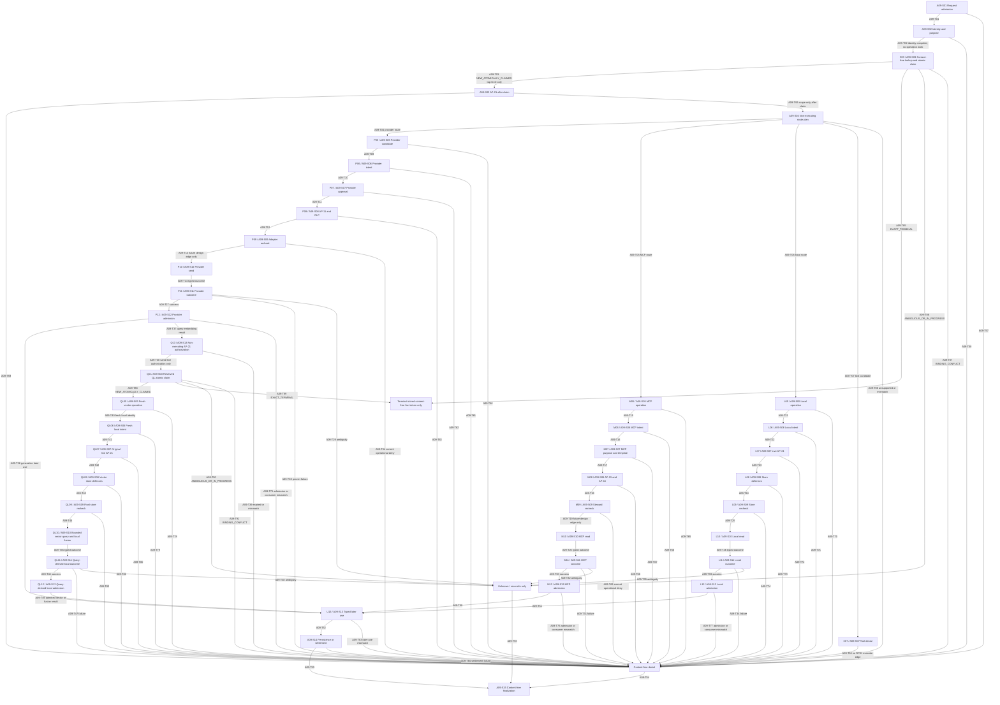

# Policy Order and Tool Authorization ADR v3

## State and authority

| Field | Value |
| --- | --- |
| Task | A09 |
| Revision | R9 |
| Artifact state | PROPOSED_FOR_REVIEW |
| Architecture v3 | UNFROZEN |
| HG-3 | APPROVED only for exact HG3-RP01 |
| Implementation/runtime/cloud authority | NONE |

This ADR is design and future-test contract evidence only. It refines, and
cannot broaden, the accepted A02 trust boundaries, A03 lifecycle, A04 governed
decision path, A07 erasability contract, A08 tenant-isolation contract, and
exact HG3-RP01. `HG3-D01-A` through `HG3-D20-A` are controlling. Where this
ADR and a controlling source appear inconsistent, the narrower fail-closed
interpretation applies and the inconsistency blocks progress pending a new
reviewed correction.

A recommendation, this artifact, a reviewer PASS, elapsed time, available
capability, provider/model/tool output, future code, or possession of an
identifier is never authority. A missing, stale, conflicting, ambiguous,
incomplete, mismatched, unsupported, expired, replayed, unavailable, or
unrecognized authority input fails closed. This document records no
implementation, runtime test, provider invocation, MCP query, tool effect,
credential use, cloud action, deployment, or production evidence.

### R1/R2/R3/R4/R5/R6/R7/R8 failed history and R9 restart

R1 exact `{size_bytes: 52034, lines: 575, sha256:
7e4a16f49a98b0ca3e475ed0246947c990a5b25afc1cdb6227e90ec81e1c7514}`
failed independent Terra review at HIGH `A09-R1-TERRA-01`. R1 allowed or
depicted S04/AP-21 as executing MCP templates or external query embedding
before class-specific S07-S09, depicted those operations again at S10, made
same-live-AP-21 query-embedding re-entry impossible in the linear graph, and
used generic provider T07/T08 facts that contradicted the MCP lane. Review
stopped. No R1 role, PASS, finding closure, text, hash, authority, graph or
transition position carried into R2.

R2 exact `{size_bytes: 60022, lines: 697, sha256:
4f3bb09dac600fb47649054cb4ac2b8aadb6ffba0d1ae9a4b520c6ae458eceed}`
failed independent Terra review at HIGH `A09-R2-TERRA-01`. Although R2
substantially closed the R1 defect, its `Q13 → V13 → S14` vector/fusion
continuation bypassed local `L07`-`L12`; the defect affected `A09-INV01`,
`A09-INV03`, `A09-INV14`, `A09-INV17`, `A09-AT04`, `A09-AT06`,
`A09-AT07`, `A09-AT15`, R2 correction checks 7, 12, 13, 15 and 16, and
`A09-TH02`, `A09-TH03`, `A09-TH04`, `A09-TH18`. Review stopped. No R1 or
R2 role, PASS, finding closure, text, hash, authority, graph or transition
position carried into R3.

R3 exact `{size_bytes: 66070, lines: 746, sha256:
35fef22e504d61e296e7224d9f37cffed3cbc00cc511af1c456f98f4611a6bf5}`
fully closed `A09-R2-TERRA-01` but failed independent Terra review at MEDIUM
`A09-R3-TERRA-01`. R3 bound idempotency across all classes and required a
distinct query-derived-local key, but its exact-committed-redelivery
MUST-NOT-reexecute clause enumerated provider, MCP and tool work only. It
omitted ordinary-local L10 and query-derived-local QL10, conflicted with
`A09-AT17`, and permitted repeated compute/read/budget consumption or a
different snapshot. `A09-INV16`'s external-effect rule did not close that
gap. The defect affected `A09-S06`, `A09-S10`, `A09-S11`, `A09-S12`,
`A09-INV05`, `A09-INV14`, `A09-INV20`, `A09-AT06`, `A09-AT07`,
`A09-AT17`, R3 correction checks 9, 20 and 24, and `A09-TH04`,
`A09-TH18`, `A09-TH21`. Review stopped. No R1, R2 or R3 role, PASS,
finding closure, text, hash, authority, graph or transition position carries
into R4.

R4 exact `{size_bytes: 74655, lines: 787, sha256:
fd045ae040c2451bfb1bb9ea34b78bb9b21564994a1b821c9e31ec7dc5143f78}`
failed independent Terra review at HIGH `A09-R4-TERRA-01`. R4 made committed
replay terminal after S06, but S06 followed S05. Provider S05 already froze
payload/source data, and reaching query-derived QL06 required
`P10 → P12 → Q13 → QL05`; exact committed replay could therefore perform
candidate work, repeat provider embedding/egress, or reconstruct/traverse
body-dependent state before disposition. This contradicted R4's zero
data-read/compute/reconstruction contract and made direct QL terminal replay
unreachable without provider work. Review stopped. No R1, R2, R3 or R4 role,
PASS, finding closure, text, hash, authority, graph or transition position
carries into R5.

R5 exact `{size_bytes: 78625, lines: 823, sha256:
c32af57be39fdfec5149cb72457e5e4eaed7c8506352262d51b33157dbba12fa}`
preserved the corrected early-claim topology but failed independent Terra
review at MEDIUM `A09-R5-TERRA-01`. Its generic error/evidence language did
not explicitly enumerate claim winner/nonwinner, missing and malformed
operation ID/key separately, post-claim envelope/source mismatch and
non-reclaim, three compared exact-QL body variants, reserved-unclaimed QL
with erased versus indeterminate prerequisites, or future-tool terminal
present versus unavailable. Missing/malformed zero-counter tests were also
not explicit in R5-E02/R5-E03/A09-AT17. Review stopped. No R1, R2, R3, R4 or
R5 role, PASS, finding closure, text, hash, authority, graph or transition
position carries into R6.

R6 exact `{size_bytes: 87653, lines: 876, sha256:
defdc187b62ff617cccb579c21489afbbbd51227a4258eb7d1219fe6ec2a1c63}`
failed independent Terra review at MEDIUM `A09-R6-TERRA-01`. R6's
`ZC-POSTCLAIM` omitted seven operation counters—candidate freeze, body
dereference, source read, provider candidate, MCP template, compute and QL05
entry—so post-claim mismatch cases did not prove all required work stayed
zero. Reserved-unclaimed QL cases asserted only seven selected counters
instead of full 28-counter `ZC-OP=0`. Review stopped. No R1, R2, R3, R4, R5
or R6 role, PASS, finding closure, text, hash, authority, graph or transition
position carries into R7.

R7 captured worker-evidence reference `{size_bytes: 89171, lines: 887, sha256:
13f603210fd0f1ae433098c2afde3c951161764e577c837425a80ebc051e183b}`
failed independent Terra review at MEDIUM `A09-R7-TERRA-01`. R7 required all
21 post-claim counters to remain independently zero for envelope/source
materialization mismatch, but R7-E09/R7-E10 did not explicitly perform an
exact same-operation-ID/key second delivery and repeat the zero-counter,
non-reclaim and no-rematerialization proof for that delivery. Generic R7-E11
could not substitute for the required per-mismatch scenario. Review stopped.
No R1, R2, R3, R4, R5, R6 or R7 role, PASS, finding closure, text, hash,
authority, graph or transition position carries into R8. R8 is a fresh
candidate and must complete the entire ordered review chain on its own exact
bytes.

The R7 tuple above is captured worker evidence only. Authentic R7 artifact
bytes are unavailable, non-rehashable and non-reproducible; therefore this
ADR makes no historical R7 byte-identity or graph-identity claim. The tuple
may be checked only as a faithfully labeled captured reference, never as
proof that the unavailable R7 artifact was independently rehashed.

R8 exact available preimage `{size_bytes: 92000, lines: 899, sha256:
2cd375ba78f228ea6b254d32df618f581c768d47fcf84bc2638e897a2353735d}`
passed independent Terra and Security review but failed independent Lean
review at MEDIUM `A09-R8-LEAN-01`. R8-E01 required rehashing the unavailable
R7 artifact, and R8-E19 required a historical R7 byte-identity claim; neither
claim was reproducible from authentic R7 bytes. Review stopped. No R1, R2,
R3, R4, R5, R6, R7 or R8 role, PASS, finding closure, text, hash, authority,
graph or transition position carries into R9. In particular, the R8 Terra
and Security PASS results do not carry. R9 is a fresh candidate and must
complete the entire ordered review chain on its own exact bytes.

## Exact proposal-input source register

These are the exact accepted inputs at authoring. Artifact review MUST rehash
all 15. Later authorized ledger, status, or manifest changes do not
retroactively rewrite this proposal-input snapshot and MUST NOT be described
as current-byte equivalent. Any candidate-artifact byte change restarts the
full Worker → Terra → Security → Lean → Chief review.

| ID | Source | Bytes | SHA-256 |
| --- | --- | ---: | --- |
| `A09-SR01` | [evidence ledger](../implementation/evidence-ledger.md) | 394522 | `7c7dca94e8708b3d7efccd606da8bb21262b5a17ea8b39ac3831afa275e89ee1` |
| `A09-SR02` | [implementation status](../implementation/status.md) | 47234 | `b53d7d6f619221a87154a7d8afa80cdc13631b717bef18851adb30dc9dec68c8` |
| `A09-SR03` | [task manifest](../implementation/task-manifest.yaml) | 15846 | `a1f9dbe999e20c5aae86ca96fa87e4acbf86dcbb998f39a42255c95ea8e74707` |
| `A09-SR04` | [goal](../implementation/goal.md) | 23646 | `4d7056f7c35b5ef9c0930486109b700f54aaf9d65e741f990f54960c7593a685` |
| `A09-SR05` | [requirements traceability](requirements-traceability-v3.md) | 75699 | `6f2672bdaabe8dd3fa07cbdc7f6d26e6cfcd12f9c7040927db83ede8d2cc1c6d` |
| `A09-SR06` | [system trust boundaries](system-trust-boundaries-v3.md) | 194041 | `9ac203dd631bd070605e33ae904ad5441ce0d7962524cfbda9abfc384c3805fc` |
| `A09-SR07` | [governed decision path](governed-decision-path-v3.md) | 198593 | `a013ba4886c77f401afc028f4ff2c99f19ec181541de58d65bd94fee798877af` |
| `A09-SR08` | [data deletion lifecycle](data-deletion-lifecycle-v3.md) | 124673 | `a2a65f9132f1683242943732d483eb1cd0e80c57a8e68db6090b3d953e9ad3d8` |
| `A09-SR09` | [erasable-payload ADR](erasable-payload-adr-v3.md) | 77499 | `d1e5f2a4b5e49b604273ebab7cd70520040b33ba55ebb87e5472a77e2903c0c1` |
| `A09-SR10` | [tenant-isolation ADR](tenant-isolation-adr-v3.md) | 64492 | `5e79d1ff11774c18d9e3b5175e76c72add2c473bbde035ded41c785aed3ce8ce` |
| `A09-SR11` | [independent-system boundary](independent-system-boundary-v3.md) | 21071 | `d0c90e13d59324b706db00376c8661a89d5dd4aed053dff3a8d80691b7fe8d4a` |
| `A09-SR12` | [HG-2 decision packet](../governance/hg2-human-decision-packet.md) | 37174 | `2b2d92363d66dd264e0b5beba08d7710e3b52550b75c6e28b37b54048c58da14` |
| `A09-SR13` | [HG-3 decision packet](../governance/hg3-human-decision-packet.md) | 35893 | `efb28005a11cb3244e2014db23a49d97d7675de22d6f427010dbd41e4ff54c13` |
| `A09-SR14` | [agent rules](../../AGENTS.md) | 1613 | `b63f5852b6ffa3f3ed6286de27d3258ebc22b73e65276d9f6683a5d1562f0063` |
| `A09-SR15` | [security policy](../../SECURITY.md) | 1418 | `618b2479ff8b859eb27485d3a3a2f150a94fb10c0b92b64df1586cfd2af36ed7` |

## Normative invariants — A09-INV

| ID | Invariant |
| --- | --- |
| `A09-INV01` | Authentication, server tenant resolution and purpose authorization precede an operation-generic content-free lookup/atomic-claim gate. That gate precedes AP-21/budget/snapshot work, S05 and every candidate/body/source/query/cache/index/vector/provider/MCP/local/tool operation. Provider, MCP, ordinary-local-read, query-derived-vector-local and tool-denial lanes remain distinct; their S07-S10 facts are typed, ordered, non-inheritable and unusable by another lane. |
| `A09-INV02` | Every lane has an independently addressable server operation ID/key and complete integrity-protected content-free capsule binding server-resolved tenant, principal/workload, purpose, request/job/trace, lane/class/subtype, parent/reserved-child refs, opaque envelope/candidate/source-set digests, destination/model class, policy/config/compiler/retrieval/embedding-space/cache/index/fence versions, budget/snapshot selectors and capsule version. A digest or selector proves equality only and grants no content, source, budget, snapshot or execution authority; no field substitutes for another. |
| `A09-INV03` | The early gate emits exactly one disposition: `NEW_ATOMICALLY_CLAIMED`, `EXACT_TERMINAL`, `AMBIGUOUS_OR_IN_PROGRESS`, or `BINDING_CONFLICT`. Only a newly claimed top-level operation enters AP-21 and then S05; direct/reserved QL cannot use that edge. AP-21 is complete before S04. External query embedding executes only after provider P07-P10; its admitted result reaches non-executing Q13, then QG. Only QG's newly atomically claimed reserved QL operation enters QL05-S12, and L10 alone performs bounded vector query/local fusion. |
| `A09-INV04` | Retrieved content, cache values, provider output, MCP output, model text, tool output, and errors remain untrusted data and never become instructions, policy, credentials, destinations, approval, or capability authority. |
| `A09-INV05` | The atomic claim is a compare-and-set on the independently addressable server operation record and exact capsule before any operation work. `NEW_ATOMICALLY_CLAIMED` means absent/reserved-as-permitted was atomically changed to claimed exactly once; `EXACT_TERMINAL` returns stored content-free outcome/reference/limitation; ambiguous/in-progress blocks; conflict denies. Provider and reserved query-derived-local identities/keys/capsules are distinct and cannot substitute. S06 records downstream intent but does not resolve replay. |
| `A09-INV06` | Exact current approval-policy resolution yields exactly one attempt-bound approval fact: either valid exact approval or `approval_not_required`; missing, duplicate, ambiguous, inherited, or stale resolution denies. |
| `A09-INV07` | Every provider-generation or external-query-embedding send passes provider P07 exact attempt-bound approval-route resolution, P08 AP-11/final DLP and P09 adapter-local recheck exactly once before P10 send. MCP and local facts cannot satisfy any provider step; reranking and moderation have no RP01 provider applicability fact. |
| `A09-INV08` | Every MCP read passes M07 same-tenant purpose/template applicability, M08 AP-15/AP-16 redaction/bounds policy and M09 Steward/cursor/SELECT-identity recheck exactly once before M10 read. It never passes or receives provider approval, AP-11, provider DLP, adapter, model, destination or credential authority. |
| `A09-INV09` | RP01 makes only abstract Bedrock generation and embedding design-eligible for public synthetic data. Exact model, dimensions, region, endpoint, terms, IAM, network, quota, and budget remain unresolved; therefore all invocation is operationally denied pending HG-5 and implementation. |
| `A09-INV10` | Second-provider execution, failover, alternate egress, racing, hedging, silent fallback, automatic retry, and reuse of a primary candidate or authority are disabled. Lost acknowledgement or ambiguous outcome is `unknown`, never inferred success or failure and never retry authority. |
| `A09-INV11` | The effectful external tool catalogue is empty. T0 is local pure computation only under ordinary current authority; T1 and T2 are disabled; T3 is prohibited and has no approval route. |
| `A09-INV12` | Managed MCP is design-limited to three read-only templates, exact audience and hard bounds through M07-M10 only. Provider paths cannot treat AP-15/AP-16 or template authorization as transmission authority. MCP exposes no arbitrary language, SQL, DDL, mutation, metadata, raw payload, semantic search, arbitrary field/sort, export, count, existence, timing, or error oracle. |
| `A09-INV13` | MCP cursor binding is normative, but cryptographic algorithm, wire format, signing/encryption, storage, rotation, and final owner remain unresolved. This ADR does not assign those decisions to A10, HG-1, or any other owner. No cursor runtime exists. |
| `A09-INV14` | Any capsule or bound tenant, principal/workload, purpose, policy/configuration, destination, model/class/subtype, budget/snapshot selector, source revision, embedding-space/version, cache/index version, deletion/tombstone, retention, lineage or fence change is `BINDING_CONFLICT` for that operation record and cannot create execution authority. Downstream freshness changes invalidate newly claimed work from the earliest affected stage; they never rewrite a terminal capsule or convert terminal/ambiguous/conflict into new. Q13 and query-derived local L07-L09 still recheck without refresh or broadening. |
| `A09-INV15` | Sensitive bodies are erasable and never copied into immutable audit metadata. Receipts and errors are content-free facts; raw prompts, memory, payloads, matched DLP text, secrets, credentials, provider/tool bodies, and free-form reasons are excluded. |
| `A09-INV16` | Idempotency is operation-generic and resolved before that operation's work. C03 `EXACT_TERMINAL` returns only the stored content-free fact and cannot reach AP-21, S04/S05, P10/M10/L10/QL10, Q13/QG/QL05, a tool, or any operation-work path. QG `EXACT_TERMINAL` cannot enter QL05 or child work; it may occur only after an independently newly claimed parent reached Q13, never on direct QL replay. Direct QL replay always resolves at C03 without provider work. Erased body is unavailable-with-limitation and never reconstructed. Ambiguity blocks re-execution; durable effects are additionally idempotent, but RP01 authorizes none. |
| `A09-INV17` | Tenant isolation is structural and server-owned at every stage, including Q13 and every query-derived local S05-S12 stage; client/model/provider/tool tenant hints and identifiers are non-authoritative. Cross-tenant fallback, cache/index reuse, cursor reuse, result admission, and receipt linkage deny uniformly. |
| `A09-INV18` | Learning/export, federation, break-glass broadening, real/personal/high-risk/unknown/mixed data, and informal exceptions remain disabled under exact HG2-RP01/HG3-RP01. HG-5 may tighten but cannot broaden HG-3. |
| `A09-INV19` | Denials reveal only stable content-free codes. They do not distinguish absence from unauthorized existence, tenant mismatch, count, tombstone, policy mismatch, cursor validity, or secret state. |
| `A09-INV20` | Any unsupported state, unenumerated transition, partial claim/commit, unavailable authority, conflicting capsule or missing/duplicate/indeterminate disposition terminates in content-free denial or `AMBIGUOUS_OR_IN_PROGRESS`; it cannot fall through. Only a successful atomic absent-to-claimed transition, or the separately constrained reserved-QL-to-claimed transition after Q13, yields `NEW_ATOMICALLY_CLAIMED`. |

### Invariant-to-acceptance map

| Group | Invariants covered | Acceptance coverage |
| --- | --- | --- |
| G01 | `A09-INV01`, `A09-INV02` | `A09-AT05`, `A09-AT06` |
| G02 | `A09-INV03` | `A09-AT07` |
| G03 | `A09-INV04` | `A09-AT05`, `A09-AT12` |
| G04 | `A09-INV05`, `A09-INV06` | `A09-AT06`, `A09-AT17` |
| G05 | `A09-INV07`, `A09-INV08` | `A09-AT09`, `A09-AT10` |
| G06 | `A09-INV09`, `A09-INV10` | `A09-AT08`, `A09-AT11` |
| G07 | `A09-INV11` | `A09-AT12` |
| G08 | `A09-INV12`, `A09-INV13` | `A09-AT13`, `A09-AT14` |
| G09 | `A09-INV14` | `A09-AT15` |
| G10 | `A09-INV15` | `A09-AT16` |
| G11 | `A09-INV16` | `A09-AT17` |
| G12 | `A09-INV17`, `A09-INV18` | `A09-AT18`, `A09-AT19` |
| G13 | `A09-INV19`, `A09-INV20` | `A09-AT06`, `A09-AT17` |

## Fifteen-stage normative state register — A09-S

Every stage consumes only the named authority, emits only the named output,
and revalidates on every use. “Audit” means content-free proposed facts, not a
claim that a receipt system exists.

`C03` is the mandatory early claim substate within authoritative S03. It
follows S02 identity/purpose and precedes AP-21, budgets, snapshots, S04/S05
and all operation work. `QG` applies the same claim semantics to a previously
reserved downstream QL identity after Q13 and before QL05. These are typed
substates of S03, not extra authority registers. S04 is a non-executing typed route plan. It may classify a requested lane and
bind identifiers and budgets, but it cannot read a store, run a template,
construct or send provider bytes, invoke embedding/reranking/fusion, or
execute a tool. At S07-S10 the state type is part of the authority:
`P07`-`P10` are provider facts, `M07`-`M10` are MCP facts, `L07`-`L10` are
local-retrieval facts (including the separately identified `QL05`-`QL12`
query-derived-vector subtype), and `X07` is the RP01 tool-denial fact. These labels are
typed states within the authoritative S07-S10 stages, not additional
authority registers. No cast or substitution between them exists. Missing
applicability is denial, not an implicit `not_applicable`.

| ID | Stage | Required input and authority | Explicit non-authority | Success output | Deny/invalidation/reuse rule | Content-free audit facts |
| --- | --- | --- | --- | --- | --- | --- |
| `A09-S01` | Content-free request admission | syntactically bounded request ID, trace, channel, requested operation class, independently addressable server operation ID/key and integrity-protected content-free capsule | body/prompt/query, client tenant/purpose/model/tool/provider fields, operation-ID possession | admitted opaque request envelope plus untrusted operation/capsule refs; no body dereference | malformed, duplicate-conflicting, oversized, unsupported or unsafe class denies; no candidate/body/source/budget/snapshot work | request/operation/capsule refs, channel class, admission code |
| `A09-S02` | Server identity and purpose | authenticated principal or workload/job; server-resolved tenant; allowed purpose; current session/job; S01 refs | bearer text inside payload, client tenant hint, operation/key/capsule possession | identity-purpose fact bound to request/trace and lookup tuple | missing/expired/revoked/mismatched identity or purpose denies uniformly; no inherited session after change; no operation work | opaque identity/tenant/purpose/operation refs, policy version, code |
| `A09-S03` | Content-free atomic claim then AP-21 | C03: S02 fact, server operation ID/key and complete sealed capsule; canonical content-free operation record. QG additionally requires Q13, reserved child-QL identity/commitment and a complete proposed child capsule formed from exact content-free parent/result refs. Only `NEW_ATOMICALLY_CLAIMED` then permits AP-21 evaluation from current policy/config, allowed resource/view/entity/time/sensitivity limits, budget/snapshot selectors, expiry and deletion/revision fence | body/prompt/query; ID/key/capsule possession; capsule digests/selectors as content or authority; repository/index/cache/MCP/provider/tool access; reserved QL identity as authority | C03/QG emits exactly one disposition; `EXACT_TERMINAL` returns stored content-free fact terminally, ambiguous/in-progress blocks, conflict denies; newly claimed top-level operation emits signed/opaque AP-21, while newly claimed QL proceeds to QL05 under Q13 | lookup/compare/claim is atomic; missing/partial capsule, capsule mutation, concurrent loss, stale/mismatched identity or non-permitted reserved-child transition cannot become new; no work before claim | operation/capsule refs and version, atomic claim/disposition code, parent/child refs; for new top-level work, scope ID/digest/versions/bounds/expiry |
| `A09-S04` | Non-executing typed route plan | live S03 AP-21, server operation class, allowed lane set and hard budgets | exact/opaque IDs, cache/vector/MCP/provider/tool capability, request content, model choice | one content-free route type: local read, MCP read, eligible provider generation/query-embedding, or tool/unsupported denial | no outgoing execution is permitted; reranking/moderation/second-provider/tool-effect applicability denies; missing/conflicting lane denies | route type, scope ref, class/budget versions, denial code |
| `A09-S05` | Lane-specific candidate/operation freeze | exact same-operation `NEW_ATOMICALLY_CLAIMED` fact; top-level S04 route plus current compiler/policy/config; provider freezes minimized bytes/source revisions; MCP freezes template/filters/order/bounds; ordinary local freezes store/view/query bounds; QL05 requires QG's newly claimed reserved QL fact, Q13 and admitted untrusted P12 embedding data | terminal/ambiguous/conflict disposition; retrieved content not yet read; executor capability; output as authority; provider identity as QL identity | immutable typed candidate/operation ref with erasable body separation; QL retains its independently reserved identity distinct from provider | missing/new-claim mismatch, conflict, unsupported class, stale scope/fence, over-budget or version mismatch denies; no execution | claim/operation/capsule ref, typed candidate ref, local subtype, source/template/store refs, versions, limitation |
| `A09-S06` | Durable typed downstream intent/reserve | S05 typed candidate and same-operation `NEW_ATOMICALLY_CLAIMED` fact; unique attempt refs, current fences and budget; QL06 retains claimed reserved identity/key distinct from provider | candidate as approval; S06 as replay lookup; previous/provider/MCP/tool-generated ID; claim for another lane/operation | one durable typed downstream intent whose operation/lane/subtype cannot change | persistence/reserve/identity mismatch or ambiguity denies/unknown; never re-resolve or broaden the S03 claim; no execution | typed intent/claim/operation/capsule refs, local subtype, class/budget/reserve code |
| `A09-S07` | Typed applicability/approval | provider P07: eligible generation/query-embedding and exact attempt approval or `approval_not_required`; MCP M07: same-tenant purpose and exact template; local L07: original still-live AP-21 and allowed store/view, including QL07 revalidation; tool X07: catalogue/risk check | another lane's fact, reviewer PASS, prior approval, model/tool choice, refreshed/broadened AP-21 | exactly one P07, M07 or L07 fact retaining local subtype; X07 always denial in RP01 | missing/duplicate/ambiguous/stale/class-mismatched fact denies; Q13/QL07 mismatch denies without refresh/broadening; rerank/moderation/tool/second-provider has no success fact | lane/subtype, policy/version, original-scope ref, approval/template/store class, denial |
| `A09-S08` | Typed boundary policy | P08: exact P07 plus AP-11/final DLP/retention/budget/fences; M08: exact M07 plus AP-15/AP-16 redaction/template/bounds; L08: exact L07 plus tenant, purpose, source revisions, embedding space/version, cache/index versions, lifecycle fences, lineage, bounds and store defense in depth | AP-15/AP-16 as provider authority; AP-11/DLP as MCP/local authority; lane casts; provider result as retrieval permit | one same-lane P08, M08 or L08 allow fact retaining local subtype | any byte/class/template/store/tenant/purpose/source/space/cache/index/lineage/bound/fence/applicability mismatch denies | lane/subtype-specific policy refs/codes; DLP summary only for P08 |
| `A09-S09` | Typed executor-local recheck | P09: exact P08 plus adapter bytes/destination/model/version/network/workload/fences; M09: exact M08 plus Steward/cursor/template/SELECT identity/fences; L09: exact L08 plus immediate final tenant/purpose-qualified repository/index/cache session, original scope, source/space and lifecycle-fence recheck | redirects, client headers, datastore identity as AP-21, another lane's permit, earlier successful check | one same-lane ephemeral P09, M09 or L09 permit retaining local subtype | any lane, identity, destination, cursor, template, store, tenant, purpose, bound, session, source, space or fence mismatch denies; provider failure is zero egress | lane/subtype/executor class, recheck versions/codes, no secrets |
| `A09-S10` | Typed bounded execution | P10/M10/L10/QL10 requires the same operation's early `NEW_ATOMICALLY_CLAIMED` fact, exact downstream intent and one immediate same-lane P09/M09/L09; QL10 is the sole query-derived vector-query/local-fusion executor | S04 route, Q13, reserved QL identity, S07/S08 alone, another operation/lane fact, terminal/ambiguous/conflict disposition | type-preserving provider crossing attempt, MCP bounded read, ordinary local bounded read, or query-derived bounded vector query/local fusion | non-new dispositions have no S05/S10/tool/executor edge; operational absences still deny; no query-derived execution outside QL10; unenumerated edge denies | lane/subtype, operation/claim/attempt/template/store class, start/deny code |
| `A09-S11` | Type-preserving outcome classification | exact fresh P10/M10/L10 operation ref, its early new-claim fact and same-lane/subtype executor evidence | timeout as failure, missing response as no-effect, cross-operation/lane/subtype result, log existence, terminal replay as fresh evidence | typed P/M/L and ordinary/query-derived local `succeeded`, `failed`, or `unknown` fact with limitations | ambiguous crossing/read/fusion is `unknown`; early terminal replay never reaches S11; no retry/failover/cast/inference | lane/subtype outcome code, claim ref, ambiguity, limitation/reconciliation ref |
| `A09-S12` | Typed result admission | exact fresh same-operation/lane/subtype S11 fact; bounds/schema; tenant/purpose/class/source/template/store/space/lineage; current fences | output as authority, cross-operation/lane/subtype/attempt response, provider success alone, terminal replay as fresh result | admitted volatile untrusted P/M/L result retaining lane and local subtype | wrong operation/lane/subtype/attempt/tenant/schema/source/space/fence or unknown outcome denies; terminal replay bypasses S05-S12 and returns stored content-free fact only; erased body remains unavailable | lane/subtype/admission code, operation/claim ref, schema/bounds/fence versions |
| `A09-S13` | Non-executing query re-entry, QL claim or typed later use | Q13 receives admitted query-embedding P12 plus original still-live AP-21 and may authorize only QG. QG consumes the reserved downstream QL identity/key/commitment, forms a complete proposed child capsule from content-free P12 parent/result refs, and resolves its atomic claim without dereferencing the embedding body. U13 receives fresh admissions and exact consumer policy | Q13, P12, reserved identity/commitment or capsule as QL execution authority; direct replay through P/P12/Q13; broadened scope | Q13 emits same-live-scope fact for QG; only QG `NEW_ATOMICALLY_CLAIMED` enters QL05; QG terminal returns stored fact; U13 emits typed later-use | expired/mismatched AP-21 denies; reserved-child/capsule/parent/result-ref mismatch conflicts; ambiguous child blocks; any consumer mismatch denies | operation/parent-child/capsule, lane/subtype, consumer, original scope/source, claim/re-entry/later-use codes |
| `A09-S14` | Atomic persistence or effect settlement | exact S13 fact; specialized lifecycle/tenant-qualified transaction; idempotency and current fences; for effects, sole live dispatch fence (no RP01 effect) | generic logging, partial write, admission, model/tool request | content-free result ref plus separately erasable body linkage, or exact effect settlement | tuple-or-none; persistence failure never implies external failure; ambiguous effect stays possible-effect; deletion wins according to A03/A07 | result/effect ref, transaction/outcome/idempotency/fence codes |
| `A09-S15` | Content-free finalization | complete S01-S14 lineage or explicit earlier denial/unknown closure; current limitation facts | raw bodies, free-form reasons, secrets, inferred provider deletion, log existence | final content-free receipt proposal and durable task state | missing lineage, partial facts, conflict, unknown misrepresented as final, or receipt persistence failure cannot claim completion | decision/attempt/outcome/limitation/source/version refs only |

## Normative ordered graph

The graph is normative only together with the transition table. Every
unshown or failed transition goes to content-free denial, except an ambiguous
post-crossing outcome which goes to `unknown`.

## Complete transition register — A09-T

| ID | From → to | Normative condition |
| --- | --- | --- |
| `A09-T01` | S01 → S02 | bounded request admitted |
| `A09-T02` | S02 → C03 | exact server identity, tenant and purpose enter content-free lookup/atomic claim before operation work |
| `A09-T03` | C03 → S03 | top-level non-QL `NEW_ATOMICALLY_CLAIMED`; only now evaluate AP-21; reserved/direct QL can never use this edge |
| `A09-T04` | S04 → P05 | select eligible provider generation/query-embedding route |
| `A09-T05` | S04 → M05 | select bounded MCP route |
| `A09-T06` | S04 → L05 | select local retrieval route |
| `A09-T07` | S04 → X07 | tool candidate enters mandatory RP01 denial |
| `A09-T08` | S04 → deny | unsupported, rerank, moderation, second-provider, mismatch or unenumerated route |
| `A09-T09` | P05 → P06 | freeze typed provider candidate then durable intent |
| `A09-T10` | P06 → P07 | claimed provider downstream intent enters exact approval resolution |
| `A09-T11` | P07 → P08 | exact attempt-bound approval fact |
| `A09-T12` | P08 → P09 | exact AP-11/final DLP provider fact |
| `A09-T13` | P09 → P10 | one future design send permit; currently blocked by HG-5/implementation |
| `A09-T14` | P10 → P11 | preserve provider type into outcome |
| `A09-T15` | M05 → M06 | freeze typed MCP operation then durable intent |
| `A09-T16` | M06 → M07 | claimed MCP downstream intent enters purpose/template authorization |
| `A09-T17` | M07 → M08 | exact same-tenant purpose/template fact |
| `A09-T18` | M08 → M09 | exact AP-15/AP-16 redaction/bounds fact |
| `A09-T19` | M09 → M10 | one future bounded read permit; currently blocked by absent runtime |
| `A09-T20` | M10 → M11 | preserve MCP type into outcome |
| `A09-T21` | L05 → L06 | freeze typed local operation then durable intent |
| `A09-T22` | L06 → L07 | claimed ordinary-local downstream intent exact-matches live AP-21 |
| `A09-T23` | L07 → L08 | AP-21 permits store-specific defenses |
| `A09-T24` | L08 → L09 | exact tenant/source/space/cache/fence defense fact |
| `A09-T25` | L09 → L10 | one bounded tenant-qualified local read |
| `A09-T26` | L10 → L11 | preserve local type into outcome |
| `A09-T27` | P11 → P12 | provider success enters typed admission |
| `A09-T28` | P11 → deny | proven provider failure |
| `A09-T29` | P11 → unknown | ambiguous provider acknowledgement |
| `A09-T30` | M11 → M12 | MCP success enters typed admission |
| `A09-T31` | M11 → deny | proven MCP failure |
| `A09-T32` | M11 → unknown | ambiguous MCP outcome |
| `A09-T33` | L11 → L12 | local success enters typed admission |
| `A09-T34` | L11 → deny | proven local failure |
| `A09-T35` | L11 → unknown | ambiguous local outcome |
| `A09-T36` | P12 → U13 | generation result enters exact later-use policy |
| `A09-T37` | P12 → Q13 | query-embedding result enters original-scope re-entry, not vector/fusion |
| `A09-T38` | Q13 → QG | original AP-21 is still live and exact; authorize only reserved QL content-free atomic claim |
| `A09-T39` | Q13 → deny | expired/mismatched scope denies without refresh or broadening |
| `A09-T40` | QL05 → QL06 | freeze a fresh local operation identity and distinct local idempotency key |
| `A09-T41` | QL06 → QL07 | newly claimed query-derived local intent enters original-live-AP-21 validation |
| `A09-T42` | QL07 → QL08 | original AP-21 remains live without refresh or broadening |
| `A09-T43` | QL08 → QL09 | exact tenant/purpose/source/space/cache/index/lineage/bounds/fence defenses pass |
| `A09-T44` | QL09 → QL10 | immediate final store/session/source/space/fence recheck permits execution |
| `A09-T45` | QL10 → QL11 | preserve query-derived local subtype into vector/fusion outcome |
| `A09-T46` | QL11 → QL12 | proven query-derived local success enters exact typed admission |
| `A09-T47` | QL11 → deny | proven query-derived vector/fusion failure |
| `A09-T48` | QL11 → unknown | ambiguous query-derived vector/fusion outcome |
| `A09-T49` | QL12 → U13 | admitted query-derived vector/fusion result enters typed later-use policy |
| `A09-T50` | M12 → U13 | admitted MCP result enters typed later-use policy |
| `A09-T51` | L12 → U13 | admitted ordinary-local result enters typed later-use policy |
| `A09-T52` | U13 → S14 | exact typed consumer authorization passes |
| `A09-T53` | S14 → S15 | tuple-or-none settlement yields complete lineage |
| `A09-T54` | deny → S15 | content-free denial finalization |
| `A09-T55` | unknown → S15 | ambiguity/possible-egress limitation finalization |
| `A09-T56` | X07 → deny | empty catalogue/T1/T2 disabled/T3 prohibited; no executor edge |
| `A09-T57` | S01 → deny | malformed/oversized/unsupported admission |
| `A09-T58` | S02 → deny | identity/tenant/purpose mismatch |
| `A09-T59` | S03 → deny | AP-21 missing/stale/replayed/broadened |
| `A09-T60` | P05 → deny | provider candidate/class/source/version failure |
| `A09-T61` | P06 → deny | provider downstream intent/reserve/claim mismatch |
| `A09-T62` | P07 → deny | provider approval fact failure |
| `A09-T63` | P08 → deny | AP-11/DLP/retention/budget/fence failure |
| `A09-T64` | P09 → deny | adapter mismatch or current HG-5/implementation absence |
| `A09-T65` | M05 → deny | MCP candidate/template/version failure |
| `A09-T66` | M06 → deny | MCP downstream intent/reserve/claim mismatch |
| `A09-T67` | M07 → deny | MCP audience/purpose/template failure |
| `A09-T68` | M08 → deny | AP-15/AP-16/redaction/bound failure |
| `A09-T69` | M09 → deny | Steward/cursor/identity mismatch or absent runtime |
| `A09-T70` | L05 → deny | ordinary-local operation/store/view failure |
| `A09-T71` | L06 → deny | ordinary-local downstream intent/reserve/claim mismatch |
| `A09-T72` | L07 → deny | ordinary-local live AP-21 mismatch |
| `A09-T73` | L08 → deny | ordinary-local tenant/source/space/cache/fence defense failure |
| `A09-T74` | L09 → deny | ordinary-local final store/session/source recheck failure |
| `A09-T75` | P12 → deny | provider admission or consumer mismatch |
| `A09-T76` | M12 → deny | MCP admission or consumer mismatch |
| `A09-T77` | L12 → deny | ordinary-local admission or consumer mismatch |
| `A09-T78` | QL05 → deny | query-derived candidate/identity/class/source/version failure |
| `A09-T79` | QL06 → deny | query-derived-local downstream intent/reserve/claim mismatch |
| `A09-T80` | QL07 → deny | original AP-21 expired or mismatched; no refresh, broadening or fallback |
| `A09-T81` | QL08 → deny | tenant/purpose/source/space/cache/index/lineage/bound/fence defense failure |
| `A09-T82` | QL09 → deny | final store/session/source/space/fence recheck failure |
| `A09-T83` | U13 → deny | typed later-use mismatch |
| `A09-T84` | S14 → deny | atomic settlement/persistence failure |
| `A09-T85` | C03 → TERMINAL | `EXACT_TERMINAL`; return stored content-free outcome/reference/limitation before operation work |
| `A09-T86` | C03 → unknown | `AMBIGUOUS_OR_IN_PROGRESS`; reconcile without operation work |
| `A09-T87` | C03 → deny | `BINDING_CONFLICT`; uniform denial without operation work |
| `A09-T88` | QG → QL05 | reserved QL `NEW_ATOMICALLY_CLAIMED`; only now freeze query-derived local candidate |
| `A09-T89` | QG → TERMINAL | reserved QL `EXACT_TERMINAL`; return stored content-free fact without QL05 |
| `A09-T90` | QG → unknown | reserved QL `AMBIGUOUS_OR_IN_PROGRESS`; reconcile without QL05 |
| `A09-T91` | QG → deny | reserved QL `BINDING_CONFLICT`; deny without QL05 |
| `A09-T92` | S03 → S04 | AP-21 issued after atomic claim; S04 remains non-executing |

## Authority lattice and exact bindings

Every row is a different type. No upward or lateral implication exists.

| Authority type | Required exact bindings | Cannot authorize |
| --- | --- | --- |
| Admission | request, trace, channel, operation class, bounds | identity, tenant, retrieval, egress, effect |
| Identity | principal/workload/job, authentication version, expiry/revocation | tenant, purpose, content |
| Tenant | server-resolved tenant and tenant-policy version | purpose, resource, destination |
| Purpose | tenant, principal/workload, allowed purpose and policy | retrieval scope, provider/tool |
| Claim capsule | server operation ID/key, identity/purpose, lane/class/subtype, parent/child refs, opaque equality digests/selectors and all capsule versions | body/content, AP-21, source existence, budget/snapshot evaluation, execution |
| Atomic claim | exact capsule plus canonical record and single compare-and-set disposition | another operation/lane, terminal rewrite, retry, body/source lookup |
| QL reservation | distinct server child operation ID/key plus server commitment to capsule schema, parent and deterministic result slot | claim, complete capsule, Q13, embedding body, vector query, execution |
| AP-21 | all S03 bindings and expiry | egress, approval, tool effect, persistence |
| Retrieval defense | AP-21 plus store/template/index/cache-specific constraints | mint/refresh/widen AP-21 |
| Candidate | sources/revisions/fences/compiler/model/space versions | approval, transmission, credential |
| Intent | newly claimed operation, candidate, class/subtype, destination class and attempt; query-derived local identity/key/capsule are distinct from provider | replay resolution, approval, AP-11, dispatch, provider-to-local identity reuse |
| Approval route | exact attempt and all S07 bindings | another attempt/class/destination or policy |
| AP-11/DLP | exact minimized bytes and all S08 bindings | connect/send without S09 |
| Adapter permit | one immediate S09 connect/send under adapter identity | redirect, failover, retry, other class |
| MCP read | live AP-21, audience, template/filter/order/snapshot/bounds/cursor | SQL, export, write, policy |
| Tool dispatch | exact future capability, approval, effect, dispatch fence | absent in RP01; never model-granted |
| Result admission | attempt/outcome/schema/tenant/lineage/fences | authority, later use, persistence |
| Later use | exact result, consumer, live scope, sources, fences | another consumer/scope/effect |
| Finalization | complete content-free lineage and exact task transition | infer external truth or erase limitations |

## AP-21 expansion contract

The content-free atomic claim MUST complete before AP-21 evaluation begins.
AP-21 MUST bind server tenant; principal or workload/job; purpose; request,
trace and, for durable work, job identity; allowed resource/view/entity/time
and sensitivity sets; row/candidate/token/time/concurrency budgets; policy,
configuration, compiler and retrieval versions; embedding space/epoch where
applicable; deletion/revision fence; expiry; and an integrity-protected scope
digest.

The following are expansion and MUST NOT begin before AP-21:

1. canonical content lookup, including exact/opaque-ID dereference;
2. vector query or neighbor release;
3. cache lookup, hit release, rebuild, or fallback;
4. MCP template selection or execution;
5. external query-embedding candidate construction or invocation;
6. reranking candidate construction or invocation;
7. multi-view fusion, entity/temporal/causal expansion, or result widening.

Each continuation rechecks tenant, purpose, request/job, source revisions,
space/epoch, policy/configuration, expiry, deletion/tombstone and all budgets.
An admitted query embedding reaches non-executing Q13 and then a fresh,
separately identified query-derived local QL05-QL12 operation; QL07 rechecks
the same still-live AP-21 and QL10 alone may execute the bounded vector query
or local fusion. Reranking has no RP01 executable route. Missing scope never
falls back to a local, cache, exact-ID, MCP, or provider route. Budget
exhaustion is terminal content-free denial, not permission to use a cheaper or
less-governed route.

## Provider, DLP, failover, and retry contract

### RP01 provider ceiling

Only public synthetic RP01 generation and public synthetic embedding are
design-eligible, through abstract Amazon Bedrock class seams. Reranking,
moderation/classification, real/personal/sensitive/high-risk/unknown/mixed
data, raw receipts, secrets, identities, tool material, learning/export, and
all other external-processing classes are denied. Exact model/version,
embedding dimensions, region, endpoint, residency, retention/deletion terms,
subprocessors, IAM, network, quotas, concurrency and spend are unresolved, so
there is no invocation authority.

Every eligible attempt still requires S05 candidate freeze, S06 durable
intent, S07 exact `approval_not_required`, S08 exact AP-11/final DLP, S09
adapter recheck, and the one immediate S10 permit. No batch, stream, retry, or
continuation inherits a prior attempt.

### DLP required inputs and exhaustive exclusions

DLP evaluates the exact serialized bytes and destination immediately before
each attempt. It binds policy/detector/version, tenant/purpose, data class,
source revisions, minimization transform/version, provider/destination/model
class, retention capability, attempt and live fences. Detector failure,
timeout, ambiguity or unsupported encoding denies.

The outbound body and all transport/content fields MUST exclude:

- tenant/customer identity, personal data, secrets, credentials, tokens,
  cookies, authorization headers and private keys;
- raw immutable events, erasable payloads beyond the minimized synthetic
  fixture, raw memory, source documents, attachments and database rows;
- raw receipts, audit reasons, DLP matches, denial details, tool bodies,
  queue/DLQ bodies, telemetry bodies and incident records;
- system/developer prompts, hidden policy, chain-of-thought, internal
  instructions, environment/configuration, endpoints and network topology;
- cross-tenant identifiers, stable equality tokens, reversible hashes,
  fingerprints, wrapped keys, key aliases, ciphertext or deletion oracles;
- arbitrary user/model/provider headers, redirects, URLs, destinations,
  callbacks, webhooks, tools, schemas, transports or credential references.

### Failover and ambiguity

RP01 has no second-provider execution and no failover. Primary denial,
timeout, transport failure, provider failure, rate limit, unavailable model,
budget exhaustion, cancellation, partial stream, lost acknowledgement, or
unknown result cannot select an alternate, race, hedge, retry, reuse candidate
bytes, or infer no effect. Any future alternate would require a new profile
decision plus a wholly fresh S05-S10 chain and could never inherit primary
authority. This ADR does not create that route.

## Independent tool authorization

| Risk | Definition | RP01 catalogue | Authorization and result |
| --- | --- | --- | --- |
| T0 | local deterministic pure computation; no external read/effect | design-eligible under later ordinary task scope | current tenant/purpose/policy and resource bounds still apply; output remains untrusted |
| T1 | external read | empty and disabled | future exact nonce/expiry/attempt/scope/nonreuse approval plus independent dispatch required |
| T2 | reversible external effect | empty and disabled | future exact nonce/expiry/attempt/effect/rollback/nonreuse approval plus sole live dispatch fence required |
| T3 | destructive or irreversible effect | prohibited | no approval route in RP01 |

The effectful catalogue is exactly empty. Registration, risk classification,
destination, capability, schema, credential, approval, dispatch and outcome
are server-owned and independently versioned. A prompt, model plan, retrieved
procedure, provider/MCP result, tool self-description, plugin metadata, user
header, or prior approval cannot register, reclassify, authorize or dispatch a
tool. Unrecognized tools are T3-denied, not T0. There is no “read-only” label
exception: an external read is T1.

Future approval, if a later profile permits it, binds tenant, principal or
workload, purpose, tool/capability/version, risk, exact destination, request,
attempt, input schema/digest, effect/rollback where applicable, policy,
nonce, issue/expiry, nonreuse and all lifecycle fences. Approval admission is
not dispatch. Only the separate, fresh, one-use dispatch fence may enable one
bounded execution. No such catalogue, approval or fence exists now.

## Managed MCP bounded design contract

Managed MCP is read-only, not an arbitrary query surface, and has no current
runtime.

| Dimension | Exact RP01 ceiling |
| --- | --- |
| Audience | authenticated, same-synthetic-tenant, purpose-bound RP01 users only |
| Templates | exactly `task_status_summary.v1`, `receipt_summary.v1`, `evidence_lineage_summary.v1` |
| Database identity | future dedicated least-privilege SELECT-only identity over curated tenant-qualified templates |
| Filters/order | normalized, server-owned, template-specific and versioned |
| Page | maximum 25 rows |
| Cursor chain | maximum 100 rows total |
| Scanned candidates | maximum 500 |
| Execution | maximum 2 seconds |
| Concurrency | maximum 2 requests per authenticated session |
| Cursor expiry | maximum 5 minutes |
| Result | redacted content-free summary fields only; uniform denial |

Anonymous, public, cross-tenant, global-support, wildcard-privileged and
operator-bypass audiences deny. Arbitrary DSL/SQL/DDL/DML, procedures,
metadata/system catalogs, raw payload, free-text semantic search, arbitrary
fields/sorts, unrestricted EXPLAIN, bulk export, total count, existence,
minimum-result, timing and differentiated-error oracles deny. There is no
fallback or raw datastore error. Row/page/time/concurrency/scan/export bounds
are hard and cannot be client-relaxed.

An opaque authenticated cursor MUST bind tenant, principal/workload, purpose,
request/session, AP-21 scope, template and schema versions, normalized
filters, order, policy/configuration, snapshot, source/deletion/revision
fences, page and chain bounds, issue/expiry and continuation position. Any
mismatch, expiry, replay, tamper or unavailable binding denies uniformly.
Cryptographic algorithm, wire format, signing/encryption, key management,
storage, revocation, rotation and final owner are unresolved. They are not
assigned to A10, HG-1, A11, R04, S01, S04 or any actor by this ADR; later work
may reconcile only within its existing scope and applicable gates.

## Lifecycle, tenant, and TOCTOU contract

1. Server tenant and purpose are re-resolved at S02 and exact-matched at every
   later stage. Database/index/cache/MCP/provider/tool checks add defense in
   depth and never create tenant authority.
2. A03 lifecycle state and A07 content-free anchors govern source, candidate,
   result and receipt linkage. Immutable facts reference opaque anchors, not
   erasable content, digests, fingerprints or existence oracles.
3. Tombstone, correction, retraction, deletion request, key/material purge,
   source-revision change, retention expiry or resolver uncertainty
   invalidates retrieval, candidate, approval, AP-11, adapter permit, result
   admission and later use as applicable.
4. Every sensitive operation exact-matches the newest policy/configuration,
   authority and lifecycle snapshot immediately before its boundary. A check
   from an earlier stage is not a lock or lease for a later stage.
5. If an authorized external crossing serializes before later invalidation,
   the outcome remains possible-effect/possible-egress and cannot be rewritten
   as no-effect. If invalidation wins first, the crossing is denied.
6. Tenant/purpose/source/fence mismatch produces no cross-tenant fallback,
   existence distinction, cache miss distinction, candidate reuse, cursor
   continuation, result persistence or retry.
7. Queue messages, durable work and receipts carry opaque identifiers and
   versions, not memory/provider/tool bodies. Workers reauthorize from
   canonical state; message possession is not authority.

## Content-free receipts, errors, and idempotency

| Fact | Allowed minimum | Forbidden |
| --- | --- | --- |
| decision/denial | opaque decision, stage, policy/config versions, tenant/purpose refs, stable code, time class | raw reason, content, prompts, secrets, existence/count distinctions |
| scope | opaque AP-21 ref/digest, bounded classes, expiry/version refs | query/body, raw filters, sensitive entity names |
| attempt | attempt/idempotency refs, class, destination/model class, status/limitation | request/response, credential, reusable header, equality token |
| approval route | `approval_not_required` or future exact approval ref/version/expiry/nonreuse | free-form approval text, signature bytes, reusable authority |
| DLP | policy/detector versions, allow/deny code, class summary | matched text, raw detector result, serialized body |
| MCP | template/version, bounded request ref, page class, denial/limitation | SQL, raw filters/results, total count/existence |
| tool | capability/risk/version refs, dispatch/outcome/rollback class | tool input/output body, secret, credential, effect details |
| outcome | success/failure/unknown code, ambiguity and external limitation, reconciliation ref | inferred truth, provider/tool body, deletion assurance |
| finalization | lineage refs and exact state transition | raw bodies, hidden policy, “logs prove success” |

Receipt serialization, signing, cryptography and final schema remain A10/HG-1
work; this ADR does not decide them. Logs are telemetry, not evidence merely
because they exist.

Each lane uses an independently addressable server operation ID/key and a
complete integrity-protected content-free capsule. Capsule lookup and atomic
claim occur immediately after S02 identity/purpose and before AP-21, budget or
snapshot evaluation, S04/S05, body/source access and operation work. The
lookup may read only the canonical content-free operation record; it cannot
dereference or reconstruct an erasable body.

Exact absent-record compare-and-set yields `NEW_ATOMICALLY_CLAIMED`. Exact
terminal record and capsule yields `EXACT_TERMINAL`. A claimed, partially
committed, concurrently changing or otherwise indeterminate record yields
`AMBIGUOUS_OR_IN_PROGRESS`. Any key/capsule/tenant/purpose/parent/binding
mismatch yields `BINDING_CONFLICT`. Partial, similar or equivalent capsules
never match. Only `NEW_ATOMICALLY_CLAIMED` reaches AP-21 or S05.
C03 `EXACT_TERMINAL` returns only the stored content-free outcome, reference
and limitation and MUST NOT enter any candidate/body/source/budget/snapshot,
provider/MCP/local/tool, executor/read/query/fusion/compute/cache/index/vector,
admission, persistence or reconstruction path. QG `EXACT_TERMINAL` stops the
child before QL05 and child work; it does not rewrite or conceal the already
recorded outcome of the independently newly claimed parent path that reached
Q13. Direct QL replay cannot route through QG. If the erasable body is gone,
the stable result is unavailable-with-limitation.

For a query-embedding request, the newly claimed provider operation reserves
a distinct server-generated downstream QL operation ID/key and a commitment
to the child capsule schema, parent and deterministic result slot.
Reservation is not claim, applicability, AP-21, Q13, body, source, query or
execution authority. Direct replay addressed to that QL identity is resolved
at the early gate: terminal returns immediately without P10/P12/Q13/QL05;
reserved/claimed/nonterminal state is ambiguous/in-progress; mismatch
conflicts. On fresh work only, admitted P12 reaches Q13. QG first forms and
validates the complete content-free child capsule from the reservation
commitment and exact parent/result refs without body access, then atomically
changes the exact reserved QL record to `NEW_ATOMICALLY_CLAIMED` before QL05
can dereference embedding data. Provider and QL identities, keys and capsules
never substitute. S06 only records downstream intent and cannot resolve or
override replay.

### R9 named counter vocabulary

These names are normative acceptance-spy seams, not implementation or runtime
claims. `ZC-OP` means every listed operation counter equals integer zero
individually; it is not one aggregate assertion.

| Set | Exact named counters |
| --- | --- |
| claim counters | `zc_claim_lookup`, `zc_claim_cas_attempt`, `zc_claim_cas_winner`, `zc_claim_cas_nonwinner` |
| `ZC-OP` | `zc_ap21_eval`, `zc_budget_eval`, `zc_snapshot_eval`, `zc_candidate_freeze`, `zc_body_deref`, `zc_source_read`, `zc_provider_candidate`, `zc_provider_send`, `zc_mcp_template`, `zc_mcp_read`, `zc_local_read`, `zc_tool_catalogue`, `zc_tool_dispatch`, `zc_executor`, `zc_query`, `zc_fusion`, `zc_compute`, `zc_cache_lookup`, `zc_index_lookup`, `zc_vector_lookup`, `zc_result_admission`, `zc_persistence`, `zc_reconstruction`, `zc_reclaim`, `zc_p12_use`, `zc_q13_enter`, `zc_qg_enter`, `zc_ql05_enter` |
| `ZC-POSTCLAIM` | `zc_candidate_freeze`, `zc_body_deref`, `zc_source_read`, `zc_provider_candidate`, `zc_provider_send`, `zc_mcp_template`, `zc_mcp_read`, `zc_local_read`, `zc_tool_dispatch`, `zc_executor`, `zc_query`, `zc_fusion`, `zc_compute`, `zc_cache_lookup`, `zc_index_lookup`, `zc_vector_lookup`, `zc_result_admission`, `zc_persistence`, `zc_reconstruction`, `zc_reclaim`, `zc_ql05_enter` |

Every `ZC-OP`/`ZC-POSTCLAIM` name measures downstream operation work.
`zc_persistence` excludes the canonical content-free claim-record
compare-and-set, which is measured only by the four claim counters.

## Complete error matrix

| Error class | Canonical state | External action | Retry/fallback | Disclosure |
| --- | --- | --- | --- | --- |
| malformed/unsupported request | denied | none | new corrected request only | stable admission code |
| atomic claim compare-and-set winner | `NEW_ATOMICALLY_CLAIMED` exactly once | at the claim boundary: `zc_claim_cas_attempt=1`, `zc_claim_cas_winner=1`, `zc_claim_cas_nonwinner=0`, `ZC-OP=0`; only this contender may later cross the NEW edge | no second claim; subsequent work remains separately authorized | claim/disposition ref only |
| atomic claim compare-and-set nonwinner | `AMBIGUOUS_OR_IN_PROGRESS`, or `EXACT_TERMINAL` only after canonical terminal visibility | `zc_claim_cas_attempt=1`, `zc_claim_cas_winner=0`, `zc_claim_cas_nonwinner=1`, `ZC-OP=0` | reconcile/read stored fact; never execute or parallel-claim | disposition/limitation only |
| missing server operation ID | denied before canonical lookup | `zc_claim_lookup=0`, `zc_claim_cas_attempt=0`, `zc_claim_cas_winner=0`, `zc_claim_cas_nonwinner=0`, `ZC-OP=0` | new syntactically complete request only | uniform malformed-operation code |
| malformed, oversized, wrong-type or non-server operation ID | denied before canonical lookup | `zc_claim_lookup=0`, `zc_claim_cas_attempt=0`, `zc_claim_cas_winner=0`, `zc_claim_cas_nonwinner=0`, `ZC-OP=0` | new valid server-issued operation only | uniform malformed-operation code |
| missing server operation key | denied before canonical lookup | `zc_claim_lookup=0`, `zc_claim_cas_attempt=0`, `zc_claim_cas_winner=0`, `zc_claim_cas_nonwinner=0`, `ZC-OP=0` | new syntactically complete request only | uniform malformed-operation code |
| malformed, oversized, wrong-type or non-server operation key | denied before canonical lookup | `zc_claim_lookup=0`, `zc_claim_cas_attempt=0`, `zc_claim_cas_winner=0`, `zc_claim_cas_nonwinner=0`, `ZC-OP=0` | new valid server-issued key only | uniform malformed-operation code |
| post-claim envelope/body materialization mismatch plus exact second delivery | one indivisible scenario: first delivery retains claimed canonical record with content-free limitation; exact same-operation-ID/key second delivery cannot become NEW | on first mismatch all 21 `ZC-POSTCLAIM` counters independently equal zero; then reset and independently observe the exact second delivery with `zc_claim_cas_winner=0`, `zc_reclaim=0` and all 21 independently zero, explicitly `zc_candidate_freeze`, `zc_body_deref`, `zc_source_read`, `zc_provider_candidate`, `zc_mcp_template`, `zc_compute`, `zc_ql05_enter` | same canonical record retained across both deliveries; no reset, rewrite, reclaim, rematerialization, alternate path or new work; `A09-R9-E11` cannot substitute | materialization code/digest versions only |
| post-claim source-set/revision materialization mismatch plus exact second delivery | one indivisible scenario: first delivery retains claimed canonical record with content-free source limitation; exact same-operation-ID/key second delivery cannot become NEW | on first mismatch all 21 `ZC-POSTCLAIM` counters independently equal zero; then reset and independently observe the exact second delivery with `zc_claim_cas_winner=0`, `zc_reclaim=0` and all 21 independently zero, explicitly `zc_candidate_freeze`, `zc_body_deref`, `zc_source_read`, `zc_provider_candidate`, `zc_mcp_template`, `zc_compute`, `zc_ql05_enter` | same canonical record retained across both deliveries; no reset, rewrite, reclaim, rematerialization, alternate path or new work; `A09-R9-E11` cannot substitute | source/fence version code only |
| attempted reclaim of claimed, terminal or indeterminate operation | canonical record retained; exact terminal, ambiguous/in-progress or conflict as applicable; never NEW | `zc_claim_cas_winner=0`, `zc_reclaim=0`, `ZC-OP=0` | stored fact/reconciliation/new independent operation only | uniform disposition/limitation |
| exact terminal QL replay; erasable body present and exact | `EXACT_TERMINAL`; stored content-free outcome/reference/limitation | `zc_claim_lookup=1`, `zc_claim_cas_attempt=0`, `ZC-OP=0`; body is not dereferenced or compared | return stored fact only | body-presence is not disclosed beyond stored limitation |
| exact terminal QL replay; erasable body erased/unavailable | `EXACT_TERMINAL`; stable unavailable-with-limitation | `zc_claim_lookup=1`, `zc_claim_cas_attempt=0`, `ZC-OP=0`; no reconstruction | return unavailable limitation only | no prior/current body existence oracle |
| exact terminal QL replay; supplied body changed, substituted or extra | exact capsule returns `EXACT_TERMINAL` while supplied body is ignored; changed capsule is `BINDING_CONFLICT` | `zc_claim_lookup=1`, `zc_claim_cas_attempt=0`, `ZC-OP=0`; no body dereference/comparison/reconstruction | stored fact or uniform conflict only | no equality/body oracle |
| reserved-unclaimed QL replay with erased/unavailable parent embedding prerequisite | `AMBIGUOUS_OR_IN_PROGRESS`; reservation remains non-authority | `zc_claim_cas_winner=0` and every one of the 28 named `ZC-OP` counters independently equals zero; no aggregate, alias or topology inference satisfies this assertion | reconcile parent/child content-free records; never recreate prerequisite | child limitation only |
| reserved-unclaimed QL record or prerequisite state indeterminate | `AMBIGUOUS_OR_IN_PROGRESS` | `zc_claim_cas_winner=0` and every one of the 28 named `ZC-OP` counters independently equals zero; no aggregate, alias or topology inference satisfies this assertion | reconciliation only; no inference or new claim | ambiguity/child limitation only |
| future-tool exact terminal replay; erasable tool body present | `EXACT_TERMINAL` at C03 before X07/catalogue/dispatch | `zc_claim_lookup=1`, `zc_claim_cas_attempt=0`, `ZC-OP=0`, including `zc_tool_catalogue=0` and `zc_tool_dispatch=0` | return stored content-free fact; grants no current tool authority | tool body/effect details excluded |
| future-tool exact terminal replay; erasable tool body unavailable | `EXACT_TERMINAL`; stable unavailable-with-limitation at C03 | `zc_claim_lookup=1`, `zc_claim_cas_attempt=0`, `ZC-OP=0`, including `zc_tool_catalogue=0`, `zc_tool_dispatch=0`, `zc_reconstruction=0` | return unavailable limitation; grants no current tool authority | no body/effect existence oracle |
| identity/tenant/purpose failure | denied | none | reauthenticate; no same-request fallback | uniform unauthorized code |
| AP-21 missing/stale/replay/broaden | denied | none | fresh full authorization only | no existence/count distinction |
| retrieval/cache/vector/MCP mismatch | denied | none | no alternate store or exact-ID fallback | uniform scoped-read denial |
| source correction/deletion/fence race | denied or invalidated | none if invalidation first | restart from earliest affected stage | lifecycle code only |
| insufficient/conflicting evidence | abstained/denied | none | later new request after source change | limitation class |
| atomic claim lost, partial or indeterminate | `AMBIGUOUS_OR_IN_PROGRESS` | zero operation work | reconcile canonical record; no retry/parallel claim | disposition/claim code |
| early exact terminal redelivery | stored content-free outcome/reference/limitation | no AP-21/S05/body/source/budget/snapshot/executor/read/query/compute/reconstruction | return stored fact only; erased body remains unavailable | disposition and stable limitation |
| capsule/key/binding mutation or mismatch | `BINDING_CONFLICT` | none | separately authorized fresh operation only; never rewrite record | uniform conflict code |
| reserved QL direct replay before terminal | `AMBIGUOUS_OR_IN_PROGRESS` | no provider/P12/Q13/QL05 or operation work | reconcile parent/child records only | child disposition/limitation |
| downstream intent/reserve persistence failure after new claim | denied or unknown | zero further work | reconcile claimed operation; never reclaim as new | intent/claim code |
| approval route missing/ambiguous | denied | zero egress | new exact resolution only | approval-route code |
| AP-11/DLP failure/unavailable | denied | zero egress | no provider/failover route | policy/DLP class only |
| adapter destination/IAM/network failure | denied | zero egress if before crossing | no redirect/fallback | adapter class code |
| provider connect proven failed before send | failed | no body crossed if proven | RP01 no automatic retry | transport limitation |
| timeout/lost acknowledgement/partial stream | unknown | possible egress | no retry/failover/inferred result | ambiguity flag |
| provider response invalid/oversized | admission denied | crossing already recorded | no reuse | schema/bounds code |
| later-use authorization failure | denied | no persistence/effect | restart from affected stage | consumer code |
| persistence failure after success | external outcome retained separately | no duplicate egress | reconcile; no re-invocation | persistence limitation |
| MCP cursor/tamper/bound failure | denied | no query/result | no offset/raw fallback | uniform MCP denial |
| MCP resource bound exceeded | denied/truncated only if contract permits exact page | no broadened query | no client-relaxed bound | resource code |
| tool absent/T1/T2/T3 request | denied | none | no registration or downgrade | risk code |
| effect outcome ambiguity | unknown/possible-effect | no duplicate dispatch | reconcile only | ambiguity/limitation |
| receipt finalization failure | task not claimable complete | no repeated external work | reconcile content-free lineage | finalization code |

## R9 worker-authored acceptance evidence

The Chief supplied the bounded R9 correction contract but no separately
numbered checklist. The following stable local evidence IDs are
worker-authored test obligations, not Chief-authored check numbers. All must
pass on the same exact R9 bytes.

| ID | Required evidence |
| --- | --- |
| `A09-R9-E01` | Verify the R7 tuple is faithfully labeled captured worker evidence only and its authentic artifact bytes are unavailable, non-rehashable and non-reproducible; make no historical R7 byte-identity or graph-identity claim. Rehash only the exact current R9 candidate and currently available SR01-SR15 and protected artifacts, and verify the R8 Terra/Security PASS, MEDIUM `A09-R8-LEAN-01`, and R1-R8 no-carry history are accurately recorded. |
| `A09-R9-E02` | Verify every R9 named counter exists at its defined seam, increments independently as an integer and cannot be optimized, aliased, aggregated or inferred from another counter/topology; each bundle assertion requires every named member independently observed at zero. |
| `A09-R9-E03` | Race identical new claims: the sole winner has `zc_claim_cas_attempt=1`, `zc_claim_cas_winner=1`, `zc_claim_cas_nonwinner=0`, `ZC-OP=0` at release; only it receives `NEW_ATOMICALLY_CLAIMED`. |
| `A09-R9-E04` | For every losing/concurrent/partial contender require `zc_claim_cas_attempt=1`, `zc_claim_cas_winner=0`, `zc_claim_cas_nonwinner=1`, `ZC-OP=0`; state is ambiguous/in-progress or exact terminal after canonical visibility, never NEW. |
| `A09-R9-E05` | Omit the operation ID entirely and require `zc_claim_lookup=0`, all three claim-CAS counters zero and every named `ZC-OP` counter zero; uniform malformed-operation denial only. |
| `A09-R9-E06` | Supply empty, oversized, wrong-type, corrupted and non-server operation IDs separately; for each require `zc_claim_lookup=0`, all claim-CAS counters zero and `ZC-OP=0`; no equality oracle. |
| `A09-R9-E07` | Omit the operation key entirely and require `zc_claim_lookup=0`, all three claim-CAS counters zero and every named `ZC-OP` counter zero; uniform malformed-operation denial only. |
| `A09-R9-E08` | Supply empty, oversized, wrong-type, corrupted and non-server operation keys separately; for each require `zc_claim_lookup=0`, all claim-CAS counters zero and `ZC-OP=0`; no equality oracle. |
| `A09-R9-E09` | In one indivisible envelope/body mismatch scenario, a winning first delivery mismatches the opaque digest at materialization, retains the claimed canonical record with a content-free limitation, and independently observes all 21 `ZC-POSTCLAIM` counters at zero, explicitly `zc_candidate_freeze`, `zc_body_deref`, `zc_source_read`, `zc_provider_candidate`, `zc_mcp_template`, `zc_compute`, `zc_ql05_enter`. Reset the observations, then perform the exact same-operation-ID/key second delivery: require `zc_claim_cas_winner=0`, `zc_reclaim=0`, and all 21 counters independently zero, again explicitly those seven; retain the same canonical record with no reset, rewrite, reclaim, rematerialization, alternate path or new work. `A09-R9-E11` cannot substitute for this scenario. |
| `A09-R9-E10` | In one indivisible source-set/revision mismatch scenario, a winning first delivery mismatches the source digest at materialization, retains the claimed canonical record with a content-free source limitation, and independently observes all 21 `ZC-POSTCLAIM` counters at zero, explicitly `zc_candidate_freeze`, `zc_body_deref`, `zc_source_read`, `zc_provider_candidate`, `zc_mcp_template`, `zc_compute`, `zc_ql05_enter`. Reset the observations, then perform the exact same-operation-ID/key second delivery: require `zc_claim_cas_winner=0`, `zc_reclaim=0`, and all 21 counters independently zero, again explicitly those seven; retain the same canonical record with no reset, rewrite, reclaim, rematerialization, alternate path or new work. `A09-R9-E11` cannot substitute for this scenario. |
| `A09-R9-E11` | Attempt to reclaim claimed, terminal and indeterminate records separately; each requires `zc_claim_cas_winner=0`, `zc_reclaim=0`, `ZC-OP=0` and exact terminal/ambiguous/conflict according to canonical state, never NEW or record rewrite. |
| `A09-R9-E12` | Exact terminal QL with body present/exact: require `zc_claim_lookup=1`, `zc_claim_cas_attempt=0`, all other claim-CAS counters zero and `ZC-OP=0`; return stored fact without body dereference/comparison. |
| `A09-R9-E13` | Exact terminal QL with body erased/unavailable: require `zc_claim_lookup=1`, `zc_claim_cas_attempt=0`, all other claim-CAS counters zero and `ZC-OP=0`; return stable unavailable-with-limitation without reconstruction. |
| `A09-R9-E14` | Exact terminal QL with extra, changed or substituted supplied body: exact capsule ignores body and returns stored fact; changed capsule conflicts. Both require `zc_claim_lookup=1`, `zc_claim_cas_attempt=0`, `ZC-OP=0`, no body comparison/equality oracle. |
| `A09-R9-E15` | Reserved-unclaimed QL with erased/unavailable parent embedding prerequisite: require ambiguous/in-progress, `zc_claim_cas_winner=0`, and all 28 named `ZC-OP` counters independently zero; no bundle sum, alias or topology inference is evidence. |
| `A09-R9-E16` | Reserved-unclaimed QL with indeterminate child/prerequisite state: require ambiguous/in-progress, `zc_claim_cas_winner=0`, and all 28 named `ZC-OP` counters independently zero; reconciliation only, with no bundle sum, alias or topology inference. |
| `A09-R9-E17` | Future-tool exact terminal with body present: require C03 terminal before X07, `zc_claim_lookup=1`, `zc_claim_cas_attempt=0`, `ZC-OP=0`, explicitly `zc_tool_catalogue=0` and `zc_tool_dispatch=0`; no current tool authority. |
| `A09-R9-E18` | Future-tool exact terminal with body unavailable: require stable unavailable limitation, `zc_claim_lookup=1`, `zc_claim_cas_attempt=0`, `ZC-OP=0`, explicitly `zc_tool_catalogue=0`, `zc_tool_dispatch=0`, `zc_reconstruction=0`; no effect/body oracle. |
| `A09-R9-E19` | Prove the sole current R9 Mermaid graph and current R9 transition table are isomorphic for T01-T92, early C03/QG topology is correct, `TERMINAL` has no outgoing edge, and INV/S/T/TH/AT/PD/OWN remain contiguous; make no historical byte-identity or graph-identity claim. |
| `A09-R9-E20` | Rehash SR01-SR15 and all 24 protected files; prove only this ADR changed; verify links, UTF-8, LF/terminal LF, no NUL/trailing whitespace/private path/secret, 0644, 25 files, zero symlinks, empty staging and no private/runtime/cloud/Git mutation. |

## Production deferrals — A09-PD

| ID | Deferred item | Default while unresolved |
| --- | --- | --- |
| `A09-PD01` | exact Bedrock generation model/version | no invocation |
| `A09-PD02` | exact embedding model/dimensions/space migration | no invocation or cross-space assumption |
| `A09-PD03` | AWS account/region/endpoint/residency | no cloud egress |
| `A09-PD04` | IAM/workload identity/credential mechanics | no credential use |
| `A09-PD05` | provider terms, retention, deletion and subprocessors | no external-processing claim |
| `A09-PD06` | request/token/concurrency/spend/quota ceilings | no runtime budget |
| `A09-PD07` | network/VPC/proxy/DNS/redirect enforcement | no external connection |
| `A09-PD08` | Managed MCP availability and operational identity | no MCP runtime |
| `A09-PD09` | cursor crypto/wire/key/storage/revocation/final owner | no cursor or MCP runtime |
| `A09-PD10` | telemetry, operators, runbooks, SLO, break-glass | no production operation or telemetry egress |

## Ownership register — A09-OWN

| ID | Decision/operation | Owner and separation rule |
| --- | --- | --- |
| `A09-OWN01` | human HG-3 profile approval | owner decision already effective only for exact HG3-RP01; runtime cannot broaden |
| `A09-OWN02` | policy authorship/version publication | future designated human-controlled policy authority; distinct from runtime evaluator |
| `A09-OWN03` | tenant/purpose resolution | server identity/authorization plane; never client/model/provider/tool |
| `A09-OWN04` | AP-21 evaluation | pre-search policy plane; distinct from repository/index/cache/MCP |
| `A09-OWN05` | candidate compilation/minimization | deterministic compiler plane; cannot approve egress |
| `A09-OWN06` | approval-route validation | future approval service/human route; distinct from policy author, adapter and executor |
| `A09-OWN07` | AP-11/DLP | transmission policy plane; distinct from provider adapter |
| `A09-OWN08` | adapter/destination/credential use | class-specific future adapter workload; cannot author policy or select from content |
| `A09-OWN09` | tool registry/classification/dispatch | future separate registry, security review and executor roles; catalogue empty now |
| `A09-OWN10` | MCP templates and database identity | future R04-bound steward under gates; no runtime now |
| `A09-OWN11` | MCP cursor mechanics/final owner | unresolved; explicitly assigned to nobody by A09 |
| `A09-OWN12` | receipt serialization/signing/crypto | unresolved A10/HG-1 scope; cannot alter A09 policy/tool/MCP decisions |
| `A09-OWN13` | operations/cloud/network/budget | pending HG-5; tighten-only relative to HG-3 |
| `A09-OWN14` | adversarial verification | independent Security/S01/S04; review cannot create authority |
| `A09-OWN15` | final release/submission | pending HG-6 after all dependencies; cannot authorize implementation/runtime |

## Threat register — A09-TH

Exactly 25 threats are enumerated.

| ID | Threat | Mandatory control | Acceptance |
| --- | --- | --- | --- |
| `A09-TH01` | policy-stage collapse, lane cast or stale authority inheritance | typed common stages plus non-castable P/M/L/X S07-S10 facts | `A09-AT04`, `A09-AT05`, `A09-AT06` |
| `A09-TH02` | pre-search overfetch, S04/Q13 execution or exact-ID bypass | complete AP-21, non-executing S04, non-executing Q13, then typed local/MCP/provider stages | `A09-AT04`, `A09-AT07` |
| `A09-TH03` | cross-tenant/purpose retrieval, query-derived reuse or fallback | server tenant, structural checks at Q13 and QL05-QL12, uniform denial | `A09-AT07`, `A09-AT18` |
| `A09-TH04` | cache/vector/embedding-space replay, direct embedding-result execution, pre-disposition candidate work or terminal replay against a different snapshot | early content-free atomic claim before all work; live AP-21 at Q13/QL07; reserved-child QG claim before QL05; terminal zero-work return | `A09-AT04`, `A09-AT07`, `A09-AT15`, `A09-AT17`, `A09-AT18` |
| `A09-TH05` | sensitive or unintended provider egress | provider P07-P10 exactly once, RP01 class allowlist, minimization, AP-11/DLP | `A09-AT08`, `A09-AT09` |
| `A09-TH06` | provider/MCP authority substitution or model/destination substitution | non-castable lanes, server-owned exact classes and executor recheck | `A09-AT05`, `A09-AT10`, `A09-AT13` |
| `A09-TH07` | SSRF, DNS rebinding, redirect or metadata access | exact destination/network validation, zero fallback | `A09-AT10` |
| `A09-TH08` | credential injection, forwarding or exfiltration | adapter-local identity and exhaustive field exclusion | `A09-AT09`, `A09-AT10` |
| `A09-TH09` | duplicate egress on timeout/lost acknowledgement | type-preserving provider outcome, unknown state, no retry/failover | `A09-AT11`, `A09-AT17` |
| `A09-TH10` | racing, hedging, silent or second-provider fallback | disabled route and no inherited authority | `A09-AT11` |
| `A09-TH11` | model/tool/MCP self-authorization | untrusted-data rule and separate authority lattice | `A09-AT05`, `A09-AT12` |
| `A09-TH12` | tool risk downgrade or implicit registration | empty catalogue; unknown is T3-denied | `A09-AT12` |
| `A09-TH13` | reused/expired/mismatched human approval | exact nonce/attempt/scope/expiry/nonreuse | `A09-AT06`, `A09-AT12` |
| `A09-TH14` | arbitrary MCP query, mutation, metadata escape or provider-policy substitution | M07-M10 exactly once, three templates, SELECT-only future identity, hard deny | `A09-AT05`, `A09-AT13` |
| `A09-TH15` | MCP cross-tenant cursor replay/tamper | complete cursor binding, expiry and uniform denial | `A09-AT13`, `A09-AT14` |
| `A09-TH16` | count/existence/timing/minimum-result oracle | bounded redaction and uniform errors | `A09-AT13`, `A09-AT17` |
| `A09-TH17` | resource exhaustion or export through pagination | hard row/chain/scan/time/concurrency/export bounds | `A09-AT13` |
| `A09-TH18` | deletion/correction/policy/claim TOCTOU, capsule mutation or erased-body reconstruction | atomic compare-and-set before work; Q13/QG/QL07-QL09 rechecks; terminal stable unavailable-with-limitation without reconstruction | `A09-AT15`, `A09-AT17` |
| `A09-TH19` | erasable content leaked into immutable facts | content-free anchors/receipts and exhaustive exclusions | `A09-AT16` |
| `A09-TH20` | logs or provider statements treated as evidence | typed content-free evidence and limitations | `A09-AT16`, `A09-AT17` |
| `A09-TH21` | claim race, binding conflict, terminal replay entering work, reserved QL authority escalation or ambiguity treated as new | four exhaustive early dispositions, atomic single winner, only newly claimed enters work, direct QL terminal resolution, reservation non-authority | `A09-AT06`, `A09-AT07`, `A09-AT17` |
| `A09-TH22` | learning/export or real-data bypass | exact HG2/HG3 hard-disable boundary | `A09-AT18` |
| `A09-TH23` | HG-5 or implementation broadens HG-3 | gate separation and tighten-only rule | `A09-AT19` |
| `A09-TH24` | nonexistent runtime/capability overclaim | state/non-grant/deferral registers | `A09-AT20`, `A09-AT24` |
| `A09-TH25` | source drift, review carry or byte substitution | exact SR01-SR15 and full-chain restart | `A09-AT01`, `A09-AT02`, `A09-AT23` |

## Acceptance register — A09-AT

| ID | Required verification |
| --- | --- |
| `A09-AT01` | Rehash all 15 relative sources at exact sizes/hashes and resolve every link. |
| `A09-AT02` | Verify state/authority wording, exact HG3-RP01 ceiling, no source broadening and no implementation/runtime/cloud claim. |
| `A09-AT03` | Verify all registers are contiguous with no duplicate definition: INV01-20, S01-15, T01-92, TH01-25, AT01-24, PD01-10 and OWN01-15. |
| `A09-AT04` | Verify the sole normative Mermaid/table are isomorphic with T01-T92 exactly once; S02 enters the content-free claim gate before AP-21/S04/S05/work; only `NEW_ATOMICALLY_CLAIMED` reaches AP-21 or QL05; `TERMINAL` has no outgoing edge; fresh query-derived flow passes P12 → Q13 → QG claim → QL05-QL12 → U13; no untyped success edge. |
| `A09-AT05` | Verify authority lattice types and fields remain distinct, non-inheritable and non-substitutable. |
| `A09-AT06` | Exercise all common/P/M/L/X stages and ordinary/query-derived subtypes plus all four early dispositions. Verify complete capsule equality, explicit CAS winner/nonwinner counters, single-winner concurrency, partial-claim ambiguity, mutation conflict, lane/parent/child separation and that only `NEW_ATOMICALLY_CLAIMED` advances; S06 cannot resolve replay. |
| `A09-AT07` | Verify S04/Q13/QG are non-executing; direct QL terminal replay resolves before provider work; QL reservation is non-authority; fresh external query embedding uses P07-P10 then Q13, QG atomic child claim and QL05-QL12 with original AP-21/store defenses/L10-only vector-fusion/outcome/admission. Scope/budget/replay/claim mismatch denies without refresh. |
| `A09-AT08` | Verify only public synthetic abstract Bedrock generation/embedding are design-eligible and all concrete invocation remains denied. |
| `A09-AT09` | Verify every provider-generation and external-query-embedding send passes P07 exact approval, P08 AP-11/final DLP and exhaustive exclusions exactly once. |
| `A09-AT10` | Verify every provider send passes P09 adapter-local destination/model/version/fence/IAM/network recheck exactly once; SSRF/credential/redirect denials produce zero egress and MCP facts cannot substitute. |
| `A09-AT11` | Verify second provider, failover, racing, hedging, fallback and automatic retry deny; ambiguity is unknown with no retry authority. |
| `A09-AT12` | Verify T0-T3 semantics, empty effectful catalogue, independent exact approval/dispatch contract and model/tool self-authorization denial. |
| `A09-AT13` | Verify every MCP read passes M07 purpose/template, M08 AP-15/AP-16/redaction/bounds and M09 Steward/cursor/SELECT-identity recheck exactly once, never provider approval/AP-11/DLP/adapter authority; verify all prohibited query/oracle paths deny. |
| `A09-AT14` | Verify complete cursor binding and explicit unresolved crypto/wire/storage/final-owner state without assigning A10/HG-1. |
| `A09-AT15` | Verify operation/capsule/tenant/purpose/source/space/cache/index/lineage/lifecycle/revision/deletion/policy TOCTOU races conflict or block at the early claim, QG, Q13 and QL07-QL09; no terminal record rewrite/reuse; preserve honest possible-work/egress/effect state. |
| `A09-AT16` | Verify content-free receipt/error fields, erasable-body separation and exclusion of secrets/prompts/memory/provider/tool/DLP bodies. |
| `A09-AT17` | Verify every matrix row and R9 counter independently: winner/nonwinner; missing/malformed ID/key with zero lookup/CAS/`ZC-OP`; and envelope/body and source-set/revision mismatch, each as its own indivisible winning first-mismatch plus exact same-operation-ID/key second delivery scenario. For each scenario, independently observe all 21 `ZC-POSTCLAIM` members at zero on the first mismatch; reset observations; on the second delivery require `zc_claim_cas_winner=0`, `zc_reclaim=0`, and independently observe all 21 at zero again, explicitly `zc_candidate_freeze`, `zc_body_deref`, `zc_source_read`, `zc_provider_candidate`, `zc_mcp_template`, `zc_compute`, `zc_ql05_enter`; retain the same canonical record across both deliveries with no reset, rewrite, reclaim, rematerialization, alternate path or new work. `A09-R9-E11` cannot substitute for either scenario. Also verify non-reclaim; three exact-terminal QL body variants; reserved-unclaimed QL erased-prerequisite and indeterminate-state cases with `zc_claim_cas_winner=0` plus all 28 `ZC-OP` members independently zero; future-tool body present/unavailable. A sum, aggregate, shared alias, optimized-away seam, another counter, graph reachability or prose inference cannot satisfy any named-counter assertion. Preserve direct QL zero-provider path, one-winner atomicity, stored-fact/unavailable semantics, uniform disclosure and no tool authority. |
| `A09-AT18` | Verify structural tenant isolation, HG2-RP01 learning/export and real/high-risk/unknown/mixed-data disablement. |
| `A09-AT19` | Verify HG-1/HG-4/HG-5/HG-6 remain pending in their scopes and none can bypass or broaden exact HG-3. |
| `A09-AT20` | Verify all PD01-PD10 defaults deny and all OWN01-OWN15 separations; no nonexistent operational owner/runtime is implied. |
| `A09-AT21` | Verify TH01-TH25 are contiguous, each maps to mandatory controls and one or more acceptance checks, and every invariant maps through this register. |
| `A09-AT22` | Verify downstream consumers E01/E02/E07/E09/E10/F05/F06/R04/S01/S04 can trace requirements without A09 implementing them. |
| `A09-AT23` | Bind every review role to the same external path/size/SHA-256; any byte change restarts Worker → Terra → Security → Lean → Chief with no carry. |
| `A09-AT24` | Verify UTF-8, LF/terminal LF, mode 0644, no NUL/trailing whitespace/secrets/private absolute path, exact one-file inventory change, empty staging, and no private Zintus target or runtime action. |

## Downstream traceability

| Consumer | A09 contract consumed | Still unresolved / not authorized | Acceptance |
| --- | --- | --- | --- |
| E01/E02 | typed policy stages, AP-21 issuance and ordering | policy implementation/language/operations | `A09-AT05`–`A09-AT07`, `A09-AT22` |
| D08/D10/D11 | scoped expansion, fresh query-derived local operation, untrusted content | retrieval/compiler/poisoning implementation | `A09-AT07`, `A09-AT15`, `A09-AT22` |
| E03/E04/E05/E06/E07/E10 | intent, approval route, AP-11/DLP, adapter recheck, ambiguity | adapter/provider runtime, failover, HG-5 | `A09-AT08`–`A09-AT11`, `A09-AT22` |
| E08/E09 | content-free facts and attempt-bound approval semantics | receipt schema/crypto and approval implementation | `A09-AT06`, `A09-AT16`, `A09-AT17`, `A09-AT22` |
| F05/F06/F07 | T0-T3, empty catalogue, separate dispatch/outcome | tool catalogue/executor/effects | `A09-AT12`, `A09-AT17`, `A09-AT22` |
| R04 | three MCP templates, audience, bounds, cursor binding | cursor mechanics/owner, MCP identity/runtime | `A09-AT13`, `A09-AT14`, `A09-AT22` |
| S01/S04 | threat/error/negative-test contracts | harness/red-team implementation | `A09-AT17`, `A09-AT21`, `A09-AT22` |
| A10/A11/A12 | version/receipt, semantic and threat integration seams | cannot change exact HG3-RP01 decisions | `A09-AT19`–`A09-AT22` |

No downstream reference makes this proposal accepted, implemented, tested,
deployed, demonstrated, complete, or frozen.

## Review and non-grant

The candidate must complete a fresh ordered Worker → Terra → Security → Lean
→ Chief review at one exact external path, size and SHA-256. Prior artifact,
packet or governance PASSes do not satisfy any A09 review role. Any byte
change restarts the chain.

This ADR grants no schema, migration, API, SDK, test harness, IaC, provider,
model, embedding, second provider, failover, tool, MCP, cursor, credential,
IAM, network, budget, cloud, runtime, production, deployment, release,
submission, learning/export, Architecture freeze, private integration, git
stage, commit, push, pull request or deployment authority. The private Zintus
repository remains outside the mutation scope. The canonical assurance
retraction remains in force; a narrow operation trace cannot establish a
broad no-access, no-write, no-change, cleanliness or clean-room claim.
