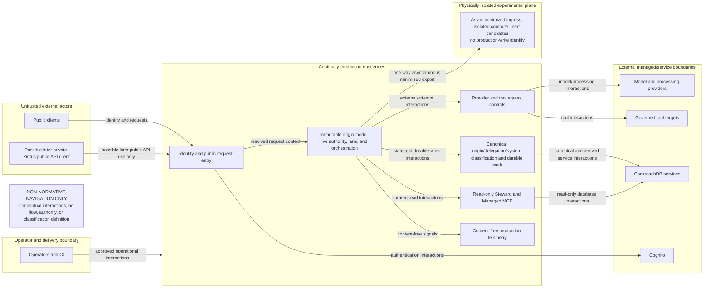
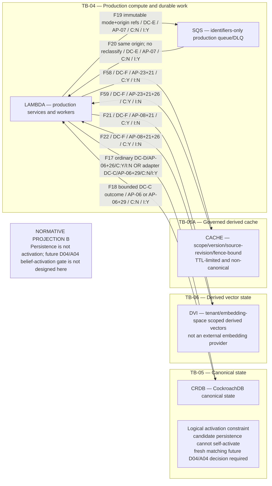
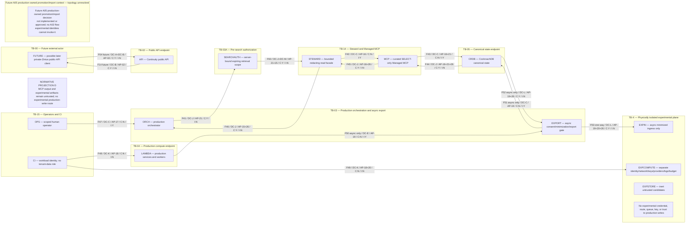

# Continuity v3 system context and trust boundaries

**Status:** A02 design evidence; Architecture v3 is not frozen.
**Risk:** critical.
**Scope:** the independent public Continuity system only.

This document locates system actors, trust zones, authorization points, and
cross-boundary data movement. It is a prospective architecture artifact, not
evidence that any component, control, account, network, deployment, or
integration exists.

## 1. Reading rules

- A solid arrow is a permitted conceptual crossing only when its named authorization point allows that exact crossing; it is not implementation evidence.
- Each crossing has one stable flow ID (`F01`-`F90`), data class, authorization point, and transfer shape. `C:Y` allows tenant/application content; `I:Y` allows only identifiers and bounded content-free control metadata; `C:N / I:N` covers credentials, keys, secrets, code, or configuration as specified in §5.
- Mermaid nodes and APs are logical responsibility/control locations, not requirements for a service, package, class, file, database, endpoint, IAM role, or network hop. Only explicitly labeled physical, external-service, or trust zones have topological separation meaning. A11/B01 decide colocation. Colocation never merges authorization decisions, credentials, or trust boundaries. This applies uniformly to `TENANT`, `LANE`, `ORCH`, `SEARCHAUTH`, `TXAUTH`, `TOOLAUTH`, `TELCOLLECT`, and adapters.
- Authentication (`TB-01`), server authorization (`TB-03`), and pre-search authorization (`TB-03A`) are distinct. Client tenant hints are non-authoritative; retrieval requires a server-bound expiring `AP-21` scope before expansion, with storage/index checks only defense in depth.
- The AP/DC definitions in §4 are normative for control and classification, the F register in §5 is normative for crossings, and the BT register in §7 is normative prospective abuse/test input. Diagrams and explanatory prose cannot redefine them.
- Diagram locations do not freeze A04 policy-state ordering or A03 lifecycle, correction, deletion, backup, and restore semantics.
- Provider/tool/MCP outputs, retrieved state, and experimental artifacts remain untrusted data and gain no instruction, policy, identity, execution, activation, or promotion authority.
- Bearer credentials remain `DC-A` beside `DC-B`; they are stripped downstream and never logged, fingerprinted, cached, embedded, or externally sent.
- Tool credential selection is executor-local and follows exact `AP-13`; untrusted data cannot select a credential/reference, and no client, provider, generic runtime, delegated-user, or unrelated-tool credential is forwarded or reused.
- Provider credential/workload-identity selection follows exact `AP-11` and is local to each adapter/destination/processing class. Untrusted data cannot select it; credentials are not shared or placed in content, telemetry, queues, receipts, configuration, or CI.
- Production telemetry is content-free, allowlisted, bounded, and non-canonical. CockroachDB owns receipts; telemetry never proves authorization, durable transition, or external effect.

## 2. Coordinated system-context and trust-boundary views

The five Mermaid blocks below are one coordinated A02 diagram deliverable.
The overview is navigation-only and explicitly non-normative. Views A-D are
normative projections of the crossing register in §5, not separate systems.
Repeated node IDs retain the same meaning across views. An omitted node or edge
in one projection is not absent from Continuity.

### 2.1 Boundary context overview — NON-NORMATIVE

This overview carries no normative flow IDs, authorization semantics, or
classification semantics. Use the detailed views, AP/DC registers, and F
register for every control or crossing decision.

### 2.2 Detailed view A — identity, request entry, lanes, policy, and retrieval

```mermaid
flowchart LR
    VA_NOTE["NORMATIVE PROJECTION A<br/>Logical nodes follow §1; crossings are defined by registered labels"]
    subgraph TB00["TB-00 — Untrusted public clients"]
        CLIENT["CLIENT — public clients"]
    end
    subgraph TB01["TB-01 — Authentication boundary"]
        COGNITO["COGNITO — Amazon Cognito"]
    end
    subgraph TB02["TB-02 — Public API ingress"]
        API["API — Continuity public API"]
    end
    subgraph TB03["TB-03 — Server authorization and orchestration"]
        TENANT["TENANT — immutable mode/origin and live-conjunct resolver"]
        LANE["LANE — lane selector and admission"]
        ORCH["ORCH — production orchestrator"]
    end
    subgraph TB03A["TB-03A — Pre-search authorization"]
        SEARCHAUTH["SEARCHAUTH — server-bound expiring retrieval scope"]
    end
    subgraph TB04["TB-04 — Production compute"]
        LAMBDA["LAMBDA — production services and workers"]
    end
    subgraph TB05["TB-05 — Canonical state"]
        CRDB["CRDB — canonical state and tenant_authority_binding"]
    end
    CLIENT -->|"F01 / DC-A / AP-01 / C:N / I:N"| COGNITO
    COGNITO -->|"F02 / DC-A / AP-01 / C:N / I:N"| CLIENT
    CLIENT -->|"F03 / DC-A+DC-B / AP-02 / C:Y / I:N"| API
    API -->|"F05 / DC-A / AP-03 / C:N / I:N"| COGNITO
    COGNITO -->|"F06 / DC-C / AP-03 / C:N / I:Y"| API
    API -->|"F07 / DC-B / AP-04 / C:Y / I:N"| TENANT
    TENANT -->|"F08 fixed authority key / DC-C / AP-06 / C:N / I:Y"| CRDB
    CRDB -->|"F09 live tenant authority / DC-C / AP-06 / C:N / I:Y"| TENANT
    TENANT -->|"F10 / DC-B / AP-04 / C:Y / I:N"| LANE
    LANE -->|"F11 / DC-B / AP-05 / C:Y / I:N"| ORCH
    ORCH -->|"F12 / DC-B / AP-02 / C:Y / I:N"| API
    API -->|"F13 / DC-B / AP-02 / C:Y / I:N"| CLIENT
    ORCH -->|"F15 / DC-D / AP-05 / C:Y / I:N"| LAMBDA
    LAMBDA -->|"F16 / DC-D / AP-05 / C:Y / I:N"| ORCH
    ORCH -->|"F54 / DC-B / AP-21 / C:Y / I:N"| SEARCHAUTH
    SEARCHAUTH -->|"F55 / DC-M / AP-21 / C:N / I:Y"| LAMBDA
    LAMBDA -->|"F56 / DC-B / AP-22+21 / C:Y / I:N"| CRDB
    CRDB -->|"F57 / DC-D / AP-22+21+26 / C:Y / I:N"| LAMBDA
```

### 2.3 Detailed view B — canonical/derived state, events, queues, cache, candidates, and activation boundary

### 2.4 Detailed view C — external processing, providers, tools, credentials, and telemetry

```mermaid
flowchart TB
    VC_NOTE["NORMATIVE PROJECTION C<br/>Provider and tool authorization remain separate; telemetry is allowlist-and-drop-only"]
    subgraph TB02["TB-02 — Public API endpoint"]
        API["API — Continuity public API"]
    end
    subgraph TB03["TB-03 — Orchestration endpoint"]
        ORCH["ORCH — production orchestrator"]
    end
    subgraph TB04["TB-04 — Production compute endpoint"]
        LAMBDA["LAMBDA — production services and workers"]
        GATEADAPTER["GATEADAPTER — Lambda-owned gate-control adapter<br/>fixed private endpoint; no target/provider/public egress"]
    end
    subgraph TB07["TB-07 — Key and secret custody"]
        KMS["KMS — cryptographic operations"]
        SECRETS["SECRETS — scoped runtime credentials"]
    end
    subgraph TB08["TB-08 — Provider-transmission authorization"]
        TXAUTH["TXAUTH — exact per-attempt transmission decision"]
    end
    subgraph TB09["TB-09 — Adapter boundary"]
        BEDADAPTER["BEDADAPTER — Bedrock generation adapter<br/>owns independent local PROVCRED facet"]
        SECONDADAPTER["SECONDADAPTER — second-provider generation adapter<br/>owns independent local PROVCRED facet"]
        EMBEDADAPTER["EMBEDADAPTER — embedding adapter<br/>owns independent local PROVCRED facet"]
        RERANKADAPTER["RERANKADAPTER — reranking adapter<br/>owns independent local PROVCRED facet"]
        MODADAPTER["MODADAPTER — moderation/classification adapter<br/>owns independent local PROVCRED facet"]
        PROVCRED["PROVCRED — notation for an adapter-local facet<br/>instantiated separately per adapter/destination/class<br/>never a shared broker, service, identity, or capability"]
    end
    subgraph TB10A["TB-10A — Amazon Bedrock service"]
        BEDROCK["BEDROCK — external generation"]
    end
    subgraph TB10B["TB-10B — Independent provider service"]
        SECONDPROVIDER["SECONDPROVIDER — external generation"]
    end
    subgraph TB10C["TB-10C — Other approved external-processing services"]
        EXTEMBED["EXTEMBED — approved embedding destination or deny"]
        EXTRERANK["EXTRERANK — approved reranking destination or deny"]
        EXTMOD["EXTMOD — approved moderation destination or deny"]
    end
    subgraph TB11["TB-11 — Tool authorization"]
        TOOLAUTH["TOOLAUTH — decision bound to live tenant authority"]
    end
    subgraph TB12["TB-12 — Tool executor"]
        TOOLEXEC["TOOLEXEC — no authority assertion; consume fresh dispatch only"]
    end
    subgraph TB13["TB-13 — Tool targets"]
        TOOLS["TOOLS — governed targets; results untrusted"]
    end
    subgraph TB14["TB-14 — Steward and Managed MCP"]
        STEWARD["STEWARD — bounded redacting read facade"]
    end
    subgraph TB15["TB-15 — Operators and CI"]
        OPS["OPS — scoped human operator"]
    end
    subgraph TB16["TB-16 — Production telemetry"]
        TELCOLLECT["TELCOLLECT — allowlist, reject/drop disallowed input"]
        TELSTORE["TELSTORE — content-free bounded telemetry"]
    end
    LAMBDA -->|"F23 / DC-G / AP-09 / C:N / I:N"| KMS
    KMS -->|"F24 / DC-G / AP-09 / C:N / I:N"| LAMBDA
    LAMBDA -->|"F25 / DC-C / AP-10 / C:N / I:Y"| SECRETS
    SECRETS -->|"F26 / DC-G / AP-10 / C:N / I:N"| LAMBDA
    ORCH -->|"F27 / DC-H / AP-11 / C:Y / I:N"| TXAUTH
    TXAUTH -->|"F28 / DC-H / AP-11 / C:Y / I:N"| BEDADAPTER
    BEDADAPTER -->|"F29 controlled auth / DC-H+DC-G / AP-12 / C:Y / I:N"| BEDROCK
    BEDROCK -->|"F30 / DC-H / AP-12+26 / C:Y / I:N"| BEDADAPTER
    BEDADAPTER -->|"F31 / DC-H / AP-12+26 / C:Y / I:N"| ORCH
    TXAUTH -->|"F32 / DC-H / AP-11 / C:Y / I:N"| SECONDADAPTER
    SECONDADAPTER -->|"F33 controlled auth / DC-H+DC-G / AP-12 / C:Y / I:N"| SECONDPROVIDER
    SECONDPROVIDER -->|"F34 / DC-H / AP-12+26 / C:Y / I:N"| SECONDADAPTER
    SECONDADAPTER -->|"F35 / DC-H / AP-12+26 / C:Y / I:N"| ORCH
    ORCH -->|"F36 immutable mode+origin provenance / DC-I / AP-13 / C:Y / I:N"| TOOLAUTH
    TOOLAUTH -->|"F37 provenance correlation; no mode switch / DC-I / AP-13+14 / C:Y / I:N"| TOOLEXEC
    TOOLAUTH -->|"F88 terminal non-allow / DC-C / AP-27 / C:N / I:Y"| ORCH
    TOOLEXEC -->|"F89 fixed operation; no current-authority facts / DC-C / AP-28+29 / C:N / I:Y"| GATEADAPTER
    GATEADAPTER -->|"F90 outcome only; no authority facts / DC-C / AP-28+29 / C:N / I:Y"| TOOLEXEC
    TOOLEXEC -->|"F38 fresh authority-fenced DISPATCH_CAS only / DC-I+DC-G / AP-10+13+14+28+29 / C:Y / I:N"| TOOLS
    TOOLS -->|"F39 / DC-I / AP-14+26 / C:Y / I:N"| TOOLEXEC
    TOOLEXEC -->|"F40 / DC-I / AP-14+26 / C:Y / I:N"| ORCH
    LAMBDA -->|"F61 embedding / DC-O / AP-11 / C:Y / I:N"| TXAUTH
    TXAUTH -->|"F62 embedding / DC-O / AP-11 / C:Y / I:N"| EMBEDADAPTER
    EMBEDADAPTER -->|"F63 embedding controlled auth / DC-O+DC-G / AP-12 / C:Y / I:N"| EXTEMBED
    EXTEMBED -->|"F64 embedding / DC-O / AP-12+26 / C:Y / I:N"| EMBEDADAPTER
    EMBEDADAPTER -->|"F65 embedding / DC-O / AP-12+26 / C:Y / I:N"| LAMBDA
    LAMBDA -->|"F66 rerank / DC-O / AP-11 / C:Y / I:N"| TXAUTH
    TXAUTH -->|"F67 rerank / DC-O / AP-11 / C:Y / I:N"| RERANKADAPTER
    RERANKADAPTER -->|"F68 rerank controlled auth / DC-O+DC-G / AP-12 / C:Y / I:N"| EXTRERANK
    EXTRERANK -->|"F69 rerank / DC-O / AP-12+26 / C:Y / I:N"| RERANKADAPTER
    RERANKADAPTER -->|"F70 rerank / DC-O / AP-12+26 / C:Y / I:N"| LAMBDA
    LAMBDA -->|"F71 moderation / DC-O / AP-11 / C:Y / I:N"| TXAUTH
    TXAUTH -->|"F72 moderation / DC-O / AP-11 / C:Y / I:N"| MODADAPTER
    MODADAPTER -->|"F73 moderation controlled auth / DC-O+DC-G / AP-12 / C:Y / I:N"| EXTMOD
    EXTMOD -->|"F74 moderation / DC-O / AP-12+26 / C:Y / I:N"| MODADAPTER
    MODADAPTER -->|"F75 moderation / DC-O / AP-12+26 / C:Y / I:N"| LAMBDA
    API -->|"F76 / DC-N / AP-24 / C:N / I:Y"| TELCOLLECT
    ORCH -->|"F77 / DC-N / AP-24 / C:N / I:Y"| TELCOLLECT
    LAMBDA -->|"F78 / DC-N / AP-24 / C:N / I:Y"| TELCOLLECT
    TXAUTH -->|"F79 / DC-N / AP-24 / C:N / I:Y"| TELCOLLECT
    TOOLEXEC -->|"F80 / DC-N / AP-24 / C:N / I:Y"| TELCOLLECT
    STEWARD -->|"F81 / DC-N / AP-24 / C:N / I:Y"| TELCOLLECT
    OPS -->|"F82 / DC-N / AP-25 / C:N / I:Y"| TELSTORE
    TELSTORE -->|"F83 / DC-N / AP-25 / C:N / I:Y"| OPS
    TOOLEXEC -->|"F84 qualifying DISPATCH_CAS permit / DC-C / AP-10+13+14+28+29 / C:N / I:Y"| SECRETS
    SECRETS -->|"F85 same qualifying permit / DC-G / AP-10+13+14+28+29 / C:N / I:N"| TOOLEXEC
    PROVCRED -->|"F86 per-adapter secret reference / DC-C / AP-10+12 / C:N / I:Y"| SECRETS
    SECRETS -->|"F87 adapter-only credential / DC-G / AP-10+12 / C:N / I:N"| PROVCRED
    BEDADAPTER -.-|"owns independent local facet; NOT A FLOW"| PROVCRED
    SECONDADAPTER -.-|"owns independent local facet; NOT A FLOW"| PROVCRED
    EMBEDADAPTER -.-|"owns independent local facet; NOT A FLOW"| PROVCRED
    RERANKADAPTER -.-|"owns independent local facet; NOT A FLOW"| PROVCRED
    MODADAPTER -.-|"owns independent local facet; NOT A FLOW"| PROVCRED
```

F86/F87 are parameterized registered crossings instantiated separately for each
secret-backed adapter. They are absent for an adapter using a non-retrievable
workload identity. The dotted links are internal ownership notation, not data
flows or crossings. Failover uses the alternate adapter's independently scoped
identity only after fresh AP-11 authorization.

### 2.5 Detailed view D — Managed MCP, experimental plane, promotion, operators/CI, and possible later private-Zintus public-API client

### 2.6 Flow-to-view index

The F register in §5 is normative. This index is complete and non-overlapping:

| Detailed view | Flow IDs | Count |
| --- | --- | ---: |
| A | F01-F03; F05-F13; F15-F16; F54-F57 | 18 |
| B | F17-F22; F58-F59 | 8 |
| C | F23-F40; F61-F90 | 48 |
| D | F04; F14; F41-F53; F60 | 16 |
| **Total** | **F01-F90 exactly once** | **90** |

## 3. Actor and zone inventory

| Boundary | Actors/components | Trust posture and owned responsibility |
| --- | --- | --- |
| `TB-00` | Public clients; possible later private-Zintus external client | Untrusted input. A later private-Zintus client is indistinguishable in authority from another public API consumer and requires separate future authorization. |
| `TB-01` | Amazon Cognito | Authenticates principal identity only. It does not select a tenant or authorize a Continuity operation. |
| `TB-02` | Public API | Validates transport and request envelope, enforces ingress limits, and passes only verified identity material to server authorization. |
| `TB-03` | Server tenant resolver; lane selector; production orchestrator; asynchronous export gate | Resolves exactly one immutable `authority_subject_mode` and its canonical origin provenance. For `principal_delegated`, initiating-principal authority and executing-workload delegation/capability are conjunctive; for `system_originated`, canonical system-origin classification/operation allowlist and executing-workload capability are conjunctive. It admits a lane only from that exact result and never reclassifies origin on durable execution. Request-time context is not inheritable execution authority. The orchestrator admits a content-free `F88` non-allow result only through `AP-27`; that result grants no execution authority and can only inform the existing canonical pre-gate settlement path. It cannot substitute for `TB-03A`. |
| `TB-03A` | Server pre-search scope decision | Before any application retrieval/search expansion, creates a server-bound, expiring decision for the exact tenant, principal/purpose, authorized views/resources/entities/time/sensitivity/limits, versions, deletion/revision fence, and trace/request. Missing, stale, or mismatched scope fails closed. |
| `TB-04` | Production Lambda, including the Lambda-owned gate-control adapter; SQS/DLQ | Runs production services and durable workers. The gate-control adapter is a fixed private, operation-tagged semantic endpoint with a distinct least-privilege workload and database role; it has no target/provider/public egress, arbitrary fetch, secret-store or credential-forwarding path, receipt/finalization, compensation, or content capability. Queue bodies are identifiers-only and never carry sensitive memory bodies. |
| `TB-05` | CockroachDB canonical state | Sole canonical owner for events, memory/beliefs, tasks, receipts, outbox/inbox, registries, deletion state, immutable authority subject-mode/origin/delegation/system-classification/workload provenance, the server-owned `tenant_authority_binding`, and the co-located tool-execution latch, gate, claim, lease/fence, terminal phase/evidence identity, and dedupe state. Canonical authority/delegation/system-origin/workload-capability owners—not `AP-29`—advance or revoke their versions in the same CockroachDB serializable order used by authority-creating gate operations. |
| `TB-06` | CockroachDB Distributed Vector Indexing | Derived, tenant- and embedding-space-scoped retrieval material. It is rebuildable/revocable and cannot confer canonical authority. |
| `TB-06A` | Governed production cache | Non-canonical, rebuildable, bounded derived state whose keys structurally bind the server tenant, purpose, retrieval-scope digest, relevant policy/retrieval/compiler/model/embedding versions, canonical source revision IDs, and deletion fence. |
| `TB-07` | AWS KMS; secret store | Custody and controlled release of cryptographic operations and scoped runtime credentials. A tool credential is released only to the executor after exact authorization and executor-owned scope selection. A provider secret, when one is needed, is released only to the distinct adapter credential handler after exact transmission authorization; workload-identity adapters may use no retrievable secret. No tenant/application plaintext is intended to enter the secret store. |
| `TB-08` | Provider-transmission authorization | Independently authorizes each exact provider attempt, including an alternate provider attempt. This authorization cannot authorize a tool. |
| `TB-09` | Bedrock and independent second-provider generation adapters; external embedding, reranking, and moderation/classification adapters; per-adapter credential/workload-identity handler | Provider-neutral, class-specific adapters with distinct workload identity per adapter/destination/class, separate credential custody, capability allowlists, egress rules, retention limitations, attempt correlation, and response validation. No shared credential or cross-provider/class reuse. A secret-backed adapter uses `F86`/`F87`; an AWS or other workload-identity adapter holds no retrievable static secret and still fails closed under `AP-12`. |
| `TB-10A`, `TB-10B` | Amazon Bedrock; independent second provider | External processors. Requests and outputs cross organizational/service trust boundaries and remain untrusted. |
| `TB-10C` | Approved external embedding, reranking, or moderation/classification destinations | Optional external processors reached only through the same exact per-attempt transmission policy and class-specific adapter constraints. No destination or capability is approved by this document, and DVI is not an external service. |
| `TB-11` | Tool-intent authorization | Independently decides an exact typed, credential-free tool attempt against one immutable subject mode. Its committed internal record binds complete origin/delegation or system-classification provenance, executing-workload identity/capability, and authorization source epoch. Principal-delegated authorization requires both current principal and workload conjuncts; system-originated authorization requires both canonical system-origin/allowlist and workload conjuncts. It emits exactly one registered `F37` or `F88` projection; projections correlate but never assert current authority or choose mode/origin. |
| `TB-12` | Tool executor | Authenticates `TB-11` and admits only an exact capsule-bearing `F37`. It cannot assert or switch mode/origin, erase an initiating principal, synthesize system origin, broaden delegation, substitute executing workload/capability, conflate claim owner with workload, or select a canonical key. `AP-14` is pre-gate only and proves no current authority. Only fresh R2 guarded `DISPATCH_CAS` success after all mode-specific conjuncts may feed §5.4. It retains runtime execution and target connection but no database, repair, reclassification, or `F40` overload authority. |
| `TB-13` | Governed tool targets | External or internal effect surfaces. Returned data and acknowledgements are untrusted until validated and reconciled. |
| `TB-14` | Steward; CockroachDB Managed MCP | Read-only stewardship. For the hackathon, Managed MCP uses a dedicated `SELECT`-only identity, curated tenant-qualified templates, bounded/redacted results, and no arbitrary SQL, DDL, mutation, unrestricted metadata enumeration, or write path. |
| `TB-15` | Human operators; CI/deployment automation | Privileged control and artifact delivery with separate identities. Neither is automatically entitled to tenant content or runtime credentials. |
| `TB-16` | Production telemetry admission collector and telemetry store | Accepts only schema-allowlisted, content-free, bounded low-entropy identifiers, metrics, control outcomes, and redacted error codes/digests. It rejects and drops unsafe input before storage and retains only a new independently generated content-free rejection count/code, never rejected bytes or their digest/fingerprint. It controls correlation/inference and is non-canonical. Operator reads require separate purpose-bound access and audit. |
| `TB-X` | Experimental ingress, compute, stores, candidate artifacts | Physically isolated identities, network, queues, keys, providers, logs, and budgets. It receives only asynchronously approved minimized exports and has no production-write route. |

## 4. Data classes and authorization points

### 4.1 Data classes

| ID | Class | Sensitivity and ownership |
| --- | --- | --- |
| `DC-A` | Authentication credentials, challenges, tokens, or validation material | Security-sensitive credential material; never tenant authorization or ordinary application content. When carried beside `DC-B`, strict no-log/redaction/stripping rules apply to the compound envelope. |
| `DC-B` | Client request, retrieval expression, or response content | Potentially sensitive tenant/application content plus bounded identifiers. It never includes a bearer credential after API ingress. |
| `DC-C` | Tenant, principal, purpose, policy, template, version, fence, trace, and terminal authorization-control identifiers | Content-free identifiers and bounded control metadata only. For `F88`, this class is limited to the exact non-allow projection allowlist defined by `AP-13`. For `F89`/`F90` and their canonical adapter state, it is limited to the exact `AP-28`/`AP-29` schemas and low-cardinality allowlisted errors. Canonical gate state may additionally retain only the internal fixed canonical resolver snapshot defined by `AP-29`: applicability/scope version, ordered affected-lineage identities, and the ordered unique subject/disposition/version set or explicit versioned `no_applicable_hold_subjects` sentinel. No hold subject, applicability relation, lineage set, disposition, version, sentinel, resolver snapshot, or baseline is carried by `F17`, `F18`, `F36`, `F37`, the capsule, `F89`, or `F90`. These forms exclude raw or typed intent, arguments or bodies, opaque argument references, deterministic or unkeyed digests, commitment values, risk, credentials or references, raw approval/error material, target results, evidence bodies, receipt/status content, and telemetry. |
| `DC-D` | Canonical command, state, or result | May contain sensitive canonical content; CockroachDB remains owner of durable truth. |
| `DC-E` | Durable-work envelope | ID-only correlation: opaque immutable mode plus origin/delegation reference/version; initiating-principal reference only for principal mode; allowed executing-workload identity/capability; tenant/purpose/operation; authorization source epoch; work/attempt/idempotency IDs; and lifecycle fence. The canonical work/origin record is authoritative. Queue, SQS, DLQ, retry, takeover, or recovery cannot choose/reclassify origin, drop a principal, or synthesize system origin. No memory, prompt, response, or tool body. |
| `DC-F` | Embeddings, vector queries, and retrieval results | Sensitive derived content with canonical source references; never independent authority. |
| `DC-G` | Key, wrapped-key, credential, or secret material | No tenant/application content, but highly security-sensitive and not identifiers-only. |
| `DC-H` | Provider generation request or output | Content-bearing external transmission; model output is untrusted. Provider request content never contains credential material or a credential reference/identity; controlled transport authentication is separately `DC-G`. |
| `DC-I` | Tool intent, exact arguments, effect request, result, or receipt-linked outcome | Content-bearing and effect-bearing; never authorized by provider policy or model output. Intent, arguments, and untrusted results may contain neither raw credentials nor credential references/identities. Tool-authorization binding uses an opaque, high-entropy, non-content-derived immutable reference to the exact encrypted argument object and version; deterministic or unkeyed argument digests are prohibited. |
| `DC-J` | Steward request or bounded Managed MCP result | A natural-language request or returned row can be content-bearing; the MCP query crossing itself is a curated template plus typed identifiers. |
| `DC-K` | Build artifact, code, or deployment configuration | No tenant/application content and not identifiers-only; must contain no secret. |
| `DC-L` | Consented, minimized, de-identified, versioned experimental export | Still treated as potentially sensitive content and untrusted experimental input. |
| `DC-M` | Server-issued retrieval-scope decision | Content-free, expiring, request/trace-bound identifiers and policy limits; binds tenant, principal/purpose, views/resources/entities/time/sensitivity, policy/config versions, deletion/revision fence, and scope digest. |
| `DC-N` | Production telemetry event or operator telemetry query/result | Schema-allowlisted content-free low-entropy identifiers, metrics, control outcomes, redacted error codes/digests, and bounded correlation metadata only. |
| `DC-O` | External embedding-generation, reranking, or moderation/classification request/output | Content-bearing external processing, explicitly tagged with processing class, source/version, destination, purpose, model-region, and attempt. Request content never contains credential material or a credential reference/identity; controlled transport authentication is separately `DC-G`. Outputs remain untrusted derived data. |

For C4, one server-owned canonical `tenant_authority_binding` is internal
`DC-C` control state. It is distinct from the A03 `LT-37` applicability
relation's subject “membership” and ordering. Its fixed-key, server-resolved
tuple begins with one immutable `authority_subject_mode`, exactly one of:

1. `principal_delegated`: an immutable origin binds the initiating principal
   identity; canonical membership ID/state/version; canonical role
   ID/state/version; stable server tenant; tenant-authorization epoch/fence;
   exact purpose-operation authority ID/state/version/expiry; authorization
   source epoch; immutable canonical delegation provenance
   ID/version/scope/expiry; and exact allowed executing workload identity plus
   capability. Current origin-principal authority **and** current executing
   workload identity/capability/delegation are conjunctive. A workload cannot
   substitute for, erase, refresh, or outlive a revoked or reassigned
   principal. Neither principal-only nor workload-only fallback exists.
2. `system_originated`: there is no initiating principal. An immutable
   canonically created system-origin record/classification binds a unique
   ID/version, creator authority/evidence, tenant, purpose, exact allowlisted
   operation, creation epoch, expiry when applicable, and exact allowed
   executing workload identity/capability. Absence of a principal never
   implies system origin. Missing, forged, caller-, queue-, retry-, provider-,
   model-, MCP-, tool-, or payload-selected classification denies. Only
   canonical trusted creation establishes this mode; it is limited to
   explicitly allowlisted system operations and cannot impersonate principal
   work.

Common immutable provenance is mode; origin record ID/version; tenant, purpose,
and operation; authorization source epoch; delegation or system-classification
binding; allowed executing workload identity/capability; and creation lineage.
Mode/origin cannot change on enqueue, retry, DLQ, recovery, claim, takeover,
dedupe, or dispatch. Switching modes, replacing the initiating principal,
broadening delegation, or changing workload identity/capability requires a new
canonical origin/authorization chain, never a retry or takeover. The immutable
origin subject, current executing workload, claim owner/instance, and A03
`LT-37` subject membership are four distinct concepts and are never
interchangeable.

The authorization source epoch has only that meaning; it is not a generic
request, policy, token, cache, or wall-clock epoch. The canonical identity,
membership, role, and purpose-operation authority owner—not `AP-29`—atomically
advances the affected membership/role versions and the tenant-authorization
epoch/fence on every membership add, removal, or revocation; role change or
revocation; tenant reassignment; and purpose-operation grant, change,
revocation, or expiry. Those writes and every authority-creating `AP-29`
mutation share one CockroachDB serializable order. Missing, ambiguous,
inactive, revoked, expired, mismatched, stale, noncanonical,
store-indeterminate, or unverifiable state denies. A token, projection, CDC
stream, cache, stale replica, client/model/tool/provider/MCP value, or elapsed
time can never substitute.

### 4.2 Authorization points

| ID | Authorization point |
| --- | --- |
| `AP-01` | Cognito sign-in policy validates the authenticating principal and issues bounded identity material. |
| `AP-02` | Public API transport, audience, request schema, size, rate, and response-release controls. A compound `DC-A+DC-B` ingress is handled at credential sensitivity: bearer material is redacted from errors and telemetry, stripped before downstream application handling, and never logged, cached, embedded, or externally transmitted. This is not tenant authorization. |
| `AP-03` | API verifies token issuer, audience, signature, expiry, and assurance with Cognito-configured trust. |
| `AP-04` | Resolves exactly one immutable subject mode. Principal-delegated admission canonically binds initiating principal and delegation; system-originated admission requires a pre-existing canonical system-origin record/classification for an allowlisted operation. Client/request/content fields or principal absence never choose mode. Missing, forged, ambiguous, stale, revoked, expired, mismatched, or unverifiable origin denies. |
| `AP-05` | Authorizes exact tenant/purpose/operation under the selected immutable mode. Principal mode requires current initiating-principal authority **and** current executing-workload capability/delegation; system mode requires current canonical system-origin classification/operation allowlist **and** current executing-workload capability. Missing either conjunct denies. It preserves opaque provenance for `AP-13`; lane/queue admission is never later authority. |
| `AP-06` | Tenant-qualified database repository/session roles and canonical schema constraints authorize ordinary canonical writes, the fixed-key identity/membership authorization lookup `F08`/`F09`, and—only for the distinct Lambda gate-control adapter role under `AP-29`—invocation of exactly six DB-enforced, operation-tagged, parameterized fixed/bounded transaction capabilities carried by `F17`: `REGISTER_ALLOW_GATE`, `ACQUIRE_CLAIM`, `TAKEOVER_CLAIM`, `ABORT_CAS`, `DISPATCH_CAS`, and `READ_OR_DEDUPE_EXACT`. The adapter has EXECUTE/invoke only on those exact callable surfaces and no base-table/view direct or general INSERT/UPDATE/DELETE, ad-hoc query, dynamic SQL, arbitrary SQL, caller-selected transaction/key/range, alternate repository/session role, owner/inherited privilege, stored-procedure escape, application/workload content read, unbounded enumeration, or executor database access. Each callable surface internally fixes its tenant-qualified exact keys, predicates, serializable transaction, permitted reads, and row/column mutation allowlist; it cannot accept a caller-supplied table, column, predicate, SQL fragment, canonical key, range, mutation set, or another operation tag. For `REGISTER_ALLOW_GATE` and `DISPATCH_CAS`, fixed reads include stored r1/effect lineage, the bounded canonical A03 applicability resolver, and its exact subject-watermark rows; only `REGISTER_ALLOW_GATE` may store the internal resolver snapshot in server-owned gate state, while `DISPATCH_CAS` may only compare it. All six capabilities and the adapter role are read-only for current tenant authority/membership/role/purpose-operation state; canonical origin/delegation/system-origin classification and allowlist; executing-workload identity/capability; A03 applicability relation/version and `LT-37` subject-watermark rows; and stored r1/effect lineage. They have no direct/general write, initialization, repair, backfill, or delete privilege in those domains. Subject-row identity is only stable server-resolved tenant plus opaque canonical hold-subject/scope identity; it is independent of authorization/capsule/attempt/action/intent/reservation/effect/idempotency/correlation/request/gate/claim/lease/fence/caller/wire identity and of purpose unless a future approved `HG-2` decision makes purpose part of subject scope. Stored r1/effect lineage and the authoritative applicability relation, never a caller-selected key, resolve the complete bounded canonical subject set. Co-location in one canonical row grants no access to an unlisted column; access outside the exact §4.3 capability footprint fails closed before mutation. Exact or opaque ID possession is never read authority. |
| `AP-07` | Queue publisher/consumer IAM and schema accept only an ID-only envelope bound to the immutable canonical work record: mode, origin/delegation version, principal reference when applicable, allowed workload/capability, tenant/purpose/operation, authorization source epoch, work/attempt/idempotency, and lifecycle fence. Consumer fixed-key resolves the canonical record; missing/mismatch/replay/foreign origin denies. Retry, SQS/DLQ redelivery, recovery, claim, or takeover preserves the exact origin/mode and cannot synthesize system origin or drop/replace a principal. |
| `AP-08` | DVI enforces tenant, source version, deletion state, and embedding-space identity for each vector upsert/query/return. Every query/return must also bind a live `AP-21` scope; DVI enforcement is defense in depth, not pre-search authorization. |
| `AP-09` | KMS key policy, encryption context, workload identity, and key state authorize each cryptographic operation. |
| `AP-10` | Secret-store policy authorizes a workload to fetch a named runtime secret version; operators and CI do not inherit that right. For tools, only the executor may request a secret, and only while consuming the one immediate non-replayable qualifying `DISPATCH_CAS` permit defined by `AP-14`, `AP-28`, `AP-29`, and §5.4; `AP-13` or `AP-14` admission alone is insufficient. Selection uses server-owned tenant/purpose/capability/destination scope rather than any credential reference supplied by intent. For providers, only the per-adapter handler may request a secret, and only after exact `AP-11`, using a server-owned provider/destination/processing-class/purpose/version selector; provider/model/user/request/output data cannot select the credential. Shared, static-in-config, CI/operator-exposed, cross-provider, wrong-class, wrong-destination, or wrong-version credentials are denied. |
| `AP-11` | Exact per-attempt provider-transmission policy/DLP authorizes source and revision, destination, purpose, processing class (`generation`, `embedding`, `rerank`, or `moderation/classification`), minimized data, model and region, retention capability, budget, and current deletion fence. Failover or a processing-class/destination change requires a new decision. If no destination/capability is approved for the class, transmission is prohibited. |
| `AP-12` | After exact `AP-11`, each class-specific adapter uses its own adapter/destination/processing-class workload identity and server-owned credential handler. If a secret is required, only `F86`/`F87` may resolve and release it under `AP-10`; if the platform uses a non-retrievable workload identity, no secret flow is required but identity, destination, class, version, and purpose must still match or fail closed. Provider/model/user/request/output data cannot select a credential identity/reference. No credential is shared or reused across providers/classes, stored in configuration/CI, or placed in provider content, model context, telemetry, queues, receipts, or logs. Destination/capability allowlist, request bounds, attempt correlation, and response validation constrain each external crossing. DVI is never the external processor, and the adapter cannot operate without its exact `AP-11` decision. |
| `AP-13` | Independent exact tool authorization owns one committed internal authorization record. The canonical orchestrator supplies through `F36` the existing r1 authorization-dispatch ID and authorization-dispatch version, bound to the exact latch ID/version and r1 phase. `AP-13` validates and atomically commits that pair in the complete record with tenant and purpose; governed action ID; intent ID and content-bearing typed intent; capability and destination; reservation and effect IDs; separate effect/operation-attempt ID and authorization-attempt ID; idempotency and correlation IDs; policy/configuration versions; current deletion/revision fence; risk; approval requirement and binding when applicable; and the opaque, high-entropy, non-content-derived immutable reference to the exact encrypted argument object/version. A gate ID/version does not exist at r1 and any invented or overridden future-gate value in `F36` or the `AP-13` record is invalid. Deterministic or unkeyed argument digests are prohibited, and raw credential material or credential references/identities from intent, arguments, model/provider/MCP/tool-return data, or other untrusted input are rejected. `F36` must carry both distinct attempt identities; neither may be omitted, conflated, derived from, or substituted for the other. For each authorization-attempt ID, `AP-13` atomically adds one immutable high-entropy authorization-decision ID, monotonic decision revision, source epoch, schema version, and terminal disposition to the record. For an allow decision, that same atomic commit generates and stores a high-entropy one-use registration nonce and absolute registration expiry and commits the complete registration capsule before emitting `F37`; `AP-13` emits no `F37` unless all of those fields are committed. The **`F37` allow projection** is content-bearing `DC-I` and contains only the exact allowed intent and scope, approval binding, effect reservation, the opaque encrypted-argument-object/version reference, and these record controls: tenant, purpose, governed action and intent IDs, latch ID/version, authorization-dispatch ID/version, capability/destination IDs, reservation/effect IDs, effect/operation-attempt ID, authorization-attempt ID, idempotency/correlation IDs, policy/configuration versions, deletion/revision fence, approval-requirement ID/version when applicable, authorization-decision ID, decision revision, source epoch, schema version, and `allow` disposition. Every `F37` is that allow/effect projection by construction and unconditionally nests the exact separately typed, content-free, authenticated registration capsule exhaustively defined in §4.3; every capsule field, including the authorization-dispatch ID/version, high-entropy one-use registration nonce, and absolute registration expiry, is a strict projection of that committed `AP-13` record. It contains no gate ID/version, credential material, or credential reference/identity. A capsule-less allow `F37` cannot exist; capsule omission is invalid/unresolved and grants no `F89`, credential, effect, or no-effect authority. The **`F88` non-allow projection** is content-free `DC-C` and contains only: authorization-decision ID; authorization-attempt ID; decision revision; source epoch; disposition and schema version; tenant and purpose; linked governed-action and intent IDs; latch ID/version; capability/destination IDs; reservation/effect IDs; the separate effect/operation-attempt ID; idempotency/correlation IDs; policy/configuration versions; deletion/revision fence; and approval-requirement ID/version when applicable. This exhaustive allowlist is unchanged. The `F88` projection contains no authorization-dispatch ID/version, high-entropy one-use registration nonce, absolute registration expiry, risk, raw intent, argument/body, deterministic argument digest, argument reference, commitment value, credential/reference, raw approval/error, target result, evidence body, receipt/status content, or telemetry. Each projection's authorization-decision ID and shared control identities bind it to the committed record, but the projections are distinct and neither represents the record itself. Allow emits only the complete capsule-bearing `F37` projection; a non-allow path emits only the unchanged `F88` projection with `denied`, `cancelled`, `expired`, `invalid`, or `policy_error_fail_closed` or remains unresolved; the two projections are mutually exclusive. Missing, timed-out, or ambiguous evidence remains unresolved. Replay of `F36` may only retrieve or idempotently deduplicate the projection for the already committed terminal decision. A non-allow decision can never become allow. A later decision requires a fresh governed action, a fresh latch, a newly created canonical r1 authorization-dispatch ID/version, a fresh effect/operation-attempt ID, and a fresh authorization-attempt ID through a new canonical r1/`F36`/`AP-13` cycle rather than any prior `F88`. Delayed approval or policy input after terminal commitment is stale and cannot create or reverse an allow. |
| `AP-14` | As pre-gate admission only, the executor authenticates `TB-11` and admits only the complete `F37` allow projection defined by `AP-13`, including its mandatory separately typed registration capsule, whose every carried field exactly matches the committed `AP-13` authorization-record fields. It exact-matches the carried latch ID/version, authorization-dispatch ID/version, high-entropy one-use registration nonce, absolute registration expiry, and all other capsule fields only to the corresponding committed `AP-13` record fields, and validates `TB-11` authentication, separate audience, exact schema, lineage binding, freshness of the high-entropy one-use registration nonce, and the absolute registration expiry. Missing values; an invented, overridden, or non-`AP-13`-projected authorization-dispatch ID/version; any committed-`AP-13`-record-field mismatch; an invented or overridden future gate ID/version; a stale registration capsule; an expired absolute registration expiry; derivation; conflation; out-of-order revision/epoch; replay; substitution; unknown source; ambiguity; or any conflicting `F88` fails closed before `F89`. The exact `AP-13`-projected latch ID/version and authorization-dispatch ID/version carried across `TB-12` are valid at this stage only when they match those committed record fields. `AP-14` has no `TB-05` read path and establishes no canonical-state fact; its admission never proves anything about state after the `AP-13` commit. The capsule remains nested in `F37`, is not a third terminal projection, and possession alone grants nothing. `AP-14` admission alone grants no `F89`, `F84`/`F85`, credential, `F38`, effect, retry, compensation, receipt/finalization, or no-effect authority. After the complete qualifying post-gate conjunction in §5.4, `AP-14` still prohibits forwarding or reusing client bearer tokens, provider credentials, generic runtime credentials, delegated-user credentials, unrelated tool credentials, and untrusted credential references. Network/SSRF policy, destination revalidation, secret-scope binding, effect reservation, acknowledgement validation, and reconciliation constrain the single crossing and deny target/destination/scope mismatch. |
| `AP-15` | Steward enforces the live `AP-21` retrieval scope, tenant/purpose authorization, query catalog, row/page/time/export bounds, redaction, minimum-result protection, and audit receipt. |
| `AP-16` | Dedicated Managed MCP `SELECT`-only database identity plus curated tenant-qualified query template enforces the live `AP-21` scope as defense in depth; arbitrary SQL and mutations are denied. |
| `AP-17` | Operator SSO/MFA, role, scope, approval, expiry, and audited control intent. Concrete operator authority is unresolved. |
| `AP-18` | CI workload identity, reviewed artifact provenance, environment protection, and deployment approval; no runtime tenant-data or secret role. |
| `AP-19` | Asynchronous export authorization verifies consent, purpose, minimization, lineage, expiry, deletion state/fence, and experimental destination. |
| `AP-20` | Experimental-plane ingress/deployment identity, network boundary, schema allowlist, and independent budget; no production credential or route. |
| `AP-21` | Distinct server pre-search authorization creates a signed/opaque, expiring, request- and trace-bound `DC-M` scope before any canonical, vector, cache, or MCP retrieval expansion. It binds server-resolved tenant, caller principal or server workload/job identity, purpose, allowed views/resources/entities/time/sensitivity/limits, policy and configuration versions, deletion/revision fence, and scope digest; a durable worker also binds its `AP-07` job identity. Missing, stale, mismatched, replayed, or broadened scope fails closed. ID possession is never authority. |
| `AP-22` | Canonical repository retrieval enforcement accepts every application/workload content read—including exact or opaque-ID dereference—only through `F56`/`F57`, structurally constrained by a live `AP-21` scope and tenant-qualified session. It enforces purpose, sensitivity, deletion/revision fence, and rejects query/dereference expansion, row release, or scope broadening on mismatch; this defense-in-depth check never creates authorization. Only the fixed-key identity/membership authorization lookup `F08`/`F09` is outside this application read path. |
| `AP-23` | Cache admission/read/write enforcement structurally binds keys to server tenant, purpose, retrieval-scope digest, applicable policy/retrieval/compiler/model/embedding versions, canonical source revision IDs, deletion fence, TTL, and bounds. Mismatch, staleness, missing source revisions, tombstone/invalidation, or cross-tenant fallback fails closed; cache policy never creates retrieval authorization. |
| `AP-24` | Telemetry admission uses a schema allowlist and cardinality/entropy bounds. It rejects and drops prompts, payloads, provider/tool arguments or outputs, tokens, secrets, keys, raw MCP rows, unsafe digests, and correlation/inference hazards before storage. It never retains, digests, fingerprints, or copies rejected material; it may retain only a new independently generated content-free allowlisted rejection count/code. Accepted telemetry binds source identity and tamper evidence. |
| `AP-25` | Telemetry operator access binds SSO/MFA, tenant-free or expressly approved scope, purpose, role, time, query/export bounds, retention/residency, and audit. It prevents bulk correlation and tenant inference and grants no canonical receipt or tenant-content access. |
| `AP-26` | Typed untrusted-data and activation guard preserves source, provenance, revision, belief/authority status, and processing class; separates data from instructions; and permits `F17` to persist untrusted event/candidate material only as explicitly non-authoritative. Any authority-elevating canonical belief/memory activation write additionally requires a present, fresh, matching independently verified activation decision/gate owned by future D04/A04; this document does not define its ordering or state machine. Direct write, replay, provider/tool/MCP output, or content itself cannot self-activate. Retrieved memory, vectors, MCP rows, provider/tool results, and experimental material cannot set policy, identity, tenant, tool authority, canonical-write authority, belief/memory activation authority, or promotion authority. |
| `AP-27` | The production orchestrator authenticates `TB-11` and admits only an `F88` non-allow projection, as defined by `AP-13`, whose every carried field exactly matches the current committed authorization record. This includes linked action/intent, effect/operation-attempt ID, and distinct authorization-attempt ID. Omitted, conflated, derived, substituted, stale, out-of-order, cross-tenant, mismatched, dual `F37`/`F88`, unknown-source, malformed, missing, timed-out, or ambiguous input fails closed as unresolved; an exact duplicate `F88` projection is idempotent. Admission grants zero allow, approval, `F37`, `F38`, credential, effect, write, retry, compensation, receipt-success, release, or finalization authority. A non-allow decision is terminal for that authorization attempt and cannot later become allow. A later decision requires a fresh governed action, a fresh latch, a newly created canonical r1 authorization-dispatch ID/version, a fresh effect/operation-attempt ID, and a fresh authorization-attempt ID through a new canonical r1/`F36`/`AP-13` cycle rather than any prior `F88`. |
| `AP-28` | Both `F89`/`F90` service endpoints authenticate each other with exact-direction workload identity and audience through mTLS or an equivalent service-authentication control. `AP-28` generates and validates a distinct transport nonce and transport expiry on every `F89` request and every corresponding `F90` response. The fixed private protocol enforces schema/version, one of the six exact `AP-29` operation variants, a high-entropy request ID, idempotency and correlation IDs, those transport fields distinct from the `AP-13` high-entropy one-use registration nonce and absolute registration expiry, authenticated `TB-12` caller/instance, tenant/purpose/latch/authorization-dispatch binding, gate binding only after server creation, size/rate/concurrency bounds, exact response correlation, and anti-replay. It rejects every caller-, `F36`-, `F37`-, capsule-, `F89`-, or `F90`-supplied hold subject, key, selector, applicability relation/version, affected-lineage set, subject membership/order, disposition/version, sentinel, resolver snapshot, or baseline as an extra field. Only an exact duplicate with the same request ID and identical body may deduplicate. Same ID with different body; cross-tenant, authorization-dispatch, gate, or operation reuse; stale, reordered, malformed, unknown-caller, unknown-response, or ambiguous input fails unresolved. Request-ID or capsule possession alone is never authority. |
| `AP-29` | Maps exactly six tagged variants to the six DB-enforced callable capabilities and their closed read/mutation footprints in §4.3; no seventh operation or caller-composed transaction exists. Stored canonical lineage alone resolves fixed exact keys. The four C4-R2 creators—registration, acquire, takeover, dispatch—each exact-match immutable mode/origin provenance and both required current conjuncts in its own serializable transaction. Principal mode requires initiating-principal authority **and** exact workload/capability/delegation; system mode requires canonical system-origin/allowlist **and** exact workload/capability. Registration stores the full provenance plus R10 hold baseline; later creators compare it. Takeover changes claim owner only under the same origin/workload binding. All four require C4-R2-advanced versions; pre-R2 including C4-R1 conflicts, and missing provenance is unresolved. Abort is revocation-safe; read/dedupe is zero-write diagnostic. The adapter has no direct/general table DML or arbitrary SQL: each capability owns only its enumerated conditional mutation, cannot select another operation or arbitrary row/column, and cannot inherit underlying-table INSERT/UPDATE/DELETE privilege. AP29 remains read-only with no create/initialize/repair/backfill/update/delete/fallback for authority, origin/delegation/system classification, workload capability, A03 applicability/version/watermarks, or stored r1/effect-lineage domains. R10 `LT-37`, no post-`F90` read, and no seventh operation remain unchanged. |

#### C4 tenant-authority refinements to AP-06, AP-13, AP-14, AP-28, and AP-29

These C4 rules are authoritative where the earlier R10 text describes only
hold/applicability behavior:

- `AP-06` extends only the distinct `AP-29` adapter role's parameterized
  fixed exact-key direct reads. Inside each named serializable authority-
  creating variant transaction it may read the current
  `tenant_authority_binding` resolved from stored canonical authorization/r1
  lineage. It cannot accept a caller key, read application content, perform an
  arbitrary query or range/enumeration, write/initialize/repair/backfill
  membership, role, tenant-authority, or purpose-operation state, or use a
  projection, CDC stream, cache, stale replica, derivative, digest, or fallback.
- `AP-13`, in the same canonical authorization-record commit, resolves and
  binds the exact immutable mode and provenance. For `principal_delegated`, it
  freshly reads/exact-matches both initiating-principal membership/role/tenant
  epoch/purpose-operation authority and executing-workload identity/capability/
  delegation. For `system_originated`, it freshly reads/exact-matches canonical
  system-origin classification/allowlisted operation and executing-workload
  identity/capability. It stores complete origin record/version, mode,
  delegation or system classification, workload binding, creation lineage, and
  authorization source epoch in r1 and preserves server-owned fixed lookup
  keys for later `AP-29` reads. The existing authorization-dispatch, capsule,
  attempt, effect, policy/configuration, approval, and deletion bindings remain
  unchanged. `F36`, `F37`, `F88`, and the capsule may carry only already
  allowlisted opaque record identities/source epoch for correlation; they
  never carry/assert current provenance, choose mode/origin, drop an initiating
  principal, synthesize system origin, or select the canonical lookup.
- `AP-14` remains a pre-gate exact comparison to the committed `AP-13` record.
  It neither reads nor proves live tenant authority. Token validity, the
  earlier `AP-13` allow, capsule admission, gate registration, a claim, a
  lease, or cancellation state alone is never sufficient for dispatch.
- `AP-28` advances the strict protocol/schema for all six variants and rejects
  any caller-, wire-, `F36`-, `F37`-, capsule-, `F89`-, or `F90`-supplied
  current membership/role/state, tenant-authorization epoch/fence,
  purpose-operation authority fact, or canonical lookup selector. Existing
  opaque record/source-epoch correlation does not become current authority.
  `F90` returns no membership, role, or authority fact.
- `AP-29` uses stored canonical authorization/r1 lineage, never wire input, to
  perform the fixed exact-key read. In the same CockroachDB serializable
  transaction that may create a gate, claim, takeover, or
  `dispatch_possible`, it direct-reads the current `tenant_authority_binding`
  and exact-matches the complete stored `AP-13` mode/origin/provenance binding
  and authorization source epoch. Principal mode requires current initiating-
  principal authority and current exact workload/capability/delegation; system
  mode requires current canonical system-origin/allowlist and current exact
  workload/capability. `ACQUIRE_CLAIM`, `TAKEOVER_CLAIM`, and `DISPATCH_CAS`
  also exact-match the immutable gate authority baseline stored by registration.
  Missing, ambiguous, inactive, revoked, expired, mismatched, stale,
  noncanonical, store-indeterminate, or unverifiable state denies before any
  mutation. `AP-29` has no membership, role, tenant-authority, or purpose-
  operation write, initialization, repair, backfill, range, enumeration, or
  arbitrary-query power.

The C4-R2-required operation version is advanced for exactly four authority-
creating variants: `REGISTER_ALLOW_GATE`, `ACQUIRE_CLAIM`,
`TAKEOVER_CLAIM`, and `DISPATCH_CAS`. Every pre-C4-R2 operation version,
including R8, R9, R10, and C4-R1, returns `conflict` with no downgrade or
fallback; current-version state missing complete mode/origin provenance is
`unresolved`. `ABORT_CAS` does not require active membership and remains
available to stop or reconcile under its existing exact tuple/phase rules.
`READ_OR_DEDUPE_EXACT` remains diagnostic and no-authority. Exactly six
variants exist; no seventh operation is introduced.

A03 `LT-37` is the sole semantic owner and sole physical writer of each
canonical `TB-05` subject-watermark row. Exactly one row exists per stable
server-resolved tenant plus opaque canonical hold-subject/scope identity. That
identity is independent of authorization, capsule, attempt, action, intent,
reservation, effect, idempotency, correlation, request, gate, claim, lease,
fence, caller, and wire identity. Purpose is also excluded unless a future
approved `HG-2` decision makes purpose part of canonical subject scope; A02
does not resolve `HG-2`. Cardinality one is valid only when the same canonical
resolver proves that exactly one subject applies, never as a separate fast
path or effect-partitioned key.

Stored r1/effect lineage first resolves the complete bounded ordered affected-
lineage identities. The authoritative A03 applicability relation then resolves
the union of every applicable stable subject identity, deduplicated and placed
in canonical order. The fixed resolver snapshot is the applicability/scope
version, the ordered affected-lineage identities, and either the ordered unique
`(subject identity, disposition, strictly monotonic version)` set or an explicit
versioned `no_applicable_hold_subjects` sentinel. Empty or missing results never
prove completeness. The resolver schema and cardinality bound remain future
`C03`/`HG-2` inputs; an absent approved resolver or bound, an unknown bound, or
overflow is `unresolved`.

Every initial explicit `no_hold`, hold creation, hold change, hold release, and
hold expiry uses one serializable `LT-37` transaction. It appends the authorized
versioned and receipted fact, writes the disposition to the stable subject row,
assigns a database-generated strictly monotonic subject version, preserves
every tombstone and a nondecreasing deletion/revision fence, and atomically
advances the applicability/scope version whenever membership or scope changes.
Release and expiry write a new explicit versioned `no_hold`; absence never
means no hold. Exact idempotent replay returns the prior committed result and
advances neither subject nor applicability version.

No writer other than A03 `LT-37` exists for subject watermarks or applicability
relation/version state: no projection, CDC consumer, cache, asynchronous
worker, effect-creation path, repair path, `AP-29`, migration backfill, or lazy
initializer may create or mutate it. Every `AP-29` callable capability is
read-only for those authoritative source domains; only
`REGISTER_ALLOW_GATE`, within its enumerated gate-state footprint, may store
the complete resolver snapshot in server-owned gate state, and
`DISPATCH_CAS` may only compare that stored snapshot.
Missing provenance, row, relation, version, sentinel, approved resolver/bound,
or completeness proof is `unresolved`; it is never initialized or repaired on
read.

### 4.3 Gate-control adapter contract

`AP-13` remains sole owner of the rich committed internal authorization record
and of the `F37` XOR `F88` terminal-projection choice. Every `F37`
unconditionally carries one exact separately typed,
`AP-13`-authenticated, separately audience-bound, content-free registration
capsule. Omission is invalid/unresolved and grants no `F89`, credential,
effect, or no-effect authority. This mandatory subrecord is nested in `F37`,
not a third terminal projection. It contains exactly: authorization-decision ID;
authorization-attempt ID; decision revision, source epoch, schema version, and
`allow`; tenant, purpose, governed action, intent, latch ID/version;
capability/destination; reservation/effect; effect/operation-attempt ID;
idempotency and correlation; policy/configuration/deletion-fence versions; applicable
approval-requirement ID/version; authorization-dispatch ID;
authorization-dispatch version; high-entropy one-use registration nonce;
absolute registration expiry; and the opaque internal authority-binding
identity/version plus authorization source epoch already committed by
`AP-13`. Every field is a strict projection of the
committed `AP-13` record. It contains no gate ID/version, typed or raw intent,
arguments or body, opaque argument reference, risk, raw approval/error,
credential/reference, result/evidence, receipt/status, or telemetry. `AP-14`
validates the complete `F37` and mandatory capsule only as pre-gate admission
before `F89`; it compares the carried latch ID/version,
authorization-dispatch ID/version, and every other projection/capsule field
only to the corresponding committed `AP-13` record fields. It rejects a
missing, invented, overridden, or non-`AP-13`-projected
authorization-dispatch ID/version; any committed-`AP-13`-record-field mismatch;
either high-entropy one-use registration nonce or absolute registration expiry
absent from the committed record; an invented future gate; stale or expired
registration; schema mismatch; or lineage mismatch. `AP-14` has no `TB-05`
read path and establishes no canonical-state fact; admission never proves that
the r1 registration conditions or current membership, role, tenant-
authorization epoch/fence, or purpose-operation authority still hold. That
admission grants no credential
or `F38`. After authenticated `F89`, `AP-29` alone, through `F17`/`F18`,
re-reads live `TB-05` state and rejects any current r1
latch/authorization-dispatch/phase or other registration-condition mismatch
before mutation. Possession of the high-entropy one-use registration nonce
alone, a stolen capsule, wrong workload, replay, or stale latch grants nothing.
An exact duplicate complete `F37`/capsule may only deduplicate the same
pre-gate admission; it never recreates registration, claim, credential,
dispatch, effect, or no-effect authority.

Every `F89` request uses one strict tagged schema with this common spine:
protocol/schema version; operation enum; high-entropy
request/idempotency/correlation IDs; authenticated `TB-12` caller/instance and
audience; tenant/purpose; governed action/intent; latch ID and expected
phase/revision; authorization-dispatch ID/version; gate ID/version for
post-registration variants only and absent from `REGISTER_ALLOW_GATE`;
opaque internal authority-binding ID/version and authorization source epoch
plus opaque immutable mode/origin/delegation or system-classification/workload
provenance references from the stored `AP-13` record, for correlation only and
never as current authority or a lookup selector;
reservation/effect; separate effect/operation-attempt ID and
authorization-attempt ID; policy, configuration, and deletion-fence versions;
an `AP-28`-generated transport nonce and `AP-28`-generated transport expiry;
and the exact claim ID/owner/fence/lease tuple whenever the operation has a
claimant. No request may contain a hold subject, key, selector, applicability
relation or version, affected-lineage set, subject membership/order,
disposition, subject version, sentinel, resolver snapshot, baseline, or
asserted hold fact; every such field is rejected rather than ignored. No
request may contain asserted current membership or role identity/state/
version, tenant-authorization epoch/fence, purpose-operation authority
identity/state/version/expiry, caller-selected mode/origin/system
classification/delegation/workload capability, or a canonical authority lookup
key; every such
field is rejected rather than ignored. Stored canonical authorization/r1
lineage alone resolves the exact lookup.

The gate-control database surface is a closed capability model. The adapter
role receives only EXECUTE/invoke privilege on six distinct DB-enforced
callable transaction surfaces, one for each operation named below. It receives
no direct or general DML on any base table or view and no ad-hoc query,
arbitrary SQL, dynamic SQL, alternate repository/session role,
owner/security-definer or inherited privilege, procedure/view escape, or
caller-composed transaction. Each callable implementation fixes internally
the operation tag, tenant-qualified canonical key derivation, exact predicates,
serializable isolation, bounded reads, and row/column mutation allowlist. None
accepts a caller-supplied table, column, predicate, SQL fragment, canonical
key, range, enumeration, mutation set, or alternate operation tag. A caller
cannot compose multiple capabilities into a broader transaction, invoke one
under another operation identity, or substitute a cross-gate,
cross-tenant, or cross-operation key. Any attempted access outside the exact
surface fails closed before mutation.

Every capability may read only the fixed exact-key or bounded authoritative
inputs required by its existing semantics. Current tenant authority,
membership, role, and purpose-operation state; canonical origin, delegation,
system-origin classification and operation allowlist; executing-workload
identity and capability; the A03 applicability relation/version and `LT-37`
subject-watermark rows; stored r1/effect lineage; and any provenance/baseline
field not expressly mutable below are read-only to all six capabilities and
the adapter role. No capability may create, initialize, repair, backfill,
update, or delete any row or column in those domains. Physical co-location in a
canonical gate row never widens the semantic column allowlist.

The closed mutation footprint is normative:

| Callable capability | Only permitted conditional mutation |
| --- | --- |
| `REGISTER_ALLOW_GATE` | Atomically consume only the exact registration nonce; advance only the exact r1 latch/authorization-dispatch phase to r2; create the single server-owned open gate row/version; store in that gate only the complete immutable authority/provenance baseline and complete fixed A03 resolver snapshot; and create or update only the exact same-request dedupe result required by the existing semantics. Source authority, origin, workload, lineage, applicability, and watermark state remain read-only. |
| `ACQUIRE_CLAIM` | Mutate only the named gate's claim/owner, monotonic fence, server-bounded lease and lease version, gate version/revision, and exact request-dedupe result required by the existing atomic claim transition. No other gate, provenance, baseline, or unlisted field is mutable. |
| `TAKEOVER_CLAIM` | Mutate only the named gate's claim/owner/instance, monotonic higher fence, server-bounded lease and lease version, gate version/revision, and exact request-dedupe result required by the existing atomic takeover. Immutable mode/origin/workload/capability/baseline and every other row or column remain unchanged. |
| `ABORT_CAS` | Mutate only the named gate's abort/terminal phase and version/revision, tombstone, one adapter-generated immutable content-free evidence/delivery ID, and exact request-dedupe result required by the existing stop/reconciliation semantics. |
| `DISPATCH_CAS` | May read the fixed stored effect lineage required by the authoritative checks, but may write only the exact named gate phase/version to `dispatch_possible`, its tombstone, one adapter-generated immutable content-free evidence/delivery ID, and the exact request-dedupe tuple/record. Effect lineage, authority, resolver, claim, lease, baseline, and every other row or column remain read-only. |
| `READ_OR_DEDUPE_EXACT` | Zero write: no insert, update, delete, repair, refresh, evidence or ID creation, dedupe creation, or authority recovery. It returns only the exact prior projection or not-found. |

The six mutually exclusive and exhaustive variants reject every extra,
missing, or cross-variant field:

1. `REGISTER_ALLOW_GATE` additionally carries the exact mandatory capsule from
   the exact `AP-14`-admitted complete `F37` and its pre-existing committed
   authorization-dispatch ID/version. A gate ID/version is forbidden in the
   request. The existing protocol/schema field must equal the C4-R2-advanced
   required `AP-29` operation version; every older `REGISTER_ALLOW_GATE`
   version, including R8, R9, R10, and C4-R1, deterministically returns content-free
   `conflict` with no fallback. Wire fields are otherwise unchanged. After
   `F89`, `AP-29` alone issues one serializable `TB-05`
   transaction through `F17`/`F18`. It re-reads and atomically checks the live
   current r1 latch in `auth_dispatch_registered`, the exact
   authorization-dispatch pair and phase, committed `AP-13` decision/capsule
   lineage, high-entropy one-use registration nonce consumption state,
   unexpired absolute registration expiry, current
   policy/configuration/approval/cancellation/deletion state, replay and
   supersession state, and gate absence. From stored canonical
   authorization/r1 lineage, that transaction fixed-key direct-reads the
   current `tenant_authority_binding` and exact-matches every field plus the
   authorization source epoch to the stored `AP-13` binding. In
   `principal_delegated` mode it must exact-match current initiating-principal
   membership/role/tenant epoch/purpose authority **and** current executing-
   workload identity/capability/delegation. In `system_originated` mode it must
   exact-match the canonical system-origin record/classification and allowlisted
   operation **and** current workload identity/capability. Revoke, change,
   expiry, reassignment, mismatch, or indeterminacy before registration
   prevents gate creation and nonce consumption. Full success stores an
   immutable exact mode/origin/delegation or system-classification, executing-
   workload, and tenant-authority baseline reference/tuple with the gate; it
   never crosses `F90`. The same transaction rereads the
   stored r1/effect lineage and resolves its complete bounded canonical ordered
   affected-lineage identities. Through the fixed A03 applicability resolver,
   it then directly reads the authoritative applicability/scope version and
   relation, resolves the deduplicated canonically ordered union of all
   applicable stable subject identities, and directly reads every exact
   `LT-37` subject-watermark row from canonical CockroachDB. Subject identity is
   only stable server-resolved tenant plus opaque canonical hold-subject/scope
   identity; it is independent of authorization/capsule/attempt/action/intent/
   reservation/effect/idempotency/correlation/request/gate/claim/lease/fence/
   caller/wire identity and of purpose unless future approved `HG-2` makes
   purpose part of subject scope. Cardinality one uses this same resolver and
   is accepted only when proven; it is not a separate fast path.
   The transaction validates the approved future `C03`/`HG-2` resolver schema
   and bound, completeness, canonical order, uniqueness, relation membership,
   applicability version, receipt/fact lineage, disposition, database-generated
   strictly monotonic subject version, tombstone, and nondecreasing
   deletion/revision fence. It atomically stores with the gate the fixed
   canonical resolver snapshot: applicability/scope version; ordered affected
   lineages; and either ordered unique `(subject identity, disposition,
   version)` entries or the explicit versioned
   `no_applicable_hold_subjects` sentinel. Empty or missing results never prove
   completeness. An absent or unknown approved resolver/bound, overflow,
   missing/ambiguous/incomplete/noncanonical/duplicate relation or row state,
   store indeterminacy, incoherence, or unverifiable fact is `unresolved`,
   performs no mutation, and never initializes, repairs, or falls back to a
   projection, CDC stream, cache, stale replica, derivative, or digest lookup.
   These reads, every competing `LT-37` subject/applicability write, and stored
   effect-lineage creation participate in the same CockroachDB serializable
   order. Only full success in this transaction consumes
   the high-entropy one-use registration nonce, advances r1 to r2, and creates
   one server-owned open gate ID/version. An existing gate is
   corruption/conflict except when the exact same R10 request ID and identical
   body resolve through the canonical dedupe record to the identical already
   stored gate ID/version; dedupe performs no new mutation and creates no new
   authority. Neither `F17`, `F18`, nor `F90` carries or returns any resolver or
   hold metadata.
2. `ACQUIRE_CLAIM` supplies an exact proposed high-entropy claim ID and owner,
   expected open unclaimed/eligible gate version and fence predecessor, and a
   requested lease ceiling. Its protocol/schema field must equal the
   C4-R2-advanced required operation version; R8, R9, R10, C4-R1, and every
   pre-C4-R2 version conflict without fallback. In the same serializable
   transaction that could create the claim, stored canonical keys direct-read
   the current `tenant_authority_binding` and exact-match it to both the stored
   `AP-13` binding/source epoch and immutable gate authority baseline, including
   the exact mode/origin. `principal_delegated` revalidates both principal and workload
   conjuncts; `system_originated` revalidates both canonical origin/allowlist and
   workload conjuncts. Only
   exact current success atomically assigns that one claim, raises the
   monotonic fence epoch, and fixes a server-bounded lease. It gains no
   approval or `LT-37` resolver check beyond accepted semantics.
3. `TAKEOVER_CLAIM` supplies the exact open gate,
   prior claim/owner/fence/version/lease, proposed new claim ID and owner, and
   requested lease ceiling. Its protocol/schema field must equal the
   C4-R2-advanced required operation version; R8, R9, R10, C4-R1, and every
   pre-C4-R2 version conflict without fallback. The same serializable mutation
   transaction directly reads and exact-matches the current
   `tenant_authority_binding`, stored `AP-13` binding/source epoch, and gate
   authority baseline. It revalidates `principal_delegated` or
   `system_originated` conjuncts, as bound, with
   no origin/executor substitution or system-origin inference, and requires
   authoritative canonical expiry plus the
   higher-fence rules before it atomically raises the fence and assigns the new
   server-bounded lease. Takeover may change only claim owner/instance under
   the same exact origin and allowed executing-workload identity/capability; a
   different workload/capability requires a fresh authorization chain.
   Elapsed time alone is insufficient; the old owner is
   permanently stale. It gains no approval or `LT-37` resolver check beyond
   accepted semantics. No renewal or release operation exists.
4. `ABORT_CAS` supplies the exact current claim/owner/fence/lease and open phase
   plus one allowlisted cause. One transaction commits the abort phase,
   tombstone, and adapter-generated immutable content-free evidence/delivery
   ID. Revoked or inactive membership never prevents this stop/reconciliation
   path; it does not recreate authority.
5. `DISPATCH_CAS` supplies the exact current claim/owner/fence/lease and open
   phase and exact-matches the mandatory capsule/common-spine lineage, gate and
   version, effect/operation-attempt ID, authorization-attempt ID,
   request/idempotency/correlation IDs,
   transport nonce and transport expiry,
   tenant/purpose/capability/destination/effect, and current phase/revision. The
   existing protocol/schema field must equal the C4-R2-advanced required `AP-29`
   operation version; every older `DISPATCH_CAS` version, including R8, R9,
   R10, C4-R1, and every other pre-C4-R2 version deterministically returns content-free
   `conflict` with no fallback. Wire
   fields are otherwise unchanged and contain no resolver or hold metadata.
   Neither asserted current facts in
   `F89` nor any facts returned in `F90` are authoritative: stored registered
   bindings drive every fixed exact-key lookup. One exact-key serializable `F17` transaction freshly
   re-reads and exact-matches, immediately before mutation, the authoritative
   current approval-required fact or explicit no-approval-required fact; when
   required, the exact approval binding and its current validity; cancellation
   and supersession state; policy and configuration versions against the
   registered binding; deletion/tombstone/revision fence;
   authorization-dispatch and capsule/common-spine lineage; gate ID/version and
   open phase/revision; current claim ID/owner/fence epoch/lease version and
   unexpired lease; and tenant/purpose/governed action/intent,
   capability/destination, reservation/effect, effect/operation-attempt ID,
   authorization-attempt ID, and idempotency/correlation bindings. From stored
   canonical authorization/r1 keys, that same transaction fixed-key
   direct-reads current membership and role states/versions, stable tenant,
   tenant-authorization epoch/fence, exact purpose-operation authority
   state/version/expiry, and authorization source epoch. It exact-matches the
   complete current `tenant_authority_binding` to both the stored `AP-13`
   binding/source epoch and immutable registered gate baseline before any
   mutation. `principal_delegated` freshly exact-matches both current initiating-
   principal authority and exact executing-workload capability/delegation;
   `system_originated` freshly exact-matches both canonical system origin/allowlist and
   exact workload capability. No fallback or substitution exists. No request,
   token, cache, projection, claim, lease, or elapsed
   time can supply or replace this read. From stored r1/effect lineage, the
   same transaction re-resolves the complete bounded
   canonical ordered affected-lineage identities, invokes the same fixed A03
   applicability resolver, directly rereads its applicability/scope version
   and relation, resolves the deduplicated canonically ordered union of every
   applicable stable subject identity, and directly rereads each authoritative
   `LT-37` subject-watermark row. It validates the approved future
   `C03`/`HG-2` schema and bound, completeness, canonical order, uniqueness,
   relation membership, receipt/fact lineage, tombstone, nondecreasing
   deletion/revision fence, disposition, and database-generated strictly
   monotonic subject version. It exact-matches the applicability/scope version,
   ordered affected lineages, subject membership and order, and every
   disposition/version against the complete stored gate snapshot; or
   exact-matches the explicit versioned `no_applicable_hold_subjects` sentinel.
   Cardinality one remains the same resolver path. These reads, every competing
   `LT-37` subject/applicability write, and stored effect-lineage creation share
   one CockroachDB serializable order. Any coherent applicability, lineage,
   membership, order, disposition, or version change returns only content-free
   `conflict`. A missing, ambiguous, incomplete, duplicate, noncanonical,
   over-bound, unknown-bound, store-indeterminate, incoherent, or otherwise
   unverifiable resolver result; absent approved resolver/schema; missing or
   corrupt baseline; empty result asserted as completeness; singular or
   effect-partitioned pre-R10 gate; or attempted initialization, repair, or
   fallback returns only `unresolved`. No projection/CDC/cache/stale-replica/
   derivative/digest alternative exists. An old operation version conflicts;
   a current-version read of pre-R10 gate state is unresolved. Only when every comparison
   succeeds does that same transaction—the sole canonical and
   physical A02 realization and linearization of A03 `LT-49`/`LT-53` for
   dispatch—atomically write
   `dispatch_possible`, the tombstone, one adapter-generated immutable
   content-free evidence/delivery ID, and the request-dedupe record. A
   deterministic mismatch returns only content-free `conflict`; a missing,
   ambiguous, store-indeterminate, or otherwise unverifiable fact returns only
   `unresolved`. Neither result creates a phase, tombstone, evidence,
   obligation, successful dedupe record, dispatch permit, effect, or authority
   for `F84`/`F85`, `F38`, no-effect, retry, or finalization. This is not `F38` delivery or target
   acknowledgement. An invalidation that serializes first produces no applied
   success, mutation, or permit. If this transaction serializes first, its
   `dispatch_possible`/possible-effect state is permanent: later invalidation,
   subject-watermark transition, applicability/scope membership change, or
   effect-lineage creation cannot abort it, prove no-effect, authorize retry,
   or restore or reissue a permit. No second canonical validation or read exists after a fresh
   `applied` `F90`; that response reports the already committed ordering and
   enables at most one bounded ephemeral `F84` → `F85` → `F38` sequence.
6. `READ_OR_DEDUPE_EXACT` supplies only an exact prior request ID plus its full
   tuple/key. It returns not-found or the already committed named projection,
   creates no authority, evidence, or ID, and cannot enumerate, range-read, or
   browse current tenant state. It never exposes, reconstructs, repairs, or
   updates a hold watermark, applicability relation/version, resolver snapshot,
   gate baseline, or tenant-authority binding and cannot grandfather singular/
   effect-partitioned pre-R10 or authority-baseline-free pre-C4 gate state.
   It is diagnostic only and cannot turn revoked, stale, or denied authority
   into gate, claim, takeover, dispatch, retry, permit, effect, no-effect, or
   finalization authority.

This C4-R2 correction changes subject provenance and advances the
required operation version for exactly `REGISTER_ALLOW_GATE`,
`ACQUIRE_CLAIM`, `TAKEOVER_CLAIM`, and `DISPATCH_CAS`.
`ACQUIRE_CLAIM` and `TAKEOVER_CLAIM` gain the live tenant-authority read but no
approval-state or hold-resolver check. `ABORT_CAS` remains available under its existing tuple/phase conditions
despite approval expiry, revocation, approval-requirement change, or a later
hold or applicability change. `READ_OR_DEDUPE_EXACT` remains diagnostic and
can never recreate or confer a permit or expose or repair the resolver
snapshot or tenant authority. The required operation version is C4-R2-advanced
for those four authority-creating variants; every pre-C4-R2 version, including
R8, R9, R10, and C4-R1, conflicts without fallback.
Singular/effect-partitioned pre-R10 gate state is unresolved under the current
version, as is any pre-C4 gate/claim state missing the complete immutable
tenant-authority baseline. `ABORT_CAS` and `READ_OR_DEDUPE_EXACT` retain their
existing non-authority semantics.

The exact C4 variant matrix is normative:

| Variant | Required operation version | Current `tenant_authority_binding` read | Result authority |
| --- | --- | --- | --- |
| `REGISTER_ALLOW_GATE` | C4-R2-advanced; every pre-C4-R2 version conflicts | Same transaction exact-matches stored mode/origin and both mode-specific conjuncts; stores complete immutable provenance baseline | Exact success may create the gate and consume the nonce |
| `ACQUIRE_CLAIM` | C4-R2-advanced; every pre-C4-R2 version conflicts | Same transaction exact-matches stored mode/origin, both mode-specific conjuncts, and gate baseline | Exact success may create one claim/lease/fence |
| `TAKEOVER_CLAIM` | C4-R2-advanced; every pre-C4-R2 version conflicts | Same transaction exact-matches mode/origin/conjuncts/baseline; only claim owner may change under same workload/capability | Exact success plus canonical expiry/higher fence may create the takeover |
| `ABORT_CAS` | Existing exact tuple/phase version | No active-authority prerequisite; revocation-safe stop/reconciliation | May stop only; never recreates authority |
| `DISPATCH_CAS` | C4-R2-advanced; every pre-C4-R2 version conflicts | Same sole transaction exact-matches mode/origin, both mode-specific conjuncts, and gate baseline with every existing dispatch fence | Exact success alone commits `dispatch_possible` |
| `READ_OR_DEDUPE_EXACT` | Existing diagnostic version | No authority-producing read | Diagnostic only; no repair, refresh, permit, or authority recovery |

#### C4 tenant-authority serialization and recovery matrix

For each of `REGISTER_ALLOW_GATE`, `ACQUIRE_CLAIM`, `TAKEOVER_CLAIM`, and
`DISPATCH_CAS`, tests and evidence cover before, after, and truly concurrent
serialization with membership add/removal/revocation/reassignment, role
change/revocation, tenant-authorization epoch advance, purpose-operation
grant/change/revocation/expiry, retry, queue delay, DLQ replay, and recovery:

- If the authority mutation serializes first, the authority-creating operation
  denies as `conflict` for a coherent stale/revoked/version mismatch or
  `unresolved` for missing, ambiguous, noncanonical, store-indeterminate, or
  unverifiable state. It creates no gate, claim, takeover, dispatch, permit,
  effect, retry, known-no-effect, evidence/finalization, or other authority;
  the effect-spy call count is exactly zero.
- If registration serializes first, its gate may remain historical/open, but a
  later acquire, takeover, or dispatch must repeat the live exact read and deny
  after the authority change.
- If acquire or takeover serializes first, its canonical claim/lease may
  remain, but a later takeover or dispatch must repeat the live exact read and
  deny. No stale claimant can create an effect.
- In principal mode, principal revoke/removal, role change, tenant reassignment,
  or purpose revocation before any guarded operation denies even when the
  workload remains valid. Workload revocation, capability/delegation change,
  or wrong workload denies even when the principal remains valid. Loss of
  either conjunct yields exactly zero effect-spy calls.
- Principal-origin work replayed as system, missing/forged system origin,
  system operation outside its allowlist, principal-to-workload or workload-to-
  principal substitution, claim-owner/executing-workload confusion, and
  origin/delegation version substitution all deny. Retry, queue delay, DLQ,
  recovery, dedupe, and takeover preserve the exact origin/mode and cannot
  reclassify it.
- If `DISPATCH_CAS` serializes first, canonical
  `dispatch_possible`/possible-effect, tombstone, evidence ID, and dedupe are
  permanent. Later membership/role/tenant reassignment, authority epoch, or
  purpose-operation change cannot rewrite or abort it, prove no effect,
  authorize retry, reissue/recover a permit, or create another effect. The
  exact fresh `F90` still permits at most the accepted one immediate
  consume-or-burn sequence; response loss or failure burns the permit while
  possible-effect remains. Evidence shows exactly possible-effect and no
  retry/reissue/known-no-effect.
- True concurrency is decided only by that canonical CockroachDB serializable
  order. Wall clock, token validity, cache state, projection lag, elapsed time,
  queue order, DLQ delivery, or local state never decides it. Current-state
  read failure denies before mutation, and diagnostic read/dedupe never turns
  denial into authority.

The existing ownership split remains exact: registration alone consumes its
nonce and proves gate absence; claim/lease is created only by acquire or
takeover; dispatch checks the current claim/lease but never repeats the
registration nonce or gate-absence check; `F39`/`F40` and A03 `LT-104` remain
the separate result/evidence-admission path. `ABORT_CAS` remains available
after revocation, and delayed retry, queue, DLQ, or recovery cannot bypass a
fresh applicable live authority read.

The canonical authority locator, complete current tuple, state/version
snapshot, and immutable gate baseline never enter caller input, `F36`, `F37`,
the capsule, `F17`, `F18`, `F89`, `F90`, `F40`, logs, telemetry, receipts,
status, evidence bodies, errors, caches, projections, CDC, digests, or
fingerprints. Already allowlisted opaque internal record identity/version and
authorization source epoch are correlation only and disclose no live current
fact. Extra authority fields are rejected before use and are neither ignored,
echoed, logged, persisted, nor returned.

No seventh or general operation exists. Adapter rows, request-deduplication
state, low-cardinality allowlisted errors, and terminal evidence are all
content-free. They exclude raw/typed intent, arguments/body, opaque argument
reference, deterministic or unkeyed digest, commitment, risk,
credential/reference, raw approval/error, target result, evidence body,
receipt/status content, and telemetry.

## 5. Trust-boundary crossing register

Every Mermaid crossing is expanded below. “Identifiers-only” means `C:N / I:Y`.
Credential, key, secret, code, and configuration transfers are explicitly
`C:N / I:N`; they contain no tenant/application content but require their own
custody controls.

### 5.1 Client, authentication, API, and server authorization

| Flow | Direction | Data class | Authorization point | Transfer shape |
| --- | --- | --- | --- | --- |
| `F01` | Public client → Cognito | `DC-A` credentials/challenge | `AP-01` | `C:N / I:N`; credential material |
| `F02` | Cognito → public client | `DC-A` token/challenge result | `AP-01` | `C:N / I:N`; credential material |
| `F03` | Public client → public API | compound `DC-A+DC-B` bearer credential plus request | `AP-02`; credential sensitivity governs logging/redaction | `C:Y / I:N`; content-bearing plus credential; bearer is stripped before downstream handling |
| `F04` | Possible later private-Zintus external client → public API | compound `DC-A+DC-B` bearer credential plus public-contract request | `AP-02`; credential sensitivity and separate future client authorization both apply | `C:Y / I:N`; content-bearing plus credential; future only |
| `F05` | Public API → Cognito | `DC-A` token-validation material | `AP-03` | `C:N / I:N`; credential material |
| `F06` | Cognito → public API | `DC-C` verified principal claims/configured trust result | `AP-03` | `C:N / I:Y`; identifiers-only |
| `F07` | Public API → server tenant resolver | `DC-B` verified principal envelope, request, and non-authoritative tenant hint | `AP-04` | `C:Y / I:N`; content-bearing |
| `F08` | Server tenant resolver → canonical CockroachDB | `DC-C` fixed exact-key origin record lookup under one already established immutable subject mode | `AP-04` and `AP-06` | `C:N / I:Y`; identifiers-only; caller mode/origin/system classification/delegation/workload/tenant/role/epoch selectors are forbidden |
| `F09` | Canonical CockroachDB → server tenant resolver | `DC-C` exact mode-specific canonical origin/provenance plus live conjunct states, versions, fence, expiry, and authorization source epoch | `AP-04` and `AP-06` | `C:N / I:Y`; no application content or reusable effect authority; absence of principal never means system origin |
| `F10` | Server tenant resolver → lane selector | `DC-B` request plus server-resolved immutable tenant/principal/purpose context | `AP-04` | `C:Y / I:N`; content-bearing |
| `F11` | Lane selector → production orchestrator | `DC-B` admitted synchronous request and resolved context | `AP-05` | `C:Y / I:N`; content-bearing |
| `F12` | Production orchestrator → public API | `DC-B` authorized bounded response | `AP-02` | `C:Y / I:N`; content-bearing |
| `F13` | Public API → public client | `DC-B` released response | `AP-02` | `C:Y / I:N`; content-bearing |
| `F14` | Public API → possible later private-Zintus external client | `DC-B` public-contract response | `AP-02`; separate future client authorization also required | `C:Y / I:N`; content-bearing; future only |

### 5.2 Production compute, canonical/derived state, queues, keys, and secrets

| Flow | Direction | Data class | Authorization point | Transfer shape |
| --- | --- | --- | --- | --- |
| `F15` | Production orchestrator → production Lambda | `DC-D` authorized production command | `AP-05` | `C:Y / I:N`; content-bearing |
| `F16` | Production Lambda → production orchestrator | `DC-D` result/status | `AP-05` | `C:Y / I:N`; content-bearing |
| `F17` | Production Lambda → canonical CockroachDB | Two separately typed alternatives only: ordinary `DC-D` tenant-qualified canonical content write, or gate-control-adapter `DC-C` fixed conditional command/exact-key read-dedupe | Ordinary path: `AP-06` and `AP-26`; adapter path: `AP-06` and `AP-29` | Ordinary path remains `C:Y / I:N`, write-only, and preserves source/provenance/revision and non-authoritative status for untrusted event/candidate material; belief/memory activation still requires a present, fresh, matching independently verified future D04/A04 activation decision. The adapter path is `C:N / I:Y`, parameterized and fixed bounded only; it cannot carry content or arbitrary read/SQL/transaction shape. In each C4 authority-creating variant, stored canonical authorization/r1 lineage alone selects the fixed exact tenant-authority key and the same serializable transaction direct-reads/exact-matches the current `tenant_authority_binding` before mutation. No authority lookup key/current state/binding/baseline crosses `F17`. For registration and dispatch, no hold subject, key, applicability relation/version, affected-lineage set, subject membership/order, disposition/version, sentinel, resolver snapshot, or baseline crosses `F17`; stored r1/effect lineage and the fixed A03 resolver select and validate those canonical rows internally. No caller-selected key, projection/CDC/cache/stale-replica/derivative/digest lookup, or asserted current fact from `F89` is trusted. |
| `F18` | Canonical CockroachDB → production Lambda | `DC-C` content-free outcome/status/revision identifiers only | `AP-06` and, for adapter operations, `AP-29` | Returns no canonical content, mode/origin/delegation/system classification/workload binding/current conjunct/baseline, or hold metadata. Four C4-R2-advanced creators produce `applied` only after complete mode-specific conjunction success. Every pre-C4-R2 version including C4-R1 conflicts; missing/forged/ambiguous provenance is unresolved. Negative outcomes grant no mutation or authority. |
| `F19` | Production Lambda → production SQS/DLQ | `DC-E` ID-only durable-work correlation envelope with immutable mode/origin/delegation reference, principal reference when applicable, allowed workload/capability, tenant/purpose/operation/source epoch, work/attempt/idempotency, and fence | `AP-07` | `C:N / I:Y`; queue values never choose or prove mode/origin/current authority |
| `F20` | Production SQS/DLQ → production Lambda | `DC-E` identical delivered/retried correlation tuple | `AP-07` | `C:N / I:Y`; consumer resolves canonical work/origin; mismatch/replay/foreign origin denies; retry/DLQ cannot synthesize system origin or drop a principal |
| `F21` | Production Lambda → Distributed Vector Indexing | `DC-F` scoped vector upsert or query | `AP-08`; every query is bound to prior `AP-21`, while non-query upsert cannot create search authority | `C:Y / I:N`; derived-content-bearing |
| `F22` | Distributed Vector Indexing → production Lambda | `DC-F` scoped vector result/source references | `AP-08`, live `AP-21`, and `AP-26` | `C:Y / I:N`; derived-content-bearing and untrusted |
| `F23` | Production Lambda → KMS | `DC-G` key ID, encryption context, wrapped-key/ciphertext operation material | `AP-09` | `C:N / I:N`; cryptographic material; no application plaintext |
| `F24` | KMS → production Lambda | `DC-G` cryptographic operation result | `AP-09` | `C:N / I:N`; cryptographic material; no application plaintext |
| `F25` | Production Lambda → secret store | `DC-C` named secret/version reference | `AP-10` | `C:N / I:Y`; identifiers-only |
| `F26` | Secret store → production Lambda | `DC-G` scoped runtime credential | `AP-10` | `C:N / I:N`; secret material |

### 5.3 Provider transmission

| Flow | Direction | Data class | Authorization point | Transfer shape |
| --- | --- | --- | --- | --- |
| `F27` | Production orchestrator → provider-transmission authorization | `DC-H` exact candidate request and destination facts | `AP-11` | `C:Y / I:N`; content-bearing |
| `F28` | Provider-transmission authorization → Bedrock adapter | `DC-H` exact authorized Bedrock request | `AP-11` | `C:Y / I:N`; content-bearing |
| `F29` | Bedrock adapter → Amazon Bedrock | compound `DC-H+DC-G` minimized authorized prompt/request plus adapter-controlled transport authentication | `AP-12`, bound to `AP-11` and distinct adapter workload identity | `C:Y / I:N`; content-bearing external egress plus controlled authentication; no credential in request content |
| `F30` | Amazon Bedrock → Bedrock adapter | `DC-H` provider output/usage/status | `AP-12` response correlation and validation plus `AP-26` | `C:Y / I:N`; content-bearing and untrusted |
| `F31` | Bedrock adapter → production orchestrator | `DC-H` validated envelope with untrusted output | `AP-12` and `AP-26` | `C:Y / I:N`; content-bearing and untrusted |
| `F32` | Provider-transmission authorization → independent second-provider adapter | `DC-H` separately authorized alternate request | `AP-11`; fresh decision, never inherited failover authority | `C:Y / I:N`; content-bearing |
| `F33` | Independent second-provider adapter → independent provider | compound `DC-H+DC-G` minimized authorized request plus adapter-controlled transport authentication | `AP-12`, bound to distinct `AP-11` decision and adapter workload identity | `C:Y / I:N`; content-bearing external egress plus controlled authentication; no credential in request content |
| `F34` | Independent provider → independent second-provider adapter | `DC-H` provider output/usage/status | `AP-12` response correlation and validation plus `AP-26` | `C:Y / I:N`; content-bearing and untrusted |
| `F35` | Independent second-provider adapter → production orchestrator | `DC-H` validated envelope with untrusted output | `AP-12` and `AP-26` | `C:Y / I:N`; content-bearing and untrusted |
| `F86` | Per-adapter credential handler → secret store | `DC-C` server-owned provider/destination/processing-class/purpose/version selector | `AP-10` and `AP-12`, after exact `AP-11` | `C:N / I:Y`; identifiers-only; provider/model/user/request/output cannot select the credential reference |
| `F87` | Secret store → per-adapter credential handler | `DC-G` distinct adapter/destination/class-scoped credential when a retrievable secret is required | `AP-10` and `AP-12` | `C:N / I:N`; adapter-only secret material; no sharing or cross-provider/class reuse; absent for non-retrievable workload identity |

Provider attempts, credential custody, and failover semantics are normative in
`AP-10`-`AP-12`, `F27`-`F35`, `F61`-`F75`, `F86`/`F87`, and `BT-06`-`BT-08`.

### 5.4 Tool execution

| Flow | Direction | Data class | Authorization point | Transfer shape |
| --- | --- | --- | --- | --- |
| `F36` | Production orchestrator → tool-execution authorization | `DC-I` exact typed tool intent and arguments; existing canonical r1 dispatch/latch bindings; attempt/effect/idempotency fields; opaque immutable mode/origin/delegation or system-classification/workload provenance references and authorization source epoch; opaque encrypted-argument-object/version reference | `AP-13` | `C:Y / I:N`; correlation to canonical records only. Untrusted input cannot choose/switch mode or origin, omit/replace an initiating principal, infer system origin, broaden delegation, substitute workload/capability, assert current conjuncts, or select lookup keys. No gate or resolver baseline exists at r1. |
| `F37` | Tool-execution authorization → tool executor | Credential-free `DC-I` allow projection with mandatory capsule carrying only strict opaque mode/origin/provenance/source-epoch correlation and existing dispatch/nonce/expiry fields | `AP-13` and pre-gate `AP-14` | `C:Y / I:N`; never current authority. It cannot select mode/origin, drop principal provenance, synthesize system origin, substitute workload/capability, or carry current conjunct facts/lookup keys/gate or resolver baseline. Invalid or substituted provenance fails before `F89` and grants no authority. |
| `F38` | Tool executor → governed tool target | compound `DC-I+DC-G` exact command plus executor-selected least-privilege credential through controlled transport | Fresh C4-R2 dispatch after exact immutable mode/origin plus both mode-specific current conjuncts, R10 resolver snapshot, and all existing fences | One immediate non-replayable `F84` → `F85` → `F38` crossing. No post-F90 canonical refresh; local failure burns permit while possible-effect remains. |
| `F39` | Governed tool target → tool executor | `DC-I` result/acknowledgement/effect evidence | `AP-14` response/effect correlation and `AP-26` | `C:Y / I:N`; content-bearing and untrusted |
| `F40` | Tool executor → production orchestrator | `DC-I` validated result and receipt-linked outcome state | `AP-14` and `AP-26` | `C:Y / I:N`; content-bearing; authority remains with policy and canonical state |
| `F84` | Tool executor → secret store | `DC-C` server-owned tenant/purpose/capability/destination selector | `AP-10` plus the same fresh C4-R2 dispatch permit | First identifiers-only step of the one consume-or-burn sequence; no mode/origin/current fact comes from wire or F90 |
| `F85` | Secret store → tool executor | `DC-G` executor-only scoped credential | Same fresh C4-R2 permit and exact allowed executing workload/capability | Credential only for immediate F38; mismatch or loss burns permit; no recovery |
| `F88` | Tool-execution authorization → production orchestrator | Only the `DC-C` `F88` non-allow projection defined by `AP-13`; content-free and bound by its authorization-decision ID and shared controls to the committed authorization record | Projection admission under `AP-27`, after the terminal `AP-13` decision | `C:N / I:Y`; one-way and limited to `denied`, `cancelled`, `expired`, `invalid`, or `policy_error_fail_closed`. The projection's `AP-13` allowlist and bans are exhaustive; it grants no allow, approval, `F37`, `F38`, credential, effect, write, retry, compensation, receipt-success, release, or finalization authority. Missing, timeout, or ambiguity is not a disposition. |
| `F89` | Tool executor → Lambda gate-control adapter | Content-free tagged request with opaque stored-record mode/origin provenance correlation and transport fields | `AP-28` and `AP-29` | Cannot supply/select mode, origin, initiating principal, system classification, delegation, workload capability, current facts, lookup key, or baseline. Four creators require C4-R2-advanced versions; every pre-R2 version including C4-R1 conflicts. Stored lineage alone selects reads. Request grants no authority. |
| `F90` | Lambda gate-control adapter → tool executor | Content-free correlated `applied`, `deduped`, `conflict`, `unresolved`, or diagnostic `read`; registration may return only gate pair | `AP-28` and `AP-29` | Returns no mode/origin/current provenance/baseline or reusable authority. Only complete C4-R2 mode-specific conjunction success yields `applied`; read/dedupe cannot reclassify, refresh, or recover authority. Fresh dispatch success permits one immediate consume-or-burn sequence only. |

Tool authorization, credential custody, and effect semantics are normative in
`AP-10`, `AP-13`, `AP-14`, `AP-27`-`AP-29`, `F36`-`F40`, `F84`/`F85`,
`F88`-`F90`, and `BT-09`/`BT-20`/`BT-21`. `F36` carries a distinct
effect/operation-attempt ID and authorization-attempt ID. `AP-13` owns the complete internal authorization
record and commits one terminal result per authorization attempt. It emits only
the registered `F37` allow projection or the distinct content-free `F88`
non-allow projection defined there, never the internal record itself.
`AP-14` and `AP-27` authenticate the source and exact-match every carried field
of their respective projection to the committed record, failing closed on
omission, conflation, stale identity, replay, substitution, or a dual result.
For `F37`, this includes the mandatory nested capsule, and `AP-14` admission is
only the pre-gate comparison to committed `AP-13` record fields, with no
`TB-05` read path, canonical-state proof, credential, `F38`, effect, or
no-effect authority. After `F89`, `AP-29` alone uses `F17`/`F18` to establish
the live canonical conditions required by its named transaction. Neither
terminal projection may be inferred from silence, timeout, local UI state,
absent `F37`, or ambiguity.

`F88` itself settles nothing. After exact `AP-27` admission, `ORCH` may use only
the existing `F15` → `F17`/`F18` → `F16` path to conditionally record
`aborted_before_F37` with no effect, or an unresolved state. `F37` and `F38`
must both be absent. The admitted and settled tuple preserves the separate
effect/operation-attempt ID and authorization-attempt ID; neither may be
conflated or substituted. If latch creation before `F36` is ambiguous, the same
existing settlement path requires canonical absence proof; timeout is never
absence. Approval denial may use that settlement path without `F88` only when
no `F36` dispatch or authorization-attempt record was ever created and the same
exact canonical transaction both proves that absence and commits the
pre-authorization abort/no-effect state. Once an `AP-13` authorization attempt
exists, approval denial must become its terminal `denied` non-allow and return
through `F88`, or the state remains unresolved. Silence, timeout, local UI
state, delayed approval/policy input, or absent `F37` never proves no attempt or
no effect. A delayed approval or policy result cannot allow after settlement;
it is stale for the settled action/latch. A later decision requires a fresh
governed action, a fresh latch, a newly created canonical r1
authorization-dispatch ID/version, a fresh effect/operation-attempt ID, and a
fresh authorization-attempt ID through a new canonical
r1/`F36`/`AP-13` cycle rather than any prior `F88`. `F88` is an
authorization-control result, not an executor result or effect evidence, and
does not enter A03 `F40`/`LT-104` result admission.

`F89` grants nothing. A `REGISTER_ALLOW_GATE` `F90` proves only gate
registration under the C4-R2-advanced operation version after the same
transaction matched current tenant authority and stored its immutable
baseline, never claim or effect.
Its successful transaction atomically stored the complete canonical resolver
snapshot with the gate before nonce consumption, but no subject, relation,
affected lineage, disposition/version, sentinel, snapshot, or baseline crosses
`F17`, `F18`, `F89`, or `F90`. An `ACQUIRE_CLAIM` or
`TAKEOVER_CLAIM` `F90` proves only the current claimant's eligibility to enter
preconnect, never dispatch. An `ABORT_CAS` `F90` grants no execution and permits
only same-ID evidence handling.

`DISPATCH_CAS` uses one exact-key serializable `F17` transaction and no
caller-selected lookup. That transaction is the sole canonical and physical
A02 realization and linearization of A03 `LT-49`/`LT-53` for dispatch; there
is no post-`F90` canonical read or second validation. Stored registered
bindings drive fresh authoritative reads immediately before mutation. The
transaction exact-matches the current
approval-required or explicit no-approval-required fact and, when required,
the exact approval's current validity; cancellation/supersession;
policy/configuration versions against the registered binding;
deletion/tombstone/revision fence; authorization-dispatch and
capsule/common-spine lineage; gate ID/version and open phase/revision; current
claim ID/owner/fence epoch/lease version and unexpired lease; and the complete
tenant/purpose/action-intent/capability-destination/reservation-effect/both
attempts/idempotency-correlation binding. It rereads stored r1/effect lineage
to resolve the complete bounded canonical ordered affected-lineage identities,
then invokes the authoritative A03 applicability relation to resolve the
deduplicated canonically ordered union of every applicable stable subject.
Subject identity is only stable server-resolved tenant plus opaque canonical
hold-subject/scope identity, independent of effect and every other action,
attempt, gate, or wire identity and of purpose unless future approved `HG-2`
makes purpose part of subject scope. The transaction directly reads the
applicability/scope version, relation, and every exact `LT-37` subject row;
validates the approved future `C03`/`HG-2` schema/bound, completeness,
canonical order, uniqueness, membership, fact lineage, tombstone, fence,
disposition, and strictly monotonic subject version; and exact-matches the
applicability version, ordered lineages, subject membership/order, and every
disposition/version—or the explicit versioned
`no_applicable_hold_subjects` sentinel—to the stored gate snapshot. Cardinality
one uses the same resolver and is never a separate fast path. These direct
reads, every `LT-37` subject/applicability write, and stored effect-lineage
creation share one CockroachDB serializable order; no projection, CDC, cache,
stale replica, derivative, digest, or alternate writer participates. It trusts
no current fact asserted in `F89` or returned in `F90`. Any coherent snapshot
change yields only `conflict`; missing, ambiguous, incomplete, duplicate,
noncanonical, over-bound, unknown-bound, store-indeterminate, incoherent, or
otherwise unverifiable resolver state, missing/corrupt baseline, empty result
asserted as complete, singular/effect-partitioned pre-R10 gate, absent approved
resolver/schema, or repair/fallback attempt yields only `unresolved`. Only an exact success atomically creates
`dispatch_possible`, the tombstone, immutable content-free evidence/delivery
ID, and dedupe record. Deterministic mismatch yields only `conflict`;
missing, ambiguous, store-indeterminate, corrupt, or unverifiable state yields only
`unresolved`. Neither result mutates or grants any obligation, permit,
credential, effect, successful dedupe, no-effect, retry, or finalization
authority. If any invalidation, subject-watermark/applicability change, or
effect-lineage creation that changes the resolved snapshot serializes first,
no success is applied and no mutation occurs. If this transaction serializes
first, the canonical
`dispatch_possible`/possible-effect state is permanent; later invalidation
or hold create/change/release/expiry, applicability membership/scope change, or
effect-lineage creation cannot abort it, prove no-effect, authorize retry, or
restore or reissue a permit.

Post-gate `F84`/`F85` credential selection/release and `F38` require the
conjunction of the registered `AP-13` record/mandatory-capsule `F37` lineage
and current `tenant_authority_binding` already validated by the sole
C4-R2-advanced `AP-29` `F17` transaction;
complete `AP-14` pre-gate admission; authenticated exact-direction `AP-28`
delivery; one fresh, unambiguous, newly `applied` `DISPATCH_CAS` `F90`
delivered to the authenticated current claimant; and executor-owned `AP-10`
selection. That fresh `applied` response reports the already committed
ordering and enables exactly one bounded, ephemeral, non-persistable
`F84` → `F85` → `F38` sequence. The canonical transaction—not assertions in
`F89` or fields returned by `F90`—must have
exact-matched every approval, cancellation/supersession, registered-version,
deletion/fence, capsule/common-spine, authorization-dispatch, gate,
claim/lease, tenant/purpose/action-intent/capability-destination,
reservation-effect, both-attempt, idempotency-correlation, and server-owned
canonical resolver-snapshot binding defined above. After `F90`, checks are limited
to response correlation, process
identity, server-owned selector/scope, destination/network/SSRF, and local
signals. Those local checks cannot prove or refresh canonical approval,
policy, cancellation, deletion, hold, applicability, lease, fence, or phase and cannot start a
new canonical lookup. `AP-13` or `AP-14` alone, direct credential selection,
direct `F38`, bypass of registration/claim/dispatch, an old protocol/operation
version, and every other operation variant or outcome have zero credential or
dispatch authority. This includes `deduped`, `read`, recovered, replayed,
reordered, redelivered, stale, ambiguous, wrong-claimant, mismatched-tuple,
`conflict`, `unresolved`, and not-found results. Timeout, acknowledgement
ambiguity, store ambiguity, malformed response, missing `AP-28`/`AP-29`,
correlation ambiguity, local decline, delay, crash, uncertainty, or partial
`F84`/`F85`/`F38` consumption burns and discards the permit. No later sequence
exists. Canonical state remains `dispatch_possible`/possible-effect and
requires reconciliation; there is no abort, no-effect, retry, read/dedupe
recovery, or finalization authority.

The adapter uses `F17`/`F18` only for the separately typed `AP-29` variant.
Its distinct least-privilege database role has only EXECUTE/invoke rights on
the six named DB-enforced, parameterized, fixed/bounded transaction
capabilities. It has no base-table/view direct or general DML, ad-hoc query,
dynamic SQL, alternate role/repository/session, inherited owner privilege, or
procedure/security-definer escape. Each surface fixes its operation identity,
tenant-qualified exact keys, predicates, permitted reads, and row/column
mutation allowlist; cross-operation tags, cross-gate/cross-tenant
substitutions, caller-selected key/query/range/enumeration/mutation, and
transaction composition fail closed before mutation. For `DISPATCH_CAS`, the
fixed effect-lineage read is permitted but only the named gate
phase/tombstone/evidence-delivery/dedupe footprint is writable. `TB-12` has no
database credential or alternate canonical route. `TB-05` co-locates the latch, gate,
claim, lease/fence, registered bindings, approval/cancellation/supersession
facts, policy/configuration bindings, deletion/tombstone/revision fence,
the A03 `LT-37`-owned applicability relation/version and stable subject-
watermark rows, server-owned gate resolver snapshot, terminal
phase/evidence identity, and request-deduplication state. The register
transaction makes latch-advanced-without-gate, gate-without-latch, and
gate-without-complete-coherent-resolver-snapshot impossible. Detected corruption is
unresolved and is never repaired by reset, exact read/dedupe, `AP-29`,
projection, CDC, cache, asynchronous worker, effect creation, or backfill.
Canonical operations preserve one winner, monotonic claims/fences, no duplicate
`F38`, and bounded contention, exact reads, and same-ID evidence redelivery.

Crash and replay behavior is fixed. For non-dispatch variants, adapter crash
before `F17` causes no mutation and may permit retry of the identical request
under that variant's existing rules. For `DISPATCH_CAS`, a missing, ambiguous,
store-indeterminate, or unverifiable fact returns `unresolved` and grants no
retry authority. If its `F17` transaction commits but `F18` or `F90` is lost,
canonical state remains `dispatch_possible`/possible-effect and requires
reconciliation; no permit is delivered. `READ_OR_DEDUPE_EXACT` remains
diagnostic for the named canonical projection but cannot recover, recreate, or
extend the dispatch permit, authorize a later `F84` → `F85` → `F38` sequence,
finalize the effect, expose or repair a resolver snapshot, or grandfather
singular/effect-partitioned pre-R10 gate state. Phase and evidence are never
restitched. A local
decline, delay, crash, uncertainty, or partial post-`F90` sequence likewise
burns the permit, and no later sequence exists. Existing exact recovery and
same-evidence redelivery behavior for registration, claim, and abort remains
unchanged; dispatch is one-way. Duplicate, reordered, stale, lower-fence,
same-ID/different-body, cross-tenant, cross-operation, and cross-gate requests
fail closed.

`F89`/`F90` are content-free gate-control requests/results. They are not
tool-target acknowledgement, tool result, effect-evidence landing,
receipt/finalization, or content persistence; they remain outside A03
`F40` → `F15` → `LT-104`, `LT-109` result persistence, and `F88` pre-gate
settlement. The sole C4-R2-advanced `DISPATCH_CAS` `F17` transaction is the A02
physical realization and linearization of A03 `LT-49`/`LT-53` for dispatch.
The A03 artifact remains byte-identical, this mapping adds no crossing, and
`F89`/`F90` remain outside A03 evidence paths. No post-`F90` canonical read or
hold check, seventh operation, or hold-metadata flow exists. The existing lifecycle, real-or-unknown,
result-admission, custody, and deletion semantics remain unchanged subject to
that single ordering point.

### 5.5 Managed MCP and Steward

| Flow | Direction | Data class | Authorization point | Transfer shape |
| --- | --- | --- | --- | --- |
| `F41` | Production orchestrator → pre-search authorization | `DC-J` requested natural-language or structured Steward read | `AP-21` | `C:Y / I:N`; potentially content-bearing; no MCP expansion yet |
| `F42` | Steward → Managed MCP | `DC-C` curated query-template ID plus tenant/purpose/version-bound typed identifiers | `AP-16` | `C:N / I:Y`; identifiers-only; no arbitrary SQL |
| `F43` | Managed MCP → canonical CockroachDB | `DC-C` curated tenant-qualified `SELECT` template and bounded identifiers | `AP-16` enforcing live `AP-21` as defense in depth | `C:N / I:Y`; identifiers-only request |
| `F44` | Canonical CockroachDB → Managed MCP | `DC-J` selected bounded rows | `AP-16`, live `AP-21`, and `AP-26` | `C:Y / I:N`; content-bearing and untrusted |
| `F45` | Managed MCP → Steward | `DC-J` bounded read result | `AP-16` and `AP-26` | `C:Y / I:N`; content-bearing and untrusted |
| `F46` | Steward → production orchestrator | `DC-J` redacted bounded read result and audit correlation | `AP-15` and `AP-26` | `C:Y / I:N`; content-bearing and untrusted |

Hackathon MCP restrictions are normative in `AP-15`, `AP-16`, `F41`-`F46`,
`F60`, and `BT-10`.

### 5.6 Operators, CI, and the isolated experimental plane

| Flow | Direction | Data class | Authorization point | Transfer shape |
| --- | --- | --- | --- | --- |
| `F47` | Human operator → production orchestrator | `DC-C` scoped, expiring, audited control intent | `AP-17` | `C:N / I:Y`; identifiers-only; no raw tenant content |
| `F48` | CI/deployment automation → production Lambda environment | `DC-K` reviewed artifact/configuration | `AP-18` | `C:N / I:N`; code/config; no tenant content or secret |
| `F49` | CI/deployment automation → experimental compute | `DC-K` separately reviewed experimental artifact/configuration | `AP-18` and `AP-20` | `C:N / I:N`; code/config; no tenant content or production credential |
| `F50` | Production Lambda → asynchronous learning-export gate | `DC-E` export-job/source references | `AP-19` | `C:N / I:Y`; identifiers-only; asynchronous only |
| `F51` | Asynchronous learning-export gate → canonical CockroachDB | `DC-C` exact source IDs from the separately authorized export job | `AP-19` only for the consented/minimized experimental-export purpose | `C:N / I:Y`; identifiers-only export-source dereference; not available to application/workload callers |
| `F52` | Canonical CockroachDB → asynchronous learning-export gate | `DC-L` exact source-ID candidate material | `AP-19` and `AP-26`; destination remains the export gate only | `C:Y / I:N`; content-bearing, provenance-bound, and untrusted before minimization; creates no reusable/general read authority |
| `F53` | Asynchronous learning-export gate → experimental ingress | `DC-L` consented, minimized, de-identified, versioned, expiring export | `AP-19`, `AP-20`, and `AP-26` | `C:Y / I:N`; potentially sensitive and untrusted; one-way into isolation |

Experimental isolation/export semantics are normative in `AP-19`, `AP-20`,
`AP-26`, `F49`-`F53`, and `BT-12`; A05 owns any future promotion decision.

### 5.7 Pre-search authorization and governed derived cache

| Flow | Direction | Data class | Authorization point | Transfer shape |
| --- | --- | --- | --- | --- |
| `F54` | Production orchestrator → pre-search authorization | `DC-B` requested retrieval expression plus server-resolved context | `AP-21` | `C:Y / I:N`; content-bearing; no repository, vector, cache, or MCP expansion yet |
| `F55` | Pre-search authorization → production Lambda | `DC-M` server-bound expiring retrieval-scope decision | `AP-21` | `C:N / I:Y`; identifiers and bounded control metadata only |
| `F56` | Production Lambda → canonical CockroachDB | `DC-B` application/workload content-read request, including exact or opaque-ID dereference, structurally constrained by the live scope | `AP-22` enforcing `AP-21`; a durable worker also binds `AP-07` job identity | `C:Y / I:N`; content-bearing query or dereference request; ID possession grants no authority |
| `F57` | Canonical CockroachDB → production Lambda | `DC-D` scoped canonical content result with source/provenance/revision/belief status | `AP-22`, live `AP-21`, `AP-26`, and `AP-07` job binding when applicable | `C:Y / I:N`; content-bearing and untrusted; purpose/sensitivity/deletion/revision fence enforced |
| `F58` | Production Lambda → governed derived cache | `DC-F` scope-bound cache lookup or derived-value write | `AP-23` enforcing `AP-21` | `C:Y / I:N`; may carry derived content; key includes all structural bindings |
| `F59` | Governed derived cache → production Lambda | `DC-F` hit/miss plus bounded derived value and source revisions | `AP-23`, live `AP-21`, and `AP-26` | `C:Y / I:N`; content-bearing and untrusted; miss/stale/mismatch never falls back across scope |
| `F60` | Pre-search authorization → Steward | compound `DC-J+DC-M` requested read plus server-bound expiring scope | `AP-21` and `AP-15` | `C:Y / I:N`; content-bearing; Steward cannot broaden the scope |

Canonical read authorization and its narrow exceptions are normative in
`AP-06`, `AP-07`, `AP-19`, `AP-21`, `AP-22`, `F08`/`F09`, `F17`/`F18`,
`F51`/`F52`, `F54`-`F57`, and `BT-03`/`BT-16`.

### 5.8 External embedding, reranking, and moderation/classification

| Flow | Direction | Data class | Authorization point | Transfer shape |
| --- | --- | --- | --- | --- |
| `F61` | Production Lambda → provider-transmission authorization | `DC-O` exact external embedding candidate with source/version and class | `AP-11` | `C:Y / I:N`; content-bearing; prohibited if no approved class destination/capability |
| `F62` | Provider-transmission authorization → embedding adapter | `DC-O` exact authorized embedding attempt | `AP-11` | `C:Y / I:N`; content-bearing |
| `F63` | Embedding adapter → approved external embedding destination | compound `DC-O+DC-G` minimized embedding input plus adapter-controlled transport authentication | `AP-12`, bound to exact `AP-11` and distinct adapter workload identity | `C:Y / I:N`; content-bearing external egress plus controlled authentication; no credential in processing content |
| `F64` | External embedding destination → embedding adapter | `DC-O` embedding response/usage/status | `AP-12` and `AP-26` | `C:Y / I:N`; derived-content-bearing and untrusted |
| `F65` | Embedding adapter → production Lambda | `DC-O` validated envelope with untrusted embedding output | `AP-12` and `AP-26` | `C:Y / I:N`; derived-content-bearing and untrusted |
| `F66` | Production Lambda → provider-transmission authorization | `DC-O` exact reranking candidate with sources/versions and class | `AP-11` | `C:Y / I:N`; content-bearing; prohibited if no approved class destination/capability |
| `F67` | Provider-transmission authorization → reranking adapter | `DC-O` exact authorized reranking attempt | `AP-11` | `C:Y / I:N`; content-bearing |
| `F68` | Reranking adapter → approved external reranking destination | compound `DC-O+DC-G` minimized reranking input plus adapter-controlled transport authentication | `AP-12`, bound to exact `AP-11` and distinct adapter workload identity | `C:Y / I:N`; content-bearing external egress plus controlled authentication; no credential in processing content |
| `F69` | External reranking destination → reranking adapter | `DC-O` ranks/scores/usage/status | `AP-12` and `AP-26` | `C:Y / I:N`; derived-content-bearing and untrusted |
| `F70` | Reranking adapter → production Lambda | `DC-O` validated envelope with untrusted reranking output | `AP-12` and `AP-26` | `C:Y / I:N`; derived-content-bearing and untrusted |
| `F71` | Production Lambda → provider-transmission authorization | `DC-O` exact moderation/classification candidate with source/version and class | `AP-11` | `C:Y / I:N`; content-bearing; prohibited if no approved class destination/capability |
| `F72` | Provider-transmission authorization → moderation/classification adapter | `DC-O` exact authorized moderation/classification attempt | `AP-11` | `C:Y / I:N`; content-bearing |
| `F73` | Moderation/classification adapter → approved external destination | compound `DC-O+DC-G` minimized moderation/classification input plus adapter-controlled transport authentication | `AP-12`, bound to exact `AP-11` and distinct adapter workload identity | `C:Y / I:N`; content-bearing external egress plus controlled authentication; no credential in processing content |
| `F74` | External moderation/classification destination → adapter | `DC-O` labels/scores/usage/status | `AP-12` and `AP-26` | `C:Y / I:N`; derived-content-bearing and untrusted |
| `F75` | Moderation/classification adapter → production Lambda | `DC-O` validated envelope with untrusted output | `AP-12` and `AP-26` | `C:Y / I:N`; derived-content-bearing and untrusted |

External-processing class and adapter semantics are normative in `DC-H`,
`DC-O`, `AP-10`-`AP-12`, `F27`-`F35`, `F61`-`F75`, `F86`/`F87`, and
`BT-06`-`BT-08`.

### 5.9 Production telemetry

| Flow | Direction | Data class | Authorization point | Transfer shape |
| --- | --- | --- | --- | --- |
| `F76` | Public API → telemetry admission collector | `DC-N` ingress metrics and redacted control/error codes | `AP-24` | `C:N / I:Y`; content-free bounded telemetry only |
| `F77` | Production orchestrator → telemetry admission collector | `DC-N` lane/control/provider-attempt outcomes and bounded correlation | `AP-24` | `C:N / I:Y`; content-free bounded telemetry only |
| `F78` | Production Lambda → telemetry admission collector | `DC-N` worker/queue/database/cache/vector/external-processing and key/secret-access metrics with redacted outcomes | `AP-24` | `C:N / I:Y`; content-free bounded telemetry only; never key or secret material |
| `F79` | Provider-transmission authorization → telemetry admission collector | `DC-N` redacted policy decision, processing class, destination ID, latency, and cost metrics | `AP-24` | `C:N / I:Y`; no request/output, token, credential, or unsafe digest |
| `F80` | Tool executor → telemetry admission collector | `DC-N` redacted effect-state, latency, and reconciliation metrics | `AP-24` | `C:N / I:Y`; no tool arguments, output, credential, or raw acknowledgement |
| `F81` | Steward → telemetry admission collector | `DC-N` template ID, bounded counts, latency, denial/error code | `AP-24` | `C:N / I:Y`; no natural-language request or raw MCP row |
| `F82` | Human operator → telemetry store | `DC-N` purpose-bound bounded telemetry query | `AP-25` | `C:N / I:Y`; content-free query/control identifiers only |
| `F83` | Telemetry store → human operator | `DC-N` bounded aggregate/result plus audit correlation | `AP-25` | `C:N / I:Y`; content-free, inference-controlled result only |

Telemetry admission/read semantics are normative in `AP-24`, `AP-25`,
`F76`-`F83`, and `BT-15`/`BT-18`.

## 6. Ownership and isolation invariants

### 6.1 Canonical versus derived ownership

`TB-05` alone owns canonical events, memory/beliefs, tasks, receipts,
outbox/inbox, registries, deletion state, the `tenant_authority_binding`, and
the co-located tool latch, gate,
claim, lease/fence, terminal phase/evidence identity, and operation-dedupe
state. `F17` persists untrusted event/candidate material only as
non-authoritative; activation needs the fresh matching future D04/A04 gate in
`AP-26`. Its separately typed `AP-29` adapter variant carries only a fixed
conditional command or exact-key read/dedupe. `TB-06` and `TB-06A` own only
scoped, versioned, rebuildable derived vectors/cache. Other boundary artifacts,
including durable `TB-12` copies, are non-canonical and cannot repair or reset
canonical state. A03 owns deletion, correction, backup, restore, and retry
lifecycle details.

Canonical work records own immutable mode/origin/delegation or system-
classification/workload provenance. `DC-E` carries opaque correlation only.
Enqueue, retry, SQS/DLQ redelivery, recovery, claim, takeover, dedupe, and
dispatch preserve the exact record. The initiating principal, executing
workload, claim owner/instance, and A03 `LT-37` subject are distinct; none may
replace another. Only a new canonical origin/authorization chain can change
mode, origin principal, delegation scope, or workload capability.

### 6.2 Retrieval authorization ownership

Only `TB-03A`/`AP-21` creates retrieval scope; repository, DVI, cache, and MCP
checks only enforce it. Missing, stale, replayed, mismatched, or broadened scope
denies before expansion or release. Every application/workload canonical
content read uses `F54`-`F57`; ID possession is never authority. The only
exceptions are fixed-key identity/membership authorization lookup `F08`/`F09`
and purpose-bound export `F51`/`F52`, neither reusable as content-read authority.
`F08`/`F09` resolve the exact immutable subject mode/origin plus its required
current conjuncts; the result is operation-bound and neither
a reusable effect authority nor a substitute for the fresh canonical read
inside each later authority-creating `AP-29` transaction.

### 6.3 Untrusted-data and poisoning ownership

All retrieved, provider, tool, MCP, and experimental data remains typed
untrusted data under `AP-26`. It cannot assign itself policy, identity, tenant,
tool, canonical-write, activation, or promotion authority. D04/A04 own future
activation verification/ordering; A05 owns promotion mechanics.

### 6.4 Public/private system direction

`F04`/`F14` represent a possible later private-Zintus client using only public
Continuity APIs with separate authorization. It creates no private dependency,
reverse access, file/data access, credential trust, operational access,
privileged lane, or tenant authority.

### 6.5 Production/experimental separation

Production reaches `TB-X` only asynchronously through `F53` after `AP-19`,
`AP-20`, and `AP-26`. No synchronous lane invokes it; experimental identities
have no production read/write credential. A05 must preserve that absence in any
future promotion design.

### 6.6 Tool-authorization terminality and no-authority result

For one authorization-attempt ID, `AP-13` commits exactly one terminal decision
in its complete internal record and emits the `F37` allow projection or the
distinct content-free `F88` non-allow projection defined there, never both.
`AP-14` and `AP-27` authenticate the source and exact-match every carried
projection field to the committed record. `AP-14` additionally requires the
mandatory nested registration capsule for every `F37`, and its admission
remains a committed-`AP-13`-record-field comparison with no `TB-05` read path,
canonical-state proof, or credential/effect authority. A capsule-less allow
`F37` cannot exist. Omitted, derived, conflated, stale, replayed, substituted,
dual, unknown, or ambiguous projection/capsule state fails closed; an exact
duplicate projection is deduplicated without another effect.
The `F88` projection grants no authority and cannot later become allow.
Delayed approval or policy input cannot reverse a terminal result. An approval
denial without `F88` is settleable only when one canonical transaction proves
that neither `F36` nor an authorization attempt ever existed and atomically
commits the abort/no-effect state; otherwise denial returns through `F88` or
remains unresolved. A later decision requires a fresh governed action, a fresh
latch, a newly created canonical r1 authorization-dispatch ID/version, a fresh
effect/operation-attempt ID, and a fresh authorization-attempt ID through a new
canonical r1/`F36`/`AP-13` cycle rather than any prior `F88`. Neither decision
ID nor any acknowledgement, receipt/status field, log, or telemetry may contain
deterministic or unkeyed argument digests, argument references, or commitment
values.

The complete internal `AP-13` record also binds the then-current canonical
`tenant_authority_binding` and its unambiguous authorization source epoch.
`F37`/`F88` remain projections rather than live authority. Neither projection,
token validity, approval, request-time lane admission, gate, claim, lease, nor
local cancellation state can replace the C4 current exact read at registration,
acquire, takeover, or dispatch.

### 6.7 Canonical gate-control ownership and effect authority

The `TB-04` gate-control adapter is a semantic mediator, not an authority
store, target adapter, receipt service, or general repository. It has one fixed
private endpoint, a distinct bounded workload identity and `AP-06` database
role whose sole database grant is EXECUTE/invoke on the six exact callable
capabilities in §4.3, tenant-qualified exact keys, and transaction, size, rate,
concurrency, and read/redelivery bounds. It has no direct/general table or view
DML, arbitrary SQL/query, dynamic SQL, alternate repository/session/role,
owner/inherited privilege, or callable escape; all authority/resolver/lineage
domains remain read-only and all mutation is confined to the six enumerated
column-level footprints. It has no provider, tool-target, public,
`F84`/`F85`, secret-store, credential, arbitrary-fetch, receipt/finalization,
compensation, or content path. No host, URL, header, database selector,
credential reference, tool argument/result, raw error, or content field can
affect its destination or transaction.

The registration-field and transport-field domains are disjoint. `AP-13`
generates the high-entropy one-use registration nonce and absolute registration
expiry only in the atomic allow commit carried by every `F37`; the first
`REGISTER_ALLOW_GATE` is validated and committed only by `AP-29` after its
`F17`/`F18` live `TB-05` re-read; that one transaction consumes the
high-entropy one-use registration nonce exactly once. `AP-28` generates and
validates a distinct transport nonce and transport expiry on every `F89`
request and every corresponding `F90` response. `DISPATCH_CAS` freshness binds
its transport nonce and transport expiry, while canonical lineage through
registered state binds the earlier consumed high-entropy one-use registration
nonce and absolute registration expiry. Neither field pair may be substituted,
reused, or cross-consumed.

The canonical tenant-authority domain is likewise internal and distinct from
both wire fields and A03 `LT-37` applicability “membership.” The canonical
identity/membership/role/purpose-operation authority owner advances its
versions and tenant-authorization epoch/fence on every authority change in the
same CockroachDB serializable order as `AP-29` authority-creating mutations.
`AP-13` binds the then-current tuple and authorization source epoch into r1.
Registration, acquire, takeover, and dispatch each repeat a fixed exact-key
live read from stored canonical lineage inside their own mutation transaction;
registration stores the immutable gate baseline and the later three compare
it. A token, request-time `AP-04`/`AP-05` decision, `AP-13` allow, capsule,
gate, claim, lease, cancellation, cache, projection, wire value, or elapsed
time never remains sufficient by itself.

No `F36`, `F37`, capsule, `F17`, `F18`, `F89`, or `F90` current-authority
field supplies the lookup or proves current state. Already allowlisted opaque
record/source-epoch correlation binds the stored r1 record only. `F90` reveals
no membership, role, authority fact, or baseline. `AP-29` cannot write,
initialize, repair, backfill, range-read, or enumerate tenant authority.

The canonical hold/applicability domain is internal and disjoint from every
wire domain. A03 `LT-37` is the sole semantic owner and physical writer of each
subject-watermark row and of the authoritative applicability relation and
applicability/scope version. Exactly one subject row is keyed by stable
server-resolved tenant plus opaque canonical hold-subject/scope identity. It is
independent of authorization/capsule/attempt/action/intent/reservation/effect/
idempotency/correlation/request/gate/claim/lease/fence/caller/wire identity and
of purpose unless future approved `HG-2` makes purpose part of subject scope;
A02 does not resolve `HG-2`. No digest, projection, caller, wire, effect-
partitioned, or alternate key exists.

Stored r1/effect lineage resolves the complete bounded canonical ordered
affected-lineage identities. The authoritative A03 applicability relation then
resolves the deduplicated canonically ordered union of every applicable stable
subject. Cardinality one is accepted only when that same resolver proves one
subject, never as a separate path. The fixed snapshot is
applicability/scope version, ordered affected lineages, and either the ordered
unique `(subject identity, disposition, strictly monotonic version)` set or an
explicit versioned `no_applicable_hold_subjects` sentinel. Empty or missing
results never prove completeness. Future `C03`/`HG-2` owns the approved schema
and bound; absent/unknown resolver or bound and overflow are `unresolved`.
No `F36`, `F37`, capsule, `F17`, `F18`, `F89`, or `F90` field supplies or
receives any subject, relation/version, lineage set, membership/order,
disposition/version, sentinel, snapshot, or baseline.

Every initial explicit `no_hold`, create/change, release, and expiry is one
serializable A03 `LT-37` transaction. It atomically appends the authorized
versioned/receipted fact, writes the disposition to the stable subject row,
assigns a database-generated strictly monotonic subject version, preserves
tombstones and a nondecreasing deletion/revision fence, and advances the
applicability/scope version whenever membership or scope changes. Release and
expiry write explicit versioned `no_hold`; absence never means no hold. Exact
idempotent replay returns the prior result and advances no version. No
projection, CDC consumer, cache, asynchronous worker, effect-creation path,
repair path, `AP-29`, migration backfill, or lazy initializer may write a
subject watermark or applicability relation/version.

Under the C4-R2-advanced `REGISTER_ALLOW_GATE` version, one serializable `F17`
transaction rereads stored affected lineage, invokes the fixed bounded
canonical resolver, directly reads the applicability relation/version and
every exact `LT-37` subject row, validates completeness/order/uniqueness/bound/
coherence/provenance/tombstone/fence, and atomically stores the complete
snapshot with the gate before nonce consumption. Its reads, all `LT-37`
subject/applicability writes, and stored effect-lineage creation share one
CockroachDB serializable order. Missing, ambiguous, incomplete, duplicate,
noncanonical, over-bound, unknown-bound, store-indeterminate, incoherent, or
otherwise unverifiable state, absent approved resolver/schema/bound, or
repair/fallback attempt is `unresolved`.

The C4-R2-advanced `DISPATCH_CAS` is one fixed bounded serializable `F17`
transaction and the sole canonical and physical A02 realization and
linearization of A03 `LT-49`/`LT-53` for dispatch. Stored registered bindings
drive its fixed authoritative reads; the unchanged `F89`/`F90` wire schema
never supplies authoritative current facts. Immediately before mutation it
revalidates the complete approval or explicit no-approval-required fact,
cancellation/supersession, policy/configuration, deletion/tombstone/revision,
lineage, gate/open phase, claim/fence/lease, and full identity/effect binding
defined in §4.3. It also rereads stored affected lineage, re-invokes the same
resolver, directly rereads relation/version and every subject row, validates
the complete canonical result, and exact-matches applicability version,
ordered affected lineages, subject membership/order, and every disposition/
version—or the explicit sentinel—to the stored gate snapshot. Any coherent
snapshot change is `conflict`. Missing, ambiguous, incomplete, duplicate,
noncanonical, over-bound, unknown-bound, store-indeterminate, incoherent, or
otherwise unverifiable resolver state, absent approved resolver/schema,
missing/corrupt baseline, empty-as-complete result, singular/effect-partitioned
pre-R10 gate, or repair/fallback attempt is `unresolved`. Exact success alone atomically
creates `dispatch_possible`, tombstone, immutable evidence/delivery ID, and
dedupe. An invalidation that serializes first yields no applied success and no
mutation; a subject/applicability/affected-lineage change that serializes first
likewise conflicts without a dispatch mutation. A `DISPATCH_CAS` that serializes first permanently establishes
`dispatch_possible`/possible-effect, and later invalidation cannot abort it,
prove no-effect, authorize retry, or restore or reissue a permit; the same is
true of a later hold create/change/release/expiry, applicability change, or
effect-lineage creation. Deterministic mismatch is
`conflict`; missing, ambiguous, store-indeterminate, corrupt, or unverifiable
state is `unresolved`. Neither negative outcome mutates or creates an
obligation, successful dedupe, permit, effect, no-effect, retry, or
finalization authority. An older authority-creating operation version for
`REGISTER_ALLOW_GATE`, `ACQUIRE_CLAIM`, `TAKEOVER_CLAIM`, or `DISPATCH_CAS`,
including R8, R9, R10, and C4-R1, fails closed with `conflict` and no fallback. A
current-version read of singular/effect-partitioned pre-R10 gate state or
provenance-baseline-free pre-C4-R2 state is unresolved. Acquire and takeover add
only the C4-R2 mode-specific exact read; their approval/hold semantics remain
unchanged. Abort remains revocation-safe, and read/dedupe remains diagnostic.

A fresh exact newly `applied` `F90` reports that committed ordering and enables
one bounded ephemeral `F84` → `F85` → `F38` sequence. No post-`F90` canonical
read, hold check, or second validation, hidden route, seventh operation, permit
reuse, polling, persistence, or deferral exists. Post-`F90` checks are limited to
response correlation, process identity, server-owned selector/scope,
destination/network/SSRF, and local signals; they cannot prove or refresh
canonical approval, policy, cancellation, deletion, hold, applicability,
lease, fence, or phase. Local decline, delay, crash, uncertainty, or a partial sequence burns
and discards the permit; canonical state remains
`dispatch_possible`/possible-effect for reconciliation, and no later sequence,
abort, no-effect, retry, read/dedupe recovery, or finalization authority
exists. `F40` remains exclusively the validated content-bearing tool-result
path; it cannot carry or simulate gate-control operations, and `F89`/`F90`
cannot carry or simulate tool results, acknowledgements, evidence bodies,
receipts, or finalization.

## 7. Prospective boundary-threat register for A12

This is an A02 handoff register. It assigns stable boundary and flow IDs so A12
can later map threats to mitigations, tests, evidence, owners, residual risk,
and acceptance decisions. It does **not** claim that A12 exists or is complete.

| Threat ID | Boundary/flow exposure | Prospective control location | Required later A12 treatment |
| --- | --- | --- | --- |
| `BT-01` credential theft, token forgery, replay, weak assurance, or bearer leakage through ordinary content/log handling | `TB-00`-`TB-02`; `F01`-`F07` | `AP-01`-`AP-03`; compound `DC-A+DC-B` handling | Abuse cases for stolen/expired/wrong issuer/audience tokens, revocation and assurance; tests proving bearer stripping and no logging, caching, embedding, external transmission, error echo, or unsafe fingerprint. |
| `BT-02` client-forged tenant, role, or purpose; confused deputy | `TB-02`-`TB-03`; `F07`-`F11` | `AP-04`, `AP-05` | Prove client hints cannot create tenant context and ambiguous membership denies retrieval, egress, and tools. |
| `BT-03` cross-tenant canonical read/write, exact/opaque-ID read bypass, search-scope broadening, or privileged repository misuse | `TB-05`; `F08`, `F09`, `F17`, `F18`, `F43`, `F44`, `F51`, `F52`, `F56`, `F57` | `AP-06`, `AP-16`, `AP-19`, `AP-21`, `AP-22`, `AP-26`, `AP-29` | Prove the ordinary `DC-D` `F17` variant remains write-only, the separately typed adapter `DC-C` variant can invoke only the six DB-enforced conditional-command/exact-key-read-dedupe capabilities, and `F18` remains content-free. Deny direct INSERT/UPDATE/DELETE against every gate-related, authority, origin/delegation/system-classification, workload-capability, A03 applicability/version/watermark, and stored-lineage table. For each callable identity, deny every other operation's row/column footprint and every unenumerated column, including cross-gate, cross-tenant, and cross-operation substitution. Dynamic SQL, arbitrary key/range/enumeration, procedure/view/role inheritance, alternate repository/session, transaction composition, and owner/security-definer escape tests fail closed. Prove `READ_OR_DEDUPE_EXACT` is zero-write; every unsuccessful, conflict, or unresolved invocation produces none of its success-footprint mutations. Prove `DISPATCH_CAS` can read only the fixed stored effect lineage and write only its exact gate phase/tombstone/evidence-delivery/dedupe footprint; injected lineage or unrelated gate-column writes are denied. Positive tests prove each named capability can execute exactly its legitimate atomic footprint without general DML. ID possession never authorizes content; every other application/workload exact-ID read uses live `AP-21`/`AP-22`; durable jobs also bind `AP-07`; `F08`/`F09` cannot return application content; `F51`/`F52` cannot escape or confer reusable read authority. Add tenant/session/scope mismatch, purpose/sensitivity/fence, privileged-role, and MCP bypass denial. |
| `BT-04` queue forgery, origin reclassification, principal dropping, forged system origin, content leakage, replay, stale work, or DLQ disclosure | `TB-04`; `F19`, `F20`, `F50` | `AP-07`, `AP-19` | Prove ID-only envelopes preserve exact canonical mode, origin, delegation, principal, and workload provenance across retry/DLQ/recovery; consumer fixed-key resolution rejects missing, foreign, substituted, replayed, or reclassified origin. Queue fields never establish system origin or current authority. |
| `BT-05` cross-tenant or cross-embedding-space vector access; derived-state poisoning | `TB-06`; `F21`, `F22` | `AP-08` | Scope/version/deletion checks, poisoned-vector and stale-index tests, and proof that vectors cannot become authority. |
| `BT-06` KMS outage, key substitution, secret exfiltration, overbroad runtime role, shared/static/config provider credential, cross-provider reuse, wrong class/destination/version, or CI/operator exposure | `TB-07`, `TB-09`; `F23`-`F26`, `F86`, `F87` | `AP-09`, `AP-10`, `AP-12` | Fail-closed cryptographic and workload-identity tests, encryption-context substitution, rotation/custody threats, and secret-access denial. Prove distinct adapter/destination/class identity; reject shared/static-in-config, cross-provider/class, wrong-purpose/version, CI/operator-readable, request/model-selected, and generic runtime credential use; prove non-retrievable workload identity needs no false secret flow. A03/A07 own lifecycle details. |
| `BT-07` unauthorized external processing, prompt/source or credential leakage, credential-reference injection/confusion/reuse, wrong processing class/model-region, retention mismatch, silent failover, unsupported capability, or lost acknowledgement | `TB-08`-`TB-10C`; `F27`-`F35`, `F61`-`F75`, `F86`, `F87` | `AP-10`-`AP-12` | Exact source/version/destination/purpose/class/model-region/retention/budget/fence allow/deny and DLP tests per attempt; default denial when no class destination/capability is approved; prove provider/model/user/request/output cannot select credential identity/reference and credentials never enter content/model context/telemetry/queue/receipt/config/CI; deny shared/cross-provider/wrong-class/destination/version credentials; alternate-provider reauthorization; ambiguous outcomes; no DVI-as-external-service path. |
| `BT-08` prompt injection or provider/external-processing output gaining system authority | `F30`, `F31`, `F34`, `F35`, `F64`, `F65`, `F69`, `F70`, `F74`, `F75` | `AP-12`, `AP-26`, orchestrator/worker untrusted-data boundary | Injection tests proving generation, embedding, rank, moderation, or classification output cannot modify policy, identity, tenant, tool intent, canonical state, belief authority, or experimental promotion authority. |
| `BT-09` model-to-tool escalation; raw credential or credential-reference/identity injection; client/provider/generic runtime/delegated-user/unrelated-tool credential forwarding, confusion, or reuse; target/scope mismatch; generic approval; argument-binding substitution; SSRF; DNS rebinding; confused deputy; replay; or duplicate effect | `TB-07`, `TB-11`-`TB-13`; `F36`-`F40`, `F84`, `F85`, `F88`-`F90` | `AP-10`, `AP-13`, `AP-14`, `AP-27`-`AP-29` | Negative tests inject raw credentials and credential references through intent, arguments, model/provider/MCP/tool-return data, and acknowledgements; prove `F37` is credential-free and carries the mandatory nested registration capsule, `AP-14` is pre-gate only, and the executor exclusively owns `F84`/`F85` selection only under the same fresh qualifying `DISPATCH_CAS` permit required by `F38`. Secret-store lookup binds tenant/purpose/capability/destination, and `F38` never forwards/reuses untrusted credentials. Prove the opaque immutable argument-object/version reference is high entropy and non-content-derived; reject deterministic/unkeyed digests, substitution, stale version, and reference disclosure in acknowledgements, `F88`, receipts/status, logs, or telemetry. Add client bearer/provider/generic runtime/delegated-user/unrelated-tool credential denial, secret target/destination/scope mismatch, destination/IP/redirect denial, exact-intent/approval, idempotency, unknown-effect reconciliation, and least-privilege capability tests. |
| `BT-10` arbitrary SQL, pre-search bypass, MCP mutation, metadata enumeration, pagination replay, resource exhaustion, or inference disclosure | `TB-03A`, `TB-14`; `F41`-`F46`, `F60` | `AP-15`, `AP-16`, `AP-21` | Live-scope-before-template proof, `SELECT`-only role proof, template allowlist, stale/mismatched scope and cross-tenant token denial, row/time/concurrency/export bounds, redaction, and minimum-result tests. |
| `BT-11` operator insider abuse, CI supply-chain compromise, artifact substitution, or privilege inheritance | `TB-15`; `F47`-`F49` | `AP-17`, `AP-18` | Human/workload identity separation, approval and provenance checks, environment protection, artifact signing, secret/tenant-data denial, and audited break-glass scenarios. |
| `BT-12` experimental escape, poisoned/unsafe export, training-data leakage, shared credential/network, or direct production write | `TB-X`; `F49`-`F53` and intentionally absent return flow | `AP-19`, `AP-20`, `AP-26` | Physical isolation proof, consent/minimization/deletion and provenance/typed-data tests, route/credential/queue/key denial, budget isolation, and no synchronous-use/no production-write or self-promotion evidence. |
| `BT-13` future external client receives privileged or reverse access | `TB-00`; `F04`, `F14` | `AP-02`-`AP-05` plus separate future authorization | Public-contract-only tests and architecture review proving no reverse access, private dependency, special lane, or credential inheritance. |
| `BT-14` stale, corrected, or deletion-blocked content crosses a write/release/egress/effect boundary | `F17`, `F22`, `F29`, `F33`, `F38`, `F44`, `F52`-`F75` as applicable | `AP-06`, `AP-08`, `AP-11`, `AP-13`, `AP-16`, `AP-19`, `AP-21`-`AP-23`, `AP-26` | A12 must consume the A03 lifecycle contract and map races to negative tests across candidate write, retrieval scope, cache, external processing, tools, MCP, and export; this A02 artifact only identifies crossings and control locations. |
| `BT-15` boundary identifiers, digests, metrics, receipts, status, or authorization-control results leak content or permit correlation/inference | All flows, especially `DC-C`, `DC-E`, and `DC-N`; `F76`-`F83`; `F88` | `AP-24`, `AP-25`, `AP-27`, boundary-specific audit and minimization | Schema-allowlist and synthetic leakage tests, low-entropy/unsafe-digest review, cardinality and correlation/inference analysis, drop-only rejection behavior, independently generated content-free count/code, and retention/residency treatment. Prove rejected bytes/digests/fingerprints are never persisted and deterministic/unkeyed argument digests, argument references, and commitment values never enter latch acknowledgements, `F88`, receipts/status, logs, or telemetry. |
| `BT-16` pre-search scope omitted, stale, replayed, mismatched, or broadened; exact ID possession or repository/index/MCP check mistaken for authorization | `TB-03A`; `F21`, `F22`, `F41`-`F46`, `F54`-`F60` | `AP-21`, enforced by `AP-08`, `AP-15`, `AP-16`, `AP-22`, `AP-23` | Deny-before-dereference/expansion tests for every scope field and expiry/fence/version mismatch; prove exact/opaque-ID possession and durable job IDs do not authorize content, fixed-key identity resolution cannot be abused for application reads, and defense-in-depth components cannot mint, refresh, or broaden scope. |
| `BT-17` cache poisoning, stale source, tombstone/policy/version bypass, cross-tenant fallback, or cache value gaining authority | `TB-06A`; `F58`, `F59` | `AP-21`, `AP-23`, `AP-26` | Structural-key completeness, TTL/bounds, source-revision and fence mismatch, invalidation/tombstone, stale hit, cross-tenant/purpose/scope fallback, poisoned-value, and rebuild tests; map lifecycle mechanics to later tasks rather than defining A03 here. |
| `BT-18` telemetry payload/token/secret/raw-row leakage, unsafe rejected-material retention, high-cardinality tenant inference, tampering, overretention, wrong residency, or operator misuse | `TB-16`; `F76`-`F83` | `AP-24`, `AP-25` | Positive schema and negative prompt/payload/provider/tool/token/secret/key/MCP-row scans, unsafe-digest/cardinality/correlation tests, and proof of drop-only behavior: rejected material and every copy/digest/fingerprint are absent, with only an independently generated content-free allowlisted count/code retained. Add tamper evidence, purpose-bound operator access/export, retention/residency, and proof logs are not receipts. |
| `BT-19` canonical-memory, retrieval, vector, MCP, provider, tool, or experimental poisoning causes data-to-instruction, candidate-to-belief, or data-to-authority escalation | `F17`, `F22`, `F30`, `F31`, `F34`, `F35`, `F39`, `F40`, `F44`-`F46`, `F52`, `F53`, `F57`, `F59`, `F64`, `F65`, `F69`, `F70`, `F74`, `F75` | `AP-26` plus source-specific `AP-06`, `AP-08`, `AP-12`, `AP-14`-`AP-16`, `AP-19`, `AP-20`, `AP-22`, `AP-23` | Typed untrusted-data separation, provenance/source/revision/belief checks, instruction isolation, canonical activation and future promotion-gate tests. Prove F17 persists untrusted input only as non-authoritative candidate/event material; direct write, replay, provider/tool/MCP output, or missing/stale/mismatched activation decision cannot make it active. Prove content cannot gain policy, identity, tenant, tool, canonical-write, belief/memory activation, or promotion authority. A12 must map each source class without treating this register as completion. |
| `BT-20` forged, replayed, suppressed, stale, out-of-order, cross-tenant, mismatched, dual, unknown-source, or unsafe-content tool-authorization result; effect/operation-attempt ID conflated with authorization-attempt ID; approval-denial race/crash; delayed approval or policy reversal; denial treated as authorization; timeout or absent `F37` treated as absence/no-effect | `TB-11` → `TB-03`/`TB-12`; `F36`, `F37`, `F88` | `AP-13`, `AP-14`, `AP-27`; existing `F15`/`F17`/`F18`/`F16` settlement | Prove `F36` carries the existing r1 authorization-dispatch ID/version bound to its latch/r1 plus distinct effect/operation-attempt ID and authorization-attempt ID. Reject a missing, invented, overridden, or non-`AP-13`-projected authorization-dispatch ID/version, any committed-`AP-13`-record-field mismatch, and every invented future gate ID/version. Prove `AP-13` validates and atomically commits the authorization-dispatch ID/version, generates and commits the high-entropy one-use registration nonce and absolute registration expiry with the allow-decision fields before `F37`, and never accepts a gate pair at r1. Prove every `F37` unconditionally carries its committed capsule and `AP-13` owns the complete internal authorization record while `F37` and `F88` carry only their distinct registered projections. Under `AP-14`, authenticate `TB-11` and exact-match every carried `F37`/capsule field only to the committed `AP-13` record fields; prove `AP-14` performs no `TB-05` lookup and establishes no canonical-state fact. Under `AP-27`, exact-match every carried `F88` field to the committed record. Reject either high-entropy one-use registration nonce or absolute registration expiry absent from the record, omitted/derived/conflated/substituted identity, stale/expired/out-of-order epoch or revision, cross-tenant mismatch, replay, dual projection, unknown source, unsafe content, schema mismatch, or invented future gate, while deduplicating an exact duplicate without another effect. Prove the unchanged `F88` projection remains limited to its exhaustive content-free allowlist and bans, contains no authorization-dispatch ID/version, high-entropy one-use registration nonce, or absolute registration expiry, and cannot gain fields from the internal record or `F37` projection. Prove one terminal decision per authorization-attempt ID, closed disposition, and mutual exclusion of `F37`/`F88`. Exercise crash/race orderings around approval request, delayed approval/denial, policy change, `F36`, terminal commit, both projections, executor admission, and settlement. Approval denial may settle without `F88` only when the same exact canonical transaction proves no `F36` and no authorization-attempt record ever existed and commits abort/no-effect; after attempt creation, denial must commit through `AP-13` and return via `F88` or remain unresolved. Prove silence, timeout, local UI state, and absent `F37` never prove no attempt/effect; delayed approval/policy cannot allow after terminal settlement. Prove the `F88` projection grants no authority. A later decision requires a fresh governed action, a fresh latch, a newly created canonical r1 authorization-dispatch ID/version, a fresh effect/operation-attempt ID, and a fresh authorization-attempt ID through a new canonical r1/`F36`/`AP-13` cycle rather than any prior `F88`. A03 `F40`/`LT-104` result admission remains excluded. |
| `BT-21` confused-deputy origin loss/substitution; principal work replayed as system; forged/missing system origin; workload/capability or delegation substitution; claim-owner/workload confusion; revoked-member delayed effect; queue/DLQ/recovery reclassification; revoke-versus-dispatch; plus preserved gate/capsule/claim/hold/permit threats | `TB-04`, `TB-05`, `TB-11`, `TB-12`; `F17`-`F20`, `F36`-`F40`, `F84`, `F85`, `F89`, `F90` | `AP-06`, `AP-07`, `AP-10`, `AP-13`, `AP-14`, `AP-28`, `AP-29` | Exactly four C4-R2 creators direct-read immutable mode/origin and both mode-specific current conjuncts in their mutation transactions; registration stores full provenance baseline, later creators compare it, and takeover changes only claim owner under the same workload/capability. Principal revoke denies despite valid workload; workload revoke denies despite valid principal; forged/inferred system origin and non-allowlisted system operation deny. Retry/DLQ/recovery/dedupe cannot reclassify. Pre-R2 including C4-R1 conflicts; missing provenance unresolved. Revoke-first produces zero effect-spy calls; dispatch-first preserves possible-effect/no retry or second effect. Abort/read, R10 LT37, no post-F90 read, six variants, and separate result admission remain unchanged. |

C4 extends the acceptance evidence of the existing threat rows without adding
a new threat ID:

- R2 confused-deputy evidence proves exactly two immutable modes. In principal
  mode every guarded operation fails when either initiating-principal authority
  or executing-workload capability/delegation loses. In system mode every
  guarded operation fails when either canonical system-origin/operation
  allowlist or workload capability loses. Any required-conjunct loss yields
  zero effect-spy calls.
- Adversarial tests replay principal work as system; omit/forge system origin;
  substitute origin principal, delegation version, workload capability, or
  claim owner; use an operation outside the system allowlist; and attempt mode
  switching on retry, DLQ, recovery, dedupe, and takeover. Every case denies.
- `BT-01`: a valid token authenticates identity only and can never mint,
  refresh, or substitute for the canonical `tenant_authority_binding`.
- `BT-03`: fixed-key `F08`/`F09` and every authority-producing `F17`
  transaction reject stale membership, revoked role, cross-tenant
  reassignment, authority-version mismatch, caller/session key substitution,
  projection/cache/stale-replica reuse, and privileged-role bypass. Database
  grant evidence shows the adapter role can only invoke the six exact callable
  capabilities and cannot directly INSERT/UPDATE/DELETE any base table or view.
  Cross-capability row/column substitution, authority/resolver/lineage writes,
  dynamic SQL, arbitrary key/range, transaction composition, alternate
  repository/session/role, procedure/view inheritance, and owner or
  security-definer escape all fail closed. Positive tests exercise each exact
  legitimate atomic footprint; negative and conflict/unresolved tests prove
  zero out-of-footprint mutation, including zero write for
  `READ_OR_DEDUPE_EXACT` and read-only fixed effect lineage for
  `DISPATCH_CAS`.
- `BT-09`: model, provider, MCP, tool arguments/results, client input, and
  credential selectors cannot inject or select a tenant-authority lookup or
  current fact; `F84`/`F85`/`F38` remain bound to the one fresh C4 dispatch.
- `BT-20`: `AP-13` commits the complete internal authority tuple and source
  epoch while `F36`/`F37`/`F88` carry only registered correlation fields, never
  current authority. Tests cover stale/revoked source epoch, delayed approval,
  terminality, projection mutual exclusion, and no authority from silence.

`BT-21` C4 evidence retains the R10 proof that A03 `LT-37` is the only semantic
owner and physical writer of stable subject-watermark rows and the
applicability relation/version. Initial explicit `no_hold`, create, change,
release, expiry, and membership/scope-change tests must show one serializable
`LT-37` transaction appending the authorized versioned/receipted fact, writing
the stable subject disposition, assigning a database-generated strictly
monotonic subject version, advancing applicability/scope version whenever
membership or scope changes, and preserving tombstones plus a nondecreasing
deletion/revision fence. Release and expiry write explicit versioned `no_hold`;
absence is unresolved. Exact replay returns the prior result and advances no
version. Projection, CDC, cache, asynchronous worker, effect creation, repair,
`AP-29`, migration/backfill, and lazy initialization are denied as writers.

Resolver tests prove that stable subject identity is tenant plus opaque
canonical hold-subject/scope only. `E1` and `E2` resolving to the same subject
must share one row and one monotonic version sequence; no per-effect row or
fast path exists, and an `E1` hold transition must be visible to `E2`.
`E3` created after a hold must resolve the already held subject through its
stored affected lineage and the authoritative applicability relation. Exercise
one lineage to multiple subjects, multiple lineages to one deduplicated
subject, multiple lineages to overlapping multiple subjects, membership/order
changes, subject removal/addition, applicability-version change, and effect-
creation races before, after, and concurrently with registration, dispatch,
and every hold transition.

Registration evidence must prove the complete fixed snapshot is stored
atomically with the gate before nonce consumption; dispatch must re-resolve and
exact-match applicability version, ordered lineages, subject membership/order,
and every disposition/version. The explicit versioned
`no_applicable_hold_subjects` sentinel is the only valid zero-subject result;
empty or missing never proves completeness. Missing/ambiguous/incomplete/
duplicate/noncanonical/over-bound/unknown-bound/store-indeterminate state,
absent approved future `C03`/`HG-2` resolver or bound, overflow, singular or
effect-partitioned pre-R10 gate state, and every repair/fallback attempt are
`unresolved`. Coherent changes are `conflict`. Projection lag, stale replicas,
CDC/cache/digest alternatives, caller/wire selection, and an effect-creation
writer cannot affect the result. Every older operation version, including R8
and R9, conflicts; current-version pre-R10 state is unresolved. A03 `LT-37`
remains sole writer, while C4-R2-advanced `AP-29` `DISPATCH_CAS` remains the sole
A02 physical realization of A03 `LT-49`/`LT-53`.

## 8. Unresolved decisions

The diagram is logical, not a deployment topology. The following decisions
remain explicit human inputs and default to unapproved/deny where relevant:

| Decision area | Unresolved decisions | Expected later gate(s) |
| --- | --- | --- |
| AWS | Account/organization layout; environment separation; API ingress service; Lambda runtimes, concurrency, and service roles; SQS/DLQ topology; cache and telemetry services; budgets; provider endpoints; infrastructure ownership. | HG-5 |
| CockroachDB | Cloud organization/project/cluster; deployment mode; database/role layout; connection method; tenant-isolation mechanism; backup custody, retention, RPO/RTO; Managed MCP availability and exact query catalog; DVI operational placement. | HG-2, HG-3, HG-5 |
| Network | VPC/subnet topology; public/private endpoints; PrivateLink or equivalent; NAT/egress proxy; DNS and redirect enforcement; WAF; firewall/security-group rules; provider/tool/external-processing allowlists; cache and telemetry endpoints; production/experimental account and network separation. | HG-3, HG-5 |
| Region and residency | AWS and CockroachDB regions; Bedrock model/region availability; independent-provider and external embedding/reranking/moderation processing/retention locations; cache/telemetry location and replication; cross-region DR; tenant residency choices; permitted cross-border flows. | HG-2, HG-3, HG-5 |
| Keys and secrets | KMS key hierarchy and ownership; DEK granularity; encryption contexts; rotation/revocation/destruction; backup-key custody; secret-store choice and rotation; workload access; emergency recovery. | HG-2, HG-5 |
| Tool argument binding | Concrete generation, custody, dereference, rotation, retention, and deletion mechanics for the opaque high-entropy non-content-derived immutable reference to the exact encrypted argument object/version. A10 may later choose a keyed, domain-separated commitment only after dedicated cryptographic and leakage review. Deterministic or unkeyed argument digests are prohibited, and commitment values remain prohibited from latch acknowledgements, `F88`, receipts/status, logs, and telemetry. | A10, HG-2, HG-3 |
| External processing | Whether any external embedding, reranking, or moderation/classification destination is permitted; per-class vendor/capability, model/region, retention/deletion assurances, data classes, budgets, quotas, failure behavior, and non-retrievable workload-identity versus secret-backed adapter custody. No IAM/credential format is selected. Until approved, each class defaults to prohibited. | HG-3, HG-5 |
| Cache | Cache service and topology, maximum classes/size/TTL, encryption, invalidation mechanism, source-revision representation, availability behavior, and whether any lane may populate it. | HG-2, HG-5 |
| Telemetry | Collector/store vendor, account and region; schema and safe cardinality/digest rules; tamper evidence; retention; residency; operator/query/export roles; monitoring SLOs; and incident access. Disallowed telemetry is always drop-only, not an unresolved storage choice. | HG-2, HG-5, HG-6 |
| Operators and CI | Operator personas, SSO/MFA, least-privilege roles, approval quorum, on-call and incident access, break-glass scope/expiry, CI identity, artifact signing/attestation, production deployment authority, telemetry/log query/export access, and segregation of duties. | HG-3, HG-5, HG-6 |

No provider model, second-provider vendor, external processing destination or
capability, cache/telemetry vendor, tool catalog, MCP audience, production
account, region, key, IAM/credential format, network, operator, or retention
choice is selected here.

## 9. Scope limits and nonclaims

- This is design evidence for A02 only. It is not A13, does not freeze
  Architecture v3, and does not satisfy or approve HG-1.
- This C4 artifact is an A02 candidate only. It does not complete A02,
  activate or modify blocked A04 or A08, change task counts/gates, or authorize
  implementation. A04 must later rebase its decision path and A08 must later
  rebase its tenant-isolation contract through their own separately activated
  and fully reviewed work; those are handoffs, not changes made here.
- It contains no implementation, test, deployment, certification,
  production-readiness, production-operation, or hackathon-demonstration
  evidence.
- It does not prove AWS, CockroachDB, Bedrock, a second provider, tools, Cognito,
  KMS, SQS, Lambda, DVI, a cache, an external embedding/reranking/moderation
  service, telemetry, Managed MCP, or experimental infrastructure has been
  provisioned or configured.
- It does not design the A03 data/deletion lifecycle beyond locating boundaries
  and cross-referencing A03 ownership.
- It does not specify broader A04 policy-state ordering beyond the narrow
  `AP-28`/`AP-29` gate-control state transitions and the separately located
  authentication, tenant authorization, pre-search authorization,
  provider-transmission, tool-execution, MCP, cache, untrusted-data, and
  telemetry controls.
- It does not select the A10-owned cryptographic construction for tool-argument
  binding. Only an opaque high-entropy non-content-derived immutable reference
  is permitted here; a keyed domain-separated commitment remains unresolved
  pending A10 review.
- It does not resolve DC-09 or DC-10. It also does not resolve legacy
  absolute-path or accepted generated-provenance blockers.
- It does not claim A12 is complete; the boundary-threat register is prospective
  input for that later task.
- It contains no secret, credential, private source content, private schema, or
  private internal contract.

## 10. Public repository references

- [Architecture v3 requirements traceability](requirements-traceability-v3.md)
  supplies the normative boundaries, A02 requirement, execution-lane
  constraints, security contracts, contradiction register, and open decisions.
- [Ownership and provenance](../governance/ownership-and-provenance.md) defines
  the clean-room boundary and one-way future public-client integration rule.
- [Total goal and task graph](../implementation/goal.md) defines A02, downstream
  A03/A04/A05/A12/A13 responsibilities, permanent boundaries, and human gates.
- [Implementation status](../implementation/status.md) records that Architecture
  v3 is not frozen and implementation/deployment have not started.
- [Task manifest](../implementation/task-manifest.yaml) is the source for task
  dependencies and current gate ownership; this artifact does not amend it.
- [Security policy](../../SECURITY.md) defines reporting and release-blocking
  security expectations.
- [Repository agent instructions](../../AGENTS.md) state canonical/derived,
  read-only MCP, queue-privacy, and external-effect invariants.

## 11. Mechanical consistency evidence for the C4 candidate artifact

This section records artifact-internal count and compatibility evidence only.
It is not implementation evidence and does not claim Worker, Terra, Security,
Lean, Chief, A02 closure, A03 change, A04 reactivation, or any human-gate PASS.

- The coordinated diagram has five Mermaid blocks: one non-normative overview
  and four normative detailed views.
- The detailed views contain each registered solid crossing exactly once:
  view A has 18, view B has 8, view C has 48, and view D has 16, totaling the
  contiguous `F01`-`F90` register.
- The authorization register is contiguous `AP-01`-`AP-29`; the data-class
  register remains contiguous `DC-A`-`DC-O`; the threat handoff register is
  contiguous `BT-01`-`BT-21`.
- Detail C contains the single `F88` solid crossing from `TOOLAUTH`/`TB-11` to
  `ORCH`/`TB-03` and the contiguous `F89`/`F90` pair as its only new physical
  crossings. The five dotted adapter-to-`PROVCRED` links remain non-flow
  ownership notation and are excluded from the flow count.
- The exact C4 authority-creating set is four and only four:
  `REGISTER_ALLOW_GATE`, `ACQUIRE_CLAIM`, `TAKEOVER_CLAIM`, and
  `DISPATCH_CAS`. Each is C4-R2-advanced and direct-reads/exact-matches the
  current `tenant_authority_binding` in its own serializable mutation
  transaction. `ABORT_CAS` remains revocation-safe without an active-authority
  prerequisite; `READ_OR_DEDUPE_EXACT` remains diagnostic and no-authority.
  The numbered contract and normative matrix contain exactly six variants and
  no seventh.
- C4 R2 has exactly two immutable subject modes: `principal_delegated` and
  `system_originated`. Principal mode binds and revalidates initiating principal
  **and** executing workload/delegation; system mode binds and revalidates a
  canonical system-origin allowlist **and** executing workload capability.
  Absence of principal never implies system origin. Durable work preserves
  mode/origin across enqueue, retry, DLQ, recovery, claim, takeover, dedupe, and
  dispatch; changing mode/origin/workload requires a new authorization chain.
- The C4 race matrix covers membership add/removal/revocation/reassignment,
  role change/revocation, tenant-authorization epoch advance, purpose-operation
  grant/change/revocation/expiry, retry, queue delay, DLQ replay, recovery, and
  response loss before, after, and concurrently with each guarded operation.
  Revoke-first evidence requires zero effect-spy calls and zero authority;
  dispatch-first evidence requires permanent possible-effect, one
  consume-or-burn opportunity, and no retry, reissue, known-no-effect, or
  second effect. Only the CockroachDB serializable order decides concurrency.
- `AP-13` owns the complete internal authorization record. `F37` and `F88` are
  its distinct registered projections and are mutually exclusive for one
  authorization-attempt ID. Every `F37` unconditionally carries the mandatory
  nested registration capsule; a capsule-less allow `F37` cannot exist.
  `AP-14`/`AP-27` authenticate and exact-match every carried field of the
  applicable projection to the record and reject omission, invalid capsule,
  derivation, conflation, staleness, replay, substitution, or dual projections.
  For `F37`, `AP-14` compares the carried latch, authorization-dispatch, and
  capsule fields only to the committed `AP-13` record fields; it has no
  `TB-05` read path and establishes no canonical-state fact. After `F89`,
  `AP-29` alone uses `F17`/`F18` to re-read live `TB-05` r1
  latch/authorization-dispatch/phase and all other registration conditions
  before one atomic mutation. `AP-14` remains pre-gate only; credentials and
  `F38` require the complete `AP-28`/`AP-29` conjunction in §5.4.
  The r1 authorization-dispatch ID/version is supplied through `F36` and
  committed by `AP-13`; no gate exists at r1. `AP-13` commits the registration
  capsule, including the high-entropy one-use registration nonce and absolute
  registration expiry, before `F37`. `AP-29` alone processes
  `REGISTER_ALLOW_GATE`: its `F17`/`F18` serializable `TB-05` transaction
  re-reads the live registration conditions and stored r1/effect lineage,
  resolves the complete bounded canonical ordered affected-lineage identities,
  invokes the authoritative A03 applicability relation, deduplicates and
  canonically orders all applicable stable subjects, and directly reads every
  `LT-37` row. It validates the future approved `C03`/`HG-2` resolver schema
  and bound, completeness, order, uniqueness, relation/version, provenance,
  tombstone, fence, disposition, and strictly monotonic subject version. It
  stores atomically with the gate the applicability/scope version, ordered
  affected lineages, and ordered unique subject/disposition/version set or
  explicit versioned `no_applicable_hold_subjects` sentinel. These reads,
  every `LT-37` subject/applicability write, and stored effect-lineage creation
  share one CockroachDB serializable order. Only full
  success consumes the high-entropy one-use registration nonce, advances r1 to
  r2, and atomically creates the server-owned gate ID/version; exact dedupe
  returns only the identical stored pair and recreates no authority.
  `AP-28` generates and validates a
  distinct transport nonce and transport expiry on every `F89` and `F90`;
  `DISPATCH_CAS` binds those transport fields while registered state preserves
  lineage to the earlier consumed registration fields, with no reuse between
  domains. The C4-R2-advanced `DISPATCH_CAS` uses one fixed bounded serializable
  `F17` transaction as the sole canonical and physical A02 realization and
  linearization of A03 `LT-49`/`LT-53` for dispatch; stored registered bindings
  drive fixed authoritative approval/no-approval, cancellation/supersession,
  policy/configuration, deletion/fence, lineage, gate/phase, claim/lease, and
  complete tuple reads immediately before mutation. It also re-resolves the
  complete canonical snapshot and exact-matches applicability version, ordered
  lineages, subject membership/order, and every disposition/version or the
  explicit sentinel to the gate baseline in the same serializable order. The
  unchanged wire never supplies authoritative current or resolver/hold facts.
  Exact success atomically writes `dispatch_possible`,
  tombstone, immutable evidence/delivery ID, and dedupe; deterministic mismatch
  or coherent resolver-snapshot change is content-free `conflict`, while
  missing/ambiguous/incomplete/duplicate/noncanonical/over-bound/unknown-bound/
  store-indeterminate/incoherent state, absent approved resolver/bound,
  missing/corrupt baseline, empty-as-complete result, or singular/effect-
  partitioned pre-R10 gate is `unresolved`, and
  neither negative outcome mutates or grants `F84`/`F85`, `F38`, effect,
  no-effect, retry, or finalization. Pre-C4-R2 versions of the four authority-
  creating variants, including R8, R9, R10, and C4-R1, conflict without fallback; a
  current-version read of pre-R10 resolver state or authority-baseline-free
  pre-C4-R2 provenance state is unresolved. Claim/takeover add the C4-R2 mode-specific exact
  read but no approval or hold check; abort remains available despite authority,
  approval, or hold invalidation; exact read/dedupe remains diagnostic and
  cannot recover a dispatch permit, expose/repair a snapshot, or refresh tenant
  authority. `F17`, `F18`, `F89`, and `F90` carry no current authority lookup
  key/binding/baseline or resolver/hold metadata. A fresh `applied` `F90`
  reports the
  committed ordering and enables only one bounded ephemeral
  `F84` → `F85` → `F38` sequence; no post-`F90` canonical read, hold check,
  second validation, hidden route, seventh operation, permit reuse, polling,
  persistence, or deferral exists. Local decline, delay, crash, uncertainty, or partial consumption burns the permit and leaves
  `dispatch_possible`/possible-effect for reconciliation, with no later
  sequence, abort, no-effect, retry, read/dedupe recovery, or finalization.
  `F88` remains limited to the unchanged exhaustive content-free allowlist and
  bans defined by `AP-13`, including absence of the authorization-dispatch
  ID/version, high-entropy one-use registration nonce, and absolute
  registration expiry; it is one-way and no-authority, not an executor result,
  target acknowledgement, effect evidence, receipt, status record, telemetry
  event, or canonical settlement.
- Hold/applicability mechanics use exactly one stable subject row per
  server-resolved tenant plus opaque canonical hold-subject/scope identity,
  independent of authorization/capsule/attempt/action/intent/reservation/
  effect/idempotency/correlation/request/gate/claim/lease/fence/caller/wire and
  of purpose unless future approved `HG-2` makes purpose part of subject scope.
  A02 does not resolve `HG-2`. A03 `LT-37` alone appends the authorized
  versioned/receipted fact, writes the stable subject disposition, assigns the
  database-generated strictly monotonic subject version, preserves tombstones
  and the nondecreasing fence, and advances applicability/scope version on
  membership/scope change in one serializable transaction. Release/expiry
  write explicit `no_hold`; exact replay advances no version. Projection, CDC,
  cache, async worker, effect creation, repair, `AP-29`, backfill, and lazy
  initialization cannot write subject or applicability state.
- Resolver mechanics reread stored r1/effect lineage, produce the complete
  bounded canonical ordered affected-lineage identities, and resolve the
  deduplicated canonical union of all applicable stable subjects. Cardinality
  one is the same resolver path. Registration stores applicability/scope
  version, ordered lineages, and ordered unique subject/disposition/version
  entries or the explicit versioned `no_applicable_hold_subjects` sentinel;
  dispatch re-resolves and exact-matches the complete snapshot. `E1`/`E2`
  same-subject, `E3`-after-hold, multi-lineage/multi-subject overlap,
  membership/order change, and effect-creation race matrices serialize before,
  after, and concurrently with registration, dispatch, and each hold
  transition. Coherent changes conflict; missing/ambiguous/incomplete/
  duplicate/noncanonical/over-bound/unknown-bound/store-indeterminate state,
  missing approved future resolver/bound, corrupt baseline, empty-as-complete
  result, singular/effect-partitioned pre-R10 state, and repair/fallback
  attempts are unresolved. Projection lag, alternate writers, digest keys,
  alternate rows, and stale replica/CDC/cache cannot affect the result.
  Extra-field tests reject resolver/hold metadata on caller/`F36`/`F37`/
  capsule/`F17`/`F18`/`F89`/`F90`, and response/read tests prove no leakage or
  snapshot repair.
- Approval denial without `F88` can settle only when the same canonical
  transaction proves that neither `F36` nor an authorization attempt ever
  existed and commits abort/no-effect. After attempt creation, denial is an
  `AP-13` terminal non-allow returned through `F88`, or remains unresolved.
  Delayed approval or policy input cannot reverse a terminal settlement. A
  later decision requires a fresh governed action, a fresh latch, a newly
  created canonical r1 authorization-dispatch ID/version, a fresh
  effect/operation-attempt ID, and a fresh authorization-attempt ID through a
  new canonical r1/`F36`/`AP-13` cycle rather than any prior `F88`.
- A03 remains an unchanged external lifecycle input. This correction uses the
  existing `F15`/`F17`/`F18`/`F16` settlement crossings and does not add `F88`
  to the A03 `F40`/`LT-104` executor-result admission path.
- The A03 artifact remains byte-identical at SHA-256
  `a2a65f9132f1683242943732d483eb1cd0e80c57a8e68db6090b3d953e9ad3d8`.
  A03 `LT-37` remains the sole semantic owner and sole physical writer of the
  canonical `TB-05` stable subject-watermark rows and applicability
  relation/version. The A02 `AP-29` capabilities are read-only for those
  authoritative source domains and use fixed bounded resolution;
  `REGISTER_ALLOW_GATE` stores and `DISPATCH_CAS` compares only the complete
  gate snapshot within their enumerated footprints. Subject identity is tenant
  plus opaque canonical hold-subject/scope,
  never effect-partitioned; future `C03`/`HG-2` owns resolver schema/bounds and
  any approved purpose-as-scope decision.
  `F89`/`F90` are content-free gate-control request/results, not tool-target
  acknowledgement/result/effect-evidence landing, receipt/finalization, or
  content persistence. They remain outside A03 `F40` → `F15` → `LT-104`,
  `LT-109` result persistence, and `F88` pre-gate settlement. The C4-R2-advanced
  `DISPATCH_CAS` `F17` transaction is the A02 physical mapping and sole
  linearization of A03 `LT-49`/`LT-53` for dispatch. This byte-identical
  compatibility mapping adds no new crossing or hold-metadata flow, and no
  post-`F90` canonical read or hold check exists. Existing
  lifecycle/real-or-unknown/result-admission/custody/deletion semantics are
  unchanged, and `AP-29` rechecks the exact current deletion/revision fence for
  every applicable mutation.
