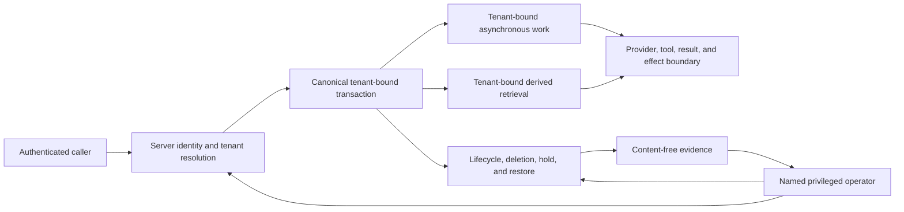
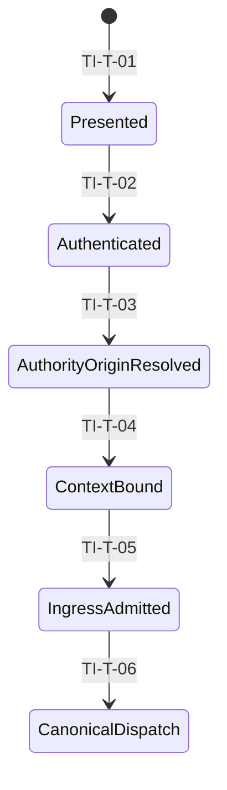
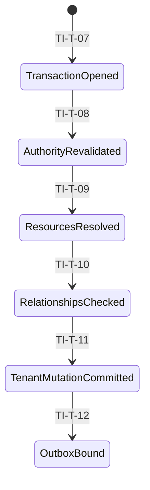
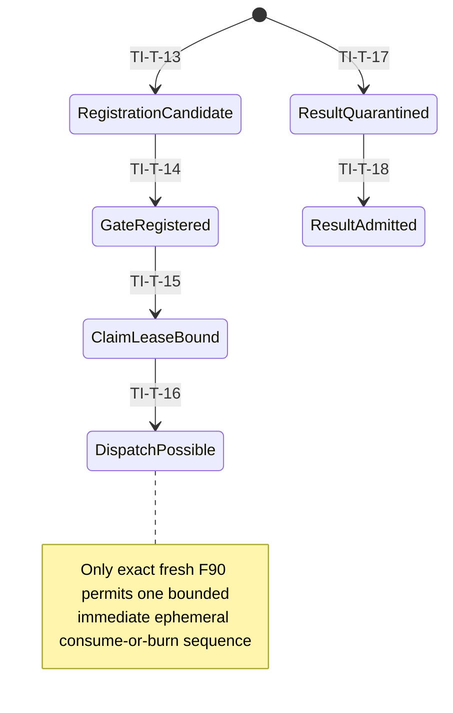
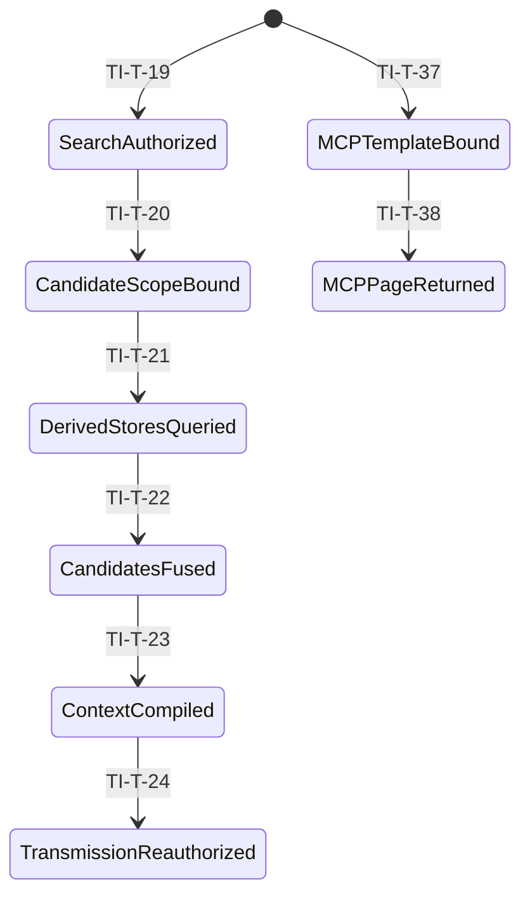
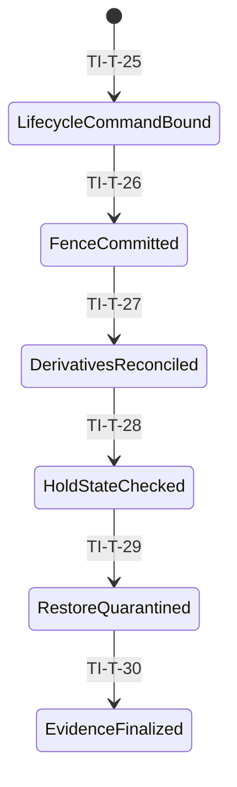
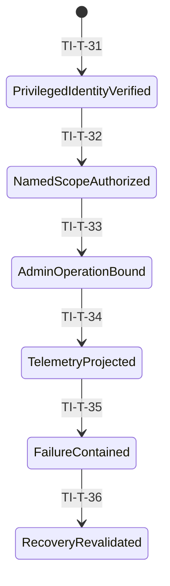

# Continuity v3 tenant-isolation ADR

Status: candidate A08 R4 design evidence; not accepted, implemented, or tested

## 1. Decision and authority

Continuity selects a topology-independent, server-owned tenant-isolation model.
A tenant is identified only by a stable, opaque, server-resolved tenant ID.
Client-supplied tenant values are hints and never authority. `AP-04` resolves
and binds exactly one immutable origin-authority mode and its canonical
provenance:

- `principal_delegated` binds the immutable initiating principal; current
  canonical membership, role, stable tenant, tenant-authorization epoch, and
  purpose-operation authority; immutable delegation provenance; and the exact
  executing-workload identity/capability. Principal **and** workload are
  conjunctive current authority, never alternatives or substitutes.
- `system_originated` has no principal. It binds an immutable canonically
  created system-origin record/classification with creator evidence, stable
  tenant, purpose, exact allowlisted operation, creation epoch/expiry, and the
  exact executing-workload identity/capability. Principal absence never
  implies system origin.

`AP-05` and `AP-07` retain the exact mode, origin, and workload binding across
durable enqueue, retry, DLQ, and recovery; `AP-13` exact-matches them; and
`AP-29` resolves current authority only from stored canonical authorization/r1
lineage. Mode, origin, delegation/system classification, and workload binding
are immutable across enqueue, retry, DLQ, recovery, claim, takeover, dedupe,
and dispatch. A claim owner is only an operational lease identity and never
workload authority. Mode switch, an erased or substituted principal,
principal/workload substitution, origin/system-classification substitution,
or workload/capability change requires a fresh canonical authorization chain
and cannot reuse a gate, claim, lease, fence, or dedupe record.

Missing, stale, replayed, revoked, expired, ambiguous, conflicting, substituted,
or mismatched authority denies without fallback. Queue, model, provider, tool,
content, cache, request, token, `F89`, `F90`, claim ownership, projection, or
elapsed time cannot create a tenant, select a mode, or supply current authority.

Tenant scope is structural at every data, execution, derivative, effect, and
evidence plane. The model is compatible with pooled, siloed, or hybrid physical
deployment, but it selects none of them. Account, region, network, KMS, backup,
quota, and operations topology remain deferred to HG-5. This ADR makes no
physical-isolation claim.

The approved hackathon profile is `HG2-RP01`: one owner-controlled synthetic
tenant, no real customer or production data, no self-service tenant creation,
and no exception. The design is future-safe for multiple server-resolved
tenants, but does not authorize another tenant, real data, or production use.

The authoritative inputs are:

- [A02 system trust boundaries](system-trust-boundaries-v3.md), SHA-256
  `9ac203dd631bd070605e33ae904ad5441ce0d7962524cfbda9abfc384c3805fc`,
  194,041 bytes;
- [A03 deletion lifecycle](data-deletion-lifecycle-v3.md), SHA-256
  `a2a65f9132f1683242943732d483eb1cd0e80c57a8e68db6090b3d953e9ad3d8`;
- [A04 governed decision path](governed-decision-path-v3.md), SHA-256
  `a013ba4886c77f401afc028f4ff2c99f19ec181541de58d65bd94fee798877af`,
  198,593 bytes, an exact A08 manifest dependency;
- [HG-2 decision packet](../governance/hg2-human-decision-packet.md), SHA-256
  `2b2d92363d66dd264e0b5beba08d7710e3b52550b75c6e28b37b54048c58da14`,
  37,174 bytes, mapping `HG2-D01-B` and `HG2-D02-A` through `HG2-D19-A`;
- accepted E-0035 tuple: ledger
  `2139dfa5199c04b0d442a35db034c0c5a54e448e7d437daa536c8bad14236f63`,
  status
  `1a6529238cb74038b20e9efca2145271da5b0c67a8c2788a7b6355eff2196ff3`,
  and manifest
  `f242772729be5adf5c2f32a0adbaf0d53ad23d0133c709f1b1b20a4b1a369482`.

The E-0030 owner selection remains accepted historical selection evidence, not
the current predecessor tuple and not artifact-review carry. [A05 experimental
learning](experimental-learning-promotion-v3.md) and [A06 independent-system
boundary](independent-system-boundary-v3.md) remain consistency inputs, not
added A08 manifest dependencies.

R4 explicitly closes Security HIGH `A08-R3-SEC-01`. R3's delayed-effect model
did not itself require AP29's authoritative same-transaction current
membership, role, stable tenant, tenant-authorization epoch, and
purpose-operation authority exact-match to the stored source epoch. R4
normatively consumes corrected A02 R5 and A04 R17: every authority-creating
AP29 transaction applies the exact mode-specific current conjunction described
above, and `DISPATCH_CAS` is the sole execution fence immediately before its
closed mutation. R3 exact `{size_bytes: 53824, sha256:
76fd17ce7fe5f18f2cde3fbb521372a1191a32bf9bea98accaffe7f6e01c342c}`
remains immutable failed history. No R3 review result, authority, or finding
closure carries.

R4 preserves without reopening the substantive R3 corrections for earlier
Terra findings: registration has no claimant/lease prerequisite; dispatch has
no registration nonce, gate creation, or baseline-creation field; takeover
requires authoritative expiry and a higher fence; A03 `LT-37` baseline and
resolution remain complete; result/evidence admission remains independent;
Managed MCP remains tenant-bound, versioned, bounded, cursor-bound, and
read-only; and RP01 structural isolation and disabled paths remain unchanged.

Normative language in this ADR states future implementation and acceptance
requirements. It is not operational proof.

## 2. Reading rules

- Only the six detail views in sections 3.2 through 3.7 are normative diagrams.
- The overview in section 3.1 is navigation only and has no transition
  authority.
- `TI-T-*` identifies normative transitions, `TI-I-*` invariants, `TI-P-*`
  plane requirements, `TI-F-*` failure or denial cases, and `TI-AT-*` future
  acceptance evidence.
- A denial is content-free, commits no requested mutation or effect, and grants
  no retry, no-existence, or no-effect authority.
- Every authorization statement means live server authority at the specified
  boundary, not a client claim, model output, payload field, URL, queue body,
  provider or tool output, or cache value.

## 3. Coordinated isolation views

### 3.1 Navigation overview — NON-NORMATIVE

This overview adds no state, transition, authorization point, or normative
meaning.

### 3.2 Detail A — identity and ingress

This view resolves identity, stable tenant, purpose, operation, exact immutable
mode/origin provenance, and exact workload binding before any tenant-scoped
search or mutation. Principal mode resolves current membership, role,
tenant-authorization epoch, and purpose-operation authority; system mode
resolves the canonical system-origin classification/allowlisted operation and
expiry. Neither path accepts tenant or origin authority from the caller.

### 3.3 Detail B — canonical transaction and resource binding

This view requires structural tenant predicates and tenant-bound resource
identity in the same canonical serializable decision as the operation.

### 3.4 Detail C — asynchronous work, results, and effects

This view applies to outbox, queue, inbox, retry, lease, DLQ, idempotency,
provider, tool, result, receipt, effect, and bounded work-accounting paths. The
dispatch/effect branch is independent of the later result/evidence branch.
Result admission never precedes dispatch and never authorizes another effect.

The accepted A02/A04 `AP-29` contract is consumed without redefinition.
Exactly six mutually exclusive operation-tagged, parameterized, fixed/bounded,
DB-enforced callable serializable transaction surfaces exist. The adapter has
EXECUTE/invoke only on those surfaces and no base-table/general
INSERT/UPDATE/DELETE, arbitrary or dynamic SQL, caller-selected
table/column/predicate/key/range, alternate repository/session role,
capability retagging, privilege inheritance, owner/security-definer escape,
or callable composition. All six are read-only over membership/role/tenant
authority/purpose; origin/delegation/system classification/allowlist;
workload capability; A03 applicability/version/`LT-37` watermarks; and stored
r1/effect lineage except for the exact named footprint below.

Four authority-creating variants—`REGISTER_ALLOW_GATE`, `ACQUIRE_CLAIM`,
`TAKEOVER_CLAIM`, and `DISPATCH_CAS`—require C4-R2-advanced; every pre-C4-R2
version including R8, R9, R10, and C4-R1 conflicts without fallback.
`ABORT_CAS` retains its existing exact tuple/phase version and is
revocation-safe stop/reconciliation. `READ_OR_DEDUPE_EXACT` retains its
existing diagnostic version and is zero-write/no-authority.

| AP29 callable | Same-transaction current checks | Exact success footprint and exclusion |
| --- | --- | --- |
| `REGISTER_ALLOW_GATE` / `TI-T-14` | From stored authorization/r1 lineage: exact mode/origin; current tenant-authority binding/source epoch; principal membership/role/stable tenant/tenant epoch/purpose authority **and** workload/delegation, or canonical system origin/class/allowlisted operation **and** workload; gate absence; registration, approval, lifecycle, lineage, and complete A03 resolver conditions | Create one gate/version and store immutable authority/provenance plus A03 resolver baselines before consuming only the registration nonce and advancing only r1 authorization-dispatch/latch to r2; exact same-request dedupe only. No claim/lease prerequisite or mutation. |
| `ACQUIRE_CLAIM` / `TI-T-15` | Exact stored mode/origin; current principal membership/role/stable tenant/tenant epoch/purpose authority **and** workload/delegation, or canonical system origin/class/allowlist **and** workload; current tenant-authority/source epoch; already stored gate baseline | Mutate only the named claim/owner/fence/lease/version, gate revision, and exact dedupe. No registration nonce, gate creation, or baseline creation. |
| `TAKEOVER_CLAIM` / `TI-T-15` | Same checks as acquire plus authoritative canonical expiry and higher fence; claim owner is not workload authority | Mutate only the same named higher-fence owner/instance/lease footprint, gate revision, and exact dedupe. Immutable mode/origin/workload/capability/baseline cannot change; elapsed time alone proves nothing. |
| `ABORT_CAS` | Exact existing tuple/phase; no live principal/workload-authority prerequisite | Mutate only named abort phase/version, tombstone, one content-free evidence/delivery ID, and exact dedupe. It stops only and recreates no authority. |
| `DISPATCH_CAS` / `TI-T-16` | Sole canonical execution fence: exact stored mode/origin; current principal membership/role/stable tenant/tenant epoch/purpose authority **and** workload/delegation, or canonical system origin/class/allowlist **and** workload; tenant-authority/source epoch and gate baseline; current approval/cancellation/policy/deletion/claim/lease/A03 resolver/effect-lineage fences immediately before mutation | May read fixed effect lineage; writes only named `dispatch_possible` phase/version, tombstone, one content-free evidence/delivery ID, and exact dedupe tuple/record. No lineage/authority/resolver/claim/lease/baseline write. |
| `READ_OR_DEDUPE_EXACT` | Exact prior request tuple only; no current-authority recovery | Zero writes, including no dedupe/evidence/ID creation, repair, refresh, recovery, mutation, or permit. |

Denial, conflict, unresolved, stale, deduped/read, or ambiguous result performs
none of a callable's success-footprint mutation and grants no authority. Only
an exact fresh newly `applied` named `F90` advances its owning local TI
ordering. Dispatch-first is permanent possible effect: later revocation,
invalidation, local failure, or ambiguity cannot authorize abort, known
no-effect, retry, permit reissue, or a second effect.

The current `LT-37` re-resolution at `TI-T-16` includes resolver schema/bound,
applicability/scope version, ordered affected lineages, and ordered unique
subject/disposition/strictly-monotonic-version rows or the exact
`no_applicable_hold_subjects` sentinel. Missing, stale, ambiguous, incomplete,
noncanonical, over-bound, unknown-bound, or old-version state denies exactly as
the accepted contracts specify.

### 3.5 Detail D — derived retrieval, vector, graph, cache, and context

This view covers vector, graph, embedding, cache, temporal, entity, causal,
episodic, procedural, candidate-fusion, compiled-context, and read-only Managed
MCP isolation. MCP exact authorization ordering remains deferred to A09/R04
and HG-3.

### 3.6 Detail E — deletion, hold, backup, restore, and evidence

This view preserves A03 ownership of revision, correction, deletion, tombstone,
fence, legal-hold, key-state, backup, restore, reconciliation, and
non-resurrection semantics.

### 3.7 Detail F — privileged administration, observability, denial, and recovery

This view permits only named, MFA-backed, bounded authority. Under
`HG2-RP01`, federation and break-glass are disabled and no unrestricted
cross-tenant support or administrative query exists.

## 4. Plane-isolation matrix

| ID | Plane | Structural tenant requirement | Prohibited path |
| --- | --- | --- | --- |
| TI-P-01 | identity and origin authority | AP04 maps identity/provenance to one stable tenant and exactly one immutable `principal_delegated` or `system_originated` mode; principal mode binds current membership/role/tenant epoch/purpose authority and system mode binds canonical system origin/allowlist/expiry; both bind exact workload capability | Client-selected tenant/mode, default tenant, ambiguous membership, principal absence inferred as system origin |
| TI-P-02 | request and execution | Immutable tenant, mode/origin, purpose, operation, and workload context accompanies every admitted operation and internal call | URL, payload, queue, model, claim owner, token, F89/F90, or cached tenant/authority |
| TI-P-03 | canonical database | Every row, key, predicate, relationship, uniqueness domain, and transaction is tenant-bound | Unscoped query, fallback, cross-tenant join or relationship |
| TI-P-04 | payload and reference | Payload reference, revision, purpose, key scope, and lifecycle identity bind the same tenant | Shared unbound payload reference or deciding A07 encryption mechanics |
| TI-P-05 | queue and work | Envelope, outbox, inbox, retry, lease, DLQ, dedupe, and accounting retain tenant, immutable mode/origin, exact workload, and operation identity | Queue-body authority, mixed-tenant batch, cross-tenant retry, mode/workload substitution |
| TI-P-06 | vector and embedding | Vector, embedding space, revision, purpose, and query filter structurally include tenant | Global search, tenantless nearest-neighbor fallback |
| TI-P-07 | graph and relationship | Node, edge, traversal frontier, lineage, and causal relationship share the tenant | Cross-tenant edge, traversal, expansion, or inference |
| TI-P-08 | cache | Key, namespace, value provenance, source revision, policy, purpose, and fence bind tenant | Shared key, tenantless negative cache, stale fallback |
| TI-P-09 | candidate and context | Candidate, score, fusion, compiler input, and emitted context retain tenant and lineage | Cross-tenant fusion or context assembly |
| TI-P-10 | provider and tool | Transmission, authorization attempt, six AP29 callables, result, receipt, and effect bind the same tenant/mode/origin/workload context and exact variant footprint | Output-selected tenant, claim-owner/workload confusion, result reuse, cross-variant mutation, unscoped effect |
| TI-P-11 | lifecycle | Revision, correction, tombstone, deletion fence, hold subject, key state, and reconciliation bind tenant | Resurrection or another tenant's fence/hold/key state |
| TI-P-12 | backup and restore | Backup class and restore quarantine retain tenant and lifecycle provenance | Payload backup under RP01, direct restore visibility |
| TI-P-13 | evidence and telemetry | Logs, metrics, traces, audit, privacy receipts, and content-free evidence use bounded tenant-safe schemas | Raw content, cross-tenant existence, unsafe cardinality |
| TI-P-14 | administration | Named MFA-backed authority is tenant- and operation-bounded with no shared credential | Federation, break-glass, global support query under RP01 |
| TI-P-15 | experimental and export | Learning and export are disabled and have no route, queue, credential, or fallback | Training, evaluation export, payload export, promotion |
| TI-P-16 | Managed MCP | Read-only template, server-owned query scope, tenant, cursor, pagination, bounds, and evidence are structurally bound | Tenantless/global/default fallback, ad hoc raw query, foreign cursor reuse, unbounded count or enumeration |

## 5. Operation, authority, and recheck matrix

| Operation | Initial authority | Structural binding | Required live recheck | Denial boundary |
| --- | --- | --- | --- | --- |
| Authenticate | Verified authenticator or canonical system-origin initiation evidence | Subject/session or origin evidence only; no tenant/mode from client | Credential/origin authenticity and validity | Before authority-origin resolution |
| Resolve origin authority | AP04 canonical identity/origin resolver | One stable tenant, purpose, operation, exact workload, and exactly one immutable mode; principal mode includes membership/role/tenant epoch, system mode canonical origin/allowlist/expiry | Applicable mode-specific two conjuncts are current; no principal-absence inference | Before tenant context exists |
| Read/search | Tenant context plus mode/origin, purpose, operation, and workload | Tenant predicate in every canonical and derived query | Applicable current authority conjuncts, policy, revision, tombstone, fence | Before search and before context release |
| Create/update | Tenant context and resource type authority | Tenant in row identity, uniqueness, references, and relationships | Authority and lifecycle state in commit transaction | Before mutation commit |
| Batch | One tenant context for every item | Homogeneous tenant-bound units | Every item and relationship; no partial cross-scope commit | Reject whole mixed batch |
| Enqueue | Committed canonical transaction | Tenant, immutable mode/origin/workload, and outbox identity | Current transaction authority and lifecycle fence | Before atomic outbox commit; no retry reclassification |
| Register allow gate (`TI-T-14`) | C4-R2 candidate at `auth_dispatch_registered@r1`; no gate, claim, or lease exists | Stored immutable mode/origin and workload; fresh AP13 nonce/expiry; gate absence; shared correlation; approval/lifecycle/lineage; complete LT-37 resolution | Current principal+workload or system-origin+workload and source epoch in the mutation transaction; atomically create gate/store authority+resolver baselines, consume nonce, advance r1→r2 | Before fresh newly-applied registration; pre-C4-R2 conflicts; no claim/lease prerequisite |
| Acquire/take over claim (`TI-T-15`) | C4-R2 existing exact `gate_registered@r2` plus authenticated owner | Stored immutable mode/origin/workload and gate baseline; new claim/fence/lease tuple | Applicable two current conjuncts and source epoch in the mutation transaction; takeover also proves canonical expiry/higher fence under same workload | Before claim/lease mutation; pre-C4-R2 conflicts; no registration nonce/gate creation |
| Abort reconciliation (no new success-path TI transition) | Existing exact tuple/phase under the existing ABORT version | Named gate and stop cause | No live principal/workload-authority prerequisite; exact tuple/phase only | Stop-only exact footprint; recreates no authority |
| Dispatch possible (`TI-T-16`) | C4-R2 exact current bound claim/owner/fence, live lease, and registered gate | Stored immutable mode/origin/workload and gate/A03 baselines plus all existing dispatch fences | Applicable two current authority conjuncts and source epoch in the sole mutation transaction, plus current claim/lease/approval/policy/lifecycle/lineage/LT37 exact match | Before permanent `dispatch_possible`; pre-C4-R2 conflicts; dispatch writes only its closed footprint |
| Diagnostic read/dedupe | Existing exact diagnostic version and prior request tuple | Exact prior projection key | No authority recovery; zero write | Return exact prior projection/not-found only; create no dedupe/evidence/permit |
| Admit result | Authenticated F39/F40/F15/LT-104 source plus expected tenant attempt | Tenant, source, work, revision, gate/effect/attempt/fence state | Exact frozen LT-104/F17 admission and settlement | Before result visibility or reuse; never effect authority |
| Bind MCP template (`TI-T-37`) | Verified tenant/mode/origin/workload/purpose and allowlisted versioned read-only template | Server scope, resource class, filters/order, hard page/scan/time/result bounds | Applicable current authority, template/version, normalized scope and bounds | Before any MCP datastore query |
| Return MCP page (`TI-T-38`) | Exact bound template and server-issued opaque cursor | Tenant, template/version, scope/filters/order, snapshot/version, page bounds, expiry, continuation | Cursor integrity, freshness, tenant, snapshot and every bound field | Before minimized page; deny without count/existence fact |
| Delete/correct | Tenant privacy authority and canonical subject scope | Tenant, lineage, revision, subject, purpose | A03 lifecycle and hold applicability in serializable order | Before fence/mutation |
| Restore | Named recovery authority | Tenant and lifecycle provenance in quarantine | Tombstone, correction, hold, key state, authority, purpose | Before any restored visibility |
| Admin/observe | Named MFA-backed bounded role | Explicit tenant and operation scope | Current privilege, approval where required, safe projection | Before query/action/export |

## 6. Normative transition register

| Transition | Source state | Destination state | Trusted tenant inputs | Required live rechecks | Denial behavior | Evidence boundary |
| --- | --- | --- | --- | --- | --- | --- |
| TI-T-01 | start | Presented | Authenticator presentation only | Format, audience, replay defenses | Reject without tenant lookup | Content-free ingress code |
| TI-T-02 | Presented | Authenticated | Verified server subject/session or canonical system-origin initiation evidence | Credential/origin authenticity, issuer/audience, expiry, revocation | Reject; reveal no tenant or mode fact | Authentication/origin decision ID |
| TI-T-03 | Authenticated | AuthorityOriginResolved | AP04 canonical identity/origin records | Resolve exactly one immutable mode: principal with current membership/role/stable tenant/tenant epoch/purpose authority, or canonical system origin/class/allowlisted operation/expiry; both bind exact workload | Deny missing/ambiguous/conflicting/forged/expired; principal absence is not system origin | Mode/origin decision ID; no content |
| TI-T-04 | AuthorityOriginResolved | ContextBound | Stable opaque tenant ID, immutable mode/origin provenance, purpose, operation, exact workload | Principal **and** workload or canonical system-origin/allowlist **and** workload | Deny mismatch/substitution; no default or fallback | Tenant-context/provenance version and decision ID |
| TI-T-05 | ContextBound | IngressAdmitted | Immutable trusted context and request identity | Rate, replay, schema, resource hint consistency | Reject mixed or tenant-mismatched request | Admittance code and correlation ID |
| TI-T-06 | IngressAdmitted | CanonicalDispatch | Server-bound tenant/mode/origin/workload context only | Context integrity, immutable provenance, and destination audience | Drop forged, altered, or mode-switched propagation | Content-free dispatch evidence |
| TI-T-07 | start | TransactionOpened | Authenticated workload and tenant context | Connection role and transaction ownership | Refuse unscoped transaction | Transaction evidence ID |
| TI-T-08 | TransactionOpened | AuthorityRevalidated | Server tenant, immutable mode/origin/workload, operation | Applicable current principal+workload or system-origin+workload conjuncts, source epoch, policy, lifecycle | Abort transaction | Content-free denial code |
| TI-T-09 | AuthorityRevalidated | ResourcesResolved | Tenant-bound canonical identifiers | Every lookup exact-scoped and current | Not-found-equivalent denial, no oracle | Bounded lookup outcome |
| TI-T-10 | ResourcesResolved | RelationshipsChecked | Tenant-bound source and target identities | Same tenant, valid lineage, purpose, lifecycle | Reject entire relationship set | Relationship validation ID |
| TI-T-11 | RelationshipsChecked | TenantMutationCommitted | Revalidated context and checked resources | Serializable authority, revision, tombstone, fence | Atomic abort; no partial write | Canonical event and receipt reference |
| TI-T-12 | TenantMutationCommitted | OutboxBound | Committed tenant event and work identity | Exact transaction, tenant, purpose, lifecycle | No enqueue without atomic outbox | Outbox reference; no payload content |
| TI-T-13 | start | RegistrationCandidate | AP07-retained tenant/mode/origin/workload, authorization-dispatch pair, capsule/common-spine, effect/affected lineage, and registration inputs | Source, audience, C4-R2 schema/version, immutable provenance, tenant/work/dispatch identity and correlation integrity | Quarantine or drop; create no gate, claim, lease, fence, processing, or effect authority | Registration-candidate decision and content-free denial code |
| TI-T-14 | RegistrationCandidate | GateRegistered | Exact C4-R2 tenant registration candidate, stored authorization/r1 lineage, server-owned A03 inputs, fresh AP13 nonce/expiry | `REGISTER_ALLOW_GATE` proves gate absence and in the same mutation transaction revalidates immutable mode/origin, current tenant-authority/source epoch, principal membership/role/tenant epoch/purpose authority **and** workload/delegation or canonical system origin/class/allowlist **and** workload, plus registration/approval/lifecycle/lineage and complete LT37 resolution | Only fresh newly-applied success performs the exact REGISTER footprint: creates gate/version and authority/resolver baselines, consumes nonce, advances r1→r2, exact dedupe. Every pre-C4-R2 or negative result performs no success mutation or authority | Gate and baselines only; claimant/claim/fence/lease must not exist or be required |
| TI-T-15 | GateRegistered | ClaimLeaseBound | Existing C4-R2 exact gate/baseline, immutable mode/origin/workload, gate/latch versions, owner and operation tuple | `ACQUIRE_CLAIM`/`TAKEOVER_CLAIM` in the same claim mutation revalidate current principal membership/role/stable tenant/tenant epoch/purpose authority **and** workload/delegation, or canonical system origin/class/allowlist **and** workload, plus tenant-authority/source epoch and stored baseline; takeover proves canonical expiry/higher fence and changes owner only under same workload | Only fresh newly-applied exact footprint creates/changes named claim/owner/fence/lease/gate revision/dedupe. Pre-C4-R2 or other negative result gives no claim, processing, retry, or effect authority | Authoritative claim/lease decision; no gate/baseline creation or workload substitution |
| TI-T-16 | ClaimLeaseBound | DispatchPossible | Existing C4-R2 exact gate/baseline, immutable mode/origin/workload, current claim/lease and full operation tuple | Sole `DISPATCH_CAS` transaction revalidates current principal membership/role/stable tenant/tenant epoch/purpose authority **and** workload/delegation, or canonical system origin/class/allowlist **and** workload, plus tenant-authority/source epoch, gate baseline, claim/lease, approval/cancellation/policy/deletion, complete LT37 resolver, and effect-lineage fences immediately before mutation | Only fresh newly-applied exact DISPATCH footprint commits; pre-C4-R2/negative/dedup/read result grants no effect/retry/no-effect/reissue. Dispatch-first remains permanent possible effect and cannot later abort or retry | Exact F90 alone permits one bounded immediate ephemeral consume-or-burn effect attempt; DISPATCH reads lineage but cannot write it |
| TI-T-17 | start/result arrival | ResultQuarantined | Authenticated F39/F40/F15/LT-104 source and expected tenant/result attempt | Source, tenant, work, revision, schema and result-attempt match; result bytes are nonauthority; F89/F90 never substitute for result evidence | Quarantine; never reuse, admit, settle, or authorize effect | Result-arrival code; unsafe bytes excluded |
| TI-T-18 | ResultQuarantined | ResultAdmitted | Exact tenant result lineage and canonical gate/effect/attempt/fence state | Frozen A03 LT-104/F17 admission/settlement exact-match; current authority, correction/deletion fence, source and terminal state | Reject stale, replayed, mismatched, indeterminate, or post-fence result | Content-free admission/settlement evidence; no authority for another effect |
| TI-T-19 | start | SearchAuthorized | Server tenant, immutable mode/origin/workload, purpose, query class | Applicable current authority conjuncts, source epoch, policy, lifecycle | Search nothing; reveal no counts | Pre-search decision ID |
| TI-T-20 | SearchAuthorized | CandidateScopeBound | Tenant, embedding-space version, revision scope | Scope completeness and allowed source classes | Reject missing or mixed scope | Scope version and source-class set |
| TI-T-21 | CandidateScopeBound | DerivedStoresQueried | Structural tenant filters and context | Vector/graph/cache provenance, tombstone, fence | No unscoped fallback or partial leak | Per-store content-free outcome |
| TI-T-22 | DerivedStoresQueried | CandidatesFused | Tenant-bound candidates with lineage | Same tenant, current revisions, bounded counts | Drop invalid set; no cross-tenant score | Fusion version and candidate references |
| TI-T-23 | CandidatesFused | ContextCompiled | Tenant-bound authorized candidates | Compiler version, policy, minimization, lifecycle | Emit no context on mismatch | Compiler version and active revisions |
| TI-T-24 | ContextCompiled | TransmissionReauthorized | Compiled tenant context, immutable mode/origin/workload, and destination request | Applicable current authority conjuncts, provider/tool policy, DLP, fence | No transmission; content-free receipt | Reauthorization decision reference |
| TI-T-25 | start | LifecycleCommandBound | Tenant privacy authority and canonical subject scope | Applicable identity/origin authority, tenant, purpose, command scope | Deny ambiguous or cross-tenant command | Privacy-command decision ID |
| TI-T-26 | LifecycleCommandBound | FenceCommitted | Tenant lineage, revision, subject scope | A03 serializable lifecycle and hold applicability | Atomic deny or unresolved; no stale allow | Fence/tombstone reference |
| TI-T-27 | FenceCommitted | DerivativesReconciled | Tenant lineage and derivative inventory | Every cache/vector/graph/queue/result derivative | Quarantine unresolved derivative | Reconciliation counts/codes only |
| TI-T-28 | DerivativesReconciled | HoldStateChecked | Server-resolved tenant plus canonical hold subject/scope | Current authoritative A03 hold rows and applicability | Missing/incoherent state is unresolved | Hold versions; no content |
| TI-T-29 | HoldStateChecked | RestoreQuarantined | Tenant backup provenance and recovery authorization | Tombstone, correction, hold, key, purpose, applicable current authority | Destroy/quarantine; never expose directly | Restore quarantine ID |
| TI-T-30 | RestoreQuarantined | EvidenceFinalized | Tenant-safe lifecycle outcomes | Completeness, minimization, retention, no resurrection | Incomplete evidence remains unresolved | Content-free privacy evidence |
| TI-T-31 | start | PrivilegedIdentityVerified | Named local privileged identity | MFA, session, role, revocation; no federation | Deny anonymous/shared/federated identity | Privileged authentication ID |
| TI-T-32 | PrivilegedIdentityVerified | NamedScopeAuthorized | Explicit tenant, operation, reason, duration | Current bounded grant; no break-glass | Deny global or wildcard scope | Grant decision and expiry |
| TI-T-33 | NamedScopeAuthorized | AdminOperationBound | Server-bound tenant/admin context | Target, purpose, approval, lifecycle, safe query | No unrestricted support query | Administrative action ID |
| TI-T-34 | AdminOperationBound | TelemetryProjected | Allowlisted tenant-safe event fields | Schema, cardinality, minimization, retention | Drop disallowed material and copies | Independent count/code only |
| TI-T-35 | TelemetryProjected | FailureContained | Trusted tenant/work/resource identities | Mixed scope, partial failure, stale work, leak risk | Quarantine tenant unit; deny fallback | Containment code and bounded counters |
| TI-T-36 | FailureContained | RecoveryRevalidated | Fresh server tenant/mode/origin/workload authority and tenant-bound recovery unit | Applicable current authority conjuncts/source epoch, policy, lifecycle, lease, fence; no mode/workload substitution | Remain quarantined; no stale replay | Recovery decision and new attempt ID |
| TI-T-37 | start | MCPTemplateBound | Verified server tenant/mode/origin/workload, purpose and allowlisted versioned read-only template | Applicable current authority; server-owned query scope; resource class; normalized filters/order; hard page/scan/time/result bounds; no arbitrary/raw/global/default query | Uniform deny; execute nothing and reveal no count/existence fact | Template/version, normalized scope and content-free decision |
| TI-T-38 | MCPTemplateBound | MCPPageReturned | Exact bound template plus server-issued opaque cursor/pagination state | Exact tenant, template/version, normalized scope/filters/order, snapshot/version, page size/bounds, expiry and continuation; reject mismatch/tamper/replay/stale/foreign cursor | Uniform deny with no data, count, existence fact, fallback, or partial page | Authorized minimized tenant fields and bounded content-free evidence |

## 7. Transition-to-view index

| Transition | Normative detail view |
| --- | --- |
| TI-T-01 | Detail A |
| TI-T-02 | Detail A |
| TI-T-03 | Detail A |
| TI-T-04 | Detail A |
| TI-T-05 | Detail A |
| TI-T-06 | Detail A |
| TI-T-07 | Detail B |
| TI-T-08 | Detail B |
| TI-T-09 | Detail B |
| TI-T-10 | Detail B |
| TI-T-11 | Detail B |
| TI-T-12 | Detail B |
| TI-T-13 | Detail C |
| TI-T-14 | Detail C |
| TI-T-15 | Detail C |
| TI-T-16 | Detail C |
| TI-T-17 | Detail C |
| TI-T-18 | Detail C |
| TI-T-19 | Detail D |
| TI-T-20 | Detail D |
| TI-T-21 | Detail D |
| TI-T-22 | Detail D |
| TI-T-23 | Detail D |
| TI-T-24 | Detail D |
| TI-T-25 | Detail E |
| TI-T-26 | Detail E |
| TI-T-27 | Detail E |
| TI-T-28 | Detail E |
| TI-T-29 | Detail E |
| TI-T-30 | Detail E |
| TI-T-31 | Detail F |
| TI-T-32 | Detail F |
| TI-T-33 | Detail F |
| TI-T-34 | Detail F |
| TI-T-35 | Detail F |
| TI-T-36 | Detail F |
| TI-T-37 | Detail D |
| TI-T-38 | Detail D |

## 8. Failure and denial register

| ID | Failure or attack | Required outcome |
| --- | --- | --- |
| TI-F-01 | Missing, invalid, replayed, expired, or revoked identity; missing/forged/expired system-origin record | Deny before authority-origin resolution; reveal no tenant or mode fact |
| TI-F-02 | Missing, stale, ambiguous, conflicting, substituted, or revoked principal membership/role/tenant epoch/purpose authority, system classification/allowlist, delegation, or workload capability | Deny without default tenant, former-authority fallback, principal-absence inference, mode switch, or principal/workload substitution |
| TI-F-03 | Client, URL, payload, model, provider, tool, queue, cache, token, F89/F90, claim owner, or elapsed time supplies tenant/mode/origin/current authority | Ignore as authority, validate only permitted hints, and deny mismatch |
| TI-F-04 | Tenantless lookup, predicate, uniqueness domain, index path, or fallback | Fail closed before data access or mutation |
| TI-F-05 | Resource reference or relationship crosses tenant | Reject the whole operation without existence disclosure |
| TI-F-06 | Mixed-tenant batch or partial cross-scope failure | Reject whole batch; split only into separately authorized tenant units |
| TI-F-07 | Forged, mismatched, stale, duplicated, replayed, cross-tenant/cross-variant, or elapsed-time-inferred AP29 operation/row/key/claim/lease/gate | Exactly six callables only: four C4-R2 creators; existing-version revocation-safe ABORT; existing-version zero-write READ. Registration creates no claim; acquire/takeover creates no gate/baseline; dispatch creates neither. Deny borrowed fields, pre-C4-R2 creator versions, retagging, or a seventh operation |
| TI-F-08 | Principal/workload/system-origin revocation or substitution, role/tenant-epoch/purpose change, enqueue/retry/DLQ/recovery/takeover/dedupe replay, or delayed creator AP29 operation | REGISTER/ACQUIRE/TAKEOVER/DISPATCH recheck exact mode-specific current conjuncts and source epoch in their mutation transaction. Change-first yields zero success mutation/effect authority; dispatch-first remains permanent possible effect with no abort/no-effect/retry/reissue |
| TI-F-09 | Cross-tenant or tenantless vector, graph, embedding, cache, or fusion path | Return no candidates and no counts; never fallback |
| TI-F-10 | Cache poisoning, stale revision, fence bypass, or negative-cache oracle | Reject value, invalidate safely, and query only correctly scoped authority |
| TI-F-11 | Provider/tool result claims another tenant, is reused across tenant/attempt, substitutes F89/F90 for result evidence, or attempts to authorize a later effect | Quarantine and deny admission/settlement/effect; frozen LT-104/F17 admission remains independent of dispatch |
| TI-F-12 | Deletion, correction, tombstone, hold, or key-state mismatch | Lifecycle denial dominates prior authorization and derived state |
| TI-F-13 | Restore contains deleted, corrected, foreign-tenant, or unverifiable material | Keep quarantined or destroy; never expose |
| TI-F-14 | Error, count, latency, identifier, cache key, metric, trace, or audit leaks existence | Normalize/drop/minimize; reveal no cross-tenant fact |
| TI-F-15 | Shared credential, federation, break-glass, wildcard/support query, direct/general DML, arbitrary/dynamic SQL, cross-variant row/column access, protected authority/origin/workload/A03/lineage write, alternate role/session, privilege inheritance, or owner/security-definer escape | Deny under RP01/AP29; prove adapter EXECUTE-only on six fixed callables, READ zero-write, DISPATCH lineage-read/no-lineage-write, and record only content-free attempted action |
| TI-F-16 | Unknown or unimplemented enforcement, indeterminate store, partial outage | Deny; documentation or timeout is not allow/no-effect proof |
| TI-F-17 | Learning, export, payload backup, or experimental route is attempted | Deny because each is disabled under RP01 |
| TI-F-18 | Recovery replays stale work, changes mode/origin/workload, treats claim owner as workload, or bypasses current authority/fence | Require a fresh canonical chain for substitution and a new tenant-bound attempt with applicable same-transaction current revalidation |
| TI-F-19 | Tenantless/global MCP template, scope/filter smuggling, foreign/tampered/replayed/stale cursor, pagination/bound bypass, count/existence probing, or unsupported template | Deny uniformly; return no data, count, or existence fact and record only bounded content-free denial |

## 9. Invariant register

| ID | Normative invariant |
| --- | --- |
| TI-I-01 | No cross-tenant read, write, inference, queue, cache, vector, graph, effect, receipt, export, audit, administration, or restore path exists. |
| TI-I-02 | Tenant, immutable mode/origin, and workload binding cannot be selected or changed by model output, payload content, tool/provider output, URL/path input, queue body, claim owner, F89/F90, token, projection, or cached state; principal absence never implies system origin. |
| TI-I-03 | A tenant mismatch never falls back to an unscoped or default-tenant operation. |
| TI-I-04 | Cross-tenant batches are prohibited; split work uses separately authorized tenant-bound units. |
| TI-I-05 | Delayed work, retries, DLQ/recovery, results, and effects retain immutable mode/origin/workload and revalidate the applicable two current authority conjuncts, source epoch, and lifecycle fences in the owning commit/release/admission/effect transaction. |
| TI-I-06 | Canonical relationships cannot bind resources from different tenants. |
| TI-I-07 | Deletion and correction fences dominate cached, queued, derived, restored, or previously authorized work. |
| TI-I-08 | Errors and evidence reveal no cross-tenant existence or content. |
| TI-I-09 | Learning, export, payload backup, federation, and break-glass remain disabled. |
| TI-I-10 | Unknown or unimplemented enforcement denies; AP29 has exactly six fixed callable surfaces and no direct/general DML or privilege escape; architecture documentation is not operational proof. |
| TI-I-11 | Every MCP template, query, page, and cursor is server-tenant-bound; no input, cursor, or template can select another or default tenant. |

## 10. Threat and control register

| Threat | Planes and failures | Required controls | Future evidence |
| --- | --- | --- | --- |
| Forged tenant, origin, or confused deputy | TI-P-01, TI-P-02; TI-F-01 through TI-F-03 | Exactly two immutable modes, server origin resolution, conjunctive principal+workload or system-origin+workload authority, no principal-absence inference | TI-AT-01, TI-AT-02 |
| Tenantless query or fallback | TI-P-03; TI-F-04 | Structural predicates, scoped roles/templates, fail-closed query construction | TI-AT-03 |
| Cross-tenant references | TI-P-03, TI-P-04, TI-P-07; TI-F-05 | Composite tenant identity, relationship validation, atomic rejection | TI-AT-04 |
| Batch smuggling and partial commit | TI-P-02, TI-P-05; TI-F-06 | Homogeneous units, whole-batch rejection, separate authorization | TI-AT-05 |
| Queue/lease/retry/authority replay | TI-P-05; TI-F-07, TI-F-08 | Immutable mode/origin/workload across enqueue/retry/DLQ/recovery; six variant-owned footprints; same-transaction live creator checks; authoritative same-workload higher-fence takeover; bounded dedupe | TI-AT-06, TI-AT-11, TI-AT-19 |
| Derived-store scope bypass | TI-P-06 through TI-P-09; TI-F-09 | Structural tenant keys/filters, lineage, revision, purpose, fence | TI-AT-07, TI-AT-08 |
| Cache oracle or poisoning | TI-P-08; TI-F-10 | Complete structural keys, provenance, TTL/bounds, invalidation, no negative oracle | TI-AT-09 |
| External result/effect confusion | TI-P-10; TI-F-11 | Independent AP29 dispatch/effect and F39/F40/F15/LT-104 result branches, exact attempt binding, no result authority | TI-AT-10, TI-AT-11 |
| Lifecycle bypass or resurrection | TI-P-11, TI-P-12; TI-F-12, TI-F-13 | A03 fences, hold applicability, quarantine, reconciliation, no payload backup | TI-AT-12, TI-AT-13 |
| Existence/timing/identifier leakage | TI-P-13; TI-F-14 | Uniform content-free errors, bounded timing/counts, opaque IDs, safe schemas | TI-AT-14, TI-AT-15 |
| Privilege escalation or database escape | TI-P-10, TI-P-14; TI-F-15 | Named local identity, MFA, bounded scope, adapter EXECUTE-only on six fixed callables, protected domains read-only, no direct DML/dynamic SQL/role inheritance/owner escape | TI-AT-16 |
| Fail-open outage or unknown control | All planes; TI-F-16 | Deny unknown/indeterminate state, quarantine, no stale allow | TI-AT-17 |
| Disabled-path activation | TI-P-12, TI-P-15; TI-F-17 | No route/credential/queue/fallback for learning, export, payload backup | TI-AT-18 |
| Recovery bypass | All planes; TI-F-18 | New attempt, current authority, lifecycle/lease/fence checks | TI-AT-19 |
| Topology mistaken for proof | All planes | Logical invariants independent of topology; evidence at every enforcement point | TI-AT-20 |
| MCP query/cursor enumeration | TI-P-16; TI-F-19 | Read-only allowlisted versioned templates, exact tenant/scope/filter/order/snapshot/page/expiry cursor binding, hard bounds, uniform denial | TI-AT-21 |

## 11. Future acceptance and evidence register

| ID | Required future evidence; not present in this ADR |
| --- | --- |
| TI-AT-01 | Identity/origin tests reject invalid issuer/audience/expiry/replay/revocation and missing/forged/expired system origin without tenant or mode disclosure; principal absence never selects system mode. |
| TI-AT-02 | Tests prove exactly two immutable modes: principal requires current membership/role/tenant epoch/purpose authority **and** workload/delegation; system requires canonical origin/class/allowlisted operation/expiry **and** workload. Client/queue/model/provider/tool/cache cannot select tenant/mode. |
| TI-AT-03 | Every canonical query and mutation path proves tenant structural binding, exact mode/origin/workload retention, and no unscoped/default fallback. |
| TI-AT-04 | Resource, reference, uniqueness, lineage, and relationship tests reject every cross-tenant combination atomically. |
| TI-AT-05 | Mixed-batch, partial-failure, and separately split-unit tests prove homogeneous authorization. |
| TI-AT-06 | Positive tests prove all six exact footprints. REGISTER proves gate absence and creates gate/baselines without claim/lease; ACQUIRE/TAKEOVER mutate only claim/fence/lease/gate-revision/dedupe under the stored baseline and same workload; ABORT stops without live-authority prerequisite; DISPATCH writes only phase/tombstone/evidence/dedupe; READ writes nothing. Pre-C4-R2 creators and every cross-variant field/key deny. |
| TI-AT-07 | Vector/embedding tests prove tenant filter completeness, version/fence binding, and no tenantless nearest-neighbor path. |
| TI-AT-08 | Graph/cache/candidate/context tests prove tenant keys, traversal bounds, lineage, revision, purpose, and no cross-tenant fusion. |
| TI-AT-09 | Cache tests cover poisoned/stale entries, tombstone invalidation, negative-oracle resistance, and safe rebuild. |
| TI-AT-10 | Provider/tool/result tests prove tenant and attempt binding, source authentication, F39/F40/F15/LT-104 quarantine/admission, F89/F90 nonsubstitution, and result nonauthority. |
| TI-AT-11 | Race tests cover principal revoke; membership/role/tenant epoch/purpose change; workload/delegation revoke/change; system-origin expiry; mode/origin/principal/workload substitution; claim-owner confusion; and cross-tenant replay before/concurrent with sole `DISPATCH_CAS`. Change-first yields zero mutation/effect calls; dispatch-first remains permanent possible effect. Only exact fresh F90 permits one consume-or-burn attempt. |
| TI-AT-12 | A03 deletion/correction/hold tests prove monotonic fences dominate queued, cached, derived, and previously authorized work. |
| TI-AT-13 | Backup/restore tests prove no RP01 payload backup, quarantine, tombstone/correction/key reconciliation, and no resurrection. |
| TI-AT-14 | Error and API tests prove uniform not-found/denial behavior without cross-tenant existence, count, identifier, or timing disclosure. |
| TI-AT-15 | Log/metric/trace/audit/privacy-receipt tests prove allowlisted schemas, safe cardinality, minimization, retention, and drop-only rejection. |
| TI-AT-16 | Privilege tests deny direct INSERT/UPDATE/DELETE, arbitrary/dynamic SQL, caller-selected keys/ranges/tables/columns, cross-variant rows/columns, authority/origin/workload/A03/lineage writes, alternate role/session, inheritance and security-definer/owner escape; prove READ zero-write and DISPATCH lineage-read/no-lineage-write. |
| TI-AT-17 | Fault-injection tests prove unknown controls, partial outage, stale replicas, and indeterminate state deny without fallback. |
| TI-AT-18 | Route, credential, queue, storage, and API tests prove learning, export, payload backup, and experimental crossing remain disabled. |
| TI-AT-19 | Recovery tests prove enqueue/retry/DLQ/recovery/takeover/dedupe cannot change mode/origin/workload, infer system origin, substitute claim owner, or resume stale authority; substitution requires a fresh canonical chain and every creator repeats current checks. |
| TI-AT-20 | End-to-end adversarial evidence maps every logical plane to concrete enforcement, uniform no-existence leakage, bounded work, six-callable privilege negatives, change-first/dispatch-first races, and content-free audit without claiming topology alone is isolation. |
| TI-AT-21 | Future R04/S01/S04 evidence covers MCP template allowlisting/versioning, tenant/scope/filter/order/snapshot/page-size/expiry cursor binding, tamper/replay/foreign-tenant rejection, hard scan/page/time/result bounds, uniform errors/count suppression, no global/default/raw fallback, and content-free audit. |

## 12. Source-to-decision traceability

| Source | Source decision or constraint | ADR consequence |
| --- | --- | --- |
| A02 `AP-01`-`AP-07`, `F01`-`F09` | AP04 binds exactly one immutable principal-delegated or system-originated provenance and workload; AP05/AP07 retain it through work | TI-P-01, TI-P-02, TI-P-05 and TI-T-01 through TI-T-13 |
| A02 `AP-06`, `AP-29`, `F15`-`F18`, `F89`, `F90` | Exactly six DB-enforced callables, four C4-R2 creators, protected-domain read-only privilege, closed footprints, and live mode-specific checks | TI-P-03, TI-P-05, TI-P-10, TI-T-07 through TI-T-16, TI-F-07, TI-F-08, TI-F-15 |
| A02 `AP-08`, `AP-21`-`AP-23`, `F22`, `F30`, `F31`, `F57`-`F59` | Retrieval, derived cache, lineage, and lifecycle checks are pre-search constraints | TI-P-06 through TI-P-09 and TI-T-19 through TI-T-24 |
| A02 R5/A04 R17 `AP-11`-`AP-14`, `AP-27`-`AP-29`, `F29`, `F33`, `F36`-`F40`, `F84`-`F90` | REGISTER proves gate absence and stores authority/resolver baselines; ACQUIRE/TAKEOVER compare the baseline and retain workload; ABORT stops; DISPATCH is the sole live execution fence; READ is zero-write; later result admission remains distinct | TI-P-10, the six-callable table, and split TI-T-13 through TI-T-18 branches |
| A02 `AP-15`, `AP-16`, `F41`-`F46`, `F60` | Read-only Managed MCP requires tenant-safe templates, pagination, bounds, and evidence while exact authorization remains later-owned | TI-P-16, TI-T-37, TI-T-38, TI-F-19, TI-AT-21 and R04 |
| A02 `AP-24`, `AP-25`, `F76`-`F83` | Telemetry is minimized, content-free, and nonauthoritative | TI-P-13, TI-T-34 and TI-I-08 |
| A02 `BT-01`, `BT-02`, `BT-10`, `BT-14`-`BT-21` | Tenant/origin/workload confusion, privilege escape, stale authority, poisoning, MCP enumeration, and effect races require negative evidence | TI-F-01 through TI-F-19 and TI-AT-01 through TI-AT-21 |
| A03 `LT-01`-`LT-18` | Atomic ingestion, event, payload reference, outbox, and revision lifecycle | TI-P-03 through TI-P-05 and TI-T-07 through TI-T-12 |
| A03 `LT-37`, `LT-49`, `LT-53`, `LT-104` | Registration stores the current server-owned hold baseline; dispatch independently re-resolves/exact-matches it; later result admission remains separate canonical authority | TI-P-10, TI-P-11 and TI-T-14, TI-T-16 through TI-T-18, TI-T-28 |
| A03 `LT-54`-`LT-89` | Deletion, correction, purge, derivative reconciliation, and races deny stale work | TI-P-11 and TI-T-25 through TI-T-28 |
| A03 `LT-90`-`LT-103` | Backup, restore, keys, quarantine, and non-resurrection | TI-P-12 and TI-T-29, TI-T-30 |
| HG2-D01-B | Multi-organization shape uses stable server-resolved tenant authority for both immutable origin modes; RP01 permits one synthetic tenant only | Decision, TI-P-01, TI-I-02 |
| HG2-D02-A | Principal tenant/role authority comes from current verified membership; system work requires canonical origin/allowlist; both require exact workload capability | TI-T-03, TI-T-04, TI-I-03, TI-I-05 |
| HG2-D03-A through HG2-D06-A | Owner-controlled synthetic demo, public/synthetic taxonomy, high-risk exclusion, purpose controls | Decision, TI-P-02, TI-P-04 |
| HG2-D07-A through HG2-D09-A | Short retention, immediate denial, derivative reconciliation, bounded external handling | TI-P-10 through TI-P-13 |
| HG2-D10-A through HG2-D13-A | Hold, residency deferral, no payload backup, and future key-binding constraints | TI-P-11, TI-P-12 without deciding A07 crypto |
| HG2-D14-A | Local demo identity, MFA for privileged work, no federation or break-glass | TI-P-14 and TI-T-31 through TI-T-36 |
| HG2-D15-A | Learning and export disabled | TI-P-15, TI-I-09, TI-F-17 |
| HG2-D16-A | Exact server-resolved tenant on every plane | TI-P-01 through TI-P-16 and TI-I-01, TI-I-11 |
| HG2-D17-A through HG2-D19-A | Privacy workflow, escalation, and no exceptions | TI-T-25 through TI-T-30, TI-F-15 through TI-F-18 |

## 13. Downstream handoff traceability

These rows are requirements for future owners, not completion claims.

| Task | Exact manifest title | Future A08 handoff; not implemented or completed here |
| --- | --- | --- |
| C01 | Cognito identity and claims | Future: identity and claim inputs remain hints until server verification; principal absence cannot select system origin; exact claim shape stays C01. |
| C02 | Server-owned tenant context | Future: resolve and propagate stable opaque tenant, immutable mode/origin provenance, exact workload, and mode-specific current authority context. |
| C03 | CockroachDB canonical schema | Future: define tenant-bearing identities, relationships, constraints, and transaction surfaces; A08 supplies no DDL. |
| C04 | Database tenant isolation | Future: enforce canonical query, mutation, and relationship tenant isolation with no fallback. |
| C07 | Transactional outbox inbox and consumers | Future: enforce tenant-bound outbox, inbox, idempotency, and consumer settlement. |
| C08 | Lambda and SQS ingestion | Future: enforce tenant-bound authenticated envelopes, queue ingestion, and retry/DLQ routing. |
| C09 | Durable task state machine | Future: enforce tenant-bound task, checkpoint, claim, lease, retry, and work accounting. |
| C10 | Backup restore and key destruction | Future: enforce tenant-bound backup/key state, restore quarantine, and no resurrection. |
| D02 | Tenant-scoped temporal multi-graph | Future: enforce tenant-bound nodes, edges, traversal, and lineage. |
| D03 | Curator candidate pipeline | Future: enforce tenant-bound candidate provenance/status and prohibit mixed candidate sets. |
| D05 | Embedding-space identity and migrations | Future: enforce tenant, embedding-space, version, and migration isolation. |
| D06 | Policy-authorized embedding jobs | Future: enforce tenant, purpose, source, and fence-bound embedding work. |
| D07 | Distributed Vector Indexing adapter | Future: enforce structural tenant filtering/index namespaces and no global nearest-neighbor fallback. |
| D08 | Multi-view authorized retrieval | Future: enforce tenant-safe temporal, entity, causal, episodic, and procedural retrieval with fusion, dedupe, ranking, and bounds. |
| D10 | Deterministic context compiler | Future: enforce tenant-safe minimized context assembly with lineage, revision, purpose, and fence. |
| E01 | Policy contracts and stage ordering | Future: bind policy inputs and stage context to tenant; exact ordering stays A09/E01. |
| E02 | Pre-search policy | Future: bind tenant, purpose, and current authority before retrieval. |
| E03 | Provider-neutral adapter contract | Future: bind tenant, attempt, and destination in neutral request/result contracts after gates. |
| E04 | Amazon Bedrock adapter | Future: preserve exact tenant, attempt, policy, and fence at the Bedrock boundary after HG-3/HG-5. |
| E05 | Second-provider adapter | Future: preserve the same binding for the second provider after HG-3/HG-5. |
| E06 | Provider selection and failover | Future: ensure failover cannot change tenant/attempt or reuse authorization. |
| E07 | Pre-transmission policy and DLP | Future: recheck live tenant, purpose, policy, DLP, and fence before transmission. |
| E08 | Versioned receipt store | Future: bind receipt references and status to tenant without deciding A10 format. |
| E09 | Bound human approvals | Future: bind approval to exact tenant, action, attempt, scope, and revision with no transfer. |
| E10 | Governed inference orchestrator | Future: preserve tenant context and rechecks across end-to-end inference orchestration. |
| F05 | Tool intent and capability registry | Future: use tenant-aware intent/capability references; exact authorization stays A09/F05. |
| F06 | Tool authorization and executor | Future: expose only six fixed AP29 callables; preserve four C4-R2 creator checks/footprints, revocation-safe ABORT, zero-write READ, same-workload takeover, and sole bounded DISPATCH effect attempt. |
| F07 | Typed outcome capture and action receipts | Future: capture and reconcile tenant, attempt, and effect-bound outcomes and receipts. |
| F08 | Prediction-error calculation | Future: bind error calculation to tenant, source, world, and outcome; F08 owns no effect release. |
| F09 | Durable predictive orchestration | Future: enforce tenant-bound durable predictive work, recovery, and reconciliation. |
| R01 | Correction and retraction propagation | Future: enforce tenant-bound correction and retraction propagation. |
| R02 | Deletion coordinator and tombstones | Future: enforce tenant-bound deletion, tombstone, fence, and inventory reconciliation. |
| R03 | Restore-safe deletion | Future: enforce tenant-bound restore quarantine, current-state checks, and no resurrection. |
| R04 | Read-only Managed MCP Steward | Future: enforce tenant-bound read-only MCP templates, cursors, bounds, and evidence after A09/HG-3. |
| R05 | Observable operator and product UI | Future: provide tenant-safe status, errors, receipts, and privacy workflow. |
| R06 | Redacted receipt and evidence explorer | Future: provide tenant-bounded redacted evidence views with no global query. |
| S01 | Security invariant and adversarial harness | Future: produce adversarial proof for every plane and failure. |
| S03 | Structured telemetry and SLOs | Future: enforce tenant-safe structured logs, metrics, traces, cardinality, and SLOs. |
| S04 | Security privacy and abuse red team | Future: exercise cross-tenant, inference, MCP, privilege, and recovery attacks. |
| A12 | Threat privacy and abuse model | Future: carry all tenant-confusion, inference, stale-work, MCP, privilege, and restore threats. |

## 14. Alternatives and consequences

| Alternative | Evaluation | Decision |
| --- | --- | --- |
| Logical pooled isolation | Efficient and compatible with shared services, but requires structural tenant controls, live authorization, negative tests, and evidence at every plane. A single missing predicate or shared cache key is unacceptable. | Compatible, but not selected as a physical topology. |
| Physical siloing | Can reduce some shared-resource blast radius, but does not replace server-owned identity, relationship, queue, result, lifecycle, evidence, or administration controls. It increases provisioning and operations cost. | Deferred to HG-5; no physical-isolation claim. |
| Hybrid isolation | May place selected tenants or planes in silos while pooling others, but adds routing, consistency, restore, key, telemetry, and operations complexity. Logical invariants must still hold end to end. | Deferred to HG-5; no topology selected. |
| Topology-independent server-owned invariant model | Keeps tenant authority and isolation semantics stable across pooled, siloed, or hybrid deployment and fails closed when enforcement is absent or unknown. | Selected. |
| Client-selected tenant or default fallback | Simpler client routing but creates confused-deputy, enumeration, replay, and cross-tenant access risk. | Rejected. |

Consequences of the selected decision:

- Every future implementation plane must carry and verify structural tenant
  scope; a perimeter check alone is insufficient.
- More negative tests, explicit indexes/keys, bounded evidence, and live
  rechecks are required.
- A physical topology can later strengthen defense in depth but cannot weaken
  or substitute for these invariants.
- Uniform denial and minimized telemetry reduce diagnosability; named,
  tenant-bounded administrative evidence must provide safe operational insight.
- One synthetic tenant in the hackathon does not permit hard-coded default
  tenant behavior; the same future-safe rules apply.

## 15. Explicit nondecisions and nonclaims

This ADR does not decide:

- A07 payload encryption, DEK design, wrapping, crypto-erasure, or key
  destruction mechanism;
- A09 policy ordering, provider authorization, tool authorization, or MCP
  authorization;
- A10 receipt identity, serialization, signing, verifier, or wire format;
- C01 Cognito claim shape;
- Managed MCP authorization order, concrete template DSL or query syntax,
  cursor cryptography or wire format, datastore implementation, or provider;
- concrete database DDL, RLS policy, migration, index, query, SDK, or
  implementation;
- account, region, VPC, network, KMS, backup, IAM, quota, provider, cache,
  telemetry, or operations configuration.

HG-0 and HG-2 are approved, with HG-2 limited to exact `HG2-RP01`. HG-1 and
HG-3 through HG-6 remain pending. Learning, export, payload backup, federation,
and break-glass remain disabled. Architecture v3 remains unfrozen.

This candidate provides no architecture freeze, implementation, runtime
validation, production readiness, compliance, certification, universal
isolation proof, deployment, release, private integration, or approval of
HG-1/HG-3/HG-4/HG-5/HG-6. It does not mark A08 complete. Any future
implementation or acceptance claim requires the downstream evidence above and
the applicable governance chain.
