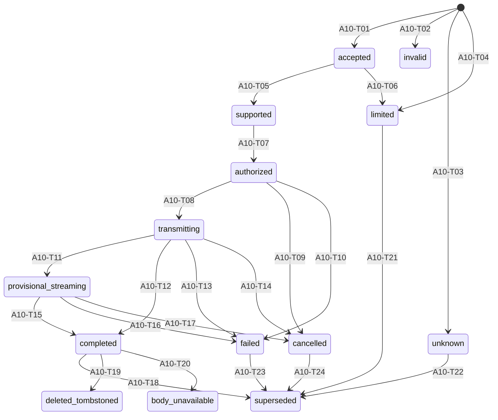

# Continuity v3 versioning and receipt ADR

Status: proposed design contract; no implementation or runtime authority

Owner: A10

### Failed R1 history and R2 correction boundary

R1 is failed history at exact `{size_bytes: 61186, lines: 798, sha256:
e8d31d99482ca90de9c9e805c6827122787608bc16784dd27c66304cd9a53b3e,
mode: 0644}`. Independent Terra stopped R1 with HIGH
`A10-R1-TERRA-01`: the receipt schema omitted permanent bindings required by
`RQ-A10`, `HG1-D04-A`, `HG1-D05-A`, and the current requirements trace for
request identity/safe request commitment, the explicit complete active-memory
revision set, applicable tool-intent and approval identities, and key
ownership/lifecycle views; it also lacked a complete applicability matrix and
an exact authorized-versus-dispatched equality invariant. Security, Lean, and
final Chief review were not reached. R1 has no PASS.

R2 is a fresh correction. No R1 role, review result, PASS, text acceptance,
finding closure, hash authority, or downstream review position carries into
R2. R1 remains immutable failed chronology. This section is artifact-local
history only: it does not update governance, select a task, close the finding,
or claim that R2 passed any review.

### Failed R2 history and R3 correction boundary

R2 is failed history at exact `{size_bytes: 93348, lines: 1132, sha256:
ab3250298017eb403384be9fc96b273c363bf21bfb4987ae0490a94c5c61791d,
mode: 0644}`. Independent Terra stopped R2 with HIGH
`A10-R2-TERRA-01` and MEDIUM `A10-R2-TERRA-02`.
`A10-R2-TERRA-01` found that `A10-APP24` through `A10-APP26` did not
partition every non-tool/tool/profile/class combination disjointly: the
profile-approved branch, non-tool branch, and RP01-only forbidden branch left
unapproved or mismatched tool classes without one explicit result and without
explicit evaluation precedence. `A10-R2-TERRA-02` found that grouped
`A10-APP08` incorrectly made attempt ordinal and idempotency null together with
a missing attempt ID, while grouped `A10-APP12` incorrectly made nullable
historical validity and sequence-one predecessor fields required.

Review stopped at Terra. Security, Lean, and final Chief review were not
reached; R2 has no PASS. R3 is a fresh correction. No R2 role, review result,
PASS, text acceptance, finding closure, hash authority, or downstream review
position carries into R3. R1 closure content remains subject to fresh R3
review. This artifact-local chronology does not update governance, select a
task, close either finding, or claim that R3 passed review.

### Failed R3 history and R4 correction boundary

R3 is failed history at exact `{size_bytes: 106493, lines: 1235, sha256:
5a8a49052094f4a7d678039fb65b6b5aadfc5a3df826114797bd8dbb1b3d172a,
mode: 0644}`. Independent Terra returned PASS for that exact R3 artifact.
Security then stopped R3 with MEDIUM `A10-R3-SEC-01`: the generic
`A10-VER18` attempt binding did not normatively define an always-present typed
six-subfield map, exhaustive claim/lease/effect applicability, a version-bound
stage discriminator, or exact equality between its attempt/idempotency fields,
top-level receipt keys 16-18, and the corresponding authorization/dispatch
tuple fields. This left null/zero/fence substitution and stale-stage ambiguity
at a security boundary.

Lean and final Chief review were not reached; R3 has no final PASS. R4 is a
fresh correction. No R3 Terra PASS, role, review result, text acceptance,
finding closure, hash authority, or downstream review position carries into
R4. R1/R2 closure content and every R3-passing semantic remain subject to fresh
R4 review. This artifact-local chronology does not update governance, select a
task, close the Security finding, or claim that R4 passed review.
R4 therefore independently revalidates both R2 Terra finding closures: the
three-way tool partition and the separate attempt/ordinal/idempotency,
validity, and predecessor branches. R3 Terra's PASS is chronology only.

### Failed R4 history and R5 bounded correction

R4 is failed history at exact `{size_bytes: 124879, lines: 1406, sha256:
bcae0bdfbd3b4ca563de59aae7aecaa0a1da24d135fcaf187da9dd1f1458ffab,
mode: 0644}`. Independent Terra and Security returned PASS for that exact R4
artifact. Lean then stopped R4 with MEDIUM `A10-R4-LEAN-01` and MEDIUM
`A10-R4-LEAN-02`. `A10-R4-LEAN-01` found that normative ownership labels had
A08 and A09 reversed or ambiguous: A08 owns tenant isolation and
server-resolved scope, while A09 owns policy order, tool authorization,
approval, the empty effectful catalogue, Managed MCP policy, and live policy
rechecks. `A10-R4-LEAN-02` found that historical `A10-AT30` and `A10-AT51`
still read as current complete applicability-range claims even though the
current complete range is `A10-APP01` through `A10-APP53`.

Final Chief review was not reached; R4 has no final PASS. R5 is a fresh bounded
correction. No R4 Terra/Security PASS, role, review result, text acceptance,
finding closure, hash authority, or downstream review position carries into
R5. The R4 VER18 security closure and every prior passing semantic remain
subject to fresh R5 review. This artifact-local history does not update
governance, select a task, close either Lean finding, or claim that R5 passed.

## 1. Decision and authority boundary

Continuity selects a closed, typed, tenant-and-purpose-bound receipt model. A
receipt is an immutable statement about one bounded decision or runtime outcome
at one exact set of versions. A current status is a separately governed,
recomputable projection over receipts and current canonical facts. A receipt is
history; status is not history. Neither object proves the truth or completeness
of the underlying world.

This ADR owns the logical receipt vocabulary, version tuple, canonical signing
bytes, signature envelope, verifier behavior, receipt lifecycle vocabulary, and
current-status projection rules. It does not select a database schema, API,
wire protocol, SDK, cloud resource, key, credential, deployment, or production
operator. It grants no provider, tool, Managed MCP, learning, export, effect,
implementation, or runtime authority. HG-5 remains the gate for concrete
operational identity, keys, credentials, provider invocation, and runtime.

The design is consistent with:

- A03 deletion and lifecycle: an immutable receipt is never rewritten; later
  facts append a superseding receipt and alter only current status.
- A04 governed decision path: authorization, transmission, result admission,
  and effect settlement remain distinct facts and checks.
- A07 erasable payloads: sensitive bodies and reversible material remain in
  separately erasable objects; immutable receipt metadata is content-free.
- A08 tenant isolation: all lookup, issuance, verification, projection, chain,
  and rejection behavior is bound to server-resolved tenant, purpose,
  environment, profile, origin, and workload scope.
- A09 policy order and tool authorization: policy is checked before retrieval
  and again immediately before transmission or effect; approval, Managed MCP,
  and the empty effectful catalogue remain explicit; a receipt is not authority.

The exact normative source baseline for this decision is:

| Source | SHA-256 |
| --- | --- |
| [`docs/implementation/goal.md`](../implementation/goal.md) | `4d7056f7c35b5ef9c0930486109b700f54aaf9d65e741f990f54960c7593a685` |
| [`docs/architecture/requirements-traceability-v3.md`](requirements-traceability-v3.md) | `6f2672bdaabe8dd3fa07cbdc7f6d26e6cfcd12f9c7040927db83ede8d2cc1c6d` |
| [`docs/governance/hg1-human-decision-packet.md`](../governance/hg1-human-decision-packet.md) | `0f7d48b0fa265f5442a615213ea7eb6271334040fe4f8a2004c24c445084ed71` |
| [`docs/architecture/data-deletion-lifecycle-v3.md`](data-deletion-lifecycle-v3.md) | `a2a65f9132f1683242943732d483eb1cd0e80c57a8e68db6090b3d953e9ad3d8` |
| [`docs/architecture/governed-decision-path-v3.md`](governed-decision-path-v3.md) | `a013ba4886c77f401afc028f4ff2c99f19ec181541de58d65bd94fee798877af` |
| [`docs/architecture/policy-order-and-tool-authorization-adr-v3.md`](policy-order-and-tool-authorization-adr-v3.md) | `479efdd7668aa78db0397b1b8778232fe39e1564b8c0aaf4de6dbd9fe157c4ae` |
| [`docs/architecture/erasable-payload-adr-v3.md`](erasable-payload-adr-v3.md) | `d1e5f2a4b5e49b604273ebab7cd70520040b33ba55ebb87e5472a77e2903c0c1` |
| [`docs/architecture/tenant-isolation-adr-v3.md`](tenant-isolation-adr-v3.md) | `5e79d1ff11774c18d9e3b5175e76c72add2c473bbde035ded41c785aed3ce8ce` |
| [`docs/architecture/system-trust-boundaries-v3.md`](system-trust-boundaries-v3.md) | `9ac203dd631bd070605e33ae904ad5441ce0d7962524cfbda9abfc384c3805fc` |

## 2. Closed semantic vocabulary

Only the following semantic classes may occur in a receipt or status. Any
unrecognized class is invalid, not an extension point.

| ID | Class | Meaning | Explicit non-meaning |
| --- | --- | --- | --- |
| `A10-OBJ01` | fact | A canonical observation that a named source recorded at a named system time. | Not truth outside that source. |
| `A10-OBJ02` | claim | A typed proposition made by a named actor or component. | Not accepted merely because recorded. |
| `A10-OBJ03` | evidence | A content-free reference to material evaluated under a named verifier policy. | Not the sensitive material and not proof of completeness. |
| `A10-OBJ04` | limitation | A bounded reason that support, authority, scope, freshness, or completeness is reduced. | Not silently equivalent to success. |
| `A10-OBJ05` | decision | A deterministic outcome code from an exact policy and input tuple. | Not a durable capability. |
| `A10-OBJ06` | authority | A server-resolved, current, scope-bounded authorization fact. | Not supplied by a client, model, receipt, result, or cache. |
| `A10-OBJ07` | approval | A named human or machine gate decision over an exact hash and scope. | Not broader than its recorded scope or still current by assumption. |
| `A10-OBJ08` | capability | A short-lived, audience-, operation-, tenant-, purpose-, and fence-bound permission. | Not transferable and not implied by a receipt. |
| `A10-OBJ09` | receipt | An immutable signed statement over one exact bounded outcome and version tuple. | Not current status, world truth, completeness, or authority. |
| `A10-OBJ10` | artifact | A versioned, hash-addressed design, code, test, or evidence object. | Not approved or executed merely because present. |
| `A10-OBJ11` | runtime_outcome | An admitted result or effect fact bound to one attempt and fence. | Not inferred from dispatch, timeout, or provider prose. |

### 2.1 Eight distinct information objects

| ID | Object | Required semantics | Promotion rule |
| --- | --- | --- | --- |
| `A10-OBJ12` | event | Append-only canonical fact plus opaque erasable-body reference, provenance, schema, revision, tenant, purpose, and lifecycle fence. | An event never becomes authority or memory by type coercion. |
| `A10-OBJ13` | observation | A typed interpretation of one or more events under an exact extractor/version tuple, with uncertainty and provenance. | Requires a new object and evidence links. |
| `A10-OBJ14` | candidate | An untrusted proposed belief, memory, result, action, or status awaiting explicit admission. | Cannot be retrieved as accepted memory or transmitted as authority. |
| `A10-OBJ15` | belief | A tenant/purpose-scoped proposition with support, contradiction, confidence method, revision, and current-status link. | Requires governed admission; later conflict does not rewrite history. |
| `A10-OBJ16` | memory | An activated, retrievable projection with source revisions, compiler/retrieval/embedding versions, validity bounds, and lifecycle fence. | Never loses source provenance and never grants tool/provider authority. |
| `A10-OBJ17` | result | Provider, tool, compiler, retrieval, or internal output quarantined until exact attempt, source, tenant, purpose, policy, and fence admission. | Result bytes remain untrusted after admission. |
| `A10-OBJ18` | receipt | An immutable statement generated only from admitted canonical facts and the complete version tuple. | A later change appends a successor; it never mutates this object. |
| `A10-OBJ19` | current_status | A deterministic projection over non-revoked receipts, canonical lifecycle facts, fences, limitations, and verifier policy. | Recomputed or superseded; never signed as if it were immutable history. |

Event, observation, candidate, belief, memory, result, receipt, and
current_status are disjoint tagged unions. An identifier from one union MUST
NOT be accepted where another is required. Promotion always creates a new
typed object with explicit predecessor evidence.

## 3. Complete version tuple

Every receipt contains one `version_tuple` map. Every field below is required.
The typed `none` value is permitted only where the applicability rule says so.
There is no implicit default, `latest`, floating tag, provider alias, mutable
name, or environment lookup.

| ID | Tuple field | Type and applicability |
| --- | --- | --- |
| `A10-VER01` | `tenant_scope` | Opaque server tenant ID plus tenant-authorization epoch; always required. |
| `A10-VER02` | `purpose_scope` | Purpose ID, purpose-policy version, and purpose expiry/fence; always required. |
| `A10-VER03` | `object_versions` | Sorted nonempty set of object type, opaque object ID, schema ID, and revision ID. |
| `A10-VER04` | `source_versions` | Sorted nonempty set of source type, opaque source ID, revision ID, and valid/system-time bounds. |
| `A10-VER05` | `evidence_versions` | Sorted set of evidence type, opaque evidence ID, evidence revision, and verifier class; empty only for a denial with limitation `no_evidence_admitted`. |
| `A10-VER06` | `schema_versions` | Receipt schema ID and every referenced object schema ID; always required. |
| `A10-VER07` | `receipt_format_version` | Exact logical and canonical-format IDs; always required. |
| `A10-VER08` | `policy_versions` | Sorted nonempty set of policy ID, revision, decision point, and decision hash reference. |
| `A10-VER09` | `configuration_versions` | Sorted set of immutable configuration bundle IDs and revisions; `none` only when the operation has no configurable input by schema. |
| `A10-VER10` | `compiler_version` | Context-compiler ID, build revision, prompt/template revision, and normalization revision; `none` only outside context compilation. |
| `A10-VER11` | `retrieval_version` | Retrieval plan ID, fusion/ranking revision, filter revision, and limit budget; `none` only when retrieval did not occur. |
| `A10-VER12` | `provider_model_version` | Adapter ID/revision, provider ID, immutable model ID/revision, inference parameter bundle, and destination class; `none` only before or outside provider selection. |
| `A10-VER13` | `embedding_version` | Embedding provider/adapter, immutable model revision, dimension, distance metric, normalization, and embedding-space ID/revision; `none` only when no embedding is read or written. |
| `A10-VER14` | `cache_version` | Cache schema, namespace, key-derivation revision, source-fence revision, and entry generation; `none` only on a cache-free path. |
| `A10-VER15` | `index_version` | Index class, definition revision, build generation, snapshot/read timestamp, and source fence; `none` only when no index participates. |
| `A10-VER16` | `simulation_version` | Simulator, world-state, branch policy, scoring, and counterfactual budget revisions; `none` when simulation is disabled. |
| `A10-VER17` | `operation_version` | Operation type/version, route/lane ID, capsule schema/version, and workload class; always required. |
| `A10-VER18` | `attempt_version` | Always-present exact map `{attempt_id, attempt_ordinal, idempotency_id, claim_fence, lease_generation, effect_fence}`. All six named subfields are always present, no seventh/unknown field is allowed, and each value follows the exhaustive `A10-V18A` register in Section 4.4. |
| `A10-VER19` | `algorithm_version` | Canonicalization suite, digest suite, signature suite, receipt-ID generation suite, and commitment suite; always required. |
| `A10-VER20` | `key_version` | Issuer ID, signing key ID/version, trust-anchor set revision, revocation-view revision, and key-validity interval; always required for signed receipts. |
| `A10-VER21` | `lifecycle_version` | Deletion epoch, revision epoch, lifecycle fence, hold/disposition revision, supersession generation, and body-availability state; always required. |
| `A10-VER22` | `environment_version` | Exact environment ID, architecture profile ID, deployment manifest revision or typed `none`, and isolation-domain ID; always required. |
| `A10-VER23` | `chain_version` | Chain ID, sequence policy revision, checkpoint policy revision, and predecessor-verification policy; always required. |
| `A10-VER24` | `verifier_policy_version` | Verifier-policy ID/revision, accepted suite set, trust time rule, limitation rules, and projection rule revision; always required. |
| `A10-VER25` | `request_version` | Permanent random request ID, public request-contract ID/revision, request-schema revision, authorization-context revision, and safe request-commitment suite/revision; always required. |
| `A10-VER26` | `active_memory_version` | Exact complete sorted set of active memory ID/revision/activation/source/fence tuples, or the exact empty array when none was active; always required and never typed `none`. |
| `A10-VER27` | `intent_approval_version` | Credential-free tool-intent ID/revision and approval-decision-or-no-approval-required ID/revision; applicability is fixed by Section 4.2 and never inferred. |
| `A10-VER28` | `key_governance_version` | Signing-key owner ID, lifecycle-policy revision, rotation generation, revocation generation, issuance-view revision, and verifier-current-view policy revision; always required. |
| `A10-VER29` | `attempt_stage_version` | Always-present exact map `{stage_schema_id, stage_schema_revision, stage_discriminator, idempotency_mode, operation_schema_id, operation_schema_revision}` using only the closed values in Section 4.4; unknown, conflicting, partial, stale, or omitted stage/schema data is invalid. |

Missing, duplicated, conflicting, unrecognized, incorrectly typed, stale, or
non-applicable values cause a bounded `invalid`, `limited`, `unknown`, or
`conflict` result as defined in Section 11. They never cause fallback to a
current configuration. A tuple is compared structurally field by field, not by
display text or a single aggregate hash.

## 4. Logical receipt schema

The logical schema is `continuity.receipt/3`. Field numbers are permanent
canonical map keys. A field is required unless the rule explicitly permits the
typed null value. Typed null is CBOR `null`; omission is invalid.

| ID | Key | Field | Logical type and rule |
| --- | ---: | --- | --- |
| `A10-BIND01` | 1 | `envelope_type` | Enum `receipt`; exact value required. |
| `A10-BIND02` | 2 | `receipt_schema` | Enum `continuity.receipt/3`; exact value required. |
| `A10-BIND03` | 3 | `receipt_id` | 192-bit CSPRNG value, base bytes in canonical form; globally nonsemantic and nonauthoritative. |
| `A10-BIND04` | 4 | `receipt_type` | Closed enum: `decision`, `authorization`, `transmission`, `result_admission`, `effect_settlement`, `lifecycle`, `verification`, `supersession`. |
| `A10-BIND05` | 5 | `profile_id` | Exact architecture/runtime profile ID. |
| `A10-BIND06` | 6 | `environment_id` | Exact isolation environment ID; never inferred. |
| `A10-BIND07` | 7 | `chain_id` | 192-bit random chain ID scoped to tenant, purpose, operation family, profile, and environment. |
| `A10-BIND08` | 8 | `tenant_id` | Server-resolved opaque tenant ID. |
| `A10-BIND09` | 9 | `principal_id` | Opaque server principal/workload ID; typed null only for a canonical system-origin operation. |
| `A10-BIND10` | 10 | `origin_mode` | Enum `principal_delegated` or `system_originated`; exactly one. |
| `A10-BIND11` | 11 | `purpose_id` | Server-resolved purpose ID. |
| `A10-BIND12` | 12 | `operation_id` | Opaque operation ID. |
| `A10-BIND13` | 13 | `operation_type` | Closed operation type/version from `A10-VER17`. |
| `A10-BIND14` | 14 | `lane_id` | Exact governed lane. |
| `A10-BIND15` | 15 | `capsule_id` | Opaque capsule ID; typed null only when the operation schema forbids a capsule. |
| `A10-BIND16` | 16 | `attempt_id` | Opaque attempt ID; typed null only before any attempt exists. |
| `A10-BIND17` | 17 | `attempt_ordinal` | Unsigned integer; zero only before any attempt exists. |
| `A10-BIND18` | 18 | `idempotency_id` | 192-bit random, tenant/purpose/operation-bound value when the exact operation schema requires idempotency; typed null only when that exact versioned schema explicitly declares idempotency inapplicable. |
| `A10-BIND19` | 19 | `semantic_class` | One enum from `A10-OBJ01` through `A10-OBJ11`. |
| `A10-BIND20` | 20 | `decision_code` | Closed content-free decision code from the exact policy schema. |
| `A10-BIND21` | 21 | `outcome_code` | Closed content-free outcome code; typed null where no outcome is asserted. |
| `A10-BIND22` | 22 | `receipt_state` | One state from Section 9; `pending` and `partial` are forbidden. |
| `A10-BIND23` | 23 | `limitation_codes` | Sorted unique array of closed content-free limitation codes; empty array is explicit. |
| `A10-BIND24` | 24 | `issued_at_ms` | Signed 64-bit Unix epoch milliseconds supplied by the trusted issuer clock. |
| `A10-BIND25` | 25 | `valid_from_ms` | Signed 64-bit Unix epoch milliseconds. |
| `A10-BIND26` | 26 | `valid_until_ms` | Signed 64-bit Unix epoch milliseconds or typed null for immutable historical validity; never authority expiry. |
| `A10-BIND27` | 27 | `source_refs` | Sorted unique array of typed, opaque, revision-bound source references. |
| `A10-BIND28` | 28 | `evidence_refs` | Sorted unique array of typed, opaque, revision-bound evidence references; no body, hash of body, or locator. |
| `A10-BIND29` | 29 | `version_tuple` | Complete map defined by `A10-VER01` through `A10-VER29`. |
| `A10-BIND30` | 30 | `sequence` | Unsigned 64-bit integer greater than zero and contiguous within the chain. |
| `A10-BIND31` | 31 | `predecessor_receipt_id` | 192-bit ID; typed null only at sequence 1. |
| `A10-BIND32` | 32 | `predecessor_signature_commitment` | 32-byte SHA-256 commitment; typed null only at sequence 1. |
| `A10-BIND33` | 33 | `checkpoint` | Typed map `{kind, range_start, range_end, root}` or null; allowed only by exact checkpoint policy. |
| `A10-BIND34` | 34 | `signature_suite` | Exact suite ID from Section 7. |
| `A10-BIND35` | 35 | `signing_key_id` | Opaque key ID and immutable version; not key material. |
| `A10-BIND36` | 36 | `issuer_id` | Named issuer role/workload identity. |
| `A10-BIND37` | 37 | `verifier_policy_id` | Exact verifier-policy ID/revision. |
| `A10-BIND38` | 38 | `lifecycle_binding` | Deletion epoch, revision epoch, lifecycle fence, hold/disposition revision, and body-availability enum. |
| `A10-BIND39` | 39 | `supersedes_receipt_ids` | Sorted unique array; empty unless this receipt explicitly supersedes prior statements. |
| `A10-BIND40` | 40 | `projection_hint` | Closed nonauthoritative status class and projection-rule revision; never cached current status. |
| `A10-BIND41` | 41 | `erasable_body_ref` | Opaque 192-bit random reference plus body revision/class; typed null when no body exists or after reference retirement. |
| `A10-BIND42` | 42 | `scope_commitments` | Sorted array of permitted domain-bound commitments; empty by default. |
| `A10-BIND59` | 49 | `request_id` | Permanent, independently generated 192-bit CSPRNG request identity; required for every receipt and never derived from content, caller identity, idempotency, or another ID. |
| `A10-BIND60` | 50 | `request_commitment` | Exact 32-byte `A10-REQ-COMMIT-01` value plus suite/version and commitment-key generation; required when a request body existed at issuance and remains immutable after body/key erasure; typed null only when the operation schema proves no request body ever existed. |
| `A10-BIND61` | 51 | `active_memory_revisions` | Complete canonical sorted array of `{memory_id, memory_revision, activation_decision_id, activation_decision_revision, source_revision_ids, deletion_epoch, lifecycle_fence}`; an exact empty array is mandatory when no memory was active. |
| `A10-BIND62` | 52 | `tool_intent_binding` | Credential-free map `{intent_id, intent_revision, tool_class, operation_class, argument_body_ref, argument_body_revision, destination_class, risk_class, scope_limit_revision}`; typed null for non-tool operations and forbidden for effectful tools under HG3-RP01. |
| `A10-BIND63` | 53 | `approval_binding` | Exactly one map variant: `{required, approval_decision_id, approval_revision, approval_scope_revision, expiry_ms}` or `{not_required, no_approval_required_fact_id, fact_revision, policy_revision}`; never caller/model prose. |
| `A10-BIND64` | 54 | `signing_key_owner_id` | Stable opaque named owner-role ID distinct from issuer, verifier, custodian, and policy-owner IDs. |
| `A10-BIND65` | 55 | `key_lifecycle_at_issuance` | Immutable issuance snapshot `{state, lifecycle_policy_revision, rotation_generation, revocation_generation, activated_at_ms, verification_only_at_ms_or_null, revoked_at_ms_or_null, compromise_effective_ms_or_null}`. |
| `A10-BIND66` | 56 | `issuance_key_view` | Exact issuance trust/lifecycle/revocation view ID and revision used before signing; it is not the verifier's later current view. |
| `A10-BIND67` | 57 | `authorized_external_tuple` | Exact canonical content-free authorization tuple defined in Section 4.1; typed null before/outside external authorization. |
| `A10-BIND68` | 58 | `dispatched_external_tuple` | Exact canonical content-free dispatch tuple defined in Section 4.1; required at and after `transmitting`, typed null before dispatch, and byte-equal to key 57 whenever present. |

Canonical receipt-map keys 43 through 48 remain permanently reserved and
forbidden so they can never be confused with the detached envelope register
`A10-BIND43` through `A10-BIND48`. Additive receipt fields therefore begin at
canonical key 49. Register IDs and canonical map keys are separate permanent
namespaces.

The detached signature envelope is not inside the signed logical receipt:

| ID | Envelope key | Required value |
| --- | --- | --- |
| `A10-BIND43` | `envelope_version` | `continuity.receipt-signature/1` |
| `A10-BIND44` | `receipt_id` | Exact byte equality with key 3 |
| `A10-BIND45` | `signature_suite` | Exact equality with key 34 |
| `A10-BIND46` | `signing_key_id` | Exact equality with key 35 |
| `A10-BIND47` | `canonical_bytes_length` | Unsigned exact byte length |
| `A10-BIND48` | `signature` | Fixed-size suite signature bytes |

Unknown fields, duplicate keys, omitted required fields, extra envelope members,
and disagreement between envelope and receipt are invalid.

### 4.1 Permanent request, memory, intent, key, and dispatch bindings

`request_id` is allocated before durable decision intent and remains the
permanent request identity across authorization, retrieval, compilation,
provider/tool selection, dispatch, result admission, settlement, receipt
successors, and current-status projection. It is random and content-independent.
Idempotency, attempt, operation, capsule, receipt, body, and request IDs remain
distinct; equality or derivation between any two is invalid.

`A10-REQ-COMMIT-01` is the only request commitment:

```text
HMAC-SHA-256(
  K_request_commit,
  ASCII("ZINTUS-CONTINUITY\0REQUEST-CIPHERTEXT\0V1") ||
  U64BE(canonical_request_scope_length) ||
  canonical_request_scope ||
  U64BE(randomized_AEAD_ciphertext_length) ||
  randomized_AEAD_ciphertext
)
```

`canonical_request_scope` contains only tenant ID, purpose ID, environment ID,
profile ID, permanent request ID, opaque erasable-body reference and revision,
request-contract/schema revisions, AEAD algorithm revision, deletion epoch, and
lifecycle fence. `K_request_commit` is a nonexportable 256-bit random key
created for exactly one request, stored only under A07 key governance, never
reused or derived from tenant/content, and destroyed with the request body.
The AEAD uses an independent random DEK and nonce, so even identical plaintext
in the same scope produces unrelated ciphertext and unrelated commitments.
The immutable receipt stores only the 32-byte commitment, suite/version, and
key generation—not the ciphertext, key, nonce, tag, plaintext, or body digest.

Verification while the body is retained may recompute the commitment only
after full same-scope authorization. After body or commitment-key erasure, the
receipt signature, canonical bytes, chain, sequence, scope, versions, and
historical issuance facts remain verifiable without body reconstruction or
comparison; request-content binding becomes `body_unavailable` and MUST NOT be
recomputed, searched, compared, exported, or interpreted as a negative fact.
Because each key and randomized ciphertext are request-unique, the commitment
cannot be used for cross-request, cross-tenant, cross-purpose, or post-erasure
equality testing.

`active_memory_revisions` is a complete set, not a count, digest, range, cache
generation, or “latest” marker. It includes every memory revision actually
released into retrieval/context for the request and no merely eligible,
scored-out, deleted, stale, denied, or foreign memory. Each entry binds its
activation decision, complete sorted source revisions, deletion epoch, and
lifecycle fence. The set is frozen at authorization and freshly reconstructed
from canonical state immediately before transmission. Zero active memories is
encoded as the exact empty CBOR array; null, omission, a wildcard, a count, or
an aggregate-only commitment is invalid.

Tool intent is credential-free and content-free. Argument bodies remain behind
the opaque A07 erasable reference. Approval binding always records either the
exact approval decision/revision/scope/expiry or the exact canonical
no-approval-required fact/revision/policy; missing approval applicability is
invalid. Under HG3-RP01 the effectful tool catalogue is empty, so any effectful
tool intent, approval, authorization, dispatch, result, or receipt is
`forbidden_profile_operation` and grants no execution or retry. The logical
types are future design vocabulary only. The three selected read-only Managed
MCP templates remain A09-bounded reads and do not become effectful tools.

The key lifecycle at issuance is immutable signed history. It records the key
owner, lifecycle policy, rotation/revocation generations, timestamps, and exact
issuance view. The verifier's current lifecycle view is a separate mandatory
input identified by current view ID/revision and verification time; it is never
written back into the receipt or substituted for the issuance view. Verification
reports both `authentic_at_issuance` and the separately computed current
`active`, `verification_only`, `revoked`, `destroyed`, or `unknown` conclusion.
Rotation preserves historical verification under policy; revocation or
compromise changes current trust/status from its effective time but never
rewrites issuance history.

For any external attempt, keys 57 and 58 use this exact ordered logical tuple:

```text
{
  request_id,
  request_commitment,
  tenant_id,
  tenant_authorization_epoch,
  principal_id_or_system_origin_id,
  origin_mode,
  purpose_id,
  purpose_policy_revision,
  operation_id,
  operation_type_and_version,
  lane_id,
  capsule_id_or_none,
  attempt_id,
  attempt_ordinal,
  idempotency_id,
  claim_fence,
  lease_generation,
  effect_fence,
  attempt_stage_version,
  workload_id_and_revision,
  source_and_evidence_revision_sets,
  active_memory_revisions,
  tool_intent_binding_or_none,
  approval_binding,
  policy_and_configuration_versions,
  compiler_retrieval_embedding_cache_index_simulation_versions,
  adapter_provider_model_destination_and_parameter_versions,
  request_schema_and_contract_versions,
  deletion_and_revision_epochs,
  lifecycle_hold_and_disposition_fences,
  authorization_decision_id_and_revision,
  credential_selector_id_and_revision,
  effect_reservation_id_or_none
}
```

Immediately before connect/egress, the dispatch path reconstructs key 58 from
actual canonical live state and selected adapter/destination. In the same
serializable decision that makes dispatch possible it requires:

```text
canonical_cbor(authorized_external_tuple)
==
canonical_cbor(dispatched_external_tuple)
```

and requires field-by-field typed equality. A digest, receipt signature,
cached authorization, earlier comparison, partial subset, semantic equivalence,
provider alias, or mutable configuration name cannot substitute. Any mutation,
omission, stale fence, active-memory change, approval change, key-view change,
destination change, or typed-none/empty substitution causes zero external
egress, `authorization_dispatch_mismatch`, and a fresh decision requirement.
After dispatch becomes possible, ambiguity remains possible-effect/unknown and
does not create a safe retry.

### 4.2 Exhaustive applicability matrix

Every applicability evaluation returns exactly one of these tokens:

- `REQUIRED`: the field/component is present with its exact schema-valid typed
  value and all referenced versions; internal empty substructures are allowed
  only where that field's schema explicitly permits them.
- `EXPLICIT_EMPTY`: the field is present as the exact empty CBOR array or map
  required by its schema.
- `TYPED_NONE`: the field/component is present as its schema-defined CBOR null
  or typed `none`; omission is invalid.
- `FORBIDDEN`: the operation/profile combination MUST NOT create the receipt
  field, authorization, dispatch, or external attempt.

No blank cell, implied default, omitted applicability decision, or token
outside this four-value vocabulary is valid. Rows with conditions partition
all possibilities; the first matching row is not a fallback because the
conditions are mutually exclusive and complete.

| ID | Field/component | Exact condition | Applicability |
| --- | --- | --- | --- |
| `A10-APP01` | receipt keys 1-8 | every receipt | `REQUIRED` |
| `A10-APP02` | key 9 principal ID | `principal_delegated` | `REQUIRED` |
| `A10-APP03` | key 9 principal ID | `system_originated` | `TYPED_NONE` |
| `A10-APP04` | keys 10-14 | every receipt | `REQUIRED` |
| `A10-APP05` | key 15 capsule ID | operation schema permits/requires capsule | `REQUIRED` |
| `A10-APP06` | key 15 capsule ID | operation schema has no capsule | `TYPED_NONE` |
| `A10-APP07` | keys 16-17 attempt ID/ordinal | attempt exists or is preallocated by governed decision intent | `REQUIRED` |
| `A10-APP08` | key 16 attempt ID | local pre-attempt rejection with no permitted/preallocated attempt | `TYPED_NONE` |
| `A10-APP09` | keys 19-20 | every receipt | `REQUIRED` |
| `A10-APP10` | key 21 outcome | an admitted outcome exists | `REQUIRED` |
| `A10-APP11` | key 21 outcome | decision has no admitted outcome | `TYPED_NONE` |
| `A10-APP12` | keys 22-25, 27-30, and 34-40 | every receipt | `REQUIRED` |
| `A10-APP13` | key 33 checkpoint | exact checkpoint policy creates a checkpoint | `REQUIRED` |
| `A10-APP14` | key 33 checkpoint | no checkpoint is created | `TYPED_NONE` |
| `A10-APP15` | key 41 erasable body reference | separately erasable body is retained | `REQUIRED` |
| `A10-APP16` | key 41 erasable body reference | operation has no body or body reference is retired | `TYPED_NONE` |
| `A10-APP17` | key 42 scope commitments | one or more Section 6.4 commitments are applicable | `REQUIRED` |
| `A10-APP18` | key 42 scope commitments | no Section 6.4 commitment is applicable | `EXPLICIT_EMPTY` |
| `A10-APP19` | keys 49 and 51 request ID/active memory | active-memory set contains at least one released revision | `REQUIRED` |
| `A10-APP20` | key 51 active memory | no memory revision was active | `EXPLICIT_EMPTY` |
| `A10-APP21` | key 49 request ID | no memory revision was active | `REQUIRED` |
| `A10-APP22` | key 50 request commitment | a request body existed at issuance, whether currently retained or later erased/unavailable | `REQUIRED` |
| `A10-APP23` | key 50 request commitment | operation schema proves no request body ever existed | `TYPED_NONE` |
| `A10-APP24` | key 52 tool intent | canonical operation classification is non-tool | `TYPED_NONE` |
| `A10-APP25` | key 52 tool intent | canonical operation classification is tool and the exact `(profile_id, tool_class, operation_class, destination_class)` is present in that profile's approved immutable tool-class registry | `REQUIRED` |
| `A10-APP26` | key 52 and any tool receipt/authorization/attempt | canonical operation classification is tool and the exact tuple is absent, mismatched, unknown, stale, disabled, or otherwise not approved by that profile's immutable tool-class registry | `FORBIDDEN` |
| `A10-APP27` | key 53 approval | approval policy resolves to required | `REQUIRED` |
| `A10-APP28` | key 53 approval | approval policy resolves to not required | `REQUIRED` |
| `A10-APP29` | keys 54-56 key owner/issuance lifecycle/view | every signed receipt | `REQUIRED` |
| `A10-APP30` | key 57 authorized tuple | external authorization has succeeded | `REQUIRED` |
| `A10-APP31` | key 57 authorized tuple | before or outside external authorization | `TYPED_NONE` |
| `A10-APP32` | key 58 dispatched tuple | dispatch is possible or external attempt state exists | `REQUIRED` |
| `A10-APP33` | key 58 dispatched tuple | before dispatch or outside external operation | `TYPED_NONE` |
| `A10-APP34` | detached envelope keys 43-48 | every signed receipt | `REQUIRED` |
| `A10-APP35` | `A10-VER01`-`A10-VER04`, `A10-VER06`-`A10-VER08`, `A10-VER17`-`A10-VER29` | every receipt | `REQUIRED` |
| `A10-APP36` | each of `A10-VER10`-`A10-VER16` | named component participated | `REQUIRED` |
| `A10-APP37` | each of `A10-VER10`-`A10-VER16` | named component did not participate | `TYPED_NONE` |
| `A10-APP38` | plaintext/unkeyed/low-entropy request hash or caller-supplied digest | every profile and operation | `FORBIDDEN` |
| `A10-APP39` | request commitment comparison before exact same-scope authorization or after body/key erasure | every profile and operation | `FORBIDDEN` |
| `A10-APP40` | `A10-VER05` evidence versions | one or more evidence objects were admitted | `REQUIRED` |
| `A10-APP41` | `A10-VER05` evidence versions | denial has limitation `no_evidence_admitted` | `EXPLICIT_EMPTY` |
| `A10-APP42` | `A10-VER09` configuration versions | one or more configurable inputs participated | `REQUIRED` |
| `A10-APP43` | `A10-VER09` configuration versions | operation schema declares no configurable input | `TYPED_NONE` |
| `A10-APP44` | canonical receipt-map keys 43-48 | every receipt; these keys are reserved for detached-envelope namespace separation | `FORBIDDEN` |
| `A10-APP45` | key 17 attempt ordinal | local pre-attempt rejection with no permitted/preallocated attempt; value must be exact canonical unsigned integer `0`, while null, omission, negative, or nonzero is invalid | `REQUIRED` |
| `A10-APP46` | key 18 idempotency ID | local pre-attempt rejection with no permitted/preallocated attempt and the exact operation schema requires idempotency | `REQUIRED` |
| `A10-APP47` | key 18 idempotency ID | local pre-attempt rejection with no permitted/preallocated attempt and the exact operation schema explicitly declares idempotency inapplicable | `TYPED_NONE` |
| `A10-APP48` | key 26 validity end | receipt has a finite historical validity bound | `REQUIRED` |
| `A10-APP49` | key 26 validity end | receipt has immutable historical validity under the exact receipt-type schema; encoding must be canonical CBOR null | `TYPED_NONE` |
| `A10-APP50` | keys 31 and 32 predecessor ID/commitment | sequence is exactly `1`; both encodings must be canonical CBOR null | `TYPED_NONE` |
| `A10-APP51` | keys 31 and 32 predecessor ID/commitment | sequence is greater than `1`; both values must be present and exact | `REQUIRED` |
| `A10-APP52` | key 18 idempotency ID | attempt exists or is preallocated and the exact operation schema requires idempotency | `REQUIRED` |
| `A10-APP53` | key 18 idempotency ID | attempt exists or is preallocated and the exact operation schema explicitly declares idempotency inapplicable | `TYPED_NONE` |

Keys 49 and 51 are independently evaluated: `A10-APP19` makes both required
when memory exists; `A10-APP20` and `A10-APP21` cover the exact zero-memory
case. For a pre-attempt rejection, `A10-APP08` applies only to key 16,
`A10-APP45` only to key 17, and exactly one of `A10-APP46` or `A10-APP47`
applies to key 18. When an attempt is preallocated or exists, `A10-APP07`
governs only keys 16/17 and exactly one of `A10-APP52` or `A10-APP53` governs
key 18. Missing, ambiguous, or conflicting schema applicability is invalid and
matches neither branch. `A10-APP48` and `A10-APP49` are the complete disjoint
key 26 partition. `A10-APP50` and `A10-APP51` are the complete disjoint keys
31/32 partition. All remaining keys formerly grouped by `A10-APP12` stay
homogeneous.

Tool classification uses this mandatory precedence before any key 52 value is
read: (1) resolve the canonical operation classification; a non-tool matches
only `A10-APP24`; (2) for a tool, exact-match all four registry tuple members
and the immutable registry/profile revisions; an exact current match matches
only `A10-APP25`; (3) every other tool case matches only `A10-APP26` and stops
with no tool receipt, authorization, capability, attempt, dispatch, or retry.
The branches are disjoint and exhaustive, not ordered fallbacks. HG3-RP01 has
an empty effectful tool registry, so every effectful tool tuple necessarily
matches `A10-APP26`.

### 4.3 R3 applicability branch vectors

These are prospective design vectors, not executed tests. Each negative vector
requires the named typed failure, prohibits reinterpretation through another
applicability row, and grants zero authority, capability, receipt success,
external egress, tool work, effect, no-effect, retry, or finalization. Each
positive vector validates only field applicability and likewise grants no
authority or work effect without A04 ordering, A08 server-resolved scope, and
A09 policy/tool/approval gates.

| ID | Exact fixture or mutation | Exact expected branch and typed result | Prohibited fallback and non-grant |
| --- | --- | --- | --- |
| `A10-BR01` | Canonical non-tool operation; key 52 is canonical null. | `A10-APP24`; valid `TYPED_NONE`. | Cannot be interpreted as a tool or approval; zero authority/work effect. |
| `A10-BR02` | Canonical non-tool operation; key 52 is any non-null binding. | `invalid_applicability`. | No reclassification through `A10-APP25`; zero authority/work effect. |
| `A10-BR03` | Canonical tool operation; exact current profile registry tuple matches; key 52 contains every required binding member/version. | `A10-APP25`; valid `REQUIRED`. | Applicability alone grants no authorization, dispatch, or effect. |
| `A10-BR04` | Exact profile-approved tool, but key 52 is missing, null, incomplete, or any intent/member/version is substituted. | `invalid_tool_intent`. | No `TYPED_NONE`, partial acceptance, registry repair, or fallback; zero authority/work effect. |
| `A10-BR05` | HG3-RP01 effectful tool tuple, regardless of supplied intent or approval. | `A10-APP26`; `forbidden_profile_operation`. | Empty effectful registry cannot be bypassed; zero authority/work effect. |
| `A10-BR06` | HG3-RP01 tool class is unknown. | `A10-APP26`; `forbidden_profile_operation`. | Unknown is not non-tool or approved; zero authority/work effect. |
| `A10-BR07` | HG3-RP01 noneffectful tool class exists conceptually but is absent from the exact approved registry. | `A10-APP26`; `forbidden_profile_operation`. | No “safe/read-only” inference; zero authority/work effect. |
| `A10-BR08` | Future profile names a tool class that is absent from that exact profile registry. | `A10-APP26`; `forbidden_profile_operation`. | No cross-profile or prior-version registry fallback; zero authority/work effect. |
| `A10-BR09` | Profile approval/registry is ambiguous, stale, conflicting, disabled, or revision-mismatched. | `A10-APP26`; `forbidden_profile_operation`. | No best-effort match or caller-selected profile; zero authority/work effect. |
| `A10-BR10` | Attempt exists or is preallocated; keys 16 and 17 are present with exact attempt ID and positive/preallocated ordinal; the exact operation schema requires idempotency and key 18 contains its ID. | `A10-APP07` plus `A10-APP52`; valid `REQUIRED`. | Presence grants no dispatch or retry. |
| `A10-BR11` | Local pre-attempt rejection with no permitted/preallocated attempt; key 16 is null and key 17 is exact unsigned zero. | `A10-APP08` plus `A10-APP45`; valid `TYPED_NONE`/`REQUIRED`. | Zero is never normalized to null; zero authority/work effect. |
| `A10-BR12` | Same pre-attempt state; exact operation schema requires idempotency and key 18 contains a valid independent 192-bit ID. | `A10-APP46`; valid `REQUIRED`. | Request/operation/attempt IDs cannot substitute; zero authority/work effect. |
| `A10-BR13` | Same pre-attempt state; exact operation schema explicitly declares idempotency inapplicable and key 18 is canonical null. | `A10-APP47`; valid `TYPED_NONE`. | Absence of schema declaration is not authorization for null; zero authority/work effect. |
| `A10-BR14` | Pre-attempt key 18 is null or omitted without the exact schema declaration, or is omitted where idempotency is required. | `invalid_idempotency_applicability`. | No implicit-none/default/generated ID or retry; zero authority/work effect. |
| `A10-BR15` | Receipt schema selects finite validity and key 26 contains a canonical signed 64-bit epoch-millisecond bound. | `A10-APP48`; valid `REQUIRED`. | Finite validity grants no current authority. |
| `A10-BR16` | Receipt schema selects immutable historical validity and key 26 is canonical null. | `A10-APP49`; valid `TYPED_NONE`. | Null is not infinite current authority. |
| `A10-BR17` | Finite branch has null/omitted key 26, or immutable-historical branch has a non-null key 26. | `invalid_validity_applicability`. | No branch switching, default infinity, or truncation; zero authority/work effect. |
| `A10-BR18` | Sequence is exactly 1 and keys 31/32 are both canonical null. | `A10-APP50`; valid `TYPED_NONE` for both. | Genesis status grants no chain completeness claim. |
| `A10-BR19` | Sequence is exactly 1 and either predecessor field is non-null/present as a value. | `invalid_genesis_predecessor`. | No graft, ignored predecessor, or sequence rewrite; zero authority/work effect. |
| `A10-BR20` | Sequence is greater than 1 and keys 31/32 both contain exact predecessor ID/commitment. | `A10-APP51`; valid `REQUIRED` for both. | Presence alone does not prove chain validity or currentness. |
| `A10-BR21` | Sequence is greater than 1 and either predecessor is null, omitted, incomplete, swapped, or substituted. | `invalid_predecessor`. | No checkpoint repair, tail acceptance, or alternate-chain fallback; zero authority/work effect. |

### 4.4 Normative VER18 attempt applicability and equality register

`A10-VER29.stage_schema_id` is exactly `continuity.attempt-stage/1`.
`stage_schema_revision` is exactly `1`. Its `stage_discriminator` is exactly
one stable enum:

| Stage | Literal branch represented |
| --- | --- |
| `AS0_LOCAL_PREATTEMPT_NO_CLAIM` | No attempt and no claim. |
| `AS1_PREALLOCATED_NOT_CLAIMED` | Attempt identity preallocated, not attempted, and not claimed. |
| `AS2_CLAIMED_NO_LEASE` | Attempt started and claimed without lease-bearing work. |
| `AS3_LEASE_BOUND_NO_EFFECT_OR_PRE_EFFECT` | Lease-bearing claimed work for a no-effect operation or before effect-fence allocation. |
| `AS4_LEASE_BOUND_EFFECT_ALLOCATED` | Effect-capable lease-bearing work after exact effect reservation/fence allocation. |

`idempotency_mode` is exactly `IDEMPOTENCY_REQUIRED` or
`IDEMPOTENCY_SCHEMA_INAPPLICABLE`, bound to the exact operation schema
ID/revision in `A10-VER29`. There is no third, inherited, caller-selected, or
unknown mode. The stage enum and idempotency mode are independent closed axes.
An unknown, partial, stale, conflicting, or omitted discriminator, mode, or
schema/version yields `invalid_attempt_stage` before any receipt success,
authorization, claim, lease, dispatch, retry, work, or effect.

All integer values below use shortest-form canonical unsigned 64-bit encoding.
“Positive” means `1` through `2^64-1`. Every typed null is canonical CBOR null.

| ID | VER18 subject | Exact disjoint condition | Applicability | Exact value rule |
| --- | --- | --- | --- | --- |
| `A10-V18A01` | complete `attempt_version` | every receipt | `REQUIRED` | Exact six named subfields; no omission, duplicate, alias, or extra field. |
| `A10-V18A02` | `A10-VER29` stage/schema map | every receipt | `REQUIRED` | Exact closed schema, revision, discriminator, mode, and operation schema binding. |
| `A10-V18A03` | `attempt_id` | `AS0_LOCAL_PREATTEMPT_NO_CLAIM` | `TYPED_NONE` | Canonical CBOR null. |
| `A10-V18A04` | `attempt_id` | `AS1` through `AS4` | `REQUIRED` | Independent 192-bit attempt ID. |
| `A10-V18A05` | `attempt_ordinal` | `AS0` or `AS1` | `REQUIRED` | Exact unsigned integer `0`, never null. |
| `A10-V18A06` | `attempt_ordinal` | `AS2` through `AS4` | `REQUIRED` | Exact positive unsigned integer. |
| `A10-V18A07` | `idempotency_id` | `IDEMPOTENCY_REQUIRED` | `REQUIRED` | Independent 192-bit idempotency ID. |
| `A10-V18A08` | `idempotency_id` | `IDEMPOTENCY_SCHEMA_INAPPLICABLE` | `TYPED_NONE` | Canonical CBOR null. |
| `A10-V18A09` | `claim_fence` | `AS0` or `AS1` | `TYPED_NONE` | Canonical CBOR null. |
| `A10-V18A10` | `claim_fence` | `AS2` through `AS4` | `REQUIRED` | Exact positive current claim fence. |
| `A10-V18A11` | `lease_generation` | `AS0`, `AS1`, or `AS2` | `TYPED_NONE` | Canonical CBOR null. |
| `A10-V18A12` | `lease_generation` | `AS3` or `AS4` | `REQUIRED` | Exact positive current lease generation. |
| `A10-V18A13` | `effect_fence` | `AS0` through `AS3` | `TYPED_NONE` | Canonical CBOR null. |
| `A10-V18A14` | `effect_fence` | `AS4` | `REQUIRED` | Exact positive allocated effect fence. |
| `A10-V18A15` | top-level keys 16, 17, 18 | every receipt | `REQUIRED` | Typed equality to VER18 `attempt_id`, `attempt_ordinal`, `idempotency_id`, including null and zero. |
| `A10-V18A16` | key 57 authorized tuple six attempt members | key 57 is applicable under `A10-APP30` | `REQUIRED` | All six present and typed-equal to VER18. |
| `A10-V18A17` | key 58 dispatched tuple six attempt members | key 58 is applicable under `A10-APP32` | `REQUIRED` | All six present and typed-equal to VER18 and key 57. |
| `A10-V18A18` | key 57/58 stage binding | each applicable external tuple | `REQUIRED` | Exact `A10-VER29` bytes and revision, not a mutable stage label. |
| `A10-V18A19` | terminal exact redelivery | canonical terminal receipt already exists | `REQUIRED` | All six VER18 values, VER29, keys 16-18, and applicable key57/key58 values equal the committed receipt exactly. |

Rows for each subfield are exhaustive and disjoint. The stage cannot advance by
editing a receipt: each later stage appends a successor receipt with a fresh
exact tuple and current evidence. Fence increments, takeover, lease generation,
effect allocation, cancellation, terminal settlement, and redelivery never
normalize null to zero, zero to null, or one fence/generation into another.

For every receipt:

```text
typed(key16) == typed(VER18.attempt_id)
typed(key17) == typed(VER18.attempt_ordinal)
typed(key18) == typed(VER18.idempotency_id)
```

When key 57 is applicable, its six named attempt members equal VER18 field by
field and in canonical bytes. When key 58 is applicable, its six members equal
VER18 and key 57 field by field and in canonical bytes. Equality includes null,
zero, integer width, identifier bytes, fence/generation values, field presence,
and `A10-VER29`; aggregate digests or semantic equivalence cannot substitute.
Any conflict yields a named result from Section 11 and atomically grants zero
claim, lease, work, external egress, tool/provider attempt, effect, no-effect,
retry, receipt success, or finalization.

### 4.5 R4 attempt-binding negative vectors

These are prospective design vectors, not executed evidence. Every row
prohibits fallback, normalization, reconstruction from another copy, “latest”
lookup, partial acceptance, retry, and authority/work/effect.

| ID | Exact mutation | Required typed result and zero-effect behavior |
| --- | --- | --- |
| `A10-BR22` | Omit `attempt_version` entirely. | `invalid_attempt_version`; zero work/egress/effect and no tuple synthesis. |
| `A10-BR23` | Independently omit each of the six VER18 subfields in six cases. | `invalid_attempt_version` for every case; no default/null insertion. |
| `A10-BR24` | Top key 16 attempt ID differs from VER18. | `attempt_binding_mismatch`; zero work/egress/effect. |
| `A10-BR25` | Top key 17 ordinal differs from VER18, including integer-width or zero/positive substitution. | `attempt_binding_mismatch`; no numeric normalization. |
| `A10-BR26` | Top key 18 idempotency ID differs from VER18. | `attempt_binding_mismatch`; no request/operation ID substitution. |
| `A10-BR27` | `AS0` has null attempt ID but VER18 ordinal is nonzero. | `invalid_attempt_ordinal`; no inferred attempt. |
| `A10-BR28` | Pre-attempt top key 17 is zero but VER18 ordinal is null. | `attempt_binding_mismatch`; null never equals zero. |
| `A10-BR29` | `IDEMPOTENCY_REQUIRED` has null or omitted VER18 idempotency ID. | `invalid_idempotency_applicability`; no generated/default ID or retry. |
| `A10-BR30` | `IDEMPOTENCY_SCHEMA_INAPPLICABLE` has non-null VER18 idempotency ID. | `invalid_idempotency_applicability`; no mode switching. |
| `A10-BR31` | Required claim fence is omitted, null, stale, incremented without successor, or copied across attempts. | `invalid_claim_fence` or `stale_claim_fence`; zero claim/work/egress/effect. |
| `A10-BR32` | Required lease generation is omitted or null. | `invalid_lease_generation`; no lease-bearing work. |
| `A10-BR33` | Lease generation is present in `AS0`, `AS1`, or `AS2`. | `invalid_lease_generation`; no promotion to lease-bearing stage. |
| `A10-BR34` | Effect fence is present in `AS0`-`AS3`, including a no-effect operation. | `invalid_effect_fence`; no effect/no-effect authority. |
| `A10-BR35` | `AS4` effect fence is omitted, null, zero, stale, or substituted. | `invalid_effect_fence`; zero dispatch/effect and no fence allocation by verifier. |
| `A10-BR36` | Any VER18 member differs from applicable key 57. | `authorization_attempt_binding_mismatch`; zero external authorization/egress. |
| `A10-BR37` | Any VER18 member differs from applicable key 58. | `dispatch_attempt_binding_mismatch`; zero new egress/effect. |
| `A10-BR38` | Key57 and key58 match one another but both differ from VER18. | `attempt_binding_mismatch`; agreement between two wrong copies grants nothing. |
| `A10-BR39` | Same idempotency ID is replayed across a different attempt identity/ordinal without an exact canonical proven-not-committed fresh-attempt successor relation. | `idempotency_conflict`; no prior authorization, fence, result, or retry carries. |
| `A10-BR40` | Same attempt identity is paired with a substituted idempotency ID. | `idempotency_conflict`; no attempt merge or second execution. |
| `A10-BR41` | Same business idempotency ID uses a fresh attempt but stale claim, lease, or effect fence. | `stale_attempt_fence`; no fresh-attempt exception or egress. |
| `A10-BR42` | Terminal redelivery changes any attempt ID, ordinal, idempotency ID, claim fence, lease generation, effect fence, or stage version. | `terminal_redelivery_conflict`; return neither old nor new success and perform zero work/egress/effect. |

## 5. Immutable metadata and erasable bodies

### 5.1 Exhaustive immutable allowlist

Only these content-free values may remain in the immutable receipt:

1. the exact receipt fields `A10-BIND01` through `A10-BIND42` and
   `A10-BIND59` through `A10-BIND68`, plus detached envelope fields
   `A10-BIND43` through `A10-BIND48`;
2. closed type, state, outcome, decision, limitation, algorithm, schema,
   profile, environment, lane, and policy codes;
3. server-owned opaque 192-bit random identifiers;
4. monotonically assigned sequence, revision, generation, epoch, ordinal, and
   fence integers;
5. normalized timestamps and validity bounds;
6. exact immutable version identifiers and bounded numeric configuration
   values such as embedding dimension, retrieval limit, and simulation budget;
7. opaque revision-bound references that reveal neither content nor existence
   outside an already authorized scope;
8. public-key identifiers, issuer/verifier identifiers, suite identifiers,
   trust-anchor revisions, revocation-view revisions, and signatures;
9. the per-request, per-key, randomized-ciphertext commitment
   `A10-REQ-COMMIT-01` and domain-separated commitments allowed by Section 6.4;
   these are nonauthoritative and never content equality indexes; and
10. a body-availability code and opaque erasable-body reference.

No other immutable metadata is permitted. An implementation schema may split
or rename fields only if a conformance mapping proves exact logical
equivalence and introduces no additional immutable value.

### 5.2 Exhaustive forbidden list

Immutable receipts, identifiers, indexes, logs, metrics, traces, queues, DLQs,
caches, idempotency records, checkpoints, and signature envelopes MUST NOT
contain:

- prompts, messages, model outputs, tool arguments/results, memory text,
  observations, beliefs, summaries, embeddings, vectors, media, documents, or
  any other user or tenant content;
- plaintext, ciphertext, wrapped DEKs, KEKs, nonces, authentication tags,
  reversible encodings, credentials, secrets, tokens, cookies, or key material;
- body hashes, keyed hashes other than the exact nonindexable
  `A10-REQ-COMMIT-01` and exact Section 6.4 content-free scope commitments,
  fingerprints, sketches, Bloom filters, perceptual hashes, deterministic IDs,
  content-derived dedupe keys, searchable encryption tokens, or stable
  equality/linkability oracles;
- email addresses, names, IP addresses, device identifiers, raw account IDs,
  URLs, paths, query text, exception text, stack traces, provider messages, or
  free-form strings supplied by a caller, model, provider, tool, or payload;
- raw authorization claims, roles, group names, policy source text, capability
  tokens, approval prose, or client-selected tenant/purpose/mode;
- exact token counts, content lengths, unique-content cardinalities, or timing
  values whose precision is not required by the logical schema;
- unbounded arrays, maps, extension fields, vendor metadata, debug fields,
  comments, labels, aliases, or `latest` references; and
- any value from which erased content can be reconstructed, tested for
  equality, located, enumerated, or distinguished across a denied scope.

Sensitive receipt bodies are AEAD-encrypted in a separate A07-governed erasable
object with independent key material and lifecycle. The immutable receipt
contains only `erasable_body_ref`. Erasure, cryptographic erasure, tombstoning,
or body unavailability appends a lifecycle receipt and changes current status;
it does not rewrite the original receipt. Possession of the opaque reference
does not authorize lookup, disclose existence, or act as a decryption handle.

## 6. Canonical encoding and domain separation

### 6.1 Canonical model

`A10-CANON-01` is deterministic CBOR under RFC 8949 Section 4.2 with this
strict profile:

- The top-level value and every structured child are definite-length maps or
  arrays. Indefinite lengths, break codes, and duplicate map keys are invalid.
- Receipt map keys are the unsigned integers in Section 4. Nested schemas also
  allocate permanent unsigned integer keys. Map keys use shortest-form
  encoding and are ordered by deterministic CBOR encoded-key order.
- Unsigned and negative integers use the shortest legal encoding. Bignums,
  decimal fractions, floats, NaN, infinities, and numeric strings are invalid.
- Text is valid UTF-8 normalized to Unicode NFC before encoding. A verifier
  rejects non-NFC input rather than silently normalizing signed bytes.
- Byte values are CBOR byte strings. Display encodings are unpadded base64url
  only and never enter canonical bytes.
- Booleans and null use their simple CBOR values. Undefined and all CBOR tags
  are invalid.
- Timestamps are signed integer Unix epoch milliseconds; leap-second text,
  local time, timezone strings, and fractional values are invalid.
- Arrays are ordered only where the schema says ordered. Every set-like array
  is sorted by the canonical byte encoding of each complete element and rejects
  duplicates.
- Unknown keys, unknown enum values, extra fields, and trailing bytes are
  invalid. The maximum canonical receipt is 65,536 bytes and maximum nesting
  depth is 16.

Canonicalization accepts a typed logical object, validates it completely, then
emits exactly one byte string. It never canonicalizes arbitrary decoded input
by dropping, rewriting, or defaulting fields.

### 6.2 Signature preimage

For `continuity.receipt-signature/1`, the signature preimage is exactly:

```text
ASCII("ZINTUS-CONTINUITY\0RECEIPT\0V1") ||
U64BE(canonical_receipt_length) ||
canonical_receipt_bytes
```

The NUL bytes are single `00` octets. `U64BE` is an unsigned eight-byte
big-endian integer. The receipt body excludes detached envelope fields
`A10-BIND43` through `A10-BIND48`. The signed receipt includes suite, key,
issuer, verifier policy, tenant, purpose, profile, environment, chain,
sequence, predecessor commitment, and every version binding.

### 6.3 Identifiers and chain commitments

Receipt, chain, idempotency, operation, attempt, and body-reference IDs are
independently generated 192-bit CSPRNG values. They are never truncations of
content or signatures.

The predecessor commitment is:

```text
SHA-256(
  ASCII("ZINTUS-CONTINUITY\0PREDECESSOR\0V1") ||
  U64BE(predecessor_canonical_length) ||
  predecessor_canonical_bytes ||
  U64BE(predecessor_signature_length) ||
  predecessor_signature_bytes
)
```

It is chain-integrity evidence, not body evidence, authority, currentness, or
an equality oracle for sensitive content.

### 6.4 Permitted scope commitments

A scope commitment may cover only an allowlisted, already content-free typed
tuple. The sole initial suite is:

```text
HMAC-SHA-256(
  independently_derived_scope_commitment_key,
  ASCII("ZINTUS-CONTINUITY\0SCOPE-COMMITMENT\0V1") ||
  U64BE(canonical_scope_tuple_length) ||
  canonical_scope_tuple
)
```

The tuple MUST include tenant, purpose, environment, profile, commitment type,
object type, opaque object ID, revision, and lifecycle fence. Keys are unique
per tenant, purpose, environment, profile, and commitment type; rotate at each
deletion epoch and are never reused. A commitment may test internal tuple
integrity after full authorization. It MUST NOT index, deduplicate, correlate,
enumerate, or test sensitive content; MUST NOT be returned on denied paths; and
MUST NOT substitute for exact fields, signatures, live authority, or evidence.
Destroying the scope key makes the commitment unverifiable and yields
`body_unavailable` or `limited`, never a negative fact.

### 6.5 Conformance vectors

The following hex vectors are normative for canonical primitive handling:

| Vector | Logical value | Required hex |
| --- | --- | --- |
| `CV-P01` | unsigned integer `0` | `00` |
| `CV-P02` | unsigned integer `24` | `1818` |
| `CV-P03` | negative integer `-1` | `20` |
| `CV-P04` | text `é` in NFC | `62c3a9` |
| `CV-P05` | byte string `0001ff` | `430001ff` |
| `CV-P06` | array `[1, 2, 3]` | `83010203` |
| `CV-P07` | map `{1: "a", 2: 0}` | `a20161610200` |
| `CV-P08` | null | `f6` |
| `CV-P09` | receipt signature domain prefix | `5a494e5455532d434f4e54494e554954590052454345495054005631` |
| `CV-P10` | predecessor domain prefix | `5a494e5455532d434f4e54494e55495459005052454445434553534f52005631` |
| `CV-P11` | scope-commitment domain prefix | `5a494e5455532d434f4e54494e554954590053434f50452d434f4d4d49544d454e54005631` |
| `CV-P12` | Merkle-node domain prefix | `5a494e5455532d434f4e54494e55495459004d45524b4c452d4e4f4445005631` |
| `CV-P13` | `U64BE(0)` | `0000000000000000` |
| `CV-P14` | `U64BE(65536)` | `0000000000010000` |
| `CV-P15` | request-ciphertext domain prefix | `5a494e5455532d434f4e54494e5549545900524551554553542d43495048455254455854005631` |

Negative vectors are rejected before signature verification:

| Vector | Bytes or condition | Required result |
| --- | --- | --- |
| `CV-N01` | `1817` (non-shortest integer 23) | `invalid_canonical_integer` |
| `CV-N02` | `bf0101ff` (indefinite map) | `invalid_indefinite_length` |
| `CV-N03` | `a201010102` (duplicate key 1) | `invalid_duplicate_key` |
| `CV-N04` | `fb3ff0000000000000` (float 1.0) | `invalid_numeric_type` |
| `CV-N05` | text encoded as decomposed `65` + combining acute | `invalid_non_nfc_text` |
| `CV-N06` | a valid top-level item followed by `00` | `invalid_trailing_bytes` |
| `CV-N07` | unknown receipt key 43 inside signed map | `invalid_unknown_field` |
| `CV-N08` | array set members in noncanonical order | `invalid_set_order` |
| `CV-N09` | omitted required field represented by absence | `invalid_missing_field` |
| `CV-N10` | canonical receipt larger than 65,536 bytes | `invalid_size` |
| `CV-N11` | omit, duplicate, alter, derive, or replay key 49 `request_id` across another operation/attempt/scope | `invalid_request_identity` |
| `CV-N12` | omit or alter any key 50 commitment byte, suite/version, key generation, request scope member, ciphertext length, or issuance applicability; remove/change its bytes after erasure | `invalid_request_commitment` or `body_unavailable`; never content mismatch or receipt mutation after erasure |
| `CV-N13` | omit key 51, substitute null/count/digest/range, add/remove/duplicate/reorder a memory entry, or alter any entry member | `active_memory_set_mismatch` |
| `CV-N14` | omit/mutate key 52 on an applicable future tool operation, add credentials/body content, or provide any effectful HG3-RP01 tool intent | `invalid_tool_intent` or `forbidden_profile_operation` |
| `CV-N15` | omit key 53, swap required/not-required variants, or alter approval/fact ID, revision, scope, policy, or expiry | `invalid_approval_binding` |
| `CV-N16` | omit, alter, or conflate key 54 key-owner ID with issuer/verifier/custodian/policy role | `invalid_key_owner` |
| `CV-N17` | omit or alter any key 55 issuance lifecycle state, policy, generation, timestamp, or nullability | `invalid_key_lifecycle_view` |
| `CV-N18` | omit, alter, or replace key 56 issuance view with a later/current view | `invalid_issuance_key_view` |
| `CV-N19` | omit or mutate any key 57 authorized-tuple member, type, set member, version, fence, or typed-none value | `invalid_authorized_tuple` |
| `CV-N20` | omit key 58 after dispatch possibility, add it before dispatch, or change any member relative to key 57 | `authorization_dispatch_mismatch`; zero new egress |
| `CV-N21` | omit, alter, duplicate, reorder, stale, or typed-none substitute any `A10-VER25`-`A10-VER28` member | `invalid_version_tuple` |
| `CV-N22` | replay exact request/authorization bytes under another attempt, ordinal, idempotency, lane, destination, tenant, purpose, environment, or profile | `scope_rejected` or `idempotency_conflict`; zero new egress |
| `CV-N23` | after request-body or commitment-key erasure, attempt commitment recomputation, content comparison, lookup, enumeration, or mismatch claim | `body_unavailable`; no oracle, content conclusion, or receipt mutation |

Full receipt, signature, mutation, and cross-implementation golden vectors are
an A12 test deliverable. Operational suites and keys remain HG-5 gated.

## 7. Cryptographic suites and role separation

The design registry contains exactly two signature suites:

| Suite | Signature digest and fixed commitments | Signature | Encoding and constraints |
| --- | --- | --- | --- |
| `A10-SIG-ED25519-01` | Ed25519's internal SHA-512; SHA-256 for the Section 6 predecessor and Merkle commitments | Ed25519 per RFC 8032 over the Section 6.2 preimage | 32-byte public key, 64-byte signature; canonical point/scalar checks; reject small-order/noncanonical points; no prehash variant. Preferred design suite. |
| `A10-SIG-P384-01` | SHA-384 for ECDSA; SHA-256 for the Section 6 predecessor and Merkle commitments | ECDSA over NIST P-384 with SHA-384 | 48-byte fixed-width big-endian `r` plus 48-byte `s`; low-S required; public key is validated compressed SEC1; deterministic nonce per RFC 6979. Recovery design suite, never automatic fallback. |

Suite choice is fixed by profile and verifier policy before receipt parsing.
There is no client negotiation, downgrade, try-all, or algorithm inferred from
key shape. An unknown, disabled, expired, or policy-disallowed suite is
`invalid_suite`. A signature proves only possession of an authorized issuer key
at the verifier's trust time.

| ID | Role | Exclusive responsibility | Prohibited combination |
| --- | --- | --- | --- |
| `A10-OWN01` | issuer | Validate complete canonical input, allocate sequence atomically, and sign one receipt. | Cannot define verifier policy or hold decryption keys. |
| `A10-OWN02` | verifier | Apply exact parser, suite, trust, revocation, chain, scope, and limitation policy. | Cannot issue, repair, or silently normalize receipts. |
| `A10-OWN03` | key custodian | Generate, protect, rotate, revoke, destroy, and attest signing and commitment keys. | Cannot approve receipt meaning or current status. |
| `A10-OWN04` | policy owner | Approve suite registry, verifier policy, limitation mapping, and projection rules. | Cannot possess issuer private keys. |
| `A10-OWN05` | projection owner | Compute current status from verified receipts and live canonical facts. | Cannot mutate history or treat projection as authority. |
| `A10-OWN06` | incident owner | Freeze issuance/trust, investigate forks, publish bounded revocation/checkpoint facts, and coordinate recovery. | Cannot backdate or rewrite receipts. |

Private signing keys are nonexportable where supported, single-purpose, and
separate by environment, profile, issuer role, and suite. Commitment keys are
separate from signing, payload-encryption, cursor, authentication, and
idempotency keys. Key lifecycle states are `generated`, `activation_pending`,
`active`, `verification_only`, `revoked`, `destroyed`, and `unknown`.
Only `active` may issue. Verification uses the key-validity interval,
revocation-view revision, trusted issuance time, compromise effective time,
and exact verifier policy. Revocation never deletes historical receipts; it
changes bounded verification and current-status conclusions. Key generation,
custody service, attestation form, rotation duration, operator identities, and
concrete trust anchors are deferred to HG-5.

The two key views are deliberately noninterchangeable:

| View | Bound time | Required fields | Permitted conclusion |
| --- | --- | --- | --- |
| issuance view | exact `issued_at_ms`, signed as keys 54-56 | owner ID; key/version; lifecycle policy; state `active`; rotation and revocation generations; activation/verification-only/revocation/compromise times; trust-anchor and revocation-view revisions | Whether the exact key was authorized to sign at issuance. |
| verifier current view | exact verification time, supplied independently to the verifier | same key owner and key/version; current lifecycle policy; current state; current rotation/revocation generations; compromise effective time; current trust-anchor/revocation views and freshness evidence | Whether and how the historical receipt is trusted now; never changes what was signed. |

Rotation from generation `g` to `g+1` makes the old key
`verification_only` no earlier than the new key's activation, under the exact
lifecycle policy. It never silently changes owner, suite, environment, profile,
or chain. Revocation includes an effective time and monotonic revocation
generation. A verifier with a current view older than the required freshness
budget returns `authenticity_unknown`; it does not fall back to the issuance
view. A destroyed key may remain verifiable from its trusted public key and
historical views, while destroyed or unavailable trust evidence yields
`unknown`. No lifecycle state creates receipt authority.

## 8. Sequence, replay, chain, and checkpoint rules

Each `(tenant, purpose, environment, profile, chain_id)` has one strictly
contiguous unsigned sequence beginning at 1. Sequence allocation and canonical
receipt append are one serializable operation. Sequence 1 has null predecessor
fields. Sequence `n > 1` names receipt `n - 1` and commits to its canonical
bytes and signature. Reissue, retry, correction, cancellation, limitation,
supersession, tombstone, and body unavailability each append a new sequence;
none reuse a sequence or receipt ID.

An idempotent redelivery returns the already committed exact receipt only when
tenant, purpose, operation, attempt, idempotency ID, canonical bytes,
signature, sequence, predecessor, and outcome all match. Otherwise it is
`idempotency_conflict`. A timeout or missing acknowledgement is `unknown`; it
does not authorize re-signing with the same attempt. A proven-not-committed
retry uses a fresh attempt ID and the same business idempotency ID under a
fresh live fence.

The verifier detects:

- replay: receipt/sequence already admitted outside its exact idempotent tuple;
- truncation: expected tail/checkpoint is newer than the presented tail;
- splice: predecessor ID or commitment mismatch;
- fork: two different valid receipts claim the same chain and sequence;
- graft: tenant, purpose, environment, profile, chain, or trust domain changes;
- gap/reorder: sequence is not exactly predecessor sequence plus one;
- substitution: envelope, key, suite, version, or scope differs;
- stale checkpoint: checkpoint policy or covered tail is not current enough for
  the requested verification class.

A checkpoint is an optional receipt whose `checkpoint.kind` is
`merkle_sha256_v1`. Leaves are Section 6 predecessor commitments ordered by
sequence. An odd final node is promoted unchanged; internal nodes are
`SHA-256(ASCII("ZINTUS-CONTINUITY\0MERKLE-NODE\0V1") || left || right)`.
Checkpoint ranges are contiguous, nonoverlapping, and append-only. A checkpoint
accelerates verification but never repairs a missing receipt, proves
completeness beyond its range, or authorizes action. Fork recovery freezes the
chain, records both branches, revokes affected issuance if required, starts a
new random chain linked by a bounded incident receipt, and leaves disputed
history immutable.

## 9. Receipt lifecycle and current status

Receipt state is a statement attached to an immutable receipt, not a mutable
row state. Each transition below means “append a successor receipt after its
guard succeeds.” `pending` and `partial` are current-status projection classes
only and MUST NOT appear as receipt states.

Closed receipt states:

| ID | State | Exact meaning |
| --- | --- | --- |
| `A10-ST01` | `accepted` | The receipt is structurally, cryptographically, and scope-admitted; its bounded claim is not yet evidentially supported. |
| `A10-ST02` | `supported` | Exact admitted evidence supports the bounded claim under the recorded verifier policy and limitations. |
| `A10-ST03` | `limited` | Only an explicitly narrower conclusion is supportable. |
| `A10-ST04` | `unknown` | Required evidence is absent, unavailable, or ambiguous; no negative or success fact is inferred. |
| `A10-ST05` | `invalid` | A positive structural, integrity, trust, chain, scope, or evidence check fails. |
| `A10-ST06` | `authorized` | A fresh external authority decision permits only the named next operation; the receipt itself is not authority. |
| `A10-ST07` | `transmitting` | Immediate live policy and fences allowed one bounded dispatch and dispatch became possible. |
| `A10-ST08` | `provisional_streaming` | Authenticated attempt-bound frames are arriving but remain erasable, noncanonical, and nonauthority. |
| `A10-ST09` | `completed` | Exact result admission or effect settlement completed within the stated scope and limitations. |
| `A10-ST10` | `cancelled` | Positive bounded cancellation evidence is admitted; ambiguity is not cancellation. |
| `A10-ST11` | `failed` | Positive bounded terminal-failure evidence is admitted; timeout alone is unknown. |
| `A10-ST12` | `superseded` | A later accepted receipt explicitly replaces this statement for current projection without rewriting it. |
| `A10-ST13` | `deleted_tombstoned` | Current canonical evidence proves logical deletion/tombstoning only within the stated scope and limitations. |
| `A10-ST14` | `body_unavailable` | The separately erasable body or its verification material is unavailable; immutable metadata remains. |

The following is the sole normative state graph in this ADR.



The transition table is isomorphic to the graph: every graph edge has exactly
one row and every row has exactly one graph edge.

| Transition | From | To | Exact guard and meaning |
| --- | --- | --- | --- |
| `A10-T01` | start | accepted | Canonical structure, scope, signature, trust-at-issuance, sequence, and predecessor validate; meaning is admitted, not supported. |
| `A10-T02` | start | invalid | Structural, canonical, signature, suite, trust, chain, or scope evidence positively fails. |
| `A10-T03` | start | unknown | Required evidence cannot be obtained or commitment state is ambiguous; no negative fact inferred. |
| `A10-T04` | start | limited | Receipt is verifiable only within explicitly recorded limitations. |
| `A10-T05` | accepted | supported | Exact admitted evidence and verifier policy support the bounded claim. |
| `A10-T06` | accepted | limited | Evidence supports only a narrower scope or completeness/freshness remains bounded. |
| `A10-T07` | supported | authorized | Fresh A08 server-resolved scope and A09 policy/approval/live-fence comparison authorize only the named next operation; receipt itself grants nothing. |
| `A10-T08` | authorized | transmitting | Immediate pre-transmission policy, destination, source, versions, and fence all match; append before bounded dispatch. |
| `A10-T09` | authorized | cancelled | Cancellation wins before dispatch possibility. |
| `A10-T10` | authorized | failed | Pre-dispatch attempt fails with positive evidence and no possible effect. |
| `A10-T11` | transmitting | provisional_streaming | Authenticated attempt-bound stream frames arrive; provisional bytes remain noncanonical and nonauthority. |
| `A10-T12` | transmitting | completed | Exact non-streaming result/effect is admitted and settled under current fences. |
| `A10-T13` | transmitting | failed | Positive terminal failure evidence is admitted; ambiguity maps to current status `unknown`, not this transition. |
| `A10-T14` | transmitting | cancelled | Provider/tool cancellation is positively acknowledged and no later result/effect is admitted; possible-effect ambiguity remains limited/unknown. |
| `A10-T15` | provisional_streaming | completed | Final frame, integrity, attempt, policy, result admission, and settlement all succeed; provisional frames remain nonauthority. |
| `A10-T16` | provisional_streaming | failed | Authenticated terminal failure is admitted; prior provisional bytes are discarded or retained only in erasable quarantine. |
| `A10-T17` | provisional_streaming | cancelled | Cancellation is positively settled; provisional bytes are unusable. |
| `A10-T18` | completed | superseded | A later accepted receipt explicitly names this receipt and wins under projection rules. |
| `A10-T19` | completed | deleted_tombstoned | Current deletion epoch and tombstone prove logical deletion within the stated scope; external/backup limitations remain explicit. |
| `A10-T20` | completed | body_unavailable | Body/key/reference is erased, unavailable, or unverifiable; immutable metadata remains but cannot assert body contents. |
| `A10-T21` | limited | superseded | Later evidence resolves or changes the prior limited statement. |
| `A10-T22` | unknown | superseded | Later evidence resolves the prior ambiguity without rewriting it. |
| `A10-T23` | failed | superseded | A separately authorized later attempt or correction supersedes the bounded failure statement. |
| `A10-T24` | cancelled | superseded | A separately authorized later operation supersedes the bounded cancellation statement. |

Current status has the closed projection classes `pending`, `partial`,
`supported`, `limited`, `unknown`, `invalid`, `authorized`, `in_progress`,
`completed`, `cancelled`, `failed`, `superseded`, `deleted_tombstoned`, and
`body_unavailable`. `pending` means a required canonical decision/evidence
dependency is absent; `partial` means some required independently enumerated
subscopes are complete and others are not. Neither is a receipt lifecycle
state, success, or authority.

Projection inputs are the exact scope, verified receipt set, live lifecycle and
authority facts, revocation view, current fences, supersession links, required
subscope inventory, and projection-rule revision. Contradiction, fork, stale
fence, revoked trust, deletion, or new limitation immediately makes the old
status non-current. The old receipt remains immutable. Display and Managed MCP
may return only the bounded projection plus explicit limitations already
authorized by A09; they may not synthesize a success from absence.

## 10. Deterministic verification and reconstruction

Verification is a total, bounded function:

```text
verify(
  exact_receipt_bytes,
  exact_signature_envelope,
  expected_scope,
  expected_version_tuple,
  expected_permanent_request_id,
  expected_active_memory_revision_set,
  trusted_chain_prefix_or_checkpoint,
  trust_anchor_set_revision,
  revocation_view_revision,
  current_key_lifecycle_view_id_and_revision,
  verifier_policy_revision,
  verification_time_ms
) -> verification_result
```

The result is one closed code plus content-free limitations:

| Code | Meaning |
| --- | --- |
| `integrity_valid` | Canonical bytes, signature, envelope, and predecessor checks pass. |
| `integrity_invalid` | At least one positive integrity check fails. |
| `authentic_at_issuance` | Integrity passes and the exact issuer/key was trusted and active at issuance under the supplied policy. |
| `authenticity_unknown` | Trust or revocation evidence is unavailable or ambiguous. |
| `scope_valid` | Every expected and embedded scope/version field matches exactly. |
| `scope_rejected` | Scope is absent, mismatched, stale, conflicting, or not authorized for comparison. |
| `supported` | Admitted evidence supports the precise receipt claim under the exact policy. |
| `limited` | Only a narrower explicitly stated conclusion is supported. |
| `unknown` | Required evidence is absent, ambiguous, or unavailable. |
| `invalid` | Structure, signature, trust, chain, or positive evidence is demonstrably false. |
| `conflict` | Two individually admissible facts cannot both be current under the projection rules. |

Verification MUST report these dimensions separately:

1. byte and chain integrity;
2. issuer authenticity at issuance;
3. current trust/revocation status;
4. exact scope and version equality;
5. authorization currentness;
6. evidentiary support;
7. truth status, which is never stronger than `supported`;
8. completeness, which is `complete`, `partial`, or `unknown`; and
9. current-status eligibility.

No valid signature establishes world truth, complete evidence, current
authority, provider honesty, effect occurrence, deletion outside the stated
scope, or absence of omitted receipts. “Reconstruction” means reconstructing
the deterministic current-status projection from exact immutable receipt bytes,
signatures, chain/checkpoint evidence, versioned canonical facts, lifecycle
fences, trust/revocation views, and projection policy. It never reconstructs an
erased body. Missing canonical bytes, missing chain segments, missing versions,
destroyed commitment keys, stale trust data, or missing inventory produce
`limited` or `unknown`; no model, cache, display copy, unsigned export, or
aggregate hash fills the gap.

The verifier processes in this fixed order:

1. enforce resource bounds and exact expected profile/environment;
2. parse strict canonical CBOR without normalization or extension handling;
3. compare tenant, purpose, operation, profile, environment, and chain scope;
4. compare the complete expected version tuple;
5. compare permanent request identity, exact active-memory set, and applicable
   request-commitment/tool-intent/approval/authorization-dispatch bindings;
6. select the one policy-allowed suite and exact key version;
7. validate the immutable issuance key view and separately validate the
   independently supplied current lifecycle/trust/revocation view;
8. verify signature and detached envelope equality;
9. verify sequence, predecessor, checkpoint, replay, and fork constraints;
10. evaluate lifecycle fences, supersession, body availability, and limitations;
11. evaluate evidence support and compute the typed result; and
12. optionally compute current status from the exact projection policy.

The order intentionally rejects wrong scope before any object, chain, key,
body, checkpoint, or existence lookup.

## 11. Uniform cross-scope rejection and failure defaults

Unknown, cross-tenant, wrong-purpose, wrong-environment, wrong-profile,
wrong-chain, deleted, expired, stale, malformed-reference, and unauthorized
requests receive the same externally observable result:

```text
code: scope_rejected
retryable: false
receipt: none
object: none
count: none
detail: none
```

The response has the same schema, status class, bounded size class, pagination
behavior, and coarse latency budget. Rate limits and telemetry use independently
generated request IDs and bounded codes. They never reveal whether a tenant,
receipt, chain, body, key, predecessor, checkpoint, tombstone, or profile
exists. Internal diagnostics may distinguish causes only after separate
tenant-scoped authorization and MUST obey the same content-free allowlist.

| ID | Condition | Mandatory result and default |
| --- | --- | --- |
| `A10-FL01` | Missing/unknown field, enum, schema, or suite | `invalid`; no fallback or extension. |
| `A10-FL02` | Missing, stale, partial, or conflicting version tuple | `limited`, `unknown`, or `conflict`; never `supported`. |
| `A10-FL03` | Canonicalization or signature failure | `invalid`; no repair, normalization, alternate suite, or key search. |
| `A10-FL04` | Trust/revocation data unavailable | `unknown`; issuance and projection requiring authenticity stop. |
| `A10-FL05` | Sequence gap, fork, splice, graft, replay, or truncation | freeze affected chain scope; `invalid` or `conflict`; no tail acceptance. |
| `A10-FL06` | Cross-scope or unauthorized request | uniform `scope_rejected`; no existence oracle or receipt. |
| `A10-FL07` | Body erased, key destroyed, or reference unavailable | `body_unavailable`; do not infer body content or deletion beyond evidence. |
| `A10-FL08` | Provider/tool timeout or ambiguous dispatch | `unknown` with possible-effect limitation; never retry or complete by inference. |
| `A10-FL09` | Provisional stream interrupted or policy revoked | discard/quarantine erasable bytes; `failed`, `cancelled`, or `unknown` from positive evidence only. |
| `A10-FL10` | Idempotency tuple mismatch or receipt-ID collision | `conflict`; no overwrite, re-sign, merge, or information-bearing response. |
| `A10-FL11` | Later contrary lifecycle or evidence fact | append supersession/invalidation receipt and recompute status; never mutate history. |
| `A10-FL12` | Projection dependencies missing | current status `pending`, `partial`, or `unknown`; never emit a receipt with those states. |
| `A10-FL13` | Resource, size, depth, time, or cardinality bound exceeded | bounded `invalid` or `limited`; no partial parse or unbounded retry. |
| `A10-FL14` | Operational key/profile/owner is unresolved before HG-5 | design-only; issuance and verification runtime remain denied. |
| `A10-FL15` | Permanent request ID missing, derived, duplicated, or scope/attempt replayed | `invalid_request_identity`, `scope_rejected`, or `idempotency_conflict`; zero new egress. |
| `A10-FL16` | Request commitment invalid while retained, or body/key unavailable | fail retained verification as `invalid_request_commitment`; after erasure report only `body_unavailable`, never content match/mismatch. |
| `A10-FL17` | Active-memory set omitted, null, incomplete, stale, extra, or aggregate-only | `active_memory_set_mismatch`; fresh authorization required; zero egress. |
| `A10-FL18` | Tool-intent or approval binding missing, changed, expired, or forbidden by profile | `invalid_tool_intent`, `invalid_approval_binding`, or `forbidden_profile_operation`; no capability, dispatch, or retry. |
| `A10-FL19` | Issuance/current key view missing, conflated, stale, or inconsistent | `invalid_key_lifecycle_view` or `authenticity_unknown`; never trust issuance view as current. |
| `A10-FL20` | Authorized and dispatched tuples differ in any byte, type, set, version, scope, destination, attempt, or fence | `authorization_dispatch_mismatch`; atomic zero-egress denial and fresh decision required. |
| `A10-FL21` | Applicability cell missing, implicit, contradictory, or outside the closed vocabulary | `invalid_applicability`; no field default or operation. |
| `A10-FL22` | Cross-attempt replay of request, memory, intent, approval, or authorization tuple | `idempotency_conflict` or uniform `scope_rejected`; no existing receipt or authority carries. |
| `A10-FL23` | Tool classification/profile registry tuple is absent, unknown, stale, conflicting, disabled, mismatched, or unapproved | `forbidden_profile_operation`; never reinterpret as non-tool, safe, read-only, or another profile/class. |
| `A10-FL24` | Pre-attempt key 16/17/18 branch is omitted, grouped, null/zero-confused, or lacks exact schema applicability | `invalid_applicability` or `invalid_idempotency_applicability`; no implicit ID, attempt, retry, authority, or work. |
| `A10-FL25` | Key 26 finite/immutable-historical branch is missing, inverted, omitted, or type-substituted | `invalid_validity_applicability`; no default infinity, truncation, or current-authority inference. |
| `A10-FL26` | Sequence-one or later predecessor pair is missing, non-null in genesis, null later, incomplete, swapped, or substituted | `invalid_genesis_predecessor` or `invalid_predecessor`; no graft, checkpoint repair, tail acceptance, or chain rewrite. |
| `A10-FL27` | VER18 map or any of its exact six subfields is absent, duplicated, extra, aliased, or wrongly typed | `invalid_attempt_version`; no insertion, default, partial parse, or tuple synthesis. |
| `A10-FL28` | VER29 stage schema/discriminator/idempotency mode/operation schema is absent, unknown, partial, stale, or conflicting | `invalid_attempt_stage`; no best-match stage or carried applicability. |
| `A10-FL29` | Top key 16/17/18 differs from its VER18 counterpart, including null/zero or identifier substitution | `attempt_binding_mismatch` or `invalid_attempt_ordinal`; zero work/egress/effect. |
| `A10-FL30` | Claim fence or lease generation violates its exact stage, is stale, incremented, missing, cross-attempt, or substituted | `invalid_claim_fence`, `stale_claim_fence`, `invalid_lease_generation`, or `stale_attempt_fence`; no claim/lease/work. |
| `A10-FL31` | Effect fence violates no-effect/pre-effect/effect-allocated applicability or is missing, zero, stale, or substituted | `invalid_effect_fence`; no dispatch, effect, no-effect, retry, or finalization. |
| `A10-FL32` | Applicable key57 or key58 six-field attempt copy differs from VER18 or from each other | `authorization_attempt_binding_mismatch`, `dispatch_attempt_binding_mismatch`, or `attempt_binding_mismatch`; atomic zero new egress/effect. |
| `A10-FL33` | Idempotency is replayed across attempts without exact proven-not-committed successor lineage, or substituted within an attempt | `idempotency_conflict`; no merge, prior-authority carry, result reuse, or second execution. A separately authorized fresh attempt may retain only the business idempotency identity and must carry fresh attempt/fence values. |
| `A10-FL34` | Terminal redelivery changes any VER18/VER29/top-level/authorized/dispatched attempt or fence value | `terminal_redelivery_conflict`; neither variant grants new success/work/egress/effect. |

## 12. Cross-ADR binding decisions

| ID | Binding |
| --- | --- |
| `A10-BIND49` | A03 lifecycle success is receipted only after its exact conditional canonical verification commit; pending evaluator output creates no receipt. |
| `A10-BIND50` | A03 tombstone, revision/deletion epochs, hold/disposition revision, derivative inventory, external/backup limitation, and body availability enter `A10-VER21` and never silently disappear. |
| `A10-BIND51` | A04 pre-retrieval authorization and immediate pre-transmission authorization create distinct decisions and receipts with exact policy/source/destination versions. |
| `A10-BIND52` | A04 dispatch possibility is not result admission, completion, or effect settlement; each uses its own receipt type and attempt/effect fences. |
| `A10-BIND53` | A07 encrypted body, wrapped keys, plaintext, ciphertext metadata, and content fingerprints are forbidden from immutable receipts; only the opaque erasable reference and availability state remain. |
| `A10-BIND54` | A07 exact committed-outcome recognition may return an existing receipt only on full tuple equality; ambiguity is unknown and never triggers key or body recovery. |
| `A10-BIND55` | A09 policy version, decision point, authorized A08 input scope, destination/provider/tool version, capability audience, and live policy fence are explicit; receipt possession is never a capability. |
| `A10-BIND56` | A09 effectful tool catalogue remains empty under HG3-RP01; this ADR defines a type but activates no tool or effect. |
| `A10-BIND57` | A08 server-resolved tenant, immutable origin mode, purpose, workload, environment, and profile are signed scope. Client values are nonauthority. |
| `A10-BIND58` | A09 Managed MCP may expose only authorized bounded projections for its three selected read-only templates; it receives no signing, body, global enumeration, or current-authority power. |
| `A10-BIND69` | RQ-A10/HG1-D04-A/HG1-D05-A permanent request identity is the random key 49 value; the only retained request digest is key 50 under `A10-REQ-COMMIT-01`. |
| `A10-BIND70` | A03/A07 body or commitment-key erasure preserves signed receipt/chain integrity while making content-binding verification `body_unavailable`; it creates no comparison oracle or receipt mutation. |
| `A10-BIND71` | A04 authorization and dispatch use the exact key 57/58 tuple and immediate equality invariant; dispatch ambiguity retains A04 possible-effect/unknown semantics. |
| `A10-BIND72` | A09 tool-intent and approval/no-required facts bind exact IDs/revisions; the HG3-RP01 empty effectful catalogue cannot be bypassed by typed future vocabulary. |
| `A10-BIND73` | Joint boundary: A08 supplies the server-resolved same-scope tenant/purpose/profile context and uniform content-free rejection; A09 policy authorization must succeed before request-commitment comparison or active-memory/object lookup. Neither owner substitutes for the other. |

## 13. Threat handoff

This register is a design handoff for future A12 tests and S01/S04 security
review. It records no executed test or implementation evidence.

| ID | Threat | Prevention | Detection | Recovery | Owner | Required negative test/evidence | Residual risk |
| --- | --- | --- | --- | --- | --- | --- | --- |
| `A10-TH01` | Canonicalization ambiguity | Strict deterministic CBOR subset, permanent integer keys, NFC rejection, no defaults. | Cross-implementation golden vectors and byte equality. | Freeze suite; issue new format version; preserve old bytes. | policy owner | CV negative corpus and three independent encoders. | Library bugs. |
| `A10-TH02` | Signature substitution/downgrade | Profile-pinned suite/key; suite is signed; no try-all. | Mismatch counters and verifier audit. | Disable suite/key; re-evaluate status under new trust view. | verifier/key custodian | Alter suite, key, envelope, curve point, S value. | Cryptanalytic break. |
| `A10-TH03` | Replay or duplicate effect claim | Exact idempotency/attempt/effect tuple and chain sequence. | Duplicate tuple and collision alarms. | Quarantine, reconcile canonical outcome, never infer retry. | issuer | Replay across attempts, lanes, tenants, purposes, profiles. | External effect ambiguity. |
| `A10-TH04` | Truncation, splice, fork, or graft | Predecessor commitment, contiguous sequence, scoped chain, checkpoints. | Tail/checkpoint comparison and fork detector. | Freeze chain, retain both branches, new incident-linked chain. | incident owner | Remove/reorder/replace receipts and cross-scope graft. | Delayed checkpoint visibility. |
| `A10-TH05` | Cross-tenant/purpose oracle | Scope-first rejection and uniform response; no pre-scope lookup. | Differential response/timing tests. | Rate-limit, rotate exposed opaque refs, investigate access path. | verifier | Unknown/deleted/foreign/wrong-profile matrices. | Network-level noise. |
| `A10-TH06` | Sensitive data in immutable metadata | Exhaustive allowlist/forbidden list and erasable body separation. | Schema lint, entropy/content scanners, restore scans. | Stop issuance; purge unauthorized copies where possible; incident process. | issuer/A07 owner | Prompts, hashes, ciphertext, keys, free text in every sink. | Side channels in permitted metadata. |
| `A10-TH07` | Commitment equality oracle | Content-free scope tuple only, per-scope keys, authorization-before-test. | Probe and correlation tests. | Destroy/rotate commitment key and mark limited/body-unavailable. | key custodian | Same content across scopes must not correlate. | Compromised scope key. |
| `A10-TH08` | Receipt treated as current authority | Fresh A08 server-scope and A09 policy/approval live checks; capability separate and short-lived. | Authorization trace requires current scope and policy decision IDs. | Revoke capability, supersede status, investigate effect. | A08 isolation and A09 policy owners | Replay valid old receipt after tenant/role/policy/fence revocation. | Consumer integration errors. |
| `A10-TH09` | False success from timeout/absence | Unknown-by-default and positive settlement evidence. | Ambiguity accounting and possible-effect inventory. | Reconcile with bounded idempotent lookup; no blind retry. | projection owner | Fault before/after dispatch and acknowledgement. | Provider lacks lookup evidence. |
| `A10-TH10` | Deleted body reconstructed from receipt | No body-derived immutable values; key/reference lifecycle binding. | Recovery, backup, cache, log, and MVCC scans. | Cryptographic erasure and status body-unavailable. | A07 owner | Delete then attempt offline/linkage reconstruction. | External provider retention. |
| `A10-TH11` | Stale/partial version accepted | Complete tuple; typed none; structural comparison; no latest. | Version-drift and omission tests. | Reject and produce fresh governed decision. | verifier | Remove/substitute every A10-VER field independently. | Mis-versioned upstream facts. |
| `A10-TH12` | Issuer/verifier/custodian collusion | Role separation and independently governed trust/projection. | Access review, dual-control evidence, transparency checkpoints. | Freeze keys/chain; independent incident review. | security governance | Attempt role-combined issuance and policy change. | Privileged multi-party collusion. |
| `A10-TH13` | Provisional stream gains authority | Frames remain erasable quarantine; final admission required. | Frame/final-state lineage tests. | Discard/quarantine, cancel, append bounded failure/unknown. | result admission owner | Interrupted, reordered, foreign, post-revocation frames. | UI prematurely renders as final. |
| `A10-TH14` | Malicious parser/resource exhaustion | Size/depth/cardinality limits before crypto and no extensions. | Fuzzing and resource telemetry. | Bounded rejection and circuit isolation. | verifier | Nested, duplicate, huge, invalid UTF-8/CBOR corpus. | Novel library denial of service. |
| `A10-TH15` | Compromised or backdated key | Trusted clock, activation interval, revocation view, checkpoints. | Issuance-rate/time anomalies and key attestation review. | Revoke with effective time, recompute status, start new chain/key. | key custodian | Sign outside interval and after compromise time. | Clock/trust-anchor compromise. |
| `A10-TH16` | Request digest becomes plaintext or cross-scope equality oracle | Random permanent ID; per-request random HMAC key over randomized AEAD ciphertext and exact scope; authorization before compare; destroy key with body. | Immutable-field scanner, cross-request correlation matrix, commitment-access audit. | Stop issuance, destroy affected commitment keys, mark body-unavailable, rotate governing key policy. | request-commitment custodian | Mutate/omit every key 49/50 member; equal plaintext across requests/scopes must not correlate; post-erasure compare must fail without content fact. | Compromised request body plus its unique commitment key before erasure. |
| `A10-TH17` | Omitted or stale active memory hides decision inputs | Complete explicit sorted revision/source/activation/fence set; exact empty array; live reconstruction before dispatch. | Authorization/dispatch set differential and source-inventory reconciliation. | Deny egress, refresh retrieval and authorization, append bounded mismatch fact. | active-memory snapshot owner | Add/remove/reorder/duplicate/substitute every key 51 entry/member; replace empty with null/count/digest. | Upstream canonical inventory defect. |
| `A10-TH18` | Tool intent or approval substituted after authorization | Credential-free exact intent and required/no-required approval variant in both tuples; A09 effectful RP01 tools forbidden. | Same-byte tuple comparator and approval-expiry audit. | Zero egress, expire authorization, require fresh A09 policy/approval. | A09 policy/tool-authorization owner | Mutate/omit every key 52/53 member, swap variants, inject credentials/content, attempt RP01 effectful tool. | External approval revocation race addressed only by immediate live check. |
| `A10-TH19` | Issuance key view is mistaken for current trust | Signed owner/lifecycle/issuance view plus independent fresh current view input and separate conclusions. | View-age, generation, effective-time, owner, and role-separation checks. | Return unknown/revoked, freeze issuance, refresh independently governed view. | verifier/key custodian | Mutate/omit keys 54-56 and VER28; rotate/revoke/compromise between issuance and verification. | Current-view source compromise. |
| `A10-TH20` | Authorized request differs from actual dispatch | Exact content-free full tuple duplicated from actual state and same-transaction canonical-byte plus typed field equality. | Pre-connect comparator and zero-egress mismatch evidence. | Burn attempt authorization, create fresh decision, reconcile if dispatch ambiguity exists. | dispatch equality owner | Mutate/omit each key 57/58 member independently, cross-attempt replay, stale memory/approval/destination/fence. | Bug below final connect boundary; A04 effect reconciliation remains required. |
| `A10-TH21` | Implicit applicability turns absent control into default | Closed four-token matrix with exhaustive mutually exclusive conditions and schema rejection. | Matrix-lint and lane/profile coverage. | Reject receipt/operation and correct the versioned schema; no compatibility guess. | A10 architecture owner | Blank/unknown/contradictory cell, typed-none/empty swap, forbidden-profile fallthrough. | Future schema change fails to update matrix. |
| `A10-TH22` | Split-brain attempt identity across receipt, VER18, authorization, and dispatch | Always-present six-field map, version-bound stage, and exact typed/canonical equality across every copy. | Equality checks before authorization, connect, result admission, terminal redelivery, and projection. | Zero work/egress/effect, quarantine conflict, require fresh governed successor. | dispatch equality owner | `A10-BR22`-`A10-BR38`, including null/zero and two-wrong-copies cases. | Fault below the last equality boundary. |
| `A10-TH23` | Claim/lease/effect stage or fence is promoted, replayed, or normalized | Five closed stages, disjoint null/positive rules, current exact fence/generation, no null/zero normalization. | Stage/fence mutation tests and current-fence reconciliation. | Reject, expire affected attempt/lease, reconcile possible effect under A04. | A04 decision-path owner | `A10-BR27`-`A10-BR35` and stale/fresh-attempt fence matrix. | Concurrent external effect after valid dispatch remains possible-effect. |
| `A10-TH24` | Business idempotency or terminal redelivery crosses attempt/fence identity | Exact attempt+idempotency+six-field tuple and exact terminal committed recognition. | Cross-attempt collision and terminal-redelivery differential checks. | Quarantine conflict; return no new success; bounded reconciliation only. | projection/incident owners | `A10-BR39`-`A10-BR42`. | External provider may lack complete reconciliation evidence. |

## 14. Policy decisions, ownership, and deferrals

| ID | Decision |
| --- | --- |
| `A10-PD01` | Receipt logical schema is `continuity.receipt/3`; deterministic CBOR profile `A10-CANON-01` is the only canonical encoding. |
| `A10-PD02` | Ed25519 is preferred and P-384 is recovery-only; no automatic fallback or caller negotiation. |
| `A10-PD03` | Immutable metadata is closed and content-free; sensitive bodies are separately encrypted and erasable. |
| `A10-PD04` | Complete structural version comparison is mandatory; aggregate hashes may accelerate but never replace comparison. |
| `A10-PD05` | Receipt history is immutable; current status is a separate deterministic projection and may become non-current immediately. |
| `A10-PD06` | Signature verifies bytes and issuer possession only; truth, completeness, currentness, and authority are separate typed conclusions. |
| `A10-PD07` | Pending and partial are projection classes, never receipt lifecycle states. |
| `A10-PD08` | Cross-scope rejection is uniform and occurs before existence, object, chain, key, or body lookup. |
| `A10-PD09` | Sequence is contiguous and predecessor-bound; fork recovery starts a new chain and preserves disputed history. |
| `A10-PD10` | This ADR activates no provider, tool, MCP execution, learning, export, effect, credentials, cloud resource, or implementation. |
| `A10-PD11` | Every receipt has a permanent random request ID; `A10-REQ-COMMIT-01` is the sole request commitment and is never a plaintext hash or equality index. |
| `A10-PD12` | Every receipt records the complete exact active-memory revision set; zero is an explicit empty array, never null, count, digest, or omission. |
| `A10-PD13` | Applicable tool intent and approval/no-approval fact are exact versioned bindings; HG3-RP01 effectful tool activity remains forbidden. |
| `A10-PD14` | Issuance key ownership/lifecycle view is immutable history; verifier current view is independent, fresh input and yields a separate conclusion. |
| `A10-PD15` | External dispatch requires exact canonical-byte and field equality between full authorized and actual dispatched tuples in the immediate dispatch decision. |

| ID | Design owner | Owned decisions |
| --- | --- | --- |
| `A10-OWN07` | A10 architecture owner | This logical contract, registers, canonical profile, and future compatibility decisions. |
| `A10-OWN08` | A03 lifecycle owner | Canonical lifecycle/deletion facts, inventory, tombstones, and success scope supplied to receipts. |
| `A10-OWN09` | A04 decision-path owner | Decision/dispatch/result/effect facts and attempt lineage supplied to receipts. |
| `A10-OWN10` | A07 payload owner | Erasable-body encryption, key scope, erasure, and body availability. |
| `A10-OWN11` | A08 tenant-isolation owner | Server-resolved tenant/origin/purpose/workload/environment/profile binding and uniform scope behavior. |
| `A10-OWN12` | A09 policy/tool-authorization owner | Policy order, authorization decisions, approval, capability semantics, destination/tool policy, empty effectful catalogue, Managed MCP policy, and live policy rechecks. |
| `A10-OWN13` | A12 test owner | Future conformance, mutation, property, differential, and adversarial test evidence. |
| `A10-OWN14` | S01/S04 security owners | Future threat-model and adversarial review evidence. |
| `A10-OWN15` | HG-5 human owner | Operational identity, service/key custody, credentials, trust anchors, concrete environment, and runtime authorization. |
| `A10-OWN16` | request-commitment custodian | Future per-request commitment-key generation, isolation, authorized comparison, destruction, and content-free evidence; operational service remains HG-5 gated. |
| `A10-OWN17` | active-memory snapshot owner | Future canonical reconstruction and exact equality of the complete active-memory set at authorization and pre-transmission. |
| `A10-OWN18` | dispatch equality owner | Future immediate actual-state reconstruction, exact tuple comparison, atomic zero-egress denial, and ambiguity handoff to A04. |

The following are deliberately deferred, not unspecified defaults:

- physical database tables, indexes, constraints, transactions, and migration;
- API/SDK shape, transport framing, pagination, cursor cryptography, and UI;
- concrete cloud/KMS/HSM service, accounts, roles, credentials, regions, keys,
  key IDs, trust anchors, attestation, retention, and rotation intervals;
- deployment topology, availability target, latency/cost budget, observability
  backend, incident paging, and operator roster;
- full receipt golden corpus, test harness, fuzz seeds, formal model, and
  cross-language implementations;
- Managed MCP wire format, operational identity, cursor design, and runtime;
- provider/tool acknowledgement formats and external deletion evidence;
- any HG-5 implementation/runtime decision and all HG-6 release/submission
  decisions.

## 15. Acceptance register

These are design acceptance criteria. They are not claims that A12 tests,
implementation, security review, runtime, or human gates have completed.

| ID | Criterion |
| --- | --- |
| `A10-AT01` | The vocabulary is closed and distinguishes facts, claims, evidence, limitations, decisions, authority, approvals, capabilities, receipts, artifacts, runtime outcomes, and all eight information objects. |
| `A10-AT02` | Event, observation, candidate, belief, memory, result, receipt, and current status are disjoint and every promotion creates a new provenance-bound object. |
| `A10-AT03` | The 29-field version tuple is complete, structurally compared, contains typed applicability, and has no `latest` or implicit default. |
| `A10-AT04` | The logical receipt has permanent field numbers, exact types, required/null rules, operation/attempt/scope/version/sequence/crypto/lifecycle/supersession bindings, and no physical schema claim. |
| `A10-AT05` | The immutable allowlist is exhaustive; the forbidden list excludes sensitive, reversible, content-derived, unbounded, and oracle-bearing values from every durable/observability sink. |
| `A10-AT06` | Sensitive bodies remain separately encrypted and erasable; erasure appends lifecycle history and never mutates a receipt. |
| `A10-AT07` | Deterministic CBOR rules fix map order, integer/string/binary/timestamp/null/set handling and reject duplicate, unknown, noncanonical, tagged, float, indefinite, oversized, and trailing input. |
| `A10-AT08` | Domain-separated signature, predecessor, checkpoint, request-commitment, and scope-commitment constructions are exact and have positive/negative primitive vectors. |
| `A10-AT09` | Signature suites have exact algorithms, parameters, fixed encodings, policy pinning, and no downgrade or try-all behavior. |
| `A10-AT10` | Issuer, verifier, key custodian, policy owner, projection owner, and incident owner are separated; HG-5 operational decisions remain deferred. |
| `A10-AT11` | Sequence, predecessor, idempotency, checkpoint, replay, truncation, splice, fork, graft, gap, reorder, substitution, and recovery rules are deterministic. |
| `A10-AT12` | The closed receipt lifecycle includes accepted, supported, limited, unknown, invalid, authorized, transmitting, optional provisional streaming, completed, cancelled, failed, superseded, deleted/tombstoned, and body-unavailable. |
| `A10-AT13` | Pending and partial occur only in current status; immutable successor receipts, not mutation, express every lifecycle transition. |
| `A10-AT14` | The sole normative Mermaid graph and contiguous `A10-T01` through `A10-T24` transition table are one-to-one and isomorphic. |
| `A10-AT15` | Verification separately reports integrity, authenticity, current trust, scope, authority, evidentiary support, truth bound, completeness, and current-status eligibility. |
| `A10-AT16` | Reconstruction uses only exact canonical bytes, lineage, fences, versions, trust, limitations, and policy and cannot reconstruct erased bodies or fill gaps by inference. |
| `A10-AT17` | Unknown, foreign, deleted, wrong-context, and unauthorized requests uniformly reject before existence lookup without count, detail, object, receipt, or oracle. |
| `A10-AT18` | A03/A04/A07/A08/A09 bindings preserve deletion, decision-path, erasability, A08 tenant isolation/server scope, A09 two-stage policy/tool/approval/no-effect/MCP controls, and their joint boundary. |
| `A10-AT19` | `A10-TH01` through `A10-TH24` assign prevention, detection, recovery, owner, future negative evidence, and residual risk without claiming tests ran. |
| `A10-AT20` | The ADR remains design-only, records explicit deferrals/owners, cites the exact nine-source baseline, and grants no implementation, provider/tool/MCP, cloud, credential, production, deployment, release, or submission authority. |

R2 correction acceptance checks are additive; none renumber or erase R1
criteria. `R2-AT01` through `R2-AT18` map one-to-one to `A10-AT21` through
`A10-AT38`.

| ID | R2 check | Criterion |
| --- | --- | --- |
| `A10-AT21` | `R2-AT01` | Rehash and record exact failed R1 `{61186 bytes, 798 lines, e8d31d99482ca90de9c9e805c6827122787608bc16784dd27c66304cd9a53b3e, 0644}` and HIGH `A10-R1-TERRA-01`. |
| `A10-AT22` | `R2-AT02` | State that review stopped at Terra, Security/Lean/final Chief were not reached, R1 has no PASS, and no role/result/text/hash/authority/position carries. |
| `A10-AT23` | `R2-AT03` | R2 modifies only this A10 artifact; governance, other artifacts, Git, private Zintus, cloud, and runtime remain untouched. |
| `A10-AT24` | `R2-AT04` | Keys 49/50 and VER25 permanently bind independent random request identity and the sole exact erasure-safe request commitment with exhaustive applicability. |
| `A10-AT25` | `R2-AT05` | Plaintext/unkeyed/low-entropy request hashes and cross-scope/post-erasure comparison oracles are forbidden; per-request key and randomized ciphertext prevent correlation. |
| `A10-AT26` | `R2-AT06` | Key 51 and VER26 record the complete exact active-memory/source/activation/fence set; zero active memory is the exact empty array. |
| `A10-AT27` | `R2-AT07` | Keys 52/53 and VER27 bind credential-free tool intent plus approval/no-required fact IDs and revisions; HG3-RP01 effectful tool activity remains forbidden. |
| `A10-AT28` | `R2-AT08` | Keys 54-56 and VER28 bind key owner, lifecycle, rotation, revocation, and issuance view, while an independent current view produces a separate verifier conclusion. |
| `A10-AT29` | `R2-AT09` | Keys 57/58 use the complete exact tuple and require immediate canonical-byte plus field equality; mismatch atomically produces zero new egress. |
| `A10-AT30` | `R2-AT10` | Historical exact-failed-R2 checkpoint only: R2 claimed `A10-APP01` through `A10-APP44` as its complete applicability range. It is not a current completeness claim; current R5 scope is `A10-APP01` through `A10-APP53`. |
| `A10-AT31` | `R2-AT11` | `CV-N11` through `CV-N21` independently omit/mutate every new field and version component and define fail-closed typed outputs. |
| `A10-AT32` | `R2-AT12` | `CV-N22`, `A10-FL22`, and `A10-TH20` reject request/authorization replay across attempts, ordinals, idempotency, lanes, destinations, and scopes with zero new egress. |
| `A10-AT33` | `R2-AT13` | `CV-N23` proves post-erasure signature/chain/history verification remains possible without request-body reconstruction, commitment comparison, lookup, or content conclusion. |
| `A10-AT34` | `R2-AT14` | R1 canonicalization, signature suites, role separation, chain/replay, lifecycle, deterministic reconstruction, and uniform cross-scope semantics remain unchanged except additive bindings. |
| `A10-AT35` | `R2-AT15` | `A10-TH16` through `A10-TH21`, `A10-FL15` through `A10-FL22`, and these additive AT rows cover every Terra finding component without claiming execution. |
| `A10-AT36` | `R2-AT16` | The sole normative Mermaid and `A10-T01`-`A10-T24` table remain exactly isomorphic; all R1 register IDs remain stable and every additive range is contiguous. |
| `A10-AT37` | `R2-AT17` | All nine source bytes retain their exact hashes and every source citation is a resolvable relative link. |
| `A10-AT38` | `R2-AT18` | Final validation requires mode 0644, valid UTF-8, LF-only with one terminal LF, no NUL or trailing whitespace, 27 regular files, zero symlinks, and empty staging. |

R3 correction acceptance checks are additive. `R3-AT01` through `R3-AT17`
map one-to-one to `A10-AT39` through `A10-AT55`; no R1 or R2 ID is
renumbered.

| ID | R3 check | Criterion |
| --- | --- | --- |
| `A10-AT39` | `R3-AT01` | Rehash and record exact failed R2 `{93348 bytes, 1132 lines, ab3250298017eb403384be9fc96b273c363bf21bfb4987ae0490a94c5c61791d, 0644}` and both `A10-R2-TERRA-01` HIGH and `A10-R2-TERRA-02` MEDIUM. |
| `A10-AT40` | `R3-AT02` | State that review stopped at Terra, Security/Lean/final Chief were not reached, R2 has no PASS, and no R2 role/result/text/hash/authority/position carries. |
| `A10-AT41` | `R3-AT03` | R3 changes only this A10 artifact; all other 26 files, governance, Git, private Zintus, cloud, and runtime remain untouched. |
| `A10-AT42` | `R3-AT04` | `A10-APP24` through `A10-APP26` are an exhaustive non-overlapping three-way partition: canonical non-tool, exact profile-approved tool tuple, and every other tool tuple. |
| `A10-AT43` | `R3-AT05` | Unknown, absent, stale, conflicting, disabled, mismatched, cross-profile, and otherwise unapproved tool classes always select `FORBIDDEN`. |
| `A10-AT44` | `R3-AT06` | No canonical tool operation can select the non-tool `TYPED_NONE` branch; operation classification precedes key 52 interpretation. |
| `A10-AT45` | `R3-AT07` | `A10-APP08` and `A10-APP45` through `A10-APP47` evaluate keys 16, 17, and 18 independently for a local pre-attempt rejection. |
| `A10-AT46` | `R3-AT08` | Pre-attempt key 17 is exact canonical unsigned zero and `REQUIRED`; null, omission, negative, or nonzero is invalid. |
| `A10-AT47` | `R3-AT09` | Pre-attempt key 18 may be canonical null only when the exact operation schema explicitly declares idempotency inapplicable; otherwise it is required. |
| `A10-AT48` | `R3-AT10` | `A10-APP48`/`A10-APP49` form the disjoint exhaustive key 26 partition for finite validity versus immutable historical canonical null. |
| `A10-AT49` | `R3-AT11` | `A10-APP50`/`A10-APP51` form the disjoint exhaustive predecessor partition: sequence 1 has both null; every later sequence requires both exact values. |
| `A10-AT50` | `R3-AT12` | `A10-BR01` through `A10-BR21` cover every specified positive and negative branch, mutation, typed failure, prohibited fallback, and zero-authority/work-effect result. |
| `A10-AT51` | `R3-AT13` | Historical exact-failed-R3 checkpoint only: R3 claimed `A10-APP01` through `A10-APP51` as its complete applicability range. It is not a current completeness claim; current R5 scope is `A10-APP01` through `A10-APP53`. |
| `A10-AT52` | `R3-AT14` | R2 request commitment, memory, approval, key-view, authorization/dispatch correction and all R1 canonicalization, crypto, chain, lifecycle, reconstruction, and cross-scope semantics remain preserved for fresh review. |
| `A10-AT53` | `R3-AT15` | The sole normative Mermaid remains one block and the unchanged `A10-T01`-`A10-T24` graph/table remains exactly isomorphic. |
| `A10-AT54` | `R3-AT16` | Every register is contiguous at its stated total, all nine relative links resolve, and all nine exact source hashes remain unchanged. |
| `A10-AT55` | `R3-AT17` | Final validation requires mode 0644, valid UTF-8, LF-only with one terminal LF, no NUL or trailing whitespace, 27 regular files, zero symlinks, and empty staging. |

R4 Security correction acceptance checks are additive. `R4-AT01` through
`R4-AT19` map one-to-one to `A10-AT56` through `A10-AT74`; no prior ID is
renumbered and no prior review result carries.

| ID | R4 check | Criterion |
| --- | --- | --- |
| `A10-AT56` | `R4-AT01` | Rehash and record complete exact failed R3 `{106493 bytes, 1235 lines, 5a8a49052094f4a7d678039fb65b6b5aadfc5a3df826114797bd8dbb1b3d172a, 0644}`, Terra PASS chronology, and Security finding. |
| `A10-AT57` | `R4-AT02` | Record MEDIUM `A10-R3-SEC-01`, Lean/final Chief not reached, no final R3 PASS, and complete no-carry of Terra PASS/roles/results/text/hash/authority/position. |
| `A10-AT58` | `R4-AT03` | R4 changes only this A10 artifact; all other 26 files, governance, Git, private Zintus, cloud, and runtime remain untouched. |
| `A10-AT59` | `R4-AT04` | VER18 is always present with exactly six named subfields—attempt ID, ordinal, idempotency ID, claim fence, lease generation, effect fence—and no omission/alias/extra field. |
| `A10-AT60` | `R4-AT05` | `A10-V18A01`-`A10-V18A14` give every subfield exhaustive disjoint rules under exact version-bound stages and idempotency mode. |
| `A10-AT61` | `R4-AT06` | Local pre-attempt and preallocated null/zero/idempotency rules mirror top keys 16-18 exactly and never normalize null and zero. |
| `A10-AT62` | `R4-AT07` | Claim fence is null only for no-attempt/preallocated-not-claimed and exact positive/current only for claimed stages. |
| `A10-AT63` | `R4-AT08` | Lease generation is null for no-claim/preallocated/claimed-no-lease and exact positive/current only for lease-bearing stages. |
| `A10-AT64` | `R4-AT09` | Effect fence is null for no-effect/before-allocation stages and exact positive/current only after effect reservation/fence allocation. |
| `A10-AT65` | `R4-AT10` | `A10-V18A15` requires exact typed equality, including null and zero, between top keys 16-18 and VER18. |
| `A10-AT66` | `R4-AT11` | `A10-V18A16` requires every applicable key57 six-field attempt tuple and stage version to equal VER18 exactly. |
| `A10-AT67` | `R4-AT12` | `A10-V18A17`/`A10-V18A18` require every applicable key58 tuple to equal VER18 and key57 exactly. |
| `A10-AT68` | `R4-AT13` | Every missing, stale, conflicting, null/zero-substituted, or stage-inapplicable value fails with a named result and atomically grants zero claim/work/egress/effect/retry/finalization. |
| `A10-AT69` | `R4-AT14` | Cross-attempt idempotency replay, same-attempt substitution, fresh-attempt stale fences, and changed terminal redelivery are rejected without authority/result/retry carry. |
| `A10-AT70` | `R4-AT15` | `A10-BR22`-`A10-BR42`, `A10-FL27`-`A10-FL34`, `A10-TH22`-`A10-TH24`, and these AT rows map every new mutation to a typed failure and prohibited fallback. |
| `A10-AT71` | `R4-AT16` | R4 independently revalidates both R2 Terra closures—the tool partition and split attempt/ordinal/idempotency/validity/predecessor applicability—and carries no R3 PASS. |
| `A10-AT72` | `R4-AT17` | All other R3 semantics, nine relative sources/hashes, and prior register identities remain preserved; additive ranges including `A10-APP01`-`A10-APP53` and `A10-V18A01`-`A10-V18A19` are contiguous. |
| `A10-AT73` | `R4-AT18` | Exactly one normative Mermaid remains and unchanged `A10-T01`-`A10-T24` graph/table edges remain 24/24 isomorphic. |
| `A10-AT74` | `R4-AT19` | Final validation requires mode 0644, valid UTF-8, LF-only with one terminal LF, no NUL or trailing whitespace, 27 regular files, zero symlinks, and empty staging. |

## 16. Consequences

The selected contract makes receipts portable, byte-stable, chain-verifiable,
erasable-body-safe, and honest about their limits. It prevents a valid
signature from being confused with truth, completeness, current status, or
authorization. It also imposes costs: every consumer must retain exact version
bindings, canonical bytes, chain evidence, trust/revocation views, and
projection policy; operational issuance requires serializable sequence
allocation; body erasure can intentionally reduce later verification; and
cross-language implementations must pass strict conformance vectors.

Those costs are accepted for Architecture v3. This document is not evidence
that any implementation exists, any test passed, any key was generated, any
receipt was issued, or any runtime path is authorized.
