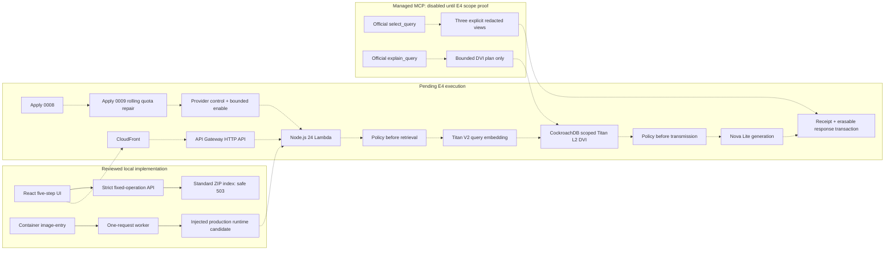

# Continuity hackathon architecture

**Current label:** local implementation tested; container-image composition is a committed, sealed
local-source candidate whose image remains unbuilt; live execution and deployment remain unexecuted.

Solid arrows are implemented local boundaries. Dashed arrows are the intended E4 route and must
not be presented as live until the [submission checklist](submission-checklist.md) is complete.

## Governed data flow

1. The server mints the opaque session; the browser never chooses tenant or content.
2. Retrieval policy authorizes the exact fixed question before Titan or CockroachDB.
3. One scoped transaction returns authorized bodies and restricted ID-only metadata separately.
4. Transmission policy binds the exact context, active revisions, deletion fence, model, region,
   and destination before Nova.
5. The answer is released only after CockroachDB rechecks the snapshot and commits receipt,
   lineage, and separately erasable response payload.
6. Correction atomically erases the superseded synthetic row body/vector, creates revision 2, and
   records content-free lineage.

## Nonclaims

The diagram does not claim a built or committed image, deployed stack, applied migration `0008` or
`0009`, enabled provider, DVI selection, Bedrock call, Managed MCP isolation, public URL, telemetry,
latency, cost, authentication, queue worker, production erasure, or production readiness. Each
requires executed evidence, not diagram arrows.
