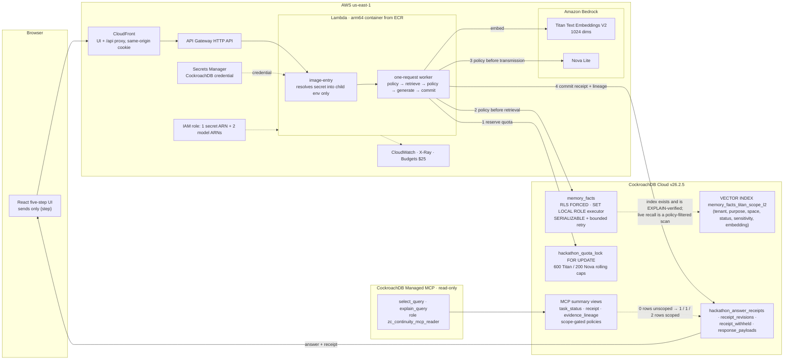

# Fenced — hackathon architecture

**Verified live on 2026-08-17.** All five steps return `200` on the public CloudFront and API
Gateway origins; receipts show two recalled revisions and one reference withheld by sensitivity
policy; the correction moves the launch-day fact from revision 1 to revision 2. Migrations
`0001`–`0010` are applied to CockroachDB Cloud v26.2.5.

Solid arrows are the live request path exercised by the demo. Dashed arrows are relationships that
are real but not on the per-request path (index provenance, Managed MCP read scope, IAM binding).

## Receipt flow

- **recalled** — `(fact_id, revision)` pairs actually shown to Nova Lite.
- **withheld** — `(fact_id, revision, reason)`; the body never leaves CockroachDB.
- **lineage** — revision `r → r+1` recorded id-only at `correct`; the superseded body and vector are
  erased.

## What is and is not on the live path

| Component | On the per-request path | Notes |
| --- | --- | --- |
| Row-level security, `SET LOCAL ROLE`, `SERIALIZABLE` retry | Yes | Every step |
| DB-enforced provider quota (`FOR UPDATE`) | Yes | Before any Bedrock call |
| Vector index `memory_facts_titan_scope_l2` | **No** | Real and `EXPLAIN`-verified under an operator identity that bypasses RLS. CockroachDB cannot combine a vector-index scan with an RLS policy on the same relation (`FORCE_INDEX` → `42809`, `NO_FULL_SCAN` → `XXUUU`), so live recall runs as a policy-filtered ordered scan. The policy was kept; the hint was dropped. |
| Managed MCP summary views | No (agent-facing, not request-facing) | Reader sees zero rows until it binds `continuity.tenant_id` and `continuity.server_purpose` via `set_config`. |
| Secrets Manager | Yes | Resolved by `asm-exec` into the child process environment; the handler never sees the value. |

## Non-claims

No authentication, no real users, no multi-region runtime, no second provider, no autonomous
tools, no production erasure design beyond the synthetic schema, and no claim that live recall
uses the vector index.
